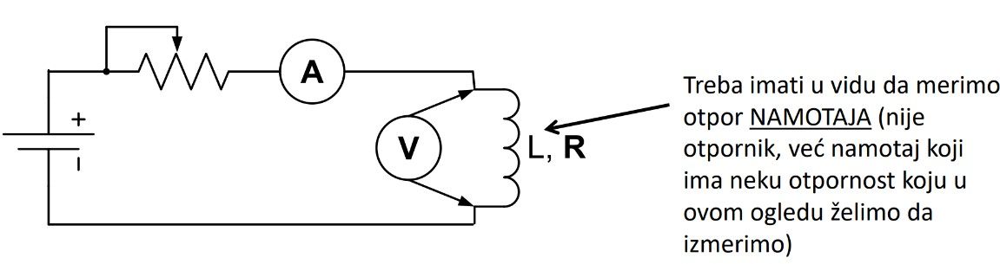
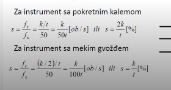

# Tema 0 — Kako izgleda II deo ispita i šta se od tebe očekuje

## Zašto se ovo pita

II deo ispita iz Električnih mašina 3 nije klasičan računski ispit, a nije ni čista teorija. To je ispit iz **merenja na električnim mašinama**: dobiješ konkretnu mašinu sa natpisne pločice (transformator, asinhroni motor, sinhroni generator) i od tebe se traži da se ponašaš kao inženjer u laboratoriji — da izabereš opremu, nacrtaš šemu, opišeš postupak korak po korak i **procenu izvedeš do broja** (vreme, granice merenja, temperatura). Profesor pita ono što priča na predavanjima: svaki naglasak iz beležaka (u ovoj skripti izvučen kao pravilo palca) jeste potencijalno pitanje ili potencijalni poen.

> **Prevod na običan jezik:** Ne traži se od tebe da izvodiš duge teorijske dokaze, nego da pokažeš da bi umeo da uđeš u laboratoriju sa tom mašinom i da je izmeriš — bezbedno, ispravnim redosledom, ispravnim instrumentima i sa realnom procenom brojki. Svako pitanje se osvaja istom formulom: **šema + obrazložen izbor opreme + redosled postupka + brojčana procena.**

Ovo uvodno poglavlje radi dve stvari: (1) analizira stvarne ispitne primere i izvlači obrasce — da tačno znaš šta te čeka; (2) daje **osnove koje svako naredno poglavlje pretpostavlja**: merni instrumenti (kretni kalem, meko gvožđe), klasa tačnosti, merni transformatori i izvori napajanja. Bez ovih osnova nijedan „izbor opreme" na ispitu ne možeš da obrazložiš.

---

## Format ispita — analiza tri ispitna primera

Na raspolaganju imamo tri stvarna primera: **predrok od 22. januara 2023** (5 pitanja), **ispit od 8. septembra 2023** (4 pitanja) i **listu primera pitanja za vežbu** (6 pitanja). Uporedimo ih:

| # | Predrok, 22. 1. 2023. | Ispit, 8. 9. 2023. | Tema (poglavlje skripte) |
|---|---|---|---|
| 1 | UI metoda: otpor namotaja transformatora 10 kVA; 1000/100 V/V — oprema, šema, postupak, **procena vremena do tačnog očitavanja** | identično | Merenje otpornosti namotaja (UI metoda) |
| 2 | Tahogenerator 15/1000 V/(o/min) na motoru 2970 o/min — postupak, izbor instrumenta, **granice stvarne brzine za „tipičnu" klasu tačnosti** | identično, ali je klasa tačnosti **zadata: 0,2** | Merenje brzine obrtanja |
| 3 | Provera izolacije **indukovanim naponom** VN transformatora — šema, postupak | identično | Provera dielektrične čvrstoće |
| 4 | Ogled zaustavljanja sinhronog generatora 18,5 kVA — izbor pogonske mašine, određivanje momenta inercije, **procena vremena zaustavljanja kratko spojenog generatora** | identično, ali **bez** procene vremena zaustavljanja | Ogled zaustavljanja |
| 5 | Ogled zagrevanja transformatora iz pitanja 1 — svrha, izvođenje, **temperatura namotaja iz porasta otpornosti (120 % i 130 %)** | — (ispit ima 4 pitanja) | Ogled zagrevanja |

Pitanja za vežbu pokrivaju iste teme sa drugim mašinama: UI metoda na **sinhronom generatoru 160 kVA; Y; 415 V** (tri namotaja!), ogledi zaustavljanja za istu mašinu, **merenje otpora izolacije** monofaznog transformatora, merenje klizanja **probnim namotajem** (kavezna mašina), tahogeneratori uopšte, i određivanje **neutralne zone** motora jednosmerne struje.

### Obrasci koje moraš uočiti

1. **UI metoda je UVEK prvo pitanje.** U sva tri izvora merenje otpornosti namotaja UI metodom otvara ispit. To je „sigurnih" 20 % ispita koje moraš znati napamet: šema (izvor–prekidač–predotpor–ampermetar–namotaj, voltmetar prislonjen), postupak sa ispravnim redosledom uklapanja/isklapanja i procena vremena smirivanja preko $\tau = L/R$.
2. **Svako pitanje traži isti četvorodelni odgovor:** izbor opreme (sa opsegom i klasom), šemu, numerisan postupak i brojčanu procenu. Nijedno pitanje se ne završava rečenicom — svako se završava brojem ili šemom.
3. **Mašine se recikliraju kroz ispit.** Transformator iz pitanja 1 vraća se u pitanju 5 (ogled zagrevanja koristi otpornost izmerenu u pitanju 1). Uradi pitanje 1 pažljivo — njegovi rezultati su ulaz za kasnija pitanja.
4. **Ispit je „blaža" verzija predroka.** Septembarski ispit ima ista pitanja, ali: klasa tačnosti je zadata (0,2) umesto da je sam biraš, i izostavljen je najteži podzadatak (vreme zaustavljanja). Ako savladaš predrok, ispit je podskup.
5. **Prvi korak svakog zadatka je natpisna pločica.** Iz nje se računa nominalna struja, a iz nje struja ogleda, opsezi instrumenata i sve ostalo. Profesorove pločice su konzistentne — npr. za generator iz pitanja 4: $\sqrt{3}\cdot 400\ \mathrm{V}\cdot 26{,}7\ \mathrm{A} \approx 18{,}5\ \mathrm{kVA}$ — pa uvek možeš (i treba) da proveriš sopstveno čitanje podataka.
6. **Procene idu do broja.** Primer iz pitanja 5: iz porasta otpornosti na 120 % i 130 % vrednosti merene na 20 °C, preko bakarne formule $\frac{R_2}{R_1}=\frac{235+\theta_2}{235+\theta_1}$, dobijaju se temperature namotaja **71,0 °C** i **96,5 °C**. Odgovor „temperatura se povećala" ne nosi poene — broj nosi poene.

---

## Strategija odgovaranja — šta ispitivač boduje

Ispitivač boduje četiri stvari, i to su tačno četiri dela tvog odgovora:

**1. Šema.** Uredna, sa svim elementima, sa imenima elemenata i sa detaljima koji pokazuju razumevanje: prekidač pre predotpora, predotpor u kolu, voltmetar nacrtan **sa strelicama** (nije fiksan element — samo se prislanja). Šema koja se očekuje na ispitu za pitanje 1 izgleda ovako:

**Slika —** Merna šema UI metode kakva se očekuje na ispitu: jednosmerni izvor (akumulator), promenljivi predotpor, ampermetar na red, voltmetar prislonjen na priključke namotaja. Napomena sa slike: merimo otpor **namotaja** — to nije otpornik, već namotaj koji ima i induktivnost $L$ pored otpornosti $R$.

> **Kako čitati šemu:** Krajnje levo je jednosmerni izvor (baterija/akumulator, oznaka + i −). Struja iz izvora prolazi kroz **promenljivi predotpor** (otpornik sa strelicom — njime se udešava struja merenja i smanjuje vremenska konstanta kola), zatim kroz **ampermetar A** (na red — kroz njega teče ista struja kao kroz namotaj), pa u **namotaj** (nacrtan kao kalem, označen $L, R$ — to je ono što merimo). **Voltmetar V** je nacrtan sa dve strelice ka priključcima namotaja: to znači da se on samo *prislanja* paralelno namotaju — poslednji se umeće u kolo i prvi se isključuje, jer bi ga pri prekidanju kola naponski impuls $L\,di/dt$ prvi uništio. Na ispitnoj verziji šeme docrtaj još i **prekidač** između izvora i predotpora.

**2. Obrazložen izbor opreme.** Ne „uzmem voltmetar", nego: *koji* voltmetar (sa kretnim kalemom, jer merimo jednosmernu veličinu), *kog opsega* (procenjen očekivani napon $U = R_{mer} \cdot I_{mer}$, pa prvi standardni opseg iznad toga), *koje klase* (npr. 0,5 za laboratorijsko merenje). Isto za ampermetar (5–10 % nominalne struje), izvor (akumulator — bez talasnosti), predotpor (najveća vrednost na početku).

**3. Redosled postupka.** Numerisani koraci, i to *ispravnim* redosledom. Kod UI metode redosled uklapanja i isklapanja je posebno bodovan: predotpor na maksimum → uklopi prekidač → udesi struju → sačekaj 3–5 vremenskih konstanti → prisloni voltmetar → **istovremeno** očitaj A i V → **prvo odvoji voltmetar** → predotpor na maksimum → prekini kolo. Zamena redosleda poslednja tri koraka je greška koja se pamti.

**4. Brojčana procena.** Svaki zadatak ima „proceni što tačnije" deo: vreme (preko $3\text{–}5\,\tau$), granice merenja (preko klase tačnosti), temperaturu (preko bakarne formule), vreme zaustavljanja (preko Njutnove jednačine). Za procenu su dozvoljene inženjerske pretpostavke (raspodela gubitaka, $\cos\varphi$) — ali ih moraš **eksplicitno navesti i obrazložiti**.

### Anatomija punog odgovora (šablon za svako pitanje)

1. Prepiši podatke sa natpisne pločice; izračunaj **nominalnu struju** relevantnog namotaja (skoro uvek prvi račun). Primer: transformator 10 kVA; 1000/100 V/V ima $I_{1n} = \frac{10\,000}{1000} = 10\ \mathrm{A}$, $I_{2n} = \frac{10\,000}{100} = 100\ \mathrm{A}$; generator 160 kVA, 415 V, Y ima $I_n = \frac{160\,000}{\sqrt{3}\cdot 415} \approx 222{,}6\ \mathrm{A}$.
2. Izaberi metodu/ogled i u jednoj rečenici reci **zašto baš ta** (npr. naponski spoj, jer voltmetar tada meri tačno napon na namotaju).
3. Nacrtaj šemu (uredno, svi elementi imenovani, strelice gde element nije fiksan).
4. Izbor opreme **sa brojevima**: vrsta instrumenta, opseg, klasa; izvor; merni transformatori ako naponi/struje prelaze granice direktnog merenja.
5. Postupak — numerisani koraci, sa bezbednosnim detaljima (redosled, uzemljenje, kratko spajanje).
6. Brojčana procena sa uvrštavanjem i jedinicama, do konačnog broja.

---

## Osnove 1 — Merni instrumenti: kretni kalem i meko gvožđe

Na ovom ispitu se podrazumevaju analogni (kazaljkasti) instrumenti, i to dve vrste:

**Instrument sa kretnim kalemom** (pokretnim kalemom). Kalem kroz koji teče merena struja nalazi se u polju stalnog magneta; momenat na kalem je proporcionalan struji, pa je skretanje kazaljke proporcionalno **srednjoj vrednosti** struje. Zato je kretni kalem instrument za **jednosmerne veličine** — na čistoj naizmeničnoj struji srednja vrednost je nula i kazaljka miruje (za merenje naizmeničnih veličina kretnom kalemu se dodaje ispravljač, ali to na ovom ispitu ne koristimo). Beleške ovo naglašavaju kao pravilo: *„Analogni instrument koji koristimo jeste sa kretnim kalemom jer je on za jednosmerne veličine"* — dakle za **UI metodu (jednosmerna struja iz akumulatora) uvek kretni kalem**, i za tahogenerator (jednosmerni generator) takođe kretni kalem.

**Instrument sa mekim gvožđem.** Umesto kalema, komad mekog gvožđa se uvlači u polje nepokretnog kalema; sila je proporcionalna **kvadratu** struje, pa skretanje ne zavisi od smera struje — instrument sam „ispravlja" i meri **efektivnu vrednost**. Radi i na jednosmernoj i na naizmeničnoj struji, i standardni je pogonski instrument za naizmenična merenja.

Razlika „ko ispravlja" ima i jednu vrlo konkretnu ispitnu posledicu kod merenja klizanja preko oscilacija kazaljke (rotorski napon male učestanosti $f_r$): **kretni kalem u jednoj periodi ode u plus pa u minus — pravi 1 impuls po periodi; meko gvožđe ode dva puta u plus (jer ispravlja) — pravi 2 impulsa po periodi.** Ako brojiš impulse, moraš znati kojim instrumentom brojiš:

**Slika —** Klizanje iz brojanja impulsa kazaljke: za instrument sa pokretnim kalemom $s = \frac{f_r}{f_s} = \frac{k/t}{50} = \frac{k}{50\,t}$, a za instrument sa mekim gvožđem $s = \frac{(k/2)/t}{50} = \frac{k}{100\,t}$, gde je $k$ broj izbrojanih impulsa za vreme $t$.

> **Kako čitati šemu:** Gornji red važi za kretni kalem: on daje 1 impuls po periodi rotorskog napona, pa je učestanost rotora $f_r = k/t$ (impulsa u sekundi), a klizanje je $s = f_r/f_s$ sa $f_s = 50\ \mathrm{Hz}$. Donji red važi za meko gvožđe: ono daje 2 impulsa po periodi, pa broj impulsa treba prepoloviti — $f_r = (k/2)/t$ — i zato se u imeniocu pojavljuje 100 umesto 50. Detaljna primena je u poglavlju o merenju klizanja; ovde pamti princip: **meko gvožđe ispravlja → duplo više impulsa.**

---

## Osnove 2 — Klasa tačnosti i izbor opsega

**Klasa tačnosti** instrumenta je broj (tipične vrednosti: 0,1; 0,2; 0,5; 1; 1,5; 2,5; 5) koji kaže kolika je **maksimalna apsolutna greška instrumenta, izražena u procentima OPSEGA** — ne očitane vrednosti! Klase 0,1–0,5 su precizni (laboratorijski) instrumenti, klase 1–5 pogonski.

$$\Delta X_{max} = \frac{\text{klasa}}{100} \cdot X_{opseg}$$

Ta apsolutna greška je **ista bilo gde na skali**. Posledica: relativna greška očitavanja

$$\delta = \frac{\Delta X_{max}}{X_{očitano}} = \frac{\text{klasa}}{100}\cdot\frac{X_{opseg}}{X_{očitano}}$$

je najmanja kada je kazaljka pri vrhu skale, a raste što je skretanje manje. Primer (proveren računom): voltmetar klase 0,5 na opsegu 100 V ima $\Delta U = \frac{0{,}5}{100}\cdot 100 = 0{,}5\ \mathrm{V}$ svuda na skali; ako očitavaš 90 V, relativna greška je $\frac{0{,}5}{90} \approx 0{,}56\ \%$, a ako očitavaš 20 V — čak $\frac{0{,}5}{20} = 2{,}5\ \%$. Odatle **pravilo izbora opsega: biraj najmanji standardni opseg koji je veći od očekivane merene vrednosti, tako da skretanje bude u gornjoj trećini (bar gornjoj polovini) skale.** Zato u svakom zadatku prvo proceniš očekivanu vrednost (npr. $U = R_{mer}\cdot I_{mer}$ kod UI metode), pa tek onda biraš opseg.

Beleške naglašavaju i gde ova priča ulazi u ispit: *„Tačnost ovog merenja zavisi od instrumenta najviše, zbog klase tačnosti instrumenta"* — to je rečenica koju ispitivač očekuje kod pitanja o tahogeneratoru.

### Mini-demonstracija na stvarnom ispitnom pitanju

Pitanje 2 sa ispita (8. septembar 2023): *„Asinhronom motoru 100 kW, 400 V, 2970 o/min se eksperimentalno određuje nominalna brzina obrtanja. Za te potrebe se koristi tahogenerator konstante 15/1000 V/(o/min). … Ukoliko je reč o instrumentu sa klasom tačnosti 0,2, odrediti granice u kojima se nalazi stvarna vrednost merene brzine."*

Skica primene pravila (kompletno rešenje je u poglavlju o merenju brzine):

1. Očekivani napon tahogeneratora: $U = c \cdot n = \frac{15}{1000}\ \tfrac{\mathrm{V}}{\mathrm{o/min}} \cdot 2970\ \mathrm{o/min} = 44{,}55\ \mathrm{V}$.
2. Izbor opsega: prvi standardni opseg iznad 44,55 V je **60 V** (skretanje na $\approx 74\ \%$ skale — dobra gornja trećina); instrument: voltmetar sa kretnim kalemom (jednosmerni napon).
3. Klasa 0,2: $\Delta U = \frac{0{,}2}{100}\cdot 60\ \mathrm{V} = 0{,}12\ \mathrm{V}$.
4. Prevod u brzinu: $\Delta n = \frac{\Delta U}{c} = \frac{0{,}12}{0{,}015} = 8\ \mathrm{o/min}$, pa je stvarna brzina u granicama $n = 2970 \pm 8\ \mathrm{o/min}$, tj. **od 2962 do 2978 o/min**.
5. Za predrok („tipična klasa tačnosti") razumno je uzeti laboratorijsku klasu 0,5 — tada $\Delta U = 0{,}3\ \mathrm{V}$ i $\Delta n = 20\ \mathrm{o/min}$, granice **2950–2990 o/min**. (Napomena: granice zavise od izabranog opsega — to je deo obrazloženja koji se boduje. Standardni niz opsega koji koristimo u poglavlju o merenju brzine je 1,5–3–7,5–15–30–60–150–300 V; neki instrumenti dolaze iz drugog niza opsega, npr. 5–10–25–50–100–250 V — sa opsegom 50 V i klasom 0,2 dobilo bi se $\Delta n \approx 6{,}7\ \mathrm{o/min}$ — pa konačne granice zavise od konkretno dostupnog instrumenta.)

---

## Osnove 3 — Merni transformatori

Direktno (bez mernih transformatora) merimo samo napone **do 1000 V** i struje **do 6 A**. Preko toga:

- **Poluindirektno merenje**: napon merimo direktno, a **struju preko strujnih mernih transformatora**.
- **(Skroz) indirektno merenje**: i napon i struju merimo preko mernih transformatora — obavezno za napone **preko 1000 V**.

Profesorov naglasak koji se lako previdi: **na visokonaponskim merenjima struja se UVEK meri preko strujnih mernih transformatora, čak i ako je manja od 6 A** — jer instrument ne sme biti galvanski vezan na visok napon. Za vrlo visoke napone se umesto naponskog mernog transformatora koristi **kapacitivni razdelnik**.

### Naponski merni transformator

- Vezuje se **otočno** (paralelno), kao voltmetar. Prenosni odnos se bira tako da na sekundaru bude **100 V** (ili $100/\sqrt{3}\ \mathrm{V} \approx 57{,}7\ \mathrm{V}$ — kada se više sekundara vezuje na red).
- **Jednopolno izolovani**: samo jedan priključak se vezuje na visok napon, drugi je praktično uzemljen — meri **fazni napon**.
- **Dvopolno izolovani**: priključci se vezuju između dve faze — meri **linijski napon**.
- Pored greške prenosnog odnosa ima i **faznu grešku** (bitna kod merenja snage).
- Pri tropolnom kratkom spoju u mreži naponski MT **nije ugrožen** — otočno je vezan, samo mu se promeni napon između priključaka.
- Primer preračunavanja: MT 10 000/100 V/V ima prenosni odnos $k_U = 100$; ako voltmetar na sekundaru pokaže 97 V, napon na primaru je $97 \cdot 100 = 9700\ \mathrm{V}$.

### Strujni merni transformator

- Vezuje se **na red** (redno), kao ampermetar — to je **strujom pobuđen** transformator: primaru je struja *forsirana* iz kola, a u normalnom radu važi (približna) **jednakost magnetopobudnih sila** primara i sekundara, i ona je veoma mala.
- **Sekundar strujnog MT ne sme NIKADA biti otvoren; poželjno je da bude kratko spojen.** Zašto: primaru je struja forsirana; ako sekundar otvorimo, nema sekundarne magnetopobudne sile da je poništi, pa celokupna (velika) magnetopobudna sila primara tera magnetno kolo u **duboko zasićenje** — transformator radi kao u „praznom hodu" sa forsiranom strujom, na otvorenom sekundaru se indukuju opasni naponi i gvožđe se pregreva. Ovo je jedno od pitanja koja se podrazumevaju — **mora da se zna**.
- Ako na sekundar vežemo impedansu (ampermetar, releje), **struja sekundara se ne menja** — diktirana je prenosnim odnosom — menja se samo napon na sekundaru.
- Sekundari su standardno **5 A ili 1 A**: 5 A za postrojenja do 38 kV, preko toga 1 A (izbor ima veze sa veličinom postrojenja — kod velikih postrojenja vodovi od MT do instrumenata su dugi, pa manja sekundarna struja znači manje padove i manje opterećenje MT; ovo obrazloženje je inženjerska dopuna beležaka).
- Pri tropolnom kratkom spoju kroz strujni MT prođe **ogromna struja** (redno je vezan) — zato strujni MT služi i za **pobuđivanje releja i prekidača** (zaštitu), ne samo za merenje.
- Primer preračunavanja: MT 150/5 A/A ima $k_I = 30$; ako ampermetar pokaže 4,2 A, struja primara je $4{,}2 \cdot 30 = 126\ \mathrm{A}$.

> **Prevod na običan jezik:** Naponski MT je „produženi voltmetar" — visi paralelno i ništa mu ne smeta; strujni MT je „produženi ampermetar" — sedi u rednoj grani, kroz njega prolazi sve što prolazi kroz vod (i kratki spojevi), i jedino što ga može uništiti jeste da mu neko ostavi sekundar otvoren.

---

## Osnove 4 — Izvori napajanja

**Svi izvori koje koristimo na ispitivanjima su naponski kontrolisani izvori** (zadaju napon; struja se uspostavlja prema kolu). Za pojedine oglede biraju se ovako:

- **Za UI metodu: hemijski izvor — akumulator (ako nije zadato drugačije, 12 V) ili baterija.** Razlog je ključni ispitni poen: izvor mora biti **konstantan, bez talasnosti**. Ispravljač se **ne sme** koristiti, jer njegova talasnost „probudi" induktivnost namotaja ($u_L = L\,di/dt \ne 0$), pa voltmetar više ne meri samo pad na otpornosti — merenje je pogrešno. Akumulator daje idealno glatku jednosmernu struju.
- **Namotaju se ne sme dovesti jednosmerni napon reda veličine naizmeničnog radnog napona.** U naizmeničnom radu struju ograničava impedansa ($R + j\omega L$); na jednosmernom naponu ostaje samo malo $R$, pa bi i **12 V iz akumulatora moglo biti previše** — zato je **predotpor obavezan element**. On radi tri posla: (1) ograničava struju na bezbednu vrednost, (2) služi za **udešavanje struje** merenja, (3) povećava ukupno $R$ kola i time **smanjuje vremensku konstantu** $\tau = L/R$, pa se struja brže ustali. Primer (proveren računom): namotaj sa $L = 10\ \mathrm{H}$, $R = 5\ \Omega$ ima $\tau = 2\ \mathrm{s}$, pa se čeka $3\text{–}5\,\tau = 6\text{–}10\ \mathrm{s}$; sa predotporom od $45\ \Omega$ ukupno je $50\ \Omega$, $\tau = 0{,}2\ \mathrm{s}$, čekanje samo $0{,}6\text{–}1\ \mathrm{s}$. Kod velikih transformatora (veliko $L$, malo $R$) čekanje bez predotpora može biti **i po 10 minuta**.
- **Struja ogleda kod merenja otpornosti: 5–10 % nominalne struje.** Nominalna struja izaziva nominalne gubitke i greje namotaj — a merenje otpora podrazumeva poznatu (hladnu) temperaturu. Pri 5–10 % nominalne struje gubici su **100 do 400 puta manji** (jer $P \propto I^2$: $(1/0{,}1)^2 = 100$, $(1/0{,}05)^2 = 400$), pa je termički efekat zanemarljiv. Konkretno za ispitni transformator 10 kVA; 1000/100 V/V: struja ogleda za primar 0,5–1 A, za sekundar 5–10 A.
- **Za visokonaponske oglede** (dielektrična čvrstoća) izvor je poseban: transformator za podizanje napona, a povišena učestanost se pravi **motor-generator grupom** sa neusaglašenim brojem polova — detalji u poglavlju o proveri izolacije.

---

## Česte greške i zamke na ispitu

1. **Greška računata od očitane vrednosti umesto od opsega.** Klasa tačnosti daje apsolutnu grešku kao procenat OPSEGA. Voltmetar klase 0,2 na opsegu 60 V greši do 0,12 V — svejedno da li pokazuješ 10 V ili 55 V.
2. **Šema UI metode bez predotpora i prekidača, ili sa fiksno vezanim voltmetrom.** Predotpor i prekidač su obavezni; voltmetar se crta sa strelicama (prislonjen), jer se poslednji priključuje i prvi odvaja — inače pri prekidanju kola strada od impulsa $L\,di/dt$.
3. **Ispravljač kao izvor za UI metodu.** Talasnost ispravljača pobuđuje induktivnost namotaja i kvari merenje — izvor mora biti hemijski (akumulator/baterija).
4. **Otvoren sekundar strujnog mernog transformatora** (npr. u šemi „ostavljen za kasnije"). Sekundar mora biti zatvoren preko instrumenta ili kratko spojen — inače duboko zasićenje i opasni naponi.
5. **Merenje otpornosti nominalnom strujom.** Namotaj se greje, otpornost raste u toku merenja — struja ogleda je 5–10 % nominalne.
6. **Odgovor bez broja.** Svako pitanje ima „proceniti" deo; odgovor koji stane na kvalitativnom opisu ostavlja poene na stolu. Pretpostavke su dozvoljene ako ih navedeš i obrazložiš.

---

## Rečnik pojmova

| Pojam | Značenje |
|---|---|
| UI metoda | Merenje otpornosti namotaja jednosmernom strujom: izmeri se $U$ i $I$ istovremeno, $R = U/I$ (najprostija primena Omovog zakona); najbolja metoda za otpor namotaja. |
| Strujni spoj | Varijanta UI metode „ampermetar pre voltmetra": voltmetar meri zbir padova na ampermetru i namotaju — struja tačna, napon netačan; dobar samo za velike otpore. |
| Naponski spoj | Varijanta „voltmetar pre ampermetra": voltmetar meri tačno napon namotaja, ampermetar meri i malu struju kroz voltmetar; koristi se za male otpore namotaja. |
| Predotpor | Promenljivi otpornik na red u kolu UI metode: ograničava i udešava struju merenja i smanjuje vremensku konstantu $\tau = L/R$. |
| Kretni kalem | Analogni instrument za jednosmerne veličine (skretanje ∝ srednjoj vrednosti struje); 1 impuls po periodi naizmeničnog signala. |
| Meko gvožđe | Analogni instrument koji meri efektivnu vrednost (skretanje ∝ kvadratu struje) — „ispravlja", pa pravi 2 impulsa po periodi. |
| Klasa tačnosti | Maksimalna apsolutna greška instrumenta u procentima opsega; tipične klase 0,1–0,5 (precizne) i 1–5 (pogonske). |
| Opseg | Puna skala instrumenta; bira se tako da očitavanje bude u gornjoj trećini skale (mala relativna greška). |
| Merni transformatori | Naponski i strujni transformatori koji svode visoke napone/struje na nivo instrumenata (100 V, odn. 5 A ili 1 A). |
| Poluindirektno merenje | Napon se meri direktno, struja preko strujnog mernog transformatora. |
| Indirektno merenje | I napon i struja se mere preko mernih transformatora (obavezno preko 1000 V). |
| Jednopolno izolovan NMT | Naponski MT vezan jednom tačkom na visok napon (druga uzemljena) — meri fazni napon. |
| Dvopolno izolovan NMT | Naponski MT vezan između dve faze — meri linijski napon. |
| Prenosni odnos | Odnos primarne i sekundarne veličine MT; množi se sa očitavanjem da se dobije stvarna vrednost. |
| Tahogenerator | Mali jednosmerni generator sa konstantnom pobudom (stalni magneti) na vratilu mašine; indukovani napon ∝ brzini. |
| Konstanta tahogeneratora | Koliko volti se indukuje na 1000 o/min (npr. 15/1000 V/(o/min)). |
| Ogled zaustavljanja | Mašina se zaleti ~10 % iznad nominalne brzine, isključi i pusti da se zaustavlja; iz krive usporavanja se određuju momenat inercije i gubici. |
| Ogled zagrevanja | Provera da li mašina u nominalnoj radnoj tački ostaje u granicama termičke klase izolacije; temperatura namotaja i iz porasta otpornosti. |
| Probni namotaj | Točak velikog prečnika obmotan tankom žicom (indukcioni kalem) koji hvata rasuti fluks — merenje klizanja kaveznih mašina. |
| Megaommetar | Instrument za otpor izolacije: precizan merač (mikro)struje pri preciznom jednosmernom naponu (tipično 500 V, 1 minut). |
| Vremenska konstanta | $\tau = L/R$; struja se posle uklapanja ustali za 3–5 τ — tek tada se sme očitavati. |
| Bakarna formula | $\frac{R_2}{R_1} = \frac{235+\theta_2}{235+\theta_1}$ — temperatura namotaja iz porasta otpornosti (konstanta 235 za bakar). |

---

## Kontrolna pitanja za samoproveru

1. **Kojim se instrumentom mere veličine u UI metodi i zašto?** — Instrumentom sa kretnim kalemom, jer je on za jednosmerne veličine (skretanje ∝ srednjoj vrednosti).
2. **Kolika je maksimalna apsolutna greška voltmetra klase 0,5 na opsegu 60 V i zavisi li od očitavanja?** — $0{,}005 \cdot 60 = 0{,}3\ \mathrm{V}$, ista bilo gde na skali.
3. **Zašto sekundar strujnog mernog transformatora ne sme biti otvoren?** — Primaru je struja forsirana; bez sekundarne MPS magnetno kolo ode u duboko zasićenje, pa nastaju opasni indukovani naponi i pregrevanje.
4. **Šta je poluindirektno, a šta indirektno merenje?** — Poluindirektno: napon direktno, struja preko strujnog MT; indirektno: obe veličine preko MT (obavezno preko 1000 V). 
5. **Koji izvor za UI metodu i zašto ne ispravljač?** — Akumulator/baterija (hemijski izvor bez talasnosti); talasnost ispravljača pobuđuje induktivnost namotaja i unosi grešku.
6. **Koliko impulsa po periodi pravi meko gvožđe, a koliko kretni kalem?** — Meko gvožđe 2 (ispravlja), kretni kalem 1.
7. **Kolika je struja ogleda pri merenju otpornosti namotaja i zašto?** — 5–10 % nominalne; gubici su tada 100–400 puta manji, pa nema zagrevanja koje bi menjalo otpornost.
