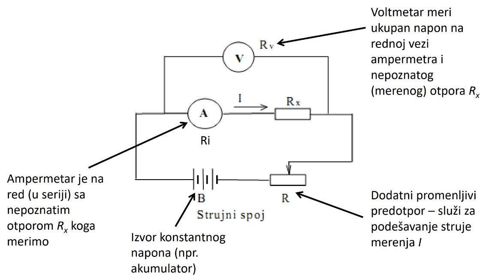
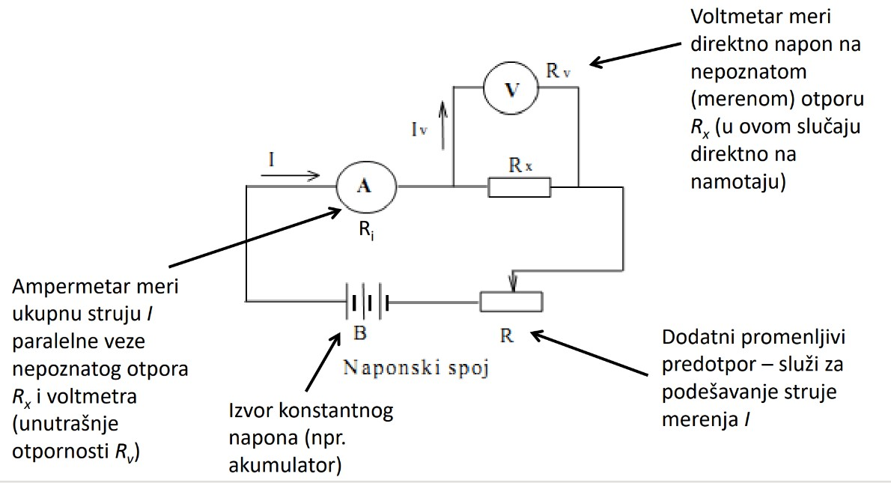

# Tema 1 — Merenje otpora namotaja UI metodom

## Zašto se ovo pita

Ovo je **prvo pitanje na SVAKOM ispitu** — na predroku 22. januara 2023. i na ispitu 8. septembra 2023. tekst pitanja 1 je bio doslovno isti. Merenje otpora namotaja je i prvo ispitivanje koje se izvodi na svakoj mašini (zajedno sa proverom izolacije), pa profesor s pravom traži da se ovo zna do detalja: **oprema** (koji instrumenti, koji opsezi, koja klasa, koji izvor), **šema** (naponski spoj sa predotpornikom i prekidačem), **postupak** (tačan redosled poteza, uključujući to da voltmetar nije fiksan) i **procena vremena** smirivanja prelazne pojave preko vremenske konstante $\tau = L/R$. Iz beležaka: *„Zašto se koristi naponski a ne strujni spoj, koliki jednosmerni napon sme da se dovede namotaju — MORA DA SE ZNA."* Rezultat ovog merenja se, uz to, direktno koristi u pitanju 5 (ogled zagrevanja — određivanje temperature namotaja preko skoka otpornosti), pa greška ovde povlači grešku i tamo.

> **Prevod na običan jezik:** Namotaj mašine je dugačka bakarna žica čiji je otpor vrlo mali (od miliom­a do nekoliko oma). Merimo ga tako što kroz njega pustimo malu, konstantnu jednosmernu struju iz akumulatora, istovremeno očitamo struju (ampermetrom) i napon na priključcima namotaja (voltmetrom) i podelimo ih: $R = U/I$ — najprostija primena Omovog zakona. Kvaka je u tome što namotaj nije čist otpornik nego kalem (RL kolo): posle uključenja struja se uspostavlja eksponencijalno i mora se sačekati 3–5 vremenskih konstanti pre očitavanja. Kod transformatora je induktivnost ogromna, pa se čekanje skraćuje pre svega predotpornikom; kratkospajanje drugog namotaja munjevito smiruje struju i prigušuje naponske udare, ali samo očitavanje i tada traži strpljenje (vidi 1.9).

---

## Teorija — sve što moraš znati

### 1.1 Čemu služi merenje otpora namotaja

Prva ispitivanja koja se izvode na mašini su **merenje otpornosti namotaja** i **provera izolacije namotaja** — tek na osnovu ta dva merenja znamo da li je bezbedno priključiti mašinu na napajanje (može da se desi da je izolacija ispravna, a namotaj u prekidu — zato se proverava oboje). Konkretne svrhe merenja otpora namotaja:

1. **Dijagnostika prekida** — ako je namotaj u prekidu, izmerićemo beskonačan otpor; međuzavojni kratak spoj daje osetno manji otpor od očekivanog.
2. **Provera simetrije po fazama** — kod trofaznih mašina merimo sve tri faze; ne možemo očekivati identične vrednosti, ali odstupanja moraju biti u nekoj toleranciji (tipično do 2 %). Veće odstupanje jedne faze = sumnja na kvar.
3. **Pokazatelj zagrejanosti mašine** — otpor bakra raste sa temperaturom, pa poređenjem otpora u **hladnom stanju** (mašina dovoljno dugo van pogona, na temperaturi ambijenta) i u **toplom stanju** (odmah po isključenju iz pogona) određujemo srednju temperaturu namotaja:
   $$\frac{R_{\text{toplo}}}{R_{\text{hladno}}} = \frac{235 + \theta_{\text{toplo}}}{235 + \theta_{\text{hladno}}} \qquad (\text{konstanta } 235\ \text{za bakar}).$$
   *Odakle broj 235:* otpor bakra raste približno **linearno** sa temperaturom; kad se ta prava produži unazad, seče nulu na približno $-235\ \mathrm{^\circ C}$, pa je $R(\theta) \propto (235 + \theta)$ — ekvivalentno, temperaturski koeficijent bakra na 0 °C je $\alpha \approx 1/235\ \mathrm{K^{-1}}$. Količnik dva merenja zato eliminiše i nepoznati $R(0\ \mathrm{^\circ C})$ i $\alpha$. Za **aluminijumske** namotaje ista formula važi sa konstantom $\approx 225$ (laka profesorska varijacija!).
   Time proveravamo da li je mašina u svojoj **temperaturnoj klasi**. Što je mašina manja, to je ovako izmerena srednja temperatura bolji reprezent stvarne temperature u mašini. Ako merimo više vrednosti tokom hlađenja, možemo nacrtati krivu zagrevanja/hlađenja i odrediti termičke vremenske konstante.
4. **Merenje gubitaka** u namotajima ($P_{Cu} = R I^2$) — može, ali *„to nam nije primarna svrha"* (profesorov naglasak!).

**Hladno stanje** = mašina nije bila u pogonu i dovoljno dugo je na sobnoj temperaturi (otpor je na temperaturi ambijenta, koju obavezno zabeležimo termometrom). Merenje i u hladnom i u toplom stanju radimo zato da nam uopšte ne treba otpor na 0 °C — količnik dva merenja direktno daje temperaturu.

### 1.2 Zašto baš UI metoda (i zašto ne ommetar ili most)

Otpori mašinskih namotaja su **mali**: red veličine od **miliomima** (veliki transformatori i mašine — vidi rešeni zadatak: sekundar $\approx 22\ \mathrm{m\Omega}$) do **nekoliko oma** (mali transformatori i mašine — primar $\approx 2\ \mathrm{\Omega}$). Opcije:

| Metoda | Ocena |
|---|---|
| **Ommetar** | može samo kod **male mašine** i samo kao gruba pretpostavka; kod velike mašine (mali otpor) greši toliko da praktično ne može da meri. **Nikako za precizno merenje.** |
| **Merni mostovi** (Vitstonov; Tompsonov za male vrednosti) | pokrivaju širok raspon; Tompsonov je za male otpore, ali je **skup**. |
| **UI metoda** | **najbolja opcija** — najprostija primena Omovog zakona (profesorov naglasak!). |

Suština UI metode: uspostavimo **jednosmernu struju** kroz namotaj pomoću jednosmernog napona, **istovremeno** izmerimo struju i napon na priključcima namotaja, podelimo ih i dobijemo (približno) traženu vrednost:
$$R_x \approx \frac{U}{I}.$$
„Približno" — jer ampermetar i voltmetar ne mogu istovremeno da mere *tačno* struju kroz namotaj i *samo* napon na njemu. Zato postoje dve tehnike (dve šeme): **strujni spoj** i **naponski spoj**.

### 1.3 Strujni spoj („ampermetar pre voltmetra")

**Slika —** Strujni spoj: izvor konstantnog napona $B$ (akumulator) i dodatni promenljivi predotpor $R$ u donjoj grani; u gornjoj grani redno ampermetar $A$ (unutrašnje otpornosti $R_i$) i nepoznati otpor $R_x$; voltmetar $V$ (otpornosti $R_v$) priključen je preko *cele* redne veze ampermetra i $R_x$.

> **Kako čitati šemu:** Struja $I$ iz akumulatora $B$ prolazi kroz predotpor $R$ (njime se podešava struja merenja), zatim kroz ampermetar i kroz $R_x$, pa nazad u izvor. Ampermetar je **na red (u seriji)** sa $R_x$, pa meri **tačno** struju kroz njega. Voltmetar **obuhvata i ampermetar i $R_x$**, pa meri **ukupan napon na njihovoj rednoj vezi** — dakle napon veći od stvarnog napona na $R_x$. (Otud i dva naizgled suprotna opisa iste šeme: *gledano od namotaja* ampermetar je „pre" voltmetra — bliži je namotaju; *gledano od izvora* tačka priključenja voltmetra je ispred ampermetra. Obe formulacije su tačne.)

Sistematska greška: voltmetar pokazuje $U = (R_i + R_x)\,I$, pa je
$$R_{\text{izmereno}} = \frac{U}{I} = R_x + R_i \quad\Rightarrow\quad \Delta R = +R_i, \qquad \frac{\Delta R}{R_x} = \frac{R_i}{R_x}.$$
Korekcija (ako se baš mora meriti ovako): od izmerene vrednosti **oduzeti poznatu unutrašnju otpornost ampermetra**, $R_x = U/I - R_i$.

**Strujni spoj NIJE dobar za merenje otpora namotaja**: u rednoj vezi su **dva mala otpora** (otpor ampermetra i otpor namotaja su uporedivi!) pa greška može biti ogromna. *„Ova šema je dobra za veliki otpor"* — tada je $R_i \ll R_x$ i sabirak $R_i$ ne smeta. Brojčano (podaci iz rešenog zadatka; $R_i \approx 0{,}1\ \mathrm{\Omega}$ i $R_i \approx 0{,}01\ \mathrm{\Omega}$ su **tipične pretpostavljene unutrašnje otpornosti** običnog laboratorijskog ampermetra odnosno ampermetra sa šantom): ampermetar sa $R_i \approx 0{,}1\ \mathrm{\Omega}$ na primaru ($R_1 = 2{,}19\ \mathrm{\Omega}$) unosi grešku od $\approx 4{,}6\ \%$, a šant-ampermetar sa $R_i \approx 0{,}01\ \mathrm{\Omega}$ na sekundaru ($R_2 = 21{,}9\ \mathrm{m\Omega}$) čak $\approx 46\ \%$ — neupotrebljivo. (*Šant* = mali paralelni otpornik kroz koji ide glavnina struje, pa kretni kalem meri samo poznati mali deo — tako se prave ampermetri za velike struje, npr. 10–25 A.)

### 1.4 Naponski spoj („voltmetar pre ampermetra") — OVAJ SE KORISTI

**Slika —** Naponski spoj: isti izvor $B$ i predotpor $R$; ampermetar $A$ je sada **ispred** paralelne veze voltmetra $V$ i merenog otpora $R_x$; voltmetar je priključen **direktno na $R_x$** (kod nas: direktno na priključke namotaja), a kroz njega teče mala struja $I_v$.

> **Kako čitati šemu:** Struja $I$ iz akumulatora kroz predotpor stiže do ampermetra; iza ampermetra se deli: glavni deo ide kroz namotaj $R_x$, a sitna struja curenja $I_v$ kroz voltmetar. Voltmetar meri **tačno** napon na namotaju (paralelno je vezan direktno na njegove priključke), ali ampermetar meri **zbir** dve struje: struje kroz namotaj i struje curenja kroz voltmetar.

Sistematska greška: ampermetar pokazuje $I = U/R_x + U/R_v$, pa je
$$R_{\text{izmereno}} = \frac{U}{I} = R_x \parallel R_v = \frac{R_x}{1 + R_x/R_v} \approx R_x\Big(1 - \frac{R_x}{R_v}\Big), \qquad \frac{\Delta R}{R_x} \approx -\frac{R_x}{R_v}.$$
Korekcija: $R_x = \dfrac{U}{I - U/R_v}$ (od izmerene struje oduzmemo izračunatu struju kroz voltmetar).

Unutrašnja otpornost voltmetra $R_v$ treba da **teži beskonačnosti**; analogni instrument ne može da se pobudi bez neke struje, ali je ona svakako mala. Pošto je kod namotaja $R_x$ reda $\mathrm{m\Omega}$–$\mathrm{\Omega}$, a $R_v$ reda $\mathrm{k\Omega}$, relativna greška $R_x/R_v$ je zanemarljiva. Odakle brojka za $R_v$: analogni voltmetar ima tipičnu karakteristiku $\sim 1000\ \mathrm{\Omega/V}$, pa na opsegu 3 V (izbor za primar u rešenom zadatku) ima $R_v \approx 3\ \mathrm{k\Omega}$ — greška $2{,}19/3000 \approx 0{,}07\ \%$. Za sekundar je greška reda $0{,}001$–$0{,}01\ \%$, zavisno od $R_v$ milivoltmetra: na malom opsegu i unutrašnja otpornost je mala (npr. $\sim 300\ \mathrm{\Omega}$ pri $1000\ \mathrm{\Omega/V}$ na opsegu 0,3 V daje $0{,}0219/300 \approx 0{,}007\ \%$) — svakako potpuno zanemarljivo. *„Mnogo je manja greška kod analognih merenja kada su male otpornosti, a kada su digitalni instrumenti* ($R_v \sim 10\ \mathrm{M\Omega}$) *skoro da nema greške."*

**Zaključak koji se MORA znati:** za namotaje (mali otpori) koristi se **naponski spoj**, jer je njegova greška $\sim R_x/R_v$ sićušna, dok bi greška strujnog spoja $\sim R_i/R_x$ bila katastrofalna. Praktični bonus: pošto voltmetar prislanjamo **direktno na priključke namotaja**, iz merenja su isključeni i otpori spojnih vodova i kontakata (koji su reda $\mathrm{m\Omega}$ — uporedivi sa merenim otporom!).

### 1.5 Izvor: akumulator — konstantan i bez talasnosti

Izvor **konstantnog napona je jako bitan**: *„ne smemo nikako koristiti ispravljač jer on ima talasnost; kada se nametne talasnost namotaju, probudiće se induktivnost"* — naizmenična komponenta bi na induktivnosti namotaja stvorila pad $\omega L \cdot I_{\sim}$, instrumenti bi merili nešto što nije čisto $R\,I$, i račun $U/I$ više ne bi davao otpor. Zato **hemijski izvor**: **akumulator ili baterija je najbolje**; ako u zadatku nije zadato, podrazumeva se **akumulator 12 V**.

**Koliki jednosmerni napon sme da se dovede namotaju?** (MORA DA SE ZNA!) U naizmeničnom režimu namotaj „trpi" svoj nazivni napon zato što se struji suprotstavlja **impedansa** $R + j\omega L$. Jednosmernoj struji se suprotstavlja **samo otpor** $R$ ($\omega = 0$, nema $j\omega L$!). Zato se namotaju **ne sme dovesti napon koji on trpi naizmenično** — sme samo napon reda
$$U_{=} = R_x \, I_{\text{mer}} \sim \text{volt ili manje}.$$
*„Čak 12 V iz baterije može da bude ogromno"*: na sekundar iz rešenog zadatka ($21{,}9\ \mathrm{m\Omega}$) direktno priključenih 12 V isteralo bi $I = 12/0{,}0219 \approx 547\ \mathrm{A} = 5{,}5 \times I_{2n}$ — uništenje namotaja. Zato je **predotpor obavezan**.

### 1.6 Struja merenja: 5–10 % nazivne

Struja ogleda bi *mogla* biti i nominalna, ali to **nije dobro jer remeti premisu merenja**: nominalna struja izaziva nominalne gubitke $R I_n^2$, namotaj počinje da se greje, otpor mu raste **tokom samog merenja** — merimo pokretnu metu. Zato: struja merenja mora biti toliko manja da se njen termički efekat zanemari. Pravilo:
$$I_{\text{mer}} = (5\text{–}10)\ \%\ I_n \quad\Rightarrow\quad P_{Cu,\text{mer}} = \Big(\frac{I_{\text{mer}}}{I_n}\Big)^2 P_{Cu,n} = \frac{1}{400}\text{–}\frac{1}{100}\ P_{Cu,n},$$
tj. gubici su **100 do 400 puta manji** od nominalnih (kvadriranje struje!) — zagrevanja praktično nema.

### 1.7 Predotpornik — tri uloge (obavezan element!)

**Dodatni promenljivi otpor (predotpor) je obavezan element šeme**, iz tri razloga:

1. **Zaštita namotaja** — obara napon izvora (12 V) na dozvoljeni nivo $R_x I_{\text{mer}}$ (tačka 1.5).
2. **Udešavanje struje merenja** na željenu vrednost 5–10 % $I_n$ (*„za udešavanje struje za neku vrednost je isto jako bitan predotpor!"*).
3. **Skraćivanje prelazne pojave** — povećava ukupnu otpornost kola (sve je redno vezano), pa **smanjuje vremensku konstantu** $\tau = L/R_{\text{uk}}$ (tačka 1.9).

Predotpornik mora biti dimenzionisan i po snazi: on troši $P = R_{\text{pred}} I_{\text{mer}}^2$ (u rešenom zadatku ~10 W na primaru, ali preko 100 W na sekundaru!).

### 1.8 Kako unapred proceniti otpor koji merimo i izabrati instrumente

Da bismo izabrali opsege, moramo **pre merenja proceniti** $R_x$. Procena ide **preko gubitaka**: iz nazivnih podataka nađemo ulaznu snagu i ukupne gubitke, pa gubitke rasporedimo pravilom palca iz beležaka:

- **Bilo koja mašina** (ako nema bližih podataka): $60\ \%$ Cu (namotaji), $30\ \%$ Fe (gvožđe), $10\ \%$ trenje i ventilacija.
- **Transformator**: $(70:30)$ ili $(60:40)$ za $(P_{Cu}:P_{Fe})$ — nema trenja i ventilacije. (U rešenom zadatku je odnos zadat: $5:1$.)
- **Asinhrona mašina i transformator**: gubici u bakru se dele **po 50 % na stator i rotor** (primar i sekundar) — jer su svedene otpornosti dobro projektovanih namotaja približno jednake, $R_2' \approx R_1$.
- **Sinhrona mašina**: svih 60 % ide na **stator**. **Mašina jednosmerne struje**: svih 60 % na **rotor**.
- **Pobudni namotaj**: pobuda troši $\approx 0{,}5\ \%$ ukupne snage mašine; pošto je struja pobude jednosmerna, deli se samo sa $U$ (nikako sa $\sqrt{3}\,U$!).
- Ako nedostaje $\cos\varphi$ ili stepen iskorišćenja — **moramo pretpostaviti** (i reći da smo pretpostavili).

Iz $P_{Cu}$ jednog namotaja i njegove nazivne struje: $R \approx P_{Cu,\text{nam}} / I_n^2$ (trofazno: $R_{\text{faza}} = P_{Cu}/(3 I^2)$; *„za spoj Y je relevantna linijska struja jer je to i struja namotaja"*).

**Izbor instrumenata:**
- Oba instrumenta su analogna **sa kretnim kalemom** — jer je kretni kalem instrument za **jednosmerne veličine** (profesorov naglasak).
- **Ampermetar** se bira za $I_{\text{mer}} = (5\text{–}10)\ \%\ I_n$ — opseg taman toliki da očitavanje padne u gornji deo skale.
- **Voltmetar**: očekivano skretanje je $U \approx R_{\text{mer}}(\text{procenjeno}) \times I_{\text{mer}}(\text{izabrano})$ — beleške to pišu kao recept „$R_{\text{mer}} \cdot I_{\text{mer}}$"; opseg biramo prvi standardni iznad te vrednosti.
- **Klasa tačnosti** (tipično 0,5 za laboratorijske instrumente s kretnim kalemom): granica greške je klasa u % **od punog opsega**, pa je relativna greška očitavanja najmanja kad kazaljka skreće blizu kraja skale — **zato opseg biramo da očitavanje bude u gornjoj trećini skale.**
- Najbolje je i hladno i toplo merenje raditi **istom strujom** — tada se greška ampermetra krati u količniku dva merenja.

### 1.9 Prelazna pojava: namotaj je RL kolo — čeka se 3–5 τ

Kod mašina ne merimo otpornik kao element, već **namotaj koji ima veliku induktivnost**. Kad uklopimo kolo na jednosmerni napon, struja se **ne uspostavlja odmah**: na skokovito pobuđivanje RL kolo odgovara **eksponencijalnim** uspostavljanjem struje:
$$i(t) = \frac{U}{R_{\text{uk}}}\Big(1 - e^{-t/\tau}\Big), \qquad \tau = \frac{L}{R_{\text{uk}}},$$
gde je $R_{\text{uk}}$ **ukupna** otpornost kola (namotaj + predotpor + ampermetar), jer je sve redno vezano. Dok traje prelazna pojava, deo napona pada na $L\,\mathrm{d}i/\mathrm{d}t$, pa bi $U/I$ davalo pogrešan (prevelik) „otpor". Treba čekati **3 do 5 vremenskih konstanti** dok ne iščezne efekat kalema: posle $3\tau$ struja je na $95{,}0\ \%$, posle $4\tau$ na $98{,}2\ \%$, posle $5\tau$ na $99{,}3\ \%$ ustaljene vrednosti.

**Fina napomena (za pun poen):** pravilo 3–5$\tau$ opisuje smirivanje *struje*; sam količnik $U/I$ smiruje se nešto sporije. Preostali član $L\,\mathrm{d}i/\mathrm{d}t = U_{\text{izvora}}\,e^{-t/\tau}$ srazmeran je **punom naponu izvora**, a koristan signal je svega $R_x I$ — relativna greška količnika je zato pojačana: $\Delta R/R_x \approx (R_{\text{uk}}/R_x)\,e^{-t/\tau}$. U rešenom zadatku je $R_{\text{uk}}/R_1 = 12/2{,}19 \approx 5{,}5$, pa je pri $3\tau$ greška očitavanja još $\approx 29\ \%$, pri $5\tau$ $\approx 4\ \%$, a ispod 1 % pada tek posle $\approx 6\text{–}7\tau$. Praktična pouka: ne očitava se „na štopericu" nego **kad skretanja vidno prestanu da mile** — dakle bliže gornjoj granici pravila (5$\tau$) i malo preko, a ne pri 3$\tau$.

**Zašto je kod transformatora ovo dramatično:** ako je drugi namotaj otvoren, jednosmerna struja primara magnetiše celo (feromagnetsko!) jezgro, pa je induktivnost koju izvor „vidi" **ogromna magnetizaciona induktivnost** $L_m$. Nju procenjujemo iz struje praznog hoda $i_0$:
$$I_0 = i_0 \, I_n, \qquad X_m \approx Z_m \approx \frac{U_n}{I_0}, \qquad L_m \approx \frac{X_m}{2\pi f}.$$
Veliko $L$, malo $R$ ⇒ ogromna $\tau$ — *„za transformatore i po 10 minuta"* kod velikih jedinica; u rešenom zadatku **bez predotpora** ispada $\tau = L_m/R_1 \approx 7\ \mathrm{s}$, tj. čekanje od pola minuta (sa predotpornikom u kolu, koji je po postupku uvek prisutan, $\tau$ pada na $\approx 1{,}3\ \mathrm{s}$ — vidi Korak 9). Dva leka:

1. **PREDOTPOR** (profesorovo rešenje iz beležaka): povećava $R_{\text{uk}}$, pa $\tau = L/R_{\text{uk}}$ pada — a usput i udešava struju. Zato se kolo uklapa sa predotpornikom **na najvećoj vrednosti**.
2. **Kratkospajanje drugog namotaja** (trik za transformatore): kratkospojeni sekundar se, po Lencovom zakonu, **suprotstavlja svakoj promeni fluksa** — u njemu se indukuje struja koja poništava magnećenje jezgra. Za brzu komponentu prelazne pojave izvor tada ne „vidi" magnetizacionu $L_m$, nego samo **rasipnu induktivnost** $L_k$ (istu onu iz ogleda kratkog spoja, računa se iz $u_k$):
   $$Z_k = u_k \frac{U_n^2}{S_n}, \qquad X_k = \sqrt{Z_k^2 - R_k^2}, \qquad L_k = \frac{X_k}{2\pi f},$$
   gde je $R_k = R_1 + R_2'$ **ukupna (ekvivalentna) redna otpornost oba namotaja svedena na stranu merenja**, koja se procenjuje iz nominalnih gubitaka u bakru: $R_k \approx P_{Cu,n}/I_n^2$. Pošto je $L_k$ hiljadama puta manja od $L_m$, **struja ampermetra se smiri za milisekunde**.
   **Ali pažnja — struja i očitavanje nisu isto!** Dok se fluks jezgra polagano uspostavlja, u kratkospojenom sekundaru teče zamiruća struja, pa voltmetar na primaru u prvi mah „vidi" **obe** otpornosti: količnik $U/I$ kreće od $R_k = R_1 + R_2' \approx 2R_1$ (greška $\approx +100\ \%$!) i ka tačnoj vrednosti $R_1$ konvergira tek **sporom vremenskom konstantom sekundarnog kola** $\tau_2 = L_m/(R_2' \parallel R_{\text{uk}})$ — po linearnom modelu reda sekundi do desetina sekundi, dakle *sporije* nego varijanta sa predotpornikom i otvorenim sekundarom. U praksi ide osetno brže, jer jednosmerna struja merenja (u rešenom zadatku $1\ \mathrm{A} \approx 3{,}5\times$ temena vrednost struje magnećenja) duboko zasićuje jezgro i obara $L_m$ za red veličine — ali se pokazivanje svakako očitava tek kad je **vidno stabilno**. Sigurni, nesporni dobici kratkog spoja: u ustaljenom stanju kroz kratkospojeni namotaj ne teče struja (konstantan fluks ⇒ nema EMS), pa merenje $R_1 = U/I$ nije poremećeno, a pri uklapanju i naglom isključenju kratkospojeni namotaj **prigušuje naponski udar** $L\,\mathrm{d}i/\mathrm{d}t$. **Za ispitnu procenu vremena očitavanja glavni alat ostaje predotpornik (lek 1).**

**Bezbednost pri isključenju (deo postupka!):** kad naglo prekinemo RL kolo, nastaje ogromno $\mathrm{d}i/\mathrm{d}t$, tj. **veliki naponski impuls** $L\,\mathrm{d}i/\mathrm{d}t$; između polova prekidača javlja se **električni luk** (luk je po prirodi otpornost i još dodatno povećava otpornost kola). **Prvi bi stradao voltmetar**, jer je paralelno vezan i taj napon prima direktno na sebe — zato voltmetar **nije fiksan element šeme**: umeće se poslednji, isključuje prvi, i crta se sa strelicama (samo se *prislanja* na priključke).

---

## Oprema i šema merenja

**Spisak opreme** (za jedan namotaj; konkretni brojevi u rešenom zadatku):

| Element | Izbor | Zašto |
|---|---|---|
| Izvor | akumulator 12 V | konstantan jednosmerni napon **bez talasnosti** (ne ispravljač!) |
| Ampermetar | s kretnim kalemom, klasa 0,5; opseg ≈ $I_{\text{mer}} = (5\text{–}10)\%\,I_n$ | kretni kalem = instrument za jednosmerne veličine; skretanje u gornjem delu skale |
| Voltmetar | s kretnim kalemom, klasa 0,5; opseg ≈ prvi iznad $R_{\text{mer}}\cdot I_{\text{mer}}$ | meri direktno na priključcima namotaja |
| Predotpornik | promenljivi (reostat), snage $\geq R_{\text{pred}} I_{\text{mer}}^2$ | zaštita + udešavanje struje + smanjenje $\tau$ |
| Prekidač | mehanički, **pre predotpornika** | uklapanje/prekidanje kola |
| Termometar | sobni | beleži se temperatura ambijenta (hladno stanje) uz izmereno $R$ |

**Slika —** Merna šema UI metode (ovo profesor očekuje na ispitu): akumulator, promenljivi predotpornik, ampermetar redno, namotaj označen kao $L, R$ (merimo otpor **NAMOTAJA** — nije otpornik, već namotaj koji ima i induktivnost!), voltmetar sa strelicama prislonjen direktno na priključke namotaja.

> **Kako čitati šemu:** Od „+" pola akumulatora struja ide kroz promenljivi predotpornik (simbol otpornika sa klizačem/strelicom), zatim kroz ampermetar $A$, pa u namotaj ($L, R$) i preko donjeg provodnika nazad na „−" pol. Ampermetar je redno u kolu (kruto vezan) i meri struju merenja $I$. Voltmetar $V$ je nacrtan **sa strelicama** ka priključcima namotaja: to znači da se on samo **prislanja** paralelno na priključke — nije fiksan element (poslednji se umeće, prvi se isključuje). Na ispitu obavezno docrtaj i **prekidač pre predotpornika** — beleške ga izričito zahtevaju („Kod ove šeme treba da ima PREKIDAČ za puštanje kola pre ovog otpornika!").

**Recept za crtanje na papiru (redosled):** (1) levo akumulator 12 V; (2) sa „+" pola vodi granu kroz **prekidač**; (3) pa kroz **promenljivi predotpornik**; (4) pa kroz **ampermetar** (redno — on mora meriti baš struju namotaja); (5) desno nacrtaj **namotaj** (simbol kalema, označi $L, R$); (6) zatvori kolo nazad na „−" pol; (7) **voltmetar** nacrtaj iznad namotaja i poveži ga **strelicama** na sama dva priključka namotaja (naponski spoj: „voltmetar pre ampermetra" gledano od namotaja — meri tačno napon na namotaju, a ampermetar meri i sićušnu struju voltmetra, što je zanemarljivo).

**Postupak merenja (nauči kao pesmicu — ovo je bodovano):**

1. Poveže se naponski izvor (najčešće akumulator 12 V); zabeleži se temperatura ambijenta.
2. **Predotpornik se postavi na najveću vrednost** (štiti namotaj i smanjuje vremensku konstantu pri uklapanju).
3. **Kruto** se poveže ampermetar i kruto se poveže s namotajem (redna veza). („Kruto" = trajno i čvrsto vezan, fiksan element šeme — suprotno od voltmetra, koji se samo *prislanja*.)
4. Uklopi se **prekidač**; struja u prvi mah nije adekvatna (predotpor je na maksimumu), pa se **udešava predotpornikom** na izabranu vrednost $(5\text{–}10)\ \%\ I_n$.
5. Sačeka se **3–5 vremenskih konstanti** ($\tau = L/R_{\text{uk}}$) da iščezne prelazna pojava i skretanja se umire — u praksi radije bliže $5\tau$ nego $3\tau$ (vidi finu napomenu u 1.9); kriterijum je da skretanja **vidno prestanu da se pomeraju**.
6. **Prisloni se voltmetar** paralelno na priključke namotaja i **istovremeno** se očitaju ampermetar i voltmetar; $R_x = U/I$.
7. **Prvo se odvoji voltmetar**, zatim se predotpornik vrati na najveću vrednost, pa se tek onda **prekida kolo** (redosled štiti voltmetar od naponskog impulsa $L\,\mathrm{d}i/\mathrm{d}t$ i luka na prekidaču).
8. Kod trofazne mašine postupak se ponovi za sve tri faze (provera simetrije); po potrebi se merenje ponovi i u toplom stanju **istom strujom**.

---

## Rešeno ispitno pitanje

> **Tekst pitanja (predrok 22. 1. 2023. i ispit 8. 9. 2023, zadatak 1):** *Odrediti potrebnu opremu za merenje otpora UI metodom namotaja primara/sekundara (po izboru) monofaznog transformatora 10 kVA; 1000/100 V/V; 50 Hz; η(n)=95 %, P(Cu):P(Fe)=5:1; i(0)=2 %; u(k)=5 %. Nacrtati šemu merenja. Opišite postupak merenja. Proceniti što tačnije potrebno vreme koje mora da protekne od početka ogleda do trenutka kada je moguće tačno očitavanje skretanja instrumenata.*

### Model odgovora

**Korak 1 — Nazivne struje.** Monofazni transformator: $I_n = S_n/U_n$:
$$I_{1n} = \frac{10\,000\ \mathrm{VA}}{1000\ \mathrm{V}} = 10\ \mathrm{A}, \qquad I_{2n} = \frac{10\,000\ \mathrm{VA}}{100\ \mathrm{V}} = 100\ \mathrm{A}, \qquad a = \frac{1000}{100} = 10.$$

**Korak 2 — Ukupni gubici iz stepena iskorišćenja.** *Pretpostavka:* opterećenje čisto aktivno, $\cos\varphi = 1$ (razumno: transformatoru je zadata prividna snaga, a bez zadatog $\cos\varphi$ uzimamo najpovoljniji slučaj — beleške: „ako nemamo cosfi moramo da pretpostavimo"). Tada je $P_2 = S_n = 10\ \mathrm{kW}$ i
$$P_\gamma = P_1 - P_2 = \frac{P_2}{\eta_n} - P_2 = \frac{10\,000}{0{,}95} - 10\,000 = 526{,}3\ \mathrm{W}.$$

**Korak 3 — Podela gubitaka.** Zadato $P_{Cu} : P_{Fe} = 5 : 1$:
$$P_{Cu} = \frac{5}{6}\cdot 526{,}3 = 438{,}6\ \mathrm{W}, \qquad P_{Fe} = \frac{1}{6}\cdot 526{,}3 = 87{,}7\ \mathrm{W}.$$
Gubici u bakru se dele **po 50 % na primar i sekundar** (pravilo iz beležaka za transformator i asinhronu mašinu; obrazloženje: kod dobro projektovanog transformatora gustine struje u oba namotaja su približno jednake, pa su svedene otpornosti jednake, $R_2' \approx R_1$, a onda su pri nominalnoj struji i džulovi gubici jednaki):
$$P_{Cu1} = P_{Cu2} = 219{,}3\ \mathrm{W}.$$

**Korak 4 — Procena otpora namotaja.**
$$R_1 = \frac{P_{Cu1}}{I_{1n}^2} = \frac{219{,}3}{10^2} = 2{,}19\ \mathrm{\Omega}, \qquad R_2 = \frac{P_{Cu2}}{I_{2n}^2} = \frac{219{,}3}{100^2} = 21{,}9\ \mathrm{m\Omega}.$$
*Provera smisla:* $R_2' = a^2 R_2 = 100 \cdot 0{,}0219 = 2{,}19\ \mathrm{\Omega} = R_1$ ✓; u relativnim jedinicama svaki namotaj nosi $2{,}19\ \%$, zbir $u_{kr} = 4{,}39\ \% < u_k = 5\ \%$ ✓ (aktivni deo napona kratkog spoja ne može premašiti ukupni).

**Korak 5 — Izbor namotaja i struje merenja.** Biramo **primar** (struja merenja ispada 0,5–1 A — standardni instrumenti i mali predotpornik; kod sekundara treba 5–10 A i predotpornik snage preko 100 W). Struja merenja $5\text{–}10\ \%\ I_{1n} = 0{,}5\text{–}1\ \mathrm{A}$; **biramo $I_{\text{mer}} = 1\ \mathrm{A}$** — gubici u namotaju su tada $(0{,}1)^2 = 1\ \%$ nominalnih (100 puta manji), zagrevanje zanemarljivo, a skretanja su lepa.

**Korak 6 — Oprema (konkretno):**
- **Izvor:** akumulator $12\ \mathrm{V}$ (konstantan jednosmerni napon, bez talasnosti — ispravljač zabranjen jer bi talasnost „probudila" induktivnost namotaja).
- **Ampermetar:** s kretnim kalemom (jednosmerne veličine), klasa 0,5, **opseg 1 A** — očitavanje na punom skretanju, relativna greška minimalna.
- **Voltmetar:** s kretnim kalemom, klasa 0,5, **opseg 3 V**; očekivano skretanje $U = R_1 I_{\text{mer}} = 2{,}19 \cdot 1 = 2{,}19\ \mathrm{V}$, tj. 73 % skale ✓ (recept iz beležaka: opseg $\approx R_{\text{mer}} \cdot I_{\text{mer}}$).
- **Predotpornik:** za $I_{\text{mer}} = 1\ \mathrm{A}$ iz 12 V treba $R_{\text{uk}} = 12\ \mathrm{\Omega}$, pa $R_{\text{pred}} \approx 12 - 2{,}19 - 0{,}1 \approx 9{,}7\ \mathrm{\Omega}$ — reostat npr. $0\text{–}15\ \mathrm{\Omega}$, snage $\geq 25\ \mathrm{W}$ (disipuje $R_{\text{pred}} I^2 \approx 10\ \mathrm{W}$).
- **Prekidač** (pre predotpornika) i **termometar** (temperatura ambijenta — hladno stanje).

**Korak 7 — Šema.** Naponski spoj sa predotpornikom (slika iznad, uz docrtan prekidač): akumulator → prekidač → predotpornik → ampermetar → namotaj primara; voltmetar se strelicama prislanja direktno na priključke primara. Sekundar ostaje otvoren (za trik sa kratkospajanjem i njegova ograničenja — vidi korak 9d).

**Korak 8 — Postupak.** Tačno kao u sekciji „Oprema i šema merenja": predotpornik na maksimum → uklopiti prekidač → udesiti $I = 1\ \mathrm{A}$ → sačekati 3–5 $\tau$ → prisloniti voltmetar, istovremeno očitati $U$ i $I$, $R_1 = U/I$ → odvojiti voltmetar → predotpornik na maksimum → prekinuti kolo.

**Korak 9 — Procena vremena do tačnog očitavanja (poenta zadatka!).** Namotaj sa otvorenim sekundarom je RL kolo u kojem je $L$ **magnetizaciona induktivnost**, koju računamo iz struje praznog hoda $i_0 = 2\ \%$:
$$I_0 = 0{,}02 \cdot I_{1n} = 0{,}2\ \mathrm{A}, \qquad X_m \approx Z_m = \frac{U_{1n}}{I_0} = \frac{1000}{0{,}2} = 5000\ \mathrm{\Omega}, \qquad L_m = \frac{X_m}{2\pi f} = \frac{5000}{314{,}16} \approx 15{,}9\ \mathrm{H}.$$
(Ovo je ogromna induktivnost — u tome je cela poenta. Finija procena koja odbija aktivnu komponentu struje praznog hoda, $I_\mu = \sqrt{I_0^2 - (P_{Fe}/U_{1n})^2} = 0{,}18\ \mathrm{A}$, daje $L_m \approx 17{,}7\ \mathrm{H}$ — za procenu vremena razlika je nebitna.)

**(a) Primar, sekundar otvoren, sa predotpornikom u kolu** ($R_{\text{uk}} = 12\ \mathrm{\Omega}$ pri udešenoj struji 1 A):
$$\tau = \frac{L_m}{R_{\text{uk}}} = \frac{15{,}9}{12} \approx 1{,}3\ \mathrm{s} \quad\Rightarrow\quad t_{\check{c}ek} = (3\text{–}5)\,\tau \approx 4\text{–}7\ \mathrm{s}.$$
**Odgovor na pitanje:** od uklapanja kola do tačnog očitavanja mora proteći bar $5\tau \approx 7\ \mathrm{s}$, a za očitavanje unutar 1 % oko $6\text{–}7\tau \approx 8\text{–}9\ \mathrm{s}$ — pri $3\tau$ bi član $L\,\mathrm{d}i/\mathrm{d}t$ (srazmeran punom naponu izvora) još uvek uvećavao količnik $U/I$ za $\approx 29\ \%$ (vidi finu napomenu u 1.9). Sa manipulacijom (udešavanje struje — svako pomeranje klizača izaziva novu, manju prelaznu pojavu — pa prislanjanje voltmetra) realno **do pola minuta od početka ogleda**.

**(b) Isti ogled BEZ predotpora** (da se vidi zašto je predotpor spasonosan): $\tau_0 = L_m/R_1 = 15{,}9/2{,}19 \approx 7{,}3\ \mathrm{s}$, čekanje $(3\text{–}5)\tau_0 \approx 22\text{–}36\ \mathrm{s}$ — kod velikih transformatora (veće $L_m/R$) ovo naraste i na *„i po 10 minuta"*. (Scenario je čisto ilustrativan: bez predotpora bi 12 V isteralo $I = 12/(2{,}19+0{,}1) \approx 5{,}2\ \mathrm{A} \approx 52\ \%\ I_{1n}$ — krši pravilo 5–10 % i greje namotaj, pa se ogled tako ionako ne sme izvesti; sa uračunatim $R_i$ ampermetra je $\tau_0 = 15{,}9/2{,}29 \approx 6{,}9\ \mathrm{s}$, zaokruženo „~7 s" u oba slučaja.)

**(c) Da je izabran sekundar** (primar otvoren): sa sekundarne strane $L_{m2} = L_m/a^2 = 15{,}9/100 = 0{,}159\ \mathrm{H}$; oprema: ampermetar 10 A (kretni kalem sa šantom), milivoltmetar opsega $0{,}3\ \mathrm{V}$ (očekivano $U = 0{,}0219 \cdot 10 = 0{,}22\ \mathrm{V}$, 73 % skale), predotpornik $\approx 1{,}2\ \mathrm{\Omega}$ ali snage $\geq 150\ \mathrm{W}$ (disipuje ~117 W!). Vremenska konstanta: $\tau = 0{,}159/1{,}2 \approx 0{,}13\ \mathrm{s}$, čekanje $0{,}4\text{–}0{,}7\ \mathrm{s}$ — kratko, jer je ovde predotpor ($1{,}18\ \mathrm{\Omega}$) pedesetak puta veći od otpora namotaja; bez predotpora bilo bi opet $\tau = 0{,}159/0{,}0219 \approx 7{,}3\ \mathrm{s}$ (ista slika u relativnim jedinicama).

**(d) Trik: kratkospojiti drugi namotaj.** Kratkospojeni sekundar se po Lencovom zakonu suprotstavlja promeni fluksa, pa izvor za brzu komponentu prelazne pojave umesto $L_m$ vidi samo **rasipnu induktivnost**, koju računamo iz napona kratkog spoja $u_k = 5\ \%$ (oznake: $u_{kr}$ i $u_{kx}$ su **aktivna i reaktivna komponenta napona kratkog spoja**, $u_k^2 = u_{kr}^2 + u_{kx}^2$):
$$Z_k = u_k \frac{U_{1n}^2}{S_n} = 0{,}05 \cdot \frac{1000^2}{10\,000} = 5\ \mathrm{\Omega}; \quad u_{kr} = \frac{P_{Cu}}{S_n} = 4{,}39\ \%,\ \ u_{kx} = \sqrt{5^2 - 4{,}39^2} = 2{,}4\ \%$$
$$X_k = 2{,}4\ \mathrm{\Omega} \quad\Rightarrow\quad L_k = \frac{2{,}4}{314{,}16} \approx 7{,}6\ \mathrm{mH} \qquad (\text{gruba varijanta } L_k \approx Z_k/\omega = 15{,}9\ \mathrm{mH}\text{ — isti red veličine}).$$
$$\tau_{\text{brzo}} = \frac{L_k}{R_{\text{uk}} + R_2'} = \frac{0{,}0076}{12 + 2{,}19} \approx 0{,}5\ \mathrm{ms} \quad\Rightarrow\quad \text{struja ampermetra stabilna za } (3\text{–}5)\,\tau_{\text{brzo}} \approx 2\text{–}3\ \mathrm{ms}.$$
**Ali milisekunde važe samo za STRUJU — ne i za očitavanje!** Dok se fluks jezgra polagano uspostavlja, u kratkospojenom sekundaru teče zamiruća struja, pa količnik $U/I$ kreće od kratkospojne otpornosti $R_k = R_1 + R_2' \approx 4{,}39\ \mathrm{\Omega}$ (greška $\approx +100\ \%$) i ka $R_1 = 2{,}19\ \mathrm{\Omega}$ konvergira **sporom konstantom sekundarnog kola**:
$$\tau_2 = \frac{L_m}{R_2' \parallel R_{\text{uk}}} = \frac{15{,}9}{2{,}19 \parallel 12} = \frac{15{,}9}{1{,}85} \approx 8{,}6\ \mathrm{s}$$
— po linearnom modelu greška očitavanja je posle 3 ms još $\approx +100\ \%$, posle 5 s $\approx +52\ \%$, ispod 5 % tek posle $\approx 24\ \mathrm{s}$, ispod 1 % posle $\approx 38\ \mathrm{s}$: varijanta (d) je za očitavanje **sporija** od varijante (a) sa predotpornikom! U praksi ide osetno brže, jer $I_{\text{mer}} = 1\ \mathrm{A} \approx 3{,}5\times$ temena vrednost struje magnećenja ($I_0 = 0{,}2\ \mathrm{A}$) duboko zasićuje jezgro i obara $L_m$ za red veličine — ali se očitava tek kad je pokazivanje vidno stabilno. **Pravi, siguran dobitak kratkog spoja** je prigušenje naponskog udara $L\,\mathrm{d}i/\mathrm{d}t$ pri uklapanju i isklapanju; u ustaljenom stanju kroz kratkospojeni namotaj ne teče struja (konstantan fluks ⇒ nema EMS), pa merenje nije poremećeno. **Kao glavnu procenu vremena na ispitu drži varijantu (a) s predotpornikom.**

**Korak 10 — Rezime brojki za ispit.**

| Veličina | Primar | Sekundar |
|---|---|---|
| Nazivna struja | $10\ \mathrm{A}$ | $100\ \mathrm{A}$ |
| Procenjeni otpor | $2{,}19\ \mathrm{\Omega}$ | $21{,}9\ \mathrm{m\Omega}$ |
| Struja merenja (10 %) | $1\ \mathrm{A}$ | $10\ \mathrm{A}$ |
| Ampermetar (kretni kalem, kl. 0,5) | opseg $1\ \mathrm{A}$ | opseg $10\ \mathrm{A}$ |
| Voltmetar (kretni kalem, kl. 0,5) | opseg $3\ \mathrm{V}$ (očit. $2{,}19\ \mathrm{V}$) | opseg $0{,}3\ \mathrm{V}$ (očit. $0{,}22\ \mathrm{V}$) |
| Predotpornik (12 V akum.) | $\approx 9{,}7\ \mathrm{\Omega},\ \geq 25\ \mathrm{W}$ | $\approx 1{,}2\ \mathrm{\Omega},\ \geq 150\ \mathrm{W}$ |
| $\tau$ (drugi namotaj otvoren) | $1{,}3\ \mathrm{s}$ (bez predotp. $7{,}3\ \mathrm{s}$) | $0{,}13\ \mathrm{s}$ (bez predotp. $7{,}3\ \mathrm{s}$) |
| Čekanje $(3\text{–}5)\tau$ | $\approx 4\text{–}7\ \mathrm{s}$ | $\approx 0{,}4\text{–}0{,}7\ \mathrm{s}$ |
| $\tau$ struje (drugi namotaj kratkospojen) | $\approx 0{,}5\ \mathrm{ms}$ (struja stabilna za $\sim 3\ \mathrm{ms}$) | $\approx 0{,}05\ \mathrm{ms}$ |

*Napomena uz poslednji red:* milisekunde važe **samo za smirivanje struje**; samo očitavanje $U/I$ i tada konvergira sporom konstantom sekundarnog kola $\tau_2 \approx 8{,}6\ \mathrm{s}$ (bez uračunatog zasićenja jezgra) — vidi Korak 9(d).

---

## Varijacije zadatka

### Varijacija (a) — Sinhroni generator 160 kVA; Y; 415 V; 3000 o/min (tri namotaja)

*(Ovo je doslovno „primer pitanja za vežbu": odrediti opremu za merenje otpora statorskog namotaja UI metodom, nacrtati šemu uvažavajući da generator ima tri namotaja, opisati postupak.)*

**1. Nazivna struja.** Trofazno: $I_n = \dfrac{S_n}{\sqrt{3}\,U_n} = \dfrac{160\,000}{\sqrt{3}\cdot 415} = 222{,}6\ \mathrm{A}$. **Sprega Y ⇒ struja namotaja = linijska struja** (pravilo iz beležaka: „za spoj Y je struja relevantnija jer je to struja mašine").

**2. Procena otpora faze.** Nisu zadati $\eta$ i $\cos\varphi$ — *pretpostavljamo* inženjerski razumno $\eta = 0{,}94$ i $\cos\varphi = 0{,}8$ (tipično za sinhroni generator ove snage). $P = S\cos\varphi = 128\ \mathrm{kW}$; gubici $P_\gamma = P(1-\eta)/\eta = 128\,000 \cdot 0{,}06/0{,}94 \approx 8{,}2\ \mathrm{kW}$. Pravilo palca: 60 % Cu, 30 % Fe, 10 % trenje/ventilacija, a kod **sinhrone mašine svih 60 % ide na stator**: $P_{Cu} = 0{,}6 \cdot 8170 \approx 4{,}9\ \mathrm{kW}$, pa
$$R_f = \frac{P_{Cu}}{3 I_n^2} = \frac{4902}{3 \cdot 222{,}6^2} \approx 33\ \mathrm{m\Omega}.$$

**3. Tri namotaja — dva slučaja šeme (ovo je poenta varijacije!):**
- **Zvezdište pristupačno (izvedeno svih 6 krajeva):** merimo fazu po fazu, između faznog priključka (U, V, W) i odgovarajućeg kraja u zvezdištu — direktno dobijamo $R_U, R_V, R_W$ i proveravamo simetriju.
- **Zvezdište nepristupačno (samo 3 priključka):** merimo **između parova linijskih priključaka** U–V, V–W, W–U. Svako merenje obuhvata **dva redno vezana fazna namotaja**:
  $$R_{UV} = R_U + R_V \approx 2R_f \approx 66\ \mathrm{m\Omega} \quad\Rightarrow\quad \boxed{R_f = \frac{R_{LL}}{2}} \ \ (\text{tačnije } R_U = \tfrac{R_{UV} + R_{WU} - R_{VW}}{2}\ \text{itd.}).$$
  **Najčešća greška: zaboraviti podeliti sa 2!** Tri merenja (sva tri para) služe i za proveru simetrije.

  **Recept za crtanje šeme sa tri namotaja (ovo pitanje izričito traži):** (1) desno nacrtaj **tri kalema spojena u zvezdu** — po jedan kraj svakog kalema u zajedničku tačku (zvezdište $N$), slobodni krajevi su priključci $U$, $V$, $W$ (ako je izvedeno svih 6 krajeva, docrtaj i tri izvoda iz zvezdišta); (2) levo nacrtaj **isto merno kolo kao u opštoj šemi**: akumulator → prekidač → promenljivi predotpornik → ampermetar; (3) merno kolo priključi **između dva priključka**: $U$ i $V$ (zvezdište nepristupačno — struja tada teče kroz dva redno vezana fazna namotaja), odnosno između $U$ i odgovarajućeg kraja u zvezdištu ako je pristupačno; (4) **treća faza ($W$) ostaje nepovezana** — kroz nju ne teče struja, to na šemi mora da se vidi; (5) **voltmetar sa strelicama** prisloni na ista dva priključka između kojih meriš; (6) uz šemu napiši da se postupak ponavlja za sva tri para (U–V, V–W, W–U), tj. za sve tri faze — radi provere simetrije.

**4. Oprema.** $I_{\text{mer}} = (5\text{–}10)\%\,I_n = 11\text{–}22\ \mathrm{A}$; biramo $20\ \mathrm{A}$. Ampermetar (kretni kalem + šant) opsega $25\ \mathrm{A}$ (skretanje 80 %); voltmetar: očekivano $U = R_{LL} I_{\text{mer}} = 0{,}066 \cdot 20 = 1{,}32\ \mathrm{V}$ → opseg $1{,}5\ \mathrm{V}$ (88 % skale); pri pristupu zvezdištu $U = 0{,}66\ \mathrm{V}$ → opseg $0{,}75\ \mathrm{V}$. Izvor: akumulator (za 20 A iz 12 V predotpornik bi disipirao preko 200 W, pa je praktičnije 6 V: $R_{\text{uk}} = 0{,}3\ \mathrm{\Omega}$, predotpornik $\approx 0{,}23\ \mathrm{\Omega}$, robustan klizni reostat ~100 W). Postupak identičan opštem.

**5. Vreme čekanja.** Sinhrona mašina ima **vazdušni zazor**, pa je induktivnost statora nesrazmerno manja nego kod transformatora. Pojmovi: $Z_b = U_n^2/S_n$ je **bazna impedansa** mašine, „r.j." su **relativne jedinice** (deo od $Z_b$), a $x_d$ je **sinhrona reaktansa** mašine, tipično 1–2 r.j. Uz pretpostavku $x_d \approx 1{,}5$ r.j.: $Z_b = 415^2/160\,000 = 1{,}08\ \mathrm{\Omega}$, $L_s \approx 1{,}5 \cdot 1{,}08/314 \approx 5\ \mathrm{mH}$ po fazi (linija–linija $2L_s \approx 10\ \mathrm{mH}$). Sa izabranim izvorom 6 V iz tačke 4 ($R_{\text{uk}} = 0{,}3\ \mathrm{\Omega}$): $\tau = 2L_s/R_{\text{uk}} \approx 0{,}0103/0{,}3 \approx 34\ \mathrm{ms}$, čekanje $(3\text{–}5)\tau \approx 0{,}1\text{–}0{,}17\ \mathrm{s}$ (sa varijantom 12 V i $R_{\text{uk}} = 0{,}6\ \mathrm{\Omega}$ bilo bi $\tau \approx 17\ \mathrm{ms}$) — u oba slučaja **praktično odmah po udešavanju struje**, za razliku od transformatora. Rotor pri tome miruje, a **pobudno kolo je najsigurnije držati otvoreno**: zatvoreno pobudno kolo bi struju statora smirivalo još brže (efektivna induktivnost pada ka tranzijentnoj), ali bi samo očitavanje $U/I$ tada konvergiralo sa vremenskom konstantom pobudnog kola (reda sekunde) — pa bi se, kao kod kratkospojenog sekundara transformatora, moralo sačekati par sekundi da pokazivanje bude vidno stabilno.

### Varijacija (b) — Asinhroni motor 100 kW, 400 V, 2970 o/min

**1. Nazivna struja.** Nisu zadati $\eta$ i $\cos\varphi$ — *pretpostavka:* $\eta = 0{,}95$, $\cos\varphi = 0{,}87$ (tipično za dvopolni motor 100 kW):
$$I_n = \frac{P_n}{\sqrt{3}\,U_n\,\eta\cos\varphi} = \frac{100\,000}{\sqrt{3}\cdot 400 \cdot 0{,}95 \cdot 0{,}87} \approx 175\ \mathrm{A}.$$

**2. Sprega i otpor.** Motor ove snage za mrežu 400 V je tipično u **sprezi D** (trougao; često sa 6 izvedenih krajeva zbog zvezda–trougao zaleta). Gubici: $P_\gamma = P/\eta - P = 5{,}26\ \mathrm{kW}$; pravilo 60 % Cu → $3{,}16\ \mathrm{kW}$, pa **pola na stator, pola na rotor** (pravilo za asinhronu mašinu): $P_{Cu,s} \approx 1{,}58\ \mathrm{kW}$. Fazna struja u trouglu $I_f = I_n/\sqrt{3} = 100{,}8\ \mathrm{A}$:
$$R_f = \frac{P_{Cu,s}}{3 I_f^2} = \frac{1579/3}{100{,}8^2} \approx 52\ \mathrm{m\Omega}.$$
Ako su izvedena samo 3 priključka (trougao iznutra spojen), između dva priključka meri se paralelna veza jedne faze i preostale dve redno: $R_{LL} = R_f \parallel 2R_f = \tfrac{2}{3}R_f \approx 35\ \mathrm{m\Omega}$, pa je **$R_f = 1{,}5\,R_{LL}$** (druga klasična zamka preračunavanja!). Sa 6 krajeva: razvezati trougao i meriti svaku fazu direktno.

**3. Oprema.** $I_{\text{mer}} = 15\ \mathrm{A}$ ($\approx 8{,}6\ \%$ od $I_n$ — i dalje unutar pravila 5–10 %; sa 10 A bi očitavanje $0{,}35\ \mathrm{V}$ na opsegu $0{,}6\ \mathrm{V}$ palo na svega 58 % skale, ispod gornje trećine koju nalaže pravilo o klasi tačnosti). Ampermetar (kretni kalem + šant) opsega 15 A — puno skretanje; milivoltmetar: $U = R_{LL} I_{\text{mer}} = 0{,}0345 \cdot 15 \approx 0{,}52\ \mathrm{V}$ → opseg $0{,}6\ \mathrm{V}$ (86 % skale ✓); akumulator 12 V + predotpornik $R_{\text{pred}} = 12/15 - 0{,}035 - 0{,}01 \approx 0{,}75\ \mathrm{\Omega}$, disipacija $\approx 0{,}75 \cdot 15^2 \approx 170\ \mathrm{W}$ → snage $\geq 200\ \mathrm{W}$.

**4. Vreme čekanja.** Kavezni rotor je **trajno kratkospojen „sekundar"** — asinhrona mašina sama sebi pravi trik iz koraka 9d, sa svim što uz njega ide! Mini-račun rasipne induktivnosti: bazna prividna snaga $S_b = P_n/(\eta\cos\varphi) \approx 121\ \mathrm{kVA}$, $Z_b = U_n^2/S_b = 400^2/121\,000 \approx 1{,}32\ \mathrm{\Omega}$; uz $x_k \approx 0{,}17$ r.j. je $X_k \approx 0{,}22\ \mathrm{\Omega}$ po fazi (zvezda-ekvivalent), tj. $L_k \approx 0{,}7\ \mathrm{mH}$; između dva priključka vidi se $2L_k \approx 1{,}4\ \mathrm{mH}$. **Struja** se zato smiri praktično trenutno: $\tau_{\text{brzo}} \approx 1{,}4\ \mathrm{mH}/0{,}8\ \mathrm{\Omega} \approx 1{,}8\ \mathrm{ms}$. **Ali očitavanje** $U/I$ kreće od $\approx R_{LL} + R'_{LL,r} \approx 2R_{LL}$ (greška $\sim +100\ \%$) i ka $R_{LL}$ konvergira tek kad zamre jednosmerna komponenta struje u kavezu — **rotorska vremenska konstanta** je $\tau_2 = L_m/(R_2' \parallel R_{\text{uk}}) \approx 28\ \mathrm{mH}/33\ \mathrm{m\Omega} \approx 0{,}85\ \mathrm{s}$ ($L_m$ procenjen iz $i_0 \approx 30\ \%$ za asinhroni motor: $I_0 \approx 52\ \mathrm{A}$, $L_m \approx 14\ \mathrm{mH}$ po fazi, u petlji linija–linija $28\ \mathrm{mH}$). Zato se čeka **3–4 s** (nekoliko rotorskih konstanti) — i dalje kratko u poređenju s transformatorom, ali razlog čekanja je kavez, a ne rasipna induktivnost.

### Varijacija (c) — Merenje u TOPLOM stanju odmah po isključenju

**Čemu služi:** da se odredi **srednja temperatura namotaja** na kraju pogona/ogleda zagrevanja (ovo je tačno ono što traži zadatak 5 sa istog ispita) i time proveri termička klasa izolacije. Otpor je „ugrađeni termometar" samog bakra — meri temperaturu tamo gde termometar ne može da zaviri, unutar namotaja.

**Šta se menja u odnosu na hladno merenje:**
1. **Brzina je presudna** — namotaj počinje da se hladi istog trenutka kad se mašina isključi. Kolo za merenje se **pripremi unapred** (instrumenti, predotpornik udešen probno na hladnoj mašini), mašina se isključi sa napajanja, odvoji, i odmah meri.
2. **Ista struja merenja kao u hladnom stanju** — tada se greška ampermetra krati u količniku $R_t/R_h$ (profesorov naglasak!).
3. Kod većih mašina se snima **niz očitavanja u vremenu** (npr. na svakih 10–15 s) pa se kriva $R(t)$ **ekstrapoliše unazad na trenutak isključenja** — jer i za prvo očitavanje treba vreme tokom kojeg se namotaj već ohladio.
4. Vremenska konstanta prelazne pojave je ista kao u hladnom (neznatno kraća, jer je $R$ veći) — pravila 3–5 $\tau$ i dalje važe.

**Račun temperature (bakar, konstanta 235):**
$$\frac{R_t}{R_h} = \frac{235 + \theta_t}{235 + \theta_h} \quad\Rightarrow\quad \theta_t = \frac{R_t}{R_h}(235 + \theta_h) - 235.$$
**Mini-primer (nadovezivanje na zadatak 5 istog ispita):** hladno merenje na $\theta_h = 20\ \mathrm{^\circ C}$; posle ogleda zagrevanja otpor jednog namotaja skoči na 120 %, a drugog na 130 % hladne vrednosti:
$$\theta_t^{(120\,\%)} = 1{,}2 \cdot 255 - 235 = 71\ \mathrm{^\circ C}, \qquad \theta_t^{(130\,\%)} = 1{,}3 \cdot 255 - 235 = 96{,}5\ \mathrm{^\circ C}.$$
Veći skok (130 %, tj. $96{,}5\ \mathrm{^\circ C}$) pripada namotaju koji se slabije hladi — kod transformatora je to po pravilu **unutrašnji (niženaponski, sekundarni) namotaj**, smešten uz jezgro, dok je spoljašnji visokonaponski bliži ulju/vazduhu i hladniji ($71\ \mathrm{^\circ C}$). (Detaljna razrada — u temi „Ogled zagrevanja".)

---

## Česte greške i zamke na ispitu

1. **Nacrtan strujni spoj umesto naponskog.** Za male otpore namotaja greška $R_i/R_x$ strujnog spoja je ogromna (na sekundaru iz zadatka ~46 %!). Naponski spoj, greška $R_x/R_v \sim 0{,}07\ \%$ — i znati OBRAZLOŽITI zašto.
2. **Šema bez predotpornika ili bez prekidača.** Predotpornik je obavezan (zaštita namotaja od „ogromnih" 12 V, udešavanje struje, smanjenje $\tau$); prekidač se crta **pre predotpornika**. Direktnih 12 V na sekundar = $547\ \mathrm{A} = 5{,}5 \times I_{2n}$.
3. **Voltmetar nacrtan kao fiksan element.** Crta se **sa strelicama** (prislanja se): umeće se poslednji, isključuje prvi — inače pri prekidanju kola strada od naponskog impulsa $L\,\mathrm{d}i/\mathrm{d}t$ (luk na prekidaču).
4. **Očitavanje odmah po uklapanju.** Struja se uspostavlja eksponencijalno; pre isteka $3\text{–}5\,\tau$ količnik $U/I$ ne daje otpor (deo napona „jede" $L\,\mathrm{d}i/\mathrm{d}t$). Kod transformatora sa otvorenim drugim namotajem $\tau$ računati sa **magnetizacionom** $L_m$ (iz $i_0$), ne sa rasipnom!
5. **Merenje nominalnom strujom.** Namotaj se greje, otpor raste tokom merenja — struja mora biti $5\text{–}10\ \%\ I_n$ (gubici 100–400 puta manji).
6. **Ispravljač kao izvor.** Talasnost pobuđuje induktivnost namotaja i kvari merenje — isključivo hemijski izvor (akumulator/baterija).
7. **Zaboravljen preračun kod trofaznih namotaja bez pristupa zvezdištu/trouglu:** u zvezdi $R_f = R_{LL}/2$, u trouglu $R_f = 1{,}5\,R_{LL}$.
8. **Loše izabran opseg instrumenta** (očitavanje na početku skale): klasa tačnosti je procenat **punog opsega**, pa malo skretanje = velika relativna greška; opseg birati tako da kazaljka bude u gornjoj trećini skale.

---

## Kontrolna pitanja za samoproveru

1. **Zašto se za namotaje koristi naponski, a ne strujni spoj?** — Jer je otpor namotaja mali ($\mathrm{m\Omega}$–$\mathrm{\Omega}$), pa bi redna otpornost ampermetra unela grešku $R_i/R_x$ i do desetina procenata, dok je greška naponskog spoja $R_x/R_v$ zanemarljiva.
2. **Koliki jednosmerni napon sme da se dovede namotaju i zašto ne nazivni?** — Samo $\approx R_x I_{\text{mer}}$ (red volta), jer se jednosmernoj struji suprotstavlja samo $R$ — nema impedanse $j\omega L$ koja u naizmeničnom režimu drži struju.
3. **Zašto izvor mora biti akumulator/baterija?** — Konstantan napon bez talasnosti; talasnost ispravljača bi „probudila" induktivnost namotaja ($\omega L$) i pokvarila račun $U/I$.
4. **Kolika je struja merenja i zašto?** — $5\text{–}10\ \%$ nazivne: gubici su tada 100–400 puta manji od nominalnih, pa nema zagrevanja koje bi menjalo otpor tokom merenja.
5. **Koliko se čeka pre očitavanja i zašto?** — $3\text{–}5$ vremenskih konstanti $\tau = L/R_{\text{uk}}$, da eksponencijalna prelazna pojava RL kola iščezne (struja na 95–99 % ustaljene vrednosti); za količnik $U/I$ unutar 1 % radije $6\text{–}7\tau$, jer je preostali član $L\,\mathrm{d}i/\mathrm{d}t$ srazmeran punom naponu izvora.
6. **Kako se kod transformatora skraćuje čekanje?** — Predotpornikom (povećava $R_{\text{uk}}$, pa $\tau$ pada: u zadatku sa 7,3 s na 1,3 s); kratkospajanje drugog namotaja smiruje *struju* za milisekunde ($L$ za brzu komponentu pada sa $L_m \approx 15{,}9\ \mathrm{H}$ na rasipnu $L_k \approx 7{,}6\ \mathrm{mH}$) i prigušuje naponske udare, ali samo očitavanje $U/I$ konvergira sporom konstantom sekundarnog kola — glavni alat je predotpornik.
