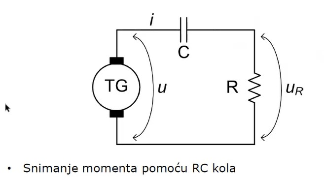
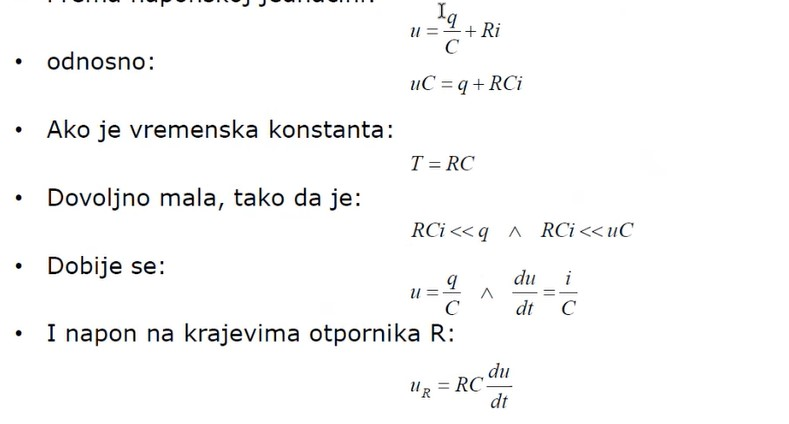
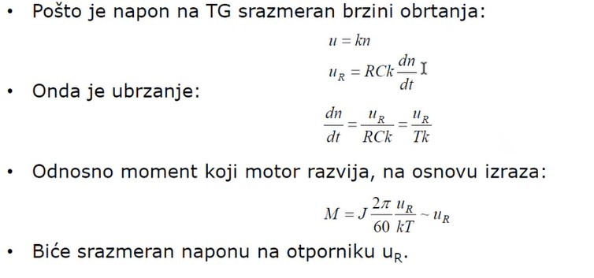

# Tema 2 — Merenje brzine obrtanja i tahogeneratori

## Zašto se ovo pita

Merenje brzine obrtanja je pitanje koje se na ispitu pojavljuje **direktno** (zadatak 2 na predroku 22. 1. 2023. i na ispitu 8. 9. 2023: eksperimentalno određivanje nominalne brzine asinhronog motora tahogeneratorom) i **indirektno** — tahogenerator je merni uređaj bez kojeg se ne mogu izvesti ogled zaustavljanja i ogled zaletanja (tamo se brzina snima osciloskopom, a preko RC kola se snima i momenat). Ispitivač očekuje da znaš:

1. **šta je tahogenerator** i zašto mu je napon srazmeran brzini;
2. **kako se spreže** sa ispitivanom mašinom (kruta veza, zajedničko vratilo);
3. **kako se bira voltmetar** — vrsta (kretni kalem), opseg (prema očekivanom naponu) i klasa tačnosti;
4. **kako se iz klase tačnosti izračunavaju granice** u kojima se nalazi stvarna vrednost brzine — apsolutna greška je klasa u procentima **od opsega**, pa se preračuna u obrtaje u minuti preko konstante tahogeneratora;
5. **RC kolo sa tahogeneratorom** — kako se od napona srazmernog brzini dobija napon srazmeran ubrzanju, odnosno momentu.

> **Prevod na običan jezik:** Tahogenerator je mali generator jednosmerne struje sa stalnim magnetima koji navrnemo na vratilo velike mašine. Pošto mu je pobudni fluks konstantan, indukovani napon mu je čist „preslikač" brzine u volte: očitaš voltmetar, podeliš konstantom tahogeneratora i dobiješ brzinu. Sva tačnost tog merenja visi o klasi tačnosti voltmetra — zato se na ispitu traži da izračunaš granice greške. A ako ti ne treba brzina nego momenat (ogled zaletanja/zaustavljanja), na tahogenerator zakačiš RC kolo koje umesto tebe „izvrši diferenciranje": napon na otporniku je srazmeran izvodu brzine, dakle ubrzanju, dakle momentu.

## Teorija — sve što moraš znati

### Dva cilja merenja brzine

Prema beleškama, brzina obrtanja se meri iz dva različita razloga:

- **regulisan pogon** — brzina se meri kontinualno i koristi kao povratna veza (upravljanje po povratnoj sprezi); kod mašina jednosmerne struje opseg brzina se „igra" pobudom i armaturom, a kod naizmeničnih mašina i promenom frekvencije;
- **ispitivanje mašine** — određivanje nominalne brzine, snimanje ogleda zaletanja i zaustavljanja, provera natpisne pločice.

Brzina se meri **senzorima**: tahometri, tahogeneratori, enkoderi, rezolveri; kod asinhronih motora može da se meri i **klizanje** (stroboskopski, probnim namotajem — posebna tema).

### Tahometri (mehanički instrumenti) — i zašto nisu dovoljni

- **Centrifugalni tahometar:** dve kuglice se pod dejstvom centrifugalne sile razmiču sa porastom brzine i preko kretnog sistema pomeraju skazaljku. Šiljak tahometra se **prisloni na osu rotacije**; ima solidnu klasu tačnosti.
- **Integralni tahometar:** meri se istovremeno i vreme i broj obrtaja, pa se dobija **srednja brzina** u intervalu (interval ne treba da bude velik, do 20 sekundi).
- **Kvarcni tahometar:** takođe se mehanički spreže sa mašinom, ali je prikaz **digitalan**.

**Mana svih tahometara:** mora se **blisko prići mašini** i vratilo mora biti **dostupno**, a veza šiljka i vratila je trenutna, ručna, nestabilna. Ako želimo **preciznije merenje i stabilnu vezu** između uređaja i mašine — rešenje je **tahogenerator**.

### Tahogenerator jednosmerne struje — princip

**Tahogenerator (TG) je mali generator jednosmerne struje sa konstantnom pobudom** (pobuda u vidu **stalnih magneta**), koji se montira na vratilo ispitivane mašine tako da imaju **zajedničko vratilo** — mora se ostvariti **kruta veza**. TG „dobija brzinu" od ispitivane mašine.

Indukovani napon mašine jednosmerne struje je:

$$
E = k\,\Phi\,\omega
$$

Pošto je pobudni fluks $\Phi$ stalan (stalni magneti — **poznata konstanta fluksnog obuhvata**), proizvod $k\Phi$ je konstanta, pa je indukovani napon **direktno proporcionalan brzini obrtanja**:

$$
U_{TG} = k_{TG}\cdot n
$$

Na armaturu (priključke) TG-a se veže **voltmetar**: očitamo napon i **preračunamo brzinu** $n = U_{TG}/k_{TG}$. Kroz voltmetar će se uspostaviti neka mala struja (zbog konačne otpornosti voltmetra), ali **ta struja ne remeti fluks** stalnih magneta — TG praktično radi u praznom hodu, pa je merenje neopterećeno greškom reakcije indukta.

**Konstanta tahogeneratora** je, po definiciji iz beležaka, **vrednost koja pokazuje koliko se volti indukuje na 1000 obrtaja u minuti**. Zato se piše u obliku razlomka, npr.

$$
k_{TG} = \frac{15}{1000}\ \mathrm{\frac{V}{o/min}} = 0{,}015\ \mathrm{\frac{V}{o/min}}\quad\text{(„15 volti na 1000 obrtaja u minuti“)}.
$$

**Ograničenje:** tahogeneratori nekad **ne mogu da se koriste kod malih mašina jer im postanu opterećenje** — TG ima sopstveno trenje, ventilaciju i inerciju, pa bi kod male ispitivane mašine osetno promenio radnu tačku (i posebno kvari ogled zaustavljanja male mašine, jer dodaje svoje gubitke i svoj momenat inercije).

### Sinhroni i asinhroni tahogeneratori

**Sinhrona mašina funkcioniše slično mašini jednosmerne struje** — ima pobudu (koja se obrće) i namotaj u promenljivom polju (statički, na statoru) — pa **tahogenerator može biti i sinhrona mašina** sa stalnim magnetima na rotoru. Dovoljna je i **jednofazna** sinhrona mašinica — treba samo jedan namotaj sa kojeg se meri napon. Kod sinhronog TG-a postoje **dva načina merenja**:

1. **Merenje amplitude (efektivne vrednosti) indukovanog napona** — kao kod jednosmernog TG-a, jer je $E = 4{,}44\,f\,\Phi\,N$, a $f$ je srazmerno brzini, pa je pri stalnom fluksu efektivna vrednost srazmerna brzini. Ovo merenje trpi iste greške kao svako naponsko merenje: klasa instrumenta, ali i svaka promena fluksa (temperatura, starenje magneta) ulazi direktno u rezultat.
2. **Merenje frekvencije** indukovanog napona — TG je generator naizmenične struje, a frekvencija je vezana za brzinu **isključivo brojem pari polova**:
   $$
   f = \frac{p\,n}{60} \quad\Rightarrow\quad n = \frac{60 f}{p}.
   $$
   Ovo je po beleškama **još preciznije**: $p$ je egzaktan ceo broj (konstruktivni podatak bez tolerancije), frekvencija **ne zavisi od fluksa** (ne smeta ni zagrevanje magneta, ni pad napona pod opterećenjem instrumenta), a frekvencija se meri digitalno (brojanjem) — praktično bez klase tačnosti u klasičnom smislu.

Postoje i **tahogeneratori asinhronog tipa**. Srodan uređaj je **rezolver** (asinhroni generator): primarni namotaj na rotoru pobuđuje se **naizmeničnom** (ne jednosmernom!) strujom i stvara pulsaciono polje, a na statoru su dva namotaja pomerena za $90^\circ$ — **sinusni i kosinusni**; obrtanje rotora se „utiskuje" u flukseve tih namotaja, pa se iz odnosa (faznog stava) njihovih indukovanih napona preko $\tan\theta$ određuje položaj rotora (a iz položaja i brzina). Koristi se u **agresivnim sredinama** (vlaga, prašina).

### Greška merenja brzine tahogeneratorom

Po beleškama: **tačnost ovog merenja zavisi najviše od instrumenta, zbog klase tačnosti instrumenta.**

- **Greška instrumenta:** za analogni instrument klase tačnosti $kl$ na mernom opsegu $U_{ops}$, maksimalna apsolutna greška je **procenat od opsega** (ne od očitane vrednosti!):
  $$
  \Delta U = \frac{kl}{100}\cdot U_{ops}
  $$
  i ista je na svakom mestu skale. Zato je **relativna** greška najmanja kada skazaljka skreće blizu kraja skale — opseg se bira tako da očekivano skretanje bude **u gornjoj trećini skale**.
- **Preračunavanje u brzinu:** pošto je $n = U/k_{TG}$ linearna veza, granice napona se direktno preslikavaju u granice brzine:
  $$
  \Delta n = \frac{\Delta U}{k_{TG}}, \qquad n_{stv} \in \left[\,n_{oč} - \Delta n,\ n_{oč} + \Delta n\,\right].
  $$
- **Greška konstante TG:** i sama konstanta $k_{TG}$ ima toleranciju (proizvodna tolerancija, promena fluksa stalnih magneta sa temperaturom i starenjem). U najgorem slučaju relativne greške se **sabiraju**: $\frac{\Delta n}{n} \approx \frac{\Delta U}{U} + \frac{\Delta k_{TG}}{k_{TG}}$. U ispitnom zadatku se konstanta smatra tačno poznatom (nije data njena tolerancija), pa dominira — kako i beleške naglašavaju — **klasa tačnosti instrumenta**; ali pomeni da drugi izvor greške postoji.

### RC kolo sa tahogeneratorom — snimanje ubrzanja i momenta

Kod ogleda zaletanja i zaustavljanja treba nam $\mathrm{d}\omega/\mathrm{d}t$ (dinamička komponenta momenta je $J\,\mathrm{d}\omega/\mathrm{d}t$). Numeričko diferenciranje snimljene brzine (tangenta tačku po tačku) je nezgodno i sklono grešci — zato se koristi trik: **na priključke tahogeneratora se poveže RC kolo**, a TG se poveže na vratilo ispitivane mašine i dobija njenu brzinu.

**Slika —** Snimanje momenta pomoću RC kola: tahogenerator TG (levo) daje napon $u$; na njega je redno vezan kondenzator $C$ (gornja grana, kroz nju teče struja $i$), a na izlazu je otpornik $R$ sa koga se skida napon $u_R$.

> **Kako čitati šemu:** Krug sa oznakom TG je tahogenerator na vratilu ispitivane mašine — on je izvor napona $u = k n$. Iz njegovog gornjeg priključka struja $i$ ide kroz kondenzator $C$, zatim kroz otpornik $R$ i vraća se na donji priključak TG-a — **redno kolo $C$–$R$ na naponu tahogeneratora**. Na krajeve otpornika $R$ prislanja se osciloskop (visoka ulazna otpornost, ne opterećuje kolo) i snima $u_R$. Napon $u_R$ nije srazmeran brzini, nego njenom **izvodu** — to je cela poenta.

**Izvod (mora da se zna, slajd sa predavanja):**

**Slika —** Naponska jednačina RC kola i aproksimacija za malu vremensku konstantu $T=RC$.

> **Kako čitati šemu:** Slajd ide redom: naponska jednačina kola, množenje sa $C$, uslov male vremenske konstante, aproksimacija, i na kraju izraz za $u_R$ — svaki korak je ponovljen u tekstu ispod.

Napon tahogeneratora se razdeljuje na napon kondenzatora ($q/C$, gde je $q$ naelektrisanje) i napon otpornika ($R\,i$):

$$
u = \frac{q}{C} + R\,i \qquad\Big/\cdot C \qquad\Rightarrow\qquad uC = q + RC\,i.
$$

Uvede se vremenska konstanta kola $T = RC$. Ako je ona **dovoljno mala** (mnogo manja od vremena za koje se brzina primetno menja), onda je:

$$
RC\,i \ll q \quad\wedge\quad RC\,i \ll uC,
$$

pa se član $RCi$ zanemari i dobija se:

$$
u \approx \frac{q}{C} \qquad\Rightarrow\qquad \frac{\mathrm{d}u}{\mathrm{d}t} = \frac{1}{C}\frac{\mathrm{d}q}{\mathrm{d}t} = \frac{i}{C}.
$$

Napon na krajevima otpornika je onda:

$$
u_R = R\,i = RC\,\frac{\mathrm{d}u}{\mathrm{d}t}.
$$

**Napon na otporniku je srazmeran izvodu napona tahogeneratora — RC kolo je (za male $T$) diferencijator.**

**Slika —** Pošto je napon TG srazmeran brzini, $u_R$ je srazmerno ubrzanju $\mathrm{d}n/\mathrm{d}t$, a preko Njutnove jednačine i momentu $M$.

> **Kako čitati šemu:** Prvi red uvrsti $u = kn$ u izraz za $u_R$; drugi red izrazi ubrzanje $\mathrm{d}n/\mathrm{d}t$ preko $u_R$; treći red uvrsti to u $M = J\,\mathrm{d}\omega/\mathrm{d}t$ sa $\omega = 2\pi n/60$ — sve konstante ($J$, $2\pi/60$, $k$, $T$) su poznate, pa je momenat srazmeran naponu $u_R$.

Pošto je napon na TG srazmeran brzini obrtanja, $u = k\,n$:

$$
u_R = RC\,k\,\frac{\mathrm{d}n}{\mathrm{d}t} \qquad\Rightarrow\qquad \frac{\mathrm{d}n}{\mathrm{d}t} = \frac{u_R}{RCk} = \frac{u_R}{Tk}.
$$

**Ubrzanje se čita direktno sa osciloskopa** — bez ikakvog numeričkog diferenciranja. Momenat koji motor razvija (uz zanemarenje momenta opterećenja i trenja, kako se radi u ogledu zaletanja) sledi iz Njutnove jednačine $M = J\,\mathrm{d}\omega/\mathrm{d}t$ uz $\omega = \frac{2\pi n}{60}$:

$$
M = J\,\frac{2\pi}{60}\,\frac{u_R}{kT} \sim u_R.
$$

**Momenat je srazmeran naponu na otporniku $u_R$** — snimak $u_R(t)$ na osciloskopu je, do na poznatu konstantu $J\frac{2\pi}{60}\frac{1}{kT}$, direktno snimak momenta. Kod **zaustavljanja** se ovo radi sa pogonskom mašinom (koja mašinu prethodno zaleti), a kod **zaletanja** je direktna interpretacija istog izvoda.

*Osećaj za red veličine (pretpostavka, razuman izbor elemenata):* sa $R = 10\ \mathrm{k\Omega}$ i $C = 1\ \mathrm{\mu F}$ vremenska konstanta je $T = RC = 10\ \mathrm{ms}$ — mnogo manje od trajanja zaleta (sekunde), pa aproksimacija diferencijatora važi.

## Oprema i šema merenja

**Za merenje brzine (ispitni zadatak) treba:**

1. **Tahogenerator** poznate konstante $k_{TG}$ (npr. $15/1000\ \mathrm{V/(o/min)}$) — generator jednosmerne struje sa pobudom od stalnih magneta;
2. **spojnica za krutu vezu** TG-a sa vratilom ispitivane mašine (moraju **deliti vratilo** — svako proklizavanje je direktna greška merenja);
3. **voltmetar sa kretnim kalemom** — analogni instrument sa kretnim kalemom se koristi jer je on instrument za **jednosmerne veličine** (napon TG je jednosmeran); opseg se bira tako da očekivani napon $U = k_{TG}\, n$ padne u **gornju trećinu skale** (standardni opsezi: 1,5 – 3 – 7,5 – 15 – 30 – 60 – 150 – 300 V); klasa tačnosti što bolja (laboratorijski 0,2 ili 0,5), jer o njoj visi tačnost celog merenja.

**Recept za crtanje šeme (merenje brzine):** Levo nacrtaj ispitivanu mašinu (krug, oznaka M/AM), iz nje vodoravnu debelu liniju — **vratilo** — i na istom vratilu manji krug sa oznakom **TG** (spojnica između njih se šrafira ili označi kao kruta veza). Sa priključaka (četkica) TG-a izvedi dva provodnika i na njih **paralelno** veži voltmetar **V** (kretni kalem; upiši izabrani opseg, npr. 60 V, i klasu). Drugih elemenata nema — TG radi u praznom hodu, opterećen samo voltmetrom. Označi polaritet priključaka (kretni kalem je polarisan instrument).

**Recept za crtanje šeme (RC kolo — snimanje momenta):** Levo krug **TG** (na vratilu ispitivane mašine — vratilo možeš naznačiti sa strane). Sa gornjeg priključka TG-a vodi granu kroz **kondenzator $C$** (dve paralelne crtice), pa nastavi do **otpornika $R$** (cik-cak) koji se vraća na donji priključak TG-a — dakle $C$ i $R$ **na red**, priključeni na napon TG-a $u$. Strelicom označi struju $i$ kroz granu sa $C$, lučnom strelicom napon $u$ na TG-u i napon $u_R$ na otporniku. Na krajeve $R$ se priključuje **osciloskop** koji snima $u_R(t)$.

## Rešeno ispitno pitanje

**Tekst pitanja (predrok, 22. januar 2023, zadatak 2):**

> Asinhronom motoru 100 kW, 400 V, 2970 o/min se eksperimentalno određuje nominalna brzina obrtanja. Za te potrebe se koristi tahogenerator konstante 15/1000 V/(o/min). Opišite postupak merenja, izaberite odgovarajući merni instrument pomoću čijeg se očitavanja određuje brzina obrtanja motora. Ukoliko je reč o instrumentu sa tipičnom klasom tačnosti, odrediti granice u kojima se nalazi stvarna vrednost merene brzine.

**Tekst pitanja (ispit, 8. septembar 2023, zadatak 2)** — isto, sa izmenjenim poslednjim zahtevom:

> Ukoliko je reč o instrumentu sa klasom tačnosti 0,2, odrediti granice u kojima se nalazi stvarna vrednost merene brzine.

### Model odgovor

**1. korak — postupak merenja.** Tahogenerator (generator jednosmerne struje sa pobudom od stalnih magneta, konstante $k_{TG}=15/1000\ \mathrm{V/(o/min)}$) se **kruto spregne sa vratilom** asinhronog motora, tako da dele vratilo i da TG dobija tačno brzinu motora. Na priključke TG-a se paralelno veže voltmetar. Pošto se određuje **nominalna** brzina, motor se dovede u **nominalnu radnu tačku**: napaja se nominalnim naponom 400 V, 50 Hz i optereti se (pogodnom kočnicom/generatorom) tako da uzima nominalnu snagu, tj. nominalnu struju. Sačeka se da se radna tačka ustali, pa se očita skretanje voltmetra $U$. Brzina je tada:

$$
n = \frac{U}{k_{TG}}.
$$

Struja koja se pri merenju uspostavi kroz voltmetar je zanemarljiva i **ne remeti fluks** stalnih magneta, pa TG praktično radi u praznom hodu i veza $U = k_{TG}n$ važi tačno.

**2. korak — očekivani napon i izbor instrumenta.** Pri nominalnoj brzini $n_n = 2970\ \mathrm{o/min}$ očekuje se napon:

$$
U = k_{TG}\cdot n_n = \frac{15}{1000}\ \mathrm{\frac{V}{o/min}} \cdot 2970\ \mathrm{o/min} = 44{,}55\ \mathrm{V}.
$$

Napon je jednosmeran, pa se bira **voltmetar sa kretnim kalemom** (instrument za jednosmerne veličine). Od standardnih opsega (…, 30, 60, 150, 300 V) bira se **opseg 60 V**: očitavanje $44{,}55\ \mathrm{V}$ pada na $44{,}55/60 = 74{,}3\ \%$ skale, tj. u **gornju trećinu skale**, gde je relativna greška merenja najmanja (apsolutna greška je stalna po celoj skali jer se računa od opsega). Opseg 30 V ne dolazi u obzir (napon je veći od opsega), a 150 V bi značilo skretanje na trećini skale i bespotrebno veliku grešku.

**3.a korak — granice greške za tipičnu klasu tačnosti (verzija sa predroka).** Klasa tačnosti nije zadata, pa se uzima **tipična klasa laboratorijskog analognog voltmetra sa kretnim kalemom: 0,5** (*pretpostavka:* pogonski/tablarni instrumenti su klase 1,5–2,5 i pregrubi su za određivanje nominalne brzine; etalonski 0,1–0,2 su specijalnost — 0,5 je standardni kvalitetan laboratorijski instrument, pa je to razuman izbor koji treba eksplicitno navesti). Maksimalna apsolutna greška napona je klasa u procentima **od opsega**:

$$
\Delta U = \frac{0{,}5}{100}\cdot 60\ \mathrm{V} = 0{,}3\ \mathrm{V}.
$$

Stvarna vrednost napona je u granicama:

$$
U_{stv} \in \left[\,44{,}55 - 0{,}3;\ 44{,}55 + 0{,}3\,\right]\ \mathrm{V} = \left[\,44{,}25;\ 44{,}85\,\right]\ \mathrm{V}.
$$

Preračunato u brzinu preko konstante TG:

$$
\Delta n = \frac{\Delta U}{k_{TG}} = \frac{0{,}3\ \mathrm{V}}{0{,}015\ \mathrm{V/(o/min)}} = 20\ \mathrm{o/min},
$$

$$
\boxed{\,n_{stv} \in \left[\,2970 - 20;\ 2970 + 20\,\right] = \left[\,2950;\ 2990\,\right]\ \mathrm{o/min}\,}
$$

Relativna greška iznosi $\frac{\Delta U}{U} = \frac{0{,}3}{44{,}55} = 0{,}67\ \%$.

**3.b korak — granice greške za klasu 0,2 (verzija sa ispita).** Isti postupak, samo sa klasom 0,2:

$$
\Delta U = \frac{0{,}2}{100}\cdot 60\ \mathrm{V} = 0{,}12\ \mathrm{V}
\qquad\Rightarrow\qquad
U_{stv} \in \left[\,44{,}43;\ 44{,}67\,\right]\ \mathrm{V},
$$

$$
\Delta n = \frac{0{,}12\ \mathrm{V}}{0{,}015\ \mathrm{V/(o/min)}} = 8\ \mathrm{o/min},
$$

$$
\boxed{\,n_{stv} \in \left[\,2970 - 8;\ 2970 + 8\,\right] = \left[\,2962;\ 2978\,\right]\ \mathrm{o/min}\,}
$$

Relativna greška iznosi $\frac{0{,}12}{44{,}55} = 0{,}27\ \%$.

**Komentar (vredi ga napisati na ispitu):** motor 2970 o/min je dvopolna mašina (sinhrona brzina 3000 o/min, klizanje 1 %). Sa klasom 0,5 nesigurnost od $\pm 20\ \mathrm{o/min}$ je već $\frac{2}{3}$ razlike između nominalne i sinhrone brzine — zato za ovakva merenja ima smisla tražiti instrument bolje klase (0,2), čime se granice sužavaju na $\pm 8\ \mathrm{o/min}$.

## Varijacije zadatka

### Varijacija 1 — druga mašina i druga konstanta TG

*Asinhronom motoru 55 kW, 400 V, 1460 o/min određuje se nominalna brzina tahogeneratorom konstante 20/1000 V/(o/min). Izabrati opseg voltmetra klase 0,5 i odrediti granice stvarne brzine.*

Očekivani napon:

$$
U = \frac{20}{1000}\cdot 1460 = 29{,}2\ \mathrm{V}.
$$

Bira se **opseg 30 V** — skretanje na $29{,}2/30 = 97\ \%$ skale, idealno (sam vrh skale). Apsolutna greška:

$$
\Delta U = \frac{0{,}5}{100}\cdot 30 = 0{,}15\ \mathrm{V}
\qquad\Rightarrow\qquad
\Delta n = \frac{0{,}15}{0{,}02} = 7{,}5\ \mathrm{o/min},
$$

$$
n_{stv} \in \left[\,1452{,}5;\ 1467{,}5\,\right]\ \mathrm{o/min},
\qquad \frac{\Delta U}{U} = 0{,}51\ \%.
$$

*Napomena:* Ovde je opseg gotovo savršeno pogođen, pa je i relativna greška (0,51 %) praktično jednaka klasi — bolje od $0{,}67\ \%$ iz ispitnog zadatka, iako je klasa ista. Toliko vredi dobar izbor opsega.

### Varijacija 2 — preizabran opseg: kako greška „eksplodira"

*Isti ispitni zadatak (2970 o/min, $k_{TG}=15/1000$ V/(o/min)), ali je u laboratoriji dostupan samo voltmetar opsega 300 V, klase 0,5. Odrediti granice stvarne brzine i prokomentarisati.*

Očitavanje je i dalje $U = 44{,}55\ \mathrm{V}$, ali sada na $44{,}55/300 = 14{,}9\ \%$ skale — skazaljka jedva mrdne. Apsolutna greška se računa **od opsega**, pa je:

$$
\Delta U = \frac{0{,}5}{100}\cdot 300 = 1{,}5\ \mathrm{V}
\qquad\Rightarrow\qquad
\Delta n = \frac{1{,}5}{0{,}015} = 100\ \mathrm{o/min},
$$

$$
n_{stv} \in \left[\,2870;\ 3070\,\right]\ \mathrm{o/min},
\qquad \frac{\Delta U}{U} = \frac{1{,}5}{44{,}55} = 3{,}37\ \%.
$$

**Komentar:** greška je porasla tačno $300/60 = 5$ puta (srazmerno odnosu opsega) — sa $\pm 20$ na $\pm 100\ \mathrm{o/min}$. Interval sada obuhvata čak i sinhronu brzinu 3000 o/min: merenje ne može ni da razlikuje motor pod opterećenjem od praznog hoda, tj. **rezultat je neupotrebljiv za određivanje nominalne brzine**. Ovo je razlog pravila „skretanje u gornjoj trećini skale".

### Varijacija 3 — sinhroni tahogenerator: amplituda ili frekvencija?

*Brzina istog motora (2970 o/min) meri se sinhronim tahogeneratorom sa stalnim magnetima, četvoropolnim ($p = 2$). Kako se meri i koji je način tačniji?*

**Merenje amplitude:** efektivna vrednost indukovanog napona $E = 4{,}44 f \Phi N$ je pri stalnom fluksu srazmerna brzini, pa se meri voltmetrom (za naizmenične veličine) i deli konstantom — potpuno analogno jednosmernom TG-u, sa istim računom greške preko klase i opsega. Ali amplituda zavisi i od **fluksa**: zagrevanje i starenje stalnih magneta menjaju $\Phi$, a opterećenje instrumentom pravi pad napona — sve to ulazi u rezultat kao dodatna greška.

**Merenje frekvencije:** frekvencija indukovanog napona je:

$$
f = \frac{p\,n}{60} = \frac{2\cdot 2970}{60} = 99\ \mathrm{Hz}
\qquad\Rightarrow\qquad
n = \frac{60 f}{p}.
$$

Broj pari polova $p$ je **egzaktan ceo broj** (konstruktivni podatak, bez ikakve tolerancije), a frekvencija ne zavisi ni od fluksa ni od opterećenja TG-a. Meri se digitalnim frekvencmetrom (brojačem); čak i skromna rezolucija od $\pm 0{,}1\ \mathrm{Hz}$ daje:

$$
\Delta n = \frac{60\cdot 0{,}1}{2} = 3\ \mathrm{o/min} \quad (0{,}1\ \%),
$$

bolje i od voltmetra klase 0,2 ($\pm 8\ \mathrm{o/min}$). **Zato je merenje frekvencije tačnije** — beleške to izričito kažu: „frekvencija je direktno sa brzinom obrtanja (još preciznije)".

### Varijacija 4 — sinhroni generator sa ispita (mašina iz zadatka 4)

*Sinhronom generatoru 18,5 kVA; 400 V; 1500 o/min proverava se brzina obrtanja tahogeneratorom konstante 15/1000 V/(o/min); voltmetar klase 0,2. Izabrati opseg i granice stvarne brzine.*

$$
U = \frac{15}{1000}\cdot 1500 = 22{,}5\ \mathrm{V}
\qquad\Rightarrow\qquad \text{opseg } 30\ \mathrm{V}\ (75\ \%\ \text{skale}).
$$

$$
\Delta U = \frac{0{,}2}{100}\cdot 30 = 0{,}06\ \mathrm{V},
\qquad
\Delta n = \frac{0{,}06}{0{,}015} = 4\ \mathrm{o/min},
$$

$$
n_{stv} \in \left[\,1496;\ 1504\,\right]\ \mathrm{o/min},
\qquad \frac{\Delta U}{U} = 0{,}27\ \%.
$$

Ovakvo merenje je tačno ono što treba u **ogledu zaustavljanja** te mašine: pre isključenja pogonske mašine treba pouzdano znati da je brzina zaista $1{,}1\,n_n = 1650\ \mathrm{o/min}$ (osnovno pravilo zaustavljanja — 10 % iznad nominalne, zbog diferenciranja).

## Česte greške i zamke na ispitu

1. **Klasa tačnosti se računa od OPSEGA, ne od očitane vrednosti.** Pogrešno: $0{,}5\ \%$ od $44{,}55\ \mathrm{V} = 0{,}22\ \mathrm{V} \Rightarrow \pm 14{,}85\ \mathrm{o/min}$. Tačno: $0{,}5\ \%$ od $60\ \mathrm{V} = 0{,}3\ \mathrm{V} \Rightarrow \pm 20\ \mathrm{o/min}$. Ovo je najčešća greška na ovom zadatku.
2. **Pogrešno čitanje konstante TG.** $15/1000\ \mathrm{V/(o/min)}$ znači „15 V na 1000 o/min", tj. $0{,}015\ \mathrm{V}$ po obrtaju u minuti — nije „15 V po obrtaju". Ko pomeša, dobija besmislen napon od desetina kilovolti.
3. **Granice izražene samo u voltima.** Pitanje traži granice **brzine** — obavezno preračunaj $\Delta U$ u $\Delta n$ preko $k_{TG}$ i napiši interval u $\mathrm{o/min}$ (u modelu odgovora daj oba, i V i o/min).
4. **Preizabran opseg.** Opseg 150 V ili 300 V „radi", ali greška raste srazmerno opsegu (varijacija 2: $\pm 100\ \mathrm{o/min}$, neupotrebljivo). Uvek obrazloži: skretanje u gornjoj trećini skale.
5. **Pogrešna vrsta instrumenta.** Napon jednosmernog TG-a je jednosmeran — instrument je **voltmetar sa kretnim kalemom** (instrument za jednosmerne veličine), a ne instrument sa mekim gvožđem.
6. **Sprega sa vratilom.** Bez **krute veze** (zajedničko vratilo) svako proklizavanje ulazi direktno u merenje; a kod **malih mašina** TG može biti nedopustivo **opterećenje** — tada TG nije dobar izbor.
7. **RC kolo: šta je čemu srazmerno.** Napon tahogeneratora $u$ je srazmeran **brzini**; napon na otporniku $u_R = RC\,\mathrm{d}u/\mathrm{d}t$ je srazmeran **ubrzanju**, tj. **momentu**. I ne zaboravi uslov: vremenska konstanta $T = RC$ mora biti dovoljno mala ($RCi \ll q$), inače kolo nije diferencijator.

## Kontrolna pitanja za samoproveru

1. **Šta je tahogenerator i zašto mu je napon srazmeran brzini?** — Mali generator jednosmerne struje sa pobudom od stalnih magneta na vratilu ispitivane mašine; pošto je $\Phi$ konstantan, $E = k\Phi\omega$ je srazmerno brzini.
2. **Šta znači konstanta tahogeneratora 15/1000 V/(o/min)?** — Da se na 1000 obrtaja u minuti indukuje 15 V, tj. 0,015 V po svakom o/min.
3. **Kako se bira opseg voltmetra i kolika je apsolutna greška instrumenta klase 0,5 na opsegu 60 V?** — Opseg tako da očekivano skretanje bude u gornjoj trećini skale; $\Delta U = 0{,}5\,\%\cdot 60\ \mathrm{V} = 0{,}3\ \mathrm{V}$ (procenat od opsega, isti po celoj skali).
4. **Zašto je kod sinhronog tahogeneratora merenje frekvencije tačnije od merenja amplitude?** — Jer je $n = 60f/p$ sa egzaktnim celim brojem $p$ i ne zavisi od fluksa (temperature, starenja magneta) ni od opterećenja, a frekvencija se meri digitalnim brojanjem.
5. **Čemu je srazmeran napon na otporniku RC kola vezanog na tahogenerator i pod kojim uslovom?** — $u_R = RC\,\mathrm{d}u/\mathrm{d}t = RCk\,\mathrm{d}n/\mathrm{d}t$, srazmeran ubrzanju, tj. momentu $M = J\frac{2\pi}{60}\frac{u_R}{kT}$; važi ako je $T = RC$ dovoljno malo ($RCi \ll q$).
6. **Zašto tahogenerator nekad nije dobar za male mašine?** — Jer im postane opterećenje: njegovo trenje, ventilacija i inercija primetno menjaju radnu tačku (i rezultate ogleda zaustavljanja).
