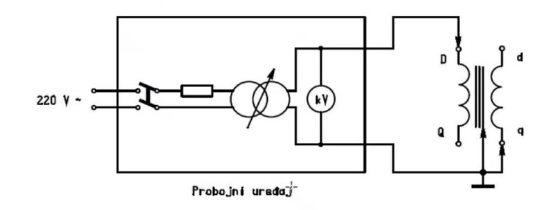
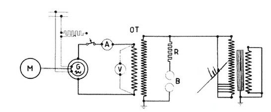

# Tema 3 — Ispitivanje izolacije

## Zašto se ovo pita

Ispitivanje izolacije je, uz merenje otpora namotaja, **prvo ispitivanje koje se izvodi na svakoj
mašini** — na osnovu ta dva merenja se donosi odluka da li je mašinu uopšte bezbedno priključiti na
napajanje. Na oba data roka (predrok 22. januar 2023. i ispit 8. septembar 2023.) ovo je **pitanje
broj 3**: provera izolacije **indukovanim naponom** kod visokonaponskih transformatora — šema
ogleda i postupak. U primerima pitanja za vežbu javlja se i klasična varijanta: **šema i postupak
merenja otpora izolacije jednofaznog transformatora**. Ispitivač očekuje da znaš tri sloja teme:

1. **otpor izolacije** — megaommetar, jednosmerni napon, dve tehnike očitavanja, količnik
   $R_{60}/R_{15}$;
2. **dielektrična čvrstoća dovedenim naponom** — probojni uređaj, $2U_n + 1000\ \mathrm{V}$,
   1 minut, postepeno dizanje;
3. **provera izolacije indukovanim naponom** — zašto dovedeni napon *ne može* da proveri izolaciju
   između navojaka, zašto se mora povisiti učestanost (preko $U = 4{,}44\, f N \Phi$), šema sa
   motor–generator grupom i zašto se ovo **ne radi kod rotacionih mašina**.

> **Prevod na običan jezik:** Izolacija je ono što razdvaja delove pod naponom od delova koje čovek
> sme da dodirne (i namotaje međusobno). Prvo je „pipnemo" blagom jednosmernom strujom
> (megaommetar) da vidimo koliko curi — to je *merenje* otpora izolacije i ono ne sme da je ugrozi.
> Zatim je namerno *napregnemo* povišenim naizmeničnim naponom da dokažemo da će izdržati prenapone
> koji se u mreži realno dešavaju — to je provera dielektrične čvrstoće. Kod transformatora spolja
> ne možemo da napregnemo izolaciju *između susednih navojaka* (spolja su svi navojci jednog
> namotaja na istom potencijalu), pa napon u namotaju *indukujemo* — ali sa povišenom učestanošću,
> da magnetno kolo ne ode u zasićenje.

---

## Teorija — sve što moraš znati

### 3.1 Mesto ispitivanja izolacije u redosledu ogleda

Beleške su izričite o redosledu prvih koraka na svakoj mašini:

1. **opšti (vizuelni) pregled**;
2. **merenje otpora namotaja** (Tema o UI metodi);
3. **merenje otpora izolacije namotaja**.

**Na osnovu ova dva merenja ustanovljavamo da li je bezbedno priključiti mašinu na napajanje.**
Ključna profesorova napomena (!!!): **može da se desi da je izolacija ispravna, a da je namotaj u
prekidu — zato se OBOJE mora proveriti.** Jedno merenje ne zamenjuje drugo: otpor namotaja otkriva
prekid i pregrejanost, otpor izolacije otkriva puteve curenja ka masi i između namotaja.

Zašto baš merimo otpor izolacije:

- da ustanovimo **da li su delovi koji ne smeju biti pod naponom dobro izolovani od delova pod
  naponom** — vremenom nastaju mikropukotine (mehanički najpre stradaju ležajevi, električki
  izolacija);
- **posle svakog remonta ili popravke merenje se mora ponoviti.**

Za razliku od otpora namotaja (koji zavisi praktično samo od temperature), **otpor izolacije je
varijabilna kategorija**: zavisi od vlažnosti, hemijskih supstanci, prašine, temperature, trajanja
merenja i vrednosti mernog napona.

### 3.2 Šta je otpor izolacije i čime se meri

**Otpor izolacije je otpor jednosmernoj struji** — zato se meri jednosmernim (povišenim) naponom.
Postupak u suštini: razvežemo namotaje, jedan pol izvora priključimo na namotaj, drugi na masu (ili
na drugi namotaj) i posmatramo **struju curenja** — jako malu struju (reda mikroampera) koja se
pojavi gde god strukture imaju fizički kontakt kroz izolaciju. Teorijski bi ovo mogla biti UI
metoda (podelimo napon i struju), ali **nemamo mikroampermetar** dovoljne tačnosti u običnoj
laboratorijskoj opremi — zato postoji poseban instrument.

**Megaommetar (megger)** je **precizni merač struje pri preciznoj jednosmernoj vrednosti napona** —
u sebi objedinjuje izvor jednosmernog povišenog napona (tipično $500\ \mathrm{V}$,
$1000\ \mathrm{V}$, $2500\ \mathrm{V}$…) i instrument čija je skala direktno graduisana u
megaomima ($R = U_{\mathrm{isp}}/I_{\text{curenja}}$, deljenje odradi sam instrument).

**Fizika onoga što megaommetar „vidi".** Čim mašini nametnemo jednosmerni napon, nužno se pojavljuju
**parazitne kapacitivnosti** između međusobno izolovanih elemenata (namotaj–masa, namotaj–namotaj)
— izolacija se ponaša kao nesavršen kondenzator. Kada megaommetar priključimo na taj parazitni
kapacitet, **simultano teku tri fenomena**:

- **udarna struja punjenja kapacitivnosti** — kratkotrajna, velika u prvom trenutku (prazna
  kapacitivnost se ponaša kao kratak spoj);
- **struja polarizacije dielektrika (struja apsorpcije)** — vezana naelektrisanja (dipoli) u
  dielektriku se usmeravaju; kada se svi dipoli usmere, ova komponenta nestaje — traje reda
  **10–15 s**;
- **struja curenja** — ono što na kraju ostane kao **rezultantna** struja kroz otpornost
  „kondenzatora" — ustali se posle **60 s do 10 minuta**.

Posledica po očitavanje: kazaljka megaommetra u prvim sekundama pokazuje *malu* otpornost (velika
ukupna struja), pa otpornost *raste* kako iščezavaju punjenje i apsorpcija, i tek na kraju pokazuje
pravu vrednost. **Ako je izolacija dobra, struja curenja je mala pa je i rezultantna struja jako
mala (otpor veliki); ako je izolacija loša, udeo struje curenja u ukupnoj struji je preveliki.**

**Izbor jednosmernog ispitnog napona** (iz beležaka, „DC test voltage"):

| Naznačeni napon namotaja | Ispitni jednosmerni napon |
|---|---|
| $230\text{–}400\ \mathrm{V}$ | $500\ \mathrm{V_{dc}}$ |
| do $1000\ \mathrm{V}$ | $1000\ \mathrm{V_{dc}}$ |
| preko $1000\ \mathrm{V}$ | $2500\text{–}4000\ \mathrm{V_{dc}}$ |

**Ogled se najčešće vrši jednosmernim naponom od $500\ \mathrm{V}$ i najčešće traje 1 minut.**

### 3.3 Dve tehnike merenja otpora izolacije

**1) Pojedinačna tehnika merenja izolacije** — beležimo samo **ustaljenu vrednost** kada prođe
dovoljno vremena (klasično: očitavanje posle 60 s). Ključna zamka (!!!): **može da se desi da
jednom izmerimo otpor izolacije i on pokazuje veliku vrednost, a da je izolacija ipak loša — ne
smemo se oslanjati na samo jedno očitavanje.** Pojedinačno očitavanje ima smisla samo ako imamo
**podatke od ranije** (vremenski niz očitavanja kroz istoriju mašine) sa kojima ga poredimo — **ako
nemamo podatke od pre, ova tehnika nije dobra.**

**2) Vremenski zavisna tehnika** — na osnovu **jednog** merenja, ali tako što **pratimo skretanje
instrumenta tokom vremena**: očitamo vrednost posle **10–15 s** i posle **60 s** (kod velikih
transformatora i posle 10 minuta). U početku ukupna struja treba da bude najveća (punjenje +
apsorpcija + curenje), a na kraju najmanja (samo curenje). Formira se količnik:

$$k = \frac{R_{60}}{R_{15}} \quad \left(\text{ili } \frac{R_{10\,\mathrm{min}}}{R_{1\,\mathrm{min}}}\right)$$

Ovaj količnik se u beleškama naziva **indeks polarizacije** — očitavanje nakon 60 s kroz
očitavanje nakon 15 s, odnosno 10 minuta kroz 1 minut; taj termin koristi na ispitu. (U široj
literaturi se za količnik $R_{60}/R_{15}$ sreće i naziv „koeficijent apsorpcije", a „indeks
polarizacije" se tamo često rezerviše za količnik 10 min/1 min — ali profesorova definicija je
merodavna.) Tumačenje:

- **veliki količnik → izolacija je dobra**: struja je u početku bila velika zbog punjenja i
  apsorpcije, a na kraju je ostalo malo curenje — otpor je značajno porastao;
- **količnik blizu 1 → izolacija je loša**: **curenje je velikog doprinosa** od samog početka, pa
  otpor ne raste — vlaga ili oštećenje prave stalan provodni put.

**Merila iz beležaka: $k = 1{,}5$ je odlično; $k = 1{,}3$ je dobro za transformatore u
eksploataciji.** Pravi otpor izolacije je onaj **nakon 60 s** (tada su iščezli prelazni fenomeni);
vrednost sa 15 s je „fiktivna".

### 3.4 Očekivane vrednosti otpora izolacije

**Vrednost otpora izolacije kreće se od $0{,}5\ \mathrm{M\Omega}$ pa naviše** i zavisi od vlažnosti
mašine, trajanja merenja, temperature, vrednosti mernog napona, veličine mašine i vrste i debljine
izolacionog materijala. Pravilo palca iz beležaka:

> **Izolacioni otpor treba da ima onoliko megaoma koliko kilovolti iznosi nazivni napon mašine,
> ali ne ispod $0{,}5\ \mathrm{M\Omega}$.** Pravilo važi uglavnom za mašine koje nisu velikih snaga
> i koje se ispituju naponom od $500\ \mathrm{V}$.

Primer: mašina $400\ \mathrm{V} = 0{,}4\ \mathrm{kV}$ → po pravilu $0{,}4\ \mathrm{M\Omega}$, ali
donja granica je $0{,}5\ \mathrm{M\Omega}$, pa zahtevamo bar $0{,}5\ \mathrm{M\Omega}$. Namotaj
$1000\ \mathrm{V} = 1\ \mathrm{kV}$ → bar $1\ \mathrm{M\Omega}$.

### 3.5 Bezbednosna pravila (obavezno u odgovoru!)

- Transformatori se testiraju **kada su potpuno odvojeni od mreže i opterećenja**, na ili iznad
  nazivnog napona (da ne postoje putanje curenja ka uzemljenju ili između namotaja).
- **Posle svakog ispitivanja monofaznog transformatora namotaj se mora kratko spojiti i uzemljiti
  pre nego što se pristupi narednom ispitivanju** — usled kapacitivnosti namotaja (naelektrisan
  „kondenzator") može doći do pražnjenja u obliku naponskih udara na onoga ko dodirne priključke.
- Kod motora i generatora, pre testiranja: **odspojiti četkice, uzemljiti priključak startera,
  zakočiti i uzemljiti vratilo motora; isprazniti namotaj pobude njegovim uzemljenjem**; zatim se
  namotaj pobude povezuje na „−" kraj megaommetra, a „+" kraj na uzemljenje (*Earth terminal*).
  Za statorski namotaj se radi analogno.

### 3.6 Provera dielektrične čvrstoće — dovedeni napon

**Svrha: odrediti kvalitet izolacije namotaja.** Razlika u filozofiji: *merenje otpora izolacije
služi samo da se izolacija izmeri i ne sme da je ugrozi*; **ispitivanje dielektrične čvrstoće**
namerno naprezanje izolacije povišenim naizmeničnim naponom — dokaz da mašina **povremeno** može da
izdrži visoke napone (kada bi visoki napon bio stalan, izolacija bi stradala!).

Zašto mašina uopšte mora da trpi povišen napon — **prenaponi zbog poremećaja u mreži (!!!)**:

- **zemljospoj u izolovanoj mreži** → u dve preostale faze napon skoči za $\sqrt{3}$;
- **komutacioni prenaponi** — naglo otvaranje prekidača;
- **atmosferska pražnjenja** (u urbanim kablovskim mrežama ih nema). Najizloženiji su
  **transformatori** — direktna veza sa EES i prenosnom mrežom, sa obe strane na visokom naponu;
  njihovi radni režimi su najopasniji.

**Postupak po standardu:** izolacija treba da izdrži
$$U_{\mathrm{isp}} = 2U_n + 1000\ \mathrm{V}$$
**u trajanju od 1 minuta**, pri nominalnoj učestanosti (poželjno i povišenoj). Pravila:

- kod vrlo velikih napona se $2U_n + 1000\ \mathrm{V}$ **nikada ne dovodi odjednom, nego u
  stepenima od 5 do 10 %**; maksimalni napon treba da izdrži do 1 minut;
- ne sme doći do **proboja ili preskoka** na izolaciji (kod uljnog transformatora proboj u ulju
  može biti privremen — isključi se napon i ulje se „skupi");
- **ako dođe do proboja u toku ispitivanja, ogled se prekida i ponavlja sa 75 %** vrednosti
  $2U_n + 1000\ \mathrm{V}$ — ako tada prođe, izolacija se smatra zadovoljavajućom;
- **izolacija se proverava na samom kraju** izrade/sklapanja — tek sklopljena mašina ima konačan
  sloj izolacije (uljni transformator tek kad se ulje uzme u obzir);
- **kod transformatora se ogled radi u hladnom stanju, a kod rotacionih mašina u toplom stanju
  (!!!)**;
- radi se **u izolovanim prostorijama** zbog prenapona i pratećih pojava;
- za niskonaponske mašine ispitni napon je oko $2000\ \mathrm{V}$ (npr.
  $2\cdot 400 + 1000 = 1800\ \mathrm{V}$) — otuda i pravilo iz beležaka da **probojni uređaji
  ispitne napone dižu najviše do $2\ \mathrm{kV}$, i to postepenim dizanjem, do 1 minut — ni
  slučajno odjednom na visok napon**.

**Slika —** Probojni uređaj za proveru dielektrične čvrstoće dovedenim naponom: iz mreže
$220\ \mathrm{V}\sim$ preko dvopolnog prekidača i zaštitnog predotpora napaja se regulacioni
(podizni) transformator; kilovoltmetar (kV) meri ispitni napon; desno je ispitivani monofazni
transformator sa visokonaponskim namotajem $D$–$Q$ i niskonaponskim $d$–$q$; ispitni izvod ide na
$D$, a uzemljeni su kraj $q$ i masa (jezgro/sud); priključci $Q$ i $d$ su slobodni.

> **Kako čitati šemu:** Sleva ulazi mrežni napon $220\ \mathrm{V}\sim$ kroz dvopolni prekidač —
> njime se ogled uključuje i (u nuždi) trenutno prekida. Sledi otpornik (predotpor) koji
> ograničava struju u slučaju proboja. Regulacioni transformator (simbol sa kosom strelicom)
> omogućava **postepeno** dizanje napona od nule do ispitne vrednosti. Paralelno izlazu vezan je
> **kilovoltmetar** — meri se napon koji stvarno naprežemo na izolaciju. Ispitni izvod uređaja
> vodi se na priključak $D$ visokonaponskog namotaja, a povratni vod na **uzemljenje**, na koje su
> vezani i kraj $q$ niskonaponskog namotaja i masa (jezgro/sud). Priključci $Q$ i $d$ su na slici
> **slobodni** (otvoreni kružići, bez veze): strujno kolo kroz namotaj ionako **nije zatvoreno** —
> kroz namotaj ne teče struja, pa je svaki namotaj ekvipotencijalan i **nema indukovanog napona
> niti pobuđivanja magnetnog kola**: napreže se samo izolacija namotaj–masa i namotaj–namotaj.
> U praksi (i na ispitnoj šemi koju sam crtaš) je bezbednije krajeve svakog namotaja i **kratko
> spojiti** — potencijal im je ionako isti jer struja ne teče, a kratkim spojem postaje i
> definisan.

**Ključno ograničenje dovedenog napona:** pošto su svi navojci ispitivanog namotaja na istom
potencijalu (kolo nije zatvoreno, kroz namotaj ne teče struja), **izolacija između susednih navojaka
istog namotaja uopšte nije napregnuta** — nju dovedenim naponom spolja nije moguće proveriti.

### 3.7 Provera izolacije indukovanim naponom (ispitno pitanje!)

**Zašto:** izolacija **između navojaka** (i između slojeva) namotaja se spolja ne može napregnuti —
spolja vidimo samo krajeve namotaja. Da bi se između susednih navojaka pojavila povišena
potencijalna razlika, u namotaju mora da postoji **raspodela napona duž namotaja**, tj. namotaj
mora biti **pobuđen**: ako se priključak izvora premesti tako da se zatvori strujno kolo kroz
jedan namotaj, transformator se pobudi i u svim namotajima se pojavi **indukovani napon** — svaki
navojak dobije svoj deo napona, pa je napregnuta i međunavojna izolacija.

**Problem zasićenja i zašto povišena učestanost:** indukovani napon je

$$U \approx 4{,}44 \, f \, N \, \Phi_{\max}$$

Ako transformatoru od $400\ \mathrm{V}$ dovedemo $2000\ \mathrm{V}$ na $50\ \mathrm{Hz}$, iz
formule sledi da bi fluks morao da poraste srazmerno naponu — **magnetno kolo odlazi u duboko
zasićenje**, indukcija „ne može da isprati" napon, struja magnećenja divlja i ogled nema smisla.
Rešenje: **povišen napon (obično $2U_n$) dovodi se sa povišenom učestanošću (obično $2f_n$ ili
više, 2–4 puta)** tako da

$$\frac{U}{f} = \mathrm{const} \;\Rightarrow\; \Phi_{\max} = \frac{U}{4{,}44\,f\,N} = \mathrm{const}$$

— indukcija ostaje na normalnoj vrednosti i mašina ne odlazi u zasićenje, a izolacija između
navojaka trpi dvostruki napon. (Pri $U = 2U_n$ i $f = 2f_n$ fluks je tačno nominalan; pri još
višoj učestanosti čak i manji od nominalnog.)

**Kako se pravi povišena učestanost u energetskim uslovima — motor-generator grupa:** uzme se
sinhroni generator sa **više polova nego što motor „zahteva"** i pogoni se brzinom većom od svoje
nazivne. Primer iz beležaka: **4-polni generator** (nazivno $1500\ \mathrm{o/min}$,
$50\ \mathrm{Hz}$) pogonimo **2-polnim motorom** ($3000\ \mathrm{o/min}$) → generator daje

$$f = \frac{p \, n}{60} = \frac{2 \cdot 3000}{60} = 100\ \mathrm{Hz},$$

tj. **2 puta veću učestanost** ($p$ — broj pari polova). Mehanički, 4-polna mašina može da izdrži
2 puta veću brzinu/učestanost (inače 2–3 puta). Amplituda napona se podešava **regulatorom pobude**
generatora, a pošto generator daje najviše do $20\ \mathrm{kV}$, za visokonaponske ispitne nivoe
se između generatora i ispitivanog transformatora stavlja **transformator za podizanje napona**.

**Slika —** Šema za energetski transformator (!!! — profesor je izričito zahteva): pogonski motor
M pogoni sinhroni generator G (između njih, gore, regulator pobude sa ampermetrom A u pobudnom
kolu); voltmetar V meri napon generatora; OT je transformator za podizanje napona; R sa dve kugle
B je sferno iskrište; skroz desno je ispitivani transformator; uzemljenja su označena.

> **Kako čitati šemu:** Sleva: **M** je pogonski motor (bira se broj polova tako da generator
> obrće brže od njegove nazivne brzine — neusaglašeni brojevi polova prave povišenu učestanost).
> **G** je sinhroni generator; iznad njega je **regulator pobude** sa ampermetrom **A** — pobudnom
> strujom se podešava (postepeno diže) amplituda ispitnog napona. Voltmetar **V** meri napon na
> izlazu generatora. **OT** (levo) je transformator za podizanje napona — generator daje najviše
> do $20\ \mathrm{kV}$, a ispitni naponi mogu biti veći. Paralelno visokonaponskoj strani vezano
> je **sferno iskrište** (otpornik **R** na red sa dve kalibrisane metalne kugle **B**): dve
> glatke kugle određenih gabarita stoje jedna iznad druge na **podesivom rastojanju** — razmak se
> podesi tako da odgovara najvećem dozvoljenom naponu. Ako napon (njegova **vršna vrednost** — ona
> ugrožava izolaciju, ne efektivna!) pređe dozvoljeni, između kugala dođe do proboja i napon više
> ne može da raste (transformator se nađe u „kratkom spoju" preko iskrišta) — zaštita od
> prekoračenja. Skroz desno je **ispitivani transformator**: napaja mu se jedan namotaj (kolo
> zatvoreno → pobuđen je → indukovani naponi u svim namotajima), a slobodni krajevi/mase su
> uzemljeni.

**Postupak ogleda:**

1. Ispitivani transformator potpuno odvojen od mreže i opterećenja; prethodno već izmeren otpor
   izolacije megaommetrom (redosled!).
2. Motor zaleti generator na brzinu koja daje traženu učestanost ($2f_n$ ili više).
3. Regulatorom pobude se napon **postepeno** (kod velikih napona u stepenima od 5–10 %) diže do
   ispitne vrednosti — obično $2U_n$ na ispitivanom namotaju; napon se kontroliše voltmetrom
   (odnosno kV-metrom / kapacitivnim razdelnikom na VN strani), a sferno iskrište čuva da vršna
   vrednost ne pređe dozvoljenu.
4. Na maksimalnom naponu se stoji propisano vreme: **1 minut pri učestanosti do $2f_n$**; pri
   višim učestanostima trajanje se **skraćuje srazmerno učestanosti** (standardna praksa:
   $t = 120\,\mathrm{s}\cdot f_n/f_{\mathrm{isp}}$, ali ne kraće od $15\ \mathrm{s}$ — pri
   $f_{\mathrm{isp}} = 2f_n$ to je tačno $60\ \mathrm{s}$), jer viša učestanost znači više
   naponskih naprezanja u jedinici vremena.
5. Ne sme doći do proboja/preskoka; ako dođe — prekid i ponavljanje sa 75 % ispitnog napona.
6. Napon se postepeno spusti na nulu, pa se tek onda isključuje; namotaji se kratko spoje i
   uzemlje.

**Zašto se kod rotacionih mašina ovo NE radi (!!!):** kod rotacione mašine indukovani napon je
vezan za obrtanje — da bi se indukovao 2–3 puta veći napon pri normalnoj indukciji, mašini bi
trebalo dati 2–3 puta veći napon i učestanost, a to znači **ogromnu brzinu obrtanja** (kod
asinhrone mašine ne možemo dodati tri puta veći napon i učestanost jer bismo imali ogromnu
brzinu). Zato se **kod rotacionih mašina izolacija uglavnom proverava DOVEDENIM naponom**, a
indukovani ogled je specijalnost transformatora (koji nemaju pokretne delove).

**Razlika dovedeni/indukovani — u jednoj rečenici za ispit:** kod dovedenog napona kolo nije
zatvoreno, kroz namotaj ne teče struja, magnetno kolo se ne pobuđuje i napreže se samo izolacija
prema masi i između namotaja; kod indukovanog se transformator pobudi, pa se napreže i izolacija
**između navojaka** — ali zato mora povišena učestanost zbog zasićenja.

---

## Oprema i šema merenja

### Merenje otpora izolacije jednofaznog transformatora

**Oprema:**

- **megaommetar (megger)** sa jednosmernim ispitnim naponom izabranim po tabeli iz 3.2 (za namotaj
  $230\text{–}400\ \mathrm{V}$: $500\ \mathrm{V_{dc}}$; do $1000\ \mathrm{V}$:
  $1000\ \mathrm{V_{dc}}$; preko $1000\ \mathrm{V}$: $2500\text{–}4000\ \mathrm{V_{dc}}$) —
  instrument sa priključcima „L" (linija) i „E" (*Earth*/masa);
- **štoperica/sat** — za očitavanja na 10–15 s i 60 s (vremenski zavisna tehnika);
- **termometar** — otpor izolacije zavisi od temperature, vrednost bez temperature ne znači ništa;
- **uzemljena palica / provodnik za pražnjenje** — kratko spajanje i uzemljenje namotaja posle
  svakog merenja;
- izolovane prostirke/rukavice — radi se sa povišenim jednosmernim naponom.

**Recept za crtanje šeme (tri merenja — OBAVEZNO sva tri!):** nacrtaj monofazni transformator kao
dva namotaja na zajedničkom jezgru; jezgro + sud = **masa**, sa znakom uzemljenja. Megaommetar
crtaš kao kružić „MΩ" sa dva priključka. Tri konfiguracije:

1. **primar–masa:** „L" na kratkospojene krajeve primara, „E" na masu; **sekundar kratko spojen i
   vezan na masu** (da bi i on bio na definisanom potencijalu);
2. **sekundar–masa:** „L" na kratkospojene krajeve sekundara, „E" na masu; primar kratko spojen i
   na masu;
3. **primar–sekundar:** „L" na kratkospojen primar, „E" na kratkospojen sekundar (masa uzemljena).

Krajevi svakog namotaja se u svakom merenju **kratko spajaju** da bi ceo namotaj bio ekvipotencijalan
(merimo izolaciju, ne namotaj). **Posle svakog merenja namotaj kratko spojiti i uzemljiti** pre
prevezivanja — pražnjenje parazitne kapacitivnosti!

**Postupak merenja (vremenski zavisna tehnika):**

1. Transformator potpuno odvojen od mreže i opterećenja; vizuelni pregled.
2. Poveže se prva konfiguracija (primar–masa), proveri se da niko ne dodiruje priključke.
3. Uključi se megaommetar (zada se ispitni napon) i **istovremeno pokrene štoperica**.
4. Očita se skretanje **posle 10–15 s** ($R_{15}$) i **posle 60 s** ($R_{60}$); kod velikih
   transformatora i posle 10 minuta.
5. Isključi se megaommetar, **namotaj se kratko spoji i uzemlji** (sačekati pražnjenje).
6. Ponovi se za sekundar–masa i primar–sekundar.
7. Izračuna se $k = R_{60}/R_{15}$ za svako merenje; zaključak: $k \approx 1{,}5$ odlično,
   $1{,}3$ dobro (u eksploataciji), $k \to 1$ — vlažna/loša izolacija; apsolutna vrednost
   $R_{60}$ bar toliko $\mathrm{M\Omega}$ koliko mašina ima $\mathrm{kV}$, a nikako ispod
   $0{,}5\ \mathrm{M\Omega}$; zabeleži se temperatura.

### Oprema za dielektrična ispitivanja

- **dovedeni napon:** probojni uređaj (slika image4): mrežni priključak $220\ \mathrm{V}\sim$,
  dvopolni prekidač, zaštitni predotpor, **regulacioni transformator** (postepeno dizanje od
  nule!), **kilovoltmetar**; do $2\ \mathrm{kV}$, do 1 minut;
- **indukovani napon:** motor–generator grupa (pogonski motor + sinhroni generator neusaglašenog
  broja polova → povišena učestanost), **regulator pobude** (postepeno dizanje amplitude),
  voltmetar/ampermetar, **transformator za podizanje napona** (generator daje do
  $20\ \mathrm{kV}$), **sferno iskrište** (zaštita od prekoračenja vršne vrednosti), po potrebi
  **kapacitivni razdelnik** za merenje vrlo visokih napona (merenje **vršne** vrednosti — ona
  ugrožava izolaciju).

---

## Rešeno ispitno pitanje

> **Pitanje 3 (predrok 22. 1. 2023. i ispit 8. 9. 2023):** *„Objasnite na koji način se vrši
> provera izolacije indukovanim naponom kod visokonaponskih transformatora. Nacrtati šemu ogleda i
> opisati postupak ogleda."*

**Model odgovor:**

1. **Svrha i zašto baš indukovani napon.** Provera dielektrične čvrstoće dovedenim naponom
   (spolja, iz probojnog uređaja, sa kratkospojenim namotajem) napreže samo izolaciju
   namotaj–masa i namotaj–namotaj: pošto strujno kolo nije zatvoreno, kroz namotaj ne teče struja
   i svi navojci su na istom potencijalu — **izolacija između susednih navojaka nije napregnuta i
   spolja se ne može proveriti**. Da bi se napregnula međunavojna izolacija, namotaj mora biti
   **pobuđen**: zatvori se strujno kolo jednog namotaja, transformator se pobudi i u namotajima se
   pojavi **indukovani napon** raspoređen po navojcima.

2. **Zašto povišena učestanost.** Indukovani napon je $U \approx 4{,}44\, f N \Phi_{\max}$. Ako bi
   se povišen napon (obično $2U_n$) doveo pri nominalnoj učestanosti, fluks bi morao da bude
   dvostruko veći od nominalnog — **magnetno kolo bi otišlo u duboko zasićenje** i indukcija ne bi
   bila zadovoljavajuća. Zato se ispituje **povišenim naponom $2U_n$ pri povišenoj učestanosti,
   obično $2f_n$ ili više (2–4 puta)**, tako da je $U/f = \mathrm{const}$, pa indukcija (fluks)
   ostaje na normalnoj vrednosti, a međunavojna izolacija trpi dvostruki napon.

3. **Šema ogleda** (nacrtati kao slika image5): pogonski motor **M** → sinhroni generator **G** sa
   **regulatorom pobude** (ampermetar A u pobudnom kolu, voltmetar V na izlazu) → **transformator
   za podizanje napona OT** (generator daje najviše do $20\ \mathrm{kV}$) → **ispitivani
   transformator**; paralelno visokonaponskoj strani **sferno iskrište** (predotpor R + dve
   kalibrisane kugle B na podesivom rastojanju) koje ne dozvoljava da **vršna vrednost** napona
   pređe dozvoljenu — ako napon skoči, proboj nastane između kugala i napon više ne može da raste.
   Povišena učestanost se pravi **neusaglašenim brojevima polova**: npr. 2-polni motor
   ($3000\ \mathrm{o/min}$) pogoni 4-polni generator (nazivno $1500\ \mathrm{o/min}$), pa
   generator daje $f = p\,n/60 = 2 \cdot 3000/60 = 100\ \mathrm{Hz}$, tj. dvostruku učestanost
   (4-polna mašina mehanički izdržava dvostruku brzinu).

4. **Brojni primer** (transformator $10\ \mathrm{kVA}$; $1000/100\ \mathrm{V/V}$;
   $50\ \mathrm{Hz}$ iz 1. zadatka): ispituje se visokonaponski namotaj naponom
   $2U_n = 2 \cdot 1000 = 2000\ \mathrm{V}$. Napaja se sa niskonaponske strane naponom
   $2 \cdot 100 = 200\ \mathrm{V}$ pri $f = 2 \cdot 50 = 100\ \mathrm{Hz}$ — prenosni odnos
   preslika $200\ \mathrm{V}$ u $2000\ \mathrm{V}$ na VN strani. Provera indukcije:
   $U/f = 200/100 = 2\ \mathrm{V/Hz}$, a nominalno $100/50 = 2\ \mathrm{V/Hz}$ — fluks je tačno
   nominalan, nema zasićenja.

5. **Postupak:** transformator potpuno odvojen od mreže i opterećenja (otpor izolacije prethodno
   već proveren megaommetrom); motor zaleti generator na brzinu za traženu učestanost; regulatorom
   pobude napon se **postepeno diže** (veliki naponi u stepenima 5–10 %) do ispitne vrednosti;
   na maksimalnom naponu se stoji **do 1 minut** — pri učestanosti do $2f_n$ punih
   $60\ \mathrm{s}$, a pri višoj učestanosti srazmerno kraće
   ($t = 120\,\mathrm{s}\cdot f_n/f_{\mathrm{isp}}$, ne kraće od $15\ \mathrm{s}$); tokom ogleda
   **ne sme doći do proboja ili preskoka**; ako dođe — ogled se prekida i ponavlja sa **75 %**
   ispitnog napona, pa ako tada izdrži, izolacija je zadovoljavajuća; na kraju se napon postepeno
   spusti, kolo isključi, namotaji kratko spoje i uzemlje. Ogled se kod transformatora radi u
   **hladnom stanju**, u **izolovanoj prostoriji**.

6. **Napomena za pun poen:** kod **rotacionih mašina** se indukovanim naponom ne ispituje —
   indukovani napon bi zahtevao ogromne brzine obrtanja (2–3 puta veći napon i učestanost = 2–3
   puta veća brzina), pa se one ispituju **dovedenim naponom**.

> **Primer-pitanje (vežba):** *„Nacrtajte šemu merenja i opišite postupak merenja otpora izolacije
> jednofaznog transformatora."*

**Model odgovor:**

1. **Šta se meri i čime.** Otpor izolacije je otpor jednosmernoj struji — meri se
   **megaommetrom** (precizan merač struje curenja pri preciznom jednosmernom naponu; skala
   direktno u $\mathrm{M\Omega}$). Ispitni napon po naznačenom naponu namotaja: za namotaj
   $1000\ \mathrm{V}$ (primar) — $1000\ \mathrm{V_{dc}}$; za namotaj $100\ \mathrm{V}$ (sekundar,
   ispod nivoa $230\ \mathrm{V}$ uzima se najniži standardni) — $500\ \mathrm{V_{dc}}$.

2. **Šema — TRI merenja** (nacrtati transformator sa dva namotaja, jezgro/sud uzemljeni; namotaj
   koji se meri uvek kratkospojenih krajeva):
   - **primar–masa** (sekundar kratko spojen i uzemljen),
   - **sekundar–masa** (primar kratko spojen i uzemljen),
   - **primar–sekundar**.

3. **Postupak:** transformator potpuno odvojen od mreže i opterećenja; poveže se megaommetar,
   uključi se ispitni napon i istovremeno pokrene štoperica; očita se skretanje **posle 10–15 s**
   i **posle 60 s**. Pri priključenju teku tri simultane struje kroz parazitnu kapacitivnost:
   udarna struja punjenja, struja polarizacije/apsorpcije dielektrika (iščezne za 10–15 s) i
   struja curenja koja jedina ostane (posle 60 s do 10 min) — zato otpor tokom merenja raste.

4. **Obrada:** indeks polarizacije $k = R_{60}/R_{15}$ (po beleškama; u literaturi i „koeficijent
   apsorpcije"): **veliki količnik (oko $1{,}5$ —
   odlično; $1{,}3$ — dobro u eksploataciji) znači dobru izolaciju**; količnik blizu 1 znači da
   struja curenja dominira — izolacija loša (vlažna). **Jedno očitavanje nije dovoljno** — velika
   trenutna vrednost može da prevari; pojedinačna tehnika (samo ustaljena vrednost) valja samo uz
   istorijske podatke. Očekivano: bar onoliko $\mathrm{M\Omega}$ koliko namotaj ima
   $\mathrm{kV}$ — za primar ($1\ \mathrm{kV}$) bar $1\ \mathrm{M\Omega}$, za sekundar donja
   granica $0{,}5\ \mathrm{M\Omega}$; uz zapis temperature.

5. **Bezbednost:** posle **svakog** merenja namotaj kratko spojiti i uzemljiti pre prevezivanja —
   naelektrisana parazitna kapacitivnost inače pravi naponske udare.

---

## Varijacije zadatka

### Varijacija 1 — otpor izolacije trofaznog asinhronog motora (motor iz 2. zadatka: 100 kW, 400 V)

*„Opišite merenje otpora izolacije trofaznog kaveznog asinhronog motora 100 kW, 400 V. Koji ispitni
napon koristite i koje vrednosti očekujete?"*

1. **Priprema (za rotacione mašine!):** motor odvojen od napajanja; **zakočiti i uzemljiti
   vratilo**; kod mašina sa četkicama četkice odspojiti i priključak startera uzemljiti (kavezni
   motor ih nema, ali pravilo se navodi); ako mašina ima pobudni namotaj — isprazniti ga
   uzemljenjem, pa ga vezati na „−" kraj megaommetra, a „+" na uzemljenje.
2. **Ispitni napon:** nazivni napon $400\ \mathrm{V}$ spada u nivo $230\text{–}400\ \mathrm{V}$ →
   **$500\ \mathrm{V_{dc}}$**, trajanje 1 minut po merenju.
3. **Šema/merenja:** ako su izvedeni svi krajevi (klemna tabla sa 6 priključaka), **razveže se
   sprega** (zvezda/trougao) pa se meri: svaka faza prema masi (druge dve faze kratko spojene i
   uzemljene) — 3 merenja, i svaka faza prema svakoj — još 3 merenja (U–V, V–W, W–U). Ako se
   sprega ne može razvezati, meri se ceo namotaj prema masi — ali tada se međufazna izolacija ne
   vidi (reći to!).
4. **Očitavanje:** $R_{15}$ i $R_{60}$, količnik $k = R_{60}/R_{15}$; npr. izmereno
   $R_{15} = 80\ \mathrm{M\Omega}$, $R_{60} = 120\ \mathrm{M\Omega}$ →
   $k = 120/80 = 1{,}5$ — odlična izolacija; da je izmereno $R_{15} = 95\ \mathrm{M\Omega}$,
   $R_{60} = 100\ \mathrm{M\Omega}$ → $k \approx 1{,}05$ — curenje dominira, izolacija vlažna,
   mašinu treba sušiti (vrednosti su primer radi ilustracije količnika).
5. **Očekivana vrednost:** pravilo „$\mathrm{M\Omega}$ = $\mathrm{kV}$" daje
   $0{,}4\ \mathrm{M\Omega}$, ali donja granica je **$0{,}5\ \mathrm{M\Omega}$** — dakle bar
   $0{,}5\ \mathrm{M\Omega}$ (pri ispitivanju sa $500\ \mathrm{V}$; vrednost zavisi od vlažnosti
   i temperature, pa se beleži i temperatura).
6. **Ako se traži i dielektrična čvrstoća:** dovedeni napon
   $2U_n + 1000 = 2 \cdot 400 + 1000 = 1800\ \mathrm{V}$, 1 minut, postepeno dizanje probojnim
   uređajem (u opsegu je „do $2\ \mathrm{kV}$"); pri proboju ponoviti sa
   $0{,}75 \cdot 1800 = 1350\ \mathrm{V}$. Kod rotacionih mašina ogled dielektrične čvrstoće se
   radi u **toplom stanju**; indukovanim naponom se **ne** ispituje (velike brzine!).

### Varijacija 2 — redosled ispitivanja i obrazloženje

*„Kojim redosledom biste izvodili ispitivanja na novoj/remontovanoj mašini i zašto otpor izolacije
merite pre svih ogleda pod naponom?"*

1. **Vizuelni (opšti) pregled** — mehanička oštećenja, tragovi vlage, stanje priključaka.
2. **Merenje otpora namotaja (UI metodom)** — otkriva prekid namotaja i asimetriju po fazama.
3. **Merenje otpora izolacije megaommetrom** — otkriva puteve curenja ka masi/između namotaja.
   **Tek na osnovu 2. i 3. znamo da je mašinu bezbedno priključiti na napajanje** — izolacija može
   biti ispravna a namotaj u prekidu (i obrnuto), pa se oboje mora proveriti. Merenje otpora
   izolacije radi se malim ispitnim strujama (mikroamperi) i **ne sme da ugrozi izolaciju** — zato
   sme prvo; da smo mašinu odmah priključili na pun napon sa lošom izolacijom, napravili bismo
   proboj, kvar i opasnost po ljude.
4. **Ogledi pod naponom** (prazan hod, kratak spoj, zagrevanje, zaletanje/zaustavljanje…).
5. **Provera dielektrične čvrstoće — na samom kraju**: tek sklopljena mašina ima **konačan sloj
   izolacije** (uljni transformator tek kad se ulje uzme u obzir), pa se naprezanje punim ispitnim
   naponom radi kada je izolaciona struktura konačna; kod transformatora u hladnom, kod rotacionih
   mašina u toplom stanju.

### Varijacija 3 — indukovani ogled za distributivni transformator 20/0,4 kV sa učestanošću 150 Hz

*„Distributivni transformator $20/0{,}4\ \mathrm{kV/kV}$, $50\ \mathrm{Hz}$ ispituje se
indukovanim naponom $2U_n$. Na raspolaganju je 2-polni pogonski motor ($3000\ \mathrm{o/min}$) i
6-polni sinhroni generator. Odredite učestanost i trajanje ogleda i opišite kako obezbeđujete da
magnetno kolo ne ode u zasićenje."*

1. **Učestanost:** 6-polni generator ($p = 3$ para polova) na $3000\ \mathrm{o/min}$ daje
   $$f = \frac{p\,n}{60} = \frac{3 \cdot 3000}{60} = 150\ \mathrm{Hz} = 3 f_n$$
   (u granici „2–4 puta veća učestanost" iz beležaka; mehanički — generator mora da izdrži
   trostruko veću brzinu od svoje nazivne ($3000\ \mathrm{o/min}$ naspram $1000\ \mathrm{o/min}$),
   što je na samoj gornjoj granici pravila iz beležaka „2 puta, inače 2–3 puta", pa se u praksi
   bira mašina projektovana za tu brzinu — reći na ispitu da je mehanička izdržljivost uslov
   izbora).
2. **Napon:** ispitni napon na VN strani $2U_n = 2 \cdot 20 = 40\ \mathrm{kV}$; napaja se NN
   strana naponom $2 \cdot 400 = 800\ \mathrm{V}$ pri $150\ \mathrm{Hz}$ (generator + po potrebi
   OT). Provera zasićenja preko $U = 4{,}44 f N \Phi$:
   $$\frac{\Phi}{\Phi_n} = \frac{U/U_n}{f/f_n} = \frac{2}{3} \approx 0{,}67$$
   — fluks je čak **manji** od nominalnog (na $2f_n$ bi bio tačno nominalan), zasićenja nema.
3. **Trajanje:** skraćeno srazmerno učestanosti:
   $$t = 120\,\mathrm{s} \cdot \frac{f_n}{f_{\mathrm{isp}}} = 120 \cdot \frac{50}{150} = 40\ \mathrm{s}$$
   (pri $100\ \mathrm{Hz}$ bilo bi $60\ \mathrm{s}$; donja granica $15\ \mathrm{s}$).
4. **Zaštita:** sferno iskrište na VN strani podešeno na najveću dozvoljenu **vršnu** vrednost —
   za $40\ \mathrm{kV}$ efektivno vršna vrednost je
   $\sqrt{2} \cdot 40 \approx 56{,}6\ \mathrm{kV}$; napon dizati regulatorom pobude postepeno, u
   stepenima 5–10 %; pri proboju prekid i ponavljanje sa 75 %.

---

## Česte greške i zamke na ispitu

1. **Pomešati dovedeni i indukovani napon.** Dovedeni napon (kolo nije zatvoreno, namotaj kratko
   spojen) napreže samo izolaciju prema masi i između namotaja — **ne** proverava izolaciju između
   navojaka; za međunavojnu izolaciju mora indukovani napon (pobuđen transformator).
2. **Zaboraviti povišenu učestanost ili je ne obrazložiti.** Bez $U \approx 4{,}44 f N \Phi$ nema
   poena: pri $2U_n$ i $f_n$ fluks bi bio dvostruki → duboko zasićenje; povišena učestanost drži
   $U/f$ konstantnim, pa indukcija ostaje normalna.
3. **Predložiti indukovani ogled za rotacionu mašinu.** Kod rotacionih mašina indukovani napon
   znači ogromnu brzinu obrtanja — zato se one ispituju dovedenim naponom (profesorov naglasak).
4. **Osloniti se na jedno očitavanje otpora izolacije.** Jedna velika vrednost ne dokazuje dobru
   izolaciju; traži se vremenski niz ili količnik $R_{60}/R_{15}$ ($1{,}5$ odlično, $1{,}3$
   dobro); pojedinačna tehnika bez istorijskih podataka „nije dobra".
5. **Zaboraviti pražnjenje.** Posle svakog merenja namotaj **kratko spojiti i uzemljiti** —
   parazitna kapacitivnost ostaje naelektrisana i pravi naponske udare.
6. **Dovesti pun ispitni napon odjednom.** Uvek postepeno dizanje (regulacioni transformator /
   regulator pobude), kod velikih napona u stepenima 5–10 %; probojni uređaj: do $2\ \mathrm{kV}$
   postepeno, do 1 minut — „ni slučajno odjednom na visok napon".
7. **Pomešati stanja i pravila:** transformatori se dielektrički ispituju u **hladnom**, rotacione
   mašine u **toplom** stanju; provera dielektrične čvrstoće ide **na samom kraju** (konačan sloj
   izolacije, ulje); posle proboja ponavlja se sa **75 %**, ne sa punim naponom; kod visokih
   napona kontroliše se **vršna** vrednost (ona ugrožava izolaciju), ne efektivna.

---

## Kontrolna pitanja za samoproveru

1. **Zašto se izolacija između navojaka ne može proveriti dovedenim naponom?** — Jer kolo nije
   zatvoreno pa su svi navojci kratkospojenog namotaja na istom potencijalu: napregnuta je samo
   izolacija prema masi/drugom namotaju, a ne međunavojna.
2. **Zašto se kod ogleda indukovanim naponom povišava učestanost?** — Zbog
   $U \approx 4{,}44 f N \Phi$: da pri $2U_n$ fluks (indukcija) ostane normalan mora
   $U/f = \mathrm{const}$, inače magnetno kolo ode u duboko zasićenje.
3. **Šta znači koeficijent $R_{60}/R_{15} \approx 1$, a šta $1{,}5$?** — Blizu 1: struja curenja
   dominira → loša (vlažna) izolacija; $1{,}5$: odlična izolacija ($1{,}3$ dobro u
   eksploataciji).
4. **Koja tri fenomena teku kroz megaommetar po priključenju?** — Udarna struja punjenja
   kapacitivnosti, struja polarizacije/apsorpcije dielektrika (iščezne za 10–15 s) i struja
   curenja koja jedina ostane (60 s–10 min).
5. **Koliki otpor izolacije očekuješ kod mašine 400 V ispitane sa 500 V?** — Bar
   $0{,}5\ \mathrm{M\Omega}$ (pravilo „MΩ = kV" daje 0,4, ali donja granica je 0,5).
6. **Šta se radi ako tokom ogleda dielektrične čvrstoće dođe do proboja?** — Ogled se prekida i
   ponavlja sa 75 % od $2U_n + 1000\ \mathrm{V}$; ako tada izdrži, izolacija je zadovoljavajuća.
7. **Čemu služi sferno iskrište u šemi indukovanog ogleda?** — Razmak kalibrisanih kugala određuje
   najveći dozvoljeni (vršni) napon: pri prekoračenju nastane proboj između kugala pa napon ne
   može dalje da raste — štiti ispitivani transformator.
