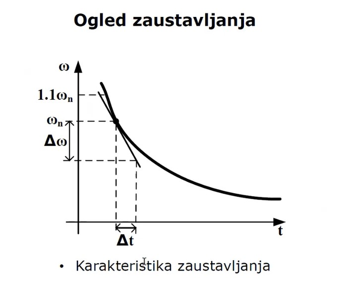
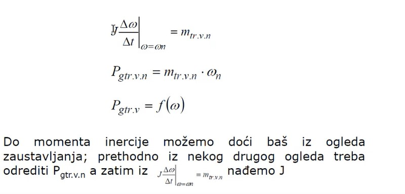
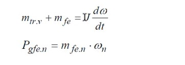
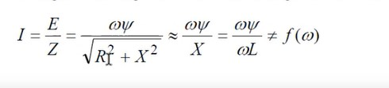
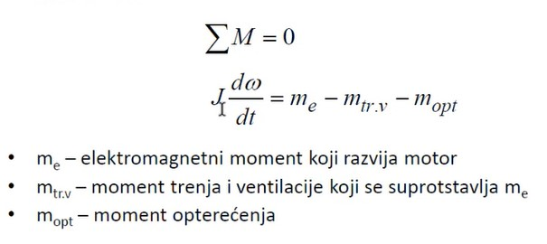
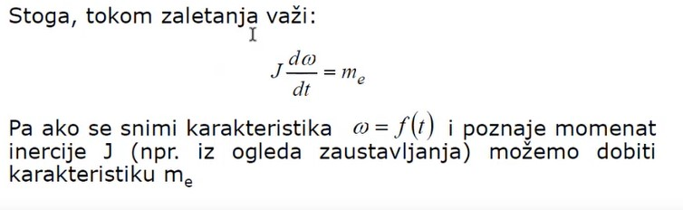
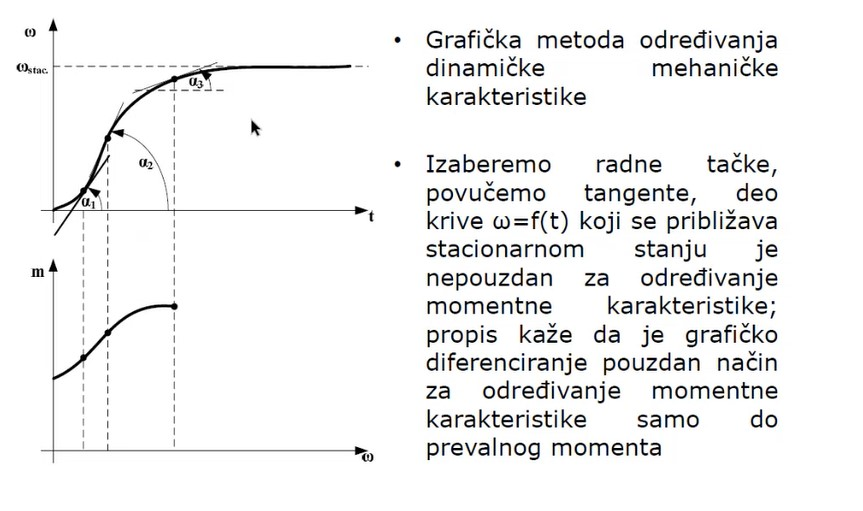

# Tema 4 — Ogled zaustavljanja

## Zašto se ovo pita

Ogled zaustavljanja je **pitanje 4 na oba raspoloživa ispita** (predrok 22. 1. 2023. i ispit 8. 9. 2023): sinhroni generator 18,5 kVA se ispituje ogledom zaustavljanja, traži se **izbor pogonske mašine sa obrazloženjem**, **postupak određivanja nepoznatog momenta inercije** i (samo na predroku) **procena vremena zaustavljanja kratko spojenog generatora** pobuđenog nominalnom strujom kratkog spoja. Ista tema je i u primerima za vežbu („Za mašinu iz prethodnog pitanja opišite oglede zaustavljanja. Čemu služe i kako se dolazi do rezultata?" — sinhroni generator 160 kVA). Iz beležaka: ogled zaustavljanja je **obavezna kategorija za SINHRONI GENERATOR**. Ispitivač očekuje četiri stvari:

1. **čemu ogled služi** — određivanje mehaničkih gubitaka (trenje i ventilacija), gubitaka u gvožđu, gubitaka u bakru i, pre svega, **momenta inercije $J$**;
2. **princip** — Njutnova jednačina $J\,\mathrm{d}\omega/\mathrm{d}t = -m_{gub}$, kriva zaustavljanja $\omega(t)$ i **tangenta** u radnoj tački;
3. **izvođenje** — pogonska mašina (koja i zašto), zalet na $1{,}1\,\omega_n$, odspajanje, snimanje brzine tahogeneratorom;
4. **račun do broja** — iz poznatih gubitaka $J$, ili iz poznatog $J$ gubici, ili vreme zaustavljanja.

> **Prevod na običan jezik:** Zavrtiš mašinu malo iznad nominalne brzine, pustiš je da se sama zaustavlja i snimaš kako joj brzina opada. U zamajcu (rotoru) je uskladištena kinetička energija $\tfrac{1}{2}J\omega^2$ — nju „pojedu" gubici koji koče mašinu. Ako znaš koliki su gubici, iz brzine opadanja krive izvučeš $J$; ako znaš $J$, iz krive izvučeš gubitke. A biranjem šta je uključeno tokom zaustavljanja biraš KOJI gubici koče: sve isključeno → samo trenje i ventilacija; pobuda uključena, stator otvoren → još i gvožđe; pobuda uključena, stator kratko spojen → još i bakar. To je ceo ogled — jedna jednačina i tri varijante.

## Teorija — sve što moraš znati

### Šta je ogled zaustavljanja i čemu služi

Iz beležaka, doslovno: **zaletimo mašinu na neku brzinu i isključimo je sa napajanja, pustimo je da se zaustavi — ako je skroz isključena sa napajanja, zaustavljaće se usled trenja, zbog akumulisane energije (mehanički gubici).** Mašina posle isključenja nema pogonsku snagu — jedino što je održava u obrtanju je kinetička energija obrtnih masa:

$$
W_{kin} = \frac{1}{2}J\omega^2,
$$

gde je $J$ moment inercije $[\mathrm{kg\,m^2}]$, a $\omega$ ugaona brzina $[\mathrm{rad/s}]$. Tu energiju troše gubici koji se u datoj varijanti ogleda javljaju, i mašina usporava dok se ne zaustavi.

**Zašto je $J$ toliko bitan (i zašto je ogled obavezan za sinhroni generator):** sinhrona mašina je glomazan sistem i **moramo znati precizno inerciju tog sistema ako mislimo da postignemo neki stabilan odziv** — dinamika generatora u mreži (ljuljanje, stabilnost, odziv regulatora) direktno zavisi od $J$. Zato je momenat inercije jako bitna veličina i zato se ogled zaustavljanja obavezno radi na sinhronim generatorima.

### Osnovna jednačina i kriva zaustavljanja

Polazi se od Njutnove jednačine kretanja. Tokom zaustavljanja mašina se **ne napaja** — ne postoji pogonski (elektromagnetni) momenat, na rotor deluju samo momenti gubitaka koji se suprotstavljaju obrtanju:

$$
J\,\frac{\mathrm{d}\omega}{\mathrm{d}t} = -\,m_{gub}(\omega).
$$

Izvod $\mathrm{d}\omega/\mathrm{d}t$ je negativan (mašina usporava), pa je i momenat negativan — **suprotstavlja se** kretanju. U najjednostavnijoj varijanti (sve isključeno) $m_{gub} = m_{tr.v}$ — momenat trenja i ventilacije.

**Slika —** Karakteristika zaustavljanja $\omega(t)$: opadajuća kriva koja kreće od $1{,}1\,\omega_n$, prolazi kroz $\omega_n$ i asimptotski se približava nuli; u tački $\omega = \omega_n$ povučena je tangenta, a na osama su označeni odsečci $\Delta\omega$ i $\Delta t$ kojima se meri njen nagib.

> **Kako čitati šemu:** Na apscisi je vreme $t$, na ordinati ugaona brzina $\omega$. Kriva počinje od $1{,}1\,\omega_n$ — mašina je namerno zaletena 10 % IZNAD nominalne brzine. U tački gde kriva prolazi kroz $\omega_n$ povuče se tangenta; iz pravouglog trougla koji tangenta pravi sa osama očita se $\Delta\omega$ (vertikalni odsečak) i $\Delta t$ (horizontalni odsečak), pa je nagib tangente $\Delta\omega/\Delta t$ — to je vrednost izvoda $\mathrm{d}\omega/\mathrm{d}t$ u nominalnoj tački. Nagib je negativan jer mašina usporava.

**OSNOVNO PRAVILO zaustavljanja (iz beležaka, profesorov naglasak):** treba obezbediti mašini **nešto veću brzinu od nominalne, oko 10 %, zbog diferenciranja** — tangenta u tački $\omega_n$ može da se povuče samo ako kriva postoji **sa obe strane** te tačke. Ako bi se mašina zaletela tačno na $\omega_n$, nominalna tačka bi bila prva tačka snimka i izvod u njoj ne bi mogao pouzdano da se odredi.

**Numeričko diferenciranje** se radi tangentom, tačku po tačku: nagib tangente je vrednost izvoda. Tangenta u tački nominalne brzine daje $\mathrm{d}\omega/\mathrm{d}t\big|_{\omega_n}$. Pošto trenje zavisi od brzine, izvodi se mogu tražiti i na drugim brzinama — tako se dobija cela zavisnost $P_{g\,tr.v} = f(\omega)$, ne samo jedna tačka.

### Iz gubitaka $J$ — i obrnuto

**Slika —** Slajd sa predavanja: $J\,\frac{\Delta\omega}{\Delta t}\big|_{\omega=\omega_n} = m_{tr.v.n}$; $P_{g\,tr.v.n} = m_{tr.v.n}\cdot\omega_n$; $P_{g\,tr.v} = f(\omega)$; i tekst: „Do momenta inercije možemo doći baš iz ogleda zaustavljanja; prethodno iz nekog drugog ogleda treba odrediti $P_{g\,tr.v.n}$, a zatim iz $J\,\frac{\Delta\omega}{\Delta t}\big|_{\omega=\omega_n} = m_{tr.v.n}$ nađemo $J$."

> **Kako čitati šemu:** Prva jednačina je Njutnova jednačina primenjena u jednoj tački krive (po iznosima, bez znaka): proizvod momenta inercije i nagiba tangente jednak je momentu trenja i ventilacije u toj tački. Druga jednačina prevodi momenat u snagu gubitaka: $P = m\cdot\omega$. Treća kaže da se postupak ponavlja na više brzina, pa gubici postaju funkcija brzine.

Jedna jednačina, dve nepoznate ($J$ i $m_{tr.v.n}$) — zato ogled zaustavljanja uvek radi **u paru sa još jednim podatkom**, u jednom od dva smera:

- **Poznati gubici → $J$:** iz nekog drugog ogleda (ogled praznog hoda) odredi se $P_{g\,tr.v.n}$ — gubici usled trenja i ventilacije pri nominalnoj brzini. Tada je momenat trenja $m_{tr.v.n} = P_{g\,tr.v.n}/\omega_n$, pa iz nagiba tangente:
  $$
  J = \frac{m_{tr.v.n}}{\left|\dfrac{\Delta\omega}{\Delta t}\right|_{\omega=\omega_n}} = \frac{P_{g\,tr.v.n}}{\omega_n\left|\dfrac{\Delta\omega}{\Delta t}\right|_{\omega=\omega_n}}.
  $$
- **Poznat $J$ → gubici:** ako je momenat inercije poznat (iz prethodnog ogleda, iz dokumentacije), onda se iz nagiba tangente na svakoj brzini dobija momenat, pa snaga gubitaka: $P_{g\,tr.v}(\omega) = J\left|\mathrm{d}\omega/\mathrm{d}t\right|\cdot\omega$.

### Tri varijante ogleda — biranjem stanja mašine biraš koje gubitke meriš

**1) Neuzbuđena mašina (pobuda isključena, stator otvoren).** Nema fluksa, nema struja — mašinu koči **samo trenje i ventilacija**. Ovo je osnovna varijanta, iz nje se (uz poznat $J$) dobija $P_{g\,tr.v} = f(\omega)$. Zaustavljanje traje najduže.

**2) Pobuđena mašina, stator otvoren.** Iz beležaka: ako sinhronom generatoru **ne isključimo pobudu** i pustimo ga da se zaustavlja, **imaće i gubitke u gvožđu, jer ćemo u statoru imati promenljivo magnetno polje — pa će se mašina brže zaustaviti jer je pobuđena.** Jednačina dobija još jedan član:

**Slika —** Slajd: $m_{tr.v} + m_{fe} = J\,\frac{\mathrm{d}\omega}{\mathrm{d}t}$ (po iznosima) i $P_{g\,fe.n} = m_{fe.n}\cdot\omega_n$.

> **Kako čitati šemu:** Na levoj strani su sada DVA kočna momenta — trenje i ventilacija $m_{tr.v}$ (poznato iz varijante 1) plus momenat od gubitaka u gvožđu $m_{fe}$. Pošto su $J$ i $m_{tr.v}$ već određeni, iz novog (strmijeg) nagiba tangente izračuna se $m_{fe}$, a onda $P_{g\,fe.n} = m_{fe.n}\cdot\omega_n$ — gubici u gvožđu pri nominalnoj brzini.

Gubici u gvožđu se **menjaju tokom ogleda** jer zavise od brzine (tj. učestanosti): **histerezisni** su srazmerni $f$, a **vrtložne struje** sa $f^2$ — zato se i ovde tangente vuku na više brzina.

**3) Pobuđena mašina, stator kratko spojen.** Iz beležaka: **ako kratko spojimo mašinu koja je pobuđena (stator kratko spojimo), onda ćemo imati gubitke u namotaju, a gubitaka u gvožđu će biti jako malo** (fluks u mašini je u kratkom spoju mali — reakcija indukta poništava pobudni fluks). Kočenje je sada dominantno od **gubitaka u bakru statora** $P_{Cu} = 3RI^2$. Postupak iz beležaka: **moramo da smanjimo pobudu da bismo kratko spojili mašinu** (nikad se ne kratko spaja puno pobuđena mašina!), pa se onda pobuda podesi tako da **kad je mašina u kratkom spoju i brzina nominalna — struja bude nominalna, da bismo imali $P_{Cu}$ nominalno.** Zaletimo je na 110 % brzine, ostavimo pobuđenu, ne pogonimo — koči je trenje + gubici u namotaju.

**Ključni uvid (profesorov naglasak): struja kratkog spoja NE ZAVISI od brzine.**

**Slika —** Slajd: $I = \dfrac{E}{Z} = \dfrac{\omega\psi}{\sqrt{R^2+X^2}} \approx \dfrac{\omega\psi}{X} = \dfrac{\omega\psi}{\omega L} \neq f(\omega)$.

> **Kako čitati šemu:** Struja kratkog spoja je indukovani napon podeljen impedansom namotaja. Indukovani napon je $E = \omega\psi$ — srazmeran brzini. Ali i reaktansa je $X = \omega L$ — TAKOĐE srazmerna brzini. Pošto je kod sinhrone mašine $X \gg R$, otpornost u imeniocu se zanemari, pa se $\omega$ skrati: $I \approx \psi/L$ — konstanta. Beleške: „gubici usled kratkog spoja su dosta stabilni, obadvoje je proporcionalno brzini, i $U$ i $X$, pa se ne menjaju gubici." Dakle dok mašina usporava, struja (pa i $P_{Cu} = 3RI^2$) ostaje praktično konstantna — to je ono što čini račun vremena zaustavljanja rešivim u zatvorenom obliku.

**Čemu služi varijanta 3:** iz beležaka — **za vrlo velike mašine se ovako radi $P_{Cu}$, jer nije isti efekat preko $RI^2$**: otpornost izmerena UI metodom je otpornost **jednosmernoj** struji, a naizmenična struja pravi i **dodatne gubitke** (potiskivanje struje, vrtložni efekti u provodnicima) — njih hvata upravo ogled zaustavljanja kratko spojene mašine.

### Snimanje brzine — tahogenerator

Za ogled je neophodan uređaj koji **kontinualno** meri brzinu — **tahogenerator** (detaljno u Temi 2). Iz beležaka: tahogenerator je **mali generator jednosmerne struje sa konstantnom pobudom** (stalni magneti) koji se **spregne na vratilo** ispitivane mašine (kruta veza, zajedničko vratilo). Indukovani napon mu je $E = \omega\Phi\, k$ — direktno srazmeran brzini. **Snimamo indukovani napon osciloskopom tokom zaustavljanja, pa se napon direktno preslika u brzinu** (tahogenerator radi u praznom hodu — struja voltmetra/osciloskopa ne remeti fluks). Postoje i enkoder, rezolver itd., ali je tahogenerator + osciloskop standardno rešenje za ovaj ogled. Ako umesto krive brzine želimo direktno krivu **ubrzanja** (momenta), na tahogenerator se veže RC kolo koje diferencira napon (Tema 2).

### Izbor pogonske mašine — dva kriterijuma (MORA DA SE ZNA)

Ispitivana mašina je **generator** — sama sebe ne može da zaleti, treba joj spoljna pogonska mašina. Iz beležaka, profesorov naglasak: **pogonska mašina mora da obezbedi brzinu $1{,}1\,\omega_n$ i da svojom snagom pokrije gubitke ispitivane mašine — 5 do 10 puta veća snaga od gubitaka za pogonsku.**

1. **Kriterijum brzine:** pogonska mašina mora da postigne i fino podesi $1{,}1\,n_n$ (zbog osnovnog pravila zaustavljanja).
2. **Kriterijum snage:** u ustaljenom stanju pre isključenja pogonska mašina pokriva samo **gubitke** ispitivane mašine (generator je neopterećen!) — ne njenu nominalnu snagu. Bira se snaga **5–10 puta veća od gubitaka** ispitivane mašine, da pogonska mašina radi komotno i stabilno drži brzinu.

**Zašto motor jednosmerne struje sa nezavisnom pobudom?** Zato što jedini omogućava **kontinualnu i finu regulaciju brzine iznad nominalne**: armaturnim naponom se brzina vodi do nominalne, a **slabljenjem pobude** (nezavisna pobuda — struja pobude se podešava nezavisno od armature) iznad nominalne, tačno na traženih 110 %. Asinhroni motor direktno na mreži to ne može (brzina mu je zakovana za učestanost i klizanje), a sinhroni motor uopšte ne može da promeni brzinu na mreži. Uz to, pogonska mašina mora da može **da se odspoji** u trenutku početka ogleda: električno (isključi se sa napajanja) i po mogućstvu mehanički (razdvojiva spojnica) — jer ako ostane mehanički spregnuta, u snimljenoj krivi učestvuju i **njen momenat inercije i njeni gubici**, pa se meri zbirni sistem, a ne sama ispitivana mašina.

### Zaletanje vs zaustavljanje — ista jednačina, druga strana

Ogled zaletanja je „ogledalo" ogleda zaustavljanja i profesor ih predaje zajedno. **Ogled zaletanja je imperativ za asinhrone motore** (polazna struja, polazni momenat, vreme zaletanja — zbog podešavanja zaštite). Kod zaletanja se mašina **napaja** — nije kao kod zaustavljanja gde imamo inerciju sa jedne strane i gubitke sa druge, bez pogonske snage:

**Slika —** Slajd: $\sum M = 0$; $J\,\frac{\mathrm{d}\omega}{\mathrm{d}t} = m_e - m_{tr.v} - m_{opt}$, sa legendom: $m_e$ — elektromagnetni momenat koji razvija motor; $m_{tr.v}$ — momenat trenja i ventilacije koji se suprotstavlja $m_e$; $m_{opt}$ — momenat opterećenja.

> **Kako čitati šemu:** $J\,\mathrm{d}\omega/\mathrm{d}t$ je **dinamička komponenta momenta** — postoji jer se brzina menja. Na desnoj strani je pogonski momenat $m_e$ umanjen za trenje i opterećenje. Kod zaustavljanja je $m_e = 0$ (mašina isključena) pa ostaju samo kočni članovi — ista jednačina, samo bez pogonskog člana.

Pri određivanju polaznog momenta zanemaruje se momenat opterećenja (zaleće se neopterećena mašina), a pošto je polazni momenat veliki, a brzine male, **može da se zanemari i trenje**, pa tokom zaletanja važi:

**Slika —** Slajd: „Stoga, tokom zaletanja važi $J\,\frac{\mathrm{d}\omega}{\mathrm{d}t} = m_e$. Pa ako se snimi karakteristika $\omega = f(t)$ i poznaje momenat inercije $J$ (npr. iz ogleda zaustavljanja), možemo dobiti karakteristiku $m_e$."

> **Kako čitati šemu:** Ovo je veza dva ogleda: ogled ZAUSTAVLJANJA daje $J$, a onda ogled ZALETANJA sa tim $J$ daje momentnu karakteristiku $m_e(\omega)$ — diferenciranjem snimljene krive $\omega(t)$, tangenta po tangenta, isto kao kod zaustavljanja.

**Slika —** Gore: rastuća kriva zaletanja $\omega(t)$ sa tangentama u tri radne tačke (uglovi $\alpha_1$, $\alpha_2$, $\alpha_3$); dole: dobijena momentna karakteristika $m(\omega)$. Tekst na slajdu: izaberemo radne tačke, povučemo tangente; deo krive $\omega = f(t)$ koji se približava stacionarnom stanju je **nepouzdan** za određivanje momentne karakteristike — propis kaže da je grafičko diferenciranje pouzdan način samo **do prevalnog momenta**.

> **Kako čitati šemu:** U svakoj izabranoj tački krive zaletanja nagib tangente ($\tan\alpha_i$) pomnožen sa $J$ daje momenat u toj tački — tako se, tačka po tačka, gornja kriva $\omega(t)$ preslikava u donju krivu $m(\omega)$. Blizu ustaljene brzine kriva je skoro horizontalna (mali nagib), pa i mala greška očitavanja pravi veliku grešku momenta — zato se diferencira samo od nulte do prevalne brzine; posle prevalne tačke momentna karakteristika se dobija iz ogleda opterećenja (strma je). Direktno pokretanje male asinhrone mašine traje sekundu-dve — prekratko za snimanje; zalet se produžava **smanjenjem napona** (momenat je srazmeran $U^2$: duplo manji napon → 4 puta manji momenat, duži zalet).

## Oprema i šema merenja

Za ogled zaustavljanja sinhronog generatora treba:

| Oprema | Izbor i obrazloženje |
|---|---|
| **Pogonska mašina** | Motor jednosmerne struje sa nezavisnom pobudom; snaga 5–10 × gubici ispitivane mašine; opseg brzine do najmanje $1{,}1\,n_n$ (slabljenje polja); napaja se iz regulisanog izvora (armaturni napon + nezavisni pobudni izvor) |
| **Spojnica** | Razdvojiva (kandžasta/fikciona) mehanička spojnica pogonska mašina–generator, da se pogon može odspojiti; ako ostane spregnut, meri se zbirno $J$ |
| **Tahogenerator** | Jednosmerni TG sa stalnim magnetima, kruto spregnut na slobodan kraj vratila generatora; konstanta poznata (npr. 15/1000 V/(o/min)) |
| **Osciloskop** (ili pisač/akvizicija) | Snima napon TG-a tokom celog zaustavljanja → kriva $\omega(t)$ |
| **Pobudni izvor generatora** | Regulisani jednosmerni izvor (za varijante 2 i 3); za dati generator natpisna pločica kaže 112 V / 4 A |
| **Kratkospojni pribor** (varijanta 3) | Tri kratkospojne veze velikog preseka na priključcima statora + **ampermetar sa mekim gvožđem** (elektromagnetni — struja kratkog spoja je naizmenična, učestanost prati brzinu) u jednoj fazi, vezan **preko strujnog mernog transformatora** npr. 30/5 ili 50/5 A/A, jer je $I_n = 26{,}7\ \mathrm{A} > 6\ \mathrm{A}$ (pravilo iz beležaka — isto kao u Varijaciji 1) — njime se podešava nominalna struja kratkog spoja |

**Recept za crtanje šeme** (u skripti nema gotove slike šeme, crta se ovako, sleva nadesno):

1. Levo: **motor jednosmerne struje** (krug sa oznakom M=) — armatura na regulisani jednosmerni izvor preko prekidača; posebna granа: nezavisna pobuda na svoj izvor sa promenljivim otpornikom (slabljenje polja → brzina iznad nominalne).
2. Vratilo motora ide na **razdvojivu spojnicu** (dve crtice sa razmakom), pa na **ispitivani sinhroni generator** (krug sa G∼). Pobudni namotaj generatora preko prekidača na regulisani pobudni izvor.
3. Na drugi (slobodni) kraj vratila generatora — **tahogenerator** (mali krug TG), kruta veza (crta se na istoj osi vratila). Sa priključaka TG-a dve žice na **osciloskop**.
4. Za varijantu kratkog spoja: sva tri statorska priključka generatora vezana kratkospojnim vezama u jednu tačku, u jednoj fazi **ampermetar** (redno u kratkospojnoj vezi, preko strujnog mernog transformatora).

Tok ogleda kroz šemu: motor zaleti ceo sklop na $1{,}1\,n_n$ → prekidačem se motor isključi (i spojnica razdvoji) → generator usporava → TG daje napon srazmeran brzini → osciloskop beleži $\omega(t)$.

## Rešeno ispitno pitanje

> **Predrok, 22. januar 2023, pitanje 4:** „Sinhroni generator 18,5 kVA; 400 V; 1500 o/min; cosφ=0,8; 26,7 A; napon pobude 112 V; struja pobude 4 A se ispituje ogledom zaustavljanja. Izabrati odgovarajuću pogonsku mašinu pomoću koje se dati ogled može ostvariti i objasniti kako bi se iz datog ogleda mogao odrediti nepoznati momenat inercije generatora. Zatim, ukoliko vam je nakon tog ogleda poznat momenat inercije koji iznosi 5 kgm², odredite što približnije vreme zaustavljanja (sa sinhrone brzine obrtanja na nultu brzinu) kratko spojenog generatora koji je pobuđen nominalnom strujom kratkog spoja."
>
> (Na ispitu 8. 9. 2023. isto pitanje, ali **bez** poslednjeg dela — staje kod određivanja momenta inercije.)

### Model odgovor

**Korak 0 — čitanje natpisne pločice i provera.**

$$
I_n = \frac{S_n}{\sqrt{3}\,U_n} = \frac{18\,500}{\sqrt{3}\cdot 400} = 26{,}7\ \mathrm{A} \quad\checkmark\ \text{(slaže se sa pločicom)}
$$

$$
P_n = S_n\cos\varphi = 18{,}5\cdot 0{,}8 = 14{,}8\ \mathrm{kW},\qquad
\omega_n = \frac{2\pi n_n}{60} = \frac{2\pi\cdot 1500}{60} = 157{,}1\ \mathrm{rad/s}.
$$

Mašina je četvoropolna ($n_s = 1500\ \mathrm{o/min}$ na 50 Hz → $p = 2$).

**Korak 1 — izbor pogonske mašine (dva kriterijuma iz beležaka).**

*Kriterijum snage:* pogonska mašina pokriva samo **gubitke** neopterećenog generatora. Stepen iskorišćenja nije zadat — **pretpostavljam** $\eta_n = 0{,}9$, što je inženjerski razumno za malu sinhronu mašinu od 18,5 kVA (male mašine imaju relativno veće gubitke; za mašine ove klase $\eta$ je tipično 88–92 %). Tada su ukupni nominalni gubici:

$$
P_{gub} = \frac{P_n}{\eta_n} - P_n = \frac{14{,}8}{0{,}9} - 14{,}8 = 16{,}44 - 14{,}8 \approx 1{,}64\ \mathrm{kW}.
$$

Po pravilu iz beležaka pogonska mašina treba da ima **5–10 puta veću snagu od gubitaka**: $5\cdot 1{,}64 \approx 8{,}2\ \mathrm{kW}$ do $10\cdot 1{,}64 \approx 16{,}4\ \mathrm{kW}$.

*Kriterijum brzine:* mora da obezbedi $1{,}1\,n_n = 1650\ \mathrm{o/min}$ (osnovno pravilo zaustavljanja — zalet 10 % iznad nominalne zbog diferenciranja).

**Izbor: motor jednosmerne struje sa nezavisnom pobudom, snage ≈ 11 kW, sa opsegom brzine do najmanje 1650 o/min.** Obrazloženje: jedino MJS sa nezavisnom pobudom omogućava kontinualnu i finu regulaciju brzine — armaturnim naponom do nominalne, slabljenjem polja iznad nominalne, tačno na 1650 o/min; lako se odspaja (isključenje armature + razdvojiva spojnica). Sprega sa generatorom je preko razdvojive spojnice, a na vratilo generatora se kruto veže tahogenerator čiji se napon snima osciloskopom (npr. TG konstante 15/1000 V/(o/min): na 1650 o/min daje $0{,}015\cdot 1650 = 24{,}75\ \mathrm{V}$, na 1500 o/min $22{,}5\ \mathrm{V}$ — pogodno za osciloskop).

**Korak 2 — postupak određivanja nepoznatog momenta inercije $J$.**

Jednačina ogleda ima dve nepoznate ($J$ i gubici), pa se prethodno **iz nekog drugog ogleda odredi $P_{g\,tr.v.n}$** — gubici usled trenja i ventilacije pri nominalnoj brzini (ogled praznog hoda: meri se snaga koju pogonska mašina predaje neuzbuđenom generatoru pri $n_n$). Zatim:

1. Generator **neuzbuđen** (pobuda isključena), stator otvoren — koči ga samo trenje i ventilacija.
2. MJS zaleti sklop na $1{,}1\,n_n = 1650\ \mathrm{o/min}$; brzina se ustali.
3. Pogonska mašina se **isključi i odspoji** (spojnica), generator se prepusti slobodnom zaustavljanju.
4. Osciloskopom se preko tahogeneratora snimi **kriva zaustavljanja** $\omega(t)$.
5. U tački $\omega = \omega_n$ povuče se **tangenta** i očita njen nagib $\Delta\omega/\Delta t$.
6. Iz Njutnove jednačine (po iznosima):
$$
J\left|\frac{\Delta\omega}{\Delta t}\right|_{\omega=\omega_n} = m_{tr.v.n} = \frac{P_{g\,tr.v.n}}{\omega_n}
\quad\Rightarrow\quad
J = \frac{P_{g\,tr.v.n}}{\omega_n\left|\dfrac{\Delta\omega}{\Delta t}\right|_{\omega=\omega_n}}.
$$

*Brojčana ilustracija (konzistentna sa podacima):* po pravilu palca iz beležaka (60 % Cu, 30 % Fe, 10 % trenje i ventilacija) mehanički gubici su $P_{g\,tr.v.n} \approx 0{,}1\cdot 1{,}64\ \mathrm{kW} \approx 164\ \mathrm{W}$, pa je $m_{tr.v.n} = 164/157{,}1 \approx 1{,}05\ \mathrm{N\,m}$. Ako se sa krive očita nagib tangente $\left|\Delta\omega/\Delta t\right| = 0{,}21\ \mathrm{rad/s^2}$ (tj. brzina u okolini nominalne tačke opada za oko 2 o/min svake sekunde):

$$
J = \frac{1{,}05}{0{,}21} = 5\ \mathrm{kg\,m^2}.
$$

**Korak 3 — vreme zaustavljanja kratko spojenog generatora ($J = 5\ \mathrm{kg\,m^2}$).**

*Postavka ogleda:* pobuda se **smanji**, stator se kratko spoji (preko ampermetra), pa se pri nominalnoj brzini pobuda podešava dok struja kratkog spoja ne bude **nominalna**: $I_k = I_n = 26{,}7\ \mathrm{A}$ — to znači „pobuđen nominalnom strujom kratkog spoja". Tada su gubici u bakru statora nominalni. Zatim se pogon isključi i mašina se pusti da se zaustavlja.

*Ključni uvid:* struja kratko spojenog pobuđenog generatora ne zavisi od brzine:

$$
I = \frac{E}{Z} = \frac{\omega\psi}{\sqrt{R^2 + X^2}} \approx \frac{\omega\psi}{\omega L} = \frac{\psi}{L} \neq f(\omega),
$$

jer su i indukovani napon ($E = \omega\psi$) i reaktansa ($X = \omega L$) srazmerni brzini, a $X \gg R$. Dakle, dok mašina usporava, struja ostaje $\approx I_n$, pa je kočna snaga **konstantna**:

$$
P_{koč} \approx P_{Cu} = 3R I_n^2 = \mathrm{const}.
$$

(Gubici u gvožđu su u kratkom spoju jako mali — fluks je mali; trenje i ventilaciju za prvu procenu zanemarujem, o tome komentar na kraju.)

*Procena $P_{Cu}$ iz podataka pločice:* otpornost statora nije zadata, pa $P_{Cu}$ procenjujem preko pravila palca iz beležaka — od ukupnih gubitaka **60 % su gubici u bakru, a kod sinhrone mašine svih 60 % ide na stator**:

$$
P_{Cu} \approx 0{,}6\cdot P_{gub} = 0{,}6\cdot 1644\ \mathrm{W} \approx 987\ \mathrm{W} \approx 1\ \mathrm{kW}.
$$

*(Provera smislenosti: to odgovara $R = P_{Cu}/(3I_n^2) = 987/(3\cdot 26{,}7^2) \approx 0{,}46\ \mathrm{\Omega}$ po fazi, tj. oko 5 % u relativnim jedinicama — razumna vrednost za malu mašinu. Da je zadatak dao izmereno $R$ iz UI metode, koristio bih $P_{Cu} = 3RI_n^2$ direktno.)*

*Izvođenje vremena zaustavljanja.* Pažnja: konstantna je **snaga**, ne momenat! Kočni momenat je $m = P_{Cu}/\omega$ — što mašina sporije ide, momenat je VEĆI (hiperbola), pa se zaustavljanje pri kraju ubrzava. Njutnova jednačina:

$$
J\,\frac{\mathrm{d}\omega}{\mathrm{d}t} = -\,\frac{P_{Cu}}{\omega}
\quad\Rightarrow\quad
J\,\omega\,\mathrm{d}\omega = -\,P_{Cu}\,\mathrm{d}t.
$$

Integracija od $\omega_s$ (sinhrona brzina, $t=0$) do $0$ (zaustavljanje, $t = t_z$):

$$
\int_{\omega_s}^{0} J\,\omega\,\mathrm{d}\omega = -\,P_{Cu}\int_{0}^{t_z}\mathrm{d}t
\quad\Rightarrow\quad
\frac{J\,\omega_s^2}{2} = P_{Cu}\,t_z
\quad\Rightarrow\quad
\boxed{\,t_z = \frac{J\,\omega_s^2}{2\,P_{Cu}}\,}
$$

Fizički smisao: kinetička energija $\tfrac{1}{2}J\omega_s^2$ se troši konstantnom snagom $P_{Cu}$ — vreme je energija kroz snagu.

*Uvrštavanje:*

$$
W_{kin} = \frac{1}{2}\cdot 5\ \mathrm{kg\,m^2}\cdot (157{,}1\ \mathrm{rad/s})^2 \approx 61{,}7\ \mathrm{kJ},
$$

$$
t_z = \frac{5\cdot 157{,}1^2}{2\cdot 987} = \frac{61\,685}{987} \approx 62{,}5\ \mathrm{s} \approx 1\ \text{minut}.
$$

*Komentar reda veličine i granica važenja:*

- **Vreme zaustavljanja je reda jednog minuta** (≈ 60 s). Procena je blago **precenjena**: trenje i ventilacija (≈ 164 W na nominalnoj brzini) dodatno koče — sa njima bi ispalo $t_z \approx 61{,}7\ \mathrm{kJ}/(987+164)\ \mathrm{W} \approx 54\ \mathrm{s}$. Realan odgovor: **50–60 s**.
- Aproksimacija $X \gg R$ (struja konstantna) važi sve dok je $\omega L \gg R$, tj. do brzine od svega $\approx 5\ \%$ nominalne — uz **pretpostavku** tipične sinhrone reaktanse od oko 1 relativne jedinice, $X_s \approx U_n^2/S_n = 400^2/18\,500 \approx 8{,}6\ \mathrm{\Omega}$ na nominalnoj brzini, prema $R \approx 0{,}46\ \mathrm{\Omega}$: $X = R$ tek na $\approx 80\ \mathrm{o/min}$. Ispod te brzine struja i kočenje opadaju, ali je tamo preostala kinetička energija svega $(0{,}05)^2 \approx 0{,}3\ \%$ ukupne — na rezultat praktično ne utiče.

## Varijacije zadatka

### Varijacija 1 — primer-pitanje sa vežbi: sinhroni generator 160 kVA; Y; 415 V; 3000 o/min

> „Za mašinu iz prethodnog pitanja opišite oglede zaustavljanja. Čemu služe i kako se dolazi do rezultata?"

**Odgovor.** Ogledi zaustavljanja (množina — tri varijante!) služe za određivanje momenta inercije $J$, mehaničkih gubitaka $P_{g\,tr.v}$, gubitaka u gvožđu $P_{g\,fe}$ i gubitaka u bakru $P_{Cu}$ (sa dodatnim gubicima usled naizmenične struje). Za sinhroni generator je ogled obavezan — $J$ je ključan za stabilan odziv mašine u pogonu.

1. **Pogonska mašina.** Nominalna struja: $I_n = 160\,000/(\sqrt{3}\cdot 415) \approx 222{,}6\ \mathrm{A}$; nominalna snaga uz **pretpostavku** $\cos\varphi = 0{,}8$ (nije zadat): $P_n = 128\ \mathrm{kW}$. Uz **pretpostavku** $\eta = 0{,}93$ (veća mašina — bolji stepen iskorišćenja nego kod 18,5 kVA): $P_{gub} = 128/0{,}93 - 128 \approx 9{,}6\ \mathrm{kW}$. Pogonska mašina: $5$–$10\times P_{gub} = 48$–$96\ \mathrm{kW}$ → **MJS sa nezavisnom pobudom ≈ 55 kW**, opseg brzine do $1{,}1\cdot 3000 = 3300\ \mathrm{o/min}$ (dvopolna mašina, $\omega_s = 314{,}2\ \mathrm{rad/s}$ — proveriti da MJS mehanički sme 3300 o/min!). Razdvojiva spojnica, tahogenerator na vratilu, osciloskop.
2. **Ogled 1 (neuzbuđena):** zalet na 3300 o/min, odspajanje, snimanje $\omega(t)$; ako je iz ogleda praznog hoda poznato $P_{g\,tr.v.n}$ ($\approx 0{,}1\cdot 9{,}6 \approx 1\ \mathrm{kW}$ po pravilu palca), iz tangente u $\omega_n$: $J = P_{g\,tr.v.n}\,/\,(\omega_n\left|\Delta\omega/\Delta t\right|)$. Obrnuto, ako je $J$ poznat, tangente na više brzina daju $P_{g\,tr.v} = f(\omega)$.
3. **Ogled 2 (pobuđena, otvoren stator):** kriva je strmija; iz razlike nagiba, uz poznato $J$ i $m_{tr.v}$: $m_{fe} = J\left|\mathrm{d}\omega/\mathrm{d}t\right| - m_{tr.v}$, pa $P_{g\,fe.n} = m_{fe.n}\,\omega_n$. Gubici u gvožđu se menjaju sa brzinom (histerezis ∝ f, vrtložne ∝ f²) — tangente na više brzina.
4. **Ogled 3 (pobuđena, kratko spojen stator):** smanji se pobuda, stator kratko spoji preko ampermetra (222,6 A — obavezno preko **strujnog mernog transformatora**, npr. 250/5, jer je struja > 6 A), pobuda se podesi da pri $n_n$ bude $I_k = I_n$; iz nagiba se uz poznate $J$ i $m_{tr.v}$ dobija $P_{Cu}$ sa dodatnim gubicima — kod velikih mašina se $P_{Cu}$ upravo ovako meri, jer $3RI^2$ sa jednosmernim $R$ ne hvata dodatne gubitke.

### Varijacija 2 — isti generator 18,5 kVA, ali pobuda ISKLJUČENA: koliko traje zaustavljanje?

> „Za generator iz ispitnog zadatka ($J = 5\ \mathrm{kg\,m^2}$) proceniti vreme zaustavljanja sa nominalne brzine ako je mašina neuzbuđena, otvorenog statora, i uporediti sa kratko spojenom mašinom."

**Rešenje.** Sada koči samo trenje i ventilacija, $P_{g\,tr.v.n} \approx 164\ \mathrm{W}$ (10 % gubitaka). Kinetička energija je ista: $W_{kin} \approx 61{,}7\ \mathrm{kJ}$. Procena zavisi od toga kako trenje zavisi od brzine, pa dajem dve granice:

- ako bi kočna **snaga** bila konstantna (164 W na svim brzinama): $t_z \approx 61\,685/164 \approx 375\ \mathrm{s} \approx 6{,}3$ minuta;
- ako je konstantan kočni **momenat** $m_{tr.v.n} = 164/157{,}1 = 1{,}05\ \mathrm{N\,m}$ (suvo trenje): $J\,\mathrm{d}\omega/\mathrm{d}t = -m_{tr.v}$ → linearno opadanje brzine, $t_z = J\omega_s/m_{tr.v} = 5\cdot 157{,}1/1{,}05 \approx 748\ \mathrm{s} \approx 12{,}5$ minuta.

Realnost je između (ventilacioni deo opada sa brzinom brže od suvog trenja): **red veličine je 6–12 minuta — oko deset puta duže nego kratko spojena mašina** (≈ 1 minut). To je i intuitivno: gubici koji koče su ≈ 7 puta manji (164 W prema 987 + 164 = 1151 W), a pri malim brzinama još i slabe. Zato beleške kažu da se pobuđena mašina „brže zaustavlja" — svaki dodatni gubitak skraćuje zaustavljanje. (Međuvarijanta: pobuđena mašina otvorenog statora — koče $P_{fe} + P_{tr.v} \approx 493 + 164 \approx 657\ \mathrm{W}$ na nominalnoj brzini, energetska procena $61\,685/657 \approx 94\ \mathrm{s}$ — brže od neuzbuđene, sporije od kratko spojene.)

### Varijacija 3 — šta ako tahogenerator nije dostupan?

> „Kako biste snimili krivu zaustavljanja sinhronog generatora ako tahogenerator nije na raspolaganju?"

**Odgovor.** Treba **kontinualan** zapis brzine (jedno očitavanje nije dovoljno — vuku se tangente!), pa ručni tahometri (centrifugalni, integralni, kvarcni) nisu pravo rešenje: daju pojedinačna očitavanja, zahtevaju stalno prislanjanje šiljka na vratilo i bliski pristup mašini koja usporava. Prave alternative:

1. **Sam ispitivani generator kao sopstveni „tahogenerator".** Kod varijante sa uključenom pobudom i otvorenim statorom na priključcima statora postoji indukovani napon $E = 4{,}44\,f\,\Phi\,N$, a njegova **frekvencija** je kruto vezana za brzinu: $f = p\,n/60$ (za našu četvoropolnu mašinu $f = 2n/60$; na 1500 o/min $f = 50\ \mathrm{Hz}$). Snimi se napon jedne faze osciloskopom i iz trenutne periode signala se, deo po deo zapisa, izračuna brzina — merenje frekvencije je po beleškama čak preciznije od merenja amplitude, jer ne zavisi od fluksa ni od klase instrumenta.
2. **Kod kratko spojene mašine** stator nema napon, ali kroz kratkospojnu vezu teče struja čija je frekvencija takođe $p\,n/60$ — osciloskopom (preko strujnog mernog transformatora ili shunta) se snimi struja i iz njene periode dobije brzina.
3. **Enkoder ili rezolver** na vratilu (beleške ih pominju uz tahogenerator): enkoder daje impulse čijim se brojanjem u vremenu dobija brzina; rezolver iz faznog stava sinusnog i kosinusnog namotaja daje položaj, pa diferenciranjem brzinu. Zahtevaju montažu na vratilo, kao i TG.
4. Jedino kod neuzbuđene mašine bez pristupa vratilu ostaje improvizacija pojedinačnim očitavanjima tahometra u ravnomernim vremenskim razmacima (štoperica) — kriva se rekonstruiše iz tačaka, uz osetno lošiju tačnost diferenciranja.

## Česte greške i zamke na ispitu

1. **Zalet tačno na nominalnu brzinu.** Bez rezerve od 10 % tangenta u $\omega_n$ ne može da se povuče (kriva mora postojati sa obe strane tačke) — a to je baš ono što profesor zove OSNOVNIM PRAVILOM zaustavljanja. Uvek napiši: zalet na $1{,}1\,n_n$.
2. **Dimenzionisanje pogonske mašine prema snazi generatora.** Pogonska mašina NE pokriva 18,5 kVA — generator je neopterećen, pokrivaju se samo gubici (≈ 1,6 kW), pa pravilo 5–10 × gubitaka daje ≈ 8–16 kW. Ko napiše „pogonska mašina 20 kW jer generator ima 18,5 kVA" — pokazao je da ne razume ogled (slučajna numerička bliskost ovde vara!).
3. **Konstantan momenat umesto konstantne snage kod kratkog spoja.** Konstantna je STRUJA, dakle snaga $P_{Cu} = 3RI^2$; momenat je $P_{Cu}/\omega$ i raste kako mašina usporava. Ko računa $t_z = J\omega_s/m$ sa momentom uzetim na nominalnoj brzini, dobije tačno **dvostruko duže** vreme (125 s umesto 62,5 s) — faktor 2 iz integrala je razlika između trougla i pravougaonika.
4. **Mešanje $n$ i $\omega$.** U $W_{kin} = \tfrac{1}{2}J\omega^2$ i $t_z = J\omega_s^2/(2P_{Cu})$ ide ugaona brzina u $\mathrm{rad/s}$ ($\omega_s = 2\pi n/60 = 157{,}1\ \mathrm{rad/s}$), ne 1500! Sa $n$ u o/min rezultat je besmislen (greška $(60/2\pi)^2 \approx 91$ puta).
5. **„Pobuđen nominalnom strujom pobude" ≠ „pobuđen nominalnom strujom kratkog spoja."** Traži se struja pobude podešena tako da struja STATORA u kratkom spoju bude nominalna (26,7 A) — obično znatno manja od nominalne pobude. I redosled: prvo smanji pobudu, pa kratko spoji, pa diži pobudu do $I_k = I_n$ — nikad se ne kratko spaja puno pobuđena mašina.
6. **Zaboravljena pogonska mašina u snimku.** Ako pogonska mašina ostane mehanički spregnuta tokom zaustavljanja, snimljeno $J$ je zbir momenata inercije generatora, spojnice i pogonske mašine, a kočе i njeni gubici — zato razdvojiva spojnica, ili bar eksplicitna napomena da se meri zbirni sklop.

## Kontrolna pitanja za samoproveru

1. **Zašto se mašina zaleće na $1{,}1\,n_n$, a ne na $n_n$?** — Zbog diferenciranja: tangenta u nominalnoj tački zahteva da kriva $\omega(t)$ postoji sa obe strane te tačke (osnovno pravilo zaustavljanja).
2. **Kako glasi jednačina ogleda zaustavljanja i šta je u njoj nepoznato?** — $J\,\mathrm{d}\omega/\mathrm{d}t = -m_{gub}$; nagib se meri, a od preostale dve veličine jedna mora biti poznata iz drugog ogleda (poznati gubici → $J$, ili poznat $J$ → gubici).
3. **Koja dva kriterijuma određuju pogonsku mašinu?** — Brzina: mora dati $1{,}1\,\omega_n$; snaga: 5–10 puta veća od gubitaka ispitivane mašine (ne od njene nominalne snage!).
4. **Zašto je struja kratko spojenog pobuđenog generatora nezavisna od brzine?** — $I = \omega\psi/\sqrt{R^2+X^2} \approx \omega\psi/(\omega L) = \psi/L$: i EMS i reaktansa su srazmerne brzini pa se $\omega$ skrati (važi dok je $X \gg R$).
5. **Kako se razlikuju krive zaustavljanja neuzbuđene, pobuđene otvorene i pobuđene kratko spojene mašine?** — Sve strmija i kraća: koči redom samo $P_{tr.v}$; pa $P_{tr.v}+P_{fe}$; pa $P_{tr.v}+P_{Cu}$ (Fe zanemarljivo u kratkom spoju) — za naš generator redom ≈ 6–12 min, ≈ 1,5 min, ≈ 1 min.
6. **Čemu služi ogled zaletanja i šta mu daje ogled zaustavljanja?** — Zaletanjem se određuju polazna struja, polazni momenat i vreme zaleta (imperativ za asinhrone motore); iz zaustavljanja dolazi $J$, pa se iz snimljenog $\omega(t)$ pri zaletu dobija momentna karakteristika $m_e = J\,\mathrm{d}\omega/\mathrm{d}t$ — grafičkim diferenciranjem, pouzdano samo do prevalnog momenta.
