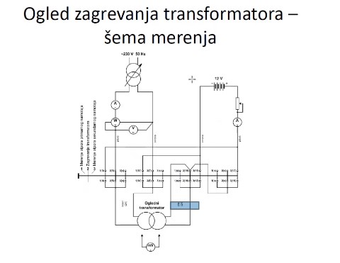

# Tema 5 — Ogled zagrevanja i određivanje temperature namotaja

## Zašto se ovo pita

Ovo je pitanje broj 5 i na predroku (22. januar 2023) i na ispitu (8. septembar 2023) — i to je pitanje koje **povezuje celu ispitnu celinu**: nadovezuje se direktno na zadatak 1 (merenje otpora namotaja UI metodom), jer se temperatura namotaja posle ogleda zagrevanja određuje upravo **preko porasta otpornosti** izmerene tom istom metodom. Ispitivač očekuje da čuje tri stvari:

1. **svrhu ogleda** — da li mašina u trajnom nominalnom radu ostaje u granicama temperatura koje propisuje **termička klasa izolacije**;
2. **kako se ogled izvodi kad od električnih mašina imaš samo ispitivani transformator** — dakle bez pogonske mašine, bez potrošača pune snage, bez drugog transformatora za metodu opozicije → **metoda kratkog spoja** (sekundar kratko spojen, primar na sniženom naponu reda $u_k$);
3. **račun temperature iz skoka otpornosti** — formula $\dfrac{R_2}{R_1}=\dfrac{235+\theta_2}{235+\theta_1}$ i fizičko **obrazloženje koji je namotaj topliji** (a to je NN namotaj, jer je unutrašnji).

> **Prevod na običan jezik:** Mašinu pustimo da radi „kao na nominali" dok se termički ne ustali, pa proverimo da li joj je izolacija u dozvoljenim temperaturama. Pošto termometar ne možemo da zabijemo u sredinu namotaja, iskoristimo to što bakar sa temperaturom povećava otpornost: izmerimo otpor hladnog i otpor toplog namotaja, iz odnosa te dve brojke izračunamo srednju temperaturu namotaja. A da ne bismo trošili punu snagu na opterećenje, transformator „varamo": kratko mu spojimo sekundar i napajamo ga sa svega ~5 % napona — struje su nominalne, gubici u bakru nominalni, a snaga koju vučemo iz mreže je samo snaga gubitaka.

## Teorija — sve što moraš znati

### 5.1 Svrha ogleda: termička klasa izolacije

Iz beležaka (profesorov naglasak): *„Ogled zagrevanja služi da ustanovimo da li mašina u normalnom radu u nominalnoj radnoj tački ima povišenje temperature propisano termičkom klasom izolacije. Nominalna radna tačka je najviša tačka sa stanovišta naprezanja koja neće dovesti do oštećenja mašine. Služi ovaj ogled da se vidi da li se mašina termički ponaša na adekvatan način i da li su odgovarajuće tačke na zadovoljavajućim temperaturama."*

**Termička klasa izolacije** je najviša temperatura koju izolacioni sistem sme trajno da izdrži a da mu vek trajanja ostane projektovani. Standardne klase:

| Klasa | Maks. temperatura | Dozvoljeno povišenje (pri ambijentu 40 °C) |
|---|---|---|
| A | 105 °C | 60 K |
| E | 120 °C | 75 K |
| B | 130 °C | 80 K |
| F | 155 °C | 105 K |
| H | 180 °C | 125 K |

Ključna posledica: **ogled ne meri „da li mašina radi", nego da li izolacija stari normalnom brzinom.** Svakih ~10 K iznad dozvoljene temperature grubo prepolovljava vek izolacije — zato se povišenje temperature stvarno proverava ogledom, a ne samo računa.

Iz beležaka još dve bitne stvari:

- *„Velika mana ogleda zagrevanja jeste dugo trajanje."* — mašina mora da dođe u **termički ustaljeno stanje**, a to su sati.
- *„Temperatura se prati najbolje direktnim merenjem na mestima gde nam treba pomoću temperaturnih senzora: termometri, Pt100 sonda, termopar (dva elementa galvanski spojena na jednom kraju — pokazuje se potencijalna razlika), otpornici NTC i PTC. Prati se temperatura svega: namotaja, ulja za transformatore, kućišta mašine, izolacije itd."*

Direktni senzori mere temperaturu **tačke** u koju su ugrađeni. Za namotaj kao celinu koristi se **indirektna metoda preko porasta otpornosti** — ona daje **srednju temperaturu namotaja** (najtoplija tačka, *hot-spot*, je tipično još 5–10 K iznad srednje). Iz beležaka: *„Kod ispravne mašine merenje otpora namotaja može da služi kao pokazatelj zagrejanosti mašine. Što su mašine manje, to je [srednja vrednost] dobar reprezent stvarne temperature u mašini."*

### 5.2 Kriva zagrevanja i vremenska konstanta — koliko ogled traje

Mašina se pri konstantnim gubicima greje po eksponencijalnom zakonu (toplotni kapacitet $C_{th}$ se puni, a odvođenje toplote raste sa pregrevanjem — potpuno ista matematika kao punjenje kondenzatora):

$$\theta(t) = \theta_a + \Delta\theta_{max}\left(1 - e^{-t/\tau_\theta}\right)$$

gde je $\theta_a$ temperatura ambijenta, $\Delta\theta_{max}$ ustaljeno povišenje temperature, a $\tau_\theta$ **termička vremenska konstanta** (odnos toplotnog kapaciteta i odvođenja toplote — velika masa i slabo hlađenje → velika $\tau_\theta$). Posle $1\tau_\theta$ dostignuto je 63 % ustaljenog povišenja, posle $3\tau_\theta$ 95 %, posle $5\tau_\theta$ 99,3 %. Zato važi isto pravilo palca kao i kod električne vremenske konstante u UI metodi: **čeka se 3 do 5 vremenskih konstanti** — samo što su ovde konstante termičke i mere se u desetinama minuta i satima, a ne u sekundama.

Praktičan kriterijum ustaljenosti (jer $\tau_\theta$ unapred ne znamo tačno): ogled traje dok **promena temperature ne padne ispod ~1 K po satu**. Iz beležaka: *„Ako merimo više vrednosti [otpornosti tokom zagrevanja], onda bismo mogli nacrtati krivu zagrevanja i odrediti vremenske konstante."* — dakle periodičnim merenjem otpora u toku ogleda dobija se cela kriva $\theta(t)$, a iz nje $\tau_\theta$ i $\Delta\theta_{max}$.

Za mali transformator od 10 kVA razumna inženjerska procena je $\tau_\theta \approx 0{,}5$–$1{,}5\ \mathrm{h}$ (pretpostavka — mala masa, prirodno hlađenje), pa ogled traje reda **3–5 sati**.

### 5.3 Kako izvesti ogled kad je na raspolaganju SAMO ispitivani transformator — metoda kratkog spoja

Tri načina da se transformator „nominalno optereti":

1. **Direktno opterećenje** — na sekundar se veže potrošač pune snage (za 10 kVA: otpornici koji troše 10 kW). Rasipa se puna snaga, treba glomazan potrošač — nemamo ga.
2. **Metoda opozicije (povratnog rada)** — dva jednaka transformatora jedan prema drugom, iz mreže se vuku samo gubici. Ali traži **drugi transformator** — po tekstu zadatka ga nemamo.
3. **Metoda kratkog spoja** — jedino što nam treba jeste **regulisani naponski izvor male snage** (regulacioni autotransformator na mrežu 230 V — to je merna oprema/izvor, ne „druga električna mašina"). Ovo je odgovor koji se očekuje.

**Princip:** sekundar se kratko spoji (masivnom kratkospojnom vezom), a primar se napaja **sniženim naponom približno jednakim naponu kratkog spoja** $u_k$. Pošto je pri kratkom spoju impedansa transformatora upravo impedansa kratkog spoja, napon od $u_k = 5\ \%$ nominalnog protera kroz oba namotaja **tačno nominalne struje**:

$$U_{k} = u_k \cdot U_{1n} = 0{,}05 \cdot 1000\ \mathrm{V} = 50\ \mathrm{V} \quad\Rightarrow\quad I_1 = I_{1n},\ I_2 = I_{2n}$$

Nominalne struje → **nominalni gubici u bakru** $P_{Cu,n}$, dakle namotaji se greju kao u nominalnom radu, a iz mreže se vuče samo snaga gubitaka (nekoliko stotina vati umesto 10 kW).

**Koliko slika greši zbog gvožđa?** Gubici u gvožđu zavise od indukcije, a indukcija od napona: $P_{Fe} \propto U^2$. Na 5 % napona:

$$P_{Fe,ogled} \approx P_{Fe,n}\cdot (0{,}05)^2 = 0{,}0025\, P_{Fe,n}$$

— praktično nula (za naš transformator: $87{,}7 \cdot 0{,}0025 \approx 0{,}22\ \mathrm{W}$). U ogledu dakle **nedostaju gubici u gvožđu**: unosimo $P_{Cu,n} = 438{,}6\ \mathrm{W}$ umesto ukupnih $P_{\gamma n} = 526{,}3\ \mathrm{W}$, tj. samo ~83 % toplote, pa bi izmereno povišenje temperature bilo potcenjeno.

**Korekcija:** struja se podigne iznad nominalne tako da gubici u bakru nadoknade i gvožđe, tj. da u mašinu unesemo ukupne nominalne gubitke:

$$I' = I_n\sqrt{\frac{P_{Cu,n}+P_{Fe,n}}{P_{Cu,n}}} = I_n\sqrt{1+\frac{P_{Fe}}{P_{Cu}}}$$

Za odnos $P_{Cu}:P_{Fe}=5:1$ to je $I' = I_n\sqrt{1{,}2} = 1{,}095\,I_n$, uz napon ≈ $1{,}095\cdot U_k = 1{,}095\cdot 50 \approx 54{,}8\ \mathrm{V}$. (Gruba alternativa: raditi tačno sa $I_n$, pa izmereno povišenje računski uvećati faktorom $P_{\gamma n}/P_{Cu,n} = 1{,}2$, jer je povišenje približno srazmerno unetim gubicima.)

### 5.4 Merenje temperature preko porasta otpornosti — izvođenje formule

Specifična otpornost bakra raste približno linearno sa temperaturom. Ako se linearna zavisnost referiše na $0\ \mathrm{^\circ C}$:

$$R(\theta) = R_0\,(1+\alpha_0\,\theta), \qquad \alpha_0 \approx \frac{1}{235}\ \mathrm{^\circ C^{-1}} \ \text{(bakar)}$$

Odnos otpornosti na dve temperature:

$$\frac{R_2}{R_1} = \frac{R_0\left(1+\dfrac{\theta_2}{235}\right)}{R_0\left(1+\dfrac{\theta_1}{235}\right)} = \boxed{\frac{235+\theta_2}{235+\theta_1}}$$

Primetiti dve stvari:

- $R_0$ se **skratio** — iz beležaka: *„U hladnom i toplom stanju se meri otpor da se eliminiše otpor na 0 Celzijusa."* Ne treba nam ni apsolutna vrednost otpornosti, dovoljan je **odnos** (zato u zadatku rade procenti!).
- **Intuicija konstante 235:** prava $R(\theta)$, produžena unazad, seče temperaturnu osu u $-235\ \mathrm{^\circ C}$ — to je „fiktivna nula otpornosti" bakra. Za **aluminijum** je ta tačka $-225\ \mathrm{^\circ C}$, pa formula glasi $\frac{R_2}{R_1}=\frac{225+\theta_2}{225+\theta_1}$.

Rešeno po traženoj temperaturi toplog namotaja:

$$\theta_2 = \frac{R_2}{R_1}\,(235+\theta_1) - 235$$

**Praktična pravila iz beležaka:**

- *„Najbolje je ogled vršiti istom strujom i za toplo i za hladno, jer se tada eliminiše greška ampermetra."* — sistematska greška ampermetra uđe isto u obe brojke, pa se u količniku skrati.
- Merenje toplog otpora je UI metodom (jednosmerni izvor, predotpor, kretni kalem) — dakle i ovde se čeka **3–5 električnih vremenskih konstanti** $\tau = L/(R+R_{pred})$ da iščezne efekat induktivnosti; predotpor tu konstantu skraćuje.
- **Namotaj počinje da se hladi čim se isključi napajanje!** Merenje toplog otpora mora ili odmah po isključenju (zato su u šemi grebenaste sklopke — prebacivanje traje sekunde), ili se uzme **niz očitavanja u vremenu pa se ekstrapoliše unazad na trenutak isključenja** (vidi Varijaciju 3).

### 5.5 Zašto je NN namotaj topliji od VN namotaja

Konstrukcija transformatora: na jezgro (magnetno kolo) se **prvo namotava NN namotaj** — treba mu manje izolacionog rastojanja prema uzemljenom jezgru — a **VN namotaj ide preko njega, spolja**. Posledice po hlađenje:

1. **NN je unutra, „u sendviču"** između jezgra i VN namotaja — njegova toplota mora da prođe kroz VN namotaj ili kroz uske kanale; VN je spolja i direktno ga zapljuskuje rashladni medijum (vazduh/ulje) → VN se bolje hladi.
2. **Jezgro je i samo izvor toplote** ($P_{Fe}$ u nominalnom radu) i greje upravo susedni NN namotaj.
3. Argument gustine struje: NN namotaj vodi veliku struju (ovde $100\ \mathrm{A}$) debelim provodnicima na najskučenijem prostoru uz jezgro; gustine struje su po pravilu bliske u oba namotaja (pa specifični gubici po zapremini ne prave veliku razliku), ali se kod NN namotaja zbog kompaktnog smeštaja često uzima i nešto veća gustina struje — što samo pojačava zaključak. **Presuđuje, dakle, položaj i hlađenje, a ne napon.**

Zato: **veći skok otpornosti (viša temperatura) pripada NN namotaju.**

## Oprema i šema merenja

**Slika —** „Ogled zagrevanja transformatora — šema merenja" iz beležaka: gore levo je mrežni izvor ~230 V, 50 Hz sa regulacionim (auto)transformatorom i naizmeničnim instrumentima A, W, V; gore desno je jednosmerni deo — baterija 12 V sa predotporom i ampermetrom (UI metoda); u sredini su dva reda **grebenastih sklopki** čiji položaji (ispisani vertikalno levo) biraju režim: *merenje otpora primarnog namotaja / zagrevanje transformatora / merenje otpora sekundarnog namotaja*; dole u sredini je **ogledni transformator**, a plavo označeno mesto je **kratkospojna veza** na sekundaru; na priključke namotaja se pri UI merenju prislanja voltmetar.

> **Kako čitati šemu:** Iz beležaka: *„Označeno mesto [je] da kratko spojimo — to može biti jedna slika, a ova UI metoda desno je druga slika. Ovo u sredini su grebenaste sklopke."* Šema je dakle **superpozicija dva kola** koja dele isti transformator: (1) **kolo zagrevanja** — mreža → regulacioni autotransformator (postepeno dizanje napona od nule) → ampermetar (kontrola da teče nominalna struja) i vatmetar (kontrola da su gubici $\approx P_{Cu,n}$), voltmetar (kontrola $U \approx u_k U_{1n}$) → primar transformatora; sekundar je kratko spojen označenom vezom; (2) **kolo merenja otpora** — baterija 12 V → predotpor → ampermetar sa kretnim kalemom → namotaj, sa voltmetrom prislonjenim na priključke namotaja. Grebenaste sklopke omogućavaju da se **za par sekundi** namotaj prebaci iz kola zagrevanja u merno kolo — bez prevezivanja žica — što je presudno jer se namotaj hladi od trenutka isključenja.

Merenje otpora (i hladno i toplo) izvodi se šemom UI metode koju već znaš iz Teme 1:

**Slika —** UI metoda u naponskom spoju („voltmetar pre ampermetra"): jednosmerni izvor (baterija), promenljivi predotpor, ampermetar kruto u kolu, voltmetar se **samo prislanja** na priključke namotaja $L, R$ (crta se sa strelicama — nije fiksan element, poslednji se priključuje i prvi skida zbog naponskog impulsa $L\,di/dt$ pri prekidanju kola).

> **Kako čitati šemu:** struja iz baterije ide kroz predotpor (udešavanje struje ogleda + smanjenje vremenske konstante $\tau = L/R_{uk}$) i ampermetar u namotaj; voltmetar paralelno na samom namotaju meri tačno napon namotaja; $R = U/I$ po Omovom zakonu.

**Spisak opreme (konkretno, za transformator 10 kVA; 1000/100 V):**

| Oprema | Izbor i obrazloženje |
|---|---|
| Regulacioni autotransformator | 0–230 V, ~1 kVA; treba nam ≈ 50–55 V na VN strani, struja ≈ 11 A → snaga ogleda ≈ 550 VA. Napajamo **VN stranu** (10 A je udobno), a kratko spajamo **NN stranu** (100 A teče samo kroz masivni kratkospojnik) |
| Ampermetar (AC) | opseg 15 A (očitavanje 10–11 A u gornjoj trećini skale), elektromagnetni |
| Voltmetar (AC) | opseg 60–100 V (očitavanje ≈ 50–55 V) |
| Vatmetar | ≈ 500–750 W; kontrola: pokazuje $\approx P_{Cu,n} = 438{,}6\ \mathrm{W}$ (odn. ≈ 526 W sa korigovanom strujom) |
| Kratkospojna veza | bakarna, dimenzionisana za $I_{2n} = 100\ \mathrm{A}$ |
| Baterija/akumulator | 12 V (standardna pretpostavka iz beležaka) |
| Predotpor | promenljiv, na najveću vrednost pri uklapanju |
| Ampermetar (DC) | sa **kretnim kalemom** (jednosmerne veličine); struja ogleda 5–10 % nominalne struje namotaja |
| Voltmetar (DC) | sa kretnim kalemom, velika unutrašnja otpornost; prislanja se na priključke |
| Grebenaste sklopke | prebacivanje namotaja: zagrevanje ↔ merenje otpora primara ↔ merenje otpora sekundara |
| Termometar / Pt100 | temperatura ambijenta $\theta_a$ (povišenje je $\Delta\theta = \theta_2-\theta_a$), po mogućstvu i sonde na kućištu/ulju |

**Recept za crtanje šeme na ispitu:** (1) levo mreža 230 V, 50 Hz; (2) regulacioni autotransformator (strelica preko simbola); (3) redno ampermetar, pa naponski kalem voltmetra i vatmetar (strujni kalem redno, naponski paralelno); (4) VN priključci ispitivanog transformatora; (5) NN priključci premošćeni debelom linijom — kratkospojna veza; (6) sa strane docrtaj jednosmerno merno kolo: baterija 12 V — prekidač — predotpor — ampermetar — (preko sklopki) namotaj, voltmetar sa strelicama na priključke namotaja; (7) između oba kola i transformatora naznači grebenaste sklopke (preklopnik režima).

## Rešeno ispitno pitanje

> **(Predrok 22. 1. 2023. i ispit 8. 9. 2023, pitanje 5):** „Transformator iz prvog zadatka se ispituje u ogledu zagrevanja. Opisati svrhu ogleda i način kako se on izvodi ukoliko vam je od električnih mašina jedino ispitivani transformator na raspolaganju. Ukoliko je vrednost otpornosti u zadatku 1 određivana na temperaturi ambijenta od 20 °C, a nakon ogleda zagrevanja je utvrđen skok otpornosti na 120 % i 130 % merene vrednosti iz prvog zadatka (jedna od dve brojke je za primar, a druga za sekundar), odrediti temperaturu namotaja nakon obavljenog ogleda zagrevanja i obrazložiti koji je od dva namotaja na kojoj temperaturi."
>
> (Transformator iz prvog zadatka: 10 kVA; 1000/100 V/V; 50 Hz; $\eta_n = 95\ \%$; $P_{Cu}:P_{Fe} = 5:1$; $i_0 = 2\ \%$; $u_k = 5\ \%$.)

**Model odgovora:**

**Korak 1 — Svrha ogleda.** Ogled zagrevanja služi da se ustanovi da li mašina u trajnom radu u nominalnoj radnoj tački ima povišenje temperature u granicama koje propisuje **termička klasa izolacije** (klasa A: 105 °C, E: 120 °C, B: 130 °C, F: 155 °C, H: 180 °C). Nominalna radna tačka je najviša tačka naprezanja koja još ne oštećuje mašinu — ogledom se proverava da li se mašina termički ponaša adekvatno, tj. da li su karakteristične tačke (namotaji, ulje, kućište, izolacija) na dozvoljenim temperaturama. Prekoračenje ubrzano stari izolaciju i skraćuje vek mašine.

**Korak 2 — Podaci potrebni za ogled.** Nominalne struje:

$$I_{1n} = \frac{S_n}{U_{1n}} = \frac{10\,000}{1000} = 10\ \mathrm{A}, \qquad I_{2n} = \frac{S_n}{U_{2n}} = \frac{10\,000}{100} = 100\ \mathrm{A}$$

Ukupni nominalni gubici (uz pretpostavku $\cos\varphi = 1$, jer transformatoru nije zadat karakter opterećenja — razumna pretpostavka jer daje $P_{iz} = S_n$):

$$P_{\gamma n} = P_{iz}\left(\frac{1}{\eta_n}-1\right) = 10\,000\cdot\left(\frac{1}{0{,}95}-1\right) = 526{,}3\ \mathrm{W}$$

Podela po odnosu $P_{Cu}:P_{Fe} = 5:1$:

$$P_{Cu,n} = \frac{5}{6}\cdot 526{,}3 = 438{,}6\ \mathrm{W}, \qquad P_{Fe,n} = \frac{1}{6}\cdot 526{,}3 = 87{,}7\ \mathrm{W}$$

**Korak 3 — Izvođenje ogleda samo sa ispitivanim transformatorom: metoda kratkog spoja.** Nemamo drugu električnu mašinu — dakle otpada opterećenje preko pogonsko-generatorske grupe i otpada metoda opozicije (traži drugi jednaki transformator); direktno opterećenje potrošačem od 10 kW je rasipno i nepraktično. Zato: **NN namotaj (sekundar) se kratko spoji** masivnom vezom (kroz nju teče 100 A), a **VN namotaj (primar) se napaja preko regulacionog autotransformatora iz mreže** sniženim naponom približno jednakim naponu kratkog spoja:

$$U_k = u_k\,U_{1n} = 0{,}05\cdot 1000 = 50\ \mathrm{V}$$

Napon se diže postepeno od nule dok ampermetar ne pokaže nominalnu struju. Tada kroz oba namotaja teku nominalne struje → u namotajima se razvijaju **nominalni gubici u bakru** (438,6 W), pa se namotaji greju kao u nominalnom radu. Gubici u gvožđu su pri tome zanemarljivi, jer je $P_{Fe}\propto U^2$: na 5 % napona ostaje $(0{,}05)^2 = 0{,}25\ \%$ nominalnih, tj. svega $\approx 0{,}2\ \mathrm{W}$. Time u mašinu unosimo 438,6 od 526,3 W (83 %) ukupnih gubitaka, pa bi povišenje temperature bilo potcenjeno. **Korekcija:** struja se podigne tako da bakar nadoknadi i gvožđe:

$$I' = I_{1n}\sqrt{1+\frac{P_{Fe}}{P_{Cu}}} = 10\cdot\sqrt{1{,}2} = 10{,}95\ \mathrm{A} \quad (U \approx 54{,}8\ \mathrm{V})$$

Vatmetar u primaru kontroliše da uneta snaga bude $\approx P_{\gamma n} = 526\ \mathrm{W}$. Ogled traje dok se transformator termički ne ustali — po krivoj zagrevanja $\theta(t)=\theta_a+\Delta\theta_{max}(1-e^{-t/\tau_\theta})$ to je **3–5 termičkih vremenskih konstanti**, praktičan kriterijum: promena temperature (praćena periodičnim merenjem otpora ili sondom) manja od ~1 K/h; za ovako mali transformator ($\tau_\theta \approx 1\ \mathrm{h}$, procena) — reda **3 do 5 sati**.

**Korak 4 — Merenje temperature preko porasta otpornosti.** Otpornost je u zadatku 1 izmerena UI metodom u hladnom stanju na $\theta_1 = 20\ \mathrm{^\circ C}$. Odmah po završetku ogleda (grebenastim sklopkama, da se namotaj ne ohladi) izmeri se otpor u toplom stanju **istom strujom ogleda kao u hladnom** (eliminiše se greška ampermetra). Za bakar važi linearni porast otpornosti sa „fiktivnom nulom" na $-235\ \mathrm{^\circ C}$:

$$\frac{R_2}{R_1}=\frac{235+\theta_2}{235+\theta_1} \quad\Rightarrow\quad \theta_2 = \frac{R_2}{R_1}(235+\theta_1)-235$$

Za skok na 120 %:

$$\theta_2 = 1{,}2\cdot(235+20)-235 = 1{,}2\cdot 255-235 = 306-235 = 71{,}0\ \mathrm{^\circ C}$$

Za skok na 130 %:

$$\theta_2 = 1{,}3\cdot 255-235 = 331{,}5-235 = 96{,}5\ \mathrm{^\circ C}$$

Povišenja iznad ambijenta: $71{,}0-20 = 51{,}0\ \mathrm{K}$ odnosno $96{,}5-20 = 76{,}5\ \mathrm{K}$.

**Korak 5 — Koji je namotaj na kojoj temperaturi?** **Skok od 130 % (96,5 °C) pripada NN namotaju — sekundaru (100 V), a skok od 120 % (71,0 °C) primaru — VN namotaju (1000 V).** Obrazloženje: NN namotaj se namotava **prvi, direktno na jezgro** (manji izolacioni razmak prema uzemljenom jezgru), a VN preko njega. NN je zato **unutrašnji** — toplota iz njega mora da prođe kroz VN namotaj ili uske rashladne kanale, dok je VN spolja i neposredno ga hladi okolni medijum; uz to jezgro (u radu izvor $P_{Fe}$) greje upravo NN. Gustine struje su u oba namotaja projektno bliske (a kod NN zbog skučenog smeštaja debelih provodnika za 100 A često i nešto veća), pa razliku ne prave gubici nego **hlađenje — unutrašnji namotaj je uvek topliji**. Napomena: metoda daje **srednju** temperaturu namotaja; najtoplija tačka je još ~5–10 K viša, što treba imati u vidu pri poređenju sa termičkom klasom (96,5 °C srednje znači hot-spot na granici klase A od 105 °C — ovakav transformator bi po tome bio u klasi A na samoj granici, realno klase E/B).

## Varijacije zadatka

### Varijacija 1 — aluminijumski namotaji

*Isti transformator, isti skokovi otpornosti (120 % i 130 %) sa $\theta_1 = 20\ \mathrm{^\circ C}$, ali su namotaji od aluminijuma (česti kod distributivnih transformatora). Odrediti temperature.*

Za aluminijum je fiktivna nula otpornosti na $-225\ \mathrm{^\circ C}$:

$$\frac{R_2}{R_1}=\frac{225+\theta_2}{225+\theta_1} \quad\Rightarrow\quad \theta_2=\frac{R_2}{R_1}(225+\theta_1)-225$$

$$\theta_2^{(120\%)} = 1{,}2\cdot(225+20)-225 = 1{,}2\cdot 245-225 = 69{,}0\ \mathrm{^\circ C}$$

$$\theta_2^{(130\%)} = 1{,}3\cdot 245-225 = 318{,}5-225 = 93{,}5\ \mathrm{^\circ C}$$

Isti relativni skok kod aluminijuma znači **nešto nižu temperaturu** nego kod bakra (69,0 prema 71,0; 93,5 prema 96,5 °C), jer aluminijum ima nešto veći temperaturni koeficijent otpornosti (manja konstanta u imeniocu). Raspodela po namotajima ista: veći skok → NN (unutrašnji) namotaj.

### Varijacija 2 — drugi ambijent i drugi skokovi + provera termičke klase

*Hladno merenje je rađeno na $\theta_1 = 25\ \mathrm{^\circ C}$; posle ogleda zagrevanja skokovi otpornosti su 115 % (VN) i 126 % (NN), bakar. Odrediti temperature i povišenja i prokomentarisati klasu A (dozvoljeno povišenje 60 K).*

$$\theta_2^{VN} = 1{,}15\cdot(235+25)-235 = 1{,}15\cdot 260-235 = 64{,}0\ \mathrm{^\circ C},\qquad \Delta\theta^{VN} = 64{,}0-25 = 39{,}0\ \mathrm{K}$$

$$\theta_2^{NN} = 1{,}26\cdot 260-235 = 327{,}6-235 = 92{,}6\ \mathrm{^\circ C},\qquad \Delta\theta^{NN} = 92{,}6-25 = 67{,}6\ \mathrm{K}$$

Poređenje sa klasom A (dozvoljeno povišenje 60 K, računato za ambijent do 40 °C): VN sa 39,0 K prolazi komotno, ali **NN sa 67,6 K prekoračuje dozvoljenih 60 K** — transformator sa izolacijom klase A ne bi zadovoljio; potrebna je izolacija klase E (75 K) ili bolja. Ovo je tipičan „drugi deo" pitanja: ne traži se samo broj, nego i **zaključak ogleda** — da li mašina termički zadovoljava.

### Varijacija 3 — toplo stanje mereno sa zakašnjenjem: ekstrapolacija na trenutak isključenja

*Po isključenju ogleda zagrevanja nije bilo moguće odmah meriti, pa je otpor VN namotaja (hladno: $R_1 = 2{,}19\ \mathrm{\Omega}$ na 20 °C — procena iz zadatka 1 preko gubitaka) očitavan UI metodom u jednakim razmacima: $R(60\ \mathrm{s}) = 2{,}70\ \mathrm{\Omega}$, $R(120\ \mathrm{s}) = 2{,}66\ \mathrm{\Omega}$, $R(180\ \mathrm{s}) = 2{,}62\ \mathrm{\Omega}$. Odrediti temperaturu namotaja na kraju ogleda.*

Namotaj se hladi od trenutka isključenja, pa otpor opada; merene tačke leže na približno pravoj liniji (početak eksponencijalnog hlađenja). Očitavanja opadaju za $0{,}04\ \mathrm{\Omega}$ na svakih 60 s, pa **linearna ekstrapolacija unazad na trenutak isključenja** ($t=0$) daje:

$$R_2(0) = 2{,}70 + 0{,}04 = 2{,}74\ \mathrm{\Omega}$$

$$\frac{R_2}{R_1} = \frac{2{,}74}{2{,}19} = 1{,}251 \quad\Rightarrow\quad \theta_2 = 1{,}251\cdot 255-235 = 84{,}0\ \mathrm{^\circ C}$$

Da smo „naivno" uzeli poslednje očitavanje (2,62 Ω), dobili bismo $\theta = 1{,}196\cdot 255-235 = 70{,}1\ \mathrm{^\circ C}$ — potcenjenje od **14 K**, dovoljno da mašina lažno „prođe" termičku klasu. Zato standardi zahtevaju ili merenje u prvim sekundama po isključenju (grebenaste sklopke!), ili niz očitavanja sa ekstrapolacijom na $t=0$.

### Varijacija 4 — obrnut zadatak: koliki skok otpornosti je još dozvoljen?

*Bakarni namotaj, hladno stanje mereno na 20 °C. Koliki najveći skok otpornosti sme da se izmeri posle ogleda da bi srednja temperatura namotaja ostala u granici od 100 °C (klasa A: dozvoljeno povišenje 60 K + referentni ambijent 40 °C)?*

$$\frac{R_2}{R_1} = \frac{235+100}{235+20} = \frac{335}{255} = 1{,}314$$

Dakle skok do **131,4 %** hladne vrednosti. (Za granicu od 80 °C — npr. povišenje 60 K nad stvarnim ambijentom 20 °C — dozvoljeni skok je $\frac{315}{255}=1{,}235$, tj. 123,5 %.) Ovakav obrnut smer računa profesor voli jer proverava da li formulu razumeš ili si je samo zapamtio.

## Česte greške i zamke na ispitu

1. **„U kratkom spoju su gubici jednaki nominalnim" bez komentara o gvožđu.** Jednaki su samo gubici u bakru; gvožđe je na 5 % napona prazno ($P_{Fe}\propto U^2 \Rightarrow 0{,}25\ \%$). Obavezno pomeni razliku i korekciju $I' = I_n\sqrt{1+P_{Fe}/P_{Cu}} = 1{,}095\,I_n$ — to je poenta za koju se dobijaju bodovi.
2. **Mešanje povišenja i apsolutne temperature.** Formula daje $\theta_2$ (apsolutnu temperaturu namotaja); povišenje je $\Delta\theta = \theta_2-\theta_a$. Termičke klase se zadaju i kao maksimalna temperatura i kao dozvoljeno povišenje — pazi šta porediš sa čim.
3. **Obrazloženje „VN je topliji jer ima veći napon".** Netačno — napon nije izvor toplote. Toplotu prave struje kroz otpornost namotaja, a razliku u temperaturi pravi **položaj i hlađenje**: NN je unutrašnji, uz jezgro, zarobljen ispod VN → NN je topliji (130 %), VN spoljašnji → hladniji (120 %).
4. **Pogrešna konstanta.** Bakar 235, aluminijum 225 — i to u **oba** člana razlomka. Greška tipa $\frac{R_2}{R_1} = 1+\frac{\theta_2-\theta_1}{235}$ nije ista formula (to je aproksimacija koja važi samo za $\theta_1 = 0$).
5. **Merenje toplog otpora „kad se stigne".** Namotaj se hladi od sekunde isključenja; bez brzog prebacivanja (grebenaste sklopke) ili ekstrapolacije na trenutak isključenja temperatura se potceni i po 10–15 K (Varijacija 3).
6. **Napajanje pogrešne strane u ogledu kratkog spoja.** Napaja se VN strana ($U_k = 50\ \mathrm{V}$, $I = 10\ \mathrm{A}$ — lako izvodljivo autotransformatorom sa mreže), a kratko se spaja NN strana (100 A teče samo kroz masivni kratkospojnik). Obrnuto bi tražilo izvor od 100 A.
7. **Zaboravljeno pravilo iste struje.** Toplo i hladno merenje otpora vrši se **istom strujom ogleda** (5–10 % nominalne struje namotaja) — u količniku $R_2/R_1$ tada ispada sistematska greška ampermetra.

## Kontrolna pitanja za samoproveru

1. **Šta je svrha ogleda zagrevanja?** — Da se proveri da li mašina u trajnom nominalnom radu ima povišenje temperature u granicama termičke klase izolacije.
2. **Zašto metoda kratkog spoja daje (skoro) nominalno zagrevanje namotaja?** — Pri $U \approx u_k U_n$ i kratko spojenom sekundaru teku nominalne struje, pa su gubici u bakru nominalni; nedostaje samo malo gvožđa ($P_{Fe}\propto U^2 \approx 0$), što se koriguje strujom $1{,}095\,I_n$.
3. **Kako glasi formula za temperaturu bakarnog namotaja iz porasta otpornosti i odakle 235?** — $R_2/R_1 = (235+\theta_2)/(235+\theta_1)$; prava $R(\theta)$ produžena unazad seče temperaturnu osu na $-235\ \mathrm{^\circ C}$ (aluminijum: $-225\ \mathrm{^\circ C}$).
4. **Skok otpornosti 120 % i 130 % sa 20 °C — koje su temperature i čiji je koji skok?** — 71,0 °C i 96,5 °C; 130 % (96,5 °C) je NN (unutrašnji, uz jezgro, lošije hlađen) namotaj, 120 % (71,0 °C) je VN (spoljašnji).
5. **Koliko traje ogled zagrevanja i koji je kriterijum kraja?** — 3–5 termičkih vremenskih konstanti, praktično: dok promena temperature ne padne ispod ~1 K/h (za 10 kVA transformator reda nekoliko sati).
6. **Zašto se topli otpor meri odmah po isključenju ili ekstrapoliše na trenutak isključenja?** — Jer se namotaj hladi od trenutka isključenja, pa zakasnelo očitavanje potcenjuje temperaturu (u primeru: 14 K za 3 minuta).
