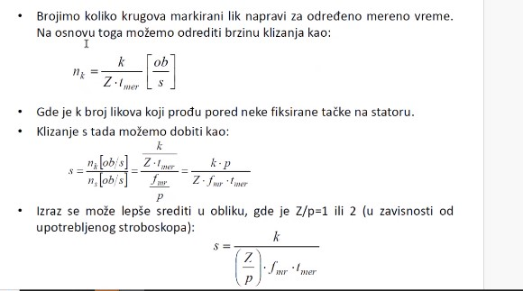

# Tema 6 — Merenje klizanja asinhrone mašine

## Zašto se ovo pita

Merenje klizanja je posebna tačka u programu merenja brzine: beleške izričito kažu **„kod asinhronih motora može da se meri i klizanje"** i profesorov naglasak je nedvosmislen — **„OVO MORA DA SE ZNA SVE OKO KLIZANJA I LIKOVA."** Na spisku primera pitanja za vežbu stoji doslovno: *„Opišite merenje klizanja ‚probnim namotom' jednog relativno velikog motora. Koja vrsta motora je u pitanju, najverovatnije?"* — dakle, ovo je pitanje koje se na ispitu pojavljuje u opisnoj formi, a lako dobija i brojčani dodatak (izbroj likove/impulse, izračunaj $s$ i $n$).

Ispitivač očekuje da znaš:

1. **zašto se klizanje meri direktno**, a ne računa iz izmerene brzine (mala razlika dva velika broja!);
2. **stroboskopsku metodu** — šta su likovi, koliko ih ima u zavisnosti od broja polova i vrste lampe (1 ili 2 bljeska po periodi), formulu $s = \dfrac{k}{(Z/p)\,f_{mr}\,t_{mer}}$ sa značenjem svakog simbola, i ograničenje na klizanja do $\approx 6\,\%$;
3. **brojanje oscilacija voltmetra**: preko kliznih kolutova (kliznokolutna mašina), preko četkica na vratilu (kavezna mašina) i **probnim namotajem / indukcionim kalemom** — i zašto instrument sa kretnim kalemom daje **1 impuls**, a sa mekim gvožđem **2 impulsa** po periodi rotorske učestanosti;
4. za primer-pitanje: da je „relativno velik motor" najverovatnije **veliki sporohodni kavezni asinhroni motor** — i da to umeš da obrazložiš.

> **Prevod na običan jezik:** Asinhroni motor se u radu obrće samo za koji procenat sporije od sinhrone brzine. Taj mali procenat — klizanje — je upravo ono što određuje radnu tačku, a ako ga računaš kao razliku dve izmerene brzine, greška merenja brzine „pojede" ceo rezultat. Zato se klizanje meri **direktno**, i to tako što se na neki način **izbroji rotorska učestanost** $f_r = s f_s$, koja je pri malim klizanjima svega nekoliko herca ili delova herca — a brojanje sporih događaja (likova pod stroboskopom, zamaha skazaljke) je „digitalno" tačno: štoperica plus strpljenje, bez klase tačnosti instrumenta u rezultatu.

## Teorija — sve što moraš znati

### Zašto direktno klizanje, a ne preko brzine

Klizanje je po definiciji:

$$
s = \frac{n_s - n}{n_s}, \qquad n_s = \frac{60 f_s}{p}\ \mathrm{o/min}
$$

gde je $n_s$ sinhrona brzina, $n$ stvarna brzina rotora, $f_s$ učestanost mreže, a $p$ broj **pari** polova. Beleške: **„Merimo direktno klizanje pa preko klizanja brzinu."** — dakle redosled je obrnut od naivnog: ne meri se $n$ pa računa $s$, nego se meri $s$ pa računa $n = (1-s)\,n_s$.

Razlog je čisto numerički — **mala razlika dva velika broja**. Primer: četvoropolni motor, $n_s = 1500\ \mathrm{o/min}$, stvarna brzina $n = 1485\ \mathrm{o/min}$, dakle $s = \frac{1500-1485}{1500} = 0{,}01 = 1\,\%$. Ako brzinu izmerimo tahometrom/tahogeneratorom sa greškom od samo $\pm 1\,\%$ očitane vrednosti ($\pm 15\ \mathrm{o/min}$), apsolutna greška klizanja je

$$
\Delta s = \frac{\Delta n}{n_s} = \frac{15}{1500} = 1\,\%\ \text{(apsolutno)} \quad\Rightarrow\quad \frac{\Delta s}{s} = \frac{1\,\%}{1\,\%} = 100\,\%\ \text{(relativno)!}
$$

Rezultat bi bio „klizanje je između 0 i 2 %" — bezvredan. Direktne metode zato ne mere brzinu, nego **broje** događaje čija je učestanost jednaka **rotorskoj (klizajnoj) učestanosti** $f_r = s f_s$ — a nju je pri malom $s$ (nekoliko herca ili manje) lako i tačno izbrojati.

### Stroboskopska metoda

Beleške: **„Stroboskopskim efektom (instrumentom) se meri. Lik koji putuje u suprotnu stranu možemo da izbrojimo koliko obrtaja je prošao u jednu stranu i iz toga možemo da izvučemo klizanje."**

**Postavka.** Na vratilu (ili spojnici) se kredom/markerom napravi oznaka. Vratilo se osvetli **stroboskopskom lampom** čiji su bljeskovi sinhronizovani sa mrežnom učestanošću $f_{mr}$. Postoje **dve vrste stroboskopskih lampi**:

- lampa sa **jednim bljeskom u periodi** mreže ($f_{mr}$ bljeskova u sekundi);
- lampa sa **dva bljeska u periodi** ($2 f_{mr}$ bljeskova u sekundi — okida na obe poluperiode).

**Odakle likovi i koliko ih ima.** Bljesak „zamrzne" trenutni položaj oznake; zbog tromosti oka niz zamrznutih položaja vidimo kao stojeće **likove**. Rotor se pri sinhronizmu obrne za $\tfrac{1}{p}$ obrtaja između dva bljeska (jer je $n_s = f_{mr}/p$ obrtaja u sekundi, a bljesak dolazi svake periode $1/f_{mr}$), pa se ista oznaka osvetljava na $p$ ravnomerno raspoređenih mesta po obodu — vidimo $Z = p$ likova. Kod lampe sa dva bljeska rotor između bljeskova pređe $\tfrac{1}{2p}$ obrtaja, pa je likova duplo više: $Z = 2p$. To je tačno ono što kažu beleške:

- **dvopolna mašina** ($p=1$, 3000 o/min): 1 bljesak → **1 lik**; 2 bljeska → **2 lika** („hvatamo svaki poluobrtaj");
- **četvoropolna mašina** ($p=2$): 1 bljesak → **2 lika**, 2 bljeska → **4 lika**;
- **„što više polova, više likova"** — opšte: $Z = p$ ili $Z = 2p$, tj. $\boxed{Z/p = 1 \text{ ili } 2}$ (zavisi od upotrebljenog stroboskopa).

**Zašto likovi putuju unazad.** Da je mašina sinhrona, rotor bi između dva bljeska prešao tačno $1/Z$-ti deo obrtaja puta ceo broj — raspored likova bi prelazio sam u sebe i **lik bi mirovao**. Asinhroni rotor kasni: za vreme između dva bljeska zaostane za $s/p$ (odnosno $s/2p$) obrtaja u odnosu na sinhroni položaj. Zbog toga ceo venac likova **prividno rotira u suprotnom smeru od obrtanja** rotora, i to upravo brzinom klizanja:

$$
n_k = n_s - n = s\,n_s \quad [\mathrm{ob/s}].
$$

Što je mašina opterećenija, klizanje je veće, „lik se u kasnijem trenutku osvetli" i likovi putuju brže. (Usput — korisna kontrola smera: kod motora likovi idu suprotno od obrtanja; ako bi mašina radila nadsinhrono, kao generator, išli bi u smeru obrtanja.)

**Merenje i formule (slajd sa predavanja):** izaberemo jednu **fiksnu tačku na statoru** (npr. vrh oklopa) i štopericom merimo vreme $t_{mer}$ dok brojimo koliko je likova prošlo pored te tačke.

**Slika —** Slajd sa predavanja: izvođenje formule za klizanje iz brojanja likova — brzina klizanja $n_k = \frac{k}{Z\,t_{mer}}$, klizanje $s = \frac{n_k}{n_s} = \frac{k\,p}{Z\,f_{mr}\,t_{mer}}$ i sređeni oblik $s = \frac{k}{(Z/p)\,f_{mr}\,t_{mer}}$ sa $Z/p = 1$ ili $2$.

> **Kako čitati šemu:** Ovo nije šema vezivanja nego slajd sa izvođenjem — čitaj ga red po red. Prvi red: brojimo koliko krugova markirani lik napravi za mereno vreme; brzina klizanja je $n_k = \frac{k}{Z\cdot t_{mer}}$ u $\mathrm{ob/s}$ — jer lik prođe pored fiksne tačke svaki put kada se venac od $Z$ likova okrene za $1/Z$-ti deo obrtaja, pa $k$ prolazaka znači $k/Z$ punih obrtaja venca za vreme $t_{mer}$. Drugi red definiše $k$: broj likova koji prođu pored neke **fiksirane tačke na statoru**. Treći red deli brzinu klizanja sinhronom brzinom $n_s = f_{mr}/p$ $[\mathrm{ob/s}]$: $s = \frac{n_k}{n_s} = \frac{k/(Z\,t_{mer})}{f_{mr}/p} = \frac{k\,p}{Z\,f_{mr}\,t_{mer}}$. Poslednji red je sređeni oblik $s = \frac{k}{(Z/p)\cdot f_{mr}\cdot t_{mer}}$, uz napomenu da je $Z/p = 1$ ili $2$ u zavisnosti od upotrebljenog stroboskopa (1 ili 2 bljeska u periodi).

Značenje svakog simbola (mora da se zna):

| Simbol | Značenje | Odakle dolazi |
|---|---|---|
| $Z$ | broj likova koje vidimo | $Z = p$ (1 bljesak/periodi) ili $Z = 2p$ (2 bljeska/periodi) |
| $k$ | broj likova koji za vreme merenja prođu pored fiksirane tačke na statoru | broji posmatrač |
| $t_{mer}$ | vreme trajanja merenja (koliko dugo brojimo) | štoperica |
| $f_{mr}$ | mrežna učestanost (kod nas $50\ \mathrm{Hz}$) | mreža koja napaja i motor i lampu |
| $p$ | broj pari polova ispitivane mašine | natpisna pločica / $n_s$ |
| $n_k$ | prividna brzina obrtanja venca likova $= s\,n_s$ | $n_k = k/(Z\,t_{mer})$ |

Konačna formula:

$$
s = \frac{n_k}{n_s} = \frac{k\,p}{Z\, f_{mr}\, t_{mer}} = \frac{k}{(Z/p)\cdot f_{mr}\cdot t_{mer}},
\qquad n = (1-s)\,\frac{60 f_{mr}}{p}\ \mathrm{o/min}.
$$

Zgodna interpretacija: broj prolazaka u sekundi je $k/t_{mer} = (Z/p)\,f_{mr}\,s = (Z/p)\,f_r$ — kod lampe sa jednim bljeskom **brojiš tačno rotorsku učestanost** $f_r = s f_{mr}$.

**Tačnost i ograničenje.** Beleške: „Što duže traje eksperiment, merenje sve tačnije i tačnije" — greška brojanja je $\pm 1$ lik, pa je $\Delta s = \frac{1}{(Z/p) f_{mr} t_{mer}}$ i opada sa $t_{mer}$. Ali: **„Ako su klizanja prevelika, likovi prebrzo putuju po obodu i metoda nije efikasna — oko isprati 3 lika (u sekundi), znači klizanje 3 Hz. Klizanja do 6 % se stroboskopskom metodom mogu precizno odrediti."** Provera: pri $s = 6\,\%$ je $f_r = 0{,}06\cdot 50 = 3\ \mathrm{Hz}$, tj. pored fiksne tačke prođu 3 lika u sekundi (lampa sa 1 bljeskom) — granica onoga što oko još stigne da broji. Zato: **stroboskop samo za klizanja do $\approx 6\,\%$**, tj. za mašinu u normalnom radu blizu nominalne tačke (ne za zalet!).

### Merenje preko kliznih kolutova — brojanje oscilacija voltmetra

Beleške: **„Ako je mašina kliznokolutna, postoji tehnika da se pristupi rotoru jer su učestanosti u rotoru proporcionalne klizanju** (skoro)**. Možemo između dva klizna koluta da priključimo voltmetar i da registrujemo oscilacije voltmetrovog skretanja ako je učestanost jako mala, pa se broji broj oscilacija u nekom intervalu."**

Fizika: u rotoru se indukuju veličine učestanosti $f_r = s f_s$ — pri $s = 1{-}2\,\%$ to je svega $0{,}5{-}1\ \mathrm{Hz}$. Voltmetar priključen između dva klizna koluta vidi naizmenični napon te niske učestanosti. Skazaljka analognog instrumenta je trom mehanički sistem: napon od $50\ \mathrm{Hz}$ ne može da isprati (skretanje mu se usrednji), ali napon od $0{,}5\ \mathrm{Hz}$ prati — **skazaljka se njiše u ritmu rotorske učestanosti** i mi štopericom brojimo zamahe. Klizanje opet dobijamo brojanjem, ne očitavanjem!

Ključna finesa — **vrsta instrumenta određuje broj impulsa po periodi**:

- **Instrument sa kretnim kalemom** skreće srazmerno trenutnoj vrednosti (znak se čuva): u jednoj periodi rotorskog napona skazaljka ode **u plus pa u minus** — to je **1 impuls (zamah) po periodi**. Dakle $f_r = k/t$.
- **Instrument sa mekim gvožđem** skreće srazmerno kvadratu struje — **on ispravlja**: i pozitivna i negativna poluperioda guraju skazaljku na istu stranu, pa ona ode **dva puta u plus po periodi** — **2 impulsa po periodi**. Dakle $f_r = (k/2)/t$.

**Slika —** Slajd sa predavanja: formule za klizanje iz broja impulsa $k$ izbrojanih za vreme $t$ — za instrument sa pokretnim (kretnim) kalemom $s = \frac{k}{50t}$, tj. $s = \frac{2k}{t}\,[\%]$; za instrument sa mekim gvožđem $s = \frac{k}{100t}$, tj. $s = \frac{k}{t}\,[\%]$.

> **Kako čitati šemu:** I ovo je slajd sa formulama, ne šema vezivanja. Gornji red — instrument sa pokretnim kalemom: klizanje je odnos rotorske i statorske učestanosti $s = f_r/f_s$; pošto kretni kalem pravi 1 impuls po periodi, izbrojanih $k$ impulsa za $t$ sekundi znači $f_r = k/t$, pa je $s = \frac{k/t}{50} = \frac{k}{50t}$, odnosno u procentima $s = \frac{2k}{t}\,[\%]$ (jer je $100\cdot\frac{k}{50t} = \frac{2k}{t}$). Donji red — instrument sa mekim gvožđem: on ispravlja i pravi 2 impulsa po periodi, pa je $f_r = (k/2)/t$ i $s = \frac{k}{100t}$, u procentima $s = \frac{k}{t}\,[\%]$. Faktor 2 između dva reda je upravo razlika „1 impuls naspram 2 impulsa po periodi".

$$
\textbf{Kretni kalem: } s = \frac{f_r}{f_s} = \frac{k/t}{50} = \frac{k}{50\,t}\;\; \Big(= \frac{2k}{t}\ \%\Big),
\qquad
\textbf{Meko gvožđe: } s = \frac{(k/2)/t}{50} = \frac{k}{100\,t}\;\; \Big(= \frac{k}{t}\ \%\Big).
$$

Napomena iz beležaka: **„Može i ampermetar, ali velike su struje pa ne valja"** — rotorske struje radne mašine su velike (redne stotine ampera kod većih mašina), pa bi ampermetar u rotorskom kolu bio i nepraktičan i opasan; voltmetar se samo prisloni na kolutove i ništa ne remeti.

### Merenje na vratilu — kavezne mašine (vrtložne struje)

Kod kavezne mašine kolutova nema. Beleške: **„Postoji tehnika da se na dva kraja vratila stavi po jedna četkica i da se na njih priključi milivoltmetar ili voltmetar, pa se kroz skretanje na isti način registruje brzina ili klizanje. Ovo može kod KAVEZNIH MAŠINA."**

Zašto to radi: **vratilo je provodni materijal**; postoje **rasipni fluksevi** rotorskog namotaja koji se zatvaraju i kroz okolne delove, pa **rasipno polje indukuje napone i u vratilu — pojaviće se vrtložne struje** čija je učestanost jednaka **učestanosti rotorskih struja** $f_r = s f_s$. Između krajeva vratila zato postoji mala potencijalna razlika (milivolti) učestanosti $f_r$, i skazaljka milivoltmetra se njiše — brojimo impulse kao gore. **Statorski rasipni fluks od $50\ \mathrm{Hz}$ ne pravi skretanje** — skazaljka ga zbog tromosti ne može ispratiti — pa se sam instrument ponaša kao filtar koji propušta samo sporu, rotorsku komponentu.

Mana (beleške): **„Mašine često nemaju pristupačno vratilo sa obe strane"** — jedan kraj je pod poklopcem ventilatora, na drugom je spojnica radne mašine.

### Probni namotaj / indukcioni kalem — najbolja tehnika (primer-pitanje!)

Beleške: **„Još bolja tehnika je preko PROBNOG NAMOTAJA ili INDUKCIONOG KALEMA."**

- **Šta je:** **točak velikog prečnika obmotan tankom žicom kao solenoid** — dakle laka kružna „obruč-bobina" sa mnogo navojaka tanke žice. **Prečnik mora biti veliki radi što većeg poprečnog preseka za hvatanje fluksa** — indukovana EMS je $e = -N\,\mathrm{d}\Phi/\mathrm{d}t$, a fluks kroz kalem raste sa površinom, pa veliki presek nadoknađuje to što je rasuto polje van mašine slabo.
- **Šta registruje:** probni namotaj **hvata rasuti fluks isto kao tehnika sa četkicama na vratilu, ali direktno — bez četkica** i bez ikakvog galvanskog kontakta sa mašinom. Kroz njega se prožima rasipni fluks mašine, u njemu se indukuje EMS, nju merimo (milivoltmetrom) i **pratimo oscilacije skretanja** — ili signal analiziramo drugačije (osciloskop, brojač). U rasutom polju postoje dve komponente: **negde više hvata rasipanja statora (učestanost 50 Hz)**, a **negde učestanost rotora (svega par herca)** — instrument sa skazaljkom sam „odfiltrira" 50 Hz (ne može da ga prati), a spora rotorska komponenta pravi vidljive zamahe koje brojimo.
- **Gde se stavlja:** beleške daju čisto praktično pravilo — **„Probni namotaj se postavlja tamo gde kazaljka instrumenta najbolje skreće"** — dakle prislanja se uz kućište/ležajni štit i pomera dok zamasi skazaljke ne budu najizraženiji (tu dominira rotorsko rasipno polje: krajevi namotaja rotora, blizu ležajnih štitova, oko vratila).
- **Za koga:** **„PROBNI NAMOTAJ se koristi za KAVEZNE MAŠINE, jer nemamo mogućnost da pristupimo kliznim kolutovima."**

Formula je ista kao za voltmetar na kolutovima — brojimo impulse EMS-a rotorske učestanosti: sa instrumentom sa kretnim kalemom $s = k/(50\,t)$, sa mekim gvožđem $s = k/(100\,t)$, pa $n = (1-s)\,n_s$.

### Pregled i poređenje metoda

| Metoda | Za koje mašine | Šta se broji | Pristup mašini | Ograničenje |
|---|---|---|---|---|
| Stroboskop | sve asinhrone (vidljivo vratilo) | prolasci likova pored fiksne tačke | samo vizuelan | $s \lesssim 6\,\%$ (oko isprati $\approx 3$ lika/s) |
| Voltmetar na kolutovima | kliznokolutne | zamasi skazaljke ($f_r$) | klizni kolutovi | samo malo $s$ (skazaljka mora da prati) |
| Četkice na vratilu | kavezne | zamasi skazaljke (vrtložne struje $f_r$) | oba kraja vratila | vratilo često nepristupačno |
| **Probni namotaj** | **kavezne (najbolja)** | zamasi skazaljke (EMS iz rasutog polja) | **nikakav — bezkontaktno** | traži osetan rasipni fluks (velika mašina) |

Sve četiri metode su **metode brojanja**: rezultat zavisi od štoperice i brojanja, a **ne od klase tačnosti instrumenta** — instrument je samo indikator. Zato su sve tačnije od bilo kog merenja brzine pa računanja $s$, a tačnost raste sa dužinom merenja ($\Delta s = \Delta k / \big[(Z/p) f t\big]$, odnosno $\Delta k/(50t)$).

## Oprema i šema merenja

Za ovu temu nema jedne „velike" merne šeme kao kod UI metode — oprema je skromna, ali na ispitu treba **konkretno** pobrojati i skicirati:

**1) Stroboskopska metoda:**
- **stroboskopska lampa** napajana iz iste mreže kao motor (sinhronizacija!), sa **1 ili 2 bljeska po periodi** — obavezno reci koju uzimaš, jer od toga zavisi $Z$;
- **kreda/marker** — oznaka na vratilu ili spojnici;
- **štoperica** za $t_{mer}$.

*Recept za crtanje:* motor priključen na mrežu $3{\times}400\ \mathrm{V},\ 50\ \mathrm{Hz}$; sa strane vratila nacrtaj krug (čelo vratila) sa jednom radijalnom crtom (oznaka); pored nacrtaj lampu uperenu u vratilo, napajanu **sa iste mreže**; označi fiksnu tačku na statoru (strelica na oklopu) u odnosu na koju se broje prolasci likova; upiši $Z$ likova ravnomerno po obodu ($Z=p$ ili $2p$) i strelicu prividnog kretanja likova **suprotno** od smera obrtanja.

**2) Voltmetar na kliznim kolutovima:**
- **voltmetar / milivoltmetar sa kretnim kalemom** (najbolje sa **nulom na sredini skale**, jer skazaljka ide u plus i u minus) — malog opsega, jer je napon između kolutova pri malom klizanju mali; klasa tačnosti je nebitna (brojimo, ne očitavamo); može i instrument sa **mekim gvožđem** — ali onda 2 impulsa po periodi;
- **štoperica**.

*Recept za crtanje:* rotor kliznokolutnog motora u normalnom pogonu (rotorsko kolo zatvoreno kako jeste u radu); nacrtaj tri klizna koluta na vratilu, na **dva** od njih prisloni četkice i između njih **V** (voltmetar se samo prislanja — nije fiksan element, kao i kod UI metode); skazaljka se njiše učestanošću $f_r$. Ampermetar u rotorsko kolo **ne** stavljamo — struje su velike.

**3) Četkice na vratilu (kavezna mašina):**
- **dve četkice** prislonjene na dva kraja vratila + **milivoltmetar sa kretnim kalemom** + **štoperica**.

*Recept za crtanje:* motor sa naznačenim vratilom koje viri na obe strane; na svaki kraj vratila prislonjena četkica; obe četkice vode na mV-metar. Uz crtež napiši: vrtložne struje u vratilu od rotorskog rasipnog fluksa, učestanost $f_r = s f_s$; komponenta od 50 Hz ne pravi skretanje.

**4) Probni namotaj (indukcioni kalem):**
- **probni namotaj**: točak (obruč) velikog prečnika, obmotan sa mnogo navojaka **tanke žice** (tanka — jer struje praktično nema, treba nam samo EMS, a mnogo navojaka povećava $e = -N\,\mathrm{d}\Phi/\mathrm{d}t$);
- **milivoltmetar sa kretnim kalemom** (nula na sredini) — ili osciloskop ako hoćemo snimak signala;
- **štoperica**.

*Recept za crtanje:* motor (kavezni) u pogonu; uz ležajni štit/kućište prislonjen veliki kružni kalem (nacrtaj krug oko vratila ili uz čeonu stranu mašine, šrafiraj navojke); krajevi kalema vode na mV-metar. Strelicom naznači da se kalem **pomera po mašini dok skretanje ne bude najveće**.

## Rešeno ispitno pitanje

> **Primer pitanja (vežba):** *Opišite merenje klizanja „probnim namotom" jednog relativno velikog motora. Koja vrsta motora je u pitanju, najverovatnije?*

**Model odgovor:**

1. **Šta je probni namotaj.** Probni namotaj (indukcioni kalem) je **točak velikog prečnika obmotan tankom žicom kao solenoid**. Prečnik mora biti veliki da bi poprečni presek za hvatanje fluksa bio što veći — rasuto polje van mašine je slabo, pa se mala gustina fluksa nadoknađuje velikom površinom i velikim brojem navojaka.

2. **Princip.** Oko svake mašine postoji **rasipni fluks** koji se zatvara van magnetnog kola. U njemu su dve komponente: rasipanje **statora** (mrežna učestanost, $50\ \mathrm{Hz}$) i rasipanje **rotora** (rotorska učestanost $f_r = s\,f_s$ — pri malom klizanju svega **par herca** ili manje). Kada se probni namotaj prisloni uz mašinu, rasipni fluks se prožima kroz njega i indukuje EMS: $e = -N\,\mathrm{d}\Phi/\mathrm{d}t$. Probni namotaj, dakle, hvata isto ono što i tehnika sa četkicama na vratilu — ali **direktno, bez četkica**, potpuno beskontaktno.

3. **Postupak merenja.**
   1. Motor radi u pogonu (npr. u nominalnoj radnoj tački) — ništa se na njemu ne prevezuje.
   2. Na krajeve probnog namotaja priključi se **milivoltmetar sa kretnim kalemom** (nula na sredini skale).
   3. Probni namotaj se prislanja uz kućište/ležajni štit i **pomera po mašini — postavlja se tamo gde kazaljka instrumenta najbolje skreće** (tu dominira rotorska komponenta rasutog polja).
   4. Komponentu od $50\ \mathrm{Hz}$ skazaljka zbog tromosti ne može da prati (usrednji se u nulu), a spora rotorska komponenta je njiše — **broji se broj zamaha (impulsa) $k$ za vreme $t$ mereno štopericom**; instrument sa kretnim kalemom pravi **1 impuls po periodi** rotorske učestanosti (ode u plus pa u minus).
   5. Klizanje i brzina:
      $$
      s = \frac{f_r}{f_s} = \frac{k/t}{50} = \frac{k}{50\,t}, \qquad n = (1-s)\,\frac{60 f_s}{p}.
      $$
   6. Merenje se produži (ili ponovi) — što duže brojimo, greška $\Delta s = \frac{1}{50\,t}$ (za $\pm1$ izbrojan impuls) je manja.

4. **Brojčana ilustracija** (pretpostavljeni, realni brojevi): veliki desetopolni motor ($p=5$, $n_s = 600\ \mathrm{o/min}$); za $t = 60\ \mathrm{s}$ izbrojano $k = 30$ zamaha:
   $$
   f_r = \frac{30}{60} = 0{,}5\ \mathrm{Hz}, \qquad s = \frac{0{,}5}{50} = 0{,}01 = 1\,\%, \qquad n = (1-0{,}01)\cdot 600 = 594\ \mathrm{o/min}.
   $$
   Perioda rotorske učestanosti je $1/f_r = 2\ \mathrm{s}$ — skazaljka lagano zamahne svake dve sekunde, sasvim ugodno za brojanje.

5. **Koja je vrsta motora najverovatnije u pitanju?** Najverovatnije **veliki sporohodni KAVEZNI asinhroni motor**. Obrazloženje:
   - **kavezni** — jer se probni namotaj po beleškama koristi upravo **za kavezne mašine, kod kojih nemamo mogućnost da pristupimo kliznim kolutovima** (kolutova nema, rotoru se električki ne može prići); da je motor kliznokolutni, klizanje bismo jednostavnije izmerili voltmetrom između dva koluta;
   - **velik** — jer velika mašina ima dovoljno **jak rasipni fluks** da se u probnom namotaju indukuje merljiva EMS (a i alternativa sa četkicama na vratilu kod velikih mašina često otpada: „mašine često nemaju pristupačno vratilo sa obe strane");
   - **sporohodan (višepolan)** — veliki sporohodni motori imaju malo klizanje, pa je $f_r$ reda delova herca: baš takve spore oscilacije skazaljka može da prati i baš tu je brojanje impulsa najtačnije; usput, kod višepolne mašine stroboskop daje mnogo likova koji se teže razaznaju, pa je probni namotaj i praktičniji.

## Varijacije zadatka

### Varijacija 1 — brojčani primer stroboskopske metode (4-polna mašina)

> *Klizanje četvoropolnog asinhronog motora ($400\ \mathrm{V}$, $50\ \mathrm{Hz}$) meri se stroboskopski, lampom sa jednim bljeskom u periodi. (a) Koliko se likova vidi? (b) Za $t_{mer}=30\ \mathrm{s}$ pored fiksne tačke na statoru prošlo je $k=30$ likova. Odrediti klizanje i brzinu obrtanja. (c) Šta bi se videlo i izbrojalo sa lampom sa dva bljeska u periodi? (d) Da li je metoda ovde primenljiva?*

**Rešenje:**

1. Četvoropolna mašina: $p = 2$, $n_s = \frac{60\cdot 50}{2} = 1500\ \mathrm{o/min} = 25\ \mathrm{ob/s}$.
2. **(a)** Lampa sa 1 bljeskom po periodi: $Z = p = 2$ **lika** (rotor između dva bljeska pri sinhronizmu pređe pola obrtaja, pa se jedna oznaka „zamrzava" na dva naspramna mesta).
3. **(b)** Brzina klizanja (prividna brzina venca likova):
   $$
   n_k = \frac{k}{Z\,t_{mer}} = \frac{30}{2\cdot 30} = 0{,}5\ \mathrm{ob/s}.
   $$
   Klizanje:
   $$
   s = \frac{n_k}{n_s} = \frac{k\,p}{Z\,f_{mr}\,t_{mer}} = \frac{30\cdot 2}{2\cdot 50\cdot 30} = 0{,}02 = 2\,\%,
   $$
   ili odmah sređenim oblikom sa $Z/p = 1$: $s = \frac{k}{f_{mr} t_{mer}} = \frac{30}{50\cdot 30} = 0{,}02$. Brzina:
   $$
   n = (1-s)\,n_s = 0{,}98\cdot 1500 = 1470\ \mathrm{o/min}.
   $$
4. **(c)** Sa dva bljeska u periodi: $Z = 2p = 4$ lika; venac se okreće istom brzinom $n_k = s\,n_s$, ali prolazaka je duplo više — za istih 30 s prošlo bi $k = Z\,n_k\,t = 4\cdot 0{,}5\cdot 30 = 60$ likova; formula sa $Z/p = 2$ vraća isto: $s = \frac{60\cdot 2}{4\cdot 50\cdot 30} = 0{,}02$. ✓
5. **(d)** Provera primenljivosti: $s = 2\,\% < 6\,\%$; brzina prolazaka $k/t = 1$ lik/s (odnosno 2 lika/s sa dva bljeska) — oko komotno prati (granica $\approx 3$/s). Metoda je primenljiva.

### Varijacija 2 — kliznokolutni motor, voltmetar na kolutovima (kretni kalem i meko gvožđe)

> *Šestopolni kliznokolutni asinhroni motor radi opterećen. Voltmetar sa kretnim kalemom priključen između dva klizna koluta napravio je $k = 45$ punih zamaha (plus–minus) za $t = 60\ \mathrm{s}$. (a) Odrediti klizanje i brzinu obrtanja. (b) Koliko bi impulsa za isto vreme izbrojao instrument sa mekim gvožđem i kako bi se tada računalo klizanje?*

**Rešenje:**

1. Kretni kalem pravi **1 impuls po periodi** rotorskog napona (ode u plus pa u minus — to je jedan zamah), pa je rotorska učestanost:
   $$
   f_r = \frac{k}{t} = \frac{45}{60} = 0{,}75\ \mathrm{Hz}.
   $$
2. Klizanje:
   $$
   s = \frac{f_r}{f_s} = \frac{k}{50\,t} = \frac{45}{50\cdot 60} = 0{,}015 = 1{,}5\,\%
   \qquad\Big(\text{ili } s = \frac{2k}{t}\,[\%] = \frac{2\cdot 45}{60} = 1{,}5\,\%\Big).
   $$
3. Šestopolna mašina: $p = 3$, $n_s = \frac{60\cdot 50}{3} = 1000\ \mathrm{o/min}$, pa je
   $$
   n = (1-s)\,n_s = 0{,}985\cdot 1000 = 985\ \mathrm{o/min}.
   $$
4. **(b)** Instrument sa mekim gvožđem skreće srazmerno kvadratu — **ispravlja**, pa obe poluperiode daju zamah na istu stranu: **2 impulsa po periodi**. Za isto vreme izbrojao bi $k' = 2 f_r t = 2\cdot 0{,}75\cdot 60 = 90$ impulsa, a klizanje se tada računa sa:
   $$
   s = \frac{k'}{100\,t} = \frac{90}{100\cdot 60} = 0{,}015 = 1{,}5\,\% \qquad\Big(\text{ili } s = \frac{k'}{t}\,[\%] = \frac{90}{60} = 1{,}5\,\%\Big). ✓
   $$
   Pouka: pre računanja **moraš znati vrstu instrumenta** — ista pojava, a faktor 2 u formuli.

### Varijacija 3 — poređenje tačnosti: klizanje preko brzine ili direktno?

> *Četvoropolni motor radi sa $n \approx 1485\ \mathrm{o/min}$ ($s \approx 1\,\%$). Klizanje se određuje na dva načina: (a) izmeri se brzina tahogeneratorom konstante $15/1000\ \mathrm{V/(o/min)}$ i voltmetrom klase 1, opsega $30\ \mathrm{V}$, pa se $s$ izračuna; (b) stroboskopski, lampom sa jednim bljeskom, brojanjem likova tokom $t = 60\ \mathrm{s}$, uz grešku brojanja $\pm 1$ lik i grešku štoperice $\pm 0{,}2\ \mathrm{s}$. Uporediti granice greške klizanja.*

**Rešenje:**

1. **(a) Preko brzine.** Očekivani napon tahogeneratora: $U = 0{,}015\cdot 1485 = 22{,}275\ \mathrm{V}$ (opseg 30 V je dobro izabran — skretanje u gornjoj trećini skale). Maksimalna greška voltmetra je klasa **od opsega**:
   $$
   \Delta U = \frac{1}{100}\cdot 30 = 0{,}3\ \mathrm{V} \quad\Rightarrow\quad \Delta n = \frac{\Delta U}{k_{TG}} = \frac{0{,}3}{0{,}015} = 20\ \mathrm{o/min}.
   $$
   Greška klizanja:
   $$
   \Delta s = \frac{\Delta n}{n_s} = \frac{20}{1500} \approx 1{,}33\,\%\ \text{apsolutno} \quad\Rightarrow\quad \frac{\Delta s}{s} = \frac{1{,}33\,\%}{1\,\%} \approx 133\,\%\ \text{relativno.}
   $$
   Rezultat: $s \in (-0{,}33\,\%,\ 2{,}33\,\%)$ — **potpuno neupotrebljivo** (granice šire od same vrednosti; formalno bi ispalo da motor možda radi i nadsinhrono!).
2. **(b) Stroboskopski.** Očekivani broj likova: $k = (Z/p)\,f_{mr}\,s\,t = 1\cdot 50\cdot 0{,}01\cdot 60 = 30$. Greška zbog brojanja ($\pm 1$ lik):
   $$
   \Delta s_k = \frac{1}{50\cdot 60} \approx 0{,}033\,\%\ \text{apsolutno} \;\;(\approx 3{,}3\,\%\ \text{relativno}),
   $$
   greška zbog štoperice: $\Delta s_t = s\cdot\frac{\Delta t}{t} = 0{,}01\cdot\frac{0{,}2}{60} \approx 0{,}003\,\%$ apsolutno ($\approx 0{,}33\,\%$ relativno) — zanemarljiva. Ukupno u najgorem slučaju $\approx 3{,}7\,\%$ relativne greške, tj. $s = (1{,}00\pm 0{,}04)\,\%$.
3. **Zaključak (ovo je poenta cele teme):** direktno merenje klizanja je ovde oko **35 puta tačnije** od računanja iz izmerene brzine — jer je $s$ mala razlika dva velika broja, pa se apsolutna greška brzine deli sa $n_s$ i cela sruči na malu vrednost $s$; kod brojanja likova greška je $\pm 1$ događaj i topi se produžavanjem merenja. Iz izmerenog $s$ brzina se dobija tačno: $n = (1-s)\,n_s = 0{,}99\cdot 1500 = 1485\ \mathrm{o/min}$, sa greškom od svega $\Delta n = \Delta s\cdot n_s \approx 0{,}0004\cdot 1500 \approx 0{,}5\ \mathrm{o/min}$.

## Česte greške i zamke na ispitu

1. **Računanje klizanja iz izmerene brzine.** $s = (n_s-n)/n_s$ je mala razlika dva velika broja — greška merenja brzine od 1 % daje grešku klizanja od 100 % (vidi Varijaciju 3). Na pitanje „kako se meri klizanje" odgovor počinje rečenicom: **meri se direktno, pa se iz njega računa brzina**.
2. **Pogrešan broj likova $Z$.** $Z$ zavisi i od broja pari polova i od lampe: $Z = p$ (1 bljesak/periodi) ili $Z = 2p$ (2 bljeska/periodi). Student koji za četvoropolnu mašinu sa dvobljeskovnom lampom uzme $Z=2$ umesto $Z=4$ greši rezultat dvostruko. Zapamti kontrolu: $Z/p$ u formuli je **1 ili 2** — nikad nešto treće.
3. **Mešanje $k$ i $Z$.** $Z$ je koliko likova **vidiš** (stoje po obodu), $k$ je koliko ih je **prošlo** pored fiksne tačke za vreme $t_{mer}$. U formuli $s = \frac{k\,p}{Z f_{mr} t_{mer}}$ figurišu oba — obrnuti su po smislu i ne smeju da zamene mesta.
4. **Faktor 2 kod vrste instrumenta.** Kretni kalem: 1 impuls po periodi → $s = k/(50t)$; meko gvožđe: ispravlja, 2 impulsa po periodi → $s = k/(100t)$. Ako ne kažeš koji instrument koristiš, formula „visi u vazduhu"; ako pomešaš — duplo pogrešan rezultat.
5. **Primena stroboskopa na velika klizanja.** Preko $\approx 6\,\%$ ($f_r > 3\ \mathrm{Hz}$) likovi prebrzo putuju i oko ih ne stiže brojati — stroboskop je za mašinu **blizu nominalne tačke**, nikako za snimanje zaleta.
6. **„Voltmetrom na kolutovima očitavam napon."** Ne — ništa se ne očitava, **broje se oscilacije skretanja**; zato klasa tačnosti instrumenta uopšte ne ulazi u rezultat (ulaze samo brojanje i štoperica). Na kolutove ide voltmetar, a ne ampermetar — rotorske struje su velike, „pa ne valja".
7. **Probni namotaj malog prečnika ili od debele žice.** Poenta konstrukcije je: **veliki prečnik = veliki poprečni presek za hvatanje slabog rasutog fluksa**, mnogo navojaka **tanke** žice = velika EMS bez struje. I ne zaboravi praktično pravilo: postavlja se **tamo gde kazaljka najbolje skreće**.

## Kontrolna pitanja za samoproveru

1. **Zašto se klizanje meri direktno, a ne preko brzine?** — Jer je $s=(n_s-n)/n_s$ mala razlika dva velika broja: mala relativna greška brzine postaje ogromna relativna greška klizanja; direktne metode broje rotorsku učestanost i tačnost im raste sa vremenom merenja.
2. **Koliko likova vidi posmatrač kod šestopolne mašine sa lampom sa dva bljeska u periodi?** — $Z = 2p = 6$ likova ($p=3$).
3. **Napiši formulu za klizanje kod stroboskopske metode i objasni $k$, $Z$, $t_{mer}$.** — $s = \frac{k\,p}{Z f_{mr} t_{mer}}$; $k$ = broj likova koji prođu pored fiksne tačke na statoru, $Z$ = broj likova koji se vide, $t_{mer}$ = vreme brojanja.
4. **Do kog klizanja važi stroboskopska metoda i zašto?** — Do $\approx 6\,\%$: tada je $f_r = 3\ \mathrm{Hz}$, tj. 3 lika u sekundi pored fiksne tačke — granica koju oko još isprati.
5. **Zašto kretni kalem daje 1, a meko gvožđe 2 impulsa po periodi?** — Kretni kalem skreće srazmerno trenutnoj vrednosti (plus pa minus = 1 zamah), meko gvožđe skreće srazmerno kvadratu pa ispravlja — obe poluperiode guraju skazaljku na istu stranu (2 zamaha).
6. **Šta je probni namotaj, gde se postavlja i za koje mašine se koristi?** — Točak velikog prečnika obmotan tankom žicom (solenoid) koji beskontaktno hvata rasipni fluks; postavlja se tamo gde kazaljka instrumenta najbolje skreće; koristi se za kavezne mašine (nema kolutova, tipično veliki sporohodni motori), a registruje rotorsku učestanost $f_r = s f_s$ u rasutom polju.
