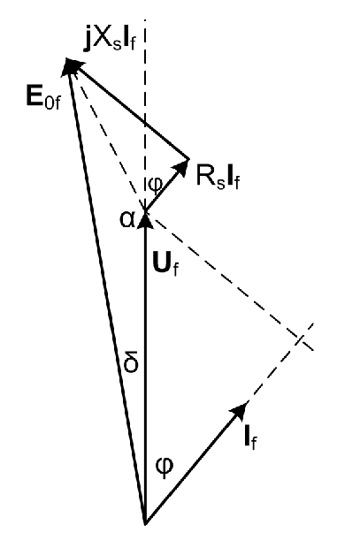

# Zadatak 1 — Indukovana EMS po fazi nadpobuđenog turbogeneratora (kosinusna teorema iz fazorskog dijagrama)

## Postavka

Dati su sledeći podaci o sinhronom generatoru: nazivna prividna snaga $1{,}5\ \mathrm{MVA}$, nazivna aktivna snaga $1{,}2\ \mathrm{MW}$, nazivni (linijski) napon $2{,}3\ \mathrm{kV}$, sprega statorskih namotaja zvezda (Y), učestanost $50\ \mathrm{Hz}$, broj pari polova $2$, otpornost statorskih namotaja $0{,}2\ \Omega$, sinhrona reaktansa $1{,}95\ \Omega$. Gubici u gvožđu i mehanički gubici se mogu zanemariti. Izračunati indukovanu elektromotornu silu po fazi generatora u nadpobuđenom stanju, pri nominalnom opterećenju i nominalnom naponu na priključcima generatora.

> **Prevod na običan jezik:** Imamo sinhroni generator (mašinu koja mehaničku energiju turbine pretvara u trofaznu električnu energiju). Znamo koliku ukupnu ("prividnu") snagu sme trajno da daje, koliku od toga aktivnu (korisnu) snagu daje, na kom naponu radi i kolika mu je unutrašnja otpornost i reaktansa po fazi. Traži se: koliki napon se zapravo *indukuje unutar* jedne faze mašine (tzv. elektromotorna sila $E_{0f}$) kada generator radi punim, nazivnim opterećenjem. Taj unutrašnji napon nije jednak naponu na priključcima, jer deo "pojede" pad napona na otpornosti i reaktansi namotaja — i to ne običnim oduzimanjem brojeva, nego *vektorskim* (fazorskim) sabiranjem, jer su napon i struja naizmenične veličine pomerene po fazi. Rešavaćemo geometrijski: nacrtamo fazorski dijagram, uočimo trougao i primenimo kosinusnu teoremu.

## Podaci

| Veličina | Oznaka | Vrednost | Šta ta veličina fizički znači |
|---|---|---|---|
| Nazivna prividna snaga | $S_{\mathrm{n}}$ | $1{,}5\ \mathrm{MVA}$ | Ukupna "gabaritna" snaga koju generator sme trajno da daje; određuje je dozvoljena struja i napon namotaja (zagrevanje), bez obzira na faktor snage. |
| Nazivna aktivna snaga | $P_{\mathrm{n}}$ | $1{,}2\ \mathrm{MW}$ | Deo snage koji se stvarno pretvara u koristan rad kod potrošača (obrće motore, greje, osvetljava). |
| Nazivni linijski napon | $U_{\mathrm{n}}$ | $2{,}3\ \mathrm{kV}$ | Efektivna vrednost napona *između dva fazna provodnika* na priključcima generatora. |
| Sprega statora | Y | zvezda | Tri fazna namotaja spojena u zajedničku tačku (zvezdište); posledica: fazni napon je $\sqrt{3}$ puta manji od linijskog, a fazna struja jednaka linijskoj. |
| Učestanost | $f$ | $50\ \mathrm{Hz}$ | Broj perioda naizmeničnog napona u sekundi (evropska mreža). |
| Broj pari polova | $p$ | $2$ | Koliko parova sever–jug magnetnih polova ima rotor; sa $f$ određuje brzinu obrtanja ($n = 60f/p = 1500\ \mathrm{o/min}$). U ovom zadatku se ne koristi u računu. |
| Otpornost statorskog namotaja (po fazi) | $R_s$ | $0{,}2\ \Omega$ | Omska (aktivna) otpornost bakra jedne faze — na njoj pad napona u fazi sa strujom i gubici $R_s I^2$. |
| Sinhrona reaktansa (po fazi) | $X_s$ | $1{,}95\ \Omega$ | Ukupna induktivna reaktansa jedne faze (rasipanje + reakcija indukta); na njoj pad napona koji *prednjači* struji za $90^0$. |
| Gubici u gvožđu i mehanički | — | zanemareni | Ne utiču na naponsku jednačinu statorskog kola, pa ih za ovaj račun slobodno izostavljamo. |

**Traži se:** indukovana elektromotorna sila po fazi $E_{0f}$ u nadpobuđenom režimu, pri nazivnom opterećenju i nazivnom naponu.

## Šta se traži i zašto

**Indukovana elektromotorna sila po fazi, $E_{0f}$** — to je napon koji obrtno magnetno polje rotora (pobude) indukuje u jednom faznom namotaju statora. Zamislite je kao "unutrašnji izvor" generatora: ona postoji i kada generator ništa ne napaja (tada je jednaka naponu na priključcima), a čim poteče struja, između $E_{0f}$ i napona na priključcima $U_f$ pojavljuje se razlika — pad napona na $R_s$ i $X_s$.

Zašto to inženjera zanima:

- $E_{0f}$ je direktna mera **pobude**: veća struja pobude (struja kroz rotorski namotaj) → jači magnetni fluks → veća $E_{0f}$. Kad znamo koliku $E_{0f}$ mašina mora da napravi pod opterećenjem, znamo kako da dimenzionišemo i podesimo pobudni sistem.
- Od odnosa $E_{0f}$ i $U_f$ zavisi **razmena reaktivne snage** sa mrežom (nadpobuđen generator daje reaktivnu snagu mreži) i **stabilnost** rada (ugao snage $\delta$).
- Iz $E_{0f}$ se računa i **promena napona** pri rasterećenju: ako generator naglo ostane bez tereta, napon na priključcima skoči približno na $E_{0f}$.

**Plan rešavanja** (svaki korak detaljno sledi u rešenju):

1. Iz nazivne prividne snage i nazivnog napona izračunamo nazivnu (faznu) struju $I_{\mathrm{n}f}$ — jer padovi napona zavise od struje.
2. Iz odnosa $P_{\mathrm{n}}/S_{\mathrm{n}}$ izračunamo faktor snage $\cos\varphi_{\mathrm{n}}$, pa ugao $\varphi_{\mathrm{n}}$ između napona i struje.
3. Nacrtamo fazorski dijagram naponske jednačine statora i u njemu uočimo trougao: napon $U_f$, pad napona na sinhronoj impedansi i $E_{0f}$. Odredimo ugao $\alpha$ između prve dve stranice.
4. Primenimo kosinusnu teoremu na taj trougao i izračunamo treću stranicu — traženu $E_{0f}$.

## Potrebna teorija — mini-lekcije

### Mini-lekcija 1: Sinhroni generator i turbogenerator

Sinhroni generator je naizmenična mašina kod koje se rotor obrće *tačno* sinhronom brzinom, koju diktiraju učestanost mreže i broj pari polova: $n_s = 60 f / p$. Kroz rotorski namotaj (pobudu) teče *jednosmerna* struja koja pravi magnetno polje; kako se rotor obrće, to polje "prelazi" preko statorskih namotaja i u njima indukuje naizmeničnu elektromotornu silu. **Turbogenerator** je sinhroni generator sa **cilindričnim (okruglim) rotorom** — vazdušni zazor mu je ravnomeran po celom obimu, pa se cela mašina po fazi može opisati *jednom* reaktansom $X_s$ (kod isturenih polova bile bi potrebne dve). Naš generator ima $p=2$, dakle $n_s = 60\cdot 50/2 = 1500\ \mathrm{o/min}$ — tipična brzina turbogeneratora manje snage.

### Mini-lekcija 2: Trofazni sistem, sprega zvezda, fazne i linijske veličine

Trofazni generator ima tri jednaka namotaja (faze) čiji su naponi međusobno pomereni za $120^0$. Kod sprege **zvezda (Y)** krajevi sva tri namotaja spojeni su u jednu tačku. Posledice, koje treba znati napamet:

$$U_f = \frac{U}{\sqrt{3}}, \qquad I_f = I,$$

gde je $U$ **linijski napon** (između dva fazna provodnika — to je ono "2,3 kV" sa natpisne pločice), $U_f$ **fazni napon** (na *jednom* namotaju, između faznog provodnika i zvezdišta), $I$ linijska i $I_f$ fazna struja. Faktor $\sqrt{3}$ potiče iz geometrije: linijski napon je razlika dva fazna napona pomerena za $120^0$, a dužina te razlike u fazorskom trouglu iznosi $2\cos 30^0 = \sqrt{3}$ puta fazni napon.

**Prividna snaga** trofazne mašine je ukupna "volt-amperska" snaga sve tri faze:

$$S = 3\, U_f I_f = 3\cdot\frac{U}{\sqrt{3}}\cdot I = \sqrt{3}\, U I .$$

Ovaj obrazac je ključ za prvi korak: sa pločice čitamo $S_{\mathrm{n}}$ i linijski $U_{\mathrm{n}}$, pa je struja $I = S_{\mathrm{n}}/(\sqrt{3}U_{\mathrm{n}})$.

### Mini-lekcija 3: Aktivna, prividna snaga i faktor snage

Kod naizmeničnih struja napon i struja u opštem slučaju *nisu* u fazi — struja kasni (ili prednjači) za ugao $\varphi$. Zbog toga se razlikuju:

- **aktivna snaga** $P = \sqrt{3}\,U I \cos\varphi$ — stvarno iskorišćena snaga (pretvara se u rad/toplotu kod potrošača);
- **prividna snaga** $S = \sqrt{3}\,U I$ — proizvod efektivnih vrednosti, merodavan za zagrevanje i dimenzionisanje.

Njihov odnos je **faktor snage**:

$$\cos\varphi = \frac{P}{S}.$$

Ovo je istovremeno i *definicija* i najbrži način da se iz podataka sa pločice ($P_{\mathrm{n}}$, $S_{\mathrm{n}}$) dobije ugao $\varphi_{\mathrm{n}}$ između fazora napona i fazora struje u nazivnom režimu — a taj ugao nam treba za crtanje fazorskog dijagrama.

### Mini-lekcija 4: Fazori i operator $j$

Sinusne veličine iste učestanosti najlakše se sabiraju kao **fazori**: usmerene duži (vektori u kompleksnoj ravni) čija dužina predstavlja efektivnu vrednost, a ugao početnu fazu. Sabrati dva naizmenična napona znači nadovezati njihove fazore "vrh na rep", kao vektore. Množenje fazora **imaginarnom jedinicom $j$** znači *zaokretanje za $+90^0$* (unapred) bez promene dužine. Zato pad napona na čistoj induktivnosti pišemo $jX_s \mathbf{I}_f$: on je po intenzitetu $X_s I_f$, a po pravcu prednjači struji za $90^0$. Pad na otpornosti, $R_s\mathbf{I}_f$, ostaje u fazi sa strujom (isti pravac kao $\mathbf{I}_f$).

### Mini-lekcija 5: Naponska jednačina statora i Potjeov (fazorski) dijagram

Statorsko kolo jedne faze sinhronog generatora sa cilindričnim rotorom modeluje se kao: unutrašnji izvor $E_{0f}$ (indukovana EMS), na red sa njim otpornost $R_s$ i sinhrona reaktansa $X_s$, a na krajevima napon mreže $U_f$. **Sinhrona reaktansa** $X_s$ obuhvata dva efekta zajedno: rasipnu reaktansu namotaja i tzv. reakciju indukta (slabljenje/izobličenje polja rotora poljem statorskih struja) — kod cilindričnog rotora oba se smeju sažeti u jednu konstantu. Po drugom Kirhofovom zakonu, unutrašnja EMS mora da pokrije napon na priključcima *plus* oba pada napona, i to fazorski:

$$\mathbf{E}_{0f} = \mathbf{U}_f + R_s\mathbf{I}_f + jX_s\mathbf{I}_f .$$

Grafički prikaz ove jednačine zove se **Potjeov dijagram** (fazorski/vektorski dijagram napona). Crtamo ga ovako: iz koordinatnog početka nanesemo $\mathbf{U}_f$; pod uglom $\varphi$ *iza* njega (jer struja kasni) nanesemo $\mathbf{I}_f$; zatim na vrh $\mathbf{U}_f$ nadovežemo $R_s\mathbf{I}_f$ (paralelno struji), pa na njegov vrh $jX_s\mathbf{I}_f$ (upravno na struju, zaokrenuto unapred). Duž od koordinatnog početka do krajnjeg vrha je $\mathbf{E}_{0f}$.

### Mini-lekcija 6: Nadpobuđen režim rada

Pobudu generatora možemo pojačavati ili slabiti nezavisno od aktivne snage. Kaže se da je generator **nadpobuđen** kada je pobuda tolika da je $E_{0f}$ *veća* od napona mreže — tada generator, pored aktivne, **proizvodi i reaktivnu snagu** i predaje je mreži (ponaša se, gledano iz mreže, kao kondenzator), a struja statora **kasni** za naponom (posmatrano u generatorskom smeru brojanja). Upravo taj slučaj je zadat: potrošači u mreži su pretežno induktivni (motori, transformatori) i traže reaktivnu snagu, pa elektrane generatore po pravilu voze nadpobuđene. Suprotan slučaj ($E_{0f}$ mala, struja prednjači, generator *uzima* reaktivnu snagu) zove se potpobuđen režim.

### Mini-lekcija 7: Sinhrona impedansa i njen ugao

Otpornost i reaktansa zajedno čine **sinhronu impedansu** faze:

$$Z_s = \sqrt{R_s^2 + X_s^2},$$

jer se pad $R_s I_f$ (u fazi sa strujom) i pad $X_s I_f$ (upravan na struju) sabiraju kao katete pravouglog trougla — Pitagorina teorema. Ukupan pad napona $Z_s I_f$ prednjači struji za **ugao impedanse**

$$\theta_Z = \mathrm{arctg}\,\frac{X_s}{R_s},$$

što se vidi iz istog pravouglog trougla: naspramna kateta ugla je $X_s I_f$, nalegla $R_s I_f$, pa je tangens ugla $X_s/R_s$. Kod sinhronih mašina je $X_s \gg R_s$, pa je $\theta_Z$ blizu $90^0$ (ovde $84{,}1^0$) — ukupan pad napona je "skoro čisto induktivan".

### Mini-lekcija 8: Kosinusna teorema

Za bilo koji trougao sa stranicama $a$, $b$, $c$, gde stranice $a$ i $b$ zaklapaju ugao $\gamma$ (naspram stranice $c$), važi:

$$c^2 = a^2 + b^2 - 2ab\cos\gamma .$$

Ovo je "Pitagorina teorema za kose trouglove": kad je $\gamma = 90^0$, $\cos\gamma = 0$ i ostaje običan Pitagora; kad je $\gamma$ tup (naš slučaj!), $\cos\gamma$ je *negativan*, pa se popravni član *dodaje* i stranica $c$ ispada duža. U fazorskim dijagramima je kosinusna teorema standardni alat: tri fazora vezana jednačinom $\mathbf{c} = \mathbf{a} + \mathbf{b}$ uvek obrazuju trougao, pa ako znamo dve dužine i ugao između njih, treću dužinu dobijamo bez rastavljanja na komponente.

## Rešenje, korak po korak

### Korak 1: Nazivna fazna struja generatora

**Zašto ovaj korak:** Svi padovi napona u mašini ($R_s I_f$ i $X_s I_f$) srazmerni su struji, pa bez struje ne možemo ni da počnemo. Pri nazivnom opterećenju kroz namotaje teče nazivna struja, a nju određuje *prividna* snaga (ona je merodavna za struju bez obzira na faktor snage).

Opšti obrazac (iz mini-lekcije 2, $S = \sqrt{3}\,U I$, rešeno po struji):

$$I_{\mathrm{n}f} = I_{\mathrm{n}} = \frac{S_{\mathrm{n}}}{\sqrt{3}\cdot U_{\mathrm{n}}}$$

Ovde je $I_{\mathrm{n}f}$ nazivna fazna struja, $I_{\mathrm{n}}$ nazivna linijska struja (kod sprege Y su jednake, zato pišemo oba znaka jednakosti), $S_{\mathrm{n}} = 1{,}5\ \mathrm{MVA} = 1{,}5\cdot 10^6\ \mathrm{VA}$ i $U_{\mathrm{n}} = 2{,}3\ \mathrm{kV} = 2{,}3\cdot 10^3\ \mathrm{V}$ (linijski napon!).

Uvrštavamo, sa međukorakom za imenilac ($\sqrt{3} \approx 1{,}732$):

$$I_{\mathrm{n}f} = \frac{1{,}5\cdot 10^6\ \mathrm{VA}}{\sqrt{3}\cdot 2{,}3\cdot 10^3\ \mathrm{V}} = \frac{1{,}5\cdot 10^6}{3983{,}7}\ \mathrm{A} = 376{,}5\ \mathrm{A}$$

> **Napomena o originalu:** U zbirci u ovom razlomku stoji "$1500\cdot 10^6$", što je štamparska omaška u eksponentu: $1{,}5\ \mathrm{MVA} = 1500\cdot 10^3\ \mathrm{VA} = 1{,}5\cdot 10^6\ \mathrm{VA}$. Rezultat u zbirci, $376{,}5\ \mathrm{A}$, izračunat je sa ispravnom vrednošću i tačan je.

**Šta smo dobili:** Kroz svaki fazni namotaj pri punom opterećenju teče $376{,}5\ \mathrm{A}$. To je krupna struja, očekivana za mašinu od $1{,}5\ \mathrm{MVA}$ na relativno niskom naponu od $2{,}3\ \mathrm{kV}$.

### Korak 2: Nazivni faktor snage i fazni stav struje

**Zašto ovaj korak:** Za crtanje fazorskog dijagrama moramo znati *pod kojim uglom* struja kasni za naponom. Taj ugao ne piše direktno u podacima, ali ga kriju dve snage sa pločice.

Po definiciji faktora snage (mini-lekcija 3), kao odnos aktivne i prividne snage u nazivnom režimu:

$$\cos\varphi_{\mathrm{n}} = \frac{P_{\mathrm{n}}}{S_{\mathrm{n}}} = \frac{1{,}2\ \mathrm{MW}}{1{,}5\ \mathrm{MVA}} = 0{,}8 \;\;\Rightarrow\;\; \varphi_{\mathrm{n}} = \arccos 0{,}8 = 36{,}87^0$$

Ovde je $\varphi_{\mathrm{n}}$ ugao između fazora faznog napona $\mathbf{U}_f$ i fazora fazne struje $\mathbf{I}_f$; megavati i megavoltamperi u razlomku se skraćuju, pa smemo deliti brojeve "1,2 i 1,5" direktno.

**Šta smo dobili:** Struja kasni za naponom za $36{,}87^0$ — klasičan "školski" ugao (trougao 3-4-5: $\cos\varphi = 0{,}8$, $\sin\varphi = 0{,}6$). Kašnjenje struje potvrđuje da generator radi nadpobuđeno i daje mreži reaktivnu snagu.

### Korak 3: Fazorski dijagram i ugao $\alpha$

**Zašto ovaj korak:** Da bismo primenili kosinusnu teoremu, prvo moramo *videti* trougao i izračunati ugao između njegovih poznatih stranica. Zato crtamo fazorski dijagram naponske jednačine.

Naponska jednačina statorskog kola (mini-lekcija 5), koja odgovara dijagramu:

$$\mathbf{E}_{0f} = \mathbf{U}_f + R_s\mathbf{I}_f + jX_s\mathbf{I}_f$$

Simboli: $\mathbf{E}_{0f}$ — fazor indukovane EMS jedne faze (tražena veličina), $\mathbf{U}_f$ — fazor faznog napona na priključcima, $\mathbf{I}_f$ — fazor fazne struje, $R_s\mathbf{I}_f$ — pad napona na otpornosti (u fazi sa strujom), $jX_s\mathbf{I}_f$ — pad napona na sinhronoj reaktansi (prednjači struji za $90^0$).

Sledeća slika prikazuje taj dijagram — Potjeov dijagram nadpobuđenog turbogeneratora. Čitajte ga ovako: iz donje tačke (koordinatni početak) polazi vertikalno fazor napona $\mathbf{U}_f$; desno od njega, zaokrenut za ugao $\varphi$ *unazad* (struja kasni), polazi fazor struje $\mathbf{I}_f$. Na vrh $\mathbf{U}_f$ nadovezan je kratak fazor $R_s\mathbf{I}_f$ (paralelan struji — zato i uz njega piše ugao $\varphi$ prema vertikali), a na njega dug fazor $jX_s\mathbf{I}_f$ (upravan na struju). Duž od početka do krajnjeg vrha je $\mathbf{E}_{0f}$. Ugao $\delta$ između $\mathbf{U}_f$ i $\mathbf{E}_{0f}$ je ugao snage (ovde ga ne računamo), a ugao $\alpha$ — obeležen kod vrha fazora $\mathbf{U}_f$ — jeste *unutrašnji ugao trougla* između fazora napona i ukupnog pada napona; njega sada računamo.

**Slika 1.1 —** Fazorski dijagram (Potjeov dijagram) sinhronog turbogeneratora u nadpobuđenom režimu: struja $\mathbf{I}_f$ kasni za naponom $\mathbf{U}_f$ za ugao $\varphi$; na vrh $\mathbf{U}_f$ nadovezuju se padovi $R_s\mathbf{I}_f$ i $jX_s\mathbf{I}_f$, a zbir svega je $\mathbf{E}_{0f}$; $\alpha$ je ugao trougla između $\mathbf{U}_f$ i ukupnog pada napona, $\delta$ ugao snage.

Dva pada napona zajedno čine jedan fazor — pad na sinhronoj impedansi, dužine $Z_s I_f$, koji **prednjači struji** za ugao impedanse $\theta_Z = \mathrm{arctg}(X_s/R_s)$ (mini-lekcija 7). Pošto sama struja **kasni za naponom** za $\varphi$, ukupan pad napona zaklapa sa pravcem $\mathbf{U}_f$ ugao:

$$\theta_Z - \varphi = \mathrm{arctg}\,\frac{X_s}{R_s} - \varphi \quad (\text{mereno unapred od pravca } \mathbf{U}_f).$$

Trougao koji nas zanima ima temena: koordinatni početak, vrh $\mathbf{U}_f$ i vrh $\mathbf{E}_{0f}$. Unutrašnji ugao $\alpha$ tog trougla nalazi se kod vrha $\mathbf{U}_f$ — između kraka koji ide *nazad duž* $\mathbf{U}_f$ (ka početku) i kraka koji ide duž pada napona. Krak "nazad duž $\mathbf{U}_f$" je zaokrenut za $180^0$ u odnosu na pravac $\mathbf{U}_f$, a pad napona za $\theta_Z - \varphi$, pa je ugao između njih:

$$\alpha = 180^0 - (\theta_Z - \varphi) = 180^0 - \mathrm{arctg}\,\frac{X_s}{R_s} + \varphi$$

Uvrštavamo brojeve, sa međukorakom za arkus tangens ($1{,}95/0{,}2 = 9{,}75$, pa $\mathrm{arctg}\,9{,}75 = 84{,}14^0$):

$$\alpha = 180^0 - \mathrm{arctg}\,\frac{1{,}95}{0{,}2} + 36{,}87^0 = 180^0 - 84{,}14^0 + 36{,}87^0 = 132{,}7^0$$

**Šta smo dobili:** Ugao između fazora napona mreže i fazora ukupnog pada napona u trouglu je tup, $132{,}7^0$. To je i logično: pad napona je skoro čisto induktivan (skoro upravan na struju), a struja kasni, pa se pad "otvara" daleko od pravca $-\mathbf{U}_f$. Tup ugao će nam u kosinusnoj teoremi dati $E_{0f} > U_f$ — baš ono što očekujemo od nadpobuđene mašine.

### Korak 4: Kosinusna teorema — indukovana EMS $E_{0f}$

**Zašto ovaj korak:** Sada u trouglu znamo dve stranice — fazni napon $U_{\mathrm{n}f}$ i pad napona na sinhronoj impedansi $Z_s I_{\mathrm{n}f}$ — i ugao $\alpha$ između njih. Treća stranica, naspram ugla $\alpha$, jeste tražena $E_{0f}$: idealan zadatak za kosinusnu teoremu (mini-lekcija 8).

Prvo pripremimo dve poznate stranice.

**Fazni napon** (sprega Y, mini-lekcija 2):

$$U_{\mathrm{n}f} = \frac{U_{\mathrm{n}}}{\sqrt{3}} = \frac{2300\ \mathrm{V}}{\sqrt{3}} = 1327{,}9\ \mathrm{V}$$

**Pad napona na sinhronoj impedansi** — njegov kvadrat je po Pitagori zbir kvadrata oba pada:

$$\left(Z_s I_{\mathrm{n}f}\right)^2 = \left(R_s I_{\mathrm{n}f}\right)^2 + \left(X_s I_{\mathrm{n}f}\right)^2 = \left(R_s^2 + X_s^2\right) I_{\mathrm{n}f}^2$$

Brojčano, po komponentama:

$$R_s I_{\mathrm{n}f} = 0{,}2\cdot 376{,}5 = 75{,}3\ \mathrm{V}, \qquad X_s I_{\mathrm{n}f} = 1{,}95\cdot 376{,}5 = 734{,}2\ \mathrm{V},$$

$$Z_s I_{\mathrm{n}f} = \sqrt{75{,}3^2 + 734{,}2^2} = \sqrt{5670 + 539\,013}\ \mathrm{V} = \sqrt{544\,683}\ \mathrm{V} = 738{,}0\ \mathrm{V}$$

Sada kosinusna teorema. U opštem obliku $c^2 = a^2 + b^2 - 2ab\cos\gamma$, sa $a = U_{\mathrm{n}f}$, $b = Z_s I_{\mathrm{n}f}$, $\gamma = \alpha$ i $c = E_{0f}$:

$$E_{0f} = \sqrt{U_{\mathrm{n}f}^2 + \left[\left(R_s I_{\mathrm{n}f}\right)^2 + \left(X_s I_{\mathrm{n}f}\right)^2\right] - 2\cdot U_{\mathrm{n}f}\cdot\sqrt{\left(R_s I_{\mathrm{n}f}\right)^2 + \left(X_s I_{\mathrm{n}f}\right)^2}\cdot\cos\alpha}$$

Uvrstimo brojeve tačno kao u zbirci (napon kroz $2300/\sqrt{3}$, impedansa preko $0{,}2^2 + 1{,}95^2 = 3{,}8425$):

$$E_{0f} = \sqrt{\frac{2300^2}{3} + \left(0{,}2^2 + 1{,}95^2\right)\cdot 376{,}5^2 - 2\cdot\frac{2300}{\sqrt{3}}\cdot 376{,}5\cdot\sqrt{0{,}2^2 + 1{,}95^2}\cdot\cos 132{,}7^0}$$

Izračunajmo član po član, da se nijedan korak ne preskoči:

- prvi član: $\dfrac{2300^2}{3} = \dfrac{5\,290\,000}{3} = 1\,763\,333\ \mathrm{V^2}$ (to je $U_{\mathrm{n}f}^2 = 1327{,}9^2$);
- drugi član: $3{,}8425\cdot 376{,}5^2 = 3{,}8425\cdot 141\,752 = 544\,683\ \mathrm{V^2}$ (to je $(Z_s I_{\mathrm{n}f})^2 = 738{,}0^2$);
- treći član: $\cos 132{,}7^0 = -0{,}6782$ (ugao je tup, kosinus **negativan**!), pa je
$$-2\cdot 1327{,}9\cdot 738{,}0\cdot(-0{,}6782) = +1\,329\,233\ \mathrm{V^2}.$$

Minus ispred člana i minus u kosinusu daju **plus** — ceo popravni član se *dodaje*:

$$E_{0f} = \sqrt{1\,763\,333 + 544\,683 + 1\,329\,233}\ \mathrm{V} = \sqrt{3\,637\,249}\ \mathrm{V} = 1907{,}2\ \mathrm{V}$$

**Šta smo dobili:** Indukovana EMS po fazi je $E_{0f} \approx 1907{,}2\ \mathrm{V}$ — oko $44\%$ veća od faznog napona na priključcima ($1327{,}9\ \mathrm{V}$). Unutrašnji izvor mora da bude toliko "jači" od mreže da pokrije pad napona i da pri tome gura i aktivnu i reaktivnu snagu ka mreži. To je tipična slika nadpobuđenog generatora.

> **Napomena o zaokruživanju:** Ako se ceo račun sprovede bez usputnih zaokruživanja ($I_{\mathrm{n}f} = 376{,}53\ \mathrm{A}$, $\alpha = 132{,}73^0$), dobija se $E_{0f} = 1907{,}4\ \mathrm{V}$ — razlika od $0{,}2\ \mathrm{V}$ ($0{,}01\%$) potiče isključivo od zaokruživanja međurezultata i rezultat zbirke $1907{,}2\ \mathrm{V}$ je u tom smislu tačan.

## Česte greške i zamke

1. **Linijski umesto faznog napona u trouglu.** Kosinusna teorema se primenjuje na *fazne* veličine — stranica trougla je $U_{\mathrm{n}f} = 2300/\sqrt{3} = 1327{,}9\ \mathrm{V}$, а ne $2300\ \mathrm{V}$. Ko uvrsti linijski napon, dobiće besmisleno veliku EMS. Isto važi i unazad: dobijena $E_{0f} = 1907{,}2\ \mathrm{V}$ je EMS *po fazi* (tako se i traži).
2. **Struja iz aktivne umesto iz prividne snage.** Nazivna struja se računa iz $S_{\mathrm{n}}$: $I_{\mathrm{n}} = S_{\mathrm{n}}/(\sqrt{3}U_{\mathrm{n}})$. Formula $P_{\mathrm{n}}/(\sqrt{3}U_{\mathrm{n}}\cos\varphi_{\mathrm{n}})$ daje isti broj (jer je $P_{\mathrm{n}} = S_{\mathrm{n}}\cos\varphi_{\mathrm{n}}$), ali $P_{\mathrm{n}}/(\sqrt{3}U_{\mathrm{n}})$ *bez* $\cos\varphi_{\mathrm{n}}$ daje pogrešnih $301{,}2\ \mathrm{A}$.
3. **Znak kosinusa tupog ugla.** $\cos 132{,}7^0 = -0{,}678$ je *negativan*, pa se član $-2ab\cos\alpha$ u zbiru pojavljuje sa znakom **plus**. Ko mehanički oduzme (uzme $\cos\alpha$ kao pozitivan broj), dobiće $E_{0f} \approx 989\ \mathrm{V}$, manju od napona mreže — što je za nadpobuđen režim očigledna kontradikcija.
4. **Pogrešan ugao u kosinusnoj teoremi.** U teoremu ide ugao *između stranica koje znamo*, tj. unutrašnji ugao trougla $\alpha = 180^0 - \mathrm{arctg}(X_s/R_s) + \varphi$, a ne ugao $\theta_Z - \varphi = 47{,}3^0$ koji pad napona zaklapa sa pravcem $\mathbf{U}_f$. Pomešati ta dva ugla znači promašiti i znak i vrednost popravnog člana.
5. **Obrnut razlomak u arkus tangensu.** Ugao impedanse je $\mathrm{arctg}(X_s/R_s) = \mathrm{arctg}\,9{,}75 = 84{,}14^0$; ko izračuna $\mathrm{arctg}(R_s/X_s) = 5{,}86^0$, dobio je ugao između pada napona i pravca *reaktansnog* pada, ne ono što treba. (Kontrola: kod sinhrone mašine pad je skoro čisto induktivan, pa ugao mora biti blizu $90^0$.)
6. **Kalkulator u pogrešnom modu.** Ako kalkulator ostane u radijanima, $\cos 132{,}7$ (protumačeno kao $132{,}7$ radijana) iznosi $\approx +0{,}73$ — pozitivno umesto negativno, pa račun "prođe", ali rezultat bude potpuno pogrešan. Uvek proverite da je kalkulator u stepenima kad su uglovi u stepenima.

## Rezime rezultata

| Veličina | Oznaka | Vrednost |
|---|---|---|
| Nazivna fazna (= linijska) struja | $I_{\mathrm{n}f} = I_{\mathrm{n}}$ | $376{,}5\ \mathrm{A}$ |
| Nazivni faktor snage | $\cos\varphi_{\mathrm{n}}$ | $0{,}8$ |
| Fazni stav struje prema naponu | $\varphi_{\mathrm{n}}$ | $36{,}87^0$ |
| Ugao između $\mathbf{U}_f$ i pada napona na $Z_s$ | $\alpha$ | $132{,}7^0$ |
| **Indukovana EMS po fazi (traženo)** | $E_{0f}$ | $\mathbf{1907{,}2\ V}$ |

## Provera smisla

**1. Nezavisan račun kompleksnim brojevima.** Umesto kosinusne teoreme, uradimo istu naponsku jednačinu direktno u kompleksnoj ravni: uzmimo $\mathbf{U}_f = 1327{,}9\ \mathrm{V}$ na realnoj osi i $\mathbf{I}_f = 376{,}5\,\mathrm{A}$ pod uglom $-36{,}87^0$ (struja kasni), tj. $\mathbf{I}_f = 376{,}5\,(0{,}8 - j\,0{,}6)\ \mathrm{A} = (301{,}2 - j\,225{,}9)\ \mathrm{A}$. Tada je:

$$\mathbf{E}_{0f} = \mathbf{U}_f + (R_s + jX_s)\,\mathbf{I}_f = 1327{,}9 + (0{,}2 + j\,1{,}95)(301{,}2 - j\,225{,}9)$$

Množenje zagrada: $(0{,}2)(301{,}2) = 60{,}2$; $(0{,}2)(-j\,225{,}9) = -j\,45{,}2$; $(j\,1{,}95)(301{,}2) = j\,587{,}3$; $(j\,1{,}95)(-j\,225{,}9) = +440{,}5$ (jer $j\cdot(-j) = +1$). Zbir: $(500{,}7 + j\,542{,}1)\ \mathrm{V}$, pa je

$$\mathbf{E}_{0f} = (1828{,}6 + j\,542{,}1)\ \mathrm{V} \;\Rightarrow\; E_{0f} = \sqrt{1828{,}6^2 + 542{,}1^2} = 1907{,}3\ \mathrm{V} \checkmark$$

Isti rezultat (do zaokruživanja) sasvim drugim putem — kosinusna teorema je primenjena ispravno. Usput dobijamo i ugao snage $\delta = \mathrm{arctg}(542{,}1/1828{,}6) = 16{,}5^0$, razuman za nazivno opterećenje.

**2. Poređenje sa naponom mreže.** $E_{0f}/U_{\mathrm{n}f} = 1907{,}2/1327{,}9 = 1{,}44 > 1$ — EMS je veća od napona, tačno kako mora biti u nadpobuđenom režimu (mini-lekcija 6). Da je ispalo $E_{0f} < U_{\mathrm{n}f}$, znali bismo da je negde greška u znaku.

**3. Dimenziona analiza.** Svi članovi pod korenom su u $\mathrm{V^2}$: $U_{\mathrm{n}f}^2\ [\mathrm{V^2}]$, $(Z_s I_{\mathrm{n}f})^2\ [(\Omega\cdot\mathrm{A})^2 = \mathrm{V^2}]$ i $U_{\mathrm{n}f}\cdot Z_s I_{\mathrm{n}f}\ [\mathrm{V}\cdot\mathrm{V} = \mathrm{V^2}]$ — koren vraća volte. Red veličine: pad napona ($738\ \mathrm{V}$) iznosi oko $56\%$ faznog napona, pa EMS od $\approx 1{,}4\,U_{\mathrm{n}f}$ potpuno odgovara geometriji trougla sa tupim uglom.
