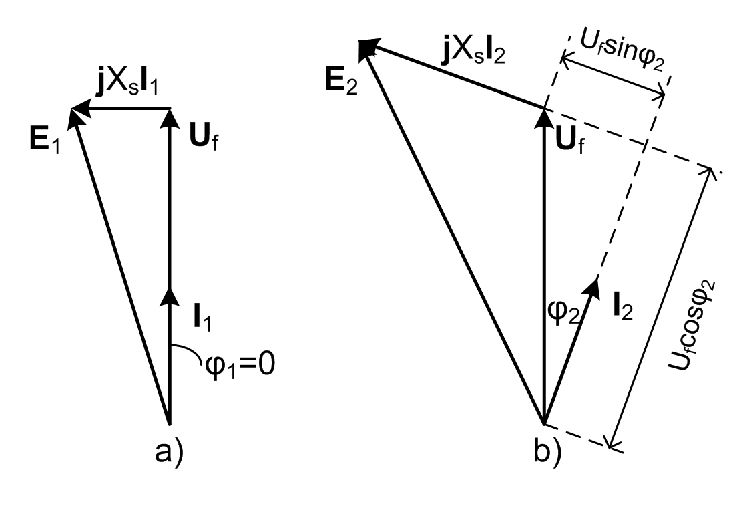

# Zadatak 2 — Podešavanje pobude sinhronog generatora na krutoj mreži za dvostruki pad napona

## Postavka

Sinhroni generator radi paralelno na krutoj mreži linijskog napona $380\ \mathrm{V}$ i snabdeva mrežu snagom $50\ \mathrm{kW}$ uz faktor snage $\cos\varphi_1 = 1$. Pobuda generatora tada iznosi $7\ \mathrm{A}$. Reaktansa statora ovog sinhronog generatora iznosi $1\ \Omega$. Treba odrediti na koju vrednost treba podesiti pobudu (magnetopobudnu silu rotora) uz nepromenjen moment pogonske mašine ($M = \mathrm{const.}$) da bi se pad napona u generatoru udvostručio.

> **Prevod na običan jezik:** Imamo sinhroni generator priključen na veliku, "krutu" električnu mrežu — mrežu čiji su napon i učestanost nepromenljivi, šta god naš generator radio. Generator trenutno u mrežu šalje čistu aktivnu snagu od $50\ \mathrm{kW}$ (faktor snage 1 znači: nimalo reaktivne snage), a struja u njegovom rotorskom (pobudnom) namotaju iznosi $7\ \mathrm{A}$. Unutar generatora, između njegove unutrašnje elektromotorne sile i priključaka, postoji reaktansa od $1\ \Omega$ na kojoj struja pravi "pad napona". Pitanje glasi: na koliko ampera treba povećati (ili smanjiti?) pobudnu struju da taj unutrašnji pad napona postane dvostruko veći nego sada — a da pri tome turbina (pogonska mašina) i dalje gura generator istim momentom, tj. da aktivna snaga ka mreži ostane $50\ \mathrm{kW}$?

## Podaci

| Veličina | Oznaka | Vrednost | Šta ta veličina fizički znači |
|---|---|---|---|
| Linijski napon mreže | $U$ | $380\ \mathrm{V}$ | Efektivna vrednost napona između dva fazna provodnika mreže; kruta mreža ga drži konstantnim. |
| Aktivna snaga u prvom režimu | $P_1$ | $50\ \mathrm{kW}$ | Korisna (aktivna) snaga koju generator predaje mreži — ona koja stvarno "radi posao". |
| Faktor snage u prvom režimu | $\cos\varphi_1$ | $1$ | Kosinus ugla između faznog napona i struje; vrednost 1 znači da su napon i struja u fazi — generator daje samo aktivnu snagu. |
| Pobuda u prvom režimu | $F_1$ | $7\ \mathrm{A}$ | Struja jednosmernog pobudnog namotaja na rotoru; ona je mera magnetopobudne sile (MPS) rotora. |
| Reaktansa statora (sinhrona reaktansa) | $X_s$ | $1\ \Omega$ | Ukupna reaktansa jedne faze statora kroz koju teče struja generatora; na njoj nastaje unutrašnji pad napona $X_s I$. |
| Uslov 1 | — | $M = \mathrm{const.}$ | Pogonska mašina (npr. turbina) i u drugom režimu daje isti mehanički moment kao u prvom. |
| Uslov 2 | — | $X_s I_2 = 2\, X_s I_1$ | U drugom režimu pad napona na reaktansi statora treba da bude dvostruko veći nego u prvom. |

**Tražena veličina:** $F_2$ — nova vrednost pobude (MPS rotora), izražena u amperima pobudne struje.

## Šta se traži i zašto

**Traži se $F_2$ — nova pobudna struja rotora.** Pobudna struja je "dugme" kojim operater sinhronog generatora na mreži podešava reaktivnu snagu i unutrašnje naponske prilike mašine, ne dirajući aktivnu snagu (nju određuje turbina). Inženjera ovo zanima iz vrlo praktičnog razloga: na elektrani se aktivna snaga zadaje regulatorom turbine, a naponsko/reaktivno stanje regulatorom pobude — i ova dva "dugmeta" deluju gotovo nezavisno. Ovaj zadatak je školski primer kako promena pobude menja struju i ugao struje generatora, a da snaga ka mreži ostane ista.

**Plan rešavanja (u 5 koraka, običnim jezikom):**

1. Iz poznate snage i napona izračunamo struju generatora u prvom režimu, $I_1$, pa i pad napona $X_s I_1$.
2. Iz fazorskog dijagrama prvog režima (gde su napon i struja u fazi) Pitagorinom teoremom nađemo unutrašnju elektromotornu silu $E_1$.
3. Iskoristimo uslov "dvostruki pad napona": pošto je $X_s$ konstanta mašine, dvostruki pad napona znači dvostruku struju, $I_2 = 2 I_1$.
4. Iskoristimo uslov "isti moment": na krutoj mreži isti moment znači ista aktivna snaga, pa iz $P_2 = P_1$ dobijamo novi faktor snage $\cos\varphi_2$ i ugao $\varphi_2$. Zatim iz fazorskog dijagrama drugog režima nađemo novu elektromotornu silu $E_2$.
5. Pošto je elektromotorna sila srazmerna pobudi, iz odnosa $E_2/E_1$ preskaliramo staru pobudu i dobijemo $F_2$.

## Potrebna teorija — mini-lekcije

### 1. Kruta mreža

**Definicija:** Kruta (beskonačna) mreža je idealizacija velikog elektroenergetskog sistema: njen napon $U$ i učestanost $f$ su konstantni, bez obzira na to šta radi jedan (relativno mali) generator priključen na nju.

**Intuicija:** Zamislite da u okean sipate kofu vode — nivo okeana se ne menja. Tako ni naš generator od $50\ \mathrm{kW}$ ne može da "pomeri" napon ili učestanost mreže na koju su vezane hiljade drugih mašina. Posledice za ovaj zadatak: (a) napon na priključcima generatora je uvek $380\ \mathrm{V}$ linijski, u oba režima; (b) učestanost je stalna, pa je i brzina obrtanja sinhronog generatora stalna (o tome više u mini-lekciji 5).

### 2. Ekvivalentna šema sinhronog generatora i "pad napona u generatoru"

**Definicija:** Sinhroni generator se po jednoj fazi modeluje kao redna veza idealnog naponskog izvora elektromotorne sile $E$ (nju indukuje obrtno magnetno polje rotora u namotaju statora) i reaktanse $X_s$, koju zovemo *sinhrona reaktansa* (u ovom zadatku: "reaktansa statora"). Otpornost statorskog namotaja se zanemaruje jer je kod većih mašina mnogo manja od $X_s$.

**Formula (naponska jednačina generatora, po fazi, fazorski):**

$$\underline{E} = \underline{U}_f + j X_s \underline{I}$$

gde je $\underline{U}_f$ fazor faznog napona na priključcima (koji diktira mreža), $\underline{I}$ fazor struje statora, a $j X_s \underline{I}$ fazor pada napona na sinhronoj reaktansi. Podvlaka označava fazor (kompleksnu veličinu koja nosi i amplitudu i fazu).

**Poreklo formule:** Ovo je prosto drugi Kirhofov zakon primenjen na rednu vezu izvora $E$ i reaktanse $X_s$: elektromotorna sila izvora jednaka je zbiru napona na priključcima i napona koji "pojede" reaktansa. Množenje sa $j$ (imaginarnom jedinicom) izražava činjenicu da napon na čistoj reaktansi *prednjači* struji za $90^\circ$.

**Šta je "pad napona u generatoru":** to je veličina $X_s \cdot I$ — deo elektromotorne sile koji se "potroši" na unutrašnjoj reaktansi i ne stigne do priključaka. Što je struja veća, veći je i pad napona. Uslov zadatka "pad napona udvostručiti" znači: učiniti da $X_s I_2 = 2 X_s I_1$.

### 3. Fazni i linijski napon; trofazna aktivna snaga

**Definicija:** Kod trofaznog sistema u sprezi zvezda, *linijski napon* $U$ je napon između dva fazna provodnika, a *fazni napon* $U_f$ je napon između jednog faznog provodnika i zvezdišta (neutralne tačke). Veza između njih:

$$U_f = \frac{U}{\sqrt{3}}$$

**Poreklo:** Tri fazna napona su jednaki po amplitudi i međusobno pomereni za $120^\circ$; linijski napon je fazorska razlika dva susedna fazna napona, a geometrija tog trougla (jednakokraki trougao sa uglom $120^\circ$ pri vrhu) daje faktor $\sqrt{3}$.

**Trofazna aktivna snaga:**

$$P = 3 \cdot U_f \cdot I \cdot \cos\varphi = \sqrt{3} \cdot U \cdot I \cdot \cos\varphi$$

gde je $I$ efektivna vrednost fazne struje (u zvezdi jednaka linijskoj), a $\varphi$ ugao između *faznog* napona i struje te faze. Prvi oblik kaže: tri faze, svaka nosi $U_f I \cos\varphi$; drugi oblik nastaje uvrštavanjem $U_f = U/\sqrt{3}$, jer je $3/\sqrt{3} = \sqrt{3}$. Iz ove formule ćemo i "izvlačiti" struje: $I = P / (\sqrt{3}\, U \cos\varphi)$.

**Važno za dalje:** fazorski dijagram generatora se crta po fazi — u njemu figuriše fazni napon $U_f = U/\sqrt{3}$, ne linijski!

### 4. Fazorski dijagram sinhronog generatora — kako iz njega "pročitati" $E$

Fazorski dijagram je grafički prikaz naponske jednačine $\underline{E} = \underline{U}_f + j X_s \underline{I}$: nacrtamo fazor $\underline{U}_f$, na njegov vrh nadovežemo fazor $j X_s \underline{I}$ (koji je uvek *upravan na struju*, zaokrenut $90^\circ$ unapred u odnosu na nju), i strelica od početka do kraja tog lanca je $\underline{E}$.

Slika 2.1 prikazuje fazorske dijagrame oba režima ovog zadatka. **Kako da je čitaš:** na levom dijagramu a) je prvi režim — struja $\underline{I}_1$ je *u fazi* sa naponom $\underline{U}_f$ (jer je $\cos\varphi_1 = 1$, tj. $\varphi_1 = 0$), pa je pad napona $j X_s \underline{I}_1$ upravan na $\underline{U}_f$ i fazori $\underline{U}_f$ i $jX_s\underline{I}_1$ grade pravougli trougao čija je hipotenuza $\underline{E}_1$. Na desnom dijagramu b) je drugi režim — struja $\underline{I}_2$ više nije u fazi sa naponom, već zaklapa ugao $\varphi_2$ sa njim; isprekidane linije pokazuju kako se napon $\underline{U}_f$ razlaže na komponentu $U_f\cos\varphi_2$ *u pravcu struje* i komponentu $U_f\sin\varphi_2$ *upravno na struju*, što ćemo iskoristiti da izračunamo $E_2$.

**Slika 2.1 —** Fazorski dijagrami uz zadatak: a) prvi režim ($\varphi_1 = 0$, pad napona $jX_s\underline{I}_1$ upravan na $\underline{U}_f$); b) drugi režim (struja $\underline{I}_2$ pod uglom $\varphi_2$ u odnosu na $\underline{U}_f$; isprekidano su prikazane projekcije napona $U_f\cos\varphi_2$ i $U_f\sin\varphi_2$ na pravac struje i upravno na njega).

**Kako iz dijagrama sledi formula za $E$ u opštem slučaju:** Postavimo (samo radi računa) koordinatni sistem tako da je jedna osa u pravcu struje $\underline{I}$, a druga upravna na nju. Tada:

- fazor $\underline{U}_f$ ima komponentu $U_f\cos\varphi$ u pravcu struje i $U_f\sin\varphi$ upravno na struju (to je obična trigonometrija razlaganja vektora: projekcija na pravac pod uglom $\varphi$ je "dužina puta kosinus", a na upravni pravac "dužina puta sinus");
- fazor $j X_s \underline{I}$ je *ceo* upravan na struju (jer množenje sa $j$ znači zaokret za $90^\circ$), dužine $X_s I$;
- zato je komponenta fazora $\underline{E}$ u pravcu struje jednaka $U_f\cos\varphi$, a upravno na struju $U_f\sin\varphi + X_s I$ (dva doprinosa na istom pravcu se prosto saberu).

Intenzitet fazora je koren zbira kvadrata njegovih komponenti (Pitagorina teorema), pa:

$$E = \sqrt{\left(U_f\cos\varphi\right)^2 + \left(U_f\sin\varphi + X_s I\right)^2}$$

Za specijalni slučaj $\varphi = 0$ (prvi režim) važi $\cos\varphi = 1$ i $\sin\varphi = 0$, pa se formula svodi na čistu Pitagorinu teoremu nad katetama $U_f$ i $X_s I$:

$$E = \sqrt{U_f^{\,2} + \left(X_s I\right)^2}$$

### 5. Zašto na krutoj mreži "isti moment" znači "ista aktivna snaga"

**Formula:** Mehanička snaga koju pogonska mašina predaje generatoru je

$$P_{\mathrm{meh}} = M \cdot \Omega$$

gde je $M$ moment pogonske mašine (u $\mathrm{Nm}$), a $\Omega$ mehanička ugaona brzina obrtanja (u $\mathrm{rad/s}$). Ovo je opšta mehanika: snaga rotacionog kretanja je moment puta ugaona brzina, isto kao što je kod pravolinijskog kretanja snaga sila puta brzina.

**Ključni argument:** Sinhrona mašina na mreži se obrće *sinhronom brzinom*, koja je kruto vezana za učestanost mreže ($\Omega_s = 2\pi f / p$, gde je $p$ broj pari polova — brzinu diktira učestanost). Kruta mreža drži $f = \mathrm{const.}$, dakle $\Omega = \mathrm{const.}$ u oba režima. Ako je uz to i $M = \mathrm{const.}$ (uslov zadatka), onda je i $P_{\mathrm{meh}} = M\,\Omega = \mathrm{const.}$ Zanemarujući gubitke u mašini (u ovom zadatku ne figuriše nikakav podatak o gubicima), sva mehanička snaga postaje električna aktivna snaga ka mreži:

$$M_2 = M_1 \;\Rightarrow\; P_2 = P_1$$

**Intuicija:** Pobudom ne možemo promeniti koliko "konjskih snaga" turbina gura u osovinu — pobuda menja samo *reaktivnu* stranu priče (koliko struje i pod kojim uglom generator razmenjuje s mrežom), dok aktivnu snagu diktira isključivo turbina.

### 6. Zašto je elektromotorna sila srazmerna pobudi

**Formula (opšti oblik):** Efektivna vrednost elektromotorne sile indukovane u namotaju statora je

$$E = 4{,}44 \cdot f \cdot N \cdot k_{\mathrm{w}} \cdot \Phi$$

gde je $f$ učestanost, $N$ broj navojaka namotaja, $k_{\mathrm{w}}$ navojni sačinilac (konstrukcioni koeficijent namotaja, konstanta mašine, obično malo manji od 1), a $\Phi$ fluks obrtnog polja po polu. Ovo je standardna formula za indukovanu EMS u naizmeničnim mašinama — potiče iz Faradejevog zakona indukcije ($e = -\,\mathrm{d}\psi/\mathrm{d}t$): izvod prostoperiodičnog fluksa daje maksimalnu vrednost EMS $2\pi f N \Phi$, a prelazak sa maksimalne na efektivnu vrednost donosi deljenje sa $\sqrt{2}$, pa je konstanta $\frac{2\pi}{\sqrt{2}} = \sqrt{2}\,\pi \approx 4{,}44$.

**Lanac srazmernosti:** Fluks $\Phi$ stvara magnetopobudna sila (MPS) rotora $F$ — proizvod pobudne struje i broja navojaka pobudnog namotaja. Dok je magnetno kolo mašine *nezasićeno* (radimo na linearnom delu karakteristike magnećenja), fluks je srazmeran MPS-u: $\Phi \propto F$. Učestanost $f$ drži kruta mreža konstantnom, a $N$ i $k_{\mathrm{w}}$ su konstante mašine. Dakle:

$$E \propto \Phi \propto F \quad\Longrightarrow\quad \frac{E_2}{E_1} = \frac{F_2}{F_1} \quad\Longrightarrow\quad F_2 = F_1 \cdot \frac{E_2}{E_1}$$

**Intuicija:** Pobuda je "jačina magneta" na rotoru. Jači magnet koji se obrće istom brzinom pored istog namotaja indukuje srazmerno veći napon. Zato, ako izračunamo koliko puta veća EMS treba mašini u novom režimu, tačno toliko puta treba pojačati i pobudu.

### 7. Zašto pobudu iskazujemo u amperima

Magnetopobudna sila rotora je po definiciji $F = N_{\mathrm{p}} \cdot I_{\mathrm{p}}$ (broj navojaka pobudnog namotaja puta pobudna struja) i njena prava jedinica je amper-navojak. Ali broj navojaka $N_{\mathrm{p}}$ je konstanta mašine — ne možemo ga menjati u pogonu. Jedino "dugme" je pobudna struja $I_{\mathrm{p}}$, pa je uobičajeno (i u ovom zadatku tako urađeno) da se MPS rotora poistoveti sa pobudnom strujom i iskaže u amperima: $F_1 = 7\ \mathrm{A}$ znači "pobudna struja od $7\ \mathrm{A}$". Pošto u rešenju koristimo samo *odnos* $F_2/F_1$, konstanta $N_{\mathrm{p}}$ bi se ionako skratila.

## Rešenje, korak po korak

### Korak 1: Struja generatora u prvom režimu

**Zašto ovaj korak:** Sve u ovom zadatku vrti se oko pada napona $X_s I$, a za njega nam treba struja. Struju ne znamo direktno, ali znamo snagu, napon i faktor snage — pa struju izračunavamo iz formule za trofaznu aktivnu snagu (mini-lekcija 3).

Polazimo od opšte formule za trofaznu aktivnu snagu i rešavamo je po struji. Iz

$$P_1 = \sqrt{3} \cdot U \cdot I_1 \cdot \cos\varphi_1$$

deljenjem obe strane sa $\sqrt{3}\, U \cos\varphi_1$ dobijamo:

$$I_1 = \frac{P_1}{\sqrt{3} \cdot U \cdot \cos\varphi_1}$$

Uvrštavamo brojeve ($P_1 = 50 \cdot 10^3\ \mathrm{W}$, $U = 380\ \mathrm{V}$, $\cos\varphi_1 = 1$):

$$I_1 = \frac{50 \cdot 10^3}{\sqrt{3} \cdot 380 \cdot 1} = \frac{50\,000}{658{,}18} = 75{,}97\ \mathrm{A}$$

**Šta smo dobili:** Struja od oko $76\ \mathrm{A}$ po fazi — razumna vrednost za mašinu od $50\ \mathrm{kW}$ na $380\ \mathrm{V}$. Ovo je struja koju generator "gura" u mrežu u prvom režimu, u fazi sa naponom.

### Korak 2: Pad napona u generatoru u prvom režimu

**Zašto ovaj korak:** Uslov zadatka je formulisan preko pada napona, pa moramo znati njegovu polaznu vrednost da bismo znali šta znači "dvostruko veći".

Pad napona na sinhronoj reaktansi je (mini-lekcija 2) prosto proizvod reaktanse i struje:

$$X_s \cdot I_1 = 1\ \Omega \cdot 75{,}97\ \mathrm{A} = 75{,}97\ \mathrm{V}$$

**Šta smo dobili:** U prvom režimu se unutar generatora, na njegovoj reaktansi, "gubi" $75{,}97\ \mathrm{V}$ (fazorski, ne aritmetički — taj pad je pod pravim uglom u odnosu na struju). Brojno je jednak struji jer je $X_s = 1\ \Omega$.

### Korak 3: Fazni napon mreže

**Zašto ovaj korak:** Fazorski dijagram i naponska jednačina generatora rade sa *faznim* naponom (mini-lekcija 3), a zadat nam je linijski. Moramo preračunati.

$$U_f = \frac{U}{\sqrt{3}} = \frac{380}{\sqrt{3}} = \frac{380}{1{,}732} = 219{,}4\ \mathrm{V}$$

**Šta smo dobili:** Standardni fazni napon mreže $380/\sqrt{3} \approx 220\ \mathrm{V}$ — poznata "domaća" vrednost, što potvrđuje da smo dobro podelili.

### Korak 4: Elektromotorna sila u prvom režimu, $E_1$

**Zašto ovaj korak:** Elektromotorna sila je jedina veličina u mašini direktno srazmerna pobudi (mini-lekcija 6). Da bismo na kraju preskalirali pobudu, treba nam $E$ u oba režima — počinjemo od prvog.

Gledamo fazorski dijagram na slici 2.1a: struja $\underline{I}_1$ je u fazi sa naponom $\underline{U}_f$ (jer je $\varphi_1 = 0$), pa je pad napona $jX_s\underline{I}_1$ upravan na $\underline{U}_f$. Fazori $\underline{U}_f$ i $jX_s\underline{I}_1$ su katete pravouglog trougla, a $\underline{E}_1$ hipotenuza. Po Pitagorinoj teoremi (specijalni slučaj opšte formule iz mini-lekcije 4, sa $\varphi = 0$):

$$E_1 = \sqrt{\left(\frac{U}{\sqrt{3}}\right)^2 + \left(X_s \cdot I_1\right)^2}$$

Uvrštavamo $U/\sqrt{3} = 219{,}4\ \mathrm{V}$ i $X_s I_1 = 75{,}97\ \mathrm{V}$:

$$E_1 = \sqrt{219{,}4^2 + 75{,}97^2} = \sqrt{48\,136 + 5\,771} = \sqrt{53\,908} = 232{,}2\ \mathrm{V}$$

**Šta smo dobili:** $E_1 = 232{,}2\ \mathrm{V}$ — nešto veće od faznog napona mreže ($219{,}4\ \mathrm{V}$), što je i logično: hipotenuza je uvek duža od kateta, tj. unutrašnja EMS mora biti veća od napona na priključcima da bi "pokrila" i pad napona na reaktansi. Ovoj EMS odgovara pobuda $F_1 = 7\ \mathrm{A}$.

### Korak 5: Uslov dvostrukog pada napona — struja u drugom režimu

**Zašto ovaj korak:** Sada "prevodimo" glavni uslov zadatka na jezik struje. Pad napona je $X_s I$, a $X_s$ je konstanta mašine — dakle jedini način da se pad napona udvostruči jeste da se udvostruči struja.

Uslov zadatka glasi:

$$X_s \cdot I_2 = 2 \cdot X_s \cdot I_1 = 2 \cdot 1 \cdot 75{,}97 = 151{,}93\ \mathrm{V}$$

Podelimo obe strane jednakosti $X_s I_2 = 2 X_s I_1$ sa $X_s$ (sme se, $X_s \neq 0$) i ostaje:

$$I_2 = 2 \cdot I_1 = 2 \cdot 75{,}97 = 151{,}93\ \mathrm{A}$$

**Šta smo dobili:** U drugom režimu kroz stator mora teći dvostruka struja, oko $152\ \mathrm{A}$. Obratite pažnju: struja se udvostručila, a snaga (videćemo u sledećem koraku) ostaje ista — "višak" struje očigledno neće nositi aktivnu, već reaktivnu snagu.

### Korak 6: Isti moment ⇒ ista snaga ⇒ novi faktor snage $\cos\varphi_2$

**Zašto ovaj korak:** Za fazorski dijagram drugog režima treba nam ugao $\varphi_2$ između napona i struje. Do njega dolazimo preko drugog uslova zadatka — nepromenjenog momenta.

Po mini-lekciji 5, na krutoj mreži je brzina obrtanja konstantna, pa isti moment znači istu snagu:

$$M_2 = M_1 \;\Rightarrow\; P_2 = P_1 = 50\ \mathrm{kW}$$

Napišimo izraz za aktivnu snagu u oba režima i izjednačimo ih:

$$P_1 = \sqrt{3} \cdot U \cdot I_1 \cdot \cos\varphi_1, \qquad P_2 = \sqrt{3} \cdot U \cdot I_2 \cdot \cos\varphi_2$$

$$P_2 = P_1 \;\Longrightarrow\; \sqrt{3} \cdot U \cdot I_2 \cdot \cos\varphi_2 = \sqrt{3} \cdot U \cdot I_1 \cdot \cos\varphi_1$$

Napon $U$ je isti u oba režima (kruta mreža!), pa obe strane podelimo sa $\sqrt{3}\,U\,I_2$ i ostaje:

$$\cos\varphi_2 = \frac{I_1}{I_2} \cdot \cos\varphi_1 = \frac{1}{2} \cdot 1 = 0{,}5 \;\Longrightarrow\; \varphi_2 = 60^{\circ}$$

(Iskoristili smo $I_1/I_2 = 1/2$ iz Koraka 5; ugao čiji je kosinus $0{,}5$ je $60^\circ$.) Za dalji račun treba nam i sinus tog ugla:

$$\sin\varphi_2 = \sin 60^{\circ} = \frac{\sqrt{3}}{2} = 0{,}866$$

**Šta smo dobili:** U drugom režimu struja generatora zaklapa ugao od $60^\circ$ sa naponom. Aktivna komponenta struje ($I_2\cos\varphi_2 = 151{,}93 \cdot 0{,}5 = 75{,}97\ \mathrm{A}$) ostala je tačno jednaka $I_1$ — to i mora biti tako, jer ona nosi aktivnu snagu, a snaga je ista. Sve što je "naraslo" jeste reaktivna komponenta struje.

### Korak 7: Elektromotorna sila u drugom režimu, $E_2$

**Zašto ovaj korak:** Sada znamo sve o drugom režimu ($U_f$, $I_2$, $\varphi_2$) i možemo iz fazorskog dijagrama izračunati $E_2$ — drugu od dve EMS koje su nam potrebne za skaliranje pobude.

Gledamo fazorski dijagram na slici 2.1b i primenjujemo opštu formulu iz mini-lekcije 4 (razlaganje na komponentu u pravcu struje i upravno na struju):

$$E_2 = \sqrt{\left(\frac{U}{\sqrt{3}} \cdot \cos\varphi_2\right)^2 + \left(\frac{U}{\sqrt{3}} \cdot \sin\varphi_2 + X_s \cdot I_2\right)^2}$$

Podsetimo se odakle ovo: komponenta EMS u pravcu struje potiče samo od napona i iznosi $U_f\cos\varphi_2$; komponenta upravno na struju je zbir projekcije napona $U_f\sin\varphi_2$ i celog pada napona $X_s I_2$ (koji je uvek upravan na struju). Intenzitet je koren zbira kvadrata komponenti.

Uvrstimo brojeve, deo po deo:

$$\frac{U}{\sqrt{3}} \cdot \cos\varphi_2 = 219{,}4 \cdot 0{,}5 = 109{,}7\ \mathrm{V}$$

$$\frac{U}{\sqrt{3}} \cdot \sin\varphi_2 + X_s \cdot I_2 = 219{,}4 \cdot 0{,}866 + 1 \cdot 151{,}93 = 190{,}0 + 151{,}93 = 341{,}93\ \mathrm{V}$$

Sada koren zbira kvadrata:

$$E_2 = \sqrt{109{,}7^2 + 341{,}93^2} = \sqrt{12\,034 + 116\,916} = \sqrt{128\,950} = 359{,}1\ \mathrm{V}$$

**Šta smo dobili:** $E_2 = 359{,}1\ \mathrm{V}$ — znatno više od $E_1 = 232{,}2\ \mathrm{V}$. Logično: da bi se kroz istu reaktansu progurala dvostruka struja, a napon mreže ostao isti, unutrašnja EMS mora značajno porasti.

### Korak 8: Nova pobuda $F_2$

**Zašto ovaj korak:** Ovo je cilj zadatka. Po mini-lekciji 6, EMS je direktno srazmerna pobudi (nezasićeno magnetno kolo, konstantna učestanost), pa pobudu skaliramo istim odnosom kojim je porasla EMS.

Iz srazmere $\dfrac{F_2}{F_1} = \dfrac{E_2}{E_1}$ množenjem obe strane sa $F_1$ sledi:

$$F_2 = F_1 \cdot \frac{E_2}{E_1} = 7 \cdot \frac{359{,}1}{232{,}2} = 7 \cdot 1{,}5465 = 10{,}83\ \mathrm{A}$$

**Šta smo dobili:** Pobudu treba podesiti na $F_2 = 10{,}83\ \mathrm{A}$, dakle povećati je oko $1{,}55$ puta u odnosu na početnih $7\ \mathrm{A}$. To je vrednost magnetopobudne sile rotora (iskazane pobudnom strujom) pri kojoj će pad napona u generatoru biti dvostruko veći, a snaga ka mreži i dalje $50\ \mathrm{kW}$.

## Česte greške i zamke

1. **Mešanje linijskog i faznog napona.** U formuli za snagu figuriše *linijski* napon uz $\sqrt{3}$, a u fazorskom dijagramu i formulama za $E$ figuriše *fazni* napon $U/\sqrt{3} = 219{,}4\ \mathrm{V}$. Ko u Koraku 4 uvrsti $380\ \mathrm{V}$ umesto $219{,}4\ \mathrm{V}$, dobiće besmisleno veliku EMS i pogrešnu pobudu.

2. **Primena "obične" Pitagorine teoreme i u drugom režimu.** Formula $E = \sqrt{U_f^2 + (X_s I)^2}$ važi *samo* kad je struja u fazi sa naponom ($\varphi = 0$). U drugom režimu je $\varphi_2 = 60^\circ$ i mora se koristiti opšta formula sa $\cos\varphi_2$ i $\sin\varphi_2$ (Korak 7). Ko primeni prostu Pitagoru sa $I_2$, dobiće $E_2 = \sqrt{219{,}4^2 + 151{,}93^2} \approx 266{,}8\ \mathrm{V}$ — pogrešno.

3. **Zaključak "dvostruki pad napona ⇒ dvostruka snaga".** Ne! Snaga je vezana za *aktivnu* komponentu struje i za moment turbine, koji je po uslovu nepromenjen. Struja jeste dvostruka, ali njen "višak" je čisto reaktivan — generator u drugom režimu daje mreži i veliku reaktivnu snagu, a aktivna ostaje $50\ \mathrm{kW}$.

4. **Poistovećivanje pobudne struje sa strujom statora.** Podatak $7\ \mathrm{A}$ je jednosmerna struja *rotorskog (pobudnog)* namotaja, a nema nikakve veze sa naizmeničnom strujom statora od $75{,}97\ \mathrm{A}$. To su dva različita strujna kola.

5. **Zaboravljen $\sin\varphi_2$ ili rad u pogrešnim jedinicama ugla.** Iz $\cos\varphi_2 = 0{,}5$ sledi $\varphi_2 = 60^\circ$ i $\sin\varphi_2 = 0{,}866$; ko kalkulator drži u radijanima ili uvrsti $\sin 0{,}5$, dobija pogrešan rezultat u Koraku 7.

## Rezime rezultata

| Veličina | Oznaka | Vrednost |
|---|---|---|
| Struja generatora u prvom režimu | $I_1$ | $75{,}97\ \mathrm{A}$ |
| Pad napona u prvom režimu | $X_s I_1$ | $75{,}97\ \mathrm{V}$ |
| Fazni napon mreže | $U/\sqrt{3}$ | $219{,}4\ \mathrm{V}$ |
| EMS statora u prvom režimu | $E_1$ | $232{,}2\ \mathrm{V}$ |
| Pad napona u drugom režimu | $X_s I_2$ | $151{,}93\ \mathrm{V}$ |
| Struja generatora u drugom režimu | $I_2$ | $151{,}93\ \mathrm{A}$ |
| Faktor snage u drugom režimu | $\cos\varphi_2$ | $0{,}5$ (tj. $\varphi_2 = 60^\circ$) |
| EMS statora u drugom režimu | $E_2$ | $359{,}1\ \mathrm{V}$ |
| **Tražena pobuda (MPS rotora)** | $F_2$ | $\mathbf{10{,}83\ \mathrm{A}}$ |

## Provera smisla

**1. Dimenziona provera.** U Koraku 1: $\dfrac{\mathrm{W}}{\mathrm{V}} = \dfrac{\mathrm{V\cdot A}}{\mathrm{V}} = \mathrm{A}$ — struja, ispravno. U Koracima 2–7: $\Omega \cdot \mathrm{A} = \mathrm{V}$ — svi sabirci pod korenom su volti na kvadrat, koren je volt, ispravno. U Koraku 8 odnos $E_2/E_1$ je bezdimenzion, pa $F_2$ izlazi u amperima kao i $F_1$ — ispravno.

**2. Provera aktivne snage u drugom režimu.** Da li drugi režim zaista daje $50\ \mathrm{kW}$?

$$P_2 = \sqrt{3} \cdot U \cdot I_2 \cdot \cos\varphi_2 = \sqrt{3} \cdot 380 \cdot 151{,}93 \cdot 0{,}5 = 50\,000\ \mathrm{W} = 50\ \mathrm{kW} \checkmark$$

Uslov nepromenjenog momenta je zadovoljen. Usput: prividna snaga je porasla na $S_2 = \sqrt{3}\cdot 380 \cdot 151{,}93 = 100\ \mathrm{kVA}$ (dvostruko, kao i struja), a "višak" je reaktivna snaga $Q_2 = \sqrt{3}\cdot 380\cdot 151{,}93 \cdot 0{,}866 = 86{,}6\ \mathrm{kVAr}$ koju nadpobuđeni generator sada daje mreži.

**3. Provera nezavisnim putem računanja $E_2$.** U Koraku 7 razlagali smo fazore na pravac struje i upravno na njega. Isti rezultat mora dati i razlaganje na pravac *napona* i upravno na njega: komponenta EMS u pravcu napona je $U_f + X_s I_2 \sin\varphi_2$, a upravno na napon $X_s I_2 \cos\varphi_2$, pa je

$$E_2 = \sqrt{\left(219{,}4 + 151{,}93 \cdot 0{,}866\right)^2 + \left(151{,}93 \cdot 0{,}5\right)^2} = \sqrt{350{,}97^2 + 75{,}97^2} = 359{,}1\ \mathrm{V} \checkmark$$

Isti broj — geometrija dijagrama je konzistentna (intenzitet vektora ne zavisi od toga na koje ga upravne pravce razložimo).

**4. Smer promene.** Dobili smo $F_2 > F_1$ — pobudu treba *povećati*. To je fizički očekivano: veći pad napona traži veću struju, a pošto mreža drži napon, jedini način da mašina progura veću struju kroz svoju reaktansu jeste da "digne" sopstvenu EMS — dakle jača pobuda. Ovakav režim se zove *nadpobuđen*: generator pored aktivne daje mreži i induktivnu reaktivnu snagu, što se na slici 2.1b vidi po tome što struja $\underline{I}_2$ zaklapa ugao $\varphi_2 = 60^\circ$ sa naponom (kasni za njim), a fazor $\underline{E}_2$ je znatno duži od $\underline{U}_f$.
