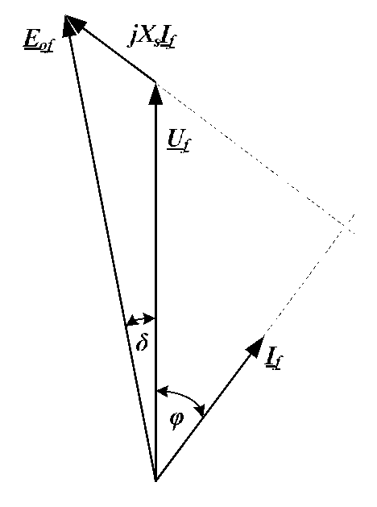
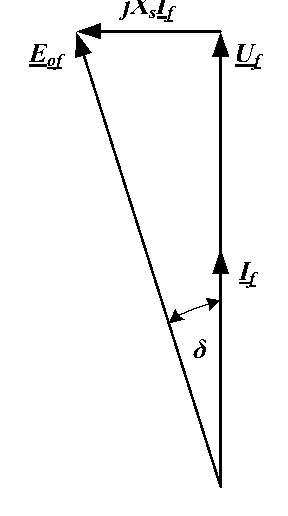

# Zadatak 3 — Struja pobude turbogeneratora pri istoj aktivnoj snazi i $\cos\varphi = 1$

## Postavka

Trofazni sinhroni generator sa cilindričnim rotorom (turbogenerator) ima nazivne podatke:
$S_{\mathrm{n}} = 25\ \mathrm{MVA}$, $U_{\mathrm{n}} = 20\ \mathrm{kV}$, $f = 50\ \mathrm{Hz}$, sprega statorskih namotaja Y (zvezda).
Otpor statorskog namotaja se može zanemariti. Generator radi na krutoj mreži nazivnog napona i
učestanosti. Karakteristika praznog hoda (fazna elektromotorna sila u funkciji struje pobude)
snimljena je pri nazivnoj brzini i data je sledećom tabelom:

| $I_P\ [\mathrm{A}]$ | 20 | 50 | 80 | 100 | 120 | 140 | 160 | 180 | 200 |
|---|---|---|---|---|---|---|---|---|---|
| $E_{0f}\ [\mathrm{kV}]$ | 1,73 | 8,53 | 16,90 | 18,48 | 20,13 | 21,46 | 22,53 | 23,33 | 24 |

Kada je struja pobude $100\ \mathrm{A}$, generator u mrežu isporučuje nominalnu struju uz induktivni
faktor snage $\cos\varphi = 0{,}8$. **Kolika treba da bude struja pobude da bi generator u mrežu
isporučivao istu aktivnu snagu uz faktor snage $\cos\varphi = 1$?**

> **Prevod na običan jezik:** Imamo veliki generator (kao u termoelektrani) vezan na mrežu koja mu
> "drži" napon i učestanost konstantnim. Za taj generator imamo izmerenu tabelu koja kaže: "ako u
> rotor pustiš toliku jednosmernu struju (struju pobude), generator će u praznom hodu proizvesti
> toliki napon". Trenutno generator radi sa strujom pobude od $100\ \mathrm{A}$ i daje punu (nazivnu)
> struju u mrežu, ali sa faktorom snage $0{,}8$ — dakle pored aktivne snage šalje u mrežu i
> reaktivnu snagu. Pitanje glasi: na koliko treba podesiti struju pobude da generator daje **istu
> aktivnu snagu**, ali "čisto" — bez reaktivne snage ($\cos\varphi = 1$)? Da bismo to izračunali,
> prvo iz poznatog (prvog) režima moramo odrediti sinhronu reaktansu mašine $X_S$ — jedini
> parametar modela koji nam nedostaje.

## Podaci

| Veličina | Oznaka | Vrednost | Šta ta veličina fizički znači |
|---|---|---|---|
| Nazivna prividna snaga | $S_{\mathrm{n}}$ | $25\ \mathrm{MVA}$ | Najveća "ukupna" snaga (kombinacija aktivne i reaktivne) koju mašina sme trajno da daje; određuje je dozvoljeno zagrevanje namotaja. |
| Nazivni napon (linijski) | $U_{\mathrm{n}}$ | $20\ \mathrm{kV}$ | Napon **između dva fazna provodnika** na priključcima mašine za koji je mašina projektovana. |
| Nazivna učestanost | $f$ | $50\ \mathrm{Hz}$ | Učestanost naizmeničnih veličina u statoru; mreža je "kruta", pa je učestanost stalno tačno $50\ \mathrm{Hz}$. |
| Sprega statora | Y | zvezda | Način vezivanja tri fazna namotaja: svi imaju zajedničku tačku (zvezdište), pa je fazni napon $\sqrt{3}$ puta manji od linijskog. |
| Otpor statora | $R_s$ | $\approx 0$ | Omska otpornost statorskog namotaja; kod velikih mašina je toliko mala da se pad napona na njoj zanemaruje. |
| Karakteristika praznog hoda | $E_{0f}(I_P)$ | tabela gore | Izmerena veza: kolika **fazna** elektromotorna sila se indukuje u statoru pri datoj struji pobude, kada je mašina bez opterećenja. |
| Struja pobude u prvom režimu | $I_{P1}$ | $100\ \mathrm{A}$ | Jednosmerna struja kroz namotaj rotora u poznatom (prvom) režimu rada. |
| Struja statora u prvom režimu | $I_{\mathrm{nf}}$ | nominalna (izračunaćemo: $721{,}69\ \mathrm{A}$) | Generator u prvom režimu daje baš punu, nazivnu struju. |
| Faktor snage u prvom režimu | $\cos\varphi_{\mathrm{n}}$ | $0{,}8$ induktivno | Odnos aktivne i prividne snage; "induktivno" znači da struja **kasni** za naponom — generator daje reaktivnu snagu mreži. |
| Faktor snage u drugom režimu | $\cos\varphi$ | $1$ | U drugom režimu struja je u fazi sa naponom — generator daje samo aktivnu snagu. |
| Aktivna snaga u drugom režimu | $P$ | ista kao u prvom ($=20\ \mathrm{MW}$, izračunaćemo) | Uslov zadatka: aktivna snaga se ne menja. |

**Traži se:** struja pobude $I_P$ u drugom režimu.

## Šta se traži i zašto

**Struja pobude $I_P$ u drugom režimu.** Struja pobude je jednosmerna struja koja se propušta kroz
namotaj na rotoru sinhrone mašine. Ona stvara magnetno polje rotora, a od jačine tog polja zavisi
elektromotorna sila (EMS) koju mašina indukuje — dakle, struja pobude je "dugme" kojim operater
elektrane podešava koliko će reaktivne snage generator razmenjivati sa mrežom i koliki će mu biti
faktor snage. Inženjera ovo direktno zanima jer se u praksi stalno dešava upravo scenario iz
zadatka: dispečer traži da generator promeni faktor snage, a aktivna snaga (koju diktira turbina)
ostaje ista — i neko mora da zna na koju vrednost postaviti pobudu.

**Plan rešavanja** (svaki korak ćemo detaljno obraditi):

1. Iz nazivnih podataka izračunamo fazni napon $U_{\mathrm{nf}}$ i nazivnu struju $I_{\mathrm{nf}}$, pa i aktivnu snagu prvog režima $P_{\mathrm{n}}$.
2. Iz tabele karakteristike praznog hoda očitamo EMS koja odgovara pobudi od $100\ \mathrm{A}$ — time potpuno poznajemo prvi režim.
3. Nacrtamo fazorski dijagram prvog režima i iz njega izvučemo dve skalarne jednačine; iz njih izračunamo ugao opterećenja $\delta_{\mathrm{n}}$ i **sinhronu reaktansu $X_S$** — parametar mašine koji nam treba za dalje.
4. Za drugi režim iz uslova "ista aktivna snaga, $\cos\varphi = 1$" izračunamo novu struju statora.
5. Iz fazorskog dijagrama drugog režima (koji je sada pravougli trougao!) izračunamo potrebnu EMS $E_{0f}$.
6. Tabelu karakteristike praznog hoda upotrebimo "unazad": nađemo koja struja pobude daje baš tu EMS — linearnim interpoliranjem između dve susedne tačke tabele.

## Potrebna teorija — mini-lekcije

### 1. Sinhroni generator i turbogenerator

Sinhroni generator je mašina u kojoj **rotor nosi jednosmerno napajan namotaj** (pobudni namotaj).
Kada pogonska mašina (turbina) obrće rotor, njegovo magnetno polje se obrće zajedno s njim i u tri
statorska namotaja indukuje tri naizmenične elektromotorne sile. Učestanost tih EMS direktno
zavisi od brzine obrtanja — otuda ime "sinhroni": mašina vezana na mrežu obrće se tačno sinhrono
sa mrežnom učestanošću. **Turbogenerator** je sinhroni generator sa **cilindričnim rotorom**
(gladak, valjkast rotor) — takvi se koriste uz parne i gasne turbine koje se brzo obrću. Za nas je
bitno: kod cilindričnog rotora vazdušni zazor je ravnomeran po obimu, pa se cela mašina može
opisati **jednom jedinom reaktansom** $X_S$ (kod mašina sa istaknutim polovima trebale bi dve).

### 2. Kruta mreža

"Kruta mreža" je idealizacija elektroenergetskog sistema: mreža toliko jaka (mnogo drugih velikih
generatora) da naš generator, šta god radio, **ne može da promeni ni napon ni učestanost** na
svojim priključcima. Za račun to znači: napon na krajevima generatora je konstantan,
$U = U_{\mathrm{n}} = 20\ \mathrm{kV}$ (linijski), u oba režima. Zato smemo isti $U_{\mathrm{f}}$
koristiti i u prvom i u drugom režimu.

### 3. Sprega Y: fazni i linijski napon; trofazna snaga

Kod sprege u zvezdu (Y) tri namotaja imaju zajedničku tačku. Napon **jednog namotaja** (fazni
napon $U_{\mathrm{f}}$) manji je od napona **između dva izvoda** (linijski napon $U$) tačno
$\sqrt{3}$ puta:

$$U_{\mathrm{f}} = \frac{U}{\sqrt{3}}$$

Faktor $\sqrt{3}$ potiče iz geometrije: linijski napon je razlika dva fazna napona pomerena za
$120^\circ$, a fazorska razlika dva jednaka fazora pod uglom $120^\circ$ ima dužinu $\sqrt{3}$ puta
veću od svakog od njih. Struja kroz namotaj je kod sprege Y ista kao linijska struja.

Prividna i aktivna snaga trofazne mašine, izražene preko **linijskih** veličina:

$$S = \sqrt{3}\, U I, \qquad P = \sqrt{3}\, U I \cos\varphi$$

gde je $\varphi$ ugao između faznog napona i struje te faze. Formula se najlakše pamti ovako:
snaga jedne faze je $U_{\mathrm{f}} I \cos\varphi$, faza ima tri, a $3 \cdot \frac{U}{\sqrt{3}} = \sqrt{3}\,U$.

### 4. Karakteristika praznog hoda (karakteristika magnećenja) i zasićenje

Karakteristika praznog hoda je izmerena kriva $E_{0f}(I_P)$: mašina se obrće nazivnom brzinom,
stator je **otvoren** (nema struje statora), pa se za razne struje pobude meri napon na krajevima —
koji je tada jednak indukovanoj EMS, jer bez struje nema padova napona. U našem zadatku data je
tabelom, i to za **fazne** vrednosti EMS.

Zašto kriva nije prava linija? Za male struje pobude gvožđe mašine je magnetno "prazno" i fluks
raste srazmerno struji. Ali gvožđe može da primi samo ograničen fluks — kada se približi granici,
kažemo da se **zasićuje**: dalji porast struje pobude donosi sve manji porast fluksa, pa i EMS.
Pogledajmo tabelu: od $20$ do $50\ \mathrm{A}$ (porast od $30\ \mathrm{A}$) EMS skoči za skoro
$7\ \mathrm{kV}$, a od $180$ do $200\ \mathrm{A}$ (porast od $20\ \mathrm{A}$) samo za
$0{,}67\ \mathrm{kV}$. **Posledica po nas:** ne smemo pretpostaviti proporcionalnost
$E_{0f} \sim I_P$ preko cele krive — moramo koristiti tabelu, a između tabelarnih tačaka
linearnu interpolaciju (mini-lekcija 8).

Karakteristika važi u oba smera: ako znamo $I_P$, iz nje čitamo $E_{0f}$; ako znamo koliku EMS
želimo, iz nje čitamo potrebnu $I_P$. U zadatku ćemo je upotrebiti u oba smera.

### 5. Model sa sinhronom reaktansom

Kada generator radi opterećen, kroz statorske namotaje teče struja. Ta struja pravi sopstveno
obrtno magnetno polje (tzv. *reakcija indukta*) koje se sabira sa poljem rotora i menja ukupan
fluks, a deo fluksa statorske struje se i "rasipa" ne obuhvatajući rotor. Sva ta dejstva se, za
mašinu sa cilindričnim rotorom, mogu spakovati u jedan jedini element: **sinhronu reaktansu**
$X_S$. Model po fazi tada glasi:

$$\underline{E}_{0f} = \underline{U}_{\mathrm{f}} + jX_S\,\underline{I}$$

Rečima: indukovana EMS praznog hoda $\underline{E}_{0f}$ (ona koju bi rotor sam indukovao, čitamo
je sa karakteristike praznog hoda) jednaka je fazorskom zbiru napona mreže $\underline{U}_{\mathrm{f}}$
i pada napona $jX_S\,\underline{I}$ na sinhronoj reaktansi. Podvlaka ispod simbola označava
**fazor** — kompleksan broj koji nosi i amplitudu i fazni stav naizmenične veličine. Množenje sa
$j$ (imaginarna jedinica) znači geometrijski: fazor pada napona $jX_S\,\underline{I}$ je **zakrenut
za $90^\circ$ unapred u odnosu na struju** $\underline{I}$.

Otpor statora $R_s$ bi u model ušao kao dodatni pad $R_s\underline{I}$, ali je po uslovu zadatka
zanemaren — kod mašina ove veličine $R_s$ je zaista stotinama puta manji od $X_S$.

**Važna prećutna pretpostavka zadatka:** $X_S$ je **parametar mašine** i smatramo ga istim u oba
režima. Strogo gledano, $X_S$ malo zavisi od zasićenja gvožđa (koje se od režima do režima menja),
ali je standardna inženjerska praksa — koju i original sledi — da se $X_S$ odredi iz jednog
poznatog režima i koristi kao konstanta.

### 6. Fazorski dijagram i ugao opterećenja $\delta$; nadpobuđenost

Fazorski dijagram je crtež jednačine $\underline{E}_{0f} = \underline{U}_{\mathrm{f}} + jX_S\,\underline{I}$:
svaki fazor je strelica, a sabiranje fazora je nadovezivanje strelica. Standardno se crta ovako:

- $\underline{U}_{\mathrm{f}}$ nacrtamo uspravno (on je naša referenca);
- struju $\underline{I}$ nacrtamo pod uglom $\varphi$ **iza** napona (jer je opterećenje induktivno — struja kasni);
- na vrh $\underline{U}_{\mathrm{f}}$ nadovežemo $jX_S\,\underline{I}$ — strelicu upravnu na $\underline{I}$ (zakrenutu $90^\circ$ unapred od struje);
- strelica od početka do kraja tog lanca je $\underline{E}_{0f}$.

Ugao između $\underline{E}_{0f}$ i $\underline{U}_{\mathrm{f}}$ zove se **ugao opterećenja**
$\delta$ (delta). On je "električna slika" mehaničkog stanja: što turbina jače gura rotor, rotor
(pa i njegova EMS) više prednjači naponu mreže i $\delta$ je veći; aktivna snaga koju generator
predaje raste sa $\delta$. Ugao između $\underline{E}_{0f}$ i struje $\underline{I}$ je, kako se sa
dijagrama vidi, zbir $\varphi + \delta$.

Kaže se da je generator **nadpobuđen** kada je pobuda tolika da je $E_{0f}$ "velika" — tada
generator **daje** mreži reaktivnu snagu, a struja je induktivna (kasni za naponom). Upravo to je
naš prvi režim. Kada se pobuda smanji, mašina daje sve manje reaktivne snage; pri nekoj tački daje
samo aktivnu ($\cos\varphi = 1$ — naš drugi režim).

### 7. Kako se fazorska jednačina pretvara u dve obične (skalarne) jednačine

Fazorska jednačina je jednakost strelica u ravni, a jedna jednakost u ravni vredi kao **dve**
obične brojevne jednačine: projekcije leve i desne strane na dva međusobno upravna pravca moraju
biti jednake. Pametan izbor pravaca uprošćava račun. Ovde je najzgodnije projektovati na:

- **pravac struje $\underline{I}$** — jer je pad $jX_S\underline{I}$ upravan na struju, pa mu je projekcija na taj pravac **nula**;
- **pravac upravan na struju** — na koji ceo pad $X_S I$ pada punom dužinom.

Uglovi koji nam trebaju: $\underline{U}_{\mathrm{f}}$ zaklapa sa strujom ugao $\varphi$, a
$\underline{E}_{0f}$ zaklapa sa strujom ugao $\varphi + \delta$ (mini-lekcija 6). Projekcija fazora
dužine $A$ na pravac sa kojim zaklapa ugao $\alpha$ iznosi $A\cos\alpha$; projekcija na upravni
pravac je $A\sin\alpha$. Time fazorska jednačina daje:

$$\begin{aligned}
\text{(na pravac struje):}\quad & E_{0f}\cos(\varphi + \delta) = U_{\mathrm{f}}\cos\varphi \\
\text{(upravno na struju):}\quad & E_{0f}\sin(\varphi + \delta) = U_{\mathrm{f}}\sin\varphi + X_S I
\end{aligned}$$

Prva jednačina ima i lep fizički smisao: pomnožimo li je sa $3I$, leva strana je trofazna aktivna
snaga izražena preko EMS, a desna preko napona mreže — pad na (čistoj) reaktansi ne troši aktivnu
snagu, pa ona "prolazi" netaknuta.

**Specijalan slučaj $\cos\varphi = 1$:** tada je struja u fazi sa naponom ($\varphi = 0$), pa je
pad $jX_S\underline{I}$ upravan na **napon**. Trougao koji čine $\underline{U}_{\mathrm{f}}$,
$jX_S\underline{I}$ i $\underline{E}_{0f}$ postaje **pravougli**, i važi Pitagorina teorema:

$$E_{0f} = \sqrt{U_{\mathrm{f}}^2 + (X_S I)^2}$$

### 8. Linearna interpolacija

Kada tabela daje vrednosti funkcije samo u pojedinim tačkama, a nama treba vrednost između njih,
najjednostavnije je pretpostaviti da je funkcija **između dve susedne tačke prava linija**. Ako
kriva prolazi kroz tačke $(x_1, y_1)$ i $(x_2, y_2)$, jednačina te prave (prava kroz tačku
$(x_1,y_1)$ sa nagibom $\frac{y_2-y_1}{x_2-x_1}$) glasi:

$$y - y_1 = \frac{y_2 - y_1}{x_2 - x_1}\,(x - x_1)$$

Iz nje, kad znamo $y$, lako izrazimo $x$. Greška ove aproksimacije je mala kad su tabelarne tačke
guste i kriva između njih ne "krivuda" mnogo — što za našu karakteristiku magnećenja u potrebnom
opsegu važi.

## Rešenje, korak po korak

### Korak 1: Nazivni fazni napon i nazivna struja

**Zašto ovaj korak:** Ceo model sinhrone mašine (mini-lekcija 5) piše se **po fazi**, a i tabela
karakteristike praznog hoda daje **fazne** EMS — dakle, sve moramo svesti na fazne veličine. Uz to,
u prvom režimu generator daje "nominalnu struju", pa moramo izračunati kolika je ona.

Fazni napon kod sprege Y (mini-lekcija 3):

$$U_{\mathrm{nf}} = \frac{U_{\mathrm{n}}}{\sqrt{3}}$$

- $U_{\mathrm{nf}}$ — nazivni **fazni** napon (napon jednog namotaja),
- $U_{\mathrm{n}}$ — nazivni **linijski** napon ($20\ \mathrm{kV}$; nazivni napon se uvek podrazumeva linijski).

$$U_{\mathrm{nf}} = \frac{20 \times 10^3}{\sqrt{3}} = \frac{20 \times 10^3}{1{,}732} = 11{,}55\ \mathrm{kV}$$

Nazivna struja sledi iz definicije prividne snage $S_{\mathrm{n}} = \sqrt{3}\,U_{\mathrm{n}} I_{\mathrm{nf}}$
(mini-lekcija 3); rešimo je po struji:

$$I_{\mathrm{nf}} = \frac{S_{\mathrm{n}}}{\sqrt{3}\, U_{\mathrm{n}}} = \frac{25 \times 10^6}{\sqrt{3} \times 20 \times 10^3} = \frac{25 \times 10^6}{34\,641} = 721{,}69\ \mathrm{A}$$

- $I_{\mathrm{nf}}$ — nazivna struja statora (kod sprege Y struja namotaja = linijska struja),
- $S_{\mathrm{n}}$ — nazivna prividna snaga ($25\ \mathrm{MVA}$).

**Šta smo dobili:** Fazni napon od $11{,}55\ \mathrm{kV}$ i punu struju od oko $722\ \mathrm{A}$ —
realne vrednosti za mašinu od $25\ \mathrm{MVA}$. Ovo su "koordinate" prvog režima na koje ćemo
sve vreme da se oslanjamo.

### Korak 2: Aktivna snaga u prvom (nominalnom) režimu

**Zašto ovaj korak:** Uslov zadatka je da u drugom režimu aktivna snaga ostane **ista** — pa prvo
moramo znati kolika je ona u prvom režimu.

Aktivna snaga je deo prividne snage određen faktorom snage:

$$P_{\mathrm{n}} = S_{\mathrm{n}} \cos\varphi_{\mathrm{n}}$$

- $P_{\mathrm{n}}$ — aktivna snaga u nominalnom režimu,
- $\cos\varphi_{\mathrm{n}} = 0{,}8$ — faktor snage u prvom režimu.

$$P_{\mathrm{n}} = 25 \times 10^6 \times 0{,}8 = 20\ \mathrm{MW}$$

**Šta smo dobili:** Generator u oba režima isporučuje $20\ \mathrm{MW}$; u prvom režimu pored toga
daje i reaktivnu snagu (jer je $\cos\varphi < 1$), u drugom neće.

### Korak 3: Očitavanje EMS prvog režima iz tabele

**Zašto ovaj korak:** Da bismo iz prvog režima "izvukli" sinhronu reaktansu, u modelu
$\underline{E}_{0f} = \underline{U}_{\mathrm{f}} + jX_S\underline{I}$ moramo znati sve osim $X_S$.
Napon i struju znamo (Korak 1); EMS nam daje karakteristika praznog hoda, jer znamo struju pobude.

U prvom režimu je $I_{P1} = 100\ \mathrm{A}$. Tabela za $I_P = 100\ \mathrm{A}$ direktno (bez
interpolacije — vrednost postoji u tabeli) daje faznu EMS praznog hoda:

$$E_{0\mathrm{nf}} = 18{,}48\ \mathrm{kV}$$

- $E_{0\mathrm{nf}}$ — fazna indukovana EMS praznog hoda u nominalnom (prvom) režimu.

**Šta smo dobili:** $E_{0\mathrm{nf}} = 18{,}48\ \mathrm{kV}$ je znatno veće od napona mreže
$U_{\mathrm{nf}} = 11{,}55\ \mathrm{kV}$ — mašina je **nadpobuđena** (mini-lekcija 6), što se slaže
sa podatkom da daje induktivnu struju (reaktivnu snagu u mrežu).

### Korak 4: Fazorski dijagram prvog režima i skalarne jednačine

**Zašto ovaj korak:** Model je fazorska (vektorska) jednačina; da bismo iz nje računali brojeve,
pretvaramo je u dve skalarne jednačine projektovanjem (mini-lekcija 7). Dijagram nam pokazuje
uglove i čuva nas od grešaka u znaku.

Sledeća slika prikazuje fazorski dijagram prvog režima. Čitaj je ovako: uspravna strelica je napon
mreže $\underline{U}_{\mathrm{f}}$; struja $\underline{I}_{\mathrm{f}}$ je zakrenuta za ugao
$\varphi$ **iza** napona (udesno-nadole, jer je induktivna); na vrh napona nadovezan je pad
$jX_S\underline{I}_{\mathrm{f}}$, upravan na pravac struje (isprekidana linija pomaže oku da vidi
tu upravnost); dijagonala od početka do vrha tog pada je EMS $\underline{E}_{0f}$, koja prednjači
naponu za ugao opterećenja $\delta$.

**Slika 3.1 —** Fazorski dijagram turbogeneratora za prvi režim rada (nadpobuđen generator, induktivna struja).

Sa dijagrama: ugao između $\underline{U}_{\mathrm{f}}$ i $\underline{I}_{\mathrm{f}}$ je
$\varphi_{\mathrm{n}}$, a ugao između $\underline{E}_{0f}$ i $\underline{I}_{\mathrm{f}}$ je
$\varphi_{\mathrm{n}} + \delta_{\mathrm{n}}$. Projektujemo fazorsku jednačinu
$\underline{E}_{0f} = \underline{U}_{\mathrm{f}} + jX_S\underline{I}$ na pravac struje (gde pad
napona ne učestvuje, jer je na njega upravan) i na pravac upravan na struju (gde pad učestvuje
celom dužinom $X_S I_{\mathrm{nf}}$):

$$\begin{aligned}
E_{0\mathrm{nf}} \cos(\varphi_{\mathrm{n}} + \delta_{\mathrm{n}}) &= U_{\mathrm{nf}} \cos\varphi_{\mathrm{n}} \qquad &(1) \\
E_{0\mathrm{nf}} \sin(\varphi_{\mathrm{n}} + \delta_{\mathrm{n}}) &= U_{\mathrm{nf}} \sin\varphi_{\mathrm{n}} + X_S I_{\mathrm{nf}} \qquad &(2)
\end{aligned}$$

- $\delta_{\mathrm{n}}$ — ugao opterećenja u nominalnom režimu (ugao između EMS i napona),
- $X_S$ — sinhrona reaktansa (nepoznata koju tražimo iz ovog sistema).

**Šta smo dobili:** Dve jednačine sa dve nepoznate ($\delta_{\mathrm{n}}$ i $X_S$) — sistem je
rešiv. Zgodno je što jednačina (1) sadrži samo $\delta_{\mathrm{n}}$, pa sistem rešavamo redom, a
ne simultano.

### Korak 5: Ugao opterećenja $\delta_{\mathrm{n}}$ iz jednačine (1)

**Zašto ovaj korak:** Jednačina (2), iz koje ćemo izvući $X_S$, sadrži
$\sin(\varphi_{\mathrm{n}}+\delta_{\mathrm{n}})$ — dakle prvo moramo naći
$\delta_{\mathrm{n}}$, a njega nam daje jednačina (1) u kojoj je jedina nepoznata.

Podelimo obe strane jednačine (1) sa $E_{0\mathrm{nf}}$:

$$\cos(\varphi_{\mathrm{n}} + \delta_{\mathrm{n}}) = \frac{U_{\mathrm{nf}} \cos\varphi_{\mathrm{n}}}{E_{0\mathrm{nf}}} = \frac{11{,}55 \times 10^3 \times 0{,}8}{18{,}48 \times 10^3} = \frac{9240}{18\,480} = 0{,}5$$

Ugao čiji je kosinus $0{,}5$ je $60^\circ$, dakle:

$$\varphi_{\mathrm{n}} + \delta_{\mathrm{n}} = \arccos(0{,}5) = 60^\circ$$

Sam ugao $\varphi_{\mathrm{n}}$ znamo iz faktora snage: $\cos\varphi_{\mathrm{n}} = 0{,}8$, pa je

$$\varphi_{\mathrm{n}} = \arccos(0{,}8) = 36{,}87^\circ$$

Oduzimanjem dobijamo ugao opterećenja:

$$\delta_{\mathrm{n}} = \arccos(0{,}5) - \arccos(0{,}8) = 60^\circ - 36{,}87^\circ = 23{,}13^\circ$$

**Šta smo dobili:** Ugao opterećenja od oko $23^\circ$ — tipična, "zdrava" vrednost za opterećen
sinhroni generator (granica stabilnosti je tek na $90^\circ$; radne mašine se drže znatno ispod).

> Usput zapamti korisnu trigonometrijsku činjenicu: ako je $\cos\varphi = 0{,}8$, onda je
> $\sin\varphi = \sqrt{1 - 0{,}8^2} = \sqrt{1-0{,}64} = \sqrt{0{,}36} = 0{,}6$. Trebaće nam odmah u sledećem koraku.

### Korak 6: Sinhrona reaktansa $X_S$ iz jednačine (2)

**Zašto ovaj korak:** $X_S$ je jedini parametar mašine u modelu; bez njega ne možemo izračunati EMS
drugog režima. Sada su u jednačini (2) svi ostali brojevi poznati.

Rešimo jednačinu (2) po $X_S$. Prebacimo $U_{\mathrm{nf}}\sin\varphi_{\mathrm{n}}$ na levu stranu:

$$X_S I_{\mathrm{nf}} = E_{0\mathrm{nf}} \sin(\varphi_{\mathrm{n}} + \delta_{\mathrm{n}}) - U_{\mathrm{nf}} \sin\varphi_{\mathrm{n}}$$

pa podelimo sa $I_{\mathrm{nf}}$:

$$X_S = \frac{E_{0\mathrm{nf}} \sin(\varphi_{\mathrm{n}} + \delta_{\mathrm{n}}) - U_{\mathrm{nf}} \sin\varphi_{\mathrm{n}}}{I_{\mathrm{nf}}}$$

Uvrstimo brojeve; pritom je $\varphi_{\mathrm{n}} + \delta_{\mathrm{n}} = 36{,}87^\circ + 23{,}13^\circ = 60^\circ$,
$\sin 60^\circ = 0{,}866$ i $\sin 36{,}87^\circ = 0{,}6$:

$$X_S = \frac{18{,}48 \times 10^3 \times \sin(36{,}87^\circ + 23{,}13^\circ) - 11{,}55 \times 10^3 \times \sin(36{,}87^\circ)}{721{,}69}$$

Izračunajmo brojilac deo po deo:

$$18{,}48 \times 10^3 \times 0{,}866 = 16\,004\ \mathrm{V}, \qquad 11{,}55 \times 10^3 \times 0{,}6 = 6930\ \mathrm{V}$$

$$X_S = \frac{16\,004 - 6930}{721{,}69} = \frac{9074}{721{,}69} = 12{,}57\ \Omega$$

**Šta smo dobili:** Sinhronu reaktansu $X_S = 12{,}57\ \Omega$. Da proverimo red veličine: bazna
impedansa mašine je $U_{\mathrm{n}}^2/S_{\mathrm{n}} = (20\times 10^3)^2 / (25\times 10^6) = 16\ \Omega$,
pa je $X_S \approx 0{,}79$ relativnih jedinica — sasvim uobičajen red veličine za sinhronu
reaktansu turbogeneratora. Parametar mašine je sada poznat i važi (po pretpostavci iz mini-lekcije 5)
i u drugom režimu.

### Korak 7: Struja statora u drugom režimu

**Zašto ovaj korak:** U drugom režimu znamo aktivnu snagu ($P = P_{\mathrm{n}} = 20\ \mathrm{MW}$),
napon (kruta mreža!) i faktor snage ($\cos\varphi = 1$) — iz toga je struja jednoznačno određena, a
treba nam za pad napona $X_S I$.

Iz izraza za trofaznu aktivnu snagu $P = \sqrt{3}\,U_{\mathrm{n}} I \cos\varphi$ (mini-lekcija 3)
rešimo po struji:

$$I = \frac{P}{\sqrt{3}\, U_{\mathrm{n}} \cos\varphi} = \frac{20 \times 10^6}{\sqrt{3} \times 20 \times 10^3 \times 1} = \frac{20 \times 10^6}{34\,641} = 577{,}35\ \mathrm{A}$$

- $I$ — struja statora u drugom režimu.

**Šta smo dobili:** Struja je manja od nazivne ($577{,}35 < 721{,}69\ \mathrm{A}$) — logično: ista
aktivna snaga se sada prenosi bez reaktivne komponente struje, pa je ukupna struja manja. Štaviše,
tačno važi $I = I_{\mathrm{nf}} \cos\varphi_{\mathrm{n}} = 721{,}69 \times 0{,}8 = 577{,}35\ \mathrm{A}$:
u drugom režimu je ostala samo aktivna komponenta struje iz prvog režima.

### Korak 8: EMS u drugom režimu (Pitagora na fazorskom dijagramu)

**Zašto ovaj korak:** Tražena struja pobude čita se sa karakteristike praznog hoda — ali za to
prvo moramo znati koliku EMS mašina treba da indukuje u drugom režimu.

Sledeća slika prikazuje fazorski dijagram drugog režima. Čitaj je ovako: struja
$\underline{I}_{\mathrm{f}}$ je sada **u fazi** sa naponom $\underline{U}_{\mathrm{f}}$ (obe
strelice uspravne, jedna preko druge) jer je $\cos\varphi = 1$; pad $jX_S\underline{I}_{\mathrm{f}}$
je upravan na struju, dakle sada i na napon — vodoravna strelica na vrhu napona; EMS
$\underline{E}_{0f}$ je hipotenuza pravouglog trougla i prednjači naponu za ugao $\delta$.

**Slika 3.2 —** Fazorski dijagram turbogeneratora za drugi režim rada ($\cos\varphi = 1$).

Pošto su kateta $U_{\mathrm{f}}$ i kateta $X_S I$ pod pravim uglom, EMS (hipotenuza) sledi iz
Pitagorine teoreme (mini-lekcija 7, specijalan slučaj):

$$E_{0f} = \sqrt{U_{\mathrm{f}}^2 + (X_S I)^2}$$

Izračunajmo prvo pad napona na sinhronoj reaktansi:

$$X_S I = 12{,}57 \times 577{,}35 = 7257{,}3\ \mathrm{V}$$

Zatim kvadrate obe katete:

$$U_{\mathrm{f}}^2 = (11{,}55 \times 10^3)^2 = 133{,}40 \times 10^6\ \mathrm{V}^2, \qquad (X_S I)^2 = 7257{,}3^2 = 52{,}67 \times 10^6\ \mathrm{V}^2$$

I na kraju koren zbira:

$$E_{0f} = \sqrt{(11{,}55 \times 10^3)^2 + (12{,}57 \times 577{,}35)^2} = \sqrt{(133{,}40 + 52{,}67) \times 10^6} = \sqrt{186{,}07 \times 10^6} = 13\,640{,}8\ \mathrm{V}$$

**Šta smo dobili:** Potrebna fazna EMS drugog režima je $E_{0f} = 13{,}64\ \mathrm{kV}$ — znatno
manja od EMS prvog režima ($18{,}48\ \mathrm{kV}$). To je i očekivano: mašina više ne mora da
"gura" reaktivnu snagu u mrežu, pa joj treba slabija pobuda.

### Korak 9: Struja pobude iz tabele — linearna interpolacija

**Zašto ovaj korak:** Sada karakteristiku praznog hoda koristimo "unazad": znamo željenu EMS,
tražimo struju pobude. Vrednost $13\,640{,}8\ \mathrm{V}$ ne postoji u tabeli, pa moramo
interpolirati između dve susedne tabelarne tačke.

Pogledajmo tabelu: $E_{0f} = 13{,}64\ \mathrm{kV}$ leži između $8{,}53\ \mathrm{kV}$ (pri
$I_P = 50\ \mathrm{A}$) i $16{,}90\ \mathrm{kV}$ (pri $I_P = 80\ \mathrm{A}$). Tražena struja
pobude je, dakle, u opsegu $50\ \mathrm{A} < I_P < 80\ \mathrm{A}$. Između tih tačaka kriva se
zamenjuje pravom (mini-lekcija 8), sa $x \to I_P$ i $y \to E_{0f}$:

$$E_{0f} - 8{,}53 \times 10^3 = \frac{16{,}9 \times 10^3 - 8{,}53 \times 10^3}{80 - 50} \times (I_P - 50)$$

Nagib prave (koliko volti EMS donosi svaki amper pobude u ovom opsegu):

$$\frac{16{,}9 \times 10^3 - 8{,}53 \times 10^3}{80 - 50} = \frac{8370}{30} = 279\ \mathrm{V/A}$$

Rešimo jednačinu po $I_P$ — prvo podelimo obe strane nagibom:

$$I_P - 50 = \frac{E_{0f} - 8{,}53 \times 10^3}{279} = \frac{13\,640{,}8 - 8530}{279} = \frac{5110{,}8}{279} = 18{,}32\ \mathrm{A}$$

pa prebacimo $50$ na desnu stranu:

$$I_P = 50 + 18{,}32 = 68{,}32\ \mathrm{A}$$

**Šta smo dobili:** Konačan odgovor zadatka — struju pobude treba smanjiti sa $100\ \mathrm{A}$ na

$$\boxed{I_P = 68{,}32\ \mathrm{A}}$$

Rezultat je unutar pretpostavljenog opsega ($50$–$80\ \mathrm{A}$), pa je interpolacija bila
opravdana i dosledna.

## Česte greške i zamke

1. **Mešanje linijskih i faznih vrednosti.** Nazivni napon $20\ \mathrm{kV}$ je **linijski**, a
   tabela karakteristike praznog hoda daje **fazne** EMS. Ako se u jednačinama pomeša linijski
   napon sa faznom EMS (ili obrnuto), svi rezultati "otplivaju" za faktor $\sqrt{3}$. Pravilo:
   model mašine se piše po fazi — sve u njemu mora biti fazno.
2. **Pretpostavka da je $E_{0f}$ proporcionalno $I_P$.** Neko bi u Koraku 9 "prečicom" računao
   $I_P = 100 \times \frac{13{,}64}{18{,}48} = 73{,}8\ \mathrm{A}$ — pogrešno! Karakteristika
   magnećenja je zbog zasićenja gvožđa **nelinearna** (uporedi: dupliranje pobude sa $100$ na
   $200\ \mathrm{A}$ podigne EMS sa $18{,}48$ samo na $24\ \mathrm{kV}$, ni izbliza duplo).
   Proporcionalnost sme da se koristi samo lokalno, između dve susedne tačke tabele — to je upravo
   linearna interpolacija.
3. **Primena Pitagorine teoreme u prvom režimu.** Formula $E_{0f} = \sqrt{U_{\mathrm{f}}^2 + (X_S I)^2}$
   važi **samo** kada je $\cos\varphi = 1$ (tada je pad $jX_S\underline{I}$ upravan na napon). U
   prvom režimu ($\cos\varphi = 0{,}8$) trougao nije pravougli — zato su tamo bile potrebne
   projekcione jednačine (1) i (2) sa uglovima $\varphi_{\mathrm{n}}$ i $\varphi_{\mathrm{n}}+\delta_{\mathrm{n}}$.
4. **Brkanje uglova.** Ugao između EMS i struje je $\varphi + \delta$, a ne $\varphi$ niti $\delta$
   sam. Najsigurnija odbrana od ove greške je da se dijagram zaista nacrta (Slika 3.1) i uglovi
   pročitaju sa njega, a ne "napamet".
5. **Kalkulator u pogrešnom modu.** Uglovi u ovom zadatku su u stepenima; ako kalkulator računa
   $\sin$ i $\arccos$ u radijanima, rezultati će biti besmisleni. Provera: $\arccos(0{,}5)$ mora
   dati $60$ (stepeni), a ne $1{,}047$ (radijana).
6. **Korišćenje stare struje u drugom režimu.** U drugom režimu struja **nije** nazivna — pri
   $\cos\varphi = 1$ ista aktivna snaga se prenosi manjom strujom ($577{,}35\ \mathrm{A}$).
   Uvrštavanje $721{,}69\ \mathrm{A}$ u Korak 8 dalo bi pogrešno veliku EMS.

## Rezime rezultata

| Veličina | Oznaka | Vrednost |
|---|---|---|
| Nazivni fazni napon | $U_{\mathrm{nf}}$ | $11{,}55\ \mathrm{kV}$ |
| Nazivna struja | $I_{\mathrm{nf}}$ | $721{,}69\ \mathrm{A}$ |
| Aktivna snaga (oba režima) | $P_{\mathrm{n}}$ | $20\ \mathrm{MW}$ |
| Fazna EMS u prvom režimu (iz tabele, $I_P=100\ \mathrm{A}$) | $E_{0\mathrm{nf}}$ | $18{,}48\ \mathrm{kV}$ |
| Ugao opterećenja u prvom režimu | $\delta_{\mathrm{n}}$ | $23{,}13^\circ$ |
| Sinhrona reaktansa | $X_S$ | $12{,}57\ \Omega$ |
| Struja statora u drugom režimu | $I$ | $577{,}35\ \mathrm{A}$ |
| Fazna EMS u drugom režimu | $E_{0f}$ | $13\,640{,}8\ \mathrm{V} \approx 13{,}64\ \mathrm{kV}$ |
| **Tražena struja pobude u drugom režimu** | $I_P$ | $\mathbf{68{,}32\ A}$ |

## Provera smisla

1. **Dimenziona provera $X_S$:** u Koraku 6 delili smo napon (volt) strujom (amper):
   $\mathrm{V}/\mathrm{A} = \Omega$ — ispravna jedinica za reaktansu. U relativnim jedinicama
   $X_S = 12{,}57/16 = 0{,}79$ (bazna impedansa $U_{\mathrm{n}}^2/S_{\mathrm{n}} = 16\ \Omega$) —
   uobičajen red veličine za turbogenerator.
2. **Smer promene pobude ima fizičkog smisla:** u prvom režimu generator je nadpobuđen i daje
   mreži reaktivnu snagu $Q_{\mathrm{n}} = S_{\mathrm{n}}\sin\varphi_{\mathrm{n}} = 25 \times 0{,}6 = 15\ \mathrm{Mvar}$.
   Prelazak na $\cos\varphi = 1$ znači: prestani da daješ reaktivnu snagu — a to se kod sinhronog
   generatora postiže **smanjenjem** pobude. Dobili smo baš to: $I_P$ pada sa $100$ na
   $68{,}32\ \mathrm{A}$, i prateće $E_{0f}$ pada sa $18{,}48$ na $13{,}64\ \mathrm{kV}$. Da smo
   dobili porast pobude — znali bismo da je negde greška.
3. **Kontrola struje:** $I = 577{,}35\ \mathrm{A}$ je tačno $I_{\mathrm{nf}}\cos\varphi_{\mathrm{n}} = 721{,}69 \times 0{,}8$
   — aktivna komponenta struje se nije promenila (ista snaga, isti napon), samo je reaktivna
   komponenta "otpala". Nezavisna potvrda Koraka 7.
4. **Granični slučaj:** i pri $\cos\varphi = 1$ mora biti $E_{0f} > U_{\mathrm{f}}$, jer hipotenuza
   ($13{,}64\ \mathrm{kV}$) mora biti duža od katete ($11{,}55\ \mathrm{kV}$) — što jeste. EMS bi
   bila jednaka naponu samo u praznom hodu ($I = 0$), a manja od njega tek kod potpobuđene mašine
   koja reaktivnu snagu **uzima** iz mreže.
