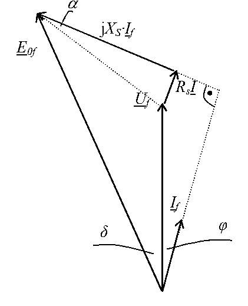

# Zadatak 4 — Da li povećanje aktivne snage uz nepromenjenu pobudu preopterećuje generator?

## Postavka

Sinhroni generator nazivnih podataka $6{,}5\ \mathrm{kVA}$; $400\ \mathrm{V}$; $50\ \mathrm{Hz}$; $3000\ \mathrm{o/min}$; sprega zvezda (Y); $\cos\varphi = 0{,}8$; otpornost statorskog namotaja $R_s = 1{,}5\ \Omega$; sinhrona reaktansa $X_s = 20\ \Omega$ — priključen je na javnu (krutu) mrežu linijskog napona $380\ \mathrm{V}$. Generator u početnom režimu proizvodi $4\ \mathrm{kW}$ aktivne snage i $3\ \mathrm{kvar}$ reaktivne snage. Zatim se snaga pogonske mašine poveća tako da generator predaje u mrežu $6\ \mathrm{kW}$ aktivne snage, dok se pobuda ne dira. Da li je ovom manipulacijom generator preopterećen?

> **Prevod na običan jezik:** Imamo mali generator koji vrti neka pogonska mašina (recimo motor SUS ili turbina) i koji je vezan na gradsku mrežu. U prvom, poznatom režimu znamo tačno koliko snage daje ($4\ \mathrm{kW}$ i $3\ \mathrm{kvar}$), pa iz toga možemo da izračunamo sve struje i napone u njemu. Onda rukovalac „doda gas" pogonskoj mašini — generator sada gura $6\ \mathrm{kW}$ u mrežu — ali **ne pipa dugme za pobudu** (struju kroz rotorski namotaj). Pitanje je prosto: da li kroz statorski namotaj sada teče struja veća od one za koju je mašina projektovana (nazivne struje)? Ako da — generator je preopterećen i namotaji će se pregrevati.

## Podaci

| Veličina | Oznaka | Vrednost | Šta ta veličina fizički znači |
|---|---|---|---|
| Nazivna prividna snaga | $S_{\mathrm{n}}$ | $6{,}5\ \mathrm{kVA}$ | Najveća „ukupna" snaga (kombinacija aktivne i reaktivne) za koju je mašina projektovana; određuje koliku struju namotaji smeju trajno da nose. |
| Nazivni (linijski) napon | $U_{\mathrm{n}}$ | $400\ \mathrm{V}$ | Napon između dva priključka mašine na koji su izolacija i magnetsko kolo dimenzionisani. |
| Frekvencija | $f$ | $50\ \mathrm{Hz}$ | Učestanost napona mreže; kod sinhrone mašine kruto vezana za brzinu obrtanja. |
| Nazivna brzina | $n$ | $3000\ \mathrm{o/min}$ | Brzina obrtanja rotora. Pošto je $n = 60f/p$, iz $3000 = 60\cdot 50/p$ sledi $p=1$ — mašina ima jedan par polova. |
| Sprega statora | — | Y (zvezda) | Način vezivanja tri fazna namotaja: kod zvezde je fazni napon $U_{\mathrm{f}} = U/\sqrt{3}$, a fazna struja jednaka linijskoj. |
| Nazivni faktor snage | $\cos\varphi_{\mathrm{n}}$ | $0{,}8$ | Odnos aktivne i prividne snage u nazivnom režimu; ovde služi samo kao podatak sa natpisne pločice (u zadatku se ne koristi za račun). |
| Otpornost statora (po fazi) | $R_s$ | $1{,}5\ \Omega$ | Omska otpornost jednog faznog namotaja statora; na njoj se gubi snaga i „troši" deo napona. |
| Sinhrona reaktansa (po fazi) | $X_s$ | $20\ \Omega$ | Ukupna reaktansa sinhrone mašine (rasipanje + reakcija indukta); glavni „unutrašnji otpor" sinhrone mašine za naizmeničnu struju. |
| Napon mreže (linijski) | $U_{\mathrm{mr}}$ | $380\ \mathrm{V}$ | Stvarni napon mreže na koju je generator priključen — primeti: **nije** jednak nazivnom naponu mašine ($400\ \mathrm{V}$)! |
| Aktivna snaga, stari režim | $P$ | $4\ \mathrm{kW}$ | Korisna snaga koju generator predaje mreži pre promene. |
| Reaktivna snaga, stari režim | $Q$ | $3\ \mathrm{kvar}$ | Reaktivna (jalova) snaga koju generator predaje mreži pre promene. |
| Aktivna snaga, novi režim | $P'$ | $6\ \mathrm{kW}$ | Aktivna snaga posle „dodavanja gasa" pogonskoj mašini. |

## Šta se traži i zašto

Traži se **struja statora u novom režimu**, $I_1$, i njeno poređenje sa **nazivnom strujom** $I_{\mathrm{nf}}$.

- **Šta je to:** $I_1$ je efektivna vrednost struje koja teče kroz statorski namotaj pošto je aktivna snaga povećana na $6\ \mathrm{kW}$. $I_{\mathrm{nf}}$ je struja koju namotaj sme trajno da nosi, izračunata iz podataka sa natpisne pločice.
- **Zašto to inženjera zanima:** struja veća od nazivne znači veće Džulove gubitke ($\propto I^2$), dakle pregrevanje izolacije i skraćenje životnog veka mašine. Rukovalac je promenio samo mehaničku snagu — na prvi pogled bezazleno — ali struja zavisi i od reaktivne snage, koja se pri ovoj manipulaciji **sama od sebe promeni**. Zato se preopterećenje mora proveriti računski, ne „od oka".
- **Ključna začkoljica:** u novom režimu znamo $P' = 6\ \mathrm{kW}$, ali **ne znamo** $Q'$, pa ne znamo ni $I_1$ ni $\cos\varphi$. Ono što znamo jeste da je **pobudna struja nepromenjena**, dakle i unutrašnja elektromotorna sila $E_{0f}$ je ista kao u starom režimu.

**Plan rešavanja:**
1. Iz starog režima ($4\ \mathrm{kW}$, $3\ \mathrm{kvar}$) izračunamo fazni stav $\varphi$ i struju $I_f$.
2. Iz vektorskog dijagrama (kosinusnom teoremom) izračunamo $E_{0f}$ — ona ostaje ista i posle promene.
3. U novom režimu iz $P' = 6\ \mathrm{kW}$ izračunamo samo aktivnu komponentu struje $I_1\cos\varphi$.
4. Vektorsku jednačinu generatora projektujemo na dva pravca — dobijemo dve skalarne jednačine sa dve nepoznate ($\delta$ i $I_1\sin\varphi$).
5. Eliminacijom i rešavanjem kvadratne jednačine nađemo ugao $\delta$, pa zatim $I_1\sin\varphi$ i konačno $I_1$.
6. Uporedimo $I_1$ sa nazivnom strujom $I_{\mathrm{nf}}$ i donesemo zaključak.

## Potrebna teorija — mini-lekcije

### 1. Model sinhronog generatora na krutoj mreži

Sinhroni generator se po jednoj fazi modeluje kao **izvor elektromotorne sile** $E_{0f}$ (nju indukuje obrtno polje rotorske pobude u statorskom namotaju) **na red** sa otpornošću statora $R_s$ i sinhronom reaktansom $X_s$. „Kruta mreža" znači da je napon na priključcima nametnut spolja i ne zavisi od toga šta generator radi: fazni napon je uvek $U_{\mathrm{f}} = U_{\mathrm{mr}}/\sqrt{3}$.

Drugi Kirhofov zakon za to kolo (u kompleksnom, vektorskom obliku, za generatorski smer struje — struja izlazi iz mašine):

$$\overline{E}_{0f} = \overline{U}_{\mathrm{f}} + R_s\,\overline{I} + \mathrm{j}X_s\,\overline{I}$$

Rečima: unutrašnja EMS mora da „pokrije" napon mreže **plus** padove napona na sopstvenoj otpornosti i reaktansi. Simbol $\mathrm{j}$ je imaginarna jedinica — množenje sa $\mathrm{j}$ znači zaokretanje vektora za $90°$ unapred, pa pad $\mathrm{j}X_s\overline{I}$ **prednjači** struji za $90°$, dok je pad $R_s\overline{I}$ **u fazi** sa strujom.

### 2. Sprega zvezda — fazne i linijske veličine

Kod sprege Y tri namotaja imaju spojen jedan kraj (zvezdište), a slobodni krajevi idu na mrežu. Posledice koje stalno koristimo:

$$U_{\mathrm{f}} = \frac{U}{\sqrt{3}}, \qquad I_{\mathrm{f}} = I_{\mathrm{lin}}$$

gde je $U$ linijski (međufazni) napon. Ovde: $U_{\mathrm{f}} = 380/\sqrt{3} = 219{,}39\ \mathrm{V}$. Sve jednačine kola pišemo za **jednu fazu**, dakle sa faznim naponom; snage tri faze zato nose faktor $3$ (ili $\sqrt{3}$ uz linijske veličine).

### 3. Trougao snaga: $P$, $Q$, $S$ i fazni stav $\varphi$

Trofazni potrošač/generator razmenjuje sa mrežom:
- **aktivnu snagu** $P = \sqrt{3}\,U I \cos\varphi$ — pravu, korisnu snagu (greje, vrti, svetli);
- **reaktivnu snagu** $Q = \sqrt{3}\,U I \sin\varphi$ — snagu koja se klati napred-nazad između izvora i magnetskih/električnih polja i ne vrši koristan rad, ali **puni provodnike strujom**;
- **prividnu snagu** $S = \sqrt{3}\,U I = \sqrt{P^2 + Q^2}$.

Odnos $P$, $Q$ i $S$ je pravougli trougao (katete $P$ i $Q$, hipotenuza $S$), pa je fazni stav struje prema naponu:

$$\varphi = \operatorname{arctg}\frac{Q}{P}$$

Poreklo: $Q/P = \sin\varphi/\cos\varphi = \operatorname{tg}\varphi$ — faktori $\sqrt{3}UI$ se skrate. Iz $P$ i $\cos\varphi$ struja je $I = \dfrac{P}{\sqrt{3}\,U\cos\varphi}$. Intuicija: za istu korisnu snagu $P$, što više reaktivne snage vučeš, to je struja veća — zato nas $Q$ i te kako zanima kad proveravamo preopterećenje.

### 4. Zašto je $E_{0f}$ ista pre i posle promene

Elektromotorna sila $E_{0f}$ nastaje tako što obrtni fluks rotora (stvoren pobudnom **jednosmernom** strujom $I_p$ kroz rotorski namotaj) seče provodnike statora. Njena vrednost je

$$E_{0f} = k \cdot \Phi(I_p) \cdot n$$

dakle zavisi samo od pobudne struje (preko fluksa $\Phi$) i brzine $n$. U zadatku se menja **samo snaga pogonske mašine**: pobuda se ne dira ($\Phi$ isti), a brzina sinhrone mašine na mreži je **prikovana** za frekvenciju mreže ($n = 60f/p$), pa je i $n$ isti. Zaključak: $E_{0f}$ **posle promene ima istu vrednost kao pre** — to je most koji povezuje poznati stari režim sa nepoznatim novim. Zato ceo posao počinje računanjem $E_{0f}$ iz starog režima.

(Šta se fizički promeni? Povećani mehanički momenat na trenutak ubrza rotor, ugao $\delta$ između $E_{0f}$ i napona mreže se poveća, i mašina se ustali u novoj radnoj tački sa većim $\delta$ — ali istom brzinom i istom $E_{0f}$.)

### 5. Vektorski dijagram generatora i kosinusna teorema

Jednačina $\overline{E}_{0f} = \overline{U}_{\mathrm{f}} + R_s\overline{I}_f + \mathrm{j}X_s\overline{I}_f$ je sabiranje vektora, i najlakše se „vidi" na dijagramu. Slika 4.1 (ispod) prikazuje taj dijagram: iz zajedničkog početka polaze vektor napona mreže $\overline{U}_f$ (uspravno, on nam je referenca), vektor struje $\overline{I}_f$ koji **kasni** za naponom za ugao $\varphi$ (generator daje induktivnu reaktivnu snagu), i vektor $\overline{E}_{0f}$ koji **prednjači** naponu za ugao $\delta$. Na vrh $\overline{U}_f$ nadovezuje se mali pad $R_s\overline{I}$ (paralelan struji), pa na njega pad $\mathrm{j}X_S\cdot\overline{I}_f$ (normalan na struju — zato je na slici označen pravi ugao); njihov zbir sa $\overline{U}_f$ daje $\overline{E}_{0f}$. Ugao $\alpha$ na slici je mali ugao između pada $\mathrm{j}X_S\overline{I}_f$ i ukupnog pada napona (isprekidana linija od vrha $\overline{U}_f$ do vrha $\overline{E}_{0f}$).

**Slika 4.1 —** Vektorski dijagram sinhronog generatora uz rešenje zadatka: napon $\overline{U}_f$, struja $\overline{I}_f$ (kasni za $\varphi$), padovi $R_s\overline{I}$ i $\mathrm{j}X_S\overline{I}_f$, elektromotorna sila $\overline{E}_{0f}$ (prednjači za ugao $\delta$) i ugao $\alpha$ ukupnog pada napona.

**Ukupni pad napona i ugao $\alpha$.** Dva pada, $R_s\overline{I}$ i $\mathrm{j}X_s\overline{I}$, zajedno čine pad na impedansi $\overline{Z} = R_s + \mathrm{j}X_s$, čiji je moduo $Z = \sqrt{R_s^2 + X_s^2}$. Taj ukupni pad prednjači struji za ugao impedanse $\operatorname{arctg}(X_s/R_s)$. Zgodnije je raditi sa **dopunom tog ugla do** $90°$:

$$\alpha = \operatorname{arctg}\frac{R_s}{X_s} = \operatorname{arctg}\frac{R_s I_f}{X_s I_f}$$

— to je ugao za koliko ukupni pad „ne dobacuje" do pravog ugla u odnosu na struju (upravo ugao $\alpha$ sa slike). Kod idealne mašine ($R_s = 0$) bilo bi $\alpha = 0$.

**Kosinusna teorema.** U trouglu koji obrazuju vektori $\overline{U}_f$, ukupni pad $Z\,\overline{I}_f$ i $\overline{E}_{0f}$ znamo dve stranice ($U_f$ i $Z I_f$) i ugao između njih, pa treću stranicu daje kosinusna teorema:

$$c^2 = a^2 + b^2 - 2ab\cos\gamma$$

gde je $\gamma$ **unutrašnji** ugao trougla između stranica $a$ i $b$. Odredimo $\gamma$: ukupni pad prednjači struji za $90° - \alpha$, a struja kasni za naponom za $\varphi$, pa pad prednjači naponu $\overline{U}_f$ za $90° - \alpha - \varphi$. Kada se vektori nadovezuju „vrh na rep", unutrašnji ugao trougla je dopuna tog ugla do $180°$:

$$\gamma = 180° - (90° - \alpha - \varphi) = 90° + \alpha + \varphi = \frac{\pi}{2} + \alpha + \varphi$$

Pošto je $\gamma$ tup ugao, $\cos\gamma < 0$, pa član $-2ab\cos\gamma$ ispadne **pozitivan** — zato je $E_{0f}$ duža i od $U_f$ i od pada: generator koji daje induktivnu reaktivnu snagu mreži je **nadpobuđen** ($E_{0f} > U_f$).

### 6. Projekcija vektorske jednačine na dva pravca

Jedna vektorska jednačina u ravni vredi kao **dve** skalarne: projektuj sve vektore na dva međusobno normalna pravca i izjednači zbirove projekcija. Za pravac biramo pravac $\overline{U}_f$ (i normalu na njega), jer se tada u jednačinama pojavljuju baš $\cos\varphi$ i $\sin\varphi$ — a mi iz snage znamo upravo $I_1\cos\varphi$.

Projekcije pojedinih vektora (ugao merimo od pravca $\overline{U}_f$; struja je na $-\varphi$, $E_{0f}$ na $+\delta$):

| Vektor | Projekcija na pravac $U_f$ | Projekcija na normalu |
|---|---|---|
| $\overline{E}_{0f}$ | $E_{0f}\cos\delta$ | $E_{0f}\sin\delta$ |
| $\overline{U}_f$ | $U_f$ | $0$ |
| $R_s\overline{I}_1$ (u fazi sa strujom) | $R_s I_1\cos\varphi$ | $-R_s I_1\sin\varphi$ |
| $\mathrm{j}X_s\overline{I}_1$ (struja zaokrenuta za $+90°$) | $X_s I_1\sin\varphi$ | $X_s I_1\cos\varphi$ |

(Za poslednji red: vektor struje ima projekcije $(I_1\cos\varphi,\ -I_1\sin\varphi)$; zaokretanje za $+90°$ preslikava $(x, y) \mapsto (-y, x)$, pa $\mathrm{j}X_s\overline{I}_1$ ima projekcije $(X_s I_1\sin\varphi,\ X_s I_1\cos\varphi)$.)

Izjednačavanjem leve i desne strane jednačine $\overline{E}_{0f} = \overline{U}_f + R_s\overline{I}_1 + \mathrm{j}X_s\overline{I}_1$ po komponentama:

$$\begin{aligned}
E_{0f}\cos\delta &= U_f + R_s I_1\cos\varphi + X_s I_1\sin\varphi \\
E_{0f}\sin\delta &= X_s I_1\cos\varphi - R_s I_1\sin\varphi
\end{aligned}$$

Ovo je sistem dve jednačine sa dve nepoznate: $\delta$ i $I_1\sin\varphi$ (jer $E_{0f}$, $U_f$, $R_s$, $X_s$ i $I_1\cos\varphi$ znamo). Trik za rešavanje: napravi takvu linearnu kombinaciju jednačina da se $I_1\sin\varphi$ **skrati** — ostaje jedna jednačina samo po $\delta$.

### 7. Ugao snage $\delta$ i izbor rešenja

Ugao $\delta$ (ugao snage, ugao opterećenja) je ugao između $\overline{E}_{0f}$ i $\overline{U}_f$. On je „elektromagnetska poluga" kojom mašina prenosi snagu: što više aktivne snage mašina daje, to je $\delta$ veći. Stabilan rad zahteva da mašina radi na rastućem delu karakteristike snage, praktično $\delta$ osetno manji od $90°$.

Kada jednačinu po $\delta$ svedemo na kvadratnu po $\sin\delta$, dobijaju se **dva** matematička rešenja. Fizički je ispravno **manje**: mašina je u stari režim ušla sa malim $\delta$, i posle povećanja snage ugao kontinualno klizne do prve (manje) vrednosti koja zadovoljava jednačine — to je stabilna radna tačka. Veći koren odgovara drugoj, nestabilnoj preseku karakteristike snage (proveri se lako: vraćanjem većeg korena u polaznu jednačinu ispada da mu pripada $\cos\delta < 0$, tj. ugao preko $90°$ — tamo mašina ne može trajno da radi).

### 8. Nazivna struja i preopterećenje

Nazivna struja je struja koja teče kada mašina radi tačno sa podacima sa natpisne pločice — nazivnom prividnom snagom **i nazivnim naponom**:

$$I_{\mathrm{nf}} = \frac{S_{\mathrm{n}}}{\sqrt{3}\,U_{\mathrm{n}}}$$

Pazi: ovde ide $U_{\mathrm{n}} = 400\ \mathrm{V}$ (pločica), a **ne** $380\ \mathrm{V}$ (mreža)! Nazivna struja je svojstvo mašine, ne mreže. Mašina je **preopterećena** ako stvarna struja premaši $I_{\mathrm{nf}}$ — jer su gubici u bakru $3R_sI^2$, dimenzionisanje provodnika i zagrevanje vezani upravo za struju.

## Rešenje, korak po korak

### Korak 1: Fazni stav i struja u starom (poznatom) režimu

**Zašto ovaj korak:** U novom režimu ne znamo ni $Q'$ ni struju — ali znamo da je pobuda nepromenjena, dakle $E_{0f}$ je ista kao u starom režimu (mini-lekcija 4). Da bismo izračunali $E_{0f}$, prvo moramo potpuno „rešiti" stari režim: naći fazni stav $\varphi$ i struju $I_f$.

Fazni stav iz trougla snaga (mini-lekcija 3):

$$\varphi = \operatorname{arctg}\frac{Q}{P} = \operatorname{arctg}\frac{3}{4} = \operatorname{arctg}(0{,}75) = 36{,}87°$$

(Ovde su $Q = 3\ \mathrm{kvar}$ i $P = 4\ \mathrm{kW}$; kilo se skrati u količniku.) Iz $\varphi = 36{,}87°$ je $\cos\varphi = 0{,}8$ — stari režim je slučajno baš pri nazivnom faktoru snage.

Struja iz aktivne snage:

$$I_f = \frac{P}{\sqrt{3}\cdot U_{\mathrm{mr}}\cdot\cos\varphi} = \frac{4000}{\sqrt{3}\cdot 380\cdot 0{,}8} = \frac{4000}{526{,}54} = 7{,}6\ \mathrm{A}$$

(Kontrola drugim putem: $S = \sqrt{P^2+Q^2} = \sqrt{4000^2 + 3000^2} = 5000\ \mathrm{VA}$, pa $I_f = S/(\sqrt{3}\cdot 380) = 5000/658{,}18 = 7{,}6\ \mathrm{A}$ — slaže se.)

**Šta smo dobili:** U starom režimu struja je $7{,}6\ \mathrm{A}$ — udobno ispod nazivne (koju ćemo izračunati na kraju, $\approx 9{,}4\ \mathrm{A}$), i struja kasni za naponom za $36{,}87°$. Generator je nadpobuđen i daje mreži i aktivnu i reaktivnu snagu.

### Korak 2: Ugao $\alpha$ i elektromotorna sila $E_{0f}$ (kosinusna teorema)

**Zašto ovaj korak:** $E_{0f}$ je jedina veličina koja se prenosi iz starog režima u novi — ona je „konstanta manipulacije". Računamo je iz vektorskog dijagrama (Slika 4.1, mini-lekcija 5) kosinusnom teoremom.

Prvo pomoćni ugao $\alpha$ (dopuna ugla impedanse do $90°$):

$$\alpha = \operatorname{arctg}\frac{R\cdot I_f}{X_s\cdot I_f} = \operatorname{arctg}\frac{R_s}{X_s} = \operatorname{arctg}\frac{1{,}5}{20} = \operatorname{arctg}(0{,}075) = 4{,}29°$$

Moduo impedanse i ukupni pad napona:

$$Z = \sqrt{R_s^2 + X_s^2} = \sqrt{1{,}5^2 + 20^2} = \sqrt{2{,}25 + 400} = \sqrt{402{,}25} = 20{,}06\ \Omega$$

$$Z\cdot I_f = 20{,}06\cdot 7{,}6 = 152{,}46\ \mathrm{V}$$

Fazni napon:

$$U_f = \frac{380}{\sqrt{3}} = 219{,}39\ \mathrm{V}$$

Unutrašnji ugao trougla između $U_f$ i pada $Z I_f$ (mini-lekcija 5):

$$\gamma = \frac{\pi}{2} + \alpha + \varphi = 90° + 4{,}29° + 36{,}87° = 131{,}16°$$

Kosinusna teorema (u obliku iz zbirke, gde je $(Z I_f)^2$ raspisano kao $R_s^2I_f^2 + X_s^2I_f^2$):

$$E_{0f} = \sqrt{U_f^2 + R_s^2 I_f^2 + X_s^2 I_f^2 - 2\cdot U_f\cdot\sqrt{R_s^2 + X_s^2}\,I_f\cdot\cos\!\left(\frac{\pi}{2} + \alpha + \varphi\right)}$$

Uvrstimo brojeve, sabirak po sabirak:

- $U_f^2 = \dfrac{380^2}{3} = 48133{,}33\ \mathrm{V}^2$
- $R_s^2 I_f^2 = 1{,}5^2\cdot 7{,}6^2 = 2{,}25\cdot 57{,}76 = 129{,}96\ \mathrm{V}^2$
- $X_s^2 I_f^2 = 20^2\cdot 7{,}6^2 = 400\cdot 57{,}76 = 23104{,}0\ \mathrm{V}^2$
- $\cos(131{,}16°) = -0{,}6582$ (tup ugao — kosinus negativan!)
- $-2\cdot U_f\cdot Z I_f\cdot\cos\gamma = -2\cdot 219{,}39\cdot 152{,}46\cdot(-0{,}6582) = +44028\ \mathrm{V}^2$

$$E_{0f} = \sqrt{48133{,}33 + 129{,}96 + 23104{,}0 + 44028} = \sqrt{115395} = 339{,}7\ \mathrm{V}$$

**Šta smo dobili:** $E_{0f} = 339{,}7\ \mathrm{V}$, znatno više od faznog napona mreže $219{,}39\ \mathrm{V}$ — generator je izrazito nadpobuđen, što je u skladu s tim da mreži daje pozamašnu induktivnu reaktivnu snagu ($3\ \mathrm{kvar}$ na svega $5\ \mathrm{kVA}$). Ova vrednost je fiksirana pobudom i važi i u novom režimu.

### Korak 3: Aktivna komponenta struje u novom režimu

**Zašto ovaj korak:** U novom režimu jedino pouzdano znamo aktivnu snagu $P' = 6\ \mathrm{kW}$. Iz nje ne možemo dobiti celu struju (ne znamo $\cos\varphi$), ali možemo tačno njenu **aktivnu komponentu** $I_1\cos\varphi$ — jer se u izrazu za $P$ struja i faktor snage javljaju samo kao proizvod.

Iz $P' = \sqrt{3}\,U\,I_1\cos\varphi$:

$$I_1\cos\varphi = \frac{P'}{\sqrt{3}\cdot U} = \frac{6000}{\sqrt{3}\cdot 380} = \frac{6000}{658{,}18} = 9{,}12\ \mathrm{A}$$

**Šta smo dobili:** Aktivna komponenta struje je $9{,}12\ \mathrm{A}$ — već sama po sebi blizu nazivne struje ($9{,}38\ \mathrm{A}$)! Ali ukupna struja je $I_1 = \sqrt{(I_1\cos\varphi)^2 + (I_1\sin\varphi)^2}$, i o preopterećenju ne možemo suditi dok ne nađemo i reaktivnu komponentu $I_1\sin\varphi$. Napomena o oznakama: $\varphi$ i $\delta$ u koracima 3–7 označavaju **nove** vrednosti tih uglova (u novom režimu); stare vrednosti iz koraka 1 više ne važe.

### Korak 4: Projekcija vektorske jednačine — sistem dve jednačine

**Zašto ovaj korak:** Imamo dve nepoznate ($\delta$ i $I_1\sin\varphi$), pa trebaju dve jednačine. Njih daje projekcija vektorske jednačine $\overline{E}_{0f} = \overline{U}_f + R_s\overline{I}_1 + \mathrm{j}X_s\overline{I}_1$ na pravac napona $U_f$ i na normalu (mini-lekcija 6). Pravac $U_f$ biramo baš zato da bi u jednačinama figurisalo $\cos\varphi$, tj. poznati proizvod $I_1\cos\varphi = 9{,}12\ \mathrm{A}$.

$$\begin{aligned}
E_{0f}\cos\delta &= U_f + R_s\, I_1\cos\varphi + X_s\, I_1\sin\varphi \\
E_{0f}\sin\delta &= X_s\, I_1\cos\varphi - R_s\, I_1\sin\varphi
\end{aligned}$$

Sve u ovim jednačinama je poznato osim $\delta$ i $I_1\sin\varphi$: $E_{0f} = 339{,}7\ \mathrm{V}$ (Korak 2), $U_f = 219{,}39\ \mathrm{V}$, $R_s = 1{,}5\ \Omega$, $X_s = 20\ \Omega$, $I_1\cos\varphi = 9{,}12\ \mathrm{A}$ (Korak 3).

**Šta smo dobili:** Zatvoren sistem: dve jednačine, dve nepoznate. Sledi eliminacija.

### Korak 5: Eliminacija $I_1\sin\varphi$ — jedna jednačina po $\delta$

**Zašto ovaj korak:** Od dve nepoznate „nezgodnija" je $\delta$ (javlja se pod sinusom i kosinusom), pa eliminišemo onu lakšu — $I_1\sin\varphi$, koja se javlja linearno. Pomnožimo prvu jednačinu sa $\dfrac{R_s}{X_s}$ i saberemo sa drugom: koeficijenti uz $I_1\sin\varphi$ postaće $+R_s$ i $-R_s$, pa se taj član skrati.

Prva jednačina pomnožena sa $R_s/X_s$:

$$\frac{R_s}{X_s}E_{0f}\cos\delta = \frac{R_s}{X_s}U_f + \frac{R_s^2}{X_s} I_1\cos\varphi + R_s\, I_1\sin\varphi$$

Saberemo je sa drugom jednačinom ($E_{0f}\sin\delta = X_s I_1\cos\varphi - R_s I_1\sin\varphi$); članovi $+R_s I_1\sin\varphi$ i $-R_s I_1\sin\varphi$ se poništavaju:

$$\frac{R_s}{X_s}\,E_{0f}\cos\delta + E_{0f}\sin\delta = \frac{R_s}{X_s}\,U_f + \frac{R_s}{X_s}\,R_s\, I_1\cos\varphi + X_s\, I_1\cos\varphi$$

Uvrstimo brojeve. Leva strana: $\dfrac{R_s}{X_s} = \dfrac{1{,}5}{20} = 0{,}075$, pa je koeficijent uz $\cos\delta$ jednak $0{,}075\cdot 339{,}7 = 25{,}48 \approx 25{,}47$ (zbirka koristi $25{,}47$; zadržavamo tu vrednost da bi se dalji koeficijenti poklopili sa originalom — razlika je u četvrtoj cifri i ne utiče na rezultat). Desna strana:

$$0{,}075\cdot 219{,}39 + \left(\frac{1{,}5^2}{20} + 20\right)\cdot 9{,}12 = 16{,}45 + 20{,}1125\cdot 9{,}12 = 16{,}45 + 183{,}43 = 199{,}88$$

Dakle:

$$25{,}47\cdot\cos\delta + 339{,}7\cdot\sin\delta = 199{,}88$$

**Šta smo dobili:** Jednu jednačinu sa jednom nepoznatom $\delta$. Primeti odnos koeficijenata: uz $\sin\delta$ stoji $339{,}7$, a uz $\cos\delta$ svega $25{,}47$ — glavni „nosač" snage je $\sin\delta$ (kao kod idealne mašine bez otpora), a mali kosinusni član je popravka zbog $R_s$.

### Korak 6: Kvadratna jednačina po $\sin\delta$ i izbor korena

**Zašto ovaj korak:** Jednačina iz Koraka 5 ima dve trigonometrijske funkcije istog ugla. Vežemo ih osnovnim identitetom $\sin^2\delta + \cos^2\delta = 1$: izrazimo $\cos\delta$ iz linearne jednačine, ubacimo u identitet i dobijemo kvadratnu jednačinu po $\sin\delta$.

Iz $25{,}47\cos\delta = 199{,}88 - 339{,}7\sin\delta$ sledi

$$\cos\delta = \frac{199{,}88 - 339{,}7\,\sin\delta}{25{,}47}$$

pa identitet daje:

$$\sin^2\delta + \left(\frac{199{,}88 - 339{,}7\,\sin\delta}{25{,}47}\right)^{\!2} = 1$$

Pomnožimo sve sa $25{,}47^2 = 648{,}72$:

$$648{,}72\,\sin^2\delta + \left(199{,}88 - 339{,}7\,\sin\delta\right)^2 = 648{,}72$$

Razvijemo kvadrat binoma: $(a-b)^2 = a^2 - 2ab + b^2$ sa $a = 199{,}88$, $b = 339{,}7\sin\delta$:

$$199{,}88^2 - 2\cdot 199{,}88\cdot 339{,}7\,\sin\delta + 339{,}7^2\sin^2\delta = 39952{,}01 - 135798{,}47\,\sin\delta + 115396{,}09\,\sin^2\delta$$

Sve na levu stranu i grupišemo po stepenima $\sin\delta$:

$$(648{,}72 + 115396{,}09)\,\sin^2\delta - 135798{,}47\,\sin\delta + (39952{,}01 - 648{,}72) = 0$$

$$116044{,}81\,\sin^2\delta - 135798{,}47\,\sin\delta + 39303{,}29 = 0$$

Podelimo sa $648{,}72$ (da dobijemo koeficijente kao u zbirci):

$$178{,}882\cdot\sin^2\delta - 209{,}333\cdot\sin\delta + 60{,}586 = 0$$

Rešavamo formulom za kvadratnu jednačinu $a x^2 + bx + c = 0$, $x = \dfrac{-b \pm\sqrt{b^2 - 4ac}}{2a}$, sa $x = \sin\delta$, $a = 178{,}882$, $b = -209{,}333$, $c = 60{,}586$. Diskriminanta:

$$b^2 - 4ac = 209{,}333^2 - 4\cdot 178{,}882\cdot 60{,}586 = 43820{,}3 - 43351{,}0 = 469{,}3, \qquad \sqrt{469{,}3} = 21{,}66$$

$$\sin\delta = \frac{209{,}333 \pm 21{,}66}{2\cdot 178{,}882} = \frac{209{,}333 \pm 21{,}66}{357{,}765}$$

$$\sin\delta_1 = \frac{187{,}67}{357{,}765} = 0{,}5246 \ \Rightarrow\ \delta_1 = 31{,}64° \qquad \text{ili} \qquad \sin\delta_2 = \frac{230{,}99}{357{,}765} = 0{,}6457 \ \Rightarrow\ \delta_2 = 40{,}21°$$

**Usvaja se manje rešenje**, $\delta = 31{,}64°$ (mini-lekcija 7). Provera zašto veće otpada: vratimo $\sin\delta_2 = 0{,}6457$ u linearnu jednačinu — $\cos\delta_2 = (199{,}88 - 339{,}7\cdot 0{,}6457)/25{,}47 = -0{,}764 < 0$, dakle drugom korenu zapravo pripada ugao $\delta \approx 139{,}8°$, duboko u nestabilnoj oblasti (preko $90°$); mašina tamo ne može trajno da radi. Fizički: ugao je kontinualno porastao od stare vrednosti i zaustavio se na prvoj radnoj tački — manjoj.

> **Napomena o originalu:** Zbirka za korene navodi $\delta = 31{,}44°$ ili $\delta = 40{,}24°$. Međutim, iz koeficijenata koje sama zbirka ispisuje ($178{,}882$; $209{,}333$; $60{,}586$) računski slede koreni $\sin\delta = 0{,}5246$ i $0{,}6457$, tj. $\delta = 31{,}64°$ i $40{,}21°$ — vrednost $31{,}44°$ je najverovatnije štamparska greška (zamena cifre 6 cifrom 4). Razlika je sitna i ne menja zaključak: sa $\delta = 31{,}44°$ zbirka dalje dobija $I_1\sin\varphi = 2{,}84$, $\varphi = 17{,}3°$ i $I_1 = 9{,}55\ \mathrm{A}$, a sa ispravnim $\delta = 31{,}64°$ dobija se $I_1\sin\varphi = 2{,}81$, $\varphi = 17{,}1°$ i $I_1 = 9{,}54\ \mathrm{A}$. U nastavku koristimo ispravne vrednosti; konačni odgovor (generator je neznatno preopterećen) isti je u oba slučaja.

**Šta smo dobili:** Ugao snage u novom režimu je $\delta = 31{,}64°$ — udobno ispod $90°$, mašina radi stabilno, ali je ugao porastao u odnosu na stari režim (tamo je bio oko $19{,}7°$, što se lako proveri iz podataka Koraka 1–2), jer veća aktivna snaga traži veći ugao.

### Korak 7: Reaktivna komponenta struje, fazni stav i ukupna struja $I_1$

**Zašto ovaj korak:** Sada kada znamo $\delta$, prva projekciona jednačina (Korak 4) postaje obična linearna jednačina po $I_1\sin\varphi$ — rešimo je, pa iz obe komponente sastavimo ukupnu struju.

Iz $E_{0f}\cos\delta = U_f + R_s I_1\cos\varphi + X_s I_1\sin\varphi$ izrazimo $I_1\sin\varphi$ (prebacimo $U_f$ i član sa $R_s$ na levu stranu, podelimo sa $X_s$):

$$I_1\sin\varphi = \frac{E_{0f}\cos\delta - U_f - R_s\, I_1\cos\varphi}{X_s} = \frac{339{,}7\cdot\cos 31{,}64° - \dfrac{380}{\sqrt{3}} - 1{,}5\cdot 9{,}12}{20}$$

Brojilac deo po deo: $\cos 31{,}64° = 0{,}8514$, pa $339{,}7\cdot 0{,}8514 = 289{,}21\ \mathrm{V}$; $\dfrac{380}{\sqrt 3} = 219{,}39\ \mathrm{V}$; $1{,}5\cdot 9{,}12 = 13{,}68\ \mathrm{V}$:

$$I_1\sin\varphi = \frac{289{,}21 - 219{,}39 - 13{,}68}{20} = \frac{56{,}14}{20} = 2{,}81\ \mathrm{A}$$

Fazni stav u novom režimu:

$$\varphi = \operatorname{arctg}\left(\frac{I_1\sin\varphi}{I_1\cos\varphi}\right) = \operatorname{arctg}\left(\frac{2{,}81}{9{,}12}\right) = \operatorname{arctg}(0{,}308) = 17{,}1°$$

Ukupna struja (iz aktivne komponente i faznog stava):

$$I_1 = \frac{I_1\cos\varphi}{\cos\varphi} = \frac{9{,}12}{\cos(17{,}1°)} = \frac{9{,}12}{0{,}9558} = 9{,}54\ \mathrm{A}$$

(Kontrola Pitagorinom teoremom: $I_1 = \sqrt{9{,}12^2 + 2{,}81^2} = \sqrt{83{,}17 + 7{,}90} = \sqrt{91{,}07} = 9{,}54\ \mathrm{A}$ — slaže se.)

**Šta smo dobili:** Struja u novom režimu je $I_1 = 9{,}54\ \mathrm{A}$ (zbirka: $9{,}55\ \mathrm{A}$ — vidi Napomenu u Koraku 6). Zanimljivo: fazni stav je pao sa $36{,}87°$ na $17{,}1°$ — generator sada daje manje reaktivne snage nego pre ($Q' = \sqrt{3}\cdot 380\cdot 2{,}81 \approx 1{,}85\ \mathrm{kvar}$ umesto $3\ \mathrm{kvar}$), jer se pri fiksnoj pobudi „kapacitet" mašine preraspodelio u korist aktivne snage.

### Korak 8: Nazivna struja i zaključak o preopterećenju

**Zašto ovaj korak:** Sud o preopterećenju donosi se poređenjem stvarne struje sa nazivnom. Nazivnu struju računamo iz **pločice mašine** — nazivne snage i nazivnog napona (mini-lekcija 8) — a ne iz napona mreže!

$$I_{\mathrm{nf}} = \frac{S_{\mathrm{n}}}{\sqrt{3}\cdot U_{\mathrm{n}}} = \frac{6500}{\sqrt{3}\cdot 400} = \frac{6500}{692{,}82} = 9{,}38\ \mathrm{A}$$

Poređenje:

$$I_1 = 9{,}54\ \mathrm{A} > I_{\mathrm{nf}} = 9{,}38\ \mathrm{A}$$

$$\frac{I_1}{I_{\mathrm{nf}}} = \frac{9{,}54}{9{,}38} = 1{,}017 \ \Rightarrow\ \text{struja je oko } 1{,}7\ \% \text{ iznad nazivne.}$$

**Šta smo dobili:** Generator **jeste (neznatno) preopterećen** — struja premašuje nazivnu za približno $2\ \%$. Manipulacija „samo dodam aktivnu snagu, pobudu ne diram" dakle nije bezazlena: iako je nova prividna snaga $S' = \sqrt{6^2 + 1{,}85^2} \approx 6{,}28\ \mathrm{kVA}$ i dalje **manja** od nazivnih $6{,}5\ \mathrm{kVA}$, struja je ipak iznad nazivne — zato što mašina radi na mreži od $380\ \mathrm{V}$, nižoj od nazivnih $400\ \mathrm{V}$, pa ista snaga „košta" više ampera. U praksi bi trebalo malo smanjiti pobudu (smanjiti $Q$) ili sniziti aktivnu snagu.

## Česte greške i zamke

1. **Pretpostaviti da $\cos\varphi$ ostaje $0{,}8$ i u novom režimu.** Najčešća i najskuplja greška: tada bi ispalo $I_1 = \dfrac{6000}{\sqrt{3}\cdot 380\cdot 0{,}8} = 11{,}4\ \mathrm{A}$ — čak $21\ \%$ preopterećenja, potpuno pogrešan broj. Fiksna je **pobuda** (dakle $E_{0f}$), a ne faktor snage: kada aktivna snaga poraste, $\varphi$ se sam promeni (ovde padne na $17{,}1°$).
2. **Pomešati $380\ \mathrm{V}$ i $400\ \mathrm{V}$.** Sve pogonske veličine ($U_f$, $E_{0f}$, struje režima) računaju se sa stvarnim naponom mreže $380\ \mathrm{V}$, a nazivna struja $I_{\mathrm{nf}}$ sa nazivnim naponom $400\ \mathrm{V}$ sa pločice. Ko uradi $I_{\mathrm{nf}} = 6500/(\sqrt{3}\cdot 380) = 9{,}88\ \mathrm{A}$, zaključiće (pogrešno!) da preopterećenja nema.
3. **Uzeti veći koren kvadratne jednačine.** Kvadratna jednačina po $\sin\delta$ uvek izbaci dva rešenja; fizičko je manje (stabilna radna tačka). Veći koren ovde čak i ne zadovoljava polaznu jednačinu sa oštrim uglom — pripada mu $\cos\delta < 0$.
4. **Pogrešan znak kosinusnog člana u kosinusnoj teoremi.** Ugao $\gamma = 90° + \alpha + \varphi = 131{,}16°$ je tup, pa je $\cos\gamma$ **negativan** i član $-2U_f Z I_f\cos\gamma$ ispadne **pozitivan**. Ko mehanički otkuca minus i pozitivan kosinus, dobiće $E_{0f}$ manju od $U_f$ — besmisleno za nadpobuđen generator.
5. **Kalkulator u radijanima.** Uglovi $36{,}87°$; $4{,}29°$; $131{,}16°$; $31{,}64°$ su u stepenima — proveri režim kalkulatora pre nego što računaš $\cos(131{,}16)$.
6. **Zaboraviti $\sqrt{3}$** — raditi sa linijskim naponom u vektorskoj (faznoj) jednačini, ili obrnuto. Vektorski dijagram i obe projekcione jednačine važe za **fazne** veličine; trofazne snage nose $\sqrt{3}$ uz linijski napon.

## Rezime rezultata

| Veličina | Oznaka | Vrednost |
|---|---|---|
| Fazni stav u starom režimu | $\varphi$ | $36{,}87°$ |
| Struja u starom režimu | $I_f$ | $7{,}6\ \mathrm{A}$ |
| Pomoćni ugao impedanse | $\alpha$ | $4{,}29°$ |
| Elektromotorna sila (nepromenjena pobuda) | $E_{0f}$ | $339{,}7\ \mathrm{V}$ |
| Aktivna komponenta struje, novi režim | $I_1\cos\varphi$ | $9{,}12\ \mathrm{A}$ |
| Ugao snage, novi režim | $\delta$ | $31{,}64°$ (zbirka: $31{,}44°$; odbačeni drugi koren $40{,}21°$) |
| Reaktivna komponenta struje, novi režim | $I_1\sin\varphi$ | $2{,}81\ \mathrm{A}$ |
| Fazni stav, novi režim | $\varphi$ | $17{,}1°$ |
| **Struja u novom režimu** | $I_1$ | $9{,}54\ \mathrm{A}$ (zbirka: $9{,}55\ \mathrm{A}$) |
| Nazivna struja | $I_{\mathrm{nf}}$ | $9{,}38\ \mathrm{A}$ |
| **Zaključak** | — | $I_1 > I_{\mathrm{nf}}$: generator je **(neznatno) preopterećen**, $\approx 2\ \%$ |

## Provera smisla

1. **Vraćanje u snagu (najjača provera):** iz dobijenih komponenti struje aktivna snaga je $P' = \sqrt{3}\cdot 380\cdot I_1\cos\varphi = 658{,}18\cdot 9{,}12 = 6003\ \mathrm{W} \approx 6\ \mathrm{kW}$ — tačno zadata vrednost. Reaktivna: $Q' = 658{,}18\cdot 2{,}81 = 1849\ \mathrm{var}$, pa je $S' = \sqrt{6000^2 + 1849^2} = 6278\ \mathrm{VA}$ i $I_1 = 6278/658{,}18 = 9{,}54\ \mathrm{A}$ — ista struja dobijena nezavisnim putem. Sve je konzistentno.
2. **Ponašanje reaktivne snage ima fizičkog smisla:** pobuda je fiksna, pa raspoloživa $E_{0f}$ „finansira" i aktivnu i reaktivnu snagu; kada je aktivna porasla ($4 \to 6\ \mathrm{kW}$), reaktivna je spala ($3 \to 1{,}85\ \mathrm{kvar}$), a ugao snage porastao ($\approx 19{,}7° \to 31{,}64°$, i dalje $< 90°$ — stabilan rad). Upravo to predviđaju krive rada sinhrone mašine pri konstantnoj pobudi.
3. **Dimenziona provera formule za $E_{0f}$:** pod korenom su sabirci $[\mathrm{V}^2]$, $[\Omega^2\mathrm{A}^2 = \mathrm{V}^2]$ i $[\mathrm{V}\cdot\Omega\cdot\mathrm{A} = \mathrm{V}^2]$ — sve $\mathrm{V}^2$, koren daje volte. ✓
4. **Red veličine:** struja je porasla sa $7{,}6\ \mathrm{A}$ na $9{,}54\ \mathrm{A}$ (za $\approx 26\ \%$), dok je aktivna snaga porasla $50\ \%$ — porast struje je blaži jer je reaktivna komponenta istovremeno opala. Da je struja ispala npr. $11{,}4\ \mathrm{A}$ (rast kao da je $\cos\varphi$ ostao $0{,}8$), to bi bio signal greške iz zamke br. 1.
