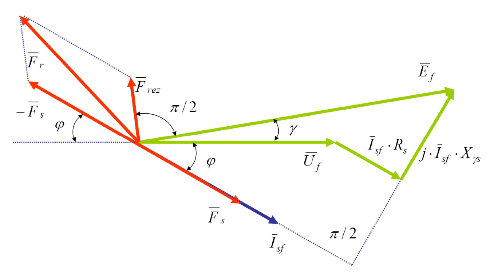

# Zadatak 5 — Indukovani napon statora, otpor i rasipna reaktansa iz vektorskog pada napona, i magnetopobudna sila rotora sinhronog generatora

## Postavka

Trofazni sinhroni generator spojen u **zvezdu** priključen je na trofaznu mrežu linijskog napona $3\times380\ \mathrm{V}$, učestanosti $50\ \mathrm{Hz}$. Generator je opterećen prividnom snagom $66\ \mathrm{kVA}$ uz faktor snage $\cos\varphi = 0{,}865$ (induktivno).

Treba odrediti:

1. koliko iznosi **indukovani napon statora** $E_{\mathrm{sf}}$;
2. koliko iznose **otpor namotaja statora po fazi** $R_{\mathrm{s}}$ i **reaktansa rasipanja statora** $X_{\gamma s}$, ako ukupni **vektorski pad napona** u generatoru iznosi $80\ \mathrm{V}$, a odnos $X_{\gamma s}/R_{\mathrm{s}} = 5/2$;
3. koliku **magnetopobudnu silu (pobudu) rotora** $F_{\mathrm{r}}$ mašina ima, ako su rezultantna magnetopobudna sila $F_{\mathrm{rez}} = 4500\ \mathrm{Az}$ i magnetopobudna sila statora $F_{\mathrm{s}} = 1000\ \mathrm{Az}$.

> **Prevod na običan jezik:** Imamo generator vezan na mrežu od 380 V (to je napon *između dve linije*; napon jedne faze prema zvezdištu je manji, $380/\sqrt{3} \approx 220\ \mathrm{V}$). Generator daje 66 kVA, a struja kasni za naponom (induktivno opterećenje). Prvo pitanje: koliki napon se zaista *indukuje* u namotajima statora? On mora biti veći od napona mreže, jer se deo "potroši" na unutrašnjim padovima napona u samom generatoru. Rečeno nam je da ti unutrašnji padovi, sabrani vektorski, iznose ukupno 80 V, i da je reaktansa 2,5 puta veća od otpora — iz ta dva podatka treba da "raspakujemo" koliki je otpor, a kolika reaktansa. Drugo pitanje: magnetno polje u mašini zajednički prave rotor i stator, i njihova zajednička "magnetna snaga" (rezultantna magnetopobudna sila) je 4500 amper-zavojaka, a statorov doprinos je 1000 amper-zavojaka. Koliko onda "gura" sam rotor? Pažnja — to nije prosto oduzimanje $4500-1000$, jer se magnetopobudne sile sabiraju kao **vektori**, pod uglom!

## Podaci

| Veličina | Oznaka | Vrednost | Šta ta veličina fizički znači |
|---|---|---|---|
| Linijski napon mreže | $U_{\mathrm{s}}$ | $380\ \mathrm{V}$ | Efektivna vrednost napona između bilo koje dve linije trofazne mreže na koju je generator priključen. |
| Učestanost mreže | $f$ | $50\ \mathrm{Hz}$ | Broj perioda naizmeničnog napona u sekundi; diktira sinhronu brzinu obrtanja generatora. |
| Prividna snaga opterećenja | $S$ | $66\ \mathrm{kVA}$ | Ukupna "naponsko-strujna" snaga koju generator daje mreži: proizvod napona i struje (obuhvata i aktivnu i reaktivnu komponentu). |
| Faktor snage | $\cos\varphi$ | $0{,}865$ (ind.) | Kosinus ugla između fazora napona i struje; "ind." znači da struja **kasni** za naponom. |
| Sprega statora | — | zvezda (Y) | Krajevi sve tri faze namotaja spojeni su u zajedničku tačku (zvezdište); fazna struja jednaka je linijskoj, a fazni napon je linijski podeljen sa $\sqrt{3}$. |
| Ukupni vektorski pad napona | $\Delta U_{\mathrm{s}}$ | $80\ \mathrm{V}$ | Moduo (dužina) fazora ukupnog unutrašnjeg pada napona u generatoru: pada na otporu i na rasipnoj reaktansi zajedno. |
| Odnos reaktanse i otpora | $X_{\gamma s}/R_{\mathrm{s}}$ | $5/2$ | Koliko je puta rasipna reaktansa statora veća od otpora statora (po fazi). |
| Rezultantna magnetopobudna sila | $F_{\mathrm{rez}}$ | $4500\ \mathrm{Az}$ | Zajednička magnetopobudna sila rotora i statora — ona koja zaista stvara rezultantni magnetni fluks u mašini. $\mathrm{Az}$ = amper-zavojak. |
| Magnetopobudna sila statora | $F_{\mathrm{s}}$ | $1000\ \mathrm{Az}$ | Doprinos statorskih struja ukupnoj magnetopobudnoj sili (tzv. reakcija indukta). |

**Traži se:** $E_{\mathrm{sf}}$ (indukovani fazni napon statora), $R_{\mathrm{s}}$, $X_{\gamma s}$ i $F_{\mathrm{r}}$ (magnetopobudna sila rotora).

## Šta se traži i zašto

**1) Indukovani napon statora $E_{\mathrm{sf}}$.** To je elektromotorna sila (EMS) koju rezultantni magnetni fluks indukuje u namotaju jedne faze statora — "izvorni" napon generatora, *pre* nego što se od njega oduzmu unutrašnji padovi napona. Inženjera zanima jer govori koliko mašina mora biti "jača" iznutra od napona na priključcima: iz $E_{\mathrm{sf}}$ se procenjuje potrebna pobuda, magnetno naprezanje gvožđa i ponašanje generatora pri promeni opterećenja.

**2) Otpor $R_{\mathrm{s}}$ i rasipna reaktansa $X_{\gamma s}$ statora.** To su dva parametra ekvivalentne šeme statora: $R_{\mathrm{s}}$ predstavlja omski otpor bakra namotaja (na njemu nastaju gubici i zagrevanje), a $X_{\gamma s}$ predstavlja onaj deo magnetnog fluksa statorske struje koji se "rasipa" oko provodnika i ne stiže do rotora — on ne prenosi energiju, ali pravi pad napona. Bez ta dva broja ne možemo izračunati $E_{\mathrm{sf}}$, pa njih određujemo prve.

**3) Magnetopobudna sila rotora $F_{\mathrm{r}}$.** To je "magnetna snaga" pobudnog namotaja rotora — proizvod broja zavojaka i jednosmerne pobudne struje. Inženjera zanima jer direktno određuje koliku pobudnu struju treba pustiti kroz rotor da bi generator na datom opterećenju držao zadati napon.

**Plan rešavanja, običnim jezikom:**

1. Iz snage i napona izračunamo faznu struju generatora.
2. Podelimo zadati vektorski pad napona (80 V) sa strujom — dobijemo modul impedanse statora $Z_{\mathrm{s}}$; pa iz odnosa $5:2$ i Pitagorine teoreme ($Z_{\mathrm{s}}^2 = R_{\mathrm{s}}^2 + X_{\gamma s}^2$) razdvojimo $R_{\mathrm{s}}$ i $X_{\gamma s}$.
3. Struju zapišemo kao kompleksan broj (kasni za naponom za ugao $\varphi$), pa na fazni napon mreže dodamo padove napona — zbir je kompleksna indukovana EMS; njen moduo je traženo $E_{\mathrm{sf}}$, a njen ugao $\gamma$ trebaće nam u nastavku.
4. Sa vektorskog dijagrama očitamo pod kojim uglom stoje vektori magnetopobudnih sila, pa vektorski "oduzmemo" statorsku od rezultantne — ostaje rotorska $F_{\mathrm{r}}$.

## Potrebna teorija — mini-lekcije

### Mini-lekcija 1: Šta je sinhroni generator

Sinhroni generator je mašina kod koje se na **rotoru** nalazi pobudni namotaj kroz koji teče **jednosmerna** struja — rotor je, praktično, obrtni elektromagnet. Kada turbina obrće rotor, njegovo magnetno polje "prelazi" preko namotaja **statora** i u njima indukuje naizmeničnu elektromotornu silu učestanosti $f = p \cdot n / 60$ (p — broj pari polova, n — brzina u obrtajima u minuti). Zove se *sinhroni* jer se rotor obrće tačno u koraku (sinhrono) sa obrtnim magnetnim poljem, bez klizanja.

### Mini-lekcija 2: Sprega zvezda — linijske i fazne veličine

Kod sprege u zvezdu, po jedan kraj svake od tri faze spojen je u zajedničku tačku (zvezdište). Posledice:

- **Struja:** ista struja koja teče kroz fazni namotaj izlazi na linijski priključak, pa je fazna struja jednaka linijskoj: $I_{\mathrm{sf}} = I$.
- **Napon:** napon jedne faze (od priključka do zvezdišta) manji je od linijskog (između dva priključka) tačno $\sqrt{3}$ puta: $U_{\mathrm{sf}} = U_{\mathrm{s}}/\sqrt{3}$. Faktor $\sqrt{3}$ dolazi iz geometrije: dva fazna napona pomerena su za $120^\circ$, pa je dužina njihove razlike $2\sin(60^\circ) = \sqrt{3}$ puta dužina jednog.

Prividna snaga trofaznog sistema, izražena linijskim veličinama, je:

$$S = 3 \cdot U_{\mathrm{sf}} \cdot I_{\mathrm{sf}} = 3 \cdot \frac{U_{\mathrm{s}}}{\sqrt{3}} \cdot I = \sqrt{3} \cdot U_{\mathrm{s}} \cdot I$$

(tri jednake fazne snage $U_{\mathrm{sf}} I_{\mathrm{sf}}$, a zatim $3/\sqrt{3} = \sqrt{3}$).

### Mini-lekcija 3: Fazori i kompleksni zapis struje

Sinusne veličine iste učestanosti predstavljamo **fazorima** — "strelicama" u kompleksnoj ravni čija je dužina efektivna vrednost, a ugao fazni stav. Fazor napona mreže postavljamo na realnu osu (fazni stav nula) — to je naš referentni pravac.

Kod **induktivnog** opterećenja struja **kasni** za naponom za ugao $\varphi$. "Kasni" u kompleksnoj ravni znači: zarotirana je za $\varphi$ **ispod** realne ose, tj. njen ugao je $-\varphi$. Kompleksni zapis takve struje je:

$$\overline{I}_{\mathrm{sf}} = I_{\mathrm{sf}}\left[\cos(\varphi) - j\sin(\varphi)\right]$$

gde je $j$ imaginarna jedinica ($j^2 = -1$), $I_{\mathrm{sf}}$ moduo (efektivna vrednost) struje, a znak minus uz $\sin\varphi$ upravo iskazuje kašnjenje. Za $\sin\varphi$ iz poznatog $\cos\varphi$ koristimo osnovni trigonometrijski identitet $\sin^2\varphi + \cos^2\varphi = 1$, tj. $\sin\varphi = \sqrt{1-\cos^2\varphi}$.

### Mini-lekcija 4: Naponska jednačina statora i "vektorski pad napona"

Statorski namotaj jedne faze modelujemo kao red vezu: izvor EMS $\overline{E}_{\mathrm{sf}}$, otpor $R_{\mathrm{s}}$ i rasipnu reaktansu $X_{\gamma s}$, a na krajevima je napon mreže $\overline{U}_{\mathrm{sf}}$. Za **generator** (struja izlazi iz mašine ka mreži) drugi Kirhofov zakon daje:

$$\overline{E}_{\mathrm{sf}} = \overline{U}_{\mathrm{sf}} + \overline{I}_{\mathrm{sf}} \cdot R_{\mathrm{s}} + j\cdot\overline{I}_{\mathrm{sf}} \cdot X_{\gamma s}$$

Rečima: ono što se indukuje ($\overline{E}_{\mathrm{sf}}$) delom "ode" na unutrašnje padove, a ostatak je napon koji mreža vidi. Pad na otporu, $\overline{I}_{\mathrm{sf}} R_{\mathrm{s}}$, u fazi je sa strujom; pad na reaktansi, $j\overline{I}_{\mathrm{sf}} X_{\gamma s}$, prednjači struji za $90^\circ$ (množenje sa $j$ u kompleksnoj ravni znači rotaciju za $+90^\circ$ — to je matematički zapis činjenice da napon na kalemu prednjači struji kroz njega za četvrtinu periode).

Ta dva pada možemo objediniti preko **impedanse statora** $\overline{Z}_{\mathrm{s}} = R_{\mathrm{s}} + jX_{\gamma s}$, čiji je moduo $Z_{\mathrm{s}} = \sqrt{R_{\mathrm{s}}^2 + X_{\gamma s}^2}$ (Pitagorina teorema, jer su $R_{\mathrm{s}}$ i $X_{\gamma s}$ pod pravim uglom u kompleksnoj ravni).

**Vektorski pad napona** $\Delta U_{\mathrm{s}}$ iz postavke je **moduo** ukupnog fazora pada:

$$\Delta U_{\mathrm{s}} = \left|\overline{I}_{\mathrm{sf}}\cdot(R_{\mathrm{s}} + jX_{\gamma s})\right| = I_{\mathrm{sf}} \cdot Z_{\mathrm{s}}$$

jer je moduo proizvoda kompleksnih brojeva jednak proizvodu njihovih modula. Zato iz $\Delta U_{\mathrm{s}}$ i $I_{\mathrm{sf}}$ odmah dobijamo $Z_{\mathrm{s}} = \Delta U_{\mathrm{s}}/I_{\mathrm{sf}}$. Važno: 80 V **nije** aritmetički zbir pada na otporu i pada na reaktansi — to je dužina njihovog vektorskog zbira.

### Mini-lekcija 5: Kako iz $Z_{\mathrm{s}}$ i odnosa $X_{\gamma s}/R_{\mathrm{s}}$ razdvojiti $R_{\mathrm{s}}$ i $X_{\gamma s}$

Imamo dve nepoznate ($R_{\mathrm{s}}$, $X_{\gamma s}$) i dve jednačine: Pitagorinu $Z_{\mathrm{s}}^2 = R_{\mathrm{s}}^2 + X_{\gamma s}^2$ i zadati odnos $X_{\gamma s} = k \cdot R_{\mathrm{s}}$ (ovde $k = 5/2$). Uvrstimo drugu u prvu:

$$Z_{\mathrm{s}}^2 = (k R_{\mathrm{s}})^2 + R_{\mathrm{s}}^2 = R_{\mathrm{s}}^2\,(1 + k^2) \;\;\Rightarrow\;\; R_{\mathrm{s}} = \frac{Z_{\mathrm{s}}}{\sqrt{1+k^2}},\qquad X_{\gamma s} = k\cdot R_{\mathrm{s}}$$

Ista logika kao kad znaš dužinu hipotenuze i odnos kateta pravouglog trougla.

### Mini-lekcija 6: Magnetopobudne sile (MPS) i njihov "bilans"

**Magnetopobudna sila** (MPS, oznaka $F$) je mera sposobnosti nekog namotaja da protera magnetni fluks kroz magnetno kolo: $F = N \cdot I$ (broj zavojaka puta struja). Jedinica je **amper-zavojak** $[\mathrm{Az}]$. Analogija: MPS je za magnetno kolo ono što je EMS (napon) za električno kolo — "pritisak" koji tera fluks.

U sinhronoj mašini fluks u vazdušnom zazoru **zajednički** stvaraju dva izvora MPS:

- $\overline{F}_{\mathrm{r}}$ — MPS **rotora** (pobudni namotaj sa jednosmernom strujom);
- $\overline{F}_{\mathrm{s}}$ — MPS **statora**, koju stvaraju naizmenične struje opterećenja u statorskim namotajima (to se zove *reakcija indukta*: čim generator opteretimo, statorske struje same postanu izvor magnetnog polja koje se meša sa rotorskim).

Njihov **vektorski zbir** je rezultantna MPS, i baš ona stvara rezultantni fluks koji indukuje EMS:

$$\overline{F}_{\mathrm{rez}} = \overline{F}_{\mathrm{r}} + \overline{F}_{\mathrm{s}} \;\;\Rightarrow\;\; \overline{F}_{\mathrm{r}} = \overline{F}_{\mathrm{rez}} - \overline{F}_{\mathrm{s}}$$

Sabiranje je vektorsko jer MPS talasi rotora i statora u zazoru nisu prostorno poravnati — svaki "gura" fluks u svom pravcu, pa se slažu kao strelice, ne kao obični brojevi.

Za crtanje dijagrama trebaju nam još dva pravila o uglovima:

1. **$\overline{F}_{\mathrm{s}}$ je u fazi sa strujom statora $\overline{I}_{\mathrm{sf}}$** — jer statorsku MPS stvaraju upravo te struje: kad struja raste, raste i njena MPS, istog trenutka i u istom "taktu".
2. **$\overline{F}_{\mathrm{rez}}$ prednjači indukovanoj EMS $\overline{E}_{\mathrm{sf}}$ za $90^\circ$** — jer MPS stvara fluks u fazi sa sobom (zanemarujući zasićenje), a po Faradejevom zakonu ($e = -\,\mathrm{d}\Phi/\mathrm{d}t$) indukovana EMS kasni za fluksom koji je indukuje za četvrtinu periode, tj. za $90^\circ$.

### Mini-lekcija 7: Vektorski dijagram nadpobuđenog generatora — kako se čita slika 5.1

Generator je **nadpobuđen** kada mu je pobuda "jača nego što mora": tada je indukovana EMS veća od napona mreže ($E_{\mathrm{sf}} > U_{\mathrm{sf}}$), generator mreži pored aktivne snage isporučuje i **reaktivnu** (induktivnu) snagu, a struja kasni za naponom — baš naš slučaj ($\cos\varphi$ induktivno).

Slika koja sledi prikazuje kompletan vektorski dijagram takvog generatora: zelenim su nacrtani električni fazori (napon, EMS, padovi napona), crvenim magnetopobudne sile, a plavim struja statora.

**Slika 5.1 —** Vektorski dijagram električnih i magnetopobudnih sila nadpobuđenog generatora: zeleno — naponi ($\overline{U}_f$, padovi $\overline{I}_{sf}R_s$ i $j\overline{I}_{sf}X_{\gamma s}$, EMS $\overline{E}_f$); plavo — struja $\overline{I}_{sf}$; crveno — magnetopobudne sile $\overline{F}_s$, $-\overline{F}_s$, $\overline{F}_{rez}$ i $\overline{F}_r$.

> **Kako čitati sliku 5.1:** Boje razdvajaju tri "sveta" veličina: **zeleno** su električni fazori (naponi, u $\mathrm{V}$), **plavo** je struja statora (u $\mathrm{A}$), **crveno** su magnetopobudne sile (u $\mathrm{Az}$) — svaka grupa ima svoju razmeru, a tačkaste plave linije su pomoćna konstrukcija. Referentni fazor je $\overline{U}_f$, horizontalno udesno (u zadatku $220\ \mathrm{V}$); fazori se obrću suprotno kazaljci na satu, pa fazor ispod horizontale **kasni**, a iznad nje **prednjači**. Redom: plava struja $\overline{I}_{sf}$ ($100{,}3\ \mathrm{A}$) leži ispod horizontale, pod uglom $\varphi = 30{,}1^\circ$ (donji luk) — kasni, induktivno opterećenje. Na vrh $\overline{U}_f$ nadovezan je zeleni pad $\overline{I}_{sf}\cdot R_s$ ($\approx 29{,}7\ \mathrm{V}$), **paralelan struji**, pa na njega pad $j\cdot\overline{I}_{sf}\cdot X_{\gamma s}$ ($\approx 74{,}3\ \mathrm{V}$), **normalan na struju** — pravi ugao između njih označen je sa $\pi/2$ dole desno, na tačkastim linijama. Vrh te "stepenice" je ujedno vrh zelene EMS $\overline{E}_f$, koja polazi iz koordinatnog početka, duža je od napona ($287{,}2\ \mathrm{V}$) i prednjači mu za $\gamma = 9{,}9^\circ$ (luk kod vrha $\overline{U}_f$). Crveni deo: $\overline{F}_s$ ($1000\ \mathrm{Az}$) leži tačno na pravcu struje — statorsku MPS prave upravo te struje, pa je s njima u fazi; $-\overline{F}_s$ je isti vektor okrenut na suprotnu stranu (gore levo), a levi luk $\varphi$ između njega i tačkaste horizontale isti je ugao struje, samo preslikan; $\overline{F}_{rez}$ ($4500\ \mathrm{Az}$) prednjači fazoru $\overline{E}_f$ za $\pi/2$ (gornja oznaka $\pi/2$) — zato je skoro vertikalan; $\overline{F}_r$ ($\approx 5200\ \mathrm{Az}$) je dijagonala tačkastog paralelograma razapetog nad $\overline{F}_{rez}$ i $-\overline{F}_s$, tj. vektorski zbir $\overline{F}_{rez} + (-\overline{F}_s)$. Ugao između $-\overline{F}_s$ i $\overline{F}_{rez}$ je $\beta = 90^\circ - (\varphi + \gamma) \approx 50^\circ$ (Korak 9). **Šta treba da zaključiš:** slika u jednom crtežu povezuje sva tri dela zadatka — zelena "stepenica" daje $E_{\mathrm{sf}}$ i ugao $\gamma$, a crveni paralelogram pokazuje zašto je $F_r$ ($5200\ \mathrm{Az}$) veći čak i od $F_{\mathrm{rez}}$ ($4500\ \mathrm{Az}$): reakcija indukta delom razmagnetiše mašinu, pa rotor mora da "gura" jače od rezultante.

### Mini-lekcija 8: Vektorsko sabiranje pomoću razlaganja na komponente

Kad treba sabrati dva vektora poznatih dužina koji zaklapaju poznat ugao $\beta$, najlakše je jedan od njih postaviti duž pomoćne ose. Ako vektor $\vec{A}$ (dužine $A$) leži na osi, a vektor $\vec{B}$ (dužine $B$) zaklapa s njim ugao $\beta$, onda $\vec{B}$ ima komponentu $B\cos\beta$ duž ose i $B\sin\beta$ normalno na osu. Zbir ima komponente $(A + B\cos\beta,\; B\sin\beta)$, pa mu je dužina, po Pitagorinoj teoremi:

$$\left|\vec{A}+\vec{B}\right| = \sqrt{(A + B\cos\beta)^2 + (B\sin\beta)^2}$$

Ako se izraz pod korenom razvije ($A^2 + 2AB\cos\beta + B^2\cos^2\beta + B^2\sin^2\beta = A^2 + B^2 + 2AB\cos\beta$), prepoznaje se kosinusna teorema — to je jedna te ista stvar, samo drugačije zapisana.

## Rešenje, korak po korak

### Korak 1: Fazna struja generatora

**Zašto ovaj korak:** Struja nam treba za sve što sledi — i za razdvajanje impedanse (Korak 4), i za padove napona (Korak 7). Iz zadate snage i napona nju dobijamo odmah.

Opšti oblik (mini-lekcija 2): prividna snaga trofaznog sistema je $S = \sqrt{3}\,U I$, gde je $U$ linijski napon, a $I$ linijska struja. Kod sprege zvezda linijska struja jednaka je faznoj, pa:

$$I_{\mathrm{sf}} = I = \frac{S}{\sqrt{3}\cdot U} = \frac{66000\ \mathrm{VA}}{\sqrt{3}\cdot 380\ \mathrm{V}} = \frac{66000}{658{,}18} = 100{,}277\ \mathrm{A}$$

**Šta smo dobili:** Kroz svaku fazu statora teče oko 100 A — solidna struja, u skladu sa snagom generatora od 66 kVA na relativno niskom naponu od 380 V.

### Korak 2: Fazni stav struje

**Zašto ovaj korak:** Da bismo struju zapisali kao kompleksan broj, treba nam njen ugao $\varphi$ i njegov sinus (kosinus već imamo).

Iz zadatog faktora snage:

$$\cos(\varphi) = 0{,}865 \;\;\Rightarrow\;\; \varphi = \arccos(0{,}865) = 30{,}117^\circ$$

Sinus dobijamo iz osnovnog identiteta $\sin^2\varphi + \cos^2\varphi = 1$ (mini-lekcija 3):

$$\sin(\varphi) = \sqrt{1 - \cos^2(\varphi)} = \sqrt{1 - 0{,}865^2} = \sqrt{1 - 0{,}748225} = \sqrt{0{,}251775} = 0{,}50177$$

> **Napomena o originalu:** U zbirci na ovom mestu piše $\varphi = 30{,}177^\circ$ — štamparska greška (zamenjene cifre). Tačna vrednost je $30{,}117^\circ$, i sama zbirka je kasnije koristi (u računu ugla $\beta$ stoji $30{,}11729$).

**Šta smo dobili:** Struja kasni za naponom za oko $30^\circ$ — umereno induktivno opterećenje, što odgovara $\cos\varphi = 0{,}865$.

### Korak 3: Kompleksni zapis struje

**Zašto ovaj korak:** Padovi napona u Koraku 7 računaju se množenjem kompleksnih brojeva, pa struju moramo izraziti sa realnim i imaginarnim delom.

Struja kasni, pa nosi znak minus uz imaginarni deo (mini-lekcija 3):

$$\begin{aligned}
\overline{I}_{\mathrm{sf}} &= I_{\mathrm{sf}}\left[\cos(\varphi) - j\sin(\varphi)\right] = 100{,}277\cdot\left(0{,}865 - j\cdot 0{,}50177\right) = \\
&= \left(100{,}277\cdot 0{,}865\right) - j\cdot\left(100{,}277\cdot 0{,}50177\right) = \\
&= \left(86{,}739 - j\cdot 50{,}316\right)\ \mathrm{A}
\end{aligned}$$

> **Napomena o originalu:** Zbirka u ovom množenju koristi $100{,}227$ umesto $100{,}277$ (štamparski zamenjene cifre), pa joj imaginarni deo ispada $-j\,50{,}291$ umesto $-j\,50{,}316$. Razlika je 0,05 % i na konačni rezultat utiče tek na drugoj decimali (vidi Korak 8).

**Šta smo dobili:** Struja ima aktivnu komponentu $\approx 86{,}7\ \mathrm{A}$ (prenosi korisnu snagu) i reaktivnu $\approx 50{,}3\ \mathrm{A}$ (magneti mrežu — induktivna komponenta).

### Korak 4: Impedansa statora iz vektorskog pada napona

**Zašto ovaj korak:** Zadat nam je ukupan vektorski pad napona od 80 V. Pošto je on jednak $I_{\mathrm{sf}}\cdot Z_{\mathrm{s}}$ (mini-lekcija 4), deljenjem sa strujom odmah dobijamo moduo impedanse statora — prvi korak ka razdvajanju $R_{\mathrm{s}}$ i $X_{\gamma s}$.

$$Z_{\mathrm{s}} = \frac{\Delta U_{\mathrm{s}}}{I_{\mathrm{sf}}} = \frac{80\ \mathrm{V}}{100{,}277\ \mathrm{A}} = 0{,}79779\ \mathrm{\Omega}$$

**Šta smo dobili:** Ukupna unutrašnja impedansa jedne faze statora je ispod jednog oma — mala na prvi pogled, ali pri struji od 100 A pravi pad od čak 80 V.

### Korak 5: Razdvajanje $R_{\mathrm{s}}$ i $X_{\gamma s}$

**Zašto ovaj korak:** Znamo "hipotenuzu" $Z_{\mathrm{s}}$ i odnos "kateta" $X_{\gamma s}/R_{\mathrm{s}} = 5/2$; sada Pitagorinom teoremom vadimo svaku posebno (mini-lekcija 5).

Iz zadatog odnosa izrazimo reaktansu preko otpora:

$$\frac{X_{\gamma s}}{R_{\mathrm{s}}} = \frac{5}{2} \;\;\Rightarrow\;\; X_{\gamma s} = \frac{5}{2}\cdot R_{\mathrm{s}}$$

Uvrstimo to u Pitagorinu vezu modula impedanse:

$$Z_{\mathrm{s}}^2 = X_{\gamma s}^2 + R_{\mathrm{s}}^2 = \left(\frac{5}{2}\right)^2 R_{\mathrm{s}}^2 + R_{\mathrm{s}}^2 = R_{\mathrm{s}}^2\cdot\left[1 + \left(\frac{5}{2}\right)^2\right]$$

Podelimo obe strane sa $\left[1+(5/2)^2\right]$ i korenujemo (obe strane su pozitivne, pa je korenovanje dozvoljeno i jednoznačno):

$$R_{\mathrm{s}} = \frac{Z_{\mathrm{s}}}{\sqrt{1+\left(\dfrac{5}{2}\right)^2}} = \frac{0{,}79779}{\sqrt{1+6{,}25}} = \frac{0{,}79779}{\sqrt{7{,}25}} = \frac{0{,}79779}{2{,}69258} = 0{,}29629\ \mathrm{\Omega}$$

Reaktansa je onda:

$$X_{\gamma s} = \frac{5}{2}\cdot R_{\mathrm{s}} = 2{,}5\cdot 0{,}29629 = 0{,}74073\ \mathrm{\Omega}$$

**Šta smo dobili:** $R_{\mathrm{s}} \approx 0{,}296\ \mathrm{\Omega}$ i $X_{\gamma s} \approx 0{,}741\ \mathrm{\Omega}$ — dva od tri tražena odgovora. Reaktansa je, po zadatom odnosu, tačno 2,5 puta veća od otpora, što je tipično: kod naizmeničnih mašina induktivni deo impedanse obično nadmašuje omski.

### Korak 6: Fazni napon mreže

**Zašto ovaj korak:** Naponska jednačina generatora (Korak 7) piše se za **jednu fazu**, pa linijski napon 380 V moramo prevesti u fazni (mini-lekcija 2).

$$U_{\mathrm{sf}} = \frac{U_{\mathrm{s}}}{\sqrt{3}} = \frac{380\ \mathrm{V}}{\sqrt{3}} = 220\ \mathrm{V}$$

> **Napomena o originalu:** Tačna vrednost je $380/\sqrt{3} = 219{,}39\ \mathrm{V}$; zbirka (kao i inženjerska praksa) zaokružuje na standardnih $220\ \mathrm{V}$ — mreža "380/220 V" je istorijski standardna oznaka. Radimo i mi sa 220 V da bi se rezultati poklopili; razlika je 0,3 %.

Pošto smo fazor napona mreže postavili na referentnu (realnu) osu, on je čisto realan: $\overline{U}_{\mathrm{sf}} = 220\ \mathrm{V}$.

**Šta smo dobili:** Svaka faza generatora "gleda" 220 V prema zvezdištu — poznata vrednost kućnog napona iz vremena 380/220 V mreža.

### Korak 7: Kompleksna indukovana elektromotorna sila

**Zašto ovaj korak:** Sada imamo sve sastojke naponske jednačine generatora (mini-lekcija 4): fazni napon, kompleksnu struju i oba parametra. Sabiranjem dobijamo kompleksnu EMS.

Opšti oblik, pa uvrštavanje:

$$\overline{E}_{\mathrm{sf}} = \overline{U}_{\mathrm{sf}} + \overline{I}_{\mathrm{sf}}\cdot\left(R_{\mathrm{s}} + j X_{\gamma s}\right) = 220 + \left(86{,}739 - j\,50{,}316\right)\cdot\left(0{,}29629 + j\,0{,}74073\right)$$

Množenje kompleksnih brojeva radimo "svaki sa svakim", uz $j\cdot j = -1$:

$$\begin{aligned}
\left(86{,}739 - j\,50{,}316\right)\cdot\left(0{,}29629 + j\,0{,}74073\right) =\;& 86{,}739\cdot 0{,}29629 \;+\; j\cdot 86{,}739\cdot 0{,}74073 \\
& -\; j\cdot 50{,}316\cdot 0{,}29629 \;-\; j^2\cdot 50{,}316\cdot 0{,}74073
\end{aligned}$$

Izračunajmo sva četiri proizvoda:

$$86{,}739\cdot 0{,}29629 = 25{,}700 \qquad 50{,}316\cdot 0{,}74073 = 37{,}271$$
$$86{,}739\cdot 0{,}74073 = 64{,}250 \qquad 50{,}316\cdot 0{,}29629 = 14{,}908$$

Pošto je $-j^2 = +1$, poslednji sabirak postaje realan i pozitivan, pa je pad napona:

$$\left(25{,}700 + 37{,}271\right) + j\left(64{,}250 - 14{,}908\right) = 62{,}971 + j\,49{,}342\ \mathrm{V}$$

Dodamo napon mreže (realan broj — sabira se samo sa realnim delom):

$$\overline{E}_{\mathrm{sf}} = 220 + 62{,}971 + j\,49{,}342 = \left(282{,}971 + j\,49{,}342\right)\ \mathrm{V}$$

**Šta smo dobili:** Realni deo EMS znatno je veći od 220 V, a pojavio se i imaginarni deo — fazor EMS je i duži od fazora napona i zarotiran ispred njega, baš kako slika 5.1 prikazuje za nadpobuđeni generator.

### Korak 8: Efektivna vrednost $E_{\mathrm{sf}}$ i ugao $\gamma$

**Zašto ovaj korak:** Zadatak pita za indukovani napon — to je **moduo** kompleksne EMS. Usput računamo i ugao $\gamma$ (za koliko EMS prednjači naponu mreže), jer nam treba u Koraku 9 za dijagram magnetopobudnih sila.

Moduo kompleksnog broja je koren zbira kvadrata realnog i imaginarnog dela:

$$E_{\mathrm{sf}} = \sqrt{282{,}971^2 + 49{,}342^2} = \sqrt{80072{,}6 + 2434{,}6} = \sqrt{82507{,}2} = 287{,}24\ \mathrm{V}$$

Ugao fazora prema realnoj osi (referentni pravac = napon mreže) je:

$$\gamma = \arctan\!\left(\frac{49{,}342}{282{,}971}\right) = \arctan\!\left(0{,}17437\right) = 9{,}891^\circ$$

> **Napomena o originalu:** Zbirka dobija $E_{\mathrm{sf}} = 287{,}2227\ \mathrm{V}$ i $\gamma = 9{,}89332^\circ$ — mikroskopski drugačije zbog štamparske greške u struji iz Koraka 3. Ispravan račun daje $287{,}24\ \mathrm{V}$ i $9{,}891^\circ$; na nivou zaokruživanja to je isti rezultat, $E_{\mathrm{sf}} \approx 287{,}2\ \mathrm{V}$.

**Šta smo dobili:** Prvi traženi odgovor: $E_{\mathrm{sf}} \approx 287\ \mathrm{V}$, za oko 30 % više od napona mreže — generator je iznutra osetno "jači" od svojih priključaka, tipično za nadpobuđen režim sa velikim unutrašnjim padom.

### Korak 9: Ugao $\beta$ između vektora $-\overline{F}_{\mathrm{s}}$ i $\overline{F}_{\mathrm{rez}}$

**Zašto ovaj korak:** Da bismo vektorski sastavili $\overline{F}_{\mathrm{r}} = \overline{F}_{\mathrm{rez}} + (-\overline{F}_{\mathrm{s}})$, moramo znati ugao između ta dva vektora. Njega čitamo sa slike 5.1, koristeći uglove koje smo do sada izračunali.

Popišimo pravce svih aktera, mereno od referentne ose (pravac $\overline{U}_{\mathrm{sf}}$), sa pozitivnim smerom suprotno kazaljci:

- struja $\overline{I}_{\mathrm{sf}}$ kasni za naponom: njen pravac je $-\varphi$;
- $\overline{F}_{\mathrm{s}}$ je u fazi sa strujom (mini-lekcija 6, pravilo 1): pravac $-\varphi$;
- $-\overline{F}_{\mathrm{s}}$ je suprotan vektor: pravac $-\varphi + 180^\circ = 180^\circ - \varphi$;
- $\overline{E}_{\mathrm{sf}}$ prednjači naponu za $\gamma$: pravac $+\gamma$;
- $\overline{F}_{\mathrm{rez}}$ prednjači EMS za $90^\circ$ (mini-lekcija 6, pravilo 2): pravac $90^\circ + \gamma$.

Ugao između $-\overline{F}_{\mathrm{s}}$ i $\overline{F}_{\mathrm{rez}}$ je razlika njihovih pravaca:

$$\beta = \left(180^\circ - \varphi\right) - \left(90^\circ + \gamma\right) = 180^\circ - \left(90^\circ + \varphi + \gamma\right) = 90^\circ - \left(\varphi + \gamma\right)$$

Uvrstimo brojeve:

$$\beta = 90^\circ - \left(30{,}117^\circ + 9{,}891^\circ\right) = 90^\circ - 40{,}008^\circ = 49{,}991^\circ$$

**Šta smo dobili:** Vektori $-\overline{F}_{\mathrm{s}}$ i $\overline{F}_{\mathrm{rez}}$ zaklapaju oko $50^\circ$ — nisu ni poravnati ni normalni, pa je vektorsko sabiranje (a ne prosto sabiranje ili oduzimanje brojeva) zaista neophodno.

### Korak 10: Magnetopobudna sila rotora $F_{\mathrm{r}}$

**Zašto ovaj korak:** Ovo je poslednje pitanje zadatka. Iz bilansa MPS (mini-lekcija 6) rotorsku MPS dobijamo kao vektorski zbir $\overline{F}_{\mathrm{rez}}$ i $-\overline{F}_{\mathrm{s}}$, čiji ugao sada znamo.

Primenimo razlaganje na komponente (mini-lekcija 8): postavimo pomoćnu osu duž vektora $-\overline{F}_{\mathrm{s}}$ (dužine $F_{\mathrm{s}} = 1000\ \mathrm{Az}$). Vektor $\overline{F}_{\mathrm{rez}}$ (dužine $4500\ \mathrm{Az}$) zaklapa s tom osom ugao $\beta$, pa ima komponente $F_{\mathrm{rez}}\cos\beta$ duž ose i $F_{\mathrm{rez}}\sin\beta$ normalno na nju. Dužina zbira je:

$$F_{\mathrm{r}} = \sqrt{\left[F_{\mathrm{s}} + F_{\mathrm{rez}}\cos(\beta)\right]^2 + \left[F_{\mathrm{rez}}\sin(\beta)\right]^2}$$

Izračunajmo redom. Trigonometrijske vrednosti:

$$\cos(49{,}991^\circ) = 0{,}64291 \qquad \sin(49{,}991^\circ) = 0{,}76594$$

Komponente:

$$F_{\mathrm{s}} + F_{\mathrm{rez}}\cos(\beta) = 1000 + 4500\cdot 0{,}64291 = 1000 + 2893{,}1 = 3893{,}1\ \mathrm{Az}$$
$$F_{\mathrm{rez}}\sin(\beta) = 4500\cdot 0{,}76594 = 3446{,}7\ \mathrm{Az}$$

Konačno:

$$F_{\mathrm{r}} = \sqrt{3893{,}1^2 + 3446{,}7^2} = \sqrt{15156188 + 11879948} = \sqrt{27036136} \approx 5199{,}6\ \mathrm{Az} \approx 5200\ \mathrm{Az}$$

> **Napomena o originalu:** Zbirka navodi $F_{\mathrm{r}} = 5200{,}0248\ \mathrm{Az}$. Račun sa punom tačnošću daje $5199{,}6\ \mathrm{Az}$ — razlika od 0,4 Az (0,008 %) potiče isključivo od zaokruživanja međurezultata (trigonometrijskih vrednosti) u zbirci. Praktično, oba računa kažu isto: $F_{\mathrm{r}} \approx 5200\ \mathrm{Az}$.

**Šta smo dobili:** Pobuda rotora je oko $5200\ \mathrm{Az}$ — **veća** od rezultantne ($4500\ \mathrm{Az}$). To je otisak nadpobuđenog režima: statorska reakcija indukta delom *poništava* rotorsku pobudu (razmagnetiše mašinu), pa rotor mora da "gura" jače od onoga što na kraju ostane kao rezultanta.

## Česte greške i zamke

1. **Mešanje linijskih i faznih veličina.** U naponsku jednačinu generatora ide **fazni** napon (220 V), a ne linijski (380 V). Ko uvrsti 380 V, dobija EMS od preko 440 V — besmislicu. Slično, u obrascu $S=\sqrt{3}\,U I$ figuriše **linijski** napon; ne treba deliti sa $\sqrt{3}$ dva puta.
2. **Pogrešan znak uz $\sin\varphi$.** Kod induktivnog opterećenja struja kasni: $\overline{I}_{\mathrm{sf}} = I(\cos\varphi - j\sin\varphi)$. Ako se stavi $+j$, imaginarni deo pada napona promeni znak, EMS ispadne manja i ceo dijagram se "prevrne" — rezultat izgleda uverljivo, ali je pogrešan.
3. **Tretiranje vektorskog pada od 80 V kao algebarskog zbira.** 80 V je **moduo** fazora $\overline{I}_{\mathrm{sf}}(R_{\mathrm{s}}+jX_{\gamma s})$, tj. $I\cdot\sqrt{R_{\mathrm{s}}^2+X_{\gamma s}^2}$, a ne $I R_{\mathrm{s}} + I X_{\gamma s}$. Isto tako, pri razdvajanju važi $Z_{\mathrm{s}}^2 = R_{\mathrm{s}}^2 + X_{\gamma s}^2$, nikako $Z_{\mathrm{s}} = R_{\mathrm{s}} + X_{\gamma s}$.
4. **"Skraćeno" računanje MPS rotora: $F_{\mathrm{r}} = 4500 - 1000 = 3500\ \mathrm{Az}$.** Pogrešno — MPS se oduzimaju **vektorski**, pod uglom $\beta$. Ispravan rezultat (5200 Az) je čak *veći* od $F_{\mathrm{rez}}$, što algebarsko oduzimanje nikad ne bi dalo.
5. **Stepeni i radijani.** Ugao $\beta = 49{,}991^\circ$ mora ući u kalkulator u režimu DEG (ili se pretvoriti u radijane). Ko izračuna $\cos(49{,}991)$ u radijanima, dobiće besmislen rezultat.

## Rezime rezultata

| Tražena veličina | Oznaka | Rezultat |
|---|---|---|
| Fazna struja generatora | $I_{\mathrm{sf}}$ | $100{,}277\ \mathrm{A}$ |
| Impedansa statora (po fazi) | $Z_{\mathrm{s}}$ | $0{,}79779\ \mathrm{\Omega}$ |
| Otpor namotaja statora (po fazi) | $R_{\mathrm{s}}$ | $0{,}29629\ \mathrm{\Omega} \approx 0{,}296\ \mathrm{\Omega}$ |
| Reaktansa rasipanja statora | $X_{\gamma s}$ | $0{,}74073\ \mathrm{\Omega} \approx 0{,}741\ \mathrm{\Omega}$ |
| Indukovani napon statora (efektivno, po fazi) | $E_{\mathrm{sf}}$ | $287{,}24\ \mathrm{V} \approx 287\ \mathrm{V}$ |
| Ugao EMS prema naponu mreže | $\gamma$ | $9{,}891^\circ$ |
| Ugao između $-\overline{F}_{\mathrm{s}}$ i $\overline{F}_{\mathrm{rez}}$ | $\beta$ | $49{,}991^\circ$ |
| Magnetopobudna sila rotora | $F_{\mathrm{r}}$ | $5199{,}6\ \mathrm{Az} \approx 5200\ \mathrm{Az}$ |

## Provera smisla

1. **Samosaglasnost impedanse:** vratimo dobijene parametre u vektorski pad: $I_{\mathrm{sf}}\sqrt{R_{\mathrm{s}}^2+X_{\gamma s}^2} = 100{,}277\cdot\sqrt{0{,}29629^2+0{,}74073^2} = 100{,}277\cdot 0{,}79779 = 80{,}0\ \mathrm{V}$ — tačno zadatih 80 V. I odnos je pogodjen: $X_{\gamma s}/R_{\mathrm{s}} = 0{,}74073/0{,}29629 = 2{,}50$, tačno $5/2$.
2. **Dimenziona provera:** $Z_{\mathrm{s}} = \Delta U_{\mathrm{s}}/I_{\mathrm{sf}}$ ima jedinicu $\mathrm{V}/\mathrm{A} = \mathrm{\Omega}$ — u redu; $F_{\mathrm{r}}$ nastaje sabiranjem veličina u $\mathrm{Az}$ — u redu.
3. **Kvalitativna provera (nadpobuđen generator):** $E_{\mathrm{sf}} = 287\ \mathrm{V} > U_{\mathrm{sf}} = 220\ \mathrm{V}$ i $\gamma > 0$ (EMS prednjači) — tačno ono što slika 5.1 predviđa za nadpobuđen generator sa induktivnim opterećenjem. Relativni pad od $80/220 \approx 36\ \%$ je krupan, ali dosledan zadatim podacima (mala mašina sa velikom unutrašnjom impedansom).
4. **Granice za trougao MPS:** dužina vektorskog zbira dva vektora mora ležati između razlike i zbira njihovih dužina: $|F_{\mathrm{rez}} - F_{\mathrm{s}}| = 3500\ \mathrm{Az} \le F_{\mathrm{r}} \le F_{\mathrm{rez}} + F_{\mathrm{s}} = 5500\ \mathrm{Az}$. Naših $5200\ \mathrm{Az}$ upada u taj interval (bliže gornjoj granici, jer je ugao između $-\overline{F}_{\mathrm{s}}$ i $\overline{F}_{\mathrm{rez}}$ manji od $90^\circ$, pa se vektori "pomažu").
