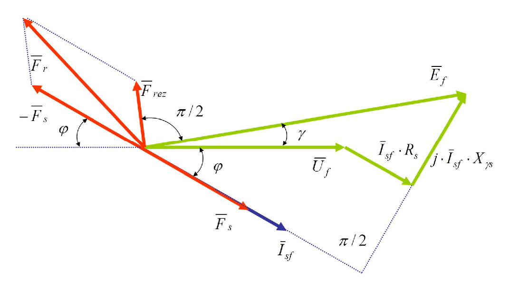
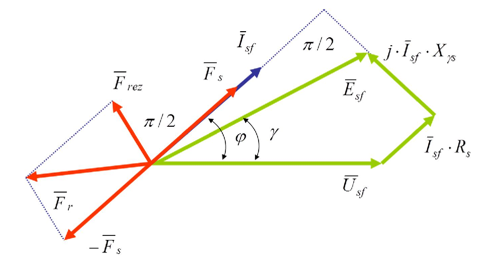
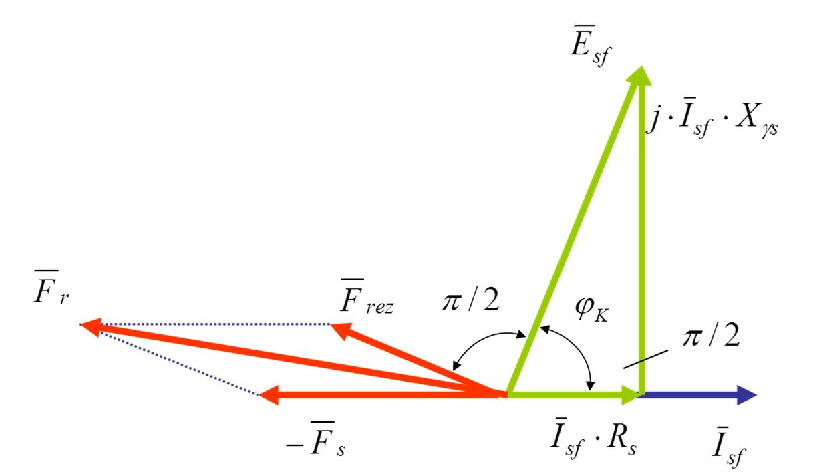

# Zadatak 6 — Struja kratkog spoja turbogeneratora pri kapacitivnom opterećenju (metoda magnetopobudnih sila)

## Postavka

Trofazni sinhroni generator sa turborotorom (cilindričnim rotorom), u sprezi "zvezda", priključen je na mrežu linijskog napona $U_s = 660\ \mathrm{V}$, frekvencije $f = 50\ \mathrm{Hz}$. Otpor statora po fazi iznosi $R_s = 0{,}5\ \Omega$, a reaktansa rasipanja statora $X_{\gamma s} = 0{,}8\ \Omega$.

**Prvi režim (sve poznato):** generator je bio opterećen strujom $I_{sf}' = 100\ \mathrm{A}$ pri faktoru snage $\cos\varphi' = 0{,}8$ **induktivno**, i pri tome je imao rezultantnu magnetopobudnu silu $F_{rez}' = 6200\ \mathrm{Az}$ i magnetopobudnu silu statora $F_s' = 2700\ \mathrm{Az}$. Ustaljena struja kratkog spoja generatora pri toj pobudi iznosi $I_K' = 500\ \mathrm{A}$.

**Drugi režim (traži se):** isti generator radi sa strujom $I_{sf}'' = 100\ \mathrm{A}$, ali pri faktoru snage $\cos\varphi'' = 0{,}8$ **kapacitivno**. Kolika je ustaljena struja kratkog spoja $I_K''$ u ovom drugom slučaju?

> **Prevod na običan jezik:** Imamo generator koji smo jednom "snimili" dok je napajao induktivan potrošač: znamo koliku je struju davao, znamo sve njegove magnetopobudne sile (to su "magnetni napori" namotaja, o njima detaljno u teoriji) i znamo da bi, ako bismo mu u tom stanju pobude kratko spojili krajeve, kroz njega tekla ustaljena struja od $500\ \mathrm{A}$. Sada isti generator napaja **kapacitivan** potrošač istom strujom. Pošto kapacitivna struja **pomaže** magnećenju mašine (a induktivna mu **odmaže**), rotor sada radi sa znatno slabijom pobudom — pa će i struja kratkog spoja biti drugačija. Treba da izračunamo koliko ona sada iznosi. Put do rešenja: iz prvog režima rekonstruišemo magnetopobudnu silu rotora i vezu "struja kratkog spoja ↔ pobuda rotora", zatim istu rekonstrukciju uradimo za drugi režim i tu vezu iskoristimo.

## Podaci

| Veličina | Oznaka | Vrednost | Šta ta veličina fizički znači |
|---|---|---|---|
| Linijski napon mreže | $U_s$ | $660\ \mathrm{V}$ | Napon između dva fazna provodnika mreže na koju je generator priključen. |
| Frekvencija | $f$ | $50\ \mathrm{Hz}$ | Učestanost napona mreže (podatak se u računu ne koristi direktno — reaktansa je već data za tu frekvenciju). |
| Otpor statora po fazi | $R_s$ | $0{,}5\ \Omega$ | Omski (aktivni) otpor jednog faznog namotaja statora; na njemu se stvara pad napona u fazi sa strujom. |
| Reaktansa rasipanja statora | $X_{\gamma s}$ | $0{,}8\ \Omega$ | Reaktansa koja potiče od dela fluksa statora koji se "rasipa" (zatvara se oko provodnika, ne prolazi kroz rotor); pravi pad napona koji prednjači struji za $90^\circ$. |
| Struja statora (oba režima) | $I_{sf}' = I_{sf}''$ | $100\ \mathrm{A}$ | Efektivna vrednost fazne struje kojom je generator opterećen. |
| Faktor snage, 1. režim | $\cos\varphi'$ | $0{,}8$ ind. | Induktivno opterećenje: struja **kasni** za naponom za ugao $\varphi'$. |
| Faktor snage, 2. režim | $\cos\varphi''$ | $0{,}8$ kap. | Kapacitivno opterećenje: struja **prednjači** naponu za ugao $\varphi''$. |
| Rezultantna MPS, 1. režim | $F_{rez}'$ | $6200\ \mathrm{Az}$ | Ukupna (zbirna) magnetopobudna sila rotora i statora — ona koja zaista stvara koristan fluks u mašini. |
| MPS statora, 1. režim | $F_s'$ | $2700\ \mathrm{Az}$ | Magnetopobudna sila koju svojom strujom pravi trofazni namotaj statora (reakcija indukta). |
| Struja kratkog spoja, 1. režim | $I_K'$ | $500\ \mathrm{A}$ | Ustaljena struja koja bi tekla kroz stator kada bi se, pri pobudi iz prvog režima, krajevi statora kratko spojili. |
| **Traži se:** struja kratkog spoja, 2. režim | $I_K''$ | ? | Ustaljena struja kratkog spoja pri pobudi kojom generator radi u kapacitivnom režimu. |

Oznaka $\mathrm{Az}$ čita se "amper-zavojak" — jedinica magnetopobudne sile (objašnjeno u teoriji). Jedan prim ($'$) označava prvi (induktivni), a dva prima ($''$) drugi (kapacitivni) režim.

## Šta se traži i zašto

Traži se **ustaljena struja kratkog spoja** $I_K''$ generatora u kapacitivnom režimu rada.

**Zašto to inženjera zanima?** Struja kratkog spoja je jedan od najvažnijih podataka o svakoj električnoj mašini: po njoj se dimenzionišu zaštita (osigurači, prekidači), sabirnice i provodnici, i procenjuju mehanička i termička naprezanja pri kvaru. Kod sinhrone mašine ustaljena struja kratkog spoja **nije jedna fiksna vrednost** — zavisi od trenutne pobude rotora. Zadatak upravo pokazuje tu zavisnost: ista mašina, ista struja opterećenja, a struja kratkog spoja se skoro prepolovi samo zato što je opterećenje promenilo karakter iz induktivnog u kapacitivni.

**Plan rešavanja (običnim jezikom):**

1. **Rekonstruišemo prvi režim.** Iz napona, struje i impedanse statora izračunamo indukovanu elektromotornu silu $\overline{E}_{sf}'$ (kompleksno). Ona nam daje pravac rezultantne MPS.
2. **Sastavimo bilans magnetopobudnih sila prvog režima:** znajući $\overline{F}_{rez}'$ i $\overline{F}_s'$ kao vektore, oduzimanjem dobijemo MPS rotora $\overline{F}_r'$ i njenu amplitudu.
3. **Odredimo konstantu kratkog spoja** $K_K = I_K'/F_r'$ — koliko ampera struje kratkog spoja "proizvodi" jedan amper-zavojak pobude rotora. Ta konstanta je osobina mašine (linearna karakteristika kratkog spoja) i ista je u oba režima.
4. **Rekonstruišemo drugi režim** na potpuno isti način (sada sa kapacitivnom strujom) i dobijemo $F_r''$.
5. **Pomnožimo:** $I_K'' = K_K \cdot F_r''$ — i to je traženi rezultat.

## Potrebna teorija — mini-lekcije

### 1. Sinhroni generator sa turborotorom; sprega "zvezda" i fazni napon

**Sinhroni generator** je mašina naizmenične struje kod koje se rotor obrće tačno brzinom obrtnog magnetnog polja (sinhronom brzinom). Na rotoru je namotaj pobude kroz koji teče **jednosmerna** struja — ona pravi glavno magnetno polje mašine. **Turborotor** (cilindrični rotor) je rotor u obliku glatkog valjka, tipičan za brzohodne generatore u termoelektranama; vazdušni zazor mu je ravnomeran po obimu, pa se magnetne prilike ne menjaju sa pravcem — zato u ovom zadatku smemo da radimo sa jednim jedinstvenim vektorskim dijagramom, bez razdvajanja na uzdužnu i poprečnu osu.

Statorski namotaj je vezan u **zvezdu**: krajevi sve tri faze spojeni su u zajedničku (zvezdišnu) tačku. Kod zvezde je napon jedne faze (fazni napon) $\sqrt{3}$ puta manji od napona između dva linijska provodnika:

$$U_{sf} = \frac{U_s}{\sqrt{3}}$$

Sve naponske jednačine u zadatku pišemo **po jednoj fazi**, pa nam treba upravo fazni napon. Struja je kod zvezde ista u liniji i u fazi, pa za nju preračunavanja nema.

### 2. Fazori (kompleksni predstavnici) i množenje sa $j$

Sve veličine u zadatku (napon, struja, EMS, magnetopobudne sile) su prostoperiodične, iste frekvencije. Takvu veličinu predstavljamo **fazorom** — kompleksnim brojem čiji je moduo jednak efektivnoj vrednosti, a argument (ugao) jednak faznom stavu. Fazore ćemo pisati sa crtom iznad: $\overline{U}_{sf}$, $\overline{I}_{sf}$, $\overline{E}_{sf}$, $\overline{F}_{rez}$...

Tri pravila koja stalno koristimo:

- **Referentni fazor.** Jedan fazor smemo da postavimo gde hoćemo; biramo napon: $\overline{U}_{sf} = U_{sf}\, e^{j0}$, tj. napon leži na realnoj osi. Svi ostali uglovi se mere od njega.
- **Kašnjenje i prednjačenje.** Fazor koji *kasni* za uglom $\varphi$ ima negativan ugao: $I(\cos\varphi - j\sin\varphi)$; fazor koji *prednjači* ima pozitivan: $I(\cos\varphi + j\sin\varphi)$. Induktivna struja **kasni** za naponom, kapacitivna **prednjači**.
- **Množenje sa $j$ = zaokret za $+90^\circ$.** Kako je $j = e^{j90^\circ}$, množenje bilo kog fazora sa $j$ zarotira ga za $90^\circ$ unapred (suprotno kazaljci), ne menjajući mu dužinu. Ovo ćemo koristiti da od pravca EMS dobijemo pravac rezultantne MPS.

Još jedan koristan trik: količnik $\overline{E}/E$ (fazor podeljen sopstvenim modulom) je **jedinični fazor** — kompleksan broj dužine 1 koji pokazuje *samo pravac* veličine $\overline{E}$. Ako znamo amplitudu neke druge veličine i znamo da je kolinearna (ili zarotirana za poznati ugao) u odnosu na $\overline{E}$, njen fazor gradimo kao: (jedinični fazor pravca) × (eventualno $j$) × (amplituda).

### 3. Magnetopobudna sila (MPS) i amper-zavojak

**Magnetopobudna sila** (MPS, oznaka $F$) je mera "magnetnog napora" nekog namotaja — koliko snažno namotaj tera magnetni fluks kroz magnetno kolo. Za prost namotaj sa $N$ zavojaka kroz koji teče struja $I$:

$$F = N \cdot I$$

Otuda i jedinica: **amper-zavojak** ($\mathrm{Az}$) — jedan amper kroz jedan zavojak. MPS je za magnetno kolo ono što je elektromotorna sila za strujno kolo: EMS tera struju kroz otpor, MPS tera fluks kroz magnetni otpor. Pošto je MPS srazmerna struji koja je pravi, fazor MPS je **u fazi sa fazorom svoje struje** — MPS statora u fazi je sa strujom statora, a MPS rotora "u fazi" je sa (jednosmernom) strujom pobude, tj. prati položaj rotora.

### 4. Tri magnetopobudne sile u sinhronoj mašini i njihov bilans

U opterećenoj sinhronoj mašini istovremeno deluju dve MPS:

- $\overline{F}_r$ — MPS **rotora** (pobude): pravi je jednosmerna struja pobude; njen obrtni talas rotira zajedno sa rotorom.
- $\overline{F}_s$ — MPS **statora**: pravi je trofazna struja statora kao obrtni talas iste (sinhrone) brzine. Zove se i **reakcija indukta**, jer je to "odgovor" statora (indukta) na opterećenje.

Pošto oba talasa rotiraju istom brzinom, oni se u svakom trenutku sabiraju u jedan jedini rezultantni talas:

$$\overline{F}_{rez} = \overline{F}_r + \overline{F}_s$$

Upravo $\overline{F}_{rez}$ (a ne sam rotor!) stvara koristan fluks u vazdušnom zazoru i time indukuje EMS u statoru. Iz bilansa odmah sledi izraz koji ćemo koristiti: MPS rotora se dobija kada se od rezultantne MPS **vektorski** oduzme reakcija indukta:

$$\overline{F}_r = \overline{F}_{rez} - \overline{F}_s$$

**Ključno:** ovo je oduzimanje *vektora* (kompleksnih brojeva), ne običnih brojeva — $\overline{F}_{rez}$ i $\overline{F}_s$ po pravilu nisu kolinearni, pa amplituda $F_r$ **nije** $F_{rez} - F_s$.

### 5. Naponska jednačina statora generatora

Rezultantni fluks indukuje u svakoj fazi statora **elektromotornu silu** $\overline{E}_{sf}$. Od nje do priključaka struja mora da "probije" unutrašnju impedansu namotaja: aktivni otpor $R_s$ i rasipnu reaktansu $X_{\gamma s}$. Za generator (struja izlazi iz mašine) EMS je jednaka naponu na priključcima **uvećanom** za oba unutrašnja pada napona:

$$\overline{E}_{sf} = \overline{U}_{sf} + \overline{I}_{sf}\cdot R_s + j\cdot \overline{I}_{sf}\cdot X_{\gamma s}$$

Pad $\overline{I}_{sf} R_s$ je u fazi sa strujom; pad $j \overline{I}_{sf} X_{\gamma s}$ prednjači struji za $90^\circ$ (zato množenje sa $j$). Ova jednačina važi u **svakom** režimu — i pri opterećenju i u kratkom spoju — samo se menja šta je poznato.

### 6. Veza EMS i rezultantne MPS: srazmernost i prednjačenje za $90^\circ$

Dve činjenice povezuju magnetni i električni svet mašine:

1. **Srazmernost amplituda.** Ako je magnetno kolo **linearno** (nema zasićenja gvožđa), fluks je srazmeran MPS koja ga pravi, a EMS je srazmerna fluksu. Dakle:

$$E_{sf} \sim F_{rez} \quad\Longrightarrow\quad \frac{E_{sf}''}{E_{sf}'} = \frac{F_{rez}''}{F_{rez}'}$$

To znači: ako iz jednog režima znamo par $(E_{sf}', F_{rez}')$, u bilo kom drugom režimu iz izračunate $E_{sf}''$ odmah dobijamo $F_{rez}''$ prostom proporcijom.

2. **Fazni stav.** Fluks je u fazi sa MPS koja ga stvara (linearno kolo). EMS indukovana promenom fluksa **kasni za fluksom za $90^\circ$** (jer je $e = -\,\mathrm{d}\Phi/\mathrm{d}t$: EMS je najveća kad fluks najbrže prolazi kroz nulu). Obrnuto rečeno: **rezultantna MPS prednjači indukovanoj EMS za $90^\circ$**. Zato fazor rezultantne MPS gradimo tako što jedinični fazor pravca EMS zarotiramo za $+90^\circ$ (pomnožimo sa $j$) i skaliramo amplitudom:

$$\overline{F}_{rez} = j\cdot\frac{\overline{E}_{sf}}{E_{sf}}\cdot F_{rez}$$

### 7. Nadpobuđen i podpobuđen generator; kako reakcija indukta pomaže ili odmaže

Karakter opterećenja odlučuje **kako** reakcija indukta deluje na glavno polje:

- **Induktivno opterećenje** (struja kasni): MPS statora ima veliku komponentu **suprotnu** MPS rotora — reakcija indukta **razmagnetiše** mašinu. Da bi napon ostao isti, rotor mora da nadoknadi: potrebna je **velika** pobuda. Kažemo da je generator **nadpobuđen**.
- **Kapacitivno opterećenje** (struja prednjači): MPS statora ima veliku komponentu **u smeru** MPS rotora — reakcija indukta **domagnetiše** mašinu. Rotoru tada treba **mala** pobuda; generator je **podpobuđen**.

Sledeća slika prikazuje vektorski dijagram nadpobuđenog generatora (naš prvi, induktivni režim): sve električne veličine i sve tri magnetopobudne sile nacrtane su zajedno, u jednoj kompleksnoj ravni.

**Slika 6.1 —** Vektorski dijagram električnih i magnetopobudnih sila nadpobuđenog generatora (induktivno opterećenje: struja kasni za naponom, reakcija indukta razmagnetiše, pa je $F_r > F_{rez}$).

> **Kako čitati sliku 6.1:** Dijagram leži u kompleksnoj ravni; **referentni fazor je napon $\overline{U}_f$** (u našem računu $380\ \mathrm{V}$), položen na realnu (vodoravnu) osu; pozitivni uglovi (prednjačenje) mere se od njega suprotno smeru kazaljke na satu, a svi fazori rotiraju zajedno, sinhronom brzinom, pa su njihovi međusobni uglovi stalni. Boje razdvajaju tri vrste veličina: **zeleno** su naponi (u $\mathrm{V}$), **plavo** struja (u $\mathrm{A}$), **crveno** magnetopobudne sile (u $\mathrm{Az}$) — crvene dužine zato nisu u istoj razmeri sa zelenim. Zeleni lanac: na vrh $\overline{U}_f$ nadovezuje se mali pad $\overline{I}_{sf}\cdot R_s$ ($100\cdot 0{,}5 = 50\ \mathrm{V}$, paralelan struji), pa pad $j\cdot\overline{I}_{sf}\cdot X_{\gamma s}$ ($100\cdot 0{,}8 = 80\ \mathrm{V}$), za koji tačkaste linije i oznaka $\pi/2$ (dole desno) naglašavaju da je **upravan na pravac struje**; strelica od koordinatnog početka do kraja lanca je EMS $\overline{E}_f$, koja prednjači naponu za mali ugao $\gamma$ (kod nas $\overline{E}_{sf}' = (468 + j\cdot 34)\ \mathrm{V}$, moduo $469{,}2\ \mathrm{V}$, $\gamma \approx 4^\circ$). Plava strelica $\overline{I}_{sf}$ ($100\ \mathrm{A}$) je **ispod** realne ose jer induktivna struja **kasni** za naponom za ugao $\varphi = 36{,}87^\circ$ (ucrtan između $\overline{U}_f$ i struje). Crvene strelice: $\overline{F}_s$ ($2700\ \mathrm{Az}$) leži tačno **na pravcu struje** (MPS statora je u fazi sa svojom strujom); $\overline{F}_{rez}$ ($6200\ \mathrm{Az}$) stoji $90^\circ$ **ispred** $\overline{E}_f$ (ucrtan ugao $\pi/2$), dakle skoro uspravno (kod nas pod $94{,}2^\circ$); $-\overline{F}_s$ pokazuje tačno suprotno od struje (gore-levo; ugao $\varphi$ prema vodoravnoj tačkastoj liniji je isti ugao faktora snage), a tačkasti paralelogram prikazuje sabiranje $\overline{F}_r = \overline{F}_{rez} + (-\overline{F}_s)$ — najduža crvena strelica, kod nas $8228\ \mathrm{Az}$ pod $\approx 108{,}5^\circ$. Karakteristična tačka dijagrama: $F_r > F_{rez}$ ($8228 > 6200\ \mathrm{Az}$). Šta treba da zaključiš: pri induktivnom opterećenju MPS statora ima veliku komponentu **nasuprot** MPS rotora, pa rotor mora dati preko $2000\ \mathrm{Az}$ "viška" da bi rezultanta ostala dovoljna — to je slika nadpobuđenog generatora.

Naredna slika je isti takav dijagram za podpobuđen generator (naš drugi, kapacitivni režim) — jedina ulazna razlika je što struja sada prednjači naponu, a dijagram pokazuje kako se zbog toga preokrene odnos $F_r$ i $F_{rez}$.

**Slika 6.2 —** Vektorski dijagram električnih i magnetopobudnih sila podpobuđenog generatora (kapacitivno opterećenje: struja prednjači naponu, reakcija indukta domagnetiše, pa je $F_r < F_{rez}$).

> **Kako čitati sliku 6.2:** Iste boje i ista pravila kao na slici 6.1 — referentni fazor $\overline{U}_{sf}$ ($380\ \mathrm{V}$) na realnoj osi, pozitivni uglovi suprotno kazaljci; **zeleno** naponi u $\mathrm{V}$, **plavo** struja u $\mathrm{A}$, **crveno** MPS u $\mathrm{Az}$. Ključna razlika: plava struja $\overline{I}_{sf}$ ($100\ \mathrm{A}$) sada je **iznad** realne ose — kapacitivna struja **prednjači** naponu za $\varphi = 36{,}87^\circ$. Zeleni lanac: $\overline{U}_{sf}$, pa $\overline{I}_{sf}\cdot R_s$ ($50\ \mathrm{V}$, paralelno struji, koso naviše), pa $j\cdot\overline{I}_{sf}\cdot X_{\gamma s}$ ($80\ \mathrm{V}$, upravno na struju — ugao $\pi/2$ uz tačkaste linije gore desno); zbir je $\overline{E}_{sf}$, kod nas $(372 + j\cdot 94)\ \mathrm{V}$, moduo $383{,}7\ \mathrm{V}$ pod uglom $\gamma \approx 14^\circ$ — jedva veća od napona, za razliku od $469\ \mathrm{V}$ sa slike 6.1. Crvene strelice: $\overline{F}_s$ ($2700\ \mathrm{Az}$) opet leži na pravcu struje, ali se sa strujom "popela" iznad ose (na $+36{,}87^\circ$); $\overline{F}_{rez}$ (u našem drugom režimu $5070\ \mathrm{Az}$) je $90^\circ$ ispred $\overline{E}_{sf}$ (ucrtan $\pi/2$), usmerena gore-levo (kod nas pod $\approx 104^\circ$); $-\overline{F}_s$ pokazuje dole-levo, a tačkasti paralelogram daje $\overline{F}_r = \overline{F}_{rez} + (-\overline{F}_s)$ — kod nas $4736\ \mathrm{Az}$ pod $\approx 136^\circ$. Karakteristična tačka: sada je $F_r < F_{rez}$ ($4736 < 5070\ \mathrm{Az}$) — obrnuto nego na slici 6.1. Šta treba da zaključiš: kapacitivna struja odnese MPS statora na "istu stranu" na kojoj je i MPS rotora, reakcija indukta **domagnetiše** mašinu, pa rotoru treba manja pobuda — podpobuđen generator.

### 8. Ustaljeni kratki spoj i karakteristika kratkog spoja

U **kratkom spoju** su priključci statora spojeni provodnikom zanemarljive impedanse, pa je napon na njima nula. U naponskoj jednačini iz lekcije 5 stavljamo $\overline{U}_{sf}=0$, a struja postaje struja kratkog spoja $I_{sfk}$:

$$U_{sf} = 0,\qquad I_{sf} = I_{sfk},\qquad \overline{E}_{sf} = \overline{I}_{sf}\cdot R_s + j\cdot \overline{I}_{sf}\cdot X_{\gamma s}$$

Cela (mala) EMS troši se na unutrašnjoj impedansi. Ključna fizička činjenica: struja kratkog spoja je gotovo čisto induktivna (reaktansa dominira), pa reakcija indukta u kratkom spoju **snažno razmagnetiše** mašinu — rezultantni fluks je mali, gvožđe je daleko od zasićenja, magnetno kolo je praktično **linearno**. Zato je zavisnost ustaljene struje kratkog spoja od struje pobude (tzv. **karakteristika kratkog spoja**) — **prava linija**. A pošto je MPS rotora srazmerna struji pobude, linearna je i veza $I_K \leftrightarrow F_r$:

$$I_K = K_K \cdot F_r \qquad\Longrightarrow\qquad K_K = \frac{I_K}{F_r} = \mathrm{const.}$$

Konstanta $K_K$ (jedinica $\mathrm{A/Az}$) je osobina mašine: kada je jednom odredimo iz prvog režima, važi i u drugom.

Sledeća slika prikazuje vektorski dijagram mašine u ustaljenom kratkom spoju — granični slučaj u kome se razmagnetišuće dejstvo reakcije indukta vidi najčistije.

**Slika 6.3 —** Vektorski dijagram sinhronog turbogeneratora u kratkom spoju: napon je nula, EMS pokriva samo unutrašnje padove, a MPS statora deluje gotovo direktno nasuprot MPS rotora.

> **Kako čitati sliku 6.3:** U kratkom spoju je napon nula, pa referentni fazor više nije napon nego **struja**: plava strelica $\overline{I}_{sf}$ leži na vodoravnoj osi i pokazuje udesno (pozitivni uglovi i dalje suprotno kazaljci). Zeleni lanac sada polazi od nule (nema $\overline{U}_{sf}$): mali pad $\overline{I}_{sf}\cdot R_s$ ide duž struje, veliki pad $j\cdot\overline{I}_{sf}\cdot X_{\gamma s}$ upravno naviše (ucrtan $\pi/2$ desno), a njihov zbir je EMS $\overline{E}_{sf}$ — gotovo uspravna strelica. Ugao $\varphi_K$ između $\overline{E}_{sf}$ i struje je ugao unutrašnje impedanse, $\varphi_K = \mathrm{arctg}\,(X_{\gamma s}/R_s)$; skica ga crta blizu $90^\circ$, što odgovara pretpostavci $X_{\gamma s} \gg R_s$ tipičnoj za velike mašine (sa brojevima naše mašine bio bi $\mathrm{arctg}\,(0{,}8/0{,}5) \approx 58^\circ$, ali poruka dijagrama se time ne menja). Crvene strelice: $\overline{F}_{rez}$ je $90^\circ$ ispred $\overline{E}_{sf}$ (ucrtan $\pi/2$), dakle skoro vodoravna i usmerena **nasuprot struji**; $-\overline{F}_s$ leži **tačno** nasuprot struji; pošto su skoro kolinearne, spljošteni tačkasti paralelogram daje $\overline{F}_r = \overline{F}_{rez} + (-\overline{F}_s)$ kao najdužu vodoravnu strelicu — dužine se praktično sabiraju, $F_r \approx F_{rez} + F_s$, tj. mala rezultanta je ono što od rotorske MPS preostane posle oduzimanja statorske: $F_{rez} \approx F_r - F_s$. Šta treba da zaključiš: u kratkom spoju reakcija indukta deluje gotovo direktno nasuprot pobudi rotora, rezultantni fluks je mali i gvožđe nezasićeno — zato je karakteristika kratkog spoja prava linija i zato sme da se uvede konstanta $K_K = I_K/F_r$ iz Koraka 7.

## Rešenje, korak po korak

### Korak 1: Fazni napon mreže

**Zašto ovaj korak:** sve jednačine pišemo po jednoj fazi, a zadat je linijski napon — moramo ga prevesti u fazni (lekcija 1).

$$U_{sf} = \frac{U_s}{\sqrt{3}} = \frac{660}{\sqrt{3}} = 380\ \mathrm{V}$$

Fazni napon uzimamo za referentni fazor (ugao nula):

$$\overline{U}_{sf} = U_{sf}\cdot e^{j0} = 380\ \mathrm{V}$$

> **Napomena o originalu:** strogo računato, $660/\sqrt{3} = 381{,}05\ \mathrm{V}$. Zbirka koristi zaokruženu vrednost $380\ \mathrm{V}$ — to je standardni "par" $380/660\ \mathrm{V}$ iz prakse niskonaponskih mreža. Zadržavamo $380\ \mathrm{V}$ da bi se svi brojevi slagali sa zbirkom; provereno je da bi tačna vrednost $381{,}05\ \mathrm{V}$ promenila konačni rezultat za manje od $0{,}05\ \%$.

**Šta smo dobili:** napon jedne faze, $380\ \mathrm{V}$ — polaznu tačku oba vektorska dijagrama.

### Korak 2: Struja prvog (induktivnog) režima kao fazor

**Zašto ovaj korak:** da bismo mogli da računamo padove napona i pravac MPS statora, struju moramo imati u kompleksnom obliku, sa ispravnim znakom ugla.

Iz faktora snage sledi sinus ugla (trigonometrijski identitet $\sin^2+\cos^2=1$):

$$\cos\varphi' = 0{,}8 \qquad \sin\varphi' = \sqrt{1-\left[\cos\varphi'\right]^2} = \sqrt{1-0{,}8^2} = \sqrt{1-0{,}64} = \sqrt{0{,}36} = 0{,}6$$

Opterećenje je **induktivno**, pa struja *kasni* za naponom — u kompleksnom zapisu ugao je negativan (lekcija 2):

$$\overline{I}_{sf}' = I_{sf}'\cdot\left[\cos\varphi' - j\cdot\sin\varphi'\right] = 100\cdot(0{,}8 - j\cdot 0{,}6) = (80 - j\cdot 60)\ \mathrm{A}$$

**Šta smo dobili:** struju od $100\ \mathrm{A}$ "razloženu" na aktivnu komponentu $80\ \mathrm{A}$ (u fazi sa naponom, prenosi snagu) i reaktivnu $60\ \mathrm{A}$ (kasni $90^\circ$, induktivna).

### Korak 3: Indukovana EMS prvog režima

**Zašto ovaj korak:** EMS je "most" ka magnetnom svetu — njen pravac određuje pravac rezultantne MPS (rotiran za $90^\circ$), a njena amplituda će nam u Koraku 8 poslužiti za proporciju $E \sim F_{rez}$.

Naponska jednačina generatora (lekcija 5):

$$\overline{E}_{sf}' = \overline{U}_{sf} + \overline{I}_{sf}'\cdot\left(R_s + j\cdot X_{\gamma s}\right) = 380 + (80 - j\cdot 60)\cdot(0{,}5 + j\cdot 0{,}8)$$

Množimo kompleksne brojeve član po član (podsetnik: $j^2 = -1$):

$$\begin{aligned}
(80 - j\cdot 60)\cdot(0{,}5 + j\cdot 0{,}8) &= 80\cdot 0{,}5 + 80\cdot j\cdot 0{,}8 - j\cdot 60\cdot 0{,}5 - j^2\cdot 60\cdot 0{,}8 =\\
&= 40 + j\cdot 64 - j\cdot 30 + 48 =\\
&= (40+48) + j\cdot(64-30) = 88 + j\cdot 34
\end{aligned}$$

Pa je:

$$\overline{E}_{sf}' = 380 + 88 + j\cdot 34 = (468 + j\cdot 34)\ \mathrm{V}$$

Efektivna vrednost (moduo kompleksnog broja — Pitagorina teorema nad realnim i imaginarnim delom):

$$E_{sf}' = \sqrt{468^2 + 34^2} = \sqrt{219024 + 1156} = \sqrt{220180} = 469{,}2334\ \mathrm{V}$$

> **Napomena o originalu:** zbirka na ovom mestu piše $E_{sf}' = \sqrt{468^2 + 64^2} = 472{,}3557\ \mathrm{V}$ — u kvadrat je greškom podignut broj $64$ (međurezultat iz množenja, $j\cdot 64$) umesto konačnog imaginarnog dela $34$. Ispravna vrednost je $469{,}2334\ \mathrm{V}$. Pošto se $E_{sf}'$ dalje koristi u proporcijama, greška se provlači kroz sve naredne brojeve zbirke; mi računamo sa ispravnim vrednostima, a razlike su na sreću sitne — zbirka na kraju dobija $I_K'' = 287{,}4597\ \mathrm{A}$, a ispravan račun $287{,}80\ \mathrm{A}$ (razlika svega $0{,}12\ \%$, jer se greška u proporcijama najvećim delom pokrati). Uz svaki naredni rezultat navešćemo i vrednost iz zbirke.

**Šta smo dobili:** EMS od $\approx 469\ \mathrm{V}$ — **veću** od napona $380\ \mathrm{V}$. To je i logično: kod induktivnog opterećenja unutrašnji padovi se "nadovezuju" na napon, mašina iznutra mora da indukuje više nego što isporučuje. Ovo je slika nadpobuđenog režima (Slika 6.1).

### Korak 4: Rezultantna MPS prvog režima kao fazor

**Zašto ovaj korak:** amplitudu $F_{rez}' = 6200\ \mathrm{Az}$ znamo iz postavke, ali za vektorsko oduzimanje u Koraku 6 treba nam i njen **pravac** — a on je za $90^\circ$ ispred EMS (lekcija 6).

Konstrukcija fazora: jedinični fazor pravca EMS ($\overline{E}_{sf}'/E_{sf}'$), rotacija za $+90^\circ$ (množenje sa $j$), skaliranje amplitudom:

$$\overline{F}_{rez}' = j\cdot\frac{\overline{E}_{sf}'}{E_{sf}'}\cdot F_{rez}' = j\cdot\frac{468 + j\cdot 34}{469{,}2334}\cdot 6200$$

Računamo redom. Jedinični fazor pravca EMS:

$$\frac{468 + j\cdot 34}{469{,}2334} = 0{,}997371 + j\cdot 0{,}072459$$

Rotacija za $90^\circ$ — množenje sa $j$ pretvara realni deo u imaginarni, a imaginarni (uz promenu znaka) u realni, jer je $j\cdot(a+jb) = -b + ja$:

$$j\cdot(0{,}997371 + j\cdot 0{,}072459) = -0{,}072459 + j\cdot 0{,}997371$$

Skaliranje amplitudom $6200\ \mathrm{Az}$:

$$\overline{F}_{rez}' = 6200\cdot(-0{,}072459 + j\cdot 0{,}997371) = (-449{,}2434 + j\cdot 6183{,}7028)\ \mathrm{Az}$$

*(Zbirka, sa svojom vrednošću $E_{sf}'$: $(-446{,}2738 + j\cdot 6142{,}8283)\ \mathrm{Az}$.)*

**Šta smo dobili:** vektor rezultantne MPS — skoro vertikalan (skoro čisto imaginaran), jer EMS leži blizu realne ose, a MPS je $90^\circ$ ispred nje. Moduo mu je, po konstrukciji, tačno $6200\ \mathrm{Az}$.

### Korak 5: MPS statora prvog režima kao fazor

**Zašto ovaj korak:** i drugi sabirak bilansa MPS treba nam kao vektor. MPS statora pravi statorska struja, pa je njen fazor u fazi sa strujom (lekcija 3) — dužinu $2700\ \mathrm{Az}$ samo "okačimo" na pravac struje.

$$\overline{F}_s' = \frac{\overline{I}_{sf}'}{I_{sf}'}\cdot F_s' = F_s'\cdot\left[\cos\varphi' - j\cdot\sin\varphi'\right] = 2700\cdot(0{,}8 - j\cdot 0{,}6) = (2160 - j\cdot 1620)\ \mathrm{Az}$$

Ovde je $\overline{I}_{sf}'/I_{sf}' = (80-j60)/100 = 0{,}8 - j\cdot 0{,}6$ upravo jedinični fazor pravca struje.

**Šta smo dobili:** MPS statora usmerenu kao struja — "nadole" (negativan imaginarni deo), dakle sa velikom komponentom nasuprot skoro vertikalnoj $\overline{F}_{rez}'$. Već se vidi da će stator odmagati.

### Korak 6: MPS rotora prvog režima

**Zašto ovaj korak:** MPS rotora je nepoznata karika bilansa — a upravo ona određuje struju kratkog spoja. Dobijamo je vektorskim oduzimanjem (lekcija 4).

$$\begin{aligned}
\overline{F}_r' = \overline{F}_{rez}' - \overline{F}_s' &= (-449{,}2434 + j\cdot 6183{,}7028) - (2160 - j\cdot 1620) =\\
&= (-449{,}2434 - 2160) + j\cdot(6183{,}7028 + 1620) =\\
&= (-2609{,}2434 + j\cdot 7803{,}7028)\ \mathrm{Az}
\end{aligned}$$

Amplituda (moduo):

$$F_r' = \sqrt{2609{,}2434^2 + 7803{,}7028^2} = \sqrt{6\,808\,151 + 60\,897\,777} = \sqrt{67\,705\,928} = 8228{,}3612\ \mathrm{Az}$$

*(Zbirka: $\overline{F}_r' = (-2606{,}2738 + j\cdot 7762{,}8283)\ \mathrm{Az}$, $F_r' = 8188{,}6608\ \mathrm{Az}$.)*

**Šta smo dobili:** $F_r' = 8228\ \mathrm{Az}$ — osetno **više** od rezultantnih $6200\ \mathrm{Az}$. Rotor mora da proizvede višak od preko $2000\ \mathrm{Az}$ samo da bi poništio razmagnetišuću reakciju indukta. Ovo je brojčana potvrda slike 6.1: generator je nadpobuđen.

### Korak 7: Konstanta kratkog spoja $K_K$

**Zašto ovaj korak:** karakteristika kratkog spoja je linearna (lekcija 8), pa su struja kratkog spoja i MPS rotora vezane konstantom. Iz prvog režima znamo obe — konstantu prosto podelimo.

$$K_K = \frac{I_K'}{F_r'} = \frac{500}{8228{,}3612} = 0{,}0607654\ \mathrm{A/Az}$$

*(Zbirka: $K_K = 0{,}0610600\ \mathrm{A/Az}$.)*

**Šta smo dobili:** "cenu" pobude u kratkom spoju — svaki amper-zavojak rotora tera oko $0{,}061\ \mathrm{A}$ struje kratkog spoja. Ta konstanta je osobina mašine i važi i u drugom režimu; u njemu nam samo još fali $F_r''$.

### Korak 8: Struja i EMS drugog (kapacitivnog) režima

**Zašto ovaj korak:** ponavljamo Korake 2–3 za novi režim. Jedina razlika: struja sada **prednjači** naponu, pa imaginarni deo menja znak.

$$\overline{I}_{sf}'' = I_{sf}''\cdot\left[\cos\varphi'' + j\cdot\sin\varphi''\right] = 100\cdot(0{,}8 + j\cdot 0{,}6) = (80 + j\cdot 60)\ \mathrm{A}$$

Naponska jednačina, sa istim $\overline{U}_{sf}$ i istom impedansom:

$$\overline{E}_{sf}'' = \overline{U}_{sf} + \overline{I}_{sf}''\cdot\left(R_s + j\cdot X_{\gamma s}\right) = 380 + (80 + j\cdot 60)\cdot(0{,}5 + j\cdot 0{,}8)$$

Množenje, član po član:

$$\begin{aligned}
(80 + j\cdot 60)\cdot(0{,}5 + j\cdot 0{,}8) &= 40 + j\cdot 64 + j\cdot 30 + j^2\cdot 48 =\\
&= (40 - 48) + j\cdot(64 + 30) = -8 + j\cdot 94
\end{aligned}$$

$$\overline{E}_{sf}'' = 380 - 8 + j\cdot 94 = (372 + j\cdot 94)\ \mathrm{V}$$

Efektivna vrednost:

$$E_{sf}'' = \sqrt{372^2 + 94^2} = \sqrt{138384 + 8836} = \sqrt{147220} = 383{,}6926\ \mathrm{V}$$

**Šta smo dobili:** EMS od $\approx 384\ \mathrm{V}$ — jedva iznad napona $380\ \mathrm{V}$ i mnogo manju nego u prvom režimu ($469\ \mathrm{V}$). Kapacitivna struja kroz reaktansu delom "podiže" napon sama, pa mašini treba manja unutrašnja EMS — nagoveštaj podpobuđenog režima (Slika 6.2).

### Korak 9: Rezultantna MPS drugog režima — prvo amplituda, pa fazor

**Zašto ovaj korak:** u drugom režimu $F_{rez}''$ **nije zadata** — ali je EMS srazmerna rezultantnoj MPS (linearno magnetno kolo, lekcija 6), pa amplitudu dobijamo proporcijom iz prvog režima.

$$F_{rez}'' = \frac{E_{sf}''}{E_{sf}'}\cdot F_{rez}' = \frac{383{,}6926}{469{,}2334}\cdot 6200 = 0{,}817701\cdot 6200 = 5069{,}7455\ \mathrm{Az}$$

*(Zbirka: $F_{rez}'' = 5036{,}2344\ \mathrm{Az}$.)*

Pravac: kao i uvek kod turbogeneratora, rezultantna MPS prednjači EMS za $90^\circ$, pa fazor gradimo isto kao u Koraku 4. Jedinični fazor pravca nove EMS:

$$\frac{\overline{E}_{sf}''}{E_{sf}''} = \frac{372 + j\cdot 94}{383{,}6926} = 0{,}969526 + j\cdot 0{,}244988$$

Rotacija za $90^\circ$ i skaliranje:

$$\begin{aligned}
\overline{F}_{rez}'' &= j\cdot\frac{\overline{E}_{sf}''}{E_{sf}''}\cdot F_{rez}'' = (-0{,}244988 + j\cdot 0{,}969526)\cdot 5069{,}7455 =\\
&= (-1242{,}0258 + j\cdot 4915{,}2509)\ \mathrm{Az}
\end{aligned}$$

*(Zbirka: $(-1233{,}8162 + j\cdot 4882{,}7620)\ \mathrm{Az}$.)*

**Šta smo dobili:** rezultantnu MPS od $\approx 5070\ \mathrm{Az}$ — manju nego u prvom režimu ($6200\ \mathrm{Az}$), tačno u razmeri smanjenja EMS.

### Korak 10: MPS statora i rotora drugog režima

**Zašto ovaj korak:** zatvaramo bilans MPS drugog režima, kao u Koracima 5–6.

Struja je po efektivnoj vrednosti ista kao u prvom režimu, pa je ista i amplituda MPS statora (MPS je srazmerna struji):

$$I_{sf}'' = I_{sf}' \quad\Longrightarrow\quad F_s'' = F_s' = 2700\ \mathrm{Az}$$

Ali pravac je novi — u fazi sa novom (kapacitivnom) strujom:

$$\overline{F}_s'' = \frac{\overline{I}_{sf}''}{I_{sf}''}\cdot F_s'' = F_s''\cdot\left[\cos\varphi'' + j\cdot\sin\varphi''\right] = 2700\cdot(0{,}8 + j\cdot 0{,}6) = (2160 + j\cdot 1620)\ \mathrm{Az}$$

MPS rotora, vektorskim oduzimanjem:

$$\begin{aligned}
\overline{F}_r'' = \overline{F}_{rez}'' - \overline{F}_s'' &= (-1242{,}0258 + j\cdot 4915{,}2509) - (2160 + j\cdot 1620) =\\
&= (-1242{,}0258 - 2160) + j\cdot(4915{,}2509 - 1620) =\\
&= (-3402{,}0258 + j\cdot 3295{,}2509)\ \mathrm{Az}
\end{aligned}$$

Amplituda:

$$F_r'' = \sqrt{3402{,}0258^2 + 3295{,}2509^2} = \sqrt{11\,573\,779 + 10\,858\,679} = \sqrt{22\,432\,458} = 4736{,}2916\ \mathrm{Az}$$

*(Zbirka: $\overline{F}_r'' = (-3393{,}8162 + j\cdot 3262{,}7620)\ \mathrm{Az}$, $F_r'' = 4707{,}8237\ \mathrm{Az}$.)*

**Šta smo dobili:** $F_r'' = 4736\ \mathrm{Az}$ — sada **manje** od rezultantnih $5070\ \mathrm{Az}$! Stator domagnetiše mašinu, rotor sme da "popusti". Uporedi sa prvim režimom: pobuda rotora pala je sa $8228$ na $4736\ \mathrm{Az}$, tj. na oko $58\ \%$ — čista posledica promene karaktera opterećenja, jer su napon i struja isti.

### Korak 11: Struja kratkog spoja u drugom režimu

**Zašto ovaj korak:** ovo je cilj zadatka. Karakteristika kratkog spoja je linearna, konstantu $K_K$ već imamo (Korak 7), MPS rotora drugog režima takođe (Korak 10) — ostaje množenje.

$$I_K'' = K_K\cdot F_r'' = 0{,}0607654\cdot 4736{,}2916 = 287{,}80\ \mathrm{A}$$

$$\boxed{I_K'' \approx 287{,}8\ \mathrm{A} \approx 288\ \mathrm{A}}$$

*(Zbirka, zbog greške iz Koraka 3: $I_K'' = 287{,}4597\ \mathrm{A}$ — praktično isti rezultat, razlika $0{,}12\ \%$.)*

**Šta smo dobili:** ustaljena struja kratkog spoja pala je sa $500\ \mathrm{A}$ na $\approx 288\ \mathrm{A}$, iako je mašina ista i opterećenje po amperima isto. Razlog je čisto magnetni: u kapacitivnom režimu rotor radi sa mnogo slabijom pobudom, a ustaljena struja kratkog spoja zavisi upravo od pobude.

## Česte greške i zamke

1. **Oduzimanje amplituda umesto vektora.** Najteža greška: $F_r \ne F_{rez} - F_s$ kao brojevi! Da smo u prvom režimu računali $6200 - 2700 = 3500\ \mathrm{Az}$, promašili bismo pravu vrednost ($8228\ \mathrm{Az}$) više nego dvostruko — i to u pogrešnu stranu. MPS se oduzimaju **kao kompleksni brojevi**, komponenta po komponenta.
2. **Pogrešan znak uz $\sin\varphi$.** Induktivna struja kasni: $I(\cos\varphi - j\sin\varphi)$; kapacitivna prednjači: $I(\cos\varphi + j\sin\varphi)$. Zamena znaka u bilo kom režimu okreće MPS statora na pogrešnu stranu i daje besmislen bilans (mašina bi ispala podpobuđena pri induktivnom opterećenju).
3. **Kvadriranje pogrešnog broja pri računanju modula.** Moduo se računa od **konačnog** realnog i imaginarnog dela: $|468+j34| = \sqrt{468^2+34^2}$. Upravo na ovom mestu i sama zbirka greši (kvadrira međurezultat $64$ umesto konačnog $34$) — vidi Napomenu u Koraku 3. Pouka: pre kvadriranja sredi kompleksan broj do kraja.
4. **Rad sa linijskim umesto faznim naponom.** Jednačine su po fazi; sa $660\ \mathrm{V}$ umesto $380\ \mathrm{V}$ sve EMS i sve proporcije ispadaju pogrešne.
5. **Zaboravljeno prednjačenje MPS za $90^\circ$.** Rezultantna MPS nije kolinearna sa EMS, nego $90^\circ$ **ispred** nje (fluks u fazi sa MPS, EMS kasni za fluksom $90^\circ$). Bez množenja sa $j$ ceo MPS dijagram je pogrešno zarotiran.
6. **Pretpostavka da je struja kratkog spoja "osobina mašine".** Ustaljena struja kratkog spoja zavisi od trenutne pobude rotora — zato se u dva režima i razlikuje ($500$ prema $288\ \mathrm{A}$). Konstantna je samo veza $I_K = K_K F_r$ (dok je magnetno kolo linearno).

## Rezime rezultata

| Veličina | Oznaka | Vrednost (ispravan račun) | Vrednost u zbirci |
|---|---|---|---|
| Fazni napon | $U_{sf}$ | $380\ \mathrm{V}$ | $380\ \mathrm{V}$ |
| EMS, 1. režim (kompleksno) | $\overline{E}_{sf}'$ | $(468 + j\cdot 34)\ \mathrm{V}$ | $(468 + j\cdot 34)\ \mathrm{V}$ |
| EMS, 1. režim (moduo) | $E_{sf}'$ | $469{,}2334\ \mathrm{V}$ | $472{,}3557\ \mathrm{V}$ (greška, v. Korak 3) |
| MPS rotora, 1. režim | $F_r'$ | $8228{,}3612\ \mathrm{Az}$ | $8188{,}6608\ \mathrm{Az}$ |
| Konstanta kratkog spoja | $K_K$ | $0{,}0607654\ \mathrm{A/Az}$ | $0{,}0610600\ \mathrm{A/Az}$ |
| EMS, 2. režim (moduo) | $E_{sf}''$ | $383{,}6926\ \mathrm{V}$ | $383{,}6925\ \mathrm{V}$ |
| Rezultantna MPS, 2. režim | $F_{rez}''$ | $5069{,}7455\ \mathrm{Az}$ | $5036{,}2344\ \mathrm{Az}$ |
| MPS rotora, 2. režim | $F_r''$ | $4736{,}2916\ \mathrm{Az}$ | $4707{,}8237\ \mathrm{Az}$ |
| **Struja kratkog spoja, 2. režim** | $I_K''$ | $\mathbf{287{,}8\ \mathrm{A}}$ | $287{,}4597\ \mathrm{A}$ |

## Provera smisla

**1. Dimenziona provera.** $K_K$ ima jedinicu $\mathrm{A/Az}$; množenjem sa MPS u $\mathrm{Az}$ dobijamo $\mathrm{A}$ — struju. EMS: $\mathrm{V} + \mathrm{A}\cdot\Omega = \mathrm{V}$. Sve se slaže.

**2. Nezavisna provera $F_r'$ kosinusnom teoremom.** Umesto po komponentama, amplitudu $F_r' = |\overline{F}_{rez}' - \overline{F}_s'|$ možemo dobiti iz trougla: ugao fazora $\overline{F}_{rez}'$ je $94{,}16^\circ$, fazora $\overline{F}_s'$ je $-36{,}87^\circ$, razlika $\Delta\theta = 131{,}03^\circ$, pa je

$$F_r' = \sqrt{F_{rez}'^2 + F_s'^2 - 2\,F_{rez}'F_s'\cos\Delta\theta} = \sqrt{6200^2 + 2700^2 - 2\cdot 6200\cdot 2700\cdot\cos 131{,}03^\circ} = 8228{,}4\ \mathrm{Az}$$

— isto što i po komponentama u Koraku 6. Račun je samosaglasan.

**3. Fizička provera (granični smisao).** Induktivni režim: $F_r' = 8228 > F_{rez}' = 6200\ \mathrm{Az}$ — reakcija indukta razmagnetiše, rotor nadoknađuje (nadpobuđen, Slika 6.1). Kapacitivni režim: $F_r'' = 4736 < F_{rez}'' = 5070\ \mathrm{Az}$ — reakcija indukta domagnetiše, rotor popušta (podpobuđen, Slika 6.2). Struja kratkog spoja prati pobudu tačno linearno: $I_K''/I_K' = 287{,}8/500 = 0{,}576$, a $F_r''/F_r' = 4736{,}3/8228{,}4 = 0{,}576$ — identično, kako linearna karakteristika kratkog spoja i zahteva. I brza "kontrola veličine" EMS: $E_{sf}' \approx U_{sf} + I R_s\cos\varphi + I X_{\gamma s}\sin\varphi = 380 + 40 + 48 = 468\ \mathrm{V}$, što se od tačne vrednosti $469{,}2\ \mathrm{V}$ razlikuje ispod $0{,}3\ \%$ — realni deo dominira, brojevi su verodostojni.
