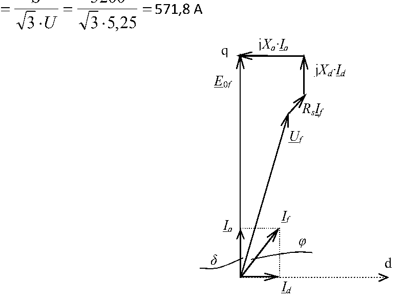

# Zadatak 7 — Struja pobude hidrogeneratora sa istaknutim polovima iz karakteristike praznog hoda

## Postavka

Dat je trofazni sinhroni generator sa istaknutim polovima i poznatim otporom po fazi
$R_{\mathrm{s}} = 0{,}023\ \Omega$, čiji su nazivni podaci: $6{,}5\ \mathrm{MVA}$; $5{,}5\ \mathrm{kV}$;
$50\ \mathrm{Hz}$; $x_{\gamma} = 6\ \%$; $x_{ad} = 40\ \%$; $x_{aq} = 20\ \%$; sprega zvezda (Y).
Karakteristika praznog hoda generatora data je tabelarno za sinhronu brzinu
($I_{\mathrm{p}}$ — struja pobude, $E_0$ — fazna elektromotorna sila):

| $I_{\mathrm{p}}\ [\mathrm{A}]$ | 20 | 50 | 88 | 100 | 120 | 140 | 160 | 180 | 200 |
|---|---|---|---|---|---|---|---|---|---|
| $E_0\ [\mathrm{V}]$ | 860 | 2180 | 3440 | 3660 | 3920 | 4120 | 4280 | 4400 | 4500 |

Odrediti vrednost pobudne struje pri kojoj generator daje $5{,}2\ \mathrm{MVA}$ pri naponu
$U = 5{,}25\ \mathrm{kV}$ i faktoru snage $\cos\varphi = 0{,}8$.

> **Prevod na običan jezik:** Imamo veliki generator (tipičan za hidroelektrane — zato ima
> *istaknute polove*, o tome u teoriji). Znamo mu natpisnu pločicu (snagu, napon, frekvenciju),
> otpor namotaja statora i njegove reaktanse izražene u procentima. Dobili smo i „ličnu kartu"
> njegovog magnetnog kola: tabelu koja kaže koliki napon generator pravi na svojim krajevima kad
> se vrti praznog hoda (bez opterećenja) za razne struje kroz pobudni namotaj na rotoru.
> Pitanje glasi: **koliku jednosmernu struju moramo pustiti kroz pobudni namotaj** da bi generator,
> priključen na mrežu napona $5{,}25\ \mathrm{kV}$, davao prividnu snagu $5{,}2\ \mathrm{MVA}$ uz
> faktor snage $0{,}8$? Odgovor tražimo tako što prvo izračunamo koliku unutrašnju elektromotornu
> silu mašina mora da „proizvede" u tom režimu, a zatim iz tabele očitamo koja pobudna struja daje
> baš toliku elektromotornu silu.

> **Napomena o oznakama:** U originalnoj zbirci se ISTOM oznakom $I_f$ obeležavaju dve potpuno
> različite struje: u tabeli karakteristike praznog hoda $I_f$ je **struja pobude** (jednosmerna
> struja kroz namotaj na rotoru), a u rešenju i na fazorskom dijagramu $I_f$ je **fazna struja
> statora** (naizmenična struja koju generator daje mreži). Da se ne bismo zbunjivali, mi ćemo
> faznu struju statora zvati $I_{\mathrm{f}}$ (indeks „f" kao *fazna*, isto kao na slici 7.1),
> a pobudnu struju $I_{\mathrm{p}}$ (indeks „p" kao *pobuda*). Sve brojne vrednosti su, naravno,
> identične originalu.

## Podaci

| Veličina | Oznaka | Vrednost | Šta ta veličina fizički znači |
|---|---|---|---|
| Nazivna prividna snaga | $S_{\mathrm{n}}$ | $6{,}5\ \mathrm{MVA}$ | Najveća trajno dozvoljena „ukupna" (prividna) snaga koju generator sme da daje; određena je zagrevanjem namotaja. |
| Nazivni napon (linijski) | $U_{\mathrm{n}}$ | $5{,}5\ \mathrm{kV}$ | Napon između dva priključka (linijska vrednost) za koji je mašina projektovana. |
| Nazivna frekvencija | $f$ | $50\ \mathrm{Hz}$ | Frekvencija napona; određuje sinhronu brzinu obrtanja. U računu se ne pojavljuje direktno — samo garantuje da je karakteristika praznog hoda snimljena pri toj (sinhronoj) brzini. |
| Otpor statorskog namotaja po fazi | $R_{\mathrm{s}}$ | $0{,}023\ \Omega$ | Omski (aktivni) otpor jedne faze namotaja statora; pravi mali pad napona i gubitke. |
| Relativna rasipna reaktansa statora | $x_{\gamma}$ | $6\ \% = 0{,}06$ | Predstavlja deo fluksa statora koji se „rasipa" (zatvara oko provodnika, kroz vazduh) i ne stiže do rotora. Ista je za obe ose. |
| Relativna reaktansa reakcije indukta po d-osi | $x_{ad}$ | $40\ \% = 0{,}40$ | Predstavlja fluks koji struja statora pravi duž ose polova (d-osa), gde je vazdušni zazor mali pa je fluks (i reaktansa) velik. |
| Relativna reaktansa reakcije indukta po q-osi | $x_{aq}$ | $20\ \% = 0{,}20$ | Predstavlja fluks koji struja statora pravi između polova (q-osa), gde je zazor veliki pa je reaktansa upola manja. |
| Sprega statora | Y (zvezda) | — | Govori nam da je fazni napon $\sqrt{3}$ puta manji od linijskog: $U_{\mathrm{f}} = U/\sqrt{3}$, a fazna struja jednaka linijskoj. |
| Karakteristika praznog hoda | tabela $E_0(I_{\mathrm{p}})$ | vidi Postavku | „Magnetna lična karta" mašine: koliku faznu elektromotornu silu mašina indukuje u praznom hodu za datu struju pobude, pri sinhronoj brzini. |
| Prividna snaga u posmatranom režimu | $S$ | $5{,}2\ \mathrm{MVA}$ | Opterećenje koje generator treba da daje (nešto manje od nazivnog). |
| Napon mreže (linijski) u posmatranom režimu | $U$ | $5{,}25\ \mathrm{kV}$ | Stvarni napon na krajevima generatora u ovom režimu (mreža ga drži). |
| Faktor snage | $\cos\varphi$ | $0{,}8$ | Kosinus ugla između faznog napona i fazne struje; govori koliki je deo prividne snage aktivna snaga. |

**Tražena veličina:** pobudna struja $I_{\mathrm{p}}$ u opisanom režimu rada.

## Šta se traži i zašto

**Traži se:** struja pobude $I_{\mathrm{p}}$ — jednosmerna struja koja se preko četkica dovodi u
pobudni namotaj na rotoru i pravi glavni magnetni fluks mašine.

**Zašto to inženjera zanima:** Kod sinhronog generatora pobudna struja je *jedina ručica* kojom u
pogonu upravljamo unutrašnjom elektromotornom silom, a preko nje naponom i reaktivnom snagom koju
mašina razmenjuje sa mrežom. Regulator pobude u elektrani mora znati kolika pobuda odgovara kom
opterećenju — upravo to ovde ručno računamo za jedan konkretan režim. Problem je „obrnut" od
trivijalnog: ne možemo pobudnu struju izmeriti iz podataka o opterećenju direktno, nego moramo
prvo rekonstruisati koliku elektromotornu silu mašina iznutra pravi.

**Plan rešavanja (običnim jezikom):**

1. Procentualne (relativne) reaktanse pretvorimo u ome — za to nam treba *bazna impedansa* mašine.
2. Iz zadate snage i napona izračunamo faznu struju statora i fazni napon.
3. Nacrtamo fazorski dijagram mašine sa istaknutim polovima i iz njega ispišemo dve jednačine:
   projekciju svih napona na q-osu i na d-osu.
4. Iz projekcije na d-osu (u kojoj se tražena elektromotorna sila ne pojavljuje!) izračunamo ugao
   snage $\delta$.
5. Sa poznatim $\delta$, iz projekcije na q-osu izračunamo faznu elektromotornu silu praznog hoda
   $E_{0\mathrm{f}}$.
6. Iz tabele karakteristike praznog hoda linearnom interpolacijom očitamo koja pobudna struja
   daje baš tu elektromotornu silu — to je traženi rezultat.

## Potrebna teorija — mini-lekcije

### Mini-lekcija 1: Mašina sa istaknutim polovima i d–q ose

Sinhrona mašina ima na rotoru pobudni namotaj kroz koji teče jednosmerna struja — on pravi glavni
magnetni fluks. Kod **hidrogeneratora** (spori, mnogopolni generatori u hidroelektranama) rotor
nije gladak valjak, već ima **istaknute polove** — polovi štrče kao „pečurke" iz tela rotora.
Posledica: vazdušni zazor između statora i rotora **nije svuda isti**.

Zato uvodimo dve karakteristične ose, koje se obrću zajedno sa rotorom:

- **d-osa** (*direktna*, podužna osa) — pravac kroz sredinu pola. Tu je zazor mali, magnetno
  „lako prohodno".
- **q-osa** (*kvadraturna*, poprečna osa) — pravac kroz međupolni prostor, pomeren za 90
  električnih stepeni od d-ose. Tu je zazor veliki, magnetno „teško prohodno".

Intuicija: zamislite da duvate vazduh kroz uzan levak (d-osa) i kroz široku sobu (q-osa) — isti
trud daje sasvim različit efekat. Ista struja statora napravi duž d-ose mnogo veći fluks nego duž
q-ose. Kod nas je to vidljivo iz podataka: $x_{ad} = 40\ \%$ prema $x_{aq} = 20\ \%$ — d-osa je
duplo „prohodnija".

### Mini-lekcija 2: Sinhrone reaktanse $X_d$ i $X_q$

Struja statora pravi sopstveni fluks, koji se deli na dva dela:

1. **Rasipni fluks** — zatvara se oko samih provodnika statora i ne stiže do rotora. Njemu odgovara
   **rasipna reaktansa** $X_{\gamma}$ (ne zavisi od položaja rotora, ista za obe ose).
2. **Fluks reakcije indukta** — prolazi kroz zazor i rotor, „reaguje" sa glavnim fluksom. Zbog
   nejednakog zazora njemu odgovaraju *dve* reaktanse: $X_{ad}$ za komponentu struje duž d-ose i
   $X_{aq}$ za komponentu duž q-ose.

Ukupno dejstvo struje statora po jednoj osi opisuju **sinhrone reaktanse**:

$$X_d = X_{\gamma} + X_{ad}, \qquad X_q = X_{\gamma} + X_{aq}$$

Isto važi i za relativne vrednosti (jer se sve dele istom baznom impedansom, videti sledeću
lekciju):

$$x_d = x_{\gamma} + x_{ad}, \qquad x_q = x_{\gamma} + x_{aq}$$

Ovo je prvi „skriveni korak" zadatka: u podacima *nisu* date $x_d$ i $x_q$, već njihovi sastojci —
moraćemo prvo da ih saberemo.

### Mini-lekcija 3: Relativne (procentualne) vrednosti i bazna impedansa

Proizvođači reaktanse mašina obično ne navode u omima, nego u **procentima** — kao udeo u tzv.
**baznoj impedansi** mašine. Relativna vrednost je definisana kao:

$$x = \frac{X}{Z_{\mathrm{b}}} \quad \Rightarrow \quad X = x \cdot Z_{\mathrm{b}}$$

gde je $X$ stvarna reaktansa u omima, a $Z_{\mathrm{b}}$ bazna impedansa. Zašto se to radi? Zato
što su relativne vrednosti slične za mašine vrlo različitih veličina (i $500\ \mathrm{kVA}$ i
$500\ \mathrm{MVA}$ mašina imaće $x_d$ reda nekoliko desetina procenata do preko 100 %), pa se iz
prve ruke vidi da li je neka vrednost „normalna".

Bazna impedansa je količnik nazivnog **faznog** napona i nazivne **fazne** struje. Za spregu
zvezda fazni napon je $U_{\mathrm{nf}} = U_{\mathrm{n}}/\sqrt{3}$, a fazna struja je jednaka
linijskoj, $I_{\mathrm{nf}} = S_{\mathrm{n}}/(\sqrt{3}\,U_{\mathrm{n}})$ (to sledi iz izraza za
trofaznu prividnu snagu, videti mini-lekciju 6). Podelimo li ih:

$$Z_{\mathrm{b}} = \frac{U_{\mathrm{nf}}}{I_{\mathrm{nf}}}
= \frac{\dfrac{U_{\mathrm{n}}}{\sqrt{3}}}{\dfrac{S_{\mathrm{n}}}{\sqrt{3}\,U_{\mathrm{n}}}}
= \frac{U_{\mathrm{n}}}{\sqrt{3}} \cdot \frac{\sqrt{3}\,U_{\mathrm{n}}}{S_{\mathrm{n}}}
= \frac{U_{\mathrm{n}}^2}{S_{\mathrm{n}}}$$

Koren $\sqrt{3}$ se skratio — zato je konačna formula tako zgodna: **kvadrat linijskog nazivnog
napona podeljen nazivnom trofaznom prividnom snagom**. Praktična pogodnost: u nju smemo direktno
ubaciti $\mathrm{kV}$ i $\mathrm{MVA}$ i dobiti ome, jer $(10^3)^2/10^6 = 1$.

### Mini-lekcija 4: Karakteristika praznog hoda i zasićenje

**Karakteristika praznog hoda** (karakteristika magnećenja) je zavisnost indukovane fazne
elektromotorne sile $E_0$ od pobudne struje $I_{\mathrm{p}}$, snimljena kada se mašina obrće
sinhronom brzinom, a stator je **otvoren** (nema struje statora, dakle nema ni padova napona —
napon na krajevima je tačno jednak elektromotornoj sili).

Zašto nije prava linija? Elektromotorna sila je srazmerna glavnom fluksu, a fluks raste sa pobudnom
strujom **sve sporije**, jer se gvožđe magnetnog kola **zasićuje** — kao sunđer koji je već skoro
pun vode, pa svaka dodatna kap sve manje pomaže. Pogledajte tabelu: prvih $30\ \mathrm{A}$ pobude
(od 20 do 50) podigne EMS za $1320\ \mathrm{V}$, a poslednjih $20\ \mathrm{A}$ (od 180 do 200)
samo za $100\ \mathrm{V}$.

Upravo zbog zasićenja **ne smemo** EMS preračunati u pobudnu struju prostom proporcijom — moramo
očitati iz tabele. Kada tražena vrednost $E_{0\mathrm{f}}$ padne *između* dva tabelarna reda
$(I_{\mathrm{p},1}, E_{0,1})$ i $(I_{\mathrm{p},2}, E_{0,2})$, koristimo **linearnu interpolaciju**:
između dve susedne tačke krivu zamenimo pravom (duž tako kratkog odsečka kriva je praktično prava)
i sa te prave očitamo:

$$I_{\mathrm{p}} = I_{\mathrm{p},1} + \frac{I_{\mathrm{p},2} - I_{\mathrm{p},1}}{E_{0,2} - E_{0,1}}\,(E_{0\mathrm{f}} - E_{0,1})$$

Rečima: razlomak $\dfrac{I_{\mathrm{p},2} - I_{\mathrm{p},1}}{E_{0,2} - E_{0,1}}$ je nagib prave
„koliko ampera pobude po voltu EMS" na tom odsečku; pomnožimo ga viškom EMS iznad donje tačke i
dodamo pobudnoj struji donje tačke.

### Mini-lekcija 5: Fazorski dijagram mašine sa istaknutim polovima — odakle jednačine

Ovo je srce zadatka, pa idemo polako.

**Zašto elektromotorna sila leži na q-osi.** Pobudni namotaj pravi fluks duž d-ose (kroz sredinu
pola). Elektromotorna sila indukovana u statoru kasni za fluksom koji je indukuje za 90 električnih
stepeni — dakle fazor $\underline{E}_{0\mathrm{f}}$ leži tačno duž **q-ose**. To je razlog zašto se
q-osa uopšte zove „osa elektromotorne sile" i zašto ceo dijagram „kačimo" za nju.

**Naponska jednačina generatora.** Elektromotorna sila $\underline{E}_{0\mathrm{f}}$ je „izvor";
od nje do napona na krajevima $\underline{U}_{\mathrm{f}}$ „potroši" se pad na otporu statora i na
reaktansama. Struju statora razložimo na komponente duž osa,
$\underline{I}_{\mathrm{f}} = \underline{I}_d + \underline{I}_q$, jer svaka komponenta „vidi"
svoju reaktansu (mini-lekcija 1). Naponska jednačina glasi:

$$\underline{E}_{0\mathrm{f}} = \underline{U}_{\mathrm{f}} + R_{\mathrm{s}}\underline{I}_{\mathrm{f}} + \mathrm{j}X_d\underline{I}_d + \mathrm{j}X_q\underline{I}_q$$

Simboli: $\underline{U}_{\mathrm{f}}$ — fazor faznog napona na krajevima; $R_{\mathrm{s}}\underline{I}_{\mathrm{f}}$ —
pad napona na otporu (u fazi sa strujom); $\mathrm{j}X_d\underline{I}_d$ i $\mathrm{j}X_q\underline{I}_q$ —
padovi na sinhronim reaktansama (množenje sa $\mathrm{j}$ znači „zaokreni fazor za $90^{\circ}$
unapred", tj. suprotno kazaljci na satu).

**Uglovi.** Ugao između napona $\underline{U}_{\mathrm{f}}$ i elektromotorne sile
$\underline{E}_{0\mathrm{f}}$ (tj. q-ose) zove se **ugao snage** $\delta$ — on raste sa aktivnim
opterećenjem mašine. Ugao između napona i struje je poznati $\varphi$ (iz faktora snage). Prema
tome, struja $\underline{I}_{\mathrm{f}}$ zaklapa sa q-osom ugao $\delta + \varphi$ — **ne samo**
$\varphi$! Odatle komponente struje:

$$I_q = I_{\mathrm{f}}\cos(\delta + \varphi), \qquad I_d = I_{\mathrm{f}}\sin(\delta + \varphi)$$

Sledeća slika prikazuje ceo taj dijagram za naš režim rada.

**Slika 7.1 —** Fazorski dijagram sinhronog hidrogeneratora u natpobuđenom režimu rada.

> **Kako čitati sliku 7.1:** Fazorski dijagram u d–q koordinatama, crno-beo i principski (nije u razmeri; odsečak teksta iznad dijagrama je ostatak računa fazne struje iz originala, $I_{\mathrm{f}} = S/(\sqrt{3}\,U) = 5200/(\sqrt{3}\cdot 5{,}25) = 571{,}8\ \mathrm{A}$). Horizontalna tačkasta osa sa strelicom udesno je **d-osa**, vertikalni pravac naviše je **q-osa**; svi fazori polaze iz koordinatnog početka (dole levo), uglovi se mere od q-ose, a pozitivan smer rotacije fazora je suprotan kazaljci na satu. **Referentni pravac je q-osa**, jer duž nje leži fazor $\underline{E}_{0\mathrm{f}}$ (duga vertikalna strelica) — veličina koju tražimo, $E_{0\mathrm{f}} = 3881\ \mathrm{V}$. Struje (kratke strelice uz tačkasti pravougaonik razlaganja): $\underline{I}_d$ duž d-ose ($I_d = I_{\mathrm{f}}\sin(\delta+\varphi) = 410{,}2\ \mathrm{A}$), $\underline{I}_q$ duž q-ose ($I_q = I_{\mathrm{f}}\cos(\delta+\varphi) = 398{,}4\ \mathrm{A}$) i njihov zbir $\underline{I}_{\mathrm{f}}$ ($571{,}8\ \mathrm{A}$) po dijagonali — on sa q-osom zaklapa ugao $\delta+\varphi = 45{,}84^{\circ}$. (Napomena o oznakama: na štampanoj slici su q-komponente obeležene indeksom koji u kurzivu liči na „a" — $\underline{I}_a$, $X_a$; to su naše $\underline{I}_q$ i $X_q$.) Naponski lanac: fazor $\underline{U}_{\mathrm{f}}$ (duga kosa strelica; $3031\ \mathrm{V}$) stoji pod uglom $\delta = 8{,}97^{\circ}$ od q-ose; na njegov vrh se nadovezuje kratki $R_{\mathrm{s}}\underline{I}_{\mathrm{f}}$ (paralelan struji; svega $13{,}2\ \mathrm{V}$ — na slici preuveličan da bi se video), zatim $\mathrm{j}X_d\underline{I}_d$ vertikalno naviše ($\underline{I}_d$ zaokrenut za $90^{\circ}$; $X_d I_d = 877{,}8\ \mathrm{V}$) i na kraju $\mathrm{j}X_q\underline{I}_q$ horizontalno ulevo ($\underline{I}_q$ zaokrenut za $90^{\circ}$; $X_q I_q = 482{,}0\ \mathrm{V}$) — lanac se tačno zatvara na vrhu $\underline{E}_{0\mathrm{f}}$ na q-osi. Lučne linije kod početka označavaju uglove: $\delta$ (između q-ose i $\underline{U}_{\mathrm{f}}$) i $\varphi = 36{,}87^{\circ}$ (između $\underline{U}_{\mathrm{f}}$ i $\underline{I}_{\mathrm{f}}$). Šta treba da zaključiš: projekcija ovog lanca na q-osu daje jednačinu (1) za $E_{0\mathrm{f}}$, a projekcija na d-osu jednačinu (2) u kojoj $E_{0\mathrm{f}}$ uopšte nema — zato iz (2) prvo računamo $\delta$, pa tek onda iz (1) elektromotornu silu.

**„Natpobuđen režim"** iz naslova slike znači da je pobuda tolika da je $E_{0\mathrm{f}} > U_{\mathrm{f}}$ —
generator tada, pored aktivne, u mrežu šalje i reaktivnu (induktivnu) snagu. Naš slučaj sa
$\cos\varphi = 0{,}8$ (induktivno, struja kasni za naponom) je upravo takav.

**Projekcije — kako od jedne vektorske jednačine dobijemo dve skalarne.** Vektorska (fazorska)
jednačina je zapravo dve jednačine u jednoj: mora da važi posebno za q-komponente i posebno za
d-komponente svih fazora. Popišimo projekcije svakog sabirka (uglove merimo od q-ose):

| Fazor | q-projekcija | d-projekcija |
|---|---|---|
| $\underline{U}_{\mathrm{f}}$ (ugao $\delta$ od q-ose) | $U_{\mathrm{f}}\cos\delta$ | $U_{\mathrm{f}}\sin\delta$ |
| $R_{\mathrm{s}}\underline{I}_{\mathrm{f}}$ (paralelan struji, ugao $\delta+\varphi$) | $R_{\mathrm{s}}I_{\mathrm{f}}\cos(\delta+\varphi)$ | $R_{\mathrm{s}}I_{\mathrm{f}}\sin(\delta+\varphi)$ |
| $\mathrm{j}X_d\underline{I}_d$ ($\underline{I}_d$ je uz d-osu; posle zaokreta za $90^{\circ}$ legne uz q-osu) | $X_d I_d$ | $0$ |
| $\mathrm{j}X_q\underline{I}_q$ ($\underline{I}_q$ je uz q-osu; posle zaokreta za $90^{\circ}$ legne uz $-$d-osu) | $0$ | $-X_q I_q$ |
| $\underline{E}_{0\mathrm{f}}$ (na q-osi) | $E_{0\mathrm{f}}$ | $0$ |

Sabiranjem desne strane naponske jednačine po q-osi i po d-osi i izjednačavanjem sa projekcijama
$\underline{E}_{0\mathrm{f}}$ dobijamo tri ključne relacije (treća je samo definicija
q-komponente struje, raspisana adicionom formulom iz mini-lekcije 6):

$$U_{\mathrm{f}}\cos\delta + R_{\mathrm{s}}I_{\mathrm{f}}\cos(\delta+\varphi) + X_d I_d = E_{0\mathrm{f}} \qquad (1)$$

$$U_{\mathrm{f}}\sin\delta + R_{\mathrm{s}}I_{\mathrm{f}}\sin(\delta+\varphi) = X_q I_q \qquad (2)$$

$$I_q = I_{\mathrm{f}}\cos(\delta+\varphi) = I_{\mathrm{f}}\cos\delta\cos\varphi - I_{\mathrm{f}}\sin\delta\sin\varphi \qquad (3)$$

U jednačini (2) smo član $-X_q I_q$ prebacili na desnu stranu (promenom znaka), a $E_{0\mathrm{f}}$
se u njoj uopšte ne pojavljuje jer nema d-projekciju. **To je ključni trik zadatka:** jednačina (2)
sadrži samo jednu nepoznatu — ugao $\delta$ (jer se $I_q$ pomoću (3) izrazi preko $\delta$) — pa iz
nje prvo nađemo $\delta$, a tek onda iz (1) izračunamo $E_{0\mathrm{f}}$.

### Mini-lekcija 6: Trofazna snaga i trigonometrija koju koristimo

**Trofazna prividna snaga.** Za trofazni sistem važi $S = 3\,U_{\mathrm{f}}I_{\mathrm{f}}$ (tri
faze, svaka nosi $U_{\mathrm{f}}I_{\mathrm{f}}$). Uz $U_{\mathrm{f}} = U/\sqrt{3}$ (sprega Y):

$$S = 3\cdot\frac{U}{\sqrt{3}}\cdot I_{\mathrm{f}} = \sqrt{3}\,U I_{\mathrm{f}}
\quad\Rightarrow\quad I_{\mathrm{f}} = \frac{S}{\sqrt{3}\,U}$$

**Iz $\cos\varphi$ u $\sin\varphi$ i $\varphi$.** Iz osnovnog identiteta
$\sin^2\varphi + \cos^2\varphi = 1$:

$$\sin\varphi = \sqrt{1 - \cos^2\varphi} = \sqrt{1 - 0{,}8^2} = \sqrt{1 - 0{,}64} = \sqrt{0{,}36} = 0{,}6$$

a sam ugao je $\varphi = \arccos 0{,}8 = 36{,}87^{\circ}$ (čuveni „3–4–5" trougao).

**Adicione formule** (koristimo ih da razbijemo $\sin$ i $\cos$ zbira uglova na poznati $\varphi$
i nepoznati $\delta$):

$$\sin(\delta+\varphi) = \sin\delta\cos\varphi + \cos\delta\sin\varphi, \qquad
\cos(\delta+\varphi) = \cos\delta\cos\varphi - \sin\delta\sin\varphi$$

## Rešenje, korak po korak

### Korak 1: Bazna impedansa

**Zašto ovaj korak:** reaktanse su zadate u procentima; da bismo ih koristili u jednačinama sa
voltima i amperima, moramo ih pretvoriti u ome, a za to nam treba bazna impedansa (mini-lekcija 3).

$$Z_{\mathrm{b}} = \frac{U_{\mathrm{b}}}{I_{\mathrm{b}}} = \frac{U_{\mathrm{nf}}}{I_{\mathrm{nf}}} = \frac{U_{\mathrm{n}}^2}{S_{\mathrm{n}}}$$

Ovde je $U_{\mathrm{b}} = U_{\mathrm{nf}}$ bazni (nazivni fazni) napon, $I_{\mathrm{b}} = I_{\mathrm{nf}}$
bazna (nazivna fazna) struja; jednakost sa $U_{\mathrm{n}}^2/S_{\mathrm{n}}$ izveli smo u
mini-lekciji 3. Uvrstimo kilovolte i megavoltampere (smemo, jer se faktori $10^3$ i $10^6$ potiru):

$$Z_{\mathrm{b}} = \frac{5{,}5^2}{6{,}5} = \frac{30{,}25}{6{,}5} = 4{,}65\ \Omega$$

**Šta smo dobili:** „merilo" impedanse ove mašine — reaktansa od $4{,}65\ \Omega$ za ovu mašinu
znači $100\ \%$. Sve procentualne reaktanse sada množimo ovim brojem.

### Korak 2: Sinhrone reaktanse u omima

**Zašto ovaj korak:** u naponskim jednačinama figurišu ukupne sinhrone reaktanse $X_d$ i $X_q$, a
podaci daju samo njihove sastojke — rasipnu reaktansu i reaktanse reakcije indukta po osama.

Najpre saberemo relativne vrednosti (mini-lekcija 2):

$$x_d = x_{\gamma} + x_{ad} = 0{,}06 + 0{,}40 = 0{,}46$$

$$x_q = x_{\gamma} + x_{aq} = 0{,}06 + 0{,}20 = 0{,}26$$

Zatim ih pretvorimo u ome množenjem baznom impedansom:

$$X_d = x_d \cdot Z_{\mathrm{b}} = 0{,}46 \cdot 4{,}65 = 2{,}14\ \Omega$$

$$X_q = x_q \cdot Z_{\mathrm{b}} = 0{,}26 \cdot 4{,}65 = 1{,}21\ \Omega$$

**Šta smo dobili:** dve reaktanse mašine — očekivano $X_d > X_q$ (skoro duplo), jer je duž pola
(d-osa) magnetni put mnogo „lakši" nego kroz međupolni prostor (q-osa). Da je ispalo obrnuto,
negde smo pogrešili.

### Korak 3: Fazni napon i fazna struja opterećenja

**Zašto ovaj korak:** sve jednačine fazorskog dijagrama pišu se za **fazne** veličine, a zadati su
linijski napon i trofazna snaga.

Fazni napon (sprega Y):

$$U_{\mathrm{f}} = \frac{U}{\sqrt{3}} = \frac{5250}{\sqrt{3}} = 3031\ \mathrm{V}$$

Fazna struja iz trofazne prividne snage (mini-lekcija 6); radimo u $\mathrm{kVA}$ i $\mathrm{kV}$
da bi rezultat izašao u amperima:

$$I_{\mathrm{f}} = \frac{S}{\sqrt{3}\,U} = \frac{5200}{\sqrt{3}\cdot 5{,}25} = \frac{5200}{9{,}093} = 571{,}8\ \mathrm{A}$$

Ugao faktora snage: $\varphi = \arccos 0{,}8 = 36{,}87^{\circ}$, uz $\sin\varphi = 0{,}6$
(mini-lekcija 6).

**Šta smo dobili:** struju koju generator daje mreži u posmatranom režimu. Ona je manja od
nazivne struje ($I_{\mathrm{n}} = S_{\mathrm{n}}/(\sqrt{3}\,U_{\mathrm{n}}) = 682\ \mathrm{A}$,
videti Proveru smisla) — logično, jer je opterećenje $5{,}2\ \mathrm{MVA}$ manje od nazivnih
$6{,}5\ \mathrm{MVA}$, a napon čak malo viši od nazivnog.

### Korak 4: Postavljanje jednačina iz fazorskog dijagrama

**Zašto ovaj korak:** tražena pobudna struja se čita iz karakteristike praznog hoda za poznatu
elektromotornu silu $E_{0\mathrm{f}}$ — a nju možemo dobiti samo iz fazorskog dijagrama (slika 7.1
i mini-lekcija 5). Kako je original lepo formulisao: *na osnovu fazorskog dijagrama se može
odrediti vrednost indukovane elektromotorne sile praznog hoda, na osnovu koje će se, zajedno sa
karakteristikom magnećenja mašine, odrediti potrebna vrednost struje pobude u posmatranom režimu
rada.*

Fazorski dijagram rešavamo projektovanjem na q- i d-osu (izvedeno u mini-lekciji 5):

$$U_{\mathrm{f}}\cos\delta + R_{\mathrm{s}}I_{\mathrm{f}}\cos(\delta+\varphi) + X_d I_d = E_{0\mathrm{f}} \qquad (1)$$

$$U_{\mathrm{f}}\sin\delta + R_{\mathrm{s}}I_{\mathrm{f}}\sin(\delta+\varphi) = X_q I_q \qquad (2)$$

$$I_q = I_{\mathrm{f}}\cos(\delta+\varphi) = I_{\mathrm{f}}\cos\delta\cos\varphi - I_{\mathrm{f}}\sin\delta\sin\varphi \qquad (3)$$

Prebrojimo nepoznate: $\delta$, $E_{0\mathrm{f}}$, $I_d$, $I_q$ — ali $I_d$ i $I_q$ su preko
uglova vezane za poznato $I_{\mathrm{f}}$, pa su prave nepoznate samo $\delta$ i $E_{0\mathrm{f}}$.
Jednačina (1) nam **za sada ne vredi**, jer je u njoj baš $E_{0\mathrm{f}}$ koju tek tražimo.
Zato krećemo od (2): u njoj $E_{0\mathrm{f}}$ nema, pa kad pomoću (3) eliminišemo $I_q$, ostaje
jednačina sa jedinom nepoznatom $\delta$ (formalno dve nepoznate, $\sin\delta$ i $\cos\delta$,
ali njih vezuje ugao $\delta$).

**Šta smo dobili:** jasnu strategiju — (2)+(3) daje $\delta$, zatim (1) daje $E_{0\mathrm{f}}$.

### Korak 5: Ugao snage $\delta$

**Zašto ovaj korak:** bez ugla $\delta$ ne znamo kako da razložimo napon i struju na d- i
q-komponente, pa ne možemo izračunati $E_{0\mathrm{f}}$ iz jednačine (1).

Zamenimo (3) u (2) i raspišimo $\sin(\delta+\varphi)$ adicionom formulom (mini-lekcija 6):

$$U_{\mathrm{f}}\sin\delta + R_{\mathrm{s}}I_{\mathrm{f}}\left(\sin\delta\cos\varphi + \cos\delta\sin\varphi\right)
= X_q I_{\mathrm{f}}\left(\cos\delta\cos\varphi - \sin\delta\sin\varphi\right)$$

Uvrstimo brojeve: $U_{\mathrm{f}} = 5250/\sqrt{3}\ \mathrm{V}$, $R_{\mathrm{s}} = 0{,}023\ \Omega$,
$I_{\mathrm{f}} = 571{,}8\ \mathrm{A}$, $X_q = 1{,}21\ \Omega$, $\cos\varphi = 0{,}8$,
$\sin\varphi = 0{,}6$:

$$\frac{5250}{\sqrt{3}}\sin\delta + 0{,}023\cdot 571{,}8\cdot 0{,}8\sin\delta + 0{,}023\cdot 571{,}8\cdot 0{,}6\cos\delta
= 1{,}21\cdot 571{,}8\cdot 0{,}8\cos\delta - 1{,}21\cdot 571{,}8\cdot 0{,}6\sin\delta$$

Izračunajmo svaki koeficijent posebno:

$$\begin{aligned}
\frac{5250}{\sqrt{3}} &= 3031{,}1 \\
0{,}023\cdot 571{,}8\cdot 0{,}8 &= 10{,}52 \\
0{,}023\cdot 571{,}8\cdot 0{,}6 &= 7{,}89 \\
1{,}21\cdot 571{,}8\cdot 0{,}8 &= 553{,}50 \\
1{,}21\cdot 571{,}8\cdot 0{,}6 &= 415{,}13
\end{aligned}$$

pa jednačina glasi:

$$3031{,}1\sin\delta + 10{,}52\sin\delta + 7{,}89\cos\delta = 553{,}50\cos\delta - 415{,}13\sin\delta$$

Sve članove sa $\sin\delta$ prebacimo na levu, sve sa $\cos\delta$ na desnu stranu (pri prebacivanju
menjaju znak):

$$\left(3031{,}1 + 10{,}52 + 415{,}13\right)\sin\delta = \left(553{,}50 - 7{,}89\right)\cos\delta$$

$$3456{,}7\sin\delta = 545{,}6\cos\delta$$

Podelimo obe strane sa $3456{,}7\cos\delta$ (smemo — $\cos\delta \neq 0$ jer je $\delta$ mali
ugao) i iskoristimo $\dfrac{\sin\delta}{\cos\delta} = \operatorname{tg}\delta$:

$$\operatorname{tg}\delta = \frac{545{,}6}{3456{,}7} = 0{,}1578
\quad\Rightarrow\quad
\delta = \operatorname{arctg}\!\left(\frac{545{,}6}{3456{,}7}\right) = 8{,}97^{\circ}$$

**Šta smo dobili:** ugao snage od svega $8{,}97^{\circ}$. To je mali, sasvim tipičan ugao za
umereno opterećen generator — ugao snage retko prelazi $30^{\circ}$ u normalnom pogonu (granica
stabilnosti je ispod $90^{\circ}$).

### Korak 6: Elektromotorna sila praznog hoda $E_{0\mathrm{f}}$

**Zašto ovaj korak:** sada kada znamo $\delta$, jednačina (1) postaje običan zbir poznatih brojeva
— a $E_{0\mathrm{f}}$ je upravo veličina sa kojom ulazimo u karakteristiku praznog hoda.

U jednačinu (1) uvrstimo $I_d = I_{\mathrm{f}}\sin(\delta+\varphi)$ (projekcija struje na d-osu,
mini-lekcija 5):

$$E_{0\mathrm{f}} = U_{\mathrm{f}}\cos\delta + R_{\mathrm{s}}I_{\mathrm{f}}\cos(\delta+\varphi) + X_d I_{\mathrm{f}}\sin(\delta+\varphi)$$

Zbir uglova je $\delta + \varphi = 8{,}97^{\circ} + 36{,}87^{\circ} = 45{,}84^{\circ}$, pa:

$$E_{0\mathrm{f}} = \frac{5250}{\sqrt{3}}\cos 8{,}97^{\circ} + 0{,}023\cdot 571{,}8\cdot\cos\!\left(36{,}87^{\circ} + 8{,}97^{\circ}\right) + 2{,}14\cdot 571{,}8\cdot\sin\!\left(36{,}87^{\circ} + 8{,}97^{\circ}\right)$$

Izračunajmo član po član (trigonometrijske vrednosti: $\cos 8{,}97^{\circ} = 0{,}9878$,
$\cos 45{,}84^{\circ} = 0{,}6967$, $\sin 45{,}84^{\circ} = 0{,}7174$):

$$\begin{aligned}
U_{\mathrm{f}}\cos\delta &= 3031{,}1 \cdot 0{,}9878 = 2994{,}0\ \mathrm{V} \\
R_{\mathrm{s}}I_{\mathrm{f}}\cos(\delta+\varphi) &= 0{,}023\cdot 571{,}8\cdot 0{,}6967 = 13{,}15\cdot 0{,}6967 = 9{,}2\ \mathrm{V} \\
X_d I_{\mathrm{f}}\sin(\delta+\varphi) &= 2{,}14\cdot 571{,}8\cdot 0{,}7174 = 1223{,}7\cdot 0{,}7174 = 877{,}8\ \mathrm{V}
\end{aligned}$$

$$E_{0\mathrm{f}} = 2994{,}0 + 9{,}2 + 877{,}8 = 3881\ \mathrm{V}$$

**Šta smo dobili:** faznu elektromotornu silu koju mašina mora iznutra da indukuje. Ona je za oko
$28\ \%$ veća od faznog napona ($3881 > 3031$) — mašina je **natpobuđena**, tačno kako naslov
slike 7.1 najavljuje. Primetite i koliko je član sa $R_{\mathrm{s}}$ sićušan ($9{,}2\ \mathrm{V}$
od ukupno $3881\ \mathrm{V}$, oko $0{,}24\ \%$) — kod velikih mašina otpor statora je skoro
zanemarljiv, ali ga ovde uredno vodimo jer je zadat.

### Korak 7: Interpolacija — pobudna struja

**Zašto ovaj korak:** karakteristika praznog hoda je zadata tabelom, a naša vrednost
$E_{0\mathrm{f}} = 3881\ \mathrm{V}$ ne postoji u tabeli — pada **između** redova
$(100\ \mathrm{A},\ 3660\ \mathrm{V})$ i $(120\ \mathrm{A},\ 3920\ \mathrm{V})$. Zato između te
dve tačke linearno interpolujemo (mini-lekcija 4).

Formula interpolacije sa $I_{\mathrm{p},1} = 100\ \mathrm{A}$, $E_{0,1} = 3660\ \mathrm{V}$,
$I_{\mathrm{p},2} = 120\ \mathrm{A}$, $E_{0,2} = 3920\ \mathrm{V}$:

$$I_{\mathrm{p}} = \frac{120 - 100}{3920 - 3660}\left(3881 - 3660\right) + 100$$

Sredimo razlomak i zagradu:

$$I_{\mathrm{p}} = \frac{20}{260}\cdot 221 + 100 = 0{,}0769\cdot 221 + 100 = 17{,}0 + 100 = 117\ \mathrm{A}$$

**Šta smo dobili:** konačan odgovor — pobudna struja od $117\ \mathrm{A}$. Rezultat je razumno
smešten između $100$ i $120\ \mathrm{A}$, bliže $120$ (jer je $3881$ bliže $3920$ nego $3660$),
baš kako interpolacija i treba da se ponaša.

## Česte greške i zamke

1. **Zaboravljena rasipna reaktansa:** u podacima stoje $x_{ad} = 40\ \%$ i $x_{aq} = 20\ \%$, pa
   student požuri i uzme $X_d = 0{,}40\cdot Z_{\mathrm{b}}$. Pogrešno! Sinhrona reaktansa je zbir
   rasipne i reaktanse reakcije indukta: $x_d = 0{,}06 + 0{,}40 = 0{,}46$ i
   $x_q = 0{,}06 + 0{,}20 = 0{,}26$. Greška od $6\ \%$ u reaktansi ovde znatno pomeri
   $E_{0\mathrm{f}}$, a time i očitanu pobudnu struju.
2. **Mešanje linijskih i faznih vrednosti:** tabela karakteristike praznog hoda daje **faznu** EMS,
   pa i $E_{0\mathrm{f}}$ moramo računati sa **faznim** naponom $U_{\mathrm{f}} = 5250/\sqrt{3}$.
   Ko u jednačine ubaci linijskih $5250\ \mathrm{V}$, dobije „EMS" od preko $6\,\mathrm{kV}$ koja
   uopšte ne postoji u tabeli — i tu treba da se upali alarm.
3. **Dve struje sa istom oznakom:** u originalnoj zbirci je $I_f$ i fazna struja statora
   ($571{,}8\ \mathrm{A}$) i pobudna struja (tražena, $117\ \mathrm{A}$). To su fizički potpuno
   različite struje — jedna naizmenična u statoru, druga jednosmerna u rotoru — i ni u jednom
   koraku se ne smeju pomešati.
4. **Pogrešan ugao struje:** struja zaklapa sa q-osom ugao $\delta + \varphi$, a **ne** samo
   $\varphi$ — ugao $\varphi$ se meri od *napona*, koji je i sam zakrenut za $\delta$ od q-ose.
   Ko napiše $I_d = I_{\mathrm{f}}\sin\varphi$, dobiće pogrešne komponente.
5. **Prosta proporcija umesto interpolacije iz tabele:** magnetno kolo je zasićeno, pa EMS *nije*
   srazmerna pobudnoj struji. Ko bi iz prve tačke tabele izveo „$43\ \mathrm{V}$ po amperu" i
   računao $3881/43 = 90\ \mathrm{A}$, promašio bi tačan rezultat za skoro $30\ \mathrm{A}$.
   Interpolira se **lokalno**, između dve susedne tačke oko tražene vrednosti.
6. **Kalkulator u pogrešnom režimu:** uglovi su ovde u stepenima ($8{,}97^{\circ}$,
   $36{,}87^{\circ}$); kalkulator podešen na radijane daje besmislene sinuse i kosinuse.

## Rezime rezultata

| Veličina | Oznaka | Vrednost |
|---|---|---|
| Bazna impedansa | $Z_{\mathrm{b}}$ | $4{,}65\ \Omega$ |
| Sinhrona reaktansa po d-osi | $X_d$ | $2{,}14\ \Omega$ |
| Sinhrona reaktansa po q-osi | $X_q$ | $1{,}21\ \Omega$ |
| Fazna struja statora | $I_{\mathrm{f}}$ | $571{,}8\ \mathrm{A}$ |
| Ugao snage | $\delta$ | $8{,}97^{\circ}$ |
| Fazna EMS praznog hoda | $E_{0\mathrm{f}}$ | $3881\ \mathrm{V}$ |
| **Pobudna struja (traženo)** | $I_{\mathrm{p}}$ | $\mathbf{117\ A}$ |

## Provera smisla

1. **Dimenziona provera:** svaki sabirak u jednačinama (1) i (2) je napon:
   $[\Omega]\cdot[\mathrm{A}] = [\mathrm{V}]$ (padovi $R_{\mathrm{s}}I_{\mathrm{f}}$, $X_d I_d$,
   $X_q I_q$) i $[\mathrm{V}]$ (projekcije $U_{\mathrm{f}}$) — sve se sabira u voltima, kako i mora.

2. **Poređenje sa nazivnim vrednostima:** nazivna struja statora je
   $I_{\mathrm{n}} = \dfrac{S_{\mathrm{n}}}{\sqrt{3}\,U_{\mathrm{n}}} = \dfrac{6{,}5\cdot 10^{6}}{\sqrt{3}\cdot 5500} = 682\ \mathrm{A}$.
   Naša struja $571{,}8\ \mathrm{A}$ je ispod nazivne — očekivano, jer mašina nosi
   $5{,}2\ \mathrm{MVA} < 6{,}5\ \mathrm{MVA}$ pri naponu malo iznad nazivnog. Takođe,
   $E_{0\mathrm{f}}/U_{\mathrm{f}} = 3881/3031 = 1{,}28 > 1$ potvrđuje natpobuđen režim sa slike
   7.1 — konzistentno sa induktivnim $\cos\varphi = 0{,}8$.

3. **Unutrašnja provera dijagrama (nezavisna od izvođenja):** komponente struje su
   $I_d = 571{,}8\cdot\sin 45{,}84^{\circ} = 410{,}2\ \mathrm{A}$ i
   $I_q = 571{,}8\cdot\cos 45{,}84^{\circ} = 398{,}4\ \mathrm{A}$; zaista je
   $\sqrt{410{,}2^2 + 398{,}4^2} = 571{,}8\ \mathrm{A}$ — komponente vraćaju polaznu struju.
   Uvrstimo li dobijeno $\delta$ nazad u jednačinu (2):
   leva strana $= 3031{,}1\cdot\sin 8{,}97^{\circ} + 13{,}15\cdot\sin 45{,}84^{\circ} = 472{,}6 + 9{,}4 = 482{,}0\ \mathrm{V}$,
   desna strana $= 1{,}21\cdot 398{,}4 = 482{,}0\ \mathrm{V}$ — jednačina je zadovoljena, ugao je
   dobro izračunat.

4. **Položaj rezultata na karakteristici:** $E_{0\mathrm{f}} = 3881\ \mathrm{V}$ pada između
   tabelarnih $3660\ \mathrm{V}$ i $3920\ \mathrm{V}$, pa i rezultat $117\ \mathrm{A}$ mora ležati
   između $100$ i $120\ \mathrm{A}$ — i leži, bliže gornjoj granici, u skladu sa tim što je
   $3881$ bliže $3920$. Interpolacija je, dakle, upotrebljena u važećem opsegu (nema
   ekstrapolacije van tabele).
