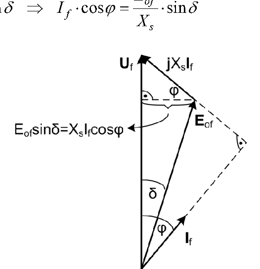
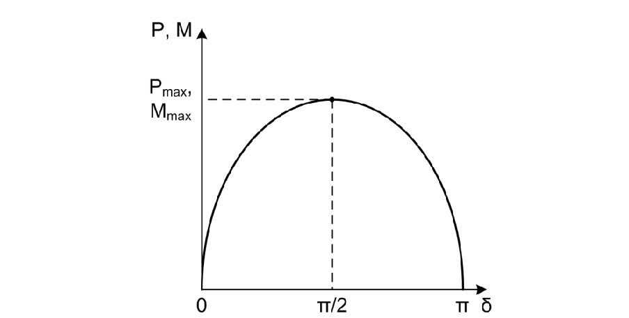
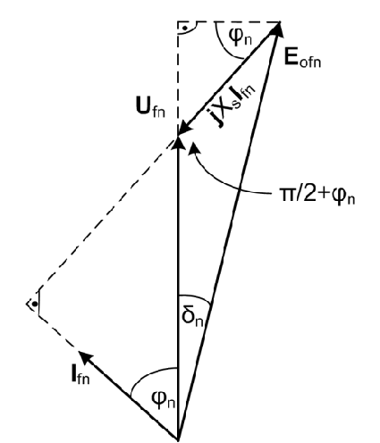
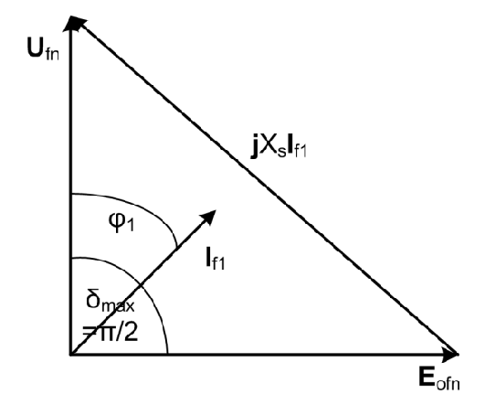

# Zadatak 10 — Maksimalni mogući moment i struja sinhronog motora pri nazivnom naponu i nazivnoj pobudi

## Postavka

Trofazni šestopolni sinhroni motor ulazne snage $5\ \mathrm{MVA}$, predviđen za napon $11\ \mathrm{kV}$, sprege Y (zvezda), radi na mreži učestanosti $50\ \mathrm{Hz}$ sa nazivnim faktorom snage $\cos\varphi_{\mathrm{n}} = 0{,}8$. Sinhrona reaktansa mašine je $X_{\mathrm{s}} = 14{,}5\ \Omega$, a omski otpor statorskog namotaja je zanemariv.

Koliki je **maksimalni mogući moment** koji ovaj motor može da razvije pri nazivnom naponu i nazivnoj vrednosti pobudne struje? Kolika će **tada biti struja motora**?

> **Prevod na običan jezik:** Imamo veliki sinhroni motor (5 MVA je snaga reda jedne manje fabrike). Motor je priključen na mrežu nazivnog napona i pobuđen je tačno onoliko koliko je pobuđen u svom nazivnom (kataloškom) radnom režimu — ništa ne "pojačavamo". Pitamo se: ako teret na vratilu počne da raste, do kog najvećeg momenta motor može da izdrži pre nego što "ispadne iz koraka" sa mrežom? I drugo: dok razvija taj najveći moment, koliku struju vuče iz mreže — da li je ona opasno veća od nazivne?

## Podaci

| Veličina | Oznaka | Vrednost | Šta ta veličina fizički znači |
|---|---|---|---|
| Nazivna prividna (ulazna) snaga | $S_{\mathrm{n}}$ | $5\ \mathrm{MVA}$ | Ukupna "prividna" snaga koju motor uzima iz mreže u nazivnom režimu; obuhvata i aktivnu i reaktivnu komponentu. |
| Nazivni napon (linijski) | $U_{\mathrm{n}}$ | $11\ \mathrm{kV}$ | Efektivna vrednost napona **između dva fazna provodnika** mreže na koju je motor priključen. |
| Sprega statorskog namotaja | — | Y (zvezda) | Tri fazna namotaja spojena u zajedničku (zvezdinu) tačku; posledica: fazni napon je $\sqrt{3}$ puta manji od linijskog, a fazna struja jednaka linijskoj. |
| Učestanost mreže | $f$ | $50\ \mathrm{Hz}$ | Broj perioda naizmeničnog napona u sekundi; određuje brzinu obrtnog polja. |
| Broj polova | $2p$ | $6$ (tj. $p = 3$ pari polova) | Koliko magnetnih polova (naizmenično N i S) ima mašina po obimu; više polova → sporija mašina. |
| Nazivni faktor snage | $\cos\varphi_{\mathrm{n}}$ | $0{,}8$ | Kosinus faznog pomeraja između napona i struje u nazivnom režimu; govori koliki deo prividne snage je aktivna (korisna) snaga. |
| Sinhrona reaktansa | $X_{\mathrm{s}}$ | $14{,}5\ \Omega$ | Ukupna reaktansa po fazi kojom model mašine "vidi" mrežu (reaktansa reakcije indukta + rasipna reaktansa statora). |
| Omski otpor statora | $R_{\mathrm{s}}$ | $\approx 0$ | Otpor statorskog namotaja; kod velikih mašina je toliko mali u odnosu na $X_{\mathrm{s}}$ da ga zanemarujemo. |

**Napomena o oznakama (važno!):** U ovom zadatku indeks "f" u oznakama $U_{\mathrm{f}}$, $I_{\mathrm{f}}$, $E_{0\mathrm{f}}$ znači **"fazna vrednost"** (po jednoj fazi namotaja), a **ne** pobudna struja! Pobudna (jednosmerna, rotorska) struja se označava sa $I_{\mathrm{p}}$ i u ovom zadatku se nigde ne računa brojčano — ona je zadata posredno, uslovom "nazivna vrednost pobudne struje".

## Šta se traži i zašto

**1) Maksimalni mogući moment $M_{\mathrm{max}}$.** Sinhroni motor ne može da razvije proizvoljno veliki moment: postoji granica (tzv. *prevalni moment*) iznad koje motor više ne može da prati obrtno polje mreže — kaže se da "ispada iz sinhronizma". Tada se rotor naglo uspori, struje skoče, i motor mora hitno da se isključi. Inženjera ovaj broj zanima jer određuje **preopteretljivost** motora: koliko puta veći teret od nazivnog motor može (kratkotrajno) da podnese, npr. tokom udarnog opterećenja ili poremećaja u mreži.

**2) Struja motora $I_{\mathrm{f1}}$ u tom režimu.** Kada motor razvija maksimalni moment, struja koju vuče iz mreže je znatno veća od nazivne. Taj podatak je ključan za dimenzionisanje zaštite (releja, osigurača) i za procenu koliko dugo motor sme da ostane u takvom režimu pre nego što se pregreje.

**Plan rešavanja (u 5 koraka, običnim jezikom):**
1. Iz učestanosti i broja polova izračunamo **sinhronu brzinu obrtanja** — brzinu kojom se rotor uvek obrće.
2. Iz nazivne snage i napona izračunamo **nazivnu struju** motora.
3. Iz vektorskog dijagrama za nazivni režim, pomoću **kosinusne teoreme**, izračunamo indukovanu elektromotornu silu praznog hoda $E_{0\mathrm{fn}}$ — ona je "otisak" nazivne pobudne struje i ostaje ista dok pobudu ne menjamo.
4. Uvrstimo sve u izraz za **maksimalni moment** (koji ćemo prethodno izvesti u teorijskom delu): maksimum se dostiže kada ugao opterećenja poraste do $\delta = \pi/2$.
5. Iz vektorskog dijagrama za $\delta = \pi/2$, pomoću **Pitagorine teoreme**, izračunamo struju motora u tom graničnom režimu.

## Potrebna teorija — mini-lekcije

### Mini-lekcija 1: Sinhroni motor i sinhrona brzina

Sinhrona mašina je mašina naizmenične struje kod koje se rotor obrće **tačno istom brzinom kao obrtno magnetno polje statora** — otuda ime "sinhrona". Na rotoru se nalazi pobudni namotaj kroz koji teče jednosmerna pobudna struja $I_{\mathrm{p}}$; ona pravi rotorsko magnetno polje koje se "zakači" za obrtno polje statora i rotor ga prati bez klizanja.

Obrtno polje statora obrne se za jedan pun mehanički krug za onoliko perioda mrežnog napona koliko mašina ima **pari polova** $p$. Zato je sinhrona brzina:

$$n_{\mathrm{s}} = \frac{60 \cdot f}{p}\ \left[\mathrm{ob/min}\right], \qquad \omega_{\mathrm{sm}} = \frac{2\pi f}{p}\ \left[\mathrm{rad/s}\right]$$

gde je:
- $f$ — učestanost mreže,
- $p$ — broj **pari** polova (pazi: šestopolna mašina ima $2p = 6$, dakle $p = 3$),
- $n_{\mathrm{s}}$ — sinhrona brzina u obrtajima u minuti,
- $\omega_{\mathrm{sm}}$ — sinhrona **mehanička ugaona brzina** u radijanima u sekundi (indeks "sm" = sinhrona mehanička).

**Intuicija:** dvopolna mašina ($p=1$) na 50 Hz obrće se 3000 ob/min; svaki dodatni par polova "deli" tu brzinu, pa naša šestopolna mašina ide tri puta sporije. Razlikuj $\omega_{\mathrm{sm}}$ od **električne** ugaone učestanosti $\omega = 2\pi f = 314{,}16\ \mathrm{rad/s}$ — one su jednake samo za $p = 1$.

### Mini-lekcija 2: Sprega Y — fazne i linijske veličine

Kod sprege u zvezdu (Y) tri fazna namotaja su jednim krajem spojena u zajedničku tačku. Posledice:

$$U_{\mathrm{f}} = \frac{U}{\sqrt{3}}, \qquad I_{\mathrm{f}} = I$$

gde je $U$ linijski (međufazni) napon, $U_{\mathrm{f}}$ fazni napon (na jednom namotaju), $I$ linijska i $I_{\mathrm{f}}$ fazna struja. Trofazna prividna snaga je:

$$S = 3 \cdot U_{\mathrm{f}} \cdot I_{\mathrm{f}} = \sqrt{3} \cdot U \cdot I$$

(prvi oblik: tri faze puta snaga jedne faze; drugi oblik dobijamo uvrštavanjem $U_{\mathrm{f}} = U/\sqrt{3}$, jer je $3/\sqrt{3} = \sqrt{3}$). Aktivna snaga je $P = S\cos\varphi$. Sve formule sa vektorskog dijagrama pišemo za **jednu fazu**, pa u njima figurišu fazne vrednosti — zato ćemo linijski napon $11\ \mathrm{kV}$ uvek prvo podeliti sa $\sqrt{3}$.

### Mini-lekcija 3: Model sinhrone mašine sa cilindričnim rotorom

Kod mašine sa **cilindričnim rotorom** (gladak rotor, ravnomeran vazdušni zazor — tipično turbomašine) jedna faza statora se modeluje vrlo jednostavno: idealan naponski izvor $E_{0\mathrm{f}}$ na red sa sinhronom reaktansom $X_{\mathrm{s}}$ (otpor $R_{\mathrm{s}}$ zanemarujemo).

- $E_{0\mathrm{f}}$ — **indukovana elektromotorna sila praznog hoda** (po fazi): napon koji rotorsko polje indukuje u statorskom namotaju. Zove se "praznog hoda" jer bi se upravo ona izmerila na krajevima mašine kada kroz stator ne teče struja. Njena vrednost zavisi od pobudne struje (v. mini-lekciju 6).
- $X_{\mathrm{s}}$ — **sinhrona reaktansa**: objedinjuje reaktansu reakcije indukta (uticaj statorskih struja na polje) i rasipnu reaktansu statora.

Za **motorski režim** (mreža napaja mašinu; prijemnička konvencija) naponska jednačina po fazi glasi:

$$\overline{U}_{\mathrm{f}} = \overline{E}_{0\mathrm{f}} + j X_{\mathrm{s}} \overline{I}_{\mathrm{f}}$$

Crtice iznad simbola označavaju **fazore** — kompleksne brojeve koji nose i efektivnu vrednost i fazni stav prostoperiodične veličine. Množenje fazora imaginarnom jedinicom $j$ znači obrtanje tog fazora za $90°$ unapred; zato je pad napona $jX_{\mathrm{s}}\overline{I}_{\mathrm{f}}$ uvek **normalan (pod 90°)** na fazor struje.

### Mini-lekcija 4: Vektorski (fazorski) dijagram i uglovi $\varphi$ i $\delta$

Naponsku jednačinu najlakše "vidimo" kada je nacrtamo: svaki fazor je strelica čija dužina odgovara efektivnoj vrednosti, a ugao faznom stavu. U dijagramu se pojavljuju dva ključna ugla:

- $\varphi$ — ugao između fazora napona $\overline{U}_{\mathrm{f}}$ i struje $\overline{I}_{\mathrm{f}}$ (fazni stav; njegov kosinus je faktor snage);
- $\delta$ — **ugao opterećenja**: ugao između fazora napona $\overline{U}_{\mathrm{f}}$ i elektromotorne sile $\overline{E}_{0\mathrm{f}}$. Fizički, $\delta$ meri koliko je magnetna osa rotora "zaostala" (kod motora) za obrtnim poljem mreže. Neopterećen motor ima $\delta \approx 0$; što je teret veći, $\delta$ je veći — rotor se "elastično" zateže za poljem, kao dve magnetne igle vezane oprugom.

Prema pobudi razlikujemo dva karakteristična stanja:
- **potpobuđen** motor ($E_{0\mathrm{f}}$ relativno mala): struja kasni za naponom, motor **uzima** reaktivnu snagu iz mreže (ponaša se induktivno);
- **natpobuđen** motor ($E_{0\mathrm{f}}$ velika): struja prednjači naponu, motor **daje** reaktivnu snagu mreži (ponaša se kapacitivno). Sinhroni motori se u praksi najčešće vode natpobuđeno, jer tako usput popravljaju faktor snage postrojenja.

Sledeća slika prikazuje vektorski dijagram sinhronog motora u potpobuđenom režimu. Čitaj je ovako: fazor napona $\mathbf{U}_{\mathrm{f}}$ je nacrtan vertikalno (on je referenca); struja $\mathbf{I}_{\mathrm{f}}$ kasni za njim za ugao $\varphi$; elektromotorna sila $\mathbf{E}_{0\mathrm{f}}$ zaostaje za naponom za ugao opterećenja $\delta$; mali fazor $j X_{\mathrm{s}}\mathbf{I}_{\mathrm{f}}$ (normalan na struju) spaja vrh $\mathbf{E}_{0\mathrm{f}}$ sa vrhom $\mathbf{U}_{\mathrm{f}}$ — tako da se jednačina $\overline{U}_{\mathrm{f}} = \overline{E}_{0\mathrm{f}} + jX_{\mathrm{s}}\overline{I}_{\mathrm{f}}$ "zatvara". Isprekidana horizontalna kota pokazuje ključnu geometrijsku jednakost $E_{0\mathrm{f}}\sin\delta = X_{\mathrm{s}}I_{\mathrm{f}}\cos\varphi$, koju ćemo odmah izvesti.

**Slika 10.1 —** Vektorski dijagram električnih sila sinhronog motora (primer: potpobuđen režim, reaktivna snaga $Q$ se troši).

### Mini-lekcija 5: Ugaona karakteristika snage i momenta — izvođenje

Ovo je centralna teorija zadatka; original je izlaže unutar rešenja, a mi ćemo je ovde izvesti polako, korak po korak.

**Korak A — moment iz snage.** Mehanički moment svake mašine jednak je odnosu mehaničke snage i mehaničke ugaone brzine obrtanja rotora:

$$M = \frac{P_{\mathrm{m}}}{\omega_{\mathrm{m}}}$$

To je samo definicija snage obrtnog kretanja ($P = M\omega$), preuređena po $M$. Ako gubitke u mašini zanemarimo, sva električna aktivna snaga koju motor uzme iz mreže postaje mehanička: $P_{\mathrm{m}} \approx P_{\mathrm{el}}$. Rotor sinhrone mašine se uvek obrće sinhronom brzinom, $\omega_{\mathrm{m}} = \omega_{\mathrm{sm}}$, pa:

$$M = \frac{P_{\mathrm{el}}}{\omega_{\mathrm{sm}}}$$

**Korak B — aktivna snaga.** Električna aktivna snaga trofaznog sinhronog motora je (tri faze, svaka $U_{\mathrm{f}}I_{\mathrm{f}}\cos\varphi$):

$$P_{\mathrm{el}} = P = 3 \cdot U_{\mathrm{f}} \cdot I_{\mathrm{f}} \cdot \cos\varphi$$

**Korak C — geometrijska veza sa dijagrama.** Projektujmo naponsku jednačinu $\overline{U}_{\mathrm{f}} = \overline{E}_{0\mathrm{f}} + jX_{\mathrm{s}}\overline{I}_{\mathrm{f}}$ na pravac **normalan** na fazor $\overline{U}_{\mathrm{f}}$ (na horizontalu, ako je $\overline{U}_{\mathrm{f}}$ vertikalan kao na slici 10.1). Fazor $\overline{U}_{\mathrm{f}}$ na svoj normalni pravac nema nikakvu projekciju (nula). Znači, horizontalne projekcije preostala dva sabirka moraju da se poništavaju, tj. da budu jednake po veličini:

- horizontalna projekcija fazora $\overline{E}_{0\mathrm{f}}$, koji sa $\overline{U}_{\mathrm{f}}$ zaklapa ugao $\delta$, iznosi $E_{0\mathrm{f}}\sin\delta$;
- fazor $jX_{\mathrm{s}}\overline{I}_{\mathrm{f}}$ je normalan na struju, a struja sa naponom zaklapa ugao $\varphi$; zato $jX_{\mathrm{s}}\overline{I}_{\mathrm{f}}$ sa horizontalom zaklapa ugao $\varphi$, pa je njegova horizontalna projekcija $X_{\mathrm{s}}I_{\mathrm{f}}\cos\varphi$.

Izjednačavanjem (upravo ono što kota na slici 10.1 prikazuje):

$$X_{\mathrm{s}} \cdot I_{\mathrm{f}} \cdot \cos\varphi = E_{0\mathrm{f}} \cdot \sin\delta \quad\Rightarrow\quad I_{\mathrm{f}} \cdot \cos\varphi = \frac{E_{0\mathrm{f}}}{X_{\mathrm{s}}} \cdot \sin\delta$$

**Korak D — snaga i moment u funkciji ugla opterećenja.** Uvrstimo dobijeni proizvod $I_{\mathrm{f}}\cos\varphi$ u izraz za snagu:

$$P = 3 \cdot U_{\mathrm{f}} \cdot I_{\mathrm{f}} \cdot \cos\varphi = 3 \cdot U_{\mathrm{f}} \cdot \frac{E_{0\mathrm{f}}}{X_{\mathrm{s}}} \cdot \sin\delta = \frac{3 \cdot U_{\mathrm{f}} \cdot E_{0\mathrm{f}}}{X_{\mathrm{s}}} \cdot \sin\delta$$

a zatim podelimo sa $\omega_{\mathrm{sm}}$ (korak A):

$$M = \frac{3 \cdot U_{\mathrm{f}} \cdot E_{0\mathrm{f}}}{\omega_{\mathrm{sm}} \cdot X_{\mathrm{s}}} \cdot \sin\delta$$

Ovo je **ugaona karakteristika** sinhrone mašine sa cilindričnim rotorom: pri konstantnom naponu, pobudi i učestanosti, snaga i moment zavise od ugla opterećenja kao čist sinus.

Sledeća slika prikazuje tu zavisnost. Čitaj je ovako: na horizontalnoj osi je ugao opterećenja $\delta$ od $0$ do $\pi$, na vertikalnoj snaga $P$ i moment $M$ (isti oblik krive, samo različita razmera); kriva je sinusoida koja raste do temena u $\delta = \pi/2$, gde dostiže $P_{\mathrm{max}}$ odnosno $M_{\mathrm{max}}$, pa opada.

**Slika 10.2 —** Zavisnost aktivne snage i momenta turbogeneratora (mašine sa cilindričnim rotorom) od ugla opterećenja.

Pošto je $\sin\delta \le 1$, a jednakost važi za $\delta = \pi/2$, **maksimalni mogući moment** (i snaga) pri nazivnom naponu i nazivnoj pobudi iznose:

$$P_{\mathrm{max}} = \frac{3 \cdot U_{\mathrm{fn}} \cdot E_{0\mathrm{fn}}}{X_{\mathrm{s}}}, \qquad M_{\mathrm{max}} = \frac{3 \cdot U_{\mathrm{fn}} \cdot E_{0\mathrm{fn}}}{\omega_{\mathrm{sm}} \cdot X_{\mathrm{s}}}$$

**Fizičko značenje maksimuma (statička stabilnost):** dok je $\delta < \pi/2$, svako povećanje tereta povećava $\delta$, a time i razvijeni moment — mašina nađe novu ravnotežu. Ako teret zahteva moment veći od $M_{\mathrm{max}}$, povećanje $\delta$ preko $\pi/2$ moment **smanjuje**, ravnoteže više nema, rotor sve više zaostaje i motor **ispada iz sinhronizma**. Zato se $M_{\mathrm{max}}$ zove i *prevalni moment* — granica statičke stabilnosti.

### Mini-lekcija 6: Zašto nazivna pobudna struja određuje $E_{0\mathrm{fn}}$

Elektromotorna sila praznog hoda potiče od rotorskog (pobudnog) polja: veća pobudna struja → jače polje → veća $E_{0\mathrm{f}}$. Pri konstantnoj učestanosti i zanemarenom zasićenju gvožđa, $E_{0\mathrm{f}}$ je praktično **srazmerna pobudnoj struji**. Zato uslov iz zadatka "pobudna struja ima nazivnu vrednost" znači: $E_{0\mathrm{f}}$ ima tačno onu vrednost $E_{0\mathrm{fn}}$ koju ima u nazivnom radnom režimu. Tu vrednost ne znamo unapred, ali je možemo **izračunati iz nazivnog režima** (nazivni napon, nazivna struja, nazivni $\cos\varphi$) pomoću vektorskog dijagrama — i ona ostaje ista i kada teret poraste, jer pobudu ne diramo.

### Mini-lekcija 7: Kosinusna teorema u fazorskom dijagramu

Vektorski dijagram je običan trougao, pa za njega važi geometrija iz srednje škole. **Kosinusna teorema**: u trouglu sa stranicama $a$, $b$, $c$, gde stranice $a$ i $b$ zaklapaju ugao $\gamma$, važi:

$$c^2 = a^2 + b^2 - 2ab\cos\gamma$$

(Ona je uopštenje Pitagorine teoreme: za $\gamma = 90°$ je $\cos\gamma = 0$ pa ostaje $c^2 = a^2 + b^2$.)

U našem dijagramu za nazivni režim trougao čine stranice $U_{\mathrm{fn}}$, $X_{\mathrm{s}}I_{\mathrm{fn}}$ i $E_{0\mathrm{fn}}$, pri čemu stranice $U_{\mathrm{fn}}$ i $X_{\mathrm{s}}I_{\mathrm{fn}}$ zaklapaju ugao $\pi/2 + \varphi_{\mathrm{n}}$ (obrazloženje u Koraku 4 rešenja). Trebaće nam i trigonometrijski identitet:

$$\cos\!\left(\frac{\pi}{2} + \varphi\right) = \cos\frac{\pi}{2}\cos\varphi - \sin\frac{\pi}{2}\sin\varphi = 0\cdot\cos\varphi - 1\cdot\sin\varphi = -\sin\varphi$$

dakle kosinus "tupog" ugla $\pi/2+\varphi$ je **negativan**, pa će minus ispred člana $2ab\cos\gamma$ u kosinusnoj teoremi postati **plus**.

### Mini-lekcija 8: Forsiranje pobude (teorija iz završnog komentara originala)

Uslov zadatka — da pobudna struja ne pređe nazivnu vrednost — nije sasvim u skladu sa praksom. Pri privremenim preopterećenjima pobudna struja se namerno **kratkotrajno povećava i iznad nazivne**, čime raste $E_{0\mathrm{f}}$, a sa njom i $M_{\mathrm{max}}$ — motor tako dobija dodatnu rezervu stabilnosti. Taj režim se zove **forsiranje pobude**. Zbog zasićenja magnetnog kola nema svrhe preterivati (dalje povećanje struje slabo povećava fluks), pa se pobudna struja pri forsiranju tipično kreće u granicama $(1{,}4 \div 2) \cdot I_{\mathrm{pn}}$, gde je $I_{\mathrm{pn}}$ nazivna pobudna struja.

## Rešenje, korak po korak

### Korak 1: Sinhrona mehanička ugaona brzina

**Zašto ovaj korak:** u imeniocu izraza za moment stoji $\omega_{\mathrm{sm}}$; nju određuju učestanost mreže i broj pari polova (mini-lekcija 1).

Opšti oblik:

$$\omega_{\mathrm{sm}} = \frac{2\pi f}{p}$$

Šestopolna mašina ima $2p = 6$, dakle $p = 3$ para polova. Uvrštavamo:

$$\omega_{\mathrm{sm}} = \frac{2\pi \cdot 50}{3} = \frac{314{,}16}{3} = 104{,}72\ \mathrm{rad/s}$$

što odgovara $n_{\mathrm{s}} = 60 f / p = 60 \cdot 50 / 3 = 1000\ \mathrm{ob/min}$.

**Šta smo dobili:** rotor se stalno obrće sa $1000\ \mathrm{ob/min}$ — tipična brzina za šestopolnu mašinu na 50 Hz; ni pri najvećem teretu se ne menja (sve dok motor ne ispadne iz sinhronizma).

### Korak 2: Nazivna struja motora

**Zašto ovaj korak:** nazivna struja nam treba da bismo u sledećim koracima konstruisali nazivni vektorski dijagram i iz njega izračunali $E_{0\mathrm{fn}}$.

Nazivna struja sledi iz nazivne prividne snage (mini-lekcija 2, $S = \sqrt{3}\,U I$, rešeno po $I$):

$$I_{\mathrm{fn}} = I_{\mathrm{n}} = \frac{S_{\mathrm{n}}}{\sqrt{3} \cdot U_{\mathrm{n}}}$$

(zbog sprege Y fazna struja jednaka je linijskoj, pa je $I_{\mathrm{fn}} = I_{\mathrm{n}}$). Uvrštavamo brojeve:

$$I_{\mathrm{fn}} = \frac{5 \cdot 10^{6}}{\sqrt{3} \cdot 11 \cdot 10^{3}} = \frac{5 \cdot 10^{6}}{1{,}732 \cdot 11 \cdot 10^{3}} = \frac{5 \cdot 10^{6}}{19\,053} = 262{,}4\ \mathrm{A}$$

**Šta smo dobili:** nazivna struja od oko $262\ \mathrm{A}$ — razumna vrednost za mašinu od 5 MVA na 11 kV; ona je "merilo" sa kojim ćemo na kraju porediti struju u režimu maksimalnog momenta.

### Korak 3: Fazni napon i $\sin\varphi_{\mathrm{n}}$

**Zašto ovaj korak:** sve formule vektorskog dijagrama pišu se za jednu fazu, pa nam treba fazni napon; u kosinusnoj teoremi će se (preko identiteta iz mini-lekcije 7) pojaviti $\sin\varphi_{\mathrm{n}}$, a zadat je samo $\cos\varphi_{\mathrm{n}}$.

Fazni napon (sprega Y, mini-lekcija 2):

$$U_{\mathrm{fn}} = \frac{U_{\mathrm{n}}}{\sqrt{3}} = \frac{11\,000}{\sqrt{3}} = 6350{,}9\ \mathrm{V}$$

Sinus faznog stava iz osnovnog trigonometrijskog identiteta $\sin^2\varphi + \cos^2\varphi = 1$:

$$\sin\varphi_{\mathrm{n}} = \sqrt{1 - \cos^{2}\varphi_{\mathrm{n}}} = \sqrt{1 - 0{,}8^{2}} = \sqrt{1 - 0{,}64} = \sqrt{0{,}36} = 0{,}6$$

**Šta smo dobili:** radni "trougao snage" nazivnog režima je klasičan 0,8/0,6 (uglovi $\varphi_{\mathrm{n}} \approx 36{,}9°$) — čest školski i praktičan slučaj.

### Korak 4: Indukovana elektromotorna sila praznog hoda $E_{0\mathrm{fn}}$

**Zašto ovaj korak:** u izrazu za $M_{\mathrm{max}}$ (mini-lekcija 5) figuriše $E_{0\mathrm{fn}}$ — jedina veličina koju još ne znamo. Ona je posredno zadata uslovom "nazivna pobudna struja" (mini-lekcija 6), pa je računamo iz nazivnog radnog režima.

Sledeća slika prikazuje vektorski dijagram napona za nazivni režim, u kome je motor natpobuđen (struja prednjači naponu — uobičajen način vođenja sinhronog motora, mini-lekcija 4). Čitaj je ovako: fazor $\mathbf{U}_{\mathrm{fn}}$ je vertikalan; struja $\mathbf{I}_{\mathrm{fn}}$ zaklapa ugao $\varphi_{\mathrm{n}}$ sa naponom; fazor $j X_{\mathrm{s}}\mathbf{I}_{\mathrm{fn}}$ (normalan na struju) spaja vrh fazora $\mathbf{U}_{\mathrm{fn}}$ sa vrhom fazora $\mathbf{E}_{0\mathrm{fn}}$, čime se naponska jednačina "zatvara"; uočeni trougao čine stranice $U_{\mathrm{fn}}$, $X_{\mathrm{s}}I_{\mathrm{fn}}$ i $E_{0\mathrm{fn}}$, a kotiran je i ugao $\pi/2 + \varphi_{\mathrm{n}}$ između stranica $U_{\mathrm{fn}}$ i $X_{\mathrm{s}}I_{\mathrm{fn}}$.

**Slika 10.3 —** Vektorski dijagram napona sinhronog motora za nazivni režim (natpobuđen).

**Zašto je ugao između stranica $U_{\mathrm{fn}}$ i $X_{\mathrm{s}}I_{\mathrm{fn}}$ baš $\pi/2 + \varphi_{\mathrm{n}}$?** Fazor $jX_{\mathrm{s}}\overline{I}_{\mathrm{fn}}$ je uvek zaokrenut za $\pi/2$ u odnosu na struju (množenje sa $j$), a struja je zaokrenuta za $\varphi_{\mathrm{n}}$ u odnosu na napon. Ta dva ugla se u natpobuđenom režimu sabiraju, pa pravac pada napona $X_{\mathrm{s}}I_{\mathrm{fn}}$ sa pravcem napona $U_{\mathrm{fn}}$ zaklapa ukupno $\pi/2 + \varphi_{\mathrm{n}}$ — upravo ugao kotiran na slici 10.3.

Sada na uočeni trougao primenimo kosinusnu teoremu (mini-lekcija 7): stranica naspram poznatog ugla je $E_{0\mathrm{fn}}$, a stranice koje taj ugao zaklapaju su $U_{\mathrm{fn}}$ i $X_{\mathrm{s}}I_{\mathrm{fn}}$:

$$E_{0\mathrm{fn}} = \sqrt{U_{\mathrm{fn}}^{2} + \left(X_{\mathrm{s}} \cdot I_{\mathrm{fn}}\right)^{2} - 2 \cdot U_{\mathrm{fn}} \cdot X_{\mathrm{s}} \cdot I_{\mathrm{fn}} \cdot \cos\!\left(\frac{\pi}{2} + \varphi_{\mathrm{n}}\right)}$$

Primenimo identitet $\cos(\pi/2 + \varphi) = -\sin\varphi$ (mini-lekcija 7); minus puta minus daje plus:

$$E_{0\mathrm{fn}} = \sqrt{U_{\mathrm{fn}}^{2} + \left(X_{\mathrm{s}} \cdot I_{\mathrm{fn}}\right)^{2} + 2 \cdot U_{\mathrm{fn}} \cdot X_{\mathrm{s}} \cdot I_{\mathrm{fn}} \cdot \sin\varphi_{\mathrm{n}}}$$

Izračunajmo prvo pad napona na sinhronoj reaktansi:

$$X_{\mathrm{s}} \cdot I_{\mathrm{fn}} = 14{,}5 \cdot 262{,}4 = 3804{,}8\ \mathrm{V}$$

pa svaki od tri sabirka pod korenom posebno:

$$\begin{aligned}
U_{\mathrm{fn}}^{2} &= \left(\frac{11\,000}{\sqrt{3}}\right)^{2} = 6350{,}9^{2} = 40{,}333 \cdot 10^{6}\ \mathrm{V}^{2} \\
\left(X_{\mathrm{s}} I_{\mathrm{fn}}\right)^{2} &= 3804{,}8^{2} = 14{,}477 \cdot 10^{6}\ \mathrm{V}^{2} \\
2\, U_{\mathrm{fn}} X_{\mathrm{s}} I_{\mathrm{fn}} \sin\varphi_{\mathrm{n}} &= 2 \cdot 6350{,}9 \cdot 3804{,}8 \cdot 0{,}6 = 28{,}996 \cdot 10^{6}\ \mathrm{V}^{2}
\end{aligned}$$

Saberemo i korenujemo:

$$E_{0\mathrm{fn}} = \sqrt{\left(40{,}333 + 14{,}477 + 28{,}996\right) \cdot 10^{6}} = \sqrt{83{,}806 \cdot 10^{6}} = 9154{,}6\ \mathrm{V}$$

**Šta smo dobili:** $E_{0\mathrm{fn}} = 9154{,}6\ \mathrm{V}$ je **veće** od faznog napona ($6350{,}9\ \mathrm{V}$) — odnos je oko $1{,}44$. To je i očekivano: motor je natpobuđen, a kod natpobuđene mašine je $E_{0\mathrm{f}} > U_{\mathrm{f}}$. Ova vrednost je "zamrznuta" sve dok je pobudna struja nazivna.

### Korak 5: Maksimalni mogući moment

**Zašto ovaj korak:** sada imamo sve sastojke izraza za $M_{\mathrm{max}}$ izvedenog u mini-lekciji 5 — uvrstimo ih.

$$M_{\mathrm{max}} = \frac{3 \cdot U_{\mathrm{fn}} \cdot E_{0\mathrm{fn}}}{\omega_{\mathrm{sm}} \cdot X_{\mathrm{s}}}$$

Uvrštavamo brojeve (fazni napon pišemo kao $11\,000/\sqrt{3}$, a $\omega_{\mathrm{sm}}$ kao $2\pi \cdot 50/3$):

$$M_{\mathrm{max}} = \frac{3 \cdot \dfrac{11\,000}{\sqrt{3}} \cdot 9154{,}6}{\dfrac{2\pi \cdot 50}{3} \cdot 14{,}5}$$

Izračunajmo brojilac i imenilac posebno:

$$\begin{aligned}
\mathrm{brojilac} &= 3 \cdot 6350{,}9 \cdot 9154{,}6 = 174{,}42 \cdot 10^{6}\ \mathrm{V}^{2} \\
\mathrm{imenilac} &= 104{,}72 \cdot 14{,}5 = 1518{,}4\ \Omega \cdot \mathrm{rad/s}
\end{aligned}$$

pa je:

$$M_{\mathrm{max}} = \frac{174{,}42 \cdot 10^{6}}{1518{,}4} = 114\,867\ \mathrm{Nm} \approx 114{,}87\ \mathrm{kNm}$$

**Šta smo dobili:** prevalni moment od oko $115\ \mathrm{kNm}$. Da bismo osetili razmeru: nazivni moment ovog motora je oko $38\ \mathrm{kNm}$ (v. sekciju "Provera smisla"), pa je preopteretljivost oko 3 — motor može kratkotrajno da iznese trostruko veći teret od nazivnog pre nego što ispadne iz sinhronizma.

### Korak 6: Struja motora pri maksimalnom momentu

**Zašto ovaj korak:** drugo pitanje zadatka. Pri $\delta = \pi/2$ vektorski dijagram dobija posebno jednostavan oblik, pa struju čitamo direktno iz njega.

Kada motor razvija maksimalni moment, ugao opterećenja je $\delta_{\mathrm{max}} = \pi/2$: fazori $\overline{U}_{\mathrm{fn}}$ i $\overline{E}_{0\mathrm{fn}}$ su tada **međusobno normalni**. Pošto pobudu nismo menjali, dužina $E_{0\mathrm{fn}} = 9154{,}6\ \mathrm{V}$ je ista kao u Koraku 4; napon je i dalje nazivni. Sledeća slika prikazuje taj dijagram. Čitaj je ovako: $\mathbf{U}_{\mathrm{fn}}$ je vertikalan, $\mathbf{E}_{0\mathrm{fn}}$ horizontalan (ugao između njih je tačno $\pi/2$), a fazor $j X_{\mathrm{s}} \mathbf{I}_{\mathrm{f1}}$ spaja njihova dva vrha — on je **hipotenuza pravouglog trougla** čije su katete $U_{\mathrm{fn}}$ i $E_{0\mathrm{fn}}$; nova struja $\mathbf{I}_{\mathrm{f1}}$ je normalna na tu hipotenuzu i zaklapa ugao $\varphi_{1}$ sa naponom.

**Slika 10.4 —** Vektorski dijagram napona sinhronog motora za režim kada razvija maksimalni mogući moment ($\delta_{\mathrm{max}} = \pi/2$).

Na pravougli trougao primenjujemo Pitagorinu teoremu (specijalni slučaj kosinusne teoreme za ugao od $90°$, mini-lekcija 7): kvadrat hipotenuze jednak je zbiru kvadrata kateta:

$$\left(X_{\mathrm{s}} \cdot I_{\mathrm{f1}}\right)^{2} = E_{0\mathrm{fn}}^{2} + U_{\mathrm{fn}}^{2}$$

Rešimo po struji: korenujemo obe strane, pa podelimo sa $X_{\mathrm{s}}$:

$$X_{\mathrm{s}} \cdot I_{\mathrm{f1}} = \sqrt{E_{0\mathrm{fn}}^{2} + U_{\mathrm{fn}}^{2}} \quad\Rightarrow\quad I_{\mathrm{f1}} = \frac{\sqrt{E_{0\mathrm{fn}}^{2} + U_{\mathrm{fn}}^{2}}}{X_{\mathrm{s}}}$$

Uvrštavamo brojeve (kvadrate već znamo iz Koraka 4: $E_{0\mathrm{fn}}^{2} = 83{,}807 \cdot 10^{6}\ \mathrm{V}^2$, $U_{\mathrm{fn}}^{2} = 40{,}333 \cdot 10^{6}\ \mathrm{V}^2$):

$$I_{1} = I_{\mathrm{f1}} = \frac{\sqrt{9154{,}6^{2} + \left(\dfrac{11\,000}{\sqrt{3}}\right)^{2}}}{14{,}5} = \frac{\sqrt{\left(83{,}807 + 40{,}333\right)\cdot 10^{6}}}{14{,}5} = \frac{\sqrt{124{,}140 \cdot 10^{6}}}{14{,}5} = \frac{11\,141{,}8}{14{,}5} = 768{,}4\ \mathrm{A}$$

**Šta smo dobili:** struja motora pri maksimalnom momentu iznosi $768{,}4\ \mathrm{A}$ — skoro **3 puta više od nazivne** ($768{,}4 / 262{,}4 = 2{,}93$). Motor u ovom režimu sme da radi samo kratko vreme (npr. tokom kratkotrajnih poremećaja u sistemu), inače bi se namotaji pregrejali.

### Korak 7: Tumačenje — koliko je ovaj režim realan?

**Zašto ovaj korak:** original ovde daje važan praktičan komentar koji zaokružuje zadatak.

Uslov zadatka da pobudna struja ne premaši nazivnu vrednost nije u potpunosti u skladu sa praksom: pri privremenim preopterećenjima pobudna struja se **kratkotrajno povećava i iznad nazivne** — to je *forsiranje pobude* (mini-lekcija 8). Time raste $E_{0\mathrm{f}}$, pa i prevalni moment, i mašina dobija dodatnu sigurnosnu rezervu. Zbog zasićenja magnetnog kola preterano povećanje nema svrhe, pa se pobudna struja pri forsiranju kreće u opsegu $(1{,}4 \div 2) \cdot I_{\mathrm{pn}}$. Naš rezultat $M_{\mathrm{max}} = 114{,}87\ \mathrm{kNm}$ je, dakle, granica **pri nazivnoj pobudi** — uz forsiranje bi stvarna granica bila još viša.

## Česte greške i zamke

1. **Linijski umesto faznog napona.** U svim formulama vektorskog dijagrama i u izrazu za moment figuriše **fazni** napon $U_{\mathrm{fn}} = 11\,000/\sqrt{3} = 6350{,}9\ \mathrm{V}$. Ko uvrsti $11\,000\ \mathrm{V}$, dobiće $E_{0\mathrm{fn}}$ i $M_{\mathrm{max}}$ uvećane bez fizičkog smisla (greška reda $\sqrt{3}$ i više, jer napon ulazi i u kosinusnu teoremu i u brojilac momenta).
2. **Broj polova umesto broja pari polova.** Šestopolna mašina ima $p = 3$ para polova, pa je $\omega_{\mathrm{sm}} = 2\pi \cdot 50/3 = 104{,}72\ \mathrm{rad/s}$. Ko stavi $p = 6$, dobiće dvostruko manju brzinu i **dvostruko veći** (pogrešan) moment od oko $230\ \mathrm{kNm}$.
3. **Pogrešan znak u kosinusnoj teoremi.** Ugao između stranica $U_{\mathrm{fn}}$ i $X_{\mathrm{s}}I_{\mathrm{fn}}$ je tup, $\pi/2+\varphi_{\mathrm{n}}$, pa je njegov kosinus $-\sin\varphi_{\mathrm{n}}$ i član sa proizvodom ulazi pod koren sa znakom **plus**. Ko zadrži minus, dobiće $E_{0\mathrm{fn}} = \sqrt{(40{,}333+14{,}477-28{,}996)\cdot 10^6} \approx 5081\ \mathrm{V}$ — to bi odgovaralo potpobuđenoj mašini i daje pogrešan (premali) moment.
4. **Mešanje električne i mehaničke ugaone brzine.** $\omega = 2\pi f = 314{,}16\ \mathrm{rad/s}$ je učestanost struja (električna); u izrazu za moment ide **mehanička** sinhrona brzina $\omega_{\mathrm{sm}} = 2\pi f/p$.
5. **Ponovno računanje $E_{0\mathrm{f}}$ u režimu maksimalnog momenta.** Pošto se pobudna struja ne menja, $E_{0\mathrm{fn}}$ ostaje ista ($9154{,}6\ \mathrm{V}$) i pri $\delta = \pi/2$; menjaju se samo ugao opterećenja i struja. Ko pokuša da "ažurira" $E_{0\mathrm{f}}$ novom strujom, vrti se u krug i greši.
6. **Zabuna oko indeksa "f".** Ovde "f" znači *fazna* veličina ($I_{\mathrm{f}}$ je fazna struja statora), a ne pobudna (field) struja. Pobudna struja $I_{\mathrm{p}}$ je jednosmerna struja rotora i u ovom zadatku se brojčano ne računa.

## Rezime rezultata

| Tražena veličina | Oznaka | Vrednost |
|---|---|---|
| Sinhrona mehanička ugaona brzina | $\omega_{\mathrm{sm}}$ | $104{,}72\ \mathrm{rad/s}$ ($1000\ \mathrm{ob/min}$) |
| Nazivna struja motora | $I_{\mathrm{fn}} = I_{\mathrm{n}}$ | $262{,}4\ \mathrm{A}$ |
| Sinus nazivnog faznog stava | $\sin\varphi_{\mathrm{n}}$ | $0{,}6$ |
| Indukovana ems praznog hoda pri nazivnoj pobudi | $E_{0\mathrm{fn}}$ | $9154{,}6\ \mathrm{V}$ |
| **Maksimalni mogući moment** | $M_{\mathrm{max}}$ | $\mathbf{114{,}87\ kNm}$ |
| **Struja motora pri maksimalnom momentu** | $I_{1} = I_{\mathrm{f1}}$ | $\mathbf{768{,}4\ A}$ ($\approx 2{,}93 \cdot I_{\mathrm{n}}$) |

## Provera smisla

**1) Dimenziona analiza momenta.** U izrazu $M_{\mathrm{max}} = 3U_{\mathrm{fn}}E_{0\mathrm{fn}}/(\omega_{\mathrm{sm}}X_{\mathrm{s}})$ brojilac ima jedinicu $\mathrm{V}\cdot\mathrm{V}/\Omega = \mathrm{V}\cdot\mathrm{A} = \mathrm{W}$ (kada $X_{\mathrm{s}}$ prebacimo u brojilac razlomka), a deljenje snage sa $\mathrm{rad/s}$ daje $\mathrm{W\cdot s} = \mathrm{J} = \mathrm{Nm}$. Jedinica je ispravna — moment u njutnmetrima.

**2) Poređenje sa nazivnim momentom (preopteretljivost).** Nazivna aktivna snaga je $P_{\mathrm{n}} = S_{\mathrm{n}}\cos\varphi_{\mathrm{n}} = 5 \cdot 0{,}8 = 4\ \mathrm{MW}$, pa je nazivni moment:

$$M_{\mathrm{n}} = \frac{P_{\mathrm{n}}}{\omega_{\mathrm{sm}}} = \frac{4 \cdot 10^{6}}{104{,}72} = 38{,}2\ \mathrm{kNm}$$

Odnos $M_{\mathrm{max}}/M_{\mathrm{n}} = 114{,}87/38{,}2 \approx 3{,}0$ — sasvim razumna preopteretljivost za sinhronu mašinu sa relativno malom sinhronom reaktansom (u relativnim jedinicama $x_{\mathrm{s}} = X_{\mathrm{s}}/(U_{\mathrm{fn}}/I_{\mathrm{fn}}) = 14{,}5/24{,}2 \approx 0{,}6$; što je $x_{\mathrm{s}}$ manje, prevalni moment je relativno veći).

**3) Nezavisna provera struje preko snage.** Pri $\delta = \pi/2$ relacija iz mini-lekcije 5 daje $X_{\mathrm{s}}I_{\mathrm{f1}}\cos\varphi_{1} = E_{0\mathrm{fn}}$, tj. $\cos\varphi_{1} = E_{0\mathrm{fn}}/(X_{\mathrm{s}}I_{\mathrm{f1}}) = 9154{,}6/11\,141{,}8 = 0{,}822$. Snaga izračunata iz struje:

$$P = 3 \cdot U_{\mathrm{fn}} \cdot I_{\mathrm{f1}} \cdot \cos\varphi_{1} = 3 \cdot 6350{,}9 \cdot 768{,}4 \cdot 0{,}822 = 12{,}03\ \mathrm{MW}$$

a snaga iz momenta: $P_{\mathrm{max}} = M_{\mathrm{max}}\cdot\omega_{\mathrm{sm}} = 114\,867 \cdot 104{,}72 = 12{,}03\ \mathrm{MW}$. Dva potpuno različita puta daju istu vrednost — rezultati su međusobno saglasni, pa možemo biti sigurni i u $M_{\mathrm{max}} = 114{,}87\ \mathrm{kNm}$ i u $I_{\mathrm{f1}} = 768{,}4\ \mathrm{A}$.
