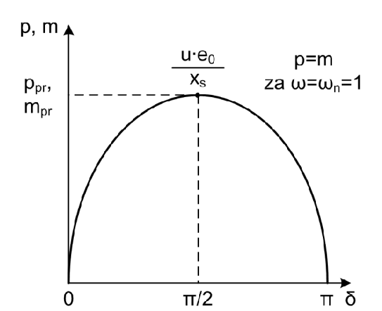
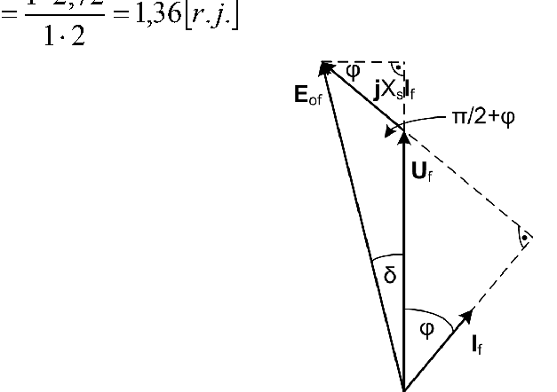

# Zadatak 11 — Prevalni moment turbogeneratora u nazivnom režimu i prevalna snaga pri sniženom naponu

## Postavka

Turbogenerator ima nazivne podatke: $S_{\mathrm{n}} = 16\ \mathrm{MVA}$, $\cos\varphi_{\mathrm{n}} = 0{,}8$, $n_{\mathrm{n}} = 3000\ \mathrm{min^{-1}}$, sinhrona reaktansa $x_s = 200\ \%$, sprega statorskog namotaja Y (zvezda). Generator je priključen na krutu mrežu. Odrediti (u apsolutnim jedinicama):

a) prevalni moment generatora u nazivnom režimu,

b) prevalnu snagu ako je generator opterećen aktivnom snagom $0{,}625$ r.j. uz $\cos\varphi = 0{,}6$ i napon $0{,}762$ r.j.

> **Prevod na običan jezik:** Imamo veliki generator (turbogenerator — brzohodni generator koji pokreće parna turbina) prikačen na jaku elektroenergetsku mrežu. Za njega znamo osnovne podatke sa natpisne pločice. Traže se dve stvari. Pod (a): koliki je **najveći moment** koji generator može da razvije u nazivnim uslovima pre nego što „iskoči iz sinhronizma" — to je takozvani *prevalni moment*, i treba ga izraziti u njutn-metrima, ne samo u relativnim (bezdimenzionim) jedinicama. Pod (b): mreža više nije u nazivnom stanju — napon je pao na $76{,}2\ \%$ nazivnog, generator daje određenu aktivnu snagu uz lošiji faktor snage — pa se pita kolika je u tom novom stanju **najveća aktivna snaga** koju generator može stabilno da isporuči (*prevalna snaga*), izraženo u megavatima. Ceo račun radimo u relativnim jedinicama (jer su svi podaci pod (b) tako zadati), a na kraju rezultat „vraćamo" u apsolutne jedinice množenjem baznim vrednostima.

## Podaci

| Veličina | Oznaka | Vrednost | Šta ta veličina fizički znači |
|---|---|---|---|
| Nazivna prividna snaga | $S_{\mathrm{n}}$ | $16\ \mathrm{MVA}$ | Ukupna („prividna") snaga koju generator sme trajno da daje; proizvod nazivnog napona i nazivne struje sve tri faze. |
| Nazivni faktor snage | $\cos\varphi_{\mathrm{n}}$ | $0{,}8$ | Odnos aktivne i prividne snage u nazivnom režimu; $\varphi_{\mathrm{n}}$ je ugao između faznog napona i fazne struje. |
| Nazivna brzina obrtanja | $n_{\mathrm{n}}$ | $3000\ \mathrm{min^{-1}}$ | Brzina rotora; kod sinhrone mašine to je i sinhrona brzina (rotor se okreće tačno u koraku sa obrtnim poljem). $3000\ \mathrm{min^{-1}}$ na mreži od $50\ \mathrm{Hz}$ znači mašinu sa jednim parom polova — tipičan turbogenerator. |
| Sinhrona reaktansa | $x_s$ | $200\ \% = 2$ r.j. | Ukupna reaktansa jedne faze statora (reakcija indukta + rasipanje), izražena u procentima bazne impedanse. $200\ \%$ znači da je reaktansa dvostruko veća od bazne impedanse $Z_{\mathrm{b}} = U_{\mathrm{fn}}/I_{\mathrm{fn}}$. |
| Sprega namotaja | Y | zvezda | Fazni napon je $\sqrt{3}$ puta manji od linijskog. U ovom zadatku sve radimo u relativnim jedinicama, pa nam ovaj podatak ne ulazi direktno u račun. |
| Vrsta mreže | — | kruta mreža | Mreža čiji su napon i učestanost nepromenljivi, šta god naša mašina radila (mreža je „beskonačno jaka" u odnosu na mašinu). |
| **Podaci za tačku (b):** | | | |
| Aktivna snaga u novom režimu | $p_1$ | $0{,}625$ r.j. | Aktivna snaga koju generator isporučuje, izražena relativno u odnosu na $S_{\mathrm{n}}$. |
| Faktor snage u novom režimu | $\cos\varphi_1$ | $0{,}6$ | Lošiji (manji) faktor snage nego nazivni — struja je više „iskošena" u odnosu na napon. |
| Napon u novom režimu | $u_1$ | $0{,}762$ r.j. | Napon mreže je pao na $76{,}2\ \%$ nazivne vrednosti. |

Oznaka „r.j." znači *relativne jedinice* (bezdimenzioni brojevi dobijeni deljenjem stvarne vrednosti baznom vrednošću) — detaljno objašnjeno u mini-lekcijama.

## Šta se traži i zašto

**a) Prevalni moment $M_{\mathrm{pr}}$ u nazivnom režimu, u apsolutnim jedinicama (Nm).**
Prevalni (maksimalni) moment je najveći elektromagnetni moment koji sinhrona mašina može da razvije pri datom naponu i pobudi. Ako pogonska turbina pokuša da „ugura" u generator veći mehanički moment od prevalnog, generator više ne može da ga uravnoteži električnim putem — rotor „proklizava" u odnosu na obrtno polje i mašina **ispada iz sinhronizma** (gubi stabilnost, struje i momenti divljaju, štitna automatika mora da je isključi). Zato inženjera prevalni moment zanima kao **granicu statičke stabilnosti**: odnos prevalnog i nazivnog momenta govori koliku rezervu mašina ima.

Plan: (1) napišemo izraz za moment u zavisnosti od ugla opterećenja $\delta$ u relativnim jedinicama; (2) uočimo da je maksimum pri $\delta = \pi/2$; (3) iz vektorskog dijagrama kosinusnom teoremom izračunamo elektromotornu silu praznog hoda $e_{0\mathrm{fn}}$ u nazivnom režimu; (4) izračunamo $m_{\mathrm{pr}}$ u r.j.; (5) odredimo bazni moment $M_{\mathrm{b}} = S_{\mathrm{b}}/\Omega_{\mathrm{b}}$ i pomnožimo: $M_{\mathrm{pr}} = m_{\mathrm{pr}} \cdot M_{\mathrm{b}}$.

**b) Prevalna snaga $P_{\mathrm{pr1}}$ pri sniženom naponu, u apsolutnim jedinicama (MW).**
Prevalna snaga je najveća aktivna snaga koju generator može stabilno da preda mreži pri datom naponu i datoj pobudi. Pitanje je praktično vrlo važno: kad napon mreže padne (kvar, preopterećenje mreže), sposobnost generatora da prenese snagu opada — inženjer mora da zna da li generator i dalje može da iznese svoje opterećenje ili preti ispad iz sinhronizma.

Plan: (1) iz zadate snage, napona i faktora snage izračunamo struju $i_1$; (2) kosinusnom teoremom (isti postupak kao pod (a), samo sa novim brojevima) izračunamo elektromotornu silu $e_{01}$ u tom režimu; (3) prevalna snaga u r.j. je $p_{\mathrm{pr1}} = u_1 e_{01}/x_s$; (4) pomnožimo baznom snagom $S_{\mathrm{b}} = S_{\mathrm{n}}$ da dobijemo megavate.

## Potrebna teorija — mini-lekcije

### Mini-lekcija 1: Turbogenerator, cilindrični rotor i kruta mreža

**Turbogenerator** je sinhroni generator koji pokreće parna ili gasna turbina. Turbine su najefikasnije na velikim brzinama, pa turbogeneratori imaju mali broj polova — najčešće jedan par polova, što na mreži od $50\ \mathrm{Hz}$ daje $3000\ \mathrm{min^{-1}}$ (kao u ovom zadatku). Zbog velike brzine rotor mora biti mehanički čvrst i gladak — pravi se kao **cilindričan** (valjkast, sa pobudnim namotajem u žlebovima), a ne sa isturenim polovima. Posledica po teoriju: vazdušni zazor je ravnomeran po obimu, pa mašina ima **jednu** sinhronu reaktansu $X_s$, istu u svim pravcima (kod mašine sa isturenim polovima morale bi se razlikovati dve reaktanse, $X_d$ i $X_q$).

**Kruta mreža** je idealizacija elektroenergetskog sistema koji je mnogo „jači" od posmatrane mašine: njegov napon i učestanost su konstantni, ne zavise od toga šta mašina radi. Za nas to znači: napon na krajevima generatora $U_{\mathrm{f}}$ i sinhrona brzina su nametnuti spolja i mi na njih ne utičemo.

### Mini-lekcija 2: Ugao opterećenja i ugaona karakteristika snage i momenta

Naponska jednačina sinhronog generatora sa cilindričnim rotorom (uz zanemaren otpor statorskog namotaja, što je kod velikih mašina opravdano jer je otpor mnogo manji od reaktanse) u kompleksnom domenu glasi:

$$\mathbf{E}_{0\mathrm{f}} = \mathbf{U}_{\mathrm{f}} + jX_s\,\mathbf{I}_{\mathrm{f}}$$

gde je:
- $\mathbf{E}_{0\mathrm{f}}$ — fazor **elektromotorne sile praznog hoda** (napon koji pobudni fluks rotora indukuje u statorskom namotaju; to je napon koji bismo izmerili na krajevima mašine kada ona ne bi davala struju),
- $\mathbf{U}_{\mathrm{f}}$ — fazor faznog napona na krajevima mašine (nametnut krutom mrežom),
- $\mathbf{I}_{\mathrm{f}}$ — fazor fazne struje statora,
- $X_s$ — sinhrona reaktansa; $j$ je imaginarna jedinica ($jX_s\mathbf{I}_{\mathrm{f}}$ je pad napona na reaktansi, koji prednjači struji za $90^\circ$).

**Ugao opterećenja $\delta$** je ugao između fazora $\mathbf{E}_{0\mathrm{f}}$ i fazora $\mathbf{U}_{\mathrm{f}}$. Fizički, $\mathbf{E}_{0\mathrm{f}}$ je „vezana" za rotor (indukuje je pobudni fluks koji se okreće zajedno sa rotorom), a $\mathbf{U}_{\mathrm{f}}$ za mrežu — pa je $\delta$ zapravo ugao za koji rotor „vuče ispred" napona mreže. Neopterećena mašina ima $\delta = 0$; što više snage generator gura u mrežu, to je $\delta$ veći.

Aktivna snaga trofaznog generatora je $P = 3\,U_{\mathrm{f}} I_{\mathrm{f}} \cos\varphi$ (tri faze, svaka daje $U_{\mathrm{f}} I_{\mathrm{f}} \cos\varphi$). Iz vektorskog dijagrama naponske jednačine (nacrtan je kao Slika 11.1 u mini-lekciji 4) čita se jednostavna geometrijska veza: komponenta pada napona $X_s I_{\mathrm{f}}$ upravna na $\mathbf{U}_{\mathrm{f}}$ iznosi $X_s I_{\mathrm{f}} \cos\varphi$, a ista ta duž je istovremeno i naspramna kateta ugla $\delta$ u trouglu sa hipotenuzom $E_{0\mathrm{f}}$, dakle jednaka je $E_{0\mathrm{f}} \sin\delta$. Izjednačavanjem:

$$X_s I_{\mathrm{f}} \cos\varphi = E_{0\mathrm{f}} \sin\delta \quad\Longrightarrow\quad I_{\mathrm{f}} \cos\varphi = \frac{E_{0\mathrm{f}}}{X_s}\sin\delta$$

Uvrštavanjem u izraz za snagu dobija se **ugaona karakteristika aktivne snage**:

$$P = 3\,U_{\mathrm{f}}\, I_{\mathrm{f}} \cos\varphi = 3\,U_{\mathrm{f}} \cdot \frac{E_{0\mathrm{f}}}{X_s}\cdot \sin\delta = \frac{3\,U_{\mathrm{f}}\, E_{0\mathrm{f}}}{X_s}\cdot \sin\delta$$

Elektromagnetni moment je snaga podeljena mehaničkom ugaonom brzinom (jer je mehanička snaga $P = M\,\Omega$, a kod idealizovane mašine bez gubitaka elektromagnetna snaga je jednaka mehaničkoj):

$$M = \frac{P}{\Omega_{\mathrm{sm}}} = \frac{3\,U_{\mathrm{f}}\, E_{0\mathrm{f}}}{\Omega_{\mathrm{sm}}\, X_s}\cdot \sin\delta$$

gde je $\Omega_{\mathrm{sm}}$ — **sinhrona mehanička ugaona brzina** u $\mathrm{rad/s}$; za mašinu sa $p$ pari polova $\Omega_{\mathrm{sm}} = 2\pi f/p$, a iz brzine u obrtajima u minuti računa se kao $\Omega_{\mathrm{sm}} = \dfrac{2\pi}{60}\, n$.

**Intuicija:** snaga i moment rastu sa $\sin\delta$ — kao kod dva magneta vezana elastičnom oprugom: dok su poravnati ($\delta=0$) nema sile; što se više „razvuku", sila raste, ali samo do neke granice.

### Mini-lekcija 3: Prevalni moment i prevalna snaga (granica stabilnosti)

Pošto snaga i moment zavise od $\sin\delta$, a sinus dostiže najveću vrednost $1$ pri uglu $\pi/2$, **najveća snaga i najveći moment** ostvaruju se pri uglu opterećenja $\delta = \pi/2 = 90^\circ$:

$$P_{\mathrm{pr}} = \frac{3\,U_{\mathrm{f}}\, E_{0\mathrm{f}}}{X_s}, \qquad M_{\mathrm{pr}} = \frac{3\,U_{\mathrm{f}}\, E_{0\mathrm{f}}}{\Omega_{\mathrm{sm}}\, X_s}$$

To su **prevalna snaga** i **prevalni moment**. Naziv „prevalni" dolazi otud što se tu karakteristika „prevaljuje": za $\delta < \pi/2$ mašina radi stabilno (poveća li se opterećenje, $\delta$ malo poraste i mašina razvije veći moment — sama se uravnoteži), a za $\delta > \pi/2$ svako dalje povećanje ugla *smanjuje* moment, ravnoteža je nemoguća i mašina ispada iz sinhronizma.

Sledeća slika prikazuje tu ugaonu karakteristiku u relativnim jedinicama: na apscisi je ugao opterećenja $\delta$ od $0$ do $\pi$, na ordinati relativna snaga $p$ i relativni moment $m$ (jedna ista sinusna kriva važi za obe veličine — objašnjenje zašto je u mini-lekciji 5). Vrh krive je u $\delta = \pi/2$ i iznosi $u\,e_0/x_s$ — to je prevalna vrednost $p_{\mathrm{pr}}$ odnosno $m_{\mathrm{pr}}$, označena isprekidanim linijama.

**Slika 11.2 —** Relativne vrednosti snage i momenta su iste za nazivnu sinhronu brzinu obrtanja: obe veličine slede istu krivu $\dfrac{u\, e_0}{x_s}\sin\delta$, sa maksimumom (prevalnom vrednošću $p_{\mathrm{pr}}, m_{\mathrm{pr}}$) pri $\delta = \pi/2$, jer je pri $\omega = \omega_{\mathrm{n}} = 1$ r.j. upravo $p = m$.

### Mini-lekcija 4: Vektorski dijagram nadpobuđenog generatora i kosinusna teorema

Da bismo izračunali prevalni moment, treba nam vrednost $E_{0\mathrm{f}}$ — a nju ne merimo direktno, već je **rekonstruišemo iz naponske jednačine**, tj. iz vektorskog dijagrama. Na sledećoj slici je vektorski dijagram napona sinhronog generatora u *nadpobuđenom* režimu (pobuda jača nego što treba za sam napon, pa generator pored aktivne daje i induktivnu reaktivnu snagu mreži — struja $\mathbf{I}_{\mathrm{f}}$ **kasni** za naponom $\mathbf{U}_{\mathrm{f}}$ za ugao $\varphi$; to je uobičajen radni režim generatora u elektrani). Čitaj ga ovako: iz zajedničke početne tačke polaze fazor napona $\mathbf{U}_{\mathrm{f}}$ (vertikalno) i fazor struje $\mathbf{I}_{\mathrm{f}}$ (udesno od njega, kasni za ugao $\varphi$); na vrh $\mathbf{U}_{\mathrm{f}}$ nadovezuje se pad napona $jX_s\mathbf{I}_{\mathrm{f}}$, koji je upravan na struju (zarotiran $90^\circ$ unapred u odnosu na $\mathbf{I}_{\mathrm{f}}$); zbir $\mathbf{U}_{\mathrm{f}} + jX_s\mathbf{I}_{\mathrm{f}}$ zatvara trougao i daje $\mathbf{E}_{0\mathrm{f}}$, koji prednjači naponu za ugao opterećenja $\delta$. Ugao unutar trougla, između stranica $U_{\mathrm{f}}$ i $X_s I_{\mathrm{f}}$, iznosi $\pi/2 + \varphi$ (na slici posebno označen).

**Slika 11.1 —** Vektorski dijagram napona sinhronog generatora, nadpobuđen režim. Trougao čine $\mathbf{U}_{\mathrm{f}}$, pad napona $jX_s\mathbf{I}_{\mathrm{f}}$ i $\mathbf{E}_{0\mathrm{f}}$; ugao između stranica $U_{\mathrm{f}}$ i $X_s I_{\mathrm{f}}$ je $\pi/2 + \varphi$, a ugao između $\mathbf{E}_{0\mathrm{f}}$ i $\mathbf{U}_{\mathrm{f}}$ je ugao opterećenja $\delta$.

Iz tog trougla $E_{0\mathrm{f}}$ dobijamo **kosinusnom teoremom**. Podsetnik: kosinusna teorema kaže da u trouglu sa stranicama $a$ i $b$ koje zaklapaju ugao $\gamma$, naspramna stranica $c$ zadovoljava $c^2 = a^2 + b^2 - 2ab\cos\gamma$ (to je „Pitagorina teorema sa popravkom" za trouglove koji nisu pravougli). Ovde su stranice $a = U_{\mathrm{f}}$ i $b = X_s I_{\mathrm{f}}$, ugao između njih $\gamma = \pi/2 + \varphi$, a naspramna stranica je $c = E_{0\mathrm{f}}$:

$$E_{0\mathrm{f}} = \sqrt{U_{\mathrm{f}}^2 + \left(X_s I_{\mathrm{f}}\right)^2 - 2\,U_{\mathrm{f}}\, X_s I_{\mathrm{f}} \cdot \cos\!\left(\frac{\pi}{2}+\varphi\right)}$$

Ključna trigonometrijska sitnica koja studente najčešće zbuni: po adicionoj formuli za kosinus,

$$\cos\!\left(\frac{\pi}{2}+\varphi\right) = \cos\frac{\pi}{2}\cos\varphi - \sin\frac{\pi}{2}\sin\varphi = 0\cdot\cos\varphi - 1\cdot\sin\varphi = -\sin\varphi$$

pa minus ispred poslednjeg člana i minus iz kosinusa daju **plus**:

$$E_{0\mathrm{f}} = \sqrt{U_{\mathrm{f}}^2 + \left(X_s I_{\mathrm{f}}\right)^2 + 2\,U_{\mathrm{f}}\, X_s I_{\mathrm{f}} \cdot \sin\varphi}$$

Dakle u formulu ulazi $\sin\varphi$, **a ne** $\cos\varphi$ koji je zadat — moraćemo ga izračunati iz $\sin\varphi = \sqrt{1-\cos^2\varphi}$.

### Mini-lekcija 5: Relativne (per-unit) jedinice — zašto iz formula nestaje koeficijent 3

Relativne jedinice (oznaka „r.j.", engl. *per-unit*) dobijaju se tako što se svaka fizička veličina podeli svojom **baznom vrednošću** — dogovorno izabranom referentnom vrednošću iste vrste. Time brojevi postaju bezdimenzioni i uporedivi među mašinama svih veličina: napon $0{,}762$ r.j. znači „$76{,}2\ \%$ nazivnog", bez obzira na to da li je mašina od $16\ \mathrm{MVA}$ ili od $600\ \mathrm{MVA}$.

Za bazne vrednosti se usvajaju (velika slova = apsolutne vrednosti, mala slova = relativne):

$$U_{\mathrm{b}} = U_{\mathrm{fn}} \qquad u = \frac{U}{U_{\mathrm{b}}}$$
$$I_{\mathrm{b}} = I_{\mathrm{fn}} \qquad i = \frac{I}{I_{\mathrm{b}}}$$
$$S_{\mathrm{b}} = S_{\mathrm{n}} \qquad s = \frac{S}{S_{\mathrm{b}}} \quad p = \frac{P}{S_{\mathrm{b}}} \quad q = \frac{Q}{S_{\mathrm{b}}}$$

Dakle: bazni napon je **nazivni fazni** napon $U_{\mathrm{fn}}$, bazna struja je **nazivna fazna** struja $I_{\mathrm{fn}}$, a bazna snaga je **nazivna prividna snaga cele (trofazne) mašine** $S_{\mathrm{n}}$. Obrati pažnju: aktivna snaga $P$ i reaktivna snaga $Q$ dele **istu** baznu vrednost $S_{\mathrm{b}}$ kao i prividna snaga — zato rezultat u vatima dobijamo množenjem sa $S_{\mathrm{n}}$ u VA.

**Zašto nestaje koeficijent 3?** Prividna snaga trofazne mašine u apsolutnim jedinicama je:

$$S = 3\,U_{\mathrm{f}}\, I_{\mathrm{f}}$$

Prevedimo je u relativne jedinice: napišemo $S = s\,S_{\mathrm{b}}$, $U_{\mathrm{f}} = u\,U_{\mathrm{b}}$, $I_{\mathrm{f}} = i\,I_{\mathrm{b}}$ i uvrstimo:

$$s\cdot S_{\mathrm{b}} = 3\cdot (u\, U_{\mathrm{b}})\cdot (i\, I_{\mathrm{b}})$$

Podelimo obe strane sa $S_{\mathrm{b}}$:

$$s = \frac{3\, U_{\mathrm{b}}\, I_{\mathrm{b}}}{S_{\mathrm{b}}}\cdot u \cdot i$$

Sada iskoristimo kako smo izabrali bazne vrednosti: $U_{\mathrm{b}} = U_{\mathrm{fn}}$, $I_{\mathrm{b}} = I_{\mathrm{fn}}$, a $S_{\mathrm{b}} = S_{\mathrm{n}} = 3\,U_{\mathrm{fn}} I_{\mathrm{fn}}$ (nazivna prividna snaga je upravo trostruki proizvod nazivnog faznog napona i struje):

$$s = \frac{3\, U_{\mathrm{fn}}\, I_{\mathrm{fn}}}{S_{\mathrm{n}}}\cdot u \cdot i = \frac{3\, U_{\mathrm{fn}}\, I_{\mathrm{fn}}}{3\, U_{\mathrm{fn}}\, I_{\mathrm{fn}}}\cdot u \cdot i = u\cdot i$$

Trojka iz brojioca i trojka „sakrivena" u baznoj snazi se skrate: **u relativnim jedinicama u izrazu za snagu ne figuriše koeficijent 3.** Isto važi i za moment, jer je moment odnos snage i brzine, pa se ista trojka skrati i tamo. Zato ugaone karakteristike u relativnom domenu glase:

$$p = \frac{u_{\mathrm{f}}\, e_{0\mathrm{f}}}{x_s}\cdot \sin\delta \qquad\qquad m = \frac{u_{\mathrm{f}}\, e_{0\mathrm{f}}}{\omega_{\mathrm{sm}}\, x_s}\cdot \sin\delta$$

gde su $u_{\mathrm{f}}, e_{0\mathrm{f}}, x_s, \omega_{\mathrm{sm}}, p, m$ relativne vrednosti napona, elektromotorne sile, reaktanse, brzine, snage i momenta. Još dva pravila koja ćemo koristiti:

1. **Naponske jednačine ne menjaju oblik u relativnim jedinicama** — jednačina $\mathbf{E}_{0\mathrm{f}} = \mathbf{U}_{\mathrm{f}} + jX_s\mathbf{I}_{\mathrm{f}}$ posle deljenja sa $U_{\mathrm{b}}$ glasi potpuno isto, samo malim slovima: $\mathbf{e}_{0\mathrm{f}} = \mathbf{u}_{\mathrm{f}} + jx_s\mathbf{i}_{\mathrm{f}}$ (jer je $X_s I_{\mathrm{f}}/U_{\mathrm{b}} = (X_s/Z_{\mathrm{b}})\cdot(I_{\mathrm{f}}/I_{\mathrm{b}}) = x_s\, i_{\mathrm{f}}$, gde je $Z_{\mathrm{b}} = U_{\mathrm{b}}/I_{\mathrm{b}}$ bazna impedansa). Zato i kosinusna teorema iz mini-lekcije 4 važi neizmenjena, malim slovima.
2. **Bazni moment** se usvaja kao
$$M_{\mathrm{b}} = \frac{S_{\mathrm{b}}}{\Omega_{\mathrm{b}}}$$
gde je $\Omega_{\mathrm{b}} = \Omega_{\mathrm{smn}}$ (nazivna sinhrona mehanička ugaona brzina). Ovakav izbor nije slučajan: on obezbeđuje da i u relativnom domenu važi isti odnos snage i brzine kao u apsolutnom, $m = p/\omega_{\mathrm{sm}}$, bez ikakvog dodatnog koeficijenta. Direktna posledica, vidljiva na Slici 11.2: pri nazivnoj brzini ($\omega_{\mathrm{sm}} = 1$ r.j.) relativni moment i relativna snaga su **brojčano jednaki**, $m = p$.

### Mini-lekcija 6: Reaktansa u procentima

Podatak $x_s = 200\ \%$ je ista stvar kao $x_s = 2$ r.j. — procenti su samo relativne jedinice pomnožene sa 100. Znači: pad napona na sinhronoj reaktansi pri nazivnoj struji iznosi dvostruki nazivni napon. Ovako velika relativna reaktansa ($1{,}5$–$2{,}5$ r.j.) je sasvim tipična za turbogeneratore. U sve formule ulazi $x_s = 2$.

## Rešenje, korak po korak

### Korak 1: Sređivanje podataka — reaktansa u r.j. i sinusi uglova

**Zašto ovaj korak:** pre računa prevedemo sve podatke u oblik u kojem ulaze u formule: reaktansu iz procenata u relativne jedinice, a iz zadatih faktora snage izračunamo sinuse (jer u kosinusnu teoremu, kako smo videli u mini-lekciji 4, ulazi $\sin\varphi$, a ne $\cos\varphi$).

$$x_s = 200\ \% = \frac{200}{100} = 2 \ \mathrm{[r.j.]}$$

Sinus nazivnog ugla (za tačku a), iz osnovnog trigonometrijskog identiteta $\sin^2\varphi + \cos^2\varphi = 1$:

$$\sin\varphi_{\mathrm{n}} = \sqrt{1-\cos^2\varphi_{\mathrm{n}}} = \sqrt{1-0{,}8^2} = \sqrt{1-0{,}64} = \sqrt{0{,}36} = 0{,}6$$

Sinus ugla u režimu pod (b):

$$\sin\varphi_1 = \sqrt{1-\cos^2\varphi_1} = \sqrt{1-0{,}6^2} = \sqrt{1-0{,}36} = \sqrt{0{,}64} = 0{,}8$$

**Šta smo dobili:** radne brojeve za dalje. Zapazi „ukrštanje": u nazivnom režimu je $\cos\varphi_{\mathrm{n}} = 0{,}8$ pa $\sin\varphi_{\mathrm{n}} = 0{,}6$, a u režimu (b) obrnuto — $\cos\varphi_1 = 0{,}6$ pa $\sin\varphi_1 = 0{,}8$. Ovo je najčešće mesto za grešku u celom zadatku.

### Korak 2 (a): Izraz za prevalni moment u relativnim jedinicama

**Zašto ovaj korak:** postavljamo formulu iz koje ćemo računati, i to odmah u relativnom domenu, jer su svi podaci relativni.

Iz mini-lekcije 5, ugaona karakteristika momenta u relativnim jedinicama glasi:

$$m = \frac{u_{\mathrm{f}}\, e_{0\mathrm{f}}}{\omega_{\mathrm{sm}}\, x_s}\cdot \sin\delta$$

Prevalni (maksimalni) moment se, prema mini-lekciji 3, dobija za ugao opterećenja $\delta = \pi/2$, kada je $\sin\delta = 1$. U nazivnom režimu sve veličine uzimaju nazivne vrednosti, pa:

$$m_{\mathrm{pr}} = \frac{u_{\mathrm{fn}}\, e_{0\mathrm{fn}}}{\omega_{\mathrm{sm}}\, x_s}$$

gde je $u_{\mathrm{fn}}$ relativna vrednost nazivnog napona, $e_{0\mathrm{fn}}$ relativna elektromotorna sila praznog hoda pri nazivnoj pobudi, a $\omega_{\mathrm{sm}}$ relativna sinhrona brzina.

**Šta smo dobili:** formulu sa tri sastojka; dva od njih ($u_{\mathrm{fn}}$ i $\omega_{\mathrm{sm}}$) su trivijalna (sledeći korak), treći ($e_{0\mathrm{fn}}$) zahteva vektorski dijagram (korak 4).

### Korak 3 (a): Nazivni napon, struja i brzina u relativnim jedinicama su jednaki jedinici

**Zašto ovaj korak:** ovo je suština relativnih jedinica — nazivne veličine podeljene svojim baznim vrednostima (koje su upravo te iste nazivne veličine) daju jedinicu. Ispišimo to eksplicitno da ne bude „broja niotkuda":

$$u_{\mathrm{fn}} = \frac{U_{\mathrm{fn}}}{U_{\mathrm{b}}} = \frac{U_{\mathrm{fn}}}{U_{\mathrm{fn}}} = 1\ \mathrm{[r.j.]} \qquad \omega_{\mathrm{smn}} = \frac{\Omega_{\mathrm{smn}}}{\Omega_{\mathrm{b}}} = \frac{\Omega_{\mathrm{smn}}}{\Omega_{\mathrm{smn}}} = 1\ \mathrm{[r.j.]} \qquad i_{\mathrm{fn}} = \frac{I_{\mathrm{fn}}}{I_{\mathrm{b}}} = \frac{I_{\mathrm{fn}}}{I_{\mathrm{fn}}} = 1\ \mathrm{[r.j.]}$$

**Šta smo dobili:** u nazivnom režimu su napon, struja i brzina tačno $1$ r.j. — zato relativne jedinice čine račun ovako čistim.

### Korak 4 (a): Elektromotorna sila praznog hoda u nazivnom režimu (kosinusna teorema)

**Zašto ovaj korak:** $e_{0\mathrm{fn}}$ je jedina nepoznata u formuli za $m_{\mathrm{pr}}$. Nalazimo je iz vektorskog dijagrama sa Slike 11.1, primenom kosinusne teoreme na trougao $u_{\mathrm{fn}}$ — $x_s i_{\mathrm{fn}}$ — $e_{0\mathrm{fn}}$ (u relativnim jedinicama naponske jednačine ne menjaju oblik, mini-lekcija 5, pravilo 1).

Kosinusna teorema (opšti oblik iz mini-lekcije 4, malim slovima):

$$e_{0\mathrm{fn}} = \sqrt{u_{\mathrm{fn}}^2 + \left(x_s\, i_{\mathrm{fn}}\right)^2 - 2\, u_{\mathrm{fn}}\, x_s\, i_{\mathrm{fn}} \cdot \cos\!\left(\frac{\pi}{2}+\varphi_{\mathrm{n}}\right)}$$

Prvo sredimo kosinus, koristeći $\cos(\pi/2+\varphi) = -\sin\varphi$ (izvedeno u mini-lekciji 4):

$$-2\, u_{\mathrm{fn}}\, x_s\, i_{\mathrm{fn}} \cdot \cos\!\left(\frac{\pi}{2}+\varphi_{\mathrm{n}}\right) = -2\, u_{\mathrm{fn}}\, x_s\, i_{\mathrm{fn}} \cdot \left(-\sin\varphi_{\mathrm{n}}\right) = +2\, u_{\mathrm{fn}}\, x_s\, i_{\mathrm{fn}} \cdot \sin\varphi_{\mathrm{n}}$$

pa formula postaje:

$$e_{0\mathrm{fn}} = \sqrt{u_{\mathrm{fn}}^2 + \left(x_s\, i_{\mathrm{fn}}\right)^2 + 2\, u_{\mathrm{fn}}\, x_s\, i_{\mathrm{fn}} \cdot \sin\varphi_{\mathrm{n}}}$$

Uvrstimo brojeve: $u_{\mathrm{fn}} = 1$, $i_{\mathrm{fn}} = 1$, $x_s = 2$, $\sin\varphi_{\mathrm{n}} = 0{,}6$:

$$e_{0\mathrm{fn}} = \sqrt{1^2 + (2\cdot 1)^2 + 2\cdot 1\cdot 2\cdot 1\cdot 0{,}6}$$

Izračunajmo svaki sabirak pod korenom posebno:

$$1^2 = 1 \qquad (2\cdot 1)^2 = 2^2 = 4 \qquad 2\cdot 1\cdot 2\cdot 1\cdot 0{,}6 = 4\cdot 0{,}6 = 2{,}4$$

$$e_{0\mathrm{fn}} = \sqrt{1 + 4 + 2{,}4} = \sqrt{7{,}4} = 2{,}72\ \mathrm{[r.j.]}$$

**Šta smo dobili:** elektromotorna sila praznog hoda je čak $2{,}72$ puta veća od nazivnog napona. To je posledica velike sinhrone reaktanse ($x_s = 2$): da bi kroz nju proterao nazivnu struju i još pokrio napon mreže, pobudni fluks mora indukovati vrlo veliki napon. Kod turbogeneratora je ovo sasvim normalno.

### Korak 5 (a): Prevalni moment u relativnim jedinicama

**Zašto ovaj korak:** sada imamo sve tri veličine iz formule koraka 2, pa samo uvrštavamo.

$$m_{\mathrm{pr}} = \frac{u_{\mathrm{fn}}\, e_{0\mathrm{fn}}}{\omega_{\mathrm{sm}}\, x_s} = \frac{1 \cdot 2{,}72}{1 \cdot 2} = \frac{2{,}72}{2} = 1{,}36\ \mathrm{[r.j.]}$$

**Šta smo dobili:** prevalni moment je $136\ \%$ baznog momenta. Nazivni moment u r.j. iznosi $m_{\mathrm{n}} = p_{\mathrm{n}}/\omega_{\mathrm{smn}} = \cos\varphi_{\mathrm{n}}/1 = 0{,}8$ r.j., pa je odnos $m_{\mathrm{pr}}/m_{\mathrm{n}} = 1{,}36/0{,}8 = 1{,}7$ — mašina u nazivnom režimu ima $70\ \%$ rezerve momenta do granice stabilnosti. To je tipična, zdrava rezerva.

### Korak 6 (a): Bazni moment i prevalni moment u apsolutnim jedinicama

**Zašto ovaj korak:** zadatak izričito traži rezultat u apsolutnim jedinicama (njutn-metrima). Relativnu vrednost vraćamo u apsolutnu množenjem baznim momentom: $M_{\mathrm{pr}} = m_{\mathrm{pr}} \cdot M_{\mathrm{b}}$.

Bazni moment je, po mini-lekciji 5 (pravilo 2):

$$M_{\mathrm{b}} = \frac{S_{\mathrm{b}}}{\Omega_{\mathrm{b}}} = \frac{S_{\mathrm{n}}}{\Omega_{\mathrm{smn}}}$$

Baznu (nazivnu sinhronu) ugaonu brzinu računamo iz nazivne brzine obrtanja $n_{\mathrm{n}} = 3000\ \mathrm{min^{-1}}$. Jedan obrtaj je $2\pi$ radijana, a minut je $60$ sekundi, pa:

$$\Omega_{\mathrm{b}} = \Omega_{\mathrm{smn}} = \frac{2\pi}{60}\cdot n_{\mathrm{n}} = \frac{2\pi}{60}\cdot 3000 = 2\pi \cdot 50 = 314{,}16\ \mathrm{rad/s}$$

Sada sve zajedno:

$$M_{\mathrm{pr}} = m_{\mathrm{pr}}\cdot \frac{S_{\mathrm{n}}}{\dfrac{2\pi}{60}\cdot n_{\mathrm{n}}} = 1{,}36 \cdot \frac{16\cdot 10^6\ \mathrm{VA}}{314{,}16\ \mathrm{rad/s}}$$

Prvo količnik (to je bazni moment):

$$M_{\mathrm{b}} = \frac{16\cdot 10^6}{314{,}16} = 50\,930\ \mathrm{Nm} \approx 50{,}93\ \mathrm{kNm}$$

pa proizvod:

$$M_{\mathrm{pr}} = 1{,}36 \cdot 50\,930\ \mathrm{Nm} = 69\,264\ \mathrm{Nm} \approx 69{,}26\ \mathrm{kNm}$$

**Šta smo dobili:** prevalni moment od oko $69\ \mathrm{kNm}$ — ovoliki moment bi na kraku od jednog metra pravila sila od skoro $7$ tona! Ovo je odgovor na tačku (a). Broj deluje veliko, ali za mašinu od $16\ \mathrm{MVA}$ je očekivan: velika snaga na „samo" $3000\ \mathrm{min^{-1}}$ znači momente reda desetina kilonjutn-metara.

### Korak 7 (b): Struja generatora u novom režimu

**Zašto ovaj korak:** u tački (b) mašina radi u nenazivnom režimu: $p_1 = 0{,}625$ r.j., $u_1 = 0{,}762$ r.j., $\cos\varphi_1 = 0{,}6$. Da bismo kosinusnom teoremom našli novu elektromotornu silu, prvo nam treba struja u tom režimu — a nju daje izraz za aktivnu snagu u relativnim jedinicama (bez koeficijenta 3, mini-lekcija 5).

$$p_1 = u_1\, i_1 \cos\varphi_1$$

Rešimo po struji: podelimo obe strane sa $u_1\cos\varphi_1$:

$$i_1 = \frac{p_1}{u_1 \cos\varphi_1} = \frac{0{,}625}{0{,}762 \cdot 0{,}6}$$

Imenilac: $0{,}762\cdot 0{,}6 = 0{,}4572$, pa:

$$i_1 = \frac{0{,}625}{0{,}4572} = 1{,}367\ \mathrm{[r.j.]}$$

**Šta smo dobili:** struja je $1{,}367$ r.j. — dakle **generator je u ovom režimu strujno preopterećen za $36{,}7\ \%$** u odnosu na nazivnu struju. To je logično: snaga koju daje nije mala ($0{,}625$ r.j.), a napon je znatno snižen i faktor snage loš, pa struja mora biti velika da bi „iznela" tu snagu. Trajni rad u ovakvom stanju nije dozvoljen (namotaji bi se pregrejali), ali kratkotrajno, u poremećaju mreže, ovakav režim se dešava.

### Korak 8 (b): Elektromotorna sila u novom režimu

**Zašto ovaj korak:** prevalna snaga zavisi od elektromotorne sile $e_{01}$ u datom režimu (pobuda je podešena tako da mašina drži zadati napon, struju i faktor snage). Računamo je istom kosinusnom teoremom kao u koraku 4, samo sa vrednostima novog režima.

$$e_{01} = \sqrt{u_1^2 + \left(x_s\, i_1\right)^2 - 2\, u_1\, x_s\, i_1 \cdot \cos\!\left(\frac{\pi}{2}+\varphi_1\right)} = \sqrt{u_1^2 + \left(x_s\, i_1\right)^2 + 2\, u_1\, x_s\, i_1 \cdot \sin\varphi_1}$$

(druga jednakost opet koristi $\cos(\pi/2+\varphi_1) = -\sin\varphi_1$). Uvrstimo $u_1 = 0{,}762$, $x_s = 2$, $i_1 = 1{,}367$, $\sin\varphi_1 = 0{,}8$:

$$e_{01} = \sqrt{0{,}762^2 + (2\cdot 1{,}367)^2 + 2\cdot 0{,}762\cdot 2\cdot 1{,}367\cdot 0{,}8}$$

Sabirci pod korenom, jedan po jedan:

$$0{,}762^2 = 0{,}5806$$
$$(2\cdot 1{,}367)^2 = 2{,}734^2 = 7{,}4748$$
$$2\cdot 0{,}762\cdot 2\cdot 1{,}367\cdot 0{,}8 = 3{,}3333$$

Zbir i koren:

$$e_{01} = \sqrt{0{,}5806 + 7{,}4748 + 3{,}3333} = \sqrt{11{,}3887} = 3{,}375\ \mathrm{[r.j.]}$$

**Šta smo dobili:** elektromotorna sila je sada čak $3{,}375$ r.j. — još veća nego u nazivnom režimu ($2{,}72$), jer velika struja pravi veliki pad napona $x_s i_1 = 2{,}734$ r.j. koji pobuda mora da nadjača. Mašina je jako nadpobuđena.

### Korak 9 (b): Prevalna snaga u relativnim jedinicama

**Zašto ovaj korak:** sada primenjujemo ugaonu karakteristiku snage pri $\delta = \pi/2$, sa naponom i elektromotornom silom **ovog** režima — jer prevalna snaga zavisi upravo od trenutnog napona mreže i trenutne pobude.

$$p_{\mathrm{pr1}} = \frac{u_1\, e_{01}}{x_s} = \frac{0{,}762 \cdot 3{,}375}{2}$$

Brojilac: $0{,}762\cdot 3{,}375 = 2{,}5718$, pa:

$$p_{\mathrm{pr1}} = \frac{2{,}5718}{2} = 1{,}286\ \mathrm{[r.j.]}$$

**Šta smo dobili:** i pored sniženog napona, generator može maksimalno da preda $1{,}286$ r.j. aktivne snage — više nego što trenutno daje ($0{,}625$ r.j.), dakle **radna tačka je i dalje stabilna**, sa dosta rezerve. Primeti kompenzaciju: napon je pao (smanjuje $p_{\mathrm{pr}}$), ali je pobuda porasla (povećava $p_{\mathrm{pr}}$), pa je prevalna snaga ostala blizu one iz nazivnog režima ($1{,}36$ r.j.).

### Korak 10 (b): Prevalna snaga u apsolutnim jedinicama

**Zašto ovaj korak:** zadatak i ovde traži apsolutnu vrednost. Relativna snaga se vraća u apsolutnu množenjem baznom snagom $S_{\mathrm{b}} = S_{\mathrm{n}}$ (podsetnik iz mini-lekcije 5: aktivna snaga u r.j. koristi istu baznu vrednost kao prividna — nazivnu prividnu snagu).

$$P_{\mathrm{pr1}} = p_{\mathrm{pr1}}\cdot S_{\mathrm{b}} = 1{,}286 \cdot 16\ \mathrm{MVA} = 20{,}58\ \mathrm{MW}$$

**Šta smo dobili:** prevalna snaga od $20{,}58\ \mathrm{MW}$ — to je odgovor na tačku (b). Rezultat je veći od nazivne aktivne snage $P_{\mathrm{n}} = S_{\mathrm{n}}\cos\varphi_{\mathrm{n}} = 16\cdot 0{,}8 = 12{,}8\ \mathrm{MW}$, što je i logično: prevalna snaga je *granica* mogućnosti, a nazivna snaga je trajno dozvoljeni režim koji uvek mora biti osetno ispod granice.

## Česte greške i zamke

1. **Zamena $\sin\varphi$ i $\cos\varphi$ u kosinusnoj teoremi.** U formulu za $e_0$ ulazi $\sin\varphi$, a zadat je $\cos\varphi$. U tački (a) je $\cos\varphi_{\mathrm{n}} = 0{,}8$ pa u koren ide $0{,}6$; u tački (b) je $\cos\varphi_1 = 0{,}6$ pa u koren ide $0{,}8$. Student koji mehanički prepiše zadati broj dobiće pogrešan (i naizgled uverljiv) rezultat. Poreklo sinusa: $\cos(\pi/2+\varphi) = -\sin\varphi$, pa dva minusa daju plus ispred člana sa $\sin\varphi$.

2. **Ubacivanje koeficijenta 3 u relativne formule** (ili njegovo izostavljanje u apsolutnim). Zapamti pravilo: velika slova (apsolutne jedinice) — trojka postoji ($P = 3U_{\mathrm{f}}I_{\mathrm{f}}\cos\varphi$); mala slova (relativne jedinice) — trojke nema ($p = u\,i\cos\varphi$), jer se skratila sa trojkom u baznoj snazi $S_{\mathrm{b}} = 3U_{\mathrm{fn}}I_{\mathrm{fn}}$.

3. **Reaktansa $200\ \%$ upotrebljena kao $200$ umesto kao $2$.** Procenti se pre računa dele sa $100$. Sa $x_s = 200$ svi rezultati ispadnu besmisleno mali — što je ujedno i signal za proveru.

4. **Pogrešna bazna vrednost pri vraćanju u apsolutne jedinice.** Za snagu se množi sa $S_{\mathrm{n}}$ u $\mathrm{VA}$ (rezultat je u $\mathrm{W}$, jer je reč o aktivnoj snazi), a za moment sa $M_{\mathrm{b}} = S_{\mathrm{n}}/\Omega_{\mathrm{smn}}$ — ne sa $S_{\mathrm{n}}/n_{\mathrm{n}}$! Brzina mora biti ugaona, u $\mathrm{rad/s}$: $\Omega_{\mathrm{smn}} = \dfrac{2\pi}{60} n_{\mathrm{n}}$. Ko zaboravi faktor $\dfrac{2\pi}{60} \approx 0{,}1047$, dobije moment pogrešan za red veličine.

5. **Korišćenje nazivnih vrednosti ($u=1$, $i=1$) u tački (b).** Režim (b) je nenazivni: $u_1 = 0{,}762$, a struja se mora *izračunati* iz snage i faktora snage ($i_1 = 1{,}367$, nije $1$!). Takođe, elektromotorna sila se mora računati **ponovo** — pobuda u režimu (b) nije ista kao u nazivnom režimu ($e_{01} = 3{,}375 \ne e_{0\mathrm{fn}} = 2{,}72$).

## Rezime rezultata

| Veličina | Oznaka | Vrednost |
|---|---|---|
| Elektromotorna sila praznog hoda u nazivnom režimu | $e_{0\mathrm{fn}}$ | $2{,}72$ r.j. |
| Prevalni moment u nazivnom režimu (relativno) | $m_{\mathrm{pr}}$ | $1{,}36$ r.j. |
| Bazni moment | $M_{\mathrm{b}}$ | $50{,}93\ \mathrm{kNm}$ |
| **a) Prevalni moment u nazivnom režimu (apsolutno)** | $M_{\mathrm{pr}}$ | $\mathbf{69{,}26\ \mathrm{kNm}}$ |
| Struja u režimu (b) | $i_1$ | $1{,}367$ r.j. (preopterećenje $36{,}7\ \%$) |
| Elektromotorna sila u režimu (b) | $e_{01}$ | $3{,}375$ r.j. |
| Prevalna snaga u režimu (b) (relativno) | $p_{\mathrm{pr1}}$ | $1{,}286$ r.j. |
| **b) Prevalna snaga u režimu (b) (apsolutno)** | $P_{\mathrm{pr1}}$ | $\mathbf{20{,}58\ \mathrm{MW}}$ |

## Provera smisla

**1. Dimenziona provera baznog momenta.** $M_{\mathrm{b}} = S_{\mathrm{b}}/\Omega_{\mathrm{b}}$ ima jedinicu $\dfrac{\mathrm{VA}}{\mathrm{rad/s}} = \mathrm{W\cdot s} = \mathrm{J} = \mathrm{Nm}$ — zaista njutn-metar (radijan je bezdimenzion), dakle formula je dimenziono ispravna.

**2. Nezavisna provera kosinusne teoreme razlaganjem na komponente (Pitagora).** Elektromotornu silu možemo izračunati i bez kosinusne teoreme, razlaganjem fazora na komponentu duž napona i upravno na njega: duž napona imamo $u + x_s i \sin\varphi$, upravno $x_s i \cos\varphi$, pa je $e_0 = \sqrt{(u + x_s i \sin\varphi)^2 + (x_s i \cos\varphi)^2}$. Za nazivni režim: $\sqrt{(1 + 2\cdot 0{,}6)^2 + (2\cdot 0{,}8)^2} = \sqrt{2{,}2^2 + 1{,}6^2} = \sqrt{4{,}84+2{,}56} = \sqrt{7{,}4} = 2{,}72$ ✓. Za režim (b): $\sqrt{(0{,}762 + 2{,}734\cdot 0{,}8)^2 + (2{,}734\cdot 0{,}6)^2} = \sqrt{2{,}949^2 + 1{,}640^2} = \sqrt{8{,}698 + 2{,}691} = \sqrt{11{,}389} = 3{,}375$ ✓. Obe vrednosti se poklapaju sa koracima 4 i 8.

**3. Poređenje sa nazivnim vrednostima i granični smisao.** Prevalni moment ($1{,}36$ r.j.) je veći od nazivnog momenta ($0{,}8$ r.j.) — mora biti, inače mašina ne bi mogla ni da radi u nazivnom režimu, a odnos $1{,}7$ je u tipičnom opsegu za turbogeneratore. U tački (b) je $p_1 = 0{,}625 < p_{\mathrm{pr1}} = 1{,}286$, pa je radna tačka stabilna; ugao opterećenja u njoj je $\delta_1 = \arcsin(p_1/p_{\mathrm{pr1}}) = \arcsin(0{,}625/1{,}286) = \arcsin(0{,}486) \approx 29^\circ$, udobno ispod granične vrednosti $90^\circ$ — sve se lepo uklapa u sliku ugaone karakteristike (Slika 11.2): radimo na uzlaznom, stabilnom delu sinusoide.
