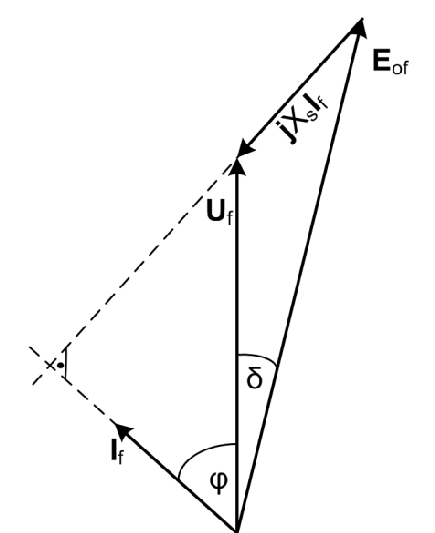

# Zadatak 12 — Struja i faktor snage nadpobuđenog sinhronog motora iz vektorskog dijagrama

## Postavka

Trofazni sinhroni motor u sprezi zvezda priključen je na mrežu linijskog napona $6000\ \mathrm{V}$. Sinhrona reaktansa motora iznosi $X_s = 6{,}6\ \mathrm{\Omega}$. U jednom pogonskom stanju motor uzima iz mreže aktivnu snagu $2500\ \mathrm{kW}$, a struja pobude je podešena tako da indukovani napon (elektromotorna sila) praznog hoda po fazi iznosi $E_{0f} = 4500\ \mathrm{V}$.

Nacrtati odgovarajući vektorski dijagram i izračunati:

1. struju koju motor uzima iz mreže,
2. faktor snage motora u datom pogonskom stanju.

> **Prevod na običan jezik:** Imamo veliki motor priključen na mrežu od 6000 V. Znamo koliko snage "vuče" iz mreže (2500 kW) i znamo koliko je "jaka" njegova pobuda — pobudna struja u rotoru je podešena tako da bi motor, kad bi radio bez opterećenja i bez mreže, na svojim krajevima po fazi indukovao 4500 V. Treba da nacrtamo sliku (dijagram) koja pokazuje međusobni položaj napona i struje, pa iz te slike, čistom geometrijom (kosinusnom teoremom), da izračunamo kolika struja teče iz mreže u motor i da li ta struja kasni ili prednjači naponu — tj. koliki je faktor snage i da li je induktivan ili kapacitivan.

## Podaci

| Veličina | Oznaka | Vrednost | Šta ta veličina fizički znači |
|---|---|---|---|
| Linijski napon mreže | $U$ | $6000\ \mathrm{V}$ | Efektivna vrednost napona između dva fazna provodnika mreže na koju je motor priključen. |
| Sprega statorskog namotaja | — | zvezda (Y) | Tri fazna namotaja statora spojena su jednim krajem u zajedničku tačku (zvezdište); svaki namotaj "vidi" fazni, a ne linijski napon. |
| Sinhrona reaktansa | $X_s$ | $6{,}6\ \mathrm{\Omega}$ | Ukupna reaktansa jedne faze statora: rasipna reaktansa namotaja + reaktansa koja predstavlja reakciju indukta (uticaj statorskog polja na ukupni fluks). Modeluje ceo pad napona u mašini, jer se otpor namotaja zanemaruje. |
| Ulazna aktivna snaga | $P$ | $2500\ \mathrm{kW} = 2500\cdot 10^3\ \mathrm{W}$ | Aktivna (korisna, "prava") snaga koju motor uzima iz mreže u posmatranom pogonskom stanju. |
| Indukovana EMS praznog hoda po fazi | $E_{0f}$ | $4500\ \mathrm{V}$ | Napon koji obrtno polje rotora (stvoreno samo pobudnom strujom) indukuje u jednoj fazi statora. Meri "jačinu" pobude: veća pobudna struja → veći fluks rotora → veće $E_{0f}$. |

Tražene veličine: struja motora $I = I_f$ (fazna struja, koja je u sprezi zvezda jednaka linijskoj) i faktor snage $\cos\varphi$ (sa naznakom da li je induktivan ili kapacitivan).

## Šta se traži i zašto

**1) Struja koju motor uzima iz mreže, $I_f$.** Struja je osnovna pogonska veličina: po njoj se biraju provodnici, osigurači, prekidači i po njoj se ceni zagrevanje namotaja. Inženjer mora znati koliku struju motor vuče u svakom režimu, jer ista snaga može da se prenese manjom strujom (dobar faktor snage) ili većom strujom (loš faktor snage) — a bakar se greje po $I^2$.

**2) Faktor snage $\cos\varphi$.** Faktor snage kaže koliki deo prividne snage (proizvoda napona i struje) je zaista aktivna snaga. Kod sinhronog motora on je posebno zanimljiv jer se **može podešavati pobudom**: nadpobuđen sinhroni motor radi sa kapacitivnim faktorom snage i tada se ponaša kao "fabrika reaktivne snage" — popravlja faktor snage cele fabrike u kojoj radi. Zato je važno umeti izračunati $\cos\varphi$ za zadatu pobudu.

**Plan rešavanja (u 5 koraka, običnim jezikom):**

1. Pretvorimo linijski napon mreže u fazni napon (sprega je zvezda, a sve formule po fazi rade sa faznim naponom).
2. Uporedimo $E_{0f}$ i $U_f$ da utvrdimo da li je motor nadpobuđen ili potpobuđen — od toga zavisi kako izgleda vektorski dijagram i da li će struja prednjačiti ili kasniti naponu.
3. Nacrtamo vektorski dijagram i u njemu uočimo trougao napona sa stranicama $U_f$, $E_{0f}$ i $X_s I_f$.
4. Iz zadate aktivne snage izračunamo ugao opterećenja $\delta$ (ugao između $U_f$ i $E_{0f}$) — to je ugao koji "zatvara" trougao.
5. Kosinusnom teoremom izračunamo treću stranicu trougla ($X_s I_f$), iz nje struju $I_f$, a zatim iz definicije aktivne snage i faktor snage $\cos\varphi$.

## Potrebna teorija — mini-lekcije

### Mini-lekcija 1: Sinhroni motor sa cilindričnim rotorom i njegova zamenska šema

Sinhrona mašina ima na rotoru pobudni namotaj kroz koji teče jednosmerna struja (pobudna struja). Ta struja stvara magnetni fluks rotora. Kada se rotor obrće sinhronom brzinom, njegov fluks u namotajima statora indukuje naizmeničnu elektromotornu silu (EMS). Ako mašina radi u praznom hodu (statorska struja jednaka nuli), na krajevima jedne faze meri se upravo ta EMS — zato je zovemo **indukovana EMS praznog hoda**, $E_{0f}$. Njena veličina zavisi samo od pobudne struje (i brzine, koja je na mreži uvek sinhrona), pa je $E_{0f}$ praktično "merilo jačine pobude".

Kod mašine sa **cilindričnim rotorom** (gladak rotor, ravnomeran vazdušni zazor) cela jedna faza statora modeluje se vrlo jednostavno: idealan naponski izvor $E_{0f}$ vezan na red sa jednom jedinom reaktansom — **sinhronom reaktansom** $X_s$. Ta reaktansa u sebi objedinjuje dva efekta: rasipnu reaktansu statorskog namotaja i tzv. reakciju indukta (činjenicu da i statorske struje stvaraju svoje obrtno polje koje se sabira sa poljem rotora). Otpor statorskog namotaja $R_s$ je kod velikih mašina zanemarivo mali u odnosu na $X_s$, pa se izostavlja iz modela — to je standardna i ovde prećutno usvojena aproksimacija.

### Mini-lekcija 2: Naponska jednačina sinhronog motora

Za zamensku šemu iz Mini-lekcije 1, po drugom Kirhofovom zakonu, u **motorskoj konvenciji** (struja $\bar{I}_f$ ulazi u mašinu iz mreže) važi kompleksna (fazorska) naponska jednačina po fazi:

$$\bar{U}_f = \bar{E}_{0f} + jX_s \bar{I}_f$$

Rečima: napon mreže na krajevima faze ($\bar{U}_f$) jednak je zbiru unutrašnje EMS mašine ($\bar{E}_{0f}$) i pada napona na sinhronoj reaktansi ($jX_s\bar{I}_f$). Odavde se EMS može i izraziti:

$$\bar{E}_{0f} = \bar{U}_f - jX_s \bar{I}_f$$

Simboli: crta iznad oznake znači da je veličina **kompleksna (fazor)** — ima i modul (efektivnu vrednost) i fazni ugao; $j$ je imaginarna jedinica ($j^2 = -1$). Množenje fazora sa $j$ znači zakretanje tog fazora za $90^\circ$ unapred (u smeru suprotnom kazaljci na satu), pa je pad napona $jX_s\bar{I}_f$ uvek **upravan** (pod pravim uglom) na struju $\bar{I}_f$. Ova geometrijska činjenica biće nam ključna za čitanje vektorskog dijagrama.

Odakle jednačina potiče: to je prosto Kirhofov zakon za redno kolo "izvor $E_{0f}$ + reaktansa $X_s$" priključeno na napon $U_f$, zapisan u kompleksnom domenu koji za prostoperiodične veličine zamenjuje diferencijalne jednačine običnom algebrom.

### Mini-lekcija 3: Sprega zvezda — fazni i linijski napon

Kod sprege **zvezda**, svaki fazni namotaj vezan je između jednog linijskog provodnika i zajedničkog zvezdišta. Napon na jednom namotaju (fazni napon $U_f$) zato **nije** jednak naponu između dva linijska provodnika (linijski napon $U$), nego je manji tačno $\sqrt{3}$ puta:

$$U_f = \frac{U}{\sqrt{3}}$$

Faktor $\sqrt{3}$ potiče iz geometrije: linijski napon je razlika dva fazna napona pomerena za $120^\circ$, a razlika dva jednaka fazora pod uglom $120^\circ$ ima modul $\sqrt{3}$ puta veći od modula jednog fazora. Struja kroz namotaj je kod zvezde ista kao linijska struja: $I_f = I$. Sve formule "po fazi" (naponska jednačina, snaga $P = 3U_fI_f\cos\varphi$) rade isključivo sa faznim vrednostima — zato je prvi korak svakog ovakvog zadatka prelazak sa linijskog na fazni napon.

### Mini-lekcija 4: Nadpobuđen i potpobuđen režim; tačan uslov za proizvodnju reaktivne snage

Pobudom sinhrone mašine biramo veličinu $E_{0f}$, a time i njeno "reaktivno ponašanje" prema mreži:

- **Nadpobuđena mašina** (jaka pobuda, veliko $E_{0f}$): mašina **proizvodi** reaktivnu snagu i predaje je mreži. Kod motora to znači da struja **prednjači** naponu — faktor snage je **kapacitivan**. Motor se prema mreži ponaša kao kondenzator.
- **Potpobuđena mašina** (slaba pobuda, malo $E_{0f}$): mašina **uzima** reaktivnu snagu iz mreže. Kod motora struja **kasni** za naponom — faktor snage je **induktivan**.

Tačan (egzaktan) uslov da mašina proizvodi reaktivnu snagu prema mreži glasi:

$$E_{0f}\cdot\cos\delta > U_f$$

gde je $\delta$ **ugao opterećenja** — ugao između fazora $\bar{U}_f$ i $\bar{E}_{0f}$ (definisan detaljnije u Mini-lekciji 5). Ovaj uslov nije napamet: reaktivna snaga koju mašina predaje mreži izračunava se (za sve tri faze) po izrazu

$$Q = \frac{3\cdot U_f\cdot\left(E_{0f}\cdot\cos\delta - U_f\right)}{X_s}$$

pa je $Q > 0$ (mašina daje reaktivnu snagu) tačno onda kada je zagrada pozitivna, tj. kada je $E_{0f}\cos\delta > U_f$. Sama formula za $Q$ dobija se iz kompleksne prividne snage: struja se izrazi iz naponske jednačine, $\bar{I}_f = (\bar{U}_f - \bar{E}_{0f})/(jX_s)$, uvrsti u $\bar{S} = 3\,\bar{U}_f\,\bar{I}_f^{\,*}$ i razdvoji na realni deo (aktivna snaga $P$) i imaginarni deo (reaktivna snaga $Q$); imaginarni deo ispadne upravo gornji izraz.

**Praktično pojednostavljenje:** u normalnom pogonu motora ugao opterećenja $\delta$ je relativno mali (tipično do $20$–$30^\circ$), pa je $\cos\delta$ blizu jedinice. Zato se tačan uslov $E_{0f}\cos\delta > U_f$ u praksi približno svodi na jednostavno poređenje:

$$E_{0f} > U_f \;\Rightarrow\; \text{mašina je (približno) nadpobuđena.}$$

Ovo poređenje je prvi "dijagnostički test" koji radimo pre crtanja dijagrama — od njega zavisi na koju stranu od napona crtamo struju.

### Mini-lekcija 5: Ugaona karakteristika aktivne snage i ugao opterećenja $\delta$

Iz iste kompleksne prividne snage iz Mini-lekcije 4, realni deo daje aktivnu snagu trofazne sinhrone mašine sa cilindričnim rotorom:

$$P = \frac{3\cdot U_f \cdot E_{0f}}{X_s}\cdot\sin\delta$$

Ovo je čuvena **ugaona karakteristika snage**. Njen smisao: pri fiksiranom naponu mreže i fiksiranoj pobudi, jedino što se menja sa opterećenjem jeste ugao $\delta$ između fazora $\bar{U}_f$ i $\bar{E}_{0f}$. Što motor više mehanički opteretimo, rotor (a s njim i fazor $\bar{E}_{0f}$) više "zaostane" za naponom mreže i ugao $\delta$ raste, a sa njim i preneta snaga. Zato se $\delta$ i zove ugao opterećenja. Kod **motora** $\bar{E}_{0f}$ **kasni** za $\bar{U}_f$ za ugao $\delta$ (kod generatora je obrnuto — prednjači).

Pošto smo zanemarili otpor statora, u modelu nema gubitaka u bakru statora, pa je snaga uzeta iz mreže jednaka snazi izračunatoj po gornjoj formuli — zato zadatu ulaznu snagu $P$ smemo direktno uvrstiti u ugaonu karakteristiku i iz nje izračunati $\delta$.

### Mini-lekcija 6: Kako se čita vektorski (fazorski) dijagram

Vektorski dijagram je crtež u kome svaku prostoperiodičnu veličinu (napon, struju, EMS) predstavljamo strelicom — fazorom. Dužina strelice je efektivna vrednost, a ugao između dve strelice je fazni pomeraj između tih veličina. Dogovor: fazor koji je zakrenut **suprotno kazaljci na satu** u odnosu na drugi — **prednjači** mu; fazor zakrenut u smeru kazaljke — **kasni**.

Za naš motor dijagram gradimo direktno iz naponske jednačine $\bar{U}_f = \bar{E}_{0f} + jX_s\bar{I}_f$:

1. Nacrtamo $\bar{U}_f$ (obično vertikalno, kao referencu).
2. Nacrtamo $\bar{E}_{0f}$ iz iste početne tačke, zakrenut za ugao $\delta$ **iza** $\bar{U}_f$ (motor!), dužine veće od $U_f$ (nadpobuđen režim).
3. Fazor $jX_s\bar{I}_f$ mora da "zatvori" jednačinu: to je strelica od vrha $\bar{E}_{0f}$ do vrha $\bar{U}_f$ (jer je $\bar{U}_f - \bar{E}_{0f} = jX_s\bar{I}_f$).
4. Struju $\bar{I}_f$ dobijamo tako što fazor $jX_s\bar{I}_f$ "vratimo" za $90^\circ$ unazad (deljenje sa $j$ zakreće fazor za $90^\circ$ u smeru kazaljke): $\bar{I}_f \perp jX_s\bar{I}_f$.

Tri fazora $\bar{U}_f$, $\bar{E}_{0f}$ i $jX_s\bar{I}_f$ tako obrazuju **zatvoren trougao** — i baš taj trougao je geometrijsko srce ovog zadatka.

### Mini-lekcija 7: Kosinusna teorema

Kosinusna teorema je uopštenje Pitagorine teoreme na trougao koji nije pravougli. Ako trougao ima stranice $a$, $b$ i $c$, a ugao između stranica $a$ i $b$ iznosi $\gamma$, onda za treću stranicu važi:

$$c^2 = a^2 + b^2 - 2ab\cos\gamma$$

Intuicija: za $\gamma = 90^\circ$ član sa kosinusom nestaje i ostaje Pitagorina teorema; za oštriji ugao stranica $c$ je kraća (član se oduzima jače), za tuplji duža. U našem trouglu napona: stranice $a = U_f$ i $b = E_{0f}$ zaklapaju poznati ugao $\delta$, a treća stranica je $c = X_s I_f$ — pa kosinusna teorema direktno daje struju.

### Mini-lekcija 8: Aktivna, prividna snaga i faktor snage

Trofazna **aktivna snaga** (ona koja se zaista pretvara u rad/toplotu) je:

$$P = 3\cdot U_f\cdot I_f\cdot\cos\varphi$$

gde je $\varphi$ fazni ugao između napona i struje jedne faze. Trofazna **prividna snaga** je $S = 3\,U_f I_f$ — proizvod napona i struje bez obzira na fazni pomeraj; ona meri koliko je mreža i mašina "strujno-naponski angažovana". **Faktor snage** je njihov količnik:

$$\cos\varphi = \frac{P}{S} = \frac{P}{3\cdot U_f\cdot I_f}$$

Formula za $P$ potiče iz usrednjavanja trenutne snage $u(t)\cdot i(t)$ po periodi: srednja vrednost proizvoda dve sinusoide istog učestanosti jednaka je proizvodu njihovih efektivnih vrednosti i kosinusa međusobnog faznog ugla, a faktor 3 dolazi od tri jednako opterećene faze. Uz vrednost $\cos\varphi$ obavezno se navodi i **karakter**: "ind." (induktivan — struja kasni) ili "cap." (kapacitivan — struja prednjači), jer sam kosinus ne razlikuje ta dva slučaja.

## Rešenje, korak po korak

### Korak 1: Fazni napon motora

**Zašto ovaj korak:** Naponska jednačina, ugaona karakteristika i vektorski dijagram rade sa veličinama **po fazi**. Mreža nam je zadala linijski napon, a motor je u sprezi zvezda — moramo preći na fazni napon (Mini-lekcija 3).

Opšta formula:

$$U_f = \frac{U}{\sqrt{3}}$$

Uvrštavamo $U = 6000\ \mathrm{V}$:

$$U_f = \frac{6000}{\sqrt{3}} = \frac{6000}{1{,}7321} = 3464{,}1\ \mathrm{V}$$

**Šta smo dobili:** Svaki fazni namotaj statora "vidi" oko $3464\ \mathrm{V}$, a ne punih $6000\ \mathrm{V}$. Ovaj broj ulazi u sve dalje formule; ko ovde zaboravi $\sqrt{3}$, promašiće sve rezultate do kraja zadatka.

### Korak 2: Da li je motor nadpobuđen ili potpobuđen?

**Zašto ovaj korak:** Pre crtanja dijagrama moramo znati raspored fazora: da li struja prednjači ili kasni naponu. To zavisi od jačine pobude (Mini-lekcija 4), pa poredimo $E_{0f}$ sa $U_f$.

Zadato je $E_{0f} = 4500\ \mathrm{V}$, a upravo smo izračunali $U_f = 3464{,}1\ \mathrm{V}$:

$$E_{0f} = 4500\ \mathrm{V} > 3464{,}1\ \mathrm{V} = U_f$$

pa možemo pretpostaviti da motor radi u **nadpobuđenom** režimu. Podsetimo (Mini-lekcija 4): strogo gledano, motor proizvodi reaktivnu snagu prema mreži tek kada važi tačan uslov

$$E_{0f}\cdot\cos\delta > U_f \qquad \left(\text{jer je}\ \ Q = \frac{3\cdot U_f\cdot\left(E_{0f}\cdot\cos\delta - U_f\right)}{X_s}\right)$$

ali kako su uglovi opterećenja $\delta$ u normalnom motorskom pogonu relativno mali (pa je $\cos\delta \approx 1$), uslov se približno svodi na $E_{0f} > U_f$ — što je ovde ispunjeno. (Na kraju rešenja, kada budemo znali $\delta$, proverićemo i tačan uslov — videćemo da je zaista zadovoljen.)

**Šta smo dobili:** Motor je nadpobuđen: struja $\bar{I}_f$ će **prednjačiti** naponu $\bar{U}_f$, faktor snage biće **kapacitivan**, a motor će, pored toga što uzima aktivnu snagu, mreži **davati** reaktivnu snagu.

### Korak 3: Vektorski dijagram

**Zašto ovaj korak:** Postavka izričito traži dijagram, ali on nije samo formalnost — iz njega ćemo očitati trougao na koji primenjujemo kosinusnu teoremu i iz njega se vidi zašto je faktor snage kapacitivan.

Sledeća slika prikazuje vektorski dijagram napona nadpobuđenog sinhronog motora, konstruisan tačno po receptu iz Mini-lekcije 6.

**Slika 12.1 —** Vektorski dijagram napona sinhronog motora u nadpobuđenom režimu rada: $\bar{E}_{0f}$ kasni za $\bar{U}_f$ za ugao opterećenja $\delta$, struja $\bar{I}_f$ prednjači naponu za ugao $\varphi$ (kapacitivan faktor snage), a $jX_s\bar{I}_f$ zatvara trougao napona.

> **Kako čitati sliku 12.1:** Svi fazori su fazne veličine i polaze iz zajedničke početne tačke na dnu crteža; dužina fazora odgovara efektivnoj vrednosti (naponi u $\mathrm{V}$, struja u $\mathrm{A}$, u svojoj razmeri), smer rotacije je suprotan kazaljci na satu, pa fazor zakrenut suprotno kazaljci u odnosu na drugi — **prednjači** mu. Referentni fazor je napon mreže $\bar{U}_f$, nacrtan vertikalno ($U_f = 3464{,}1\ \mathrm{V}$). Fazor $\bar{E}_{0f}$ (na slici $\mathbf{E}_{0f}$) duži je od napona ($E_{0f} = 4500\ \mathrm{V}$ — nadpobuđen režim) i zakrenut je **udesno** (u smeru kazaljke) od $\bar{U}_f$ za ugao opterećenja $\delta = 20{,}66^\circ$: kod motora EMS **kasni** za naponom. Fazor struje $\bar{I}_f$ ($265{,}8\ \mathrm{A}$) zakrenut je **ulevo** od $\bar{U}_f$ za ugao $\varphi = 25{,}2^\circ$: struja **prednjači** naponu — faktor snage je kapacitivan. Fazor pada napona $jX_s\bar{I}_f$ ($X_s I_f = 1754{,}4\ \mathrm{V}$) ide od vrha $\bar{E}_{0f}$ do vrha $\bar{U}_f$ i time zatvara naponsku jednačinu $\bar{U}_f = \bar{E}_{0f} + jX_s\bar{I}_f$. Isprekidana linija je produžen pravac struje, a mala oznaka pravog ugla na njoj podseća da je $jX_s\bar{I}_f$ uvek **upravan** na $\bar{I}_f$ (množenje sa $j$ = zakretanje za $90^\circ$). Uoči i **trougao napona** sa temenima u početnoj tački, vrhu $\bar{U}_f$ i vrhu $\bar{E}_{0f}$: stranice su mu $U_f$, $E_{0f}$ i $X_s I_f$, a ugao između prve dve je upravo $\delta$ — na njega u Koraku 5 primenjujemo kosinusnu teoremu. Šta treba da zaključiš: čim je pobuda tolika da je $E_{0f} > U_f$, struja „iskoči" ispred napona — motor troši aktivnu, a mreži daje reaktivnu snagu — i ceo račun zadatka svodi se na geometriju ovog trougla.

**Šta smo dobili:** Geometrijsku "mapu" zadatka. Od tri stranice trougla dve su poznate ($U_f$ i $E_{0f}$); čim izračunamo ugao $\delta$ između njih, kosinusna teorema daje treću stranicu $X_s I_f$, a time i struju.

### Korak 4: Ugao opterećenja $\delta$ iz zadate aktivne snage

**Zašto ovaj korak:** Kosinusna teorema traži ugao između poznatih stranica. Taj ugao je $\delta$, a jedina zadata veličina koja ga sadrži je aktivna snaga — vežemo ih ugaonom karakteristikom (Mini-lekcija 5).

Opšta formula:

$$P = \frac{3\cdot U_f\cdot E_{0f}}{X_s}\cdot\sin\delta$$

Ovde je $P$ ulazna aktivna snaga (u vatima), $U_f$ i $E_{0f}$ su fazne efektivne vrednosti, $X_s$ sinhrona reaktansa. Rešimo jednačinu po $\sin\delta$: pomnožimo obe strane sa $X_s$, pa podelimo sa $3\,U_f E_{0f}$:

$$\sin\delta = \frac{P\cdot X_s}{3\cdot U_f\cdot E_{0f}}$$

Uvrštavamo brojeve ($P = 2500\cdot 10^3\ \mathrm{W}$, $X_s = 6{,}6\ \mathrm{\Omega}$, $U_f = 3464{,}1\ \mathrm{V}$, $E_{0f} = 4500\ \mathrm{V}$):

$$\sin\delta = \frac{2500\cdot 10^3\cdot 6{,}6}{3\cdot 3464{,}1\cdot 4500} = \frac{16{,}5\cdot 10^6}{46{,}77\cdot 10^6} = 0{,}3528$$

Ugao dobijamo inverznom funkcijom (arkus sinus):

$$\delta = \arcsin\left(0{,}3528\right) = 20{,}66^\circ$$

**Šta smo dobili:** Ugao opterećenja od oko $21^\circ$ — tipična, umerena vrednost za normalan pogon (daleko od granice stabilnosti $\delta = 90^\circ$). Usput je potvrđena i pretpostavka "mali $\delta$" iz Koraka 2: $\cos 20{,}66^\circ = 0{,}9357$, pa je $E_{0f}\cos\delta = 4500\cdot 0{,}9357 = 4210{,}6\ \mathrm{V} > 3464{,}1\ \mathrm{V} = U_f$ — tačan uslov nadpobuđenosti je zaista ispunjen.

### Korak 5: Struja motora iz kosinusne teoreme

**Zašto ovaj korak:** Sada u trouglu napona znamo dve stranice ($U_f$, $E_{0f}$) i ugao između njih ($\delta$) — kosinusna teorema (Mini-lekcija 7) daje treću stranicu $X_s I_f$, a deljenjem sa $X_s$ i samu struju.

Kosinusna teorema za trougao sa Slike 12.1 (tražena stranica je $X_s I_f$, naspram ugla $\delta$):

$$\left(X_s\cdot I_f\right)^2 = U_f^2 + E_{0f}^2 - 2\cdot U_f\cdot E_{0f}\cdot\cos\delta$$

Korenujemo obe strane (sve veličine su pozitivne, pa koren ne pravi problem):

$$X_s\cdot I_f = \sqrt{U_f^2 + E_{0f}^2 - 2\cdot U_f\cdot E_{0f}\cdot\cos\delta}$$

pa podelimo sa $X_s$ da izdvojimo struju:

$$I = I_f = \frac{\sqrt{U_f^2 + E_{0f}^2 - 2\cdot U_f\cdot E_{0f}\cdot\cos\delta}}{X_s}$$

Uvrštavamo brojeve, računajući potkorenu veličinu deo po deo:

$$\begin{aligned}
U_f^2 &= 3464{,}1^2 = 12{,}0\cdot 10^6\ \mathrm{V^2}\\
E_{0f}^2 &= 4500^2 = 20{,}25\cdot 10^6\ \mathrm{V^2}\\
2\cdot U_f\cdot E_{0f}\cdot\cos\delta &= 2\cdot 3464{,}1\cdot 4500\cdot\cos\left(20{,}66^\circ\right)\\
&= 2\cdot 3464{,}1\cdot 4500\cdot 0{,}9357 = 29{,}17\cdot 10^6\ \mathrm{V^2}
\end{aligned}$$

Zbir pod korenom: $12{,}0\cdot 10^6 + 20{,}25\cdot 10^6 - 29{,}17\cdot 10^6 = 3{,}078\cdot 10^6\ \mathrm{V^2}$, pa je

$$X_s\cdot I_f = \sqrt{3{,}078\cdot 10^6}\ \mathrm{V} = 1754{,}4\ \mathrm{V}$$

i konačno:

$$I = I_f = \frac{\sqrt{3464{,}1^2 + 4500^2 - 2\cdot 3464{,}1\cdot 4500\cdot\cos\left(20{,}66^\circ\right)}}{6{,}6} = \frac{1754{,}4}{6{,}6} = 265{,}8\ \mathrm{A}$$

**Šta smo dobili:** Motor uzima iz mreže struju od oko $266\ \mathrm{A}$. Pošto je sprega zvezda, to je istovremeno i struja kroz svaki fazni namotaj i struja u linijskom provodniku. Usputni broj $X_s I_f = 1754{,}4\ \mathrm{V}$ je pad napona na sinhronoj reaktansi — oko polovine faznog napona, što je sasvim realno za sinhronu mašinu (kod nje je $X_s$ velika, pa su i unutrašnji padovi napona veliki).

### Korak 6: Faktor snage

**Zašto ovaj korak:** Ovo je druga tražena veličina. Sada kada znamo i struju i snagu, faktor snage sledi direktno iz definicije trofazne aktivne snage (Mini-lekcija 8) kao odnos aktivne i prividne snage.

Polazimo od opšte formule za trofaznu aktivnu snagu i rešimo je po $\cos\varphi$ (podelimo obe strane sa $3\,U_f I_f$):

$$P = 3\cdot U_f\cdot I_f\cdot\cos\varphi \;\Rightarrow\; \cos\varphi = \frac{P}{3\cdot U_f\cdot I_f}$$

Uvrštavamo brojeve:

$$\cos\varphi = \frac{2500\cdot 10^3}{3\cdot 3464{,}1\cdot 265{,}8} = \frac{2500\cdot 10^3}{2762{,}3\cdot 10^3} = 0{,}905\ \mathrm{cap.}$$

Oznaka "cap." (kapacitivno) nije ukras nego suštinska informacija: iz Koraka 2 i sa Slike 12.1 znamo da u nadpobuđenom režimu struja **prednjači** naponu, pa je faktor snage kapacitivnog karaktera. Sama vrednost kosinusa to ne bi mogla da nam kaže — kosinus je isti i za ugao $+\varphi$ i za $-\varphi$.

**Šta smo dobili:** $\cos\varphi = 0{,}905$ kapacitivno, što odgovara faznom uglu $\varphi = \arccos(0{,}905) \approx 25{,}2^\circ$ prednjačenja struje. Motor dakle radi kao koristan potrošač aktivne snage koji istovremeno "poklanja" mreži reaktivnu snagu — upravo zato se nadpobuđeni sinhroni motori koriste za popravku faktora snage postrojenja.

## Česte greške i zamke

1. **Zaboravljen $\sqrt{3}$ kod sprege zvezda.** Ako se u formule po fazi uvrsti linijski napon $6000\ \mathrm{V}$ umesto faznog $3464{,}1\ \mathrm{V}$, ispadne $E_{0f} < U_f$, pogrešno se zaključi da je motor potpobuđen, i svi brojevi do kraja su pogrešni. Pravilo: čim vidiš "sprega zvezda", prvo izračunaj $U_f = U/\sqrt{3}$.
2. **Mešanje formula za snagu:** $P = 3\,U_f I_f\cos\varphi$ (sa **faznim** naponom i faktorom 3) i $P = \sqrt{3}\,U I\cos\varphi$ (sa **linijskim** naponom i faktorom $\sqrt{3}$) su ekvivalentne, ali kombinacija "linijski napon i faktor 3" daje rezultat pogrešan tačno $\sqrt{3}$ puta.
3. **Mešanje uglova $\delta$ i $\varphi$.** Ugao opterećenja $\delta$ je između $\bar{U}_f$ i $\bar{E}_{0f}$; fazni ugao $\varphi$ je između $\bar{U}_f$ i $\bar{I}_f$. To su dva različita ugla ($20{,}66^\circ$ i $25{,}2^\circ$ ovde!) i ne smeju se zameniti — u kosinusnu teoremu ide $\delta$, u faktor snage ide $\varphi$.
4. **Stepeni i radijani.** Kalkulator/program podešen na radijane dok se računa $\cos(20{,}66)$ daje besmislen rezultat. Uvek proveri režim ugla pre računanja trigonometrijskih funkcija.
5. **Izostavljanje karaktera faktora snage.** Odgovor "$\cos\varphi = 0{,}905$" je nepotpun — bez oznake "cap." ne zna se da li motor daje ili uzima reaktivnu snagu, a to je pola poente nadpobuđenog režima.
6. **Pogrešan smer $\delta$ u dijagramu.** Kod **motora** $\bar{E}_{0f}$ kasni za $\bar{U}_f$; kod generatora prednjači. Ko nacrta motorski dijagram sa $\bar{E}_{0f}$ ispred napona, dobiće pogrešan položaj struje (kao da je mašina generator).

## Rezime rezultata

| Tražena veličina | Oznaka | Rezultat |
|---|---|---|
| Fazni napon motora (međurezultat) | $U_f$ | $3464{,}1\ \mathrm{V}$ |
| Ugao opterećenja (međurezultat) | $\delta$ | $20{,}66^\circ$ ($\sin\delta = 0{,}3528$) |
| Struja koju motor uzima iz mreže | $I = I_f$ | $265{,}8\ \mathrm{A}$ |
| Faktor snage | $\cos\varphi$ | $0{,}905$ kapacitivno |

## Provera smisla

**1) Dimenziona provera formule za struju.** Pod korenom u Koraku 5 sabiraju se kvadrati napona, pa koren ima dimenziju napona ($\mathrm{V}$); deljenjem reaktansom ($\mathrm{\Omega}$) dobija se $\mathrm{V}/\mathrm{\Omega} = \mathrm{A}$ — zaista struja. Slično, u Koraku 4: $\mathrm{W}\cdot\mathrm{\Omega}/(\mathrm{V}\cdot\mathrm{V}) = \mathrm{W}/(\mathrm{V^2/\Omega}) = \mathrm{W}/\mathrm{W}$ — bezdimenziono, kako i mora biti za $\sin\delta$.

**2) Unakrsna provera preko prividne i reaktivne snage.** Prividna snaga je $S = 3\,U_f I_f = 3\cdot 3464{,}1\cdot 265{,}8 = 2762{,}3\ \mathrm{kVA}$, pa je reaktivna snaga $Q = \sqrt{S^2 - P^2} = \sqrt{2762{,}3^2 - 2500^2} \approx 1175\ \mathrm{kVAr}$. Ista vrednost dobija se i iz nezavisne formule iz Mini-lekcije 4: $Q = 3\,U_f\left(E_{0f}\cos\delta - U_f\right)/X_s = 3\cdot 3464{,}1\cdot\left(4210{,}6 - 3464{,}1\right)/6{,}6 = 1175\ \mathrm{kVAr}$. Dva potpuno različita puta daju isti broj — struja i faktor snage su međusobno saglasni.

**3) Poređenje sa očekivanjima.** $\cos\varphi = 0{,}905$ je visok faktor snage, tipičan za dobro vođen sinhroni motor; $\delta = 20{,}66^\circ$ je bezbedno daleko od statičke granice stabilnosti ($90^\circ$); pad napona $X_s I_f \approx 1754\ \mathrm{V}$ je reda polovine faznog napona, što je normalno za sinhronu mašinu sa velikom sinhronom reaktansom. Svi brojevi su fizički uverljivi.
