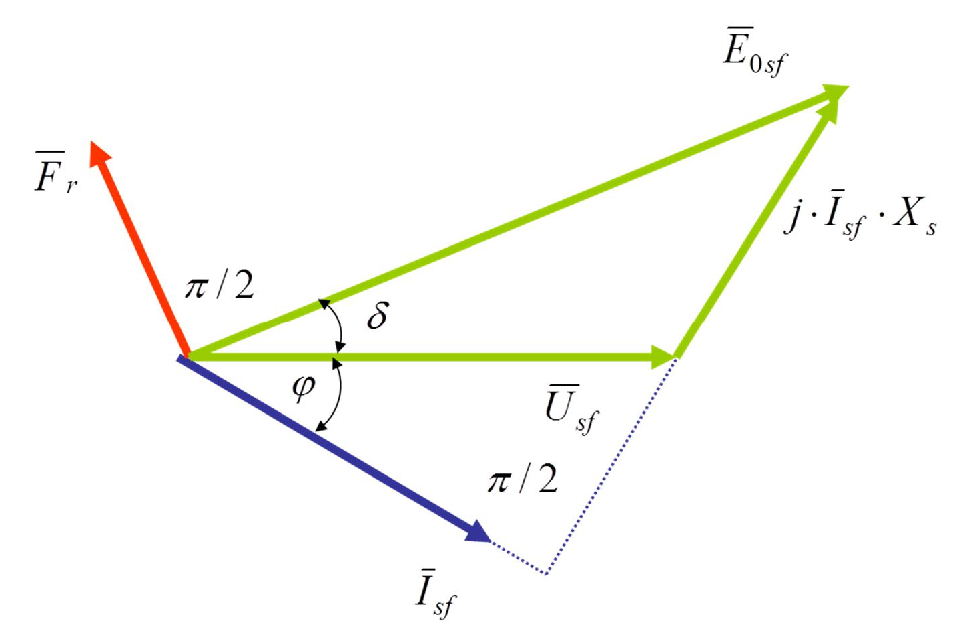

# Zadatak 13 — Sinhroni generator na mreži: snaga turbine +50 %, pobuda na polovinu

## Postavka

Trofazni sinhroni generator, čiji je statorski namotaj spregnut u **zvezdu**, radi paralelno na
mreži linijskog napona $380\ \mathrm{V}$. Generator daje struju od $100\ \mathrm{A}$ pri
induktivnom faktoru snage $0{,}707$, a indukovana elektromotorna sila praznog hoda po fazi iznosi
$250\ \mathrm{V}$. Koliko iznose **struja** i **faktor snage** ovog generatora ako snagu pogonske
mašine povećamo za $50\ \%$, a pobudu smanjimo na polovinu?

> **Prevod na običan jezik:** Imamo generator koji je već priključen na veliku elektroenergetsku
> mrežu i lepo radi: daje $100\ \mathrm{A}$ po fazi, a od te struje $70{,}7\ \%$ je "korisna"
> (aktivna) komponenta, jer je faktor snage $0{,}707$. Znamo i koliki bi napon generator pravio da
> je otkačen od svega (elektromotorna sila praznog hoda, $250\ \mathrm{V}$ po fazi). Onda operater
> uradi dve stvari **istovremeno**: (1) "dâ gas" turbini, pa u generator ulazi $50\ \%$ više
> mehaničke snage, i (2) smanji struju pobude (jednosmernu struju kroz rotor) na polovinu. Pitanje
> je: kolika će sada biti struja koju generator šalje u mrežu i koliki će biti novi faktor snage?
> Intuicija "manja pobuda → manja struja" ovde će se pokazati kao potpuno pogrešna — i baš zato je
> zadatak poučan.

## Podaci

| Veličina | Oznaka | Vrednost | Šta ta veličina fizički znači |
|---|---|---|---|
| Linijski napon mreže | $U_{\mathrm{s}}$ | $380\ \mathrm{V}$ | Napon između dva fazna provodnika mreže; mreža je "kruta", pa je on nepromenljiv. |
| Sprega statora | — | zvezda (Y) | Krajevi tri fazna namotaja spojeni u zajedničku tačku; fazni napon je $\sqrt{3}$ puta manji od linijskog. |
| Fazna struja statora (režim 1) | $I_{\mathrm{sf}}$ | $100\ \mathrm{A}$ | Struja koja teče kroz jedan fazni namotaj statora i odlazi u mrežu. |
| Faktor snage (režim 1) | $\cos\varphi$ | $0{,}707$ (ind.) | Kosinus ugla između faznog napona i fazne struje; "ind." znači da struja kasni za naponom — generator daje reaktivnu snagu mreži. |
| Ems praznog hoda po fazi (režim 1) | $E_{0\mathrm{sf}}$ | $250\ \mathrm{V}$ | Napon koji rotor svojim fluksom indukuje u jednoj fazi statora kada generator ne daje struju; zavisi samo od pobude i brzine. |
| Snaga pogonske mašine (režim 2) | $P'$ | $1{,}5 \cdot P$ | Turbina ubacuje $50\ \%$ više mehaničke snage; uz zanemarenje gubitaka toliko raste i električna snaga. |
| Struja pobude (režim 2) | $I_{\mathrm{p}}'$ | $0{,}5 \cdot I_{\mathrm{p}}$ | Jednosmerna struja rotora smanjena na polovinu — rotor pravi upola slabiji fluks. |

Oznake sa **prim** ($I_{\mathrm{sf}}'$, $\cos\varphi'$, $\delta'$, $E_{0\mathrm{sf}}'$…) se kroz
ceo zadatak odnose na **drugi režim** (posle promene), a oznake bez prim na **prvi režim** (zatečeno
stanje). Indeks $\mathrm{s}$ znači "stator", indeks $\mathrm{f}$ "fazna vrednost".

## Šta se traži i zašto

**1) Struja statora u novom režimu, $I_{\mathrm{sf}}'$.** Struja određuje zagrevanje namotaja i
provodnika — ako promena režima natera struju preko nazivne vrednosti, generator se pregreva iako
možda daje sasvim "normalnu" aktivnu snagu. Inženjer zato uvek proverava šta manipulacije pobudom i
turbinom rade struji.

**2) Faktor snage u novom režimu, $\cos\varphi'$.** On kaže koliki deo struje je "koristan"
(prenosi aktivnu snagu), a koliki deo samo "šeta" reaktivnu snagu između mašine i mreže. Nizak
faktor snage znači velike struje i velike gubitke za istu korisnu snagu.

**Plan rešavanja** (običnim jezikom):

1. Iz linijskog napona i sprege zvezda nađemo fazni napon mreže.
2. Iz vektorskog dijagrama prvog režima izračunamo **sinhronu reaktansu** $X_{\mathrm{s}}$ — nju
   zadatak ne daje, ali je svi ostali podaci prvog režima jednoznačno određuju.
3. Izračunamo aktivnu snagu $P$ i **ugao opterećenja** $\delta$ u prvom režimu.
4. Iz dva zadata uslova (snaga $\times 1{,}5$, pobuda $\times 0{,}5$) preko ugaone karakteristike
   snage izvedemo koliki je novi ugao opterećenja: ispašće $\sin\delta' = 3\sin\delta$.
5. Kosinusnom teoremom u trouglu napona novog režima izračunamo novu struju $I_{\mathrm{sf}}'$.
6. Iz nove snage $P' = 1{,}5P$ i nove struje izračunamo novi faktor snage $\cos\varphi'$.

## Potrebna teorija — mini-lekcije

### 1. Generator na "krutoj" mreži: šta je fiksno, a šta mi kontrolišemo

Elektroenergetska mreža je ogromna u odnosu na jedan generator, pa se ponaša kao **kruta mreža**:
njen napon $U_{\mathrm{s}}$ i učestanost $f$ su konstantni, ma šta naš generator radio. Pošto je
učestanost fiksna, fiksna je i brzina obrtanja rotora (sinhrona brzina) — rotor ne može da ubrza
ni da uspori trajno, jedino može da promeni **ugao** pod kojim se vrti u odnosu na obrtno polje
mreže. Na raspolaganju su nam tačno **dve ručice**:

- **Pogonska mašina (turbina):** njome menjamo mehaničku snagu koja ulazi u generator, dakle
  **aktivnu snagu** $P$ koju generator predaje mreži. Njena posledica na dijagramu je promena
  **ugla opterećenja** $\delta$.
- **Pobuda (jednosmerna struja rotora $I_{\mathrm{p}}$):** njome menjamo jačinu rotorskog fluksa,
  dakle **elektromotornu silu** $E_{0\mathrm{sf}}$. Njena glavna posledica je promena razmene
  **reaktivne snage** sa mrežom.

U ovom zadatku operater pomera **obe** ručice odjednom, pa moramo pažljivo da razdvojimo šta koja
radi.

### 2. Elektromotorna sila praznog hoda i zašto je $E_{0\mathrm{sf}}' = 0{,}5 \cdot E_{0\mathrm{sf}}$

**Elektromotorna sila (ems) praznog hoda** $E_{0\mathrm{sf}}$ je napon indukovan u jednoj fazi
statora **samo** fluksom rotora — dakle napon koji bismo izmerili na krajevima statora kada
generator ne daje nikakvu struju. Fluks rotora pravi pobudna (jednosmerna) struja $I_{\mathrm{p}}$
kroz namotaj rotora, tj. magnetopobudna sila rotora $F_{\mathrm{r}}$. Ako je magnetno kolo
**linearno** (gvožđe nije zasićeno), fluks je srazmeran pobudnoj struji, pa je i ems srazmerna
pobudnoj struji:

$$E_{0\mathrm{sf}} \sim \Phi_{\mathrm{r}} \sim I_{\mathrm{p}}.$$

Zato: **pobuda na polovinu → ems na polovinu.** U stvarnoj mašini bi zbog zasićenja veza bila
blago nelinearna (opisuje je karakteristika praznog hoda), ali pošto nam ta karakteristika nije
data, prihvatamo linearnu pretpostavku — to izričito radi i originalna zbirka.

### 3. Sinhrona reaktansa $X_{\mathrm{s}}$ i naponska jednačina generatora

Kada generator daje struju, između ems $E_{0\mathrm{sf}}$ i napona na krajevima $U_{\mathrm{sf}}$
postoji pad napona na samom statoru. Taj pad ima dva uzroka, koja se spajaju u jednu veličinu:

- **reaktansa rasipanja statora** — od dela fluksa statora koji se zatvara oko samog namotaja
  i ne stiže do rotora;
- **reaktansa reakcije indukta** — od fluksa koji struja statora pravi u vazdušnom zazoru i koji
  se "sabira" sa rotorskim fluksom (indukt je stariji naziv za stator).

Njihov zbir je **sinhrona reaktansa** $X_{\mathrm{s}}$. Omski otpor statorskog namotaja
$R_{\mathrm{s}}$ je kod sinhronih mašina po pravilu zanemarljivo mali u odnosu na
$X_{\mathrm{s}}$, pa ga zanemarujemo. Naponska jednačina jedne faze generatora (sa kompleksnim,
vektorskim veličinama) tada glasi:

$$\overline{E}_{0\mathrm{sf}} = \overline{U}_{\mathrm{sf}} + j \cdot \overline{I}_{\mathrm{sf}} \cdot X_{\mathrm{s}}.$$

Rečima: ems koju pravi rotor jednaka je naponu mreže **plus** pad napona na sinhronoj reaktansi.
Množenje sa $j$ znači da je vektor pada napona zarotiran za $90^{\circ}$ **unapred** u odnosu na
vektor struje — to je opšte svojstvo napona na (idealnoj) reaktansi.

### 4. Vektorski dijagram nadpobuđenog generatora — kako se čita

Sledeća slika prikazuje vektorski dijagram sinhronog generatora u **nadpobuđenom** režimu
(objašnjenje pojma u mini-lekciji 8), tj. baš u režimu 1 našeg zadatka; detaljan vodič za
čitanje dat je u bloku ispod slike.

**Slika 13.1 —** Vektorski dijagram sinhronog generatora u nadpobuđenom režimu rada: napon mreže
$\overline{U}_{\mathrm{sf}}$, struja $\overline{I}_{\mathrm{sf}}$ koja kasni za ugao $\varphi$,
pad napona $j\overline{I}_{\mathrm{sf}}X_{\mathrm{s}}$ upravan na struju, ems praznog hoda
$\overline{E}_{0\mathrm{sf}}$ pod uglom opterećenja $\delta$, i magnetopobudna sila rotora
$\overline{F}_{\mathrm{r}}$ koja prednjači ems za $90^{\circ}$.

> **Kako čitati sliku 13.1:** Referentni fazor je fazni napon mreže
> $\overline{U}_{\mathrm{sf}}$ — **zelena** horizontalna strelica udesno (u našem zadatku
> $220\ \mathrm{V}$); svi fazori rotiraju suprotno kazaljci na satu, pa fazor ispod
> horizontale (pomeren u smeru kazaljke) kasni za naponom, a fazor iznad nje prednjači.
> **Plava** strelica ukoso dole-desno je struja $\overline{I}_{\mathrm{sf}}$
> ($100\ \mathrm{A}$): kasni za naponom za ugao $\varphi$ (luk između nje i napona; ovde
> tačno $45^{\circ}$, jer je $\cos\varphi = 0{,}707$). Od vrha napona diže se druga
> **zelena** strelica — pad napona $j\overline{I}_{\mathrm{sf}}X_{\mathrm{s}}$: množenje
> sa $j$ zakreće ga za $90^{\circ}$ unapred u odnosu na struju, pa je na nju upravan — tu
> upravnost pokazuju tačkasti (isprekidani) produžetak pravca struje i oznaka $\pi/2$ dole
> desno. Njegova stvarna dužina je $I_{\mathrm{sf}}X_{\mathrm{s}} = 100 \cdot 0{,}401825
> \approx 40\ \mathrm{V}$ — na crtežu je, radi čitljivosti, nacrtan srazmerno duži. Zbir
> napona i pada napona je treća, najduža **zelena** strelica — ems praznog hoda
> $\overline{E}_{0\mathrm{sf}}$ ($250\ \mathrm{V}$), koja prednjači naponu za ugao
> opterećenja $\delta$ (luk između $\overline{U}_{\mathrm{sf}}$ i
> $\overline{E}_{0\mathrm{sf}}$; izračunato $\delta \approx 6{,}5^{\circ}$, na slici
> uvećan radi preglednosti). Ta tri fazora zatvaraju trougao napona iz kog u Koraku 3
> računamo $X_{\mathrm{s}}$, a u Koraku 8 novu struju. **Crvena** strelica gore-levo je
> magnetopobudna sila rotora $\overline{F}_{\mathrm{r}}$: prednjači ems za $\pi/2$
> (označeno lukom između $\overline{F}_{\mathrm{r}}$ i $\overline{E}_{0\mathrm{sf}}$), jer
> indukovani napon uvek kasni četvrt periode za fluksom koji ga indukuje. Šta treba da
> zaključiš: pošto je $E_{0\mathrm{sf}} = 250\ \mathrm{V} > U_{\mathrm{sf}} = 220\ \mathrm{V}$
> i struja kasni za naponom, mašina je nadpobuđena i daje mreži reaktivnu snagu — a istim
> trouglom, samo sa $E_{0\mathrm{sf}}' = 125\ \mathrm{V}$ i novim uglom $\delta'$,
> rešićemo i drugi režim.

Tri vektora — $\overline{U}_{\mathrm{sf}}$, $j\overline{I}_{\mathrm{sf}}X_{\mathrm{s}}$ i
$\overline{E}_{0\mathrm{sf}}$ — zatvaraju **trougao napona**. Ceo zadatak se rešava geometrijom
tog trougla: jednom preko Pitagorine teoreme (mini-lekcija 5), jednom preko kosinusne teoreme
(mini-lekcija 6).

### 5. Pitagorin izraz za ems: $E_{0\mathrm{sf}} = \sqrt{[U_{\mathrm{sf}}\cos\varphi]^2 + [U_{\mathrm{sf}}\sin\varphi + I_{\mathrm{sf}}X_{\mathrm{s}}]^2}$

Ovaj izraz dobijamo razlaganjem vektora na dva upravna pravca: **pravac struje** i pravac upravan
na nju. Zašto baš na pravac struje? Zato što je pad napona $jI_{\mathrm{sf}}X_{\mathrm{s}}$
**tačno upravan** na struju, pa u pravcu struje nema nikakvu komponentu — račun se maksimalno
pojednostavljuje.

- Komponenta napona mreže **duž** struje: $U_{\mathrm{sf}}\cos\varphi$ (jer je $\varphi$ ugao
  između napona i struje). Pad napona tu ne doprinosi ništa, pa je to ujedno i komponenta ems duž
  struje.
- Komponenta napona mreže **upravno** na struju: $U_{\mathrm{sf}}\sin\varphi$. Na nju se dodaje
  ceo pad napona $I_{\mathrm{sf}}X_{\mathrm{s}}$, pa je upravna komponenta ems
  $U_{\mathrm{sf}}\sin\varphi + I_{\mathrm{sf}}X_{\mathrm{s}}$.

Dužina (intenzitet) vektora ems je, po Pitagorinoj teoremi, koren zbira kvadrata dve upravne
komponente:

$$E_{0\mathrm{sf}} = \sqrt{\left[U_{\mathrm{sf}}\cos\varphi\right]^2 + \left[U_{\mathrm{sf}}\sin\varphi + I_{\mathrm{sf}}X_{\mathrm{s}}\right]^2}.$$

U ovoj jednačini su $E_{0\mathrm{sf}}$, $U_{\mathrm{sf}}$, $I_{\mathrm{sf}}$ i $\cos\varphi$
poznati, pa iz nje možemo da **izvučemo** jedinu nepoznatu — $X_{\mathrm{s}}$. To ćemo uraditi u
Koraku 3.

### 6. Kosinusna teorema u trouglu napona

Kosinusna teorema je uopštenje Pitagorine teoreme za trougao koji **nije** pravougli: ako trougao
ima stranice $a$, $b$, $c$ i ugao $\gamma$ između stranica $a$ i $b$ (naspram stranice $c$), onda
je

$$c^2 = a^2 + b^2 - 2ab\cos\gamma.$$

U našem trouglu napona stranice su $U_{\mathrm{sf}}$, $E_{0\mathrm{sf}}$ i
$I_{\mathrm{sf}}X_{\mathrm{s}}$, a ugao između $U_{\mathrm{sf}}$ i $E_{0\mathrm{sf}}$ je upravo
ugao opterećenja $\delta$ (vidi sliku 13.1). Stranica "naspram" ugla $\delta$ je pad napona, pa
kosinusna teorema daje:

$$\left(I_{\mathrm{sf}}X_{\mathrm{s}}\right)^2 = U_{\mathrm{sf}}^2 + E_{0\mathrm{sf}}^2 - 2 \cdot U_{\mathrm{sf}} \cdot E_{0\mathrm{sf}} \cdot \cos\delta.$$

Ovaj oblik je zlata vredan kada znamo $\delta$, a **ne znamo** $\varphi$ — što je tačno situacija
u drugom režimu našeg zadatka: tamo ćemo prvo saznati novi ugao opterećenja, a struju ćemo dobiti
baš iz ove jednačine.

### 7. Ugaona karakteristika aktivne snage: $P = \dfrac{3\,E_{0\mathrm{sf}}\,U_{\mathrm{sf}}\,\sin\delta}{X_{\mathrm{s}}}$

Ovo je najvažnija formula sinhrone mašine sa cilindričnim rotorom. Evo kratkog izvođenja u dve
linije. Trofazna aktivna snaga je $P = 3\,U_{\mathrm{sf}}\,I_{\mathrm{sf}}\cos\varphi$. Sa
vektorskog dijagrama (postavimo $\overline{U}_{\mathrm{sf}}$ horizontalno): vertikalna komponenta
ems je $E_{0\mathrm{sf}}\sin\delta$, a vertikalna komponenta pada napona je
$X_{\mathrm{s}}I_{\mathrm{sf}}\cos\varphi$ (jer je pad upravan na struju, a struja je pod uglom
$\varphi$ ispod horizontale). Pošto napon mreže nema vertikalnu komponentu, te dve vertikalne
komponente moraju biti jednake:

$$E_{0\mathrm{sf}}\sin\delta = X_{\mathrm{s}}\,I_{\mathrm{sf}}\cos\varphi
\quad\Rightarrow\quad
I_{\mathrm{sf}}\cos\varphi = \frac{E_{0\mathrm{sf}}\sin\delta}{X_{\mathrm{s}}}.$$

Uvrstimo to u izraz za snagu:

$$P = 3\,U_{\mathrm{sf}}\,I_{\mathrm{sf}}\cos\varphi = \frac{3 \cdot E_{0\mathrm{sf}} \cdot U_{\mathrm{sf}} \cdot \sin\delta}{X_{\mathrm{s}}}.$$

**Intuicija:** ems i napon mreže su dva "magneta" spregnuta preko zazora; snaga koju prenose
srazmerna je proizvodu njihovih jačina i sinusu ugla između njih — kao dva magneta vezana
elastičnom oprugom: što je opruga više "uvrnuta" (veći $\delta$), veća sila se prenosi. Maksimum
prenosive snage je pri $\delta = 90^{\circ}$; preko toga mašina **ispada iz sinhronizma**.

### 8. Nadpobuđen i podpobuđen režim — ko kome daje reaktivnu snagu

- **Nadpobuđen** generator (jaka pobuda, veliko $E_{0\mathrm{sf}}$): pored aktivne snage **daje**
  mreži i reaktivnu snagu; struja kasni za naponom (induktivan faktor snage sa strane mreže).
  To je režim 1 našeg zadatka — zato dijagram na slici 13.1 ima struju ispod napona.
- **Podpobuđen** generator (slaba pobuda, malo $E_{0\mathrm{sf}}$): aktivnu snagu i dalje daje
  (nju diktira turbina!), ali reaktivnu snagu **uzima** iz mreže, jer njegov oslabljeni rotor ne
  može sam da namagnetiše mašinu — mreža mu "pozajmljuje" magnećenje kroz reaktivnu struju.

Ova podela nam treba na kraju zadatka da bismo razumeli zašto je struja u režimu 2 toliko porasla:
prepolovljena pobuda ($E_{0\mathrm{sf}}' = 125\ \mathrm{V}$, znatno manje od
$U_{\mathrm{sf}} = 220\ \mathrm{V}$) gura mašinu duboko u podpobuđeni režim.

## Rešenje, korak po korak

### Korak 1: Fazni napon mreže

**Zašto ovaj korak:** Sve jednačine (naponska jednačina, trougao napona, ugaona karakteristika)
pišu se za **jednu fazu**, a zadatak daje **linijski** napon. Kod sprege zvezda fazni namotaj
stoji između faznog provodnika i zvezdišta, pa je fazni napon $\sqrt{3}$ puta manji od linijskog:

$$U_{\mathrm{sf}} = \frac{U_{\mathrm{s}}}{\sqrt{3}} = \frac{380}{\sqrt{3}} = 220\ \mathrm{V}.$$

**Šta smo dobili:** Standardnih $220\ \mathrm{V}$ po fazi — očekivano za mrežu $380\ \mathrm{V}$.
Ems praznog hoda ($250\ \mathrm{V}$) je veća od ovoga, što je prvi nagoveštaj da je generator
nadpobuđen.

### Korak 2: Sinus ugla faktora snage

**Zašto ovaj korak:** U Pitagorinom izrazu za ems (mini-lekcija 5) figurišu i $\cos\varphi$ i
$\sin\varphi$, a zadatak daje samo kosinus. Sinus dobijamo iz osnovnog trigonometrijskog
identiteta $\sin^2\varphi + \cos^2\varphi = 1$, odakle je:

$$\sin\varphi = \sqrt{1 - \cos^2\varphi} = \sqrt{1 - 0{,}707^2} = \sqrt{1 - 0{,}499849} = \sqrt{0{,}500151} \approx 0{,}707.$$

**Šta smo dobili:** $\cos\varphi = \sin\varphi = 0{,}707$ — to je zato što je
$0{,}707 \approx \sqrt{2}/2$, tj. $\varphi = 45^{\circ}$. Struja kasni za naponom tačno $45^{\circ}$:
aktivna i reaktivna komponenta struje su jednake.

### Korak 3: Sinhrona reaktansa $X_{\mathrm{s}}$

**Zašto ovaj korak:** $X_{\mathrm{s}}$ nije data u postavci, a bez nje ne možemo ni da napišemo
ugaonu karakteristiku ni kosinusnu teoremu za drugi režim. Srećom, u prvom režimu znamo **sve
ostalo** u Pitagorinom izrazu za ems, pa je $X_{\mathrm{s}}$ jedina nepoznata.

Polazimo od izraza iz mini-lekcije 5:

$$E_{0\mathrm{sf}} = \sqrt{\left[U_{\mathrm{sf}}\cos\varphi\right]^2 + \left[U_{\mathrm{sf}}\sin\varphi + I_{\mathrm{sf}}X_{\mathrm{s}}\right]^2}.$$

Rešavamo po $X_{\mathrm{s}}$, prelaz po prelaz. Prvo kvadriramo obe strane da se oslobodimo
korena:

$$E_{0\mathrm{sf}}^2 = \left[U_{\mathrm{sf}}\cos\varphi\right]^2 + \left[U_{\mathrm{sf}}\sin\varphi + I_{\mathrm{sf}}X_{\mathrm{s}}\right]^2.$$

Prebacimo prvi sabirak levo:

$$\left[U_{\mathrm{sf}}\sin\varphi + I_{\mathrm{sf}}X_{\mathrm{s}}\right]^2 = E_{0\mathrm{sf}}^2 - \left[U_{\mathrm{sf}}\cos\varphi\right]^2.$$

Korenujemo obe strane (uzimamo pozitivan koren, jer su i $U_{\mathrm{sf}}\sin\varphi$ i
$I_{\mathrm{sf}}X_{\mathrm{s}}$ pozitivne veličine):

$$U_{\mathrm{sf}}\sin\varphi + I_{\mathrm{sf}}X_{\mathrm{s}} = \sqrt{E_{0\mathrm{sf}}^2 - \left[U_{\mathrm{sf}}\cos\varphi\right]^2}.$$

Prebacimo $U_{\mathrm{sf}}\sin\varphi$ desno i podelimo sa $I_{\mathrm{sf}}$:

$$X_{\mathrm{s}} = \frac{\sqrt{E_{0\mathrm{sf}}^2 - \left[U_{\mathrm{sf}}\cos\varphi\right]^2} - U_{\mathrm{sf}}\sin\varphi}{I_{\mathrm{sf}}}.$$

Sada uvrštavamo brojeve. Najpre međuvrednosti:

$$U_{\mathrm{sf}}\cos\varphi = 220 \cdot 0{,}707 = 155{,}54\ \mathrm{V}, \qquad
\left(155{,}54\right)^2 = 24192{,}69\ \mathrm{V}^2,$$

$$E_{0\mathrm{sf}}^2 = 250^2 = 62500\ \mathrm{V}^2, \qquad
62500 - 24192{,}69 = 38307{,}31\ \mathrm{V}^2, \qquad
\sqrt{38307{,}31} = 195{,}72\ \mathrm{V}.$$

Pa je:

$$X_{\mathrm{s}} = \frac{195{,}72 - 220 \cdot 0{,}707}{100} = \frac{195{,}72 - 155{,}54}{100} = \frac{40{,}18}{100} = 0{,}401825\ \mathrm{\Omega}.$$

**Šta smo dobili:** Sinhronu reaktansu od oko $0{,}4\ \mathrm{\Omega}$ — mali broj oma, sasvim
tipično za mašinu ove naponsko-strujne klase. Napomena: iako u brojiocu oduzimamo napone (volte),
deljenjem strujom (amperima) dobijamo ome, kako i treba za reaktansu.

### Korak 4: Aktivna snaga u prvom režimu

**Zašto ovaj korak:** Uslov "snaga pogonske mašine veća za $50\ \%$" možemo iskoristiti tek kad
znamo koliko snage generator daje **sada**. Uz zanemarenje gubitaka, snaga pogonske mašine jednaka
je električnoj snazi koju generator predaje mreži. Trofazna aktivna snaga preko faznih veličina:

$$P = 3 \cdot U_{\mathrm{sf}} \cdot I_{\mathrm{sf}} \cdot \cos\varphi.$$

Ovde je $3$ broj faza, a proizvod $U_{\mathrm{sf}} I_{\mathrm{sf}} \cos\varphi$ je aktivna snaga
jedne faze. Uvrštavamo:

$$P = 3 \cdot 220 \cdot 100 \cdot 0{,}707 = 66000 \cdot 0{,}707 = 46662\ \mathrm{W} \approx 46{,}7\ \mathrm{kW}.$$

**Šta smo dobili:** Generator trenutno šalje mreži oko $46{,}7\ \mathrm{kW}$ aktivne snage.
Prividna snaga je $S = 3 U_{\mathrm{sf}} I_{\mathrm{sf}} = 66\ \mathrm{kVA}$, pa aktivna snaga
čini $70{,}7\ \%$ prividne — tačno koliko kaže faktor snage.

### Korak 5: Ugao opterećenja u prvom režimu

**Zašto ovaj korak:** Ugao $\delta$ je "ručica" preko koje mašina prenosi aktivnu snagu
(mini-lekcija 7). Da bismo videli kako se on menja u novom režimu, prvo ga moramo znati u starom.
Iz ugaone karakteristike:

$$P = \frac{3 \cdot E_{0\mathrm{sf}} \cdot U_{\mathrm{sf}} \cdot \sin\delta}{X_{\mathrm{s}}}$$

izrazimo $\sin\delta$ (pomnožimo obe strane sa $X_{\mathrm{s}}$, podelimo sa
$3 E_{0\mathrm{sf}} U_{\mathrm{sf}}$):

$$\sin\delta = \frac{P \cdot X_{\mathrm{s}}}{3 \cdot E_{0\mathrm{sf}} \cdot U_{\mathrm{sf}}}
= \frac{46662 \cdot 0{,}401825}{3 \cdot 250 \cdot 220}
= \frac{18750}{165000} = 0{,}1136361.$$

**Šta smo dobili:** $\sin\delta \approx 0{,}114$, tj. $\delta \approx 6{,}5^{\circ}$. Mali ugao —
mašina je opterećena daleko ispod granice stabilnosti ($\delta = 90^{\circ}$), ima ogromnu
rezervu.

### Korak 6: Novi režim — nova ems i novi ugao opterećenja

**Zašto ovaj korak:** Sada "povlačimo obe ručice" i prevodimo uslove zadatka u jednačine.

**(a) Pobuda na polovinu.** Po mini-lekciji 2, uz linearno magnetno kolo ems prati pobudnu
struju:

$$I_{\mathrm{p}}' = 0{,}5 \cdot I_{\mathrm{p}}
\quad\Rightarrow\quad
E_{0\mathrm{sf}}' = 0{,}5 \cdot E_{0\mathrm{sf}} = 0{,}5 \cdot 250 = 125\ \mathrm{V}.$$

**(b) Snaga turbine +50 %.** Uz zanemarenje gubitaka, izlazna električna snaga raste isto toliko:

$$P' = 1{,}5 \cdot P.$$

**(c) Šta to znači za ugao opterećenja.** Napišimo ugaonu karakteristiku za oba režima i
iskoristimo uslov (b). Napon mreže $U_{\mathrm{sf}}$ i reaktansa $X_{\mathrm{s}}$ su isti u oba
režima (mreža je kruta, mašina je ista):

$$\frac{3 \cdot E_{0\mathrm{sf}}' \cdot U_{\mathrm{sf}} \cdot \sin\delta'}{X_{\mathrm{s}}}
= 1{,}5 \cdot \frac{3 \cdot E_{0\mathrm{sf}} \cdot U_{\mathrm{sf}} \cdot \sin\delta}{X_{\mathrm{s}}}.$$

Obe strane pomnožimo sa $X_{\mathrm{s}}$ i podelimo sa $3 U_{\mathrm{sf}}$ (sve to je isto levo i
desno, pa se skraćuje):

$$E_{0\mathrm{sf}}' \cdot \sin\delta' = 1{,}5 \cdot E_{0\mathrm{sf}} \cdot \sin\delta.$$

Sada uvrstimo $E_{0\mathrm{sf}}' = 0{,}5 \cdot E_{0\mathrm{sf}}$ na levu stranu:

$$0{,}5 \cdot E_{0\mathrm{sf}} \cdot \sin\delta' = 1{,}5 \cdot E_{0\mathrm{sf}} \cdot \sin\delta.$$

Podelimo obe strane sa $0{,}5 \cdot E_{0\mathrm{sf}}$:

$$\sin\delta' = \frac{1{,}5}{0{,}5} \cdot \sin\delta = 3 \cdot \sin\delta.$$

Brojčano:

$$\sin\delta' = 3 \cdot 0{,}1136361 = 0{,}3409083.$$

**Šta smo dobili:** Sinus ugla opterećenja **utrostručio** se — faktor $1{,}5$ zbog veće snage i
faktor $2$ zbog upola slabije ems (slabija "magnetna opruga" mora da se uvrne više da prenese
istu, a kamoli veću snagu). Ugao je sada $\delta' \approx 19{,}9^{\circ}$ — i dalje bezbedno ispod
$90^{\circ}$, mašina ostaje u sinhronizmu.

### Korak 7: Kosinus novog ugla opterećenja

**Zašto ovaj korak:** U kosinusnoj teoremi (sledeći korak) figuriše $\cos\delta'$, a mi imamo
$\sin\delta'$. Opet osnovni identitet:

$$\cos\delta' = \sqrt{1 - \sin^2\delta'} = \sqrt{1 - 0{,}3409083^2} = \sqrt{1 - 0{,}1162185} = \sqrt{0{,}8837815} = 0{,}9400965.$$

**Šta smo dobili:** $\cos\delta' \approx 0{,}94$ — ugao od $\approx 20^{\circ}$ još uvek ima
"visok" kosinus.

### Korak 8: Struja generatora u novom režimu

**Zašto ovaj korak:** Ovo je prva od dve tražene veličine. U novom režimu znamo sve tri "tačke"
trougla napona osim struje: $U_{\mathrm{sf}} = 220\ \mathrm{V}$,
$E_{0\mathrm{sf}}' = 125\ \mathrm{V}$ i ugao $\delta'$ između njih. Kosinusna teorema
(mini-lekcija 6), napisana za novi režim, daje treću stranicu — pad napona
$I_{\mathrm{sf}}' X_{\mathrm{s}}$:

$$\left(I_{\mathrm{sf}}' \cdot X_{\mathrm{s}}\right)^2 = U_{\mathrm{sf}}^2 + E_{0\mathrm{sf}}'^2 - 2 \cdot U_{\mathrm{sf}} \cdot E_{0\mathrm{sf}}' \cdot \cos\delta'.$$

Korenujemo obe strane pa podelimo sa $X_{\mathrm{s}}$:

$$I_{\mathrm{sf}}' = \frac{\sqrt{U_{\mathrm{sf}}^2 + E_{0\mathrm{sf}}'^2 - 2 \cdot U_{\mathrm{sf}} \cdot E_{0\mathrm{sf}}' \cdot \cos\delta'}}{X_{\mathrm{s}}}.$$

Uvrštavamo brojeve, sabirak po sabirak pod korenom:

$$U_{\mathrm{sf}}^2 = 220^2 = 48400, \qquad
E_{0\mathrm{sf}}'^2 = 125^2 = 15625,$$

$$2 \cdot U_{\mathrm{sf}} \cdot E_{0\mathrm{sf}}' \cdot \cos\delta' = 2 \cdot 220 \cdot 125 \cdot 0{,}9400965 = 55000 \cdot 0{,}9400965 = 51705{,}3,$$

$$48400 + 15625 - 51705{,}3 = 12319{,}7, \qquad \sqrt{12319{,}7} = 110{,}99\ \mathrm{V}.$$

Pa je:

$$I_{\mathrm{sf}}' = \frac{110{,}99}{0{,}401825} = 276{,}22\ \mathrm{A} \approx 276{,}2\ \mathrm{A}.$$

**Šta smo dobili:** Struja je skočila sa $100\ \mathrm{A}$ na oko $276\ \mathrm{A}$ — gotovo se
**utrostručila**, iako smo pobudu smanjili! To je centralna pouka zadatka i objasnićemo je odmah u
sledećem koraku i u proveri smisla.

### Korak 9: Faktor snage u novom režimu

**Zašto ovaj korak:** Ovo je druga tražena veličina. Aktivnu snagu novog režima znamo iz uslova
zadatka:

$$P' = 1{,}5 \cdot P = 1{,}5 \cdot 46662 = 69993\ \mathrm{W} \approx 70\ \mathrm{kW}.$$

Sa druge strane, aktivna snaga se uvek može napisati preko struje i faktora snage:

$$P' = 3 \cdot U_{\mathrm{sf}} \cdot I_{\mathrm{sf}}' \cdot \cos\varphi'.$$

Jedina nepoznata je $\cos\varphi'$; podelimo obe strane sa
$3 \cdot U_{\mathrm{sf}} \cdot I_{\mathrm{sf}}'$:

$$\cos\varphi' = \frac{P'}{3 \cdot U_{\mathrm{sf}} \cdot I_{\mathrm{sf}}'}
= \frac{69993}{3 \cdot 220 \cdot 276{,}22}
= \frac{69993}{182308{,}5} = 0{,}3839 \approx 0{,}384.$$

> **Napomena o originalu:** U zbirci na ovom mestu piše rezultat $0{,}393926$. To je štamparska
> greška u jednoj cifri: sa vrednostima **iz same zbirke** ($P' = 69993\ \mathrm{W}$,
> $I_{\mathrm{sf}}' = 276{,}22499\ \mathrm{A}$, $U_{\mathrm{sf}} = 220\ \mathrm{V}$) količnik
> iznosi $69993 / 182308{,}5 = 0{,}383926$, dakle **0,38…**, a ne 0,39… . Ispravan rezultat je
> $\cos\varphi' \approx 0{,}384$.

**Šta smo dobili:** Faktor snage je pao sa $0{,}707$ na svega $\approx 0{,}384$. Sada je samo
$38\ \%$ struje "korisno"; ostatak je reaktivna struja kojom podpobuđena mašina **vuče magnećenje
iz mreže** (mini-lekcija 8): sa $E_{0\mathrm{sf}}' = 125\ \mathrm{V} < U_{\mathrm{sf}} =
220\ \mathrm{V}$ rotor više ne može sam da namagnetiše mašinu, pa mreža nadoknađuje razliku
reaktivnom strujom. Zato struja raste na $276\ \mathrm{A}$ iako aktivna snaga raste "samo" $1{,}5$
puta. Karakter faktora snage se pri tome promenio: u režimu 1 generator je reaktivnu snagu
**davao** mreži, u režimu 2 je **uzima** iz nje.

## Česte greške i zamke

1. **Računanje sa linijskim naponom.** Ako se u trougao napona i ugaonu karakteristiku uvrsti
   $380\ \mathrm{V}$ umesto faznih $220\ \mathrm{V}$, svi rezultati "otplivaju"
   (npr. $X_{\mathrm{s}}$ ispadne negativna ili besmislena, jer je $E_{0\mathrm{sf}} = 250\ \mathrm{V}$
   fazna vrednost). Pravilo: sve jednofazne jednačine — samo sa faznim veličinama.
2. **Mešanje uglova $\varphi$ i $\delta$.** Ugao $\varphi$ je između **napona i struje** (govori o
   faktoru snage), a $\delta$ između **napona i ems** (govori o prenosu aktivne snage). U
   kosinusnoj teoremi (Korak 8) mora stajati $\cos\delta'$, nikako $\cos\varphi'$.
3. **"Snaga +50 % ⇒ struja +50 %".** Netačno, jer se faktor snage menja! Struja je porasla
   $2{,}76$ puta, a ne $1{,}5$ puta — reaktivna komponenta struje eksplodira zbog slabe pobude.
4. **"Manja pobuda ⇒ manja struja".** Takođe netačno, čak suprotno: podpobuđena mašina mora da
   uzima reaktivnu struju iz mreže, pa ukupna struja raste. Pobuda upravlja *smerom i količinom
   reaktivne snage*, a ne direktno "jačinom" generatora.
5. **Zaboravljen faktor 2 iz pobude u odnosu uglova.** Uslov $P' = 1{,}5P$ ne daje
   $\sin\delta' = 1{,}5\sin\delta$, jer se **istovremeno** prepolovila i ems: ispravno je
   $\sin\delta' = (1{,}5/0{,}5)\sin\delta = 3\sin\delta$.
6. **Slepo prepisivanje $\cos\varphi' = 0{,}3939$ iz zbirke** — vidi napomenu o originalu u
   Koraku 9: ispravna vrednost je $0{,}3839$.

## Rezime rezultata

| Veličina | Oznaka | Vrednost |
|---|---|---|
| Fazni napon mreže | $U_{\mathrm{sf}}$ | $220\ \mathrm{V}$ |
| Sinhrona reaktansa (izračunata usput) | $X_{\mathrm{s}}$ | $0{,}401825\ \mathrm{\Omega} \approx 0{,}402\ \mathrm{\Omega}$ |
| Aktivna snaga, režim 1 | $P$ | $46662\ \mathrm{W} \approx 46{,}7\ \mathrm{kW}$ |
| Sinus ugla opterećenja, režim 1 | $\sin\delta$ | $0{,}1136$ ($\delta \approx 6{,}5^{\circ}$) |
| Ems praznog hoda, režim 2 | $E_{0\mathrm{sf}}'$ | $125\ \mathrm{V}$ |
| Sinus ugla opterećenja, režim 2 | $\sin\delta'$ | $0{,}3409$ ($\delta' \approx 19{,}9^{\circ}$) |
| Aktivna snaga, režim 2 | $P'$ | $69993\ \mathrm{W} \approx 70\ \mathrm{kW}$ |
| **Struja statora, režim 2 (traženo)** | $I_{\mathrm{sf}}'$ | $\approx 276{,}2\ \mathrm{A}$ |
| **Faktor snage, režim 2 (traženo)** | $\cos\varphi'$ | $\approx 0{,}384$ (u zbirci štamparski $0{,}394$) |

## Provera smisla

**1) Rekonstrukcija ems iz izračunate reaktanse.** Ako je $X_{\mathrm{s}}$ dobro izračunata,
Pitagorin izraz mora da vrati zadatih $250\ \mathrm{V}$:

$$E_{0\mathrm{sf}} = \sqrt{155{,}54^2 + \left(155{,}54 + 100 \cdot 0{,}401825\right)^2}
= \sqrt{24192{,}7 + 195{,}72^2} = \sqrt{24192{,}7 + 38307{,}3} = \sqrt{62500} = 250\ \mathrm{V}. \checkmark$$

**2) Provera snage novog režima kroz ugaonu karakteristiku.** Nova struja i ugao moraju biti
saglasni sa $P' = 1{,}5P$:

$$P' = \frac{3 \cdot E_{0\mathrm{sf}}' \cdot U_{\mathrm{sf}} \cdot \sin\delta'}{X_{\mathrm{s}}}
= \frac{3 \cdot 125 \cdot 220 \cdot 0{,}3409083}{0{,}401825} \approx 69993\ \mathrm{W} = 1{,}5 \cdot 46662\ \mathrm{W}. \checkmark$$

**3) Provera preko aktivne komponente struje.** Napon mreže je konstantan, pa aktivna snaga raste
tačno koliko i aktivna komponenta struje. U režimu 1:
$I_{\mathrm{sf}}\cos\varphi = 100 \cdot 0{,}707 = 70{,}7\ \mathrm{A}$. U režimu 2:
$I_{\mathrm{sf}}'\cos\varphi' = 276{,}22 \cdot 0{,}3839 = 106{,}05\ \mathrm{A}$. Odnos:
$106{,}05 / 70{,}7 = 1{,}50$ — tačno $50\ \%$ više, kako zadatak i traži. $\checkmark$ (Usput,
ovo dodatno potvrđuje da je $\cos\varphi' = 0{,}384$ ispravno, a $0{,}394$ štamparska greška:
sa $0{,}394$ odnos bi bio $1{,}54$, što bi narušilo uslov zadatka.)

**4) Granični slučaj — stabilnost.** Novi ugao opterećenja $\delta' \approx 19{,}9^{\circ}$ je
daleko ispod $90^{\circ}$, pa mašina posle obe promene ostaje u sinhronizmu; da je
$\sin\delta' = 3\sin\delta$ ispalo veće od $1$, jednačina ne bi imala rešenje — to bi značilo da
mašina sa upola manjom pobudom fizički **ne može** da prenese $1{,}5P$ i ispala bi iz
sinhronizma. Ovde je rezerva još uvek udobna, ali znatno manja nego u režimu 1.

**5) Dimenziona provera reaktanse.** U Koraku 3 brojilac je u voltima, imenilac u amperima:
$\mathrm{V}/\mathrm{A} = \mathrm{\Omega}$ — reaktansa ispravno izlazi u omima. $\checkmark$
