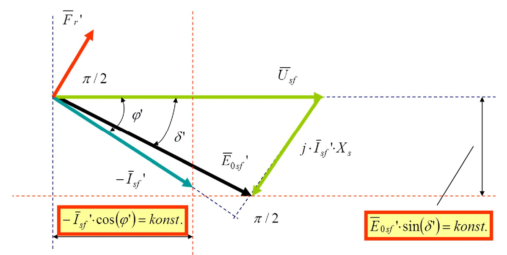
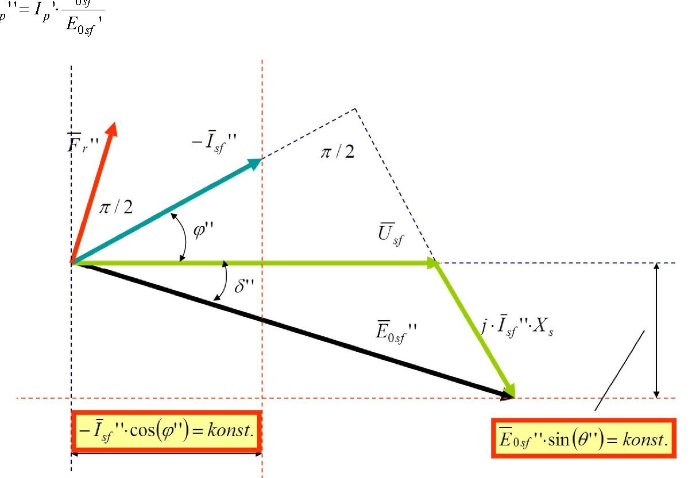

# Zadatak 14 — Kolika pobuda je potrebna da motor pređe sa induktivnog na kapacitivni faktor snage

## Postavka

Trofazni sinhroni motor u spoju zvezda priključen je na mrežu linijskog napona $380\ \mathrm{V}$ i frekvencije $50\ \mathrm{Hz}$. Sinhrona reaktansa motora iznosi $X_s = 0{,}2\ \mathrm{\Omega}$. Motor uzima struju od $300\ \mathrm{A}$ pri faktoru snage $0{,}5$ (induktivno). Struja pobude pri tome iznosi $100\ \mathrm{A}$.

Kolika treba da bude struja pobude ovog motora da bi, **uz isto aktivno opterećenje**, radio sa faktorom snage $0{,}865$ (kapacitivno)?

> **Prevod na običan jezik:** Imamo sinhroni motor koji vrti neki teret i pri tome iz mreže vuče struju od 300 A koja **kasni** za naponom (induktivni faktor snage 0,5 — motor, pored aktivne, uzima iz mreže i mnogo reaktivne snage). To je znak da mu je pobuda (jednosmerna struja u rotoru, trenutno 100 A) preslaba. Ako pobudnu struju povećamo, motor će prestati da uzima reaktivnu snagu i počeće da je **daje** mreži — struja će početi da **prednjači** naponu (kapacitivni faktor snage). Teret na vratilu ostaje isti, dakle aktivna snaga se ne menja — menja se samo "reaktivno ponašanje". Pitanje glasi: na koliko ampera treba podići pobudnu struju da bi faktor snage postao tačno 0,865 kapacitivno?

## Podaci

| Veličina | Oznaka | Vrednost | Šta ta veličina fizički znači |
|---|---|---|---|
| Linijski napon mreže | $U$ | $380\ \mathrm{V}$ | Efektivna vrednost napona između dva fazna provodnika mreže na koju je motor priključen. |
| Frekvencija mreže | $f$ | $50\ \mathrm{Hz}$ | Broj perioda naizmeničnog napona u sekundi; određuje sinhronu brzinu obrtanja motora. |
| Sprega statorskog namotaja | — | zvezda (Y) | Tri fazna namotaja spojena su jednim krajem u zajedničku tačku (zvezdište); svaki namotaj "vidi" fazni napon, koji je $\sqrt{3}$ puta manji od linijskog. |
| Sinhrona reaktansa | $X_s$ | $0{,}2\ \mathrm{\Omega}$ | Ukupna reaktansa jedne faze statora (rasipna reaktansa + reakcija indukta); modeluje ceo unutrašnji pad napona mašine, jer se otpor namotaja zanemaruje. |
| Struja motora u prvom režimu | $I_{sf}'$ | $300\ \mathrm{A}$ | Efektivna vrednost struje koju motor uzima iz mreže u polaznom (induktivnom) režimu; u sprezi zvezda fazna struja jednaka je linijskoj. |
| Faktor snage u prvom režimu | $\cos\varphi'$ | $0{,}5$ (ind.) | Kosinus ugla između napona i struje; "induktivno" znači da struja **kasni** za naponom — motor uzima reaktivnu snagu iz mreže. |
| Struja pobude u prvom režimu | $I_p'$ | $100\ \mathrm{A}$ | Jednosmerna struja kroz pobudni namotaj rotora u polaznom režimu; ona stvara fluks rotora. |
| Faktor snage u drugom režimu | $\cos\varphi''$ | $0{,}865$ (kap.) | Željeni faktor snage; "kapacitivno" znači da struja **prednjači** naponu — motor daje reaktivnu snagu mreži. |

Oznake sa jednim primom ($'$) odnose se na **prvi režim** (induktivni), a sa dva prima ($''$) na **drugi režim** (kapacitivni) — potpuno isto kao u originalnoj zbirci.

Tražena veličina: struja pobude u drugom režimu, $I_p''$.

## Šta se traži i zašto

**Struja pobude $I_p''$ potrebna za kapacitivni rad.** Ovo je pitanje od velikog praktičnog značaja. Fabrike su pune asinhronih motora i transformatora koji svi uzimaju reaktivnu (induktivnu) snagu iz mreže; elektrodistribucija tu reaktivnu snagu naplaćuje, jer ona bespotrebno opterećuje vodove. Sinhroni motor je jedina mašina u pogonu koja može istovremeno da vrti teret **i** da proizvodi reaktivnu snagu — dovoljno je da mu se poveća pobuda. Zato inženjer mora umeti da izračuna: "na koliko ampera pobude treba da odvrnem regulator da bi motor davao baš toliko reaktivne snage koliko mi treba, tj. da radi sa zadatim kapacitivnim faktorom snage?" Upravo to računamo ovde.

**Plan rešavanja (u 6 koraka, običnim jezikom):**

1. Pređemo sa linijskog na fazni napon (sprega je zvezda) — sve formule po fazi rade sa faznim vrednostima.
2. Za polazni (induktivni) režim zapišemo struju motora kao kompleksan broj — aktivni deo (u fazi sa naponom) i reaktivni deo (normalan na napon).
3. Iz naponske jednačine izračunamo unutrašnju elektromotornu silu (EMS) praznog hoda $E_{0sf}'$ u prvom režimu — ona je "merilo" trenutne pobude.
4. Iskoristimo ključnu činjenicu da se aktivno opterećenje ne menja: aktivna komponenta struje ostaje tačno ista, a reaktivnu komponentu u novom režimu izračunamo iz zadatog kapacitivnog faktora snage (i okrenemo joj znak!).
5. Ponovo iz naponske jednačine izračunamo EMS praznog hoda $E_{0sf}''$ u drugom režimu.
6. Pošto je EMS srazmerna pobudnoj struji (linearno magnetno kolo), novu pobudnu struju dobijamo prostom proporcijom: $I_p'' = I_p'\cdot E_{0sf}''/E_{0sf}'$.

## Potrebna teorija — mini-lekcije

### Mini-lekcija 1: Sinhroni motor sa cilindričnim rotorom i EMS praznog hoda

Sinhrona mašina na rotoru nosi pobudni namotaj kroz koji teče **jednosmerna** struja — pobudna struja $I_p$. Ona stvara magnetni fluks rotora. Rotor se obrće tačno sinhronom brzinom (nametnutom frekvencijom mreže), pa njegov fluks u statorskim namotajima indukuje naizmeničnu elektromotornu silu. Kada statorska struja iznosi nula (prazan hod), na krajevima jedne faze meri se upravo ta EMS — zato se zove **indukovana EMS praznog hoda**, $E_{0sf}$ (indeks: $0$ = prazan hod, $s$ = stator, $f$ = fazna vrednost). Njena veličina zavisi samo od pobudne struje (brzina je na mreži uvek sinhrona), pa je $E_{0sf}$ praktično "instrument" kojim merimo jačinu pobude.

Kod mašine sa **cilindričnim rotorom** (gladak rotor, ravnomeran vazdušni zazor) jedna faza statora modeluje se najjednostavnije moguće: idealan naponski izvor $E_{0sf}$ na red sa jednom jedinom reaktansom — **sinhronom reaktansom** $X_s$. Ona objedinjuje rasipnu reaktansu statorskog namotaja i reakciju indukta (činjenicu da i statorske struje prave svoje obrtno polje koje se slaže sa poljem rotora). Otpor statorskog namotaja je kod ovakvih mašina zanemarivo mali prema $X_s$, pa ga izostavljamo.

### Mini-lekcija 2: Naponska jednačina i konvencija sa "$-\bar{I}_{sf}$" (zašto svuda stoji minus)

Sve veličine pišemo kao **fazore** (kompleksne brojeve): crta iznad simbola, npr. $\bar{U}_{sf}$, znači da veličina ima i efektivnu vrednost (modul) i fazni ugao. $j$ je imaginarna jedinica ($j^2=-1$); množenje fazora sa $j$ zakreće ga za $90^\circ$ unapred (suprotno kazaljci na satu).

Originalna zbirka jednačine sinhrone mašine piše u **generatorskoj konvenciji**: struja $\bar{I}_{sf}$ je pozitivna kada **izlazi** iz mašine (kada mašina radi kao generator). U toj konvenciji naponska jednačina po fazi glasi:

$$\bar{E}_{0sf} = \bar{U}_{sf} + j\cdot\bar{I}_{sf}\cdot X_s$$

Rečima: unutrašnja EMS jednaka je naponu mreže **uvećanom** za pad napona na sinhronoj reaktansi (jer generator "gura" struju kroz sopstvenu reaktansu ka mreži). Kod **motora** struja fizički teče u suprotnom smeru — **u** mašinu. Struja motora je zato u ovoj konvenciji $-\bar{I}_{sf}$: veličina sa minusom ispred je ona koju bismo izmerili ampermetrom na priključku motora i čiji fazni stav prema naponu daje faktor snage motora. Zbog toga u celom zadatku (i na slikama) motorska struja nosi oznaku $-\bar{I}_{sf}$.

Da minus ne bude "magija": ako motorsku struju označimo $\bar{I}_m = -\bar{I}_{sf}$ i uvrstimo u gornju jednačinu, dobijamo poznati motorski oblik $\bar{E}_{0sf} = \bar{U}_{sf} - j\cdot\bar{I}_m\cdot X_s$, tj. $\bar{U}_{sf} = \bar{E}_{0sf} + j\cdot\bar{I}_m\cdot X_s$ — ista fizika, samo drugačiji izbor pozitivnog smera. Mi ćemo dosledno pratiti zapis originala: računaćemo sa $-\bar{I}_{sf}$ kao motorskom strujom, a u naponsku jednačinu uvrštavati $\bar{I}_{sf}$ (dakle motorsku struju sa okrenutim znakom).

### Mini-lekcija 3: Kako se struja poznatog faktora snage zapisuje kao kompleksan broj

Uzmimo napon $\bar{U}_{sf}$ za referencu — postavimo ga na realnu osu (fazni ugao nula). Struja efektivne vrednosti $I$ koja sa naponom zaklapa ugao $\varphi$ ima tada:

- **aktivnu komponentu** $I\cos\varphi$ — deo struje u fazi sa naponom; samo on prenosi aktivnu snagu;
- **reaktivnu komponentu** $I\sin\varphi$ — deo struje pod $90^\circ$ prema naponu; on prenosi reaktivnu snagu i ne vrši koristan rad.

Znak reaktivne komponente nosi ključnu informaciju:

$$\text{induktivno (struja kasni):}\quad \bar{I} = I\cdot(\cos\varphi - j\cdot\sin\varphi)\qquad
\text{kapacitivno (struja prednjači):}\quad \bar{I} = I\cdot(\cos\varphi + j\cdot\sin\varphi)$$

Minus uz $j$ znači zakretanje **iza** napona (kašnjenje), plus znači zakretanje **ispred** napona (prednjačenje). Pošto u zadacima obično znamo samo $\cos\varphi$, sinus i tangens računamo iz osnovnog trigonometrijskog identiteta $\sin^2\varphi + \cos^2\varphi = 1$:

$$\sin\varphi = \sqrt{1-\cos^2\varphi}\ ,\qquad \tan\varphi = \frac{\sin\varphi}{\cos\varphi} = \frac{\sqrt{1-\cos^2\varphi}}{\cos\varphi}$$

Odatle i zgodan izraz za reaktivnu komponentu kad znamo aktivnu: $I\sin\varphi = (I\cos\varphi)\cdot\tan\varphi$.

### Mini-lekcija 4: Potpobuđen i nadpobuđen motor — dva "reaktivna lica" iste mašine

Pobudna struja stvara **magnetopobudnu silu rotora** $F_r$ (proizvod broja navojaka pobudnog namotaja i pobudne struje; što je $F_r$ veća, veći je fluks rotora, pa i EMS $E_{0sf}$). Postoji jedna posebna vrednost pobude — **normalna pobuda** — pri kojoj je EMS praznog hoda tačno jednaka naponu mreže, $E_{0sf} = U_{sf}$; njoj odgovara magnetopobudna sila koju označavamo $F_r$ (bez prima). U odnosu na nju razlikujemo dva režima:

- **Potpobuđen (slabo pobuđen) motor** — pobuda manja od normalne. Tada (približno, za male uglove opterećenja) važi:
$$F_r' < F_r\ ,\qquad E_{0sf}' < U_{sf}$$
Mašina "nema dovoljno svog fluksa", pa manjak namagnetisanja nadoknađuje uzimajući **reaktivnu snagu iz mreže** — struja motora **kasni** za naponom, faktor snage je **induktivan**. To je naš prvi režim (otud oznaka $'$).

- **Nadpobuđen (preuzbuđen) motor** — pobuda veća od normalne:
$$F_r'' > F_r\ ,\qquad E_{0sf}'' > U_{sf}$$
Mašina ima "višak svog fluksa" i **predaje reaktivnu snagu mreži** — struja motora **prednjači** naponu, faktor snage je **kapacitivan**. Motor se prema mreži ponaša kao kondenzator. To je naš drugi režim (oznaka $''$).

Zapamti sliku: **pobuda je "ventil" za reaktivnu snagu** — aktivnu snagu diktira teret na vratilu, a reaktivnu biramo pobudom.

Pogledajmo sada kako oba režima izgledaju na vektorskom (fazorskom) dijagramu. Na slici koja sledi prikazan je **potpobuđen** motor (prvi režim). Čitaj je ovako: zeleni horizontalni fazor je napon mreže $\bar{U}_{sf}$ (referenca); tirkizni fazor **ispod** realne ose je motorska struja $-\bar{I}_{sf}'$, koja kasni za naponom za ugao $\varphi'$ (induktivni režim); crni fazor je EMS $\bar{E}_{0sf}'$, kraća od napona (potpobuđenost!) i zakrenuta **iza** napona za ugao opterećenja $\delta'$; zeleni fazor $j\cdot\bar{I}_{sf}'\cdot X_s$ spaja vrh EMS sa vrhom napona i zatvara naponsku jednačinu; narandžasti fazor $\bar{F}_r'$ je magnetopobudna sila rotora, koja **prednjači** svojoj EMS za $\pi/2$ (EMS je izvod fluksa po vremenu, pa uvek kasni za fluksom, tj. za magnetopobudnom silom, za $90^\circ$). Crveno uokvirene veličine na isprekidanim linijama — $-\bar{I}_{sf}'\cdot\cos\varphi' = \mathrm{konst.}$ (vertikalna linija) i $\bar{E}_{0sf}'\cdot\sin\delta' = \mathrm{konst.}$ (horizontalna linija) — jesu veličine koje se pri promeni pobude **ne smeju pomeriti**; o njima govori Mini-lekcija 5.

**Slika 14.1 —** Vektorski dijagram sinhronog motora kada uzima reaktivnu snagu iz izvora (induktivan faktor snage). Struja $-\bar{I}_{sf}'$ kasni za naponom $\bar{U}_{sf}$; EMS $\bar{E}_{0sf}'$ je kraća od napona (potpobuđen režim).

Sledeća slika prikazuje isti motor, sa istim teretom, ali **nadpobuđen** (drugi režim). Uoči tri razlike u odnosu na sliku 14.1: tirkizna struja $-\bar{I}_{sf}''$ sada je **iznad** realne ose (prednjači naponu za $\varphi''$ — kapacitivni režim), crna EMS $\bar{E}_{0sf}''$ je sada **duža** od napona (nadpobuđenost), a narandžasta magnetopobudna sila $\bar{F}_r''$ je duža nego pre (jača pobuda). Pri tome vrh struje i dalje leži na **istoj vertikalnoj** isprekidanoj liniji (ista aktivna komponenta struje), a vrh EMS na **istoj horizontalnoj** isprekidanoj liniji (isto $E_{0sf}\sin\delta$) kao na slici 14.1 — jer se aktivno opterećenje nije promenilo.

**Slika 14.2 —** Vektorski dijagram sinhronog motora kada predaje reaktivnu snagu izvoru (kapacitivan faktor snage). Struja $-\bar{I}_{sf}''$ prednjači naponu; EMS $\bar{E}_{0sf}''$ je duža od napona (nadpobuđen režim).

### Mini-lekcija 5: Šta ostaje konstantno kada se menja samo pobuda (a teret ne)

Motor je priključen na **krutu mrežu** — mrežu čiji su napon i frekvencija nepromenljivi ma šta motor radio (mreža je "beskonačno jaka" u odnosu na jedan motor). Teret na vratilu se po uslovu zadatka ne menja, pa je i aktivna snaga koju motor uzima iz mreže ista u oba režima. Iz ta dva uslova slede **dve konstante**, upravo one uokvirene crvenim na slikama 14.1 i 14.2:

**Prva konstanta — aktivna komponenta struje.** Aktivna snaga trofaznog motora je $P = 3\cdot U_{sf}\cdot I\cdot\cos\varphi$. Pošto su i $P$ i $U_{sf}$ nepromenjeni, mora biti nepromenjen i proizvod $I\cdot\cos\varphi$ — dakle **aktivna komponenta struje** (realni deo motorske struje kada je napon referenca):

$$\mathrm{Re}\big({-\bar{I}_{sf}}'\big) = \mathrm{Re}\big({-\bar{I}_{sf}}''\big) = I'\cos\varphi' = I''\cos\varphi''$$

Geometrijski: vrh fazora struje sme da klizi samo po vertikalnoj isprekidanoj liniji na slikama.

**Druga konstanta — proizvod $E_{0sf}\cdot\sin\delta$.** Aktivna snaga se može izraziti i preko ugaone karakteristike sinhrone mašine sa cilindričnim rotorom, $P = \dfrac{3\,U_{sf}\,E_{0sf}}{X_s}\sin\delta$, gde je $\delta$ **ugao opterećenja** — ugao između fazora $\bar{U}_{sf}$ i $\bar{E}_{0sf}$. Pošto su $P$, $U_{sf}$ i $X_s$ konstantni, konstantan je i proizvod:

$$E_{0sf}'\cdot\sin\delta' = E_{0sf}''\cdot\sin\delta''$$

Geometrijski: vrh fazora EMS sme da klizi samo po horizontalnoj isprekidanoj liniji na slikama. (U kompleksnom zapisu, sa naponom na realnoj osi, to je upravo tvrdnja da **imaginarni deo** fazora $\bar{E}_{0sf}$ ostaje isti — iskoristićemo to kao brzu kontrolu računa.)

Promena pobude, dakle, ne pomera te dve linije — ona samo "šeta" vrh struje po vertikalnoj, a vrh EMS po horizontalnoj liniji, i time menja reaktivnu snagu.

### Mini-lekcija 6: Linearno magnetno kolo — kako se iz odnosa EMS-ova dobija odnos pobudnih struja

EMS praznog hoda srazmerna je fluksu rotora, a fluks je srazmeran pobudnoj struji — **sve dok gvožđe nije zasićeno**. Ako zanemarimo zasićenje (saturaciju) magnetnog kola, veza $E_{0sf} = c\cdot I_p$ je linearna ($c$ je konstanta mašine). Napišemo li je za oba režima i podelimo, konstanta $c$ se skrati:

$$\frac{E_{0sf}''}{E_{0sf}'} = \frac{c\cdot I_p''}{c\cdot I_p'} = \frac{I_p''}{I_p'}
\quad\Longrightarrow\quad
I_p'' = I_p'\cdot\frac{E_{0sf}''}{E_{0sf}'}$$

Ovo je "grubo" tačno — u stvarnosti kriva magnećenja pri većim pobudama krivi ka zasićenju, pa bi realna potrebna pobuda bila nešto veća od ovako izračunate. Za zadatak (i za prve procene u praksi) linearna pretpostavka je standardna.

## Rešenje, korak po korak

### Korak 1: Fazni napon mreže

**Zašto ovaj korak:** sve jednačine sinhrone mašine pišemo "po fazi", a zadat je linijski napon; sprega je zvezda, pa fazni napon nije jednak linijskom.

$$U_{sf} = \frac{U}{\sqrt{3}} = \frac{380\ \mathrm{V}}{1{,}732} = 219{,}4\ \mathrm{V} \approx 220\ \mathrm{V}$$

Uzimamo standardnu zaokruženu vrednost $U_{sf} = 220\ \mathrm{V}$, tačno kao originalna zbirka (mreža 380/220 V).

**Šta smo dobili:** svaki fazni namotaj motora "vidi" 220 V — to je referenca prema kojoj merimo sve uglove; fazor $\bar{U}_{sf} = 220\ \mathrm{V}$ stavljamo na realnu osu.

### Korak 2: Kompleksni zapis struje motora u prvom (induktivnom) režimu

**Zašto ovaj korak:** da bismo mogli da računamo naponsku jednačinu, struju moramo imati kao kompleksan broj — sa aktivnim i reaktivnim delom (Mini-lekcija 3).

Prvo iz zadatog faktora snage izračunamo sinus ugla:

$$\sin\varphi' = \sqrt{1-\cos^2\varphi'} = \sqrt{1-0{,}5^2} = \sqrt{1-0{,}25} = \sqrt{0{,}75} = 0{,}866$$

Struja kasni za naponom (induktivni režim), pa reaktivni deo ide sa znakom minus (Mini-lekcija 3). Motorska struja u konvenciji originala nosi oznaku $-\bar{I}_{sf}'$ (Mini-lekcija 2):

$$-\bar{I}_{sf}' = I_{sf}'\cdot\big(\cos\varphi' - j\cdot\sin\varphi'\big) = 300\cdot\big(0{,}5 - j\cdot 0{,}866\big)\ \mathrm{A}$$

Pomnožimo svaki sabirak sa 300:

$$-\bar{I}_{sf}' = \big(150 - j\cdot 259{,}808\big)\ \mathrm{A}$$

**Šta smo dobili:** aktivna komponenta struje je $150\ \mathrm{A}$, a reaktivna čak $259{,}808\ \mathrm{A}$ — motor "troši" najveći deo svoje struje na uzimanje reaktivne snage. Tako loš faktor snage (0,5) upravo i jeste motiv da povećamo pobudu.

### Korak 3: EMS praznog hoda u prvom režimu (kompleksno)

**Zašto ovaj korak:** EMS je "merilo pobude" (Mini-lekcija 1); da bismo na kraju preračunali pobudnu struju, treba nam $E_{0sf}$ u oba režima. Računamo je iz naponske jednačine u generatorskoj konvenciji (Mini-lekcija 2).

U jednačinu ulazi $\bar{I}_{sf}'$, dakle motorska struja sa okrenutim znakom:

$$\bar{I}_{sf}' = -\big(150 - j\cdot 259{,}808\big) = \big({-150} + j\cdot 259{,}808\big)\ \mathrm{A}$$

Naponska jednačina:

$$\bar{E}_{0sf}' = \bar{U}_{sf} + j\cdot\bar{I}_{sf}'\cdot X_s = 220 + j\cdot\big({-150} + j\cdot 259{,}808\big)\cdot 0{,}2$$

Sredimo pad napona deo po deo. Prvo raspodelimo $j$ kroz zagradu (pazimo: $j\cdot j = j^2 = -1$):

$$j\cdot\big({-150} + j\cdot 259{,}808\big) = -j\cdot 150 + j^2\cdot 259{,}808 = -259{,}808 - j\cdot 150$$

zatim pomnožimo sa $X_s = 0{,}2$:

$$\big({-259{,}808} - j\cdot 150\big)\cdot 0{,}2 = -51{,}962 - j\cdot 30\ \mathrm{V}$$

i saberemo sa naponom:

$$\bar{E}_{0sf}' = 220 - 51{,}962 - j\cdot 30 = \big(168{,}038 - j\cdot 30\big)\ \mathrm{V}$$

> **Napomena o originalu:** u zbirci na ovom mestu piše $(163{,}038 - j\cdot 30)\ \mathrm{V}$ — to je štamparska greška u realnom delu, jer je $220 - 259{,}808\cdot 0{,}2 = 220 - 51{,}962 = 168{,}038$. Da je u pitanju samo slovna greška (a ne greška u računu) potvrđuje sledeći red same zbirke: efektivna vrednost $170{,}695\ \mathrm{V}$ dobija se upravo iz $\sqrt{168{,}038^2+30^2}$ (iz pogrešnog broja izašlo bi $165{,}775\ \mathrm{V}$). Svi dalji rezultati zbirke su, dakle, ispravni. Uzgred, zbirka na par mesta u tekstu rešenja mašinu omaškom naziva "generator" — reč je, naravno, o motoru iz postavke.

**Šta smo dobili:** realni deo EMS ($168{,}038\ \mathrm{V}$) manji je od napona ($220\ \mathrm{V}$) — što odmah nagoveštava potpobuđen režim. Imaginarni deo $-30\ \mathrm{V}$ zapamti: po Mini-lekciji 5 on mora ostati isti i u drugom režimu.

### Korak 4: Efektivna vrednost EMS u prvom režimu

**Zašto ovaj korak:** za proporciju pobudnih struja (Mini-lekcija 6) trebaju nam **moduli** (efektivne vrednosti) EMS-ova, ne kompleksni brojevi.

Modul kompleksnog broja je koren zbira kvadrata realnog i imaginarnog dela (Pitagorina teorema u kompleksnoj ravni):

$$E_{0sf}' = \big|\bar{E}_{0sf}'\big| = \sqrt{168{,}038^2 + 30^2} = \sqrt{28236{,}8 + 900} = \sqrt{29136{,}8} = 170{,}695\ \mathrm{V}$$

**Šta smo dobili:** $E_{0sf}' = 170{,}695\ \mathrm{V} < U_{sf} = 220\ \mathrm{V}$ — potvrda da je motor u prvom režimu **potpobuđen** (Mini-lekcija 4), pa zato i uzima reaktivnu snagu iz mreže. Slika 14.1 tačno ovo prikazuje: crna EMS kraća od zelenog napona.

### Korak 5: Aktivna komponenta struje — ista u oba režima

**Zašto ovaj korak:** ovo je most između dva režima. Po uslovu zadatka aktivno opterećenje (moment na vratilu, pa time i aktivna snaga) se ne menja, a mreža je kruta (isti $U_{sf}$) — pa po Mini-lekciji 5 aktivna komponenta struje mora ostati ista:

$$\mathrm{Re}\big({-\bar{I}_{sf}}'\big) = \mathrm{Re}\big({-\bar{I}_{sf}}''\big) = 150\ \mathrm{A}$$

**Šta smo dobili:** poznat nam je realni deo struje u drugom režimu ($150\ \mathrm{A}$) i pre nego što smo drugi režim uopšte počeli da računamo. Na slici 14.2 to je vertikalna isprekidana linija na kojoj mora ležati vrh nove struje.

### Korak 6: Reaktivna komponenta struje u drugom (kapacitivnom) režimu

**Zašto ovaj korak:** da sastavimo kompleksnu struju drugog režima, uz poznati realni deo treba nam još imaginarni. Njega daje zadati faktor snage $\cos\varphi'' = 0{,}865$: odnos reaktivne i aktivne komponente je upravo $\tan\varphi''$ (Mini-lekcija 3).

$$\mathrm{Im}\big({-\bar{I}_{sf}}''\big) = \mathrm{Re}\big({-\bar{I}_{sf}}''\big)\cdot\tan\varphi'' = \mathrm{Re}\big({-\bar{I}_{sf}}''\big)\cdot\frac{\sin\varphi''}{\cos\varphi''} = \mathrm{Re}\big({-\bar{I}_{sf}}''\big)\cdot\frac{\sqrt{1-\cos^2\varphi''}}{\cos\varphi''}$$

Uvrstimo brojeve, međukorak po međukorak:

$$1 - \cos^2\varphi'' = 1 - 0{,}865^2 = 1 - 0{,}748225 = 0{,}251775
\qquad\Longrightarrow\qquad
\sqrt{0{,}251775} = 0{,}501772$$

$$\mathrm{Im}\big({-\bar{I}_{sf}}''\big) = 150\cdot\frac{0{,}501772}{0{,}865} = \frac{75{,}266}{0{,}865} = 87{,}012\ \mathrm{A}$$

Znak: režim je **kapacitivan**, struja prednjači naponu, pa reaktivna komponenta ide sa znakom **plus** (Mini-lekcija 3). Kompleksna struja motora u drugom režimu je dakle:

$$-\bar{I}_{sf}'' = \big(150 + j\cdot 87{,}012\big)\ \mathrm{A}$$

**Šta smo dobili:** reaktivna komponenta je pala sa $259{,}808\ \mathrm{A}$ (i promenila smer!) na $87{,}012\ \mathrm{A}$. Ukupna struja je sada $\sqrt{150^2+87{,}012^2} = 173{,}4\ \mathrm{A}$ umesto $300\ \mathrm{A}$ — ista aktivna snaga prenosi se skoro upola manjom strujom. To je sva lepota popravke faktora snage.

### Korak 7: EMS praznog hoda u drugom režimu (kompleksno)

**Zašto ovaj korak:** ponavljamo Korak 3, ali sa novom strujom — da dobijemo "merilo" nove, tražene pobude.

Struja sa okrenutim znakom za naponsku jednačinu:

$$\bar{I}_{sf}'' = -\big(150 + j\cdot 87{,}012\big) = \big({-150} - j\cdot 87{,}012\big)\ \mathrm{A}$$

Naponska jednačina:

$$\bar{E}_{0sf}'' = \bar{U}_{sf} + j\cdot\bar{I}_{sf}''\cdot X_s = 220 + j\cdot\big({-150} - j\cdot 87{,}012\big)\cdot 0{,}2$$

Raspodelimo $j$ kroz zagradu ($j\cdot(-j) = -j^2 = +1$):

$$j\cdot\big({-150} - j\cdot 87{,}012\big) = -j\cdot 150 - j^2\cdot 87{,}012 = 87{,}012 - j\cdot 150$$

pomnožimo sa $0{,}2$:

$$\big(87{,}012 - j\cdot 150\big)\cdot 0{,}2 = 17{,}402 - j\cdot 30\ \mathrm{V}$$

i saberemo sa naponom:

$$\bar{E}_{0sf}'' = 220 + 17{,}402 - j\cdot 30 = \big(237{,}402 - j\cdot 30\big)\ \mathrm{V}$$

**Šta smo dobili:** imaginarni deo je opet tačno $-30\ \mathrm{V}$ — baš kao što Mini-lekcija 5 zahteva ($E_{0sf}\sin\delta = \mathrm{konst.}$); račun se sam kontroliše. Realni deo ($237{,}402\ \mathrm{V}$) sada je **veći** od napona: pad napona na reaktansi je promenio smer jer je reaktivna struja promenila smer.

### Korak 8: Efektivna vrednost EMS u drugom režimu

**Zašto ovaj korak:** isto kao u Koraku 4 — za proporciju pobuda treba modul.

$$E_{0sf}'' = \big|\bar{E}_{0sf}''\big| = \sqrt{237{,}402^2 + 30^2} = \sqrt{56359{,}7 + 900} = \sqrt{57259{,}7} = 239{,}29\ \mathrm{V}$$

**Šta smo dobili:** $E_{0sf}'' = 239{,}29\ \mathrm{V} > U_{sf} = 220\ \mathrm{V}$ — motor je u drugom režimu **nadpobuđen** (Mini-lekcija 4), tačno kao na slici 14.2 (crna EMS duža od zelenog napona), i zato predaje reaktivnu snagu mreži.

### Korak 9: Tražena struja pobude

**Zašto ovaj korak:** poznajemo pobudu i EMS prvog režima ($I_p' = 100\ \mathrm{A}$, $E_{0sf}' = 170{,}695\ \mathrm{V}$) i EMS drugog režima ($E_{0sf}'' = 239{,}29\ \mathrm{V}$). Uz pretpostavku linearnog magnetnog kola (bez zasićenja), EMS je srazmerna pobudnoj struji, pa važi prosta proporcija iz Mini-lekcije 6:

$$I_p'' = I_p'\cdot\frac{E_{0sf}''}{E_{0sf}'} = 100\cdot\frac{239{,}29}{170{,}695} = 100\cdot 1{,}40186 = 140{,}186\ \mathrm{A} \approx 140{,}2\ \mathrm{A}$$

**Šta smo dobili:** da bi motor uz isti teret prešao sa $\cos\varphi = 0{,}5$ induktivno na $\cos\varphi = 0{,}865$ kapacitivno, pobudnu struju treba povećati sa $100\ \mathrm{A}$ na oko $140\ \mathrm{A}$ — dakle za oko $40\ \%$. Rezultat je veći od polazne pobude, što i mora biti: prelazak iz potpobuđenog u nadpobuđen režim znači jaču pobudu.

## Česte greške i zamke

1. **Pogrešan znak reaktivne komponente struje.** Sa naponom na realnoj osi, motorska struja pri **induktivnom** faktoru snage ima reaktivni deo sa **minusom** ($150 - j\cdot 259{,}808$), a pri **kapacitivnom** sa **plusom** ($150 + j\cdot 87{,}012$). Ko u drugom režimu zadrži minus, dobiće $\bar{E}_{0sf}'' = (202{,}6 - j\cdot 30)\ \mathrm{V}$, tj. EMS *manju* od 220 V — "kapacitivan" motor koji je i dalje potpobuđen, što je fizički besmisleno.

2. **Mešanje $\bar{I}_{sf}$ i $-\bar{I}_{sf}$.** U naponsku jednačinu $\bar{E}_{0sf} = \bar{U}_{sf} + j\,\bar{I}_{sf}X_s$ ulazi $\bar{I}_{sf}$ (generatorska konvencija), a kompleksni broj koji smo sastavili iz $I$ i $\cos\varphi$ je motorska struja $-\bar{I}_{sf}$. Pre uvrštavanja znak se mora okrenuti — ko to zaboravi, dobiće pad napona pogrešnog smera i EMS od oko $274\ \mathrm{V}$ već u prvom režimu (što bi značilo nadpobuđen motor sa induktivnom strujom — kontradikcija).

3. **Račun sa linijskim naponom.** U jednačine po fazi mora fazni napon $220\ \mathrm{V}$, ne linijski $380\ \mathrm{V}$. Greška se ovde delimično "krati" u konačnoj proporciji, ali kompleksne vrednosti EMS bile bi potpuno pogrešne.

4. **Pretpostavka da je cela struja ista u oba režima.** Konstantna ostaje samo **aktivna komponenta** ($150\ \mathrm{A}$); ukupna struja pada sa $300\ \mathrm{A}$ na $173{,}4\ \mathrm{A}$. Ko u drugi režim uvrsti $I'' = 300\ \mathrm{A}$, računa sasvim drugi zadatak.

5. **Obrnuta proporcija na kraju.** Traženu pobudu daje $I_p'' = I_p'\cdot E_{0sf}''/E_{0sf}'$, ne obrnuto. Brza kontrola: prelazimo u nadpobuđen režim, pa mora biti $I_p'' > I_p'$; ako izađe manje od $100\ \mathrm{A}$ — razlomak je naopako.

## Rezime rezultata

| Veličina | Oznaka | Vrednost |
|---|---|---|
| Struja motora u prvom režimu (kompleksno) | $-\bar{I}_{sf}'$ | $(150 - j\cdot 259{,}808)\ \mathrm{A}$ |
| EMS praznog hoda u prvom režimu (kompleksno) | $\bar{E}_{0sf}'$ | $(168{,}038 - j\cdot 30)\ \mathrm{V}$ |
| EMS praznog hoda u prvom režimu (efektivno) | $E_{0sf}'$ | $170{,}695\ \mathrm{V}$ |
| Struja motora u drugom režimu (kompleksno) | $-\bar{I}_{sf}''$ | $(150 + j\cdot 87{,}012)\ \mathrm{A}$ |
| EMS praznog hoda u drugom režimu (kompleksno) | $\bar{E}_{0sf}''$ | $(237{,}402 - j\cdot 30)\ \mathrm{V}$ |
| EMS praznog hoda u drugom režimu (efektivno) | $E_{0sf}''$ | $239{,}29\ \mathrm{V}$ |
| **Tražena struja pobude u drugom režimu** | $I_p''$ | $140{,}186\ \mathrm{A} \approx 140{,}2\ \mathrm{A}$ |

## Provera smisla

**1) Kontrola konstante $E_{0sf}\sin\delta$ (ista aktivna snaga).** Imaginarni deo EMS je u oba režima tačno $-30\ \mathrm{V}$. To nije slučajnost: iz naponske jednačine sledi $\mathrm{Im}(\bar{E}_{0sf}) = -X_s\cdot I\cos\varphi = -0{,}2\cdot 150 = -30\ \mathrm{V}$, a to je upravo veličina $E_{0sf}\sin\delta$ (do na znak), koja po ugaonoj karakteristici mora biti ista dok je aktivna snaga ista. Račun je, dakle, unutrašnje saglasan. Usput, uglovi opterećenja su $\delta' = \arctan(30/168{,}038) = 10{,}1^\circ$ i $\delta'' = \arctan(30/237{,}402) = 7{,}2^\circ$ — mali uglovi, daleko od granice stabilnosti od $90^\circ$, kako i priliči normalnom pogonu.

**2) Kontrola preko snaga.** Aktivna snaga u oba režima: $P = 3\cdot 220\cdot 150 = 99\ \mathrm{kW}$ — nepromenjena, kako uslov zadatka traži. Reaktivna snaga: u prvom režimu motor **uzima** $Q' = 3\cdot 220\cdot 259{,}808 \approx 171{,}5\ \mathrm{kvar}$, a u drugom **daje** $Q'' = 3\cdot 220\cdot 87{,}012 \approx 57{,}4\ \mathrm{kvar}$. Povećanjem pobude motor je od velikog potrošača reaktivne snage postao njen proizvođač — tačno ono što slike 14.1 i 14.2 kvalitativno prikazuju.

**3) Poređenje sa naponom mreže (uslovi pot/nadpobuđenosti).** $E_{0sf}' = 170{,}7\ \mathrm{V} < 220\ \mathrm{V} < 239{,}3\ \mathrm{V} = E_{0sf}''$: prvi režim ispunjava uslov potpobuđenosti $E_{0sf}' < U_{sf}$, drugi uslov nadpobuđenosti $E_{0sf}'' > U_{sf}$ — u punoj saglasnosti sa Mini-lekcijom 4 i sa smerom promene pobude ($I_p'' > I_p'$).

**4) Dimenziona provera završne formule.** $I_p'' = I_p'\cdot E_{0sf}''/E_{0sf}'$: amper puta (volt kroz volt) = amper — odnos EMS-ova je bezdimenzion, jedinica rezultata je ispravna.
