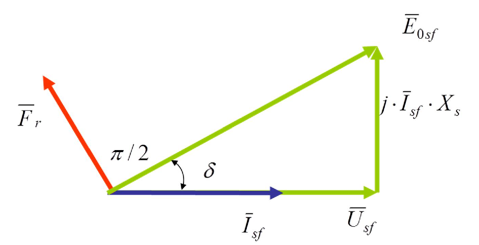

# Zadatak 15 — Sinhroni moment, sinhronizirajući moment i korisna snaga generatora pri jediničnom faktoru snage

## Postavka

Trofazni **četvoropolni** sinhroni generator u spoju „zvezda" daje struju od $115{,}5\ \mathrm{A}$ uz **jedinični faktor snage** ($\cos\varphi = 1$) i pri frekvenciji mreže $50\ \mathrm{Hz}$. Koliki je **proizvedeni sinhroni moment**, **sinhronizirajući moment** i **korisna snaga** generatora, ako su poznati sinhrona reaktansa $X_s = 1{,}2\ \mathrm{\Omega}$ i ugao opterećenja $\delta = 32{,}2^{\circ}$?

> **Prevod na običan jezik:** Imamo generator sa 4 pola (dakle 2 *para* polova) koji je priključen na mrežu od 50 Hz. On u mrežu šalje struju od 115,5 A, i to tako da su mu napon i struja **u fazi** — sva struja je „aktivna", ništa se ne troši na reaktivnu snagu. Znamo još dve stvari o samoj mašini: njenu sinhronu reaktansu (1,2 Ω) i ugao opterećenja (32,2°) — ugao za koji je unutrašnja elektromotorna sila „odmakla" ispred napona mreže. Treba da izračunamo: (1) koliki obrtni moment mašina razvija u ovom režimu, (2) koliko je „kruta" njena veza sa mrežom, tj. koliko se moment promeni ako ugao opterećenja malo zaigra (to je sinhronizirajući moment), i (3) kolika je snaga koju generator predaje mreži.

## Podaci

| Veličina | Oznaka | Vrednost | Šta ta veličina fizički znači |
|---|---|---|---|
| Broj faza | $q$ | $3$ | Mašina je trofazna — ima tri identična namotaja na statoru, pomerena za po 120°. |
| Broj polova | $2p$ | $4$ (tj. $p = 2$ para polova) | Koliko magnetnih polova (naizmenično N i S) rotor pravi po obimu mašine. Broj *pari* polova $p$ vezuje frekvenciju mreže i brzinu obrtanja. |
| Sprega statora | — | zvezda (Y) | Sva tri namotaja spojena su jednim krajem u zajedničku tačku (zvezdište). U zvezdi je **linijska struja jednaka faznoj**, pa je zadatih 115,5 A ujedno i fazna struja. |
| Fazna struja statora | $I_{sf}$ | $115{,}5\ \mathrm{A}$ | Struja koja teče kroz jedan fazni namotaj statora (indeks „$sf$" = **s**tator, **f**azna vrednost). |
| Faktor snage | $\cos\varphi$ | $1$ | Napon i struja generatora su u fazi — generator daje čisto aktivnu snagu, bez razmene reaktivne snage sa mrežom. |
| Frekvencija mreže | $f$ | $50\ \mathrm{Hz}$ | Frekvencija napona i struja u mreži; ona diktira brzinu obrtanja sinhrone mašine. |
| Sinhrona reaktansa | $X_s$ | $1{,}2\ \mathrm{\Omega}$ | Ukupna „unutrašnja prepreka" mašine naizmeničnoj struji: zbir reaktanse rasipanja statorskog namotaja i reaktanse reakcije indukta (uticaja statorskog polja na ukupni fluks). |
| Ugao opterećenja | $\delta$ | $32{,}2^{\circ}$ | Ugao između fazora pobudne elektromotorne sile $\overline{E}_{0sf}$ i fazora napona $\overline{U}_{sf}$. Kod generatora $\overline{E}_{0sf}$ **prednjači** naponu — što je mašina opterećenija, taj ugao je veći. |

Tražene veličine: sinhroni moment $M$, sinhronizirajući moment $M_S$ i korisna snaga $P$.

## Šta se traži i zašto

**1. Proizvedeni sinhroni moment $M$.** To je elektromagnetni obrtni moment koji mašina razvija u datom režimu — moment kojim se elektromagnetne sile u mašini opiru pogonskoj turbini (kod generatora) i preko kojeg se mehanička snaga pretvara u električnu. Inženjera zanima jer po njemu dimenzioniše vratilo, spojnicu i pogonsku mašinu. **Plan:** iz ugaone karakteristike snage dobićemo izraz za moment, a zatim ćemo, koristeći geometriju vektorskog dijagrama pri $\cos\varphi = 1$, nepoznate veličine $U_{sf}$ i $E_{0sf}$ izraziti preko zadatih $I_{sf}$, $X_s$ i $\delta$.

**2. Sinhronizirajući moment $M_S$.** To je izvod momenta po uglu opterećenja, $M_S = \mathrm{d}M/\mathrm{d}\delta$ — mera „krutosti" elektromagnetne veze generatora sa mrežom. Što je $M_S$ veći, generator snažnije „vraća" rotor u ravnotežni položaj posle poremećaja opterećenja, pa je stabilniji i manja je opasnost da ispadne iz sinhronizma. **Plan:** diferenciraćemo ugaonu karakteristiku momenta po $\delta$ i primetiti da se rezultat elegantno svodi na $M/\tan\delta$.

**3. Korisna snaga $P$.** To je aktivna snaga koju generator predaje mreži. Ako zanemarimo gubitke u mašini (što zadatak radi), korisna snaga jednaka je proizvedenoj elektromagnetnoj snazi. **Plan:** snaga je proizvod momenta i mehaničke ugaone brzine, $P = M\,\Omega_s$, a ugaonu brzinu znamo čim znamo frekvenciju i broj pari polova.

Redosled rešavanja (5 koraka, običnim jezikom):
1. Iz $f$ i $p$ izračunamo sinhronu brzinu obrtanja.
2. Iz vektorskog dijagrama pri $\cos\varphi = 1$ izvučemo geometrijske veze između $E_{0sf}$, $U_{sf}$, $I_{sf} X_s$ i $\delta$.
3. Te veze uvrstimo u izraz za sinhroni moment i izračunamo $M$.
4. Iz momenta i ugaone brzine izračunamo korisnu snagu $P$.
5. Diferenciranjem karakteristike momenta dobijemo i izračunamo $M_S$.

## Potrebna teorija — mini-lekcije

### Mini-lekcija 1: Model sinhronog generatora sa cilindričnim rotorom

Sinhroni generator ima na rotoru **pobudni namotaj** kroz koji teče jednosmerna struja i pravi magnetno polje koje se obrće zajedno sa rotorom. To obrtno polje indukuje u svakom faznom namotaju statora **pobudnu elektromotornu silu** (EMS) — označavamo je $E_{0sf}$ („0" podseća da je to EMS *praznog hoda*, tj. napon koji bismo merili na krajevima neopterećene mašine). Kada mašina daje struju, ta struja nailazi na unutrašnju impedansu mašine; kod mašine sa **cilindričnim rotorom** (vazdušni zazor ravnomeran po celom obimu, tipično za turbogeneratore) i uz zanemarenje otpornosti namotaja, ta impedansa se svodi na jednu jedinu **sinhronu reaktansu** $X_s$. Po fazi, dakle, važi naponska jednačina:

$$\overline{E}_{0sf} = \overline{U}_{sf} + j\,\overline{I}_{sf}\,X_s$$

Rečima: unutrašnja EMS jednaka je naponu na krajevima plus padu napona na sinhronoj reaktansi. Množenje sa $j$ znači da fazor pada napona $\overline{I}_{sf} X_s$ **prednjači struji za 90°** — to je osobina svake reaktanse (kalema).

### Mini-lekcija 2: Broj polova, sinhrona brzina i ugaona brzina

Obrtno magnetno polje statora napravi jedan pun električni ciklus (period mrežnog napona) za vreme dok se prostorno pomeri za **jedan par polova**. Zato se mašina sa $p$ pari polova obrće $p$ puta sporije od „električne" brzine, pa je **sinhrona brzina** u obrtajima u minuti:

$$n = \frac{60 \cdot f}{p}$$

Faktor 60 samo pretvara sekunde (frekvencija je „ciklusa u sekundi") u minute. Mehanička **ugaona brzina** u radijanima u sekundi dobija se iz $n$ ovako: jedan obrtaj je $2\pi$ radijana, jedan minut je 60 sekundi, pa je

$$\Omega_s = \frac{2\pi \cdot n}{60} = \frac{\pi \cdot n}{30} = \frac{2\pi f}{p}.$$

Otuda u formulama ove zbirke faktor $\frac{30}{\pi}$: to je samo prevodilac između „snage po ugaonoj brzini" i „snage po brzini u obrtajima u minuti", jer je $\dfrac{1}{\Omega_s} = \dfrac{30}{\pi \cdot n}$.

### Mini-lekcija 3: Ugaona karakteristika aktivne snage i sinhroni moment

Iz naponske jednačine (mini-lekcija 1) može se izračunati struja $\overline{I}_{sf} = (\overline{E}_{0sf} - \overline{U}_{sf})/(jX_s)$, a zatim i aktivna snaga koju mašina predaje mreži kao realni deo kompleksne snage $3\,\overline{U}_{sf}\,\overline{I}_{sf}^{\,*}$. Kada se taj račun sprovede (uz $R_s \approx 0$), dobija se čuvena **ugaona karakteristika aktivne snage** mašine sa cilindričnim rotorom:

$$P = \frac{3 \cdot U_{sf} \cdot E_{0sf} \cdot \sin\delta}{X_s}$$

Intuicija: mašina i mreža su dva naponska izvora spojena preko čiste reaktanse; kroz reaktansu aktivna snaga može da „pretiče" samo ako između ta dva napona postoji **fazni pomak** — i to srazmerno $\sin\delta$. Ako je $\delta = 0$, snaga je nula (prazan hod); snaga raste sa uglom sve do maksimuma pri $\delta = 90^{\circ}$.

Elektromagnetni **moment** je količnik snage i mehaničke ugaone brzine (snaga = moment × ugaona brzina, isto kao u mehanici):

$$M = \frac{P}{\Omega_s} = \frac{30}{\pi} \cdot \frac{P}{n} = \frac{30}{\pi} \cdot \frac{3 \cdot U_{sf} \cdot E_{0sf} \cdot \sin\delta}{n \cdot X_s}$$

Ovo je upravo polazni izraz originalne zbirke: u njemu je sinhrona brzina izražena u obrtajima u minuti $n$, pa se ispred pojavljuje faktor $\frac{30}{\pi}$ (mini-lekcija 2). Broj faza 3 zbirka u opštem zapisu obeležava sa $q$ — kod nas je $q = 3$.

### Mini-lekcija 4: Vektorski dijagram pri jediničnom faktoru snage — odakle geometrijske veze

Vektorski (fazorski) dijagram je grafički prikaz naponske jednačine iz mini-lekcije 1: svaki fazor je strelica, a jednačina kaže da se strelica $\overline{E}_{0sf}$ dobija nadovezivanjem strelice $j\overline{I}_{sf}X_s$ na strelicu $\overline{U}_{sf}$. Kada je $\cos\varphi = 1$, fazori struje $\overline{I}_{sf}$ i napona $\overline{U}_{sf}$ leže **na istom pravcu** (u fazi su). Pad napona $j\,\overline{I}_{sf}\,X_s$ prednjači struji za 90°, pa stoji **normalno** na njih. Time $\overline{U}_{sf}$, $j\overline{I}_{sf}X_s$ i $\overline{E}_{0sf}$ obrazuju **pravougli trougao**: katete su $U_{sf}$ (horizontalna) i $I_{sf}X_s$ (vertikalna), hipotenuza je $E_{0sf}$, a ugao između $U_{sf}$ i $E_{0sf}$ je upravo ugao opterećenja $\delta$.

Iz tog pravouglog trougla, čistom trigonometrijom (naspramna kateta = hipotenuza × sinus; tangens = naspramna/nalegla kateta), slede tri veze koje nose ceo zadatak:

$$E_{0sf} \cdot \sin\delta = I_{sf} \cdot X_s, \qquad \tan\delta = \frac{I_{sf} \cdot X_s}{U_{sf}}, \qquad U_{sf} = \frac{I_{sf} \cdot X_s}{\tan\delta}.$$

One su dragocene jer nam u zadatku $U_{sf}$ i $E_{0sf}$ **nisu zadati** — ali su zadati $I_{sf}$, $X_s$ i $\delta$, pa preko ovih veza sve nepoznato izbacujemo iz formule za moment.

### Mini-lekcija 5: Sinhronizirajući moment — „opruga" koja drži mašinu u sinhronizmu

**Sinhronizirajući moment** $M_S$ je po definiciji **izvod ugaone karakteristike momenta po uglu opterećenja**:

$$M_S = \frac{\mathrm{d}M}{\mathrm{d}\delta}$$

Fizičko značenje: zamislite da neki poremećaj (npr. nagli skok opterećenja) malo pomeri rotor, pa ugao $\delta$ poraste za mali priraštaj $\Delta\delta$. Moment mašine tada poraste za $\Delta M \approx M_S \cdot \Delta\delta$ — i upravo taj *višak* momenta gura rotor nazad ka ravnotežnom položaju. To je ista uloga koju krutost opruge ima kod mehaničkog oscilatora: $M_S$ je „krutost" elastične magnetne veze rotora i obrtnog polja mreže. Što je $M_S$ veći, generator stabilnije i brže odgovara na veće promene opterećenja, tj. veća je šansa da ostane u sinhronizmu sa mrežom. Kada $\delta$ dostigne 90°, izvod $\cos\delta$ postaje nula — $M_S = 0$ — i mašina gubi sposobnost da se vrati u ravnotežu: to je **granica statičke stabilnosti**. Strogo gledano, $M_S$ ima jedinicu $\mathrm{Nm}$ po radijanu promene ugla; u praksi (i u zbirci) piše se prosto $\mathrm{Nm}$.

### Mini-lekcija 6: Korisna snaga kada se gubici zanemare

U stvarnoj mašini deo proizvedene snage potroši se na gubitke u bakru, gvožđu i na trenje. Zadatak izričito kaže da gubitke **zanemarujemo**, pa je korisna snaga (ona koju mreža stvarno dobije) jednaka celokupnoj elektromagnetnoj snazi, tj. proizvodu proizvedenog momenta i sinhrone ugaone brzine:

$$P = M \cdot \Omega_s = \frac{\pi}{30} \cdot M \cdot n = \frac{2\pi f}{p} \cdot M.$$

## Rešenje, korak po korak

Pre računa, pogledajmo vektorski dijagram generatora u ovom režimu. Na slici su: fazor struje $\overline{I}_{sf}$ (plavo) i fazor napona $\overline{U}_{sf}$ na istom pravcu (jer je $\cos\varphi = 1$); normalno na njih, naviše, pad napona $j \cdot \overline{I}_{sf} \cdot X_s$; njihova „vektorska suma" — hipotenuza $\overline{E}_{0sf}$ — zaklapa sa naponom ugao opterećenja $\delta$. Crvena strelica $\overline{F}_r$ je fazor pobudne magnetopobudne sile rotora (rotorskog polja): ona prednjači elektromotornoj sili $\overline{E}_{0sf}$ za $\pi/2$, jer indukovana EMS uvek kasni 90° za fluksom koji je indukuje. Dijagram čitaj kao pravougli trougao: horizontalna kateta $U_{sf}$, vertikalna kateta $I_{sf}X_s$, hipotenuza $E_{0sf}$, ugao $\delta$ pri temenu.

**Slika 15.1 —** Vektorski dijagram sinhronog generatora sa cilindričnim rotorom kada radi sa jediničnim faktorom snage: struja i napon su u fazi, pad napona $j\overline{I}_{sf}X_s$ stoji normalno na njih, a $\overline{E}_{0sf}$ prednjači naponu za ugao opterećenja $\delta$; $\overline{F}_r$ je magnetopobudna sila rotora, 90° ispred $\overline{E}_{0sf}$.

### Korak 1: Sinhrona brzina i ugaona brzina

**Zašto ovaj korak:** u formuli za moment figuriše brzina obrtanja $n$, a za snagu treba ugaona brzina $\Omega_s$ — obe slede direktno iz frekvencije i broja pari polova, pa ih rešimo odmah.

Opšti oblik (mini-lekcija 2):

$$n = \frac{60 \cdot f}{p}$$

Mašina je četvoropolna: $2p = 4$, dakle **$p = 2$ para polova** (pazi, ne $p = 4$!). Uvrštavamo:

$$n = \frac{60 \cdot 50\ \mathrm{Hz}}{2} = \frac{3000}{2} = 1500\ \mathrm{ob/min}$$

Ugaona brzina:

$$\Omega_s = \frac{\pi \cdot n}{30} = \frac{\pi \cdot 1500}{30} = 50\pi \approx 157{,}08\ \mathrm{rad/s}$$

**Šta smo dobili:** 1500 ob/min je standardna sinhrona brzina četvoropolnih mašina na mreži od 50 Hz — dobar znak da smo broj pari polova protumačili ispravno.

### Korak 2: Geometrijske veze iz vektorskog dijagrama (i usput $U_{sf}$ i $E_{0sf}$)

**Zašto ovaj korak:** formula za moment sadrži $U_{sf}$ i $E_{0sf}$, koje **nemamo** među podacima. Vektorski dijagram sa slike 15.1 daje nam veze kojima ih izražavamo preko zadatih $I_{sf}$, $X_s$ i $\delta$.

Iz pravouglog trougla na slici 15.1 (mini-lekcija 4):

$$E_{0sf} \cdot \sin\delta = I_{sf} \cdot X_s$$

$$\tan\delta = \frac{I_{sf} \cdot X_s}{U_{sf}} \quad\Longrightarrow\quad U_{sf} = \frac{I_{sf} \cdot X_s}{\tan\delta}$$

Prva veza kaže: vertikalna projekcija hipotenuze $E_{0sf}$ jednaka je vertikalnoj kateti $I_{sf}X_s$. Druga: tangens ugla je odnos naspramne i nalegle katete; iz nje množenjem i deljenjem izrazimo $U_{sf}$.

Radi orijentacije (i kasnije provere) izračunajmo i same vrednosti. Najpre pad napona:

$$I_{sf} \cdot X_s = 115{,}5\ \mathrm{A} \cdot 1{,}2\ \mathrm{\Omega} = 138{,}6\ \mathrm{V}$$

Zatim, uz $\tan 32{,}2^{\circ} = 0{,}6297$ i $\sin 32{,}2^{\circ} = 0{,}5329$:

$$U_{sf} = \frac{138{,}6}{0{,}6297} \approx 220{,}1\ \mathrm{V}, \qquad E_{0sf} = \frac{I_{sf} \cdot X_s}{\sin\delta} = \frac{138{,}6}{0{,}5329} \approx 260{,}1\ \mathrm{V}$$

**Šta smo dobili:** fazni napon od oko 220 V — što u zvezdi znači linijski napon $\sqrt{3} \cdot 220{,}1 \approx 381\ \mathrm{V}$, dakle standardna mreža 380 V! Podaci zadatka su, vidimo, pažljivo „nameštani" da opisuju realan generator. EMS praznog hoda (260 V) je veća od napona, što je i logično: deo nje „pojede" pad napona na $X_s$.

### Korak 3: Sređivanje izraza za sinhroni moment i njegova vrednost

**Zašto ovaj korak:** sada u opšti izraz za moment (mini-lekcija 3) uvrštavamo veze iz Koraka 2, da bi u formuli ostale samo zadate veličine.

Polazni izraz (sa $q = 3$ faze, brzinom $n$ u ob/min):

$$M = \frac{30}{\pi} \cdot \frac{q \cdot U_{sf} \cdot E_{0sf} \cdot \sin\delta}{n \cdot X_s}$$

Uočimo u brojiocu proizvod $E_{0sf} \cdot \sin\delta$ i zamenimo ga sa $I_{sf} \cdot X_s$ (prva veza iz Koraka 2), a $U_{sf}$ zamenimo sa $\dfrac{I_{sf} \cdot X_s}{\tan\delta}$ (druga veza):

$$M = \frac{30}{\pi} \cdot \frac{q}{n \cdot X_s} \cdot \underbrace{\frac{I_{sf} \cdot X_s}{\tan\delta}}_{U_{sf}} \cdot \underbrace{I_{sf} \cdot X_s}_{E_{0sf}\sin\delta}$$

Sada sredimo: u brojiocu je $I_{sf} \cdot I_{sf} = I_{sf}^2$ i $X_s \cdot X_s = X_s^2$, a jedan $X_s$ iz imenioca skraćuje se sa jednim iz brojioca:

$$M = \frac{30}{\pi} \cdot \frac{q \cdot I_{sf}^2 \cdot X_s}{n \cdot \tan\delta}$$

Uvrstimo još $n = \dfrac{60 \cdot f}{p}$ (Korak 1). Deljenje razlomkom je množenje recipročnom vrednošću, pa $\dfrac{1}{n} = \dfrac{p}{60 \cdot f}$:

$$M = \frac{30}{\pi} \cdot \frac{q \cdot I_{sf}^2 \cdot X_s \cdot p}{60 \cdot f \cdot \tan\delta} = \frac{q \cdot p \cdot I_{sf}^2 \cdot X_s}{2 \cdot \pi \cdot f \cdot \tan\delta}$$

(u poslednjem prelazu iskoristili smo $\frac{30}{60} = \frac{1}{2}$, pa je $\frac{30}{\pi \cdot 60} = \frac{1}{2\pi}$). Dobili smo formulu u kojoj je **sve poznato**. Uvrštavamo brojeve: $q = 3$, $p = 2$, $I_{sf} = 115{,}5\ \mathrm{A}$, $X_s = 1{,}2\ \mathrm{\Omega}$, $f = 50\ \mathrm{Hz}$, $\tan 32{,}2^{\circ} = 0{,}6297$:

$$M = \frac{3 \cdot 2 \cdot 115{,}5^2 \cdot 1{,}2}{2 \cdot \pi \cdot 50 \cdot \tan\!\left(32{,}2^{\circ}\right)} = \frac{3 \cdot 2 \cdot 13340{,}25 \cdot 1{,}2}{314{,}16 \cdot 0{,}6297} = \frac{96049{,}8}{197{,}84}$$

$$\boxed{M \approx 485{,}5\ \mathrm{Nm}}$$

**Šta smo dobili:** moment od oko 486 Nm — toliki moment turbina mora da „upire" u vratilo generatora da bi on u ovom režimu napajao mrežu. Za mašinu od ~76 kW (videćemo u Koraku 4) na 1500 ob/min, to je sasvim očekivan red veličine.

### Korak 4: Korisna snaga

**Zašto ovaj korak:** snaga i moment su dva lica iste veličine — vezuje ih ugaona brzina. Pošto gubitke zanemarujemo (mini-lekcija 6), korisna snaga je prosto proizvedeni moment puta sinhrona ugaona brzina.

Opšti oblik:

$$P = \frac{\pi}{30} \cdot M \cdot n$$

Uvrstimo $n = \dfrac{60 \cdot f}{p}$ i sredimo: $\dfrac{\pi}{30} \cdot \dfrac{60 \cdot f}{p} = \dfrac{2 \cdot \pi \cdot f}{p}$ (jer je $\frac{60}{30} = 2$), pa je

$$P = \frac{\pi}{30} \cdot M \cdot \frac{60 \cdot f}{p} = \frac{2 \cdot \pi \cdot f \cdot M}{p} = \frac{2 \cdot \pi \cdot 50 \cdot 485{,}5}{2}$$

Dvojke se skraćuju, ostaje $\pi \cdot 50 \cdot 485{,}5 = \pi \cdot 24275$:

$$\boxed{P \approx 76262\ \mathrm{W} \approx 76{,}3\ \mathrm{kW}}$$

> **Napomena o originalu:** u zbirci kao rezultat piše $7262\ \mathrm{W}$ — to je štamparska greška (ispala je jedna cifra „6"). Sama formula iz zbirke, $\dfrac{2 \cdot \pi \cdot 50 \cdot 485{,}5}{2}$, daje $76262\ \mathrm{W}$, a to potvrđuje i nezavisna provera: $P = 3 \cdot U_{sf} \cdot I_{sf} \cdot \cos\varphi = 3 \cdot 220{,}1 \cdot 115{,}5 \cdot 1 \approx 76262\ \mathrm{W}$. Generator od 7,3 kW koji daje 115,5 A na 380 V ionako ne bi imao fizičkog smisla.

**Šta smo dobili:** oko 76 kW aktivne snage — tačno onoliko koliko trofazni sistem od 380 V sa strujom 115,5 A pri $\cos\varphi = 1$ i treba da prenosi.

### Korak 5: Sinhronizirajući moment

**Zašto ovaj korak:** tražena je i „krutost" veze generatora sa mrežom — po definiciji (mini-lekcija 5) to je izvod karakteristike momenta po uglu opterećenja, izračunat u radnoj tački $\delta = 32{,}2^{\circ}$.

Krećemo od ugaone karakteristike momenta i diferenciramo je po $\delta$. Jedina veličina koja zavisi od $\delta$ jeste $\sin\delta$ (sve ostalo su konstante režima), a izvod sinusa je kosinus, $\dfrac{\mathrm{d}}{\mathrm{d}\delta}(\sin\delta) = \cos\delta$:

$$M_S = \frac{\mathrm{d}M}{\mathrm{d}\delta} = \frac{30}{\pi} \cdot \frac{3 \cdot U_{sf} \cdot E_{0sf}}{n \cdot X_s} \cdot \frac{\mathrm{d}}{\mathrm{d}\delta}\left(\sin\delta\right) = \frac{30}{\pi} \cdot \frac{3 \cdot U_{sf} \cdot E_{0sf} \cdot \cos\delta}{n \cdot X_s}$$

Sada mali trik da izbegnemo ponovno računanje: proširimo razlomak sa $\dfrac{\sin\delta}{\sin\delta}$ (množenje jedinicom ništa ne menja), pa grupišimo činioce tako da se pojavi već izračunati moment $M$:

$$M_S = \frac{30}{\pi} \cdot \frac{3 \cdot U_{sf} \cdot E_{0sf} \cdot \cos\delta}{n \cdot X_s} \cdot \frac{\sin\delta}{\sin\delta} = \underbrace{\frac{30}{\pi} \cdot \frac{3 \cdot U_{sf} \cdot E_{0sf} \cdot \sin\delta}{n \cdot X_s}}_{=\,M} \cdot \frac{\cos\delta}{\sin\delta} = M \cdot \frac{\cos\delta}{\sin\delta} = \frac{M}{\tan\delta}$$

(poslednji prelaz: $\frac{\cos\delta}{\sin\delta}$ je po definiciji recipročna vrednost tangensa). Uvrstimo brojeve:

$$M_S = \frac{485{,}5}{\tan\!\left(32{,}2^{\circ}\right)} = \frac{485{,}5}{0{,}6297}$$

$$\boxed{M_S \approx 770{,}96\ \mathrm{Nm} \approx 771\ \mathrm{Nm}}$$

> **Napomena o originalu:** u zbirci u poslednjem redu uvrštavanja piše $\tan\!\left(22^{\circ}\right)$ — i to je štamparska greška (izgubljeno je „3," ispred „2"). Ugao opterećenja u ovom zadatku je $32{,}2^{\circ}$, a sam rezultat zbirke, $770{,}960\ \mathrm{Nm}$, dobija se upravo sa $\tan 32{,}2^{\circ}$; sa $\tan 22^{\circ}$ ispalo bi $1201{,}7\ \mathrm{Nm}$, što se ne poklapa.

**Šta smo dobili:** $M_S \approx 771\ \mathrm{Nm}$ znači da bi porast ugla opterećenja za 1 radijan (kada bi karakteristika bila linearna) doneo porast momenta od 771 Nm; za realniji mali poremećaj od, recimo, 1° ($\approx 0{,}0175\ \mathrm{rad}$) moment poraste za oko $13{,}5\ \mathrm{Nm}$. Pošto je $\delta = 32{,}2^{\circ} < 90^{\circ}$, mašina je u stabilnom delu karakteristike i ima solidnu rezervu stabilnosti.

## Česte greške i zamke

1. **Broj polova umesto broja pari polova.** „Četvoropolni" znači $2p = 4$, dakle $p = 2$. Ko uvrsti $p = 4$, dobije $n = 750\ \mathrm{ob/min}$ i sve rezultate pogrešne dvostruko (moment dvostruko veći, itd.). Uvek prvo zapiši: broj polova $= 2p$, broj pari polova $= p$.
2. **Stepeni i radijani u kalkulatoru.** $\tan 32{,}2$ u režimu radijana daje $0{,}696$ umesto $0{,}6297$ — greška od 10% koja se tiho provuče kroz ceo zadatak. Proveri režim (DEG) pre računanja trigonometrijskih funkcija; a kod izvoda zapamti da je $M_S \cdot \Delta\delta$ ispravno samo sa $\Delta\delta$ u radijanima.
3. **Mešanje $\sin\delta$ i $\tan\delta$.** U ovom zadatku obe funkcije žive jedna pored druge: $E_{0sf}\sin\delta = I_{sf}X_s$, ali $U_{sf} = I_{sf}X_s/\tan\delta$. Ko iz žurbe napiše $U_{sf} = I_{sf}X_s/\sin\delta$, zapravo je izračunao $E_{0sf}$, i moment mu ispadne pogrešan. Nacrtaj trougao sa slike 15.1 i sa njega čitaj: sinus ide uz hipotenuzu ($E_{0sf}$), tangens uz naleglu katetu ($U_{sf}$).
4. **Slepo prepisivanje rezultata za snagu.** U originalu piše $7262\ \mathrm{W}$, ali brza kontrola $P = 3U_{sf}I_{sf} \approx 3 \cdot 220 \cdot 115{,}5 \approx 76\ \mathrm{kW}$ odmah otkriva da nedostaje cifra. Navika da se snaga proveri i preko $3UI\cos\varphi$ spasava od ovakvih štamparskih grešaka.
5. **Zaboravljanje da formule važe po fazi.** $U_{sf}$, $E_{0sf}$, $I_{sf}$ su **fazne** vrednosti; zato u ugaonoj karakteristici stoji faktor 3 (tri faze). Ko pomeša linijski napon (380 V) sa faznim (220 V), pogreši za $\sqrt{3}$.

## Rezime rezultata

| Tražena veličina | Oznaka | Vrednost |
|---|---|---|
| Sinhrona brzina (usputno) | $n$ | $1500\ \mathrm{ob/min}$ |
| Fazni napon (usputno) | $U_{sf}$ | $\approx 220\ \mathrm{V}$ |
| Pobudna EMS (usputno) | $E_{0sf}$ | $\approx 260\ \mathrm{V}$ |
| **Proizvedeni sinhroni moment** | $M$ | $\approx 485{,}5\ \mathrm{Nm}$ |
| **Korisna snaga** | $P$ | $\approx 76262\ \mathrm{W} \approx 76{,}3\ \mathrm{kW}$ (u zbirci štamparski „7262 W") |
| **Sinhronizirajući moment** | $M_S$ | $\approx 770{,}96\ \mathrm{Nm}$ |

## Provera smisla

**1. Nezavisna provera snage preko napona i struje.** Snagu smo dobili iz momenta i brzine; proverimo je potpuno drugim putem, preko osnovne formule trofazne snage: $P = 3 \cdot U_{sf} \cdot I_{sf} \cdot \cos\varphi = 3 \cdot 220{,}1\ \mathrm{V} \cdot 115{,}5\ \mathrm{A} \cdot 1 \approx 76262\ \mathrm{W}$. Poklapanje do poslednje cifre — i ujedno čvrst dokaz da je „7262 W" u zbirci štamparska greška.

**2. Realnost brojeva.** $U_{sf} \approx 220\ \mathrm{V}$ daje linijski napon $\approx 381\ \mathrm{V}$ — standardna niskonaponska mreža; $n = 1500\ \mathrm{ob/min}$ — standardna brzina četvoropolne mašine na 50 Hz. Svi izvedeni brojevi opisuju sasvim običan, fizički moguć generator.

**3. Odnos $M_S$ i $M$ i granični slučajevi.** Dobili smo $\dfrac{M_S}{M} = \dfrac{1}{\tan\delta} \approx 1{,}59$. To je veće od 1 upravo zato što je $\delta = 32{,}2^{\circ} < 45^{\circ}$ (tangens manji od 1). Granični slučajevi potvrđuju formulu: za $\delta \to 0$ (prazan hod) $M \to 0$, a $M_S$ je maksimalan — neopterećena mašina najčvršće „drži" sinhronizam; za $\delta \to 90^{\circ}$ bilo bi $M_S \to 0$ — granica stabilnosti, tačno kako teorija kaže.

**4. Dimenziona provera formule za moment.** U izrazu $M = \dfrac{q \, p \, I_{sf}^2 X_s}{2\pi f \tan\delta}$ brojilac ima dimenziju $\mathrm{A^2 \cdot \Omega} = \mathrm{V \cdot A} = \mathrm{W}$, a imenilac $\mathrm{1/s}$ (jer su $q$, $p$, $2\pi$ i $\tan\delta$ neimenovani brojevi). Dakle $\mathrm{W \cdot s} = \mathrm{J} = \mathrm{Nm}$ — baš jedinica momenta.
