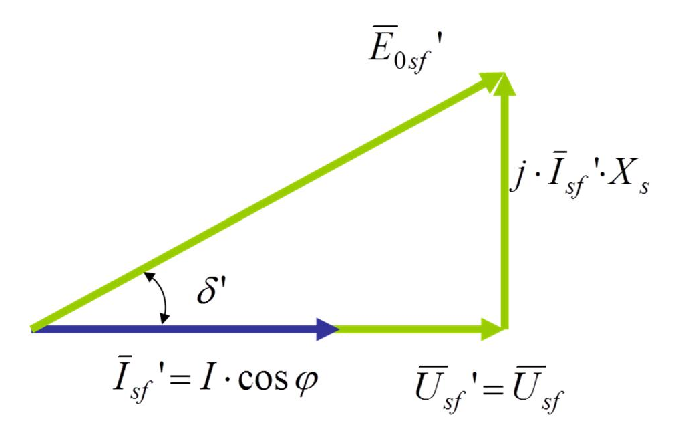
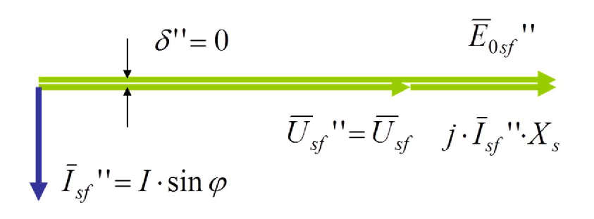

# Zadatak 16 — Sinhronizirajući momenti dva paralelna generatora: jedan daje samo aktivnu, drugi samo reaktivnu struju

## Postavka

Dva jednaka šestopolna trofazna sinhrona generatora, u spoju "zvezda", linijskog napona $380\ \mathrm{V}$, napajaju potrošač u paralelnom radu. Potrošač uzima struju $100\ \mathrm{A}$ uz faktor snage $0{,}8$, a frekvencija mreže je $50\ \mathrm{Hz}$. Generatori su pobuđeni tako da jedan daje samo aktivnu, a drugi samo reaktivnu struju potrošaču. Koliki su sinhronizirajući momenti ovih generatora ako je sinhrona reaktansa $0{,}8\ \mathrm{\Omega}$?

> **Prevod na običan jezik:** Imamo dva potpuno ista generatora koji zajedno (paralelno, na istim sabirnicama) napajaju jednog potrošača. Potrošač vuče struju od 100 A koja nije "čisto korisna": zbog faktora snage 0,8 ona ima aktivni deo (koji nosi korisnu snagu) i reaktivni deo (koji samo "šeta" energiju tamo-amo). Posao je podeljen neobično: prvi generator preuzeo je NA SEBE sav aktivni deo struje, a drugi sav reaktivni deo. Za svaki od njih treba izračunati **sinhronizirajući moment** — broj koji kaže koliko se generator "opire" izbacivanju iz sinhronizma, tj. koliko je čvrsto "elastično vezan" za mrežu. Poznata nam je i sinhrona reaktansa mašine (0,8 Ω) — unutrašnja "prepreka" struji u samoj mašini.

## Podaci

| Veličina | Oznaka | Vrednost | Šta ta veličina fizički znači |
|---|---|---|---|
| Linijski napon mreže | $U_s$ | $380\ \mathrm{V}$ | Napon izmeren između dva fazna provodnika mreže na koju su generatori priključeni. |
| Broj polova | $2p$ | $6$ (dakle $p = 3$ pari polova) | Koliko magnetnih polova ima rotor; određuje kojom se brzinom rotor mora obrtati da bi napravio mrežnu frekvenciju. |
| Sprega statorskih namotaja | — | zvezda (Y) | Način vezivanja tri fazna namotaja; kod zvezde je fazni napon $\sqrt{3}$ puta manji od linijskog. |
| Ukupna struja potrošača | $I$ | $100\ \mathrm{A}$ | Struja koju potrošač ukupno uzima sa sabirnica (nju zajedno obezbeđuju oba generatora). |
| Faktor snage potrošača | $\cos\varphi$ | $0{,}8$ | Meri koliki je deo struje "koristan" (aktivan): $\cos\varphi = 0{,}8$ znači da je 80 % struje aktivno, a ostatak reaktivan. |
| Frekvencija mreže | $f$ | $50\ \mathrm{Hz}$ | Broj perioda naizmeničnog napona u sekundi; diktira sinhronu brzinu obrtanja. |
| Sinhrona reaktansa (po fazi) | $X_s$ | $0{,}8\ \mathrm{\Omega}$ | Unutrašnja "prividna otpornost" sinhrone mašine naizmeničnoj struji; na njoj struja pravi pad napona između indukovane elektromotorne sile i napona na krajevima. |
| Raspodela opterećenja | — | 1. generator: samo aktivna struja; 2. generator: samo reaktivna struja | Postignuto podešavanjem pobude i pogonskih mašina: prvi nosi svu korisnu snagu, drugi svu reaktivnu. |

Veličine prvog generatora obeležavamo jednim primom ($'$), a drugog sa dva prima ($''$) — npr. $M_S'$ i $M_S''$. Indeks "sf" znači "stator, fazna vrednost" (npr. $U_{sf}$ je fazni napon statora).

## Šta se traži i zašto

Traže se **sinhronizirajući momenti** $M_S'$ (prvog) i $M_S''$ (drugog generatora).

**Šta je to?** Sinhroni generator na mreži ponaša se kao da je za mrežu vezan nevidljivom **torzionom oprugom**: ako neki poremećaj (udar opterećenja, kratkotrajni propad napona…) pokuša da mu zakrene rotor unapred ili unazad u odnosu na ravnotežni položaj, javlja se moment koji ga vraća nazad. Sinhronizirajući moment je upravo "krutost te opruge" — koliko njutn-metara vraćajućeg momenta mašina razvije po jedinici (radijanu) zakretanja ugla opterećenja.

**Zašto to inženjera zanima?** Veći sinhronizirajući moment znači stabilniji paralelan rad: mašina teže "ispada iz koraka" (gubi sinhronizam) pri poremećajima. Kad generator ispadne iz sinhronizma, prolazi kroz velike udare struje i momenta i mora se hitno isključiti — zato je ova "krutost" jedno od osnovnih merila sigurnosti pogona. Ovaj zadatak lepo pokazuje i jednu manje očiglednu činjenicu: **način na koji je generator opterećen (aktivno ili reaktivno) menja njegovu krutost.**

**Plan rešavanja u pet koraka:**
1. Iz linijskog napona izračunamo fazni napon (jer sve formule pišemo po fazi).
2. Iz broja polova i frekvencije izračunamo sinhronu brzinu obrtanja $n$, koja figuriše u formuli za moment.
3. Nacrtamo vektorski (fazorski) dijagram **prvog** generatora (samo aktivna struja) i iz njega pročitamo koliko iznosi proizvod $E_{0sf}' \cos\delta'$ koji ulazi u formulu.
4. Izračunamo $M_S'$.
5. Nacrtamo vektorski dijagram **drugog** generatora (samo reaktivna struja), iz njega izračunamo njegovu elektromotornu silu $E_{0sf}''$ i ugao opterećenja $\delta'' = 0$, pa izračunamo $M_S''$.

## Potrebna teorija — mini-lekcije

### 1. Fazni i linijski napon u spoju "zvezda"

Kod trofaznog sistema razlikujemo **linijski napon** $U_s$ (između dva fazna provodnika) i **fazni napon** $U_{sf}$ (između jednog faznog provodnika i zvezdišta). Kada su namotaji vezani u zvezdu, važi:

$$U_{sf} = \frac{U_s}{\sqrt{3}}$$

Faktor $\sqrt{3}$ potiče iz geometrije: linijski napon je vektorska razlika dva fazna napona pomerena za $120^\circ$, a takva razlika je po intenzitetu $\sqrt{3}$ puta veća od faznog napona. Sve formule za snagu i moment u ovom zadatku pisaćemo "po fazi", pa nam treba baš fazni napon.

### 2. Broj pari polova i sinhrona brzina

Sinhrona mašina sa $p$ **pari** polova (dakle $2p$ polova) mora se obrtati brzinom:

$$n = \frac{60 \cdot f}{p}\ \left[\mathrm{ob/min}\right]$$

da bi indukovala napon frekvencije $f$. Poreklo formule: pri jednom punom obrtaju rotora, svaki par polova napravi tačno jednu periodu naizmeničnog napona; rotor koji se obrne $n/60$ puta u sekundi sa $p$ pari polova daje $f = p \cdot n / 60$ perioda u sekundi. Odavde, prebacivanjem, sledi gornja formula. Ovoj brzini odgovara **mehanička ugaona brzina**:

$$\Omega_s = \frac{2\pi \cdot n}{60} = \frac{\pi \cdot n}{30} = \frac{2\pi \cdot f}{p}\ \left[\mathrm{rad/s}\right]$$

Zapamti prelaz $\dfrac{\pi \cdot n}{30}$ — zato se u formulama za moment stalno pojavljuje faktor $\dfrac{30}{\pi}$ (to je samo pretvaranje brzine iz ob/min u rad/s).

### 3. Aktivna i reaktivna komponenta struje

Struja potrošača $I$ fazno kasni za naponom za ugao $\varphi$ (potrošač je induktivan). Tu struju možemo razložiti na dve komponente:

- **aktivnu**: $I_a = I \cdot \cos\varphi$ — deo struje u fazi sa naponom; samo ona prenosi korisnu (aktivnu) snagu;
- **reaktivnu**: $I_r = I \cdot \sin\varphi$ — deo struje pomeren za $90^\circ$ u odnosu na napon; ona ne prenosi korisnu snagu, već samo "ljulja" energiju između izvora i potrošača (potrebna je npr. za magnećenje motora kod potrošača).

Iz $\cos\varphi = 0{,}8$ sledi $\sin\varphi = \sqrt{1 - \cos^2\varphi} = \sqrt{1 - 0{,}64} = 0{,}6$ (pazi: **ne** važi $\sin\varphi = 1 - \cos\varphi$!). U našem zadatku prvi generator daje celu aktivnu komponentu ($I \cos\varphi = 80\ \mathrm{A}$), a drugi celu reaktivnu ($I \sin\varphi = 60\ \mathrm{A}$).

Kako se ovakva podela uopšte postiže? Aktivnom snagom generatora upravlja **pogonska mašina** (koliko "gura" turbina/motor koji ga okreće), a reaktivnom snagom upravlja **pobuda** (jačina struje magnećenja rotora). Podešavanjem ta dva "dugmeta" na oba generatora može se postići da jedan preuzme svu aktivnu, a drugi svu reaktivnu struju.

### 4. Vektorski dijagram sinhronog generatora i ugao opterećenja

Za sinhroni generator sa zanemarenim otporom statorskog namotaja važi naponska jednačina po fazi (u fazorskom, tj. vektorskom obliku):

$$\overline{E}_{0sf} = \overline{U}_{sf} + j \cdot \overline{I}_{sf} \cdot X_s$$

Ovde je $\overline{E}_{0sf}$ **indukovana elektromotorna sila praznog hoda** — napon koji pobuđeni rotor indukuje u statoru i koji bismo izmerili na krajevima da mašina nije opterećena; $\overline{U}_{sf}$ je fazni napon na krajevima (nametnut mrežom); $\overline{I}_{sf}$ je fazna struja statora; $j$ označava zakretanje fazora za $+90^\circ$ (množenje imaginarnom jedinicom). Jednačina kaže prosto: unutrašnji napon mašine = napon na krajevima + pad napona na sinhronoj reaktansi. Pad napona $j \overline{I}_{sf} X_s$ uvek je **upravan** (pod $90^\circ$) na fazor struje — to je ključ za čitanje dijagrama u ovom zadatku.

Ugao između fazora $\overline{E}_{0sf}$ i fazora $\overline{U}_{sf}$ zove se **ugao opterećenja** $\delta$. Fizički, on meri koliko je rotor (koji "nosi" $\overline{E}_{0sf}$) zakrenut unapred u odnosu na položaj koji odgovara naponu mreže. Neopterećena mašina ima $\delta = 0$; što više aktivne snage generator daje, to je $\delta$ veći.

### 5. Momentna karakteristika i sinhronizirajući moment

Aktivna snaga koju generator (sa zanemarenim otporom statora) predaje mreži zavisi od ugla opterećenja:

$$P = \frac{3 \cdot U_{sf} \cdot E_{0sf}}{X_s} \cdot \sin\delta$$

Poreklo formule: to je opšti izraz za aktivnu snagu koja se prenosi između dva naizmenična izvora ($E_{0sf}$ i $U_{sf}$) povezana preko čiste reaktanse $X_s$; izvodi se projektovanjem fazora struje na fazor napona u vektorskom dijagramu, a faktor 3 je tu jer mašina ima tri faze. Elektromagnetni moment dobijamo deljenjem snage mehaničkom ugaonom brzinom ($M = P/\Omega_s$, jer je snaga = moment × ugaona brzina):

$$M = \frac{3 \cdot U_{sf} \cdot E_{0sf}}{\Omega_s \cdot X_s} \cdot \sin\delta$$

Ovo je čuvena **momentna karakteristika** sinhrone mašine — moment raste sa $\sin\delta$.

**Sinhronizirajući moment** $M_S$ definiše se kao *prvi izvod momenta po uglu opterećenja*: on kaže za koliko njutn-metara poraste vraćajući moment kada se ugao $\delta$ poremeti za jedan radijan. Izvod sinusa je kosinus, pa:

$$M_S = \frac{dM}{d\delta} = \frac{3 \cdot U_{sf} \cdot E_{0sf}}{\Omega_s \cdot X_s} \cdot \cos\delta$$

Ako umesto $\Omega_s$ uvrstimo $\dfrac{\pi \cdot n}{30}$ (mini-lekcija 2), dobijamo oblik koji koristi zbirka:

$$M_S = \frac{30}{\pi} \cdot \frac{3 \cdot U_{sf} \cdot E_{0sf} \cdot \cos\delta}{n \cdot X_s}$$

**Intuicija (opruga):** momentna karakteristika $M \sim \sin\delta$ je "kriva sile" naše nevidljive opruge, a $M_S \sim \cos\delta$ je njen nagib, tj. krutost. Neopterećena mašina ($\delta = 0$, $\cos\delta = 1$) ima *najveću* krutost; kako opterećenje raste i $\delta$ se bliži $90^\circ$, krutost pada ka nuli — mašina postaje "meka" i na $\delta = 90^\circ$ gubi sposobnost da se vrati (granica stabilnosti).

> **Napomena o jedinici:** pošto je $M_S$ moment *po radijanu* promene ugla, dimenziono najpreciznija jedinica bila bi $\mathrm{Nm/rad}$. Kako je radijan bezdimenziona jedinica, u literaturi (pa i u originalnoj zbirci) piše se prosto $\mathrm{Nm}$ — tako ćemo i mi.

## Rešenje, korak po korak

### Korak 1: Fazni napon

**Zašto ovaj korak:** sve formule za moment pišemo po jednoj fazi, a u zadatku je dat linijski napon; kod sprege "zvezda" moramo ga podeliti sa $\sqrt{3}$.

$$U_{sf} = \frac{U_s}{\sqrt{3}} = \frac{380\ \mathrm{V}}{\sqrt{3}} = 219{,}4\ \mathrm{V} \approx 220\ \mathrm{V}$$

> **Napomena o originalu:** zbirka (kao i praksa) odmah zaokružuje $380/\sqrt{3}$ na standardnih $220\ \mathrm{V}$ i sa tom vrednošću računa dalje. I mi ćemo tako, da bi se konačni rezultati poklopili sa zbirkom; razlika je ispod 0,3 %.

**Šta smo dobili:** fazni napon od $220\ \mathrm{V}$ — poznata "kućna" vrednost, što potvrđuje da smo dobro razumeli spregu.

### Korak 2: Broj pari polova i sinhrona brzina

**Zašto ovaj korak:** u formuli za sinhronizirajući moment figuriše brzina obrtanja $n$, a nju određuju frekvencija i broj pari polova (mini-lekcija 2).

Mašina je šestopolna, dakle ima $2p = 6$ polova, tj. $p = 3$ **para** polova. Sinhrona brzina:

$$n = \frac{60 \cdot f}{p} = \frac{60 \cdot 50\ \mathrm{Hz}}{3} = 1000\ \mathrm{ob/min}$$

što odgovara mehaničkoj ugaonoj brzini:

$$\Omega_s = \frac{\pi \cdot n}{30} = \frac{\pi \cdot 1000}{30} = 104{,}72\ \mathrm{rad/s}$$

**Šta smo dobili:** rotor se obrće 1000 puta u minuti — tipična brzina za šestopolne mašine na 50 Hz (dvopolne idu 3000, četvoropolne 1500, šestopolne 1000 ob/min).

### Korak 3: Struje pojedinih generatora

**Zašto ovaj korak:** da bismo crtali vektorske dijagrame, moramo znati koliku struju i pod kojim uglom daje svaki generator (mini-lekcija 3).

Prvi generator daje samo aktivnu komponentu ukupne struje potrošača:

$$I_{sf}' = I \cdot \cos\varphi = 100\ \mathrm{A} \cdot 0{,}8 = 80\ \mathrm{A}$$

Drugi generator daje samo reaktivnu komponentu; prvo iz faktora snage nađemo $\sin\varphi$:

$$\sin\varphi = \sqrt{1 - \cos^2\varphi} = \sqrt{1 - 0{,}8^2} = \sqrt{1 - 0{,}64} = \sqrt{0{,}36} = 0{,}6$$

$$I_{sf}'' = I \cdot \sin\varphi = 100\ \mathrm{A} \cdot 0{,}6 = 60\ \mathrm{A}$$

**Šta smo dobili:** struje 80 A i 60 A. Primeti da njihov (algebarski) zbir 140 A **nije** jednak 100 A — komponente pod pravim uglom sabiraju se vektorski: $\sqrt{80^2 + 60^2} = \sqrt{6400+3600} = \sqrt{10000} = 100\ \mathrm{A}$. Upravo tolika je ukupna struja potrošača — račun je konzistentan.

### Korak 4: Vektorski dijagram prvog generatora i relacija $E_{0sf}' \cos\delta' = U_{sf}$

**Zašto ovaj korak:** u formuli za sinhronizirajući moment stoji proizvod $E_{0sf}' \cdot \cos\delta'$; umesto da posebno računamo i elektromotornu silu i ugao, iz dijagrama ćemo pročitati da je taj *proizvod* jednak nečemu što već znamo.

Slika 16.1 prikazuje vektorski dijagram prvog generatora. Čitaj je ovako: plavi horizontalni fazor je struja $\overline{I}_{sf}' = I\cos\varphi$; fazor napona $\overline{U}_{sf}' = \overline{U}_{sf}$ leži na **istom pravcu** (struja i napon su u fazi, jer generator daje samo aktivnu snagu). Na vrh fazora napona nadovezuje se pad napona $j \cdot \overline{I}_{sf}' \cdot X_s$, koji je zbog množenja sa $j$ zakrenut za $90^\circ$ u odnosu na struju — dakle vertikalan. Zeleni kosi fazor od koordinatnog početka do vrha tog vertikalnog fazora je elektromotorna sila $\overline{E}_{0sf}'$, a ugao između nje i napona je ugao opterećenja $\delta'$.

**Slika 16.1 —** Vektorski dijagram napona prvog generatora, koji predaje samo aktivnu snagu potrošaču.

Sada ključno zapažanje. Fazori $\overline{U}_{sf}$ i $j\overline{I}_{sf}'X_s$ grade **pravougli trougao** čija je hipotenuza $\overline{E}_{0sf}'$. Projekcija hipotenuze na horizontalni pravac (pravac napona) je $E_{0sf}' \cdot \cos\delta'$ — a ta projekcija je, kako se sa slike direktno vidi, baš kateta $U_{sf}$:

$$E_{0sf}' \cdot \cos\delta' = U_{sf}' = U_{sf} = 220\ \mathrm{V}$$

**Šta smo dobili:** ne moramo uopšte pojedinačno računati ni $E_{0sf}'$ ni $\delta'$ — njihov proizvod, jedino što nam formula traži, jednak je faznom naponu mreže. To je elegantna prečica koju omogućava čisto aktivno opterećenje.

### Korak 5: Sinhronizirajući moment prvog generatora

**Zašto ovaj korak:** sve veličine za formulu iz mini-lekcije 5 su sada poznate, pa računamo prvi traženi rezultat.

Polazimo od opšteg izraza za sinhronizirajući moment (mini-lekcija 5), pisanog za prvi generator:

$$M_S' = \frac{30}{\pi} \cdot \frac{3 \cdot U_{sf}' \cdot E_{0sf}' \cdot \cos\delta'}{n \cdot X_s}$$

Uvrstimo rezultat Koraka 4, $E_{0sf}' \cos\delta' = U_{sf}$ (i $U_{sf}' = U_{sf}$), pa se u brojiocu pojavljuje kvadrat faznog napona:

$$M_S' = \frac{30}{\pi} \cdot \frac{3 \cdot U_{sf}^2}{n \cdot X_s}$$

Sada, kao u zbirci, umesto $n$ uvrstimo $n = \dfrac{60 f}{p}$ iz Koraka 2, da bi formula ostala u "izvornim" podacima ($f$ i $p$):

$$M_S' = \frac{30}{\pi} \cdot \frac{3 \cdot U_{sf}^2}{\dfrac{60 \cdot f}{p} \cdot X_s} = \frac{30 \cdot 3 \cdot p \cdot U_{sf}^2}{60 \cdot \pi \cdot f \cdot X_s} = \frac{3 \cdot p \cdot U_{sf}^2}{2 \cdot \pi \cdot f \cdot X_s}$$

(u poslednjem prelazu skratili smo $30/60 = 1/2$). Uvrštavamo brojeve:

$$M_S' = \frac{3 \cdot 3 \cdot 220^2}{2 \cdot \pi \cdot 50 \cdot 0{,}8} = \frac{9 \cdot 48400}{251{,}33} = \frac{435600}{251{,}33} = 1733{,}197\ \mathrm{Nm}$$

**Šta smo dobili:** prvi generator ima sinhronizirajući moment od približno $1733\ \mathrm{Nm}$. Broj je reda hiljadu njutn-metara — velik u poređenju sa radnim momentima ovakve mašine (videćemo u proveri smisla), što znači da je mašina čvrsto "usidrena" u sinhronizam.

### Korak 6: Vektorski dijagram drugog generatora — $\delta'' = 0$ i računanje $E_{0sf}''$

**Zašto ovaj korak:** za drugi generator proizvod $E_{0sf}'' \cos\delta''$ ne dobijamo istom prečicom; ovde iz dijagrama čitamo dve odvojene činjenice — da je ugao opterećenja nula i kolika je elektromotorna sila.

Slika 16.2 prikazuje vektorski dijagram drugog generatora. Čitaj je ovako: fazor napona $\overline{U}_{sf}'' = \overline{U}_{sf}$ je horizontalan; plavi fazor struje $\overline{I}_{sf}'' = I\sin\varphi$ pokazuje **naniže**, jer struja kasni za naponom tačno $90^\circ$ (čisto reaktivna, induktivna struja — potrošač *troši* reaktivnu snagu). Pad napona $j \cdot \overline{I}_{sf}'' \cdot X_s$ je zakrenut $90^\circ$ **unapred** u odnosu na struju: zakretanjem fazora koji gleda naniže za $+90^\circ$ dobija se fazor koji gleda udesno — dakle pad napona leži na istom pravcu i u istom smeru kao napon! Zato se elektromotorna sila $\overline{E}_{0sf}''$ (zeleni fazor) dobija prostim nadovezivanjem po horizontali i **kolinearna** je sa naponom.

**Slika 16.2 —** Vektorski dijagram napona drugog generatora, koji predaje samo reaktivnu snagu potrošaču.

Iz dijagrama čitamo dve stvari:

**(a) Ugao opterećenja je nula.** Fazori $\overline{E}_{0sf}''$ i $\overline{U}_{sf}$ leže na istom pravcu, pa je ugao između njih:

$$\delta'' = 0 \quad \Rightarrow \quad \cos\delta'' = 1$$

To ima i jasno fizičko značenje: ugao opterećenja "raste" samo kad mašina daje aktivnu snagu (rotor tada prednjači), a ovaj generator po uslovu zadatka aktivnu snagu uopšte ne daje — rotor mu stoji tačno u neopterećenom položaju.

**(b) Elektromotorna sila je algebarski zbir.** Pošto su $\overline{U}_{sf}$ i pad napona na istom pravcu i istog smera, vektorsko sabiranje iz naponske jednačine (mini-lekcija 4) postaje obično sabiranje brojeva:

$$E_{0sf}'' = U_{sf}'' + I_{sf}'' \cdot X_s = U_{sf} + I \cdot \sin\varphi \cdot X_s = U_{sf} + I \cdot \sqrt{1 - \cos^2\varphi} \cdot X_s$$

Uvrštavamo brojeve (koristeći $\sin\varphi = 0{,}6$ iz Koraka 3):

$$E_{0sf}'' = 220\ \mathrm{V} + 100\ \mathrm{A} \cdot 0{,}6 \cdot 0{,}8\ \mathrm{\Omega} = 220\ \mathrm{V} + 48\ \mathrm{V} = 268\ \mathrm{V}$$

**Šta smo dobili:** elektromotorna sila drugog generatora ($268\ \mathrm{V}$) veća je od napona mreže ($220\ \mathrm{V}$) — generator je **natpobuđen**. To je i logično: da bi *davao* reaktivnu snagu mreži, generator mora imati "jači" unutrašnji napon od mrežnog, pa višak "gura" reaktivnu struju ka potrošaču.

### Korak 7: Sinhronizirajući moment drugog generatora

**Zašto ovaj korak:** sada su i za drugi generator poznate sve veličine iz formule, pa računamo drugi traženi rezultat.

Opšti izraz za drugi generator:

$$M_S'' = \frac{30}{\pi} \cdot \frac{3 \cdot U_{sf}'' \cdot E_{0sf}'' \cdot \cos\delta''}{n \cdot X_s}$$

Uvrstimo $\cos\delta'' = 1$ i $U_{sf}'' = U_{sf}$ (Korak 6a), pa ponovimo istu zamenu $n = \dfrac{60f}{p}$ i skraćivanje $30/60 = 1/2$ kao u Koraku 5:

$$M_S'' = \frac{30}{\pi} \cdot \frac{3 \cdot U_{sf} \cdot E_{0sf}''}{\dfrac{60 \cdot f}{p} \cdot X_s} = \frac{3 \cdot p \cdot U_{sf} \cdot E_{0sf}''}{2 \cdot \pi \cdot f \cdot X_s}$$

Uvrštavamo brojeve:

$$M_S'' = \frac{3 \cdot 3 \cdot 220 \cdot 268}{2 \cdot \pi \cdot 50 \cdot 0{,}8} = \frac{9 \cdot 58960}{251{,}33} = \frac{530640}{251{,}33} = 2111{,}349\ \mathrm{Nm}$$

**Šta smo dobili:** drugi generator ima sinhronizirajući moment od približno $2111\ \mathrm{Nm}$ — oko 22 % veći od prvog. Generator koji "ne radi ništa korisno" (daje samo reaktivnu snagu) je, paradoksalno, **čvršće** vezan za mrežu! Razlog je dvostruk: ugao opterećenja mu je nula (pa je $\cos\delta'' = 1$, maksimalan), a natpobuđenost mu je podigla elektromotornu silu na 268 V. Ovo je i opšte inženjersko pravilo: natpobuđena mašina je stabilnija.

## Česte greške i zamke

1. **Linijski umesto faznog napona.** Formula za moment je pisana po fazi — ako uvrstiš $380\ \mathrm{V}$ umesto $220\ \mathrm{V}$, rezultat za prvi generator ispadne $(380/220)^2 \approx 3$ puta veći. Kod sprege "zvezda" uvek prvo podeli linijski napon sa $\sqrt{3}$.
2. **Broj polova umesto broja pari polova.** Mašina je *šestopolna*: $2p = 6$, dakle $p = 3$. Ako u $n = 60f/p$ uvrstiš $p = 6$, dobićeš $n = 500\ \mathrm{ob/min}$ i duplo veće momente. Reč "šestopolna" broji polove (N i S naizmenično), a formula traži *parove* N–S.
3. **"Ugao nula ⇒ moment nula".** Za drugi generator je $\delta'' = 0$, pa student pomisli da je i $M_S'' = 0$. Ali nula je *elektromagnetni* moment ($\sim \sin\delta$), a sinhronizirajući moment ide sa $\cos\delta$ — na $\delta = 0$ on je baš **najveći**. Ne mešaj karakteristiku i njen izvod.
4. **$\sin\varphi = 1 - \cos\varphi$?** Ne! $\sin\varphi = \sqrt{1 - \cos^2\varphi} = \sqrt{1-0{,}64} = 0{,}6$, a ne $1 - 0{,}8 = 0{,}2$. Ova greška ruši i struju drugog generatora i njegovu elektromotornu silu.
5. **Vektorsko sabiranje "napamet".** Relacija $E_{0sf}'' = U_{sf} + I_{sf}'' X_s$ (obično, algebarsko sabiranje) važi **samo zato** što je struja čisto reaktivna, pa je pad napona kolinearan sa naponom. U opštem slučaju $\overline{E}_{0sf} = \overline{U}_{sf} + j\overline{I}_{sf}X_s$ mora se sabirati vektorski (Pitagorom ili po komponentama) — ne prepisuj algebarski zbir u zadatke gde struja ima obe komponente.

## Rezime rezultata

| Tražena veličina | Oznaka | Vrednost |
|---|---|---|
| Sinhronizirajući moment prvog generatora (samo aktivna struja) | $M_S'$ | $1733{,}197\ \mathrm{Nm}$ |
| Sinhronizirajući moment drugog generatora (samo reaktivna struja) | $M_S''$ | $2111{,}349\ \mathrm{Nm}$ |
| (usputno) Elektromotorna sila praznog hoda drugog generatora | $E_{0sf}''$ | $268\ \mathrm{V}$ |

## Provera smisla

**1. Dimenziona analiza.** U izrazu $\dfrac{3 \cdot U_{sf} \cdot E_{0sf}}{\Omega_s \cdot X_s}$: volt puta volt kroz om daje $\mathrm{V^2/\Omega} = \mathrm{V \cdot A} = \mathrm{W}$ (snaga); snaga kroz $\mathrm{rad/s}$ daje $\mathrm{W \cdot s} = \mathrm{J} = \mathrm{Nm}$ — zaista moment. ✓

**2. Nezavisan račun preko $\Omega_s$.** Umesto oblika sa $30/\pi$ i $n$, izračunajmo prvi moment direktno preko ugaone brzine iz Koraka 2: $M_S' = \dfrac{3 \cdot 220^2}{104{,}72 \cdot 0{,}8} = \dfrac{145200}{83{,}78} = 1733{,}2\ \mathrm{Nm}$ — isti rezultat drugim putem. ✓

**3. Odnos rezultata.** Oba momenta imaju identičan oblik $\dfrac{3p\,U_{sf}\cdot(E\cos\delta)}{2\pi f X_s}$, pa njihov odnos mora biti $\dfrac{M_S''}{M_S'} = \dfrac{E_{0sf}''}{U_{sf}} = \dfrac{268}{220} = 1{,}218$. Zaista, $2111{,}349 / 1733{,}197 = 1{,}218$. ✓

**4. Poređenje sa radnim momentom.** Aktivna snaga koju prvi generator daje je $P' = 3 \cdot U_{sf} \cdot I_{sf}' = 3 \cdot 220 \cdot 80 = 52800\ \mathrm{W}$, čemu odgovara elektromagnetni moment $M' = P'/\Omega_s = 52800/104{,}72 \approx 504\ \mathrm{Nm}$. Sinhronizirajući moment ($1733\ \mathrm{Nm}$) je oko 3,4 puta veći od radnog — mašina radi daleko od granice stabilnosti, što je za ovako malo opterećenu mašinu i očekivano. ✓
