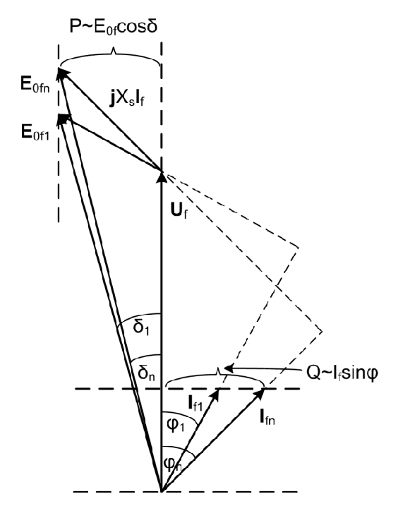

# Zadatak 18 — Indukovana EMS i ugao opterećenja generatora na krutoj mreži; nova struja posle smanjenja pobudnog fluksa za 5 %

## Postavka

Sinhroni generator ima nazivne podatke: prividna snaga $20\ \mathrm{MVA}$, napon $12{,}2\ \mathrm{kV}$, faktor snage $\cos\varphi = 0{,}8$ induktivno, učestanost $60\ \mathrm{Hz}$, sprega namotaja zvezda (Y). Otpor namotaja statora je zanemarljiv, a sinhrona reaktansa iznosi $1{,}1$ relativnih jedinica (r.j.). Generator je vezan na krutu mrežu $12{,}2\ \mathrm{kV}$, $60\ \mathrm{Hz}$.

a) Koliko iznosi indukovana elektromotorna sila po fazi i ugao opterećenja ovog generatora u nazivnom režimu?

b) Pretpostavite da generator najpre radi u nazivnom režimu. Ako se pobudni fluks zatim smanji za $5\ \%$, kolika će biti nova struja (efektivna vrednost i fazni stav) po fazi ovog generatora? Nacrtajte i odgovarajući vektorski dijagram pre i posle smanjenja fluksa (u okviru iste slike), tako da što preciznije obuhvatite pojave u generatoru pri takvoj intervenciji.

> **Prevod na običan jezik:** Imamo veliki generator (20 miliona volt-ampera) priključen na jaku elektroenergetsku mrežu koja mu "diktira" napon i učestanost. U tački (a) treba da nađemo dve stvari koje se ne mogu direktno izmeriti spolja: koliki napon (elektromotornu silu) proizvodi rotor svojim magnetnim poljem "unutar" mašine, i za koliki je ugao ta unutrašnja elektromotorna sila "odmakla" ispred napona mreže (to je tzv. ugao opterećenja). U tački (b) operater malo "odvrne" pobudu rotora — magnetni fluks padne za 5 % — i pitamo se: kolika će sad biti struja koju generator šalje u mrežu i pod kojim uglom? Na kraju sve treba nacrtati na jednom vektorskom (faznom) dijagramu, pre i posle intervencije.

## Podaci

| Veličina | Oznaka | Vrednost | Šta ta veličina fizički znači |
|---|---|---|---|
| Nazivna prividna snaga | $S_{\mathrm{n}}$ | $20\ \mathrm{MVA}$ | Ukupna "količina" napona i struje koju mašina trajno podnosi; proizvod $\sqrt{3}\,U_{\mathrm{n}} I_{\mathrm{n}}$ |
| Nazivni (linijski) napon | $U_{\mathrm{n}}$ | $12{,}2\ \mathrm{kV}$ | Napon između dva priključka (linijska vrednost) za koji je mašina projektovana |
| Nazivni faktor snage | $\cos\varphi_{\mathrm{n}}$ | $0{,}8$ ind. | Kosinus ugla između napona i struje; "ind." znači da struja kasni za naponom |
| Učestanost | $f$ | $60\ \mathrm{Hz}$ | Broj perioda naizmeničnih veličina u sekundi |
| Sprega statora | Y | zvezda | Krajevi tri fazna namotaja spojeni u zajedničku tačku (zvezdište) |
| Otpor namotaja statora | $R_{\mathrm{s}}$ | $\approx 0$ | Omski otpor faznog namotaja — kod velikih mašina zanemarljiv prema reaktansi |
| Sinhrona reaktansa (relativna) | $x_{\mathrm{s}}$ | $1{,}1$ r.j. | Ukupna reaktansa mašine izražena u odnosu na baznu impedansu (objašnjeno u teoriji) |
| Napon krute mreže | $U_{\mathrm{n}}$ | $12{,}2\ \mathrm{kV}$ | Mreža drži tačno ovaj napon i $60\ \mathrm{Hz}$, ma šta generator radio |
| Smanjenje pobudnog fluksa (deo b) | — | $5\ \%$ | Novi fluks je $\Phi_1 = 0{,}95\,\Phi_{\mathrm{n}}$ |

## Šta se traži i zašto

**1. Indukovana elektromotorna sila po fazi u nazivnom režimu, $E_{0f\mathrm{n}}$.** To je napon koji obrtno magnetno polje rotora indukuje u jednom faznom namotaju statora — napon koji bismo izmerili na krajevima mašine kad bi radila neopterećena (u praznom hodu) sa istom pobudom. Inženjera zanima jer $E_{0f}$ direktno govori koliko je rotor "napumpan" pobudnom strujom: od nje zavise i stabilnost rada i proizvodnja reaktivne snage. Ne može se izmeriti dok mašina radi pod opterećenjem — mora se izračunati iz naponske jednačine.

**2. Ugao opterećenja u nazivnom režimu, $\delta_{\mathrm{n}}$.** To je ugao za koji fazor $\underline{E}_{0f}$ prednjači fazoru napona $\underline{U}_f$. Fizički: rotor generatora koji daje aktivnu snagu "vuče" ispred mreže za taj ugao — što više snage, veći ugao. Inženjera zanima jer je ugao opterećenja mera udaljenosti od granice stabilnosti (pri $\delta = 90^\circ$ generator ispada iz sinhronizma).

**3. Nova struja $\underline{I}_1$ (efektivna vrednost i fazni stav) posle smanjenja fluksa za 5 %, plus vektorski dijagram.** Promena pobude je svakodnevna operaterska intervencija (njome se reguliše reaktivna snaga i napon), pa je važno razumeti šta se pri tome dešava sa strujom mašine.

**Plan rešavanja:**
1. Iz linijskog napona i sprege zvezda nađemo fazni napon $U_f$.
2. Iz nazivnih podataka nađemo baznu impedansu $Z_{\mathrm{b}}$, pa sinhronu reaktansu u omima $X_{\mathrm{S}}$ i nazivnu struju $I_{f\mathrm{n}}$.
3. Struju zapišemo kao kompleksan broj (fazor) i iz naponske jednačine izračunamo $\underline{E}_{0f\mathrm{n}}$ — njen moduo je tražena EMS, a njen ugao je ugao opterećenja $\delta_{\mathrm{n}}$.
4. Za deo (b): nova EMS je $0{,}95$ stare (EMS je srazmerna fluksu), a novi ugao $\delta_1$ nalazimo iz uslova da aktivna snaga ostaje ista ($E_{0f}\sin\delta = \mathrm{const.}$).
5. Novu struju izračunamo iz iste naponske jednačine, sada "okrenute" po struji.
6. Sve nacrtamo na jednom vektorskom dijagramu i protumačimo.

## Potrebna teorija — mini-lekcije

### 1. Zamenska šema sinhronog generatora i naponska jednačina

Sinhroni generator radi ovako: rotor nosi pobudni namotaj kroz koji teče jednosmerna pobudna struja i pravi magnetni fluks $\Phi$. Turbina obrće rotor, pa se fluks obrće zajedno sa njim i u svakom faznom namotaju statora indukuje naizmeničnu elektromotornu silu (EMS) efektivne vrednosti $E_{0f}$ ("0" u indeksu podseća da je to EMS *praznog hoda* — napon na krajevima kad struje nema, a "f" da je reč o faznoj vrednosti).

Kad generator daje struju $\underline{I}_f$, ta struja kroz namotaj pravi padove napona, pa se napon na krajevima $\underline{U}_f$ razlikuje od $\underline{E}_{0f}$. Po jednoj fazi važi naponska jednačina (drugi Kirhofov zakon za jedno fazno kolo, sa generatorskim smerom struje — struja izlazi iz mašine):

$$\underline{E}_{0f} = \underline{U}_f + R_{\mathrm{s}}\,\underline{I}_f + \mathrm{j}\,X_{\mathrm{S}}\,\underline{I}_f$$

Ovde je $R_{\mathrm{s}}$ otpor faznog namotaja statora, a $X_{\mathrm{S}}$ **sinhrona reaktansa** — jedna jedina reaktansa koja u sebi objedinjuje i rasipnu reaktansu namotaja i efekat reakcije indukta (slabljenja/izobličenja polja usled struje statora). Podvlaka ispod simbola označava kompleksnu (fazorsku) veličinu. Kod velikih mašina je $R_{\mathrm{s}} \ll X_{\mathrm{S}}$, pa se otpor slobodno zanemaruje (u ovom zadatku je to i eksplicitno rečeno):

$$\underline{E}_{0f} = \underline{U}_f + \mathrm{j}\,X_{\mathrm{S}}\,\underline{I}_f$$

Intuicija: mašina se ponaša kao idealan izvor napona $\underline{E}_{0f}$ iza jedne "unutrašnje" prigušnice $X_{\mathrm{S}}$ — kao baterija sa unutrašnjim otporom, samo što je "otpor" ovde čisto induktivan.

### 2. Sprega zvezda: linijske i fazne veličine

Natpisna pločica mašine uvek navodi **linijski** napon $U_{\mathrm{n}}$ (između dva priključka). Kod sprege zvezda svaki fazni namotaj vidi napon između priključka i zvezdišta, koji je $\sqrt{3}$ puta manji:

$$U_f = \frac{U_{\mathrm{n}}}{\sqrt{3}}$$

Struja je kod zvezde ista kroz namotaj i kroz priključni vod: $I_f = I_{\mathrm{lin}}$. Odakle $\sqrt{3}$? Dva fazna napona pomerena su za $120^\circ$; njihova razlika (linijski napon) po pravilu trougla ima moduo $2\sin(60^\circ) = \sqrt{3}$ puta veći od faznog. Prividna snaga trofazne mašine preko linijskih veličina glasi $S = \sqrt{3}\,U_{\mathrm{n}} I_{\mathrm{n}}$, a preko faznih $S = 3\,U_f I_f$ — obe formule daju isto.

### 3. Relativne jedinice (r.j.) i bazna impedansa

Reaktansa je zadata kao $x_{\mathrm{s}} = 1{,}1$ r.j. — **relativna jedinica** znači: "u odnosu na baznu impedansu mašine". Bazna impedansa je impedansa koju bismo dobili deleći bazni (nazivni fazni) napon baznom (nazivnom) strujom. Krenimo od te definicije i sredimo izraz korak po korak, koristeći $I_{f\mathrm{n}} = \dfrac{S_{\mathrm{n}}}{3\,U_{f\mathrm{n}}}$ (iz $S_{\mathrm{n}} = 3\,U_{f\mathrm{n}} I_{f\mathrm{n}}$):

$$Z_{\mathrm{b}} = \frac{U_{\mathrm{b}}}{I_{\mathrm{b}}} = \frac{U_{f\mathrm{n}}}{I_{f\mathrm{n}}} = \frac{U_{f\mathrm{n}}}{\dfrac{S_{\mathrm{n}}}{3\,U_{f\mathrm{n}}}} = \frac{3\,U_{f\mathrm{n}}^{2}}{S_{\mathrm{n}}} = \frac{U_{\mathrm{n}}^{2}}{S_{\mathrm{n}}}$$

Poslednja jednakost sledi iz $U_{f\mathrm{n}} = U_{\mathrm{n}}/\sqrt{3}$, pa je $3\,U_{f\mathrm{n}}^2 = 3\cdot U_{\mathrm{n}}^2/3 = U_{\mathrm{n}}^2$. Zapamtite zgodan rezultat: **bazna impedansa = (linijski napon)² / (trofazna prividna snaga)** — dakle radi se direktno sa podacima sa natpisne pločice, bez ikakvih $\sqrt{3}$. Stvarna (omska) vrednost reaktanse je onda prosto:

$$X_{\mathrm{S}} = x_{\mathrm{s}} \cdot Z_{\mathrm{b}}$$

Zašto se uopšte koriste relativne jedinice? Jer su uporedive među mašinama svih veličina: $x_{\mathrm{s}} \approx 1$ r.j. je tipično za sinhrone mašine od 1 kVA do 1000 MVA, dok omske vrednosti variraju za više redova veličine.

### 4. Fazori i kompleksni račun (alat kojim rešavamo zadatak)

Naizmenične veličine iste učestanosti predstavljamo **fazorima** — kompleksnim brojevima čiji je moduo efektivna vrednost, a argument (ugao) početna faza. Fazor zapisujemo na dva načina:

- **polarni oblik:** $\underline{I} = I\angle\theta$ (moduo $I$, ugao $\theta$) — zgodan za množenje i deljenje: moduli se množe/dele, uglovi sabiraju/oduzimaju;
- **algebarski (pravougli) oblik:** $\underline{I} = I\cos\theta + \mathrm{j}\,I\sin\theta$ — zgodan za sabiranje i oduzimanje: sabiraju se posebno realni, posebno imaginarni delovi.

Ključna svojstva imaginarne jedinice $\mathrm{j}$ (u elektrotehnici $\mathrm{j}$, da se ne meša sa strujom $i$): $\mathrm{j}^2 = -1$; **množenje sa $\mathrm{j}$ zakreće fazor za $+90^\circ$** (jer je $\mathrm{j} = 1\angle 90^\circ$); **deljenje sa $\mathrm{j}$ zakreće fazor za $-90^\circ$** (jer je $1/\mathrm{j} = -\mathrm{j} = 1\angle{-90^\circ}$). Zato $\mathrm{j}\,X_{\mathrm{S}}\,\underline{I}$ znači: pad napona na reaktansi prednjači struji za $90^\circ$ — poznata osobina kalema.

Fazorsku jednačinu poput $\underline{E}_{0f} = \underline{U}_f + \mathrm{j}X_{\mathrm{S}}\underline{I}_f$ možemo rešiti na tri načina: (1) projektovanjem vektorske jednačine na dve ortogonalne ose, (2) uočavanjem trigonometrijskih relacija (trouglova) u nacrtanom dijagramu, ili (3) **direktnim kompleksnim računom** — sve veličine zapišemo kao kompleksne brojeve i prosto računamo. Originalna zbirka ovde bira treći put jer je najmanje podložan greškama, i mi ćemo isto.

Još jedna konvencija: **referentni pravac** (ugao $0^\circ$) biramo slobodno. Ovde ga, prateći original, vezujemo za fazor napona $\underline{U}_f$ — na dijagramu je to vertikalni pravac naviše. Kod induktivnog faktora snage struja **kasni** za naponom, pa njen ugao pišemo sa znakom minus: $\underline{I} = I\angle{-\varphi}$.

### 5. Kruta mreža

**Kruta (beskonačna) mreža** je idealizacija velikog elektroenergetskog sistema: njen napon $U_f$ i učestanost $f$ (pa i ugaona učestanost $\omega = 2\pi f$) su **konstantni**, ma šta jedan pojedinačni generator radio. Naš generator od 20 MVA je premali da bi "pomerio" ceo sistem. Posledica za ovaj zadatak: i pre i posle smanjenja pobude, $U_f = 7043{,}7\ \mathrm{V}$ i $f = 60\ \mathrm{Hz}$ — te dve veličine su "prikovane".

### 6. EMS je srazmerna pobudnom fluksu

Indukovana EMS jednog faznog namotaja data je poznatim izrazom za mašine naizmenične struje:

$$E_{0f} = 4{,}44 \cdot f \cdot N \cdot k_{\mathrm{n}} \cdot \Phi$$

gde je $N$ broj navojaka po fazi, $k_{\mathrm{n}}$ navojni sačinilac (konstanta konstrukcije), a $\Phi$ pobudni fluks po polu. Formula potiče iz Faradejevog zakona indukcije: EMS je srazmerna brzini promene fluksa, a fluks se kroz namotaj menja $f$ puta u sekundi — otud proizvod $f\cdot\Phi$; konstanta $4{,}44 = \sqrt{2}\,\pi$ pokupi prelaz sa maksimalnih na efektivne vrednosti i oblik sinusoide. Pošto su na krutoj mreži $f$, $N$ i $k_{\mathrm{n}}$ nepromenjeni, jedino fluks može da menja EMS, i to **linearno**. Zato EMS pri bilo kom fluksu možemo naći poređenjem sa nekim poznatim (referentnim, indeks "r") režimom:

$$E_{0f} = \left(\frac{\Phi}{\Phi_{\mathrm{r}}}\right) \cdot E_{0f\mathrm{r}}$$

Rečima: smanji se fluks za 5 % — smanji se i EMS za tačno 5 %. (Napomena: pobudni fluks pravi pobudna *struja* rotora; u linearnom delu karakteristike fluks je srazmeran pobudnoj struji, pa se "smanjenje fluksa za 5 %" praktično izvodi smanjenjem pobudne struje.)

### 7. Aktivna snaga, ugao opterećenja i zašto smanjenje pobude ne menja P

Kada zanemarimo $R_{\mathrm{s}}$ (nema gubitaka u bakru statora), aktivna snaga koju generator predaje mreži jednaka je mehaničkoj snazi koju turbina dovodi na vratilo. Izvedimo njen izraz iz vektorskog dijagrama. Projektujmo naponsku jednačinu $\underline{E}_{0f} = \underline{U}_f + \mathrm{j}X_{\mathrm{S}}\underline{I}_f$ na pravac **normalan** na $\underline{U}_f$: komponenta $\underline{E}_{0f}$ na tom pravcu je $E_{0f}\sin\delta$, komponenta $\underline{U}_f$ je nula (projektujemo normalno na samog sebe), a komponenta pada $\mathrm{j}X_{\mathrm{S}}\underline{I}_f$ ispadne $X_{\mathrm{S}} I_f \cos\varphi$ (pad prednjači struji za $90^\circ$, pa se njegov "normalni" deo poklopi sa "naponskim" delom struje). Dakle:

$$E_{0f}\sin\delta = X_{\mathrm{S}}\, I_f \cos\varphi$$

Pomnožimo obe strane sa $3U_f/X_{\mathrm{S}}$ i prepoznajmo desno aktivnu snagu $P = 3\,U_f I_f \cos\varphi$:

$$P = \frac{3\,U_f\, E_{0f}}{X_{\mathrm{S}}}\,\sin\delta$$

Ovo je čuvena **ugaona karakteristika** sinhrone mašine. Ugao $\delta$ između $\underline{E}_{0f}$ i $\underline{U}_f$ zove se **ugao opterećenja** jer o njemu (pri datim $U_f$, $E_{0f}$, $X_{\mathrm{S}}$) zavisi predata aktivna snaga.

Sada ključni fizički argument za deo (b): aktivnu snagu diktira **turbina** (regulator dovoda pare/vode), a mi u zadatku diramo samo **pobudu**. Pošto se snaga turbine ne menja, ne menja se ni $P$ koju generator predaje mreži. Kako su i $U_f$ i $X_{\mathrm{S}}$ konstantni, iz ugaone karakteristike sledi:

$$P = \mathrm{const.} \;\Rightarrow\; E_{0f}\sin\delta = \mathrm{const.} \;\Rightarrow\; E_{0f}\sin\delta = E_{0f\mathrm{r}}\sin\delta_{\mathrm{r}}$$

Rečima: kad pobuda oslabi ($E_{0f}$ padne), ugao $\delta$ mora da **poraste** taman toliko da proizvod $E_{0f}\sin\delta$ ostane isti. Rotor se malo "zanese" unapred i nastavi da predaje istu snagu sa slabijim poljem. Pobuda, dakle, ne upravlja aktivnom snagom — ona upravlja **reaktivnom** snagom (i naponom): jača pobuda znači više proizvedene reaktivne snage, slabija manje.

### 8. Geometrija vektorskog dijagrama pri konstantnoj aktivnoj snazi

Iz prethodne lekcije slede dva zgodna geometrijska pravila, uz konvenciju da je $\underline{U}_f$ nacrtan vertikalno naviše:

- $P = 3\,U_f I_f \cos\varphi = \mathrm{const.}$ znači $I_f\cos\varphi = \mathrm{const.}$ A $I_f\cos\varphi$ je projekcija fazora struje na pravac napona — dakle **vertikalna** udaljenost vrha fazora struje od koordinatnog početka. Zato vrhovi svih fazora struje sa istom aktivnom snagom leže na istoj **horizontalnoj** pravoj.
- $E_{0f}\sin\delta = \mathrm{const.}$: $E_{0f}\sin\delta$ je udaljenost vrha fazora $\underline{E}_{0f}$ od pravca $\underline{U}_f$ — dakle **horizontalno** rastojanje. Zato vrhovi svih fazora EMS sa istom aktivnom snagom leže na istoj **vertikalnoj** pravoj.

Slično, **horizontalna** komponenta struje $I_f\sin\varphi$ srazmerna je reaktivnoj snazi $Q = 3\,U_f I_f\sin\varphi$. Ova tri pravila su "kostur" po kome ćemo čitati sliku 18.1.

## Rešenje, korak po korak

### Korak 1: Fazni napon generatora

**Zašto ovaj korak:** naponska jednačina mašine važi *po fazi*, a zadat nam je linijski napon — kod sprege zvezda moramo preći na fazni (mini-lekcija 2).

$$U_f = \frac{U_{\mathrm{n}}}{\sqrt{3}} = \frac{12{,}2\cdot 10^{3}\ \mathrm{V}}{\sqrt{3}} = 7043{,}7\ \mathrm{V} \qquad (\mathrm{Y\ sprega})$$

**Šta smo dobili:** svaki od tri fazna namotaja radi pri oko $7\ \mathrm{kV}$; pošto je mreža kruta, ova vrednost je fiksna kroz ceo zadatak.

### Korak 2: Bazna impedansa i sinhrona reaktansa u omima

**Zašto ovaj korak:** reaktansa je zadata u relativnim jedinicama, a za račun sa voltima i amperima trebaju nam omi — množimo baznom impedansom (mini-lekcija 3).

Bazna impedansa, po izvedenoj formuli $Z_{\mathrm{b}} = U_{\mathrm{n}}^2/S_{\mathrm{n}}$:

$$Z_{\mathrm{b}} = \frac{U_{\mathrm{n}}^{2}}{S_{\mathrm{n}}} = \frac{\left(12{,}2\cdot 10^{3}\ \mathrm{V}\right)^{2}}{20\cdot 10^{6}\ \mathrm{VA}} = \frac{148{,}84\cdot 10^{6}}{20\cdot 10^{6}}\ \mathrm{\Omega} = 7{,}442\ \mathrm{\Omega}$$

Sinhrona reaktansa u apsolutnim jedinicama:

$$X_{\mathrm{S}} = x_{\mathrm{s}}\cdot Z_{\mathrm{b}} = 1{,}1\cdot 7{,}442\ \mathrm{\Omega} = 8{,}186\ \mathrm{\Omega}$$

**Šta smo dobili:** unutrašnja "prigušnica" mašine ima oko $8\ \mathrm{\Omega}$ — na prvi pogled malo, ali pri strujama od skoro hiljadu ampera pravi padove napona od više kilovolti, što ćemo odmah i videti.

### Korak 3: Nazivna struja generatora

**Zašto ovaj korak:** u nazivnom režimu mašina daje nazivnu struju; nju vadimo iz definicije trofazne prividne snage $S_{\mathrm{n}} = \sqrt{3}\,U_{\mathrm{n}} I_{\mathrm{n}}$, rešene po struji.

$$I_{f\mathrm{n}} = \frac{S_{\mathrm{n}}}{\sqrt{3}\cdot U_{\mathrm{n}}} = \frac{20\cdot 10^{6}\ \mathrm{VA}}{\sqrt{3}\cdot 12{,}2\cdot 10^{3}\ \mathrm{V}} = \frac{20\cdot 10^{6}}{21\,131}\ \mathrm{A} = 946{,}5\ \mathrm{A}$$

Kod sprege zvezda linijska struja je ujedno i fazna, pa je ovo direktno struja kroz namotaj.

**Šta smo dobili:** oko $946\ \mathrm{A}$ po fazi — realna vrednost za mašinu ove snage i napona.

### Korak 4: Struja kao kompleksan broj (fazor)

**Zašto ovaj korak:** rešavaćemo naponsku jednačinu kompleksnim računom (mini-lekcija 4), pa struju moramo zapisati sa modulom i uglom. Za referentni pravac (ugao $0^\circ$) uzimamo pravac fazora napona $\underline{U}_f$.

Faktor snage je $0{,}8$ induktivno, pa struja **kasni** za naponom za ugao:

$$\varphi_{\mathrm{n}} = \arccos(0{,}8) = 36{,}87^\circ$$

Kašnjenje znači negativan ugao u kompleksnom zapisu:

$$\underline{I}_{f\mathrm{n}} = I_{f\mathrm{n}}\angle{-\arccos(\cos\varphi_{\mathrm{n}})} = 946{,}5\angle{-36{,}87^\circ}\ \mathrm{A}$$

**Šta smo dobili:** negativan predznak ugla u kompleksnoj predstavi upravo kaže da struja kasni za naponom — u skladu sa pretpostavljenim induktivnim faktorom snage. (Generator, dakle, pored aktivne isporučuje mreži i reaktivnu snagu.)

### Korak 5: Indukovana EMS i ugao opterećenja u nazivnom režimu — rešenje dela (a)

**Zašto ovaj korak:** $\underline{E}_{0f}$ je jedina nepoznata u naponskoj jednačini po fazi (mini-lekcija 1) — prosto uvrstimo poznate fazore.

$$\underline{E}_{0f\mathrm{n}} = \underline{U}_{f\mathrm{n}} + R_{\mathrm{s}}\,\underline{I}_{f\mathrm{n}} + \mathrm{j}\,X_{\mathrm{S}}\,\underline{I}_{f\mathrm{n}}$$

Sa $R_{\mathrm{s}} \approx 0$:

$$\underline{E}_{0f\mathrm{n}} = 7043{,}7\angle 0^\circ + \mathrm{j}\cdot 8{,}186\cdot 946{,}5\angle{-36{,}87^\circ}$$

Da bismo sabrali, prebacimo sve u algebarski oblik. Struja (koristimo $\cos 36{,}87^\circ = 0{,}8$ i $\sin 36{,}87^\circ = 0{,}6$):

$$\underline{I}_{f\mathrm{n}} = 946{,}5\,(0{,}8 - \mathrm{j}\,0{,}6) = (757{,}2 - \mathrm{j}\,567{,}9)\ \mathrm{A}$$

Pad napona na sinhronoj reaktansi (pazimo: $\mathrm{j}\cdot(-\mathrm{j}) = +1$):

$$\mathrm{j}\,X_{\mathrm{S}}\,\underline{I}_{f\mathrm{n}} = \mathrm{j}\cdot 8{,}186\cdot(757{,}2 - \mathrm{j}\,567{,}9) = 8{,}186\cdot 567{,}9 + \mathrm{j}\cdot 8{,}186\cdot 757{,}2 = (4648{,}8 + \mathrm{j}\,6198{,}4)\ \mathrm{V}$$

Saberimo sa naponom (koji je čisto realan, $7043{,}7 + \mathrm{j}\,0$):

$$\underline{E}_{0f\mathrm{n}} = (7043{,}7 + 4648{,}8) + \mathrm{j}\,6198{,}4 = (11\,692{,}5 + \mathrm{j}\,6198{,}4)\ \mathrm{V}$$

Vratimo u polarni oblik — moduo i ugao:

$$E_{0f\mathrm{n}} = \sqrt{11\,692{,}5^{2} + 6198{,}4^{2}} = \sqrt{175{,}1\cdot 10^{6}}\ \mathrm{V} \approx 13\,230\ \mathrm{V}$$

(Tačnija vrednost korena je $13\,234\ \mathrm{V}$; zbirka je zaokružuje na četiri značajne cifre, $13\,230\ \mathrm{V}$, i mi tu vrednost usvajamo i dalje koristimo.)

$$\delta_{\mathrm{n}} = \arctan\frac{6198{,}4}{11\,692{,}5} = \arctan(0{,}530) = 27{,}9^\circ$$

Dakle:

$$\underline{E}_{0f\mathrm{n}} = 13\,230\angle 27{,}9^\circ\ \mathrm{V}$$

**Šta smo dobili — odgovor na deo (a):** efektivna vrednost indukovane EMS praznog hoda po fazi u nazivnom režimu iznosi $E_{0f\mathrm{n}} = 13\,230\ \mathrm{V}$, a ugao opterećenja (fazni stav EMS u odnosu na fazni napon, tj. na referentni pravac) iznosi $\delta_{\mathrm{n}} = 27{,}9^\circ$. Primetite da je EMS skoro **dvostruko veća** od napona mreže ($13\,230/7043{,}7 = 1{,}88$) — to je normalno kod mašine sa velikom sinhronom reaktansom ($1{,}1$ r.j.) koja uz to daje reaktivnu snagu: pad $X_{\mathrm{S}} I$ je ogroman, uporediv sa samim naponom. Ugao od $27{,}9^\circ$ je udobno daleko od granice stabilnosti ($90^\circ$).

### Korak 6: Nova EMS posle smanjenja fluksa za 5 %

**Zašto ovaj korak:** na krutoj mreži su $U_f$ i $\omega$ nepromenjeni (mini-lekcija 5), pa se EMS menja tačno srazmerno fluksu (mini-lekcija 6). Nazivni režim uzimamo kao referentni.

$$E_{0f1} = \left(\frac{0{,}95\cdot\Phi_{\mathrm{n}}}{\Phi_{\mathrm{n}}}\right)\cdot E_{0f\mathrm{n}} = 0{,}95\cdot 13\,230\ \mathrm{V} = 12\,569\ \mathrm{V}$$

**Šta smo dobili:** nova EMS je za tačno 5 % manja — $12\,569\ \mathrm{V}$. Ali pažnja: samo je *moduo* poznat; novi *ugao* $\delta_1$ tek treba naći, i to iz fizike (sledeći korak).

### Korak 7: Novi ugao opterećenja iz uslova nepromenjene aktivne snage

**Zašto ovaj korak:** promena pobude ne dira turbinu, pa aktivna snaga ostaje ista (mini-lekcija 7); iz ugaone karakteristike to znači $E_{0f}\sin\delta = \mathrm{const.}$ — jedina nepoznata u toj jednakosti je novi ugao $\delta_1$.

$$P = \frac{3\,U_f\,E_{0f}}{X_{\mathrm{S}}}\,\sin\delta = \mathrm{const.} \;\Rightarrow\; E_{0f1}\sin\delta_1 = E_{0f\mathrm{n}}\sin\delta_{\mathrm{n}}$$

Rešimo po $\sin\delta_1$ (podelimo obe strane sa $E_{0f1}$), pa primenimo $\arcsin$:

$$\delta_1 = \arcsin\!\left(\frac{E_{0f\mathrm{n}}}{E_{0f1}}\cdot\sin\delta_{\mathrm{n}}\right) = \arcsin\!\left(\frac{13\,230}{12\,569}\cdot\sin 27{,}9^\circ\right)$$

Računamo unutrašnjost: $13\,230/12\,569 = 1{,}0526$ i $\sin 27{,}9^\circ = 0{,}4679$, pa je proizvod $1{,}0526\cdot 0{,}4679 = 0{,}4925$:

$$\delta_1 = \arcsin(0{,}4925) = 29{,}5^\circ$$

**Šta smo dobili:** ugao opterećenja je **porastao** sa $27{,}9^\circ$ na $29{,}5^\circ$ — baš kako fizika nalaže: slabija pobuda, a ista snaga, znači da se rotor mora više "zaneti" unapred. Mašina je i dalje daleko od $90^\circ$, dakle stabilna.

### Korak 8: Nova struja generatora — rešenje dela (b)

**Zašto ovaj korak:** sada znamo kompletan novi fazor EMS, $\underline{E}_{0f1} = 12\,569\angle 29{,}5^\circ\ \mathrm{V}$, i nepromenjeni napon $\underline{U}_f = 7044\angle 0^\circ\ \mathrm{V}$ — naponsku jednačinu $\underline{E}_{0f1} = \underline{U}_f + \mathrm{j}X_{\mathrm{S}}\underline{I}_1$ samo "okrenemo" po struji (oduzmemo $\underline{U}_f$ sa obe strane, pa podelimo sa $\mathrm{j}X_{\mathrm{S}}$):

$$\underline{I}_{1} = \frac{\underline{E}_{0f1} - \underline{U}_f}{\mathrm{j}\,X_{\mathrm{S}}} = \frac{12\,569\angle 29{,}5^\circ - 7044\angle 0^\circ}{\mathrm{j}\cdot 8{,}186}$$

Brojilac u algebarskom obliku ($\cos 29{,}5^\circ = 0{,}87036$, $\sin 29{,}5^\circ = 0{,}49242$):

$$12\,569\angle 29{,}5^\circ = 12\,569\,(0{,}87036 + \mathrm{j}\,0{,}49242) = (10\,939{,}6 + \mathrm{j}\,6189{,}2)\ \mathrm{V}$$

$$\underline{E}_{0f1} - \underline{U}_f = (10\,939{,}6 - 7044) + \mathrm{j}\,6189{,}2 = (3895{,}6 + \mathrm{j}\,6189{,}2)\ \mathrm{V}$$

Deljenje sa $\mathrm{j}$ je zakretanje za $-90^\circ$, tj. množenje sa $-\mathrm{j}$ (mini-lekcija 4): realni i imaginarni deo zamene mesta uz promenu znaka jednom od njih, $(a+\mathrm{j}b)/\mathrm{j} = b - \mathrm{j}a$:

$$\underline{I}_{1} = \frac{6189{,}2 - \mathrm{j}\,3895{,}6}{8{,}186}\ \mathrm{A} = (756{,}1 - \mathrm{j}\,475{,}9)\ \mathrm{A}$$

Nazad u polarni oblik:

$$I_1 = \sqrt{756{,}1^{2} + 475{,}9^{2}} = \sqrt{798\,168}\ \mathrm{A} = 893{,}4\ \mathrm{A} \approx 894\ \mathrm{A}$$

(Poslednja cifra "šeta" između 893 i 894 zavisno od toga koliko smo zaokruživali međurezultate; račun sa punom tačnošću daje $894{,}2\ \mathrm{A}$, a zbirka navodi $894\ \mathrm{A}$ — tu vrednost usvajamo.)

$$\varphi_1 = -\arctan\frac{475{,}9}{756{,}1} = -\arctan(0{,}629) = -32{,}2^\circ$$

$$\underline{I}_{1} = 894\angle{-32{,}2^\circ}\ \mathrm{A}$$

Novi faktor snage: $\cos\varphi_1 = \cos 32{,}2^\circ = 0{,}846$ induktivno (struja i dalje kasni — znak ugla je i dalje minus).

**Šta smo dobili — odgovor na deo (b):** efektivna vrednost struje u novom režimu je $I_1 = 894\ \mathrm{A}$, sa faznim stavom $-32{,}2^\circ$ i faktorom snage $0{,}846$ ind. Pošto je sprega zvezda, ovo je ujedno i linijska (terminalna) struja. Struja se **smanjila** (sa $946{,}5$ na $894\ \mathrm{A}$), a faktor snage **porastao** (sa $0{,}8$ na $0{,}846$): smanjenjem pobudnog fluksa smanjili smo proizvodnju reaktivne snage, pa struja nosi manje "reaktivnog balasta" za istu aktivnu snagu.

### Korak 9: Vektorski dijagram pre i posle smanjenja fluksa

**Zašto ovaj korak:** zadatak izričito traži dijagram, a on je i najbolji način da se "vidi" cela fizika intervencije na pobudi.

Slika 18.1 prikazuje oba režima — pre i posle smanjenja pobude — u istom koordinatnom sistemu.

**Slika 18.1 —** Vektorski dijagram pre i posle smanjenja pobudne struje (fluksa). Vrhovi struja leže na istoj horizontali ($I_f\cos\varphi = \mathrm{const.}$, jer $P = \mathrm{const.}$), a vrhovi EMS na istoj vertikali ($E_{0f}\sin\delta = \mathrm{const.}$, iz istog razloga); horizontalna komponenta struje, $I_f\sin\varphi$, srazmerna je reaktivnoj snazi $Q$ i vidno se smanjila.

> **Kako čitati sliku 18.1:** Fazorski dijagram bez brojčanih osa: dužine fazora napona/EMS srazmerne su voltima, dužine fazora struja amperima (svaka familija u svojoj razmeri), a uglovi se čitaju direktno. Referentni fazor je fazni napon krute mreže $\underline{U}_f$, nacrtan vertikalno naviše ($U_f = 7043{,}7\ \mathrm{V}$ — kruta mreža, isti pre i posle intervencije); fazori rotiraju suprotno kazaljci na satu, pa ono što je od $\underline{U}_f$ zakrenuto ulevo *prednjači*, a udesno *kasni*. **EMS (gore levo):** $\underline{E}_{0f\mathrm{n}}$ je EMS pre intervencije ($13\,230\ \mathrm{V}$, prednjači naponu za $\delta_{\mathrm{n}} = 27{,}9^\circ$), a $\underline{E}_{0f1}$ posle ($12\,569\ \mathrm{V}$ — za tačno $5\ \%$ kraći fazor, ali malo jače zakrenut: $\delta_1 = 29{,}5^\circ$); oba ugla označena su lukovima uz $\underline{U}_f$. Vektor od vrha $\underline{U}_f$ do vrha EMS je pad napona $\mathrm{j}X_{\mathrm{s}}\underline{I}_f$ (normalan na svoju struju, jer množenje sa $\mathrm{j}$ zakreće za $+90^\circ$); isprekidane linije desno su ta ista konstrukcija za drugi režim. **Struje (dole desno):** $\underline{I}_{f\mathrm{n}}$ je struja pre ($946{,}5\ \mathrm{A}$, kasni za naponom za $\varphi_{\mathrm{n}} = 36{,}87^\circ$), $\underline{I}_{f1}$ posle ($894\ \mathrm{A}$, $\varphi_1 = 32{,}2^\circ$ — kraći fazor, "uspravniji", tj. bliži naponu). **Isprekidane pomoćne prave nose celu fiziku intervencije:** vrhovi obe struje leže na istoj **horizontali**, jer je aktivna snaga nepromenjena — iz $P = 3\,U_f I_f\cos\varphi = \mathrm{const.}$ sledi $I_f\cos\varphi = \mathrm{const.}$, a to je upravo vertikalna projekcija struje; vrhovi obe EMS leže na istoj **vertikali** (leva isprekidana prava), jer iz $P = \mathrm{const.}$ sledi $E_{0f}\sin\delta = \mathrm{const.}$ — to je horizontalno rastojanje vrha EMS od pravca $\underline{U}_f$, obeleženo gornjom zagradom (na originalnoj slici ispisanom kao "$P\sim E_{0f}\cos\delta$" — štamparska omaška, treba $\sin\delta$; vidi napomenu ispod); horizontalni razmak vrhova dveju struja, obeležen strelicom "$Q\sim I_f\sin\varphi$", pokazuje koliko se smanjila reaktivna komponenta struje (sa $567{,}9$ na $475{,}9\ \mathrm{A}$), tj. reaktivna snaga (sa $12{,}0$ na $10{,}1\ \mathrm{MVAr}$). Šta treba da zaključiš: smanjenje pobude ne dira aktivnu snagu (vrhovi klize po horizontali odnosno vertikali), nego smanjuje reaktivnu — struja se skraćuje i uspravlja, faktor snage raste, a ugao opterećenja blago poraste da bi proizvod $E_{0f}\sin\delta$ ostao isti.

> **Napomena o originalu:** na originalnoj slici uz gornju horizontalnu zagradu (razmak između leve vertikale kroz vrhove EMS i vertikale kroz pravac $\underline{U}_f$) stoji oznaka $P\sim E_{0f}\cos\delta$. Ta horizontalna udaljenost je, međutim, jednaka $E_{0f}\sin\delta$ — i baš je ona srazmerna aktivnoj snazi, kako kaže i sam tekst zbirke ("$E_{0f}\sin\delta = \mathrm{const.}$, a to je horizontalna udaljenost pravca $U_f$ i vrha $E_{0f}$"). Oznaku na slici zato čitajte kao $P\sim E_{0f}\sin\delta$; "$\cos$" u natpisu je štamparska omaška.

**Šta smo dobili:** kompletnu sliku intervencije — EMS kraća za 5 %, ugao opterećenja veći, struja kraća i "uspravnija" (bolji faktor snage), aktivna snaga netaknuta, reaktivna smanjena.

## Česte greške i zamke

1. **Linijski umesto faznog napona u naponskoj jednačini.** Jednačina $\underline{E}_{0f} = \underline{U}_f + \mathrm{j}X_{\mathrm{S}}\underline{I}_f$ važi *po fazi*: mora $U_f = 12\,200/\sqrt{3} = 7043{,}7\ \mathrm{V}$, ne $12\,200\ \mathrm{V}$. Sa linijskim naponom sve dalje (EMS, ugao, struja) ispada pogrešno.
2. **Pogrešan znak ugla struje.** Kod induktivnog faktora snage struja *kasni*: $946{,}5\angle{-36{,}87^\circ}$, sa minusom. Ko stavi plus, dobiće $E_{0f} = 6645\ \mathrm{V}$ — EMS *manju* od napona mreže, što odgovara potpobuđenom generatoru koji reaktivnu snagu *uvozi* iz mreže, tačno suprotno od zadatog induktivnog režima u kome je generator isporučuje.
3. **U delu (b) pretpostaviti da ugao opterećenja ostaje isti.** Najčešća greška: uzeti $E_{0f1} = 0{,}95\,E_{0f\mathrm{n}}$ ali zadržati $\delta = 27{,}9^\circ$. Time bi se prećutno smanjila aktivna snaga, a nju drži turbina, ne pobuda! Ispravno je $E_{0f}\sin\delta = \mathrm{const.}$, odakle $\delta_1 = 29{,}5^\circ$.
4. **Greška pri deljenju sa $\mathrm{j}$.** Deljenje sa $\mathrm{j}$ zakreće fazor za $-90^\circ$ (množenje sa $-\mathrm{j}$), a ne za $+90^\circ$. Ko pogreši smer, dobiće struju koja *prednjači* naponu — kapacitivan režim koji ovde nema smisla.
5. **Bazna impedansa sa pogrešnim naponom.** Formula $Z_{\mathrm{b}} = U_{\mathrm{n}}^2/S_{\mathrm{n}}$ koristi *linijski* napon i *trofaznu* snagu — bez ikakvog $\sqrt{3}$ (on se pokrati u izvođenju, mini-lekcija 3). Ubacivanje faznog napona u ovu formulu daje tri puta manju $Z_{\mathrm{b}}$.

## Rezime rezultata

| Veličina | Oznaka | Vrednost |
|---|---|---|
| Fazni napon | $U_f$ | $7043{,}7\ \mathrm{V}$ |
| Bazna impedansa | $Z_{\mathrm{b}}$ | $7{,}442\ \mathrm{\Omega}$ |
| Sinhrona reaktansa | $X_{\mathrm{S}}$ | $8{,}186\ \mathrm{\Omega}$ |
| Nazivna struja | $I_{f\mathrm{n}}$ | $946{,}5\ \mathrm{A}$ (ugao $-36{,}87^\circ$) |
| **(a)** Indukovana EMS po fazi (nazivni režim) | $E_{0f\mathrm{n}}$ | $13\,230\ \mathrm{V}$ |
| **(a)** Ugao opterećenja (nazivni režim) | $\delta_{\mathrm{n}}$ | $27{,}9^\circ$ |
| Nova EMS (fluks smanjen 5 %) | $E_{0f1}$ | $12\,569\ \mathrm{V}$ |
| Novi ugao opterećenja | $\delta_1$ | $29{,}5^\circ$ |
| **(b)** Nova struja (efektivna vrednost) | $I_1$ | $894\ \mathrm{A}$ |
| **(b)** Fazni stav nove struje | $\varphi_1$ | $-32{,}2^\circ$ |
| Novi faktor snage | $\cos\varphi_1$ | $0{,}846$ ind. |

## Provera smisla

**1. Aktivna snaga mora biti ista pre i posle** (to je bio ključni fizički uslov):

$$P_{\mathrm{n}} = 3\,U_f I_{f\mathrm{n}}\cos\varphi_{\mathrm{n}} = 3\cdot 7043{,}7\cdot 946{,}5\cdot 0{,}8 = 16{,}0\ \mathrm{MW}$$
$$P_{1} = 3\,U_f I_{1}\cos\varphi_{1} = 3\cdot 7043{,}7\cdot 894\cdot 0{,}846 = 15{,}98\ \mathrm{MW} \approx 16{,}0\ \mathrm{MW}\ \checkmark$$

(Sitna razlika potiče isključivo od zaokruživanja međurezultata.) Usput, $16\ \mathrm{MW} = 0{,}8\cdot 20\ \mathrm{MVA} = S_{\mathrm{n}}\cos\varphi_{\mathrm{n}}$ — tačno nazivna aktivna snaga, kako i treba.

**2. Reaktivna snaga mora da se smanji** (slabija pobuda = manje reaktivne proizvodnje):

$$Q_{\mathrm{n}} = 3\,U_f I_{f\mathrm{n}}\sin\varphi_{\mathrm{n}} = 3\cdot 7043{,}7\cdot 946{,}5\cdot 0{,}6 = 12{,}0\ \mathrm{MVAr}$$
$$Q_{1} = 3\,U_f I_{1}\sin\varphi_{1} = 3\cdot 7043{,}7\cdot 894\cdot \sin 32{,}2^\circ = 10{,}1\ \mathrm{MVAr} < 12{,}0\ \mathrm{MVAr}\ \checkmark$$

Struja je i dalje induktivna (generator i dalje *daje* reaktivnu snagu, samo manje) — sve u skladu sa smerom intervencije.

**3. Dimenziona provera bazne impedanse:** $\dfrac{U^2}{S} = \dfrac{\mathrm{V}^2}{\mathrm{VA}} = \dfrac{\mathrm{V}}{\mathrm{A}} = \mathrm{\Omega}$ ✓.

**4. Red veličine EMS:** $E_{0f\mathrm{n}}/U_f = 13\,230/7043{,}7 = 1{,}88$ r.j. Za mašinu sa $x_{\mathrm{s}} = 1{,}1$ r.j. koja radi sa punom strujom i $\cos\varphi = 0{,}8$ ind. ovo je očekivano: gruba procena "pravouglim" sabiranjem daje bar $\sqrt{1^2 + 1{,}1^2} \approx 1{,}5$ r.j., a induktivna struja (koja pad reaktanse velikim delom slaže *u fazu* sa naponom) podiže to ka $1{,}9$ r.j. — poklapa se ✓.
