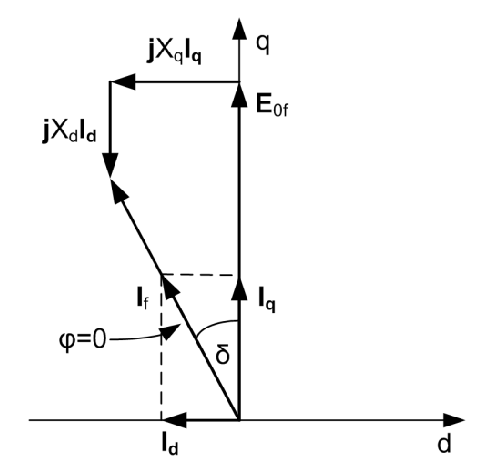

# Zadatak 19 — Maksimalna mehanička snaga sinhronog motora sa isturenim polovima pri konstantnoj pobudi

## Postavka

Sinhroni motor sa isturenim polovima ima sledeće podatke: nazivna snaga $2000\ \mathrm{hp}$ (konjskih snaga), nazivni napon $2300\ \mathrm{V}$, podužna sinhrona reaktansa $X_d = 1{,}95\ \Omega$, poprečna sinhrona reaktansa $X_q = 1{,}4\ \Omega$. Namotaj statora vezan je u zvezdu. Zanemarujući sve gubitke, izračunati **maksimalnu mehaničku snagu** kojom se dati motor može opteretiti ako je priključen na krutu mrežu nazivnog napona i frekvencije i ako se pobuda drži na konstantnoj vrednosti koja rezultuje jediničnim faktorom snage pri nazivnom opterećenju. Takođe izračunati **vrednost ugla opterećenja** koja odgovara tom režimu rada (maksimalnoj snazi).

> **Prevod na običan jezik:** Imamo sinhroni motor čiji rotor nije gladak valjak, nego ima isturene (izbočene) magnetne polove — zbog toga mašina ima *dve različite* reaktanse, jednu duž ose polova ($X_d$) i jednu između polova ($X_q$). Motor je priključen na "krutu mrežu" — idealan izvor kome se napon i frekvencija ne menjaju ma šta mi radili. Prvo motor opteretimo nazivnim (kataloškim) opterećenjem i pobudnu struju rotora podesimo baš toliko da motor iz mreže vuče čistu aktivnu snagu (faktor snage $\cos\varphi = 1$). Zatim tu pobudnu struju "zaključamo" i ne diramo je više. Pitanje glasi: ako sada mehanički teret na vratilu postepeno povećavamo, koliku najveću snagu motor može da razvije pre nego što "ispadne iz koraka" sa mrežom, i pod kojim uglom opterećenja $\delta$ se taj maksimum dešava? Pošto su svi gubici zanemareni, mehanička snaga na vratilu jednaka je električnoj snazi koju motor uzima iz mreže — pa tražimo maksimum te snage.

## Podaci

| Veličina | Oznaka | Vrednost | Šta ta veličina fizički znači |
|---|---|---|---|
| Nazivna snaga motora | $P_{\mathrm{n}}$ | $2000\ \mathrm{hp} = 1470\ \mathrm{kW}$ | Mehanička snaga na vratilu za koju je motor projektovan da trajno radi; zbirka koristi metričku konjsku snagu $1\ \mathrm{hp} = 735\ \mathrm{W}$. |
| Nazivni (linijski) napon | $U_{\mathrm{n}}$ | $2300\ \mathrm{V}$ | Efektivna vrednost napona *između dva fazna provodnika* mreže na koju je motor priključen. |
| Podužna sinhrona reaktansa | $X_d$ | $1{,}95\ \Omega$ | Reaktansa koju struja statora "vidi" kada njeno magnetno polje deluje duž ose isturenih polova (d-osa) — tu je vazdušni zazor mali, magnetni put "lak", pa je reaktansa veća. |
| Poprečna sinhrona reaktansa | $X_q$ | $1{,}4\ \Omega$ | Reaktansa koju struja statora "vidi" kada njeno polje deluje između polova (q-osa) — tu je zazor veliki, magnetni put "težak", pa je reaktansa manja. |
| Faktor snage u nazivnom režimu | $\cos\varphi$ | $1$ | Pobuda je podešena tako da je struja statora u fazi sa naponom — motor iz mreže uzima samo aktivnu snagu, bez reaktivne. |
| Sprega statorskog namotaja | — | zvezda (Y) | Način vezivanja tri fazna namotaja; kod zvezde je fazni napon $\sqrt{3}$ puta manji od linijskog. |
| Mreža | — | kruta, $U_{\mathrm{n}}$, $f_{\mathrm{n}}$ | Idealna mreža: napon i frekvencija su konstantni, ne zavise od opterećenja motora. |
| Gubici | — | zanemareni | Ni otpor statora, ni gubici u gvožđu, ni mehanički gubici se ne računaju — zato je ulazna električna snaga jednaka mehaničkoj snazi na vratilu. |

## Šta se traži i zašto

**1) Maksimalna mehanička snaga $P_{\mathrm{max}}$.** Sinhroni motor ne može da razvije neograničenu snagu: kako teret raste, rotor sve više "zaostaje" za obrtnim poljem mreže (raste ugao opterećenja $\delta$), ali snaga koju motor može da razvije ima maksimum. Ako teret pređe taj maksimum, motor ispada iz sinhronizma — rotor više ne može da prati obrtno polje, mašina gubi moment i praktično staje uz velike struje i mehaničke potrese. Inženjera $P_{\mathrm{max}}$ zanima jer je to **granica statičke stabilnosti**: govori koliku preopteretivost (rezervu snage) motor ima iznad nazivne snage.

**2) Ugao opterećenja $\delta$ pri maksimalnoj snazi.** To je "geografska koordinata" maksimuma na ugaonoj karakteristici — ugao pri kome mašina razvija najveću snagu. U pogonu se prati koliko je radni ugao daleko od tog kritičnog ugla, jer to direktno meri koliko smo daleko od ispada iz sinhronizma.

**Plan rešavanja (običnim jezikom):**
1. Iz linijskog napona i sprege zvezda izračunamo fazni napon; iz nazivne snage i $\cos\varphi = 1$ nazivnu struju.
2. Nacrtamo fazorski dijagram motora u nazivnom režimu i iz njega odredimo ugao opterećenja $\delta$ u tom režimu.
3. Iz dijagrama izračunamo indukovanu elektromotornu silu praznog hoda $E_{0f}$ — ona je "otisak" zaključane pobude i ostaje ista za sva dalja opterećenja.
4. Napišemo ugaonu karakteristiku $P(\delta)$ mašine sa isturenim polovima sa uvrštenim brojevima.
5. Maksimum funkcije $P(\delta)$ nađemo standardno — izjednačimo prvi izvod sa nulom; to vodi na kvadratnu jednačinu po $\cos\delta$.
6. Rešimo jednačinu, dobijemo kritični ugao, uvrstimo ga nazad u $P(\delta)$ i dobijemo $P_{\mathrm{max}}$.

## Potrebna teorija — mini-lekcije

### 1. Mašina sa isturenim polovima i dq-ose

Kod sinhrone mašine sa **cilindričnim rotorom** vazdušni zazor je svuda isti, pa jedna jedina sinhrona reaktansa $X_s$ opisuje mašinu. Kod mašine sa **isturenim polovima** rotor liči na točak sa ispupčenim polovima: tačno duž ose pola zazor je mali, a između polova veliki. Zato se uvode dve ose, čvrsto vezane za rotor:

- **d-osa** (direktna, podužna) — osa duž isturenog pola; tuda prolazi pobudni fluks. Magnetni put je "lak" (mali zazor), pa je reaktansa statorske struje po ovoj osi **veća**: $X_d$.
- **q-osa** (poprečna) — osa između polova, pomerena 90 električnih stepeni od d-ose. Zazor je veliki, put "težak", reaktansa **manja**: $X_q < X_d$.

U našem zadatku: $X_d = 1{,}95\ \Omega > X_q = 1{,}4\ \Omega$ — tipičan odnos. Svaka veličina statora (napon, struja) se u analizi razlaže na komponentu po d-osi i komponentu po q-osi, i svaka komponenta struje "vidi" svoju reaktansu.

Ovde se prvi put javlja i **indukovana elektromotorna sila (EMS) praznog hoda $E_{0f}$**: to je napon koji pobudni fluks rotora indukuje u statorskom namotaju — nazvana je "praznog hoda" jer bi se tačno taj napon izmerio na krajevima statora kada mašina radi bez ikakvog opterećenja (tada nema struje statora, pa ni padova napona). Još jedna ključna činjenica: pobudni fluks je po definiciji duž d-ose, a elektromotorna sila koju on indukuje u statoru kasni za fluksom 90° — dakle **fazor $E_{0f}$ uvek leži tačno na q-osi**. Zato se q-osa u fazorskom dijagramu crta kao pravac fazora $E_{0f}$.

### 2. Zvezda, fazni napon i nazivna struja

Kod sprege **zvezda** svaki fazni namotaj je priključen između jednog faznog provodnika i zajedničke (zvezdišne) tačke. Napon na jednom namotaju (fazni napon) manji je od napona između dva provodnika (linijskog) tačno $\sqrt{3}$ puta:

$$U_f = \frac{U_{\mathrm{n}}}{\sqrt{3}}$$

Trofazna prividna snaga izražena preko linijskih veličina je $S = \sqrt{3}\, U I$, pa je aktivna snaga $P = \sqrt{3}\, U I \cos\varphi$. Odatle, kada znamo snagu, napon i faktor snage, struja je:

$$I = \frac{P}{\sqrt{3}\, U \cos\varphi}$$

**Konjska snaga:** stara jedinica za snagu; zbirka koristi metričku vrednost $1\ \mathrm{hp} = 735\ \mathrm{W}$ (preciznije $735{,}5\ \mathrm{W}$; anglosaksonska verzija je $746\ \mathrm{W}$ — ovde se drži vrednosti iz zbirke da bi se brojevi poklopili). Pošto su gubici zanemareni, nazivna mehanička snaga na vratilu jednaka je električnoj snazi koju motor uzima iz mreže, pa istu formulu smemo primeniti sa $P_{\mathrm{n}}$.

### 3. Ugao opterećenja i fazorski dijagram motora

**Ugao opterećenja $\delta$** je ugao između fazora priključenog faznog napona $U_f$ i fazora indukovane EMS praznog hoda $E_{0f}$ (tj. q-ose). Fizički, on meri koliko je rotor "iskrenut" u odnosu na obrtno polje mreže: u praznom hodu $\delta \approx 0$, a što je mehanički teret veći, rotor više zaostaje i $\delta$ je veći. To je "elastična spojnica" od magnetnog polja — kao opruga koja se sve više zateže dok vučemo veći teret.

**Naponska jednačina motora.** Kod motora biramo *motorski referentni smer* struje: struja $I_f$ teče *od mreže ka motoru* (kod generatora je obrnuto — to je jedina suštinska razlika između motorskog i generatorskog fazorskog dijagrama). Priključeni napon tada pokriva indukovanu EMS i padove napona na reaktansama (otpor statora je zanemaren). Kod mašine sa isturenim polovima struja se razlaže na komponente $\underline{I}_d$ i $\underline{I}_q$, i svaka pravi pad napona na *svojoj* reaktansi:

$$\underline{U}_f = \underline{E}_{0f} + j X_d \underline{I}_d + j X_q \underline{I}_q$$

odnosno, kada se izrazi EMS:

$$\underline{E}_{0f} = \underline{U}_f - j X_d \underline{I}_d - j X_q \underline{I}_q$$

Množenje fazora imaginarnom jedinicom $j$ znači zaokret za $90^\circ$ unapred — zato su padovi napona $jX_d\underline{I}_d$ i $jX_q\underline{I}_q$ uvek normalni (pod pravim uglom) na svoje struje.

**Znak ugla $\delta$.** Po konvenciji (preuzetoj od generatora) ugao $\delta$ je pozitivan kada $E_{0f}$ *prednjači* naponu — to je generatorski režim. Kod motora je obrnuto: $E_{0f}$ *kasni* za naponom, pa je $\delta$ formalno negativan, a snaga izračunata iz ugaone karakteristike ispada negativna ($P<0$ znači "snaga izlazi iz mreže u mašinu"). Pošto unapred znamo da radimo sa motorom i da nas zanima snaga koja *ulazi* u motor, predznak slobodno ignorišemo: računamo sa $\delta > 0$ i snagu tumačimo kao pozitivnu snagu koja teče od mreže prema motoru. Tako radi i originalna zbirka.

### 4. Projekcije fazorskog dijagrama na dq-ose

Fazorski dijagram je samo geometrijska slika naponske jednačine, pa se iz njega čitaju skalarne jednačine projektovanjem na obe ose. Za motor u posmatranom režimu (videćemo dijagram na slici 19.1) važi:

- projekcija na **q-osu**: q-komponenta napona je $U_f\cos\delta$, a na desnoj strani jednačine stoji $E_{0f}$ (ceo na q-osi) umanjen za pad $X_d I_d$ (jer fazor $jX_d\underline{I}_d$ na dijagramu gleda suprotno od $E_{0f}$); kada se pad prebaci na levu stranu:

$$U_f\cos\delta = E_{0f} - X_d I_d \quad\Longrightarrow\quad E_{0f} = U_f\cos\delta + X_d I_d$$

- projekcija na **d-osu**: d-komponenta napona je $U_f\sin\delta$, a od padova napona po d-osi deluje samo $X_q I_q$ (fazor $jX_q\underline{I}_q$ je zaokrenuta struja $\underline{I}_q$, dakle normalan na q-osu, tj. leži na d-osi):

$$U_f\sin\delta = X_q I_q$$

Ove dve jednačine su opšte — važe za svaki režim. U *našem specijalnom režimu* ($\cos\varphi = 1$) struja $I_f$ je u fazi sa naponom $U_f$, pa fazor struje zaklapa sa q-osom isti ugao $\delta$ kao i napon. Njegove projekcije su tada prosto:

$$I_d = I_f\sin\delta, \qquad I_q = I_f\cos\delta$$

Pazi: ove dve "definicione" jednakosti u ovom obliku važe samo zato što je $\varphi = 0$; u opštem slučaju u njima bi figurisao ugao $\delta + \varphi$ ili $\delta - \varphi$.

### 5. Ugaona karakteristika snage mašine sa isturenim polovima — kompletno izvođenje

Trofazna mašina se u dq-analizi zamenjuje ekvivalentnom mašinom sa **dva fazna namotaja** postavljena po ortogonalnim d- i q-osama, sa svojim naponima $U_d$, $U_q$ i strujama $I_d$, $I_q$. Suština svake takve ekvivalentne transformacije je da **aktivna snaga mora ostati nepromenjena** — mašina ne sme "ni da izgubi ni da dobije" snagu samim preimenovanjem promenljivih. Uz konvenciju skaliranja koju koristi zbirka, snaga se računa kao:

$$P = 3\left(U_d I_d + U_q I_q\right)$$

gde su $U_d$, $U_q$ dq-komponente *faznog* napona, a $I_d$, $I_q$ dq-komponente *fazne* struje (faktor 3 čuva ukupnu trofaznu snagu).

Sada u tu formulu uvrstimo sve što znamo. Komponente napona su projekcije fazora $U_f$ na ose (napon zaklapa ugao $\delta$ sa q-osom):

$$U_d = U_f\sin\delta, \qquad U_q = U_f\cos\delta$$

a komponente struje izrazimo iz dve projekcione jednačine iz mini-lekcije 4 (ovaj oblik je opšti, ne traži $\varphi = 0$):

$$I_d = \frac{E_{0f} - U_f\cos\delta}{X_d}, \qquad I_q = \frac{U_f}{X_q}\sin\delta$$

Uvrštavanje i sređivanje, korak po korak (ovo je ono "kraće sređivanje" koje zbirka preskače):

$$\begin{aligned}
P &= 3\left(U_f\sin\delta\cdot\frac{E_{0f} - U_f\cos\delta}{X_d} + U_f\cos\delta\cdot\frac{U_f}{X_q}\sin\delta\right)\\[4pt]
&= 3\left(\frac{E_{0f}U_f}{X_d}\sin\delta - \frac{U_f^2}{X_d}\sin\delta\cos\delta + \frac{U_f^2}{X_q}\sin\delta\cos\delta\right)\\[4pt]
&= 3\,\frac{E_{0f}U_f}{X_d}\sin\delta + 3\,U_f^2\left(\frac{1}{X_q} - \frac{1}{X_d}\right)\sin\delta\cos\delta
\end{aligned}$$

Na kraju iskoristimo trigonometrijski identitet $\sin\delta\cos\delta = \tfrac{1}{2}\sin(2\delta)$:

$$\boxed{\,P = 3\,\frac{E_{0f}\,U_f}{X_d}\,\sin\delta + \frac{3}{2}\,U_f^2\left(\frac{1}{X_q} - \frac{1}{X_d}\right)\sin(2\delta)\,}$$

Ovo je **ugaona karakteristika aktivne snage** mašine sa isturenim polovima. Ima dva sabirka:

1. **Osnovna (pobudna) komponenta** $\propto E_{0f}\sin\delta$ — ista kao kod mašine sa cilindričnim rotorom; potiče od sadejstva pobudnog polja i polja statora i direktno zavisi od pobude.
2. **Reluktantna komponenta** $\propto \sin(2\delta)$ — postoji *samo* zato što je $X_d \neq X_q$. Ne zavisi od pobude uopšte! Fizički: istureni polovi "vole" da se poravnaju sa obrtnim poljem (kao gvozdeni klin koji magnet uvlači u položaj najmanjeg magnetnog otpora — otud ime, *reluktansa* = magnetni otpor), i to poravnavajuće dejstvo samo po sebi stvara moment i snagu. Pošto je $X_d > X_q$, izraz u zagradi $\left(\frac{1}{X_q} - \frac{1}{X_d}\right)$ je pozitivan.

### 6. Zašto $E_{0f}$ ostaje konstantna kad menjamo teret

Indukovana EMS praznog hoda srazmerna je pobudnom fluksu i brzini obrtanja: $E_{0f} \propto \Phi_{\mathrm{pob}}\cdot n$. U zadatku je pobudna struja **zaključana** (konstantan fluks), a motor je na krutoj mreži konstantne frekvencije, pa se u sinhronizmu obrće **konstantnom sinhronom brzinom** — dakle $E_{0f}$ se ne menja ma koliki teret bio. Isto tako je $U_f$ konstantan (kruta mreža). Zato su oba koeficijenta u ugaonoj karakteristici fiksni brojevi, a **jedino što se menja sa teretom jeste ugao $\delta$**. Zadatak se time svodi na čistu matematiku: naći maksimum funkcije jedne promenljive $P(\delta)$.

### 7. Traženje maksimuma: izvod, trigonometrijski identitet, kvadratna jednačina

Maksimum glatke funkcije nalazimo iz uslova da je prvi izvod jednak nuli:

$$\frac{dP}{d\delta} = 0$$

Trebaće nam izvodi: $\dfrac{d}{d\delta}\sin\delta = \cos\delta$ i $\dfrac{d}{d\delta}\sin(2\delta) = 2\cos(2\delta)$ (dvojka iskače po pravilu izvoda složene funkcije, jer je unutrašnja funkcija $2\delta$).

Dobijena jednačina sadržaće i $\cos\delta$ i $\cos(2\delta)$ — dve različite trigonometrijske funkcije. Da bismo je rešili, svedemo sve na jednu funkciju identitetom:

$$\cos(2\delta) = 2\cos^2\delta - 1$$

Posle smene jednačina postaje **kvadratna jednačina po nepoznatoj $t = \cos\delta$**, oblika $at^2 + bt + c = 0$, sa poznatim rešenjem:

$$t_{1,2} = \frac{-b \pm \sqrt{b^2 - 4ac}}{2a}$$

Od dva korena fizički je prihvatljiv samo onaj za koji važi $-1 \le t \le 1$ (kosinus ne može biti van tog opsega).

---

## Rešenje, korak po korak

### Korak 1: Fazni napon

**Zašto ovaj korak:** Sve fazorske jednačine i ugaona karakteristika rade sa *faznim* naponom, a zadatak daje *linijski* napon $U_{\mathrm{n}} = 2300\ \mathrm{V}$. Pošto je stator vezan u zvezdu, fazni napon je $\sqrt{3}$ puta manji:

$$U_{f\mathrm{n}} = \frac{U_{\mathrm{n}}}{\sqrt{3}} = \frac{2300}{\sqrt{3}} = \frac{2300}{1{,}732} = 1327{,}9\ \mathrm{V}$$

**Šta smo dobili:** Napon na jednom faznom namotaju motora — oko 1,33 kV. Sve dalje jednačine koriste ovu vrednost.

### Korak 2: Nazivna struja

**Zašto ovaj korak:** Struja u nazivnom režimu treba nam da bismo iz fazorskog dijagrama odredili ugao $\delta$ i EMS $E_{0f}$ — jer je baš u nazivnom režimu pobuda podešena na $\cos\varphi = 1$.

Opšti oblik (mini-lekcija 2), sa snagom pretvorenom iz konjskih snaga ($P_{\mathrm{n}} = 2000 \cdot 735\ \mathrm{W} = 1\,470\,000\ \mathrm{W}$):

$$I_{f\mathrm{n}} = I_{\mathrm{n}} = \frac{P_{\mathrm{n}}}{\sqrt{3}\cdot U_{\mathrm{n}}\cdot\cos\varphi} = \frac{2000\cdot 735}{\sqrt{3}\cdot 2300\cdot 1} = \frac{1\,470\,000}{3983{,}7} = 369\ \mathrm{A}$$

Ovde je $I_{f\mathrm{n}} = I_{\mathrm{n}}$ zato što su kod sprege zvezda fazna i linijska struja jednake (kroz namotaj teče ista struja kao kroz provodnik). Formula sme da koristi mehaničku snagu $P_{\mathrm{n}}$ kao električnu ulaznu snagu jer su svi gubici zanemareni.

**Šta smo dobili:** Nazivna struja statora od 369 A — struja koju motor vuče iz mreže pri punom (nazivnom) opterećenju i $\cos\varphi=1$.

### Korak 3: Fazorski dijagram motora i naponska jednačina

**Zašto ovaj korak:** Da bismo izračunali $E_{0f}$ i $\delta$, treba nam geometrijska slika režima — fazorski dijagram. Kod motora biramo motorski referentni smer struje (struja od mreže ka motoru); to je jedina ključna razlika u odnosu na generatorski dijagram. Naponska jednačina statorskog kola, uz zanemaren otpor statora (mini-lekcija 3):

$$\underline{U}_f = \underline{E}_{0f} + j X_d \underline{I}_d + j X_q \underline{I}_q
\qquad\Longleftrightarrow\qquad
\underline{E}_{0f} = \underline{U}_f - j X_d \underline{I}_d - j X_q \underline{I}_q$$

Simboli: $\underline{U}_f$ — fazor faznog napona; $\underline{E}_{0f}$ — fazor indukovane EMS praznog hoda (leži na q-osi); $\underline{I}_d$, $\underline{I}_q$ — fazori d- i q-komponente struje statora; $j$ — imaginarna jedinica (zaokret fazora za $90^\circ$).

Slika 19.1 prikazuje ovaj dijagram za naš režim. Čitaj je ovako: vertikalna osa je q-osa i na njoj leži $E_{0f}$; horizontalna osa je d-osa. Fazor napona $U_f$ zaklapa ugao $\delta$ sa q-osom, a struja $I_f$ je *paralelna sa naponom* jer je $\varphi = 0$ (na slici je taj uslov označen sa $\varphi = 0$ između $U_f$ i $I_f$). Struja se razlaže na $I_q$ (duž q-ose) i $I_d$ (duž d-ose). Od vrha fazora $E_{0f}$ nadovezuju se padovi napona: $jX_q I_q$ (normalan na $I_q$) i $jX_d I_d$ (normalan na $I_d$, gleda suprotno od $E_{0f}$) — njihov zbir sa $E_{0f}$ zatvara se tačno u fazor $U_f$, kako naponska jednačina i kaže.

**Slika 19.1 —** Fazorski dijagram sinhronog motora sa isturenim polovima pri jediničnom faktoru snage: $E_{0f}$ na q-osi, napon $U_f$ i struja $I_f$ međusobno paralelni ($\varphi = 0$) pod uglom $\delta$ prema q-osi, struja razložena na $I_d$ i $I_q$, i padovi napona $jX_dI_d$ i $jX_qI_q$ koji zatvaraju naponski mnogougao.

Projektovanjem dijagrama na ose i korišćenjem činjenice da je struja u fazi sa naponom dobijamo četiri skalarne jednačine (mini-lekcija 4):

$$\begin{aligned}
E_{0f} &= U_f\cos\delta + X_d I_d &\text{(projekcija na q-osu)}\\
U_f\sin\delta &= X_q I_q &\text{(projekcija na d-osu)}\\
I_d &= I_f\sin\delta &\text{(razlaganje struje, jer } \varphi = 0\text{)}\\
I_q &= I_f\cos\delta &\text{(razlaganje struje, jer } \varphi = 0\text{)}
\end{aligned}$$

**Šta smo dobili:** Sistem od četiri jednačine sa nepoznatima $E_{0f}$, $\delta$, $I_d$, $I_q$ — sve ostalo ($U_f$, $I_f$, $X_d$, $X_q$) su brojevi. Sada ga rešavamo.

### Korak 4: Ugao opterećenja u nazivnom režimu

**Zašto ovaj korak:** Ugao $\delta$ nam treba pre $E_{0f}$, jer se u izrazu za $E_{0f}$ pojavljuju $\cos\delta$ i $\sin\delta$.

Uvrstimo četvrtu jednačinu ($I_q = I_f\cos\delta$) u drugu ($U_f\sin\delta = X_q I_q$):

$$U_f\sin\delta = X_q\, I_f\cos\delta$$

Podelimo obe strane sa $U_f\cos\delta$ da bismo levu stranu sveli na tangens ($\mathrm{tg}\,\delta = \sin\delta/\cos\delta$):

$$\mathrm{tg}\,\delta = \frac{X_q\, I_f}{U_f} = \frac{1{,}4\cdot 369}{1327{,}9} = \frac{516{,}6}{1327{,}9} = 0{,}389$$

$$\delta = \mathrm{arctg}\,(0{,}389) = 21{,}26^\circ$$

**Šta smo dobili:** U nazivnom režimu rotor zaostaje za obrtnim poljem za oko 21° — umerena vrednost, daleko od kritične. (Formalno je za motor $\delta = -21{,}26^\circ$; predznak ignorišemo po dogovoru iz mini-lekcije 3.)

### Korak 5: Indukovana EMS praznog hoda

**Zašto ovaj korak:** $E_{0f}$ je jedina veličina u ugaonoj karakteristici koju još ne znamo. Pošto je pobuda zaključana, a brzina sinhrona i konstantna, vrednost koju sada izračunamo važi za sva kasnija opterećenja (mini-lekcija 6).

Uvrstimo treću jednačinu ($I_d = I_f\sin\delta$) u prvu ($E_{0f} = U_f\cos\delta + X_d I_d$):

$$E_{0f} = U_f\cos\delta + X_d\, I_f\sin\delta$$

Brojevi ($\cos 21{,}26^\circ = 0{,}9319$; $\sin 21{,}26^\circ = 0{,}3626$):

$$\begin{aligned}
E_{0f} &= 1327{,}9\cdot\cos 21{,}26^\circ + 1{,}95\cdot 369\cdot\sin 21{,}26^\circ\\
&= 1327{,}9\cdot 0{,}9319 + 719{,}55\cdot 0{,}3626\\
&= 1237{,}5 + 260{,}9 = 1498{,}4\ \mathrm{V}
\end{aligned}$$

**Šta smo dobili:** $E_{0f} = 1498{,}4\ \mathrm{V} > U_f = 1327{,}9\ \mathrm{V}$ — EMS je nešto veća od napona mreže. To je očekivano: da bi motor imao $\cos\varphi = 1$, pobuda mora biti dovoljno jaka (blizu granice nadpobuđenosti), pa je "unutrašnji napon" mašine veći od spoljašnjeg.

### Korak 6: Ugaona karakteristika sa brojevima

**Zašto ovaj korak:** Sada kada znamo $E_{0f}$, $U_f$, $X_d$ i $X_q$, možemo da napišemo $P(\delta)$ kao konkretnu funkciju jedne promenljive — nju ćemo maksimizovati.

Opšti oblik (izveden u mini-lekciji 5):

$$P = 3\,\frac{E_{0f}\,U_f}{X_d}\,\sin\delta + \frac{3}{2}\,U_f^2\left(\frac{1}{X_q} - \frac{1}{X_d}\right)\sin(2\delta)$$

Izračunajmo oba koeficijenta posebno.

**Pobudni koeficijent:**

$$3\,\frac{E_{0f}\,U_f}{X_d} = 3\cdot\frac{1498{,}4\cdot 1327{,}9}{1{,}95} = \frac{3\cdot 1\,989\,725}{1{,}95} = \frac{5\,969\,176}{1{,}95} = 3\,061\,116\ \mathrm{W} \approx 3061{,}11\ \mathrm{kW}$$

**Reluktantni koeficijent** (razliku recipročnih vrednosti najlakše je srediti svođenjem na zajednički imenilac):

$$\frac{1}{X_q} - \frac{1}{X_d} = \frac{X_d - X_q}{X_q\cdot X_d} = \frac{1{,}95 - 1{,}4}{1{,}4\cdot 1{,}95} = \frac{0{,}55}{2{,}73} = 0{,}201465\ \mathrm{\Omega^{-1}}$$

$$\frac{3}{2}\,U_f^2\left(\frac{1}{X_q} - \frac{1}{X_d}\right) = 1{,}5\cdot 1327{,}9^2\cdot 0{,}201465 = 2\,644\,978\cdot 0{,}201465 = 532\,871\ \mathrm{W} \approx 532{,}87\ \mathrm{kW}$$

Dakle, ugaona karakteristika u posmatranom režimu glasi:

$$P(\delta) = 3061{,}11\cdot\sin\delta + 532{,}87\cdot\sin(2\delta)\ \ [\mathrm{kW}]$$

> **Napomena o originalu:** U zbirci na ovom mestu u tekstu piše da je "indukovana elektromotorna sila jednaka 1327,9 V" — to je omaška u tekstu: $1327{,}9\ \mathrm{V}$ je *fazni napon*, a EMS je $1498{,}4\ \mathrm{V}$. U samoj formuli zbirka koristi ispravne vrednosti (i $1498{,}4$ i $1327{,}9$ na svojim mestima), pa su svi brojevi tačni. Sitnica oko zaokruživanja: sa zaokruženim ulazima dobija se $3061{,}12\ \mathrm{kW}$ umesto $3061{,}11\ \mathrm{kW}$ — razlika od $0{,}01\ \mathrm{kW}$ je potpuno nebitna i zadržavamo vrednost iz zbirke.

Još jedna napomena o predznaku, tačno kao u mini-lekciji 3: za motorski režim je ugao $\delta$ formalno negativan, pa bi direktno uvrštavanje negativnog ugla dalo $P < 0$ — što je matematički tačno, jer snaga "izlazi" iz mreže u motor. Pošto unapred znamo da razmatramo motor i da nas zanima snaga koja iz mreže dolazi u motor, ignorišemo predznak i radimo sa $\delta > 0$, imajući u vidu da je smer snage prema motoru.

**Šta smo dobili:** Snagu kao funkciju samo ugla $\delta$. Pobudna komponenta (amplitude 3061 kW) dominira, reluktantna (533 kW) je oko 6 puta manja, ali će, videćemo, primetno pomeriti i podići maksimum.

### Korak 7: Uslov maksimuma — prvi izvod jednak nuli

**Zašto ovaj korak:** Tražimo vrh krive $P(\delta)$; na vrhu je nagib (prvi izvod) jednak nuli.

$$\frac{dP}{d\delta} = 0$$

Diferenciramo član po član ($\sin\delta \to \cos\delta$; $\sin 2\delta \to 2\cos 2\delta$, dvojka iz izvoda složene funkcije):

$$\frac{dP}{d\delta} = 3061{,}11\cdot\cos\delta + 2\cdot 532{,}87\cdot\cos(2\delta) = 3061{,}11\cdot\cos\delta + 1065{,}74\cdot\cos(2\delta)$$

Izjednačimo sa nulom:

$$3061{,}11\cdot\cos\delta + 1065{,}74\cdot\cos(2\delta) = 0$$

**Šta smo dobili:** Jednačinu sa dve različite trigonometrijske funkcije ($\cos\delta$ i $\cos 2\delta$) — još je ne umemo rešiti direktno, pa u sledećem koraku sve svodimo na $\cos\delta$.

### Korak 8: Kvadratna jednačina i kritični ugao

**Zašto ovaj korak:** Identitetom $\cos(2\delta) = 2\cos^2\delta - 1$ jednačinu pretvaramo u kvadratnu po $\cos\delta$, koju znamo da rešimo.

Smena:

$$3061{,}11\cdot\cos\delta + 1065{,}74\cdot\left(2\cos^2\delta - 1\right) = 0$$

Razvijemo zagradu ($1065{,}74\cdot 2 = 2131{,}48$) i preuredimo po opadajućim stepenima:

$$2131{,}48\cdot\cos^2\delta + 3061{,}11\cdot\cos\delta - 1065{,}74 = 0$$

Ovo je kvadratna jednačina $a t^2 + b t + c = 0$ po $t = \cos\delta$, sa $a = 2131{,}48$, $b = 3061{,}11$, $c = -1065{,}74$. Rešenje:

$$t_{1,2} = \frac{-b \pm \sqrt{b^2 - 4ac}}{2a} = \frac{-3061{,}11 \pm \sqrt{3061{,}11^2 + 4\cdot 2131{,}48\cdot 1065{,}74}}{2\cdot 2131{,}48}$$

Diskriminanta:

$$b^2 - 4ac = 9\,370\,394 + 9\,086\,414 = 18\,456\,808 \quad\Rightarrow\quad \sqrt{18\,456\,808} = 4296{,}14$$

Dva korena (imenilac je $2a = 2\cdot 2131{,}48 = 4262{,}96$):

$$t_1 = \frac{-3061{,}11 + 4296{,}14}{4262{,}96} = \frac{1235{,}03}{4262{,}96} = 0{,}2897,
\qquad
t_2 = \frac{-3061{,}11 - 4296{,}14}{4262{,}96} = -1{,}726$$

Koren $t_2 = -1{,}726$ odbacujemo jer kosinus ne može biti manji od $-1$. Ostaje:

$$\cos\delta = 0{,}2897 \quad\Rightarrow\quad \delta = \arccos(0{,}2897) = 73{,}16^\circ$$

**Šta smo dobili:** Kritični ugao opterećenja $\delta = 73{,}16^\circ$ — ugao pri kome motor uzima maksimalnu snagu. Primetno je *manji od* $90^\circ$ (gde bi bio maksimum kod cilindričnog rotora): reluktantna komponenta, čiji je vrh na $45^\circ$, "povukla" je maksimum ulevo.

### Korak 9: Maksimalna snaga

**Zašto ovaj korak:** Kritični ugao vraćamo u ugaonu karakteristiku iz Koraka 6 — vrednost funkcije u tom uglu je tražena maksimalna snaga.

Sa $\sin 73{,}16^\circ = 0{,}9571$ i $\sin(2\cdot 73{,}16^\circ) = \sin 146{,}32^\circ = 0{,}5546$:

$$\begin{aligned}
P_{\mathrm{max}} &= 3061{,}11\cdot\sin 73{,}16^\circ + 532{,}87\cdot\sin\left(2\cdot 73{,}16^\circ\right)\\
&= 3061{,}11\cdot 0{,}9571 + 532{,}87\cdot 0{,}5546\\
&= 2929{,}84 + 295{,}51\\
&= 3225{,}35\ \mathrm{kW}
\end{aligned}$$

Pošto su svi gubici zanemareni, ova maksimalna električna snaga koju motor uzima iz mreže istovremeno je i **maksimalna mehanička snaga na vratilu**.

**Šta smo dobili:** $P_{\mathrm{max}} = 3225{,}35\ \mathrm{kW}$ — oko 2,2 puta više od nazivne snage (1470 kW). Motor, dakle, ima dobru rezervu: tek kada bi teret prešao 3225 kW, motor bi ispao iz sinhronizma.

## Česte greške i zamke

1. **Konjske snage.** Zaboravi se pretvaranje $\mathrm{hp} \to \mathrm{W}$, ili se upotrebi anglosaksonska vrednost $746\ \mathrm{W}$ umesto metričke $735\ \mathrm{W}$ koju koristi zbirka — svi brojevi posle toga "beže" (struja bi bila $374{,}5\ \mathrm{A}$ umesto $369\ \mathrm{A}$ itd.).
2. **Linijski umesto faznog napona.** U fazorske jednačine i ugaonu karakteristiku (sa faktorom 3 ispred) ide *fazni* napon $1327{,}9\ \mathrm{V}$, ne $2300\ \mathrm{V}$. Ko uvrsti linijski napon, dobiće trostruko veću snagu.
3. **Obrnut redosled u reluktantnom članu.** Piše se $\left(\frac{1}{X_q} - \frac{1}{X_d}\right)$ — prvo recipročna vrednost *manje* reaktanse. Ako se redosled obrne, reluktantna snaga ispadne negativna, maksimum se pomeri iznad $90^\circ$ i konačan rezultat je pogrešan.
4. **Pretpostavka $\delta_{\mathrm{max}} = 90^\circ$.** To važi samo za cilindrični rotor! Kod isturenih polova maksimum je uvek na uglu manjem od $90^\circ$ (ovde $73{,}16^\circ$) i mora se tražiti preko izvoda.
5. **Izgubljena dvojka u izvodu.** $\frac{d}{d\delta}\sin(2\delta) = 2\cos(2\delta)$ — ko zaboravi dvojku, dobije pogrešnu kvadratnu jednačinu i pogrešan ugao.
6. **Pogrešan koren kvadratne jednačine.** Jednačina po $\cos\delta$ ima dva korena; uzima se samo onaj u opsegu $[-1, 1]$.
7. **Definicione jednačine $I_d = I_f\sin\delta$, $I_q = I_f\cos\delta$ u pogrešnom režimu.** One u ovom prostom obliku važe samo pri $\cos\varphi = 1$ (struja u fazi sa naponom); u opštem slučaju u projekcijama struje figuriše ugao $\delta \pm \varphi$.

## Rezime rezultata

| Veličina | Oznaka | Vrednost |
|---|---|---|
| Fazni napon | $U_{f\mathrm{n}}$ | $1327{,}9\ \mathrm{V}$ |
| Nazivna struja | $I_{\mathrm{n}}$ | $369\ \mathrm{A}$ |
| Ugao opterećenja u nazivnom režimu | $\delta_{\mathrm{n}}$ | $21{,}26^\circ$ |
| EMS praznog hoda (konstantna, jer je pobuda zaključana) | $E_{0f}$ | $1498{,}4\ \mathrm{V}$ |
| Ugaona karakteristika | $P(\delta)$ | $3061{,}11\sin\delta + 532{,}87\sin(2\delta)\ \mathrm{kW}$ |
| **Ugao opterećenja pri maksimalnoj snazi** | $\delta$ | $73{,}16^\circ$ ($\cos\delta = 0{,}2897$) |
| **Maksimalna mehanička snaga** | $P_{\mathrm{max}}$ | $3225{,}35\ \mathrm{kW}$ |

## Provera smisla

**1. Ugaona karakteristika mora da reprodukuje nazivni režim.** Ako u $P(\delta)$ uvrstimo nazivni ugao $\delta_{\mathrm{n}} = 21{,}26^\circ$, treba da dobijemo nazivnu snagu:

$$P(21{,}26^\circ) = 3061{,}11\cdot\sin 21{,}26^\circ + 532{,}87\cdot\sin 42{,}52^\circ = 3061{,}11\cdot 0{,}3626 + 532{,}87\cdot 0{,}6758 = 1110{,}0 + 360{,}1 = 1470{,}1\ \mathrm{kW} \approx P_{\mathrm{n}} = 1470\ \mathrm{kW}$$

Poklapanje je odlično — ceo lanac računa ($U_f$, $I_{\mathrm{n}}$, $\delta_{\mathrm{n}}$, $E_{0f}$, koeficijenti) međusobno je konzistentan.

**2. Dimenziona provera koeficijenata.** Oba koeficijenta imaju oblik $\dfrac{\mathrm{V}\cdot\mathrm{V}}{\Omega} = \dfrac{\mathrm{V}^2}{\Omega} = \mathrm{W}$ — zaista snaga, kako i mora biti.

**3. Odnos prema nazivnoj snazi.** $P_{\mathrm{max}}/P_{\mathrm{n}} = 3225{,}35/1470 = 2{,}19$ — preopteretivost oko 2,2, što je sasvim tipična vrednost za sinhrone mašine (uobičajeno 2 do 3). Rezultat je fizički razuman.

**4. Granični slučaj — cilindrični rotor.** Da je $X_q = X_d$, reluktantni član bi nestao, maksimum bi bio tačno na $\delta = 90^\circ$ i iznosio bi samo $3061{,}11\ \mathrm{kW}$. Naš rezultat je veći ($3225{,}35\ \mathrm{kW}$) i na manjem uglu ($73{,}16^\circ$) — upravo ono što reluktantna komponenta i treba da uradi: podigne maksimum i pomeri ga ka $45^\circ$. Kritični ugao je, očekivano, između $45^\circ$ (vrh čisto reluktantne krive) i $90^\circ$ (vrh čisto pobudne krive), i bliži $90^\circ$ jer pobudna komponenta dominira.

**5. Provera nule izvoda.** $3061{,}11\cdot\cos 73{,}16^\circ + 1065{,}74\cdot\cos 146{,}32^\circ = 3061{,}11\cdot 0{,}2897 - 1065{,}74\cdot 0{,}8321 \approx 886{,}8 - 886{,}8 \approx 0$ — izračunati ugao zaista poništava prvi izvod, dakle jeste ekstremum (a pošto snaga od $\delta = 0$ najpre raste, u pitanju je baš maksimum).
