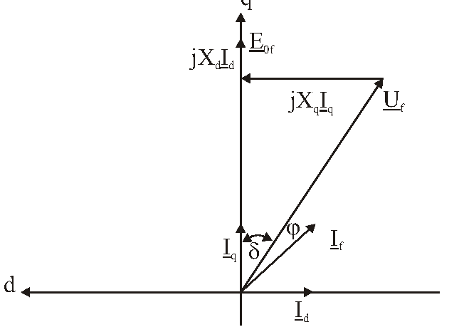
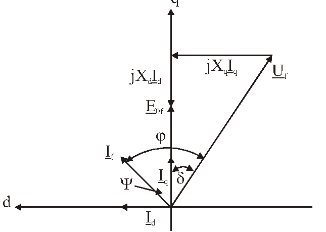
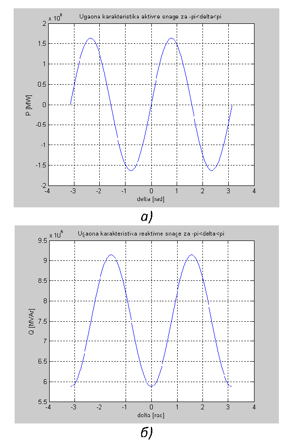

# Zadatak 20 — Hidrogenerator na krutoj mreži: radni režim i rad sa prekinutim kolom pobude (reluktantni momenat)

## Postavka

Trofazni sinhroni hidrogenerator radi priključen na krutu mrežu nazivnog napona i nazivne
učestanosti. Generator predaje u mrežu prividnu snagu od $1{,}5\ \mathrm{MVA}$ pri induktivnom
faktoru snage $0{,}8$. Odrediti:

a) aktivnu snagu, struju, elektromotornu silu i ugao opterećenja u ovom režimu;

b) izvesti izraze i skicirati zavisnost aktivne i reaktivne snage od ugla opterećenja
hidrogeneratora kome je prekinuto kolo pobude; kako se određuje maksimalna aktivna snaga
koju generator u trajnom radu može da preda mreži pri prekinutom kolu pobude;

c) generatoru je prekinuto kolo pobude, a snaga pogonske turbine je ista kao u prvoj tački
zadatka — odrediti struju generatora, faktor snage, aktivnu i reaktivnu snagu i ugao
opterećenja; da li generator može trajno da nastavi da radi u ovom režimu?

Nazivni podaci generatora su: $6{,}6\ \mathrm{kV}$, $5\ \mathrm{MVA}$, $1500\ \mathrm{o/min}$,
sprega Y, $x_{\sigma}=0{,}15\ \mathrm{r.j.}$, $x_{ad}=0{,}7\ \mathrm{r.j.}$,
$x_{aq}=0{,}4\ \mathrm{r.j.}$ Svi gubici aktivne snage u mašini mogu se zanemariti.

> **Prevod na običan jezik:** Imamo generator u hidroelektrani, vezan na veliku
> elektroenergetsku mrežu koja mu nameće napon i učestanost ("kruta mreža"). Trenutno u mrežu
> šalje $1{,}5\ \mathrm{MVA}$ prividne snage, od čega je $80\%$ "korisna" aktivna snaga
> (jer je $\cos\varphi = 0{,}8$). U tački a) treba da izračunamo osnovne veličine tog režima:
> koliku aktivnu snagu daje, kolika mu je struja, kolika je unutrašnja elektromotorna sila
> (EMS) koju stvara pobuda, i pod kojim uglom opterećenja radi. U tački b) zamišljamo kvar:
> žica ka pobudnom (rotorskom) namotaju je prekinuta, pa rotor više nije elektromagnet.
> Iznenađenje je da mašina sa istaknutim polovima i tada može da radi kao generator — preko
> tzv. reluktantnog momenta — i treba da izvedemo formule za snagu u tom stanju. U tački c)
> proveravamo brojkama: ako turbina i dalje gura istom snagom, šta se dešava sa strujom,
> faktorom snage i reaktivnom snagom — i sme li mašina tako da ostane da radi trajno
> (odgovor će biti: ne sme, jer struja premaši nazivnu).

## Podaci

| Veličina | Oznaka | Vrednost | Šta ta veličina fizički znači |
|---|---|---|---|
| Nazivni (linijski) napon | $U_{\mathrm{n}}$ | $6{,}6\ \mathrm{kV}$ | Napon između dve faze na priključcima mašine za koji je projektovana; mreža ga drži konstantnim. |
| Nazivna prividna snaga | $S_{\mathrm{n}}$ | $5\ \mathrm{MVA}$ | Najveća "ukupna" snaga ($\sqrt{P^2+Q^2}$) koju mašina sme trajno da daje — određuje je zagrevanje namotaja. |
| Nazivna brzina obrtanja | $n_{\mathrm{n}}$ | $1500\ \mathrm{o/min}$ | Brzina rotora; pri $50\ \mathrm{Hz}$ odgovara mašini sa 2 para polova ($n = 60 f / p$). |
| Sprega statora | Y | zvezda | Fazni napon je linijski podeljen sa $\sqrt{3}$: $U_{\mathrm{f}} = U_{\mathrm{n}}/\sqrt{3}$. |
| Rasipna reaktansa statora | $x_{\sigma}$ | $0{,}15\ \mathrm{r.j.}$ | Predstavlja fluks koji "procuri" oko statorskog namotaja, a ne stigne do rotora. |
| Reaktansa reakcije indukta po d-osi | $x_{ad}$ | $0{,}7\ \mathrm{r.j.}$ | Meri koliko statorska struja pravi fluks duž ose polova (d-osa), gde je vazdušni zazor mali. |
| Reaktansa reakcije indukta po q-osi | $x_{aq}$ | $0{,}4\ \mathrm{r.j.}$ | Isto to, ali duž međupolnog prostora (q-osa), gde je zazor veliki — zato je manja od $x_{ad}$. |
| Prividna snaga u režimu a) | $S_1$ | $1{,}5\ \mathrm{MVA}$ | Koliko generator trenutno predaje mreži (samo $30\%$ nazivne). |
| Faktor snage u režimu a) | $\cos\varphi$ | $0{,}8$ induktivno | Udeo aktivne snage u prividnoj; "induktivno" = generator uz aktivnu predaje mreži i reaktivnu snagu. |
| Gubici aktivne snage | — | zanemareni | Sva mehanička snaga turbine postaje električna; otpor statora $R_{\mathrm{s}} \approx 0$. |

Oznaka $\mathrm{r.j.}$ znači "relativne jedinice" — objašnjeno u prvoj mini-lekciji.
(U zbirci je rasipna reaktansa u spisku podataka označena $x_{\delta}$, a u rešenju
$x_{\sigma}$ — to je ista veličina; ovde dosledno pišemo $x_{\sigma}$, da se indeks ne bi
mešao sa uglom opterećenja $\delta$.)

## Šta se traži i zašto

**a) Aktivna snaga $P_1$, struja $I_{\mathrm{f}1}$, EMS $E_{0\mathrm{f}}$ i ugao opterećenja $\delta_1$.**
Ovo su "lične karte" radnog režima. Aktivna snaga govori koliko korisne energije šaljemo u
mrežu (to se naplaćuje), struja određuje zagrevanje namotaja, EMS govori koliko je mašina
pobuđena (koliku struju teramo kroz rotorski namotaj), a ugao opterećenja koliko smo daleko
od granice stabilnosti. Plan: (1) reaktanse iz r.j. pretvorimo u ome; (2) struju i aktivnu
snagu dobijemo pravo iz definicija $S = \sqrt{3}\,U I$ i $P = S\cos\varphi$; (3) nacrtamo
fazorski dijagram, iz njegovih projekcija izvedemo formulu za $\delta$; (4) iz dijagrama
pročitamo i $E_{0\mathrm{f}}$.

**b) Izrazi $P(\delta)$ i $Q(\delta)$ bez pobude + skica + metod za maksimalnu trajnu snagu.**
Ovo je teorijsko srce zadatka: pokazuje da mašina sa istaknutim polovima ima momenat i bez
pobude (reluktantni momenat) i koliki je on. Inženjera to zanima praktično: ako pukne kolo
pobude, da li elektrana može bar delimično da nastavi proizvodnju, i pod kojim uslovima?
Plan: (1) napišemo naponsku jednačinu sa $E_{0\mathrm{f}} = 0$; (2) iz fazorskog dijagrama
izvučemo projekcione jednačine; (3) ubacimo ih u definicije $P$ i $Q$ i sredimo
trigonometriju; (4) skiciramo i prokomentarišemo granicu stabilnosti i uslov trajnog rada.

**c) Novi režim posle prekida pobude: $I$, $\cos\varphi$, $P$, $Q$, $\delta$ i pitanje trajnog rada.**
Ovo je numerička provera scenarija kvara. Turbina ne zna da je pobuda otkazala — i dalje
gura istu mehaničku snagu, pa mašina mora istu aktivnu snagu da preda mreži (gubitke smo
zanemarili). Plan: (1) iz $P(\delta)$ izračunamo novi ugao $\delta$; (2) iz projekcionih
jednačina struje $I_d$ i $I_q$, pa ukupnu struju; (3) uporedimo je sa nazivnom — to je
presuda o trajnom radu; (4) izračunamo $\varphi$, $\cos\varphi$ i $Q$.

## Potrebna teorija — mini-lekcije

### 1. Kruta mreža

Kruta (beskonačna) mreža je idealizacija velikog elektroenergetskog sistema: njen napon i
učestanost su konstantni, ma šta naša mašina radila. Intuicija: naša mašina od
$5\ \mathrm{MVA}$ je kap u moru sistema od više desetina gigavata — kao da jednom slavinom
pokušavate da promenite nivo jezera. Posledica za račun: $U = U_{\mathrm{n}} = 6{,}6\ \mathrm{kV}$
i $f = 50\ \mathrm{Hz}$ su fiksirani u svim tačkama zadatka.

### 2. Relativne jedinice i bazna impedansa

Reaktanse mašina se u katalozima daju u **relativnim jedinicama (r.j.)** — kao udeo tzv.
bazne impedanse mašine. Bazna impedansa je odnos baznog faznog napona i bazne struje:

$$Z_{\mathrm{b}} = \frac{U_{\mathrm{fb}}}{I_{\mathrm{b}}} = \frac{U_{\mathrm{n}}/\sqrt{3}}{S_{\mathrm{n}}/(\sqrt{3}\,U_{\mathrm{n}})} = \frac{U_{\mathrm{n}}^2}{S_{\mathrm{n}}}$$

gde je $U_{\mathrm{n}}$ nazivni linijski napon, a $S_{\mathrm{n}}$ nazivna prividna snaga
(iskoristili smo $I_{\mathrm{b}} = I_{\mathrm{n}} = S_{\mathrm{n}}/(\sqrt{3}U_{\mathrm{n}})$
i skratili $\sqrt{3}$). Stvarna reaktansa u omima je onda prosto:

$$X\ [\Omega] = x\ [\mathrm{r.j.}] \cdot \frac{U_{\mathrm{n}}^2}{S_{\mathrm{n}}}$$

Zašto se ovo uopšte radi? Zato što su reaktanse u r.j. slične za mašine vrlo različitih
veličina (npr. $x_d$ hidrogeneratora je tipično oko $0{,}6$–$1{,}2\ \mathrm{r.j.}$), pa
inženjer odmah vidi da li je vrednost "normalna", bez obzira na to da li mašina ima 5 ili
500 MVA.

### 3. Mašina sa istaknutim polovima: d-osa, q-osa i dve reaktanse

Hidrogeneratori se obrću sporo, pa imaju mnogo polova, i to **istaknutih** — rotor liči na
točak sa "pečurkama" (polovima) po obodu. Zato rotor **nije magnetno simetričan**:

- **d-osa (direktna, podužna)** — pravac kroz sredinu pola. Tu je vazdušni zazor mali, pa
  fluks lako prolazi (mali "magnetni otpor").
- **q-osa (poprečna)** — pravac kroz međupolni prostor, pomeren za $90^{\circ}$ električnih.
  Tu je zazor veliki, fluks prolazi teško.

Statorska struja $I_{\mathrm{f}}$ (fazna struja statora) se zato razlaže na dve komponente:
$I_d$ (stvara fluks duž d-ose) i $I_q$ (duž q-ose). Svaka komponenta "vidi" drugačiju
reaktansu, pa mašina ima **dve sinhrone reaktanse** (to je Blondelova teorija dvostruke
reakcije):

$$X_d = X_{\sigma} + X_{ad}, \qquad X_q = X_{\sigma} + X_{aq}, \qquad X_d > X_q$$

Ovde je $X_{\sigma}$ rasipna reaktansa (fluks koji se zatvara oko samog statorskog namotaja,
isti za obe ose), a $X_{ad}$ i $X_{aq}$ reaktanse reakcije indukta po osama: $X_{ad} > X_{aq}$
upravo zato što je zazor po d-osi manji. Kod turbogeneratora (valjkast rotor, ravnomeran
zazor) je $X_d = X_q$ i cela "dvoosna" priča se urušava u jednu reaktansu.

### 4. EMS praznog hoda i ugao opterećenja

Pobudni (rotorski) namotaj, napajan jednosmernom strujom, pravi glavni fluks mašine. Taj
fluks se obrće zajedno sa rotorom i u statorskim namotajima indukuje **elektromotornu silu
praznog hoda** $E_{0\mathrm{f}}$ (fazna vrednost). Ime "praznog hoda" znači: to je napon koji
bismo izmerili na priključcima kada mašina ne bi davala nikakvu struju. Fazor
$\underline{E}_{0\mathrm{f}}$ leži tačno na q-osi (jer pobudni fluks leži na d-osi, a
indukovana EMS prednjači fluksu za $90^{\circ}$).

**Ugao opterećenja $\delta$** je ugao između fazora napona mreže $\underline{U}_{\mathrm{f}}$
i q-ose (tj. između $\underline{U}_{\mathrm{f}}$ i $\underline{E}_{0\mathrm{f}}$). Fizički:
to je ugao za koji rotor "odmakne" ispred svog položaja praznog hoda kada mašinu opteretimo.
Analogija: rotor i polje mreže vezani su kao dva točka elastičnom oprugom — što jače vučete
(veća snaga), opruga se više rastegne (veći $\delta$). Ako se rastegne preko granice,
"pukne" — mašina ispadne iz sinhronizma.

### 5. Jednačina naponske ravnoteže i fazorski dijagram

Za sinhroni generator sa istaknutim polovima, uz zanemaren otpor statora, važi (po fazi,
u generatorskom smeru brojanja):

$$\underline{E}_{0\mathrm{f}} = \underline{U}_{\mathrm{f}} + j X_d \underline{I}_d + j X_q \underline{I}_q$$

Rečima: unutrašnja EMS pokriva napon mreže plus induktivne padove napona koje prave obe
komponente struje, svaka na svojoj reaktansi. Fazorski dijagram je samo crtež ove jednačine;
iz njega se **projektovanjem na d- i q-osu** dobijaju skalarne jednačine koje stvarno
koristimo u računu (u rešenju su to jednačine (1)–(4), odnosno (5)–(8) za slučaj bez pobude).
Napomena o uglovima koju ćemo stalno koristiti: $\underline{U}_{\mathrm{f}}$ zaklapa ugao
$\delta$ sa q-osom, a struja $\underline{I}_{\mathrm{f}}$ zaklapa ugao $\varphi$ sa
$\underline{U}_{\mathrm{f}}$ — pa je ugao struje prema q-osi $\varphi + \delta$ (kad struja
kasni) odnosno $\varphi - \delta$ (kad struja prednjači, slučaj bez pobude).

### 6. Nadpobuđen i podpobuđen generator

- **Nadpobuđen** generator (jaka pobudna struja, velika $E_{0\mathrm{f}}$): pored aktivne,
  **predaje** mreži i reaktivnu snagu; struja kasni za naponom — mreža ga "vidi" induktivno.
  To je normalan režim iz tačke a) ($\cos\varphi = 0{,}8$ induktivno).
- **Podpobuđen** generator (slaba ili nikakva pobuda): mašina nema dovoljno sopstvenog
  fluksa, pa struju za svoje magnećenje **uzima iz mreže** — troši reaktivnu snagu; struja
  prednjači naponu — faktor snage je kapacitivan. Ekstremni slučaj je upravo prekinuto kolo
  pobude ($E_{0\mathrm{f}} = 0$): sav fluks mašine mora da napravi statorska struja iz mreže.

### 7. Reluktantni momenat — zašto mašina radi i bez pobude

Reluktansa = magnetni otpor. Komad gvožđa u magnetnom polju uvek teži da se postavi tako da
polju pruži **najlakši put** (najmanju reluktansu) — zato magnet privlači i običan ekser,
koji sam nije magnet. Rotor sa istaknutim polovima je baš takav "oblikovan komad gvožđa":
obrtno polje statora najlakše prolazi kroz njega duž d-ose. Ako turbina pokuša da zakrene
rotor tako da d-osa ode u stranu od polja, polje ga vuče nazad — to je **reluktantni
momenat**. On postoji **i bez ikakve pobudne struje**, samo zato što je $X_d \neq X_q$;
matematički će se to videti kao član sa $\left(\tfrac{1}{X_q} - \tfrac{1}{X_d}\right)$ u
izrazu za snagu. Kod turbogeneratora ($X_d = X_q$) taj član je nula — turbogenerator bez
pobude ne može da razvija momenat na ovaj način.

Još jedna posledica koju treba zapamtiti: reluktantna snaga zavisi od $\sin(2\delta)$, a ne
od $\sin\delta$. Maksimum $\sin(2\delta)$ je na $2\delta = 90^{\circ}$, tj. na
$\delta = 45^{\circ}$ — dakle **granica stabilnosti bez pobude je $\delta = \pi/4$**, a ne
$\pi/2$ kao kod pobuđene mašine. (Stabilan rad traži da snaga još raste sa uglom,
$\mathrm{d}P/\mathrm{d}\delta > 0$, jer se samo tada mašina posle malog poremećaja sama
vraća u ravnotežu; za $\sin 2\delta$ to važi dok je $\delta < \pi/4$.)

### 8. Trougao snaga i uslov trajnog rada

Za trofazni sistem: $S = \sqrt{3}\,U I$ (prividna snaga, linijske vrednosti),
$P = S\cos\varphi$ (aktivna), $Q = S\sin\varphi$ (reaktivna), i važi
$S = \sqrt{P^2 + Q^2}$ — "trougao snaga". Zagrevanje namotaja određuje **struja**, pa uslov
trajnog rada glasi $I \le I_{\mathrm{n}}$. Pošto je napon mreže stalno nazivni, to je isto
što i $S \le S_{\mathrm{n}}$: mašina sme trajno da radi samo dok joj je prividna snaga
najviše nazivna — makar aktivna snaga bila mala! Ovo je ključ za tačke b) i c): reaktivna
snaga "jede" strujni kapacitet mašine jednako kao aktivna.

## Rešenje, korak po korak

### Korak 1: Reaktanse mašine u omima

**Zašto ovaj korak:** Svi podaci o reaktansama su u relativnim jedinicama, a računaćemo sa
stvarnim naponima u voltima i strujama u amperima — treba nam, dakle, sve u omima
(mini-lekcija 2).

Bazna impedansa:

$$Z_{\mathrm{b}} = \frac{U_{\mathrm{n}}^2}{S_{\mathrm{n}}} = \frac{6600^2}{5\cdot 10^6} = \frac{43{,}56\cdot 10^6}{5\cdot 10^6} = 8{,}712\ \Omega$$

Množenjem relativnih vrednosti baznom impedansom:

$$X_{\sigma} = x_{\sigma}\cdot\frac{U_{\mathrm{n}}^2}{S_{\mathrm{n}}} = 0{,}15\cdot 8{,}712 = 1{,}307\ \Omega$$

$$X_{ad} = x_{ad}\cdot\frac{U_{\mathrm{n}}^2}{S_{\mathrm{n}}} = 0{,}7\cdot 8{,}712 = 6{,}098\ \Omega$$

$$X_{aq} = x_{aq}\cdot\frac{U_{\mathrm{n}}^2}{S_{\mathrm{n}}} = 0{,}4\cdot 8{,}712 = 3{,}485\ \Omega$$

Sinhrone reaktanse po osama (mini-lekcija 3):

$$X_d = X_{\sigma} + X_{ad} = 1{,}307 + 6{,}098 = 7{,}405 \approx 7{,}41\ \Omega$$

$$X_q = X_{\sigma} + X_{aq} = 1{,}307 + 3{,}458 = 4{,}765\ \Omega$$

> **Napomena o originalu:** U zbirci se pri sabiranju za $X_q$ potkrala zamena mesta cifara:
> umesto izračunatog $X_{aq} = 3{,}485\ \Omega$ u zbir je uneto $3{,}458\ \Omega$, pa je
> dobijeno $X_q = 4{,}765\ \Omega$ umesto ispravnih
> $X_q = 1{,}307 + 3{,}485 = 4{,}792\ \Omega$. Svi dalji brojevi u zbirci računati su sa
> $4{,}765\ \Omega$, pa i mi u nastavku **zadržavamo zbirkinu vrednost
> $X_q = 4{,}765\ \Omega$**, da bi se svaki naš rezultat mogao uporediti sa originalom
> jedan-na-jedan. Greška je, srećom, sitna (oko $0{,}6\,\%$): sa ispravljenim
> $X_q = 4{,}792\ \Omega$ dobilo bi se u tački a) $\delta_1 = 6{,}85^{\circ}$ (umesto
> $6{,}815^{\circ}$) i praktično ista EMS, a u tački c) $\delta = 24{,}18^{\circ}$ (umesto
> $23{,}674^{\circ}$), $I = 571\ \mathrm{A}$ (umesto $570\ \mathrm{A}$),
> $\cos\varphi = 0{,}184$ i $Q = 6{,}42\ \mathrm{MVAr}$ — svi zaključci ostaju potpuno isti.

**Šta smo dobili:** $X_d = 7{,}41\ \Omega$ je primetno veće od $X_q = 4{,}765\ \Omega$
(odnos $x_d = 0{,}85\ \mathrm{r.j.}$ prema $x_q = 0{,}55\ \mathrm{r.j.}$) — tipično za
mašinu sa istaknutim polovima. Upravo ta razlika će u tački b) proizvesti reluktantnu snagu.

### Korak 2: Struja generatora u režimu a)

**Zašto ovaj korak:** Struja je tražena veličina, a trebaće nam i za formulu ugla
opterećenja. Dobijamo je pravo iz definicije trofazne prividne snage (mini-lekcija 8).

Iz $S_1 = \sqrt{3}\,U I_{\mathrm{f}1}$ sledi:

$$I_{\mathrm{f}1} = \frac{S_1}{\sqrt{3}\cdot U} = \frac{1{,}5\cdot 10^6}{\sqrt{3}\cdot 6600} = \frac{1{,}5\cdot 10^6}{11\,431{,}5} = 131{,}22\ \mathrm{A}$$

Ovde je $U = 6600\ \mathrm{V}$ linijski napon mreže (jednak nazivnom, jer je mreža kruta),
a $I_{\mathrm{f}1}$ fazna struja statora (kod sprege Y linijska i fazna struja su iste).

**Šta smo dobili:** Struja je udobno ispod nazivne — kao što ćemo videti u koraku 15,
$I_{\mathrm{n}} = 437{,}38\ \mathrm{A}$, pa mašina radi sa oko $30\,\%$ nazivne struje.
Logično: i prividna snaga je $30\,\%$ nazivne ($1{,}5$ od $5\ \mathrm{MVA}$).

### Korak 3: Aktivna snaga u režimu a)

**Zašto ovaj korak:** Aktivna snaga je prva tražena veličina; osim toga, u tački c) će nam
biti potrebna, jer turbina nastavlja da je daje i posle kvara pobude.

$$P_1 = S_1\cdot\cos\varphi = 1{,}5\cdot 10^6 \cdot 0{,}8 = 1{,}2\ \mathrm{MW}$$

**Šta smo dobili:** Generator šalje u mrežu $1{,}2\ \mathrm{MW}$ korisne snage. Pošto smo
gubitke zanemarili, tačno toliko mehaničke snage daje i turbina. (Uzgred, reaktivna snaga u
ovom režimu je $Q_1 = S_1\sin\varphi = 1{,}5\cdot 10^6\cdot 0{,}6 = 0{,}9\ \mathrm{MVAr}$ i
generator je **predaje** mreži — nadpobuđen je, mini-lekcija 6.)

### Korak 4: Naponska jednačina i fazorski dijagram nadpobuđenog generatora

**Zašto ovaj korak:** Za preostale dve veličine ($E_{0\mathrm{f}}$ i $\delta$) definicije
nisu dovoljne — treba nam fazorski dijagram i njegove projekcije na d- i q-osu.

Jednačina naponske ravnoteže nadpobuđenog hidrogeneratora, uz zanemaren otpor statora
(mini-lekcija 5):

$$\underline{E}_{0\mathrm{f}} = \underline{U}_{\mathrm{f}} + j\,X_d\,\underline{I}_d + j\,X_q\,\underline{I}_q$$

Simboli: $\underline{U}_{\mathrm{f}}$ — fazor faznog napona mreže
($U_{\mathrm{f}} = U_{\mathrm{n}}/\sqrt{3} = 6600/\sqrt{3} = 3810{,}5\ \mathrm{V}$);
$\underline{I}_d$, $\underline{I}_q$ — fazori d- i q-komponente statorske struje;
$\underline{E}_{0\mathrm{f}}$ — fazor EMS praznog hoda (leži na q-osi).

Sledeća slika prikazuje fazorski dijagram tog režima. Kako se čita: horizontalna osa je
d-osa, vertikalna q-osa. Na q-osi leži $\underline{E}_{0\mathrm{f}}$. Fazor napona
$\underline{U}_{\mathrm{f}}$ je zakrenut za ugao $\delta$ od q-ose, a struja
$\underline{I}_{\mathrm{f}}$ kasni za naponom za ugao $\varphi$ (induktivan režim). Struja je
razložena na $\underline{I}_d$ (po d-osi) i $\underline{I}_q$ (po q-osi). Od vrha
$\underline{U}_{\mathrm{f}}$ ka q-osi ide horizontalni fazor $jX_q\underline{I}_q$ (pad
napona na $X_q$; horizontalan je jer je $\underline{I}_q$ vertikalan, a množenje sa $j$
zakreće za $90^{\circ}$), a zatim uz q-osu vertikalni fazor $jX_d\underline{I}_d$ — njihov
zbir sa $\underline{U}_{\mathrm{f}}$ daje upravo $\underline{E}_{0\mathrm{f}}$.

**Slika 20.1 —** Fazorski dijagram sinhronog nadpobuđenog hidrogeneratora: EMS
$\underline{E}_{0\mathrm{f}}$ na q-osi, napon $\underline{U}_{\mathrm{f}}$ pod uglom
$\delta$, struja $\underline{I}_{\mathrm{f}}$ kasni za naponom za $\varphi$ i razlaže se na
$\underline{I}_d$ i $\underline{I}_q$.

Projektovanjem dijagrama na q-osu i d-osu dobijaju se skalarne jednačine (proveri svaku na
slici!):

$$U_{\mathrm{f}}\cos\delta + X_d I_d = E_{0\mathrm{f}} \qquad (1)$$

$$U_{\mathrm{f}}\sin\delta = X_q I_q \qquad (2)$$

$$I_d = I_{\mathrm{f}}\sin(\varphi + \delta) \qquad (3)$$

$$I_q = I_{\mathrm{f}}\cos(\varphi + \delta) \qquad (4)$$

Objašnjenje porekla: (1) je projekcija naponske jednačine na q-osu — na q-osi se sabiraju
projekcija napona ($U_{\mathrm{f}}\cos\delta$) i pad $X_d I_d$ (koji je ceo na q-osi, jer
$j$ zakreće $\underline{I}_d$ sa d-ose na q-osu) i zajedno daju $E_{0\mathrm{f}}$; (2) je
projekcija na d-osu — projekciju napona $U_{\mathrm{f}}\sin\delta$ pokriva pad $X_q I_q$;
(3) i (4) su prosto razlaganje struje, čiji je ugao prema q-osi $\varphi + \delta$
(mini-lekcija 5).

**Šta smo dobili:** Četiri jednačine sa četiri "nepoznate priče" — iz njih ćemo izvući prvo
$\delta$, pa $I_d$, pa $E_{0\mathrm{f}}$.

### Korak 5: Ugao opterećenja $\delta_1$

**Zašto ovaj korak:** $\delta$ je tražena veličina i ne možemo do $E_{0\mathrm{f}}$ bez
njega. Trik: jednačine (2) i (4) ne sadrže ni $E_{0\mathrm{f}}$ ni $I_d$, pa se iz njih
$\delta$ dobija direktno.

Uvrstimo (4) u (2):

$$U_{\mathrm{f}}\sin\delta = X_q I_{\mathrm{f}}\cos(\varphi+\delta)$$

Razvijemo kosinus zbira, $\cos(\varphi+\delta) = \cos\varphi\cos\delta - \sin\varphi\sin\delta$:

$$U_{\mathrm{f}}\sin\delta = X_q I_{\mathrm{f}}\left(\cos\varphi\cos\delta - \sin\varphi\sin\delta\right)$$

Podelimo obe strane sa $\cos\delta$ (dozvoljeno, jer je $\delta$ mali ugao, sigurno nije
$90^{\circ}$), koristeći $\sin\delta/\cos\delta = \tan\delta$:

$$U_{\mathrm{f}}\tan\delta = X_q I_{\mathrm{f}}\cos\varphi - X_q I_{\mathrm{f}}\sin\varphi\tan\delta$$

Prebacimo član sa $\tan\delta$ na levu stranu i izvučemo $\tan\delta$:

$$\tan\delta\left(U_{\mathrm{f}} + X_q I_{\mathrm{f}}\sin\varphi\right) = X_q I_{\mathrm{f}}\cos\varphi$$

$$\delta = \arctan\!\left(\frac{X_q I_{\mathrm{f}}\cos\varphi}{U_{\mathrm{f}} + X_q I_{\mathrm{f}}\sin\varphi}\right)$$

Brojevi (uz $\cos\varphi = 0{,}8 \Rightarrow \sin\varphi = 0{,}6$, jer je
$\sin\varphi = \sqrt{1-0{,}8^2}$):

- brojilac: $X_q I_{\mathrm{f}}\cos\varphi = 4{,}765\cdot 131{,}22\cdot 0{,}8 = 625{,}26\cdot 0{,}8 = 500{,}2\ \mathrm{V}$
- imenilac: $U_{\mathrm{f}} + X_q I_{\mathrm{f}}\sin\varphi = 3810{,}5 + 625{,}26\cdot 0{,}6 = 3810{,}5 + 375{,}2 = 4185{,}7\ \mathrm{V}$

$$\delta_1 = \arctan\!\left(\frac{500{,}2}{4185{,}7}\right) = \arctan(0{,}1195) = 6{,}815^{\circ}$$

**Šta smo dobili:** Vrlo mali ugao opterećenja — očekivano, jer mašina nosi tek $30\,\%$
nazivne snage. "Opruga" iz mini-lekcije 4 jedva je zategnuta; do granice stabilnosti
($90^{\circ}$ za pobuđenu mašinu) ima ogromnu rezervu.

### Korak 6: Struja po d-osi

**Zašto ovaj korak:** $I_d$ nam treba za jednačinu (1), iz koje sledi $E_{0\mathrm{f}}$.

Iz (3), sa $\varphi = \arccos(0{,}8) = 36{,}87^{\circ}$:

$$I_d = I_{\mathrm{f}}\sin(\varphi + \delta) = 131{,}22\cdot\sin\left(36{,}87^{\circ} + 6{,}815^{\circ}\right) = 131{,}22\cdot\sin\left(43{,}69^{\circ}\right)$$

$$I_d = 131{,}22\cdot 0{,}6907 = 90{,}63\ \mathrm{A}$$

**Šta smo dobili:** Većina struje ($90{,}6$ od $131{,}2\ \mathrm{A}$) je u d-osi — kod
nadpobuđenog generatora d-komponenta struje razmagnetiše mašinu i "gura" reaktivnu snagu ka
mreži.

### Korak 7: EMS praznog hoda (fazna i linijska)

**Zašto ovaj korak:** $E_{0\mathrm{f}}$ je poslednja tražena veličina tačke a); govori
koliko je mašina pobuđena.

Iz jednačine (1):

$$E_{0\mathrm{f}} = U_{\mathrm{f}}\cos\delta + X_d I_d = \frac{6600}{\sqrt{3}}\cdot\cos\left(6{,}815^{\circ}\right) + 7{,}41\cdot 90{,}63$$

Po članovima: $3810{,}5\cdot 0{,}9929 = 3783{,}6\ \mathrm{V}$ i
$7{,}41\cdot 90{,}63 = 671{,}6\ \mathrm{V}$, pa je:

$$E_{0\mathrm{f}} = 3783{,}6 + 671{,}6 = 4455\ \mathrm{V} = 4{,}455\ \mathrm{kV}$$

Linijska vrednost (kao i kod napona, množi se sa $\sqrt{3}$):

$$E_{0\mathrm{L}} = \sqrt{3}\cdot E_{0\mathrm{f}} = \sqrt{3}\cdot 4{,}455 = 7{,}717\ \mathrm{kV}$$

> **Napomena o originalu:** U zbirci u redu za $E_{0\mathrm{L}}$ stoji
> "$\sqrt{3}\cdot 4{,}445\ \mathrm{kV}$" — štamparska greška, jer je red iznad izračunato
> $E_{0\mathrm{f}} = 4{,}455\ \mathrm{kV}$; konačni rezultat $7{,}717\ \mathrm{kV}$ odgovara
> ispravnoj vrednosti $4{,}455\ \mathrm{kV}$.

**Šta smo dobili:** $E_{0\mathrm{L}} = 7{,}717\ \mathrm{kV} > U_{\mathrm{n}} = 6{,}6\ \mathrm{kV}$
— unutrašnja EMS je veća od napona mreže, što je upravo definicija **nadpobuđene** mašine
(mini-lekcija 6) i slaže se sa induktivnim faktorom snage iz postavke.

### Korak 8: Šta se dešava kad se prekine kolo pobude — jednačine novog stanja (tačka b)

**Zašto ovaj korak:** Prelazimo na tačku b). Pre izvođenja formula moramo postaviti novu
naponsku jednačinu i novi fazorski dijagram.

Kada se kolo pobude prekine, pobudna struja padne na nulu, pa nestane pobudni fluks i sa
njim EMS: $E_{0\mathrm{f}} = 0$. Hidrogenerator ipak **može da nastavi da radi**,
zahvaljujući reluktantnoj komponenti momenta (mini-lekcija 7). Ali reaktivnu snagu sada nema
odakle da proizvede — naprotiv, struju za sopstveno magnećenje mora da uzme iz mreže: mašina
je krajnje **podpobuđena**, faktor snage joj je **kapacitivan** (mini-lekcija 6).

Naponska jednačina se dobija iz one u koraku 4 prostim stavljanjem
$\underline{E}_{0\mathrm{f}} = 0$:

$$0 = \underline{U}_{\mathrm{f}} + j\,X_d\,\underline{I}_d + j\,X_q\,\underline{I}_q$$

Sledeća slika prikazuje odgovarajući fazorski dijagram. Kako se čita: raspored osa je isti
kao na slici 20.1, ali sada fazori $\underline{U}_{\mathrm{f}}$, $jX_d\underline{I}_d$ i
$jX_q\underline{I}_q$ zajedno moraju da se vrate u koordinatni početak (zbir im je nula —
zato je na mestu gde bi bila EMS označeno $\underline{E}_{0\mathrm{f}} = 0$, strelice se
poništavaju). Struja $\underline{I}_{\mathrm{f}}$ sada **prednjači** naponu za ugao
$\varphi$ (kapacitivno) i nalazi se sa druge strane q-ose; njen ugao prema q-osi označen je
sa $\Psi$ (grčko "psi") i sa slike se vidi $\Psi = \varphi - \delta$.

**Slika 20.2 —** Fazorski dijagram sinhronog hidrogeneratora sa prekinutim kolom pobude:
$E_{0\mathrm{f}} = 0$, struja prednjači naponu (kapacitivan režim), ugao struje prema q-osi
je $\Psi = \varphi - \delta$.

Projektovanjem na ose (isti postupak kao u koraku 4, samo bez člana $E_{0\mathrm{f}}$):

$$U_{\mathrm{f}}\cos\delta = X_d I_d \qquad (5)$$

$$U_{\mathrm{f}}\sin\delta = X_q I_q \qquad (6)$$

$$I_d = I_{\mathrm{f}}\sin\Psi = I_{\mathrm{f}}\sin(\varphi - \delta) \qquad (7)$$

$$I_q = I_{\mathrm{f}}\cos\Psi = I_{\mathrm{f}}\cos(\varphi - \delta) \qquad (8)$$

**Šta smo dobili:** Jednačina (5) kaže nešto vrlo očigledno fizički: pošto nema pobude, ceo
"q-osni deo" napona mreže mora da pokrije pad $X_d I_d$ — mreža kroz $I_d$ magnetiše mašinu.

### Korak 9: Izvođenje ugaone karakteristike aktivne snage $P(\delta)$

**Zašto ovaj korak:** Tačka b) traži izraz $P(\delta)$ — to je formula iz koje ćemo u tački
c) naći novi ugao opterećenja.

Polazimo od definicije trofazne aktivne snage preko faznih vrednosti,
$P = 3U_{\mathrm{f}}I_{\mathrm{f}}\cos\varphi$, i sa slike 20.2 zamenimo
$\varphi = \Psi + \delta$:

$$P = 3U_{\mathrm{f}}I_{\mathrm{f}}\cos\varphi = 3U_{\mathrm{f}}I_{\mathrm{f}}\cos(\Psi+\delta) = 3U_{\mathrm{f}}I_{\mathrm{f}}\left[\cos\Psi\cos\delta - \sin\Psi\sin\delta\right]$$

(u poslednjem prelazu razvijen je kosinus zbira). Sada iz jednačina (5)–(8) izrazimo baš one
kombinacije koje se pojavljuju u uglastoj zagradi. Iz (8) i (6):

$$I_{\mathrm{f}}\cos\Psi = I_q = \frac{U_{\mathrm{f}}\sin\delta}{X_q} \qquad (9)$$

Iz (7) i (5):

$$I_{\mathrm{f}}\sin\Psi = I_d = \frac{U_{\mathrm{f}}\cos\delta}{X_d} \qquad (10)$$

Uvrstimo (9) i (10) u izraz za $P$:

$$P = 3U_{\mathrm{f}}\left[\frac{U_{\mathrm{f}}\sin\delta}{X_q}\cdot\cos\delta - \frac{U_{\mathrm{f}}\cos\delta}{X_d}\cdot\sin\delta\right] = 3U_{\mathrm{f}}^2\sin\delta\cos\delta\left(\frac{1}{X_q} - \frac{1}{X_d}\right)$$

Primenimo trigonometrijski identitet $\sin\delta\cos\delta = \tfrac{1}{2}\sin(2\delta)$:

$$\boxed{\;P = \frac{3}{2}\,U_{\mathrm{f}}^2\left(\frac{1}{X_q} - \frac{1}{X_d}\right)\sin(2\delta)\;} \qquad (11)$$

**Šta smo dobili:** Ovo je **reluktantna snaga**. Obratite pažnju: (i) ne zavisi od pobude
(nje i nema), već samo od napona mreže i ugla $\delta$; (ii) proporcionalna je razlici
$\tfrac{1}{X_q} - \tfrac{1}{X_d}$ — za mašinu sa valjkastim rotorom ($X_d = X_q$) bila bi
nula; (iii) menja se sa $\sin(2\delta)$, pa joj je maksimum na $\delta = 45^{\circ}$, a ne
na $90^{\circ}$ (mini-lekcija 7).

### Korak 10: Izvođenje ugaone karakteristike reaktivne snage $Q(\delta)$

**Zašto ovaj korak:** Tačka b) traži i $Q(\delta)$; osim toga, u tački c) ćemo videti da je
reaktivna snaga glavni "krivac" za preopterećenje mašine.

Postupak je identičan, samo sa sinusom. Polazimo od
$Q = 3U_{\mathrm{f}}I_{\mathrm{f}}\sin\varphi$ i opet zamenimo $\varphi = \Psi + \delta$:

$$Q = 3U_{\mathrm{f}}I_{\mathrm{f}}\sin(\Psi + \delta) = 3U_{\mathrm{f}}I_{\mathrm{f}}\left[\sin\Psi\cos\delta + \cos\Psi\sin\delta\right]$$

(razvijen sinus zbira). Uvrstimo (9) i (10):

$$Q = 3U_{\mathrm{f}}\left[\frac{U_{\mathrm{f}}\cos\delta}{X_d}\cdot\cos\delta + \frac{U_{\mathrm{f}}\sin\delta}{X_q}\cdot\sin\delta\right]$$

$$\boxed{\;Q = 3\,U_{\mathrm{f}}^2\left(\frac{\cos^2\delta}{X_d} + \frac{\sin^2\delta}{X_q}\right)\;} \qquad (12)$$

**Šta smo dobili:** $Q$ po formuli (12) je **uvek pozitivno** — i to je reaktivna snaga koju
mašina **uzima iz mreže** (njome se mašina magnetiše; mreža je "vidi" kao kapacitivno
opterećenje na generatorskim priključcima, mini-lekcija 6). Korisno je zapisati (12) i u
obliku $Q = 3U_{\mathrm{f}}^2\!\left[\tfrac{1}{X_d} + \left(\tfrac{1}{X_q}-\tfrac{1}{X_d}\right)\sin^2\delta\right]$
(iskorišćeno $\cos^2\delta = 1 - \sin^2\delta$): odatle se odmah vidi da je $Q$ najmanje na
$\delta = 0$ (vrednost $3U_{\mathrm{f}}^2/X_d$) i da monotono raste do $\delta = 90^{\circ}$
(vrednost $3U_{\mathrm{f}}^2/X_q$).

### Korak 11: Skica ugaonih karakteristika i uslov maksimalne trajne snage

**Zašto ovaj korak:** Tačka b) traži skicu i odgovor na pitanje kako se određuje maksimalna
aktivna snaga u trajnom radu.

Sledeća slika prikazuje obe karakteristike, nacrtane po formulama (11) i (12) sa podacima
naše mašine, za ugao $\delta$ od $-\pi$ do $\pi$. Kako se čita: gornji dijagram a) je
aktivna snaga $P(\delta)$ u MW — sinusoida **dvostruke učestanosti** (period $\pi$, jer je
argument $2\delta$), sa maksimumom $P_{\max} \approx 1{,}63\ \mathrm{MW}$ na
$\delta = \pi/4 \approx 0{,}785\ \mathrm{rad}$; donji dijagram b) je reaktivna snaga
$Q(\delta)$ u MVAr koju mašina uzima iz mreže — uvek pozitivna, talasa se između
$3U_{\mathrm{f}}^2/X_d = 5{,}88\ \mathrm{MVAr}$ (na $\delta = 0$) i
$3U_{\mathrm{f}}^2/X_q = 9{,}14\ \mathrm{MVAr}$ (na $\delta = \pm\pi/2$).

**Slika 20.3 —** Ugaona karakteristika aktivne (a) i reaktivne snage (b) sinhronog
hidrogeneratora sa prekinutim kolom pobude.

Komentar (ovo je teorija koju original izlaže uz sliku, prepričana): kada je kolo pobude
prekinuto, i proizvodnja aktivne i potrošnja reaktivne snage zavise **samo od ugla
opterećenja $\delta$** (napon mreže je konstantan). Teorijski maksimum aktivne snage je na
$\delta = \pi/4$, gde je $\sin(2\delta) = 1$:

$$P_{\max} = \frac{3}{2}\,U_{\mathrm{f}}^2\left(\frac{1}{X_q} - \frac{1}{X_d}\right)$$

Ali taj maksimum je samo **teorijski**: pri njemu treba proveriti da struja generatora ne
prelazi nazivnu vrednost. Sa slike 20.3 se vidi da su u opsegu stabilnog rada
$0 < \delta < \pi/4$ **i $P$ i $Q$ rastuće funkcije** ugla — dakle, što više aktivne snage
tražimo, mašina istovremeno vuče i sve više reaktivne snage iz mreže, a struju greje i jedna
i druga. Uočite sa slike i da je reaktivna snaga (5,9–9,1 MVAr) **znatno veća** od aktivne
(najviše 1,6 MW).

U trajnom radu struja ne sme preći nazivnu, $I \le I_{\mathrm{n}}$, što je (uz stalni
nazivni napon) isto što i uslov da prividna snaga bude najviše nazivna (mini-lekcija 8):

$$S = \sqrt{P^2 + Q^2} \le S_{\mathrm{n}}$$

**Postupak određivanja maksimalne trajne snage** je, dakle: u jednačinu
$\sqrt{P^2+Q^2} = S_{\mathrm{n}}$ uvrste se izrazi (11) i (12); dobije se jednačina po
jedinoj nepoznatoj $\delta$, iz koje se nađe ugao pri kome mašina ima tačno nazivnu struju;
maksimalna trajna aktivna snaga je onda $P$ iz (11) za taj ugao.

**Šta smo dobili:** Kompletan "vozni red" za rad bez pobude: formule (11) i (12), skicu, i
recept za granicu trajnog rada. (Dopunska opaska, koje u zbirci nema: za baš ovu mašinu već
na $\delta = 0$ važi $Q = 5{,}88\ \mathrm{MVAr} > S_{\mathrm{n}} = 5\ \mathrm{MVA}$ — struja
magnećenja $U_{\mathrm{f}}/X_d = 514\ \mathrm{A}$ premašuje nazivnih $437\ \mathrm{A}$, jer
je $x_d = 0{,}85\ \mathrm{r.j.} < 1$. Ova mašina, dakle, na punom mrežnom naponu bez pobude
nema nijedan režim sa strujom ispod nazivne — što će se u tački c) i potvrditi.)

### Korak 12: Tačka c) — aktivna snaga posle prekida pobude

**Zašto ovaj korak:** Počinjemo numerički deo scenarija kvara. Prvo pitanje: koliku aktivnu
snagu mašina mora da daje?

Snaga pogonske turbine se ne menja, a svi gubici su zanemareni — dakle generator i posle
prekida kola pobude mora u mrežu da predaje istu aktivnu snagu kao u tački a):

$$P_2 = P_1 = S_1\cos\varphi = 1{,}5\cdot 10^6\cdot 0{,}8 = 1{,}2\ \mathrm{MW}$$

**Šta smo dobili:** Zadatu "količinu posla" za reluktantni momenat: $1{,}2\ \mathrm{MW}$.
Uporedimo li to sa $P_{\max} = 1{,}63\ \mathrm{MW}$ iz koraka 11 — trebalo bi da može, ali
tesno. Proverimo.

### Korak 13: Novi ugao opterećenja

**Zašto ovaj korak:** Sve ostale veličine (struje, $\varphi$, $Q$) zavise od novog ugla
$\delta$, pa njega tražimo prvog — iz upravo izvedene karakteristike (11).

Mašina sada razvija samo reluktantnu snagu:

$$P = \frac{3}{2}\,U_{\mathrm{f}}^2\left(\frac{1}{X_q} - \frac{1}{X_d}\right)\sin(2\delta)$$

Rešimo po $\delta$: prvo izrazimo sinus,

$$\sin(2\delta) = \frac{2P}{3U_{\mathrm{f}}^2\left(\dfrac{1}{X_q} - \dfrac{1}{X_d}\right)}$$

pa primenimo arkus-sinus i podelimo sa 2:

$$\delta = \frac{1}{2}\arcsin\!\left[\frac{2P}{3U_{\mathrm{f}}^2\left(\dfrac{1}{X_q} - \dfrac{1}{X_d}\right)}\right]$$

Mala pomoć za brojeve: $3U_{\mathrm{f}}^2 = 3\left(U_{\mathrm{n}}/\sqrt{3}\right)^2 = U_{\mathrm{n}}^2 = 6600^2$
(trojka i $\sqrt{3}^2$ se skrate — zato u imeniocu sme da stoji kvadrat **linijskog**
napona). Dalje, po deo:

- $\dfrac{1}{X_q} - \dfrac{1}{X_d} = \dfrac{1}{4{,}765} - \dfrac{1}{7{,}41} = 0{,}2099 - 0{,}1350 = 0{,}0749\ \Omega^{-1}$
- $6600^2\cdot 0{,}0749 = 43{,}56\cdot 10^6\cdot 0{,}0749 = 3{,}263\cdot 10^6\ \mathrm{W}$
- $\sin(2\delta) = \dfrac{2\cdot 1{,}2\cdot 10^6}{3{,}263\cdot 10^6} = 0{,}7355$

$$\delta = \frac{1}{2}\arcsin(0{,}7355) = \frac{47{,}349^{\circ}}{2} = 23{,}674^{\circ}$$

Pošto je ovaj ugao **manji od $45^{\circ}$**, radna tačka je u stabilnom delu karakteristike
— mašina ostaje u sinhronizmu i nastavlja sa radom (mini-lekcija 7: granica stabilnosti bez
pobude je $\delta = \pi/4$).

**Šta smo dobili:** Ugao je skočio sa $6{,}8^{\circ}$ na $23{,}7^{\circ}$ — "opruga" je sada
ozbiljno zategnuta, ali još drži. Usput smo dobili i lepu kontrolu:
$\sin(2\delta) = 0{,}7355 = P/P_{\max} = 1{,}2/1{,}63$ — mašina radi na $74\,\%$ svog
reluktantnog maksimuma.

### Korak 14: Struje po osama

**Zašto ovaj korak:** Ukupna struja (sledeći korak) se sastavlja iz komponenti $I_d$ i
$I_q$, a njih sada možemo da izračunamo iz projekcionih jednačina (5) i (6), jer znamo
$\delta$.

Iz (5):

$$I_d = \frac{U_{\mathrm{f}}\cos\delta}{X_d} = \frac{\dfrac{6600}{\sqrt{3}}\cdot\cos\left(23{,}674^{\circ}\right)}{7{,}41} = \frac{3810{,}5\cdot 0{,}9158}{7{,}41} = \frac{3489{,}8}{7{,}41} = 470{,}96\ \mathrm{A}$$

Iz (6):

$$I_q = \frac{U_{\mathrm{f}}\sin\delta}{X_q} = \frac{3810{,}5\cdot\sin\left(23{,}674^{\circ}\right)}{4{,}765} = \frac{3810{,}5\cdot 0{,}4016}{4{,}765} = \frac{1530{,}3}{4{,}765} = 321{,}1\ \mathrm{A}$$

**Šta smo dobili:** Ogromnu d-struju — $471\ \mathrm{A}$ prema $90{,}6\ \mathrm{A}$ iz
tačke a)! To je struja magnećenja koju mašina sada vuče iz mreže umesto iz pobude.

### Korak 15: Ukupna struja i poređenje sa nazivnom — presuda o trajnom radu

**Zašto ovaj korak:** Struja je tražena veličina i direktno odgovara na pitanje "sme li
trajno ovako".

Komponente $I_d$ i $I_q$ su međusobno pod pravim uglom (leže na ortogonalnim osama), pa se
ukupna struja dobija Pitagorinom teoremom:

$$I_{\mathrm{f}1} = \sqrt{I_d^2 + I_q^2} = \sqrt{470{,}96^2 + 321{,}1^2} = \sqrt{221\,803 + 103\,105} = \sqrt{324\,908} = 570\ \mathrm{A}$$

Nazivna struja generatora:

$$I_{\mathrm{n}} = \frac{S_{\mathrm{n}}}{\sqrt{3}\,U_{\mathrm{n}}} = \frac{5\cdot 10^6}{\sqrt{3}\cdot 6600} = \frac{5\cdot 10^6}{11\,431{,}5} = 437{,}38\ \mathrm{A}$$

Pošto je nova struja generatora **veća od nazivne** ($570 > 437{,}38\ \mathrm{A}$, tj. oko
$130\,\%$ nazivne), namotaji bi se pregrevali — **generator ne može trajno da radi u ovom
režimu**. (Kratkotrajno može — ostao je u sinhronizmu — ali zaštita ili posada moraju da
rasterete mašinu ili je isključe.)

**Šta smo dobili:** Ključni inženjerski zaključak zadatka: mašina je stabilna, ali
strujno preopterećena — i to pri aktivnoj snazi od svega $24\,\%$ nazivne!

### Korak 16: Ugao između struje i napona i faktor snage

**Zašto ovaj korak:** Faktor snage je tražena veličina; ujedno pokazuje karakter novog
režima (kapacitivan).

Sa slike 20.2 je $\varphi = \Psi + \delta$, a iz jednačine (7) je
$\sin\Psi = I_d/I_{\mathrm{f}}$, tj. $\Psi = \arcsin(I_d/I_{\mathrm{f}})$. Dakle:

$$\varphi = \arcsin\!\left(\frac{I_d}{I_{\mathrm{f}}}\right) + \delta = \arcsin\!\left(\frac{470{,}96}{570}\right) + 23{,}674^{\circ} = \arcsin(0{,}8262) + 23{,}674^{\circ}$$

$$\varphi = 55{,}714^{\circ} + 23{,}674^{\circ} = 79{,}388^{\circ}$$

Faktor snage:

$$\cos\varphi = \cos\left(79{,}388^{\circ}\right) = 0{,}184\ \mathrm{kapacitivno}$$

**Šta smo dobili:** Katastrofalno nizak faktor snage — od $570\ \mathrm{A}$ struje samo
mali deo prenosi aktivnu snagu, ostatak je magnećenje. Oznaka "kapacitivno" podseća da
struja **prednjači** naponu: generator se prema mreži ponaša kao ogroman potrošač
induktivne reaktivne snage.

### Korak 17: Reaktivna snaga

**Zašto ovaj korak:** Poslednja tražena veličina tačke c).

Iz trougla snaga, sa linijskim vrednostima ($\sin\varphi = \sin 79{,}388^{\circ} = 0{,}9829$):

$$Q = \sqrt{3}\,U I_1\sin\varphi = \sqrt{3}\cdot 6600\cdot 570\cdot 0{,}9829 = 6{,}516\cdot 10^6\cdot 0{,}9829 = 6{,}4\ \mathrm{MVAr}$$

i ta se snaga **uzima iz mreže**. Isti rezultat daje i ugaona karakteristika (12) — uradimo
i tu proveru:

$$Q = 3U_{\mathrm{f}}^2\left(\frac{\cos^2\delta}{X_d} + \frac{\sin^2\delta}{X_q}\right) = 6600^2\cdot\left(\frac{0{,}9158^2}{7{,}41} + \frac{0{,}4016^2}{4{,}765}\right)$$

$$Q = 43{,}56\cdot 10^6\cdot\left(0{,}1132 + 0{,}0338\right) = 43{,}56\cdot 10^6\cdot 0{,}1470 = 6{,}4\ \mathrm{MVAr}\ \checkmark$$

**Šta smo dobili:** Reaktivna snaga ($6{,}4\ \mathrm{MVAr}$) je više od pet puta veća od
aktivne ($1{,}2\ \mathrm{MW}$) — tačno ono što je slika 20.3 nagovestila. Ona je i razlog
preopterećenja: prividna snaga je $S = \sqrt{1{,}2^2 + 6{,}4^2} \approx 6{,}5\ \mathrm{MVA}$,
znatno iznad nazivnih $5\ \mathrm{MVA}$.

## Česte greške i zamke

1. **Fazni ili linijski napon?** U formulama sa $U_{\mathrm{f}}$ mora fazna vrednost
   $6600/\sqrt{3} = 3810{,}5\ \mathrm{V}$ (sprega Y!). Zgodna prečica koju smo koristili:
   $3U_{\mathrm{f}}^2 = U_{\mathrm{n}}^2$ — u izrazima (11) i (12) sme kvadrat linijskog
   napona umesto $3\times$ kvadrat faznog. Ko pomeša (npr. stavi $3\cdot 6600^2$), pogreši
   snagu tri puta.
2. **Pogrešna ugaona karakteristika.** Formula $P = 3E_{0\mathrm{f}}U_{\mathrm{f}}\sin\delta/X_d$
   važi za mašinu sa valjkastim rotorom. Za istaknute polove postoji i reluktantni član — a
   bez pobude ($E_{0\mathrm{f}} = 0$) ostaje **samo** on. Ko upotrebi "običnu" formulu,
   dobiće da mašina bez pobude ne može da radi uopšte — pogrešno za hidrogenerator.
3. **Granica stabilnosti i dvojka u uglu.** Bez pobude granica je $\delta = 45^{\circ}$
   (zbog $\sin 2\delta$), ne $90^{\circ}$. I ne zaboravite da posle $\arcsin$ ugao
   **podelite sa 2** — česta greška je proglasiti $47{,}35^{\circ}$ za ugao opterećenja
   (i onda pogrešno zaključiti da je mašina nestabilna).
4. **"Stabilno" nije isto što i "dozvoljeno trajno".** Mašina u tački c) jeste ostala u
   sinhronizmu ($\delta < 45^{\circ}$), ali struja od $570\ \mathrm{A}$ premašuje nazivnu —
   trajni rad je zabranjen zbog zagrevanja, ne zbog stabilnosti. To su dva odvojena uslova
   i oba treba proveriti.
5. **Karakter reaktivne snage.** U tački a) (nadpobuđen) generator $Q$ **predaje** mreži,
   u tački c) (bez pobude) $Q$ **uzima** iz mreže. Ako samo prepišete broj bez smera,
   izgubili ste pola fizike zadatka.
6. **Stepeni i radijani.** $\arccos(0{,}8) = 36{,}87^{\circ}$, i svi uglovi ovde su vođeni u
   stepenima — proverite mod kalkulatora; mešanje modova tipično upropasti korake 5, 6 i 14.

## Rezime rezultata

| Veličina | Oznaka | Rezultat |
|---|---|---|
| **a)** Aktivna snaga | $P_1$ | $1{,}2\ \mathrm{MW}$ |
| **a)** Struja generatora | $I_{\mathrm{f}1}$ | $131{,}22\ \mathrm{A}$ |
| **a)** EMS praznog hoda (fazna) | $E_{0\mathrm{f}}$ | $4{,}455\ \mathrm{kV}$ |
| **a)** EMS praznog hoda (linijska) | $E_{0\mathrm{L}}$ | $7{,}717\ \mathrm{kV}$ |
| **a)** Ugao opterećenja | $\delta_1$ | $6{,}815^{\circ}$ |
| **b)** Aktivna snaga bez pobude | $P(\delta)$ | $\frac{3}{2}U_{\mathrm{f}}^2\left(\frac{1}{X_q}-\frac{1}{X_d}\right)\sin(2\delta)$, maksimum na $\delta = \pi/4$ |
| **b)** Reaktivna snaga bez pobude (uzima se iz mreže) | $Q(\delta)$ | $3U_{\mathrm{f}}^2\left(\frac{\cos^2\delta}{X_d}+\frac{\sin^2\delta}{X_q}\right)$ |
| **b)** Maksimalna trajna snaga | — | iz uslova $\sqrt{P^2+Q^2} = S_{\mathrm{n}}$ (tj. $I = I_{\mathrm{n}}$), uvrštavanjem (11) i (12) |
| **c)** Ugao opterećenja | $\delta$ | $23{,}674^{\circ}$ ($< 45^{\circ}$ — ostaje u sinhronizmu) |
| **c)** Struje po osama | $I_d$, $I_q$ | $470{,}96\ \mathrm{A}$, $321{,}1\ \mathrm{A}$ |
| **c)** Struja generatora | $I_{\mathrm{f}1}$ | $570\ \mathrm{A}$ |
| **c)** Nazivna struja (poređenje) | $I_{\mathrm{n}}$ | $437{,}38\ \mathrm{A}$ |
| **c)** Faktor snage | $\cos\varphi$ | $0{,}184$ kapacitivno ($\varphi = 79{,}388^{\circ}$) |
| **c)** Aktivna snaga | $P_2$ | $1{,}2\ \mathrm{MW}$ |
| **c)** Reaktivna snaga | $Q$ | $6{,}4\ \mathrm{MVAr}$, uzima se iz mreže |
| **c)** Trajni rad? | — | **NE** — struja $570\ \mathrm{A} > I_{\mathrm{n}} = 437{,}38\ \mathrm{A}$ |

## Provera smisla

1. **Dimenziona provera formula (11) i (12):** $U_{\mathrm{f}}^2/X$ ima dimenziju
   $\mathrm{V}^2/\Omega = \mathrm{V}\cdot(\mathrm{V}/\Omega) = \mathrm{V}\cdot\mathrm{A} = \mathrm{W}$
   — snaga, kako i treba. ✓
2. **Unakrsna provera tačke a) punom ugaonom karakteristikom.** Za pobuđenu mašinu sa
   istaknutim polovima puna karakteristika glasi
   $P(\delta) = 3\frac{E_{0\mathrm{f}}U_{\mathrm{f}}}{X_d}\sin\delta + \frac{3}{2}U_{\mathrm{f}}^2\left(\frac{1}{X_q}-\frac{1}{X_d}\right)\sin(2\delta)$
   — izvodi se potpuno istim postupkom kao (11) u koraku 9, samo polazeći od jednačina
   (1)–(4) sa $E_{0\mathrm{f}} \neq 0$, pa se pored reluktantnog pojavi i "pobudni" član.
   Sa našim rezultatima ($E_{0\mathrm{f}} = 4455\ \mathrm{V}$, $\delta_1 = 6{,}815^{\circ}$):
   prvi član $= 6{,}872\cdot 10^6\cdot\sin(6{,}815^{\circ}) = 0{,}816\ \mathrm{MW}$, drugi
   $= 1{,}632\cdot 10^6\cdot\sin(13{,}63^{\circ}) = 0{,}384\ \mathrm{MW}$; zbir
   $= 1{,}20\ \mathrm{MW} = P_1$. ✓ (Rezultati koraka 5–7 su međusobno saglasni.)
3. **Konzistentnost tačke c) kroz trougao snaga:**
   $\sqrt{P^2+Q^2} = \sqrt{1{,}2^2 + 6{,}405^2} = 6{,}52\ \mathrm{MVA}$, a nezavisno
   $\sqrt{3}\,U I = \sqrt{3}\cdot 6600\cdot 570 = 6{,}52\ \mathrm{MVA}$ — isti broj iz dva
   pravca. Usput: $6{,}52/5 = 1{,}30$ i $570/437{,}38 = 1{,}30$ — preopterećenje po snazi i
   po struji je identičnih $30\,\%$, kako i mora biti pri konstantnom naponu. ✓
4. **Poređenje sa slikom 20.3:** izračunato
   $P_{\max} = \frac{1}{2}\cdot 3{,}263\ \mathrm{MW} = 1{,}63\ \mathrm{MW}$ poklapa se sa
   vrhom krive a); $Q(0) = 6600^2/7{,}41 = 5{,}88\ \mathrm{MVAr}$ i
   $Q(\pi/2) = 6600^2/4{,}765 = 9{,}14\ \mathrm{MVAr}$ poklapaju se sa najnižom i najvišom
   tačkom krive b). Naša radna tačka c) ($\delta = 0{,}41\ \mathrm{rad}$,
   $P = 1{,}2\ \mathrm{MW}$, $Q = 6{,}4\ \mathrm{MVAr}$) leži uredno na obe krive. ✓
5. **Granični slučaj:** za $X_d = X_q$ (valjkast rotor) formula (11) daje $P \equiv 0$ —
   bez pobude takva mašina zaista nema reluktantni momenat, što se slaže sa fizikom iz
   mini-lekcije 7. ✓
