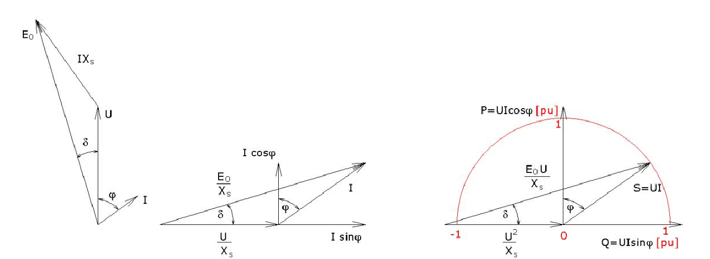
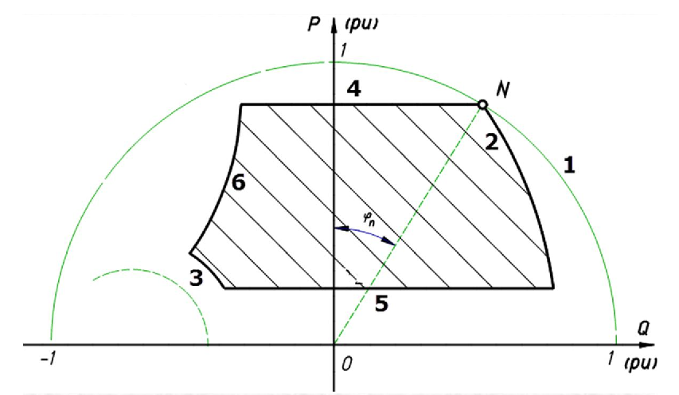
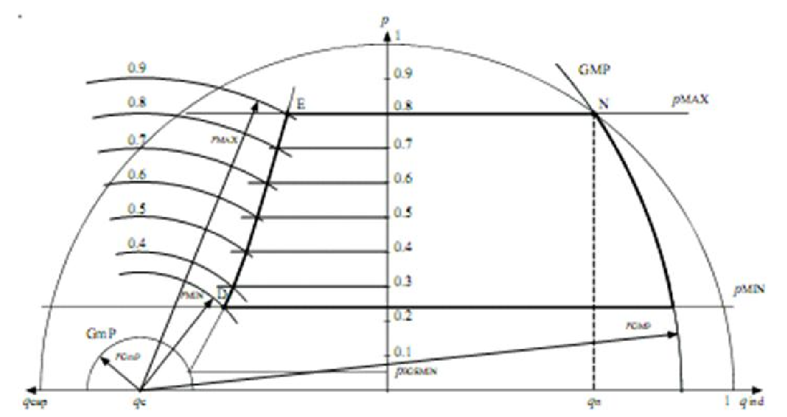

# Zadatak 22 — Konstrukcija pogonske karte turbogeneratora

## Postavka

Dat je turbogenerator sledećih nazivnih podataka: nazivni napon $15{,}75\ \mathrm{kV}$, nazivna prividna snaga $150\ \mathrm{MVA}$, nazivni faktor snage $\cos\varphi_{\mathrm{n}} = 0{,}8$, sinhrona reaktansa $x_{\mathrm{s}} = 1{,}4$ r.j. Nacrtati pogonsku kartu za nominalni napon i za sledeće usvojene podatke:

- minimalna snaga turbine jednaka je $30\ \%$ nazivne aktivne snage;
- minimalna vrednost elektromotorne sile jednaka je $10\ \%$ nominalne vrednosti elektromotorne sile;
- generator je praktično granično stabilan ako je aktivna snaga, pri određenom naponu i pobudi, jednaka maksimalnoj mogućoj snazi umanjenoj za $10\ \%$ nominalne prividne snage.

Za bazni napon i baznu snagu usvojiti nazivne vrednosti generatora. Objasniti detalje tokom crtanja pogonske karte.

> **Prevod na običan jezik:** Pogonska karta je "mapa dozvoljenih režima rada" generatora — dijagram u kome je na horizontalnoj osi reaktivna snaga $Q$, a na vertikalnoj aktivna snaga $P$. Ako se radna tačka (par vrednosti $P$ i $Q$ koje generator trenutno daje mreži) nalazi unutar ucrtane oblasti, generator sme trajno da radi; ako je van nje, ne sme. Naš posao je da tu oblast konstruišemo za konkretan turbogenerator: da nacrtamo svaku granicu (pregrevanje statora, pregrevanje rotora, minimalna pobuda, maksimalna i minimalna snaga turbine, stabilnost), da za svaku granicu izračunamo tačne brojeve (centre i poluprečnike kružnica, položaje pravih) i da objasnimo odakle svaka granica potiče. Sve radimo u relativnim jedinicama (r.j.), gde su bazne vrednosti upravo nazivne vrednosti generatora — pa je, na primer, nazivna prividna snaga prosto $1$ r.j.

## Podaci

| Veličina | Oznaka | Vrednost | Šta ta veličina fizički znači |
|---|---|---|---|
| Nazivni (linijski) napon | $U_{\mathrm{n}}$ | $15{,}75\ \mathrm{kV}$ | Napon na priključcima statora za koji je generator projektovan; ujedno bazni napon. |
| Nazivna prividna snaga | $S_{\mathrm{n}}$ | $150\ \mathrm{MVA}$ | Najveća trajna "ukupna" snaga (kombinacija aktivne i reaktivne) koju namotaji podnose; ujedno bazna snaga. |
| Nazivni faktor snage | $\cos\varphi_{\mathrm{n}}$ | $0{,}8$ | Odnos aktivne i prividne snage u nazivnoj radnoj tački; govori koliki deo $S_{\mathrm{n}}$ je "prava" (aktivna) snaga. |
| Sinhrona reaktansa | $x_{\mathrm{s}}$ | $1{,}4$ r.j. | Ukupna reaktansa statora (reaktansa reakcije indukta + rasipna); "unutrašnja prepreka" između elektromotorne sile i mreže. |
| Napon mreže na karti | $u$ | $u = u_{\mathrm{n}} = 1$ r.j. | Karta se traži za nominalni napon. |
| Minimalna snaga turbine | $p_{\mathrm{min}}$ | $0{,}3 \cdot p_{\mathrm{n}}$ | Ispod ove snage pogonska turbina ne sme trajno da radi. |
| Minimalna elektromotorna sila | $e_{0\mathrm{min}}$ | $0{,}1 \cdot e_{0\mathrm{n}}$ | Najmanja dozvoljena pobuda (najmanja struja pobude), izražena preko elektromotorne sile. |
| Praktična margina stabilnosti | — | $0{,}1 \cdot s_{\mathrm{n}}$ | Za koliko aktivna snaga mora biti manja od teoretski maksimalne da bi rad bio "praktično stabilan". |
| Bazne vrednosti | $S_{\mathrm{b}},\ U_{\mathrm{b}}$ | $S_{\mathrm{n}},\ U_{\mathrm{n}}$ | Sve veličine u zadatku svodimo na ove baze (relativne jedinice). |

Napomena o oznakama: velika slova ($P$, $Q$, $S$, $U$, $E_0$) koristimo za veličine u fizičkim jedinicama, a mala slova ($p$, $q$, $s$, $u$, $e_0$) za iste veličine u relativnim jedinicama.

## Šta se traži i zašto

Traži se **kompletna pogonska karta** generatora, što znači da moramo da odredimo i nacrtamo sledeće:

1. **Granicu zagrevanja statorskog namotaja** (maksimalna struja statora). Inženjera zanima jer struja statora veća od nazivne pregreva izolaciju namotaja i skraćuje život mašine. Videćemo da je to kružnica $p^2 + q^2 = 1$ u P-Q dijagramu.
2. **Granice snage turbine** ($p_{\mathrm{max}}$ i $p_{\mathrm{min}}$). Generator ne proizvodi mehaničku snagu sam — daje mu je turbina, a turbina ima svoj najveći i najmanji dozvoljeni trajni režim. To su dve horizontalne prave u dijagramu.
3. **Granicu zagrevanja rotorskog (pobudnog) namotaja** — maksimalnu struju pobude, tj. maksimalnu elektromotornu silu $e_{0\mathrm{max}} = e_{0\mathrm{n}}$. Prevelika struja pobude pregreva rotor. To je kružnica čiji centar nije u koordinatnom početku — izračunaćemo joj i centar i poluprečnik.
4. **Granicu minimalne struje pobude** ($e_{0\mathrm{min}}$) — premala pobuda pravi probleme sa stabilnošću i regulacijom, pa se propisuje donja granica. Ista familija kružnica, samo mali poluprečnik.
5. **Praktičnu granicu statičke stabilnosti** — liniju iza koje generator "ispada iz sinhronizma" (gubi korak sa mrežom). Teoretska granica se u praksi ne sme dostići, pa se uvodi sigurnosna margina; u ovom zadatku margina iznosi $10\ \%$ nazivne prividne snage.

**Plan rešavanja (u 6 koraka, običnim jezikom):**

1. Sve prevedemo u relativne jedinice i zapišemo nazivnu radnu tačku ($p_{\mathrm{n}}$, $q_{\mathrm{n}}$).
2. Ucrtamo kružnicu maksimalne struje statora (jedinična kružnica oko koordinatnog početka).
3. Ucrtamo horizontalne prave maksimalne i minimalne snage turbine.
4. Iz nazivne radne tačke izračunamo nazivnu (maksimalnu) elektromotornu silu $e_{0\mathrm{n}}$, pa nacrtamo kružnicu maksimalne pobude (GMP) i kružnicu minimalne pobude (gmp): zajednički centar i dva poluprečnika.
5. Postavimo jednačinu praktične granice statičke stabilnosti, proverimo gde ona uopšte "važi" (između kojih vrednosti pobude), pa je konstruišemo tačku po tačku.
6. Sve granice sklopimo u jednu sliku — gotovu pogonsku kartu — i objasnimo kako se čita.

## Potrebna teorija — mini-lekcije

### Mini-lekcija 1: Relativne jedinice (r.j.)

**Definicija.** Veličina u relativnim jedinicama je količnik stvarne vrednosti i dogovorene *bazne* vrednosti:

$$s = \frac{S}{S_{\mathrm{b}}}, \qquad u = \frac{U}{U_{\mathrm{b}}}, \qquad p = \frac{P}{S_{\mathrm{b}}}, \qquad q = \frac{Q}{S_{\mathrm{b}}}.$$

U ovom zadatku su bazne vrednosti upravo nazivne: $S_{\mathrm{b}} = S_{\mathrm{n}} = 150\ \mathrm{MVA}$ i $U_{\mathrm{b}} = U_{\mathrm{n}} = 15{,}75\ \mathrm{kV}$. Zato je nazivna prividna snaga u relativnim jedinicama $s_{\mathrm{n}} = 1$ r.j., a nominalni napon $u_{\mathrm{n}} = 1$ r.j. Obratite pažnju: i aktivna i reaktivna snaga se dele **istom** baznom snagom $S_{\mathrm{b}}$ (ne nekom posebnom "baznom aktivnom" snagom) — zato je npr. $p_{\mathrm{n}} = 0{,}8$ r.j., a ne $1$.

**Poreklo i intuicija.** Relativne jedinice su nastale da bi se mašine različitih veličina mogle porediti "na istoj slici": generator od $150\ \mathrm{MVA}$ i generator od $5\ \mathrm{MVA}$ imaju potpuno različite ampere i megavate, ali u r.j. obe mašine imaju nazivnu tačku "na jedinici". Dodatna korist: brojevi u formulama postaju mali i pregledni, a mnoge konstante (poput $\sqrt{3}$ kod trofaznih veličina) nestaju jer se pokrate sa istim faktorom u bazi.

### Mini-lekcija 2: Model turbogeneratora i fazorski dijagram napona

Turbogenerator je sinhrona mašina sa cilindričnim rotorom (ravnomeran vazdušni zazor). Njen najjednostavniji model u ustaljenom stanju, uz zanemarenu otpornost statorskog namotaja, čine dva elementa:

- **Elektromotorna sila praznog hoda $E_0$** — napon koji pobudni (rotorski) namotaj, kroz koji teče jednosmerna struja pobude $I_{\mathrm{p}}$, indukuje u statorskom namotaju. Što je veća struja pobude, veće je i $E_0$ (na krutoj mreži, gde su napon i učestanost nametnuti spolja, $E_0$ zavisi *isključivo* od struje pobude). "Kruta mreža" je mreža toliko jaka da rad našeg generatora ne može da joj promeni ni napon ni učestanost.
- **Sinhrona reaktansa $X_{\mathrm{s}}$** — redna reaktansa koja obuhvata i reakciju indukta (uticaj statorske struje na magnetno polje) i rasipanje statorskog namotaja.

Naponska jednačina po fazi (generatorski smer struje) glasi:

$$\bar{E}_0 = \bar{U} + j X_{\mathrm{s}} \bar{I},$$

gde je $\bar{U}$ fazor napona na priključcima, a $\bar{I}$ fazor struje statora. Iz ove jednačine se crta **naponski fazorski dijagram**: iz vrha fazora $\bar{U}$ nadoveže se fazor $jX_{\mathrm{s}}\bar{I}$ (normalan na struju), i njihov zbir je $\bar{E}_0$. Dva ugla u tom dijagramu su ključna:

- $\varphi$ — **fazni ugao** između napona $\bar{U}$ i struje $\bar{I}$ (određuje faktor snage $\cos\varphi$);
- $\delta$ — **ugao opterećenja** između $\bar{E}_0$ i $\bar{U}$. On raste kad raste aktivna snaga i o njemu zavisi stabilnost (mini-lekcija 5).

### Mini-lekcija 3: Kako iz fazorskog dijagrama "izraste" P-Q dijagram

Ovo je centralna ideja cele pogonske karte, i originalna zbirka je izlaže na početku rešenja. Postupak ima tri poteza:

1. **Podeli sve fazore naponskog dijagrama sa $X_{\mathrm{s}}$.** Trougao ostaje geometrijski isti (samo se skalira), ali mu stranice sada imaju dimenziju struje: $U/X_{\mathrm{s}}$, $E_0/X_{\mathrm{s}}$ i $I$. 
2. **Zarotiraj dobijeni dijagram za $90^{\circ}$.** Time fazor struje $\bar{I}$ legne tako da mu je aktivna komponenta $I\cos\varphi$ vertikalna, a reaktivna $I\sin\varphi$ horizontalna. Dobili smo tzv. **strujni fazorski dijagram**.
3. **Pomnoži sve stranice naponom $U$.** Stranice sada imaju dimenziju snage: vertikalna komponenta postaje $P = UI\cos\varphi$ (aktivna snaga), horizontalna $Q = UI\sin\varphi$ (reaktivna snaga), a sama hipotenuza $S = UI$ (prividna snaga). Kraj fazora $S$ je — radna tačka u P-Q dijagramu!

Pri tom množenju stranica $U/X_{\mathrm{s}}$ postaje $U^2/X_{\mathrm{s}}$, a stranica $E_0/X_{\mathrm{s}}$ postaje $E_0 U/X_{\mathrm{s}}$ — obe ćemo veličine sretati stalno u nastavku: prva određuje **centar**, a druga **poluprečnik** kružnica konstantne pobude.

Sledeća slika prikazuje sva tri stadijuma ovog postupka, sleva nadesno: naponski fazorski dijagram (sa $E_0$, $IX_{\mathrm{s}}$, $U$ i uglovima $\delta$ i $\varphi$), zatim strujni dijagram (stranice $E_0/X_{\mathrm{s}}$, $U/X_{\mathrm{s}}$, $I$, sa komponentama $I\cos\varphi$ i $I\sin\varphi$), i na kraju dijagram snage u P-Q ravni (crveno: osa $P = UI\cos\varphi$, osa $Q = UI\sin\varphi$ i jedinična polukružnica $S = UI = 1$). Čitajte je sleva nadesno i pratite kako isti trougao menja "ulogu": napon → struja → snaga.

**Slika 22.1 —** Nastajanje pogonske karte turbogeneratora: deljenjem naponskog fazorskog dijagrama sa $X_{\mathrm{s}}$ i rotacijom za $90^{\circ}$ dobija se strujni dijagram, a množenjem naponom $U$ — dijagram snage u P-Q ravni.

U P-Q dijagramu je uobičajeno (i u ovoj zbirci usvojeno) da se **na apscisu nanosi reaktivna snaga $Q$, a na ordinatu aktivna snaga $P$**. Desna poluravan ($q > 0$) odgovara *nadpobuđenom* generatoru koji mreži **daje** reaktivnu snagu (induktivni režim), a leva poluravan ($q < 0$) *potpobuđenom* generatoru koji reaktivnu snagu iz mreže **uzima** (kapacitivni režim).

### Mini-lekcija 4: Ugaone karakteristike i kružnica konstantne pobude

Iz fazorskog dijagrama (ili projektovanjem stranica strujnog dijagrama, pa množenjem sa $u$) slede **ugaone karakteristike** turbogeneratora u relativnim jedinicama — aktivna i reaktivna snaga izražene preko ugla opterećenja $\delta$:

$$p = \frac{e_0 \, u}{x_{\mathrm{s}}} \sin\delta, \qquad q = \frac{e_0 \, u}{x_{\mathrm{s}}} \cos\delta - \frac{u^2}{x_{\mathrm{s}}}.$$

Odakle ovo? Na slici 22.1 (desni dijagram) radna tačka je vrh fazora dužine $e_0 u / x_{\mathrm{s}}$ povučenog iz tačke $(-u^2/x_{\mathrm{s}},\ 0)$ pod uglom $\delta$ prema Q-osi: njegova vertikalna projekcija je $p$, a horizontalna projekcija, umanjena za pomeraj centra $u^2/x_{\mathrm{s}}$, jeste $q$.

Sada eliminišemo ugao $\delta$. Prepišimo obe jednačine tako da na levoj strani ostane samo sinus, odnosno kosinus:

$$\frac{e_0 u}{x_{\mathrm{s}}}\sin\delta = p, \qquad \frac{e_0 u}{x_{\mathrm{s}}}\cos\delta = q + \frac{u^2}{x_{\mathrm{s}}}.$$

Kvadrirajmo obe jednačine i saberimo ih; zbog $\sin^2\delta + \cos^2\delta = 1$ dobijamo:

$$p^2 + \left( q + \frac{u^2}{x_{\mathrm{s}}} \right)^{2} = \left( \frac{e_0 \, u}{x_{\mathrm{s}}} \right)^{2}.$$

Ovo je **jednačina kružnice** u P-Q dijagramu:

- **centar** je u tački $(q, p) = \left(-\dfrac{u^2}{x_{\mathrm{s}}},\ 0\right)$ — dakle na Q-osi, levo od koordinatnog početka;
- **poluprečnik** iznosi $\dfrac{e_0 \, u}{x_{\mathrm{s}}}$.

**Intuicija.** Pri stalnom naponu mreže $u$ i stalnoj pobudi (stalnom $e_0$), radna tačka može da se kreće samo po ovoj kružnici — ono što se duž nje menja jeste ugao opterećenja $\delta$, tj. koliko turbina "gura". Veća pobuda $\Rightarrow$ veći poluprečnik $\Rightarrow$ veća kružnica. Zato ograničenja *maksimalne* i *minimalne* struje pobude u P-Q dijagramu izgledaju kao **velika i mala kružnica sa istim centrom**.

### Mini-lekcija 5: Statička stabilnost — teoretska i praktična granica

Iz ugaone karakteristike $p = \dfrac{e_0 u}{x_{\mathrm{s}}}\sin\delta$ vidi se da aktivna snaga raste sa uglom $\delta$ samo do $\delta = 90^{\circ}$; tada dostiže **teoretski maksimum**:

$$p_{\mathrm{max}} = p\left(\delta = 90^{\circ}\right) = \frac{e_0 \, u}{x_{\mathrm{s}}}.$$

Za $\delta > 90^{\circ}$ snaga opada — mašina više ne može da odgovori na dodatni mehanički moment povećanjem električne snage, gubi sinhronizam sa mrežom ("ispada iz koraka") i rad postaje nestabilan. Zato je $\delta = 90^{\circ}$ **teoretska granica statičke stabilnosti**.

Gde je ta granica u P-Q dijagramu? Uvrstimo $\delta = 90^{\circ}$ u ugaonu karakteristiku reaktivne snage: $q = \dfrac{e_0 u}{x_{\mathrm{s}}}\cos 90^{\circ} - \dfrac{u^2}{x_{\mathrm{s}}} = -\dfrac{u^2}{x_{\mathrm{s}}}$, **bez obzira na $e_0$**. Dakle, teoretska granica je **vertikalna prava kroz centar kružnica pobude**, $q = q_{\mathrm{c}} = -u^2/x_{\mathrm{s}}$ (geometrijski: vrhovi svih kružnica pobude leže tačno iznad zajedničkog centra).

**Zašto se teoretska granica ne sme koristiti u praksi?** Pri izvođenju gornjih formula zanemarena je aktivna otpornost statorskog namotaja i mnoge druge neidealnosti stvarne mašine — pa se teoretski maksimum snage praktično ne može ostvariti. Zato se radi sa **praktičnom granicom statičke stabilnosti (PGS)**: zahteva se da radna snaga bude manja od teoretski maksimalne za neku sigurnosnu marginu. U ovom zadatku margina je zadata kao $10\ \%$ nazivne prividne snage:

$$p = \frac{e_0 \, u}{x_{\mathrm{s}}} - 0{,}1 \cdot s_{\mathrm{n}} = \frac{e_0 \, u}{x_{\mathrm{s}}} - 0{,}1,$$

jer je $s_{\mathrm{n}} = 1$ r.j. (U nekom drugom zadatku praktični uslov stabilnosti može biti zadat i drugačije — npr. kao procenat trenutne maksimalne snage; uvek čitajte tekst zadatka.) Kako u ovoj jednačini figuriše $e_0$, praktična granica **nije jedna prava**, nego **kriva**: za svaku vrednost pobude po jedna tačka, pa se kriva konstruiše tačku po tačku (Korak 6).

### Mini-lekcija 6: Šest ograničenja — kompletna anatomija pogonske karte

Područje trajno dozvoljenog rada sinhronog generatora ograničavaju:

1. **Zagrevanje statorskog namotaja** — maksimalna (nazivna) struja statora. Prividna snaga je $s = u \cdot i$, pa pri stalnom $u$ ograničenje struje znači ograničenje prividne snage: kružnica $p^2+q^2 = s_{\mathrm{max}}^2$ oko koordinatnog početka.
2. **Zagrevanje rotorskog namotaja** — maksimalna struja pobude, tj. $e_{0\mathrm{max}}$: velika kružnica iz mini-lekcije 4 (zvaćemo je **GMP** — granica maksimalne struje pobude).
3. **Minimalna struja pobude** — $e_{0\mathrm{min}}$: mala kružnica iz iste familije (**gmp** — granica minimalne struje pobude).
4. **Maksimalna snaga pogonske turbine** — horizontalna prava $p = p_{\mathrm{max}}$.
5. **Minimalna snaga pogonske turbine** — horizontalna prava $p = p_{\mathrm{min}}$. Ovo ograničenje ne postavlja generator, nego turbina (pogonski mehanizam): kod nekih turbina ga uopšte nema (Peltonova turbina), dok je kod drugih (Kaplanova, Francisova i dr.) minimalna trajna snaga u granicama od $5\ \%$ do $30\ \%$ nazivne snage turbine (npr. zbog kavitacije i vibracija pri malim opterećenjima).
6. **Statička stabilnost** — praktična granica iz mini-lekcije 5.

Pogonska karta je presek svih ovih uslova. Sledeća slika prikazuje kako to izgleda u opštem slučaju: šrafirana oblast je dozvoljeno područje rada, brojevi $1$–$6$ na konturi odgovaraju upravo gornjoj listi ograničenja, a tačka $N$ je **nazivna radna tačka** (u njoj su i aktivna i reaktivna snaga jednake nazivnim vrednostima; poluprava iz koordinatnog početka kroz $N$ zaklapa ugao $\varphi_{\mathrm{n}}$ sa P-osom). Čitajte je ovako: krenite od tačke $N$ gore desno i obiđite konturu — svaki deo konture je "vlasništvo" jednog od šest ograničenja.

**Slika 22.2 —** Pogonska karta turbogeneratora u opštem slučaju: 1 — maksimalna struja statora, 2 — maksimalna struja pobude, 3 — minimalna struja pobude, 4 — maksimalna snaga turbine, 5 — minimalna snaga turbine, 6 — statička stabilnost; $N$ — nazivna radna tačka.

Zašto je ovaj dokument toliko važan? Pogonska karta je jedan od ključnih dokumenata svakog sinhronog generatora priključenog na elektroenergetski sistem: proizvođač generatora **garantuje** da će mašina moći trajno da radi u ugovorenom području prikazanom P-Q dijagramom. U modernim elektranama postoje i posebni monitori na kojima se prikazuje pogonska karta generatora sa osvetljenom trenutnom radnom tačkom — operater u svakom trenutku vidi koliko je daleko od svake granice.

## Rešenje, korak po korak

### Korak 1: Bazne vrednosti i nazivna radna tačka u relativnim jedinicama

**Zašto ovaj korak:** Sve granice ćemo računati i crtati u relativnim jedinicama, pa prvo moramo da znamo gde je nazivna radna tačka $N$ i koliko iznose $u$, $s_{\mathrm{n}}$, $p_{\mathrm{n}}$ i $q_{\mathrm{n}}$.

Pošto su bazne vrednosti jednake nazivnim, odmah je:

$$s_{\mathrm{n}} = \frac{S_{\mathrm{n}}}{S_{\mathrm{b}}} = \frac{150\ \mathrm{MVA}}{150\ \mathrm{MVA}} = 1\ \mathrm{r.j.}, \qquad u = u_{\mathrm{n}} = \frac{U_{\mathrm{n}}}{U_{\mathrm{b}}} = \frac{15{,}75\ \mathrm{kV}}{15{,}75\ \mathrm{kV}} = 1\ \mathrm{r.j.}$$

Nazivna aktivna snaga je $P = S\cos\varphi$, a nazivna reaktivna $Q = S\sin\varphi$. Prvo faktor $\sin\varphi_{\mathrm{n}}$, iz osnovnog trigonometrijskog identiteta:

$$\sin\varphi_{\mathrm{n}} = \sqrt{1 - \cos^2\varphi_{\mathrm{n}}} = \sqrt{1 - 0{,}8^2} = \sqrt{1 - 0{,}64} = \sqrt{0{,}36} = 0{,}6.$$

Sada nazivna radna tačka:

$$p_{\mathrm{n}} = s_{\mathrm{n}} \cdot \cos\varphi_{\mathrm{n}} = 1 \cdot 0{,}8 = 0{,}8\ \mathrm{r.j.}, \qquad q_{\mathrm{n}} = s_{\mathrm{n}} \cdot \sin\varphi_{\mathrm{n}} = 1 \cdot 0{,}6 = 0{,}6\ \mathrm{r.j.}$$

**Šta smo dobili:** Nazivna radna tačka je $N = (q_{\mathrm{n}},\ p_{\mathrm{n}}) = (0{,}6,\ 0{,}8)$. U fizičkim jedinicama to je $P_{\mathrm{n}} = 0{,}8 \cdot 150 = 120\ \mathrm{MW}$ i $Q_{\mathrm{n}} = 0{,}6 \cdot 150 = 90\ \mathrm{MVAr}$ — generator u nazivnom režimu daje mreži i aktivnu i (pozamašnu) reaktivnu snagu, tj. radi nadpobuđen.

### Korak 2: Granica zagrevanja statorskog namotaja — jedinična kružnica

**Zašto ovaj korak:** Prvo ucrtavamo najjednostavniju granicu — onu koju postavlja maksimalna trajna (nazivna) struja statora.

Prividna snaga u relativnim jedinicama je proizvod napona i struje, $s = u \cdot i$, a iz dijagrama snage (Slika 22.1) znamo da je $s^2 = p^2 + q^2$ (hipotenuza i katete pravouglog trougla snaga). Ograničenju maksimalne struje statora $i \le i_{\mathrm{n}}$ zato odgovara kružnica konstantne prividne snage:

$$p^2 + q^2 = s_{\mathrm{max}}^2 = \left( u \cdot i_{\mathrm{n}} \right)^2.$$

Kako se karta traži za nominalni napon, $u = u_{\mathrm{n}} = 1$ r.j. Nazivna struja u relativnim jedinicama je $i_{\mathrm{n}} = 1$ r.j. — zato što je bazna struja po definiciji određena baznom snagom i baznim naponom ($I_{\mathrm{b}} = S_{\mathrm{b}} / (\sqrt{3}\,U_{\mathrm{b}})$), a baze su nazivne vrednosti, pa je $i_{\mathrm{n}} = I_{\mathrm{n}}/I_{\mathrm{b}} = 1$ (u fizičkim jedinicama $I_{\mathrm{n}} = 150\ \mathrm{MVA}/(\sqrt{3} \cdot 15{,}75\ \mathrm{kV}) \approx 5499\ \mathrm{A}$). Granica tako postaje:

$$p^2 + q^2 = (1 \cdot 1)^2 = 1.$$

To je kružnica sa **centrom u koordinatnom početku** i **jediničnim poluprečnikom**. Dozvoljene radne tačke moraju da zadovolje nejednakost:

$$p^2 + q^2 \le 1,$$

tj. nalaze se **unutar** te kružnice (na kružnici je struja tačno nazivna, van nje bi bila veća od nazivne i stator bi se pregrevao).

**Šta smo dobili:** Prvu granicu karte — jediničnu kružnicu. Očekivano: pošto su baze nazivne vrednosti, "puna" prividna snaga je tačno $1$ r.j., pa je i poluprečnik $1$.

### Korak 3: Granice maksimalne i minimalne snage turbine — dve horizontalne prave

**Zašto ovaj korak:** Aktivna snaga generatora u ustaljenom stanju jednaka je snazi koju daje turbina (umanjenoj za male gubitke), pa granice turbine direktno seku dijagram po visini $p$.

**Maksimalna snaga turbine** nije eksplicitno zadata u tekstu zadatka, pa se u tom slučaju usvaja nazivna aktivna snaga generatora (turbina se bira tako da može da "napuni" generator do nazivne tačke, ali ne više od toga):

$$p_{\mathrm{max}} = p_{\mathrm{n}} = s_{\mathrm{n}} \cdot \cos\varphi_{\mathrm{n}} = 1 \cdot 0{,}8 = 0{,}8\ \mathrm{r.j.}$$

**Minimalna snaga turbine** je po uslovu zadatka $30\ \%$ nazivne aktivne snage:

$$p_{\mathrm{min}} = 0{,}3 \cdot p_{\mathrm{n}} = 0{,}3 \cdot 0{,}8 = 0{,}24\ \mathrm{r.j.}$$

(Podsetnik iz mini-lekcije 6: ovo ograničenje potiče isključivo od turbine — Peltonova ga nema, a kod Kaplanove, Francisove i drugih iznosi $5$–$30\ \%$ nazivne snage turbine; ovde zadatih $30\ \%$ je gornji kraj tog raspona.)

Unošenjem obe prave u P-Q dijagram dobija se pojas aktivnih snaga u kome je trajni rad moguć:

$$0{,}24 \le p \le 0{,}8.$$

**Šta smo dobili:** Dve horizontalne prave, $p = 0{,}8$ i $p = 0{,}24$. U fizičkim jedinicama: turbina sme trajno da radi između $36\ \mathrm{MW}$ i $120\ \mathrm{MW}$.

### Korak 4: Granica maksimalne struje pobude (GMP) — određivanje $e_{0\mathrm{n}}$, centra i poluprečnika

**Zašto ovaj korak:** Sledeća granica je zagrevanje pobudnog namotaja, tj. maksimalna struja pobude. Iz mini-lekcije 4 znamo da je to kružnica — ali za nju treba da znamo $e_{0\mathrm{max}}$, koje nije direktno zadato, pa ćemo ga izračunati iz nazivne radne tačke.

Ograničenje zbog zagrevanja rotorskog (pobudnog) namotaja u P-Q dijagramu predstavlja kružnica konstantne pobude (izvedena u mini-lekciji 4 iz ugaonih karakteristika):

$$p^2 + \left( q + \frac{u^2}{x_{\mathrm{s}}} \right)^{2} = \left( \frac{e_0 \cdot u}{x_{\mathrm{s}}} \right)^{2}.$$

Maksimalna trajna struja pobude jeste **nazivna** struja pobude $i_{\mathrm{pn}}$, a njoj (na krutoj mreži) odgovara **nazivna elektromotorna sila praznog hoda** $e_{0\mathrm{n}}$. Za nominalni napon ($u = u_{\mathrm{n}} = 1$) jednačina glasi:

$$p^2 + \left( q + \frac{u_{\mathrm{n}}^2}{x_{\mathrm{s}}} \right)^{2} = \left( \frac{e_{0\mathrm{n}} \cdot u_{\mathrm{n}}}{x_{\mathrm{s}}} \right)^{2}.$$

**Kako naći $e_{0\mathrm{n}}$?** Ključna ideja: nazivna radna tačka $N = (0{,}6,\ 0{,}8)$ je režim u kome generator radi baš sa nazivnom strujom pobude — dakle tačka $N$ **pripada ovoj kružnici**. Uvrstimo $p = p_{\mathrm{n}}$ i $q = q_{\mathrm{n}}$ i rešimo jednačinu po $e_{0\mathrm{n}}$. Prvo korenujemo obe strane:

$$\frac{e_{0\mathrm{n}} \cdot u_{\mathrm{n}}}{x_{\mathrm{s}}} = \sqrt{p_{\mathrm{n}}^2 + \left( q_{\mathrm{n}} + \frac{u_{\mathrm{n}}^2}{x_{\mathrm{s}}} \right)^{2}},$$

pa pomnožimo obe strane sa $x_{\mathrm{s}} / u_{\mathrm{n}}$:

$$e_{0\mathrm{max}} = e_{0\mathrm{n}} = \frac{x_{\mathrm{s}}}{u_{\mathrm{n}}} \cdot \sqrt{p_{\mathrm{n}}^2 + \left( q_{\mathrm{n}} + \frac{u_{\mathrm{n}}^2}{x_{\mathrm{s}}} \right)^{2}}.$$

Uvrstimo brojeve, deo po deo:

$$\frac{u_{\mathrm{n}}^2}{x_{\mathrm{s}}} = \frac{1^2}{1{,}4} = 0{,}714\ \mathrm{r.j.}, \qquad q_{\mathrm{n}} + \frac{u_{\mathrm{n}}^2}{x_{\mathrm{s}}} = 0{,}6 + 0{,}714 = 1{,}314,$$

$$p_{\mathrm{n}}^2 + 1{,}314^2 = 0{,}64 + 1{,}727 = 2{,}367, \qquad \sqrt{2{,}367} = 1{,}539,$$

$$e_{0\mathrm{n}} = \frac{1{,}4}{1} \cdot 1{,}539 = 2{,}154\ \mathrm{r.j.}$$

Sada imamo sve elemente kružnice GMP. Njen **centar** je na Q-osi ($p = 0$), u tački:

$$q_{\mathrm{c}} = -\frac{u_{\mathrm{n}}^2}{x_{\mathrm{s}}} = -\frac{1^2}{1{,}4} = -0{,}714\ \mathrm{r.j.},$$

a **poluprečnik** iznosi:

$$r_{\mathrm{GMP}} = \frac{e_{0\mathrm{max}} \cdot u_{\mathrm{n}}}{x_{\mathrm{s}}} = \frac{2{,}154 \cdot 1}{1{,}4} = 1{,}54\ \mathrm{r.j.}$$

**Šta smo dobili:** $e_{0\mathrm{n}} = 2{,}154$ r.j. — nazivna pobuda indukuje elektromotornu silu više nego dvostruko veću od napona mreže. To je očekivano kod turbogeneratora sa velikom sinhronom reaktansom ($x_{\mathrm{s}} = 1{,}4$ r.j.): da bi kroz toliku reaktansu "progurao" nazivnu struju uz $\cos\varphi_{\mathrm{n}} = 0{,}8$, generator mora imati veliku unutrašnju elektromotornu silu. Kružnica GMP ima centar u $(-0{,}714,\ 0)$ i poluprečnik $1{,}54$; njen luk prolazi kroz nazivnu tačku $N$ (po konstrukciji!) i u desnom delu dijagrama seče jediničnu kružnicu upravo u $N = (0{,}6,\ 0{,}8)$. Dozvoljene radne tačke su **unutar** kružnice GMP (manja pobuda od maksimalne), tj. levo od njenog desnog luka.

### Korak 5: Granica minimalne struje pobude (gmp)

**Zašto ovaj korak:** Zadatak propisuje i najmanju dozvoljenu pobudu — $10\ \%$ nazivne elektromotorne sile. To je kružnica iz iste familije (isti centar), samo sa malim poluprečnikom.

Minimalna vrednost elektromotorne sile:

$$e_{0\mathrm{min}} = 0{,}1 \cdot e_{0\mathrm{n}} = 0{,}1 \cdot 2{,}154 = 0{,}215\ \mathrm{r.j.}$$

Granica minimalne struje pobude (gmp) je kružnica:

$$p^2 + \left( q + \frac{u_{\mathrm{n}}^2}{x_{\mathrm{s}}} \right)^{2} = \left( \frac{e_{0\mathrm{min}} \cdot u_{\mathrm{n}}}{x_{\mathrm{s}}} \right)^{2},$$

sa istim centrom $q_{\mathrm{c}} = -0{,}714$ r.j. i poluprečnikom:

$$r_{\mathrm{gmp}} = \frac{e_{0\mathrm{min}} \cdot u_{\mathrm{n}}}{x_{\mathrm{s}}} = \frac{0{,}215 \cdot 1}{1{,}4} = 0{,}154\ \mathrm{r.j.}$$

Za nominalni napon, dozvoljeni radni režimi (posmatrano samo kroz pobudu) nalaze se **između** kružnice gmp i kružnice GMP: pobuda ne sme ispod $e_{0\mathrm{min}}$ ni iznad $e_{0\mathrm{max}}$.

**Šta smo dobili:** Vrlo malu kružnicu ($r_{\mathrm{gmp}} = 0{,}154$) oko tačke $(-0{,}714,\ 0)$. Treba primetiti nešto važno: najviša tačka te kružnice dostiže visinu $p = r_{\mathrm{gmp}} = 0{,}154 < p_{\mathrm{min}} = 0{,}24$, pa **kružnica gmp uopšte ne seče pravu minimalne snage — cela leži ispod nje**. Drugim rečima, granica minimalne pobude u ovoj karti **nije aktivna**: pre nego što bi generator stigao do premale pobude, već bi prekršio granicu minimalne snage turbine. Na gotovoj karti gmp ćemo ipak ucrtati (isprekidano), da se vidi zašto ne učestvuje u konturi.

### Korak 6: Praktična granica statičke stabilnosti (PGS) — konstrukcija tačku po tačku

**Zašto ovaj korak:** Ostala je poslednja granica — stabilnost. Teoretska granica ($\delta = 90^{\circ}$, vertikala kroz $q_{\mathrm{c}}$, mini-lekcija 5) u praksi se ne koristi; zadatak propisuje praktični uslov sa marginom od $10\ \%$ nazivne prividne snage, i njega sada moramo pretvoriti u krivu u P-Q dijagramu.

Praktični uslov granične stabilnosti iz zadatka ("aktivna snaga jednaka maksimalnoj mogućoj snazi umanjenoj za $10\ \%$ nominalne prividne snage"), uz teoretski maksimum $p_{\mathrm{max,teor}} = e_0 u / x_{\mathrm{s}}$ iz mini-lekcije 5, glasi:

$$p = \frac{e_0 \cdot u}{x_{\mathrm{s}}} - 0{,}1 \cdot s_{\mathrm{n}} = \frac{e_0 \cdot u}{x_{\mathrm{s}}} - 0{,}1.$$

Ova jednačina za **svaku vrednost pobude $e_0$ daje po jednu graničnu visinu $p$** — granica je dakle kriva koja zavisi od pobude (i napona mreže). Pre crtanja proverimo gde je ta kriva uopšte relevantna, tj. da li je "vidljiva" unutar pojasa $0{,}24 \le p \le 0{,}8$.

**Provera na donjem kraju (minimalna pobuda).** Za $e_0 = e_{0\mathrm{min}}$ i nominalni napon:

$$p_{\mathrm{PGS\,min}} = \frac{e_{0\mathrm{min}} \cdot u_{\mathrm{n}}}{x_{\mathrm{s}}} - 0{,}1 = \frac{0{,}215 \cdot 1}{1{,}4} - 0{,}1 = 0{,}154 - 0{,}1 = 0{,}054\ \mathrm{r.j.}$$

To je **mnogo manje** od minimalne snage turbine $p_{\mathrm{min}} = 0{,}24$ r.j. Dakle, pri minimalnoj pobudi generator ne može ni da stigne do praktične granice stabilnosti — pre toga ga zaustavi granica minimalne snage turbine.

**Provera na gornjem kraju (maksimalna pobuda).** Za $e_0 = e_{0\mathrm{max}} = e_{0\mathrm{n}}$:

$$p_{\mathrm{PGS\,max}} = \frac{e_{0\mathrm{max}} \cdot u_{\mathrm{n}}}{x_{\mathrm{s}}} - 0{,}1 = \frac{2{,}154 \cdot 1}{1{,}4} - 0{,}1 = 1{,}54 - 0{,}1 = 1{,}44\ \mathrm{r.j.}$$

To je **mnogo veće** od maksimalne snage turbine $p_{\mathrm{max}} = 0{,}8$ r.j. — pri nazivnoj pobudi granicu stabilnosti bismo dostigli tek na snazi koju turbina uopšte ne može da proizvede.

**Zaključak provera:** kriva PGS je unutar karte relevantna samo za pobude **između** $e_{0\mathrm{min}}$ i $e_{0\mathrm{max}}$. Nađimo tačno koje pobude odgovaraju krajevima pojasa snage. Iz jednačine PGS izrazimo $e_0$: dodamo $0{,}1$ na obe strane, pa pomnožimo obe strane sa $x_{\mathrm{s}}/u_{\mathrm{n}}$:

$$e_0 = \frac{p + 0{,}1 \cdot s_{\mathrm{n}}}{u_{\mathrm{n}}} \cdot x_{\mathrm{s}}.$$

Za maksimalnu snagu $p = p_{\mathrm{max}} = 0{,}8$:

$$e_{0\mathrm{PGS\,max}} = \frac{p_{\mathrm{max}} + 0{,}1 \cdot s_{\mathrm{n}}}{u_{\mathrm{n}}} \cdot x_{\mathrm{s}} = \frac{0{,}8 + 0{,}1}{1} \cdot 1{,}4 = 0{,}9 \cdot 1{,}4 = 1{,}26\ \mathrm{r.j.}$$

Za minimalnu snagu $p = p_{\mathrm{min}} = 0{,}24$:

$$e_{0\mathrm{PGS\,min}} = \frac{p_{\mathrm{min}} + 0{,}1 \cdot s_{\mathrm{n}}}{u_{\mathrm{n}}} \cdot x_{\mathrm{s}} = \frac{0{,}24 + 0{,}1}{1} \cdot 1{,}4 = 0{,}34 \cdot 1{,}4 = 0{,}476\ \mathrm{r.j.}$$

> **Napomena o originalu:** U zbirci je za ovu vrednost odštampano $0{,}467$ r.j. — to je štamparska greška (zamenjene cifre), jer je $0{,}34 \cdot 1{,}4 = 0{,}476$. Da je ispravno baš $0{,}476$ potvrđuje i sama zbirka u sledećem redu: tamo je poluprečnik $r_{\mathrm{MIN}} = e_{0\mathrm{PGS\,min}} \cdot u_{\mathrm{n}} / x_{\mathrm{s}} = 0{,}34$ r.j., a $0{,}476/1{,}4 = 0{,}34$ (dok bi $0{,}467/1{,}4 = 0{,}334$ dalo $0{,}33$).

Ove dve granične pobude određuju dve kružnice konstantne pobude (isti centar $q_{\mathrm{c}} = -0{,}714$) čiji su poluprečnici:

$$r_{\mathrm{MAX}} = \frac{e_{0\mathrm{PGS\,max}} \cdot u_{\mathrm{n}}}{x_{\mathrm{s}}} = \frac{1{,}26 \cdot 1}{1{,}4} = 0{,}9\ \mathrm{r.j.},$$

$$r_{\mathrm{MIN}} = \frac{e_{0\mathrm{PGS\,min}} \cdot u_{\mathrm{n}}}{x_{\mathrm{s}}} = \frac{0{,}476 \cdot 1}{1{,}4} = 0{,}34\ \mathrm{r.j.}$$

Uočite zgodnu prečicu koja proizlazi iz samog uslova PGS: poluprečnik kružnice pobude je $r = e_0 u_{\mathrm{n}} / x_{\mathrm{s}}$, a uslov PGS kaže $e_0 u_{\mathrm{n}} / x_{\mathrm{s}} = p + 0{,}1$ — dakle na praktičnoj granici stabilnosti uvek važi:

$$r = p + 0{,}1.$$

Zaista: $r_{\mathrm{MAX}} = 0{,}8 + 0{,}1 = 0{,}9$ i $r_{\mathrm{MIN}} = 0{,}24 + 0{,}1 = 0{,}34$. ✓

**Konstrukcija krive PGS.** Tačka granice stabilnosti za datu pobudu je presek horizontalne prave $p$ sa kružnicom pobude poluprečnika $r = p + 0{,}1$ (uzima se desni presek, bliži radnoj oblasti, jer on odgovara uglu $\delta < 90^{\circ}$):

- u preseku kružnice poluprečnika $r_{\mathrm{MAX}} = 0{,}9$ sa pravom $p_{\mathrm{max}} = 0{,}8$ dobija se tačka $E$ (gornji kraj krive PGS);
- u preseku kružnice poluprečnika $r_{\mathrm{MIN}} = 0{,}34$ sa pravom $p_{\mathrm{min}} = 0{,}24$ dobija se tačka $D$ (donji kraj krive PGS).

Kriva između tačaka $E$ i $D$ je praktična granica statičke stabilnosti. U zbirci je dobijena približno, **deo-po-deo linearnim spajanjem** međutačaka: izabrane su horizontalne prave $p = 0{,}7$; $0{,}6$; $0{,}5$; $0{,}4$ i $0{,}3$ r.j. (proizvoljno, iz praktičnih razloga crtanja uzet je korak snage $0{,}1$ r.j.), a njima po pravilu $r = p + 0{,}1$ odgovaraju kružnice poluprečnika redom $0{,}8$; $0{,}7$; $0{,}6$; $0{,}5$ i $0{,}4$ r.j. Presek svake prave sa "njenom" kružnicom daje po jednu tačku krive.

Za samostalno crtanje korisno je imati i $q$-koordinate tih preseka. Njih zbirka ne navodi brojčano (tačke se tamo dobijaju geometrijski, šestarom), ali ih lako računamo iz jednačine kružnice: iz $(q - q_{\mathrm{c}})^2 + p^2 = r^2$ sledi, za desni presek,

$$q = q_{\mathrm{c}} + \sqrt{r^2 - p^2}.$$

Na primer, za $p = 0{,}7$, $r = 0{,}8$: $q = -0{,}714 + \sqrt{0{,}64 - 0{,}49} = -0{,}714 + \sqrt{0{,}15} = -0{,}714 + 0{,}387 = -0{,}327$. Ostale tačke, računate na isti način:

| Tačka | $p$ [r.j.] | $r = p + 0{,}1$ [r.j.] | $q = q_{\mathrm{c}} + \sqrt{r^2 - p^2}$ [r.j.] |
|---|---|---|---|
| $E$ | $0{,}8$ | $0{,}9$ | $-0{,}302$ |
| — | $0{,}7$ | $0{,}8$ | $-0{,}327$ |
| — | $0{,}6$ | $0{,}7$ | $-0{,}354$ |
| — | $0{,}5$ | $0{,}6$ | $-0{,}383$ |
| — | $0{,}4$ | $0{,}5$ | $-0{,}414$ |
| — | $0{,}3$ | $0{,}4$ | $-0{,}450$ |
| $D$ | $0{,}24$ | $0{,}34$ | $-0{,}473$ |

**Šta smo dobili:** Krivu PGS — blago nagnutu liniju u levom (potpobuđenom) delu dijagrama, od tačke $E$ na pravoj $p = 0{,}8$ do tačke $D$ na pravoj $p = 0{,}24$. Dozvoljeni radni režimi su **desno** od nje. Primetite da je cela kriva desno od teoretske granice $q_{\mathrm{c}} = -0{,}714$: margina od $0{,}1 \cdot s_{\mathrm{n}}$ "odgurala" je granicu od teoretske vertikale ka radnoj oblasti, i to više pri malim snagama nego pri velikim.

### Korak 7: Sklapanje pogonske karte i njeno čitanje

**Zašto ovaj korak:** Sve granice su izračunate — ostaje da ih nacrtamo u istom dijagramu i očitamo konturu dozvoljene oblasti.

Redosled crtanja (svaka stavka je već izračunata u prethodnim koracima):

1. Jedinična kružnica $p^2 + q^2 = 1$ oko koordinatnog početka (Korak 2).
2. Horizontalne prave $p_{\mathrm{max}} = 0{,}8$ (na slici označena pMAX) i $p_{\mathrm{min}} = 0{,}24$ (pMIN) (Korak 3).
3. Centar $q_{\mathrm{c}} = -0{,}714$ na Q-osi; iz njega luk GMP poluprečnika $1{,}54$ (prolazi kroz $N$) i mala kružnica gmp poluprečnika $0{,}154$ (Koraci 4 i 5).
4. Iz istog centra lukovi poluprečnika $0{,}34$; $0{,}4$; $0{,}5$; $0{,}6$; $0{,}7$; $0{,}8$ i $0{,}9$; njihovi preseci sa pravama $p = 0{,}24$; $0{,}3$; …; $0{,}8$ daju tačke $D$, pet međutačaka i $E$, koje se spoje deo-po-deo linearno u krivu PGS (Korak 6).

Sledeća slika prikazuje gotovu pogonsku kartu upravo ovog turbogeneratora, sa svim pomoćnim lukovima konstrukcije. Kako da je čitate: podebljana kontura je granica dozvoljene oblasti; $N$ je nazivna tačka na preseku prave pMAX, luka GMP i jedinične kružnice (isprekidana vertikala kroz $N$ označava $q_{\mathrm{n}} = 0{,}6$); levi kosi niz tačaka od $E$ (gore) do $D$ (dole) je kriva PGS, a tanki lukovi označeni sa $0{,}4$–$0{,}9$ uz odgovarajuće horizontale $p = 0{,}3$–$0{,}8$ su pomoćne kružnice iz tačke $q_{\mathrm{c}}$ kojima su te tačke konstruisane; mala kružnica GmP (naš "gmp") oko $q_{\mathrm{c}}$ sa poluprečnikom $r_{\mathrm{gmp}}$ vidi se dole levo, cela ispod prave pMIN — zato i ne učestvuje u konturi; oznake $q_{\mathrm{cap}}$ (levo) i $q_{\mathrm{ind}}$ (desno) podsećaju da je leva strana kapacitivni (potpobuđeni), a desna induktivni (nadpobuđeni) režim.

**Slika 22.3 —** Pogonska karta datog turbogeneratora: jedinična kružnica struje statora, prave pMAX ($0{,}8$) i pMIN ($0{,}24$), luk GMP kroz nazivnu tačku $N$, mala kružnica gmp ispod prave pMIN, i kriva praktične granice statičke stabilnosti između tačaka $E$ i $D$ sa pomoćnim lukovima konstrukcije.

**Čitanje gotove karte — kontura dozvoljene oblasti, obilazak u smeru kazaljke od gore desno:**

- **gore:** prava $p = 0{,}8$ (maksimalna snaga turbine), od tačke $E$ do tačke $N$;
- **desno:** od $N$ naniže luk GMP (maksimalna pobuda) do prave $p = 0{,}24$ — u ovoj karti luk GMP je unutar jedinične kružnice za $p < 0{,}8$, pa je od statorske i rotorske granice "stroža" rotorska; jedinična kružnica dodiruje konturu samo u tački $N$;
- **dole:** prava $p = 0{,}24$ (minimalna snaga turbine) do tačke $D$;
- **levo:** kriva PGS od $D$ naviše do $E$ (praktična granica statičke stabilnosti).

Granica minimalne pobude (gmp) ne učestvuje u konturi (cela je ispod prave $p_{\mathrm{min}}$), a teoretska granica stabilnosti ($q = q_{\mathrm{c}}$) zamenjena je praktičnom krivom $E$–$D$ desno od nje.

**Šta smo dobili:** Kompletnu pogonsku kartu. Ako dispečer zatraži radnu tačku unutar konture — generator sme trajno da radi; van konture — ne sme, a kontura odmah kaže i *koje* ograničenje bi bilo prekršeno (gore: turbina; desno: pobudni namotaj; dole: turbina; levo: stabilnost).

## Česte greške i zamke

1. **Pogrešan centar kružnica pobude.** Kružnice konstantne pobude NEMAJU centar u koordinatnom početku, nego u $(q, p) = (-u^2/x_{\mathrm{s}},\ 0) = (-0{,}714,\ 0)$ — pomeren ulevo po Q-osi. Studenti često nacrtaju GMP koncentrično sa jediničnom kružnicom, pa im "sve ispadne simetrično" i karta izgubi smisao. Zapamtite: samo granica **struje statora** je kružnica oko koordinatnog početka.
2. **Mešanje $s_{\mathrm{n}}$ i $p_{\mathrm{n}}$ u procentualnim uslovima.** Minimalna snaga turbine je $30\ \%$ od **aktivne** snage ($0{,}3 \cdot 0{,}8 = 0{,}24$), a margina stabilnosti je $10\ \%$ od **prividne** snage ($0{,}1 \cdot 1 = 0{,}1$). Ko pobrka osnovu, dobije $p_{\mathrm{min}} = 0{,}3$ ili marginu $0{,}08$ — i cela leva i donja granica karte su pogrešne.
3. **Poluprečnik $e_0$ umesto $e_0 u/x_{\mathrm{s}}$.** Poluprečnik kružnice pobude nije sama elektromotorna sila, nego $e_0 u_{\mathrm{n}} / x_{\mathrm{s}}$ — elektromotorna sila podeljena sinhronom reaktansom (i pomnožena naponom). Ko nacrta kružnicu poluprečnika $2{,}154$ umesto $1{,}54$, dobije GMP koja "leti" daleko van dijagrama.
4. **Slepo precrtavanje granice minimalne pobude.** Na opštoj karti (Slika 22.2) gmp jeste deo konture (segment 3), ali u konkretnom zadatku treba **proveriti** da li je aktivna: ovde je cela kružnica gmp ($r = 0{,}154$) ispod prave $p_{\mathrm{min}} = 0{,}24$, pa u konturi ne učestvuje. Uvek uporedite $r_{\mathrm{gmp}}$ sa $p_{\mathrm{min}}$.
5. **Tumačenje PGS kao jedne prave.** Praktična granica stabilnosti $p = e_0 u/x_{\mathrm{s}} - 0{,}1$ zavisi od pobude $e_0$, pa je to **familija tačaka** (po jedna na svakoj kružnici pobude), a ne jedna prava ili jedna kružnica. Zato se i konstruiše tačku po tačku; teoretska granica ($q = q_{\mathrm{c}}$, vertikala) jeste prava, ali se ona u praksi ne koristi.
6. **Zaboravljen uslov $u = 1$.** Sve formule u ovom zadatku su ispisane za nominalni napon. Pri drugom naponu mreže menjaju se i centar ($-u^2/x_{\mathrm{s}}$), i poluprečnici ($e_0 u/x_{\mathrm{s}}$), i jedinična kružnica (postaje poluprečnika $u \cdot i_{\mathrm{n}}$) — karta se crta iznova.

## Rezime rezultata

| Veličina | Oznaka | Vrednost |
|---|---|---|
| Nazivna aktivna snaga (= maksimalna snaga turbine) | $p_{\mathrm{max}} = p_{\mathrm{n}}$ | $0{,}8$ r.j. ($120\ \mathrm{MW}$) |
| Nazivna reaktivna snaga | $q_{\mathrm{n}}$ | $0{,}6$ r.j. ($90\ \mathrm{MVAr}$) |
| Minimalna snaga turbine | $p_{\mathrm{min}}$ | $0{,}24$ r.j. ($36\ \mathrm{MW}$) |
| Granica struje statora | — | kružnica $p^2 + q^2 = 1$ |
| Nazivna (maksimalna) elektromotorna sila | $e_{0\mathrm{max}} = e_{0\mathrm{n}}$ | $2{,}154$ r.j. |
| Minimalna elektromotorna sila | $e_{0\mathrm{min}}$ | $0{,}215$ r.j. |
| Centar kružnica pobude | $q_{\mathrm{c}}$ | $-0{,}714$ r.j. |
| Poluprečnik kružnice maksimalne pobude | $r_{\mathrm{GMP}}$ | $1{,}54$ r.j. |
| Poluprečnik kružnice minimalne pobude | $r_{\mathrm{gmp}}$ | $0{,}154$ r.j. |
| PGS pri minimalnoj pobudi | $p_{\mathrm{PGS\,min}}$ | $0{,}054$ r.j. ($< p_{\mathrm{min}}$ — neaktivno) |
| PGS pri maksimalnoj pobudi | $p_{\mathrm{PGS\,max}}$ | $1{,}44$ r.j. ($> p_{\mathrm{max}}$ — neaktivno) |
| Pobuda na PGS pri $p = 0{,}8$ | $e_{0\mathrm{PGS\,max}}$ | $1{,}26$ r.j. |
| Pobuda na PGS pri $p = 0{,}24$ | $e_{0\mathrm{PGS\,min}}$ | $0{,}476$ r.j. (u zbirci štamparski $0{,}467$) |
| Poluprečnik kroz tačku $E$ | $r_{\mathrm{MAX}}$ | $0{,}9$ r.j. |
| Poluprečnik kroz tačku $D$ | $r_{\mathrm{MIN}}$ | $0{,}34$ r.j. |
| Nazivna radna tačka | $N$ | $(q,\ p) = (0{,}6;\ 0{,}8)$ r.j. |

## Provera smisla

**Provera 1 — nazivna tačka mora ležati na obe "desne" granice.** Na jediničnoj kružnici: $p_{\mathrm{n}}^2 + q_{\mathrm{n}}^2 = 0{,}8^2 + 0{,}6^2 = 0{,}64 + 0{,}36 = 1$. ✓ Na kružnici GMP (računajući sa četiri decimale): $p_{\mathrm{n}}^2 + (q_{\mathrm{n}} - q_{\mathrm{c}})^2 = 0{,}64 + (0{,}6 + 0{,}7143)^2 = 0{,}64 + 1{,}3143^2 = 0{,}64 + 1{,}7274 = 2{,}3674$, a $r_{\mathrm{GMP}}^2 = 1{,}5386^2 = 2{,}3674$. ✓ Nazivna tačka je tačno na preseku granice statora i granice rotora — upravo tako se nazivni podaci mašine i biraju: u nazivnom režimu su i stator i rotor iskorišćeni "do daske".

**Provera 2 — granični slučaj margine stabilnosti.** Ako bismo marginu $0{,}1 \cdot s_{\mathrm{n}}$ smanjivali ka nuli, uslov PGS $r = p + 0{,}1$ prešao bi u $r = p$, tj. svaka tačka granice bila bi vrh svoje kružnice pobude — a svi vrhovi leže na vertikali $q = q_{\mathrm{c}} = -0{,}714$. Dakle, u graničnom slučaju naša kriva $E$–$D$ prelazi tačno u teoretsku granicu stabilnosti iz mini-lekcije 5, što potvrđuje da je jednačina PGS postavljena ispravno. Sa marginom $0{,}1$ sve tačke krive ($q$ od $-0{,}302$ do $-0{,}473$) leže desno od $-0{,}714$ — margina pomera granicu ka sigurnijoj strani, kako i treba.

**Provera 3 — red veličine elektromotorne sile.** Grubo, u nazivnom režimu je $e_0 \approx \sqrt{(u + x_{\mathrm{s}} \sin\varphi_{\mathrm{n}})^2 + (x_{\mathrm{s}}\cos\varphi_{\mathrm{n}})^2} = \sqrt{(1 + 1{,}4 \cdot 0{,}6)^2 + (1{,}4 \cdot 0{,}8)^2} = \sqrt{1{,}84^2 + 1{,}12^2} = \sqrt{3{,}386 + 1{,}254} = \sqrt{4{,}64} = 2{,}154$ — isto što i naš rezultat iz Koraka 4 (i mora biti isto: ovo je ista formula, samo raspisana po komponentama fazorskog dijagrama umesto preko $p$ i $q$; uz $p_{\mathrm{n}} = i\cos\varphi_{\mathrm{n}}$ i $q_{\mathrm{n}} = i\sin\varphi_{\mathrm{n}}$ izrazi se algebarski poklapaju). Vrednost $e_{0\mathrm{n}} \approx 2{,}15$ r.j. je tipična za turbogeneratore sa $x_{\mathrm{s}}$ oko $1{,}4$–$2$ r.j. i $\cos\varphi_{\mathrm{n}} = 0{,}8$.

**Provera 4 — dimenziona/geometrijska doslednost.** Sve veličine na karti su u r.j. (bezdimenzione), a svaka granica ima ispravan geometrijski oblik za svoju fizičku prirodu: ograničenje proizvoda $u \cdot i$ (konstantno $s$) je kružnica oko početka; ograničenje $e_0$ pri fiksnom $u$ je kružnica oko $q_{\mathrm{c}}$; ograničenje mehaničke snage je horizontalna prava (ne zavisi od $q$); granica stabilnosti sa marginom je kriva između njih. Uz to, sve karakteristične vrednosti ($0{,}054 < 0{,}24 \le p \le 0{,}8 < 1{,}44$; $r_{\mathrm{gmp}} = 0{,}154 < 0{,}34 \le r \le 0{,}9 < r_{\mathrm{GMP}} = 1{,}54$) slažu se sa slikom 22.3.
