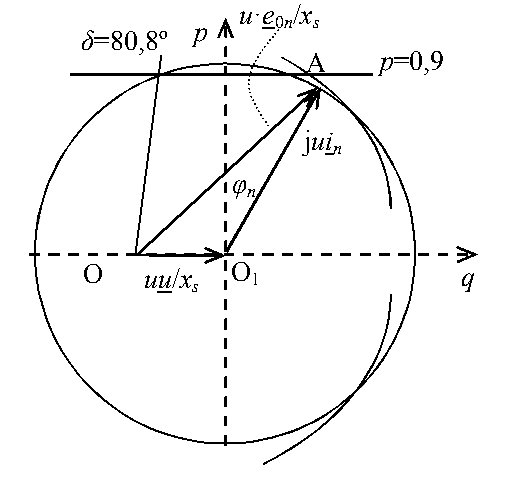

# Zadatak 23 — Idealizovana pogonska karta turbogeneratora

## Postavka

Nacrtati idealizovanu pogonsku kartu turbogeneratora. Poznato je $x_{\mathrm{s}} = 191\ \%$, $\cos\varphi_{\mathrm{n}} = 0{,}8$; maksimalna snaga turbine je $0{,}9\ \mathrm{r.j.}$, a preopteretivost generatora $170\ \%$.

> **Prevod na običan jezik:** Turbogenerator je sinhroni generator koga pokreće parna (ili gasna) turbina. Kao i svaka mašina, on ne sme da radi „bilo kako" — postoje granice koje ne sme da pređe: namotaji ne smeju da se pregreju, turbina ne može da da više snage nego što ume, a mašina ne sme da „ispadne iz sinhronizma". **Pogonska karta** je crtež u ravni aktivna–reaktivna snaga koji sve te granice prikazuje odjednom, tako da operater u elektrani na jedan pogled vidi u kojim tačkama $(q, p)$ generator sme trajno da radi. Naš posao je da tu kartu konstruišemo: da za svaku granicu izvedemo jednačinu (kružnicu ili pravu), izračunamo njene brojne parametre i sve nacrtamo u istom dijagramu. Svi podaci i računi su u *relativnim jedinicama* (r.j.) — bezdimenzionim brojevima svedenim na nazivne vrednosti mašine, što račun čini vrlo jednostavnim.

## Podaci

| Veličina | Oznaka | Vrednost | Šta ta veličina fizički znači |
|---|---|---|---|
| Sinhrona reaktansa | $x_{\mathrm{s}}$ | $191\ \% = 1{,}91\ \mathrm{r.j.}$ | Ukupna reaktansa statorskog namotaja (reaktansa magnećenja + rasipna); kod turbogeneratora (cilindričan rotor) ista je u svim pravcima, pa je jedan broj dovoljan da opiše mašinu. |
| Nazivni faktor snage | $\cos\varphi_{\mathrm{n}}$ | $0{,}8$ | Odnos aktivne i prividne snage u nazivnom režimu; govori pod kojim uglom struja zaostaje za naponom kada mašina radi „po natpisnoj pločici". |
| Maksimalna snaga turbine | $p_{\max}$ | $0{,}9\ \mathrm{r.j.}$ | Najveća mehanička (pa time i aktivna električna) snaga koju pogonska turbina može da isporuči — generator ne može dati više aktivne snage nego što turbina ubaci. |
| Preopteretivost generatora | $\nu_{\mathrm{n}}$ | $170\ \% = 1{,}7$ | Koliko puta veću aktivnu snagu od nazivne mašina može kratkotrajno da izdrži a da ne izgubi sinhronizam; iz nje ćemo izvesti praktičnu granicu stabilnosti. |
| Napon mreže (usvojeno) | $u = u_{\mathrm{n}}$ | $1\ \mathrm{r.j.}$ | U zadatku nije rečeno za koji napon crtamo kartu, pa usvajamo nazivni — standardna pretpostavka. |
| Maksimalna trajna struja statora (usvojeno) | $i = i_{\mathrm{n}}$ | $1\ \mathrm{r.j.}$ | Trajno dozvoljena struja statora je upravo nazivna struja — veća struja bi vremenom pregrejala namotaj. |
| Minimalna snaga turbine (usvojeno) | $p_{\min}$ | $0\ \mathrm{r.j.}$ | U zadatku nije zadata, pa usvajamo da tog ograničenja praktično nema (donja granica je $p = 0$). |

Sve veličine su u relativnim jedinicama, pa su bezdimenzione — objašnjenje sistema r.j. je u prvoj mini-lekciji.

## Šta se traži i zašto

Traži se **idealizovana pogonska karta** — crtež u $p$–$q$ ravni sa svim granicama dozvoljenog rada. Zašto bi to inženjera zanimalo? Zato što je pogonska karta osnovni „vozni red" generatora u elektrani: dispečer po njoj odlučuje koliko aktivne i reaktivne snage sme da traži od mašine u svakom trenutku, a projektant po njoj proverava da li generator može da pokrije zahteve mreže. Reč „idealizovana" znači da mašinu opisujemo najjednostavnijim modelom: zanemarujemo otpornost statorskog namotaja i zasićenje magnetnog kola.

Karta se sastoji od četiri familije granica, pa je i plan rešavanja takav — za svaku granicu nalazimo njenu krivu i njene brojeve:

1. **Granica zagrevanja statora** — struja statora ne sme trajno preći nazivnu; pokazaćemo da je to kružnica poluprečnika $1$ sa centrom u koordinatnom početku.
2. **Granice turbine** — aktivna snaga mora biti između $p_{\min} = 0$ i $p_{\max} = 0{,}9$; to su dve horizontalne prave.
3. **Granica zagrevanja rotora (pobude)** — pobudna struja ne sme trajno preći nazivnu; to je kružnica sa centrom levo od koordinatnog početka. Izračunaćemo centar ($-0{,}52$ na $q$-osi) i poluprečnik (preko trougla iz fazorskog dijagrama).
4. **Praktična granica stabilnosti** — ugao opterećenja ne sme preći $\delta_{\max}$; iz zadate preopteretivosti od $170\ \%$ izračunaćemo najpre nazivni ugao opterećenja $\delta_{\mathrm{n}}$, pa iz njega $\delta_{\max}$; granica je prava kroz centar rotorske kružnice pod tim uglom.

Na kraju sve četiri granice ucrtavamo u isti dijagram (Slika 23.1) i tumačimo dozvoljenu oblast.

## Potrebna teorija — mini-lekcije

### Mini-lekcija 1: Relativne jedinice (r.j.)

U sistemu relativnih jedinica svaka veličina se deli svojom **baznom** (obično nazivnom) vrednošću: napon nazivnim naponom, struja nazivnom strujom, snaga nazivnom prividnom snagom $S_{\mathrm{n}} = 3 U_{\mathrm{fn}} I_{\mathrm{n}}$, impedansa baznom impedansom $Z_{\mathrm{b}} = U_{\mathrm{fn}}/I_{\mathrm{n}}$. Rezultat su bezdimenzioni brojevi koje pišemo malim slovima: $u$, $i$, $p$, $q$, $x_{\mathrm{s}}$. Sistem je zgodan iz dva razloga: (1) formule postaju kraće — na primer, prividna snaga je prosto $s = u \cdot i$, bez trojki i korena iz tri; (2) brojevi odmah govore „koliko je to u odnosu na nazivno": $u = 1$ znači „tačno nazivni napon", $p = 0{,}9$ znači „$90\ \%$ nazivne prividne snage". Podatak $x_{\mathrm{s}} = 191\ \%$ je ista stvar zapisana u procentima: $x_{\mathrm{s}} = 1{,}91\ \mathrm{r.j.}$, tj. sinhrona reaktansa je $1{,}91$ puta veća od bazne impedanse mašine — sasvim tipično za turbogeneratore.

### Mini-lekcija 2: Šta je pogonska karta i kako se čita

Pogonska karta (pogonski dijagram, engl. *capability chart*) je dijagram u ravni čije su ose **reaktivna snaga $q$ (horizontalno)** i **aktivna snaga $p$ (vertikalno)** koje generator predaje mreži. Svaka tačka ravni predstavlja jedan mogući radni režim $(q, p)$. Ograničenja mašine (zagrevanja, turbina, stabilnost) u toj ravni iscrtavaju krive; presek svih dozvoljenih poluravni/unutrašnjosti je **oblast dozvoljenog trajnog rada**. Konvencija znaka: $q > 0$ znači da generator *daje* mreži reaktivnu (induktivnu) snagu — kažemo da je **nadpobuđen**; $q < 0$ znači da reaktivnu snagu *uzima* iz mreže — **potpobuđen**. Videćemo da desnu stranu karte (nadpobuđeni rad) seče granica zagrevanja rotora, a levu (potpobuđeni rad) granica stabilnosti — to je opšta osobina sinhronih generatora.

### Mini-lekcija 3: Idealizovani model turbogeneratora i naponska jednačina

Turbogenerator ima **cilindričan (neistureni) rotor**, pa je magnetni otpor isti u svim pravcima i cela mašina se, uz zanemarenje otpornosti statorskog namotaja, opisuje jednom jedinom reaktansom — sinhronom reaktansom $x_{\mathrm{s}}$. Naponska jednačina po fazi, u relativnim jedinicama i kompleksnom (fazorskom) zapisu, glasi:

$$\underline{e}_0 = \underline{u} + \mathrm{j}\, x_{\mathrm{s}}\, \underline{i}$$

Ovde su (podvlaka označava fazor — kompleksan broj koji nosi i intenzitet i fazni stav):

- $\underline{u}$ — fazor napona na krajevima mašine (napon mreže),
- $\underline{i}$ — fazor struje statora,
- $\underline{e}_0$ — fazor **indukovane elektromotorne sile** (ems) praznog hoda: napon koji obrtno pobudno polje indukuje u statorskom namotaju. Njegov intenzitet $e_0$ **određen je pobudnom strujom** (strujom u namotaju rotora): veća pobudna struja → jače polje rotora → veće $e_0$. Pri stalnoj brzini obrtanja (koju u sinhronizmu diktira frekvencija mreže) veza $e_0 \leftrightarrow$ pobudna struja je jednoznačna, pa je „ograničiti pobudnu struju" isto što i „ograničiti $e_0$".

Ugao između fazora $\underline{e}_0$ i $\underline{u}$ zove se **ugao opterećenja** $\delta$ — o njemu detaljno u mini-lekciji 6.

### Mini-lekcija 4: Kako od fazorskog dijagrama nastaje $p$–$q$ dijagram

Ovo je ključni trik celog zadatka, pa ga izvodimo polako. Nacrtajmo fazorski dijagram jednačine $\underline{e}_0 = \underline{u} + \mathrm{j} x_{\mathrm{s}} \underline{i}$ tako da fazor $\underline{u}$ leži na horizontalnoj osi. Zatim **sve fazore pomnožimo pozitivnim realnim brojem $u/x_{\mathrm{s}}$**. Množenje pozitivnim brojem ne menja pravce, samo dužine — dijagram ostaje istog oblika, samo „prezumiran". Jednačina postaje:

$$\frac{u\,\underline{e}_0}{x_{\mathrm{s}}} = \frac{u\,\underline{u}}{x_{\mathrm{s}}} + \mathrm{j}\, u\, \underline{i}$$

Pogledajmo sada svaki sabirak:

- $u\underline{u}/x_{\mathrm{s}}$ — leži na horizontalnoj osi (pravac $\underline{u}$), dužine $u^2/x_{\mathrm{s}}$;
- $\mathrm{j}\, u\, \underline{i}$ — fazor struje uvećan $u$ puta i zarotiran za $90^\circ$ unapred (to radi množilac $\mathrm{j}$). Njegova dužina je $u \cdot i = s$ — **prividna snaga**! Pošto struja zaostaje za naponom za ugao $\varphi$, posle rotacije za $90^\circ$ ovaj fazor zaklapa ugao $\varphi$ sa **vertikalnom** osom. Njegove projekcije su onda:
  - na vertikalnu osu: $u i \cos\varphi = p$ — aktivna snaga,
  - na horizontalnu osu: $u i \sin\varphi = q$ — reaktivna snaga.

Dakle, čim dijagram pomnožimo sa $u/x_{\mathrm{s}}$, on postaje **dijagram snaga**: vrh fazora $\mathrm{j} u \underline{i}$ pada tačno u tačku sa koordinatama $(q, p)$ — radnu tačku mašine! Horizontalna osa postaje $q$-osa, vertikalna $p$-osa. Uvedimo oznake tačaka (iste kao na Slici 23.1):

- $O_1$ — koordinatni početak $p$–$q$ ravni; iz njega polazi fazor $\mathrm{j} u \underline{i}$,
- $O$ — početak fazora $u\underline{e}_0/x_{\mathrm{s}}$; pošto fazor $u\underline{u}/x_{\mathrm{s}}$ ide od $O$ do $O_1$ duž horizontalne ose, tačka $O$ leži na $q$-osi, levo od početka, na $q = -u^2/x_{\mathrm{s}}$,
- $A$ — vrh oba fazora, tj. radna tačka $(q, p)$.

Iz ove geometrije direktno čitamo koordinate radne tačke preko ugla opterećenja $\delta$ (ugla između $u\underline{e}_0/x_{\mathrm{s}}$ i $q$-ose, jednakog uglu između $\underline{e}_0$ i $\underline{u}$, jer množenje sa $u/x_{\mathrm{s}}$ uglove ne menja):

$$p = \frac{e_0 u}{x_{\mathrm{s}}} \sin\delta, \qquad q = \frac{e_0 u}{x_{\mathrm{s}}} \cos\delta - \frac{u^2}{x_{\mathrm{s}}}$$

Prva jednakost je vertikalna, druga horizontalna projekcija duži $OA$ (dužine $e_0 u / x_{\mathrm{s}}$), pri čemu se od horizontalne projekcije oduzima pomak $u^2/x_{\mathrm{s}}$ jer tačka $O$ ne leži u koordinatnom početku. Ove dve formule su „mašina" iz koje ćemo izvesti i granicu pobude i granicu stabilnosti.

### Mini-lekcija 5: Četiri ograničenja i njihove krive

**(a) Zagrevanje statora.** Statorska struja trajno sme najviše $i = i_{\mathrm{n}}$. Prividna snaga je $s = u i$, a važi $s^2 = p^2 + q^2$ (jer su $p$ i $q$ upravo projekcije fazora dužine $s$, mini-lekcija 4). Granica je zato **kružnica**:

$$p^2 + q^2 = (u\, i_{\mathrm{n}})^2$$

sa centrom u koordinatnom početku $O_1$ i poluprečnikom $u i_{\mathrm{n}}$; dozvoljena je unutrašnjost.

**(b) Snaga turbine.** Generator u ustaljenom stanju predaje mreži tačno onoliko aktivne snage koliko turbina mehanički ubaci (gubitke smo zanemarili). Zato $p$ ne može preći maksimalnu snagu turbine niti pasti ispod minimalne: $p_{\min} \le p \le p_{\max}$ — dve **horizontalne prave**.

**(c) Zagrevanje rotora (pobudnog namotaja).** Pobudna struja trajno sme najviše nazivnu vrednost, što (mini-lekcija 3) znači $e_0 \le e_{0\mathrm{n}}$, gde je $e_{0\mathrm{n}}$ ems pri nazivnoj pobudnoj struji. Iz formula za $p$ i $q$ (mini-lekcija 4) eliminišemo $\delta$: prebacimo $u^2/x_{\mathrm{s}}$ na levu stranu druge jednačine, obe kvadrirajmo i saberimo — zbog $\sin^2\delta + \cos^2\delta = 1$ dobija se

$$p^2 + \left( q + \frac{u^2}{x_{\mathrm{s}}} \right)^{\!2} = \left( \frac{e_0\, u}{x_{\mathrm{s}}} \right)^{\!2}$$

To je **kružnica sa centrom u tački $O$** (na $q$-osi, u $q = -u^2/x_{\mathrm{s}}$) **i poluprečnikom $e_0 u / x_{\mathrm{s}}$**. Geometrijski je to očekivano: sve radne tačke sa istim $e_0$ su na istom rastojanju $e_0 u/x_{\mathrm{s}}$ od tačke $O$. Granični slučaj $e_0 = e_{0\mathrm{n}}$ daje najveću dozvoljenu kružnicu; dozvoljena je njena unutrašnjost.

**(d) Stabilnost.** O njoj u sledećoj mini-lekciji, jer traži malo više priče.

**(e) Šta je prava konstantnog $\delta$?** Iz istih formula: $p = \frac{e_0 u}{x_{\mathrm{s}}}\sin\delta$ i $q + \frac{u^2}{x_{\mathrm{s}}} = \frac{e_0 u}{x_{\mathrm{s}}}\cos\delta$, pa deljenjem

$$\frac{p}{q + u^2/x_{\mathrm{s}}} = \mathrm{tg}\,\delta$$

Desna strana ne zavisi od $e_0$! Dakle, sve radne tačke sa istim uglom opterećenja $\delta$ (a raznim pobudama) leže na **pravoj kroz tačku $O$** koja sa $q$-osom zaklapa ugao $\delta$. To će nam trebati za crtanje granice stabilnosti.

### Mini-lekcija 6: Ugaona karakteristika, stabilnost i preopteretivost

Formula $p = \dfrac{e_0 u}{x_{\mathrm{s}}} \sin\delta$ zove se **ugaona karakteristika aktivne snage** turbogeneratora: pri stalnom naponu i stalnoj pobudi, predata aktivna snaga zavisi samo od ugla opterećenja $\delta$, i to sinusno. Fizička slika: $\delta$ je ugao za koji obrtno polje rotora „prednjači" rezultantnom polju; što turbina jače gura, rotor više odmakne unapred i $\delta$ raste, a sa njim (do izvesne granice) i predata snaga.

**Teorijska granica stabilnosti** je vrh sinusoide, $\delta = 90^\circ$: tu je $\sin\delta$ maksimalan. Ako bi ugao prešao $90^\circ$, dalji porast $\delta$ *smanjuje* snagu — mašina više ne može da odgovori na dodatni zahtev turbine, rotor nekontrolisano ubrzava i generator **ispada iz sinhronizma** (havarijski događaj). Zato se u praksi nikad ne radi blizu $90^\circ$, već se definiše **praktična granica stabilnosti**: maksimalni dozvoljeni ugao $\delta_{\max} < 90^\circ$, koji ostavlja rezervu snage za slučaj poremećaja.

U ovom zadatku praktična granica nije zadata direktno preko ugla, nego preko **preopteretivosti** $\nu_{\mathrm{n}}$. Preopteretivost se (ako nije drugačije naglašeno) uvek definiše **u odnosu na nazivno opterećenje**: $\nu_{\mathrm{n}} = 1{,}7$ znači da najveća aktivna snaga kojom se generator sme opteretiti iznosi $1{,}7$ puta *nazivna aktivna snaga* $p_{\mathrm{n}}$. Pošto i nazivna radna tačka i maksimalna leže na istoj ugaonoj karakteristici (ista pobuda $e_{0\mathrm{n}}$, isti napon $u_{\mathrm{n}}$), količnik njihovih snaga je količnik sinusa:

$$\frac{p_{\max}^{\mathrm{(stab)}}}{p_{\mathrm{n}}} = \nu_{\mathrm{n}} = \frac{\sin\delta_{\max}}{\sin\delta_{\mathrm{n}}}$$

odakle se $\delta_{\max}$ nalazi arkus-sinusom. Granica stabilnosti u $p$–$q$ dijagramu je onda prava konstantnog ugla $\delta = \delta_{\max}$ kroz tačku $O$ (mini-lekcija 5e); dozvoljene su tačke sa $\delta \le \delta_{\max}$, tj. desno od te prave.

### Mini-lekcija 7: Podsetnik — kosinusna teorema

U trouglu sa stranicama $a$, $b$, $c$, gde je $\gamma$ ugao **između** stranica $a$ i $b$ (naspram stranice $c$), važi:

$$c^2 = a^2 + b^2 - 2ab\cos\gamma$$

To je „produžena Pitagorina teorema": za $\gamma = 90^\circ$ član sa kosinusom otpada i ostaje Pitagora. Koristićemo je dva puta u trouglu $O O_1 A$ fazorskog dijagrama: jednom da nađemo nepoznatu stranicu (poluprečnik rotorske kružnice), a jednom — u obrnutom smeru, rešenu po kosinusu:

$$\cos\gamma = \frac{a^2 + b^2 - c^2}{2ab}$$

— da nađemo nepoznat ugao ($\delta_{\mathrm{n}}$). Zgodan trigonometrijski identitet koji će nam usput zatrebati: $\cos(90^\circ + \varphi) = -\sin\varphi$.

## Rešenje, korak po korak

### Korak 1: Izbor napona za koji crtamo kartu

**Zašto ovaj korak:** oblik i dimenzije svih granica zavise od napona mreže, a zadatak ne kaže za koji napon se karta traži — moramo ga usvojiti pre bilo kakvog računa.

U zadatku nije posebno naglašeno za koji napon treba nacrtati pogonsku kartu, pa je crtamo za **nazivni napon**:

$$u = u_{\mathrm{n}} = 1\ \mathrm{r.j.}$$

**Šta smo dobili:** standardnu, najčešću pretpostavku — generator u normalnom pogonu i radi na (približno) nazivnom naponu, pa je karta za $u = 1$ ona koja se u praksi zaista koristi.

### Korak 2: Granica zagrevanja statorskog namotaja

**Zašto ovaj korak:** prvo ucrtavamo najjednostavnije ograničenje — statorska struja trajno ne sme preći nazivnu vrednost $i = i_{\mathrm{n}} = 1\ \mathrm{r.j.}$, inače se statorski namotaj pregreva.

Prema mini-lekciji 5a, granica je kružnica $p^2 + q^2 = (u\, i)^2$. Uvrstimo granične vrednosti $u = u_{\mathrm{n}} = 1$ i $i = i_{\mathrm{n}} = 1$:

$$p^2 + q^2 = (u_{\mathrm{n}} \cdot i_{\mathrm{n}})^2 = (1 \cdot 1)^2 = 1$$

Dozvoljeni radni režimi, zadati aktivnom snagom $p$ i reaktivnom snagom $q$, moraju da zadovolje nejednakost:

$$p^2 + q^2 \le 1$$

**Šta smo dobili:** kružnicu **jediničnog poluprečnika sa centrom u koordinatnom početku** $O_1$; dozvoljene radne tačke (spram ovog ograničenja) leže unutar nje. Očekivano: pri nazivnom naponu i nazivnoj struji prividna snaga je tačno nazivna, $s = 1\ \mathrm{r.j.}$, kako god ona bila raspodeljena na $p$ i $q$.

### Korak 3: Granice snage turbine

**Zašto ovaj korak:** generator ne može predati više aktivne snage nego što mu turbina mehanički dotura — granica po $p$ ne zavisi od električnih veličina, nego od turbine.

Maksimalna snaga turbine datog generatora je:

$$p_{\max} = 0{,}9\ \mathrm{r.j.}$$

pa dozvoljenom području (spram ovog ograničenja) pripadaju sve radne tačke **ispod horizontalne prave** $p = 0{,}9$. Minimalna snaga turbine u zadatku nije posebno naglašena, pa usvajamo da tog ograničenja nema, tj. dozvoljene tačke su iznad prave:

$$p_{\min} = 0\ \mathrm{r.j.}$$

**Šta smo dobili:** horizontalni „pojas" $0 \le p \le 0{,}9$. Primetimo da je $p_{\max} = 0{,}9 > p_{\mathrm{n}} = \cos\varphi_{\mathrm{n}} = 0{,}8$ — turbina ima izvesnu rezervu iznad nazivne aktivne snage generatora, što je uobičajeno.

### Korak 4: Granica zagrevanja rotora — centar kružnice

**Zašto ovaj korak:** treće ograničenje je zagrevanje pobudnog (rotorskog) namotaja; njegova kriva je kružnica i za crtanje su nam potrebni njen centar (ovaj korak) i poluprečnik (sledeći korak).

Prema mini-lekciji 5c, ograničenje zbog zagrevanja pobudnog namotaja u $p$–$q$ dijagramu je kružnica:

$$p^2 + \left( q + \frac{u^2}{x_{\mathrm{s}}} \right)^{\!2} = \left( \frac{e_0\, u}{x_{\mathrm{s}}} \right)^{\!2}$$

U njoj figuriše indukovana ems $e_0$, koja je određena pobudnom strujom. Maksimalna trajno dozvoljena pobudna struja je nazivna, pa ona (pri nazivnoj brzini obrtanja, koju diktira nazivna frekvencija mreže) definiše i maksimalnu ems $e_{0\mathrm{n}}$. Za nazivni napon mreže granična kružnica glasi:

$$p^2 + \left( q + \frac{u_{\mathrm{n}}^2}{x_{\mathrm{s}}} \right)^{\!2} = \left( \frac{e_{0\mathrm{n}}\, u_{\mathrm{n}}}{x_{\mathrm{s}}} \right)^{\!2}$$

Centar kružnice je tačka $O$ na $q$-osi (dakle $p = 0$), pomerena za $-u_{\mathrm{n}}^2/x_{\mathrm{s}}$:

$$O\left( -\frac{u_{\mathrm{n}}^2}{x_{\mathrm{s}}};\ 0 \right) \quad\Longrightarrow\quad O\left( -\frac{1^2}{1{,}91} = -0{,}52;\ 0 \right)$$

**Šta smo dobili:** centar rotorske kružnice u $O(-0{,}52;\ 0)$ — na negativnom delu $q$-ose, pola relativne jedinice levo od početka. Što je sinhrona reaktansa veća, centar je bliži početku; kod turbogeneratora ($x_{\mathrm{s}}$ oko $2$) tipično oko $-0{,}5$.

### Korak 5: Granica zagrevanja rotora — poluprečnik kružnice

**Zašto ovaj korak:** da bismo ucrtali rotorsku kružnicu, pored centra treba nam i poluprečnik $e_{0\mathrm{n}} u_{\mathrm{n}}/x_{\mathrm{s}}$. Vrednost $e_{0\mathrm{n}}$ nije zadata brojem, ali jeste posredno — kroz nazivni režim ($u_{\mathrm{n}} = 1$, $i_{\mathrm{n}} = 1$, $\cos\varphi_{\mathrm{n}} = 0{,}8$): nazivna radna tačka mora ležati tačno na rotorskoj kružnici, jer u njoj mašina radi baš sa nazivnom pobudom.

Posmatrajmo trougao $O O_1 A$ na pogonskom dijagramu (Slika 23.1; $A$ je nazivna radna tačka). Njegove stranice su fazori iz mini-lekcije 4:

- $\overline{O O_1}$ — fazor $u_{\mathrm{n}}\underline{u}_{\mathrm{n}}/x_{\mathrm{s}}$, dužine $u_{\mathrm{n}}^2/x_{\mathrm{s}}$, duž $q$-ose;
- $\overline{O_1 A}$ — fazor $\mathrm{j} u_{\mathrm{n}} \underline{i}_{\mathrm{n}}$, dužine $u_{\mathrm{n}} i_{\mathrm{n}}$, pod uglom $\varphi_{\mathrm{n}}$ prema $p$-osi;
- $\overline{O A}$ — fazor $u_{\mathrm{n}}\underline{e}_{0\mathrm{n}}/x_{\mathrm{s}}$, dužine $e_{0\mathrm{n}} u_{\mathrm{n}}/x_{\mathrm{s}}$ — **upravo traženi poluprečnik**.

Ugao trougla kod temena $O_1$, tj. ugao između krakova $\overline{O_1 O}$ i $\overline{O_1 A}$: krak $\overline{O_1 A}$ otklonjen je od pozitivne $q$-ose za $90^\circ - \varphi_{\mathrm{n}}$, a krak $\overline{O_1 O}$ gleda duž *negativne* $q$-ose, pa je ugao između njih $180^\circ - (90^\circ - \varphi_{\mathrm{n}}) = 90^\circ + \varphi_{\mathrm{n}}$. Kosinusna teorema (mini-lekcija 7) sa stranicama $a = u_{\mathrm{n}}^2/x_{\mathrm{s}}$, $b = u_{\mathrm{n}} i_{\mathrm{n}}$ i uglom $\gamma = 90^\circ + \varphi_{\mathrm{n}}$ između njih daje:

$$\frac{e_{0\mathrm{n}} u_{\mathrm{n}}}{x_{\mathrm{s}}} = \sqrt{ \left( \frac{u_{\mathrm{n}}^2}{x_{\mathrm{s}}} \right)^{\!2} + (u_{\mathrm{n}} i_{\mathrm{n}})^2 - 2 \cdot \frac{u_{\mathrm{n}}^2}{x_{\mathrm{s}}} \cdot u_{\mathrm{n}} i_{\mathrm{n}} \cdot \cos\!\left( \frac{\pi}{2} + \varphi_{\mathrm{n}} \right) }$$

Iskoristimo identitet $\cos\left(\frac{\pi}{2} + \varphi_{\mathrm{n}}\right) = -\sin\varphi_{\mathrm{n}}$; iz $\cos\varphi_{\mathrm{n}} = 0{,}8$ sledi $\sin\varphi_{\mathrm{n}} = \sqrt{1 - 0{,}8^2} = \sqrt{0{,}36} = 0{,}6$, pa se minus ispred člana sa kosinusom pretvara u plus:

$$\frac{e_{0\mathrm{n}} u_{\mathrm{n}}}{x_{\mathrm{s}}} = \sqrt{ \left( \frac{1}{1{,}91} \right)^{\!2} + 1^2 + 2 \cdot \frac{1}{1{,}91} \cdot 1 \cdot 0{,}6 }$$

Izračunajmo član po član: $\left(\frac{1}{1{,}91}\right)^2 = 0{,}52356^2 = 0{,}2741$, a $2 \cdot \frac{0{,}6}{1{,}91} = \frac{1{,}2}{1{,}91} = 0{,}6283$. Dakle:

$$\frac{e_{0\mathrm{n}} u_{\mathrm{n}}}{x_{\mathrm{s}}} = \sqrt{0{,}2741 + 1 + 0{,}6283} = \sqrt{1{,}9024} = 1{,}379\ \mathrm{r.j.}$$

**Šta smo dobili:** poluprečnik rotorske kružnice $1{,}379\ \mathrm{r.j.}$ — veći od $1$, dakle rotorska kružnica je veća od statorske, ali joj je centar pomeren ulevo, pa na desnoj (nadpobuđenoj) strani karte upravo ona „prva zaseca" dozvoljenu oblast. Usput smo (implicitno) dobili i nazivnu ems: $e_{0\mathrm{n}} = 1{,}379 \cdot x_{\mathrm{s}} / u_{\mathrm{n}} = 1{,}379 \cdot 1{,}91 = 2{,}63\ \mathrm{r.j.}$ — znatno veća od napona, tipično za mašinu sa velikim $x_{\mathrm{s}}$ i induktivnim faktorom snage.

### Korak 6: Nazivni ugao opterećenja $\delta_{\mathrm{n}}$

**Zašto ovaj korak:** granicu stabilnosti ćemo dobiti iz preopteretivosti, a za to nam (mini-lekcija 6) prvo treba ugao opterećenja u nazivnom režimu. On je ugao trougla $O O_1 A$ kod temena $O$ — između stranica $\overline{OA}$ i $\overline{OO_1}$ — pa ga vadimo kosinusnom teoremom „unazad".

Kosinusna teorema rešena po kosinusu ugla (mini-lekcija 7), sa stranicama uz ugao $a = e_{0\mathrm{n}} u_{\mathrm{n}}/x_{\mathrm{s}} = 1{,}379$ i $b = u_{\mathrm{n}}^2/x_{\mathrm{s}} = \frac{1}{1{,}91}$, i naspramnom stranicom $c = u_{\mathrm{n}} i_{\mathrm{n}} = 1$:

$$\delta_{\mathrm{n}} = \arccos\!\left( \frac{ \left( \dfrac{e_{0\mathrm{n}} u_{\mathrm{n}}}{x_{\mathrm{s}}} \right)^{\!2} + \left( \dfrac{u_{\mathrm{n}}^2}{x_{\mathrm{s}}} \right)^{\!2} - (u_{\mathrm{n}} i_{\mathrm{n}})^2 }{ 2 \cdot \dfrac{e_{0\mathrm{n}} u_{\mathrm{n}}}{x_{\mathrm{s}}} \cdot \dfrac{u_{\mathrm{n}}^2}{x_{\mathrm{s}}} } \right) = \arccos\!\left( \frac{ 1{,}379^2 + \left( \dfrac{1}{1{,}91} \right)^{\!2} - 1^2 }{ 2 \cdot 1{,}379 \cdot \dfrac{1}{1{,}91} } \right)$$

Brojilac: $1{,}379^2 = 1{,}9016$; $\left(\frac{1}{1{,}91}\right)^2 = 0{,}2741$; dakle $1{,}9016 + 0{,}2741 - 1 = 1{,}1757$. Imenilac: $2 \cdot 1{,}379 \cdot 0{,}5236 = 1{,}4441$. Količnik: $\frac{1{,}1757}{1{,}4441} = 0{,}8141$. Konačno:

$$\delta_{\mathrm{n}} = \arccos(0{,}8141) = 35{,}5^\circ$$

**Šta smo dobili:** pri nazivnom opterećenju rotor „prednjači" za $35{,}5^\circ$ — udobno daleko od teorijske granice $90^\circ$, kako i treba u normalnom pogonu.

### Korak 7: Maksimalni ugao opterećenja $\delta_{\max}$ iz preopteretivosti

**Zašto ovaj korak:** praktična granica stabilnosti je u ovom zadatku zadata podatkom o preopteretivosti od $170\ \%$; sada ga „prevodimo" u maksimalni ugao opterećenja.

Preopteretivost se (ako nije drugačije naglašeno) definiše u odnosu na **nazivno opterećenje**: $\nu_{\mathrm{n}} = 1{,}7$ znači da je maksimalna aktivna snaga kojom se generator sme opteretiti $1{,}7$ puta veća od nazivne aktivne snage. Ta maksimalna snaga definiše maksimalni ugao opterećenja $\delta_{\max}$ — a on određuje praktičnu granicu stabilnosti (za razliku od teorijske, kod koje je $\delta_{\max} = 90^\circ$). Napišimo ugaonu karakteristiku (mini-lekcija 6) u nazivnoj i u maksimalnoj tački — obe sa istom pobudom $e_{0\mathrm{n}}$ i istim naponom $u_{\mathrm{n}}$:

$$p_{\mathrm{n}} = \frac{e_{0\mathrm{n}} u_{\mathrm{n}}}{x_{\mathrm{s}}} \sin\delta_{\mathrm{n}}, \qquad p_{\max}^{\mathrm{(stab)}} = \frac{e_{0\mathrm{n}} u_{\mathrm{n}}}{x_{\mathrm{s}}} \sin\delta_{\max}$$

Podelimo drugu jednačinu prvom — zajednički činilac $e_{0\mathrm{n}} u_{\mathrm{n}}/x_{\mathrm{s}}$ se skrati:

$$\frac{p_{\max}^{\mathrm{(stab)}}}{p_{\mathrm{n}}} = \nu_{\mathrm{n}} = \frac{\sin\delta_{\max}}{\sin\delta_{\mathrm{n}}} \quad\Longrightarrow\quad \sin\delta_{\max} = \nu_{\mathrm{n}} \sin\delta_{\mathrm{n}}$$

Uvrstimo brojeve ($\sin 35{,}5^\circ = 0{,}5807$):

$$\delta_{\max} = \arcsin\left( \nu_{\mathrm{n}} \sin\delta_{\mathrm{n}} \right) = \arcsin\left( 1{,}7 \cdot \sin 35{,}5^\circ \right) = \arcsin\left( 1{,}7 \cdot 0{,}5807 \right) = \arcsin(0{,}9872) = 80{,}8^\circ$$

**Šta smo dobili:** maksimalni dozvoljeni ugao opterećenja $80{,}8^\circ$ — blizu, ali ipak ispod teorijske granice od $90^\circ$; razlika od $9{,}2^\circ$ je rezerva stabilnosti koju preopteretivost od $170\ \%$ ostavlja.

### Korak 8: Crtanje pogonske karte i tumačenje dozvoljene oblasti

**Zašto ovaj korak:** sve četiri granice su spremne — ostaje da ih ucrtamo u isti $p$–$q$ dijagram i pročitamo dozvoljenu oblast.

Prema mini-lekciji 5e, konstantnom uglu opterećenja odgovara prava kroz tačku $O$; praktična granica stabilnosti je zato **prava kroz $O(-0{,}52;\ 0)$ pod uglom $\delta_{\max} = 80{,}8^\circ$ prema $q$-osi** — dozvoljene su tačke desno od nje (tamo je $\delta < \delta_{\max}$).

Slika 23.1 objedinjuje sva razmatranja: prikazuje $p$–$q$ ravan sa sve četiri granice i sa fazorskim trouglom $O O_1 A$ nazivnog režima ucrtanim unutar karte.

**Slika 23.1 —** Pogonska karta posmatranog turbogeneratora: sva četiri ograničenja (statorska i rotorska kružnica, prava maksimalne snage turbine $p = 0{,}9$ i prava praktične granice stabilnosti $\delta = 80{,}8^\circ$) sa fazorskim trouglom $O O_1 A$ nazivnog režima.

> **Kako čitati sliku 23.1:** Ose su nacrtane isprekidano: horizontalna je **reaktivna snaga $q$** (u r.j.; udesno $q > 0$ — nadpobuđen rad, generator *daje* reaktivnu snagu; ulevo $q < 0$ — potpobuđen), vertikalna je **aktivna snaga $p$** (u r.j.) — sve veličine su bezdimenzione, svedene na nazivne. Tri karakteristične tačke: $O_1$ — koordinatni početak; $O(-0{,}52;\ 0)$ — levo na $q$-osi; $A(0{,}6;\ 0{,}8)$ — nazivna radna tačka, gore desno. Fazorski trougao (strelice sa podvučenim oznakama): $u\underline{u}/x_{\mathrm{s}}$ ide od $O$ do $O_1$ duž $q$-ose (dužina $0{,}52$); $\mathrm{j}u\underline{i}_{\mathrm{n}}$ od $O_1$ do $A$ (dužina $1$ — nazivna prividna snaga; kotiran je njegov ugao $\varphi_{\mathrm{n}} \approx 36{,}9^\circ$ prema $p$-osi); $u\cdot\underline{e}_{0\mathrm{n}}/x_{\mathrm{s}}$ od $O$ do $A$ (dužina $1{,}379$; tačkasta etiketa pri vrhu slike). Granice: velika kružnica sa centrom u $O_1$ poluprečnika $1$, koja prolazi kroz $A$ — **statorska granica** (zagrevanje statorskog namotaja); luk na desnoj strani sa centrom u $O$ poluprečnika $1{,}379$, takođe kroz $A$ — **rotorska granica** (zagrevanje pobudnog namotaja); horizontalna prava $p = 0{,}9$ pri vrhu — **granica turbine**; kosa prava iz gornjeg levog ugla kroz tačku $O$, obeležena $\delta = 80{,}8^\circ$ — **praktična granica stabilnosti** (sve tačke na njoj imaju isti ugao opterećenja). Dozvoljena oblast trajnog rada je presek: dole je $q$-osa ($p \ge 0$), desno redom luk rotorske pa, iznad tačke $A$, luk statorske kružnice, gore prava $p = 0{,}9$, levo prava stabilnosti. **Šta treba da zaključiš:** nazivna tačka $A$ leži istovremeno na obe kružnice — u nazivnom režimu su i statorska i pobudna struja tačno nazivne; desnu (nadpobuđenu) stranu karte ograničava pobuda, a levu (potpobuđenu) stabilnost — opšte pravilo za sinhrone generatore.

Dozvoljena oblast trajnog rada je presek svih ograničenja; njena granica, obilazeći je od dole udesno:

- **dole**: $q$-osa ($p_{\min} = 0$);
- **desno (nadpobuđen rad, $q > 0$)**: od $q$-ose do nazivne tačke $A$ — luk **rotorske** kružnice (tu bi veći $q$ tražio preveliku pobudnu struju); od $A$ naviše — luk **statorske** kružnice. Tačka $A$ je presek obe kružnice: u nazivnom režimu su i statorska i pobudna struja tačno nazivne, pa nazivna tačka leži na obe granice istovremeno;
- **gore**: prava $p = 0{,}9$ (turbina ne može više);
- **levo (potpobuđen rad, $q < 0$)**: prava praktične granice stabilnosti $\delta = 80{,}8^\circ$ kroz $O$ — pri maloj pobudi (malo $e_0$) ugao $\delta$ za istu snagu mora biti veliki, pa se granica stabilnosti dostiže pre nego granice zagrevanja.

**Šta smo dobili:** kompletnu idealizovanu pogonsku kartu. Svaka tačka unutar opisane oblasti je režim u kome generator sme trajno da radi; svaka granica nosi svoje fizičko „zašto".

## Česte greške i zamke

1. **Centar rotorske kružnice na pogrešnoj osi ili sa pogrešnim znakom.** Centar je $O(-u_{\mathrm{n}}^2/x_{\mathrm{s}};\ 0)$ — na **$q$-osi** (dakle $p = 0$), i to na njenom **negativnom** delu. Studenti ga često stave na $p$-osu ili na $+0{,}52$; provera: u jednačini kružnice figuriše $\left(q + \frac{u^2}{x_{\mathrm{s}}}\right)^2$, a taj izraz je nula (centar!) baš za $q = -\frac{u^2}{x_{\mathrm{s}}}$.
2. **Pogrešan ugao u kosinusnoj teoremi.** Ugao između krakova $\overline{O_1 O}$ i $\overline{O_1 A}$ je $90^\circ + \varphi_{\mathrm{n}}$, ne $\varphi_{\mathrm{n}}$! Zbog $\cos(90^\circ + \varphi_{\mathrm{n}}) = -\sin\varphi_{\mathrm{n}}$ u formuli za poluprečnik figuriše $\sin\varphi_{\mathrm{n}} = 0{,}6$ (sa znakom plus ispred člana), a ne $\cos\varphi_{\mathrm{n}} = 0{,}8$. Ko uvrsti $0{,}8$ ili ostavi minus, dobije pogrešan poluprečnik.
3. **Preopteretivost vezana za pogrešnu snagu.** Preopteretivost od $170\ \%$ odnosi se na **nazivnu aktivnu snagu** $p_{\mathrm{n}} = u_{\mathrm{n}} i_{\mathrm{n}} \cos\varphi_{\mathrm{n}} = 0{,}8\ \mathrm{r.j.}$, a ne na maksimalnu snagu turbine $0{,}9\ \mathrm{r.j.}$ niti na prividnu snagu $1\ \mathrm{r.j.}$ U formuli $\sin\delta_{\max} = \nu_{\mathrm{n}} \sin\delta_{\mathrm{n}}$ ta snaga se ionako skrati — ali samo ako su obe tačke na istoj ugaonoj karakteristici.
4. **Mešanje teorijske i praktične granice stabilnosti.** Teorijska granica je $\delta = 90^\circ$ (vrh sinusoide); praktična je $\delta_{\max} = 80{,}8^\circ$ i nju crtamo na karti. Prava granice stabilnosti prolazi kroz tačku $O$, ne kroz koordinatni početak.
5. **Reaktansa ostavljena u procentima.** $x_{\mathrm{s}} = 191\ \%$ mora u račun ući kao $1{,}91$, inače centar kružnice ispadne $-1/191 \approx -0{,}005$ i cela karta se raspadne.

## Rezime rezultata

| Veličina | Oznaka / jednačina | Vrednost |
|---|---|---|
| Usvojeni napon karte | $u = u_{\mathrm{n}}$ | $1\ \mathrm{r.j.}$ |
| Granica zagrevanja statora | $p^2 + q^2 \le (u_{\mathrm{n}} i_{\mathrm{n}})^2$ | kružnica: centar $O_1(0;0)$, poluprečnik $1\ \mathrm{r.j.}$ |
| Granica maksimalne snage turbine | $p \le p_{\max}$ | $p_{\max} = 0{,}9\ \mathrm{r.j.}$ |
| Granica minimalne snage turbine | $p \ge p_{\min}$ | $p_{\min} = 0\ \mathrm{r.j.}$ |
| Centar rotorske kružnice | $O\left(-u_{\mathrm{n}}^2/x_{\mathrm{s}};\ 0\right)$ | $O(-0{,}52;\ 0)$ |
| Poluprečnik rotorske kružnice | $e_{0\mathrm{n}} u_{\mathrm{n}} / x_{\mathrm{s}}$ | $1{,}379\ \mathrm{r.j.}$ |
| Nazivni ugao opterećenja | $\delta_{\mathrm{n}}$ | $35{,}5^\circ$ |
| Maksimalni ugao opterećenja (praktična granica stabilnosti) | $\delta_{\max} = \arcsin(\nu_{\mathrm{n}} \sin\delta_{\mathrm{n}})$ | $80{,}8^\circ$ |
| Praktična granica stabilnosti | prava kroz $O(-0{,}52;\ 0)$ pod $\delta_{\max}$ prema $q$-osi | $\delta = 80{,}8^\circ$ |

## Provera smisla

**1. Nazivna tačka mora ležati na obe kružnice.** Nazivna radna tačka ima koordinate $A(q, p) = (u_{\mathrm{n}} i_{\mathrm{n}} \sin\varphi_{\mathrm{n}};\ u_{\mathrm{n}} i_{\mathrm{n}} \cos\varphi_{\mathrm{n}}) = (0{,}6;\ 0{,}8)$. Statorska kružnica: $0{,}6^2 + 0{,}8^2 = 0{,}36 + 0{,}64 = 1$ ✓. Rotorska kružnica — rastojanje od $O(-0{,}5236;\ 0)$: $\sqrt{(0{,}6 + 0{,}5236)^2 + 0{,}8^2} = \sqrt{1{,}1236^2 + 0{,}64} = \sqrt{1{,}2625 + 0{,}64} = \sqrt{1{,}9025} = 1{,}379$ ✓ — tačno izračunati poluprečnik. Obe granice prolaze kroz nazivnu tačku, kako i mora biti.

**2. Nezavisna provera ugla $\delta_{\mathrm{n}}$.** Umesto kosinusne teoreme, ugao duži $\overline{OA}$ prema $q$-osi možemo očitati iz koordinata: $\mathrm{tg}\,\delta_{\mathrm{n}} = \dfrac{0{,}8}{0{,}6 + 0{,}5236} = \dfrac{0{,}8}{1{,}1236} = 0{,}712$, pa $\delta_{\mathrm{n}} = \mathrm{arctg}(0{,}712) = 35{,}5^\circ$ ✓.

**3. Konzistentnost granice stabilnosti.** Maksimalna snaga po stabilnosti treba da bude $\nu_{\mathrm{n}} p_{\mathrm{n}} = 1{,}7 \cdot 0{,}8 = 1{,}36\ \mathrm{r.j.}$; sa druge strane, ugaona karakteristika u $\delta_{\max}$ daje $\frac{e_{0\mathrm{n}} u_{\mathrm{n}}}{x_{\mathrm{s}}} \sin\delta_{\max} = 1{,}379 \cdot \sin 80{,}8^\circ = 1{,}379 \cdot 0{,}9872 = 1{,}361 \approx 1{,}36$ ✓. (Napomena: pošto je $\arcsin$ blizu argumenta $1$ vrlo strm, zaokruživanje $\delta_{\mathrm{n}}$ na jednu decimalu pomera $\delta_{\max}$ za nekoliko desetinki stepena — sa nezaokruženim $\delta_{\mathrm{n}} = 35{,}45^\circ$ dobilo bi se $\delta_{\max} = 80{,}4^\circ$; zbirka računa sa $35{,}5^\circ$ i dobija $80{,}8^\circ$, što usvajamo kao konačan rezultat. Na izgled karte razlika je nevidljiva.)

**4. Dimenziona provera.** U relativnim jedinicama su sve tri „kružne" veličine — $u i$, $u^2/x_{\mathrm{s}}$ i $e_0 u/x_{\mathrm{s}}$ — bezdimenzione snage: napon puta struja je snaga, a napon na kvadrat kroz impedansu takođe ($U^2/Z$ ima dimenziju snage). Sve granice zato legitimno žive u istoj $p$–$q$ ravni ✓.
