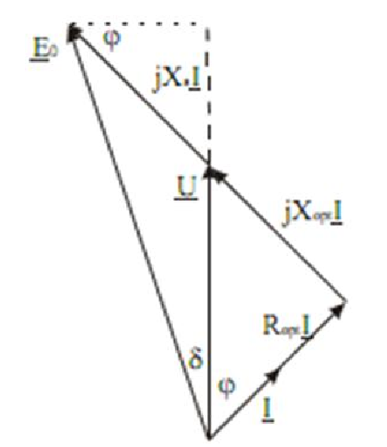

# Zadatak 24 — Aktivna i reaktivna snaga turbogeneratora na pasivnoj R‑L mreži pri smanjenoj brzini obrtanja

## Postavka

Trofazni sinhroni generator sa cilindričnim rotorom ima sledeće nominalne podatke: prividna snaga $10\ \mathrm{kVA}$, sprega statorskog namotaja zvezda (Y), faktor snage $\cos\varphi = 0{,}8$, linijski napon $400\ \mathrm{V}$, brzina obrtanja $1500\ \mathrm{o/min}$, učestanost $50\ \mathrm{Hz}$. Sinhrona reaktansa je $2\ \Omega$ (pri nominalnoj učestanosti), dok se omski otpori namotaja, gubici u gvožđu, trenje i ventilacija zanemaruju. Struja pobude se održava na nominalnoj vrednosti, a magnetno kolo je linearno.

Generator radi na **pasivnoj mreži** (trofazni redni R‑L potrošač po fazi) impedanse $R = 50\ \Omega$, $L = 0{,}15\ \mathrm{H}$, pri brzini obrtanja od $1300\ \mathrm{o/min}$. Potrebno je odrediti **aktivnu i reaktivnu snagu** koju generator daje u mrežu u ovom režimu (struja pobude je i dalje nominalna).

> **Prevod na običan jezik:** Imamo mali sinhroni generator koji NIJE priključen na veliku elektroenergetsku mrežu, nego sam napaja svoj privatni potrošač — u svakoj fazi po jedan otpornik od $50\ \Omega$ vezan na red sa kalemom od $0{,}15\ \mathrm{H}$. Pošto nema krute mreže koja bi mu nametala napon i učestanost, sve određuje sam generator: koliko se brzo vrti — tolika je učestanost; kolika mu je pobuda i brzina — tolika je indukovana elektromotorna sila. Pogonska mašina ga sada vrti sporije nego nominalno ($1300$ umesto $1500\ \mathrm{o/min}$), a pobudna struja je ostala ista kao u nominalnom režimu. Pitanje glasi: koliko vati aktivne snage i koliko vara reaktivne snage sada „isporučuje“ tom svom R‑L potrošaču? Caka je u tome što nam niko nije rekao kolika je nominalna struja pobude u amperima — nju „poznajemo“ samo posredno, preko nominalnog režima, iz kog ćemo prvo izračunati elektromotornu silu koju ta pobuda proizvodi.

## Podaci

| Veličina | Oznaka | Vrednost | Šta ta veličina fizički znači |
|---|---|---|---|
| Nominalna prividna snaga | $S_{\mathrm{n}}$ | $10\ \mathrm{kVA}$ | Ukupna „naponsko‑strujna“ snaga ($\sqrt{3}\,U_{\mathrm{n}} I_{\mathrm{n}}$) za koju je mašina dimenzionisana |
| Sprega statora | Y | zvezda | Fazni napon je linijski podeljen sa $\sqrt{3}$; fazna struja = linijska struja |
| Nominalni faktor snage | $\cos\varphi_{\mathrm{n}}$ | $0{,}8$ | Kosinus ugla između faznog napona i struje u nominalnom režimu |
| Nominalni linijski napon | $U_{\mathrm{n}}$ | $400\ \mathrm{V}$ | Napon između dva fazna provodnika u nominalnom režimu |
| Nominalna brzina obrtanja | $n_{\mathrm{n}}$ | $1500\ \mathrm{o/min}$ | Brzina rotora pri kojoj mašina daje $50\ \mathrm{Hz}$ |
| Nominalna učestanost | $f_{\mathrm{n}}$ | $50\ \mathrm{Hz}$ | Učestanost napona i struja u nominalnom režimu |
| Sinhrona reaktansa (na $50\ \mathrm{Hz}$) | $X_{\mathrm{sn}}$ | $2\ \Omega$ | Ukupna „unutrašnja“ reaktansa mašine (reakcija indukta + rasipanje) po fazi |
| Otpornost potrošača (po fazi) | $R_{\mathrm{opt}}$ | $50\ \Omega$ | Deo potrošača koji troši aktivnu snagu (greje se) |
| Induktivnost potrošača (po fazi) | $L$ | $0{,}15\ \mathrm{H}$ | Deo potrošača koji „guta“ reaktivnu snagu (gradi magnetno polje) |
| Nova brzina obrtanja | $n_1$ | $1300\ \mathrm{o/min}$ | Brzina rotora u posmatranom (novom) režimu |
| Struja pobude | $I_{\mathrm{p}}$ | nominalna, konstantna | Jednosmerna struja rotora koja pravi glavni fluks; ne menja se |
| Zanemarenja | — | $R_{\mathrm{s}} \approx 0$, $P_{\mathrm{Fe}} \approx 0$, $P_{\mathrm{tr,v}} \approx 0$ | Omski otpor statora, gubici u gvožđu, trenje i ventilacija se ne računaju |
| Magnetno kolo | — | linearno | Fluks je srazmeran struji pobude (nema zasićenja) |

**Traži se:** aktivna snaga $P_1$ i reaktivna snaga $Q_1$ koje generator predaje potrošaču pri $n_1 = 1300\ \mathrm{o/min}$.

## Šta se traži i zašto

**Aktivna snaga $P_1$** je snaga koja se zaista i nepovratno pretvara u toplotu na otpornicima potrošača — to je „korisna“ snaga koju pogonska mašina mora mehanički da pokrije (pošto smo sve gubitke zanemarili). Inženjera zanima jer određuje opterećenje pogonske mašine i zagrevanje potrošača.

**Reaktivna snaga $Q_1$** je snaga koja se ne troši, već se periodično „preliva“ između generatora i magnetnog polja kalemova potrošača. Ona ne greje otpornik, ali itekako opterećuje provodnike i namotaje strujom — zato je inženjer uvek računa uz aktivnu snagu.

**Plan rešavanja** (običnim jezikom):

1. Iz nominalnih podataka izračunamo nominalnu struju generatora.
2. Iz fazorskog dijagrama nominalnog režima izračunamo elektromotornu silu praznog hoda $E_{0f\mathrm{n}}$ — to je jedini način da „izmerimo“ koliku EMS pravi nominalna pobuda.
3. Pošto je pobuda ostala ista, a brzina pala na $1300\ \mathrm{o/min}$, EMS srazmerno padne: $E_{0f1}$.
4. Nova brzina znači i novu učestanost, pa se menjaju SVE reaktanse (i sinhrona i potrošačeva) — izračunamo ih.
5. Iz fazorskog dijagrama novog režima (generator + R‑L potrošač) izračunamo novu struju $I_{f1}$ i novi napon $U_{f1}$.
6. Na kraju: $P_1 = 3 U_{f1} I_{f1} \cos\varphi_1$ i $Q_1 = 3 U_{f1} I_{f1} \sin\varphi_1$.

## Potrebna teorija — mini-lekcije

### 1) Model sinhronog generatora sa cilindričnim rotorom i jednačina naponske ravnoteže

Sinhroni generator ima na rotoru namotaj kroz koji teče jednosmerna **struja pobude** $I_{\mathrm{p}}$; ona pravi glavni magnetni fluks. Kada se rotor obrće, taj fluks „prolazi“ kroz statorske namotaje i u njima indukuje naizmeničnu **elektromotornu silu praznog hoda** $E_0$ (zove se „praznog hoda“ jer bi baš toliki bio napon na krajevima mašine kada ne bi tekla nikakva struja statora). Kod mašine sa **cilindričnim rotorom** (tzv. **turbogenerator** — rotor je gladak valjak, vazdušni zazor svuda isti) ceo unutrašnji „naponski pad“ mašine se modeluje jednom jedinom reaktansom — **sinhronom reaktansom** $X_{\mathrm{s}}$ (u nju su spakovane i reakcija indukta — protivdejstvo magnetnog polja koje prave same statorske struje — i rasipna reaktansa statorskog namotaja). Pošto omski otpor statora zanemarujemo, ekvivalentna šema po fazi je prosta: izvor $E_0$, na red reaktansa $X_{\mathrm{s}}$, pa krajevi mašine sa naponom $U$.

Jednačina naponske ravnoteže (po fazi, u fazorskom obliku) za generator glasi:

$$\underline{E}_{f0} = \underline{U}_f + \mathrm{j} X_{\mathrm{s}} \underline{I}_f$$

gde je: $\underline{E}_{f0}$ — fazor fazne EMS praznog hoda, $\underline{U}_f$ — fazor faznog napona na krajevima mašine, $\underline{I}_f$ — fazor fazne struje, $\mathrm{j}$ — imaginarna jedinica (množenje sa $\mathrm{j}$ obrće fazor za $90^\circ$ unapred), a $X_{\mathrm{s}}$ — sinhrona reaktansa. Rečima: indukovana EMS se „potroši“ na napon prema potrošaču i na pad napona na sinhronoj reaktansi, s tim da je taj pad **pod pravim uglom** u odnosu na struju.

Generator je **nadpobuđen** kada je pobuda tolika da je $E_0$ „veliko“ i da mašina, pored aktivne snage, **daje** i reaktivnu snagu (struja kasni za naponom — baš ono što R‑L potrošač zahteva). Naš generator napaja induktivan potrošač, pa mora raditi nadpobuđeno.

### 2) Fazorski dijagram i tehnika projekcija — odakle „niču“ sve jednačine u ovom zadatku

**Fazor** je strelica koja predstavlja prostoperiodičnu veličinu: dužina strelice = efektivna vrednost, ugao = faza. Zbir fazora crtamo „nadovezivanjem“ strelica, kao zbir vektora. Fazorski dijagram je zato samo geometrijska slika jednačine naponske ravnoteže.

U ovom zadatku dijagram ima **dva sloja**, jer imamo dva „zakona“ koji istovremeno važe:

- **sa strane generatora:** $\underline{E}_{f0} = \underline{U}_f + \mathrm{j}X_{\mathrm{s}}\underline{I}_f$ (EMS = napon + unutrašnji pad),
- **sa strane potrošača:** $\underline{U}_f = R_{\mathrm{opt}}\underline{I}_f + \mathrm{j}X_{\mathrm{opt}}\underline{I}_f$ (napon = pad na otporniku + pad na kalemu).

Na slici 24.1 (odmah ispod) oba sloja su nacrtana na istom dijagramu.

**Slika 24.1 —** Fazorski dijagram nadpobuđenog turbogeneratora (gornji sloj: $\underline{U}$, $\mathrm{j}X_{\mathrm{s}}\underline{I}$, $\underline{E}_0$, ugao $\delta$) i fazorski dijagram napona gledano sa strane potrošača (donji sloj: $R_{\mathrm{opt}}\underline{I}$, $\mathrm{j}X_{\mathrm{opt}}\underline{I}$, ugao $\varphi$), objedinjeni na jednom dijagramu.

> **Kako čitati sliku 24.1:** Fazorski dijagram po jednoj fazi, principski (nije crtan u razmeri); pune strelice su fazori — dužina je efektivna vrednost (u $\mathrm{V}$ za napone, u $\mathrm{A}$ za struju), uglovi se čitaju od fazora $\underline{U}$, a smer rotacije fazora je suprotan kazaljci na satu (fazor zakrenut „ulevo" prednjači, zakrenut „udesno" kasni). **Referentni fazor** je napon potrošača $\underline{U}$ — vertikalna strelica iz zajedničkog početka (dole). Fazor struje $\underline{I}$ polazi iz istog početka, nagnut udesno za ugao $\varphi$ — struja **kasni** za naponom, jer je potrošač induktivan (u novom režimu $\varphi_1 = 39{,}19^{\circ}$). **Donji desni („potrošački") trougao:** uz pravac struje ide $R_{\mathrm{opt}}\underline{I}$ (pad na otporniku, u fazi sa strujom; brojčano $50\cdot 3{,}43 \approx 171{,}5\ \mathrm{V}$), na njega se pod pravim uglom nadovezuje $\mathrm{j}X_{\mathrm{opt}}\underline{I}$ (pad na kalemu, prednjači struji $90^{\circ}$; $40{,}84\cdot 3{,}43 \approx 140\ \mathrm{V}$) i njihov zbir se tačno zatvara u vrhu $\underline{U}$ — to je nacrtana jednačina $\underline{U} = (R_{\mathrm{opt}}+\mathrm{j}X_{\mathrm{opt}})\underline{I}$. **Gornji („generatorski") sloj:** sa vrha $\underline{U}$ nastavlja **isprekidana** strelica $\mathrm{j}X_{\mathrm{s}}\underline{I}$ — istog pravca kao $\mathrm{j}X_{\mathrm{opt}}\underline{I}$, jer je i ona normalna na struju (u novom režimu svega $X_{\mathrm{s}1}I_{f1} = 1{,}733\cdot 3{,}43 \approx 5{,}9\ \mathrm{V}$; na skici preuveličana da bi se videla) — i stiže u vrh fazora $\underline{E}_0$, koji iz početka ide gore-levo i **prednjači** naponu za ugao snage $\delta$ (kod nas svega $1{,}22^{\circ}$; na skici nacrtan mnogo veći). Ugao $\varphi$ ucrtan i pri vrhu, između tačkaste pomoćne vertikale i $\mathrm{j}X_{\mathrm{s}}\underline{I}$, samo je geometrijska „kopija" donjeg ugla $\varphi$ — pošto je $\mathrm{j}X_{\mathrm{s}}\underline{I}$ normalan na $\underline{I}$, on sa vertikalom zaklapa isti ugao kao struja sa naponom, što se koristi pri izvođenju projekcionih jednačina. Šta treba da zaključiš: jedan isti dijagram istovremeno je slika obe jednačine — generatorske $\underline{E}_0 = \underline{U} + \mathrm{j}X_{\mathrm{s}}\underline{I}$ i potrošačke $\underline{U} = (R_{\mathrm{opt}}+\mathrm{j}X_{\mathrm{opt}})\underline{I}$ — pa se projekcijama na pravac struje i na pravac napona dobijaju svi parovi jednačina korišćeni u koracima 2, 7 i 8.

**Tehnika projekcija.** Iz jedne fazorske (vektorske) jednačine dobijaju se dve obične (skalarne) jednačine tako što se svi fazori projektuju na dva međusobno normalna pravca. Pametan izbor pravaca daje najjednostavnije jednačine. Dva izbora koja koristimo:

**(a) Projekcije na pravac struje i normalno na njega.** Postavimo osu duž $\underline{I}$. Tada $\underline{U}$ zaklapa ugao $\varphi$ sa osom, $\underline{E}_0$ zaklapa ugao $\delta + \varphi$, a $\mathrm{j}X_{\mathrm{s}}\underline{I}$ je ceo na normali (nema komponentu duž struje!). Projekcija jednačine $\underline{E}_{f0} = \underline{U}_f + \mathrm{j}X_{\mathrm{s}}\underline{I}_f$ na ta dva pravca daje:

$$\begin{aligned}
E_{0f} \cos(\delta + \varphi) &= U_f \cos\varphi \\
E_{0f} \sin(\delta + \varphi) &= U_f \sin\varphi + X_{\mathrm{s}} I_f
\end{aligned}$$

**(b) Projekcije na pravac napona i normalno na njega.** Postavimo osu duž $\underline{U}$. Tada $\underline{E}_0$ zaklapa ugao $\delta$, a fazor $\mathrm{j}X_{\mathrm{s}}\underline{I}$ (normalan na struju koja kasni za $\varphi$) ima komponentu $X_{\mathrm{s}}I_f\sin\varphi$ duž napona i $X_{\mathrm{s}}I_f\cos\varphi$ normalno na napon. Dobija se:

$$\begin{aligned}
E_{0f} \sin\delta &= X_{\mathrm{s}} I_f \cos\varphi \\
E_{0f} \cos\delta &= U_f + X_{\mathrm{s}} I_f \sin\varphi
\end{aligned}$$

Oba para jednačina su ista fizika, samo „slikana“ iz drugog ugla — u rešenju ćemo koristiti i jedan i drugi, svaki tamo gde daje najmanje nepoznatih.

**Ugao snage (ugao opterećenja) $\delta$** je ugao između $\underline{E}_0$ i $\underline{U}$. Što generator daje više aktivne snage, $\delta$ je veći; u praznom hodu je $\delta = 0$.

### 3) Kruta mreža protiv pasivne (ostrvske) mreže

Kada generator radi na **krutu mrežu** (ogromni elektroenergetski sistem), mreža mu nameće i napon i učestanost — ma šta generator radio, na krajevima su mu $400\ \mathrm{V}$ i $50\ \mathrm{Hz}$. Kada radi na **pasivnu mrežu** (samo „mrtvi“ elementi $R$ i $L$, bez ijednog drugog izvora — tzv. ostrvski rad), niko mu ništa ne nameće:

- **učestanost** određuje isključivo brzina obrtanja rotora,
- **napon** se sam podesi na vrednost $U_f = Z_{\mathrm{opt}} \cdot I_f$ — tačno toliki da kroz impedansu potrošača protera struju koju generator daje.

Zato u novom režimu ni $U_{f1}$ ni $I_{f1}$ nisu unapred poznati — obe veličine moramo izračunati iz jednačina, i zato nam za novi režim treba dodatna veza $\underline{U}_f = (R_{\mathrm{opt}} + \mathrm{j}X_{\mathrm{opt}})\underline{I}_f$.

### 4) Zašto je EMS srazmerna brzini (pri konstantnoj pobudi i linearnom magnetnom kolu)

Efektivna vrednost indukovane EMS jednog naizmeničnog namotaja je (čuvena formula transformatora/generatora):

$$E_0 = 4{,}44 \cdot f \cdot N \cdot \Phi$$

gde je $f$ učestanost, $N$ broj navojaka (pomnožen navojnim sačiniocem — korekcionim faktorom malo manjim od 1 koji uračunava prostornu raspodelu namotaja), a $\Phi$ glavni fluks. Poreklo: indukovana EMS je izvod fluksnog obuhvata po vremenu, pa je njena amplituda $\omega N \Phi$, a efektivna vrednost $\omega N \Phi / \sqrt{2} = 4{,}44 f N \Phi$. Pošto je magnetno kolo **linearno**, fluks je srazmeran struji pobude: $I_{\mathrm{p}} = \mathrm{const} \Rightarrow \Phi = \mathrm{const}$. Učestanost je srazmerna brzini (mini‑lekcija 5). Dakle:

$$\frac{E_{0f1}}{E_{0f\mathrm{n}}} = \frac{f_1}{f_{\mathrm{n}}} = \frac{n_1}{n_{\mathrm{n}}}$$

Intuicija: sporiji rotor = fluks sporije „promiče“ pored namotaja = manja brzina promene fluksa = manja EMS. Duplo sporije → duplo manja EMS.

### 5) Veza učestanosti i brzine obrtanja

Kod sinhrone mašine sa $p$ pari polova, jedan pun okret rotora proizvede $p$ perioda naizmenične veličine, pa je:

$$f = \frac{p \cdot n}{60}, \qquad n\ \mathrm{u}\ \mathrm{o/min}$$

Iz nominalnih podataka: $p = 60 f_{\mathrm{n}} / n_{\mathrm{n}} = 60 \cdot 50 / 1500 = 2$ para polova. Ključna posledica: promenom brzine menja se učestanost svega u kolu.

### 6) Reaktanse zavise od učestanosti

Reaktansa bilo koje induktivnosti je $X = \omega L = 2\pi f L$ — ona nije „konstanta uređaja“, već raste sa učestanošću. Zato pri smanjenoj brzini (tj. smanjenoj učestanosti) moramo preračunati:

- sinhronu reaktansu generatora: $X_{\mathrm{s}1} = X_{\mathrm{sn}} \cdot \dfrac{f_1}{f_{\mathrm{n}}} = X_{\mathrm{sn}} \cdot \dfrac{n_1}{n_{\mathrm{n}}}$ (podatak $2\ \Omega$ važi samo na $50\ \mathrm{Hz}$!),
- reaktansu potrošača: $X_{\mathrm{opt}1} = \omega_1 L = 2\pi f_1 L$.

Otpornost $R_{\mathrm{opt}}$ od učestanosti ne zavisi — ostaje $50\ \Omega$.

### 7) Faktor snage rednog R‑L potrošača

Impedansa redne veze otpornika i kalema je $\underline{Z}_{\mathrm{opt}} = R_{\mathrm{opt}} + \mathrm{j}X_{\mathrm{opt}}$. Njen moduo i fazni ugao slede iz „trougla impedanse“ (kateta $R$, kateta $X$, hipotenuza $Z$):

$$Z_{\mathrm{opt}} = \sqrt{R_{\mathrm{opt}}^2 + X_{\mathrm{opt}}^2}, \qquad \cos\varphi = \frac{R_{\mathrm{opt}}}{\sqrt{R_{\mathrm{opt}}^2 + X_{\mathrm{opt}}^2}}, \qquad \operatorname{tg}\varphi = \frac{X_{\mathrm{opt}}}{R_{\mathrm{opt}}}$$

Ugao $\varphi$ je istovremeno i ugao za koji struja kasni za naponom na potrošaču. Kod pasivne mreže **faktor snage diktira isključivo potrošač** — generator tu ništa ne bira. I pažnja: pošto $X_{\mathrm{opt}}$ zavisi od učestanosti, i $\cos\varphi$ potrošača se menja sa brzinom generatora!

### 8) Aktivna i reaktivna snaga trofaznog potrošača

Za simetričan trofazni sistem (fazne vrednosti $U_f$, $I_f$, ugao $\varphi$ između njih):

$$P = 3 U_f I_f \cos\varphi, \qquad Q = 3 U_f I_f \sin\varphi$$

Trojka ispred: tri jednake faze. $P$ (u $\mathrm{W}$) je prosečna snaga koja se zaista predaje potrošaču (kod nas: greje $R_{\mathrm{opt}}$, pa je ekvivalentno $P = 3 I_f^2 R_{\mathrm{opt}}$). $Q$ (u $\mathrm{VAr}$ — volt‑amper reaktivnih) je amplituda snage koja se preliva tamo‑amo i održava magnetno polje kalema (ekvivalentno $Q = 3 I_f^2 X_{\mathrm{opt}}$). **Važno:** u ove formule ide stvarni napon na potrošaču $U_f$, a ne EMS $E_0$ — deo EMS „ostane“ na sinhronoj reaktansi i potrošač ga nikad ne vidi.

## Rešenje, korak po korak

### Korak 1: Nominalna struja generatora

**Zašto ovaj korak:** nominalna struja nam treba da bismo mogli da „rekonstruišemo“ nominalni fazorski dijagram, iz kog ćemo izvući EMS nominalne pobude.

Opšta veza prividne snage, linijskog napona i linijske struje trofaznog sistema:

$$S_{\mathrm{n}} = \sqrt{3} \cdot U_{\mathrm{n}} \cdot I_{\mathrm{n}} \quad\Rightarrow\quad I_{\mathrm{n}} = \frac{S_{\mathrm{n}}}{\sqrt{3} \cdot U_{\mathrm{n}}}$$

Ovde je $S_{\mathrm{n}}$ nominalna prividna snaga, $U_{\mathrm{n}}$ nominalni **linijski** napon, $I_{\mathrm{n}}$ nominalna **linijska** struja. Kod sprege zvezda linijska struja je ujedno i fazna, pa je:

$$I_{f\mathrm{n}} = I_{\mathrm{n}} = \frac{S_{\mathrm{n}}}{\sqrt{3} \cdot U_{\mathrm{n}}} = \frac{10000}{\sqrt{3} \cdot 400} = \frac{10000}{692{,}8} = 14{,}43\ \mathrm{A}$$

**Šta smo dobili:** struju od oko $14{,}4\ \mathrm{A}$ po fazi — to je „puna“ struja ove male mašine; kasnije ćemo videti da na pasivnoj mreži teče znatno manja struja.

### Korak 2: Ugao $\delta_{\mathrm{n}} + \varphi_{\mathrm{n}}$ u nominalnom režimu

**Zašto ovaj korak:** EMS $E_{0f\mathrm{n}}$ još ne znamo; iz fazorskog dijagrama prvo vadimo ugao pod kojim fazor $\underline{E}_0$ stoji u nominalnom režimu, jer se on može izračunati BEZ poznavanja $E_{0f\mathrm{n}}$.

Nominalni fazni napon (sprega Y):

$$U_{f\mathrm{n}} = \frac{U_{\mathrm{n}}}{\sqrt{3}} = \frac{400}{\sqrt{3}} = 230{,}9\ \mathrm{V}$$

Iz $\cos\varphi_{\mathrm{n}} = 0{,}8$ sledi $\sin\varphi_{\mathrm{n}} = \sqrt{1 - 0{,}8^2} = 0{,}6$ i $\varphi_{\mathrm{n}} = \arccos(0{,}8) = 36{,}87^\circ$.

Primenimo projekcije **(a)** iz mini‑lekcije 2 (ose: pravac struje i normala na njega) na nominalni režim:

$$\begin{aligned}
E_{0f\mathrm{n}} \cdot \sin(\delta_{\mathrm{n}} + \varphi_{\mathrm{n}}) &= U_{f\mathrm{n}} \cdot \sin\varphi_{\mathrm{n}} + X_{\mathrm{sn}} \cdot I_{\mathrm{n}} \\
E_{0f\mathrm{n}} \cdot \cos(\delta_{\mathrm{n}} + \varphi_{\mathrm{n}}) &= U_{f\mathrm{n}} \cdot \cos\varphi_{\mathrm{n}}
\end{aligned}$$

Ovde je $\delta_{\mathrm{n}}$ nominalni ugao snage (između $\underline{E}_0$ i $\underline{U}$), a $\delta_{\mathrm{n}} + \varphi_{\mathrm{n}}$ ugao između $\underline{E}_0$ i $\underline{I}$. U obe jednačine imamo dve nepoznate ($E_{0f\mathrm{n}}$ i ugao). Trik: **podelimo prvu jednačinu drugom** — $E_{0f\mathrm{n}}$ se skrati i ostane samo ugao:

$$\operatorname{tg}(\delta_{\mathrm{n}} + \varphi_{\mathrm{n}}) = \frac{U_{f\mathrm{n}} \cdot \sin\varphi_{\mathrm{n}} + X_{\mathrm{sn}} \cdot I_{\mathrm{n}}}{U_{f\mathrm{n}} \cdot \cos\varphi_{\mathrm{n}}}$$

Uvrstimo brojeve, deo po deo:

$$U_{f\mathrm{n}}\sin\varphi_{\mathrm{n}} = 230{,}9 \cdot 0{,}6 = 138{,}56\ \mathrm{V}, \qquad X_{\mathrm{sn}} I_{\mathrm{n}} = 2 \cdot 14{,}43 = 28{,}86\ \mathrm{V}, \qquad U_{f\mathrm{n}}\cos\varphi_{\mathrm{n}} = 230{,}9 \cdot 0{,}8 = 184{,}75\ \mathrm{V}$$

$$\operatorname{tg}(\delta_{\mathrm{n}} + \varphi_{\mathrm{n}}) = \frac{138{,}56 + 28{,}86}{184{,}75} = \frac{167{,}42}{184{,}75} = 0{,}906$$

$$\delta_{\mathrm{n}} + \varphi_{\mathrm{n}} = \operatorname{arctg}(0{,}906) = 42{,}18^\circ \quad\Rightarrow\quad \delta_{\mathrm{n}} = 42{,}18^\circ - 36{,}87^\circ = 5{,}31^\circ$$

**Šta smo dobili:** nominalni ugao snage od svega $5{,}31^\circ$ — mali ugao, tipičan za mašinu sa ovako malom sinhronom reaktansom u odnosu na impedansu opterećenja; mašina je „daleko“ od granice stabilnosti.

### Korak 3: EMS praznog hoda u nominalnom režimu

**Zašto ovaj korak:** sada kada znamo ugao, iz druge projekcione jednačine direktno sledi $E_{0f\mathrm{n}}$ — brojčana „lična karta“ nominalne pobude.

Iz $E_{0f\mathrm{n}} \cos(\delta_{\mathrm{n}} + \varphi_{\mathrm{n}}) = U_{f\mathrm{n}} \cos\varphi_{\mathrm{n}}$ izrazimo $E_{0f\mathrm{n}}$ (podelimo obe strane sa $\cos(\delta_{\mathrm{n}} + \varphi_{\mathrm{n}})$):

$$E_{0f\mathrm{n}} = \frac{U_{f\mathrm{n}} \cdot \cos\varphi_{\mathrm{n}}}{\cos(\delta_{\mathrm{n}} + \varphi_{\mathrm{n}})} = \frac{230{,}9 \cdot 0{,}8}{\cos(42{,}18^\circ)} = \frac{184{,}75}{0{,}741} = 249{,}3\ \mathrm{V}$$

**Šta smo dobili:** fazna EMS od $249{,}3\ \mathrm{V}$, veća od faznog napona $230{,}9\ \mathrm{V}$ — očekivano, jer nadpobuđeni generator koji daje reaktivnu snagu mora imati $E_0 > U$ (deo EMS „pojede“ pad na $X_{\mathrm{s}}$).

### Korak 4: EMS pri smanjenoj brzini

**Zašto ovaj korak:** pobuda je ostala nominalna, ali rotor se sada vrti sporije — po mini‑lekciji 4, EMS pada srazmerno brzini.

$$E_{0f1} = \frac{n_1}{n_{\mathrm{n}}} \cdot E_{0f\mathrm{n}} = \frac{1300}{1500} \cdot 249{,}3 = 0{,}8667 \cdot 249{,}3 = 216{,}1\ \mathrm{V}$$

**Šta smo dobili:** EMS je pala sa $249{,}3$ na $216{,}1\ \mathrm{V}$ (na $86{,}7\%$), tačno u razmeri brzina — jer su fluks (konstantna pobuda, linearno kolo) i broj navojaka nepromenjeni.

### Korak 5: Nova učestanost i nove reaktanse

**Zašto ovaj korak:** promena brzine menja učestanost, a učestanost menja obe reaktanse u kolu (mini‑lekcije 5 i 6) — bez ovoga bi sve dalje bilo pogrešno.

Nova učestanost napona i struja:

$$f_1 = f_{\mathrm{n}} \cdot \frac{n_1}{n_{\mathrm{n}}} = 50 \cdot \frac{1300}{1500} = 43{,}33\ \mathrm{Hz}$$

Nova sinhrona reaktansa (skalira se istim odnosom):

$$X_{\mathrm{s}1} = X_{\mathrm{sn}} \cdot \frac{n_1}{n_{\mathrm{n}}} = 2 \cdot \frac{1300}{1500} = 1{,}733\ \Omega$$

Reaktansa potrošača na novoj učestanosti:

$$X_{\mathrm{opt}1} = \omega_1 \cdot L = 2\pi f_1 \cdot L = 2\pi \cdot 43{,}33 \cdot 0{,}15 = 40{,}84\ \Omega$$

> **Napomena o originalu:** u zbirci je u ovoj formuli štamparskom greškom otisnuto $2\pi \cdot 50 \cdot 0{,}15$, ali je rezultat $40{,}84\ \Omega$ ispravan i odgovara upravo novoj učestanosti $f_1 = 43{,}33\ \mathrm{Hz}$ (sa $50\ \mathrm{Hz}$ dobilo bi se $47{,}12\ \Omega$, što bi bilo pogrešno — potrošač radi na učestanosti koju generator trenutno proizvodi). Takođe, u zbirci uz koren u izrazu za $\cos\varphi_1$ (sledeći korak) stoji oznaka $X_{\mathrm{s}1}$, a uvrštena je vrednost $40{,}84\ \Omega$ — dakle misli se na reaktansu potrošača $X_{\mathrm{opt}1}$, što je i fizički ispravno.

**Šta smo dobili:** sve „induktivne prepreke“ u kolu su se smanjile za $13{,}3\%$; primeti da je impedansa potrošača ($\approx 64{,}6\ \Omega$, sledeći korak) i dalje mnogo veća od sinhrone reaktanse ($1{,}733\ \Omega$) — potrošač je „slab“ u odnosu na mogućnosti mašine.

### Korak 6: Faktor snage potrošača u novom režimu

**Zašto ovaj korak:** na pasivnoj mreži ugao $\varphi_1$ diktira sam potrošač (mini‑lekcija 7); taj ugao nam treba i za fazorske jednačine i za konačne formule snaga.

$$\cos\varphi_1 = \frac{R_{\mathrm{opt}}}{\sqrt{R_{\mathrm{opt}}^2 + X_{\mathrm{opt}1}^2}} = \frac{50}{\sqrt{50^2 + 40{,}84^2}} = \frac{50}{\sqrt{2500 + 1667{,}9}} = \frac{50}{64{,}56} = 0{,}775$$

$$\varphi_1 = \arccos(0{,}775) = 39{,}19^\circ \quad\Rightarrow\quad \sin\varphi_1 = \sin(39{,}19^\circ) = 0{,}632$$

**Šta smo dobili:** potrošač je izrazito induktivan ($\cos\varphi_1 = 0{,}775$, struja kasni skoro $40^\circ$) — očekivano, jer je $X_{\mathrm{opt}1} = 40{,}84\ \Omega$ uporedivo sa $R_{\mathrm{opt}} = 50\ \Omega$.

### Korak 7: Novi ugao snage $\delta_1$ — jednačine „sa strane potrošača“

**Zašto ovaj korak:** u novom režimu ne znamo ni $U_{f1}$ ni $I_{f1}$, ali ugao $\delta_1 + \varphi_1$ možemo dobiti odmah, jer se u količniku projekcionih jednačina SVE nepoznate skrate.

Krenimo od projekcija **(a)** za novi režim:

$$\begin{aligned}
E_{0f1} \cdot \sin(\delta_1 + \varphi_1) &= U_{f1} \sin\varphi_1 + X_{\mathrm{s}1} I_{f1} \\
E_{0f1} \cdot \cos(\delta_1 + \varphi_1) &= U_{f1} \cos\varphi_1
\end{aligned}$$

Sada iskoristimo to što je mreža pasivna: $\underline{U}_{f1} = (R_{\mathrm{opt}} + \mathrm{j}X_{\mathrm{opt}1})\underline{I}_{f1}$, pa je (trougao impedanse, mini‑lekcija 7):

$$U_{f1} \cos\varphi_1 = R_{\mathrm{opt}} I_{f1}, \qquad U_{f1} \sin\varphi_1 = X_{\mathrm{opt}1} I_{f1}$$

Uvrstimo ove dve veze u gornje jednačine (time napon potpuno nestaje iz sistema):

$$\begin{aligned}
E_{0f1} \cdot \sin(\delta_1 + \varphi_1) &= \left(X_{\mathrm{s}1} + X_{\mathrm{opt}1}\right) \cdot I_{f1} \\
E_{0f1} \cdot \cos(\delta_1 + \varphi_1) &= R_{\mathrm{opt}} \cdot I_{f1}
\end{aligned}$$

Delimo prvu jednačinu drugom — i $E_{0f1}$ i $I_{f1}$ se skrate:

$$\operatorname{tg}(\delta_1 + \varphi_1) = \frac{X_{\mathrm{s}1} + X_{\mathrm{opt}1}}{R_{\mathrm{opt}}} = \frac{1{,}733 + 40{,}84}{50} = \frac{42{,}573}{50} = 0{,}8515$$

$$\delta_1 + \varphi_1 = \operatorname{arctg}(0{,}8515) = 40{,}41^\circ \quad\Rightarrow\quad \delta_1 = 40{,}41^\circ - 39{,}19^\circ = 1{,}22^\circ$$

**Šta smo dobili:** ugao snage se srozao sa $5{,}31^\circ$ na svega $1{,}22^\circ$ — generator je sada vrlo slabo opterećen (velika impedansa potrošača propušta malu struju). Fizičko tumačenje količnika: ceo strujni krug „gledan iz EMS“ je redna veza $R_{\mathrm{opt}}$ i ukupne reaktanse $X_{\mathrm{s}1} + X_{\mathrm{opt}1}$, pa je $\delta_1 + \varphi_1$ prosto fazni ugao te ukupne impedanse.

### Korak 8: Struja i napon generatora u novom režimu — jednačine „sa strane generatora“

**Zašto ovaj korak:** sada kada znamo sve uglove, biramo drugi par projekcija (na pravac napona), jer on daje $I_{f1}$ i $U_{f1}$ direktno, jednu za drugom.

Projekcije **(b)** iz mini‑lekcije 2, za novi režim:

$$\begin{aligned}
E_{0f1} \cdot \sin\delta_1 &= X_{\mathrm{s}1} \cdot I_{f1} \cdot \cos\varphi_1 \\
E_{0f1} \cdot \cos\delta_1 &= U_{f1} + X_{\mathrm{s}1} \cdot I_{f1} \cdot \sin\varphi_1
\end{aligned}$$

U njima su nepoznate samo $I_{f1}$ i $U_{f1}$. Iz prve jednačine (delimo sa $X_{\mathrm{s}1}\cos\varphi_1$):

$$I_{f1} = \frac{E_{0f1} \cdot \sin\delta_1}{X_{\mathrm{s}1} \cdot \cos\varphi_1} = \frac{216{,}1 \cdot \sin(1{,}22^\circ)}{1{,}733 \cdot \cos(39{,}19^\circ)} = \frac{216{,}1 \cdot 0{,}0213}{1{,}733 \cdot 0{,}775} = \frac{4{,}60}{1{,}343} = 3{,}43\ \mathrm{A}$$

Iz druge jednačine (prebacimo pad napona na drugu stranu):

$$U_{f1} = E_{0f1} \cdot \cos\delta_1 - X_{\mathrm{s}1} \cdot I_{f1} \cdot \sin\varphi_1 = 216{,}1 \cdot \cos(1{,}22^\circ) - 1{,}733 \cdot 3{,}43 \cdot \sin(39{,}19^\circ)$$

$$U_{f1} = 216{,}1 \cdot 0{,}9998 - 1{,}733 \cdot 3{,}43 \cdot 0{,}632 = 216{,}05 - 3{,}76 = 212{,}3\ \mathrm{V}$$

**Šta smo dobili:** struja od $3{,}43\ \mathrm{A}$ — svega četvrtina nominalne ($14{,}43\ \mathrm{A}$), i fazni napon $212{,}3\ \mathrm{V}$ — vrlo blizu EMS ($216{,}1\ \mathrm{V}$), jer mala struja pravi mali pad na maloj sinhronoj reaktansi. Obrati pažnju: napon NIJE $230{,}9\ \mathrm{V}$ — pasivna mreža nema „svoj“ napon, on je ispao ovakav iz računa.

### Korak 9: Aktivna i reaktivna snaga u novom režimu

**Zašto ovaj korak:** ovo je i cilj zadatka — imamo napon, struju i ugao između njih, pa direktno primenjujemo formule trofazne snage (mini‑lekcija 8).

$$P_1 = 3 \cdot U_{f1} \cdot I_{f1} \cdot \cos\varphi_1 = 3 \cdot 212{,}3 \cdot 3{,}43 \cdot \cos(39{,}19^\circ) = 2184{,}6 \cdot 0{,}775 = 1693\ \mathrm{W} \approx 1{,}69\ \mathrm{kW}$$

$$Q_1 = 3 \cdot U_{f1} \cdot I_{f1} \cdot \sin\varphi_1 = 3 \cdot 212{,}3 \cdot 3{,}43 \cdot \sin(39{,}19^\circ) = 2184{,}6 \cdot 0{,}632 = 1380\ \mathrm{VAr} \approx 1{,}38\ \mathrm{kVAr}$$

> **Napomena o originalu:** u zbirci je u obe ove formule štamparskom greškom uvršteno $216{,}1$ (to je EMS $E_{0f1}$) umesto napona potrošača $U_{f1} = 212{,}3\ \mathrm{V}$. Da su otisnuti brojevi zaista množeni, dobilo bi se $1{,}72\ \mathrm{kW}$ i $1{,}41\ \mathrm{kVAr}$; otisnuti rezultati $1{,}69\ \mathrm{kW}$ i $1{,}38\ \mathrm{kVAr}$ odgovaraju upravo ispravnoj vrednosti $212{,}3\ \mathrm{V}$. U formulu snage predate potrošaču ulazi napon NA POTROŠAČU, ne unutrašnja EMS.

**Šta smo dobili:** generator predaje potrošaču oko $1{,}69\ \mathrm{kW}$ aktivne i $1{,}38\ \mathrm{kVAr}$ reaktivne snage — daleko ispod nominalnih mogućnosti mašine ($S_{\mathrm{n}} = 10\ \mathrm{kVA}$), jer „slab“ potrošač velike impedanse jednostavno ne vuče više.

## Česte greške i zamke

1. **Reaktansa potrošača na 50 Hz.** Najčešća greška: $X_{\mathrm{opt}} = 2\pi \cdot 50 \cdot 0{,}15 = 47{,}12\ \Omega$. Pogrešno! Generator se vrti sporije i proizvodi $43{,}33\ \mathrm{Hz}$, pa je $X_{\mathrm{opt}1} = 40{,}84\ \Omega$. (Zamka je utoliko podmuklija što baš ovde i original ima štamparsku grešku u otisnutoj formuli — vidi napomenu u Koraku 5.)
2. **Zaboravljeno skaliranje sinhrone reaktanse.** Podatak $X_{\mathrm{s}} = 2\ \Omega$ važi na $50\ \mathrm{Hz}$; na $43{,}33\ \mathrm{Hz}$ je $1{,}733\ \Omega$. Ko zadrži $2\ \Omega$, dobiće pogrešan ugao i pogrešnu struju.
3. **Tretiranje pasivne mreže kao krute.** Uzeti $U_{f1} = 230{,}9\ \mathrm{V}$ „jer je generator 400 V“ je pogrešno — na pasivnoj mreži napon je nepoznata koja se računa (ispalo je $212{,}3\ \mathrm{V}$). Srodna greška: mešanje linijskih i faznih vrednosti (u svim našim jednačinama po fazi figurišu FAZNE vrednosti; $400\ \mathrm{V}$ je linijski napon).
4. **EMS umesto napona u formulama snage.** $P = 3E_{0f1}I_{f1}\cos\varphi_1$ je pogrešno — deo EMS ostane na $X_{\mathrm{s}1}$ (doduše ovde mali). Ispravno je sa $U_{f1}$.
5. **Kalkulator u pogrešnom modu.** Uglovi su ovde u stepenima; $\sin(1{,}22)$ u radijanskom modu daje besmislicu. Posebno pazi kod malih uglova.
6. **Prerano zaokruživanje malih uglova.** $\delta_1$ je razlika dva bliska ugla ($40{,}41^\circ - 39{,}19^\circ$), pa i sitno zaokruživanje međurezultata primetno menja $\sin\delta_1$, a time i struju i snage (kvantitativno u „Proveri smisla“). Nosi kroz račun bar 3–4 značajne cifre.

## Rezime rezultata

| Veličina | Oznaka | Vrednost |
|---|---|---|
| Nominalna struja generatora | $I_{\mathrm{n}}$ | $14{,}43\ \mathrm{A}$ |
| Nominalni ugao snage | $\delta_{\mathrm{n}}$ | $5{,}31^\circ$ |
| EMS praznog hoda (nominalno, po fazi) | $E_{0f\mathrm{n}}$ | $249{,}3\ \mathrm{V}$ |
| EMS praznog hoda pri 1300 o/min | $E_{0f1}$ | $216{,}1\ \mathrm{V}$ |
| Nova učestanost | $f_1$ | $43{,}33\ \mathrm{Hz}$ |
| Sinhrona reaktansa pri 1300 o/min | $X_{\mathrm{s}1}$ | $1{,}733\ \Omega$ |
| Reaktansa potrošača pri 1300 o/min | $X_{\mathrm{opt}1}$ | $40{,}84\ \Omega$ |
| Faktor snage potrošača | $\cos\varphi_1$ | $0{,}775$ ($\varphi_1 = 39{,}19^\circ$) |
| Novi ugao snage | $\delta_1$ | $1{,}22^\circ$ |
| Struja generatora | $I_{f1}$ | $3{,}43\ \mathrm{A}$ |
| Fazni napon generatora | $U_{f1}$ | $212{,}3\ \mathrm{V}$ |
| **Aktivna snaga** | $P_1$ | $\approx 1{,}69\ \mathrm{kW}$ |
| **Reaktivna snaga** | $Q_1$ | $\approx 1{,}38\ \mathrm{kVAr}$ |

## Provera smisla

**1) Dimenziona provera.** $U_{f1} I_{f1}$ ima dimenziju $\mathrm{V} \cdot \mathrm{A} = \mathrm{W}$; množenje bezdimenzionim $3$ i $\cos\varphi_1$ to ne menja. Reaktanse: $\Omega = \mathrm{V/A}$, pa je npr. $X_{\mathrm{s}1}I_{f1}$ u voltima — sabira se s naponima, kako i treba.

**2) Odnos snaga mora biti jednak odnosu elemenata potrošača.** Kod rednog R‑L potrošača kroz koji teče ista struja važi $Q_1/P_1 = X_{\mathrm{opt}1}/R_{\mathrm{opt}} = \operatorname{tg}\varphi_1$. Provera: $Q_1/P_1 = 1{,}38/1{,}69 = 0{,}817$, a $X_{\mathrm{opt}1}/R_{\mathrm{opt}} = 40{,}84/50 = 0{,}817$. Poklapa se — unutrašnja konzistentnost rezultata je potvrđena.

**3) Poređenje sa nominalnim režimom.** Nominalno mašina daje $P_{\mathrm{n}} = S_{\mathrm{n}}\cos\varphi_{\mathrm{n}} = 8\ \mathrm{kW}$ pri struji $14{,}43\ \mathrm{A}$; ovde daje $1{,}69\ \mathrm{kW}$ pri $3{,}43\ \mathrm{A}$. Logično: nominalnom režimu odgovara impedansa opterećenja od oko $U_{f\mathrm{n}}/I_{\mathrm{n}} = 230{,}9/14{,}43 \approx 16\ \Omega$ po fazi, a naš potrošač ima čak $64{,}6\ \Omega$ — vuče otprilike četiri puta manju struju, pa je mašina rasterećena. Takođe $U_{f1} = 212{,}3\ \mathrm{V} < E_{0f1} = 216{,}1\ \mathrm{V}$, kako i mora biti kod generatora koji napaja induktivan potrošač.

**4) Nezavisna kontrola preko ukupne impedanse kola.** Pošto su EMS, sinhrona reaktansa i potrošač prosto redna veza, struja se može naći i bez ijednog ugla:

$$I_{f1} = \frac{E_{0f1}}{\sqrt{R_{\mathrm{opt}}^2 + (X_{\mathrm{s}1} + X_{\mathrm{opt}1})^2}} = \frac{216{,}1}{\sqrt{50^2 + 42{,}57^2}} = \frac{216{,}1}{65{,}67} = 3{,}29\ \mathrm{A}$$

pa bi bilo $P_1 = 3I_{f1}^2 R_{\mathrm{opt}} = 3 \cdot 3{,}29^2 \cdot 50 \approx 1{,}62\ \mathrm{kW}$ i $Q_1 = 3I_{f1}^2 X_{\mathrm{opt}1} \approx 1{,}33\ \mathrm{kVAr}$ — istog reda veličine kao rezultat iz Koraka 9, ali za oko $4\%$ manje. Otkud razlika?

> **Napomena o originalu:** postupak zbirke je metodološki ispravan, ali je numerički osetljiv: ugao $\delta_1$ je sićušan i računa se kao razlika dva zaokružena ugla ($40{,}41^\circ - 39{,}19^\circ = 1{,}22^\circ$), dok se bez zaokruživanja dobija $\delta_1 = 40{,}414^\circ - 39{,}242^\circ = 1{,}17^\circ$. Kako $\sin\delta_1$ direktno množi struju, ta mala razlika „naduva“ struju sa $3{,}29$ na $3{,}43\ \mathrm{A}$ i snage sa $1{,}62/1{,}33$ na $1{,}69/1{,}38$. U rezimeu smo zadržali vrednosti zbirke ($3{,}43\ \mathrm{A}$; $1{,}69\ \mathrm{kW}$; $1{,}38\ \mathrm{kVAr}$), a preciznije vrednosti su $I_{f1} = 3{,}29\ \mathrm{A}$, $U_{f1} = 212{,}4\ \mathrm{V}$, $P_1 \approx 1{,}62\ \mathrm{kW}$, $Q_1 \approx 1{,}33\ \mathrm{kVAr}$. Pouka za ispit: kod malih uglova ne zaokružuj međurezultate — ili, još bolje, računaj struju direktno preko ukupne impedanse kao u ovoj proveri.

**5) Granični slučaj (mentalni test formula).** Da je potrošač čisto omski ($L = 0$): bilo bi $\varphi_1 = 0$, $Q_1 = 0$, a jednačine iz Koraka 7 bi se svele na $\operatorname{tg}\delta_1 = X_{\mathrm{s}1}/R_{\mathrm{opt}}$ — poznati izraz za generator na omskom opterećenju. Da je potrošač čisto induktivan ($R_{\mathrm{opt}} = 0$): $\varphi_1 = 90^\circ$, $P_1 = 0$ i $\delta_1 = 0$ — generator bi davao samo reaktivnu snagu, bez mehaničkog opterećenja. Naše formule se u oba ekstremna slučaja ponašaju razumno, što uliva poverenje u opšti račun.
