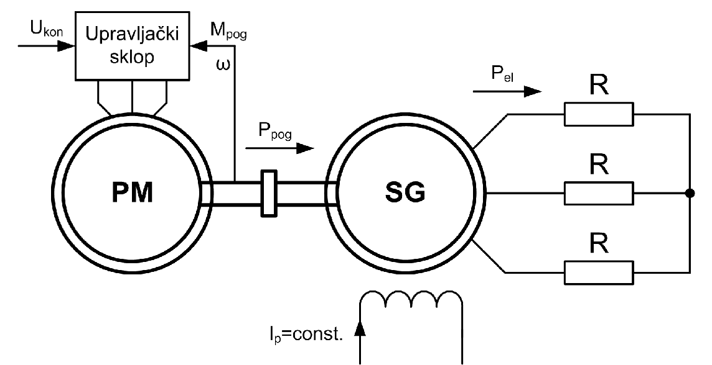
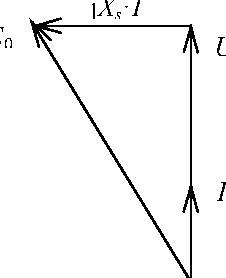

# Zadatak 25 — Sinhroni generator na sopstvenoj mreži: kontrolni napon pogonske mašine i pad napona i frekvencije pri povećanju opterećenja

## Postavka

Trofazni sinhroni generator nazivnih podataka $380\ \mathrm{V}$, sprega zvezda (Y), $50\ \mathrm{Hz}$, $3000\ \mathrm{min^{-1}}$, sinhrone reaktanse $X_s = 1\ \mathrm{\Omega}$, napaja trofazni potrošač koji se sastoji od tri otpornika otpornosti $R = 20\ \mathrm{\Omega}$ spregnuta u zvezdu. Pogonska mašina generatora ima mehaničku karakteristiku

$$M_{\mathrm{pog}} = 7220 \cdot \frac{U_{\mathrm{kon}}}{\omega},$$

gde je $U_{\mathrm{kon}}$ (u voltima) kontrolni (upravljački) napon koji se može podešavati, a $M_{\mathrm{pog}}$ (u njutn-metrima) i $\omega$ (u radijanima u sekundi) moment i ugaona brzina koje razvija pogonska mašina. Odrediti:

a) $U_{\mathrm{kon}}$ kada se potrošač napaja nazivnim naponom i frekvencijom generatora;

b) napon generatora i frekvenciju ako se, polazeći od stanja pod a), otpornost otpornika promeni na vrednost $R_1 = 10\ \mathrm{\Omega}$;

c) šta treba uraditi da bi se pri priključenoj vrednosti otpornika pod b) ponovo imali nazivni napon i frekvencija generatora?

> **Prevod na običan jezik:** Imamo mali "ostrvski" elektroenergetski sistem: jedna pogonska mašina (na primer motor ili turbina) vrti jedan sinhroni generator, a generator napaja jedan jedini potrošač — tri obična otpornika (čisto omsko, "grejačko" opterećenje). Nema velike elektrodistributivne mreže koja bi držala napon i frekvenciju fiksnim — sve što se dešava sa naponom i frekvencijom zavisi isključivo od ravnoteže između snage koju daje pogonska mašina i snage koju troše otpornici. Pogonskoj mašini snagu zadajemo jednim upravljačkim naponom $U_{\mathrm{kon}}$ (kao da okrećemo "gas"). Pitanja su: (a) koliki $U_{\mathrm{kon}}$ treba da bi sistem radio tačno na nazivnih $380\ \mathrm{V}$ i $50\ \mathrm{Hz}$; (b) šta se desi sa naponom i frekvencijom kad potrošač odjednom povuče više snage (otpornost padne sa $20\ \mathrm{\Omega}$ na $10\ \mathrm{\Omega}$), a mi ne pomerimo "gas"; (c) koliko treba "dodati gasa" da se sve vrati na nazivne vrednosti.

## Podaci

| Veličina | Oznaka | Vrednost | Šta ta veličina fizički znači |
|---|---|---|---|
| Nazivni napon generatora (linijski) | $U_{\mathrm{n}}$ | $380\ \mathrm{V}$ | Efektivna vrednost napona između dva priključka (linije) statora; namotaji su spregnuti u zvezdu, pa je napon po fazi $\sqrt{3}$ puta manji. |
| Nazivna frekvencija | $f_{\mathrm{n}}$ | $50\ \mathrm{Hz}$ | Frekvencija naizmeničnog napona koji generator proizvodi kada se vrti nazivnom brzinom. |
| Nazivna brzina obrtanja | $n_{\mathrm{n}}$ | $3000\ \mathrm{min^{-1}}$ | Broj obrtaja rotora u minuti; iz $n = 60 f/p$ sledi da mašina ima $p=1$ par polova (dvopolna mašina, tzv. turbogenerator). |
| Sinhrona reaktansa | $X_s$ | $1\ \mathrm{\Omega}$ | Ukupna "unutrašnja" induktivna reaktansa jedne faze generatora pri $50\ \mathrm{Hz}$; na njoj struja stvara unutrašnji pad napona. |
| Otpornost potrošača (početna) | $R$ | $20\ \mathrm{\Omega}$ po fazi | Tri jednaka otpornika u zvezdi; svaki je priključen na fazni napon generatora. |
| Otpornost potrošača (nova) | $R_1$ | $10\ \mathrm{\Omega}$ po fazi | Manja otpornost = jače opterećenje (potrošač "vuče" više struje i snage). |
| Mehanička karakteristika pogonske mašine | $M_{\mathrm{pog}}$ | $7220 \cdot U_{\mathrm{kon}}/\omega\ \mathrm{Nm}$ | Zakon po kome pogonska mašina razvija moment: zadaješ $U_{\mathrm{kon}}$ u voltima, a moment zavisi i od trenutne ugaone brzine $\omega$ (u $\mathrm{rad/s}$). |

## Šta se traži i zašto

**a) Kontrolni napon $U_{\mathrm{kon}}$ u nazivnom režimu.** Kontrolni napon je "komanda gasa" pogonske mašine — signal kojim operater (ili regulator) zadaje koliko snage pogonska mašina ubacuje u vratilo. Inženjera to zanima jer je to jedina "ručica" kojom u ovom sistemu upravljamo: da bismo držali potrošač na nazivnom naponu i frekvenciji, moramo znati koju vrednost komande da zadamo.

**b) Novi napon $U_1$ i nova frekvencija $f_1$ posle povećanja opterećenja.** Kod generatora na sopstvenoj mreži napon i frekvencija NISU zagarantovani — oni se sami "nameste" tamo gde se snage izbalansiraju. Inženjer mora da zna koliko duboko napon i frekvencija propadnu pri udaru opterećenja: od toga zavisi da li će potrošači uopšte raditi (motori, elektronika i sijalice loše podnose ovakve propade).

**c) Kako vratiti nazivni napon i frekvenciju.** Ovo je suština regulacije ostrvskog sistema: kad se opterećenje trajno poveća, treba povećati snagu pogonske mašine, tj. zadati novu vrednost $U_{\mathrm{kon}}$.

**Plan rešavanja (običnim jezikom):**
1. Izračunamo koliko snage troše otpornici pri nazivnom naponu — tolika mora biti i snaga pogonske mašine (gubitke generatora zanemarujemo).
2. Iz mehaničke karakteristike pokažemo da je snaga pogonske mašine jednaka $7220 \cdot U_{\mathrm{kon}}$, pa pročitamo $U_{\mathrm{kon}}$.
3. Iz prvog (nazivnog) režima izračunamo struju i indukovanu elektromotornu silu $E_0$ — ona nam je "otisak prsta" pobude i trebaće nam u novom režimu.
4. U novom režimu (sa $R_1 = 10\ \mathrm{\Omega}$) snaga pogonske mašine je ostala ista, pa iz bilansa snage dobijamo novu struju $I_1$ i novi napon $U_1$.
5. Iz fazorske jednačine generatora — u kojoj i $E_0$ i $X_s$ moramo skalirati sa frekvencijom — izračunamo novu frekvenciju $f_1$.
6. Za deo c) izračunamo koliku snagu potrošač traži pri nazivnom naponu sa $R_1$ i iz toga novu, veću vrednost $U_{\mathrm{kon}}$.

## Potrebna teorija — mini-lekcije

### 1. Sinhroni generator na sopstvenoj (ostrvskoj, autonomnoj) mreži

Kada je sinhroni generator vezan na veliku ("krutu") elektroenergetsku mrežu, mreža mu nameće i napon i frekvenciju — generator na njih praktično ne može da utiče. Ovde je situacija obrnuta: generator radi na **sopstvenu mrežu** — napaja samo svoj lokalni potrošač i niko spolja mu ništa ne nameće. Tada:

- **frekvenciju** određuje brzina obrtanja rotora ($f = p \cdot n / 60$, gde je $p$ broj pari polova, a $n$ brzina u $\mathrm{min^{-1}}$) — kako se rotor vrti, tolika je frekvencija;
- **napon** određuju zajedno pobuda (indukovana elektromotorna sila), brzina i priključeno opterećenje.

Ravnotežu diktira **bilans snage**: u stacionarnom (ustaljenom) stanju snaga koju pogonska mašina daje preko vratila mora biti jednaka električnoj snazi koju potrošač troši (uz zanemarene gubitke). Ako se te dve snage razlikuju, višak ili manjak snage ide u kinetičku energiju obrtnih masa — rotor ubrzava ili usporava sve dok se snage ponovo ne izjednače.

Sledeća slika prikazuje ceo sistem iz ovog zadatka i vredi je "pročitati" pre računanja: levo je pogonska mašina (PM) kojoj upravljački sklop na osnovu zadatog kontrolnog napona $U_{\mathrm{kon}}$ (i merenja momenta $M_{\mathrm{pog}}$ i brzine $\omega$) određuje rad; ona preko vratila predaje mehaničku snagu $P_{\mathrm{pog}}$ sinhronom generatoru (SG); generator, čija je pobudna struja $I_{\mathrm{p}}$ konstantna (donji namotaj na slici), električnom snagom $P_{\mathrm{el}}$ napaja tri otpornika $R$ spregnuta u zvezdu (desno).

**Slika 25.2 —** Pogonska mašina i sinhroni generator sa sopstvenom mrežom u ovom zadatku.

### 2. Snaga trofaznog omskog potrošača u zvezdi

Kod sprege u zvezdu svaki otpornik $R$ je priključen između jedne linije i zvezdišta, dakle na **fazni napon** $U_{\mathrm{f}} = U/\sqrt{3}$, gde je $U$ linijski (međufazni) napon. Snaga jednog otpornika je $U_{\mathrm{f}}^2/R$ (poznata formula $P = U^2/R$ iz osnova elektrotehnike, primenjena na napon koji stvarno vlada na otporniku), a ukupna snaga tri jednaka otpornika:

$$P_{\mathrm{el}} = 3 \cdot \frac{U_{\mathrm{f}}^2}{R} = 3 \cdot \left(\frac{U}{\sqrt{3}}\right)^2 \cdot \frac{1}{R} = 3 \cdot \frac{U^2}{3} \cdot \frac{1}{R} = \frac{U^2}{R}.$$

Zapamti zgodan međurezultat: kod zvezde je $3 \cdot (U/\sqrt{3})^2 = U^2$, pa ukupna trofazna snaga ispada jednostavno "linijski napon na kvadrat kroz otpornost po fazi".

### 3. Mehanička karakteristika pogonske mašine = zadavanje snage

Mehanička karakteristika pogonske mašine je veza između momenta koji ona razvija i brzine kojom se vrti. Ovde je ona data u neobičnom, ali vrlo poučnom obliku:

$$M_{\mathrm{pog}} = 7220 \cdot \frac{U_{\mathrm{kon}}}{\omega}.$$

Mehanička snaga je uvek proizvod momenta i ugaone brzine, $P = M \cdot \omega$ (to je definicija mehaničke snage obrtnog kretanja — moment "puta" koliko se brzo vrti). Pomnožimo li obe strane karakteristike sa $\omega$:

$$M_{\mathrm{pog}} \cdot \omega = 7220 \cdot U_{\mathrm{kon}} \quad\Rightarrow\quad P_{\mathrm{pog}} = 7220 \cdot U_{\mathrm{kon}}.$$

Brzina $\omega$ se skratila! To znači: **ova pogonska mašina pri zadatom $U_{\mathrm{kon}}$ daje uvek istu snagu, ma kojom brzinom se vrtela.** Kontrolni napon $U_{\mathrm{kon}}$ je, dakle, direktno komanda snage: svaki volt kontrolnog napona znači $7220\ \mathrm{W}$ mehaničke snage na vratilu. (Konstanta $7220$ zato ima jedinicu $\mathrm{W/V}$.) Ovakvo upravljanje po snazi tipično je za savremene regulisane pogone.

### 4. Fazorski dijagram sinhronog generatora pri čisto omskom opterećenju

Jednu fazu sinhronog generatora (uz zanemaren otpor statorskog namotaja) modelujemo kao izvor indukovane elektromotorne sile (EMS) $E_0$ iza sinhrone reaktanse $X_s$. Jednačina naponske ravnoteže po fazi, zapisana fazorski (podvlaka označava fazor — kompleksan broj koji nosi i amplitudu i fazni stav):

$$\underline{E}_0 = \underline{U} + j X_s \cdot \underline{I}.$$

Rečima: unutrašnja EMS se "troši" na napon $\underline{U}$ koji vidi potrošač i na unutrašnji pad napona $j X_s \underline{I}$ na sinhronoj reaktansi. Činilac $j$ znači da taj pad napona prednjači struji za $90^\circ$.

Naš potrošač je čisto omski, pa je struja $\underline{I}$ **u fazi** sa naponom $\underline{U}$ (faktor snage $\cos\varphi = 1$). Tada je pad napona $jX_s\underline{I}$ **normalan** (pod $90^\circ$) na $\underline{U}$, pa fazori $\underline{U}$ i $jX_s\underline{I}$ obrazuju katete pravouglog trougla čija je hipotenuza $\underline{E}_0$. Po Pitagorinoj teoremi:

$$E_0 = \sqrt{U_{\mathrm{f}}^2 + (X_s \cdot I)^2},$$

gde su $E_0$, $U_{\mathrm{f}}$ i $I$ efektivne vrednosti po fazi. Upravo to prikazuje sledeća slika: fazor struje $I$ i fazor napona $U$ leže na istom pravcu (vertikalno), fazor $jX_s \cdot I$ je zarotiran za $90^\circ$ ulevo (horizontalno, na vrhu), a $E_0$ je hipotenuza koja spaja početak sa vrhom — čitaj je kao geometrijski dokaz gornje Pitagorine formule.

**Slika 25.1 —** Fazorski dijagram turbogeneratora pri čisto aktivnom (omskom) opterećenju.

### 5. Zašto i $E_0$ i $X_s$ zavise od frekvencije

Ovo je ključna teorijska poenta dela b), pa je razjasnimo unapred.

**EMS je srazmerna frekvenciji.** Indukovana EMS sinusnog napona je $E_0 = 4{,}44 \cdot f \cdot N \cdot \Phi$ (posledica Faradejevog zakona indukcije: EMS je srazmerna brzini promene fluksa, a fluks se menja $f$ puta u sekundi; $N$ je broj navojaka, $\Phi$ fluks po polu). Pošto je pobudna struja konstantna ($I_{\mathrm{p}} = \mathrm{const.}$ na slici 25.2), fluks $\Phi$ se ne menja, pa je jedina promenljiva frekvencija:

$$E_0' = \frac{f_1}{f_{\mathrm{n}}} \cdot E_0.$$

Ako generator uspori, EMS mu proporcionalno opadne — kao dinama na biciklu: sporije okrećeš, slabije svetlo.

**Reaktansa je srazmerna frekvenciji.** Sinhrona reaktansa je po definiciji $X_s = \omega L_s = 2\pi f L_s$, gde je $L_s$ sinhrona induktivnost (svojstvo namotaja i magnetnog kola — ona se NE menja sa frekvencijom). Zadata vrednost $X_s = 1\ \mathrm{\Omega}$ važi pri $50\ \mathrm{Hz}$; pri nekoj drugoj frekvenciji $f_1$ reaktansa iznosi:

$$X_s' = \frac{f_1}{f_{\mathrm{n}}} \cdot X_s.$$

Dakle, kad frekvencija padne, u fazorskoj jednačini moramo skalirati **i** $E_0$ **i** $X_s$ istim faktorom $f_1/f_{\mathrm{n}}$ — zaboraviti jedno od toga je najčešća greška u ovom tipu zadatka.

### 6. Kako sistem "sklizne" u novo stacionarno stanje

Šta se fizički dogodi kad otpornost potrošača naglo padne sa $20\ \mathrm{\Omega}$ na $10\ \mathrm{\Omega}$, a snaga pogonske mašine ostane ista?

1. Manja otpornost pri (u prvom trenutku još uvek) istom naponu znači veću struju i veću električnu snagu — potrošač odjednom "vuče" više nego što pogonska mašina daje.
2. Manjak snage generator pokriva iz jedinog rezervoara koji ima: **kinetičke energije obrtnih masa**. Rotor počinje da usporava.
3. Usporavanjem padaju i frekvencija ($f = p\, n/60$) i EMS ($E_0 \propto f$), a sa EMS pada i napon na potrošaču — pa pada i električna snaga koju potrošač uzima ($P = U^2/R$).
4. Napon i frekvencija klize naniže sve dok električna snaga ne opadne tačno na nivo (nepromenjene) snage pogonske mašine. Tu se uspostavlja **novo stacionarno stanje** — i upravo to stanje računamo u delu b).

Zaključak koji vredi zapamtiti (i koji potvrđuje i eksperiment): **porast opterećenja autonomnog generatora pri konstantnoj snazi pogonske mašine izaziva pad i napona i frekvencije generatora.**

## Rešenje, korak po korak

### Korak 1: Električna snaga potrošača u nazivnom režimu (deo a)

**Zašto ovaj korak:** Da bismo odredili komandu $U_{\mathrm{kon}}$, prvo moramo znati koliku snagu pogonska mašina treba da isporuči — a to je (uz zanemarene gubitke generatora) tačno snaga koju otpornici troše pri nazivnom naponu.

Opšti oblik (mini-lekcija 2), pa uvrštavanje:

$$P_{\mathrm{el}} = 3 \cdot \left(\frac{U}{\sqrt{3}}\right)^2 \cdot \frac{1}{R} = \frac{U^2}{R} = \frac{(380\ \mathrm{V})^2}{20\ \mathrm{\Omega}} = \frac{144400}{20}\ \mathrm{W} = 7220\ \mathrm{W}.$$

Ovde je $U = 380\ \mathrm{V}$ nazivni linijski napon, a $R = 20\ \mathrm{\Omega}$ otpornost po fazi.

**Šta smo dobili:** Potrošač u nazivnom režimu troši $7220\ \mathrm{W}$ (oko $7{,}2\ \mathrm{kW}$ — red veličine snage manjeg agregata). Primeti da je broj $7220$ isti kao konstanta u mehaničkoj karakteristici — to nije slučajnost, autor zadatka je konstantu tako i izabrao, i upravo zato će rezultati za $U_{\mathrm{kon}}$ ispasti "okrugli".

### Korak 2: Kontrolni napon $U_{\mathrm{kon}}$ u nazivnom režimu (deo a)

**Zašto ovaj korak:** Sada povezujemo potrebnu snagu sa komandom pogonske mašine preko njene mehaničke karakteristike.

Ako zanemarimo gubitke sinhronog generatora, snaga koju mu pogonska mašina predaje preko vratila jednaka je snazi na izlazu generatora (snazi potrošača):

$$P_{\mathrm{pog}} = P_{\mathrm{el}} = 7220\ \mathrm{W}.$$

Iz mehaničke karakteristike (mini-lekcija 3), množenjem obe strane sa $\omega$:

$$M_{\mathrm{pog}} = 7220 \cdot \frac{U_{\mathrm{kon}}}{\omega} \quad\Rightarrow\quad \underbrace{M_{\mathrm{pog}} \cdot \omega}_{P_{\mathrm{pog}}} = 7220 \cdot U_{\mathrm{kon}} \quad\Rightarrow\quad P_{\mathrm{pog}} = 7220 \cdot U_{\mathrm{kon}}.$$

Izjednačimo i rešimo po $U_{\mathrm{kon}}$:

$$7220 \cdot U_{\mathrm{kon}} = 7220\ \mathrm{W} \quad\Rightarrow\quad U_{\mathrm{kon}} = \frac{7220}{7220}\ \mathrm{V} = 1\ \mathrm{V}.$$

**Šta smo dobili:** $U_{\mathrm{kon}} = 1\ \mathrm{V}$ — mala, "signalna" vrednost, što je i logično: to nije energetski napon nego upravljački signal (kao napon na potenciometru gasa); svaki njegov volt "naručuje" $7220\ \mathrm{W}$ snage. Ovim je deo a) rešen.

### Korak 3: Struja generatora u nazivnom režimu (priprema za deo b)

**Zašto ovaj korak:** Za novi režim trebaće nam indukovana EMS $E_0$, a da bismo nju izračunali iz fazorskog dijagrama, prvo moramo znati struju u nazivnom režimu.

Ukupna trofazna snaga je tri puta snaga jedne faze, $P_{\mathrm{el}} = 3 \cdot U_{\mathrm{f}} I \cos\varphi$; zamenom $U_{\mathrm{f}} = U/\sqrt{3}$ dobija se standardni zapis preko linijskog napona: $P_{\mathrm{el}} = 3 \cdot \frac{U}{\sqrt{3}} \cdot I \cos\varphi = \sqrt{3}\, U I \cos\varphi$ (jer je $3/\sqrt{3} = \sqrt{3}$). Kod nas je $\cos\varphi = 1$ (čisto omski potrošač), pa je struja:

$$I = \frac{P_{\mathrm{el}}}{\sqrt{3} \cdot U} = \frac{7220\ \mathrm{W}}{\sqrt{3} \cdot 380\ \mathrm{V}} = \frac{7220}{658{,}2}\ \mathrm{A} = 10{,}97\ \mathrm{A}.$$

Pošto su namotaji statora spregnuti u zvezdu, linijska struja je ujedno i **fazna struja statora** — ista struja teče i kroz namotaj i kroz otpornik.

**Šta smo dobili:** $I = 10{,}97\ \mathrm{A}$. Brza kontrola drugim putem: fazni napon je $380/\sqrt{3} = 219{,}39\ \mathrm{V}$, pa je $I = U_{\mathrm{f}}/R = 219{,}39/20 = 10{,}97\ \mathrm{A}$ — isto, što potvrđuje račun.

### Korak 4: Indukovana EMS $E_0$ iz nazivnog režima (deo b)

**Zašto ovaj korak:** EMS $E_0$ zavisi samo od pobudne struje i brzine. Pobudna struja se ne menja (slika 25.2: $I_{\mathrm{p}} = \mathrm{const.}$), pa je $E_0$ pri nazivnoj brzini "konstanta mašine" koju promena potrošača ne dira — izračunamo je iz poznatog (nazivnog) režima i ponesemo u novi režim.

Prema fazorskom dijagramu sa slike 25.1 i Pitagorinoj formuli iz mini-lekcije 4 (napon i struja po fazi, čisto omsko opterećenje):

$$E_0 = \sqrt{U_{\mathrm{f}}^2 + (X_s \cdot I)^2} = \sqrt{\left(\frac{380}{\sqrt{3}}\right)^2 + (1 \cdot 10{,}97)^2}\ \mathrm{V}.$$

Računamo deo po deo: $380/\sqrt{3} = 219{,}39\ \mathrm{V}$, pa je $219{,}39^2 = 48133{,}3$; dalje $X_s I = 1\ \mathrm{\Omega} \cdot 10{,}97\ \mathrm{A} = 10{,}97\ \mathrm{V}$, pa je $10{,}97^2 = 120{,}3$. Sabiranjem:

$$E_0 = \sqrt{48133{,}3 + 120{,}3}\ \mathrm{V} = \sqrt{48253{,}6}\ \mathrm{V} = 219{,}67\ \mathrm{V}.$$

**Šta smo dobili:** $E_0 = 219{,}67\ \mathrm{V}$ po fazi — jedva $0{,}3\ \mathrm{V}$ iznad faznog napona $219{,}39\ \mathrm{V}$. To je očekivano: pad $X_s I = 10{,}97\ \mathrm{V}$ je mali i, što je važnije, sabira se sa naponom **pod pravim uglom** (Pitagora!), pa hipotenuza jedva poraste u odnosu na dužu katetu.

### Korak 5: Nova struja $I_1$ iz bilansa snage (deo b)

**Zašto ovaj korak:** U novom stacionarnom stanju (mini-lekcija 6) električna snaga mora ponovo biti jednaka snazi pogonske mašine, koja je ostala nepromenjena jer nismo dirali komandu ($U_{\mathrm{kon}} = \mathrm{const.} = 1\ \mathrm{V}$, dakle $P_{\mathrm{pog}} = 7220\ \mathrm{W}$). Napon u novom režimu još ne znamo, ali snagu potrošača možemo izraziti i preko struje.

Snaga tri otpornika kroz koje teče struja $I_1$ iznosi (formula $P = R I^2$ po otporniku, puta tri otpornika):

$$P_{\mathrm{el1}} = 3 \cdot R_1 \cdot I_1^2 = 7220\ \mathrm{W}.$$

Rešimo po $I_1$: prvo podelimo obe strane sa $3 R_1$,

$$I_1^2 = \frac{P_{\mathrm{el1}}}{3 \cdot R_1} = \frac{7220}{3 \cdot 10} = \frac{7220}{30} = 240{,}67\ \mathrm{A^2},$$

pa korenujemo:

$$I_1 = \sqrt{240{,}67}\ \mathrm{A} = 15{,}51\ \mathrm{A}.$$

**Šta smo dobili:** Struja je porasla sa $10{,}97\ \mathrm{A}$ na $15{,}51\ \mathrm{A}$ (tačno $\sqrt{2}$ puta — jer je pri istoj snazi otpornost prepolovljena, a $I = \sqrt{P/3R}$). Veća struja pri manjoj otpornosti je očekivana.

### Korak 6: Novi napon generatora $U_1$ (deo b)

**Zašto ovaj korak:** Kad znamo struju kroz otpornik, napon na njemu daje Omov zakon — a napon na otporniku u zvezdi je upravo fazni napon generatora.

$$U_1 = R_1 \cdot I_1 = 10\ \mathrm{\Omega} \cdot 15{,}51\ \mathrm{A} = 155{,}1\ \mathrm{V}.$$

**Šta smo dobili:** Fazni napon generatora je pao sa $219{,}39\ \mathrm{V}$ na $155{,}1\ \mathrm{V}$ — na oko $71\%$ nazivne vrednosti (tačnije na $1/\sqrt{2}$, jer je pri konstantnoj snazi $U = \sqrt{P R/3}$, a $R$ je prepolovljeno). Izraženo linijski, to je $\sqrt{3} \cdot 155{,}1 = 268{,}6\ \mathrm{V}$ umesto nazivnih $380\ \mathrm{V}$ — ozbiljan propad napona. (Zbirka rezultat iskazuje po fazi: $U_1 = 155{,}1\ \mathrm{V}$.)

### Korak 7: Nova frekvencija $f_1$ iz fazorskog dijagrama sa skaliranim $E_0$ i $X_s$ (deo b)

**Zašto ovaj korak:** Napon smo našli, ali frekvenciju još ne znamo. Nju "izvlačimo" iz fazorske jednačine novog režima — pazeći da su i EMS i reaktansa sada srazmerne novoj frekvenciji (mini-lekcija 5).

Novi režim je i dalje čisto omski (potrošač su opet samo otpornici), pa fazorski dijagram i dalje izgleda kao na slici 25.1 i Pitagorina formula i dalje važi — samo sa novim vrednostima. EMS u novom režimu je $\dfrac{f_1}{f_{\mathrm{n}}} E_0$, a reaktansa $\dfrac{f_1}{f_{\mathrm{n}}} X_s$, pa jednačina glasi:

$$\frac{f_1}{f_{\mathrm{n}}} \cdot E_0 = \sqrt{U_1^2 + \left(\frac{f_1}{f_{\mathrm{n}}} \cdot X_s \cdot I_1\right)^2}.$$

Sa brojevima (sve po fazi): $\dfrac{f_1}{50} \cdot 219{,}67 = \sqrt{155{,}1^2 + \left(\dfrac{f_1}{50} \cdot 1 \cdot 15{,}51\right)^2}$.

Rešimo jednačinu po $f_1$, korak po korak. Uvedimo radi kratkoće $k = f_1/f_{\mathrm{n}}$ (nepoznati odnos frekvencija) i kvadrirajmo obe strane da se oslobodimo korena:

$$k^2 \cdot E_0^2 = U_1^2 + k^2 \cdot (X_s I_1)^2.$$

Prebacimo član sa $k^2$ sa desne strane na levu i izvučemo $k^2$ ispred zagrade:

$$k^2 \cdot \left(E_0^2 - (X_s I_1)^2\right) = U_1^2 \quad\Rightarrow\quad k = \frac{U_1}{\sqrt{E_0^2 - (X_s I_1)^2}}.$$

Vratimo $k = f_1/f_{\mathrm{n}}$ i pomnožimo sa $f_{\mathrm{n}}$:

$$f_1 = \frac{U_1}{\sqrt{E_0^2 - (X_s I_1)^2}} \cdot f_{\mathrm{n}} = \frac{155{,}1}{\sqrt{219{,}67^2 - 15{,}51^2}} \cdot 50\ \mathrm{Hz}.$$

Brojno: $219{,}67^2 = 48254{,}9$ i $15{,}51^2 = 240{,}6$, pa je razlika $48254{,}9 - 240{,}6 = 48014{,}3$ i njen koren $\sqrt{48014{,}3} = 219{,}12$:

$$f_1 = \frac{155{,}1}{219{,}12} \cdot 50\ \mathrm{Hz} = 0{,}7078 \cdot 50\ \mathrm{Hz} = 35{,}4\ \mathrm{Hz}.$$

**Šta smo dobili:** Frekvencija je pala sa $50\ \mathrm{Hz}$ na $35{,}4\ \mathrm{Hz}$ — generator se sada vrti sa svega $n_1 = 60 f_1/p = 60 \cdot 35{,}4 \approx 2124\ \mathrm{min^{-1}}$ umesto $3000\ \mathrm{min^{-1}}$. Dobijeni rezultati su u skladu sa eksperimentom: porast opterećenja autonomnog generatora pri konstantnoj snazi pogonske mašine ima za posledicu pad i napona i frekvencije generatora. Ovim je deo b) rešen: $U_1 = 155{,}1\ \mathrm{V}$ (po fazi) i $f_1 = 35{,}4\ \mathrm{Hz}$.

### Korak 8: Povratak na nazivni napon i frekvenciju — novi $U_{\mathrm{kon}}$ (deo c)

**Zašto ovaj korak:** Napon i frekvencija su propali zato što pogonska mašina daje premalo snage za novo, jače opterećenje. Lek je očigledan iz mini-lekcije 6: treba **povećati snagu pogonske mašine**, tj. zadati veću komandu $U_{\mathrm{kon}}$. Izračunajmo koliku.

Pri nazivnom naponu $380\ \mathrm{V}$ potrošač otpornosti $R_1 = 10\ \mathrm{\Omega}$ po fazi troši (ista formula kao u Koraku 1, samo sa $R_1$):

$$P_{\mathrm{el1}} = 3 \cdot \left(\frac{U}{\sqrt{3}}\right)^2 \cdot \frac{1}{R_1} = \frac{U^2}{R_1} = \frac{380^2}{10}\ \mathrm{W} = \frac{144400}{10}\ \mathrm{W} = 14440\ \mathrm{W}.$$

Toliku snagu mora dati pogonska mašina, pa iz $P_{\mathrm{pog}} = 7220 \cdot U_{\mathrm{kon}}$ sledi:

$$U_{\mathrm{kon}} = \frac{P_{\mathrm{el1}}}{7220} = \frac{14440}{7220}\ \mathrm{V} = 2\ \mathrm{V}.$$

**Šta smo dobili:** Treba povećati kontrolni napon sa $1\ \mathrm{V}$ na $U_{\mathrm{kon}} = 2\ \mathrm{V}$ — duplo opterećenje traži duplo veću snagu, dakle duplo veću komandu. Važno je razumeti i zašto se time **i frekvencija** vraća na nazivnu vrednost: zbog oblika mehaničke karakteristike pogonska mašina sa $U_{\mathrm{kon}} = 2\ \mathrm{V}$ daje $14440\ \mathrm{W}$ pri **bilo kojoj** brzini, pa dok god potrošač (pri trenutno nižem naponu i frekvenciji) troši manje od toga, višak snage ubrzava rotor; ubrzavanjem rastu frekvencija, EMS i napon — a sistem se smiri tačno tamo gde potrošač troši $14440\ \mathrm{W}$, tj. na $380\ \mathrm{V}$ i $50\ \mathrm{Hz}$. Ovim je deo c) rešen.

## Česte greške i zamke

1. **Mešanje linijskog i faznog napona.** Nazivnih $380\ \mathrm{V}$ je linijski napon; u fazorskom dijagramu (Korak 4) figuriše fazni napon $380/\sqrt{3} = 219{,}39\ \mathrm{V}$, i rezultati $E_0 = 219{,}67\ \mathrm{V}$ i $U_1 = 155{,}1\ \mathrm{V}$ su fazne vrednosti. Ko u Pitagorinu formulu ubaci $380\ \mathrm{V}$, dobiće $E_0 \approx 380\ \mathrm{V}$ i sve dalje pogrešno.
2. **Zaboravljanje da $X_s$ zavisi od frekvencije.** U jednačini novog režima (Korak 7) mnogi skaliraju samo EMS ($\frac{f_1}{f_{\mathrm{n}}}E_0$), a reaktansu ostave $1\ \mathrm{\Omega}$. Reaktansa je $2\pi f L_s$ — i ona pada sa frekvencijom! (Ovde je numerička razlika mala jer je $X_s I_1$ mali prema $E_0$, ali je koncepcijski gruba greška i u drugim zadacima skupo košta.)
3. **Pretpostavka da napon ostaje $380\ \mathrm{V}$ posle promene otpornika.** Na sopstvenoj mreži niko ne "drži" napon: račun $I_1 = 380/(\sqrt{3} \cdot 10) = 21{,}9\ \mathrm{A}$ je pogrešan jer prećutno pretpostavlja krutu mrežu. Ispravan put ide preko bilansa snage (Korak 5), jer je jedino snaga pogonske mašine ostala nepromenjena.
4. **Tumačenje $U_{\mathrm{kon}}$ kao energetskog napona.** Kontrolni napon nije napon generatora niti bilo koji napon u glavnom strujnom kolu — to je upravljački signal ("gas"), pa vrednosti od $1\ \mathrm{V}$ i $2\ \mathrm{V}$ nisu ni čudne ni male.
5. **Traženje $E_0$ u novom režimu ni iz čega.** EMS se mora izračunati iz **poznatog** (prvog) režima, pa tek onda skalirati sa $f_1/f_{\mathrm{n}}$ — jer pri konstantnoj pobudi i datoj brzini ona ostaje ista bez obzira na potrošač.

## Rezime rezultata

| Veličina | Oznaka | Vrednost |
|---|---|---|
| a) Kontrolni napon za nazivni režim | $U_{\mathrm{kon}}$ | $1\ \mathrm{V}$ |
| Snaga potrošača u nazivnom režimu (međurezultat) | $P_{\mathrm{el}}$ | $7220\ \mathrm{W}$ |
| Struja u nazivnom režimu (međurezultat) | $I$ | $10{,}97\ \mathrm{A}$ |
| Indukovana EMS po fazi pri $50\ \mathrm{Hz}$ (međurezultat) | $E_0$ | $219{,}67\ \mathrm{V}$ |
| b) Struja u novom režimu (međurezultat) | $I_1$ | $15{,}51\ \mathrm{A}$ |
| b) Napon generatora u novom režimu (po fazi) | $U_1$ | $155{,}1\ \mathrm{V}$ |
| b) Frekvencija u novom režimu | $f_1$ | $35{,}4\ \mathrm{Hz}$ |
| c) Potrebna snaga za nazivni režim sa $R_1$ (međurezultat) | $P_{\mathrm{el1}}$ | $14440\ \mathrm{W}$ |
| c) Novi kontrolni napon | $U_{\mathrm{kon}}$ | $2\ \mathrm{V}$ |

## Provera smisla

**1. Dimenziona provera Koraka 5:** $\dfrac{P}{3R}$ ima jedinicu $\dfrac{\mathrm{W}}{\mathrm{\Omega}} = \dfrac{\mathrm{V \cdot A}}{\mathrm{V/A}} = \mathrm{A^2}$, pa koren zaista daje ampere. ✓

**2. Provera preko zakona $U \propto \sqrt{R}$ pri konstantnoj snazi:** iz $P = 3U_{\mathrm{f}}^2/R = \mathrm{const.}$ sledi $U_{\mathrm{f}} = \sqrt{P R/3}$, pa prepolovljenje otpornosti smanjuje napon tačno $\sqrt{2}$ puta: $219{,}39/\sqrt{2} = 155{,}1\ \mathrm{V}$ — baš naš $U_1$. ✓

**3. Granični slučaj $X_s \to 0$:** tada bi bilo $E_0 = U_{\mathrm{f}}$ i formula iz Koraka 7 bi dala $f_1 = (U_1/E_0) \cdot 50 = (155{,}1/219{,}39) \cdot 50 = 35{,}35\ \mathrm{Hz}$. Naš rezultat $35{,}4\ \mathrm{Hz}$ je tik iznad toga, što je logično: mala reaktansa ($X_s I_1 = 15{,}5\ \mathrm{V}$ prema $E_0 \approx 220\ \mathrm{V}$) samo neznatno pomera rezultat. ✓

**4. Bilans snage u novom režimu:** $3 R_1 I_1^2 = 3 \cdot 10 \cdot 15{,}51^2 = 7217\ \mathrm{W} \approx 7220\ \mathrm{W}$ (razlika je samo od zaokruživanja struje) — električna snaga se zaista poklapa sa nepromenjenom snagom pogonske mašine. ✓
