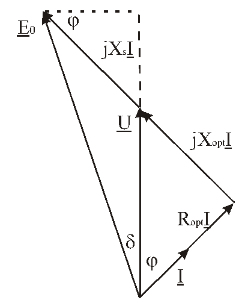
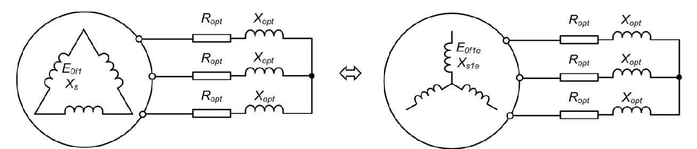

# Zadatak 26 — EMS praznog hoda, ugao opterećenja i snage turbogeneratora na pasivnoj mreži; prevezivanje statora iz zvezde u trougao

## Postavka

Sinhroni generator sa cilindričnim rotorom (turbogenerator) ima nazivne podatke: prividna snaga $1{,}5\ \mathrm{MVA}$, napon $6{,}6\ \mathrm{kV}$, sprega statorskog namotaja zvezda (Y), učestanost $50\ \mathrm{Hz}$, broj pari polova $p = 2$, sinhrona reaktansa $X_{\mathrm{s}} = 200\ \%$. Svi gubici snage mogu se zanemariti, a magnetno kolo se smatra linearnim. Generator radi na pasivnoj (sopstvenoj) mreži. Brzina obrtanja održava se na konstantnoj, nominalnoj vrednosti.

Potrebno je odrediti:

**a)** elektromotornu silu praznog hoda, takvu da linijski napon generatora bude $6\ \mathrm{kV}$ pri linijskoj struji $120\ \mathrm{A}$ uz induktivni faktor snage $0{,}8$; odrediti i aktivnu i reaktivnu snagu, kao i ugao opterećenja u tom režimu;

**b)** ako se struja pobude ne menja, a statorski namotaj generatora se preveže u spregu trougao — odrediti napon generatora, ugao opterećenja, aktivnu i reaktivnu snagu u novom režimu.

> **Prevod na običan jezik:** Imamo generator koji ne radi na velikoj („krutoj") elektroenergetskoj mreži, nego **sâm** napaja jednu grupu potrošača — on je jedini izvor, pa napon na potrošaču zavisi isključivo od njega. U delu a) pitamo se: koliku unutrašnju elektromotornu silu (dakle, koliku pobudu) generator mora da ima da bi na svojim krajevima držao 6 kV dok kroz vodove teče 120 A pri cos φ = 0,8? Usput računamo koliku aktivnu i reaktivnu snagu tada isporučuje i koliki mu je ugao opterećenja. U delu b) izvodimo mali „eksperiment": ništa ne diramo na pobudi ni na turbini, samo statorske namotaje prevežemo iz zvezde u trougao i priključimo na **isti** potrošač. Pitanje je: koliki će sada biti napon, struje, ugao opterećenja i snage?

## Podaci

| Veličina | Oznaka | Vrednost | Šta ta veličina fizički znači |
|---|---|---|---|
| Nazivna prividna snaga | $S_{\mathrm{n}}$ | $1{,}5\ \mathrm{MVA}$ | Najveća trajna „ukupna" snaga (aktivna + reaktivna zajedno) za koju je mašina projektovana. |
| Nazivni (linijski) napon | $U_{\mathrm{n}}$ | $6{,}6\ \mathrm{kV}$ | Napon između dva priključka mašine pri nazivnom režimu, za spregu Y. |
| Sprega statora | Y | zvezda | Krajevi sve tri faze spojeni u jednu (zvezdišnu) tačku; u delu b) prevezuje se u trougao. |
| Učestanost | $f$ | $50\ \mathrm{Hz}$ | Učestanost indukovanih napona; drži je konstantnom pogonska mašina konstantnom brzinom. |
| Broj pari polova | $p$ | $2$ | Koliko puta se magnetni „sever–jug" par ponavlja po obimu; određuje sinhronu brzinu $n_{\mathrm{s}} = 60 f / p = 1500\ \mathrm{o/min}$. |
| Sinhrona reaktansa (procentualna) | $X_{\mathrm{s}}[\%]$ | $200\ \%$ | Unutrašnja reaktansa mašine izražena u procentima bazne impedanse (objašnjeno u teoriji). |
| Linijski napon u režimu a) | $U_{\mathrm{L}}$ | $6\ \mathrm{kV}$ | Napon koji generator treba da drži na svojim krajevima (malo ispod nazivnog). |
| Linijska struja u režimu a) | $I_{\mathrm{L}}$ | $120\ \mathrm{A}$ | Struja koja teče kroz svaki od tri voda ka potrošaču. |
| Faktor snage potrošača | $\cos\varphi$ | $0{,}8$ ind. | Potrošač je delom omski, delom induktivan; „ind." znači da struja **kasni** za naponom. |

Uz podatke idu i tri pretpostavke iz postavke, koje bitno pojednostavljuju račun:

- **gubici se zanemaruju** — pa u modelu nema otpora statorskog namotaja ($R_{\mathrm{s}} \approx 0$);
- **magnetno kolo je linearno** — pa je elektromotorna sila srazmerna pobudnoj struji (nema zasićenja); zato „ista pobudna struja" u delu b) automatski znači „ista elektromotorna sila po namotaju";
- **brzina je konstantna i nominalna** — pa je učestanost stalno $50\ \mathrm{Hz}$, i elektromotorna sila se ne menja ni zbog brzine.

## Šta se traži i zašto

**1) Elektromotorna sila praznog hoda $E_0$ (deo a).** To je unutrašnji napon koji mašina proizvodi zahvaljujući pobudi, pre bilo kakvog pada napona na sopstvenoj reaktansi. Inženjera zanima jer je $E_0$ direktna mera **potrebne pobudne struje**: kad znamo koliki $E_0$ treba, znamo kako da podesimo pobudni sistem da bi potrošač dobio traženih 6 kV.

**2) Ugao opterećenja $\delta$ (delovi a i b).** To je ugao između elektromotorne sile $E_0$ i napona na krajevima $U$. On pokazuje koliko je mašina „uvijena" — koliko je magnetno kolo rotora odmaklo ispred rezultantnog polja — i osnovna je mera opterećenosti i statičke stabilnosti sinhrone mašine.

**3) Aktivna i reaktivna snaga $P$ i $Q$ (delovi a i b).** Aktivna snaga je ono što potrošač zaista „troši" (pretvara u rad, toplotu, svetlost), reaktivna je snaga koja osciluje između izvora i induktivnosti potrošača. Njihov bilans govori koliko je generator opterećen u odnosu na nazivnu snagu.

**4) Napon, struje i snage posle prevezivanja u trougao (deo b).** Prevezivanje sprege menja kako se ista tri namotaja „vide" spolja — pitanje je vrlo praktično: šta se desi sa potrošačem ako operater preveže statorski namotaj, a ne promeni ni pobudu ni brzinu?

**Plan rešavanja:**

1. Iz procentualne vrednosti izračunamo sinhronu reaktansu $X_{\mathrm{s}}$ u omima.
2. Za spregu Y pređemo na fazne veličine, nacrtamo fazorski dijagram i iz njegovih projekcija dobijemo ugao $\delta$, pa elektromotornu silu $E_0$.
3. Iz linijskih vrednosti izračunamo $P$ i $Q$.
4. Potrošač („pasivnu mrežu") opišemo njegovim parametrima po fazi: otpornošću $R_{\mathrm{opt}}$ i reaktansom $X_{\mathrm{opt}}$.
5. Generator u trouglu zamenimo **ekvivalentnom zvezdom** (elektromotorna sila $\sqrt{3}$ puta manja, reaktansa 3 puta manja) i rešimo prosto redno kolo po fazi.
6. Rezultate ekvivalentnog kola pažljivo „prevedemo" nazad na stvarne linijske veličine i izračunamo nove snage.

## Potrebna teorija — mini-lekcije

### Mini-lekcija 1: Sinhroni generator sa cilindričnim rotorom i EMS praznog hoda

Sinhroni generator radi ovako: kroz namotaj na **rotoru** protiče jednosmerna **pobudna struja** $I_{\mathrm{p}}$ i stvara magnetni fluks $\Phi$. Pogonska mašina (turbina) obrće rotor brzinom $n$, pa se taj fluks obrće zajedno sa njim i **indukuje naizmenične napone** u tri statorska namotaja (Faradejev zakon: promenljiv fluks kroz navojke indukuje napon). Efektivna vrednost tog indukovanog napona po jednom namotaju zove se **elektromotorna sila praznog hoda** $E_0$ i, u opštem obliku,

$$E_0 = k \cdot f \cdot \Phi,$$

gde je $k$ konstrukciona konstanta namotaja (broj navojaka i navojni sačinioci), $f$ učestanost (srazmerna brzini obrtanja), a $\Phi$ fluks pobude. Ime „praznog hoda" dolazi otuda što se upravo taj napon vidi na krajevima mašine kada je neopterećena (u „praznom hodu" nema struje statora, pa nema ni unutrašnjih padova napona).

Dve posledice bitne za ovaj zadatak:

- pošto je magnetno kolo **linearno**, važi $\Phi \propto I_{\mathrm{p}}$, pa je $E_0 \propto I_{\mathrm{p}} \cdot n$; ako se ne menjaju ni pobudna struja ni brzina (slučaj u delu b), **$E_0$ po namotaju ostaje ista** — ma kako namotaje prevezali;
- **cilindričan rotor** znači ravnomeran vazdušni zazor po celom obimu, pa se mašina opisuje **jednom jedinom** sinhronom reaktansom $X_{\mathrm{s}}$ (nema razlike podužne i poprečne ose kao kod mašina sa isturenim polovima).

### Mini-lekcija 2: Model mašine — EMS iza sinhrone reaktanse; procentualna reaktansa

Kada je generator opterećen, kroz statorske namotaje teče struja koja i sama stvara magnetno polje (tzv. reakcija indukta) i delom se rasipa. Oba efekta se u modelu sabiraju u jednu **sinhronu reaktansu** $X_{\mathrm{s}}$, pa se svaka faza mašine ponaša kao **idealan izvor $E_0$ vezán na red sa reaktansom $X_{\mathrm{s}}$** (otpor namotaja je po postavci zanemaren). Jednačina naponske ravnoteže po fazi, u fazorskom (kompleksnom) obliku, glasi:

$$\underline{E}_{0\mathrm{f}} = \underline{U}_{\mathrm{f}} + j\,X_{\mathrm{s}}\,\underline{I}_{\mathrm{f}}$$

- $\underline{E}_{0\mathrm{f}}$ — fazor elektromotorne sile praznog hoda po fazi (unutrašnji izvor);
- $\underline{U}_{\mathrm{f}}$ — fazor faznog napona na krajevima mašine;
- $\underline{I}_{\mathrm{f}}$ — fazor fazne struje;
- $j\,X_{\mathrm{s}}\,\underline{I}_{\mathrm{f}}$ — pad napona na sinhronoj reaktansi; činilac $j$ znači da taj pad **prednjači struji za** $90^\circ$ (osobina svake induktivnosti).

**Procentualna (relativna) reaktansa.** U katalozima se $X_{\mathrm{s}}$ ne daje u omima, nego u procentima **bazne impedanse** mašine $Z_{\mathrm{b}}$. Bazna impedansa je impedansa izračunata iz nazivnih podataka: količnik nazivnog faznog napona i nazivne fazne struje. Izvedimo zgodan oblik preko linijskih (natpisnih) podataka: za spregu Y je $U_{\mathrm{nf}} = U_{\mathrm{n}}/\sqrt{3}$ i $I_{\mathrm{nf}} = I_{\mathrm{n}} = S_{\mathrm{n}}/(\sqrt{3}\,U_{\mathrm{n}})$, pa je

$$Z_{\mathrm{b}} = \frac{U_{\mathrm{nf}}}{I_{\mathrm{nf}}} = \frac{U_{\mathrm{n}}/\sqrt{3}}{S_{\mathrm{n}}/(\sqrt{3}\,U_{\mathrm{n}})} = \frac{U_{\mathrm{n}}^2}{S_{\mathrm{n}}}.$$

Odatle:

$$X_{\mathrm{s}} = \frac{X_{\mathrm{s}}[\%]}{100} \cdot Z_{\mathrm{b}} = \frac{X_{\mathrm{s}}[\%]}{100} \cdot \frac{U_{\mathrm{n}}^2}{S_{\mathrm{n}}}.$$

Podatak $X_{\mathrm{s}} = 200\ \%$ znači: sinhrona reaktansa je **dvostruko veća** od bazne impedanse — tipično velika vrednost za turbogeneratore, kod kojih je reakcija indukta jaka.

### Mini-lekcija 3: Sprega zvezda i sprega trougao — fazne i linijske veličine

Trofazni namotaj ima tri „fazna" namotaja; njih možemo spojiti na dva načina, a spolja uvek vidimo tri priključka (voda):

- **Zvezda (Y):** po jedan kraj svakog namotaja spojen je u zajedničku tačku (zvezdište). Struja voda ulazi pravo u namotaj, a napon između dva voda je razlika dva fazna napona pomerena za $120^\circ$:
$$I_{\mathrm{L}} = I_{\mathrm{f}}, \qquad U_{\mathrm{L}} = \sqrt{3}\,U_{\mathrm{f}}.$$
- **Trougao (D):** namotaji su vezani „u krug", svaki namotaj stoji direktno **između dva voda**. Sada je napon namotaja jednak linijskom, a struja voda je razlika struja dva namotaja:
$$U_{\mathrm{L}} = U_{\mathrm{f}}, \qquad I_{\mathrm{L}} = \sqrt{3}\,I_{\mathrm{f}}.$$

(Odakle $\sqrt{3}$? Dva fazora jednakih dužina pomerena za $120^\circ$ pri oduzimanju daju fazor $\sqrt{3}$ puta duži — to je čista geometrija jednakostraničnog trougla fazora.) Prividna snaga je u obe sprege ista formula:

$$S = 3\,U_{\mathrm{f}} I_{\mathrm{f}} = \sqrt{3}\,U_{\mathrm{L}} I_{\mathrm{L}}.$$

### Mini-lekcija 4: Pasivna (sopstvena) mreža i njen model

**Kruta mreža** je ogroman elektroenergetski sistem koji sâm nameće napon i učestanost — pojedinačni generator na njih ne utiče. **Pasivna (sopstvena) mreža** je suprotan slučaj: generator napaja izolovanu grupu potrošača i **jedini** je izvor. Tada:

- učestanost diktira brzina pogonske mašine (ovde: regulisana na konstantnu vrednost);
- napon na potrošaču nije nametnut spolja, već se **sam uspostavi** iz ravnoteže kola: izvor $E_0$, unutrašnja reaktansa $X_{\mathrm{s}}$ i impedansa potrošača dele napon među sobom.

Potrošač sa konstantnim parametrima modelujemo po fazi kao **rednu vezu otpornosti $R_{\mathrm{opt}}$ i induktivne reaktanse $X_{\mathrm{opt}}$** (indeks „opt" = opterećenje). Te parametre nalazimo iz snaga koje potrošač vuče: aktivna snaga se sva razvija na otpornosti, reaktivna sva na reaktansi, a kroz obe teče ista fazna struja $I_{\mathrm{f}}$, pa je (za sve tri faze zajedno):

$$P = 3\,R_{\mathrm{opt}} I_{\mathrm{f}}^2 \;\Rightarrow\; R_{\mathrm{opt}} = \frac{P}{3 I_{\mathrm{f}}^2}, \qquad Q = 3\,X_{\mathrm{opt}} I_{\mathrm{f}}^2 \;\Rightarrow\; X_{\mathrm{opt}} = \frac{Q}{3 I_{\mathrm{f}}^2}.$$

Brza kontrola koju uvek vredi uraditi: mora biti $X_{\mathrm{opt}}/R_{\mathrm{opt}} = \tan\varphi$ i $\sqrt{R_{\mathrm{opt}}^2 + X_{\mathrm{opt}}^2} = U_{\mathrm{f}}/I_{\mathrm{f}}$, jer je to jedna te ista impedansa potrošača, samo rastavljena na komponente.

### Mini-lekcija 5: Fazorski dijagram i ugao opterećenja δ

Jednačina $\underline{E}_{0\mathrm{f}} = \underline{U}_{\mathrm{f}} + j X_{\mathrm{s}} \underline{I}_{\mathrm{f}}$ najlakše se „vidi" na fazorskom dijagramu — crtežu na kome su naizmenične veličine predstavljene vektorima (fazorima) čije dužine odgovaraju efektivnim vrednostima, a uglovi faznim pomacima. **Ugao opterećenja $\delta$** je ugao između $\underline{E}_{0\mathrm{f}}$ i $\underline{U}_{\mathrm{f}}$. Kod generatora $\underline{E}_{0\mathrm{f}}$ **prednjači** naponu ($\delta > 0$) — rotor „vuče" napred i predaje aktivnu snagu.

Ključni trik ovog zadatka: postavimo $\underline{U}_{\mathrm{f}}$ na realnu osu. Struja kasni za naponom za ugao $\varphi$ (induktivan potrošač), pa je $\underline{I}_{\mathrm{f}} = I_{\mathrm{f}}(\cos\varphi - j\sin\varphi)$. Pad napona na reaktansi je tada

$$j X_{\mathrm{s}} \underline{I}_{\mathrm{f}} = j X_{\mathrm{s}} I_{\mathrm{f}}(\cos\varphi - j\sin\varphi) = X_{\mathrm{s}} I_{\mathrm{f}}\sin\varphi + j\,X_{\mathrm{s}} I_{\mathrm{f}}\cos\varphi ,$$

(iskoristili smo $j\cdot(-j) = 1$), pa jednačina ravnoteže, razdvojena na realni i imaginarni deo, glasi:

$$\underline{E}_{0\mathrm{f}} = \underbrace{\left(U_{\mathrm{f}} + X_{\mathrm{s}} I_{\mathrm{f}} \sin\varphi\right)}_{\text{realni deo} \;=\; E_{0\mathrm{f}}\cos\delta} + j\,\underbrace{X_{\mathrm{s}} I_{\mathrm{f}} \cos\varphi}_{\text{imaginarni deo} \;=\; E_{0\mathrm{f}}\sin\delta}.$$

Time smo dobili dve skalarne **projekcijske jednačine** (projekcije fazora $\underline{E}_{0\mathrm{f}}$ na pravac napona i na pravac normalan na napon):

$$E_{0\mathrm{f}} \sin\delta = X_{\mathrm{s}} I_{\mathrm{f}} \cos\varphi \qquad (1)$$
$$E_{0\mathrm{f}} \cos\delta = U_{\mathrm{f}} + X_{\mathrm{s}} I_{\mathrm{f}} \sin\varphi \qquad (2)$$

Deljenjem (1)/(2) simbol $E_{0\mathrm{f}}$ ispada i ostaje čist izraz za $\tan\delta$ — zato se ugao $\delta$ uvek računa **prvi**, a tek onda $E_{0\mathrm{f}}$ iz jednačine (1).

Ista tehnika projektovanja radi i sa drugim „referentnim pravcem". Ako je izvor $E$ vezan na red sa ukupnom reaktansom $X_{\mathrm{uk}}$ i otpornošću $R$, a projekcije pravimo na pravac **struje** (i normalu na nju), dobijamo:

$$E \cos(\varphi + \delta) = R\,I, \qquad E \sin(\varphi + \delta) = X_{\mathrm{uk}}\,I,$$

jer $\underline{E}$ prednjači struji za zbir uglova $\varphi + \delta$ ($\varphi$ od struje do napona, pa još $\delta$ od napona do $\underline{E}$). Ovaj oblik će nam trebati u delu b).

### Mini-lekcija 6: Aktivna i reaktivna snaga; ko kome „daje" reaktivnu snagu

Trofazne snage računamo iz linijskih ili faznih veličina (obe formule daju isto, v. mini-lekciju 3):

$$P = \sqrt{3}\,U_{\mathrm{L}} I_{\mathrm{L}} \cos\varphi = 3\,U_{\mathrm{f}} I_{\mathrm{f}} \cos\varphi, \qquad Q = \sqrt{3}\,U_{\mathrm{L}} I_{\mathrm{L}} \sin\varphi = 3\,U_{\mathrm{f}} I_{\mathrm{f}} \sin\varphi .$$

- $P$ (W, MW) — aktivna snaga: stvarni rad u jedinici vremena; nju obezbeđuje turbina preko vratila.
- $Q$ (VAr, MVAr) — reaktivna snaga: snaga koja se preliva tamo-amo između izvora i magnetnih polja induktivnog potrošača; ne troši gorivo, ali zauzima struju i napon.

Induktivan potrošač ($\cos\varphi = 0{,}8$ ind.) **troši** reaktivnu snagu, a generator koji je pokriva mora biti **nadpobuđen**: njegova elektromotorna sila je veća od napona ($E_{0\mathrm{f}} > U_{\mathrm{f}}$) i on reaktivnu snagu **odaje** mreži. To je tačno naš slučaj.

### Mini-lekcija 7: Prevezivanje Y → D i ekvivalentna transformacija trougao → zvezda

Šta se fizički desi kad statorski namotaj prevežemo iz zvezde u trougao, a pobudu i brzinu ne diramo?

- **Po namotaju se ne menja ništa:** isti fluks seče iste navojke istom brzinom, pa je EMS po namotaju i dalje ista, $E_{0\mathrm{f}}$ (mini-lekcija 1). Ista je i reaktansa namotaja $X_{\mathrm{s}}$.
- **Spolja se menja sve:** namotaj sada stoji između dva voda, pa njegova EMS direktno „gura" linijski napon, a struja voda se deli na dva namotaja.

Da bismo mrežu i dalje rešavali udobno — **po jednoj fazi**, sa zajedničkim zvezdištem — generator u trouglu zamenjujemo **ekvivalentnim generatorom u zvezdi** koji se, gledano sa priključaka, ponaša potpuno isto. Parametri ekvivalenta izvode se iz dva uslova:

**1) Isti napon praznog hoda na priključcima.** Trougao bez opterećenja daje linijski napon jednak EMS namotaja, $U_{\mathrm{L0}} = E_{0\mathrm{f}}$. Zvezda bi dala $U_{\mathrm{L0}} = \sqrt{3}\,E_{\mathrm{e}}$. Izjednačavanjem:

$$\sqrt{3}\,E_{\mathrm{e}} = E_{0\mathrm{f}} \;\Rightarrow\; E_{\mathrm{e}} = \frac{E_{0\mathrm{f}}}{\sqrt{3}} \quad (\sqrt{3}\ \text{puta manja EMS}).$$

**2) Ista unutrašnja impedansa gledano sa priključaka.** Između dva priključka trougla vide se jedna reaktansa $X_{\mathrm{s}}$ paralelno sa druge dve na red: $X_{\mathrm{s}} \parallel 2X_{\mathrm{s}} = \frac{X_{\mathrm{s}}\cdot 2X_{\mathrm{s}}}{3X_{\mathrm{s}}} = \frac{2X_{\mathrm{s}}}{3}$. Kod zvezde se između dva priključka vide dve reaktanse na red: $2X_{\mathrm{e}}$. Izjednačavanjem:

$$2X_{\mathrm{e}} = \frac{2X_{\mathrm{s}}}{3} \;\Rightarrow\; X_{\mathrm{e}} = \frac{X_{\mathrm{s}}}{3} \quad (3\ \text{puta manja reaktansa}).$$

Zapamti asimetriju: **EMS se deli sa $\sqrt{3}$, a impedansa sa $3$** — to je standardna transformacija trougao–zvezda.

**Kako se čitaju rezultati ekvivalentnog kola** (ovo je najklizavije mesto zadatka): ekvivalentna zvezda verno reprodukuje sve **linijske** veličine. Struja koja teče u ekvivalentnom pofaznom kolu jeste **linijska struja** stvarne mašine (struja svakog stvarnog namotaja u trouglu je $\sqrt{3}$ puta manja od nje), a fazni napon ekvivalentne zvezde je **linijski napon podeljen sa $\sqrt{3}$**. Ništa se tu ne množi „još jednom" sa $\sqrt{3}$ osim pri prelasku sa faznog na linijski napon.

## Rešenje, korak po korak

### Korak 1: Sinhrona reaktansa u omima

**Zašto ovaj korak:** Sve jednačine kola traže reaktansu u omima, a zadata je procentualno; prvo je „prevodimo" pomoću bazne impedanse (mini-lekcija 2).

Bazna impedansa:

$$Z_{\mathrm{b}} = \frac{U_{\mathrm{n}}^2}{S_{\mathrm{n}}} = \frac{\left(6{,}6\cdot 10^{3}\ \mathrm{V}\right)^2}{1{,}5\cdot 10^{6}\ \mathrm{VA}} = \frac{43{,}56\cdot 10^{6}}{1{,}5\cdot 10^{6}}\ \mathrm{\Omega} = 29{,}04\ \mathrm{\Omega},$$

pa je sinhrona reaktansa:

$$X_{\mathrm{s}} = \frac{X_{\mathrm{s}}[\%]}{100}\cdot Z_{\mathrm{b}} = \frac{200}{100}\cdot 29{,}04\ \mathrm{\Omega} = 58{,}08\ \mathrm{\Omega}.$$

**Šta smo dobili:** Unutrašnja reaktansa mašine je dvostruko veća od bazne impedanse — velika, kako i priliči turbogeneratoru. To najavljuje da će za držanje napona pod opterećenjem biti potrebna elektromotorna sila znatno veća od napona.

### Korak 2: Fazne veličine u sprezi zvezda

**Zašto ovaj korak:** Jednačina naponske ravnoteže važi **po fazi**, a podaci su linijski; u sprezi Y prelaz je jednostavan (mini-lekcija 3).

$$U_{\mathrm{f}} = \frac{U_{\mathrm{L}}}{\sqrt{3}} = \frac{6000\ \mathrm{V}}{\sqrt{3}} = 3464{,}1\ \mathrm{V}, \qquad I_{\mathrm{f}} = I_{\mathrm{L}} = 120\ \mathrm{A}.$$

Fazni ugao potrošača:

$$\cos\varphi = 0{,}8 \;\Rightarrow\; \sin\varphi = \sqrt{1-0{,}8^2} = 0{,}6, \qquad \varphi = \arccos 0{,}8 = 36{,}87^\circ .$$

**Šta smo dobili:** Radne vrednosti po fazi: 3464 V i 120 A, uz struju koja kasni za naponom za 36,87°.

### Korak 3: Jednačina naponske ravnoteže i fazorski dijagram

**Zašto ovaj korak:** Iz jednačine ravnoteže i njene geometrijske slike (fazorskog dijagrama) izvlačimo dve skalarne jednačine iz kojih će izaći i $\delta$ i $E_{0\mathrm{f}}$.

Jednačina naponske ravnoteže turbogeneratora, uz zanemaren otpor statora (mini-lekcija 2):

$$\underline{E}_{0\mathrm{f}} = \underline{U}_{\mathrm{f}} + j\,X_{\mathrm{s}}\,\underline{I}_{\mathrm{f}}.$$

Sledeća slika prikazuje fazorski dijagram ovog režima — nadpobuđen generator na induktivnom potrošaču — i to „iz oba ugla": donji deo dijagrama gradi napon $\underline{U}$ **sa strane potrošača**, gornji deo gradi $\underline{E}_0$ **sa strane generatora**. Čitaj je odozdo nagore: fazor struje $\underline{I}$ je dole desno i kasni za naponom $\underline{U}$ za ugao $\varphi$; na struju se nadovezuje pad $R_{\mathrm{opt}}\underline{I}$ (paralelan struji, jer je otpornost „u fazi" sa strujom), pa pad $j X_{\mathrm{opt}}\underline{I}$ (normalan na struju, jer reaktansa „zakreće" za 90°) — njihov zbir je upravo $\underline{U}$. Od vrha $\underline{U}$ dalje ide pad $j X_{\mathrm{s}}\underline{I}$ (takođe normalan na struju) do vrha $\underline{E}_0$. Ugao između $\underline{E}_0$ i $\underline{U}$ je ugao opterećenja $\delta$. Isprekidane linije pri vrhu su pomoćne linije za očitavanje projekcija, a ugao $\varphi$ ucrtan gore jednak je uglu $\varphi$ dole (uglovi sa uzajamno normalnim kracima).

**Slika 26.1 —** Fazorski dijagram nadpobuđenog sinhronog turbogeneratora, gledano sa strane generatora ($\underline{E}_0 = \underline{U} + jX_{\mathrm{s}}\underline{I}$, gornji deo) kao i sa strane potrošača ($\underline{U} = R_{\mathrm{opt}}\underline{I} + jX_{\mathrm{opt}}\underline{I}$, donji deo).

Sa dijagrama (izvođenje je u mini-lekciji 5) slede projekcijske jednačine:

$$E_{0\mathrm{f}} \sin\delta = X_{\mathrm{s}}\, I_{\mathrm{f}} \cos\varphi \qquad (1)$$
$$E_{0\mathrm{f}} \cos\delta = U_{\mathrm{f}} + X_{\mathrm{s}}\, I_{\mathrm{f}} \sin\varphi \qquad (2)$$

**Šta smo dobili:** Dve jednačine sa dve nepoznate ($E_{0\mathrm{f}}$ i $\delta$) — sistem je rešiv, i to elegantno: deljenjem jednačina.

### Korak 4: Ugao opterećenja δ

**Zašto ovaj korak:** Deljenjem (1)/(2) elektromotorna sila se skrati i ostaje jednačina samo po $\delta$.

$$\frac{E_{0\mathrm{f}}\sin\delta}{E_{0\mathrm{f}}\cos\delta} = \tan\delta = \frac{X_{\mathrm{s}} I_{\mathrm{f}} \cos\varphi}{U_{\mathrm{f}} + X_{\mathrm{s}} I_{\mathrm{f}} \sin\varphi}.$$

Uvrstimo brojeve (sve u voltima, omima i amperima). Brojilac:

$$X_{\mathrm{s}} I_{\mathrm{f}} \cos\varphi = 58{,}08 \cdot 120 \cdot 0{,}8 = 5575{,}7\ \mathrm{V},$$

imenilac:

$$U_{\mathrm{f}} + X_{\mathrm{s}} I_{\mathrm{f}} \sin\varphi = 3464{,}1 + 58{,}08\cdot 120\cdot 0{,}6 = 3464{,}1 + 4181{,}8 = 7645{,}9\ \mathrm{V},$$

pa je:

$$\delta = \arctan\!\left(\frac{5575{,}7}{7645{,}9}\right) = \arctan\left(0{,}7292\right) = 36{,}1^\circ .$$

**Šta smo dobili:** Ugao opterećenja od 36,1° je pozitivan (mašina zaista radi kao generator) i pozamašan — mašina je dobro opterećena, ali još daleko od teorijske granice stabilnosti $\delta = 90^\circ$. Pazi: 36,1° je **slučajno** blizu ugla $\varphi = 36{,}87^\circ$; to su dva potpuno različita ugla.

### Korak 5: Elektromotorna sila praznog hoda

**Zašto ovaj korak:** Sada kad znamo $\delta$, iz jednačine (1) direktno sledi $E_{0\mathrm{f}}$ — a to je glavna tražena veličina dela a).

$$E_{0\mathrm{f}} = \frac{X_{\mathrm{s}} I_{\mathrm{f}} \cos\varphi}{\sin\delta} = \frac{5575{,}7}{\sin 36{,}1^\circ} = \frac{5575{,}7}{0{,}5892} = 9463\ \mathrm{V} \approx 9{,}46\ \mathrm{kV}.$$

Linijska vrednost elektromotorne sile (sprega Y, mini-lekcija 3):

$$E_{0\mathrm{l}} = \sqrt{3}\cdot E_{0\mathrm{f}} = \sqrt{3}\cdot 9{,}46\ \mathrm{kV} = 16{,}4\ \mathrm{kV}.$$

> **Napomena o originalu:** U zbirci u ovom koraku piše „$\sin 33{,}15^\circ$" — to je štamparska greška, jer bi sa tim uglom ispalo $E_{0\mathrm{f}} = 10{,}2\ \mathrm{kV}$, a ne vrednost koju zbirka navodi. Ispravan ugao je upravo izračunati $\delta = 36{,}1^\circ$, sa kojim se dobija $E_{0\mathrm{f}} \approx 9{,}46\ \mathrm{kV}$; zbirka istu vrednost zaokružuje na $9{,}47\ \mathrm{kV}$ (razlika je samo u poslednjoj cifri zaokruživanja). Linijska vrednost $16{,}4\ \mathrm{kV}$ u zbirci je ispravna.

**Šta smo dobili:** Elektromotorna sila (9,46 kV po fazi, tj. 16,4 kV linijski) je gotovo **tri puta veća** od faznog napona (3,46 kV). To je direktna posledica ogromne sinhrone reaktanse (200 %) i induktivnog opterećenja: generator mora biti jako nadpobuđen da bi „progurao" napon kroz sopstvenu reaktansu i još pokrio reaktivnu snagu potrošača.

### Korak 6: Aktivna i reaktivna snaga u režimu a)

**Zašto ovaj korak:** Postavka traži i bilans snaga; računamo ih pravo iz linijskih vrednosti (mini-lekcija 6).

$$P = \sqrt{3}\,U_{\mathrm{L}} I_{\mathrm{L}} \cos\varphi = \sqrt{3}\cdot 6000 \cdot 120 \cdot 0{,}8 = 997{,}7\cdot 10^{3}\ \mathrm{W} \approx 1\ \mathrm{MW},$$

$$Q = \sqrt{3}\,U_{\mathrm{L}} I_{\mathrm{L}} \sin\varphi = \sqrt{3}\cdot 6000 \cdot 120 \cdot 0{,}6 = 748{,}2\cdot 10^{3}\ \mathrm{VAr} \approx 0{,}748\ \mathrm{MVAr}.$$

**Šta smo dobili:** Generator daje oko 1 MW aktivne snage (turbina je pokriva preko vratila) i 0,748 MVAr reaktivne snage, koju **odaje** mreži — kao nadpobuđen, on je izvor reaktivne snage za induktivni potrošač. Prividna snaga je $S = \sqrt{P^2+Q^2} = 1{,}25\ \mathrm{MVA}$, ispod nazivnih 1,5 MVA — režim je dopušten.

### Korak 7: Parametri pasivne mreže (potrošača)

**Zašto ovaj korak:** U delu b) generator menja spregu, ali potrošač ostaje **isti**. Da bismo novi režim uopšte mogli da rešimo, potrošač moramo opisati njegovim parametrima po fazi (mini-lekcija 4) — oni se pri prevezivanju generatora ne menjaju.

Potrošač je spregnut u zvezdu, pa je struja svake njegove grane u režimu a) upravo $I_{\mathrm{f}} = 120\ \mathrm{A}$. Iz snaga (koristimo nezaokružene vrednosti $P = 997{,}7\ \mathrm{kW}$ i $Q = 748{,}2\ \mathrm{kVAr}$):

$$R_{\mathrm{opt}} = \frac{P}{3 I_{\mathrm{f}}^2} = \frac{997{,}7\cdot 10^{3}}{3\cdot 120^2} = \frac{997{,}7\cdot 10^{3}}{43\,200} = 23{,}09\ \mathrm{\Omega},$$

$$X_{\mathrm{opt}} = \frac{Q}{3 I_{\mathrm{f}}^2} = \frac{748{,}2\cdot 10^{3}}{3\cdot 120^2} = \frac{748{,}2\cdot 10^{3}}{43\,200} = 17{,}32\ \mathrm{\Omega}.$$

Kontrola (mini-lekcija 4): $X_{\mathrm{opt}}/R_{\mathrm{opt}} = 17{,}32/23{,}09 = 0{,}75 = \tan\varphi$ ✓ i

$$Z_{\mathrm{opt}} = \sqrt{R_{\mathrm{opt}}^2 + X_{\mathrm{opt}}^2} = \sqrt{23{,}09^2 + 17{,}32^2} = \sqrt{533{,}2 + 300{,}0} = \sqrt{833{,}2} = 28{,}87\ \mathrm{\Omega},$$

što je tačno jednako $U_{\mathrm{f}}/I_{\mathrm{f}} = 3464{,}1/120 = 28{,}87\ \mathrm{\Omega}$ ✓ — parametri su međusobno saglasni.

> **Napomena o originalu:** Zbirka u ovom koraku ispisuje $R_{\mathrm{opt}} = 23\ \mathrm{\Omega}$ (jer uvrsti zaokruženo $P = 1\ \mathrm{MW}$) i $X_{\mathrm{opt}} = 17{,}3\ \mathrm{\Omega}$, a već na sledećoj strani računa sa $R_{\mathrm{opt}} = 23{,}09\ \mathrm{\Omega}$ i $X_{\mathrm{opt}} = 17{,}03\ \mathrm{\Omega}$. Vrednost „17,03" je štamparska greška (iskrivljeno od 17,3 — umetnuta nula): tačna vrednost je $17{,}32\ \mathrm{\Omega}$, što se vidi i iz obavezne kontrole $X_{\mathrm{opt}}/R_{\mathrm{opt}} = \tan\varphi$: $17{,}32/23{,}09 = 0{,}750$ ✓, dok $17{,}03/23{,}09 = 0{,}738$ ✗. Zbog te greške brojevi u nastavku rešenja u zbirci malo „beže" od tačnih (navedeno kod svakog koraka ispod); mi računamo sa ispravnom vrednošću.

**Šta smo dobili:** Svaka grana potrošača je impedansa $28{,}87\ \mathrm{\Omega}$ sastavljena od $23{,}09\ \mathrm{\Omega}$ otpornosti i $17{,}32\ \mathrm{\Omega}$ induktivne reaktanse. Ti brojevi su „lična karta" potrošača i važe i posle prevezivanja generatora.

### Korak 8: Šta se menja, a šta ne, pri prevezivanju u trougao

**Zašto ovaj korak:** Pre bilo kakvog računa moramo raščistiti fiziku: koje veličine prevezivanje ostavlja netaknutim?

Struja pobude se ne menja, brzina se ne menja (pogonskoj mašini se reguliše brzina), a magnetno kolo je linearno. Po mini-lekciji 1, elektromotorna sila **po jednom faznom namotaju** ostaje potpuno ista kao u delu a):

$$E_{0\mathrm{f1}} = E_{0\mathrm{f}} = 9{,}46\ \mathrm{kV}.$$

(Indeks „1" označava veličine novog režima.) Razlika je samo u tome **gde** ta EMS sada stoji: namotaj je u trouglu vezan direktno između dva voda, pa njegova EMS sada određuje **linijski** napon kojim se napaja potrošač, a ne fazni kao ranije. Nepromenjena je i reaktansa po namotaju, $X_{\mathrm{s}} = 58{,}08\ \mathrm{\Omega}$, kao i sam potrošač: zvezda sa $R_{\mathrm{opt}} = 23{,}09\ \mathrm{\Omega}$ i $X_{\mathrm{opt}} = 17{,}32\ \mathrm{\Omega}$ po grani.

**Šta smo dobili:** Novi zadatak glasi: izvor „trougao od namotaja ($E_{0\mathrm{f1}},\ X_{\mathrm{s}}$)" napaja poznatu zvezdu potrošača. Ostaje da to kolo rešimo.

### Korak 9: Ekvivalentno kolo — trougao sveden na zvezdu

**Zašto ovaj korak:** Mešovito kolo (izvor u trouglu, potrošač u zvezdi) nezgodno je za pofazni račun. Zato izvor transformišemo u ekvivalentnu zvezdu (mini-lekcija 7) — pa celo kolo postaje jedno prosto redno kolo po fazi.

Sledeća slika prikazuje tu zamenu. Levo je stvarno stanje: namotaji generatora (svaki sa EMS $E_{0\mathrm{f1}}$ i reaktansom $X_{\mathrm{s}}$) spregnuti u trougao, napajaju potrošač u zvezdi (svaka grana $R_{\mathrm{opt}}$ na red sa $X_{\mathrm{opt}}$). Desno je ekvivalent: generator u zvezdi sa EMS $E_{0\mathrm{f1e}}$ i reaktansom $X_{\mathrm{s1e}}$ po fazi, na istom potrošaču. Dvosmerna strelica podseća da su, gledano sa priključaka (po linijskim naponima i strujama), leva i desna šema potpuno neraspoznatljive — zato desnu smemo koristiti umesto leve.

**Slika 26.2 —** Ekvivalentno svođenje statorskog namotaja u sprezi trougao (levo) u spregu zvezda (desno), kako bi se rešilo pofazno kolo. Potrošač ($R_{\mathrm{opt}}$, $X_{\mathrm{opt}}$ po grani) ostaje isti.

Parametri ekvivalentne zvezde (mini-lekcija 7 — EMS $\sqrt{3}$ puta manja, reaktansa 3 puta manja):

$$E_{0\mathrm{f1e}} = \frac{E_{0\mathrm{f1}}}{\sqrt{3}} = \frac{9463}{\sqrt{3}}\ \mathrm{V} = 5463\ \mathrm{V} \approx 5{,}46\ \mathrm{kV},$$

$$X_{\mathrm{s1e}} = \frac{X_{\mathrm{s}}}{3} = \frac{58{,}08}{3}\ \mathrm{\Omega} = 19{,}36\ \mathrm{\Omega}.$$

**Šta smo dobili:** Pofazno kolo novog režima: izvor $E_{0\mathrm{f1e}} = 5463\ \mathrm{V}$, na red sa $X_{\mathrm{s1e}} = 19{,}36\ \mathrm{\Omega}$, pa $R_{\mathrm{opt}} = 23{,}09\ \mathrm{\Omega}$ i $X_{\mathrm{opt}} = 17{,}32\ \mathrm{\Omega}$. Kroz sve to teče jedna ista struja — nazovimo je $I_{\mathrm{f1}}$; to je struja grane potrošača, dakle **linijska struja** stvarne mašine.

### Korak 10: Novi ugao opterećenja δ₁

**Zašto ovaj korak:** U rednom kolu je najprirodnije projektovati na pravac struje (mini-lekcija 5, drugi oblik projekcija) — tako iz količnika dve jednačine odmah ispada ugao.

Pošto je potrošač ostao isti, njegov fazni ugao je ostao $\varphi = 36{,}87^\circ$ ($\cos\varphi = 0{,}8$ ind.) — impedansa grane se nije promenila, pa se nije promenio ni odnos njenog otpora i reaktanse. Fazor $\underline{E}_{0\mathrm{f1e}}$ prednjači struji za ugao $\varphi + \delta_1$, pa projekcije $\underline{E}_{0\mathrm{f1e}}$ na pravac struje i na normalu na struju daju:

$$E_{0\mathrm{f1e}} \cos(\varphi + \delta_1) = R_{\mathrm{opt}}\, I_{\mathrm{f1}},$$
$$E_{0\mathrm{f1e}} \sin(\varphi + \delta_1) = \left(X_{\mathrm{s1e}} + X_{\mathrm{opt}}\right) I_{\mathrm{f1}}.$$

(Na normalu na struju projektuju se padovi na **svim** reaktansama — i mašinskoj i potrošačevoj — jer su svi normalni na struju; na pravac struje samo pad na otpornosti.) Deljenjem druge jednačine prvom, i $E_{0\mathrm{f1e}}$ i $I_{\mathrm{f1}}$ se skrate:

$$\tan(\varphi + \delta_1) = \frac{X_{\mathrm{s1e}} + X_{\mathrm{opt}}}{R_{\mathrm{opt}}} = \frac{19{,}36 + 17{,}32}{23{,}09} = \frac{36{,}68}{23{,}09} = 1{,}589,$$

$$\varphi + \delta_1 = \arctan\left(1{,}589\right) = 57{,}8^\circ,$$

$$\delta_1 = 57{,}8^\circ - 36{,}87^\circ = 20{,}9^\circ .$$

> **Napomena o originalu:** Zbirka ovde, zbog štamparske greške „17,03" iz Koraka 7, dobija $\tan(\varphi+\delta_1) = 1{,}576$, $\varphi + \delta_1 = 57{,}6^\circ$ i $\delta_1 = 20{,}73^\circ$. Sa ispravnim $X_{\mathrm{opt}} = 17{,}32\ \mathrm{\Omega}$ dobija se $\delta_1 = 20{,}9^\circ$ — razlika je mala, ali dosledno se provlači i kroz naredne korake.

**Šta smo dobili:** Ugao opterećenja je pao sa 36,1° na 20,9°. To ima smisla: reaktansa mašine, gledano iz kola, sada je efektivno tri puta manja ($19{,}36$ umesto $58{,}08\ \mathrm{\Omega}$), pa se mašina za isti red veličine snage mnogo manje „uvija".

### Korak 11: Struja i naponi u novom režimu

**Zašto ovaj korak:** Sad kad znamo $\delta_1$, iz projekcijskih jednačina oblika (1) i (2) — napisanih za ekvivalentno kolo — dobijamo struju i fazni napon, a zatim ih prevodimo na stvarne (linijske) veličine, jer se to u zadatku i traži.

Za ekvivalentno kolo važe jednačine potpuno analogne jednačinama (1) i (2) iz Koraka 3 (samo sa $E_{0\mathrm{f1e}}$, $X_{\mathrm{s1e}}$, $U_{\mathrm{f1}}$, $I_{\mathrm{f1}}$ umesto starih veličina):

$$E_{0\mathrm{f1e}} \sin\delta_1 = X_{\mathrm{s1e}}\, I_{\mathrm{f1}} \cos\varphi,$$
$$E_{0\mathrm{f1e}} \cos\delta_1 = U_{\mathrm{f1}} + X_{\mathrm{s1e}}\, I_{\mathrm{f1}} \sin\varphi .$$

Iz prve jednačine struja (računamo sa nezaokruženim $\delta_1 = 20{,}94^\circ$, $\sin\delta_1 = 0{,}3572$):

$$I_{\mathrm{f1}} = \frac{E_{0\mathrm{f1e}} \sin\delta_1}{X_{\mathrm{s1e}} \cos\varphi} = \frac{5463\cdot 0{,}3572}{19{,}36\cdot 0{,}8} = \frac{1951{,}4}{15{,}49} = 126{,}0\ \mathrm{A},$$

a iz druge fazni napon ekvivalentne zvezde (napon na jednoj grani potrošača), sa $\cos\delta_1 = 0{,}9340$:

$$U_{\mathrm{f1}} = E_{0\mathrm{f1e}} \cos\delta_1 - X_{\mathrm{s1e}}\, I_{\mathrm{f1}} \sin\varphi = 5463\cdot 0{,}9340 - 19{,}36\cdot 126{,}0\cdot 0{,}6 = 5102{,}4 - 1463{,}6 = 3638{,}8\ \mathrm{V} \approx 3639\ \mathrm{V}.$$

Brza unakrsna kontrola direktnim rešavanjem rednog kola: ukupna impedansa je $\sqrt{R_{\mathrm{opt}}^2 + (X_{\mathrm{s1e}}+X_{\mathrm{opt}})^2} = \sqrt{23{,}09^2 + 36{,}68^2} = \sqrt{533{,}2+1345{,}4} = 43{,}34\ \mathrm{\Omega}$, pa je $I_{\mathrm{f1}} = 5463/43{,}34 = 126{,}05\ \mathrm{A}$ ✓ i $U_{\mathrm{f1}} = I_{\mathrm{f1}}\cdot Z_{\mathrm{opt}} = 126{,}05\cdot 28{,}87 = 3639\ \mathrm{V}$ ✓.

Sada pažljivo nazad na **stvarne** veličine (mini-lekcija 7, poslednji pasus):

- $I_{\mathrm{f1}} = 126{,}0\ \mathrm{A}$ je struja grane potrošača, dakle to **jeste linijska struja**: $I_{\mathrm{L1}} = 126{,}0\ \mathrm{A}$;
- struja kroz svaki namotaj generatora u trouglu je $\sqrt{3}$ puta manja: $I_{\mathrm{nam}} = I_{\mathrm{L1}}/\sqrt{3} = 126{,}0/\sqrt{3} = 72{,}8\ \mathrm{A}$;
- $U_{\mathrm{f1}} = 3639\ \mathrm{V} \approx 3{,}64\ \mathrm{kV}$ je fazni napon (napon jedne grane potrošača u zvezdi), a **linijski napon** generatora — koji je ujedno i napon svakog namotaja u trouglu — je:

$$U_{\mathrm{L1}} = \sqrt{3}\cdot U_{\mathrm{f1}} = \sqrt{3}\cdot 3638{,}8\ \mathrm{V} \approx 6302\ \mathrm{V} \approx 6{,}30\ \mathrm{kV}.$$

> **Napomena o originalu:** Ovde se u zbirci, pored posledica greške „17,03" ($I_{\mathrm{f1}} = 125{,}01\ \mathrm{A}$ i $U_{\mathrm{f1}} = 3663{,}7\ \mathrm{V}$ umesto tačnih $126{,}0\ \mathrm{A}$ i $3639\ \mathrm{V}$), potkrala i omaška u tumačenju ekvivalentnog kola: izračunata struja množi se još jednom sa $\sqrt{3}$ („$I_{\mathrm{L1}} = \sqrt{3}\cdot 125{,}01 = 216{,}53\ \mathrm{A}$"), a za izračunati napon $U_{\mathrm{f1}}$ tvrdi se da je „ujedno i linijska vrednost napona kojim se napaja potrošač". Oboje je pogrešno za faktor $\sqrt{3}$: kolo u kome smo računali je ekvivalentna **zvezda**, pa je $I_{\mathrm{f1}}$ **već** linijska struja (upravo ona teče kroz svaku granu potrošača), a $U_{\mathrm{f1}}$ je **fazni** napon; pravilo „u trouglu je fazno = linijsko" važi za namotaje stvarne mašine, ne za veličine ekvivalentne zvezde. Dve nezavisne provere: (1) impedansa grane potrošača mora ostati $28{,}87\ \mathrm{\Omega}$ — i zaista $U_{\mathrm{f1}}/I_{\mathrm{f1}} = 3638{,}8/126{,}05 = 28{,}87\ \mathrm{\Omega}$ ✓, dok bi sa tumačenjem iz zbirke ($U_{\mathrm{L}} = 3663{,}7\ \mathrm{V}$, $I_{\mathrm{L}} = 216{,}53\ \mathrm{A}$) grana potrošača imala $\left(3663{,}7/\sqrt{3}\right)/216{,}53 = 9{,}8\ \mathrm{\Omega}$ — kao da se potrošač promenio, što je suprotno postavci; (2) na nepromenjenoj impedansi snaga raste sa kvadratom napona, a iz zbirkine (praktično tačne) snage $P_1 = 1{,}099\ \mathrm{MW}$ sledi linijski napon $6000\cdot\sqrt{1{,}099/0{,}998} = 6296\ \mathrm{V} \approx 6{,}3\ \mathrm{kV}$ — što potvrđuje $U_{\mathrm{L1}} = \sqrt{3}\,U_{\mathrm{f1}}$, a ne $3{,}66\ \mathrm{kV}$. Snage $P_1$ i $Q_1$ u zbirci ostaju praktično tačne, jer se u izrazu $3\,U_{\mathrm{f1}} I_{\mathrm{f1}} \cos\varphi$ pomenuta omaška ne pojavljuje.

**Šta smo dobili:** Posle prevezivanja u trougao, uz istu pobudu, linijski napon **poraste** sa 6,00 kV na 6,30 kV, a linijska struja sa 120 A na 126 A. Zanimljivo: iako trougao „u startu" daje manji napon praznog hoda (9,46 kV umesto $\sqrt{3}\cdot 9{,}46 = 16{,}4\ \mathrm{kV}$), on ima i tri puta manju unutrašnju reaktansu, pa pod ovim konkretnim opterećenjem potrošač na kraju dobije **veći** napon nego u zvezdi. Sama mašina je pritom rasterećenija po namotaju: kroz namotaj teče 72,8 A umesto 120 A, ali namotaj sada trpi puni linijski napon.

### Korak 12: Aktivna i reaktivna snaga u novom režimu

**Zašto ovaj korak:** Poslednje tražene veličine — snage predate potrošaču — računamo iz faznih vrednosti ekvivalentnog kola (tri jednake faze).

$$P_1 = 3\,U_{\mathrm{f1}} I_{\mathrm{f1}} \cos\varphi = 3\cdot 3638{,}8\cdot 126{,}05\cdot 0{,}8 = 1{,}101\cdot 10^{6}\ \mathrm{W} \approx 1{,}10\ \mathrm{MW},$$

$$Q_1 = 3\,U_{\mathrm{f1}} I_{\mathrm{f1}} \sin\varphi = 3\cdot 3638{,}8\cdot 126{,}05\cdot 0{,}6 = 825{,}6\cdot 10^{3}\ \mathrm{VAr} \approx 0{,}826\ \mathrm{MVAr}.$$

(Zbirka navodi $1{,}099\ \mathrm{MW}$ i $0{,}824\ \mathrm{MVAr}$ — ista stvar do na zaokruživanje i grešku „17,03" iz Koraka 7.)

**Šta smo dobili:** Obe snage su porasle za oko 10 % u odnosu na režim zvezde ($1{,}10$ prema $1{,}00\ \mathrm{MW}$; $0{,}826$ prema $0{,}748\ \mathrm{MVAr}$) — tačno onoliko koliko diktira kvadrat porasta napona na istom potrošaču: $(6{,}30/6{,}00)^2 = 1{,}10$. Prividna snaga je $S_1 = \sqrt{1{,}10^2 + 0{,}826^2} = 1{,}38\ \mathrm{MVA}$ — i dalje ispod nazivnih 1,5 MVA.

## Česte greške i zamke

1. **Linijski napon u pofaznoj jednačini.** U formulu za $\tan\delta$ mora ući **fazni** napon $6000/\sqrt{3} = 3464\ \mathrm{V}$, a ne 6000 V. Sa linijskim naponom dobija se pogrešan (premali) ugao i pogrešna EMS. Pravilo: čim jednačina sadrži $X_{\mathrm{s}} I_{\mathrm{f}}$ (pad napona po fazi), i napon u njoj mora biti fazni.
2. **Mešanje uglova $\varphi$ i $\delta$.** U ovom zadatku su podmuklo bliski: $\varphi = 36{,}87^\circ$, $\delta = 36{,}1^\circ$. To su različiti uglovi: $\varphi$ je između napona i struje (određuje ga potrošač), $\delta$ između EMS i napona (određuje ga opterećenost mašine). Ko ih pobrka, dobiće „skoro tačan" broj — najgora vrsta greške za otkrivanje.
3. **„Napon ostaje isti posle prevezivanja."** Ne ostaje! Pri prevezivanju Y → D uz istu pobudu, nepromenjena ostaje **EMS po namotaju**, a napon na krajevima se iznova uspostavlja iz ravnoteže kola (ovde: poraste na 6,30 kV). Ono što se čuva je unutrašnja veličina, ne priključna.
4. **Transformacija trougao → zvezda: $\sqrt{3}$ ili 3?** EMS se deli sa $\sqrt{3}$, a impedansa sa **3**. Ko obe podeli sa $\sqrt{3}$ (ili obe sa 3), dobija kolo koje se spolja ne ponaša kao original.
5. **Duplo $\sqrt{3}$ pri vraćanju iz ekvivalentnog kola.** Struja izračunata u ekvivalentnoj zvezdi već **jeste** linijska struja, a izračunati fazni napon treba pomnožiti sa $\sqrt{3}$ da bi se dobio linijski. Zamena ta dva pravila (množenje struje, proglašavanje faznog napona linijskim) daje rezultate pogrešne za faktor $\sqrt{3}$ — upravo ta omaška se potkrala i u originalnoj zbirci (v. napomenu u Koraku 11). Najbolja odbrana: uvek proveri da li je $U_{\mathrm{f1}}/I_{\mathrm{f1}}$ jednako impedansi grane potrošača.
6. **Zaboravljena kontrola $X_{\mathrm{opt}}/R_{\mathrm{opt}} = \tan\varphi$.** Ta besplatna jednosekundna provera hvata i računske i štamparske greške u parametrima potrošača (u zbirci bi odmah otkrila „17,03").

## Rezime rezultata

| Veličina | Oznaka | Vrednost | (u zbirci) |
|---|---|---|---|
| Sinhrona reaktansa | $X_{\mathrm{s}}$ | $58{,}08\ \mathrm{\Omega}$ | isto |
| **a)** ugao opterećenja | $\delta$ | $36{,}1^\circ$ | isto |
| **a)** EMS praznog hoda po fazi | $E_{0\mathrm{f}}$ | $9{,}46\ \mathrm{kV}$ | $9{,}47\ \mathrm{kV}$ (zaokruživanje) |
| **a)** EMS praznog hoda, linijska | $E_{0\mathrm{l}}$ | $16{,}4\ \mathrm{kV}$ | isto |
| **a)** aktivna snaga | $P$ | $997{,}7\ \mathrm{kW} \approx 1\ \mathrm{MW}$ | $1\ \mathrm{MW}$ |
| **a)** reaktivna snaga (odaje se) | $Q$ | $0{,}748\ \mathrm{MVAr}$ | isto |
| parametri potrošača po fazi | $R_{\mathrm{opt}},\ X_{\mathrm{opt}}$ | $23{,}09\ \mathrm{\Omega}$; $17{,}32\ \mathrm{\Omega}$ | $23{,}09$; „$17{,}03$" (štamp. greška) |
| ekvivalentna EMS i reaktansa (D→Y) | $E_{0\mathrm{f1e}},\ X_{\mathrm{s1e}}$ | $5{,}46\ \mathrm{kV}$; $19{,}36\ \mathrm{\Omega}$ | $5{,}47\ \mathrm{kV}$; $19{,}36\ \mathrm{\Omega}$ |
| **b)** ugao opterećenja | $\delta_1$ | $20{,}9^\circ$ | $20{,}73^\circ$ |
| **b)** linijska struja | $I_{\mathrm{L1}} = I_{\mathrm{f1}}$ | $126{,}0\ \mathrm{A}$ | $125{,}01\ \mathrm{A}$ (pa pogrešno $\cdot\sqrt{3}$) |
| **b)** struja namotaja (u trouglu) | $I_{\mathrm{nam}}$ | $72{,}8\ \mathrm{A}$ | — |
| **b)** fazni napon potrošača | $U_{\mathrm{f1}}$ | $3{,}64\ \mathrm{kV}$ | $3{,}66\ \mathrm{kV}$ |
| **b)** linijski napon generatora | $U_{\mathrm{L1}}$ | $6{,}30\ \mathrm{kV}$ | — (v. napomenu, Korak 11) |
| **b)** aktivna snaga | $P_1$ | $1{,}10\ \mathrm{MW}$ | $1{,}099\ \mathrm{MW}$ |
| **b)** reaktivna snaga | $Q_1$ | $0{,}826\ \mathrm{MVAr}$ | $0{,}824\ \mathrm{MVAr}$ |

## Provera smisla

**1) Dimenziona provera formule za $X_{\mathrm{s}}$.** $\left[U_{\mathrm{n}}^2/S_{\mathrm{n}}\right] = \mathrm{V^2/VA} = \mathrm{V/A} = \mathrm{\Omega}$ ✓ — količnik kvadrata napona i prividne snage zaista je impedansa.

**2) Kružna provera dela a).** Ako je $E_{0\mathrm{f}}$ tačno, mašina sa tom EMS na potrošaču $Z_{\mathrm{opt}}$ mora dati baš 120 A. Ukupna impedansa po fazi u zvezdi: $\sqrt{R_{\mathrm{opt}}^2 + \left(X_{\mathrm{s}} + X_{\mathrm{opt}}\right)^2} = \sqrt{23{,}09^2 + 75{,}40^2} = 78{,}86\ \mathrm{\Omega}$, pa je $I = 9463/78{,}86 = 120{,}0\ \mathrm{A}$ ✓. Usput i Pitagorina provera EMS: $E_{0\mathrm{f}} = \sqrt{7645{,}9^2 + 5575{,}7^2} = 9463\ \mathrm{V}$ ✓ (isti broj kao preko $\sin\delta$).

**3) Snaga raste sa kvadratom napona.** Potrošač je konstantna impedansa, pa mora biti $P_1/P = \left(U_{\mathrm{L1}}/U_{\mathrm{L}}\right)^2$: levo $1{,}101/0{,}998 = 1{,}103$, desno $(6302/6000)^2 = 1{,}103$ ✓ — deo b) je u savršenoj saglasnosti sa delom a).

**4) Poređenje sa nazivnim vrednostima.** Nazivna struja (za natpisnu spregu Y): $I_{\mathrm{n}} = S_{\mathrm{n}}/\left(\sqrt{3}\,U_{\mathrm{n}}\right) = 1{,}5\cdot 10^{6}/\left(\sqrt{3}\cdot 6600\right) = 131{,}2\ \mathrm{A}$. Obe linijske struje (120 A i 126 A) su ispod nazivne, obe prividne snage (1,25 i 1,38 MVA) ispod 1,5 MVA — svi režimi su fizički razumni. I nadpobuđenost je „na mestu": $E_{0\mathrm{f}} = 9{,}46\ \mathrm{kV} > U_{\mathrm{f}} = 3{,}46\ \mathrm{kV}$, kako i mora biti kad generator odaje reaktivnu snagu induktivnom potrošaču.
