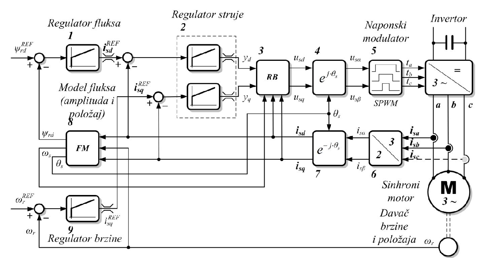
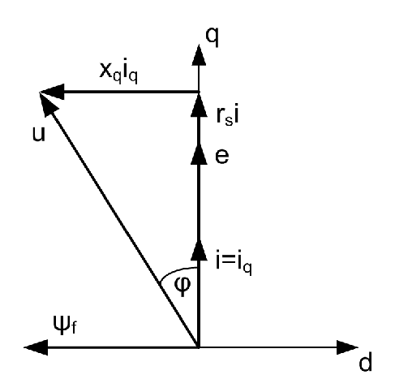
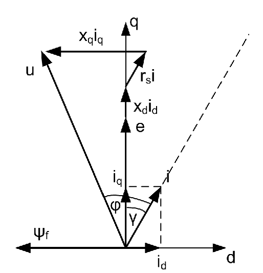

# Zadatak 27 — Sinhroni motor sa stalnim magnetima: maksimalni moment optimalnim položajem vektora struje

## Postavka

Četvoropolni sinhroni motor sa stalnim (permanentnim) magnetima ima nazivne podatke: $150\ \mathrm{kW}$, $400\ \mathrm{V}$, $50\ \mathrm{Hz}$. Parametri motora zadati su u relativnim jedinicama (r.j.):

- otpornost statora $r_s = 0{,}03\ \mathrm{r.j.}$,
- reaktansa rasipanja statora $x_{\gamma} = 0{,}1\ \mathrm{r.j.}$,
- podužna (d-osa) reaktansa reakcije indukta $x_{ad} = 0{,}3\ \mathrm{r.j.}$,
- poprečna (q-osa) reaktansa reakcije indukta $x_{aq} = 0{,}8\ \mathrm{r.j.}$,
- nominalna indukovana elektromotorna sila po fazi $e = 1{,}0\ \mathrm{r.j.}$

**a)** Ako se vektorom struje statora upravlja tako da je njegova d-komponenta jednaka nuli, a q-komponenta jednaka $1{,}0\ \mathrm{r.j.}$, izračunati razvijeni moment, faktor snage i napon na stezaljkama motora, pri nazivnoj frekvenciji napajanja ($f = 1{,}0\ \mathrm{r.j.}$).

**b)** Uz istu amplitudu struje i istu frekvenciju kao pod a), izračunati dq-komponente struje statora, položaj vektora struje i napon statora kojima se postiže **maksimalni moment** u stacionarnom stanju.

> **Prevod na običan jezik:** Imamo motor kod kog elektronika (invertor) može da "namesti" struju statora kako god poželimo — i po jačini i po pravcu u odnosu na rotor. U delu a) struju postavljamo tačno pod $90^\circ$ u odnosu na magnete rotora (to je "školski" izbor koji maksimizuje osnovnu komponentu momenta) i pitamo se: koliki moment motor tada daje, koliki mu je faktor snage i koliki napon invertor mora da obezbedi. U delu b) pitamo se nešto lukavije: da li se, uz **istu jačinu struje**, može dobiti **veći** moment ako struju zakrenemo pod neki drugi ugao — i koji je taj ugao? Odgovor je "da", zahvaljujući tzv. reluktantnom momentu, i to je glavna poenta zadatka.

## Podaci

| Veličina | Oznaka | Vrednost | Šta ta veličina fizički znači |
|---|---|---|---|
| Nazivna snaga | $P_n$ | $150\ \mathrm{kW}$ | Snaga za koju je motor projektovan; služi kao **bazna** vrednost sistema relativnih jedinica. |
| Nazivni napon | $U_n$ | $400\ \mathrm{V}$ | Nazivni (linijski) napon; određuje baznu vrednost napona. |
| Nazivna frekvencija | $f_n$ | $50\ \mathrm{Hz}$ | Frekvencija napajanja pri kojoj motor radi nazivnom brzinom; bazna vrednost frekvencije. |
| Broj polova | $2p = 4$ | četvoropolni ($p=2$ para polova) | Određuje sinhronu brzinu: $n_s = 60 f_n / p = 1500\ \mathrm{min^{-1}}$. |
| Otpornost statora | $r_s$ | $0{,}03\ \mathrm{r.j.}$ | Omska otpornost faznog namotaja statora; na njoj nastaju gubici u bakru. |
| Reaktansa rasipanja statora | $x_{\gamma}$ | $0{,}1\ \mathrm{r.j.}$ | Predstavlja deo fluksa statora koji se "rasipa" (ne prolazi kroz rotor, ne pravi moment). |
| Podužna reaktansa reakcije indukta | $x_{ad}$ | $0{,}3\ \mathrm{r.j.}$ | Predstavlja fluks koji struja statora stvara **duž d-ose** (ose magneta). |
| Poprečna reaktansa reakcije indukta | $x_{aq}$ | $0{,}8\ \mathrm{r.j.}$ | Predstavlja fluks koji struja statora stvara **duž q-ose** (između polova). |
| Indukovana ems (prazan hod) | $e$ | $1{,}0\ \mathrm{r.j.}$ | Napon koji fluks magneta rotora indukuje u namotaju statora pri nazivnoj brzini. |
| Upravljanje u delu a) | $i_d,\ i_q$ | $i_d = 0$, $i_q = 1{,}0\ \mathrm{r.j.}$ | Zadate (referentne) vrednosti dq-komponenti struje statora. |
| Upravljanje u delu b) | $i,\ f$ | $i = 1{,}0\ \mathrm{r.j.}$, $f = 1{,}0\ \mathrm{r.j.}$ | Ista amplituda struje i frekvencija kao pod a); traži se najbolji **ugao** struje. |

Napomena uz tabelu: nazivni podaci ($150\ \mathrm{kW}$, $400\ \mathrm{V}$, $50\ \mathrm{Hz}$, četiri pola) definišu bazne vrednosti i u samom računu u relativnim jedinicama nisu potrebni — ceo zadatak se rešava u r.j. (šta su relativne jedinice objašnjeno je u mini-lekciji 1). Pojmovi **indukt** i **induktor**: indukt je deo mašine u kome se indukuje ems i kroz koji teče "radna" struja (ovde **stator**), a induktor je deo koji stvara osnovno magnetno polje (ovde **rotor** sa stalnim magnetima). "Reakcija indukta" je fluks koji stvaraju struje statora.

## Šta se traži i zašto

**1) Moment $m$ (deo a).** Moment je "korisni proizvod" motora — on okreće vratilo. Inženjera zanima da proveri da li motor sa zadatom strujom daje potreban moment. Plan: iz električne snage oduzmemo gubitke u bakru, dobijemo mehaničku snagu, pa je podelimo brzinom obrtanja.

**2) Faktor snage $\cos\varphi$ (deo a).** Faktor snage govori koliko je od prividne snage (proizvod napona i struje) zaista aktivna snaga. Što je $\cos\varphi$ manji, invertor mora biti "krupniji" (mora da isporuči veću prividnu snagu za istu korisnu snagu). Plan: iz fazorskog dijagrama očitamo ugao između napona i struje.

**3) Napon na stezaljkama $u_f$ (deo a).** Invertor mora fizički da proizvede taj napon — ako je potreban napon veći od onoga što invertor može da da (ograničen naponom jednosmernog međukola), režim nije ostvariv. Plan: napon sastavimo iz dq-komponenti pomoću naponskih jednačina mašine.

**4) Optimalan ugao $\gamma$, komponente $i_d$, $i_q$, moment $m_{\max}$ i napon $u$ (deo b).** Ovo je srce zadatka: uz **istu** amplitudu struje (dakle iste gubitke u bakru i isto strujno opterećenje invertora) tražimo ugao vektora struje koji daje **najveći** moment. U savremenim pogonima ova strategija se zove **MTPA** (engl. *Maximum Torque Per Ampere* — maksimalni moment po amperu). Plan u koracima:
1. napišemo mehaničku snagu kao funkciju ugla struje $\gamma$;
2. prepoznamo u njoj dve komponente — osnovnu i reluktantnu;
3. izvod po $\gamma$ izjednačimo sa nulom (uslov maksimuma);
4. rešimo dobijenu kvadratnu jednačinu po $\sin\gamma$;
5. iz $\gamma$ izračunamo $i_d$, $i_q$, $m_{\max}$ i potreban napon $u$.

## Potrebna teorija — mini-lekcije

### Mini-lekcija 1: Relativne jedinice (r.j.)

**Definicija.** U sistemu relativnih jedinica (engl. *per-unit*) svaka veličina se deli svojom **baznom** vrednošću (po pravilu nazivnom): napon baznim naponom, struja baznom strujom, snaga baznom snagom itd. Rezultat je neimenovan broj: $1\ \mathrm{r.j.}$ znači "tačno nazivna vrednost", $0{,}5\ \mathrm{r.j.}$ znači "pola nazivne".

**Zašto se koristi?** Brojevi postaju uporedivi i "pitki": čim vidimo $u = 1{,}368\ \mathrm{r.j.}$ znamo da je napon $36{,}8\ \%$ iznad nazivnog, bez ikakvog računanja. Formule se uprošćavaju jer mnoge konstante postanu jednake 1.

**Tri posledice koje koristimo u ovom zadatku:**
1. Bazne vrednosti se biraju usklađeno, pa **frekvencija, brzina obrtanja i ugaona brzina (električna ili mehanička) imaju istu brojnu vrednost u r.j.** Zato pri $f = 1\ \mathrm{r.j.}$ važi i $\omega_{sm} = 1\ \mathrm{r.j.}$ ($\omega_{sm}$ je sinhrona mehanička ugaona brzina).
2. Moment je odnos mehaničke snage i mehaničke ugaone brzine, $m = p_m/\omega_{sm}$, i u r.j. i u fizičkim jedinicama ($M = P_m/\Omega$, gde je $\mathrm{W}/(\mathrm{rad/s}) = \mathrm{Nm}$).
3. U r.j. proizvod reaktanse i struje brojno je jednak **fluksu** koji ta struja stvara (jer je reaktansa $x = \omega L$, a u r.j. je $\omega = 1$ pri nazivnoj frekvenciji). Zato ćemo jednačine flukseva pisati sa $x$ umesto sa induktivnostima.

### Mini-lekcija 2: dq koordinatni sistem vezan za rotor

Trofazne struje statora u realnom motoru su naizmenične (sinusne). Analiza se, međutim, dramatično uprošćava ako pređemo u **koordinatni sistem koji se obrće zajedno sa rotorom**, sa dve ose:

- **d-osa** (direktna, podužna): bira se tako da se poklapa sa osom rotora, tj. sa pravcem vektora fluksa rotora $\psi_f$ (kod ovog motora — sa osom stalnih magneta);
- **q-osa** (kvadraturna, poprečna): normalna na d-osu; u njoj leži vektor indukovane elektromotorne sile $e$ (ems uvek "prednjači" fluksu koji je stvara za $90^\circ$).

Merene fazne struje motora se, uz poznat položaj rotora, jednostavnim trigonometrijskim relacijama preračunaju u dve komponente: $i_d$ (projekcija vektora struje na d-osu) i $i_q$ (projekcija na q-osu). Ključna pogodnost: **u stacionarnom stanju su dq-veličine konstantni brojevi** (ne sinusoide!), jer se i vektor struje i rotor obrću istom, sinhronom brzinom, pa se njihov međusobni položaj ne menja. Te konstantne vektore crtamo u **dq fazorskom dijagramu** — upravo onakvom kakav standardno crtamo kada analiziramo sinhrone mašine (slike 27.2 i 27.3 u nastavku).

Fizičko značenje komponenti:
- $i_d$ leži u istoj osi kao fluks rotora — njome se **utiče na ukupni fluks** mašine (može ga pojačati ili oslabiti);
- $i_q$ je normalna na fluks i poklapa se sa pravcem ems praznog hoda — ona **stvara osnovni deo momenta** (pa se preko nje reguliše i brzina).

### Mini-lekcija 3: Vektorsko upravljanje — strujno regulisani invertor

U savremenim naizmeničnim pogonima (pa i pogonima sa sinhronim motorima) moment i brzina se regulišu **strujno upravljanim invertorom**. Ideja: pošto znamo da $i_d$ kontroliše fluks, a $i_q$ moment, napravimo elektroniku koja te dve komponente drži tačno na zadatim (referentnim) vrednostima — nezavisno jednu od druge. U pogonu se mere fazne struje motora i položaj i brzina rotora (u naprednijim izvedbama položaj i brzina se ne mere, već se **estimiraju** — procenjuju iz matematičkog modela motora, tzv. *sensorless* upravljanje).

Sledeća slika prikazuje blok-šemu takvog pogona — kompletan upravljački lanac od referenci fluksa i brzine do invertora i motora, sa merenjem struja i položaja u povratnoj sprezi.

**Slika 27.1 —** Savremeni pogon sinhronog motora. Vektorsko upravljanje: unutrašnja strujna regulaciona petlja (regulatori dq-komponenti struje statora) i spoljašnje regulacione petlje po brzini i fluksu.

> **Kako čitati sliku 27.1:** Ovo je blok-šema, pa nema osa — strelice su signali, pravougaonici obrada; upravljački lanac čita se sleva nadesno, a povratne veze idu zdesna nalevo. Ulazi su dve reference (nadeksponent "REF"): referenca fluksa $\psi_{rd}^{REF}$ (gore levo) i referenca brzine $\omega_r^{REF}$ (dole levo); kružići sa znakovima $+$ i $-$ su sabirači koji od reference oduzimaju izmerenu vrednost i formiraju grešku regulacije. Blok **1** (regulator fluksa) iz greške fluksa pravi referencu d-struje $i_{sd}^{REF}$, a blok **9** (regulator brzine) iz greške brzine referencu q-struje $i_{sq}^{REF}$ — tu se direktno vidi podela posla iz mini-lekcije 2: d-osa upravlja fluksom, q-osa momentom i brzinom. Blok **2** (isprekidani okvir "Regulator struje") sadrži **dva nezavisna strujna regulatora** (kosa linija u simbolu je pojačavačka karakteristika, dvostruke crtice na izlazu su ograničenje) koji greške $i_{sd}^{REF}-i_{sd}$ i $i_{sq}^{REF}-i_{sq}$ pretvaraju u signale $y_d$, $y_q$. Blok **3** ("RB", rasprežući blok) od njih pravi napone $u_{sd}$, $u_{sq}$, kompenzujući ukrštene uticaje osa (član $\omega\psi$ jedne ose u naponu druge, mini-lekcija 5). Blok **4** ($e^{j\theta_s}$) rotira napone iz rotirajućeg dq u nepokretni $\alpha\beta$ sistem ($u_{s\alpha}$, $u_{s\beta}$) pomoću ugla polja $\theta_s$; blok **5** ("Naponski modulator", SPWM — sinusna širinsko-impulsna modulacija) iz njih pravi upravljačke impulse $t_a$, $t_b$, $t_c$ za invertor (gore desno: blok sa oznakama $=$ i $3\sim$ i kondenzatorom jednosmernog međukola — pretvara jednosmerni napon u trofazni promenljive učestanosti). Invertor napaja **sinhroni motor** (krug "M $3\sim$" dole desno), na čijem je vratilu **davač brzine i položaja** (mali krug) koji vraća $\omega_r$. Povratna grana struja: na vodovima $a$ i $b$ su davači struje (crne tačke na linijama $i_{sa}$, $i_{sb}$; linija $i_{sc}$ je isprekidana jer se treća struja ne mora meriti — sledi iz $i_{sa}+i_{sb}+i_{sc}=0$); blok **6** ("3/2") pretvara fazne struje u komponente $i_{s\alpha}$, $i_{s\beta}$, a blok **7** ($e^{-j\theta_s}$) rotira ih u $i_{sd}$, $i_{sq}$, koje se vraćaju na sabirače strujnih regulatora. Blok **8** ("FM", model fluksa) iz struja i brzine računa amplitudu fluksa $\psi_{rd}$ (povratna veza bloka 1) i ugao $\theta_s$ (uz učestanost $\omega_s$); isti $\theta_s$ koriste blokovi 4 i 7, da bi rotacije "tamo" i "nazad" bile usaglašene. Šta treba da zaključiš: unutrašnje strujne petlje drže $i_d$ i $i_q$ tačno na zadatim vrednostima, pa je pogon za naš zadatak prosto "izvor strujnog vektora po želji" — na nama je samo da izračunamo koje reference $i_d$ i $i_q$ treba zadati.

Za ovaj zadatak iz cele šeme treba zapamtiti samo jedno: **pogon može da postavi $i_d$ i $i_q$ na koje god vrednosti želimo** (u granicama dozvoljene struje). Naš posao u zadatku je da izračunamo *koje* vrednosti treba zadati.

### Mini-lekcija 4: Zašto je kod motora sa magnetima $x_d < x_q$?

Sinhrone reaktanse po osama su zbir reaktanse reakcije indukta i reaktanse rasipanja:

$$x_d = x_{ad} + x_{\gamma}, \qquad x_q = x_{aq} + x_{\gamma}$$

Ovde je $x_d$ **podužna (d) sinhrona reaktansa**, a $x_q$ **poprečna (q) sinhrona reaktansa**. One mere koliko fluksa stvori struja statora kada deluje duž odgovarajuće ose: velika reaktansa = "lak" magnetni put (malo magnetnog otpora), mala reaktansa = "težak" magnetni put.

Kod klasičnih sinhronih mašina sa pobudnim namotajem i isturenim polovima je $x_d > x_q$ (duž ose polova gvožđe je blizu, između polova je veliki vazdušni procep). Kod motora sa **ugrađenim permanentnim magnetima je obrnuto**: magneti su smešteni u d-osi, a materijal magneta ima relativnu magnetnu propustljivost približno kao vazduh ($\mu_r \approx 1$). Za fluks koji pokušava da prođe kroz d-osu magnet dakle izgleda kao **dodatni vazdušni zazor** — veliki magnetni otpor — pa je $x_d$ **manje** od $x_q$ (q-put ide kroz gvožđe između magneta). Ova "naopaka" nejednakost je ključna za deo b).

### Mini-lekcija 5: Naponske jednačine sinhrone mašine u dq (stacionarno stanje)

Prvo fluksevi. Ukupni fluks po d-osi čine fluks magneta $\psi_f$ i fluks koji stvara struja $i_d$; po q-osi fluks stvara samo struja $i_q$ (magneti u q-osi ne deluju). U r.j. (mini-lekcija 1, posledica 3):

$$\psi_d = \psi_f + x_d\, i_d, \qquad \psi_q = x_q\, i_q$$

Sada naponi. Po Faradejevom zakonu napon je posledica promene fluksa. U rotirajućem dq sistemu ta promena ima dva uzroka: promenu samih dq-komponenti flukseva (u stacionarnom stanju **nula**, jer su konstantne) i **rotaciju** sistema. Rotacija dovodi do toga da fluks jedne ose indukuje napon u drugoj osi: fluks d-ose indukuje ems u q-osi (sa znakom $+$), a fluks q-ose u d-osi (sa znakom $-$) — to je isto pravilo "ems prednjači fluksu za $90^\circ$" iz mini-lekcije 2, samo zapisano po komponentama. Dodamo li i omski pad napona, u stacionarnom stanju važi:

$$u_d = r_s\, i_d - \omega\, \psi_q, \qquad u_q = r_s\, i_q + \omega\, \psi_d$$

Pri nazivnoj frekvenciji je $\omega = 1\ \mathrm{r.j.}$, a proizvod $\omega \psi_f$ je upravo indukovana ems praznog hoda: $e = \omega\,\psi_f = 1{,}0\ \mathrm{r.j.}$ Uvrštavanjem flukseva dobijamo dve jednačine koje ćemo koristiti kroz ceo zadatak:

$$\boxed{\,u_d = r_s\, i_d - x_q\, i_q\,} \qquad \boxed{\,u_q = e + r_s\, i_q + x_d\, i_d\,}$$

Amplituda (modul) vektora napona statora je onda, po Pitagorinoj teoremi:

$$u = \sqrt{u_d^2 + u_q^2}$$

**Dogovor o znaku koji koristimo dosledno:** d-osu usmeravamo **u pravcu fluksa rotora** $\psi_f$. Tada $i_d > 0$ znači struju koja **pojačava** fluks magneta, a $i_d < 0$ struju koja ga **slabi** (demagnetiše). Ovo će biti važno u delu b).

### Mini-lekcija 6: Snaga i moment preko dq veličina

**Električna (aktivna) snaga.** Aktivnu snagu stvaraju samo naponi i struje koji su **u fazi**. U dq sistemu su ose međusobno normalne, pa $u_d$ sa $i_q$ (i obrnuto) ne daje srednju snagu — ostaju samo "istoosni" proizvodi. U relativnim jedinicama:

$$p_{el} = u_d\, i_d + u_q\, i_q$$

**Mehanička snaga.** Od ulazne električne snage oduzmemo gubitke. Gubici u bakru statora su $p_{Cu} = r_s\, i^2$, gde je $i = \sqrt{i_d^2 + i_q^2}$ amplituda struje. Gubitke u gvožđu i mehaničke gubitke zanemarujemo (nisu ni zadati u tekstu zadatka), pa je:

$$p_m = p_{el} - p_{Cu} = p_{el} - r_s\, i^2$$

**Moment.** Moment je odnos mehaničke snage na vratilu i mehaničke ugaone brzine obrtanja (kod sinhrone mašine to je sinhrona brzina $\omega_{sm}$):

$$m = \frac{p_m}{\omega_{sm}}$$

**Kompaktan izraz za snagu/moment.** Uvrstimo naponske jednačine iz mini-lekcije 5 u $p_{el}$:

$$p_{el} = (r_s i_d - x_q i_q)\,i_d + (e + r_s i_q + x_d i_d)\,i_q = r_s(i_d^2 + i_q^2) + e\, i_q + (x_d - x_q)\, i_d\, i_q$$

Prvi sabirak je tačno $r_s i^2$, tj. gubici u bakru. Kada ih oduzmemo, dobijamo mehaničku snagu **bez ikakvog $r_s$** u izrazu:

$$\boxed{\,p_m = e\, i_q + (x_d - x_q)\, i_d\, i_q\,}$$

Ovaj izraz je centralna formula zadatka — iz njega slede oba dela.

### Mini-lekcija 7: Osnovna i reluktantna komponenta momenta; ugao $\gamma$

**Opšti zakon momenta.** Kod svih električnih mašina pokretački moment je srazmeran amplitudi fluksa induktora (ovde: fluks rotora $\psi_f$), amplitudi struje indukta (ovde: struja statora $i$) i **sinusu ugla** između ta dva vektora. Iz toga sledi poznat zaključak: za zadate amplitude, moment je najveći kada su fluks i struja **ortogonalni** (ugao $90^\circ$, sinus jednak 1). To je logika dela a): $i_d = 0$ znači da je vektor struje ceo u q-osi, tj. pod $90^\circ$ u odnosu na $\psi_f$.

**Ali** — taj zakon opisuje samo **osnovnu** komponentu momenta. Kod mašina kod kojih je $x_d \neq x_q$ (magnetno "isturenih") postoji još jedna komponenta: **reluktantni moment**. To je ista sila koja gvozdenu šipku u magnetnom polju okreće da se postavi duž polja — rotor "želi" da svoju magnetno najprovodniju osu poravna sa poljem statora, i to i bez ikakvih magneta (na tom principu radi sinhroni reluktantni motor). U našoj centralnoj formuli reluktantni deo je sabirak $(x_d - x_q)\, i_d\, i_q$: postoji samo ako je $x_d \neq x_q$ **i** ako su obe komponente struje različite od nule.

**Ključno zapažanje za PMSM.** Kod našeg motora je $x_d - x_q < 0$ (mini-lekcija 4). Da bi reluktantni sabirak bio **pozitivan** (da pomaže), uz $i_q > 0$ mora biti $i_d < 0$ — dakle struja mora imati **demagnetišuću** d-komponentu. Tada vektor struje sa fluksom rotora zaklapa ugao **veći** od $90^\circ$.

**Definicija ugla $\gamma$.** Neka je $\gamma$ ugao za koji je vektor struje otklonjen od q-ose (tj. od pravca ems $e$) **ka demagnetišućoj strani**. Vektor struje tada sa fluksom rotora zaklapa ugao $90^\circ + \gamma$, a njegove projekcije na ose su:

$$i_d = -\,i\,\sin\gamma, \qquad i_q = i\,\cos\gamma$$

Odakle ove projekcije? Vektor struje sa d-osom zaklapa ugao $90^\circ + \gamma$, pa je njegova d-projekcija $i\cos(90^\circ + \gamma) = -\,i\sin\gamma$, a q-projekcija $i\sin(90^\circ + \gamma) = i\cos\gamma$ (standardne trigonometrijske formule za pomeranje ugla za $90^\circ$); minus kod $i_d$ upravo kaže "suprotno od fluksa rotora". Pomeranjem struje od q-ose gubimo deo osnovnog momenta (jer $i_q$ opada, a demagnetišuća $i_d$ dodatno smanjuje ukupni fluks mašine), ali dobijamo reluktantni moment. Negde između $\gamma = 0$ i $\gamma = 90^\circ$ postoji **optimalan ugao** — njega tražimo u delu b).

## Rešenje, korak po korak

### Korak 1: Sinhrone reaktanse $x_d$ i $x_q$

**Zašto ovaj korak:** sve formule (naponi, snaga, moment) koriste sinhrone reaktanse po osama, a zadatak nam daje samo njihove sastavne delove — reaktanse reakcije indukta i reaktansu rasipanja.

Po mini-lekciji 4, sinhrona reaktansa svake ose je zbir reaktanse reakcije indukta te ose i reaktanse rasipanja:

$$x_d = x_{ad} + x_{\gamma} = 0{,}3 + 0{,}1 = 0{,}4\ \mathrm{r.j.}$$

$$x_q = x_{aq} + x_{\gamma} = 0{,}8 + 0{,}1 = 0{,}9\ \mathrm{r.j.}$$

**Šta smo dobili:** $x_d < x_q$, i to osetno ($0{,}4$ prema $0{,}9$) — potvrda da su magneti u d-osi (mini-lekcija 4). Razlika $x_q - x_d = 0{,}5\ \mathrm{r.j.}$ je velika, pa možemo očekivati da će reluktantni moment u delu b) biti značajan.

### Korak 2: Deo a) — fazorski dijagram za $i_d = 0$ i napon statora

**Zašto ovaj korak:** invertor mora da obezbedi napon koji "pokriva" ems, omski pad i pad na reaktansi — računamo koliki je taj napon.

U delu a) je zadato $i_d = 0$ i $i_q = i = 1{,}0\ \mathrm{r.j.}$ — ceo vektor struje leži u q-osi, tačno pod $90^\circ$ u odnosu na fluks rotora. Naponske jednačine iz mini-lekcije 5 tada daju:

$$u_q = e + r_s\, i_q + x_d \cdot 0 = e + r_s\, i$$

$$u_d = r_s \cdot 0 - x_q\, i_q = -\,x_q\, i$$

Situaciju prikazuje sledeći fazorski dijagram u dq ravni.

**Slika 27.2 —** Fazorski dijagram struja i napona za slučaj $i_d = 0$ i $i_q = i = 1\ \mathrm{r.j.}$

> **Kako čitati sliku 27.2:** Ose dijagrama su **d-osa** (vodoravna) i **q-osa** (uspravna) koordinatnog sistema vezanog za rotor; sve dužine su u relativnim jedinicama (bezdimenzione), a ceo sistem rotira sinhrono, pa fazori miruju jedan prema drugom — uglove čitaš direktno između strelica. Referentni pravac je q-osa (pravac ems $e$). **Pažnja:** autor zbirke je fluks rotora $\psi_f$ nacrtao kao strelicu **ulevo**, na negativnu stranu ose označene sa "d" (strelica oznake ose pokazuje udesno); suštinski je bitno samo da $\psi_f$ leži u d-pravcu, upravno na struju. Vektori (dijagram je crno-beli, raspoznaju se po oznakama): struja $i = i_q = 1{,}0\ \mathrm{r.j.}$ leži tačno **na q-osi** — to je upravljačka odluka dela a) ($i_d = 0$); iznad nje su, nadovezani duž iste ose, ems $e = 1{,}0\ \mathrm{r.j.}$ i omski pad $r_s i = 0{,}03\ \mathrm{r.j.}$ (zato se vide kao tri strelice jedna iznad druge); na vrhu lanac skreće **ulevo** za pad $x_q i_q = 0{,}9\ \mathrm{r.j.}$ (upravno na struju, ka negativnoj d-strani — to je član $u_d = -x_q i_q$); vektor napona $u$ je hipotenuza od koordinatnog početka do kraja lanca, modula $u_f = \sqrt{1{,}03^2 + 0{,}9^2} = 1{,}368\ \mathrm{r.j.}$ Ugao $\varphi$ ucrtan kod koordinatnog početka je ugao između $u$ i struje $i$ — ugao faktora snage: $\cos\varphi = u_q/u_f = 1{,}03/1{,}368 = 0{,}753$, tj. $\varphi = 41{,}1^\circ$ (napon prednjači struji — motor se prema izvoru ponaša induktivno). Šta treba da zaključiš: i uz "školsko" upravljanje $i_d = 0$ veliki pad $x_q i_q$ zakreće i izdužuje vektor napona, pa invertor mora dati $36{,}8\ \%$ više od nazivnog napona uz osrednji faktor snage — ima prostora za bolje, što pokazuje deo b).

Modul napona je hipotenuza pravouglog trougla sa katetama $u_q = e + r_s i$ i $|u_d| = x_q i$ (oznaka $u_f$: fazni napon statora — indeks "f" je od "fazni", jer su i svi parametri zadati po fazi):

$$u_f = \sqrt{(e + r_s\, i)^2 + (x_q\, i)^2}$$

Uvrstimo brojeve ($e = 1$, $r_s = 0{,}03$, $i = 1$, $x_q = 0{,}9$):

$$u_f = \sqrt{(1 + 0{,}03 \cdot 1)^2 + (0{,}9 \cdot 1)^2} = \sqrt{1{,}03^2 + 0{,}9^2} = \sqrt{1{,}0609 + 0{,}81} = \sqrt{1{,}8709}$$

$$u_f = 1{,}368\ \mathrm{r.j.}$$

**Šta smo dobili:** potreban napon je čak $36{,}8\ \%$ **iznad nazivnog**. Glavni krivac je veliki pad $x_q i_q = 0{,}9\ \mathrm{r.j.}$ — pri punoj struji u q-osi reakcija indukta stvara veliki dodatni fluks u q-osi, koji invertor mora "nadjačati" naponom. Ovo je prvi nagoveštaj da režim iz dela a) nije idealan.

### Korak 3: Deo a) — snaga i moment

**Zašto ovaj korak:** moment je tražena veličina; do njega dolazimo preko mehaničke snage (mini-lekcija 6).

Električna snaga u dq veličinama, uz $i_d = 0$:

$$p_{el} = u_d\, i_d + u_q\, i_q = u_q\, i_q$$

Mehanička snaga (oduzimamo gubitke u bakru; gubici u gvožđu i mehanički su zanemareni):

$$p_m = u_q\, i_q - r_s\, i^2$$

Pošto je $i_q = i$, izvučemo $i$ kao zajednički činilac, pa uvrstimo $u_q = e + r_s i$ iz koraka 2:

$$p_m = (u_q - r_s\, i)\cdot i = (e + r_s\, i - r_s\, i)\cdot i = e \cdot i$$

Primetimo lepu stvar: omski članovi su se tačno potrli — mehanička snaga je prosto proizvod ems i struje. Brojevi:

$$p_m = e \cdot i = 1 \cdot 1 = 1\ \mathrm{r.j.}$$

Za nazivnu frekvenciju napajanja, $f = 1\ \mathrm{r.j.}$, i ugaona brzina obrtanja jednaka je nazivnoj, $\omega_{sm} = 1\ \mathrm{r.j.}$ (mini-lekcija 1, posledica 1: frekvencija, brzina i ugaona brzina imaju iste brojne vrednosti u r.j.). Moment je zato:

$$m = \frac{p_m}{\omega_{sm}} = \frac{1}{1} = 1\ \mathrm{r.j.}$$

**Šta smo dobili:** sa nazivnom strujom, ceo "budžet" struje u q-osi, motor daje tačno nazivni (jedinični) moment. To je očekivano — i deluje kao da bolje ne može. Deo b) će pokazati da ipak može.

### Korak 4: Deo a) — faktor snage

**Zašto ovaj korak:** faktor snage određuje koliku prividnu snagu invertor mora da isporuči za datu aktivnu snagu — direktno utiče na dimenzionisanje invertora.

Faktor snage je kosinus ugla $\varphi$ između vektora napona i vektora struje. U delu a) struja leži tačno na q-osi, pa je $\varphi$ prosto ugao između vektora $u$ i q-ose. Kosinus tog ugla je (pogledaj trougao na slici 27.2): nalegla kateta kroz hipotenuzu, tj. projekcija napona na q-osu podeljena modulom napona:

$$\cos\varphi = \frac{u_q}{u_f} = \frac{e + r_s\, i}{u_f}$$

Brojevi:

$$\cos\varphi = \frac{1 + 0{,}03 \cdot 1}{1{,}368} = \frac{1{,}03}{1{,}368} = 0{,}753$$

**Šta smo dobili:** $\cos\varphi = 0{,}753$ je prilično loše — ugao između napona i struje je $\varphi = 41{,}1^\circ$, pri čemu struja kasni za naponom (motor se prema izvoru ponaša induktivno). Invertor mora da isporuči prividnu snagu $u \cdot i = 1{,}368\ \mathrm{r.j.}$ da bi motor primio aktivnu snagu od svega $1{,}03\ \mathrm{r.j.}$ I ovo je posledica velikog pada $x_q i_q$ koji "zakreće" napon daleko od struje.

### Korak 5: Deo b) — postavka: struja pod uglom $\gamma$ prema q-osi

**Zašto ovaj korak:** pre računa moramo precizno definisati šta menjamo (ugao struje) i šta očekujemo (dve suprotstavljene posledice).

Pretpostavimo sada da vektor struje statora, i dalje nazivne amplitude $i = 1\ \mathrm{r.j.}$, zaklapa ugao $\gamma$ u odnosu na vektor indukovane ems (q-osu), i to ka **demagnetišućoj** strani. Tada vektor struje u odnosu na vektor fluksa rotora zaklapa ugao **veći od $90^\circ$** (tačno $90^\circ + \gamma$), pa njegova d-komponenta stvara kontra-fluks u osi rotora: ukupni fluks mašine se smanjuje. Po mini-lekciji 7:

$$i_d = -\,i\,\sin\gamma, \qquad i_q = i\,\cos\gamma$$

Uz ograničenu (nazivnu) amplitudu struje, $i_q$ je sada manja nego u delu a) ($\cos\gamma < 1$). Obe pojave — manji fluks i manja $i_q$ — smanjuju **osnovnu** komponentu momenta. Ali istovremeno se, zbog $i_d \neq 0$, javlja **reluktantna** komponenta. Pokazaće se da njen dobitak može biti veći od gubitka osnovne komponente, pa ukupan moment raste.

Novu situaciju prikazuje sledeći fazorski dijagram — ista konstrukcija kao na slici 27.2, samo sa vektorom struje otklonjenim za ugao $\gamma$.

**Slika 27.3 —** Fazorski dijagram struja i napona za slučaj kada struja statora zaklapa ugao $\gamma$ u odnosu na q-osu ($i_d \neq 0$).

> **Kako čitati sliku 27.3:** Iste ose i ista pravila kao na slici 27.2 (d-osa vodoravno, q-osa uspravno, sve u r.j., $\psi_f$ nacrtan na negativnoj strani ose "d" — bitan je samo međusobni odnos vektora). Novost je isprekidana kosa linija desno od q-ose: to je **pravac vektora struje**, otklonjen od q-ose za ugao $\gamma$ (u optimumu iz Koraka 7: $\gamma = 21{,}47^\circ$). Struja $i = 1{,}0\ \mathrm{r.j.}$ razlaže se (isprekidani pravougaonik) na projekcije: $i_q = i\cos\gamma = 0{,}931\ \mathrm{r.j.}$ duž q-ose i $i_d$ duž d-pravca, nacrtanu **suprotno od strelice $\psi_f$** — to je grafički zapis da je d-komponenta demagnetišuća (u našoj konvenciji $i_d = -0{,}366\ \mathrm{r.j.}$; slika prikazuje njen intenzitet $0{,}366$). Naponski lanac duž q-ose: ems $e = 1{,}0\ \mathrm{r.j.}$, pa segment $x_d i_d$ (intenzitet $0{,}4\cdot 0{,}366 = 0{,}146\ \mathrm{r.j.}$; na skici je nacrtan naviše, u skladu sa znakom koji zbirka pripisuje $i_d$ — u našoj konvenciji taj član **smanjuje** $u_q$, pa je $u_q = 0{,}8815 < e$, vidi Korak 10 i napomenu uz njega), zatim omski pad $r_s i = 0{,}03\ \mathrm{r.j.}$, nacrtan **koso** jer je paralelan struji, i na vrhu pad $x_q i_q = 0{,}9\cdot 0{,}931 = 0{,}8375\ \mathrm{r.j.}$ ulevo (upravno na q-osu). Vektor $u$ je strelica od koordinatnog početka do kraja lanca; sa našim brojevima $u = \sqrt{0{,}8815^2 + 0{,}8485^2} = 1{,}223\ \mathrm{r.j.}$ — kraća nego na slici 27.2. Dva ucrtana ugla kod koordinatnog početka: $\gamma$ (između q-ose i struje) i $\varphi$ (između $u$ i struje; iz bilansa snage u Proveri smisla: $\cos\varphi = 0{,}924$, tj. $\varphi \approx 22{,}5^\circ$ — znatno bolje od $41^\circ$ iz dela a). Šta treba da zaključiš: otklon struje za $\gamma$ ka demagnetišućoj strani istovremeno donosi reluktantni moment (ukupno $+10\ \%$ momenta), skraćuje vektor napona ($1{,}368 \to 1{,}223\ \mathrm{r.j.}$) i popravlja faktor snage — upravo zato je ovo optimalni (MTPA) režim.

### Korak 6: Deo b) — mehanička snaga kao funkcija ugla $\gamma$

**Zašto ovaj korak:** da bismo tražili maksimum momenta po uglu, prvo moramo snagu (a time i moment) izraziti kao funkciju samo jedne promenljive — ugla $\gamma$.

Polazimo od centralne formule iz mini-lekcije 6 (mehanička snaga preko dq-komponenti struje; podsetnik — dobili smo je tako što smo od $p_{el} = u_d i_d + u_q i_q$ oduzeli gubitke u bakru $r_s i^2$, pri čemu su se svi omski članovi potrli):

$$p_m = e\, i_q + (x_d - x_q)\, i_d\, i_q$$

Uvrstimo $i_d = -\,i\sin\gamma$ i $i_q = i\cos\gamma$ iz koraka 5:

$$p_m = e\, i\cos\gamma + (x_d - x_q)\cdot(-\,i\sin\gamma)\cdot(i\cos\gamma)$$

Minus ispred $\sin\gamma$ "okreće" zagradu $(x_d - x_q)$ u $(x_q - x_d)$:

$$p_m = e\, i\cos\gamma + (x_q - x_d)\, i^2 \sin\gamma\cos\gamma$$

Iskoristimo trigonometrijski identitet $\sin\gamma\cos\gamma = \tfrac{1}{2}\sin 2\gamma$:

$$\boxed{\,p_m = \underbrace{e\, i\cos\gamma}_{p_{osn}} + \underbrace{\tfrac{1}{2}(x_q - x_d)\, i^2 \sin 2\gamma}_{p_{rel}}\,}$$

Snaga (pa time i moment $m = p_m/\omega_{sm}$) je zbir **dve komponente**: osnovne $p_{osn}$ i reluktantne $p_{rel}$. Obe zavise od amplitude struje, ali i od **položaja** vektora struje u odnosu na rotor (ugla $\gamma$). Kod našeg motora je $x_q - x_d = 0{,}5 > 0$, pa su za $0 < \gamma < 90^\circ$ **obe komponente pozitivne**: pomeranjem struje od q-ose osnovna komponenta polako opada (kao $\cos\gamma$), a reluktantna raste od nule (kao $\sin 2\gamma$, sa maksimumom na $\gamma = 45^\circ$). Negde između je optimum.

*Napomena:* u zbirci se do istog izraza dolazi geometrijski — projektovanjem vektora napona sa slike 27.3 na pravac vektora struje izrazi se proizvod $u\cos\varphi$, pa se ubaci u $p_m = u\, i\cos\varphi - r_s i^2$. Mi smo išli preko dq-komponenti jer je račun pregledniji; rezultat je identičan.

### Korak 7: Deo b) — optimalan ugao: izvod jednak nuli i kvadratna jednačina

**Zašto ovaj korak:** maksimum glatke funkcije nalazi se tamo gde joj je prvi izvod jednak nuli — standardni postupak iz matematike, primenjen na $p_m(\gamma)$.

Za datu amplitudu struje $i$, maksimalnu snagu dobijamo za ugao $\gamma$ za koji važi:

$$\frac{dp_m}{d\gamma} = 0$$

Diferenciramo izraz iz koraka 6 član po član: izvod od $\cos\gamma$ je $-\sin\gamma$, a izvod od $\sin 2\gamma$ je $2\cos 2\gamma$ (dvojka iz izvoda skraćuje se sa $\tfrac{1}{2}$):

$$\frac{dp_m}{d\gamma} = -\,e\, i\sin\gamma + (x_q - x_d)\, i^2 \cos 2\gamma = 0$$

Ovde imamo i $\sin\gamma$ i $\cos 2\gamma$ — svedimo sve na $\sin\gamma$ pomoću identiteta $\cos 2\gamma = 1 - 2\sin^2\gamma$:

$$-\,e\, i\sin\gamma + (x_q - x_d)\, i^2 \left(1 - 2\sin^2\gamma\right) = 0$$

Razvijemo zagradu:

$$-\,e\, i\sin\gamma + (x_q - x_d)\, i^2 - 2\,(x_q - x_d)\, i^2 \sin^2\gamma = 0$$

Pomnožimo celu jednačinu sa $(-1)$ i poređamo članove po opadajućem stepenu $\sin\gamma$ — dobijamo **kvadratnu jednačinu po $\sin\gamma$**:

$$2\,(x_q - x_d)\, i^2 \sin^2\gamma + e\, i\sin\gamma - (x_q - x_d)\, i^2 = 0$$

Uvrstimo brojeve ($x_q - x_d = 0{,}9 - 0{,}4 = 0{,}5$; $e = 1$; $i = 1$):

$$2 \cdot 0{,}5 \cdot 1^2 \cdot \sin^2\gamma + 1 \cdot 1 \cdot \sin\gamma - 0{,}5 \cdot 1^2 = 0$$

$$\sin^2\gamma + \sin\gamma - 0{,}5 = 0$$

Smena $s = \sin\gamma$ daje običnu kvadratnu jednačinu $s^2 + s - 0{,}5 = 0$, koju rešavamo standardnom formulom:

$$s_{1,2} = \frac{-1 \pm \sqrt{1^2 - 4 \cdot 1 \cdot (-0{,}5)}}{2 \cdot 1} = \frac{-1 \pm \sqrt{3}}{2} = \frac{-1 \pm 1{,}732}{2}$$

$$s_1 = \frac{-1 + 1{,}732}{2} = 0{,}366, \qquad s_2 = \frac{-1 - 1{,}732}{2} = -1{,}366$$

Drugo rešenje odbacujemo jer sinus ne može biti manji od $-1$. Ostaje:

$$\sin\gamma = 0{,}366 \;\;\Rightarrow\;\; \gamma = \arcsin 0{,}366 = 21{,}47^\circ$$

Da je ovo zaista **maksimum** (a ne minimum) vidi se iz drugog izvoda: $\frac{d^2 p_m}{d\gamma^2} = -\,e\, i\cos\gamma - 2(x_q - x_d) i^2 \sin 2\gamma$, a za $\gamma = 21{,}47^\circ$ su oba sabirka negativna, pa je drugi izvod negativan — funkcija je u tom uglu "na vrhu brda".

**Šta smo dobili:** kada se vektor struje statora nazivne amplitude postavi tako da zaklapa ugao od $21{,}47^\circ$ u odnosu na vektor indukovane ems (na demagnetišuću stranu), odnosno ugao od $90^\circ + 21{,}47^\circ = 111{,}47^\circ$ u odnosu na vektor fluksa rotora, motor razvija maksimalni mogući moment. Optimum je između $\gamma = 0$ (samo osnovni moment) i $\gamma = 45^\circ$ (maksimum reluktantnog) — bliže nuli, jer je osnovna komponenta i dalje "glavna".

> **Napomena o originalu:** u zbirci je ista jednačina odštampana kao $\sin^2\gamma - \sin\gamma - 0{,}5 = 0$ uz rezultat $\gamma = 21{,}47^\circ$. Strogo gledano, koreni te jednačine su $\sin\gamma = 1{,}366$ (nemoguće) i $\sin\gamma = -0{,}366$, tj. $\gamma = -21{,}47^\circ$ — znak zavisi od toga na koju je stranu usvojen pozitivan smer ugla $\gamma$ (zbirka u svom dijagramu demagnetišuću komponentu crta kao pozitivnu, pa se u međukoracima znak "preseli"). Sa našom konvencijom (ugao $\gamma$ pozitivan ka demagnetišućoj strani, $i_d = -\,i\sin\gamma$) jednačina glasi $\sin^2\gamma + \sin\gamma - 0{,}5 = 0$ i daje pozitivan koren $\sin\gamma = 0{,}366$. **Konačan rezultat je isti:** struja se otkloni za $21{,}47^\circ$ od q-ose, tako da sa fluksom rotora zaklapa $111{,}47^\circ$. Slično, u zbirci piše da struja "kasni" za ems — da li se to zove kašnjenje ili prednjačenje zavisi od orijentacije dijagrama; nedvosmislena (i fizički jedina bitna) formulacija je: struja je pomerena ka strani na kojoj njena d-komponenta **slabi** fluks magneta.

### Korak 8: Deo b) — maksimalni moment

**Zašto ovaj korak:** našli smo optimalan ugao; sada ga vratimo u izraz za snagu da vidimo koliki se moment zaista dobija.

Uvrstimo $\gamma = 21{,}47^\circ$ u izraz iz koraka 6 i podelimo sinhronom brzinom ($\omega_{sm} = 1\ \mathrm{r.j.}$, kao u koraku 3):

$$m_{\max} = \frac{p_{m\max}}{\omega_{sm}} = \frac{e\, i\cos\gamma + \tfrac{1}{2}(x_q - x_d)\, i^2 \sin 2\gamma}{\omega_{sm}}$$

Potrebne trigonometrijske vrednosti: $\cos 21{,}47^\circ = 0{,}9306$ i $\sin 2\gamma = \sin 42{,}94^\circ = 0{,}6813$. Računamo komponente posebno, da vidimo koliko koja donosi:

$$p_{osn} = e\, i\cos\gamma = 1 \cdot 1 \cdot 0{,}9306 = 0{,}9306\ \mathrm{r.j.}$$

$$p_{rel} = \tfrac{1}{2}(x_q - x_d)\, i^2 \sin 2\gamma = 0{,}5 \cdot 0{,}5 \cdot 1^2 \cdot 0{,}6813 = 0{,}1703\ \mathrm{r.j.}$$

$$m_{\max} = \frac{0{,}9306 + 0{,}1703}{1} = 1{,}101 \approx 1{,}1\ \mathrm{r.j.}$$

**Šta smo dobili:** moment je **za oko $10\ \%$ veći** nego u delu a) — sa potpuno istom amplitudom struje, dakle istim gubicima u bakru i istim strujnim naprezanjem invertora! Osnovna komponenta je doduše opala sa $1$ na $0{,}931$ (jer je $i_q$ manja), ali je reluktantna komponenta dodala $0{,}170$, što je više nego nadoknadilo gubitak. Reluktantni deo čini oko $15{,}5\ \%$ ukupnog momenta.

### Korak 9: Deo b) — dq-komponente struje koje treba zadati

**Zašto ovaj korak:** regulatorima na slici 27.1 se ne zadaje "ugao" nego reference $i_d$ i $i_q$ — prevedimo optimalan ugao u te dve brojke.

Iz definicionih relacija u koraku 5, sa $i = 1\ \mathrm{r.j.}$ i $\gamma = 21{,}47^\circ$ (radi tačnosti međurezultata zadržavamo četiri decimale: $\sin 21{,}47^\circ = 0{,}3660$, $\cos 21{,}47^\circ = 0{,}9306$):

$$i_d = -\,i\,\sin\gamma = -\,1 \cdot 0{,}3660 = -\,0{,}3660 \approx -\,0{,}366\ \mathrm{r.j.}$$

$$i_q = i\,\cos\gamma = 1 \cdot 0{,}9306 = 0{,}9306 \approx 0{,}931\ \mathrm{r.j.}$$

Provera amplitude: $\sqrt{0{,}3660^2 + 0{,}9306^2} = \sqrt{0{,}1340 + 0{,}8660} = \sqrt{1{,}0000} = 1$ — zaista nazivna struja. ✓

**Šta smo dobili:** trećina i po amplitude struje ($0{,}366$) "žrtvuje se" u d-osu, sa negativnim znakom (demagnetišuće — znak minus kaže da je komponenta usmerena suprotno od fluksa magneta; zbirka navodi apsolutnu vrednost $0{,}366$ uz smer prikazan na slici 27.3), a u q-osi ostaje $0{,}931$. Upravo ove dve vrednosti bi se u pogonu sa slike 27.1 zadale kao reference strujnim regulatorima.

### Korak 10: Deo b) — potreban napon statora

**Zašto ovaj korak:** i za novi režim invertor mora da obezbedi odgovarajući napon — proverimo koliki.

Koristimo iste naponske jednačine iz mini-lekcije 5, sada sa $i_d = -0{,}3660$ i $i_q = 0{,}9306$ (četvorodecimalne vrednosti iz koraka 9, da se greška zaokruživanja ne bi nagomilala):

$$u_q = e + r_s\, i_q + x_d\, i_d = 1 + 0{,}03 \cdot 0{,}9306 + 0{,}4 \cdot (-0{,}3660) = 1 + 0{,}0279 - 0{,}1464 = 0{,}8815\ \mathrm{r.j.}$$

$$u_d = r_s\, i_d - x_q\, i_q = 0{,}03 \cdot (-0{,}3660) - 0{,}9 \cdot 0{,}9306 = -\,0{,}0110 - 0{,}8375 = -\,0{,}8485\ \mathrm{r.j.}$$

Obrati pažnju: demagnetišuća struja daje $x_d i_d < 0$, pa je $u_q$ sada **manje** od ems $e$ — smanjeni fluks znači i manji potreban napon. Modul napona:

$$u = \sqrt{u_q^2 + u_d^2} = \sqrt{0{,}8815^2 + 0{,}8485^2} = \sqrt{0{,}7770 + 0{,}7200} = \sqrt{1{,}4970} = 1{,}223\ \mathrm{r.j.}$$

**Šta smo dobili:** $u = 1{,}223\ \mathrm{r.j.}$ — **manje** nego u delu a) ($1{,}368$), i to uz veći moment! Demagnetišuća komponenta struje smanjila je ukupni fluks mašine, pa invertoru treba manji napon. Optimalni režim je dakle bolji po sve tri stavke: momentu, naponu i (kako pokazuje provera smisla niže) faktoru snage.

> **Napomena o originalu:** u zbirci je formula za napon odštampana kao $u = \sqrt{(e + r_s i_q + x_d i_d)^2 + (x_q i_q - r_s i_d)^2}$ sa uvrštenim $i_d = +0{,}366$, tj. sa sabiranjem člana $x_d i_d$; tako napisano uvrštavanje dalo bi $\sqrt{1{,}174^2 + 0{,}827^2} = 1{,}436$, a **ne** navedeni rezultat. Navedeni (i tačan) rezultat $1{,}223\ \mathrm{r.j.}$ dobija se upravo sa **demagnetišućom** strujom, $i_d = -0{,}366$, kako je i fizički ispravno — dakle u pitanju je štamparska omaška u znaku unutar formule, dok je konačan broj u zbirci ispravan.

## Česte greške i zamke

1. **Zaboravljena reaktansa rasipanja.** Sinhrona reaktansa ose je $x_d = x_{ad} + x_{\gamma}$, a ne samo $x_{ad}$. Ko uzme $x_d = 0{,}3$ i $x_q = 0{,}8$, dobiće pogrešan napon, pogrešan ugao i pogrešan moment — a greška se teško primeti jer sve formule "prolaze".
2. **Pogrešan znak $i_d$ u naponskim jednačinama.** Demagnetišuća struja mora ući sa minusom: član $x_d i_d$ **smanjuje** $u_q$. Ko mehanički uvrsti $i_d = +0{,}366$, dobije $u = 1{,}436$ umesto $1{,}223$ — i pogrešan zaključak da optimalni režim traži *veći* napon (tačno je suprotno). Ista zamka postoji i u odštampanoj formuli u zbirci (vidi napomenu u koraku 10).
3. **Prenošenje intuicije sa klasičnih sinhronih mašina.** Kod mašina sa pobudnim namotajem je $x_d > x_q$, pa bi reluktantni moment tražio $i_d > 0$. Kod motora sa ugrađenim magnetima je **obrnuto** ($x_d < x_q$, jer magnet magnetno "izgleda" kao vazduh), pa reluktantni moment pomaže samo uz $i_d < 0$. Znak razlike $x_d - x_q$ uvek proveri pre nego što zaključiš na koju stranu treba zakrenuti struju.
4. **Formula $\cos\varphi = u_q/u$ upotrebljena i u delu b).** Ta formula važi **samo** kada struja leži na q-osi (deo a), jer je tada ugao između $u$ i $i$ jednak uglu između $u$ i q-ose. U delu b) struja nije na q-osi, pa se faktor snage mora računati opštije, npr. iz $\cos\varphi = p_{el}/(u\, i)$.
5. **"Moment je maksimalan kad su fluks i struja pod $90^\circ$" shvaćeno kao univerzalna istina.** To važi samo za osnovnu komponentu. Čim je $x_d \neq x_q$, postoji i reluktantna komponenta i optimum se pomera sa $90^\circ$ (ovde na $111{,}47^\circ$ u odnosu na fluks).

## Rezime rezultata

| Veličina | Oznaka | Rezultat |
|---|---|---|
| Sinhrona reaktansa d-ose | $x_d$ | $0{,}4\ \mathrm{r.j.}$ |
| Sinhrona reaktansa q-ose | $x_q$ | $0{,}9\ \mathrm{r.j.}$ |
| a) Razvijeni moment | $m$ | $1\ \mathrm{r.j.}$ |
| a) Faktor snage | $\cos\varphi$ | $0{,}753$ |
| a) Napon na stezaljkama | $u_f$ | $1{,}368\ \mathrm{r.j.}$ |
| b) Optimalan ugao struje prema q-osi | $\gamma$ | $21{,}47^\circ$ (prema fluksu rotora: $111{,}47^\circ$) |
| b) d-komponenta struje | $i_d$ | $-\,0{,}366\ \mathrm{r.j.}$ (demagnetišuća; apsolutna vrednost $0{,}366$) |
| b) q-komponenta struje | $i_q$ | $0{,}931\ \mathrm{r.j.}$ |
| b) Maksimalni moment | $m_{\max}$ | $1{,}1\ \mathrm{r.j.}$ (tačnije $1{,}101$) |
| b) Potreban napon statora | $u$ | $1{,}223\ \mathrm{r.j.}$ |

## Provera smisla

**1) Granični slučajevi opšte formule.** U izrazu $p_m = e\, i\cos\gamma + \tfrac{1}{2}(x_q - x_d)\, i^2 \sin 2\gamma$ stavimo $\gamma = 0$: ostaje $p_m = e\, i = 1$ — tačno rezultat dela a), kako i mora biti (deo a je specijalan slučaj dela b). Uslov optimuma $-e\,i\sin\gamma + (x_q - x_d)i^2\cos 2\gamma = 0$ takođe daje očekivane ekstreme: za mašinu bez isturenosti ($x_d = x_q$) sledi $\sin\gamma = 0$, tj. $\gamma = 0$ (struja tačno u q-osi — klasično pravilo $90^\circ$); za čisto reluktantnu mašinu (bez magneta, $e = 0$) sledi $\cos 2\gamma = 0$, tj. $\gamma = 45^\circ$. Naš rezultat $21{,}47^\circ$ leži između ta dva granična slučaja — baš kako treba, jer naš motor ima i magnete i isturenost.

**2) Nezavisni bilans snage u delu b).** Električna snaga iz dq-komponenti: $p_{el} = u_d i_d + u_q i_q = (-0{,}8485)\cdot(-0{,}3660) + 0{,}8815 \cdot 0{,}9306 = 0{,}3106 + 0{,}8203 = 1{,}1309\ \mathrm{r.j.}$ Sa druge strane, mehanička snaga plus gubici u bakru: $p_m + r_s i^2 = 1{,}1009 + 0{,}03 = 1{,}1309\ \mathrm{r.j.}$ — poklapa se do u četvrtu decimalu, iako su napon i moment računati potpuno različitim putevima. Usput dobijamo i faktor snage novog režima: $\cos\varphi = p_{el}/(u\,i) = 1{,}1309/1{,}223 = 0{,}924$ — znatno bolji od $0{,}753$ iz dela a).

**3) Red veličine u fizičkim jedinicama.** Četvoropolni motor na $50\ \mathrm{Hz}$: $n_s = 60 f_n/p = 60 \cdot 50/2 = 1500\ \mathrm{min^{-1}}$, tj. $\omega_{sm} = 157{,}1\ \mathrm{rad/s}$. Ako za baznu snagu uzmemo nazivnih $150\ \mathrm{kW}$, bazni moment je $M_b = 150\,000/157{,}1 \approx 955\ \mathrm{Nm}$. Rezultati zadatka onda znače: deo a) daje $\approx 955\ \mathrm{Nm}$, a optimalno upravljanje iz dela b) $\approx 1050\ \mathrm{Nm}$ — realni brojevi za mašinu ove klase, a dobitak od $\approx 95\ \mathrm{Nm}$ dolazi "besplatno", bez ijednog ampera struje više.
