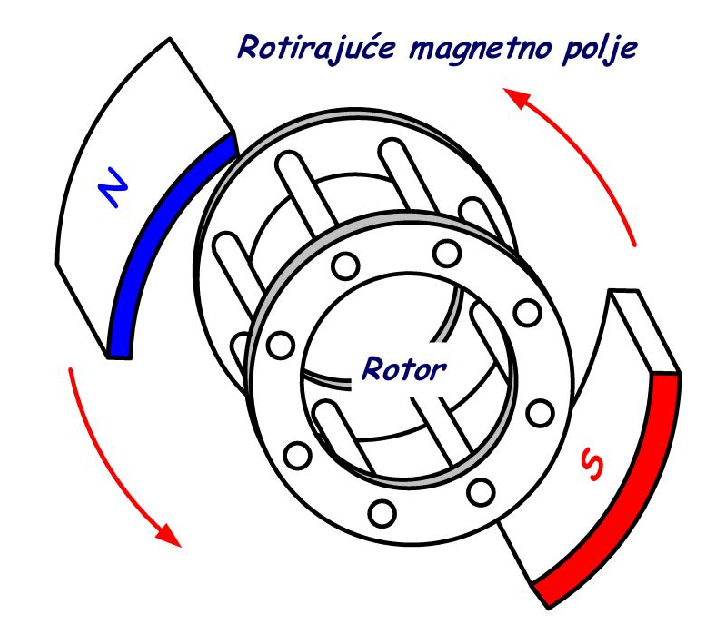
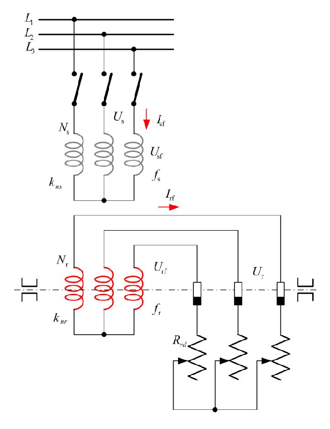
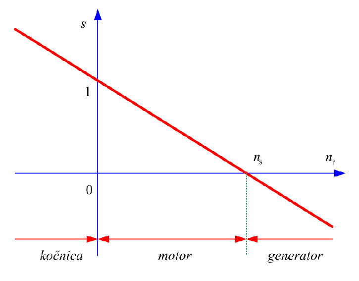

# Zadatak 28 — Kavezni asinhroni motor: klizanje, rotorska frekvencija i brzine obrtnih polja

## Postavka

Za četvoropolni kavezni asinhroni motor odrediti:

a) nazivno klizanje;
b) frekvenciju rotorskih struja i napona;
c) brzinu obrtanja statorskog polja u odnosu na stator;
d) brzinu obrtanja statorskog polja u odnosu na rotor;
e) brzinu obrtanja rotorskog polja u odnosu na rotor;
f) brzinu obrtanja rotorskog polja u odnosu na stator;
g) brzinu obrtanja rotorskog polja u odnosu na statorsko polje.

Podaci motora (sa natpisne pločice): $22\ \mathrm{kW}$, $400\ \mathrm{V}$, $50\ \mathrm{Hz}$, $1460\ \mathrm{min^{-1}}$, sprega D.

> **Prevod na običan jezik:** Imamo običan trofazni motor sa "kavezom" umesto namotanog rotora (najrasprostranjeniji motor u industriji). Sa njegove pločice znamo: snagu ($22\ \mathrm{kW}$), napon ($400\ \mathrm{V}$), mrežnu frekvenciju ($50\ \mathrm{Hz}$), brzinu vratila pri punom opterećenju ($1460$ obrtaja u minuti) i način vezivanja namotaja (trougao, "D"). "Četvoropolni" znači da magnetno polje mašine ima 4 pola, tj. 2 para polova. Od nas se traži da izračunamo koliko rotor "kasni" za obrtnim poljem (to kašnjenje se zove *klizanje*), koju frekvenciju zbog tog kašnjenja imaju struje u rotoru, i zatim da "popišemo" brzine dva obrtna polja (statorskog i rotorskog) gledano iz tri različite perspektive: sa nepokretnog statora, sa rotora koji se vrti, i jedno polje u odnosu na drugo. Zadatak je čista "gimnastika referentnih sistema" — nema teških formula, ali traži da potpuno razumemo ko se u mašini vrti kojom brzinom i u odnosu na šta.

## Podaci

| Veličina | Oznaka | Vrednost | Šta ta veličina fizički znači |
|---|---|---|---|
| Nazivna (mehanička) snaga | $P_{\mathrm{n}}$ | $22\ \mathrm{kW}$ | Snaga koju motor pri nazivnom režimu predaje na vratilu. U ovom zadatku se **ne koristi** u računu — samo identifikuje motor. |
| Nazivni (linijski) napon | $U_{\mathrm{n}}$ | $400\ \mathrm{V}$ | Napon mreže na koju se motor priključuje. Takođe se **ne koristi** u računu. |
| Statorska frekvencija | $f_s$ | $50\ \mathrm{Hz}$ | Frekvencija napona i struja mreže koja napaja stator; ona diktira brzinu obrtnog polja. |
| Nazivna brzina rotora | $n_{\mathrm{rn}}$ | $1460\ \mathrm{min^{-1}}$ | Brzina kojom se vratilo (rotor) stvarno obrće kada motor daje nazivnu snagu. |
| Sprega statora | — | D (trougao) | Način vezivanja tri fazna namotaja statora. **Ne koristi se** u računu. |
| Broj polova | $2p$ | $4$ | Magnetno polje mašine ima 4 pola (2 severna + 2 južna), tj. broj **pari polova** je $p = 2$. Skriven je u reči "četvoropolni". |

Obrati pažnju: od svih podataka sa pločice za račun su nam zaista potrebni samo $f_s = 50\ \mathrm{Hz}$, $n_{\mathrm{rn}} = 1460\ \mathrm{min^{-1}}$ i $p = 2$. Snaga, napon i sprega su tu da opišu motor — i da te nauče da iz gomile podataka izdvojiš one koji su bitni.

## Šta se traži i zašto

**a) Nazivno klizanje $s_{\mathrm{n}}$.** Klizanje je relativna mera koliko rotor zaostaje za obrtnim poljem statora. To je *najvažnija promenljiva* asinhrone mašine: od nje zavise rotorska frekvencija, struje, moment i gubici. Inženjera zanima jer malo klizanje znači male gubitke u rotoru — po njemu se odmah vidi da li je mašina "zdrava" i u kom režimu radi.

**b) Rotorska frekvencija $f_{\mathrm{rn}}$.** Struje i naponi koji se indukuju u rotoru nemaju mrežnu frekvenciju od $50\ \mathrm{Hz}$, nego mnogo nižu — srazmernu klizanju. Ta frekvencija određuje ponašanje rotorskog kola (npr. njegovu reaktansu) i bitna je za sve dalje proračune asinhronih mašina.

**c)–g) Pet brzina obrtanja.** U asinhronoj mašini postoje *dva* obrtna magnetna polja (statorsko i rotorsko) i *dva* moguća "posmatrača" (nepokretni stator i rotor koji se vrti). Zadatak traži da svaku kombinaciju izračunamo. Ovo nije puko prebrojavanje: konačni zaključak (tačka g) je fundamentalan — oba polja se u odnosu na stator vrte *istom*, sinhronom brzinom, i baš zato mašina može da razvija stalan (vremenski konstantan) moment.

**Plan rešavanja:**
1. Iz $f_s$ i $p$ izračunamo sinhronu brzinu $n_s$ — brzinu statorskog obrtnog polja.
2. Iz $n_s$ i $n_{\mathrm{rn}}$ izračunamo nazivno klizanje $s_{\mathrm{n}}$ (tačka a).
3. Pomoću $f_r = s \cdot f_s$ dobijemo rotorsku frekvenciju (tačka b).
4. Brzina statorskog polja u odnosu na stator je prosto $n_s$ (tačka c), a u odnosu na rotor je razlika $n_s - n_r$ (tačka d).
5. Rotorske struje frekvencije $f_r$ prave *svoje* obrtno polje; njegova brzina u odnosu na rotor sledi iz iste formule kao za stator, samo sa $f_r$ umesto $f_s$ (tačka e).
6. Sabiranjem brzine rotora i brzine rotorskog polja u odnosu na rotor dobijamo brzinu rotorskog polja u odnosu na stator (tačka f), a oduzimanjem od $n_s$ brzinu rotorskog polja u odnosu na statorsko polje (tačka g).

## Potrebna teorija — mini-lekcije

### Mini-lekcija 1: Šta je asinhroni motor i šta znači "kavezni"

**Asinhroni (indukcioni) motor** je mašina naizmenične struje kod koje se u rotor energija ne dovodi žicama, nego se struje u rotoru *indukuju* — kao u sekundaru transformatora. Postoje dve izvedbe rotora:

- **Kavezni rotor:** u žlebovima rotora su neizolovane provodne šipke, na oba kraja kratko spojene prstenovima. Cela konstrukcija liči na kavez za veverice — otud ime. Rotor je trajno kratko spojen, nema izvoda, nema četkica: jeftin, robustan, bez održavanja. Naš motor je ovakav.
- **Kliznokolutni (namotani) rotor:** rotor ima pravi trofazni namotaj čiji su krajevi izvedeni na klizne kolutove (prstenove), pa se spolja, preko četkica, u rotorsko kolo može dodati otpornik. Ovo je *opštiji* slučaj — kavezni rotor je specijalan slučaj u kome je rotor uvek kratko spojen — pa se teorija obično izlaže na kliznokolutnoj mašini, a važi za obe.

### Mini-lekcija 2: Obrtno magnetno polje i sinhrona brzina

Kada se tri fazna namotaja statora, prostorno pomerena za po $120^\circ$, napajaju trofaznim strujama (vremenski pomerenim za po $120^\circ$), njihova magnetna polja se sabiraju u jedno rezultantno polje **konstantne amplitude koje rotira** — obrtno magnetno polje. To je isti mehanizam kao kod sinhrone mašine.

Brzina tog polja zove se **sinhrona brzina** i iznosi:

$$n_s = \frac{60 \cdot f_s}{p} = \mathrm{konst}\ \left[\mathrm{min^{-1}}\right]$$

gde je:
- $n_s$ — sinhrona brzina, u obrtajima u minuti $[\mathrm{min^{-1}}]$;
- $f_s$ — frekvencija statorskih struja $[\mathrm{Hz}]$;
- $p$ — **broj pari polova** (ne broj polova!);
- $60$ — pretvara "obrtaje u sekundi" u "obrtaje u minuti" (jer $1\ \mathrm{Hz} = 1$ ciklus u sekundi, a minut ima $60$ sekundi).

**Odakle formula?** Za jedan period struje ($1/f_s$ sekundi) obrtno polje dvopolne mašine ($p=1$) napravi tačno jedan pun obrtaj — polje "prati" struju. Ako mašina ima $p$ pari polova, ista električna promena "pomeri" polje samo za $1/p$ punog kruga (jer se magnetna slika N–S–N–S… ponavlja $p$ puta po obimu), pa je mehanička brzina $p$ puta manja. Zato polje pravi $f_s/p$ obrtaja u sekundi, tj. $60 f_s / p$ obrtaja u minuti.

**Intuicija za pare polova:** "četvoropolni" motor ima polje sa 4 pola: N–S–N–S po obimu. To su **2 para** polova, dakle $p = 2$. Na mreži od $50\ \mathrm{Hz}$: $n_s = 60 \cdot 50 / 2 = 1500\ \mathrm{min^{-1}}$. (Zapamti tipične vrednosti na $50\ \mathrm{Hz}$: $p=1 \to 3000$, $p=2 \to 1500$, $p=3 \to 1000$, $p=4 \to 750\ \mathrm{min^{-1}}$.)

Ista brzina izražena kao ugaona brzina u radijanima u sekundi:

$$\omega_s = \frac{2 \cdot \pi \cdot f_s}{p} = \frac{2 \cdot \pi \cdot n_s}{60}$$

Prvi oblik kaže: električna ugaona učestanost $2\pi f_s$ podeljena brojem pari polova daje mehaničku ugaonu brzinu. Drugi oblik je čisto preračunavanje jedinica: jedan obrtaj je $2\pi$ radijana, a minut je $60$ sekundi, pa se $n_s$ obrtaja u minuti pretvara u $\omega_s = 2\pi n_s / 60$ radijana u sekundi. Obe konvencije ($n$ u $\mathrm{min^{-1}}$ i $\omega$ u $\mathrm{rad/s}$) srećeš ravnopravno u literaturi — u ovom zadatku radimo u $\mathrm{min^{-1}}$ jer su tako zadati podaci.

### Mini-lekcija 3: Princip rada — zašto se rotor uopšte vrti

Sledeća slika prikazuje sam princip: obrtno magnetno polje obuhvata kavezni rotor sa provodnim šipkama; detaljno čitanje slike je u bloku ispod nje.

**Slika 28.1 —** Princip rada asinhrone mašine: rotirajuće magnetno polje statora obuhvata kratko spojeni (kavezni) rotor.

> **Kako čitati sliku 28.1:** Ovo je pojednostavljen, "crtani" prikaz bez osa i brojeva —
> čitaju se samo elementi i smerovi. U sredini je kavezni rotor (natpis "Rotor"): dva čeona
> prstena (nacrtana kao kolutovi sa vidljivim otvorima) međusobno spojena kosim provodnim
> šipkama — to je onaj "kavez za veverice" iz mini-lekcije 1; šipke su neizolovane i na oba
> kraja kratko spojene prstenovima. Oko rotora su dva lučna magnetna pola koji simbolizuju
> obrtno polje statora: plavi luk označen N (severni pol, gore levo) i crveni luk označen S
> (južni pol, dole desno) — u stvarnoj mašini ti polovi ne postoje kao komadi gvožđa, nego
> ih stvara trofazni sistem struja u statorskim namotajima. Dve crvene zakrivljene strelice
> (jedna gore desno, druga dole levo) pokazuju smer obrtanja para polova — na crtežu
> suprotno kazaljci na satu; plavi natpis "Rotirajuće magnetno polje" imenuje upravo to.
> Šta treba da zaključiš: polje kruži, a rotor u prvom trenutku miruje, pa polje "seče"
> šipke — indukuje se elektromotorna sila, kroz kratko spojen kavez potekne struja, na
> provodnike sa strujom u polju deluje sila — i rotor kreće za poljem, ali ga (kako
> objašnjava lanac uzroka i posledica u nastavku) nikada ne sustiže.

Lanac uzroka i posledica je sledeći:

1. Obrtno polje statora "seče" provodnike rotora (jer se polje i rotor ne vrte istom brzinom), pa se u njima **indukuje elektromotorna sila** (Faradejev zakon: promena fluksa kroz konturu indukuje napon).
2. Rotor je **kratko spojen** (kavez!), pa ta elektromotorna sila kroz šipke protera **struju**.
3. Provodnik sa strujom nalazi se u magnetnom polju, pa na njega deluje **sila** ($F = B \cdot i \cdot l$), a sve sile zajedno daju **moment** koji vuče rotor u smeru obrtanja polja.

Ključna posledica: rotor motora **nikada ne može da dostigne** sinhronu brzinu. Kada bi je dostigao, polje više ne bi "sečeno" provodnike rotora (ne bi bilo relativnog kretanja), nestala bi indukovana elektromotorna sila, pa struja, pa i moment — i rotor bi usporio. Zato rotor uvek malo "klizi" iza polja; otud i ime *asinhrona* mašina (ne-sinhrona) i ime veličine *klizanje*.

### Mini-lekcija 4: Principijelna šema i oznake

Sledeća slika prikazuje principijelnu (načelnu) šemu asinhrone mašine — nacrtana je kliznokolutna, kao opštiji slučaj; detaljno čitanje šeme je u bloku ispod slike.

**Slika 28.2 —** Principijelna šema kliznokolutne asinhrone mašine sa oznakama.

> **Kako čitati sliku 28.2:** Šemu čitaj kao put energije, odozgo nadole. Na vrhu su tri
> horizontalna voda mreže, označena $L_1$, $L_2$, $L_3$; sa njih se preko trofaznog
> prekidača (tri zadebljane kose crte — kontakti koji se zatvaraju istovremeno) napajaju
> tri statorska fazna namotaja, nacrtana kao tri **sive** zavojnice. Uz njih stoje oznake
> $N_s$ i $k_{ns}$ (broj navojaka i navojni sačinilac statora), $U_s$ i $U_{sf}$ (linijski
> i fazni napon) i $f_s$ (statorska frekvencija), a **crvena** strelica uz dovod označava
> faznu struju $I_{sf}$; donji krajevi namotaja spojeni su u zajedničku tačku (zvezdište).
> Ispod statora — pažnja, **bez ijedne provodne veze između** — nacrtane su tri **crvene**
> zavojnice: rotorski namotaji, sa oznakama $N_r$, $k_{nr}$, naponom $U_{rf}$, frekvencijom
> $f_r$ i strujom $I_{rf}$ (crvena strelica). Boja ovde nosi poruku: sivi (statorski) i
> crveni (rotorski) trofazni sistem povezani su isključivo magnetnim poljem preko
> vazdušnog zazora. Horizontalna crta-tačka linija kroz rotorske namotaje je osa vratila
> (simboli na njenim krajevima označavaju da se rotor obrće), a krajevi rotorskih namotaja
> izvedeni su na tri klizna koluta sa četkicama (pravougaonici sa zacrnjenim kontaktom,
> uz oznaku $U_r$) i dalje na tri promenljiva otpornika $R_{rd}$ (cik-cak simboli sa
> strelicom), spojena u zajedničku tačku — to je spolja dodati otpor u rotorskom kolu,
> koji postoji samo kod kliznokolutne mašine (kod kavezne je rotor direktno kratko
> spojen). Šta treba da zaključiš: asinhrona mašina su dva trofazna sistema — statorski na
> frekvenciji $f_s$ i rotorski na frekvenciji $f_r$ — spregnuta samo magnetno, kao
> transformator čiji se sekundar obrće; značenje svake pojedinačne oznake pobrojano je u
> spisku odmah ispod.

Značenje oznaka na slici (ove oznake koristi cela zbirka, pa ih ovde uvodimo jednom za svagda):

- $U_{sf}$ — statorski fazni napon;
- $U_{rf}$ — rotorski fazni napon;
- $f_s$ — statorska frekvencija;
- $f_r$ — rotorska frekvencija;
- $I_{sf}$ — statorska fazna struja;
- $I_{rf}$ — rotorska fazna struja;
- $n$, $n_r$ — brzina obrtanja rotora (obe oznake znače isto);
- $R_{rd}$ — dodatni otpornik u kolu rotora (postoji samo kod kliznokolutne mašine; kod kavezne ga nema, rotor je direktno kratko spojen);
- $N_s$, $N_r$ — broj navojaka po fazi statora (s) i rotora (r);
- $k_{ns}$, $k_{nr}$ — rezultantni navojni sačinilac namotaja statora i rotora (broj manji od 1 koji uzima u obzir da namotaj nije skoncentrisan u jednom žlebu, pa je efektivan broj navojaka nešto manji od stvarnog).

Za naš zadatak sa ove šeme treba "poneti" samo sliku o dva spregnuta trofazna sistema: statorski sa frekvencijom $f_s$ i rotorski sa frekvencijom $f_r$, spojeni samo magnetnim poljem preko zazora.

### Mini-lekcija 5: Klizanje — apsolutno, relativno i u procentima

**Apsolutno klizanje** je razlika brzina statorskog polja i rotora, tj. brzina statorskog polja *gledano sa rotora*:

$$n_{\mathrm{kliz}} = n_k = n_s - n_r$$

odnosno, isto to u ugaonim brzinama:

$$\omega_k = \omega_s - \omega_r$$

gde je $n_r$ (odnosno $\omega_r$) brzina obrtanja rotora, a indeks $k$ dolazi od "klizna" brzina. Ovo je *dimenziona* veličina (u $\mathrm{min^{-1}}$ ili $\mathrm{rad/s}$).

**Relativno klizanje** (ili prosto: klizanje) $s$ je ta ista razlika, ali podeljena sinhronom brzinom — dakle bezdimenzioni broj koji kaže *koji deo* sinhrone brzine rotor "gubi":

$$s = \frac{n_k}{n_s} = \frac{n_s - n_r}{n_s}$$

$$s = \frac{\omega_k}{\omega_s} = \frac{\omega_s - \omega_r}{\omega_s}$$

Obe verzije daju isti broj, jer se faktor pretvaranja jedinica ($2\pi/60$) u razlomku skrati. U procentima:

$$s\,[\%] = \frac{n_s - n_r}{n_s} \cdot 100$$

**Zašto klizanje mora biti malo?** Pokazaće se (u kasnijim zadacima zbirke) da su gubici u bakru rotora direktno srazmerni klizanju: što rotor više klizi, to se veći deo primljene snage pretvara u toplotu u rotoru umesto u mehanički rad. Zato dobro projektovan motor u normalnom radu ima klizanje svega **od $0{,}1\ \%$ do $5\ \%$** — i baš zato se klizanje najčešće iskazuje u procentima (u "običnim" jedinicama bio bi to nezgodan broj tipa $0{,}0266$).

### Mini-lekcija 6: Znak klizanja i režimi rada

Vrednost klizanja odmah otkriva u kom režimu mašina radi. Prođimo kroz sve slučajeve (svuda pretpostavljamo da se polje vrti u "pozitivnom" smeru, $n_s > 0$):

- $n_r = n_s \Rightarrow s = 0$ — rotor se vrti tačno sinhrono; nema indukovanja, nema momenta (idealni prazan hod).
- $n_r = 0 \Rightarrow s = 1$ — rotor stoji (zakočen ili trenutak polaska).
- $0 < n_r < n_s \Rightarrow 0 < s < 1$ — rotor zaostaje za poljem: **motorski režim** (mašina vuče teret; tu je i naš motor).
- $n_r > n_s \Rightarrow s < 0$ — rotor je pogonjen spolja brže od polja, prednjači mu: **generatorski režim** (mašina predaje električnu energiju mreži).
- $n_r < 0 \Rightarrow s > 1$ — rotor se vrti *suprotno* od polja: **režim kočnice** (obrtno polje aktivno koči rotor; ovako se npr. naglo zaustavljaju pogoni).

Sledeća slika sve ovo sažima u jedan grafik; detaljno čitanje je u bloku ispod slike.

**Slika 28.3 —** Klizanje u zavisnosti od brzine obrtanja rotora i režimi rada asinhrone mašine.

> **Kako čitati sliku 28.3:** Ose su nacrtane plavo: horizontalna osa je brzina rotora
> $n_r$ (u $\mathrm{min^{-1}}$; raste udesno, a levo od koordinatnog početka su negativne
> brzine — rotor koji se vrti suprotno od polja), vertikalna osa je klizanje $s$
> (bezdimenzioni broj). Debela **crvena** prava je zavisnost $s(n_r) = (n_s - n_r)/n_s$ —
> opadajuća prava linija, jer je $s$ linearna (opadajuća) funkcija od $n_r$. Dve
> karakteristične tačke su obeležene na osama: presek sa vertikalnom osom u $s = 1$ (rotor
> stoji, $n_r = 0$ — trenutak polaska) i presek sa horizontalnom osom u $n_r = n_s$
> (sinhronizam, $s = 0$; zelena isprekidana vertikala spušta tu tačku na donju traku; za
> naš motor $n_s = 1500\ \mathrm{min^{-1}}$). Ispod grafika crvena traka sa strelicama
> deli opseg brzina na tri režima, ispisana kurzivom: "kočnica" levo od $n_r = 0$ (tamo je
> $s > 1$), "motor" između $0$ i $n_s$ (tamo je $0 < s < 1$; nazivna tačka našeg motora,
> $n_r = 1460\ \mathrm{min^{-1}}$ uz $s = 0{,}0267$, leži u ovom pojasu, sasvim blizu
> desnog kraja) i "generator" desno od $n_s$ (tamo je $s < 0$). Šta treba da zaključiš:
> već sam znak i veličina klizanja jednoznačno kazuju režim rada mašine — dovoljno je
> uporediti brzinu rotora sa sinhronom brzinom.

### Mini-lekcija 7: Rotorska frekvencija $f_r = s \cdot f_s$

Frekvencija veličina indukovanih u rotoru određena je *relativnom* brzinom kojom polje "promiče" pored rotorskih provodnika, a to je upravo apsolutno klizanje $n_k = n_s - n_r$. Po analogiji sa formulom $n_s = 60 f_s / p$ (koja povezuje brzinu polja i frekvenciju na statoru), na rotoru relativnoj brzini $n_s - n_r$ odgovara frekvencija:

$$f_r = \frac{(n_s - n_r) \cdot p}{60}$$

Ovo je samo formula $n = 60f/p$ "pročitana unazad": $f = n \cdot p / 60$, sa relativnom brzinom umesto $n$. Podelimo li ovu jednačinu sa $f_s = n_s \cdot p / 60$, faktor $p/60$ se skrati:

$$\frac{f_r}{f_s} = \frac{n_s - n_r}{n_s} = s$$

pa dobijamo kompaktan i vrlo važan rezultat:

$$f_r = s \cdot f_s$$

**Intuicija:** kada rotor stoji ($s=1$), mašina je čist transformator i rotor "vidi" punih $f_s = 50\ \mathrm{Hz}$. Kako se rotor zaleće i sustiže polje, relativno kretanje se smanjuje i frekvencija u rotoru pada; pri sinhronizmu ($s=0$) pala bi na nulu. U normalnom radu ($s$ od $0{,}1\ \%$ do $5\ \%$) rotorska frekvencija je svega delić herca do par herca.

### Mini-lekcija 8: Rotorsko obrtno polje i sabiranje brzina

Rotorski provodnici čine trofazni (kod kaveza: višefazni, ali efekat je isti) sistem kroz koji teku naizmenične struje frekvencije $f_r$. **Trofazne rotorske struje prave rotorsko obrtno polje** — potpuno istim mehanizmom kojim trofazne statorske struje prave statorsko polje (mini-lekcija 2). Zato za brzinu rotorskog polja *u odnosu na rotorske namotaje, tj. u odnosu na rotor* važi ista formula, samo sa rotorskom frekvencijom:

$$n_{rp} = \frac{60 \cdot f_r}{p}$$

gde je $n_{rp}$ brzina rotorskog polja u odnosu na rotor (indeks "rp" = rotorsko polje).

Kada brzine merimo iz različitih referentnih sistema, one se **sabiraju** kao u svakodnevnom primeru voza: putnik hoda brzinom $5\ \mathrm{km/h}$ *kroz voz*, voz ide $100\ \mathrm{km/h}$ *u odnosu na prugu*, pa se putnik u odnosu na prugu kreće $105\ \mathrm{km/h}$. Ovde: rotorsko polje se vrti brzinom $n_{rp}$ *u odnosu na rotor*, rotor se vrti brzinom $n_r$ *u odnosu na stator*, pa se rotorsko polje u odnosu na stator vrti brzinom $n_r + n_{rp}$. Videćemo u rešenju da taj zbir ispada tačno $n_s$ — i to nije slučajnost, nego uslov postojanja momenta.

## Rešenje, korak po korak

### Korak 1: Sinhrona brzina statorskog polja

**Zašto ovaj korak:** Nijedna tražena veličina ne može se izračunati bez sinhrone brzine — ona je referentna vrednost prema kojoj se definiše klizanje. Nju izračunavamo iz frekvencije mreže i broja pari polova (mini-lekcija 2).

Opšta formula:

$$n_s = \frac{60 \cdot f_s}{p}$$

Motor je *četvoropolni*: ima $2p = 4$ pola, dakle $p = 2$ para polova. Uvrštavamo $f_s = 50\ \mathrm{Hz}$ i $p = 2$:

$$n_s = \frac{60 \cdot 50}{2} = \frac{3000}{2} = 1500\ \mathrm{min^{-1}}$$

Pošto računamo nazivni režim, pisaćemo i $n_{sn} = n_s = 1500\ \mathrm{min^{-1}}$ (indeks $n$ = nazivno).

**Šta smo dobili:** Statorsko polje se vrti tačno $1500$ obrtaja u minuti — standardna sinhrona brzina četvoropolnih mašina na mreži $50\ \mathrm{Hz}$. Odmah vidimo i da je podatak sa pločice logičan: $1460 < 1500$, rotor zaostaje za poljem, dakle mašina zaista radi kao motor.

### Korak 2 (tačka a): Nazivno klizanje

**Zašto ovaj korak:** Klizanje je definisano kao relativno zaostajanje rotora za poljem (mini-lekcija 5); imamo obe brzine, pa ga direktno računamo.

Opšta formula, u procentima:

$$s_{\mathrm{n}}\,[\%] = \frac{n_{sn} - n_{rn}}{n_{sn}} \cdot 100$$

Uvrštavamo $n_{sn} = 1500\ \mathrm{min^{-1}}$ i $n_{rn} = 1460\ \mathrm{min^{-1}}$:

$$s_{\mathrm{n}}\,[\%] = \frac{1500 - 1460}{1500} \cdot 100 = \frac{40}{1500} \cdot 100 = 0{,}02\overline{6} \cdot 100 \approx 2{,}67\ \%$$

Deljenje $40/1500 = 0{,}026666\ldots$ daje periodičan decimalni zapis (šestica se ponavlja beskonačno), pa je tačna vrednost $s_{\mathrm{n}} = 2{,}6\overline{6}\ \% = 2{,}666\ldots\ \%$, što zaokružujemo na $2{,}67\ \%$.

> **Napomena o originalu:** U zbirci rezultat je zapisan kao $2{,}66^{\bullet}\ [\%]$ — tačkica označava *periodičnu cifru* (šestica se ponavlja: $2{,}666\ldots\ \%$). To je ista vrednost koju smo dobili; nije štamparska greška, samo drugačija konvencija zapisa periodičnog broja.

Za dalji račun trebaće nam i klizanje kao čist (bezdimenzioni) broj:

$$s_{\mathrm{n}} = \frac{40}{1500} = 0{,}0266\overline{6} \approx 0{,}0267$$

**Šta smo dobili:** Rotor pri punom opterećenju zaostaje za poljem za oko $2{,}67\ \%$ — uredno unutar tipičnog opsega $0{,}1$–$5\ \%$ za normalan rad (mini-lekcija 5). Klizanje je pozitivno i manje od 1, što potvrđuje motorski režim.

### Korak 3 (tačka b): Frekvencija rotorskih struja i napona

**Zašto ovaj korak:** Struje i naponi u rotoru indukuju se relativnim kretanjem polja prema rotoru, pa im je frekvencija srazmerna klizanju (mini-lekcija 7).

Prvi način — direktno iz relativne brzine, opšta formula:

$$f_{\mathrm{rn}} = \frac{(n_{sn} - n_{rn}) \cdot p}{60}$$

Uvrštavamo:

$$f_{\mathrm{rn}} = \frac{(1500 - 1460) \cdot 2}{60} = \frac{40 \cdot 2}{60} = \frac{80}{60} = 1{,}33\overline{3}\ \mathrm{Hz} \approx 1{,}33\ \mathrm{Hz}$$

Drugi način — preko klizanja. Iz mini-lekcije 7 znamo:

$$\frac{f_r}{f_s} = \frac{n_s - n_r}{n_s} = s \quad\Longrightarrow\quad f_r = s \cdot f_s$$

Uvrštavamo $s_{\mathrm{n}} = 0{,}0266\overline{6}$ (pažnja: *bezdimenzioni* broj, ne procenti!) i $f_s = 50\ \mathrm{Hz}$:

$$f_{\mathrm{rn}} = 0{,}0266\overline{6} \cdot 50 = 1{,}33\overline{3}\ \mathrm{Hz} \approx 1{,}33\ \mathrm{Hz}$$

Oba puta isti rezultat — kao što i mora biti, jer je druga formula izvedena iz prve. (I ovde je decimalni zapis periodičan: $80/60 = 4/3 = 1{,}333\ldots$; zbirka to označava kao $1{,}33^{\bullet}$.)

**Šta smo dobili:** U rotoru se indukuju struje i naponi frekvencije svega $\approx 1{,}33\ \mathrm{Hz}$ — skoro 40 puta niže od mrežnih $50\ \mathrm{Hz}$. To je i očekivano: rotor skoro sustiže polje, pa polje pored njegovih provodnika promiče vrlo sporo.

### Korak 4 (tačka c): Brzina statorskog polja u odnosu na stator

**Zašto ovaj korak:** Počinjemo "popis" brzina iz raznih perspektiva; najjednostavnija je perspektiva statora, jer je stator nepokretan.

Stator miruje (pričvršćen je za kućište i temelj), pa je brzina statorskog polja u odnosu na stator naprosto sinhrona brzina iz Koraka 1:

$$n_s = 1500\ \mathrm{min^{-1}}$$

**Šta smo dobili:** Posmatrač koji stoji na statoru vidi statorsko polje kako kruži sinhronom brzinom $1500\ \mathrm{min^{-1}}$ — po definiciji sinhrone brzine.

### Korak 5 (tačka d): Brzina statorskog polja u odnosu na rotor

**Zašto ovaj korak:** Sada se "popnemo" na rotor koji se i sam vrti. Za posmatrača koji se vrti zajedno sa rotorom, brzina svega ostalog umanjena je za brzinu rotora — pa statorsko polje više ne izgleda kao da juri $1500\ \mathrm{min^{-1}}$, nego samo za razliku brzina.

To je upravo apsolutno klizanje iz mini-lekcije 5:

$$n_{kn} = n_{sn} - n_{rn}$$

Uvrštavamo:

$$n_{kn} = 1500 - 1460 = 40\ \mathrm{min^{-1}}$$

**Šta smo dobili:** Sa rotora gledano, statorsko polje sporo promiče — samo $40$ obrtaja u minuti. Baš to sporo relativno kretanje indukuje u rotoru struje niske frekvencije od $1{,}33\ \mathrm{Hz}$ (Korak 3): mali relativni pomak polja → niska frekvencija indukovanih veličina.

### Korak 6 (tačka e): Brzina rotorskog polja u odnosu na rotor

**Zašto ovaj korak:** Rotorske struje nisu pasivne — one same prave svoje obrtno polje (mini-lekcija 8). Prvo određujemo koliko se to polje vrti u odnosu na svoje namotaje, tj. u odnosu na rotor.

Po analogiji sa statorom (ista formula, rotorska frekvencija umesto statorske):

$$n_{rp} = \frac{60 \cdot f_r}{p}$$

Uvrštavamo $f_{\mathrm{rn}} = 1{,}33\overline{3}\ \mathrm{Hz}$ i $p = 2$ (broj pari polova je isti za oba polja — rotorski namotaj je izveden za isti broj polova kao statorski, inače mašina ne bi radila):

$$n_{rp} = \frac{60 \cdot 1{,}33\overline{3}}{2} = \frac{80}{2} = 40\ \mathrm{min^{-1}}$$

**Šta smo dobili:** Rotorsko polje klizi po rotoru brzinom $40\ \mathrm{min^{-1}}$ — tačno onoliko koliko statorsko polje promiče pored rotora (Korak 5). Uporedi rezultate koraka 5 i 6: $n_{sn} - n_{rn} = n_{rp} = 40\ \mathrm{min^{-1}}$. To znači da se, gledano sa rotora, oba polja vrte istom brzinom — prvi nagoveštaj zaključka iz tačke g.

### Korak 7 (tačka f): Brzina rotorskog polja u odnosu na stator

**Zašto ovaj korak:** Vraćamo se u perspektivu nepokretnog statora. Brzine iz različitih referentnih sistema slažemo pravilom sabiranja (primer sa vozom iz mini-lekcije 8).

Rotor se u odnosu na stator vrti brzinom $n_{rn}$, a rotorsko polje se u odnosu na rotor vrti brzinom $n_{rp}$ (u istom smeru). Brzina rotorskog polja u odnosu na stator je zbir:

$$n_{rn} + n_{rp} = 1460 + 40 = 1500\ \mathrm{min^{-1}} = n_s$$

**Šta smo dobili:** Rotorsko polje se u odnosu na stator vrti *tačno sinhronom brzinom* — istom brzinom kao i statorsko polje! Rotor mehanički zaostaje ($1460\ \mathrm{min^{-1}}$), ali polje koje njegove struje prave "dobija nazad" tačno onih $40\ \mathrm{min^{-1}}$ koliko rotor kasni. Ovo nije numerička slučajnost: $n_r + n_{rp} = n_r + \frac{60 f_r}{p} = n_r + \frac{60 \cdot s f_s}{p} = n_r + s \cdot n_s = n_r + (n_s - n_r) = n_s$ — važi za *svako* klizanje, tj. pri svakoj brzini rotora.

### Korak 8 (tačka g): Brzina rotorskog polja u odnosu na statorsko polje

**Zašto ovaj korak:** Poslednja i najvažnija perspektiva — jedno polje gledano iz drugog. Ona odlučuje da li polja mogu da razvijaju stalan moment.

Oba polja se u odnosu na stator vrte istom, sinhronom brzinom (Korak 4 i Korak 7), pa je njihova relativna brzina:

$$n_s - (n_{rn} + n_{rp}) = 1500 - 1500 = 0\ \mathrm{min^{-1}}$$

**Šta smo dobili:** Rotorsko i statorsko polje **miruju jedno u odnosu na drugo** — vrte se "u koraku", kao dva magneta zalepljena na isti nevidljivi točak. Ovo je fundamentalan rezultat: *uslov da uopšte dođe do elektromagnetne konverzije energije jeste da se statorsko i rotorsko polje vrte istom brzinom.* Samo tada je njihov međusobni ugao konstantan, pa je i moment koji nastaje njihovom interakcijom vremenski konstantan (da polja klize jedno po drugom, moment bi naizmenično menjao smer i u proseku bio nula). Od opterećenja motora zavisiće intenzitet struja (dakle i jačina polja) statora i rotora, kao i njihov međusobni položaj — ugao između polja — ali njihova relativna brzina ostaje nula u svakom stacionarnom režimu.

## Česte greške i zamke

1. **Broj polova umesto broja pari polova.** "Četvoropolni" znači $2p = 4$, dakle u formulu $n_s = 60 f_s / p$ ide $p = 2$, ne $p = 4$. Ko uvrsti $p=4$, dobije $n_s = 750\ \mathrm{min^{-1}}$ — a onda "klizanje" ispadne negativno ($750 < 1460$) i ceo zadatak se raspadne. Brza kontrola: sinhrona brzina mora biti *prva standardna vrednost iznad* nazivne brzine sa pločice ($1460 \to 1500$, a ne $750$ niti $3000$).
2. **Procenti u formuli $f_r = s \cdot f_s$.** Klizanje u toj formuli mora biti bezdimenzioni broj: $f_r = 0{,}0267 \cdot 50 \approx 1{,}33\ \mathrm{Hz}$. Ko uvrsti $s = 2{,}67$ (procente kao broj), dobije $f_r \approx 133\ \mathrm{Hz}$ — apsurd, jer rotorska frekvencija u motorskom režimu ne može biti veća od statorske.
3. **Klizanje deljeno pogrešnom brzinom.** U imeniocu definicije klizanja stoji sinhrona brzina $n_s = 1500$, a ne nazivna brzina rotora $1460$. Sa pogrešnim imeniocem izlazi $40/1460 = 2{,}74\ \%$ — blizu, ali pogrešno, i takva greška se u složenijim zadacima dalje umnožava.
4. **Mešanje referentnih sistema.** "Brzina rotorskog polja" nije jedan broj — zavisi od toga *odakle gledaš*: sa rotora je $40\ \mathrm{min^{-1}}$, sa statora $1500\ \mathrm{min^{-1}}$, a iz statorskog polja $0$. Uvek prvo reci (ili napiši) u odnosu na šta meriš brzinu, pa tek onda računaj.
5. **Zaključak da se rotorsko polje vrti brzinom rotora.** Polje nije "zalepljeno" za rotorske provodnike — ono klizi po rotoru brzinom $n_{rp} = 60 f_r / p$. Upravo zato rotorsko polje stiže statorsko iako sam rotor zaostaje.

## Rezime rezultata

| Tačka | Tražena veličina | Oznaka | Rezultat |
|---|---|---|---|
| a) | Nazivno klizanje | $s_{\mathrm{n}}$ | $2{,}6\overline{6}\ \% \approx 2{,}67\ \%$ |
| b) | Frekvencija rotorskih struja i napona | $f_{\mathrm{rn}}$ | $\approx 1{,}33\ \mathrm{Hz}$ |
| c) | Brzina statorskog polja u odnosu na stator | $n_s$ | $1500\ \mathrm{min^{-1}}$ |
| d) | Brzina statorskog polja u odnosu na rotor | $n_{kn}$ | $40\ \mathrm{min^{-1}}$ |
| e) | Brzina rotorskog polja u odnosu na rotor | $n_{rp}$ | $40\ \mathrm{min^{-1}}$ |
| f) | Brzina rotorskog polja u odnosu na stator | $n_{rn} + n_{rp}$ | $1500\ \mathrm{min^{-1}} = n_s$ |
| g) | Brzina rotorskog polja u odnosu na statorsko polje | — | $0\ \mathrm{min^{-1}}$ |

## Provera smisla

1. **Ukrštena provera b) i a):** Odnos frekvencija mora biti jednak klizanju: $f_{\mathrm{rn}}/f_s = 1{,}33\overline{3}/50 = 0{,}0266\overline{6} = s_{\mathrm{n}}$. Slaže se tačno — dva nezavisno izračunata rezultata su međusobno konzistentna.
2. **Poređenje sa tipičnim vrednostima:** Klizanje od $2{,}67\ \%$ leži unutar opsega $0{,}1$–$5\ \%$ koji teorija predviđa za normalan rad; da smo dobili npr. $27\ \%$ ili $-3\ \%$, znali bismo da smo negde pogrešili (verovatno u broju pari polova ili u imeniocu).
3. **Granični slučaj:** Stavimo li u naše formule $n_r = 0$ (zakočen rotor): $s = 1$, $f_r = f_s = 50\ \mathrm{Hz}$, $n_{rp} = 60 \cdot 50/2 = 1500\ \mathrm{min^{-1}}$, pa je brzina rotorskog polja prema statoru $n_r + n_{rp} = 0 + 1500 = 1500\ \mathrm{min^{-1}} = n_s$. Identitet $n_r + n_{rp} = n_s$ opstaje i u ekstremu — formula "drži vodu" za svaku brzinu rotora, kako smo i algebarski pokazali u Koraku 7.
4. **Dimenziona provera:** $\dfrac{60\ [\mathrm{s/min}] \cdot f\ [1/\mathrm{s}]}{p\ [-]}$ daje $[1/\mathrm{min}] = [\mathrm{min^{-1}}]$ — obrtaji u minuti, kako i treba; slično, $\dfrac{(n_s-n_r)\ [\mathrm{min^{-1}}] \cdot p}{60\ [\mathrm{s/min}]}$ daje $[1/\mathrm{s}] = [\mathrm{Hz}]$, kako i treba za frekvenciju.
