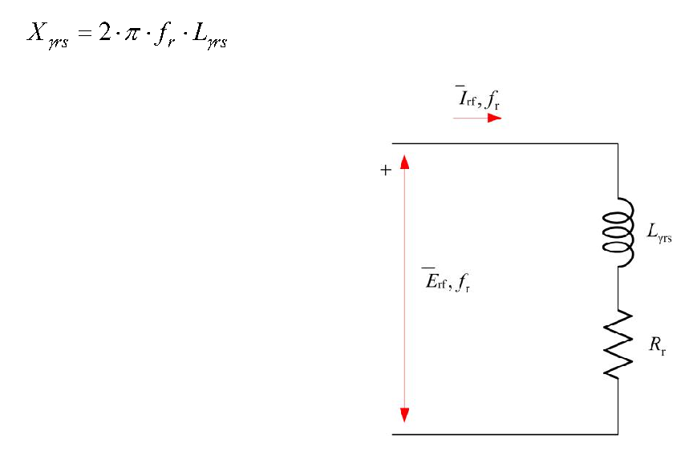
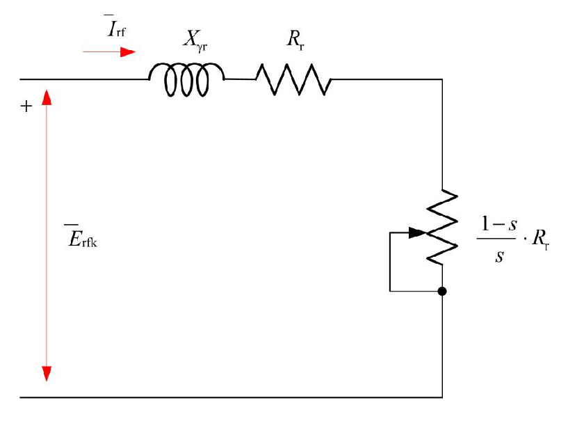

# Zadatak 29 — Struja faze rotora kliznokolutnog motora preko ekvivalentnog kola rotora svedenog na statorsku učestanost

## Postavka

Kliznokolutni asinhroni motor ima odnos transformacije $m_e = 4{,}0042$, otpor po fazi rotora
$0{,}233\ \Omega$, a induktivnost rasipanja jedne faze rotora $0{,}22\ \mathrm{mH}$. Motor je
priključen na mrežu linijskog napona $2\ \mathrm{kV}$ učestanosti $50\ \mathrm{Hz}$ i pri tome daje
na vratilu snagu od $247\ \mathrm{kW}$, uz klizanje od $1{,}8\ \%$. Pri navedenom opterećenju
elektromotorna sila statora iznosi $93\ \%$ mrežnog napona. Odrediti struju jedne faze rotora pri
navedenom opterećenju.

> **Prevod na običan jezik:** Imamo asinhroni motor čiji je rotor namotan (nije kavezni), pa mu se
> krajevi namotaja izvode napolje preko kliznih kolutova — zato se zove „kliznokolutni". Znamo
> koliko puta je statorski namotaj „jači" od rotorskog (odnos transformacije, kao kod
> transformatora), znamo otpor i rasipnu induktivnost rotorskog namotaja, napon i učestanost mreže,
> i znamo da se rotor okreće tek malo sporije od obrtnog polja (klizanje svega $1{,}8\ \%$).
> Rečeno nam je i koliki deo mrežnog napona „preživi" do indukovane elektromotorne sile statora
> ($93\ \%$). Treba da izračunamo koliku struju vuče jedna faza rotorskog namotaja. Da bismo to
> uradili, prvo ćemo izvesti ekvivalentno električno kolo rotora — malu „šemu" koja se ponaša
> isto kao stvarni obrtni rotor, ali se u njoj računa jednostavno, kao da rotor miruje.

## Podaci

| Veličina | Oznaka | Vrednost | Šta ta veličina fizički znači |
|---|---|---|---|
| Odnos transformacije | $m_e$ | $4{,}0042$ | Koliko puta je efektivni broj navojaka statora veći od rotorskog; isti odnos važi i za indukovane napone (kao odnos transformacije transformatora). |
| Otpor po fazi rotora | $R_r$ | $0{,}233\ \Omega$ (zadato; u računu $0{,}0233\ \Omega$ — vidi napomenu) | Omska otpornost bakra jedne faze rotorskog namotaja; na njoj nastaju Džulovi (toplotni) gubici rotora. |
| Induktivnost rasipanja faze rotora | $L_{\gamma rs}$ | $0{,}22\ \mathrm{mH} = 0{,}22\cdot 10^{-3}\ \mathrm{H}$ | Deo fluksa rotorske faze koji se „rasipa" — obuhvata samo rotorski namotaj i ne stiže do statora; taj deo ne učestvuje u prenosu energije, ali pravi pad napona. |
| Linijski (mrežni) napon | $U$ | $2\ \mathrm{kV} = 2000\ \mathrm{V}$ | Napon između dva fazna provodnika mreže na koju je stator priključen. |
| Učestanost mreže (statorska) | $f_s$ | $50\ \mathrm{Hz}$ | Učestanost napona i struja statora; ona određuje brzinu obrtnog polja. |
| Snaga na vratilu | $P$ | $247\ \mathrm{kW}$ | Korisna mehanička snaga koju motor predaje pogonjenoj mašini; ovde služi samo da opiše radnu tačku („navedeno opterećenje"). |
| Klizanje | $s$ | $1{,}8\ \% = 0{,}018$ | Relativno zaostajanje rotora za obrtnim poljem; ključni podatak za rotorsko kolo. |
| EMS statora (po uslovu zadatka) | $E_{sf}$ | $0{,}93 \cdot U_f$ | Indukovana elektromotorna sila jedne faze statora iznosi $93\ \%$ faznog napona; preostalih $7\ \%$ „pojede" pad napona na rednoj impedansi statora. |

> **Napomena o originalu:** U postavci originalne zbirke piše da je otpor po fazi rotora
> $0{,}233\ \Omega$, ali u završnom računu zbirka uvrštava $R_r = 0{,}0233\ \Omega$ i dobija
> $I_{rf} = 206{,}9\ \mathrm{A}$ — negde se potkrala decimalna (štamparska) greška. Fizika presuđuje
> u korist manje vrednosti: kod asinhronog motora Džulovi gubici rotora čine tačno $s$-ti deo snage
> obrtnog polja, dakle ovde oko $1{,}8\ \%$ od $\approx 250\ \mathrm{kW}$, tj. oko
> $4{,}5\ \mathrm{kW}$. Uz rotorsku struju reda $200\text{–}250\ \mathrm{A}$ to odgovara otporu
> $R_r \approx 0{,}02\text{–}0{,}04\ \Omega$. Sa doslovno pročitanih $0{,}233\ \Omega$ gubici u
> rotoru bi bili reda $40\ \mathrm{kW}$ (preko $15\ \%$ snage!), što je u direktnoj suprotnosti sa
> zadatim klizanjem od $1{,}8\ \%$, a struja bi ispala svega $20{,}7\ \mathrm{A}$ — apsurdno malo
> za motor od $247\ \mathrm{kW}$. Zato u rešenju, kao i zbirka, računamo sa
> $R_r = 0{,}0233\ \Omega$; time se reprodukuje i konačan rezultat zbirke.

## Šta se traži i zašto

**Traži se:** struja jedne faze rotora $I_{rf}$ (stvarna struja koja teče kroz rotorski namotaj) pri
navedenom opterećenju.

**Zašto to inženjera zanima:** rotorska struja određuje zagrevanje rotorskog namotaja, dimenzionisanje
provodnika rotora, kliznih kolutova i četkica, kao i izbor eventualnih spoljašnjih otpornika koji se
kod kliznokolutnih motora vezuju na rotor (za ublažavanje polaska ili regulaciju brzine). Ako
pogrešno procenimo $I_{rf}$, rotor može pregoreti ili biti nepotrebno predimenzionisan.

**Plan rešavanja (običnim jezikom):**

1. Od linijskog napona mreže dođemo do faznog napona statora (sprega zvezda: podelimo sa $\sqrt{3}$),
   pa uzmemo $93\ \%$ od toga — to je indukovana EMS statora $E_{sf}$.
2. Podelimo $E_{sf}$ odnosom transformacije $m_e$ i dobijemo EMS ukočenog (mirujućeg) rotora
   $E_{rfk}$ — to je napon koji „vidi" rotorsko kolo kada rotor stoji.
3. Izračunamo reaktansu rasipanja rotora na statorskoj učestanosti,
   $X_{\gamma r} = 2\pi f_s L_{\gamma rs}$.
4. Izvedemo (u teorijskom delu) ekvivalentno kolo rotora „svedeno" na statorsku učestanost: izvor
   $E_{rfk}$, reaktansa $X_{\gamma r}$ i fiktivni otpor $R_r/s$ — kolo koje daje istu struju kao
   stvarni obrtni rotor.
5. Struju rotora dobijemo prosto Omovim zakonom za to kolo:
   $I_{rf} = E_{rfk}\big/\sqrt{(R_r/s)^2 + X_{\gamma r}^2}$.

## Potrebna teorija — mini-lekcije

Originalna zbirka celo ovo izvođenje daje unutar rešenja; ovde ga iznosimo unapred, korak po korak,
da bi samo rešenje bilo čisto uvrštavanje brojeva.

### Mini-lekcija 1: Kliznokolutni asinhroni motor, sinhrona brzina i klizanje

Asinhroni motor ima trofazni namotaj na statoru koji, priključen na mrežu učestanosti $f_s$, stvara
**obrtno magnetno polje**. Ono se obrće **sinhronom brzinom**:

$$n_s = \frac{60 \cdot f_s}{p}\ \ [\mathrm{ob/min}],$$

gde je $p$ broj pari polova namotaja (isti izraz, pročitan unazad, daje statorsku učestanost:
$f_s = n_s\, p/60$). Kod **kliznokolutnog** motora i rotor nosi pravi trofazni namotaj, čiji su
krajevi izvedeni na tri klizna koluta (prstena) na osovini; preko četkica im se spolja može
pristupiti — npr. dodati otpornici. Rotor se u motornom režimu obrće brzinom $n$ **malo manjom** od
$n_s$: kad bi se obrtao tačno sinhrono, polje se ne bi kretalo u odnosu na rotorske provodnike, ne bi
bilo indukovanja, pa ni struje ni momenta. To relativno zaostajanje meri **klizanje**:

$$s = \frac{n_s - n}{n_s}.$$

Klizanje je bezdimenziona veličina: $s = 1$ znači da rotor stoji (ukočen je), $s = 0$ da se obrće
sinhrono; u normalnom radu $s$ je mali broj, tipično $1\text{–}5\ \%$. Kod nas je $s = 0{,}018$ —
rotor zaostaje za poljem samo $1{,}8\ \%$.

### Mini-lekcija 2: Rotorska učestanost $f_r = s \cdot f_s$

Napone u rotorskim provodnicima indukuje **relativno kretanje polja u odnosu na rotor**. Polje ide
brzinom $n_s$, rotor brzinom $n$, pa polje „klizi" preko rotora brzinom $n_K = n_s - n$. Učestanost
indukovanih rotorskih veličina zato je (po istoj formuli kao za stator, samo sa relativnom brzinom):

$$f_r = \frac{n_K \cdot p}{60} = \frac{(n_s - n)\cdot p}{60}.$$

Podelimo li ovaj izraz statorskom učestanošću $f_s = n_s\,p/60$, faktor $p/60$ se skrati:

$$\frac{f_r}{f_s} = \frac{(n_s - n)\,p/60}{n_s\,p/60} = \frac{n_s - n}{n_s} = s
\quad\Longrightarrow\quad f_r = s \cdot f_s.$$

**Intuicija:** što se rotor brže „prišunja" polju, to polje sporije prelazi preko njegovih
provodnika, pa je učestanost rotorskih struja niža. Kod nas:
$f_r = 0{,}018 \cdot 50\ \mathrm{Hz} = 0{,}9\ \mathrm{Hz}$ — rotorske veličine trepere manje od
jednom u sekundi! Ovo je ključna činjenica: **stator i rotor rade na različitim učestanostima**, i
baš zato nam treba „svođenje" na jednu zajedničku učestanost.

### Mini-lekcija 3: Indukovana EMS namotaja i odnos transformacije

Efektivna vrednost elektromotorne sile (EMS) indukovane u jednoj fazi naizmeničnog namotaja glasi:

$$E = \sqrt{2}\,\pi \cdot \Phi \cdot f \cdot N \cdot k_n \;(\approx 4{,}44 \cdot f\, N\, k_n\, \Phi),$$

gde je $\Phi$ maksimalna vrednost magnetnog fluksa po polu, $f$ učestanost promene fluksa u tom
namotaju, $N$ broj navojaka po fazi, a $k_n$ **navojni koeficijent** (broj malo manji od 1 koji
uračunava da navojci nisu svi na istom mestu, pa se njihovi doprinosi ne sabiraju baš idealno).
**Poreklo formule u dve rečenice:** po Faradejevom zakonu, maksimalna EMS sinusno promenljivog fluksa
je $E_{max} = \omega N k_n \Phi = 2\pi f N k_n \Phi$; efektivna vrednost sinusoide je maksimalna
podeljena sa $\sqrt{2}$, pa ostane $2\pi/\sqrt{2} = \sqrt{2}\,\pi \approx 4{,}44$.

Isti zajednički fluks $\Phi$ prolazi i kroz stator i kroz rotor, ali stator „vidi" učestanost $f_s$,
a rotor $f_r$. Odnos faznih EMS statora i rotora (za rotor koji se obrće, $n \neq n_s$, dakle
$f_r \neq f_s$) je zato:

$$\frac{E_{sf}}{E_{rf}}
= \frac{\sqrt{2}\,\pi \cdot \Phi \cdot f_s \cdot N_s \cdot k_{ns}}
        {\sqrt{2}\,\pi \cdot \Phi \cdot f_r \cdot N_r \cdot k_{nr}}
= \frac{N_s\, k_{ns}}{N_r\, k_{nr}} \cdot \frac{f_s}{f_r}
= \frac{N_s\, k_{ns}}{N_r\, k_{nr}} \cdot \frac{1}{s},$$

gde su $N_s, k_{ns}$ broj navojaka i navojni koeficijent statora, $N_r, k_{nr}$ isto za rotor, a u
poslednjem koraku smo iskoristili $f_r/f_s = s$ iz mini-lekcije 2 (pa je $f_s/f_r = 1/s$). Količnik

$$m_e = \frac{N_s\, k_{ns}}{N_r\, k_{nr}}$$

zove se **odnos transformacije** asinhronog motora — potpuno analogan odnosu transformacije
transformatora (odnos „efektivnih" brojeva navojaka). Kod nas je zadat: $m_e = 4{,}0042$.

### Mini-lekcija 4: EMS rotora u obrtanju i EMS ukočenog rotora $E_{rfk}$

Preuredimo poslednju jednakost iz mini-lekcije 3 tako da izdvojimo rotorsku EMS. Iz
$\dfrac{E_{sf}}{E_{rf}} = \dfrac{N_s k_{ns}}{N_r k_{nr}} \cdot \dfrac{1}{s}$ unakrsnim množenjem:

$$\frac{E_{rf}}{s} = E_{sf} \cdot \frac{N_r\, k_{nr}}{N_s\, k_{ns}} = \frac{E_{sf}}{m_e}.$$

Desna strana **ne zavisi od klizanja** — to je konstanta mašine za dati fluks. Da vidimo šta ona
fizički predstavlja, ukočimo rotor: tada je $n = 0$, pa $s = 1$ i $f_r = f_s$. EMS rotora u tom
stanju zovemo **EMS rotora kratkog spoja** (ili EMS ukočenog/mirujućeg rotora) $E_{rfk}$; uvrštavanje
$s = 1$ u gornju jednakost daje upravo:

$$E_{rfk} = E_{sf} \cdot \frac{N_r\, k_{nr}}{N_s\, k_{ns}} = \frac{E_{sf}}{m_e}.$$

Pošto je desna strana ista za svako $s$, sledi opšta veza između EMS obrtnog rotora i EMS ukočenog
rotora:

$$\frac{E_{rf}}{s} = E_{rfk} \quad\Longrightarrow\quad E_{rf} = s \cdot E_{rfk}.$$

**Intuicija:** što se rotor brže obrće (manje $s$), to se fluks u odnosu na njega sporije menja, pa
je indukovani napon proporcionalno manji. Pri klizanju od $1{,}8\ \%$ u rotoru se indukuje svega
$1{,}8\ \%$ napona koji bi se indukovao da rotor stoji.

### Mini-lekcija 5: Reaktansa rasipanja rotora zavisi od učestanosti — $X_{\gamma rs} = s \cdot X_{\gamma r}$

Reaktansa induktivnosti je $X = 2\pi f L$ — proporcionalna je učestanosti. Rasipna induktivnost
rotora $L_{\gamma rs}$ je konstanta (određena geometrijom namotaja), ali kroz rotor teku struje
učestanosti $f_r$, pa je **stvarna** reaktansa rasipanja rotora u obrtanju:

$$X_{\gamma rs} = 2\pi \cdot f_r \cdot L_{\gamma rs}.$$

Uvedimo i reaktansu rasipanja rotora **izračunatu na statorskoj učestanosti** (to je reaktansa koju
bi rotor imao da miruje, jer je tada $f_r = f_s$):

$$X_{\gamma r} = 2\pi \cdot f_s \cdot L_{\gamma rs}.$$

Njihov količnik je (posle skraćivanja $2\pi L_{\gamma rs}$):

$$\frac{X_{\gamma rs}}{X_{\gamma r}} = \frac{f_r}{f_s} = s
\quad\Longrightarrow\quad X_{\gamma rs} = s \cdot X_{\gamma r}.$$

Dakle: i EMS rotora i reaktansa rotora se pri obrtanju smanjuju **istim faktorom** $s$ — tu simetriju
ćemo iskoristiti u sledećoj lekciji. Otpor $R_r$, naravno, od učestanosti ne zavisi (zanemarujući
potiskivanje struje) — i ta asimetrija između $R_r$ i $X_{\gamma rs}$ je srž cele priče.

### Mini-lekcija 6: Ekvivalentno kolo obrtnog rotora i svođenje na ukočeni rotor

Jedna faza rotorskog namotaja je zatvoreno kolo: indukovana EMS $E_{rf}$ tera struju kroz sopstveni
otpor $R_r$ i sopstvenu rasipnu reaktansu $X_{\gamma rs}$, vezane na red. Sledeća slika prikazuje
upravo to kolo.

**Slika 29.1 —** Ekvivalentno kolo obrtnog rotora kod kojeg je učestanost indukovane elektromotorne
sile i struje jednaka stvarnoj vrednosti $f_r$.

> **Kako čitati sliku 29.1:** Šema kola jedne faze obrtnog rotora — prati struju po konturi. Na
> levoj strani je crvena dvostrana strelica sa znakom „+" na gornjem kraju: ona označava
> indukovanu elektromotornu silu $\overline{E}_{rf}$, koja je izvor ovog kola (simbol izvora nije
> nacrtan — izvor je predstavljen samo naponskom strelicom). Uz nju stoji i oznaka $f_r$ —
> podsetnik da sve u ovom kolu treperi **rotorskom** učestanošću
> $f_r = s\,f_s = 0{,}9\ \mathrm{Hz}$, a ne mrežnom. Gornjim provodnikom teče struja
> $\overline{I}_{rf}$ (crvena strelica udesno, takođe sa oznakom $f_r$). U desnoj, silaznoj grani
> redno su vezani: rasipna induktivnost rotora $L_{\gamma rs}$ ($0{,}22\ \mathrm{mH}$; njena
> reaktansa na ovoj učestanosti je $X_{\gamma rs} = 2\pi f_r L_{\gamma rs} = 0{,}00124\ \Omega$ —
> upravo tu formulu ispisuje i deo teksta zbirke vidljiv iznad šeme) i otpor namotaja $R_r$
> ($0{,}0233\ \Omega$). Donji provodnik zatvara konturu nazad na izvor. Struja je po Omovom
> zakonu $I_{rf} = E_{rf}\big/\sqrt{R_r^2 + X_{\gamma rs}^2}$, sa
> $E_{rf} = s\,E_{rfk} = 4{,}83\ \mathrm{V}$ — što zaista daje $206{,}9\ \mathrm{A}$ (vidi
> „Proveru smisla"). Šta treba da zaključiš: ovo je fizički „istinito" kolo rotora — mali napon,
> majušna reaktansa, niska učestanost — ali je nezgodno za račun jer mu i izvor i reaktansa i
> učestanost zavise od klizanja; zato ga u nastavku svodimo na kolo ukočenog rotora (slika 29.2).

Po Omovom zakonu za naizmenično kolo (efektivne vrednosti; moduo redne impedanse je
$\sqrt{R^2 + X^2}$), struja u faznom namotaju rotora iznosi:

$$I_{rf} = \frac{E_{rf}}{\sqrt{R_r^2 + X_{\gamma rs}^2}}
        = \frac{E_{rf}}{\sqrt{R_r^2 + \left(2\pi f_r L_{\gamma rs}\right)^2}}.$$

Ovo kolo je tačno, ali nezgodno: i $E_{rf}$ i $X_{\gamma rs}$ i sama učestanost $f_r$ zavise od
klizanja, tj. od radne tačke. Zato sve izrazimo preko veličina **ukočenog** rotora, koje su
konstante mašine. Uvrstimo $E_{rf} = s\,E_{rfk}$ (mini-lekcija 4) i
$X_{\gamma rs} = s\,X_{\gamma r}$ (mini-lekcija 5):

$$I_{rf} = \frac{s \cdot E_{rfk}}{\sqrt{R_r^2 + (s \cdot X_{\gamma r})^2}}.$$

Sada podelimo i brojilac i imenilac sa $s$ (time se vrednost razlomka ne menja). U brojiocu $s$
prosto nestane; u imeniocu $s$ „uvučemo" pod koren kao $s^2$ i podelimo svaki sabirak:

$$I_{rf}
= \frac{E_{rfk}}{\dfrac{\sqrt{R_r^2 + (s X_{\gamma r})^2}}{s}}
= \frac{E_{rfk}}{\sqrt{\dfrac{R_r^2 + s^2 X_{\gamma r}^2}{s^2}}}
= \frac{E_{rfk}}{\sqrt{\left(\dfrac{R_r}{s}\right)^{2} + X_{\gamma r}^{2}}}.$$

Pogledajmo šta smo dobili: **ista struja** $I_{rf}$ bi tekla u zamišljenom kolu u kome je izvor
$E_{rfk}$ (konstantan!), reaktansa $X_{\gamma r}$ (konstantna, na statorskoj učestanosti $f_s$), a
otpor **fiktivna, od klizanja zavisna vrednost** $R_r/s$. Drugim rečima: stvarni obrtni rotor smo
**ekvivalentirali mirujućim (ukočenim) rotorom**. Ekvivalencija je izvršena po vrednosti struje —
oba kola daju istu $I_{rf}$ — ali ne zaboravi da je stvarna učestanost rotorskih napona i struja i
dalje $f_r$, a ne $f_s$; $f_s$ u svedenom kolu je samo računska pogodnost.

Sledeća slika prikazuje to svedeno kolo, u kome je fiktivni otpor $R_r/s$ razdvojen na stvarni
otpor $R_r$ i dodatni promenljivi otpornik $\dfrac{1-s}{s}\cdot R_r$ — zbir ta dva otpora je
upravo fiktivnih $R_r/s$:

$$R_r + \frac{1-s}{s}\,R_r = R_r\left(1 + \frac{1-s}{s}\right) = R_r \cdot \frac{s + 1 - s}{s} = \frac{R_r}{s}. \checkmark$$

**Slika 29.2 —** Predstavljanje obrtnog rotora ekvivalentnim ukočenim rotorom.

> **Kako čitati sliku 29.2:** Šema svedenog (ekvivalentnog) kola rotora — najbolje je čitati je
> uporedo sa slikom 29.1, element po element. Na levoj strani je opet crvena naponska strelica sa
> „+", ali sada označava EMS **ukočenog** rotora $\overline{E}_{rfk} = 268{,}19\ \mathrm{V}$
> (konstantu mašine), bez oznake učestanosti — celo kolo je računski „preseljeno" na statorsku
> učestanost $f_s = 50\ \mathrm{Hz}$. Gornjim provodnikom teče ista struja $\overline{I}_{rf}$
> (crvena strelica udesno) — ekvivalencija je i napravljena tako da struja ostane nepromenjena,
> $206{,}9\ \mathrm{A}$. Na gornjoj grani su redno vezani: rasipna reaktansa
> $X_{\gamma r} = 2\pi f_s L_{\gamma rs} = 0{,}0691\ \Omega$ (uoči razliku u oznakama: na slici
> 29.1 pisala je induktivnost $L_{\gamma rs}$, ovde reaktansa $X_{\gamma r}$, jer je učestanost
> sada fiksirana) i stvarni otpor namotaja $R_r = 0{,}0233\ \Omega$, koji modeluje Džulove
> gubitke u bakru rotora. U desnoj, silaznoj grani je otpornik nacrtan sa kosom strelicom —
> promenljivi (od klizanja zavisni) fiktivni otpor $\dfrac{1-s}{s}\cdot R_r$, koji modeluje
> mehaničku snagu na vratilu; pri $s = 0{,}018$ iznosi $\approx 55\,R_r = 1{,}27\ \Omega$, pa se
> u njemu „troši" ogromna većina snage — slika efikasne mašine pri malom klizanju. Zbir dva
> otpora daje fiktivnih $R_r/s = 1{,}2944\ \Omega$, prema kome je reaktansa $X_{\gamma r}$
> praktično zanemarljiva (kolo je skoro čisto otporno, struja skoro u fazi sa EMS). Šta treba da
> zaključiš: svedeno kolo daje istu struju kao stvarno, ali sa konstantnim izvorom i konstantnom
> reaktansom — sva zavisnost od radne tačke sabijena je u jedan promenljivi otpornik, i baš zato
> je ovo kolo standardni alat za proračun asinhrone mašine.

Zašto se $R_r/s$ deli na dva dela? Fiktivna otpornost $R_r/s$ modeluje **celokupnu aktivnu snagu**
koja sa statora, kroz vazdušni zazor, elektromagnetnom interakcijom prelazi na rotor — tzv. **snagu
obrtnog polja**. Taj iznos se prirodno rastavlja: stvarni otpor $R_r$ modeluje Džulove (toplotne)
gubitke u bakru rotora, a ostatak

$$\frac{R_r}{s} - R_r = R_r\left(\frac{1}{s} - 1\right) = R_r \cdot \frac{1-s}{s}$$

modeluje **snagu elektromagnetne konverzije** — deo koji se pretvara u mehaničku snagu na vratilu.
Pri malom klizanju je $(1-s)/s$ veliki broj (kod nas $0{,}982/0{,}018 \approx 55$), pa skoro sva
snaga obrtnog polja ode u mehaničku — zato je asinhroni motor u normalnom radu tako efikasan.

### Mini-lekcija 7: Sprega zvezda — od linijskog do faznog napona

Trofazni namotaji se sprežu u zvezdu (Y) ili trougao (D). Kod sprege u **zvezdu** svaka faza je
vezana između jednog mrežnog provodnika i zajedničke zvezdišne tačke, pa je napon jedne faze manji
od linijskog (međufaznog) napona tačno $\sqrt{3}$ puta:

$$U_f = \frac{U}{\sqrt{3}}.$$

Faktor $\sqrt{3}$ potiče iz geometrije fazorskog dijagrama: linijski napon je razlika dva fazna
napona pomerena za $120^\circ$, a takva razlika ima moduo $2\sin(60^\circ) = \sqrt{3}$ puta veći od
faznog. Sve EMS u ovom zadatku su **fazne** veličine, pa mrežni (linijski) napon od $2000\ \mathrm{V}$
prvo moramo pretvoriti u fazni.

## Rešenje, korak po korak

### Korak 1: Fazna indukovana EMS statora $E_{sf}$

**Zašto ovaj korak:** rotorsku EMS ćemo dobiti iz statorske preko odnosa transformacije, pa nam prvo
treba $E_{sf}$; zadatak je zadaje posredno — kao $93\ \%$ napona, ali napon mreže je linijski, a EMS
je fazna veličina.

Namotaj statora je spregnut u zvezdu, pa je fazni napon (mini-lekcija 7):

$$U_f = \frac{U}{\sqrt{3}} = \frac{2000\ \mathrm{V}}{\sqrt{3}} = \frac{2000\ \mathrm{V}}{1{,}7321} = 1154{,}70\ \mathrm{V}.$$

Po uslovu zadatka, indukovana EMS statora iznosi $93\ \%$ te vrednosti (preostalih $7\ \%$ je pad
napona na rednoj impedansi statorskog namotaja — otporu i rasipnoj reaktansi statora — koji je ovde
uračunat direktno preko zadatog procenta, pa te impedanse ne moramo ni znati):

$$E_{sf} = 0{,}93 \cdot \frac{2000}{\sqrt{3}}\ \mathrm{V} = 0{,}93 \cdot 1154{,}70\ \mathrm{V} = 1073{,}87\ \mathrm{V}.$$

**Šta smo dobili:** unutrašnji (indukovani) napon jedne faze statora, oko $1074\ \mathrm{V}$ — malo
manji od faznog napona mreže, što je i očekivano za opterećen motor.

### Korak 2: EMS ukočenog rotora $E_{rfk}$

**Zašto ovaj korak:** svedeno kolo rotora (slika 29.2) za izvor ima baš $E_{rfk}$; nju iz statorske
EMS dobijamo deljenjem odnosom transformacije (mini-lekcija 4).

$$E_{rfk} = \frac{E_{sf}}{m_e} = \frac{1073{,}87\ \mathrm{V}}{4{,}0042} = 268{,}19\ \mathrm{V}.$$

**Šta smo dobili:** da rotor stoji (npr. u trenutku uključenja), u njegovoj fazi bi se indukovalo
$268\ \mathrm{V}$. Pošto se rotor obrće sa $s = 0{,}018$, stvarno indukovana EMS je samo
$E_{rf} = s \cdot E_{rfk} = 0{,}018 \cdot 268{,}19\ \mathrm{V} = 4{,}83\ \mathrm{V}$ — ali u svedenom
kolu radimo sa punih $268{,}19\ \mathrm{V}$, jer je i otpor u njemu uvećan na $R_r/s$.

### Korak 3: Reaktansa rasipanja rotora na statorskoj učestanosti $X_{\gamma r}$

**Zašto ovaj korak:** svedeno kolo zahteva reaktansu izračunatu na $f_s$ (mini-lekcija 5), a nama je
zadata induktivnost $L_{\gamma rs}$, pa reaktansu moramo izračunati.

$$X_{\gamma r} = 2\pi \cdot f_s \cdot L_{\gamma rs} = 2\pi \cdot 50\ \mathrm{Hz} \cdot 0{,}22\cdot 10^{-3}\ \mathrm{H} = 314{,}16\ \mathrm{s^{-1}} \cdot 0{,}22\cdot 10^{-3}\ \mathrm{H} = 0{,}0691\ \Omega.$$

**Šta smo dobili:** vrlo malu reaktansu — rasipni fluks rotora je mali, pa je i njegova reaktansa
mala; videćemo da će u imeniocu struje dominirati otporni član $R_r/s$.

### Korak 4: Struja faze rotora $I_{rf}$

**Zašto ovaj korak:** ovo je cilj zadatka — primenjujemo izvedenu formulu svedenog kola
(mini-lekcija 6).

Opšti oblik:

$$I_{rf} = \frac{E_{rfk}}{\sqrt{\left(\dfrac{R_r}{s}\right)^{2} + X_{\gamma r}^{2}}}.$$

Prvo fiktivni otpor (sa $R_r = 0{,}0233\ \Omega$, videti napomenu o originalu, i $s = 0{,}018$):

$$\frac{R_r}{s} = \frac{0{,}0233\ \Omega}{0{,}018} = 1{,}2944\ \Omega.$$

Zatim moduo impedanse svedenog kola, sabirak po sabirak:

$$\begin{aligned}
\left(\frac{R_r}{s}\right)^{2} &= (1{,}2944\ \Omega)^2 = 1{,}6756\ \Omega^2,\\
X_{\gamma r}^{2} &= (0{,}0691\ \Omega)^2 = 0{,}0048\ \Omega^2,\\
\sqrt{1{,}6756 + 0{,}0048}\ \Omega &= \sqrt{1{,}6804}\ \Omega = 1{,}2963\ \Omega.
\end{aligned}$$

Konačno:

$$I_r = I_{rf} = \frac{268{,}19\ \mathrm{V}}{\sqrt{\left(\dfrac{0{,}0233}{0{,}018}\right)^{2} + 0{,}0691^{2}}\ \Omega} = \frac{268{,}19\ \mathrm{V}}{1{,}2963\ \Omega} = 206{,}9\ \mathrm{A}.$$

**Šta smo dobili:** kroz svaku fazu rotorskog namotaja teče oko $207\ \mathrm{A}$. To je krupna
struja, ali za motor od $247\ \mathrm{kW}$ sasvim očekivana: rotorski namotaj ima oko 4 puta manje
navojaka od statorskog ($m_e \approx 4$), pa nosi približno 4 puta veću struju od statora, uz
odgovarajuće deblje provodnike. Primeti i da je $R_r/s = 1{,}29\ \Omega \gg X_{\gamma r} =
0{,}069\ \Omega$: pri malom klizanju rotorsko kolo je praktično čisto otporno, pa je rotorska struja
skoro u fazi sa EMS — upravo režim u kome motor efikasno pravi moment.

## Česte greške i zamke

1. **Zaboravljen $\sqrt{3}$.** Mrežni napon $2000\ \mathrm{V}$ je linijski; EMS je fazna veličina.
   Ko izračuna $E_{sf} = 0{,}93 \cdot 2000 = 1860\ \mathrm{V}$, dobiće struju $\sqrt{3}$ puta veću
   ($\approx 358\ \mathrm{A}$). Kod sprege zvezda uvek prvo $U/\sqrt{3}$.
2. **Množenje umesto deljenja odnosom transformacije.** $m_e = N_s k_{ns}/(N_r k_{nr}) > 1$ znači da
   je rotorski namotaj „slabiji", pa je rotorska EMS **manja**: $E_{rfk} = E_{sf}/m_e$. Ko pomnoži,
   dobiće $E_{rfk} \approx 4300\ \mathrm{V}$ — odmah sumnjivo, jer rotorska EMS ne može biti veća od
   statorske kada rotor ima manje efektivnih navojaka.
3. **Mešanje dva ekvivalentna kola.** U kolu na slici 29.1 idu zajedno $E_{rf} = s E_{rfk}$, otpor
   $R_r$ i reaktansa $X_{\gamma rs} = s X_{\gamma r}$; u kolu na slici 29.2 idu zajedno $E_{rfk}$,
   fiktivni otpor $R_r/s$ i reaktansa $X_{\gamma r}$. Svaka „hibridna" kombinacija (npr. $E_{rfk}$
   sa otporom $R_r$) daje pogrešan rezultat — kod nas bi $E_{rfk}/\sqrt{R_r^2 + X_{\gamma r}^2}$
   dalo besmislenih $\approx 3680\ \mathrm{A}$.
4. **Klizanje uvršteno kao procenat.** $s = 1{,}8\ \% = 0{,}018$, ne $1{,}8$. Sa $s = 1{,}8$ fiktivni
   otpor ispadne 100 puta manji i struja besmisleno velika.
5. **Uverenje da rotorske struje imaju mrežnu učestanost.** Svedeno kolo računa na $f_s$, ali stvarna
   učestanost rotorskih struja je $f_r = s f_s = 0{,}9\ \mathrm{Hz}$. To je samo računska
   ekvivalencija po vrednosti struje — merni instrument na rotoru pokazao bi $0{,}9\ \mathrm{Hz}$.
6. **Decimalna zamka iz originala.** Uvek proveri red veličine otpora: $R_r$ mora biti takav da
   Džulovi gubici rotora ($3 I_{rf}^2 R_r$) budu približno $s$-ti deo snage obrtnog polja. Ovde to
   daje $R_r \approx 0{,}02\text{–}0{,}04\ \Omega$, dakle $0{,}0233\ \Omega$, a ne $0{,}233\ \Omega$
   (vidi napomenu o originalu).

## Rezime rezultata

| Veličina | Oznaka | Vrednost |
|---|---|---|
| Fazni napon statora | $U_f$ | $1154{,}70\ \mathrm{V}$ |
| Fazna EMS statora | $E_{sf}$ | $1073{,}87\ \mathrm{V}$ |
| EMS ukočenog rotora | $E_{rfk}$ | $268{,}19\ \mathrm{V}$ |
| Reaktansa rasipanja rotora na $f_s$ | $X_{\gamma r}$ | $0{,}0691\ \Omega$ |
| Fiktivni otpor rotora | $R_r/s$ | $1{,}2944\ \Omega$ |
| **Struja jedne faze rotora** | $I_r = I_{rf}$ | $\mathbf{206{,}9\ A}$ |

## Provera smisla

**1) Nezavisna provera drugim kolom.** Izračunajmo istu struju iz *stvarnog* rotorskog kola na
rotorskoj učestanosti (slika 29.1), bez ikakvog svođenja:

$$\begin{aligned}
f_r &= s \cdot f_s = 0{,}018 \cdot 50\ \mathrm{Hz} = 0{,}9\ \mathrm{Hz},\\
E_{rf} &= s \cdot E_{rfk} = 0{,}018 \cdot 268{,}19\ \mathrm{V} = 4{,}827\ \mathrm{V},\\
X_{\gamma rs} &= 2\pi \cdot 0{,}9\ \mathrm{Hz} \cdot 0{,}22\cdot 10^{-3}\ \mathrm{H} = 0{,}00124\ \Omega,\\
I_{rf} &= \frac{E_{rf}}{\sqrt{R_r^2 + X_{\gamma rs}^2}}
       = \frac{4{,}827\ \mathrm{V}}{\sqrt{0{,}0233^2 + 0{,}00124^2}\ \Omega}
       = \frac{4{,}827\ \mathrm{V}}{0{,}02333\ \Omega} = 206{,}9\ \mathrm{A}. \checkmark
\end{aligned}$$

Oba kola daju identičnu struju — upravo to i jeste smisao ekvivalentiranja iz mini-lekcije 6.

**2) Dimenziona provera.** $[E]/[Z] = \mathrm{V}/\Omega = \mathrm{A}$ — imenilac je koren zbira
kvadrata otpora i reaktanse, obe u $\Omega$, pa je rezultat zaista struja u amperima.

**3) Poređenje sa snagom mašine.** Snaga obrtnog polja koju svedeno kolo „isporučuje" je
$P_{ob} = 3 \cdot I_{rf}^2 \cdot R_r/s = 3 \cdot 206{,}9^2 \cdot 1{,}2944\ \mathrm{W} \approx
166\ \mathrm{kW}$, od čega mehanička konverzija $(1-s)P_{ob} \approx 163\ \mathrm{kW}$ — isti red
veličine kao zadatih $247\ \mathrm{kW}$ na vratilu. Podaci zadatka (procena $E_{sf} = 93\ \% \cdot U_f$,
zaokruženi $m_e$, $R_r$, $s$) očigledno su međusobno samo približno usklađeni — zadatak i traži samo
struju iz rotorskog kola, a ovaj račun potvrđuje da je dobijenih $206{,}9\ \mathrm{A}$ pravi red
veličine za rotor motora ove snage (dok bi $20{,}7\ \mathrm{A}$, koliko bi dalo doslovno pročitano
$R_r = 0{,}233\ \Omega$, odgovaralo motoru od svega petnaestak kilovata).
