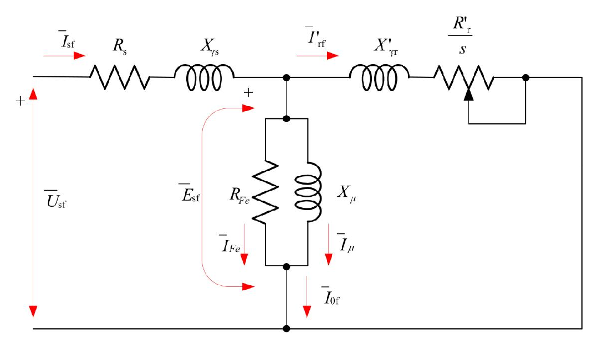
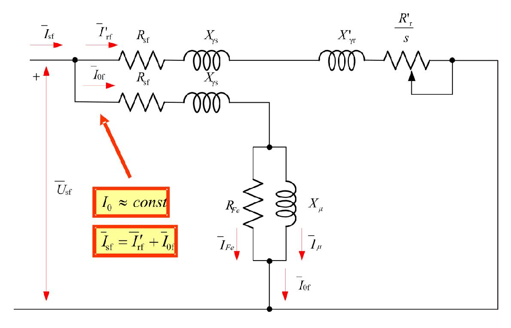

# Zadatak 30 — Svođenje rotorskih parametara asinhronog motora na stator (reaktanse rasipanja i termogeni otpori)

## Postavka

Asinhroni motor ima odnos transformacije $m_e = 4{,}0042$. Omski otpor po fazi statora iznosi $0{,}239\ \mathrm{\Omega}$, otpor po fazi rotora $0{,}233\ \mathrm{\Omega}$, a induktivnosti rasipanja pojedinih faza statora i rotora iznose $2{,}4\ \mathrm{mH}$ i $0{,}22\ \mathrm{mH}$, respektivno. Motor se povezuje na mrežu učestanosti $50\ \mathrm{Hz}$. Odrediti induktivne i termogene otpore statora i rotora svedenog na stator.

> **Prevod na običan jezik:** Asinhroni motor u sebi krije dva namotaja — statorski (na koji dovodimo napon iz mreže) i rotorski (u kome se struja indukuje, kao u sekundaru transformatora). Za svaki od njih znamo dve stvari: koliki mu je omski otpor (onaj koji greje namotaj) i kolika mu je induktivnost rasipanja (mera onog dela magnetnog polja koji "pobegne" i ne učestvuje u prenosu energije na drugi namotaj). Da bismo motor mogli da računamo kao jedno jedino električno kolo, rotorski deo moramo "preračunati" (svesti) na statorsku stranu — potpuno isto kao što se sekundar transformatora svodi na primar. Traži se: reaktansa rasipanja statora, reaktansa rasipanja rotora i njena svedena vrednost, kao i svedeni omski otpor rotora. Usput treba znati da omski otpor statora ostaje kakav jeste — on je već "na statorskoj strani".

## Podaci

| Veličina | Oznaka | Vrednost | Šta ta veličina fizički znači |
|---|---|---|---|
| Odnos transformacije | $m_e$ | $4{,}0042$ | Koliko puta statorski namotaj ima više "efektivnih" navojaka od rotorskog; isti smisao kao prenosni odnos transformatora — govori u kom razmeri se naponi, struje i impedanse preračunavaju sa jedne strane na drugu. |
| Otpor po fazi statora | $R_s$ | $0{,}239\ \mathrm{\Omega}$ | Omski (termogeni) otpor bakra jedne faze statorskog namotaja — na njemu struja stvara toplotu (Džulove gubitke). |
| Otpor po fazi rotora | $R_r$ | $0{,}0233\ \mathrm{\Omega}$ | Omski (termogeni) otpor bakra jedne faze rotorskog namotaja, izmeren na samom rotoru (pre svođenja). Vidi napomenu ispod tabele. |
| Induktivnost rasipanja faze statora | $L_{\gamma s}$ | $2{,}4\ \mathrm{mH} = 2{,}4\cdot 10^{-3}\ \mathrm{H}$ | Mera statorskog fluksa koji se "rasipa" — obuhvata samo statorski namotaj i ne stiže do rotora, pa ne prenosi energiju. |
| Induktivnost rasipanja faze rotora | $L_{\gamma r}$ | $0{,}22\ \mathrm{mH} = 0{,}22\cdot 10^{-3}\ \mathrm{H}$ | Isto to, ali za rotorski namotaj: deo rotorskog fluksa koji ne obuhvata stator. |
| Učestanost mreže (statorska) | $f_s$ | $50\ \mathrm{Hz}$ | Frekvencija napona na koji je motor priključen; iz nje se računaju sve reaktanse u šemi. |

> **Napomena o originalu:** U originalnoj zbirci postoji štamparska nesaglasnost: u postavci piše da je otpor po fazi rotora $0{,}233\ \mathrm{\Omega}$, ali se u rešenju računa sa $R_r = 0{,}0233\ \mathrm{\Omega}$ i dobija konačni rezultat $R'_r = 0{,}374\ \mathrm{\Omega}$. Vrednost $0{,}0233\ \mathrm{\Omega}$ je fizički smislena: kod nje svedeni rotorski otpor ($0{,}374\ \mathrm{\Omega}$) ispada istog reda veličine kao statorski ($0{,}239\ \mathrm{\Omega}$), što je tipično za dobro projektovanu mašinu (isto važi i za reaktanse rasipanja: $1{,}108\ \mathrm{\Omega}$ prema $0{,}754\ \mathrm{\Omega}$). Da smo bukvalno uzeli $0{,}233\ \mathrm{\Omega}$ iz postavke, dobili bismo $R'_r = 4{,}0042^2 \cdot 0{,}233 = 3{,}736\ \mathrm{\Omega}$ — čak petnaestak puta više od statorskog otpora, što bi bila vrlo neobična mašina. Zaključak: u postavci je "ispao" jedan nula, ispravan ulazni podatak je $R_r = 0{,}0233\ \mathrm{\Omega}$ i sa njim radimo, čime se poklapamo sa konačnim rezultatom zbirke.

## Šta se traži i zašto

Traže se **induktivni otpori** (reaktanse rasipanja) i **termogeni otpori** (omski otpori) statora i rotora, s tim da rotorske veličine treba **svesti na stator**. Konkretno, četiri broja:

1. **Reaktansa rasipanja statora $X_{\gamma s}$** — pretvaramo zadatu induktivnost $L_{\gamma s}$ u reaktansu na mrežnoj učestanosti. Reaktansa (a ne induktivnost) je ono što direktno ulazi u ekvivalentnu šemu i u sve proračune struja.
2. **Termogeni otpor statora $R_s$** — on je zadat i, pošto je već statorska veličina, ne svodi se; treba samo razumeti zašto ostaje nepromenjen.
3. **Svedeni termogeni otpor rotora $R'_r$** — stvarni rotorski otpor $R_r$ preračunat na statorsku stranu. Bez svođenja ne možemo rotorsko kolo "zalepiti" za statorsko u jednu šemu.
4. **Reaktansa rasipanja rotora $X_{\gamma r}$ i njena svedena vrednost $X'_{\gamma r}$** — isto kao pod 3, ali za induktivni deo rotorske impedanse.

**Zašto bi to inženjera zanimalo?** Ekvivalentna šema sa svedenim parametrima je *osnovni radni alat* za asinhroni motor: iz nje se računaju polazna struja, struja pri bilo kom opterećenju, moment, faktor snage, stepen iskorišćenja... Ali šema ima smisla tek kada su svi elementi "u istim jedinicama", tj. kada je rotor preračunat na statorski naponski nivo. Proizvođač ili laboratorijsko merenje daju sirove rotorske vrednosti — svođenje je obavezan korak pre svake dalje analize.

**Plan rešavanja (4 koraka):**
1. Iz $L_{\gamma s}$ i $f_s$ izračunamo $X_{\gamma s} = \omega_s L_{\gamma s}$.
2. Konstatujemo da $R_s$ ostaje $0{,}239\ \mathrm{\Omega}$ (statorske veličine se ne svode).
3. Svedemo rotorski otpor: $R'_r = m_e^2 \cdot R_r$.
4. Iz $L_{\gamma r}$ i $f_s$ izračunamo $X_{\gamma r}$, pa je svedemo: $X'_{\gamma r} = m_e^2 \cdot X_{\gamma r}$.

## Potrebna teorija — mini-lekcije

### Mini-lekcija 1: Klizanje — broj koji opisuje "zaostajanje" rotora

Statorski namotaji, napajani trofaznim naponima učestanosti $f_s$, stvaraju **obrtno magnetno polje** koje rotira sinhronom brzinom $n_s$. Rotor se u motorskom režimu okreće nešto sporije od polja — upravo ta razlika brzina indukuje struje u rotoru. Relativno zaostajanje rotora zove se **klizanje**:

$$s = \frac{n_s - n}{n_s}$$

gde je $n$ stvarna brzina rotora. Kad rotor miruje ($n=0$), klizanje je $s=1$; kad bi se rotor okretao tačno sinhrono ($n=n_s$), klizanje bi bilo $s=0$ i u rotoru se ništa ne bi indukovalo. Učestanost rotorskih struja je $f_r = s\cdot f_s$ — srazmerna klizanju.

### Mini-lekcija 2: Rasipni i zajednički fluks; struja magnećenja

U asinhronoj mašini postoje **statorsko i rotorsko obrtno polje**, kojima odgovaraju statorski i rotorski fluks. Rezultantno polje u mašini je **vektorski zbir** ta dva polja. Fluksove delimo na dva dela:

- **Zajednički (korisni) fluks** — deo koji prolazi kroz vazdušni zazor i obuhvata *i* statorske *i* rotorske namotaje. On je "kanal" kroz koji se energija prenosi sa statora na rotor. Pošto potiče od zajedničkog (vektorskog) delovanja statorske struje $I_{sf}$ i rotorske struje $I_{rf}$, zgodno ga je opisati jednom **ekvivalentnom strujom magnećenja $I_\mu$**: to je ona struja koja bi, tekući sama kroz statorski namotaj, stvorila baš taj zajednički fluks. Vezu između zajedničkog fluksa i struje $I_\mu$ daje **induktivnost magnećenja $L_\mu$**, odnosno u šemi **reaktansa magnećenja $X_\mu = \omega_s L_\mu$**. Struja $I_\mu$ je pretežno *reaktivna* — ona ne prenosi korisnu snagu, nego obezbeđuje reaktivnu energiju potrebnu za magnećenje magnetnog kola (gvožđe se ne magneti "besplatno").
- **Rasipni fluks** — deo fluksa svakog namotaja koji obuhvata *samo taj* namotaj (zatvara se kroz vazduh oko krajeva namotaja, žlebove itd.) i ne stiže do drugog namotaja, pa ne učestvuje u prenosu energije. Njega opisujemo **induktivnostima rasipanja** $L_{\gamma s}$ i $L_{\gamma r}$, tj. **reaktansama rasipanja** $X_{\gamma s}$ i $X_{\gamma r}$. Sa stanovišta kola, rasipni fluks je "čista" induktivnost vezana na red sa namotajem: pravi pad napona, a ništa korisno ne radi.

### Mini-lekcija 3: Termogeni naspram induktivnih otpora; gubici u gvožđu ($R_{Fe}$)

- **Termogeni (omski, aktivni) otpor $R$** je otpor provodnika: struja $I$ na njemu razvija snagu $R I^2$ koja se *nepovratno pretvara u toplotu* (Džulovi gubici). Otuda naziv "termogeni" — stvara toplotu.
- **Induktivni otpor (reaktansa) $X$** ne troši energiju: on je naizmenično uzima iz izvora i vraća nazad (energija magnetnog polja). Na njemu nema grejanja, ali pravi pad napona i "pomera" struju u fazi.
- **Gubici u gvožđu** (histerezis i vihorne struje u magnetnom kolu) po prirodi su *magnetni* gubici, ali se u šemi mogu jednostavno predstaviti omskim otporom $R_{Fe}$ u grani magnećenja. Zašto baš tu? Zato što gubici u gvožđu zavise od *napona* mašine (tačnije od fluksa, a fluks od napona), a približno su *nezavisni od struje opterećenja* — pa otpornik vezan paralelno grani magnećenja (na kojoj je napon približno stalan) tačno reprodukuje takvo ponašanje. Kroz $R_{Fe}$ teče aktivna komponenta struje praznog hoda, $I_{Fe}$.

### Mini-lekcija 4: Reaktansa iz induktivnosti — i zašto se rotorska reaktansa računa na statorskoj učestanosti

Reaktansa kalema induktivnosti $L$ na ugaonoj učestanosti $\omega$ je:

$$X = \omega L = 2\pi f L$$

gde je $f$ učestanost u hercima, a $\omega = 2\pi f$ ugaona učestanost u $\mathrm{rad/s}$. Dimenziono: $\mathrm{\frac{rad}{s}} \cdot \mathrm{H} = \mathrm{\frac{1}{s}}\cdot \mathrm{\frac{V\,s}{A}} = \mathrm{\frac{V}{A}} = \mathrm{\Omega}$ — reaktansa je zaista "otpor" u omima.

Ovde je važna jedna suptilnost. U *stvarnom* rotoru struje imaju učestanost $f_r = s f_s$, pa bi stvarna rotorska reaktansa bila $s\,\omega_s L_{\gamma r}$ — zavisila bi od klizanja. Da bi šema bila jednostavna, u modelu se stvarni obrtni rotor zamenjuje **fiktivnim ukočenim (mirujućim) rotorom**: u njemu su naponi i struje *statorske* učestanosti $f_s$, a sva zavisnost od klizanja "spakuje" se u otpornik $R_r/s$ (mini-lekcija 5). Zato se u ekvivalentnoj šemi rotorska reaktansa rasipanja uvek računa na statorskoj učestanosti:

$$X_{\gamma r} = \omega_s L_{\gamma r} = 2\pi f_s L_{\gamma r}$$

i zove se **reaktansa rasipanja ukočenog rotora**.

### Mini-lekcija 5: Ekvivalentna pofazna šema i fiktivni otpor $R_r/s$

Pošto je trofazna mašina simetrična, dovoljno je analizirati **jednu fazu** — otuda "pofazna" šema. Model rotorskog kola (izveden u zbirci u prethodnom zadatku) svodi se na sledeće: kada se rotorska jednačina podeli klizanjem, celo rotorsko kolo se ponaša kao redna veza reaktanse $X_{\gamma r}$ (na statorskoj učestanosti) i otpornika $R_r/s$. Otpor $R_r/s$ je **fiktivan** — u mašini ne postoji takav fizički otpornik; on je matematička posledica prelaska na fiktivni ukočeni rotor. Njegova vrednost se menja sa opterećenjem (preko $s$), što se u šemi crta kao promenljivi otpornik.

Snaga koja se "oslobodi" na $R_r/s$ je **snaga obrtnog polja** — ukupna snaga koju polje preda rotoru. Ona se može razdvojiti identitetom:

$$\frac{R_r}{s} = R_r + R_r\,\frac{1-s}{s}$$

(provera: desna strana je $R_r\left(1 + \frac{1-s}{s}\right) = R_r\,\frac{s + 1 - s}{s} = \frac{R_r}{s}$ — slaže se). Prvi sabirak, $R_r$, predstavlja **Džulove gubitke** u rotorskom bakru (pravo grejanje), a drugi, $R_r\frac{1-s}{s}$, **snagu elektromehaničke konverzije** — deo koji se pretvara u mehaničku snagu na vratilu. Tako se dobija ekvivalentna šema asinhronog motora.

Sledeća slika prikazuje kompletnu ekvivalentnu pofaznu šemu. Čitaj je sleva nadesno: na ulazu je fazni napon statora $\overline{U}_{sf}$; statorska struja $\overline{I}_{sf}$ prvo prolazi kroz statorski otpor $R_s$ i statorsku reaktansu rasipanja $X_{\gamma s}$; zatim se u čvoru deli — deo ($\overline{I}_{0f}$, struja praznog hoda) skreće u paralelnu **granu magnećenja** koju čine $R_{Fe}$ (kroz njega ide $\overline{I}_{Fe}$, aktivna komponenta koja pokriva gubitke u gvožđu) i $X_\mu$ (kroz nju ide $\overline{I}_\mu$, struja magnećenja), a na grani vlada indukovana elektromotorna sila $\overline{E}_{sf}$; ostatak struje ($\overline{I}\,'_{rf}$, svedena rotorska struja) nastavlja kroz svedenu rotorsku granu: reaktansu $X'_{\gamma r}$ i promenljivi otpornik $R'_r/s$ (nacrtan sa strelicom jer mu vrednost zavisi od klizanja).

**Slika 30.1 —** Ekvivalentna pofazna šema asinhrone mašine.

Jedan koristan specijalan slučaj: u **praznom hodu** je $s \approx 0$, pa $R'_r/s \to \infty$ — rotorska grana je praktično prekinuta i sva statorska struja ide u granu magnećenja: $I_s = I_0$. Kako u praznom hodu nema elektromehaničke konverzije (osim sitnog dela koji pokriva mehaničke gubitke, a koji se može zanemariti), statorska struja je tada pretežno reaktivna ($\approx I_\mu$): njen posao je da magneti magnetno kolo.

Obrati pažnju: da bi šema sa slike 30.1 uopšte smela ovako da se nacrta — rotorska grana *galvanski spojena* na statorsku — rotorske veličine moraju prethodno biti **svedene na statorski naponski nivo**. Kako se to radi, objašnjava sledeća mini-lekcija; to je i računsko jezgro ovog zadatka.

### Mini-lekcija 6: Svođenje rotorskih veličina na stator — analogija sa transformatorom

Asinhrona mašina je, električno gledano, "obrtni transformator": stator je primar, rotor sekundar. Ali rotorski namotaj u opštem slučaju ima drugačiji broj navojaka ($N_r$ prema $N_s$), drugačiji navojni sačinilac ($k_{nr}$ prema $k_{ns}$), pa čak može imati i drugačiji broj faza ($q_r$ prema $q_s$; npr. kavezni rotor). **Navojni sačinilac** $k_n$ je broj malo manji od 1 koji uzima u obzir da su navojci namotaja raspoređeni po obodu mašine (nisu svi "na istom mestu"), pa je efektivan broj navojaka $N\cdot k_n$, a ne $N$.

Zbog svega toga rotorski naponi i struje "žive" na drugom naponskom nivou i ne mogu se direktno crtati u istoj šemi sa statorskim. Rešenje: uvedemo **fiktivni, svedeni rotor** koji ima iste namotajne podatke kao stator ($q_s$, $N_s$, $k_{ns}$), a rotorske veličine preračunamo tako da se *spolja ništa ne promeni* — da svedeni rotor pravi istu magnetopobudnu silu, prima istu snagu i ima iste gubitke kao stvarni. Iz ta tri zahteva slede pravila svođenja (potpuno analogna transformatoru); crtica (prim) označava svedenu veličinu, a $E_{rfk}$ je indukovana elektromotorna sila po fazi *ukočenog* rotora:

**(a) Naponi (elektromotorne sile).** Indukovana EMS je srazmerna efektivnom broju navojaka ($E \sim f\, N k_n \Phi$, gde je $\Phi$ zajednički fluks — isti za oba namotaja). Svedena rotorska EMS zato postaje jednaka statorskoj:

$$E_{sf} = E'_{rfk} = \frac{N_s \cdot k_{ns}}{N_r \cdot k_{nr}} \cdot E_{rfk}$$

**(b) Struje.** Svedena struja mora da pravi istu magnetopobudnu silu kao stvarna. Magnetopobudna sila višefaznog namotaja srazmerna je proizvodu broja faza, efektivnog broja navojaka i struje, pa iz $q_s N_s k_{ns} \cdot I'_{rf} = q_r N_r k_{nr}\cdot I_{rf}$ sledi:

$$I'_{rf} = \frac{q_r}{q_s}\cdot\frac{N_r \cdot k_{nr}}{N_s \cdot k_{ns}} \cdot I_{rf}$$

**(c) Otpori.** Svedeni otpor mora da daje iste ukupne Džulove gubitke: $q_s R'_r I'^{\,2}_{rf} = q_r R_r I_{rf}^2$. Odavde je $R'_r = \frac{q_r}{q_s}\left(\frac{I_{rf}}{I'_{rf}}\right)^2 R_r$; ubacimo odnos struja iz pravila (b), tj. $\frac{I_{rf}}{I'_{rf}} = \frac{q_s}{q_r}\cdot\frac{N_s k_{ns}}{N_r k_{nr}}$:

$$R'_r = \frac{q_r}{q_s}\cdot\left(\frac{q_s}{q_r}\right)^2\left(\frac{N_s k_{ns}}{N_r k_{nr}}\right)^2 R_r = \frac{q_s}{q_r}\cdot\left(\frac{N_s \cdot k_{ns}}{N_r \cdot k_{nr}}\right)^2 \cdot R_r$$

Isto pravilo važi i za eventualni **dodatni otpor u rotorskom kolu** $R_{rdod}$ (npr. spoljni otpornici za pokretanje kod motora sa namotanim rotorom):

$$R'_{rdod} = \frac{q_s}{q_r}\cdot\left(\frac{N_s \cdot k_{ns}}{N_r \cdot k_{nr}}\right)^2 \cdot R_{rdod}$$

**(d) Reaktanse.** Reaktansa je, kao i otpor, količnik napona i struje — napon se pri svođenju množi odnosom navojaka, struja deli — pa se reaktansa svodi po istom pravilu kao otpor:

$$X'_{\gamma r} = \frac{q_s}{q_r}\cdot\left(\frac{N_s \cdot k_{ns}}{N_r \cdot k_{nr}}\right)^2 \cdot X_{\gamma r}$$

**Odnos transformacije.** Količnik efektivnih brojeva navojaka obeležava se

$$m_e = \frac{N_s \cdot k_{ns}}{N_r \cdot k_{nr}}$$

i zove **odnos transformacije** — to je onaj broj $4{,}0042$ iz postavke. Kada stator i rotor imaju isti broj faza ($q_s = q_r$, što ovde podrazumevamo jer zadatak daje samo $m_e$), količnik $q_s/q_r = 1$ i pravila se svode na jednostavno:

$$E' = m_e E, \qquad I' = \frac{I}{m_e}, \qquad R' = m_e^2\, R, \qquad X' = m_e^2\, X$$

**Zapamti srce ove lekcije:** naponi se množe sa $m_e$, struje dele sa $m_e$, a *impedanse (otpori i reaktanse) množe sa $m_e^2$* — kvadrat dolazi otuda što je impedansa količnik napona i struje, pa "pokupi" $m_e$ i iz brojioca i iz imenioca.

### Mini-lekcija 7: Približna ekvivalentna šema

Struja praznog hoda $I_0$ (zbir struje magnećenja $I_\mu$ i aktivne komponente $I_{Fe}$ koja pokriva gubitke u gvožđu) kod asinhronog motora je **približno konstantna i nezavisna od opterećenja** — nju diktira napon mreže, a on se ne menja. Uz to su parametri grane magnećenja ($R_{Fe}$, $X_\mu$) **nekoliko puta veći** od parametara redne grane ($R_s$, $X_{\gamma s}$, $X'_{\gamma r}$, $R'_r$), pa pad napona na rednoj grani malo utiče na granu magnećenja. Zbog toga se u razmatranjima nekad koristi **približna ekvivalentna šema**: kolo se "rastavi" na dve nezavisne paralelne grane direktno na priključcima — jednu koja sadrži granu magnećenja (i daje $I_{0f}$) i drugu, radnu, kroz koju teče svedena rotorska struja $\overline{I}\,'_{rf}$ kao kroz običnu rednu vezu $R_s$, $X_{\gamma s}$, $X'_{\gamma r}$, $R'_r/s$. Ukupna statorska struja je tada prosto $\overline{I}_{sf} = \overline{I}\,'_{rf} + \overline{I}_{0f}$. Ogromna praktična prednost: struje se računaju iz dva *nezavisna* prosta kola, bez rešavanja spregnutog sistema.

Sledeća slika prikazuje tu približnu šemu. Čitaj je ovako: sa priključaka (napon $\overline{U}_{sf}$) polaze dve paralelne grane; gornja (radna) sadrži redno $R_{sf}$, $X_{\gamma s}$, $X'_{\gamma r}$ i $R'_r/s$ i njome teče $\overline{I}\,'_{rf}$; donja vodi kroz $R_{sf}$ i $X_{\gamma s}$ do grane magnećenja ($R_{Fe}$ paralelno $X_\mu$) i njome teče $\overline{I}_{0f}$. Uokvirene napomene na slici podsećaju na dve ključne činjenice: $I_0 \approx \mathrm{const}$ i $\overline{I}_{sf} = \overline{I}\,'_{rf} + \overline{I}_{0f}$.

**Slika 30.2 —** Približna ekvivalentna šema asinhrone mašine.

I obična (slika 30.1) i približna šema (slika 30.2) zahtevaju **svedene** rotorske parametre — upravo one koje u ovom zadatku računamo.

## Rešenje, korak po korak

### Korak 1: Reaktansa rasipanja statora $X_{\gamma s}$

**Zašto ovaj korak:** Zadata nam je induktivnost rasipanja statora, a u ekvivalentnoj šemi figuriše reaktansa — moramo preći sa $\mathrm{H}$ na $\mathrm{\Omega}$ koristeći mrežnu učestanost (mini-lekcija 4).

Opšti oblik:

$$X_{\gamma s} = \omega_s \cdot L_{\gamma s} = 2\pi f_s \cdot L_{\gamma s}$$

Ovde je $\omega_s = 2\pi f_s$ ugaona učestanost statorskih (mrežnih) veličina. Prvo izračunajmo nju:

$$\omega_s = 2\pi \cdot 50\ \mathrm{Hz} = 314{,}16\ \mathrm{rad/s}$$

Sada uvrstimo induktivnost (paziti na prefiks mili: $2{,}4\ \mathrm{mH} = 2{,}4\cdot 10^{-3}\ \mathrm{H}$):

$$X_{\gamma s} = 314{,}16\ \mathrm{\frac{rad}{s}} \cdot 2{,}4\cdot 10^{-3}\ \mathrm{H} = 0{,}754\ \mathrm{\Omega}$$

**Šta smo dobili:** Reaktansa rasipanja statora je manja od jednog oma — mala, kako i treba: rasipni fluks je tek nekoliko procenata ukupnog fluksa, pa je i njegova reaktansa mala u poređenju sa reaktansom magnećenja (koja je tipično reda desetina oma).

### Korak 2: Termogeni otpor statora $R_s$ — ostaje nepromenjen

**Zašto ovaj korak:** Zadatak traži termogene otpore "statora i rotora svedenog na stator". Svođenje preračunava veličine *sa rotorske na statorsku stranu* — statorske veličine su već tamo gde treba, pa se na njih ne primenjuje nikakav faktor:

$$R_s = 0{,}239\ \mathrm{\Omega}$$

**Šta smo dobili:** Statorski omski otpor ulazi u ekvivalentnu šemu direktno, onakav kakav je izmeren. Ista logika važi i za $X_{\gamma s}$ iz Koraka 1 — ni ona se ne svodi.

### Korak 3: Svedeni termogeni otpor rotora $R'_r$

**Zašto ovaj korak:** Stvarni rotorski otpor $R_r = 0{,}0233\ \mathrm{\Omega}$ "živi" na rotorskom naponskom nivou. Da bi ušao u ekvivalentnu šemu (slike 30.1 i 30.2), mora se svesti na stator pravilom iz mini-lekcije 6: impedanse se množe kvadratom odnosa transformacije.

Opšti oblik (uz $q_s = q_r$):

$$R'_r = m_e^2 \cdot R_r$$

Prvo kvadrat odnosa transformacije:

$$m_e^2 = 4{,}0042^2 = 16{,}0336$$

pa množenje:

$$R'_r = 16{,}0336 \cdot 0{,}0233\ \mathrm{\Omega} = 0{,}374\ \mathrm{\Omega}$$

> **Napomena o originalu:** Ovo je mesto na kome se vidi štamparska greška iz postavke zbirke (detaljno objašnjena u sekciji "Podaci"): rešenje u zbirci računa upravo $R'_r = 4{,}0042^2 \cdot 0{,}0233 = 0{,}374\ \mathrm{\Omega}$, dakle sa $0{,}0233\ \mathrm{\Omega}$, iako u postavci piše $0{,}233\ \mathrm{\Omega}$. Sa vrednošću iz postavke dobilo bi se $16{,}0336\cdot 0{,}233 = 3{,}736\ \mathrm{\Omega}$, što fizički ne liči na realnu mašinu; ostajemo pri $0{,}374\ \mathrm{\Omega}$, u saglasnosti sa konačnim rezultatom zbirke.

**Šta smo dobili:** Svedeni rotorski otpor ($0{,}374\ \mathrm{\Omega}$) je istog reda veličine kao statorski ($0{,}239\ \mathrm{\Omega}$). To je očekivano: mašina je projektovana tako da su bakarni gubici razumno raspoređeni između statora i rotora, a svođenje upravo "poravna" naponske nivoe tako da se veličine mogu pošteno porediti. Sirova vrednost $0{,}0233\ \mathrm{\Omega}$ deluje sitno samo zato što rotorski namotaj ima oko četiri puta manje efektivnih navojaka (deblji provodnici, manji broj navojaka — mali otpor).

### Korak 4: Reaktansa rasipanja ukočenog rotora $X_{\gamma r}$

**Zašto ovaj korak:** Pre svođenja moramo rotorsku induktivnost rasipanja pretvoriti u reaktansu. Ključno pitanje: na kojoj učestanosti? Na **statorskoj** $f_s$ — jer u ekvivalentnoj šemi figuriše fiktivni *ukočeni* rotor, u kome naponi i struje imaju statorsku učestanost (mini-lekcija 4); zavisnost od klizanja je već preseljena u otpornik $R'_r/s$.

Opšti oblik:

$$X_{\gamma r} = \omega_s \cdot L_{\gamma r} = 2\pi f_s \cdot L_{\gamma r}$$

Uvrštavanje ($0{,}22\ \mathrm{mH} = 0{,}22\cdot 10^{-3}\ \mathrm{H}$; $\omega_s = 314{,}16\ \mathrm{rad/s}$ iz Koraka 1):

$$X_{\gamma r} = 314{,}16\ \mathrm{\frac{rad}{s}} \cdot 0{,}22\cdot 10^{-3}\ \mathrm{H} = 0{,}0691\ \mathrm{\Omega}$$

**Šta smo dobili:** Sirova rotorska reaktansa rasipanja je oko deset puta manja od statorske — opet zato što rotorski namotaj ima manje navojaka; tek posle svođenja (sledeći korak) brojevi postaju uporedivi.

### Korak 5: Svedena reaktansa rasipanja rotora $X'_{\gamma r}$

**Zašto ovaj korak:** Kao i otpor, i reaktansa se na statorsku stranu prenosi množenjem sa $m_e^2$ (mini-lekcija 6, pravilo (d)).

Opšti oblik (uz $q_s = q_r$):

$$X'_{\gamma r} = m_e^2 \cdot X_{\gamma r}$$

Uvrštavanje ($m_e^2 = 16{,}0336$ iz Koraka 3):

$$X'_{\gamma r} = 16{,}0336 \cdot 0{,}0691\ \mathrm{\Omega} = 1{,}108\ \mathrm{\Omega}$$

**Šta smo dobili:** Svedena rotorska reaktansa rasipanja ($1{,}108\ \mathrm{\Omega}$) uporediva je sa statorskom ($0{,}754\ \mathrm{\Omega}$) — tipičan odnos kod asinhronih mašina, i još jedna potvrda da su ulazni podaci (sa $R_r = 0{,}0233\ \mathrm{\Omega}$) međusobno usaglašeni. Time imamo sve elemente redne grane ekvivalentne šeme: $R_s$, $X_{\gamma s}$, $X'_{\gamma r}$ i $R'_r$ (koji u šemi nastupa kao $R'_r/s$).

## Česte greške i zamke

1. **Množenje sa $m_e$ umesto sa $m_e^2$.** Najčešća greška: student "prenese" otpor kao napon, pa dobije $R'_r = 4{,}0042\cdot 0{,}0233 = 0{,}0933\ \mathrm{\Omega}$. Zapamti: naponi $\times\, m_e$, struje $\div\, m_e$, **impedanse $\times\, m_e^2$** — kvadrat dolazi jer je impedansa napon kroz struju.
2. **Pogrešan smer svođenja ili svođenje statorskih veličina.** Svode se *rotorske* veličine na stator (množe se sa $m_e^2$ jer stator ima više navojaka, $m_e>1$). Ako neko podeli umesto da pomnoži, ili "svede" i $R_s$ i $X_{\gamma s}$, ceo model je pogrešan — statorske veličine ostaju netaknute.
3. **Zaboravljen prefiks mili.** Induktivnosti su date u $\mathrm{mH}$; ko zaboravi $10^{-3}$, dobiće $X_{\gamma s} = 754\ \mathrm{\Omega}$ — hiljadu puta previše. Brza kontrola: reaktanse rasipanja realnih motora su deo oma do nekoliko oma.
4. **Računanje rotorske reaktanse na rotorskoj (kliznoj) učestanosti.** U ekvivalentnoj šemi $X_{\gamma r}$ je reaktansa *ukočenog* rotora, računata na $f_s = 50\ \mathrm{Hz}$. Klizanje ne ulazi u reaktansu — ono sedi isključivo u fiktivnom otporniku $R'_r/s$.
5. **Slepo prepisivanje podatka iz postavke.** Ovaj zadatak je i lekcija o kritičnosti: postavka kaže $0{,}233\ \mathrm{\Omega}$, rešenje računa sa $0{,}0233\ \mathrm{\Omega}$. Uvek proveri da li ti je rezultat fizički smislen (svedene vrednosti uporedive sa statorskim) — tako se štamparske greške hvataju.

## Rezime rezultata

| Tražena veličina | Oznaka | Formula | Vrednost |
|---|---|---|---|
| Reaktansa rasipanja statora | $X_{\gamma s}$ | $\omega_s L_{\gamma s}$ | $0{,}754\ \mathrm{\Omega}$ |
| Termogeni otpor statora | $R_s$ | zadato (ne svodi se) | $0{,}239\ \mathrm{\Omega}$ |
| Reaktansa rasipanja ukočenog rotora | $X_{\gamma r}$ | $\omega_s L_{\gamma r}$ | $0{,}0691\ \mathrm{\Omega}$ |
| Svedeni termogeni otpor rotora | $R'_r$ | $m_e^2 R_r$ | $0{,}374\ \mathrm{\Omega}$ |
| Svedena reaktansa rasipanja rotora | $X'_{\gamma r}$ | $m_e^2 X_{\gamma r}$ | $1{,}108\ \mathrm{\Omega}$ |

## Provera smisla

1. **Dimenziona provera.** $[\omega L] = \mathrm{\frac{rad}{s}}\cdot\mathrm{H} = \mathrm{\frac{1}{s}}\cdot\mathrm{\frac{V\,s}{A}} = \mathrm{\frac{V}{A}} = \mathrm{\Omega}$ — reaktanse zaista izlaze u omima. Faktor $m_e^2$ je bezdimenzion, pa i svedene veličine ostaju u omima.
2. **Poređenje strana posle svođenja.** Posle svođenja, rotorska i statorska strana treba da budu uporedive — i jesu: $R'_r/R_s = 0{,}374/0{,}239 \approx 1{,}6$ i $X'_{\gamma r}/X_{\gamma s} = 1{,}108/0{,}754 \approx 1{,}5$. Pre svođenja odnosi su bili oko $0{,}1$ — čisto zato što rotorski namotaj ima $\approx 4$ puta manje efektivnih navojaka, a $4^2 = 16$.
3. **Kontrola faktora svođenja.** Iz rezultata mora da se rekonstruiše $m_e^2$: $X'_{\gamma r}/X_{\gamma r} = 1{,}108/0{,}0691 = 16{,}03 = m_e^2 = 4{,}0042^2$. Tačno se poklapa — svođenje je izvedeno dosledno za obe rotorske veličine.
