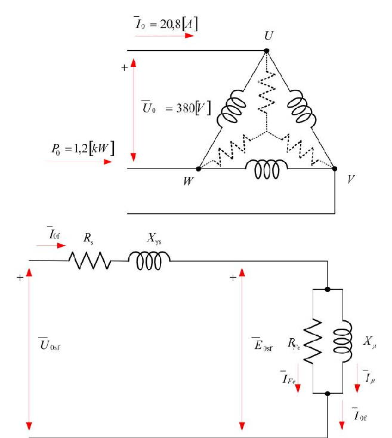
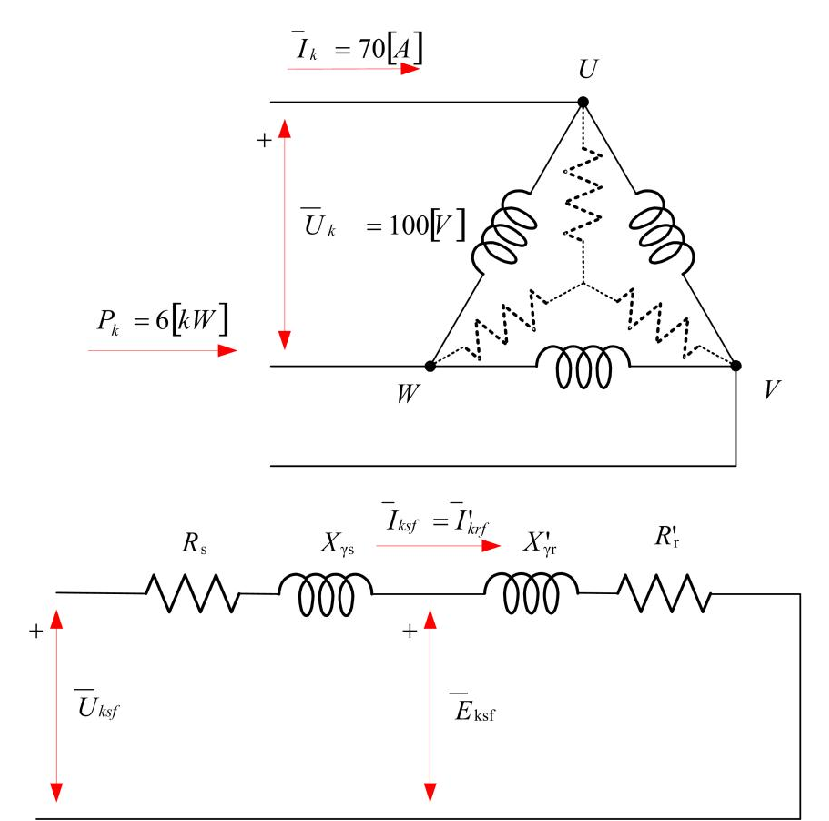
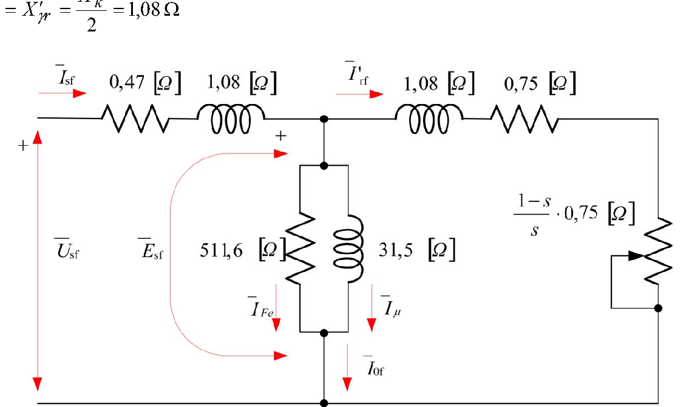

# Zadatak 34 — Parametri ekvivalentne šeme asinhronog kaveznog motora iz ogleda praznog hoda i kratkog spoja

## Postavka

Nad trofaznim asinhronim kaveznim motorom izvedena su dva standardna laboratorijska ogleda — ogled praznog hoda i ogled kratkog spoja — i dobijeni su sledeći rezultati:

- **Ogled kratkog spoja:** pri (sniženom) naponu $U_k = 100\ \mathrm{V}$ motor je povlačio iz mreže struju $I_k = 70\ \mathrm{A}$ i snagu $P_k = 6\ \mathrm{kW}$.
- **Ogled praznog hoda:** pri nominalnom naponu motor je povlačio iz mreže struju $I_0 = 20{,}8\ \mathrm{A}$ i snagu $P_0 = 1{,}2\ \mathrm{kW}$. Snaga mehaničkih gubitaka, dobijena iz ovog ogleda, iznosi $P_{\mathrm{trv}} = 150\ \mathrm{W}$.

Otpor namotaja statora pri nominalnom režimu rada iznosi $R_s = 0{,}47\ \Omega$.

Na osnovu navedenih podataka odrediti **parametre ekvivalentne šeme** motora. Pretpostaviti da su rasipne reaktanse statora i (svedenog) rotora jednake: $X_{\gamma s} = X'_{\gamma r}$.

**Podaci motora:** $30\ \mathrm{kW}$, $380\ \mathrm{V}$, $50\ \mathrm{Hz}$, sprega $\Delta$ (trougao).

> **Prevod na običan jezik:** Asinhroni motor u proračunima predstavljamo električnom šemom („ekvivalentnom šemom") sastavljenom od nekoliko otpornika i kalemova. Ta šema ima šest parametara: otpor statora $R_s$, rasipnu reaktansu statora $X_{\gamma s}$, otpor koji predstavlja gubitke u gvožđu $R_{\mathrm{Fe}}$, reaktansu magnećenja $X_\mu$, rasipnu reaktansu rotora svedenu na stator $X'_{\gamma r}$ i otpor rotora sveden na stator $R'_r$. Te parametre niko ne može da „vidi" — motor je zaliven i namotan — ali se mogu **izmeriti posredno**, kroz dva jednostavna ogleda: pustimo motor da se vrti neopterećen (prazan hod) i zakočimo mu osovinu pa ga napajamo sniženim naponom (kratki spoj). Iz izmerenih napona, struja i snaga u ta dva ogleda treba da „izvučemo" svih šest parametara. $R_s$ nam je već poklonjen (izmeren ommetrom), ostalih pet računamo.

## Podaci

| Veličina | Oznaka | Vrednost | Šta ta veličina fizički znači |
|---|---|---|---|
| Napon ogleda kratkog spoja (linijski) | $U_k$ | $100\ \mathrm{V}$ | Sniženi napon kojim se napaja motor sa zakočenim rotorom, podešen tako da struja bude bezbedna (blizu nominalne) |
| Struja kratkog spoja (linijska) | $I_k$ | $70\ \mathrm{A}$ | Struja koju motor vuče iz mreže dok mu je rotor ukočen pri naponu $U_k$ |
| Snaga kratkog spoja | $P_k$ | $6\ \mathrm{kW}$ | Ukupna aktivna (trofazna) snaga koju motor prima u tom ogledu; sva se pretvara u toplotu u namotajima |
| Napon praznog hoda (linijski) | $U_0$ | $380\ \mathrm{V}$ | Nominalni napon mreže na koji je motor priključen dok se vrti bez tereta |
| Struja praznog hoda (linijska) | $I_0$ | $20{,}8\ \mathrm{A}$ | Struja koju neopterećen motor vuče iz mreže — pretežno služi za stvaranje magnetnog fluksa |
| Snaga praznog hoda | $P_0$ | $1{,}2\ \mathrm{kW}$ | Ukupna aktivna snaga u praznom hodu; pokriva samo gubitke (koristan rad ne postoji) |
| Snaga mehaničkih gubitaka | $P_{\mathrm{trv}}$ | $150\ \mathrm{W}$ | Snaga koja se troši na trenje u ležajevima i ventilaciju (otpor vazduha) — indeks „trv" = **tr**enje i **v**entilacija |
| Otpor statorskog namotaja (po fazi) | $R_s$ | $0{,}47\ \Omega$ | Omski otpor jedne faze namotaja statora, pri radnoj temperaturi |
| Nominalna snaga motora | $P_{\mathrm{n}}$ | $30\ \mathrm{kW}$ | Mehanička snaga na osovini koju motor može trajno da daje |
| Nominalni napon (linijski) | $U_{\mathrm{n}}$ | $380\ \mathrm{V}$ | Napon mreže za koji je motor projektovan |
| Nominalna učestanost | $f_{\mathrm{n}}$ | $50\ \mathrm{Hz}$ | Učestanost napona napajanja |
| Sprega statorskog namotaja | — | $\Delta$ (trougao) | Tri fazna namotaja vezana su u trougao: **fazni napon = linijski napon**, a fazna struja je $\sqrt{3}$ puta **manja** od linijske |
| Pretpostavka zadatka | — | $X_{\gamma s} = X'_{\gamma r}$ | Ogledi daju samo **zbir** rasipnih reaktansi; da bismo ga podelili na statorski i rotorski deo, pretpostavljamo da su jednake |

## Šta se traži i zašto

Traže se **parametri ekvivalentne šeme**: $R_{\mathrm{Fe}}$, $X_\mu$, $R'_r$, $X_{\gamma s}$ i $X'_{\gamma r}$ (a $R_s$ je već dat merenjem). Za svaki od njih:

- **$R_{\mathrm{Fe}}$ — otpor gubitaka u gvožđu.** Fiktivni otpornik u poprečnoj (paralelnoj) grani šeme na kome se „troši" snaga jednaka gubicima u magnetnom kolu (histerezis + vihorne struje). Inženjera zanima jer određuje koliki deo primljene snage motor nepovratno gubi u limovima, čak i bez tereta.
- **$X_\mu$ — reaktansa magnećenja.** Predstavlja kalem kroz koji teče struja magnećenja — ona struja koja stvara obrtni magnetni fluks, „krvotok" mašine. Bez fluksa nema indukovane elektromotorne sile ni momenta. $X_\mu$ direktno određuje koliku (reaktivnu) struju motor vuče iz mreže i kakav mu je faktor snage.
- **$R'_r$ — otpor rotorskog namotaja (kaveza) sveden na stator.** Ključan za momentnu karakteristiku: od njega zavise polazni moment i klizanje pri kome se javlja maksimalni moment.
- **$X_{\gamma s}$ i $X'_{\gamma r}$ — rasipne reaktanse statora i rotora.** Predstavljaju deo fluksa koji se „rasipa" (obuhvata samo jedan namotaj, ne prelazi vazdušni zazor). One ograničavaju polaznu struju i maksimalni moment motora.

**Plan rešavanja u pet koraka, običnim jezikom:**

1. Pošto je motor spregnut u **trougao**, prvo raščistimo koje su veličine fazne, a koje linijske — sve formule ekvivalentne šeme rade sa **faznim** veličinama.
2. Iz ogleda **praznog hoda** izdvojimo gubitke u gvožđu $P_{\mathrm{Fe}}$: od primljene snage $P_0$ oduzmemo bakarne gubitke statora i mehaničke gubitke. Iz $P_{\mathrm{Fe}}$ sledi $R_{\mathrm{Fe}}$.
3. Iz istog ogleda, preko impedanse i faktora snage praznog hoda, odredimo reaktansu magnećenja $X_\mu$ (poprečna grana šeme).
4. Iz ogleda **kratkog spoja** odredimo redne (serijske) parametre: ukupan otpor $R_k = R_s + R'_r$ (iz snage) i ukupnu reaktansu $X_k = X_{\gamma s} + X'_{\gamma r}$ (iz impedanse, Pitagorinom teoremom).
5. Od $R_k$ oduzmemo poznato $R_s$ da dobijemo $R'_r$, a $X_k$ podelimo na dva jednaka dela po pretpostavci zadatka.

## Potrebna teorija — mini-lekcije

### 1. Ekvivalentna šema asinhronog motora (T-šema)

Asinhroni motor je, u suštini, transformator čiji se sekundar (rotor) obrće i čiji je „teret" mehanički rad. Zato ga po fazi predstavljamo šemom vrlo sličnom šemi transformatora:

- **Redna (uzdužna) grana statora:** otpor $R_s$ i rasipna reaktansa $X_{\gamma s}$ — kroz njih teče statorska struja i na njima nastaju pad napona i bakarni gubici statora.
- **Poprečna (paralelna) grana:** $R_{\mathrm{Fe}}$ paralelno sa $X_\mu$. Kroz $X_\mu$ teče struja magnećenja $I_\mu$ (stvara fluks), kroz $R_{\mathrm{Fe}}$ teče struja $I_{\mathrm{Fe}}$ (predstavlja gubitke u gvožđu). Na ovoj grani vlada indukovana elektromotorna sila $E$.
- **Redna grana rotora (svedena na stator):** rasipna reaktansa $X'_{\gamma r}$, otpor $R'_r$ i promenljivi otpor $R'_r\,(1-s)/s$ koji predstavlja **mehaničko opterećenje**. Oznaka „prim" znači da su stvarne rotorske veličine preračunate (svedene) na statorski broj navojaka — isto kao svođenje sekundara transformatora na primar — da bi se stator i rotor mogli spojiti u jednu šemu.

Ovde je $s$ **klizanje**: relativna razlika brzine obrtnog polja $n_s$ i brzine rotora $n$,

$$s = \frac{n_s - n}{n_s}.$$

Kad se rotor vrti gotovo sinhrono (prazan hod), $s \approx 0$; kad rotor stoji, $s = 1$. Snaga koja se „potroši" na otporniku $R'_r(1-s)/s$ upravo je mehanička snaga koju motor predaje osovini — zato taj otpornik zavisi od opterećenja.

**Intuicija:** šema je „mapa puta" energije: mreža → bakarni gubici statora ($R_s$) → gubici u gvožđu ($R_{\mathrm{Fe}}$) → preko vazdušnog zazora u rotor → bakarni gubici rotora ($R'_r$) → mehanički rad ($R'_r(1-s)/s$).

### 2. Sprega trougao: fazne i linijske veličine

Kod sprege u trougao ($\Delta$) svaki fazni namotaj vezan je **direktno između dva linijska provodnika**. Posledice:

$$U_{\mathrm{f}} = U_{\mathrm{lin}}, \qquad I_{\mathrm{f}} = \frac{I_{\mathrm{lin}}}{\sqrt{3}}.$$

Napon na namotaju jednak je linijskom naponu, ali se linijska struja na čvoru trougla grana u dva namotaja, pa je struja kroz **jedan namotaj** $\sqrt{3}$ puta manja od struje u dovodnom provodniku (činilac $\sqrt{3}$ potiče iz vektorskog sabiranja dve fazne struje pomerene za $120^\circ$). Instrumenti u laboratoriji mere **linijske** struje i napone i **ukupnu trofaznu** snagu — a ekvivalentna šema je slika **jedne faze**. Zato pre svakog računa moramo linijske veličine pretvoriti u fazne. U ovom zadatku: fazni naponi su jednaki datim (linijskim) naponima, a fazne struje su date struje podeljene sa $\sqrt{3}$.

### 3. Ogled praznog hoda — šta meri i šta iz njega čitamo

Motor priključimo na **nominalni napon** i pustimo ga da se vrti **bez tereta**. Tada je klizanje sićušno ($s \approx 0{,}001\ldots0{,}005$), pa je otpor opterećenja u šemi

$$R'_r\,\frac{1-s}{s} \longrightarrow \text{ogromna vrednost}\quad (\text{jer delimo sa } s \approx 0),$$

što znači da kroz rotorsku granu praktično **ne teče struja** — u šemi je smemo smatrati **otvorenom** (prekinutom). Ostaju samo redna grana statora i poprečna grana. Zato je prazan hod idealan za merenje **poprečne grane** ($R_{\mathrm{Fe}}$, $X_\mu$): gotovo sva struja koju motor vuče jeste struja te grane.

**Bilans snage u praznom hodu.** Koristan rad ne postoji, pa sva primljena snaga $P_0$ pokriva gubitke:

$$P_0 = P_{\mathrm{Cu}s0} + P_{\mathrm{Fe}} + P_{\mathrm{trv}},$$

gde je $P_{\mathrm{Cu}s0} = 3 I_{0f}^2 R_s$ bakarni (Džulov) gubitak u statorskom namotaju pri struji praznog hoda, $P_{\mathrm{Fe}}$ gubitak u gvožđu, a $P_{\mathrm{trv}}$ mehanički gubici (trenje + ventilacija). Zbir $P'_0 = P_{\mathrm{Fe}} + P_{\mathrm{trv}}$ zove se **uži gubici praznog hoda** — to je ono što ostane od $P_0$ kad skinemo bakarne gubitke.

Dve važne napomene:

- **Gubici u gvožđu rotora se zanemaruju.** Fluks se u odnosu na rotor obrće vrlo sporo (brzinom klizanja, tj. učestanošću $s\,f \approx$ nekoliko desetinki herca), pa se rotorski limovi premagnetišu sporo i gubici u njima su zanemarljivi: $P_{\mathrm{Fe}} \approx P_{\mathrm{Fe}s}$ (praktično sav gubitak u gvožđu je u statoru).
- **Mehanički gubici $P_{\mathrm{trv}}$ ne postoje u ekvivalentnoj šemi** — šema je čisto električna, a trenje i ventilacija su mehanička pojava. Zato $P_{\mathrm{trv}}$ moramo **oduzeti** pre nego što računamo $R_{\mathrm{Fe}}$; u ekvivalentnu šemu sme da „uđe" samo $P_{\mathrm{Fe}}$.

**Kako se $P_{\mathrm{trv}}$ uopšte dobija?** Rihterovom metodom odvajanja gubitaka: ogled praznog hoda se ponovi pri više različitih napona i nacrta se zavisnost $P'_0$ od $U^2$. Gubici u gvožđu rastu sa kvadratom napona (jer je fluks srazmeran naponu), a mehanički gubici od napona ne zavise (brzina je praktično ista). Prava $P'_0(U^2)$ se produži do $U = 0$ — odsečak na ordinati je čisto $P_{\mathrm{trv}}$. U ovom zadatku taj posao je već obavljen i dato nam je $P_{\mathrm{trv}} = 150\ \mathrm{W}$.

### 4. Zašto $I_{\mathrm{Fe}} \neq I_0 \cos\varphi_0$ i aproksimacija $E_0 \approx U_0$

Snaga na otporu $R_{\mathrm{Fe}}$ (za sve tri faze) je

$$P_{\mathrm{Fe}} = 3\,R_{\mathrm{Fe}}\,I_{\mathrm{Fe}}^2,$$

gde je $I_{\mathrm{Fe}}$ struja kroz $R_{\mathrm{Fe}}$. Primamljivo je pomisliti da je $I_{\mathrm{Fe}}$ prosto aktivna komponenta struje praznog hoda, $I_0\cos\varphi_0$ — ali **to nije tačno**:

$$I_{\mathrm{Fe}} \neq I_0 \cos\varphi_0,$$

jer aktivna komponenta ukupne struje pokriva **sve** aktivne gubitke praznog hoda — dakle i bakarne gubitke statora i (posredno) mehaničke — a ne samo gubitke u gvožđu. Struja $I_{\mathrm{Fe}}$ je samo onaj deo koji odgovara $P_{\mathrm{Fe}}$.

Umesto toga, $I_{\mathrm{Fe}}$ izražavamo preko napona na poprečnoj grani. Na njoj vlada indukovana elektromotorna sila $E_0$. Pošto je struja praznog hoda mala, pad napona na rednoj grani statora ($R_s$, $X_{\gamma s}$) je mali, pa sa zadovoljavajućom tačnošću uzimamo da je elektromotorna sila jednaka priključenom faznom naponu:

$$E_0 \approx U_{0f}.$$

Tada je $I_{\mathrm{Fe}} = U_{0f}/R_{\mathrm{Fe}}$, što ćemo iskoristiti da iz poznatog $P_{\mathrm{Fe}}$ izračunamo $R_{\mathrm{Fe}}$.

### 5. Impedansa, faktor snage i trougao impedanse

**Impedansa** $Z$ je ukupan „otpor" naizmeničnoj struji: količnik efektivnih vrednosti faznog napona i fazne struje, $Z = U_{\mathrm{f}}/I_{\mathrm{f}}$, u omima. Sastoji se od aktivnog dela $R$ (troši snagu) i reaktivnog dela $X$ (ne troši snagu, samo je „ljulja" tamo-amo). Oni se **ne sabiraju algebarski** nego kao katete pravouglog trougla (jer su struje kroz njih fazno pomerene za $90^\circ$):

$$Z = \sqrt{R^2 + X^2} \quad\Longleftrightarrow\quad X = \sqrt{Z^2 - R^2}.$$

Ugao tog trougla je fazni ugao $\varphi$ između napona i struje; njegov kosinus je **faktor snage**. Za trofazni sistem, iz merenih linijskih veličina:

$$\cos\varphi = \frac{P}{\sqrt{3}\,U_{\mathrm{lin}} I_{\mathrm{lin}}},$$

jer je $P = \sqrt{3}\,U_{\mathrm{lin}} I_{\mathrm{lin}}\cos\varphi$ opšta formula trofazne aktivne snage (važi i za zvezdu i za trougao). Iz $\cos\varphi$ sledi $\sin\varphi = \sqrt{1-\cos^2\varphi}$ (osnovni trigonometrijski identitet). Projekcije impedanse su tada $R = Z\cos\varphi$ i $X = Z\sin\varphi$ — tj. $X = Z\sin\varphi$ je „reaktivna kateta" impedanse, što ćemo koristiti za $X_\mu$.

### 6. Ogled kratkog spoja — šta meri i zašto sme da se zanemari poprečna grana

Rotor motora se **ukoči** (mehanički spreči da se obrće), pa je $n = 0$, tj. klizanje $s = 1$. Tada otpor opterećenja u šemi iščezava:

$$R'_r\,\frac{1-s}{s}\bigg|_{s=1} = R'_r \cdot \frac{1-1}{1} = 0,$$

što znači da je rotorska grana svedena na čisto $X'_{\gamma r}$ i $R'_r$ — motor se ponaša kao transformator sa **kratko spojenim sekundarom** (otud ime ogleda). Da struja ne bi bila razorna, napon se snizi (ovde na $100\ \mathrm{V}$) tako da struja bude reda nominalne.

**Zašto smemo da izostavimo poprečnu granu ($R_{\mathrm{Fe}}$, $X_\mu$)?** Razmislimo o fluksu. Fluks je srazmeran elektromotornoj sili $E$. Kod ukočenog rotora na *nominalnom* naponu, redna grana statora i redna grana rotora imaju približno jednake impedanse, pa se napon deli popola — $E$ je oko **polovine** priključenog napona, dakle fluks je već oko dva puta manji nego u praznom hodu. U našem ogledu napon je dodatno snižen sa $380\ \mathrm{V}$ na $100\ \mathrm{V}$ (tj. na oko $26\,\%$), pa je fluks svega oko

$$\frac{1}{2}\cdot\frac{100}{380} \approx \frac{1}{7{,}6} \approx \frac{1}{8}$$

nominalnog. Pošto gubici u gvožđu rastu sa **kvadratom** indukcije (fluksa), oni su ovde reda $1/64$ nominalnih — zanemarljivi. Mala je i struja magnećenja (mali fluks — mala struja koja ga stvara). Zato poprečnu granu mirne duše brišemo iz šeme: ostaje **prosto redno kolo** $R_s + X_{\gamma s} + X'_{\gamma r} + R'_r$, kroz koje teče cela statorska struja. Impedansa tog kola je **impedansa kratkog spoja**:

$$Z_k = \sqrt{(R_s + R'_r)^2 + (X_{\gamma s} + X'_{\gamma r})^2} = \sqrt{R_k^2 + X_k^2},$$

gde smo uveli skraćenice $R_k = R_s + R'_r$ (otpor kratkog spoja) i $X_k = X_{\gamma s} + X'_{\gamma r}$ (reaktansa kratkog spoja).

**Bilans snage u kratkom spoju:** motor se ne obrće, pa nema ni mehaničkog rada ni mehaničkih gubitaka; gubitke u gvožđu smo upravo obrazložili kao zanemarljive. Sva primljena snaga pretvara se u toplotu u namotajima:

$$P_k = 3\,I_{kf}^2\,(R_s + R'_r) = 3\,I_{kf}^2 R_k.$$

Ogled kratkog spoja je, dakle, idealan za merenje **redne grane** ($R_k$ i $X_k$) — tačno one koju prazan hod „ne vidi" dobro.

### 7. Zašto je potrebna pretpostavka $X_{\gamma s} = X'_{\gamma r}$

Iz ogleda kratkog spoja dobijamo samo **zbir** $X_k = X_{\gamma s} + X'_{\gamma r}$ — dva rasipna fluksa deluju u rednoj vezi i nikakvo merenje sa priključaka ne može da ih razdvoji. Da bismo ipak upisali pojedinačne vrednosti u šemu, potrebna je dodatna informacija. Standardna inženjerska konvencija (i pretpostavka ovog zadatka) je da se zbir podeli **popola**: $X_{\gamma s} = X'_{\gamma r} = X_k/2$. Kod otpora takva pretpostavka nije potrebna, jer $R_s$ znamo iz direktnog merenja ommetrom, pa je $R'_r = R_k - R_s$.

## Rešenje, korak po korak

### Korak 1: Fazne vrednosti struja (sprega trougao)

**Zašto ovaj korak:** ekvivalentna šema je slika jedne faze, pa sve formule traže fazne veličine; instrumenti su izmerili linijske. Kod sprege $\Delta$ naponi su već fazni ($U_{0f} = U_0 = 380\ \mathrm{V}$, $U_{kf} = U_k = 100\ \mathrm{V}$), a struje moramo podeliti sa $\sqrt{3}$ (mini-lekcija 2).

$$I_{0f} = \frac{I_0}{\sqrt{3}} = \frac{20{,}8}{\sqrt{3}} = 12{,}01\ \mathrm{A}, \qquad I_{kf} = \frac{I_k}{\sqrt{3}} = \frac{70}{\sqrt{3}} = 40{,}41\ \mathrm{A}.$$

**Šta smo dobili:** struje koje zaista teku kroz jedan namotaj. One su primetno manje od linijskih — da smo to prevideli, svi dalji rezultati bili bi pogrešni (videti „Česte greške").

### Korak 2: Uži gubici praznog hoda $P'_0$

**Zašto ovaj korak:** cela snaga $P_0$ koju motor u praznom hodu povlači iz mreže pokriva gubitke: Džulove (bakarne) gubitke u statorskom namotaju $P_{\mathrm{Cu}s0}$ i tzv. **uže gubitke praznog hoda** $P'_0$, koji u sebi sadrže mehaničke gubitke $P_{\mathrm{trv}}$ i gubitke u gvožđu $P_{\mathrm{Fe}}$ (mini-lekcija 3). Prvo skidamo bakarni deo, jer njega umemo tačno da izračunamo iz poznatog $R_s$ i struje.

Pre računa, pogledajmo šemu ogleda. Naredna slika u gornjem delu prikazuje motor spregnut u trougao, priključen na mrežu, sa naznačenim izmerenim veličinama praznog hoda ($I_0 = 20{,}8\ \mathrm{A}$, $U_0 = 380\ \mathrm{V}$, $P_0 = 1{,}2\ \mathrm{kW}$); u donjem delu je ekvivalentna šema jedne faze u praznom hodu — obratite pažnju da rotorske grane **nema** (otvorena je, jer je $s\approx 0$), pa struja $I_{0f}$ kroz $R_s$ i $X_{\gamma s}$ stiže samo do poprečne grane $R_{\mathrm{Fe}} \| X_\mu$, gde se deli na $I_{\mathrm{Fe}}$ i $I_\mu$.

**Slika 34.1 —** Naponi, struje i ekvivalentna šema asinhronog motora u ogledu praznog hoda. Gore: motor u sprezi trougao na mreži, sa merenim linijskim veličinama. Dole: ekvivalentna šema jedne faze — rotorski deo je otvoren jer je pri $s\approx 0$ otpor opterećenja $R'_r(1-s)/s$ praktično beskonačan.

Opšti oblik:

$$P'_0 = P_0 - P_{\mathrm{Cu}s0} = P_0 - 3\,I_{0f}^2\,R_s,$$

gde je $3$ broj faza, $I_{0f}$ fazna struja praznog hoda, a $R_s$ otpor jedne faze statora. Uvrštavamo brojeve (koristimo $I_{0f} = 20{,}8/\sqrt{3}$):

$$P'_0 = 1200 - 3\cdot\left(\frac{20{,}8}{\sqrt{3}}\right)^2\cdot 0{,}47.$$

Sredimo kvadrat: $\left(\dfrac{20{,}8}{\sqrt{3}}\right)^2 = \dfrac{20{,}8^2}{3} = \dfrac{432{,}64}{3} = 144{,}21$, pa je

$$P'_0 = 1200 - 3\cdot 144{,}21\cdot 0{,}47 = 1200 - 203{,}3 = 996{,}7\ \mathrm{W}.$$

**Šta smo dobili:** od $1200\ \mathrm{W}$ primljene snage, oko $203\ \mathrm{W}$ ode na grejanje statorskog bakra, a preostalih $996{,}7\ \mathrm{W}$ su uži gubici praznog hoda — zbir gubitaka u gvožđu i mehaničkih. Broj je razuman: u praznom hodu dominiraju gubici u gvožđu, jer je fluks pun (nominalan napon), a struja mala.

### Korak 3: Gubici u gvožđu $P_{\mathrm{Fe}}$

**Zašto ovaj korak:** ekvivalentna šema ne uvažava mehaničke gubitke — oni su mehanička, a ne električna pojava (mini-lekcija 3). Da bismo dobili snagu koja pripada otporu $R_{\mathrm{Fe}}$, od užih gubitaka moramo oduzeti $P_{\mathrm{trv}}$, koji je već određen iz ogleda (Rihterovom metodom odvajanja gubitaka).

$$P_{\mathrm{Fe}} = P'_0 - P_{\mathrm{trv}} = 996{,}7 - 150 = 846{,}7\ \mathrm{W}.$$

Podsetimo (mini-lekcija 3): pošto se fluks u odnosu na rotor obrće vrlo sporo, gubici u gvožđu rotora su zanemarljivi, pa je ovih $846{,}7\ \mathrm{W}$ praktično sve u statorskim limovima: $P_{\mathrm{Fe}} \approx P_{\mathrm{Fe}s}$.

**Šta smo dobili:** snagu koja se u šemi „oslobađa" na otporu $R_{\mathrm{Fe}}$ — ulazni podatak za sledeći korak. Oko $2{,}8\,\%$ nominalne snage motora — tipičan red veličine za gubitke u gvožđu.

### Korak 4: Otpor gubitaka u gvožđu $R_{\mathrm{Fe}}$

**Zašto ovaj korak:** $R_{\mathrm{Fe}}$ je prvi traženi parametar. Vezu između njega i $P_{\mathrm{Fe}}$ daje snaga na otporniku, ali moramo pravilno izraziti struju kroz njega (mini-lekcija 4).

Snaga na $R_{\mathrm{Fe}}$ u sve tri faze:

$$P_{\mathrm{Fe}} = 3\,R_{\mathrm{Fe}}\,I_{\mathrm{Fe}}^2.$$

Naglasimo još jednom: $I_{\mathrm{Fe}} \neq I_0\cos\varphi_0$, jer aktivna komponenta struje praznog hoda pokriva **sve** aktivne gubitke (uključujući bakarne), a ne samo one u gvožđu. Umesto toga koristimo napon: uz zanemarenje pada napona na rednoj grani statora, elektromotorna sila na poprečnoj grani jednaka je faznom naponu,

$$E_0 \approx U_{0f} = U_0 = 380\ \mathrm{V} \quad (\text{sprega } \Delta),$$

pa je struja kroz $R_{\mathrm{Fe}}$ po Omovom zakonu:

$$I_{\mathrm{Fe}} = \frac{U_{0}}{R_{\mathrm{Fe}}}.$$

Uvrstimo ovo u izraz za snagu:

$$P_{\mathrm{Fe}} = 3\,R_{\mathrm{Fe}}\left(\frac{U_0}{R_{\mathrm{Fe}}}\right)^2 = 3\,R_{\mathrm{Fe}}\,\frac{U_0^2}{R_{\mathrm{Fe}}^2} = \frac{3\,U_0^2}{R_{\mathrm{Fe}}}$$

(jedno $R_{\mathrm{Fe}}$ iz brojioca skratilo se sa kvadratom u imeniocu). Rešimo po $R_{\mathrm{Fe}}$ — pomnožimo obe strane sa $R_{\mathrm{Fe}}$ i podelimo sa $P_{\mathrm{Fe}}$:

$$R_{\mathrm{Fe}} = \frac{3\,U_0^2}{P_{\mathrm{Fe}}} = \frac{3\cdot 380^2}{846{,}7} = \frac{3\cdot 144\,400}{846{,}7} = \frac{433\,200}{846{,}7} = 511{,}6\ \Omega.$$

**Šta smo dobili:** vrlo velik otpor — i to je dobro! Velik $R_{\mathrm{Fe}}$ znači malu struju $I_{\mathrm{Fe}} = 380/511{,}6 = 0{,}74\ \mathrm{A}$ po fazi, dakle male gubitke u gvožđu. Da je $R_{\mathrm{Fe}}$ ispao mali (uporediv sa $R_s$), to bi značilo katastrofalno loše magnetno kolo.

### Korak 5: Reaktansa magnećenja $X_\mu$

**Zašto ovaj korak:** $X_\mu$ je drugi parametar poprečne grane. Odredićemo ga kao „reaktivnu katetu" impedanse praznog hoda: $X_\mu = Z_0/\!\ldots$ — tačnije, iz odnosa $Z_0$ i $\sin\varphi_0$ (mini-lekcija 5). Ideja: u praznom hodu skoro sva struja teče kroz poprečnu granu, a njena reaktivna komponenta je upravo struja magnećenja kroz $X_\mu$.

Formula (uz zanemarenje pada napona na rednoj grani statora):

$$X_\mu = \frac{Z_0}{\sin\varphi_0},$$

gde je $Z_0$ impedansa (po fazi) koju motor pokazuje u praznom hodu, a $\varphi_0$ fazni ugao praznog hoda. Objašnjenje porekla: fazni napon je $U_{0f} = Z_0 I_{0f}$; struja magnećenja je reaktivna komponenta fazne struje, $I_{\mu f} = I_{0f}\sin\varphi_0$; pa je $X_\mu = U_{0f}/I_{\mu f} = Z_0 I_{0f}/(I_{0f}\sin\varphi_0) = Z_0/\sin\varphi_0$.

**(a) Impedansa praznog hoda.** Količnik faznog napona i fazne struje:

$$Z_0 = \frac{U_{0f}}{I_{0f}} = \frac{U_0}{I_0/\sqrt{3}} = \frac{380}{20{,}8/\sqrt{3}} = \frac{380}{12{,}01} = 31{,}6\ \Omega.$$

**(b) Faktor snage praznog hoda.** Iz opšte formule trofazne snage sa linijskim veličinama:

$$\cos\varphi_0 = \frac{P_0}{\sqrt{3}\,U_0 I_0} = \frac{1200}{\sqrt{3}\cdot 380\cdot 20{,}8} = \frac{1200}{13\,691} = 0{,}088.$$

**(c) Sinus ugla praznog hoda.** Iz identiteta $\sin^2\varphi + \cos^2\varphi = 1$:

$$\sin\varphi_0 = \sqrt{1-\cos^2\varphi_0} = \sqrt{1-0{,}088^2} = \sqrt{1-0{,}0077} = \sqrt{0{,}9923} = 0{,}996.$$

**(d) Reaktansa magnećenja:**

$$X_\mu = \frac{Z_0}{\sin\varphi_0} = \frac{31{,}6}{0{,}996} = 31{,}7\ \Omega.$$

**Kontrola istog rezultata drugim putem — preko struje magnećenja.** Struja magnećenja (po fazi) je reaktivna komponenta fazne struje praznog hoda:

$$I_{\mu f} = I_{0f}\sin\varphi_0 = \frac{20{,}8}{\sqrt{3}}\cdot 0{,}996 = 12{,}01\cdot 0{,}996 = 11{,}96\ \mathrm{A},$$

pa je

$$X_\mu = \frac{U_{0f}}{I_{\mu f}} = \frac{380}{11{,}96} = 31{,}7\ \Omega.$$

Oba puta daju isto — što i mora, jer su to samo dva zapisa iste geometrije trougla struja.

> **Napomena o originalu:** U zbirci u ovom međukoraku u imeniocu piše $380/11{,}9 = 31{,}7\ \Omega$ — imenilac je slučajno otkucan bez poslednje cifre (treba $11{,}96$; sa $11{,}9$ bi ispalo $31{,}9\ \Omega$). Konačan rezultat $31{,}7\ \Omega$ je ispravan. Takođe, na slici 34.3 u zbirci uz reaktansu magnećenja stoji $31{,}5\ \Omega$, iako tekst rešenja (tačno) izračunava $31{,}7\ \Omega$ — u rezime uzimamo $31{,}7\ \Omega$.

**Šta smo dobili:** $X_\mu = 31{,}7\ \Omega$ je za red veličine veće od rasipnih reaktansi koje ćemo dobiti iz kratkog spoja — očekivano, jer glavni (korisni) fluks daleko nadmašuje rasipni. Primetimo i da je $I_{\mu f} = 11{,}96\ \mathrm{A}$ praktično jednako celoj faznoj struji praznog hoda $12{,}01\ \mathrm{A}$: struja praznog hoda asinhronog motora je gotovo čisto reaktivna ($\cos\varphi_0$ svega $0{,}088$) — motor neopterećen iz mreže vuče uglavnom „magnetnu", a ne „radnu" struju.

### Korak 6: Otpor kratkog spoja $R_k$

**Zašto ovaj korak:** prelazimo na ogled kratkog spoja, koji nam daje rednu granu šeme. Pri ukočenom rotoru je $s = 1$, pa otpor opterećenja iščezava:

$$R'_r\,\frac{1-s}{s} = R'_r\cdot\frac{1-1}{1} = 0,$$

a poprečnu granu zanemarujemo jer je fluks oko osam puta manji od nominalnog (mini-lekcija 6). Naredna slika prikazuje ogled: gore je motor u trouglu sa izmerenim veličinama kratkog spoja ($I_k = 70\ \mathrm{A}$, $U_k = 100\ \mathrm{V}$, $P_k = 6\ \mathrm{kW}$), dole ekvivalentna šema jedne faze — čisto **redno kolo** $R_s$, $X_{\gamma s}$, $X'_{\gamma r}$, $R'_r$, bez poprečne grane, pa je statorska struja jednaka (svedenoj) rotorskoj: $I_{ksf} = I'_{krf}$.

**Slika 34.2 —** Naponi, struje i ekvivalentna šema asinhronog motora u ogledu kratkog spoja. Poprečna grana je izostavljena (fluks je oko $8$ puta manji od nominalnog), pa ostaje redna veza $R_s + X_{\gamma s} + X'_{\gamma r} + R'_r$.

Sva primljena snaga pokriva bakarne gubitke statora i rotora (gvožđe zanemareno — gubici u njemu opadaju sa kvadratom indukcije; mehanike nema — rotor stoji):

$$P_k = 3\,I_{kf}^2\,(R_s + R'_r) = 3\,I_{kf}^2\,R_k.$$

Rešimo po $R_k$ (podelimo obe strane sa $3 I_{kf}^2$) i uvrstimo brojeve:

$$R_k = \frac{P_k}{3\,I_{kf}^2} = \frac{6000}{3\cdot\left(\dfrac{70}{\sqrt{3}}\right)^2}.$$

Sredimo imenilac — kvadrat i množenje sa $3$ se lepo skrate:

$$3\cdot\left(\frac{70}{\sqrt{3}}\right)^2 = 3\cdot\frac{70^2}{3} = 70^2 = 4900,$$

pa je

$$R_k = \frac{6000}{4900} = 1{,}22\ \Omega.$$

**Šta smo dobili:** ukupan aktivni otpor redne grane, $R_k = R_s + R'_r$. Zgodno je zapamtiti usputni trik: kod sprege trougao je $3 I_{f}^2 = 3(I_{\mathrm{lin}}/\sqrt{3})^2 = I_{\mathrm{lin}}^2$, pa se trofazna snaga može pisati i kao $P = I_{\mathrm{lin}}^2 R$ — ali samo zato što su se $3$ i $(\sqrt 3)^2$ skratili, ne zato što linijska struja teče kroz namotaj!

### Korak 7: Svedeni otpor rotora $R'_r$

**Zašto ovaj korak:** $R_k$ je zbir dva otpora, a $R_s = 0{,}47\ \Omega$ već znamo iz direktnog merenja. Prosto oduzimanje daje rotorski deo:

$$R'_r = R_k - R_s = 1{,}22 - 0{,}47 = 0{,}75\ \Omega.$$

**Šta smo dobili:** omski otpor kaveza rotora preračunat (sveden) na statorski namotaj. Istog je reda veličine kao $R_s$ — tipično za kavezne motore ove snage; da je ispao negativan ili višestruko veći od $R_k$, to bi bio znak računske greške.

### Korak 8: Impedansa kratkog spoja $Z_k$

**Zašto ovaj korak:** da bismo Pitagorinom teoremom izvukli reaktansu $X_k$, pored $R_k$ treba nam hipotenuza trougla impedanse — ukupna impedansa $Z_k$. Nju daje Omov zakon sa faznim veličinama:

$$Z_k = \frac{U_{kf}}{I_{kf}} = \frac{U_k}{I_k/\sqrt{3}} = \frac{100}{70/\sqrt{3}} = \frac{100}{40{,}41} = 2{,}47\ \Omega.$$

**Šta smo dobili:** ukupnu impedansu redne grane. Uporedimo: $Z_0 = 31{,}6\ \Omega$, a $Z_k = 2{,}47\ \Omega$ — motor u kratkom spoju pruža skoro $13$ puta manji „otpor" struji nego u praznom hodu. Zato se ogled kratkog spoja i izvodi na sniženom naponu: na punih $380\ \mathrm{V}$ struja bi bila ogromna.

### Korak 9: Reaktansa kratkog spoja $X_k$

**Zašto ovaj korak:** $R_k$ i $X_k$ su katete, $Z_k$ hipotenuza trougla impedanse (mini-lekcija 5). Reaktivnu katetu dobijamo Pitagorinom teoremom — nikako oduzimanjem $Z_k - R_k$!

Krenimo od definicije impedanse redne veze i „okrenimo" je:

$$Z_k = \sqrt{R_k^2 + X_k^2} \;\Longrightarrow\; Z_k^2 = R_k^2 + X_k^2 \;\Longrightarrow\; X_k^2 = Z_k^2 - R_k^2,$$

pa je

$$X_k = X_{\gamma s} + X'_{\gamma r} = \sqrt{Z_k^2 - R_k^2} = \sqrt{2{,}47^2 - 1{,}22^2} = \sqrt{6{,}10 - 1{,}49} = \sqrt{4{,}61} = 2{,}15\ \Omega.$$

**Šta smo dobili:** zbir obe rasipne reaktanse. Primetimo da je reaktivni deo ($2{,}15\ \Omega$) veći od aktivnog ($1{,}22\ \Omega$) — impedansa kratkog spoja asinhronog motora je pretežno induktivna, što je i razlog velikog faznog pomaka i skromnog faktora snage pri polasku motora.

### Korak 10: Rasipne reaktanse $X_{\gamma s}$ i $X'_{\gamma r}$

**Zašto ovaj korak:** merenje sa priključaka daje samo zbir rasipnih reaktansi; da bismo ga razdvojili, koristimo pretpostavku zadatka $X_{\gamma s} = X'_{\gamma r}$ (mini-lekcija 7) — zbir se deli popola:

$$X_{\gamma s} = X'_{\gamma r} = \frac{X_k}{2} = \frac{2{,}15}{2} = 1{,}08\ \Omega.$$

Time su određeni svi parametri. Naredna slika prikazuje kompletnu ekvivalentnu šemu jedne faze sa upisanim brojnim vrednostima — sleva: $R_s = 0{,}47\ \Omega$ i $X_{\gamma s} = 1{,}08\ \Omega$ (stator), u sredini poprečna grana $R_{\mathrm{Fe}} = 511{,}6\ \Omega$ paralelno sa $X_\mu$, desno $X'_{\gamma r} = 1{,}08\ \Omega$, $R'_r = 0{,}75\ \Omega$ i promenljivi otpor opterećenja $\frac{1-s}{s}\cdot 0{,}75\ \Omega$.

**Slika 34.3 —** Parametri ekvivalentne šeme. Napomena: na ovoj slici (preuzetoj iz zbirke) uz reaktansu magnećenja stoji $31{,}5\ \Omega$; ispravna, u tekstu izračunata vrednost je $X_\mu = 31{,}7\ \Omega$ (videti napomenu o originalu u Koraku 5).

**Šta smo dobili:** popunjenu ekvivalentnu šemu — od sada za ovaj motor možemo računati struju, moment, faktor snage i stepen iskorišćenja pri **bilo kom** opterećenju, samo menjajući klizanje $s$ u otporu $\frac{1-s}{s}R'_r$. To je i cela poenta ova dva ogleda: dva jeftina merenja → kompletan matematički model motora.

## Česte greške i zamke

1. **Ignorisanje sprege trougao.** Najčešća greška: uvrstiti linijsku struju $I_0 = 20{,}8\ \mathrm{A}$ direktno u $3 I^2 R_s$. Tada bakarni gubici ispadnu $3\cdot 20{,}8^2\cdot 0{,}47 = 610\ \mathrm{W}$ umesto $203\ \mathrm{W}$ — tri puta više! — pa i $P_{\mathrm{Fe}}$, $R_{\mathrm{Fe}}$ i sve posle njih ispadne pogrešno. Kroz namotaj u trouglu teče $I/\sqrt{3}$, a kvadriranje pretvara $\sqrt 3$ u faktor $3$.
2. **Zaboravljeni mehanički gubici.** Ako se $P_{\mathrm{trv}}$ ne oduzme, pa se računa $R_{\mathrm{Fe}} = 3U_0^2/P'_0 = 433\,200/996{,}7 = 434{,}6\ \Omega$, dobija se premali otpor — u šemu bi bili „prokrijumčareni" mehanički gubici, koje električna šema po definiciji ne modeluje.
3. **$I_{\mathrm{Fe}} = I_0\cos\varphi_0$ — ne!** Aktivna komponenta struje praznog hoda pokriva **sve** aktivne gubitke (i bakarne u statoru), ne samo one u gvožđu. Struju $I_{\mathrm{Fe}}$ računamo iz napona: $I_{\mathrm{Fe}} = U_0/R_{\mathrm{Fe}}$.
4. **Algebarsko umesto „pitagorinog" oduzimanja.** $X_k \neq Z_k - R_k = 2{,}47 - 1{,}22 = 1{,}25\ \Omega$ (pogrešno!). Otpor i reaktansa su pod pravim uglom, pa važi $X_k = \sqrt{Z_k^2 - R_k^2} = 2{,}15\ \Omega$.
5. **Proglasiti $R_k$ za rotorski otpor.** $R_k = 1{,}22\ \Omega$ je **zbir** $R_s + R'_r$; rotorski deo je tek $R_k - R_s = 0{,}75\ \Omega$. Slično, $X_k$ je zbir dve rasipne reaktanse i mora se podeliti.
6. **Mešanje ogleda.** Iz praznog hoda se čita poprečna grana ($R_{\mathrm{Fe}}$, $X_\mu$), iz kratkog spoja redna ($R_k$, $X_k$) — nikad obrnuto. U praznom hodu rotorska grana je otvorena ($s\approx 0$), u kratkom spoju poprečna grana je zanemarena (mali fluks).

## Rezime rezultata

| Veličina | Oznaka | Vrednost |
|---|---|---|
| Uži gubici praznog hoda | $P'_0$ | $996{,}7\ \mathrm{W}$ |
| Gubici u gvožđu | $P_{\mathrm{Fe}}$ | $846{,}7\ \mathrm{W}$ |
| **Otpor gubitaka u gvožđu** | $R_{\mathrm{Fe}}$ | $511{,}6\ \Omega$ |
| Impedansa praznog hoda | $Z_0$ | $31{,}6\ \Omega$ |
| Faktor snage praznog hoda | $\cos\varphi_0$ | $0{,}088$ |
| Struja magnećenja (fazna) | $I_{\mu f}$ | $11{,}96\ \mathrm{A}$ |
| **Reaktansa magnećenja** | $X_\mu$ | $31{,}7\ \Omega$ |
| Otpor kratkog spoja | $R_k$ | $1{,}22\ \Omega$ |
| **Otpor statorskog namotaja (dat)** | $R_s$ | $0{,}47\ \Omega$ |
| **Svedeni otpor rotora** | $R'_r$ | $0{,}75\ \Omega$ |
| Impedansa kratkog spoja | $Z_k$ | $2{,}47\ \Omega$ |
| Reaktansa kratkog spoja | $X_k$ | $2{,}15\ \Omega$ |
| **Rasipna reaktansa statora = svedena rasipna reaktansa rotora** | $X_{\gamma s} = X'_{\gamma r}$ | $1{,}08\ \Omega$ |

## Provera smisla

1. **Dimenziona provera $R_{\mathrm{Fe}}$:** $\dfrac{3\,U_0^2}{P_{\mathrm{Fe}}}$ ima jedinicu $\dfrac{\mathrm{V}^2}{\mathrm{W}} = \dfrac{\mathrm{V}^2}{\mathrm{V\cdot A}} = \dfrac{\mathrm{V}}{\mathrm{A}} = \Omega$ — dimenzije se slažu.
2. **Hijerarhija parametara:** $R_{\mathrm{Fe}} = 511{,}6\ \Omega \gg X_\mu = 31{,}7\ \Omega \gg X_k = 2{,}15\ \Omega > R_k = 1{,}22\ \Omega$. Tačno ovakav poredak očekujemo kod svake zdrave asinhrone mašine: gubici u gvožđu su mali (velik $R_{\mathrm{Fe}}$), glavni fluks daleko nadmašuje rasipni ($X_\mu / X_k \approx 15$), a impedansa kratkog spoja je mala. Da su, recimo, $X_\mu$ i $X_{\gamma s}$ ispali uporedivi, znali bismo da je negde greška.
3. **Bilans snage praznog hoda se zatvara:** $P_{\mathrm{Cu}s0} + P_{\mathrm{Fe}} + P_{\mathrm{trv}} = 203{,}3 + 846{,}7 + 150 = 1200\ \mathrm{W} = P_0$. Sve tri stavke zajedno vraćaju tačno izmerenu snagu — ništa nije izgubljeno ni dvaput uračunato.
4. **Provera preko šeme:** impedansa redne grane iz izračunatih parametara: $\sqrt{(0{,}47+0{,}75)^2 + (1{,}08+1{,}08)^2} = \sqrt{1{,}22^2 + 2{,}16^2} = \sqrt{1{,}49+4{,}67} = \sqrt{6{,}16} = 2{,}48\ \Omega \approx Z_k = 2{,}47\ \Omega$ (razlika je samo od zaokruživanja $1{,}08$ umesto $1{,}074$). Šema reprodukuje merenje — parametri su konzistentni.
5. **Struja praznog hoda u odnosu na fluksnu struju:** $I_{\mu f} = 11{,}96\ \mathrm{A}$ prema $I_{0f} = 12{,}01\ \mathrm{A}$ — struja praznog hoda je $99{,}6\,\%$ reaktivna, u skladu sa izmerenim $\cos\varphi_0 = 0{,}088$. Neopterećen asinhroni motor je za mrežu praktično čista prigušnica — što je fizički smisleno, jer jedino što on tada „radi" jeste održavanje magnetnog fluksa.
