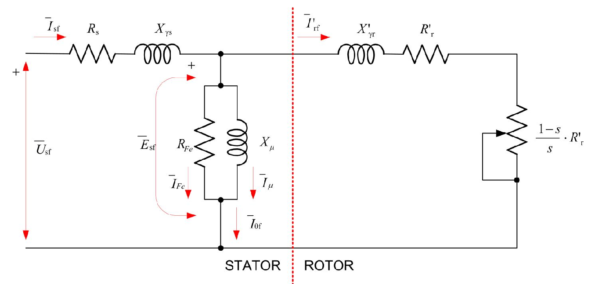
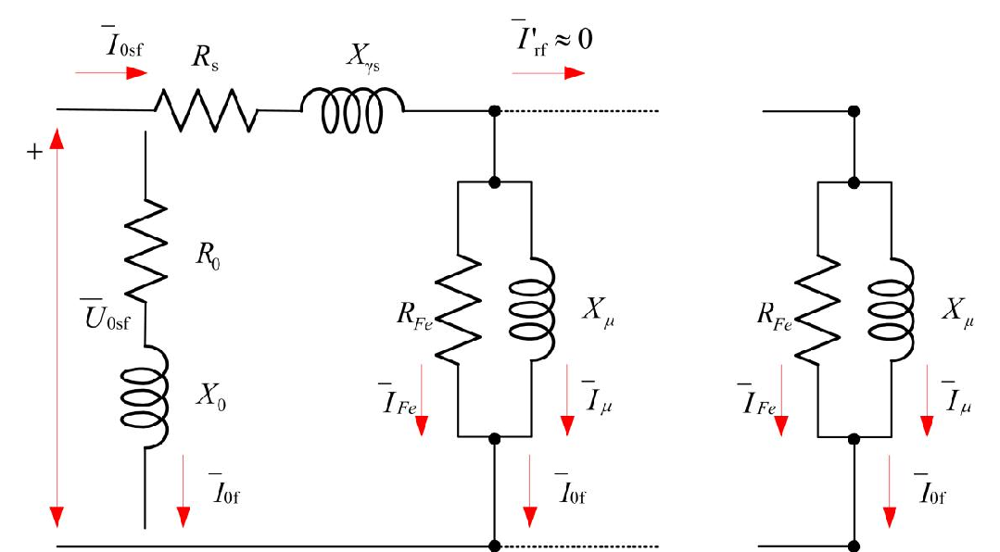
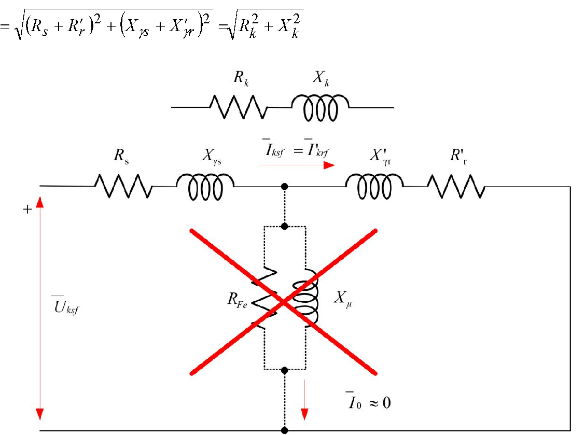
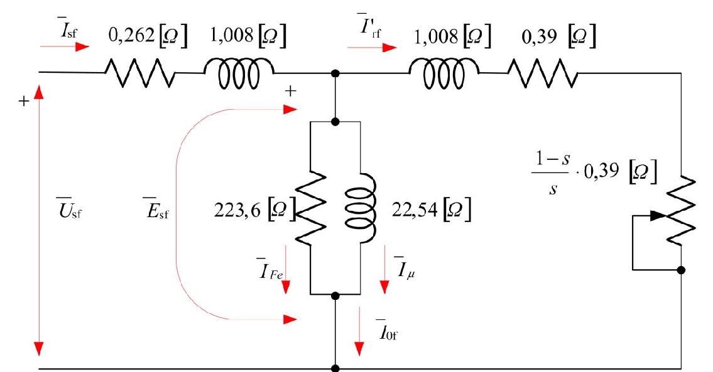

# Zadatak 35 — Parametri ekvivalentne šeme i polazni moment asinhronog motora iz ogleda praznog hoda i kratkog spoja

Ovo je jedan od najvažnijih "zanatskih" zadataka o asinhronim mašinama: iz tri jednostavna merenja (prazan hod i dva kratka spoja) izvlačimo **kompletnu ekvivalentnu šemu motora** i procenjujemo **polazni moment** — bez ijednog merenja momenta i bez opterećivanja motora.

## Postavka

Trofazni asinhroni kavezni motor ima sledeće rezultate za izvršene oglede:

1. **Ogled praznog hoda:** $U_0 = 219\ \mathrm{V}$, $I_0 = 5{,}7\ \mathrm{A}$, $P_0 = 380\ \mathrm{W}$, $P_{\mathrm{trv}} = 140\ \mathrm{W}$.
2. **Ogled kratkog spoja sa 15 Hz:** $U_k = 26{,}5\ \mathrm{V}$, $I_k = 18{,}6\ \mathrm{A}$, $P_k = 675\ \mathrm{W}$.
3. **Ogled kratkog spoja sa 60 Hz:** $U_k = 212\ \mathrm{V}$, $I_k = 83{,}3\ \mathrm{A}$, $P_k = 20{,}1\ \mathrm{kW}$.

Jednosmerni otpor po fazi (meren neposredno posle drugog ogleda) iznosi $R_s = 0{,}262\ \mathrm{\Omega}$. Na osnovu navedenih podataka odrediti:

a) parametre ekvivalentne šeme;
b) polazni momenat.

**Podaci o motoru:** $5{,}5\ \mathrm{kW}$, $220\ \mathrm{V}$, $60\ \mathrm{Hz}$, $19\ \mathrm{A}$, $2p = 4$, sprega Y.

> **Prevod na običan jezik:** Motor su u laboratoriji "provozali" kroz tri ogleda. U **praznom hodu** (motor priključen na napon, ali ništa ne vuče) izmerili su napon, struju i snagu, a posebno su odredili koliko snage odlazi na trenje i ventilaciju ($P_{\mathrm{trv}}$). U **kratkom spoju** (rotor mehanički ukočen da ne može da se okreće, napon snižen da struja ne bude razorna) merili su isto to — jednom na sniženoj frekvenciji 15 Hz, jednom na punoj frekvenciji 60 Hz. Izmerili su i omski otpor statorskog namotaja običnim jednosmernim merenjem. Od nas se traži: (a) da iz tih merenja izračunamo sve otpornosti i reaktanse u ekvivalentnoj šemi motora — tj. da napravimo "električni model" motora; (b) da procenimo koliki moment motor razvija u trenutku uključenja (polazni moment), i to čisto računski, bez merenja momenta.

> **Napomena o originalu:** U postavci zbirke odštampano je $R_s = 0{,}26\ \mathrm{\Omega}$, ali se u **celom rešenju** (i na završnoj slici 35.4) dosledno koristi preciznija vrednost $R_s = 0{,}262\ \mathrm{\Omega}$. Zato i mi računamo sa $0{,}262\ \mathrm{\Omega}$ — vrednost u postavci je očigledno samo grublje zaokružena.

## Podaci

| Veličina | Oznaka | Vrednost | Šta ta veličina fizički znači |
|---|---|---|---|
| Napon praznog hoda | $U_0$ | $219\ \mathrm{V}$ | Linijski (međufazni) napon na motoru dok radi neopterećen — praktično nazivni napon. |
| Struja praznog hoda | $I_0$ | $5{,}7\ \mathrm{A}$ | Struja koju motor vuče bez tereta; skoro sva ide na magnećenje (stvaranje obrtnog polja). |
| Snaga praznog hoda | $P_0$ | $380\ \mathrm{W}$ | Ukupna aktivna snaga koju neopterećen motor uzima iz mreže — pokriva samo gubitke. |
| Gubici trenja i ventilacije | $P_{\mathrm{trv}}$ | $140\ \mathrm{W}$ | Mehanička snaga koja se troši na trenje u ležajevima i na "mešanje" vazduha ventilatorom. |
| Napon kratkog spoja (15 Hz) | $U_{k,15}$ | $26{,}5\ \mathrm{V}$ | Sniženi linijski napon pri kome ukočeni motor na 15 Hz vuče struju blisku nazivnoj. |
| Struja kratkog spoja (15 Hz) | $I_{k,15}$ | $18{,}6\ \mathrm{A}$ | Struja ukočenog motora u ogledu na 15 Hz — namerno bliska nazivnoj ($19\ \mathrm{A}$). |
| Snaga kratkog spoja (15 Hz) | $P_{k,15}$ | $675\ \mathrm{W}$ | Aktivna snaga u ogledu na 15 Hz; skoro sva se pretvara u toplotu u namotajima. |
| Napon kratkog spoja (60 Hz) | $U_{k,60}$ | $212\ \mathrm{V}$ | Linijski napon u ogledu na punoj frekvenciji — blizu nazivnog, kao pri stvarnom polasku. |
| Struja kratkog spoja (60 Hz) | $I_{k,60}$ | $83{,}3\ \mathrm{A}$ | Polazna struja — oko $4{,}4$ puta veća od nazivne, tipično za direktno uključenje. |
| Snaga kratkog spoja (60 Hz) | $P_{k,60}$ | $20{,}1\ \mathrm{kW}$ | Aktivna snaga koju ukočeni motor guta na punom naponu i frekvenciji. |
| Otpor statora po fazi | $R_s$ | $0{,}262\ \mathrm{\Omega}$ | Omski otpor jedne faze statorskog namotaja, meren toplom (odmah posle ogleda). |
| Nazivna snaga | $P_{\mathrm{n}}$ | $5{,}5\ \mathrm{kW}$ | Mehanička snaga na vratilu koju motor trajno može da daje. |
| Nazivni napon | $U_{\mathrm{n}}$ | $220\ \mathrm{V}$ | Nazivni linijski napon mreže za koju je motor pravljen. |
| Nazivna frekvencija | $f_{\mathrm{s}}$ | $60\ \mathrm{Hz}$ | Frekvencija napona napajanja statora. |
| Nazivna struja | $I_{\mathrm{n}}$ | $19\ \mathrm{A}$ | Linijska struja pri nazivnom opterećenju. |
| Broj polova | $2p$ | $4$ | Motor ima 4 pola, tj. $p = 2$ para polova — to određuje sinhronu brzinu. |
| Sprega statora | — | Y (zvezda) | Fazni napon je linijski podeljen sa $\sqrt{3}$; fazna struja jednaka je linijskoj. |

Pošto je sprega Y, odmah zapišimo fazne napone koje ćemo koristiti: $U_{0f} = 219/\sqrt{3} \approx 126{,}4\ \mathrm{V}$ u praznom hodu, odnosno $U_{kf} = U_k/\sqrt{3}$ u kratkim spojevima. Struje su u zvezdi iste i linijske i fazne.

## Šta se traži i zašto

**a) Parametri ekvivalentne šeme.** Ekvivalentna šema je "električna maketa" motora: kolo od šest elemenata ($R_s$, $X_{\gamma s}$, $R_{\mathrm{Fe}}$, $X_\mu$, $X'_{\gamma r}$, $R'_r$) koje se prema mreži ponaša isto kao pravi motor. Inženjera to zanima jer sa poznatom šemom može **računski**, bez ijednog dodatnog merenja, da predvidi struju, faktor snage, gubitke, moment i klizanje motora za bilo koje opterećenje. Bez šeme bi svaku radnu tačku morao da meri na opterećenom motoru, što traži skupu opremu (kočnicu).

**b) Polazni moment $M_p$.** To je moment koji motor razvija u prvom trenutku po uključenju, dok rotor još stoji. On odlučuje da li motor uopšte može da pokrene svoj teret (pumpu, ventilator, transporter...) — zato je standardni katalogski podatak. Merenje momenta traži dodatnu aparaturu (moment-vagu), pa je dragoceno što ga možemo proceniti iz običnog ogleda kratkog spoja.

**Plan rešavanja:**

1. Iz **ogleda praznog hoda** izvučemo poprečnu (paralelnu) granu šeme: otpor gubitaka u gvožđu $R_{\mathrm{Fe}}$ i reaktansu magnećenja $X_\mu$ (u praznom hodu rotorska grana praktično ne vodi struju, pa "vidimo" samo poprečnu granu).
2. Iz **ogleda kratkog spoja na 15 Hz** izvučemo rednu granu: $R_k = R_s + R'_r$ (odatle $R'_r$) i ukupnu rasipnu reaktansu $X_{k,15}$ (u kratkom spoju poprečna grana je zanemarljiva, pa "vidimo" samo rednu granu). Ogled na 15 Hz se koristi zato što su tada uslovi u rotoru najbliži normalnom radu.
3. Reaktansu preračunamo sa 15 Hz na nazivnih 60 Hz (reaktansa raste linearno sa frekvencijom) i podelimo je na statorsku i rotorsku polovinu: $X_{\gamma s} = X'_{\gamma r}$.
4. Iz **ogleda kratkog spoja na 60 Hz** (uslovi kao pri stvarnom polasku) izračunamo snagu obrtnog polja $P_{\mathrm{obk}}$, iz nje moment $M_k$ pri naponu ogleda.
5. Moment preračunamo na nazivni napon preko zakona $M \propto U^2$ i dobijemo polazni moment $M_p$.

## Potrebna teorija — mini-lekcije

### Mini-lekcija 1: Klizanje, sinhrona brzina i frekvencija rotora

Statorski namotaji, napajani trofaznim naponom frekvencije $f_s$, stvaraju **obrtno magnetno polje** koje rotira sinhronom brzinom

$$n_s = \frac{60 \cdot f_s}{p}\ \left[\mathrm{ob/min}\right],$$

gde je $p$ broj **pari** polova ($2p$ je broj polova). Rotor asinhronog motora se uvek obrće **malo sporije** od polja — samo tada polje "seče" rotorske provodnike i indukuje u njima napon i struju, bez čega nema momenta. Relativno zaostajanje rotora meri **klizanje**:

$$s = \frac{n_s - n}{n_s},$$

gde je $n$ brzina rotora. U praznom hodu $s \approx 0$ (rotor skoro sustiže polje), pri ukočenom rotoru $n = 0$ pa je $s = 1$.

Ključna posledica: rotor "vidi" polje koje ga obilazi brzinom $n_s - n = s \cdot n_s$, pa je **frekvencija rotorskih veličina**

$$f_r = s \cdot f_s.$$

U normalnom radu ($s \approx 0{,}02\ldots0{,}05$) rotorska frekvencija je svega $1\!-\!3\ \mathrm{Hz}$; pri ukočenom rotoru ($s=1$) ona je puna statorska, $f_r = f_s$. Ta razlika će nam biti presudna kad budemo birali koji ogled kratkog spoja čemu služi.

### Mini-lekcija 2: Struja rotora i trik "deljenja sa $s$"

Rotorsko kolo jedne faze ima otpor $R_r$ i rasipnu induktivnost. Rasipnu reaktansu rotora dogovorno izražavamo **pri statorskoj frekvenciji**: $X_{\gamma r} = 2\pi f_s L_{\gamma r}$. Pošto je stvarna frekvencija u rotoru $f_r = s f_s$, stvarna reaktansa pri radu je $s \cdot X_{\gamma r}$. Struju kroz fazu rotora tera indukovana elektromotorna sila (EMS) $E_{rf}$:

$$I_{rf} = \frac{E_{rf}}{\sqrt{R_r^2 + \left(s \cdot X_{\gamma r}\right)^2}}.$$

EMS po fazi rotora ima isti oblik kao kod transformatora (efektivna vrednost sinusno indukovanog napona; broj $4{,}44 = \sqrt{2}\,\pi$ potiče iz prelaska sa amplitude na efektivnu vrednost):

$$E_{rf} = 4{,}44\,\Phi \cdot f_r N_r k_r = 4{,}44\,\Phi \cdot s \cdot f_s N_r k_r,$$

gde je $\Phi$ magnetni fluks po polu, $N_r$ broj navojaka po fazi rotora, a $k_r$ navojni sačinilac rotora (koeficijent manji od 1 koji uračunava to što namotaj nije skoncentrisan u jednom žlebu). Ako sa $E_{rfk}$ označimo EMS **ukočenog** (mirujućeg) rotora — tada je $s = 1$, pa je $f_{r0} = f_s$ i $E_{rfk} = 4{,}44\,\Phi f_s N_r k_r$ — vidimo da je EMS pri proizvoljnom klizanju prosto srazmerna klizanju:

$$E_{rf} = s \cdot E_{rfk}.$$

Uvrstimo to u izraz za struju:

$$I_{rf} = \frac{s \cdot E_{rfk}}{\sqrt{R_r^2 + \left(s \cdot X_{\gamma r}\right)^2}}.$$

Sada sledi ključni algebarski trik: podelimo i brojilac i imenilac sa $s$ (u motorskom radu je $s > 0$, pa je deljenje dozvoljeno). Brojilac postaje $E_{rfk}$, a za imenilac uvučemo $s$ pod koren kao $s^2$:

$$\frac{\sqrt{R_r^2 + (s X_{\gamma r})^2}}{s} = \sqrt{\frac{R_r^2 + (s X_{\gamma r})^2}{s^2}} = \sqrt{\left(\frac{R_r}{s}\right)^2 + X_{\gamma r}^2},$$

pa je

$$I_{rf} = \frac{E_{rfk}}{\sqrt{\left(\dfrac{R_r}{s}\right)^2 + X_{\gamma r}^2}}.$$

**Šta ovo znači?** Ista struja bi tekla kroz **mirujući** rotor kome je otpor po fazi $R_r/s$, a reaktansa obična $X_{\gamma r}$ pri statorskoj frekvenciji. Drugim rečima: obrtni motor sa klizanjem $s$ smemo da zamenimo nepokretnim kolom u kome je sav uticaj obrtanja "spakovan" u fiktivni otpor $R_r/s$. A motor sa ukočenim rotorom je u suštini **transformator** (statorski namotaj = primar, rotorski = sekundar, spregnuti zajedničkim fluksom) — pa za njega važi ekvivalentna šema istog oblika kao kod transformatora.

### Mini-lekcija 3: Svođenje rotorskih veličina na stator

Kao i kod transformatora, rotorske (sekundarne) veličine preračunavamo ("svodimo") na statorsku stranu, da bismo sve elemente crtali u jednom kolu. Definišimo odnos transformacije EMS:

$$m_e = \frac{N_s k_s}{N_r k_r},$$

gde su $N_s, k_s$ broj navojaka po fazi i navojni sačinilac statora, a $N_r, k_r$ isto to za rotor. Neka je $q_s$ broj faza statora (ovde $q_s = 3$), a $q_r$ broj faza rotora (kod kaveznog rotora šipke kaveza čine višefazni namotaj). Svedene veličine (obeležene primom) su:

$$\begin{aligned}
E'_{rfk} &= E_{sf} = \frac{N_s k_s}{N_r k_r} E_{rfk} = m_e E_{rfk},\\[4pt]
I'_{rf} &= \frac{q_r}{q_s} \frac{N_r k_r}{N_s k_s} I_{rf} = \frac{q_r}{q_s} \frac{1}{m_e} I_{rf},\\[4pt]
R'_r &= \frac{q_s}{q_r}\left(\frac{N_s k_s}{N_r k_r}\right)^2 R_r = \frac{q_s}{q_r} m_e^2 R_r,\\[4pt]
X'_r &= \frac{q_s}{q_r}\left(\frac{N_s k_s}{N_r k_r}\right)^2 X_r = \frac{q_s}{q_r} m_e^2 X_r.
\end{aligned}$$

Odakle ove formule? EMS se preslikava srazmerno efektivnim brojevima navojaka (kao kod transformatora). Struja se preslikava **obrnuto**, i to tako da svedeni rotor pravi istu magnetopobudnu silu kao pravi ($q_r N_r k_r I_{rf} = q_s N_s k_s I'_{rf}$) — zato se u njoj pojavljuje i odnos broja faza. Otpor i reaktansa se preslikavaju sa kvadratom odnosa, tako da gubici i reaktivna snaga ostanu isti: $q_r I_{rf}^2 R_r = q_s I'^2_{rf} R'_r$. Za nas u ovom zadatku bitno je samo da **svedene** veličine $R'_r$ i $X'_{\gamma r}$ jesu upravo ono što se pojavljuje u ekvivalentnoj šemi i što ćemo iz ogleda odrediti — same odnose $N_s/N_r$ ne moramo znati.

### Mini-lekcija 4: Ekvivalentna šema i razdvajanje otpora $R'_r/s$

Iz mini-lekcije 2 znamo da se u rotorskoj grani šeme pojavljuje fiktivni otpor $R'_r/s$. Iz njega možemo da izdvojimo stvarni otpor $R'_r$ prostom algebrom — dopišemo i oduzmemo $s$ u brojiocu:

$$\frac{R'_r}{s} = R'_r\cdot\frac{1}{s} = R'_r \cdot \frac{s + (1-s)}{s} = R'_r + R'_r\cdot\frac{1-s}{s}.$$

Ovo razdvajanje nije puka kozmetika — svaki sabirak ima jasno fizičko značenje:

- toplotni gubici u **stvarnom** otporu $R'_r$ su gubici u bakru (kavezu) rotora, $P_{\mathrm{Cur}} = q_s I'^2_{rf} R'_r$;
- "toplotni gubici" u **fiktivnom** otporu $R'_r(1-s)/s$ predstavljaju razvijenu **mehaničku snagu** (snagu konverzije) — to je promenljivi otpornik koji glumi mehanički teret;
- zbir, tj. snaga u celom $R'_r/s$, jednak je **snazi obrtnog polja** $P_{\mathrm{ob}}$ — snazi koja se magnetnim putem, kroz vazdušni zazor, prenosi sa statora na rotor:

$$P_{\mathrm{ob}} = q_s I'^2_{rf}\,\frac{R'_r}{s},\qquad P_{\mathrm{Cur}} = q_s I'^2_{rf} R'_r = s\cdot P_{\mathrm{ob}},\qquad P_c = P_{\mathrm{ob}} - P_{\mathrm{Cur}} = (1-s)\,P_{\mathrm{ob}}.$$

Odnos $P_{\mathrm{Cur}} = s\,P_{\mathrm{ob}}$ zapamti: "klizanje = deo snage zazora koji izgori u rotoru".

Sledeća slika prikazuje kompletnu ekvivalentnu šemu po fazi. Čitaj je sleva nadesno: izvor faznog napona $\overline{U}_{sf}$, pa redna statorska grana ($R_s$ — otpor statorskog namotaja, $X_{\gamma s}$ — rasipna reaktansa statora), zatim poprečna grana ($R_{\mathrm{Fe}}$ — otpor koji predstavlja gubitke u gvožđu, paralelno sa $X_\mu$ — reaktansom magnećenja kroz koju teče struja magnećenja $\overline{I}_\mu$), i na kraju, desno od isprekidane crvene linije koja simbolično razdvaja stator od rotora, svedena rotorska grana ($X'_{\gamma r}$, $R'_r$ i promenljivi otpornik $\frac{1-s}{s}R'_r$ koji predstavlja mehaničko opterećenje).

**Slika 35.1 —** Ekvivalentna šema asinhronog motora (po jednoj fazi). Isprekidana linija deli statorski i rotorski deo; promenljivi otpornik $\frac{1-s}{s}\cdot R'_r$ predstavlja mehaničku snagu koju motor predaje teretu.

### Mini-lekcija 5: Ogled praznog hoda — otkuda $R_{\mathrm{Fe}}$ i $X_\mu$

U praznom hodu motor ne vuče teret, pa mu je klizanje skoro nula. Tada fiktivni otpor $\frac{1-s}{s}R'_r \to \infty$: rotorska grana se ponaša kao **prekinuta** i kroz nju praktično ne teče struja ($I'_{rf}\approx 0$). Sva struja praznog hoda $I_0$ prolazi kroz poprečnu granu — zato baš ovaj ogled otkriva $R_{\mathrm{Fe}}$ i $X_\mu$.

Izmerena snaga praznog hoda $P_0$ pokriva tri vrste gubitaka (korisne snage nema):

1. gubitke u bakru statora $3 I_0^2 R_s$ (mali, jer je $I_0$ mala);
2. gubitke u gvožđu $P_{\mathrm{Fe}}$ (vrtložne struje i histerezis u magnetnom kolu);
3. gubitke usled trenja i ventilacije $P_{\mathrm{trv}}$ (mehanički — rotor se ipak obrće).

Prvo od $P_0$ oduzmemo statorski bakar i dobijemo takozvane **uže gubitke praznog hoda** $P'_0 = P_{\mathrm{Fe}} + P_{\mathrm{trv}}$; pošto je $P_{\mathrm{trv}}$ posebno izmeren i dat, gubici u gvožđu se dobijaju još jednim oduzimanjem. Zatim, uz zanemarenje malog pada napona na $R_s$ i $X_{\gamma s}$ (struja $I_0$ je mala), ceo fazni napon $U_{0f}$ stoji na poprečnoj grani. Kako su $R_{\mathrm{Fe}}$ i $X_\mu$ **paralelni**, struja $I_0$ se deli na aktivnu komponentu $I_{\mathrm{Fe}} = I_0\cos\varphi_0$ (kroz $R_{\mathrm{Fe}}$) i reaktivnu $I_\mu = I_0\sin\varphi_0$ (kroz $X_\mu$). Odatle:

$$R_{\mathrm{Fe}} = \frac{q_s\,U_{0f}^2}{P_{\mathrm{Fe}}},\qquad X_\mu = \frac{U_{0f}}{I_\mu} = \frac{U_{0f}}{I_0\sin\varphi_0} = \frac{Z_0}{\sin\varphi_0},$$

gde je $Z_0 = U_{0f}/I_0$ ukupna impedansa praznog hoda po fazi. Obrati pažnju: $X_\mu$ se dobija **deljenjem** $Z_0$ sa $\sin\varphi_0$, a ne množenjem! Množenje ($Z_0\sin\varphi_0$) daje rednu reaktansu ekvivalentne redne veze, a nama treba element **paralelne** grane kroz koji teče samo deo struje.

### Mini-lekcija 6: Ogled kratkog spoja — otkuda $R'_r$ i rasipne reaktanse; zašto baš 15 Hz

U ogledu kratkog spoja rotor je mehanički **ukočen**: $n = 0$, dakle $s = 1$, pa fiktivni otpornik nestaje:

$$R'_r\,\frac{1-s}{s} = R'_r\cdot\frac{1-1}{1} = 0.$$

Motor tada iz mreže vuče vrlo veliku struju (zato se ogled izvodi na sniženom naponu). Struja rotorske grane je ogromna u poređenju sa strujom magnećenja, pa se poprečna grana ($R_{\mathrm{Fe}} \parallel X_\mu$) sme **zanemariti**: ostaje čista redna veza statorske i rotorske grane. Njena impedansa po fazi je impedansa kratkog spoja:

$$Z_k = \sqrt{\left(R_s + R'_r\right)^2 + \left(X_{\gamma s} + X'_{\gamma r}\right)^2} = \sqrt{R_k^2 + X_k^2},$$

gde su $R_k = R_s + R'_r$ (otpor kratkog spoja) i $X_k = X_{\gamma s} + X'_{\gamma r}$ (rasipna reaktansa kratkog spoja). Aktivna snaga ogleda gori praktično sva u $R_k$: $P_k = 3 I_k^2 R_k$ — odatle $R_k$, pa oduzimanjem poznatog $R_s$ i $R'_r$.

**Zašto dva ogleda, na 15 Hz i na 60 Hz?** Zbog **potiskivanja struje** (skin-efekta) u šipkama rotorskog kaveza. Naizmenična struja visoke frekvencije ne teče ravnomerno po preseku šipke, već se "potiskuje" ka njenom vrhu — efektivni presek se smanjuje, pa efektivni otpor rotora raste (a rasipna reaktansa opada). Pri ukočenom rotoru na 60 Hz rotorska frekvencija je punih 60 Hz i efekat je jak; u **normalnom radu** rotorska frekvencija je svega $f_r = s f_s \approx 1\!-\!3\ \mathrm{Hz}$ i efekta praktično nema. Zato:

- ogled na **15 Hz** (niska rotorska frekvencija, struja $18{,}6\ \mathrm{A}$ bliska nazivnoj $19\ \mathrm{A}$) daje parametre koji važe za **normalan rad** — iz njega vadimo $R'_r$ i $X_k$ za ekvivalentnu šemu;
- ogled na **60 Hz** verno oponaša **trenutak polaska** motora (rotor stoji, puna frekvencija, velika struja) — iz njega ćemo računati polazni moment.

Još jedna posledica snižene frekvencije: reaktansa je srazmerna frekvenciji, $X = 2\pi f L_\gamma$, pa reaktansu izmerenu na 15 Hz moramo preračunati na nazivnih 60 Hz množenjem odnosom frekvencija $60/15 = 4$. Otpor, naravno, ne zavisi od frekvencije (dok god nema skin-efekta). Na kraju, kako iz zbira $X_k$ izdvojiti $X_{\gamma s}$ i $X'_{\gamma r}$ posebno? Sama merenja to ne mogu da razdvoje — standardna inženjerska pretpostavka (kad nema dodatnih podataka) jeste da se rasipanje deli popola: $X_{\gamma s} = X'_{\gamma r} = X_k/2$.

### Mini-lekcija 7: Moment iz snage obrtnog polja i korekcija $M \propto U^2$

Obrtni moment (moment konverzije) je snaga konverzije podeljena ugaonom brzinom rotora $\omega$. Iskoristimo bilans iz mini-lekcije 4 ($P_c = P_{\mathrm{ob}} - P_{\mathrm{Cur}}$, $P_{\mathrm{Cur}} = sP_{\mathrm{ob}}$) i vezu $\omega = \omega_s(1-s)$, gde je $\omega_s$ mehanička ugaona brzina obrtnog polja:

$$M_{\mathrm{ob}} = \frac{P_c}{\omega} = \frac{P_{\mathrm{ob}} - P_{\mathrm{Cur}}}{\omega_s(1-s)} = \frac{P_{\mathrm{ob}} - sP_{\mathrm{ob}}}{\omega_s(1-s)} = \frac{P_{\mathrm{ob}}(1-s)}{\omega_s(1-s)} = \frac{P_{\mathrm{ob}}}{\omega_s}.$$

Faktor $(1-s)$ se skratio i dobili smo izuzetno praktičan rezultat: **moment je snaga obrtnog polja podeljena sinhronom ugaonom brzinom, za bilo koje klizanje** — pa i za $s = 1$ (polazak), gde bi direktna formula $P_c/\omega$ bila neupotrebljiva ($0/0$). Pri tome je

$$\omega_s = \frac{2\pi}{60}\cdot n_s,$$

sa $n_s$ u ob/min. Snagu obrtnog polja pri polasku dobijamo iz izmerene snage kratkog spoja tako što od nje oduzmemo ono što se izgubi **pre** zazora — bakar statora i gvožđe:

$$P_{\mathrm{obk}} = P_k - P_{\mathrm{Cusk}} - P_{\mathrm{Fes}} = P_k - 3 I_k^2 R_s - P_{\mathrm{Fes}},$$

pri čemu se gubici u gvožđu pri kratkom spoju zanemaruju — oni su 3–4 puta manji od nominalnih (zbog velikog pada napona na rasipnim impedansama fluks u mašini je znatno manji nego u praznom hodu), a uz to su sitni prema $P_k$ od $20\ \mathrm{kW}$.

Poslednji sastojak: ogled je izveden na $212\ \mathrm{V}$, a polazak se dešava na nazivnih $220\ \mathrm{V}$. Elektromagnetni moment je srazmeran **kvadratu** napona: fluks je srazmeran naponu ($\Phi \propto U$ pri datoj frekvenciji), a moment je proizvod fluksa i rotorske struje koja je i sama, pri datom klizanju, srazmerna naponu — dakle $M \propto U\cdot U = U^2$. Zato:

$$M_p = \left(\frac{U_{\mathrm{n}}}{U_k}\right)^2 M_k.$$

## Rešenje, korak po korak

### Deo a) Parametri ekvivalentne šeme

Počinjemo od ogleda praznog hoda. Sledeća slika pokazuje kako ekvivalentna šema izgleda baš u tom ogledu — čitaj je sleva nadesno kao postupno uprošćavanje: levo je puna šema u kojoj je rotorska grana isprekidana jer kroz nju ne teče struja ($\overline{I}'_{rf}\approx 0$), a sa priključaka se ceo motor vidi kao jedna impedansa $Z_0$ (vertikalna grana $R_0$, $X_0$ uz izvor); desno je konačno uprošćenje — kad zanemarimo pad napona na $R_s$ i $X_{\gamma s}$, ostaje samo paralelna veza $R_{\mathrm{Fe}}$ i $X_\mu$ direktno na faznom naponu, sa strujom $\overline{I}_{0f}$ podeljenom na $\overline{I}_{\mathrm{Fe}}$ i $\overline{I}_\mu$.

**Slika 35.2 —** Naponi, struje i ekvivalentna šema asinhronog motora za ogled praznog hoda: rotorska grana je otvorena ($s\approx 0$), pa merenja "vide" samo poprečnu granu.

### Korak 1: Uži gubici praznog hoda $P'_0$

**Zašto ovaj korak:** Izmerena snaga $P_0$ sadrži i gubitke u bakru statora, koji nam ovde smetaju — hoćemo da izdvojimo samo ono što se troši u gvožđu i na trenje. Zato od $P_0$ oduzimamo Džulove gubitke u sve tri faze statora.

$$P'_0 = P_0 - 3\,I_0^2 R_s$$

Ovde je $P_0$ ukupna snaga praznog hoda, $I_0$ struja praznog hoda (fazna = linijska, sprega Y), a $R_s$ otpor jedne faze statora. Uvrštavamo brojeve:

$$P'_0 = 380 - 3\cdot 5{,}7^2\cdot 0{,}262 = 380 - 3\cdot 32{,}49\cdot 0{,}262 = 380 - 25{,}54 = 354{,}46\ \mathrm{W}.$$

**Šta smo dobili:** Gubici u bakru statora u praznom hodu iznose svega $\approx 25{,}5\ \mathrm{W}$ — malo, kako i očekujemo pri maloj struji. Ostatak od $354{,}46\ \mathrm{W}$ deli se između gvožđa i trenja.

### Korak 2: Gubici u gvožđu $P_{\mathrm{Fe}}$

**Zašto ovaj korak:** U $P'_0$ su zajedno gubici u gvožđu i mehanički gubici. Mehanički deo $P_{\mathrm{trv}}$ nam je dat (izmeren posebno), pa gvožđe dobijamo oduzimanjem.

$$P_{\mathrm{Fe}} = P_{\mathrm{Fes}} = P'_0 - P_{\mathrm{trv}} = 354{,}46 - 140 = 214{,}46\ \mathrm{W}.$$

Indeks "s" u $P_{\mathrm{Fes}}$ podseća da se gubici u gvožđu dešavaju praktično samo u **statoru** — u rotoru je frekvencija premagnetisavanja u normalnom radu svega par herca, pa su tamošnji gubici u gvožđu zanemarljivi.

**Šta smo dobili:** $214{,}46\ \mathrm{W}$ gubitaka od vrtložnih struja i histerezisa — oko $4\ \%$ nazivne snage, sasvim uobičajen red veličine.

### Korak 3: Otpor $R_{\mathrm{Fe}}$

**Zašto ovaj korak:** $R_{\mathrm{Fe}}$ je element šeme koji "glumi" gubitke u gvožđu — biramo ga tako da na faznom naponu troši tačno $P_{\mathrm{Fe}}$. Pad napona na statorskoj impedansi zanemarujemo (mini-lekcija 5), pa na poprečnoj grani stoji pun fazni napon $U_{0f} = U_0/\sqrt{3}$.

$$R_{\mathrm{Fe}} = \frac{q_s\cdot U_{0f}^2}{P_{\mathrm{Fe}}} = \frac{3\cdot\left(219/\sqrt{3}\right)^2}{214{,}46}$$

Primeti zgodno skraćivanje: $3\cdot\left(\dfrac{219}{\sqrt 3}\right)^2 = 3\cdot\dfrac{219^2}{3} = 219^2$, pa je

$$R_{\mathrm{Fe}} = \frac{219^2}{214{,}46} = \frac{47961}{214{,}46} = 223{,}6\ \mathrm{\Omega}.$$

**Šta smo dobili:** Veliki otpor — skoro hiljadu puta veći od $R_s$. To je dobro: kroz njega curi mala aktivna struja $I_{\mathrm{Fe}} = U_{0f}/R_{\mathrm{Fe}} \approx 126{,}4/223{,}6 \approx 0{,}57\ \mathrm{A}$, tj. gubici u gvožđu su mali u poređenju sa snagom mašine.

### Korak 4: Impedansa praznog hoda $Z_0$

**Zašto ovaj korak:** $Z_0$ je ukupna impedansa koju motor u praznom hodu pokazuje po fazi — treba nam kao odskočna daska za $X_\mu$. Po definiciji je fazni napon kroz faznu struju; kod sprege Y fazni napon je $U_0/\sqrt 3$, a fazna struja je jednaka linijskoj $I_0$:

$$Z_0 = \frac{U_{0f}}{I_0} = \frac{U_0}{\sqrt{3}\,I_0} = \frac{219}{\sqrt{3}\cdot 5{,}7} = \frac{219}{9{,}873} = 22{,}18\ \mathrm{\Omega}.$$

**Šta smo dobili:** Red veličine desetina oma — mnogo više od impedanse kratkog spoja koju ćemo videti kasnije (ispod jednog oma), jer u praznom hodu struju ograničava velika grana magnećenja.

### Korak 5: Faktor snage praznog hoda, $\cos\varphi_0$ i $\sin\varphi_0$

**Zašto ovaj korak:** Da bismo iz ukupne struje $I_0$ izdvojili njenu reaktivnu komponentu (onu koja teče kroz $X_\mu$), treba nam fazni stav $\varphi_0$ između napona i struje. Njega daje izmerena aktivna snaga preko standardne trofazne formule $P_0 = \sqrt 3\,U_0 I_0\cos\varphi_0$:

$$\cos\varphi_0 = \frac{P_0}{\sqrt{3}\cdot U_0 I_0} = \frac{380}{\sqrt{3}\cdot 219\cdot 5{,}7} = \frac{380}{2162{,}1} = 0{,}176.$$

Sinus dobijamo iz osnovnog trigonometrijskog identiteta $\sin^2\varphi + \cos^2\varphi = 1$:

$$\sin\varphi_0 = \sqrt{1 - \cos^2\varphi_0} = \sqrt{1 - 0{,}176^2} = \sqrt{1 - 0{,}031} = \sqrt{0{,}969} = 0{,}984.$$

**Šta smo dobili:** Vrlo nizak $\cos\varphi_0$ — struja praznog hoda kasni za naponom skoro $80^\circ$. To je tipično: neopterećen asinhroni motor je za mrežu praktično čista prigušnica, vuče gotovo isključivo reaktivnu struju za magnećenje.

### Korak 6: Reaktansa magnećenja $X_\mu$

**Zašto ovaj korak:** Poslednji element poprečne grane. Kroz $X_\mu$ teče samo reaktivna komponenta struje, $I_\mu = I_0\sin\varphi_0$, a na njoj stoji (približno) pun fazni napon — pa delimo (mini-lekcija 5):

$$X_\mu = \frac{U_{0f}}{I_0\sin\varphi_0} = \frac{Z_0}{\sin\varphi_0} = \frac{22{,}18}{0{,}984} = 22{,}54\ \mathrm{\Omega}.$$

**Šta smo dobili:** $X_\mu$ je tek malo veća od $Z_0$ — logično, jer je struja praznog hoda skoro čisto reaktivna ($\sin\varphi_0 = 0{,}984 \approx 1$), pa grana magnećenja i "jeste" gotovo cela impedansa praznog hoda.

Time je poprečna grana gotova. Prelazimo na ogled kratkog spoja. Pri kratkom spoju rotor stoji ($s = 1$), pa fiktivni otpornik nestaje:

$$R'_r\,\frac{1-s}{s} = 0.$$

Sledeća slika prikazuje šemu za ovaj ogled: poprečna grana je precrtana (kroz nju teče zanemarljiva struja $\overline{I}_0 \approx 0$ u poređenju sa velikom strujom kratkog spoja), pa je struja statora jednaka svedenoj struji rotora ($\overline{I}_{ksf} = \overline{I}'_{krf}$) i sve se svodi na prostu rednu vezu — gore desno na slici sažetu u $R_k$ i $X_k$.

**Slika 35.3 —** Naponi, struje i ekvivalentna šema asinhronog motora za ogled kratkog spoja: grana magnećenja se zanemaruje, ostaje redna veza $R_k = R_s + R'_r$ i $X_k = X_{\gamma s} + X'_{\gamma r}$.

Podsetnik iz mini-lekcije 6: parametre šeme vadimo iz ogleda na **15 Hz**, jer je u njemu potiskivanje struje u rotorskom kavezu slabo izraženo, a struja ($18{,}6\ \mathrm{A}$) bliska nazivnoj — radni uslovi su najbliži normalnim.

### Korak 7: Impedansa kratkog spoja na 15 Hz, $Z_{k,15}$

**Zašto ovaj korak:** Kao i kod $Z_0$ — ukupna impedansa po fazi, sada iz podataka ogleda na 15 Hz:

$$Z_{k,15} = \frac{U_k}{\sqrt{3}\,I_k} = \frac{26{,}5}{\sqrt{3}\cdot 18{,}6} = \frac{26{,}5}{32{,}22} = 0{,}823\ \mathrm{\Omega}.$$

**Šta smo dobili:** Ispod jednog oma — oko 27 puta manje od $Z_0$. Zato je struja kratkog spoja tako velika i zato se ogled izvodi na sniženom naponu.

> **Napomena o originalu:** Zbirka na ovom mestu navodi $0{,}825\ \mathrm{\Omega}$, a u sledećem koraku $R_k = 0{,}652\ \mathrm{\Omega}$ — obe vrednosti su za dlaku "prejako" zaokružene (tačno je $0{,}823$ i $0{,}650$; razlika potiče od zaokruživanja međurezultata i manja je od $0{,}5\ \%$). Na dalji tok nema nikakvog uticaja: veličina $X_{k,15}$ u koraku 9 ispada $0{,}504\ \mathrm{\Omega}$ i po tačnom računu i u zbirci, a $R'_r$ se u oba slučaja zaokružuje na $0{,}39\ \mathrm{\Omega}$.

### Korak 8: Otpor kratkog spoja $R_k$ i svedeni otpor rotora $R'_r$

**Zašto ovaj korak:** Sva aktivna snaga ogleda gori u rednom otporu $R_k = R_s + R'_r$ (poprečna grana je isključena iz igre), pa iz snage direktno čitamo $R_k$:

$$P_{k,15} = 3\,I_k^2 R_k = 3\,I_k^2\left(R_s + R'_r\right)$$

Odavde izrazimo $R_k$ deljenjem obe strane sa $3I_k^2$:

$$R_k = R_s + R'_r = \frac{P_{k,15}}{3\,I_k^2} = \frac{675}{3\cdot 18{,}6^2} = \frac{675}{3\cdot 345{,}96} = \frac{675}{1037{,}9} = 0{,}650\ \mathrm{\Omega}.$$

Otpor statora znamo iz jednosmernog merenja, pa rotorski deo dobijamo oduzimanjem:

$$R'_r = R_k - R_s = 0{,}650 - 0{,}262 = 0{,}388\ \mathrm{\Omega} \approx 0{,}39\ \mathrm{\Omega}.$$

**Šta smo dobili:** Svedeni otpor rotorskog kaveza je istog reda veličine kao otpor statora — normalno za kavezni motor ove snage. (Zbirka, sa svojim zaokruženim $R_k = 0{,}652$, dobija $R'_r = 0{,}390\ \mathrm{\Omega}$ — ista vrednost $0{,}39\ \mathrm{\Omega}$ na dve decimale.)

### Korak 9: Rasipna reaktansa kratkog spoja na 15 Hz, $X_{k,15}$

**Zašto ovaj korak:** Znamo hipotenuzu ($Z_{k,15}$) i jednu katetu ($R_k$) trougla impedanse — reaktansa je druga kateta, po Pitagorinoj teoremi primenjenoj na $Z_k^2 = R_k^2 + X_k^2$:

$$X_{k,15} = X_{\gamma s,15} + X'_{\gamma r,15} = \sqrt{Z_{k,15}^2 - R_k^2} = \sqrt{0{,}823^2 - 0{,}650^2} = \sqrt{0{,}6774 - 0{,}4225} = \sqrt{0{,}2549} = 0{,}504\ \mathrm{\Omega}.$$

**Šta smo dobili:** Ukupno rasipanje statora i rotora, ali **pri 15 Hz** — ovaj broj još ne sme u šemu, jer šemu pravimo za nazivnu frekvenciju.

### Korak 10: Preračunavanje na 60 Hz i podela $X_k$ na $X_{\gamma s}$ i $X'_{\gamma r}$

**Zašto ovaj korak:** Reaktansa je srazmerna frekvenciji ($X = 2\pi f L_\gamma$), a ekvivalentnu šemu pravimo za nazivnu frekvenciju od 60 Hz (za nju se šema i podrazumeva ako drugačije nije rečeno). Induktivnost $L_\gamma$ se nije promenila — menjamo samo frekvenciju, pa množimo odnosom frekvencija:

$$X_k = X_{\gamma s} + X'_{\gamma r} = \frac{60}{15}\cdot X_{k,15} = 4\cdot 0{,}504 = 2{,}016\ \mathrm{\Omega}.$$

Merenja ne mogu da razdvoje statorski i rotorski deo rasipanja, pa usvajamo standardnu pretpostavku ravnomerne podele $X_{\gamma s} = X'_{\gamma r}$:

$$X_{\gamma s} = X'_{\gamma r} = \frac{X_k}{2} = \frac{2{,}016}{2} = 1{,}008\ \mathrm{\Omega}.$$

**Šta smo dobili:** Kompletnu rednu granu. Uoči hijerarhiju: $X_\mu = 22{,}54\ \mathrm{\Omega}$ je oko 22 puta veća od $X_{\gamma s} = 1{,}008\ \mathrm{\Omega}$ — glavni fluks je "jak", rasipanje "slabo", što je odlika svake zdrave mašine.

Time je deo a) završen. Sledeća slika prikazuje ekvivalentnu šemu sa svim upisanim izračunatim vrednostima — istu šemu kao na slici 35.1, samo što su umesto simbola upisani brojevi (redom sleva: $R_s = 0{,}262\ \mathrm{\Omega}$, $X_{\gamma s} = 1{,}008\ \mathrm{\Omega}$, u poprečnoj grani $R_{\mathrm{Fe}} = 223{,}6\ \mathrm{\Omega}$ i $X_\mu = 22{,}54\ \mathrm{\Omega}$, pa $X'_{\gamma r} = 1{,}008\ \mathrm{\Omega}$, $R'_r = 0{,}39\ \mathrm{\Omega}$ i promenljivi otpornik $\frac{1-s}{s}\cdot 0{,}39\ \mathrm{\Omega}$).

**Slika 35.4 —** Parametri ekvivalentne šeme (za nazivnu frekvenciju 60 Hz), sa svim izračunatim vrednostima.

### Deo b) Polazni moment

Polazni moment računamo iz ogleda kratkog spoja sa **60 Hz**, jer su u njemu radni uslovi (ukočen rotor, puna frekvencija, velika struja) upravo uslovi u trenutku upuštanja motora u rad — uključujući i skin-efekat u kavezu, koji pri polasku stvarno postoji i koji 15-hercni ogled ne bi obuhvatio.

### Korak 11: Snaga obrtnog polja pri kratkom spoju, $P_{\mathrm{obk}}$

**Zašto ovaj korak:** Moment ćemo dobiti iz formule $M = P_{\mathrm{ob}}/\omega_s$ (mini-lekcija 7), pa nam prvo treba snaga koja kroz zazor stiže do rotora. Od izmerene ulazne snage $P_k$ oduzimamo ono što se izgubi pre zazora:

$$P_{\mathrm{obk}} = P_k - P_{\mathrm{Cusk}} - P_{\mathrm{Fes}} = P_k - 3\,I_k^2 R_s - P_{\mathrm{Fes}}.$$

Gubici u gvožđu pri ogledu kratkog spoja su 3–4 puta manji od nominalnih (fluks je znatno smanjen zbog velikih padova napona na rasipnim impedansama), a i nominalnih $\approx 214\ \mathrm{W}$ je sitnica prema $20{,}1\ \mathrm{kW}$ — pa se $P_{\mathrm{Fes}}$ zanemaruje:

$$P_{\mathrm{obk}} = P_k - 3\,I_k^2 R_s = 20100 - 3\cdot 83{,}3^2\cdot 0{,}262 = 20100 - 3\cdot 6938{,}9\cdot 0{,}262 = 20100 - 5454 = 14646\ \mathrm{W}.$$

**Šta smo dobili:** Od $20{,}1\ \mathrm{kW}$ ulazne snage, čak $5{,}45\ \mathrm{kW}$ (27 %) izgori u bakru statora — pri polaznoj struji od $4{,}4\,I_{\mathrm{n}}$ Džulovi gubici su $\approx 19$ puta veći nego pri nazivnoj struji. Do rotora kroz zazor stiže $14{,}65\ \mathrm{kW}$; pošto rotor stoji ($s=1$), sva ta snaga izgori u rotorskom kavezu — mehaničke snage nema, ali momenta ima!

### Korak 12: Sinhrona brzina $n_s$ i sinhrona ugaona brzina $\omega_s$

**Zašto ovaj korak:** U formuli za moment stoji $\omega_s$, koju određuju frekvencija mreže i broj polova (mini-lekcija 1). Motor ima $2p = 4$ pola, tj. $p = 2$ para polova:

$$n_s = \frac{60\cdot f_s}{p} = \frac{60\cdot 60}{2} = 1800\ \mathrm{ob/min},$$

$$\omega_s = \frac{2\pi}{60}\cdot n_s = \frac{2\pi}{60}\cdot 1800 = 2\pi\cdot 30 = 188{,}5\ \mathrm{rad/s}.$$

**Šta smo dobili:** Standardnu sinhronu brzinu četvoropolne mašine na 60 Hz.

### Korak 13: Moment u ogledu kratkog spoja, $M_k$

**Zašto ovaj korak:** Sada primenjujemo glavni rezultat mini-lekcije 7, $M = P_{\mathrm{ob}}/\omega_s$, koji važi za svako klizanje pa i za $s = 1$:

$$M_k = \frac{P_{\mathrm{obk}}}{\omega_s} = \frac{P_{\mathrm{obk}}}{\dfrac{2\pi}{60}\cdot n_s} = \frac{14646}{\dfrac{2\pi}{60}\cdot 1800} = \frac{14646}{188{,}5} = 77{,}7\ \mathrm{Nm}.$$

**Šta smo dobili:** Moment koji je mašina stvarno razvijala tokom ogleda — ali na naponu ogleda ($212\ \mathrm{V}$), ne na nazivnom.

### Korak 14: Korekcija na nazivni napon — polazni moment $M_p$

**Zašto ovaj korak:** Tokom ogleda stator je bio priključen na napon nešto niži od nazivnog ($212\ \mathrm{V}$ umesto $220\ \mathrm{V}$). Elektromagnetni moment je srazmeran kvadratu napona (mini-lekcija 7), pa moment ogleda uvećavamo kvadratom odnosa napona:

$$M_p = \left(\frac{U_{\mathrm{n}}}{U_k}\right)^2 M_k = \left(\frac{220}{212}\right)^2\cdot 77{,}7 = 1{,}0377^2\cdot 77{,}7 = 1{,}0769\cdot 77{,}7 = 83{,}7\ \mathrm{Nm}.$$

**Šta smo dobili:** Polazni moment motora na nazivnom naponu: $M_p \approx 83{,}7\ \mathrm{Nm}$. Polazni moment je važan katalogski podatak svakog motora i orijentaciono iznosi $(0{,}8\div 2{,}5)\cdot M_{\mathrm{n}}$. Ceo deo b) ilustruje kako se polazni moment može približno izračunati **bez merenja momenta** — što je praktično dragoceno, jer merenje momenta traži dodatnu aparaturu (moment-vagu).

## Česte greške i zamke

1. **Mešanje linijskih i faznih vrednosti kod sprege Y.** Svi naponi u podacima ($219$, $26{,}5$, $212\ \mathrm{V}$) su **linijski**; u formule za impedansu po fazi ide fazni napon $U/\sqrt 3$ (otuda $\sqrt 3$ u imeniocima za $Z_0$ i $Z_k$). Struje su kod zvezde iste, pa se tu ne dira ništa. Ko podeli i struju sa $\sqrt 3$ — ili ne podeli napon — dobija impedanse pogrešne za faktor $\sqrt 3$ ili $3$.
2. **Zaboravljeno preračunavanje reaktanse sa 15 na 60 Hz.** $X_{k,15} = 0{,}504\ \mathrm{\Omega}$ važi samo na 15 Hz; u šemu za 60 Hz ide $4\cdot 0{,}504 = 2{,}016\ \mathrm{\Omega}$. Otpori se, naravno, **ne** preračunavaju — omski otpor ne zavisi od frekvencije.
3. **$X_\mu$ množenjem umesto deljenjem.** Refleks iz redne veze ($X = Z\sin\varphi$) ovde je pogrešan: $R_{\mathrm{Fe}}$ i $X_\mu$ su **paralelni**, kroz $X_\mu$ teče samo $I_0\sin\varphi_0$, pa je $X_\mu = Z_0/\sin\varphi_0 = 22{,}54\ \mathrm{\Omega}$, a ne $Z_0\cdot\sin\varphi_0 = 21{,}8\ \mathrm{\Omega}$. (Brojčano su ovde slične jer je $\sin\varphi_0\approx 1$ — utoliko je greška podmuklija.)
4. **Polazni moment iz pogrešnog ogleda ili iz pogrešne snage.** Za moment se koristi ogled na **60 Hz** (uslovi polaska!), i to snaga obrtnog polja $P_{\mathrm{obk}} = P_k - 3I_k^2R_s$, a ne izmerena $P_k$ direktno — inače se moment precenjuje za skoro $30\ \%$. Takođe, deli se **sinhronom** ugaonom brzinom $\omega_s$, a ne brzinom rotora (koja je pri polasku nula — deljenje njome je besmisleno).
5. **Linearna umesto kvadratne korekcije napona.** $M \propto U^2$, pa korekcioni faktor mora biti $(220/212)^2 = 1{,}077$, a ne $220/212 = 1{,}038$.
6. **Hladan umesto topao otpor statora.** $R_s$ je namerno meren "neposredno posle ogleda", dok je namotaj još zagrejan na radnu temperaturu — otpor bakra raste sa temperaturom oko $0{,}4\ \%/^\circ\mathrm{C}$, pa bi hladna vrednost potcenila gubitke u bakru.

## Rezime rezultata

| Tražena veličina | Oznaka | Vrednost |
|---|---|---|
| Otpor statorskog namotaja (po fazi) | $R_s$ | $0{,}262\ \mathrm{\Omega}$ |
| Rasipna reaktansa statora (60 Hz) | $X_{\gamma s}$ | $1{,}008\ \mathrm{\Omega}$ |
| Otpor gubitaka u gvožđu | $R_{\mathrm{Fe}}$ | $223{,}6\ \mathrm{\Omega}$ |
| Reaktansa magnećenja | $X_\mu$ | $22{,}54\ \mathrm{\Omega}$ |
| Svedena rasipna reaktansa rotora (60 Hz) | $X'_{\gamma r}$ | $1{,}008\ \mathrm{\Omega}$ |
| Svedeni otpor rotora | $R'_r$ | $0{,}39\ \mathrm{\Omega}$ |
| Moment u ogledu kratkog spoja (60 Hz, 212 V) | $M_k$ | $77{,}7\ \mathrm{Nm}$ |
| **Polazni moment (na nazivnom naponu)** | $M_p$ | $83{,}7\ \mathrm{Nm}$ |

## Provera smisla

**1. Dimenziona provera momenta.** $M = P/\omega_s$ daje $\mathrm{W}/(\mathrm{rad/s}) = \mathrm{W\cdot s} = \mathrm{J} = \mathrm{N\,m}$ — jedinice se slažu.

**2. Poređenje sa nazivnim vrednostima.** Struja praznog hoda: $I_0/I_{\mathrm{n}} = 5{,}7/19 = 0{,}30$ — tipičnih $25\div 50\ \%$. Polazna struja: $I_{k,60}/I_{\mathrm{n}} = 83{,}3/19 = 4{,}4$ — u tipičnom opsegu $4\div 7$ za direktno uključenje kaveznog motora. Nazivni moment je približno $M_{\mathrm{n}} \approx P_{\mathrm{n}}/\omega_{\mathrm{n}} \approx 5500/(188{,}5\cdot(1-s_{\mathrm{n}})) \approx 30\ \mathrm{Nm}$, pa je $M_p/M_{\mathrm{n}} \approx 83{,}7/30 \approx 2{,}8$ — na samom vrhu (i malo iznad) orijentacionog raspona $(0{,}8\div 2{,}5)\cdot M_{\mathrm{n}}$ koji navodi zbirka. To je uverljivo za kavezni motor sa izraženim potiskivanjem struje: skin-efekat pri polasku povećava efektivni otpor rotora, a veći rotorski otpor pri $s=1$ znači veći polazni moment.

**3. Hijerarhija parametara.** $X_\mu/X_{\gamma s} = 22{,}54/1{,}008 \approx 22$ i $R_{\mathrm{Fe}} \gg R_s$ — grana magnećenja je za red-dva veličine "teža" od redne grane, kako i mora biti: glavni fluks kroz zazor je dominantan, a rasipanje i gubici u gvožđu su sporedne pojave.

**4. Ogledi se međusobno "kontrolišu" — i otkrivaju skin-efekat.** Iz parametara dobijenih 15-hercnim ogledom predvideli bismo impedansu kratkog spoja na 60 Hz od $\sqrt{0{,}65^2 + 2{,}016^2} \approx 2{,}12\ \mathrm{\Omega}$; izmereno je, međutim, $Z_{k,60} = 212/(\sqrt 3\cdot 83{,}3) = 1{,}47\ \mathrm{\Omega}$, a iz $P_{k,60}$ sledi $R_{k,60} = 20100/(3\cdot 83{,}3^2) = 0{,}97\ \mathrm{\Omega}$, tj. prividni otpor rotora pri polasku $\approx 0{,}70\ \mathrm{\Omega}$ — skoro dvostruko veći od $R'_r = 0{,}39\ \mathrm{\Omega}$ iz normalnog rada, uz osetno manju reaktansu. Upravo to je potiskivanje struje na delu, i upravo zato zadatak s pravom koristi **dva** ogleda: 15 Hz za parametre normalnog rada, 60 Hz za uslove polaska. Brojevi su, dakle, međusobno potpuno konzistentni sa fizikom mašine.
