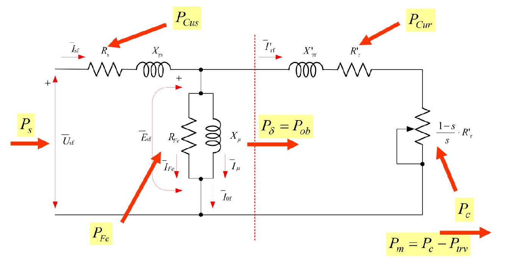
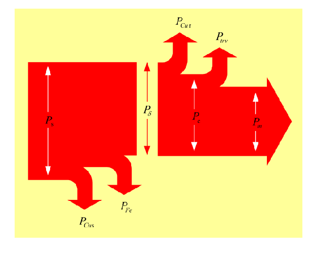
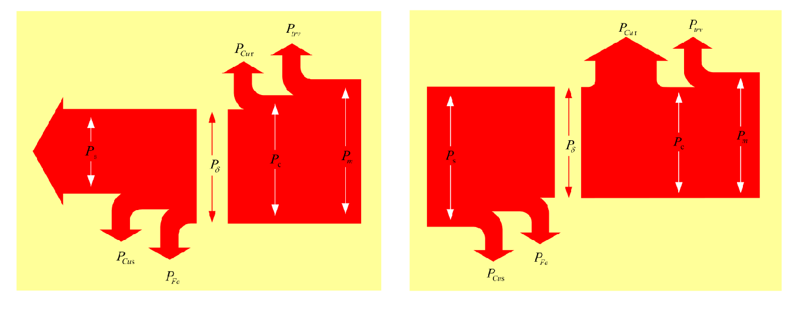

# Zadatak 36 — Pojedinačno određivanje gubitaka asinhronog motora iz tri ogleda praznog hoda

## Postavka

Na trofaznom asinhronom motoru **sa namotanim rotorom** (kliznokolutni motor), nazivnih podataka: snaga $20\ \mathrm{kW}$, napon $500\ \mathrm{V}$, brzina $1450\ \mathrm{o/min}$, struja $32\ \mathrm{A}$, $\cos\varphi = 0{,}85$, sprega Y, izvršena su sledeća tri ogleda:

- **a) Ogled praznog hoda** (standardni, napajanje sa strane statora): $U_0 = 500\ \mathrm{V}$, $I_0 = 7\ \mathrm{A}$, $P_0 = 1600\ \mathrm{W}$.
- **b) Ogled praznog hoda pri otvorenom namotu rotora:** $U_0 = 500\ \mathrm{V}$, $I_0 = 6{,}75\ \mathrm{A}$, $P_{00} = 1850\ \mathrm{W}$, $U_r = 400\ \mathrm{V}$ ($U_r$ je napon izmeren između kliznih kolutova rotora).
- **c) Ogled praznog hoda sa strane rotora**, pri čemu je namot statora kratko spojen: $I_r = 9{,}45\ \mathrm{A}$, $P_{02} = 1640\ \mathrm{W}$, $U_r = 400\ \mathrm{V}$.

Otpori namota na radnoj temperaturi su $R_{\mathrm{UW}} = 0{,}74\ \Omega$ za stator i $R_{\mathrm{KL}} = 0{,}082\ \Omega$ za rotor (oba izmerena **između krajeva namotaja**, videti mini-lekciju 3).

**Odrediti gubitke pojedinačno.**

> **Prevod na običan jezik:** Motor koji radi nikad ne pretvori svu električnu snagu u koristan mehanički rad — deo se putem gubitaka pretvori u toplotu. Tih gubitaka ima više vrsta: grejanje bakarnih namotaja statora i rotora (Džulovi gubici), grejanje gvozdenog magnetnog kola (gubici u gvožđu), trenje u ležajevima i otpor vazduha pri obrtanju (mehanički gubici). Problem je što nijedan od njih ne možemo da izmerimo direktno — vatmetar na priključcima uvek pokazuje samo njihov **zbir**. Trik ovog zadatka: izvedemo **tri različita ogleda praznog hoda**, tako smišljena da u svakom ogledu "radi" **različita kombinacija** gubitaka. Tri merenja → tri jednačine → tri nepoznate — i sistem jednačina nam "razdvoji" gubitke koje inače ne umemo da razdvojimo. Na kraju, za nazivni (pun) režim rada izračunamo još i bakarne gubitke statora i rotora, saberemo sve i proverimo da li se bilans slaže sa nazivnim podacima motora — mali "višak" koji ostane su tzv. dodatni gubici.

## Podaci

| Veličina | Oznaka | Vrednost | Šta ta veličina fizički znači |
|---|---|---|---|
| Nazivna snaga | $P_{\mathrm{n}}$ | $20\ \mathrm{kW}$ | **Mehanička** snaga na vratilu koju motor trajno daje (nazivna snaga motora je uvek izlazna snaga) |
| Nazivni napon (linijski) | $U_{\mathrm{sn}}$ | $500\ \mathrm{V}$ | Napon mreže za koji je motor projektovan |
| Nazivna brzina | $n_{\mathrm{n}}$ | $1450\ \mathrm{o/min}$ | Brzina obrtanja vratila pri punom opterećenju |
| Nazivna struja (linijska) | $I_{\mathrm{sn}}$ | $32\ \mathrm{A}$ | Struja koju motor vuče iz mreže pri punom opterećenju |
| Nazivni faktor snage | $\cos\varphi_{\mathrm{sn}}$ | $0{,}85$ | Kosinus faznog stava između napona i struje statora u nazivnom režimu |
| Sprega statora | — | Y (zvezda) | Fazni namotaji vezani u zvezdu: linijska struja = fazna struja, linijski napon = $\sqrt{3}\times$ fazni |
| Ogled a): napon, struja, snaga | $U_0,\ I_0,\ P_0$ | $500\ \mathrm{V},\ 7\ \mathrm{A},\ 1600\ \mathrm{W}$ | Klasičan prazan hod: motor se vrti neopterećen, napajan sa statora |
| Ogled b): napon, struja, snaga | $U_0,\ I_0,\ P_{00}$ | $500\ \mathrm{V},\ 6{,}75\ \mathrm{A},\ 1850\ \mathrm{W}$ | Rotorski namot otvoren → rotor **stoji**; meri se sa statorske strane |
| Ogled b): napon rotora | $U_r$ | $400\ \mathrm{V}$ | Elektromotorna sila indukovana u rotorskom namotu, izmerena između kliznih kolutova |
| Ogled c): struja, snaga, napon | $I_r,\ P_{02},\ U_r$ | $9{,}45\ \mathrm{A},\ 1640\ \mathrm{W},\ 400\ \mathrm{V}$ | Motor napajan **sa rotorske strane** ($400\ \mathrm{V}$, $50\ \mathrm{Hz}$), stator kratko spojen, vratilo neopterećeno |
| Otpor statorskog namota (između krajeva) | $R_{\mathrm{UW}}$ | $0{,}74\ \Omega$ | Omski otpor izmeren između priključaka U i W statora — obuhvata **dve** fazne grane na red |
| Otpor rotorskog namota (između kolutova) | $R_{\mathrm{KL}}$ | $0{,}082\ \Omega$ | Omski otpor izmeren između dva klizna koluta rotora — takođe dve fazne grane na red |
| Učestanost mreže | $f_s$ | $50\ \mathrm{Hz}$ | Standardna mrežna učestanost; u tekstu rešenja zbirke eksplicitno se koristi $50\ \mathrm{Hz}$ |
| Broj faza statora i rotora | $q_s,\ q_r$ | $3,\ 3$ | I stator i namotani rotor imaju po tri fazna namotaja |

## Šta se traži i zašto

Traži se da se **svaki gubitak odredi pojedinačno**, brojčano:

- **$P_{\mathrm{Fes}}$ — gubici u gvožđu statora.** Toplota koja nastaje u limovima magnetnog kola statora zbog naizmeničnog premagnetisavanja (histerezis) i vihornih struja. Inženjera zanimaju jer postoje **čim je motor pod naponom**, i kad ne radi ništa korisno — direktno kvare stepen iskorišćenja i greju mašinu.
- **$P_{\mathrm{trv}}$ — gubici na trenje i ventilaciju** (mehanički gubici). Snaga koja se troši na trenje u ležajevima i na "mešanje" vazduha ventilatorom i samim rotorom. Postoje **čim se motor obrće**, nezavisno od opterećenja.
- **$P_{\mathrm{Cusn}}$ — gubici u bakru statora u nazivnom režimu.** Džulovo grejanje statorskog namotaja, raste sa kvadratom struje — najveći pojedinačni gubitak pod punim opterećenjem.
- **$P_{\mathrm{Curn}}$ — gubici u bakru rotora u nazivnom režimu.** Džulovo grejanje rotorskog namotaja; videćemo da je elegantno srazmerno klizanju.
- **Dodatni (dopunski) gubici** — ono što "procuri" mimo gornje četiri stavke (efekat potiskivanja struje i sl.); dobićemo ih iz bilansa.
- Usput ćemo dobiti i **$P_{\mathrm{Fer}}^{(50\,\mathrm{Hz})}$ — gubitke u gvožđu rotora pri učestanosti $50\ \mathrm{Hz}$** — veličinu koja postoji samo u ogledima b) i c) (gde rotor "vidi" punih $50\ \mathrm{Hz}$), a u normalnom radu je zanemariva.

Zašto je ovo inženjerski važno: raspodela gubitaka govori **gde se motor greje** (pa kako ga hladiti), koliki mu je stepen iskorišćenja i da li su merenja međusobno saglasna. Ovo je i standardna laboratorijska procedura za razdvajanje gubitaka.

**Plan rešavanja, običnim jezikom:**

1. Izmerene otpore (između krajeva) pretvorimo u **fazne** otpore — kod sprege Y to znači deljenje sa 2.
2. Za svaki od tri ogleda napišemo **bilans snage**: koju kombinaciju gubitaka pokriva izmerena snaga tog ogleda. Iz svakog ogleda oduzmemo bakarne gubitke (njih znamo izračunati iz izmerene struje i otpora) — ostane po jedna jednačina sa nepoznatima $P_{\mathrm{Fes}}$, $P_{\mathrm{trv}}$, $P_{\mathrm{Fer}}^{(50\,\mathrm{Hz})}$.
3. Rešimo dobijeni sistem $3\times 3$ — sabiranjem i oduzimanjem jednačina.
4. Za nazivni režim izračunamo primljenu snagu $P_{\mathrm{sn}}$, bakarne gubitke statora $P_{\mathrm{Cusn}}$ (iz struje) i bakarne gubitke rotora $P_{\mathrm{Curn}}$ (preko klizanja i snage obrtnog polja).
5. Saberemo nazivnu snagu i sve gubitke, uporedimo sa $P_{\mathrm{sn}}$ iz nazivnih podataka — razlika su **dodatni gubici**.

## Potrebna teorija — mini-lekcije

### 1. Sinhrona brzina, klizanje i učestanost rotorskih veličina

Trofazni namotaj statora, priključen na mrežu učestanosti $f_s$, stvara **obrtno magnetno polje** koje se obrće sinhronom brzinom:

$$n_s = \frac{60 \cdot f_s}{p}\ \ \mathrm{[o/min]}$$

gde je $p$ broj **pari** polova. Za $f_s = 50\ \mathrm{Hz}$ moguće sinhrone brzine su $3000,\ 1500,\ 1000,\ 750,\ldots\ \mathrm{o/min}$. Naš motor se nazivno vrti $1450\ \mathrm{o/min}$ — asinhroni motor u motorskom režimu uvek se vrti **malo sporije** od sinhrone brzine, pa je jedini kandidat $n_s = 1500\ \mathrm{o/min}$ (tj. $p = 2$, četvoropolna mašina).

**Klizanje** $s$ je relativno zaostajanje rotora za obrtnim poljem:

$$s = \frac{n_s - n}{n_s}$$

Ključna posledica: rotor "vidi" obrtno polje kako promiče pored njega brzinom $n_s - n$, pa se u rotorskim provodnicima indukuju napon i struja učestanosti

$$f_r = s \cdot f_s$$

U nazivnom radu $s$ je svega par procenata, pa je $f_r$ reda $1\text{–}2\ \mathrm{Hz}$ — ovo će nam biti presudno za razumevanje gubitaka u gvožđu rotora (mini-lekcija 4). Ali ako rotor **stoji** ($n = 0$, $s = 1$), rotor vidi punih $f_r = f_s = 50\ \mathrm{Hz}$!

### 2. Bilans snage asinhronog motora — "reka snage" od mreže do vratila

Ovo je centralna lekcija zadatka. Snaga u asinhronom motoru teče kao reka koja usput gubi po malo vode na svakoj "brani". Ceo tok najlakše se prati na ekvivalentnoj šemi. Slika 36.1 prikazuje ekvivalentnu šemu asinhronog motora (po fazi) sa ucrtanim svim snagama koje ćemo u nastavku pratiti.

**Slika 36.1 —** Bilans snage asinhronog motora prikazan na ekvivalentnoj šemi.

> **Kako čitati sliku 36.1:** Ovo je ekvivalentna šema **jedne faze** motora, sa crvenim strelicama i žutim etiketama koje pokazuju gde koja snaga (u $\mathrm{W}$) ulazi, prolazi ili se gubi. Prati struju sleva nadesno: iz izvora faznog napona $\overline{U}_{s\mathrm{f}}$ (levo; tu ulazi snaga $P_s$) statorska struja $\overline{I}_{s\mathrm{f}}$ prolazi kroz redni otpor statora $R_s$ (u $\Omega$; na njemu se gubi $P_{\mathrm{Cus}}$ — Džulovo grejanje statorskog bakra) i rasipnu reaktansu statora $X_{\gamma s}$ (reaktansa aktivnu snagu ne troši). Poprečna grana u sredini nosi struju $\overline{I}_{0\mathrm{f}}$, koja se deli na $\overline{I}_{\mathrm{Fe}}$ kroz otpor $R_{\mathrm{Fe}}$ (on modeluje gubitke u gvožđu $P_{\mathrm{Fe}}$) i $\overline{I}_{\mu}$ kroz reaktansu magnećenja $X_{\mu}$ (ona pravi glavni fluks); napon na toj grani je indukovana ems $\overline{E}_{s\mathrm{f}}$. Crvena isprekidana vertikala je **vazdušni zazor** — granica statorskog i rotorskog dela šeme; kroz nju prelazi snaga obrtnog polja $P_{\delta} = P_{\mathrm{ob}}$. Desno od zazora svedena rotorska struja $\overline{I}'_{r\mathrm{f}}$ teče kroz rasipnu reaktansu rotora $X'_{\gamma r}$ i otpor rotora $R'_r$ (na njemu $P_{\mathrm{Cur}}$), a na fiktivnom promenljivom otporu $\frac{1-s}{s}\cdot R'_r$ (kosa strelica preko simbola = vrednost se menja sa klizanjem) razvija se snaga konverzije $P_c$; žuta etiketa dole desno podseća da je korisna snaga $P_m = P_c - P_{\mathrm{trv}}$, jer mehanički gubici nisu električni element pa ih šema ne sadrži. Brojevi nazivnog režima iz ovog zadatka: $P_{s\mathrm{n}} = 23\,555{,}9\ \mathrm{W}$, $P_{\mathrm{Cusn}} = 1136{,}64\ \mathrm{W}$, $P_{\mathrm{Fes}} = 857{,}255\ \mathrm{W}$, $P_{\delta\mathrm{n}} = 21\,562\ \mathrm{W}$, $P_{\mathrm{Curn}} = 718{,}662\ \mathrm{W}$, $P_{\mathrm{trv}} = 688{,}355\ \mathrm{W}$, $P_m = P_{\mathrm{n}} = 20\,000\ \mathrm{W}$. **Šta treba da zaključiš:** svaka vrsta gubitaka "stanuje" na tačno jednom elementu šeme — zato se pametno izabranim ogledima, u kojima pojedini elementi ne rade, gubici mogu razdvojiti.

Sada svaka "stanica" reke, redom:

**Ulazna (primljena) snaga statora.** Snaga koju motor uzima iz izvora:

$$P_s = q_s \cdot U_{sf} \cdot I_{sf} \cdot \cos\varphi_s$$

gde je $q_s$ broj faza statora ($q_s = 3$), $U_{sf}$ fazni napon statora, $I_{sf}$ fazna struja statora, a $\varphi_s$ fazni stav (ugao) između njih. Ovo je opšta formula aktivne snage višefaznog potrošača. Za spregu Y važi $U_{sf} = U_s/\sqrt{3}$ i $I_{sf} = I_s$ (linijska = fazna struja), pa se ista snaga može pisati i preko linijskih veličina: $P_s = \sqrt{3}\cdot U_s \cdot I_s \cdot \cos\varphi_s$.

**Gubici u bakru statora.** Džulovo grejanje statorskog namotaja usled proticanja struje $I_s$:

$$P_{\mathrm{Cus}} = q_s \cdot R_s \cdot I_{sf}^2$$

gde je $R_s$ otpor **jedne faze** statora. Poreklo: svaka od $q_s$ faza je otpornik $R_s$ kroz koji teče struja $I_{sf}$, a na otporniku se razvija toplota $R\cdot I^2$ (Džulov zakon).

**Gubici u gvožđu.** U magnetnom kolu statora fluks se naizmenično premagnetisava učestanošću $f_s$, pa nastaju magnetni gubici (histerezis + vihorne struje) koji zavise od **napona napajanja** (tj. amplitude fluksa) i **učestanosti** — ne od opterećenja. Gubici u gvožđu **rotora** su u normalnom radu zanemarivi (mini-lekcija 4), pa se ukupni gubici u gvožđu praktično svode na statorske: $P_{\mathrm{Fe}} \approx P_{\mathrm{Fes}}$. U ekvivalentnoj šemi modelovani su aktivnim otporom $R_{\mathrm{Fe}}$ u poprečnoj grani.

**Snaga obrtnog polja.** Kada se od ulazne snage odbiju oba statorska gubitka, ostatak prelazi sa statora na rotor **kroz vazdušni zazor, putem elektromagnetnog polja** — zato se zove snaga obrtnog (magnetnog) polja, oznaka $P_\delta$ (delta podseća na vazdušni zazor) ili $P_{\mathrm{ob}}$:

$$P_\delta = P_{\mathrm{ob}} = P_s - P_{\mathrm{Cus}} - P_{\mathrm{Fe}}$$

Na ekvivalentnoj šemi to je snaga koja se razvija na fiktivnom otporu $R_r/s$ usled proticanja rotorske struje:

$$P_\delta = q_r \cdot I_{rf}^2 \cdot \frac{R_r}{s} = q_s \cdot {I'_{rf}}^2 \cdot \frac{R'_r}{s}$$

gde je $q_r$ broj faza rotora, $I_{rf}$ stvarna fazna struja rotora i $R_r$ stvarni fazni otpor rotora; primovane veličine $I'_{rf}$ i $R'_r$ su rotorske veličine **svedene na stator** (preračunate kroz prenosni odnos, kao kod transformatora — obe varijante daju istu snagu, jer svođenje po definiciji čuva snage).

**Gubici u bakru rotora i zlatna relacija $P_{\mathrm{Cur}} = s\cdot P_\delta$.** Džulovi gubici rotorskog namotaja su:

$$P_{\mathrm{Cur}} = q_r \cdot I_{rf}^2 \cdot R_r = q_s \cdot {I'_{rf}}^2 \cdot R'_r$$

Uporedi ovo sa izrazom za $P_\delta$: razlikuju se **samo** u tome što $P_\delta$ ima $R_r/s$ a $P_{\mathrm{Cur}}$ ima $R_r$. Podelimo ih:

$$\frac{P_{\mathrm{Cur}}}{P_\delta} = \frac{q_r \cdot I_{rf}^2 \cdot R_r}{q_r \cdot I_{rf}^2 \cdot \dfrac{R_r}{s}} = s \quad\Longrightarrow\quad P_{\mathrm{Cur}} = s \cdot P_\delta$$

Rečima: **od snage koja pređe zazor, tačno deo $s$ izgori u bakru rotora**, a ostatak $(1-s)$ postane mehanička snaga. Zato motor sa malim klizanjem ima efikasan rotor — i zato su gubici u bakru rotora srazmerni i klizanju i opterećenju.

**Snaga konverzije (proizvedena mehanička snaga).** Ono što od $P_\delta$ preostane posle rotorskih bakarnih gubitaka pretvara se u mehaničku snagu:

$$P_c = P_\delta - P_{\mathrm{Cur}} = P_\delta - s\cdot P_\delta = (1-s)\cdot P_\delta$$

U ekvivalentnoj šemi ovo je snaga na fiktivnom otporu $R_r\cdot\frac{1-s}{s}$. Odakle taj otpor? Otpor $R_r/s$, koji modeluje **celu** snagu obrtnog polja, raščlani se algebarski na dva sabirka:

$$\frac{R_r}{s} = R_r + R_r\cdot\frac{1-s}{s}$$

(proveri: $R_r + R_r\frac{1-s}{s} = R_r\frac{s + 1 - s}{s} = \frac{R_r}{s}$ ✓). Prvi sabirak $R_r$ je stvaran otpor — modeluje Džulove gubitke rotora; drugi, promenljiv sa klizanjem, modeluje mehanički "teret". Stoga:

$$P_c = q_r \cdot I_{rf}^2 \cdot \frac{R_r}{s}\cdot(1-s) = q_s \cdot {I'_{rf}}^2 \cdot \frac{R'_r}{s}\cdot(1-s)$$

**Korisna mehanička snaga i stepen iskorišćenja.** Deo snage konverzije pojede trenje i ventilacija, pa na vratilo izlazi:

$$P_m = P_c - P_{\mathrm{trv}}$$

Mehanički gubici $P_{\mathrm{trv}}$ **nisu obuhvaćeni ekvivalentnom šemom** (šema je čisto električni model) — zato se na slici 36.1 pojavljuju tek kao napomena uz izlaz. Stepen korisnog dejstva je odnos izlazne i ulazne snage (za motorski režim: mehaničke i električne):

$$\eta = \frac{P_m}{P_s}$$

**Varijanta sa dodatnim otporom u rotoru.** Kod kliznokolutnih mašina može se preko kolutova u rotorsko kolo vezati dodatni (spoljašnji) otpor $R_{rd}$ (za pokretanje ili regulaciju brzine). Tada u sve rotorske izraze umesto $R_r$ ulazi $R_r + R_{rd}$:

$$P_\delta = q_r \cdot I_{rf}^2 \cdot \frac{R_r + R_{rd}}{s} = q_s \cdot {I'_{rf}}^2 \cdot \frac{R'_r + R'_{rd}}{s}$$

Na dodatnom otporu nastaju dodatni električni gubici $P_{rd} = q_r\cdot I_{rf}^2\cdot R_{rd} = q_s\cdot {I'_{rf}}^2\cdot R'_{rd}$, i tada relacija sa klizanjem glasi $P_{\mathrm{Cur}} + P_{rd} = s\cdot P_\delta$, a snaga konverzije $P_c = P_\delta - P_{\mathrm{Cur}} - P_{rd} = q_r\cdot I_{rf}^2\cdot\frac{R_r+R_{rd}}{s}\cdot(1-s)$. U ovom zadatku dodatnog otpora **nema** ($R_{rd}=0$), ali je važno znati da postoji ta opštija forma.

Ceo bilans se najzornije vidi na tzv. Sankijevom dijagramu — "traci" čija širina predstavlja snagu, a bočne grane gubitke. Slika 36.2 prikazuje takav dijagram za motorski režim.

**Slika 36.2 —** Bilans snage asinhrone mašine u motornom režimu.

> **Kako čitati sliku 36.2:** Sankijev dijagram nema ose — informaciju nosi **širina crvene trake**, koja je u svakom preseku srazmerna snazi u $\mathrm{W}$ (bele dvosmerne strelice kotiraju širinu i uz njih stoje oznake snaga). Tok se čita sleva nadesno: najšira traka $P_s$ ulazi levo (u nazivnom režimu $23\,555{,}9\ \mathrm{W}$); prva grana koja se odvaja **nadole** je $P_{\mathrm{Cus}}$ ($1136{,}64\ \mathrm{W}$), druga $P_{\mathrm{Fe}}$ ($857{,}255\ \mathrm{W}$) — statorski gubici; suženi "struk" u sredini je snaga obrtnog polja $P_{\delta}$ ($21\,562\ \mathrm{W}$), koja prelazi vazdušni zazor. Na rotorskoj strani odvajaju se **naviše** $P_{\mathrm{Cur}}$ ($718{,}662\ \mathrm{W}$ — tačno deo $s = 3{,}33\ \%$ od $P_\delta$), pa mehanički gubici $P_{\mathrm{trv}}$ ($688{,}355\ \mathrm{W}$); traka između njih nosi snagu konverzije $P_c$, a velika strelica koja izlazi desno je korisna mehanička snaga $P_m$ ($20\,000\ \mathrm{W}$). **Šta treba da zaključiš:** grane gubitaka su tanke prema glavnom toku — oko $85\ \%$ ulazne snage stigne do vratila, što je upravo stepen iskorišćenja koji dobijamo u proveri smisla.

Ista mašina može da radi i obrnuto — slika 36.3 prikazuje bilanse snage za preostala dva režima, generatorski i kočioni.

**Slika 36.3 —** Bilans snage asinhrone mašine u generatorskom i kočionom režimu.

> **Kako čitati sliku 36.3:** Dva Sankijeva dijagrama sa istim "rečnikom" kao slika 36.2 (širina crvene trake = snaga u $\mathrm{W}$; bele strelice kotiraju širine), ali sa drugačijim smerovima toka. **Levi panel — generatorski režim:** mehanička snaga $P_m$ ulazi zdesna (sa vratila); od nje se **naviše** odvajaju $P_{\mathrm{trv}}$ i $P_{\mathrm{Cur}}$; ostatak — snaga obrtnog polja $P_\delta$ (kotirana u sredini) — prelazi zazor ka statoru; tamo se **nadole** odvajaju $P_{\mathrm{Fe}}$ i $P_{\mathrm{Cus}}$, a velika strelica $P_s$ izlazi **ulevo** — mašina predaje električnu snagu mreži. **Desni panel — kočioni režim:** snaga ulazi **sa obe strane** — električna $P_s$ sleva i mehanička $P_m$ zdesna — a bočno ne izlazi ništa: sve se pretvara u gubitke unutar mašine ($P_{\mathrm{Cus}}$ i $P_{\mathrm{Fe}}$ nadole, $P_{\mathrm{trv}}$ naviše), pri čemu je grana $P_{\mathrm{Cur}}$ ubedljivo najšira — pri kočenju je $s > 1$, pa je $P_{\mathrm{Cur}} = s\cdot P_\delta$ čak veće od same snage koja pređe zazor. **Šta treba da zaključiš:** bilans je uvek isti, menja se samo smer strelica; u kočionom režimu se sva dovedena snaga (i električna i mehanička) pretvara u toplotu, najviše u bakru rotora — zato je kočenje termički najteži režim rada.

### 3. Zašto se izmereni otpor deli sa 2 — merenje otpora između krajeva namotaja

Ommetrom ne možemo da "uđemo" u motor i izmerimo otpor jedne faze — dostupni su nam samo spoljašnji priključci (kod statora: stezaljke U, V, W; kod namotanog rotora: klizni kolutovi K, L, M). Kod sprege **Y** struja od priključka U do priključka W prolazi kroz **dve fazne grane na red** (faza U do zvezdišta, pa od zvezdišta kroz fazu W). Zato je izmereno:

$$R_{\mathrm{UW}} = 2 \cdot R_s \quad\Longrightarrow\quad R_s = \frac{R_{\mathrm{UW}}}{2}$$

Isto važi za rotor namotan i spregnut u zvezdu, meren između dva klizna koluta: $R_r = R_{\mathrm{KL}}/2$. **Zato se u svim brojčanim izrazima ovog zadatka pojavljuje $\frac{0{,}74}{2}$ i $\frac{0{,}082}{2}$** — to nije nikakva magija, nego pretvaranje izmerenog otpora "kraj–kraj" u fazni otpor.

### 4. Zašto su gubici u gvožđu rotora normalno zanemarivi — a u ova dva ogleda nisu

Gubici u gvožđu rastu sa učestanošću premagnetisavanja (histerezisni približno linearno, vihorni sa kvadratom učestanosti). Magnetno kolo **statora** uvek radi na punih $f_s = 50\ \mathrm{Hz}$. Magnetno kolo **rotora**, međutim, premagnetisava se rotorskom učestanošću $f_r = s\cdot f_s$ (mini-lekcija 1). U normalnom radu $s \approx 2\text{–}4\,\%$, pa je $f_r \approx 1\text{–}2\ \mathrm{Hz}$ — gvožđe rotora se premagnetisava tako sporo da su njegovi gubici zanemarivi prema statorskim. Zato u normalnom radu pišemo $P_{\mathrm{Fe}} \approx P_{\mathrm{Fes}}$.

**Ali:** u ogledu b) rotor **stoji** ($s = 1$), a u ogledu c) rotorski namot je direktno priključen na izvor od $50\ \mathrm{Hz}$ — u oba slučaja gvožđe rotora radi na punih $50\ \mathrm{Hz}$ i njegovi gubici $P_{\mathrm{Fer}}^{(50\,\mathrm{Hz})}$ postaju **veliki i nezanemarivi** (videćemo: skoro $1\ \mathrm{kW}$!). Ta veličina je artefakt ogleda — u normalnom radu je nema — ali je moramo pravilno knjižiti u bilansima ogleda, inače bi nam pokvarila račun.

### 5. Od čega zavise gubici u gvožđu — i zašto smemo da ih "prenosimo" iz ogleda u ogled

Gubici u gvožđu zavise od **amplitude fluksa** (koju diktira napon: $U \approx 4{,}44\, f N \Phi$, pa je pri datoj učestanosti fluks srazmeran naponu) i od **učestanosti** — a praktično **ne zavise od opterećenja** (struje). Posledice koje ovaj zadatak koristi:

1. Gubici u gvožđu statora **isti su u ogledima a) i b)** — u oba je stator pod istim naponom ($500\ \mathrm{V}$) iste učestanosti ($50\ \mathrm{Hz}$), a to što su struje malo različite ne smeta, jer gubici u gvožđu od struje ne zavise.
2. Gubici u gvožđu rotora **isti su u ogledima b) i c)** — u ogledu b) na rotoru se indukuje $400\ \mathrm{V}$, $50\ \mathrm{Hz}$; u ogledu c) na rotor se dovodi $400\ \mathrm{V}$, $50\ \mathrm{Hz}$. Isti napon + ista učestanost → isti fluks → isti gubici u gvožđu.
3. Da su naponi bili **različiti**, gubitke bismo preračunavali **kvadratno sa naponom** ($P_{\mathrm{Fe}} \propto U^2$ pri istoj učestanosti — jer su gubici približno srazmerni kvadratu fluksa, a fluks naponu). Ovde to nije potrebno, ali je važno znati pravilo.

### 6. Tri ogleda praznog hoda — šta koji ogled "vidi"

Svaki ogled napišemo kao bilans: izmerena snaga = zbir gubitaka koji u tom ogledu postoje. Ključno je za svaki ogled razmisliti **šta se obrće, šta vodi struju i koje učestanosti gde vladaju**.

**Ogled a) — klasičan prazan hod (napajanje statora, rotor kratko spojen, vratilo neopterećeno).** Motor se vrti praktično sinhronom brzinom ($s \approx 0$). Rotorske struje su tada bliske nuli i vrlo niske učestanosti → gubici u bakru **i** gvožđu rotora zanemarivi. Postoje: gubici u gvožđu statora (pun napon, $50\ \mathrm{Hz}$), gubici u bakru statora (teče struja praznog hoda $I_0$) i mehanički gubici (motor se vrti):

$$P_0 = P_{\mathrm{Fes}} + P_{\mathrm{Cus}} + P_{\mathrm{trv}}$$

**Ogled b) — prazan hod sa otvorenim rotorom.** Otvoren rotorski namot → nema rotorske struje → nema rotorskog polja koje bi (u sadejstvu sa statorskim) pravilo moment → **rotor se ne obrće** → nema mehaničkih gubitaka ($P_{\mathrm{trv}} = 0$ u ovom ogledu), a nema ni gubitaka u bakru rotora (struja je nula). Ali rotor stoji ($s=1$), pa se u njegovom namotu (i gvožđu!) indukuje elektromotorna sila **statorske učestanosti** $50\ \mathrm{Hz}$ — gubici u gvožđu rotora sada su itekako prisutni:

$$P_{00} = P_{\mathrm{Fes}} + P_{\mathrm{Cus}} + P_{\mathrm{Fer}}^{(50\,\mathrm{Hz})}$$

**Ogled c) — prazan hod sa rotorske strane, stator kratko spojen.** Sada uloge zamenjene: izvor ($400\ \mathrm{V}$, $50\ \mathrm{Hz}$) napaja rotor, pa rotorsko polje vuče mašinu — motor se obrće približno sinhronom brzinom koja odgovara učestanosti dovedenog rotorskog napona. Pošto je vratilo neopterećeno, "klizanje" gledano sa rotorske strane je $\approx 0$: učestanost elektromotorne sile indukovane u statoru i struja kroz kratkospojeni stator bliske su nuli → **nema gubitaka u gvožđu statora** (ni u bakru statora). Postoje: gubici u bakru rotora (teče rotorska struja $I_r$), gubici u gvožđu rotora (rotorski namot na $400\ \mathrm{V}$, $50\ \mathrm{Hz}$) i mehanički gubici (mašina se vrti):

$$P_{02} = P_{\mathrm{Cur}} + P_{\mathrm{Fer}}^{(50\,\mathrm{Hz})} + P_{\mathrm{trv}}$$

Pogledaj lepotu konstrukcije: tri ogleda daju tri jednačine u kojima se tri nepoznate ($P_{\mathrm{Fes}}$, $P_{\mathrm{trv}}$, $P_{\mathrm{Fer}}^{(50\,\mathrm{Hz})}$) pojavljuju u **različitim parovima** — sistem je rešiv prostim sabiranjem i oduzimanjem. Bakarni gubici nisu nepoznate: njih u svakom ogledu izračunamo direktno iz izmerene struje i poznatog otpora.

### 7. Dodatni (dopunski) gubici i efekat potiskivanja struje

Naizmenična struja u masivnijim provodnicima ne teče ravnomerno po preseku — potiskuje se ka površini (skin-efekat, "efekat potiskivanja struje"). Time je iskorišćeni presek manji, pa je **efektivni otpor za naizmeničnu struju veći** od otpora izmerenog ommetrom (jednosmernom strujom). Razlika u Džulovim gubicima koja zbog toga (i zbog rasipnih flukseva viših harmonika) nastane ne obuhvata se izrazima $q\,R\,I^2$ sa ommetarskim otporima — ti "prosuti" vati zovu se **dodatni gubici**. U ovom zadatku ćemo ih uhvatiti elegantno: kao razliku između primljene snage izračunate iz nazivnih podataka i primljene snage sastavljene iz bilansa (nazivna snaga + svi pojedinačno određeni gubici).

## Rešenje, korak po korak

### Korak 1: Fazni otpori namotaja

**Zašto ovaj korak:** sve formule za bakarne gubitke traže otpor **jedne faze**, a izmereni su otpori između krajeva (mini-lekcija 3).

$$R_s = \frac{R_{\mathrm{UW}}}{2} = \frac{0{,}74}{2} = 0{,}37\ \Omega \qquad\qquad R_r = \frac{R_{\mathrm{KL}}}{2} = \frac{0{,}082}{2} = 0{,}041\ \Omega$$

**Šta smo dobili:** fazni otpor statora $0{,}37\ \Omega$ i rotora $0{,}041\ \Omega$. Rotorski je znatno manji — tipično za namotane rotore (deblji provodnici, manji broj navojaka). U nastavku ćemo, verni zapisu zbirke, u brojčanim izrazima pisati $\frac{0{,}74}{2}$ odnosno $\frac{0{,}082}{2}$ — to je uvek isti fazni otpor.

### Korak 2: Bilans ogleda a) — jednačina A

**Zašto ovaj korak:** iz standardnog praznog hoda izdvajamo zbir $P_{\mathrm{Fes}} + P_{\mathrm{trv}}$; bakarne gubitke statora znamo izračunati, pa ih prebacujemo na drugu stranu.

Bilans ogleda (mini-lekcija 6):

$$P_0 = P_{\mathrm{Fes}} + P_{\mathrm{Cus}} + P_{\mathrm{trv}}$$

Prebacimo poznato $P_{\mathrm{Cus}} = q_s\cdot R_s\cdot I_0^2$ levo (sprega Y → izmerena linijska struja $I_0$ jednaka je faznoj):

$$P_{\mathrm{Fes}} + P_{\mathrm{trv}} = P_0 - P_{\mathrm{Cus}} = P_0 - 3\cdot\frac{0{,}74}{2}\cdot I_0^2$$

Uvrstimo brojeve, sa međukoracima:

$$P_{\mathrm{Cus}} = 3\cdot\frac{0{,}74}{2}\cdot 7^2 = 3\cdot 0{,}37\cdot 49 = 1{,}11\cdot 49 = 54{,}39\ \mathrm{W}$$

$$P_{\mathrm{Fes}} + P_{\mathrm{trv}} = 1600 - 54{,}39 = 1545{,}61\ \mathrm{W} \tag{A}$$

**Šta smo dobili:** od $1600\ \mathrm{W}$ praznog hoda samo $54\ \mathrm{W}$ ode na grejanje statorskog bakra (struja praznog hoda je mala) — lavovski deo, $1545{,}61\ \mathrm{W}$, dele gvožđe statora i mehanika, ali još ne znamo u kom odnosu. Rotorske gubitke smo s pravom izostavili: motor se vrti skoro sinhrono, rotorske struje i njihova učestanost bliske su nuli.

### Korak 3: Bilans ogleda b) — jednačina B

**Zašto ovaj korak:** ogled sa otvorenim rotorom "gasi" mehaničke gubitke (rotor stoji), a "pali" gubitke u gvožđu rotora na $50\ \mathrm{Hz}$ — dobijamo drugu, drugačiju kombinaciju nepoznatih.

Bilans ogleda (mini-lekcija 6):

$$P_{00} = P_{\mathrm{Fes}} + P_{\mathrm{Cus}} + P_{\mathrm{Fer}}^{(50\,\mathrm{Hz})}$$

Gubici u gvožđu statora ovde su **isti kao u ogledu a)** — isti napon ($500\ \mathrm{V}$), ista učestanost ($50\ \mathrm{Hz}$), a od struje ne zavise (mini-lekcija 5). Bakarni gubici statora nisu isti (struja je druga!) — njih računamo sa strujom ovog ogleda:

$$P_{\mathrm{Fes}} + P_{\mathrm{Fer}}^{(50\,\mathrm{Hz})} = P_{00} - P_{\mathrm{Cus}} = 1850 - 3\cdot\frac{0{,}74}{2}\cdot 6{,}85^2$$

$$3\cdot 0{,}37\cdot 6{,}85^2 = 1{,}11\cdot 46{,}9225 = 52{,}084\ \mathrm{W}$$

$$P_{\mathrm{Fes}} + P_{\mathrm{Fer}}^{(50\,\mathrm{Hz})} = 1850 - 52{,}084 = 1797{,}916\ \mathrm{W} \tag{B}$$

> **Napomena o originalu:** u postavci zbirke struja ogleda b) navedena je kao $I_0 = 6{,}75\ \mathrm{A}$, ali u samom rešenju zbirka računa sa $6{,}85\ \mathrm{A}$ — negde je štamparska greška. Mi smo zadržali vrednost iz rešenja ($6{,}85\ \mathrm{A}$), jer se samo tako reprodukuju svi konačni rezultati zbirke. Da smo računali sa $6{,}75\ \mathrm{A}$, dobili bismo $P_{\mathrm{Fes}} + P_{\mathrm{Fer}}^{(50\,\mathrm{Hz})} = 1850 - 50{,}574 = 1799{,}426\ \mathrm{W}$, pa redom $P_{\mathrm{Fes}} = 858{,}010\ \mathrm{W}$, $P_{\mathrm{trv}} = 687{,}600\ \mathrm{W}$, $P_{\mathrm{Fer}}^{(50\,\mathrm{Hz})} = 941{,}416\ \mathrm{W}$ — razlike ispod $1\ \mathrm{W}$, dakle bez ikakvog uticaja na zaključke.

**Šta smo dobili:** iako u ovom ogledu motor ne radi baš ništa (ne vrti se!), on vuče **više** snage nego u običnom praznom hodu ($1850$ prema $1600\ \mathrm{W}$). Razlog je upravo probuđeno gvožđe rotora na $50\ \mathrm{Hz}$ — nagoveštaj da je $P_{\mathrm{Fer}}^{(50\,\mathrm{Hz})}$ pozamašan.

### Korak 4: Bilans ogleda c) — jednačina C

**Zašto ovaj korak:** treća, poslednja kombinacija — napajanje sa rotorske strane "gasi" sve statorske gubitke, a "pali" rotorske bakarne, rotorske gvozdene i mehaničke.

Bilans ogleda (mini-lekcija 6):

$$P_{02} = P_{\mathrm{Cur}} + P_{\mathrm{Fer}}^{(50\,\mathrm{Hz})} + P_{\mathrm{trv}}$$

Bakarne gubitke rotora računamo iz izmerene rotorske struje $I_r = 9{,}45\ \mathrm{A}$ i faznog otpora rotora ($q_r = 3$ faze):

$$P_{\mathrm{Fer}}^{(50\,\mathrm{Hz})} + P_{\mathrm{trv}} = P_{02} - P_{\mathrm{Cur}} = 1640 - 3\cdot\frac{0{,}082}{2}\cdot 9{,}45^2$$

$$3\cdot 0{,}041\cdot 9{,}45^2 = 0{,}123\cdot 89{,}3025 = 10{,}984\ \mathrm{W}$$

$$P_{\mathrm{Fer}}^{(50\,\mathrm{Hz})} + P_{\mathrm{trv}} = 1640 - 10{,}984 = 1629{,}016\ \mathrm{W} \tag{C}$$

Gubici u gvožđu rotora u ovom ogledu **jednaki su onima iz ogleda b)** — rotorski namot je pod istim naponom ($400\ \mathrm{V}$) iste učestanosti ($50\ \mathrm{Hz}$), pa je fluks u gvožđu rotora isti (mini-lekcija 5). Da je dovedeni napon bio drugačiji od indukovanog u ogledu b), morali bismo gubitke preračunati kvadratno sa naponom — ovde, srećom, ne moramo.

**Šta smo dobili:** treću jednačinu. Primeti da je rotorski bakarni gubitak minijaturan ($11\ \mathrm{W}$) — rotorski otpor je vrlo mali.

### Korak 5: Rešavanje sistema 3×3 — razdvajanje gubitaka

**Zašto ovaj korak:** imamo tri jednačine sa tri nepoznate; rešavamo ih elementarno — oduzimanjem pa sabiranjem.

Sistem glasi:

$$\begin{aligned}
P_{\mathrm{Fes}} + P_{\mathrm{trv}} &= 1545{,}61\ \mathrm{W} &\text{(A)}\\
P_{\mathrm{Fes}} + P_{\mathrm{Fer}}^{(50\,\mathrm{Hz})} &= 1797{,}916\ \mathrm{W} &\text{(B)}\\
P_{\mathrm{Fer}}^{(50\,\mathrm{Hz})} + P_{\mathrm{trv}} &= 1629{,}016\ \mathrm{W} &\text{(C)}
\end{aligned}$$

**Prvi potez — oduzmi (C) od (B):** član $P_{\mathrm{Fer}}^{(50\,\mathrm{Hz})}$ se skrati:

$$\left(P_{\mathrm{Fes}} + P_{\mathrm{Fer}}^{(50\,\mathrm{Hz})}\right) - \left(P_{\mathrm{Fer}}^{(50\,\mathrm{Hz})} + P_{\mathrm{trv}}\right) = P_{\mathrm{Fes}} - P_{\mathrm{trv}} = 1797{,}916 - 1629{,}016 = 168{,}9\ \mathrm{W}$$

**Drugi potez — saberi ovo sa (A):** član $P_{\mathrm{trv}}$ se skrati ($+P_{\mathrm{trv}} - P_{\mathrm{trv}} = 0$):

$$\left(P_{\mathrm{Fes}} + P_{\mathrm{trv}}\right) + \left(P_{\mathrm{Fes}} - P_{\mathrm{trv}}\right) = 2\cdot P_{\mathrm{Fes}} = 1545{,}61 + 168{,}9 = 1714{,}51\ \mathrm{W}$$

$$P_{\mathrm{Fes}} = \frac{2\cdot P_{\mathrm{Fes}}}{2} = \frac{1714{,}51}{2} = 857{,}255\ \mathrm{W}$$

**Treći potez — vrati $P_{\mathrm{Fes}}$ u (A):**

$$P_{\mathrm{trv}} = \left(P_{\mathrm{Fes}} + P_{\mathrm{trv}}\right) - P_{\mathrm{Fes}} = 1545{,}61 - 857{,}255 = 688{,}355\ \mathrm{W}$$

**Četvrti potez — vrati $P_{\mathrm{Fes}}$ u (B)** (ovi gubici "nisu od interesa" za normalan rad, ali ih odredimo radi potpunosti):

$$P_{\mathrm{Fer}}^{(50\,\mathrm{Hz})} = \left(P_{\mathrm{Fes}} + P_{\mathrm{Fer}}^{(50\,\mathrm{Hz})}\right) - P_{\mathrm{Fes}} = 1797{,}916 - 857{,}255 = 940{,}661\ \mathrm{W}$$

**Šta smo dobili:** tri gubitka konačno razdvojena: gvožđe statora $857{,}255\ \mathrm{W}$, trenje i ventilacija $688{,}355\ \mathrm{W}$, gvožđe rotora na $50\ \mathrm{Hz}$ čak $940{,}661\ \mathrm{W}$. Ovaj poslednji je najveći od sva tri — ali zapamti: on postoji **samo u ogledima** b) i c); u normalnom radu rotor "vidi" tek $\sim 1{,}7\ \mathrm{Hz}$ i njegovo gvožđe praktično ne pravi gubitke (mini-lekcija 4).

### Korak 6: Primljena snaga u nazivnom režimu

**Zašto ovaj korak:** prelazimo na nazivni režim — da bismo odredili bakarne gubitke pod punim opterećenjem i zatvorili bilans, treba nam ulazna snaga iz nazivnih podataka.

Formula za trofaznu aktivnu snagu preko **linijskih** veličina (mini-lekcija 2; sprega Y):

$$P_{\mathrm{sn}} = \sqrt{3}\cdot U_{\mathrm{sn}}\cdot I_{\mathrm{sn}}\cdot\cos\varphi_{\mathrm{sn}} = \sqrt{3}\cdot 500\cdot 32\cdot 0{,}85$$

Račun po delovima: $\sqrt{3}\cdot 500 = 866{,}025$; $\ 866{,}025\cdot 32 = 27712{,}81$; $\ 27712{,}81\cdot 0{,}85$:

$$P_{\mathrm{sn}} = 23555{,}890\ \mathrm{W} \approx 23{,}56\ \mathrm{kW}$$

> **Napomena o originalu:** u zbirci uz ovaj rezultat (i uz rezultat bilansa u koraku 9) štamparski stoji jedinica $[\mathrm{kW}]$; ispravna jedinica je, naravno, $\mathrm{W}$ — brojevi $23555{,}890$ i $23400{,}912$ očigledno su vati (dvadesetak kilovata, koliko i očekujemo za motor od $20\ \mathrm{kW}$).

**Šta smo dobili:** motor pod punim opterećenjem uzima iz mreže $\approx 23{,}56\ \mathrm{kW}$, a na vratilu daje $20\ \mathrm{kW}$ — razlika od $\approx 3{,}56\ \mathrm{kW}$ mora se cela pokriti gubicima; upravo to proveravamo u nastavku.

### Korak 7: Gubici u bakru statora u nazivnom režimu

**Zašto ovaj korak:** bakarni gubici rastu sa kvadratom struje — vrednost od $54\ \mathrm{W}$ iz praznog hoda ne važi pod opterećenjem; treba ih izračunati sa nazivnom strujom.

$$P_{\mathrm{Cusn}} = 3\cdot R_s\cdot I_{\mathrm{sfn}}^2 = 3\cdot\frac{0{,}74}{2}\cdot 32^2$$

(sprega Y → fazna struja $I_{\mathrm{sfn}}$ = linijska $= 32\ \mathrm{A}$). Po delovima: $3\cdot 0{,}37 = 1{,}11$; $\ 32^2 = 1024$:

$$P_{\mathrm{Cusn}} = 1{,}11\cdot 1024 = 1136{,}64\ \mathrm{W}$$

**Šta smo dobili:** pod punim opterećenjem statorski bakar guta $\approx 1{,}14\ \mathrm{kW}$ — dvadesetak puta više nego u praznom hodu ($54\ \mathrm{W}$), tačno u skladu sa kvadratnim zakonom: $(32/7)^2 \approx 21$.

### Korak 8: Gubici u bakru rotora u nazivnom režimu — preko klizanja

**Zašto ovaj korak:** rotorsku struju u nazivnom režimu ne znamo, pa $P_{\mathrm{Curn}}$ ne možemo iz $q\,R\,I^2$. Ali imamo zlatnu relaciju $P_{\mathrm{Cur}} = s\cdot P_\delta$ (mini-lekcija 2) — dovoljni su nam klizanje i snaga obrtnog polja.

**Nazivno klizanje.** Sinhrona brzina je $n_s = 1500\ \mathrm{o/min}$ (mini-lekcija 1), pa:

$$s_{\mathrm{n}} = \frac{n_s - n_{\mathrm{n}}}{n_s} = \frac{1500 - 1450}{1500} = \frac{50}{1500} = 0{,}0333\ (= 3{,}33\,\%)$$

**Snaga obrtnog polja u nazivnom režimu** — od ulazne snage odbijemo oba statorska gubitka (mini-lekcija 2); gubici u gvožđu su $P_{\mathrm{Fes}}$ iz koraka 5 (isti napon i učestanost kao u ogledima, a od opterećenja ne zavise):

$$P_{\delta\mathrm{n}} = P_{\mathrm{sn}} - P_{\mathrm{Cusn}} - P_{\mathrm{Fes}} = 23555{,}890 - 1136{,}64 - 857{,}255 = 21561{,}995\ \mathrm{W}$$

**Gubici u bakru rotora:**

$$P_{\mathrm{Curn}} = s_{\mathrm{n}}\cdot P_{\delta\mathrm{n}} = 0{,}0333\overline{3}\cdot 21561{,}995 \approx 718{,}7\ \mathrm{W}$$

> **Napomena o originalu:** zbirka u formuli piše klizanje zaokruženo na $0{,}0333$, a numerički dobija $718{,}662\ \mathrm{W}$ — što odgovara računu sa $s_{\mathrm{n}} = 0{,}03333$. Sa tačnim klizanjem $s_{\mathrm{n}} = 50/1500 = 1/30$ dobija se $718{,}733\ \mathrm{W}$, a sa $s_{\mathrm{n}} = 0{,}0333$ dobilo bi se $718{,}014\ \mathrm{W}$. Sve tri varijante razlikuju se za manje od $1\ \mathrm{W}$ — čisto pitanje zaokruživanja klizanja. U nastavku (bilans u koraku 9) koristimo vrednost zbirke $718{,}662\ \mathrm{W}$ da bi se svi konačni brojevi poklopili sa originalom.

**Šta smo dobili:** rotorski bakar pod punim opterećenjem greje se sa $\approx 719\ \mathrm{W}$ — tačno $3{,}33\,\%$ snage koja pređe vazdušni zazor, kako relacija $P_{\mathrm{Cur}} = s\cdot P_\delta$ i nalaže. Malo klizanje = efikasan rotor.

### Korak 9: Zatvaranje bilansa — dodatni gubici

**Zašto ovaj korak:** poslednja provera i poslednji traženi gubitak. Ulazna snaga mora biti jednaka izlaznoj snazi uvećanoj za sve gubitke; sastavimo je iz delova i uporedimo sa vrednošću iz koraka 6.

Nazivna snaga motora je **uvek izlazna** (ovde mehanička) snaga, $P_{\mathrm{n}} = 20000\ \mathrm{W}$. Primljena snaga sastavljena iz bilansa:

$$\begin{aligned}
P_{\mathrm{sn}}^{\mathrm{(bilans)}} &= P_{\mathrm{n}} + P_{\mathrm{gn}} = P_{\mathrm{n}} + P_{\mathrm{Fes}} + P_{\mathrm{Cusn}} + P_{\mathrm{trv}} + P_{\mathrm{Curn}} =\\
&= 20000 + 857{,}255 + 1136{,}64 + 688{,}355 + 718{,}662 =\\
&= 23400{,}912\ \mathrm{W}
\end{aligned}$$

Uporedimo sa primljenom snagom izračunatom iz nazivnih podataka (korak 6): slaganje je vrlo dobro — razlika iznosi:

$$\Delta P = P_{\mathrm{sn}} - P_{\mathrm{sn}}^{\mathrm{(bilans)}} = 23555{,}890 - 23400{,}912 = 154{,}978\ \mathrm{W} \approx 155\ \mathrm{W}$$

To su **dodatni ("dopunski") gubici** — posledica efekta potiskivanja naizmenične struje u namotajima (mini-lekcija 7). Električne su prirode, ali nisu obuhvaćeni Džulovim izrazima sa ommetarskim otporima $R_s$ i $R_r$, pa se u bilansu pojavljuju kao "višak". Njihov iznos, $\approx 0{,}66\,\%$ ulazne snage, sasvim je u skladu sa iskustvenim procenama (standardno se uzima okvirno $0{,}5\text{–}1\,\%$).

**Šta smo dobili:** bilans se zatvorio — svi pojedinačno određeni gubici, sabrani sa nazivnom snagom, reprodukuju ulaznu snagu na $155\ \mathrm{W}$ tačno ($0{,}66\,\%$). To je istovremeno i potvrda da su sva tri ogleda izvedena i protumačena korektno.

## Česte greške i zamke

1. **Zaboravljeno deljenje otpora sa 2.** Uvrstiš $R_{\mathrm{UW}} = 0{,}74\ \Omega$ direktno kao fazni otpor i svi bakarni gubici ispadnu duplo veći ($P_{\mathrm{Cusn}} = 2273\ \mathrm{W}$ umesto $1136{,}64\ \mathrm{W}$). Otpor je meren **između dva kraja**, a kod sprege Y između krajeva su **dve** faze na red — fazni otpor je polovina izmerenog.
2. **Pogrešan spisak gubitaka u pojedinom ogledu.** Najčešće: uračunati $P_{\mathrm{trv}}$ u ogled b) (a rotor tamo **stoji** — nema trenja ni ventilacije!) ili uračunati $P_{\mathrm{Fes}}$ u ogled c) (a statorska učestanost tamo je $\approx 0$ — gvožđe statora ne pravi gubitke). Pre pisanja bilansa uvek odgovori na tri pitanja: da li se obrće? gde teče struja? koja učestanost vlada u kom gvožđu?
3. **Proglasiti ceo $P_0$ za gubitke u gvožđu.** U praznom hodu postoje i bakarni ($54{,}39\ \mathrm{W}$) i mehanički ($688\ \mathrm{W}$!) gubici — $P_0$ je njihov zbir, ne "čisto gvožđe".
4. **Računati $P_{\mathrm{Curn}}$ iz struje statora:** $3\cdot R_r\cdot 32^2$ je pogrešno na dva načina odjednom (kroz rotor ne teče statorska struja, a i svedeni otpor nije jednak stvarnom). Ispravan put je $P_{\mathrm{Curn}} = s_{\mathrm{n}}\cdot P_{\delta\mathrm{n}}$.
5. **Zaboraviti da se pre množenja klizanjem odbiju OBA statorska gubitka.** $P_\delta = P_s - P_{\mathrm{Cus}} - P_{\mathrm{Fe}}$ — ako zaboraviš $P_{\mathrm{Fes}}$, dobiješ $P_{\mathrm{Curn}} \approx 747\ \mathrm{W}$ umesto $\approx 719\ \mathrm{W}$.
6. **Preneti bakarne gubitke iz ogleda a) u ogled b) "jer je isti napon".** Sa naponom se prenose gubici u **gvožđu**; gubici u **bakru** idu sa kvadratom struje i moraju se u svakom ogledu računati sa strujom baš tog ogleda ($7\ \mathrm{A}$ odnosno $6{,}85\ \mathrm{A}$).
7. **Pomešati $P_{\mathrm{Fer}}^{(50\,\mathrm{Hz})}$ sa gubicima rotorskog gvožđa u normalnom radu.** Onih $940{,}661\ \mathrm{W}$ postoji samo dok rotorsko gvožđe radi na $50\ \mathrm{Hz}$ (ogledi b i c). U normalnom radu $f_r = s\cdot f_s \approx 1{,}7\ \mathrm{Hz}$ i ti gubici su zanemarivi — zato ih i **nema** u bilansu nazivnog režima u koraku 9.

## Rezime rezultata

| Tražena veličina | Oznaka | Vrednost |
|---|---|---|
| Gubici u gvožđu statora | $P_{\mathrm{Fes}}$ | $857{,}255\ \mathrm{W} \approx 857\ \mathrm{W}$ |
| Gubici na trenje i ventilaciju | $P_{\mathrm{trv}}$ | $688{,}355\ \mathrm{W} \approx 688\ \mathrm{W}$ |
| Gubici u gvožđu rotora pri $50\ \mathrm{Hz}$ (samo u ogledima b i c) | $P_{\mathrm{Fer}}^{(50\,\mathrm{Hz})}$ | $940{,}661\ \mathrm{W} \approx 941\ \mathrm{W}$ |
| Gubici u bakru statora, nazivni režim | $P_{\mathrm{Cusn}}$ | $1136{,}64\ \mathrm{W}$ |
| Gubici u bakru rotora, nazivni režim | $P_{\mathrm{Curn}}$ | $718{,}662\ \mathrm{W} \approx 719\ \mathrm{W}$ |
| Primljena snaga iz nazivnih podataka | $P_{\mathrm{sn}}$ | $23555{,}890\ \mathrm{W}$ |
| Primljena snaga iz bilansa ($P_{\mathrm{n}}$ + gubici) | $P_{\mathrm{sn}}^{\mathrm{(bilans)}}$ | $23400{,}912\ \mathrm{W}$ |
| Dodatni (dopunski) gubici | $\Delta P$ | $154{,}978\ \mathrm{W} \approx 155\ \mathrm{W}$ |

## Provera smisla

1. **Dimenziona provera.** Svi bilansi sabiraju $[\Omega]\cdot[\mathrm{A}]^2 = \mathrm{V/A}\cdot\mathrm{A}^2 = \mathrm{V\cdot A} = \mathrm{W}$ sa izmerenim snagama u $\mathrm{W}$ — dosledno vati na svakom mestu. ✓
2. **Relacija $P_{\mathrm{Cur}} = s\cdot P_\delta$ kao unakrsna provera.** $P_{\mathrm{Curn}}/P_{\delta\mathrm{n}} = 718{,}662/21561{,}995 = 0{,}0333$ — tačno nazivno klizanje. Relacija, klizanje i bilans su međusobno saglasni. ✓
3. **Stepen iskorišćenja.** $\eta_{\mathrm{n}} = P_{\mathrm{n}}/P_{\mathrm{sn}} = 20000/23555{,}890 = 0{,}849 \approx 85\,\%$ — sasvim tipično za asinhroni motor od $20\ \mathrm{kW}$ ove generacije (savremeni su nešto bolji, $88\text{–}92\,\%$). Da smo dobili npr. $60\,\%$ ili $99\,\%$, znali bismo da je negde greška. ✓
4. **Redovi veličine pojedinih gubitaka.** U odnosu na nazivnu snagu: $P_{\mathrm{Cusn}} \approx 5{,}7\,\%$, $P_{\mathrm{Fes}} \approx 4{,}3\,\%$, $P_{\mathrm{Curn}} \approx 3{,}6\,\%$, $P_{\mathrm{trv}} \approx 3{,}4\,\%$, dodatni $\approx 0{,}8\,\%$ — sve u razumnim, uobičajenim granicama; nijedan gubitak ne "beži" nerealno. ✓
5. **Granični slučaj/logika ogleda.** U ogledu b) motor stoji, a vuče više snage ($1850\ \mathrm{W}$) nego dok se u ogledu a) vrti ($1600\ \mathrm{W}$) — na prvi pogled paradoks, ali savršeno logičan: umesto mehaničkih gubitaka od $688\ \mathrm{W}$, u ogledu b) se pojavilo $941\ \mathrm{W}$ gubitaka u gvožđu rotora na $50\ \mathrm{Hz}$. Razlika bilansa: $(941 - 688) \approx 253\ \mathrm{W}$, a izmerena razlika snaga: $1850 - 1600 = 250\ \mathrm{W}$ — poklapanje na par vati (ostatak je mala razlika bakarnih gubitaka). ✓
