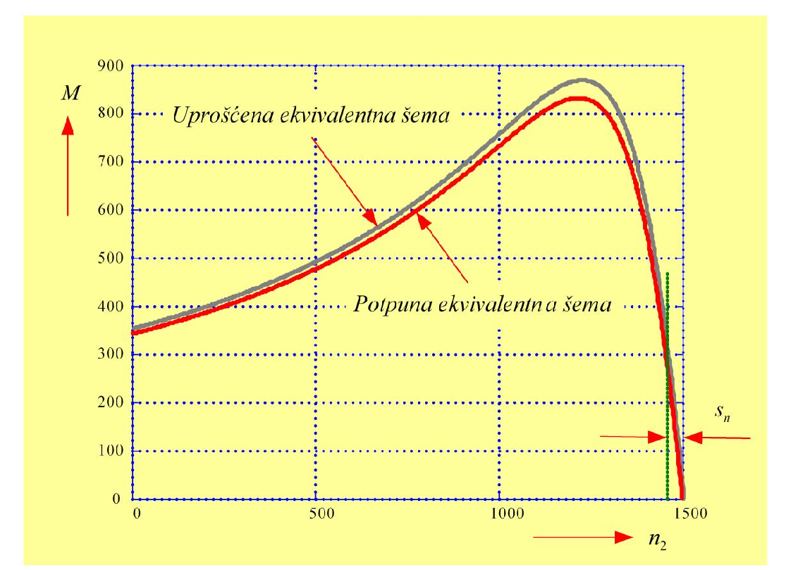

# Zadatak 37 — Prevalno klizanje, koeficijent preopteretivosti i polazni moment: potpuna i uprošćene ekvivalentne šeme

## Postavka

Trofazni asinhroni kliznokolutni četvoropolni motor priključen je na mrežu 380 V, 50 Hz, a statorski namotaj mu je spregnut u zvezdu (Y). Parametri ekvivalentne šeme motora su:

$$R_s = 0{,}1\ \Omega,\quad R'_r = 0{,}08\ \Omega,\quad X_{\gamma s} = 0{,}21\ \Omega,\quad X'_{\gamma r} = 0{,}21\ \Omega,\quad X_{\mu} = 5{,}8\ \Omega.$$

Nominalno klizanje motora iznosi $s_{\mathrm{n}} = 2{,}9\ \%$.

Koristeći **potpunu ekvivalentnu šemu**, zatim **uprošćenu šemu sa zanemarenom strujom magnetisanja**, i na kraju šemu u kojoj je **pored struje magnetisanja zanemarena i otpornost statorskog namotaja**, odrediti:

a) prevalno klizanje $s_{\mathrm{pr}}$;
b) koeficijent preopteretivosti (faktor preopterećenja) $\nu$;
c) polazni moment $M_{\mathrm{p}}$.

Uporediti dobijene rezultate.

> **Prevod na običan jezik:** Imamo asinhroni motor čije sve otpornosti i reaktanse znamo. Za takav motor postoji formula koja kaže koliki obrtni moment razvija pri svakom klizanju (tj. pri svakoj brzini). Ta formula ima tri "verzije": tačnu (potpunu), pa dve sve grublje aproksimacije koje se dobijaju izbacivanjem pojedinih elemenata iz šeme. Zadatak traži da **tri karakteristične veličine momentne karakteristike** — klizanje pri kome je moment najveći, odnos najvećeg i nominalnog momenta, i moment pri polasku — izračunamo **tri puta**, jednom po svakoj verziji formule, pa da uporedimo koliko nas svako uprošćenje "košta" u tačnosti. To je, u suštini, vežba iz procene: kada sme da se koristi jednostavnija formula, a kada mora tačna.

## Podaci

| Veličina | Oznaka | Vrednost | Šta ta veličina fizički znači |
|---|---|---|---|
| Linijski (međufazni) napon mreže | $U$ | $380\ \mathrm{V}$ | Napon između dva fazna provodnika mreže na koju je motor priključen. |
| Učestanost mreže | $f$ | $50\ \mathrm{Hz}$ | Broj perioda naizmeničnog napona u sekundi; određuje brzinu obrtnog polja. |
| Broj polova | $2p = 4$ | $p = 2$ para polova | Koliko magnetnih polova stvara statorski namotaj; više polova = sporije obrtno polje. |
| Sprega statora | Y | zvezda | Način vezivanja tri fazna namotaja; kod zvezde je fazni napon $\sqrt{3}$ puta manji od linijskog. |
| Otpornost statorskog namotaja (po fazi) | $R_s$ | $0{,}1\ \Omega$ | Omska otpornost bakra jedne faze statora; na njoj nastaju gubici $I^2R$ u statoru. |
| Svedena otpornost rotorskog namotaja | $R'_r$ | $0{,}08\ \Omega$ | Otpornost rotorskog namotaja "preračunata" (svedena) na statorsku stranu, da bi stator i rotor mogli da se crtaju u istoj šemi. |
| Rasipna reaktansa statora | $X_{\gamma s}$ | $0{,}21\ \Omega$ | Reaktansa od onog dela statorskog fluksa koji se "rasipa" — ne prolazi kroz rotor, pa ne učestvuje u stvaranju momenta. |
| Svedena rasipna reaktansa rotora | $X'_{\gamma r}$ | $0{,}21\ \Omega$ | Isto to za rotor, svedeno na statorsku stranu. |
| Reaktansa magnetisanja | $X_{\mu}$ | $5{,}8\ \Omega$ | Reaktansa poprečne grane šeme; kroz nju teče struja magnetisanja koja stvara glavni (korisni) fluks u vazdušnom zazoru. |
| Nominalno klizanje | $s_{\mathrm{n}}$ | $0{,}029$ ($2{,}9\ \%$) | Relativno zaostajanje rotora za obrtnim poljem pri nominalnom opterećenju. |
| Broj faza statora | $q_s$ | $3$ | Motor je trofazan; formula za moment sabira doprinose sve tri faze. |

Iz ovih podataka ćemo u rešenju **izvesti** još tri veličine koje formule zahtevaju: fazni napon $U_{sf} = 220\ \mathrm{V}$, sinhronu brzinu $n_s = 1500\ \mathrm{min^{-1}}$ i sinhronu ugaonu brzinu $\omega_s \approx 157{,}08\ \mathrm{rad/s}$.

## Šta se traži i zašto

**a) Prevalno klizanje $s_{\mathrm{pr}}$.** To je klizanje pri kome momentna karakteristika $M(s)$ dostiže svoj maksimum — *prevalni moment*. Inženjera zanima jer deli karakteristiku na **stabilan** deo (od $s=0$ do $s_{\mathrm{pr}}$, gde motor normalno radi) i **nestabilan** deo (od $s_{\mathrm{pr}}$ do $s=1$): ako opterećenje pređe prevalni moment, motor se "prevali" — naglo uspori i zaglavi. Do $s_{\mathrm{pr}}$ dolazimo matematički: tražimo maksimum funkcije $M(s)$ izjednačavanjem izvoda sa nulom.

**b) Koeficijent preopteretivosti $\nu = M_{\mathrm{pr}}/M_{\mathrm{n}}$.** Odnos najvećeg momenta koji motor uopšte može da razvije i momenta pri nominalnom radu. To je **rezerva momenta**: govori koliko puta motor sme kratkotrajno da bude preopterećen (udar tereta, propad napona) pre nego što se prevali. Plan: izračunati $M_{\mathrm{n}}$ (moment pri $s = s_{\mathrm{n}}$), izračunati $M_{\mathrm{pr}}$ (moment pri $s = s_{\mathrm{pr}}$), pa ih podeliti.

**c) Polazni moment $M_{\mathrm{p}}$.** Moment koji motor razvija u trenutku uključenja, dok rotor još stoji ($s = 1$). Inženjera zanima jer motor mora da savlada moment tereta već iz mesta — ako je $M_{\mathrm{p}}$ manji od momenta opterećenja, motor uopšte neće krenuti. Plan: u formulu za $M(s)$ uvrstiti $s=1$.

**Plan rešavanja u celini:**
1. Iz podataka o mreži izvedemo fazni napon i sinhronu brzinu (ulaz u sve formule za moment).
2. Napišemo izraz za $M(s)$ iz potpune šeme i iz njega izvedemo $s_{\mathrm{pr}}$, pa $M_{\mathrm{n}}$, $M_{\mathrm{pr}}$, $\nu$ i $M_{\mathrm{p}}$.
3. Ceo postupak ponovimo sa uprošćenom šemom bez struje magnetisanja (veličine sa jednim primom: $s'_{\mathrm{pr}}$, $\nu'$, $M'_{\mathrm{p}}$).
4. Ponovimo još jednom sa najgrubljom šemom bez struje magnetisanja i bez $R_s$ (veličine sa dva prima: $s''_{\mathrm{pr}}$, $\nu''$, $M''_{\mathrm{p}}$).
5. Sve tri grupe rezultata stavimo jednu pored druge i izvučemo zaključke kada koja aproksimacija sme da se koristi.

## Potrebna teorija — mini-lekcije

### 1. Fazni napon, sinhrona brzina i sinhrona ugaona brzina

Kod sprege u **zvezdu** svaki fazni namotaj vidi napon između faze i zvezdišta, koji je $\sqrt{3}$ puta manji od linijskog:

$$U_{sf} = \frac{U}{\sqrt{3}} = \frac{380}{\sqrt{3}} \approx 220\ \mathrm{V}.$$

Obrtno magnetno polje statora obrće se **sinhronom brzinom**, koja zavisi samo od učestanosti mreže i broja pari polova:

$$n_s = \frac{60 \cdot f}{p} = \frac{60 \cdot 50}{2} = 1500\ \mathrm{min^{-1}}.$$

Poreklo formule: polje napravi jedan pun obrtaj za onoliko perioda napona koliko mašina ima pari polova — kod $p$ pari polova, za jednu periodu polje se pomeri za $1/p$ obrtaja; za $f$ perioda u sekundi to je $f/p$ obrtaja u sekundi, tj. $60f/p$ obrtaja u minutu. U formulama za moment brzina se koristi kao **ugaona** brzina u radijanima po sekundi:

$$\omega_s = \frac{2\pi}{60} \cdot n_s = \frac{2\pi}{60} \cdot 1500 \approx 157{,}08\ \mathrm{rad/s}.$$

### 2. Klizanje

Rotor asinhronog motora uvek se obrće nešto sporije od obrtnog polja (inače ne bi bilo indukovanja u rotoru, pa ni momenta). **Klizanje** $s$ je relativna mera tog zaostajanja:

$$s = \frac{n_s - n}{n_s},$$

gde je $n$ brzina rotora. Karakteristične vrednosti: $s = 0$ znači da se rotor obrće sinhrono (nema momenta), $s = 1$ znači da rotor stoji (trenutak polaska), a $s = s_{\mathrm{n}}$ (ovde $0{,}029$) je klizanje pri nominalnom opterećenju — tipično svega nekoliko procenata.

### 3. Ekvivalentna šema asinhronog motora — potpuna verzija

Asinhroni motor se za jednu fazu predstavlja električnom šemom sličnom transformatorskoj: redno vezani $R_s$ i $X_{\gamma s}$ (stator), zatim **poprečna grana** sa $X_{\mu}$ (kroz nju teče struja magnetisanja $I_{\mu}$ koja stvara glavni fluks), pa redno $X'_{\gamma r}$ i $R'_r/s$ (rotor, sveden na stator). Ključni element je otpornost $R'_r/s$, koja **zavisi od klizanja**: u njoj su objedinjeni i stvarni omski gubici rotora ($R'_r$) i mehanička snaga koja se predaje vratilu (preostali deo $R'_r(1-s)/s$). Baš zbog te zavisnosti od $s$ šema "zna" da pri raznim brzinama motor razvija razne momente.

### 4. Moment iz potpune šeme i Hopkinsov koeficijent rasipanja $\sigma$

Elektromagnetni moment se dobija iz snage koja kroz vazdušni zazor prelazi sa statora na rotor (tzv. *obrtna snaga* $P_{\mathrm{ob}}$): $M = P_{\mathrm{ob}}/\omega_s$. Obrtna snaga je snaga koja se u šemi razvija na otporniku $R'_r/s$, tj. $P_{\mathrm{ob}} = q_s\, I_r'^2\, R'_r/s$. Da bi se dobila struja rotora $I'_r$, potpuna šema (sa poprečnom granom u sredini) svodi se na oblik pogodan za računanje tako što se poprečna grana "premesti" na ulazne priključke; da bi struje pritom ostale iste, redni parametri rotorske strane množe se **korekcionim koeficijentom** $\sigma$, koji se u zbirci naziva **Hopkinsov koeficijent rasipanja**:

$$\sigma = 1 + \frac{X_{\gamma s}}{X_{\mu}}. \tag{37.2}$$

Intuicija: $\sigma$ meri koliko je statorski rasipni fluks veliki u poređenju sa glavnim fluksom. Kod idealne mašine bez rasipanja ($X_{\gamma s} = 0$) ili sa beskonačnom granom magnetisanja ($X_{\mu} \to \infty$) bilo bi $\sigma = 1$ i korekcija bi nestala. Realno je $\sigma$ tek malo veći od 1 (ovde $1{,}036$), jer je rasipna reaktansa mnogo manja od reaktanse magnetisanja.

Sa tom korekcijom, moment motora iz potpune ekvivalentne šeme glasi:

$$M = \frac{q_s}{\omega_s} \cdot U_{sf}^2 \cdot \frac{R'_r / s}{\left(R_s + \sigma \cdot \dfrac{R'_r}{s}\right)^2 + \left(X_{\gamma s} + \sigma \cdot X'_{\gamma r}\right)^2}. \tag{37.1}$$

Čitanje formule: brojilac $R'_r/s$ je "korisni" otpornik na kome se razvija obrtna snaga; imenilac je kvadrat modula ukupne impedanse kola (realni deo na kvadrat plus imaginarni deo na kvadrat), dakle razlomak je oblika $R \cdot I^2 / U^2$ pomnožen sa $U^2$ — snaga po fazi. Moment raste sa **kvadratom napona** (to je vrlo važna osobina asinhronog motora) i opada sa sinhronom brzinom.

### 5. Prevalno klizanje — gde je maksimum funkcije $M(s)$

Funkcija $M(s)$ iz (37.1) najpre raste sa klizanjem (za malo $s$ je $R'_r/s$ ogroman, pa je struja mala), dostiže maksimum, pa opada (za veliko $s$ je $R'_r/s$ mali, struja je velika, ali je faktor snage kola loš). Maksimum tražimo standardno: $dM(s)/ds = 0$.

Izvedimo to bez preskakanja. Uvedimo smenu $x = \sigma R'_r / s$ (pri čemu $s$ raste kad $x$ opada i obrnuto, pa je maksimum po $s$ ujedno maksimum po $x$) i skraćene oznake $a = R_s$, $b = X_{\gamma s} + \sigma X'_{\gamma r}$. Tada je (37.1):

$$M = \frac{q_s U_{sf}^2}{\omega_s \, \sigma} \cdot \frac{x}{(a + x)^2 + b^2}.$$

Izvod po $x$ (količnik: izvod brojioca puta imenilac minus brojilac puta izvod imenioca, kroz imenilac na kvadrat) izjednačimo sa nulom — dovoljno je da brojilac izvoda bude nula:

$$\left[(a+x)^2 + b^2\right] - x \cdot 2(a+x) = 0.$$

Razvijmo kvadrat i sredimo:

$$a^2 + 2ax + x^2 + b^2 - 2ax - 2x^2 = 0 \;\;\Longrightarrow\;\; a^2 + b^2 - x^2 = 0 \;\;\Longrightarrow\;\; x = \sqrt{a^2 + b^2}.$$

Vratimo smenu $x = \sigma R'_r / s_{\mathrm{pr}}$ i rešimo po $s_{\mathrm{pr}}$:

$$s_{\mathrm{pr}} = \pm\frac{\sigma \cdot R'_r}{\sqrt{R_s^2 + \left(X_{\gamma s} + \sigma \cdot X'_{\gamma r}\right)^2}}. \tag{37.3}$$

Predznak $(+)$ važi za **motorski** režim, a predznak $(-)$ za **generatorski** režim (kada se rotor obrće brže od polja, klizanje je negativno i moment je kočeći — mašina predaje snagu mreži). Zapazite lepu fiziku: maksimum momenta nastupa kada otpornički deo rotorske grane $\sigma R'_r/s$ postane jednak modulu ostatka impedanse $\sqrt{R_s^2 + b^2}$ — to je uslov analogan uslovu maksimalnog prenosa snage na promenljivi otpornik.

Bonus koji ćemo koristiti za proveru: kada se $x = \sqrt{a^2+b^2}$ vrati u izraz za $M$, imenilac postaje $(a+\sqrt{a^2+b^2})^2 + b^2 = 2\sqrt{a^2+b^2}\,(a + \sqrt{a^2+b^2})$, pa je **prevalni moment u zatvorenom obliku**:

$$M_{\mathrm{pr}} = \frac{q_s\, U_{sf}^2}{2\,\omega_s\, \sigma \left(R_s + \sqrt{R_s^2 + b^2}\right)}.$$

Uočite da $R'_r$ **ne figuriše** u ovom izrazu: rotorska otpornost pomera *položaj* maksimuma (kroz $s_{\mathrm{pr}}$), ali ne menja njegovu *visinu* — to je osnov regulacije kliznokolutnih motora dodavanjem otpora u rotor.

### 6. Prva uprošćena šema: zanemarena struja magnetisanja ($X_{\mu} \to \infty$, $\sigma = 1$)

Motori većih snaga imaju procentualno malu struju magnetisanja (do $0{,}3 \cdot I_{\mathrm{n}}$), pa se kod njih poprečna grana može izbaciti iz šeme — kao da je $X_{\mu} = \infty$. Iz (37.2) tada sledi $\sigma = 1$, pa se (37.1) uprošćava u:

$$M = \frac{q_s}{\omega_s} \cdot U_{sf}^2 \cdot \frac{R'_r / s}{\left(R_s + \dfrac{R'_r}{s}\right)^2 + \left(X_{\gamma s} + X'_{\gamma r}\right)^2}. \tag{37.5}$$

Sve veličine izračunate iz ove šeme označavamo jednim primom: $s'_{\mathrm{pr}}$, $M'_{\mathrm{n}}$, $M'_{\mathrm{pr}}$, $\nu'$, $M'_{\mathrm{p}}$.

### 7. Druga uprošćena šema: zanemaren i statorski otpor ($R_s = 0$)

Ako se, pored struje magnetisanja, zanemari i omska otpornost statorskog namotaja, u imeniocu ostaje samo rotorski otpor i zbirna rasipna reaktansa $X_k = X_{\gamma s} + X'_{\gamma r}$ (reaktansa kratkog spoja):

$$M = \frac{q_s}{\omega_s} \cdot U_{sf}^2 \cdot \frac{R'_r / s}{\left(\dfrac{R'_r}{s}\right)^2 + X_k^2}. \tag{37.6}$$

Veličine iz ove šeme nose dva prima: $s''_{\mathrm{pr}}$, $\nu''$, $M''_{\mathrm{p}}$. Izraz (37.6) je najprostiji od sva tri i često se koristi za **kvalitativna** razmatranja rada asinhronog motora, jer se iz njega direktno izvodi čuvena *Klosova formula*:

$$\frac{M}{M''_{\mathrm{pr}}} = \frac{2}{\dfrac{s}{s''_{\mathrm{pr}}} + \dfrac{s''_{\mathrm{pr}}}{s}},$$

koja ceo oblik momentne karakteristike opisuje sa samo dva parametra ($M''_{\mathrm{pr}}$ i $s''_{\mathrm{pr}}$). Cena te jednostavnosti je tačnost — koliko tačno, videćemo brojkama.

### 8. Koeficijent preopteretivosti

Nazivni koeficijent preopteretivosti $\nu$ definisan je kao odnos prevalnog momenta $M_{\mathrm{pr}}$ (pri nominalnom napajanju) i nominalnog momenta $M_{\mathrm{n}}$:

$$\nu = \frac{M_{\mathrm{pr}}}{M_{\mathrm{n}}}. \tag{37.4}$$

Nominalni moment dobijamo tako što u izraz za $M(s)$ uvrstimo $s = s_{\mathrm{n}}$ — jer u stacionarnom stanju, pri nominalnom opterećenju, motor radi upravo sa nominalnim klizanjem. Tipične vrednosti $\nu$ za industrijske motore su $1{,}8$ do $3$; standardi propisuju minimalnu vrednost da motor ne bi "pao" pri svakom udaru opterećenja ili kratkotrajnom propadu napona.

### 9. Polazni moment

Polazni moment (zove se i *moment kratkog spoja*, jer motor sa zakočenim rotorom električno liči na transformator u kratkom spoju) dobija se uvrštavanjem $s = 1$ u izraz za $M(s)$. Pri $s=1$ nestaje deljenje sa $s$: u brojiocu ostaje samo $R'_r$, a u imeniocu $R'_r$ ulazi direktno u realni deo impedanse.

## Rešenje, korak po korak

### Korak 1: Pripremni računi — fazni napon, sinhrona brzina, sinhrona ugaona brzina

**Zašto ovaj korak:** Sve tri formule za moment traže fazni napon $U_{sf}$ i sinhronu ugaonu brzinu $\omega_s$ — izvedimo ih odmah iz podataka o mreži da ih kasnije samo uvrštavamo.

Sprega je zvezda, pa je fazni napon:

$$U_{sf} = \frac{U}{\sqrt{3}} = \frac{380\ \mathrm{V}}{\sqrt{3}} = 219{,}4\ \mathrm{V} \approx 220\ \mathrm{V}.$$

Motor je četvoropolan, dakle $p = 2$ para polova, pa je sinhrona brzina:

$$n_s = \frac{60 \cdot f}{p} = \frac{60 \cdot 50}{2} = 1500\ \mathrm{min^{-1}},$$

a sinhrona ugaona brzina:

$$\omega_s = \frac{2\pi}{60} \cdot n_s = \frac{2\pi}{60} \cdot 1500 = 157{,}08\ \mathrm{rad/s}.$$

Zgodno je odmah izračunati i zajednički predfaktor svih formula za moment:

$$\frac{q_s}{\omega_s} \cdot U_{sf}^2 = \frac{3}{157{,}08} \cdot (220)^2 = 0{,}0191 \cdot 48400 = 924{,}4\ \mathrm{\frac{V^2\,s}{rad}}.$$

**Šta smo dobili:** Ulazne konstante: $220\ \mathrm{V}$ po fazi, polje se obrće $1500$ obrtaja u minutu. Predfaktor $924{,}4$ množi razlomak oblika "om kroz om na kvadrat" ($1/\Omega$), pa će rezultat biti u $\mathrm{V^2/(\Omega \cdot rad/s)} = \mathrm{W \cdot s} = \mathrm{Nm}$ — jedinica momenta, kako i treba.

### Korak 2: Hopkinsov koeficijent rasipanja $\sigma$

**Zašto ovaj korak:** $\sigma$ je korekcija koju potpuna šema unosi u sve formule; bez njega ne možemo ni da počnemo tačan proračun.

Prema (37.2):

$$\sigma = 1 + \frac{X_{\gamma s}}{X_{\mu}} = 1 + \frac{0{,}21}{5{,}8} = 1 + 0{,}0362 = 1{,}036.$$

**Šta smo dobili:** Broj jedva veći od jedinice — očekivano, jer je rasipna reaktansa ($0{,}21\ \Omega$) skoro 28 puta manja od reaktanse magnetisanja ($5{,}8\ \Omega$). Već sada slutimo da zanemarenje struje magnetisanja (koje $\sigma$ pretvara u 1) neće drastično promeniti rezultate — ali proverimo brojkama.

### Korak 3 (deo a): Prevalno klizanje iz potpune šeme

**Zašto ovaj korak:** Ovo je prva tražena veličina; ujedno nam treba za prevalni moment u delu b).

Prema izvedenoj formuli (37.3), sa predznakom $(+)$ jer nas zanima motorski režim:

$$s_{\mathrm{pr}} = \frac{\sigma \cdot R'_r}{\sqrt{R_s^2 + \left(X_{\gamma s} + \sigma \cdot X'_{\gamma r}\right)^2}}.$$

Prvo izračunajmo sadržaj korena. Korigovana zbirna reaktansa:

$$X_{\gamma s} + \sigma \cdot X'_{\gamma r} = 0{,}21 + 1{,}036 \cdot 0{,}21 = 0{,}21 + 0{,}2176 = 0{,}4276\ \Omega,$$

pa je koren:

$$\sqrt{R_s^2 + 0{,}4276^2} = \sqrt{0{,}1^2 + 0{,}4276^2} = \sqrt{0{,}01 + 0{,}1828} = \sqrt{0{,}1928} = 0{,}4391\ \Omega.$$

Brojilac: $\sigma \cdot R'_r = 1{,}036 \cdot 0{,}08 = 0{,}0829\ \Omega$. Dakle:

$$s_{\mathrm{pr}} = \frac{0{,}0829}{0{,}4391} = 0{,}189.$$

**Šta smo dobili:** Motor razvija najveći moment kada rotor zaostaje za poljem oko $19\ \%$, tj. pri brzini $n = (1 - 0{,}189) \cdot 1500 \approx 1217\ \mathrm{min^{-1}}$. To je tipična vrednost: prevalno klizanje je red veličine 5–10 puta veće od nominalnog ($0{,}189$ prema $0{,}029$), što motoru ostavlja širok stabilan radni opseg.

### Korak 4 (deo a): Prevalno klizanje bez struje magnetisanja

**Zašto ovaj korak:** Ponavljamo isti račun po prvoj uprošćenoj šemi, da bismo kasnije mogli da poredimo.

Kod uprošćene šeme poprečna grana je zanemarena ($X_{\mu} = \infty$), pa je po (37.2) $\sigma = 1$. Formula (37.3) se time svodi na:

$$s'_{\mathrm{pr}} = \frac{R'_r}{\sqrt{R_s^2 + \left(X_{\gamma s} + X'_{\gamma r}\right)^2}} = \frac{0{,}08}{\sqrt{0{,}1^2 + (0{,}21 + 0{,}21)^2}}.$$

Pod korenom: $0{,}01 + 0{,}42^2 = 0{,}01 + 0{,}1764 = 0{,}1864$, koren je $0{,}4317\ \Omega$, pa:

$$s'_{\mathrm{pr}} = \frac{0{,}08}{0{,}4317} = 0{,}185.$$

**Šta smo dobili:** Vrlo blizu tačne vrednosti $0{,}189$ — odstupanje je svega oko $-1{,}9\ \%$. Zanemarenje struje magnetisanja skoro da ne kvari položaj maksimuma.

### Korak 5 (deo a): Prevalno klizanje bez struje magnetisanja i bez $R_s$

**Zašto ovaj korak:** Još jedan nivo grublje — završavamo deo a) najprostijom formulom.

Uz $\sigma = 1$ i $R_s = 0$ koren u (37.3) postaje prosto $X_{\gamma s} + X'_{\gamma r} = X_k$:

$$s''_{\mathrm{pr}} = \frac{R'_r}{X_{\gamma s} + X'_{\gamma r}} = \frac{R'_r}{X_k} = \frac{0{,}08}{0{,}21 + 0{,}21} = \frac{0{,}08}{0{,}42} = 0{,}19.$$

**Šta smo dobili:** Opet praktično ista vrednost ($+0{,}9\ \%$ u odnosu na tačnu). Pouka dela a): **prevalno klizanje je neosetljivo na oba uprošćenja** — sve tri šeme daju $s_{\mathrm{pr}} \approx 0{,}19$. Razlog: $s_{\mathrm{pr}}$ je *odnos* otpornosti i reaktansi, pa se greške u brojiocu i imeniocu velikim delom potiru ($\sigma$ množi i $R'_r$ i $X'_{\gamma r}$), a $R_s^2 = 0{,}01$ je sitno prema $X_k^2 \approx 0{,}18$.

### Korak 6 (deo b): Nominalni moment iz potpune šeme

**Zašto ovaj korak:** Za koeficijent preopteretivosti (37.4) treba nam imenilac — nominalni moment. U stacionarnom stanju pri nominalnom opterećenju motor radi sa $s = s_{\mathrm{n}}$, pa to klizanje uvrštavamo u (37.1).

$$M_{\mathrm{n}} = \frac{q_s}{\dfrac{2\pi}{60} \cdot n_s} \cdot U_{sf}^2 \cdot \frac{R'_r / s_{\mathrm{n}}}{\left(R_s + \sigma \cdot \dfrac{R'_r}{s_{\mathrm{n}}}\right)^2 + \left(X_{\gamma s} + \sigma \cdot X'_{\gamma r}\right)^2}$$

Računajmo deo po deo:

- $R'_r / s_{\mathrm{n}} = 0{,}08 / 0{,}029 = 2{,}759\ \Omega$ — pri malom klizanju rotorska grana je skoro čisto otpornička i velika;
- $\sigma \cdot R'_r / s_{\mathrm{n}} = 1{,}036 \cdot 2{,}759 = 2{,}858\ \Omega$;
- realni deo na kvadrat: $(0{,}1 + 2{,}858)^2 = (2{,}958)^2 = 8{,}749$;
- imaginarni deo na kvadrat (iz Koraka 3): $(0{,}4276)^2 = 0{,}1828$;
- imenilac: $8{,}749 + 0{,}183 = 8{,}932$.

$$M_{\mathrm{n}} = 924{,}4 \cdot \frac{2{,}759}{8{,}932} = 924{,}4 \cdot 0{,}3089 = 285{,}5\ \mathrm{Nm}.$$

> **Napomena o originalu:** Zbirka za ovaj moment navodi $285{,}92\ \mathrm{Nm}$, a za prevalni u sledećem koraku $828{,}84\ \mathrm{Nm}$. Precizan račun sa identičnim ulazima daje $285{,}5$ odnosno $827{,}5\ \mathrm{Nm}$ — razlika ispod $0{,}2\ \%$ potiče od zaokruživanja međurezultata pri ručnom računanju u zbirci i ni na šta ne utiče: količnik $\nu$ se poklapa na tri decimale.

**Šta smo dobili:** Nominalni moment od oko $285\ \mathrm{Nm}$. Za kontrolu reda veličine: pri nominalnoj brzini $n = (1-0{,}029)\cdot 1500 \approx 1457\ \mathrm{min^{-1}}$ to odgovara mehaničkoj snazi $M_{\mathrm{n}} \cdot \omega \approx 285{,}5 \cdot 152{,}5 \approx 43{,}5\ \mathrm{kW}$ — dakle motor srednje snage, čemu i pristaju ovako male otpornosti namotaja.

### Korak 7 (deo b): Prevalni moment iz potpune šeme

**Zašto ovaj korak:** Brojilac koeficijenta preopteretivosti. Prevalni moment se dobija kada se u (37.1) uvrsti $s = s_{\mathrm{pr}}$ iz Koraka 3.

$$M_{\mathrm{pr}} = \frac{q_s}{\dfrac{2\pi}{60} \cdot n_s} \cdot U_{sf}^2 \cdot \frac{R'_r / s_{\mathrm{pr}}}{\left(R_s + \sigma \cdot \dfrac{R'_r}{s_{\mathrm{pr}}}\right)^2 + \left(X_{\gamma s} + \sigma \cdot X'_{\gamma r}\right)^2}$$

Deo po deo, sa $s_{\mathrm{pr}} = 0{,}189$:

- $R'_r / s_{\mathrm{pr}} = 0{,}08 / 0{,}189 = 0{,}4233\ \Omega$ — uočite koliko je manji nego pri $s_{\mathrm{n}}$: sada je uporediv sa reaktansama;
- $\sigma \cdot 0{,}4233 = 1{,}036 \cdot 0{,}4233 = 0{,}4385\ \Omega$;
- realni deo na kvadrat: $(0{,}1 + 0{,}4385)^2 = (0{,}5385)^2 = 0{,}2900$;
- imenilac: $0{,}2900 + 0{,}1828 = 0{,}4728$.

$$M_{\mathrm{pr}} = 924{,}4 \cdot \frac{0{,}4233}{0{,}4728} = 924{,}4 \cdot 0{,}8953 = 827{,}5\ \mathrm{Nm}.$$

(U zbirci: $828{,}84\ \mathrm{Nm}$ — videti napomenu u Koraku 6.)

**Šta smo dobili:** Maksimalni moment koji ovaj motor uopšte može da razvije pri nominalnom naponu — skoro tri puta veći od nominalnog. Upravo taj odnos računamo sledeći.

### Korak 8 (deo b): Koeficijent preopteretivosti iz potpune šeme

**Zašto ovaj korak:** Sada imamo i brojilac i imenilac definicije (37.4).

$$\nu = \frac{M_{\mathrm{pr}}}{M_{\mathrm{n}}} = \frac{827{,}5}{285{,}5} = 2{,}899.$$

(Zbirka: $\nu = 828{,}84/285{,}92 = 2{,}8988$ — isti rezultat.)

**Šta smo dobili:** Motor podnosi kratkotrajno preopterećenje do približno $2{,}9$ puta nominalnog momenta pre nego što se prevali. To je komotna rezerva, u gornjem delu uobičajenog opsega ($1{,}8$–$3$).

### Korak 9 (deo b): $M'_{\mathrm{n}}$, $M'_{\mathrm{pr}}$ i $\nu'$ — bez struje magnetisanja

**Zašto ovaj korak:** Ponavljamo ceo deo b) po uprošćenoj formuli (37.5), tj. sa $\sigma = 1$.

Nominalni moment, sa $s = s_{\mathrm{n}}$ u (37.5):

$$M'_{\mathrm{n}} = 924{,}4 \cdot \frac{0{,}08/0{,}029}{\left(0{,}1 + \dfrac{0{,}08}{0{,}029}\right)^2 + (0{,}21+0{,}21)^2} = 924{,}4 \cdot \frac{2{,}759}{(2{,}859)^2 + 0{,}1764} = 924{,}4 \cdot \frac{2{,}759}{8{,}172 + 0{,}176} = 924{,}4 \cdot \frac{2{,}759}{8{,}348},$$

$$M'_{\mathrm{n}} = 924{,}4 \cdot 0{,}3304 = 305{,}46\ \mathrm{Nm}.$$

Prevalni moment, sa $s = s'_{\mathrm{pr}} = 0{,}185$ u (37.5):

$$M'_{\mathrm{pr}} = 924{,}4 \cdot \frac{0{,}08/0{,}185}{\left(0{,}1 + \dfrac{0{,}08}{0{,}185}\right)^2 + 0{,}42^2} = 924{,}4 \cdot \frac{0{,}4324}{(0{,}5324)^2 + 0{,}1764} = 924{,}4 \cdot \frac{0{,}4324}{0{,}2835 + 0{,}1764} = 924{,}4 \cdot \frac{0{,}4324}{0{,}4599},$$

$$M'_{\mathrm{pr}} = 924{,}4 \cdot 0{,}9403 = 869{,}19\ \mathrm{Nm}.$$

> **Napomena o originalu:** U zbirci u formuli za $M'_{\mathrm{pr}}$ u imeniocu predfaktora štamparskom greškom stoji $1800$ umesto $1500$; sam rezultat $869{,}19\ \mathrm{Nm}$ odgovara ispravnoj vrednosti $n_s = 1500\ \mathrm{min^{-1}}$ (sa $1800$ bi ispalo $724{,}3\ \mathrm{Nm}$), dakle greška je samo u zapisu, ne i u računu.

Koeficijent preopteretivosti bez grane magnetisanja:

$$\nu' = \frac{M'_{\mathrm{pr}}}{M'_{\mathrm{n}}} = \frac{869{,}19}{305{,}46} = 2{,}8455.$$

**Šta smo dobili:** Zanimljiv obrazac: oba momenta su **precenjena** (nominalni za $7{,}0\ \%$, prevalni za $5{,}0\ \%$) jer smo izbacili struju magnetisanja koja u stvarnosti "troši" deo napona na statorskoj impedansi i smanjuje napon na rotorskoj grani. Ali pošto su oba precenjena za sličan procenat, njihov **količnik** $\nu' = 2{,}8455$ odstupa od tačnog $\nu = 2{,}899$ za svega $-1{,}8\ \%$. Za procenu preopteretivosti ova aproksimacija je sasvim upotrebljiva.

### Korak 10 (deo b): $M''_{\mathrm{n}}$, $M''_{\mathrm{pr}}$ i $\nu''$ — bez struje magnetisanja i bez $R_s$

**Zašto ovaj korak:** Završavamo deo b) najgrubljom formulom (37.6) i tu će se prvi put pojaviti ozbiljna greška aproksimacije.

Nominalni moment, sa $s = s_{\mathrm{n}}$ u (37.6):

$$M''_{\mathrm{n}} = 924{,}4 \cdot \frac{0{,}08/0{,}029}{\left(\dfrac{0{,}08}{0{,}029}\right)^2 + (0{,}21+0{,}21)^2} = 924{,}4 \cdot \frac{2{,}759}{7{,}610 + 0{,}176} = 924{,}4 \cdot \frac{2{,}759}{7{,}786} = 924{,}4 \cdot 0{,}3543 = 327{,}49\ \mathrm{Nm}.$$

> **Napomena o originalu:** Zbirka ovde navodi $M''_{\mathrm{n}} = 272{,}91\ \mathrm{Nm}$, ali taj broj ne odgovara formuli koju sama zbirka ispisuje. Poreklo greške se da tačno rekonstruisati: $327{,}49 / 272{,}91 = 1{,}200 = 1800/1500$ — u račun je zabunom uvršteno $n_s = 1800\ \mathrm{min^{-1}}$ (sinhrona brzina četvoropolne mašine na 60 Hz; ista zamena 1500/1800 potkrala se i u prethodnom koraku, samo u suprotnom smeru). Sa ispravnim $n_s = 1500\ \mathrm{min^{-1}}$ dobija se $M''_{\mathrm{n}} = 327{,}49\ \mathrm{Nm}$, pa je i koeficijent $\nu''$ ispod drugačiji od onog u zbirci ($4{,}03$); kvalitativni zaključak zbirke — da $\nu''$ znatno odstupa od stvarnog — ostaje na snazi.

Prevalni moment, sa $s = s''_{\mathrm{pr}} = 0{,}19$ u (37.6):

$$M''_{\mathrm{pr}} = 924{,}4 \cdot \frac{0{,}08/0{,}19}{\left(\dfrac{0{,}08}{0{,}19}\right)^2 + 0{,}42^2} = 924{,}4 \cdot \frac{0{,}4211}{0{,}1773 + 0{,}1764} = 924{,}4 \cdot \frac{0{,}4211}{0{,}3537} = 924{,}4 \cdot 1{,}1905 = 1100{,}44\ \mathrm{Nm}.$$

Koeficijent preopteretivosti uz sva zanemarenja:

$$\nu'' = \frac{M''_{\mathrm{pr}}}{M''_{\mathrm{n}}} = \frac{1100{,}44}{327{,}49} = 3{,}36.$$

**Šta smo dobili:** Sada su greške velike i, što je gore, **nejednake**: nominalni moment je precenjen za $15\ \%$, a prevalni za čak $33\ \%$ (u odnosu na tačnih $827{,}5\ \mathrm{Nm}$). Zašto baš prevalni toliko? U okolini maksimuma rotorski otpor $R'_r/s_{\mathrm{pr}} \approx 0{,}42\ \Omega$ je istog reda kao reaktansa $X_k$, pa izbačeni $R_s = 0{,}1\ \Omega$ više nije zanemarljiv prema ostatku impedanse — dok je pri malom klizanju $R'_r/s_{\mathrm{n}} \approx 2{,}76\ \Omega$ dominantan i $R_s$ se manje oseti. Pošto se greške ne potiru, količnik $\nu'' = 3{,}36$ odstupa od stvarnog $\nu = 2{,}899$ za oko $+16\ \%$ — vrednost $\nu''$ se, dakle, dosta razlikuje od stvarne i za pouzdanu ocenu preopteretivosti se ne sme koristiti.

### Korak 11 (deo c): Polazni moment po sve tri šeme

**Zašto ovaj korak:** Ostala je još treća tražena veličina. Polazni moment (moment kratkog spoja) dobija se uvrštavanjem $s = 1$ u odgovarajući izraz za moment — pri polasku rotor stoji, klizanje je jedinično, pa deljenja sa $s$ nestaju.

**Potpuna šema**, $s = 1$ u (37.1):

$$M_{\mathrm{p}} = \frac{q_s}{\dfrac{2\pi}{60} \cdot n_s} \cdot U_{sf}^2 \cdot \frac{R'_r}{\left(R_s + \sigma \cdot R'_r\right)^2 + \left(X_{\gamma s} + \sigma \cdot X'_{\gamma r}\right)^2}$$

Imenilac: $(0{,}1 + 1{,}036 \cdot 0{,}08)^2 + 0{,}4276^2 = (0{,}1 + 0{,}0829)^2 + 0{,}1828 = (0{,}1829)^2 + 0{,}1828 = 0{,}0334 + 0{,}1828 = 0{,}2163$.

$$M_{\mathrm{p}} = 924{,}4 \cdot \frac{0{,}08}{0{,}2163} = 924{,}4 \cdot 0{,}3699 = 341{,}96\ \mathrm{Nm}.$$

**Bez struje magnetisanja**, $s = 1$ u (37.5):

$$M'_{\mathrm{p}} = 924{,}4 \cdot \frac{0{,}08}{(0{,}1 + 0{,}08)^2 + 0{,}42^2} = 924{,}4 \cdot \frac{0{,}08}{0{,}0324 + 0{,}1764} = 924{,}4 \cdot \frac{0{,}08}{0{,}2088} = 354{,}16\ \mathrm{Nm}.$$

**Bez struje magnetisanja i bez $R_s$**, $s = 1$ u (37.6):

$$M''_{\mathrm{p}} = 924{,}4 \cdot \frac{0{,}08}{0{,}08^2 + 0{,}42^2} = 924{,}4 \cdot \frac{0{,}08}{0{,}0064 + 0{,}1764} = 924{,}4 \cdot \frac{0{,}08}{0{,}1828} = 404{,}54\ \mathrm{Nm}.$$

**Šta smo dobili:** Tačan polazni moment je $342\ \mathrm{Nm}$ — oko $1{,}2$ puta nominalni, dovoljno da motor krene i pod opterećenjem. Prva aproksimacija greši umereno ($+3{,}6\ \%$), ali druga precenjuje polazni moment za punih $+18{,}3\ \%$. Razlog je isti kao u Koraku 10, samo izraženiji: pri $s = 1$ ceo otpornički deo impedanse je mali ($R'_r = 0{,}08\ \Omega$), pa izbacivanje $R_s = 0{,}1\ \Omega$ — koji je tu čak *veći* od $R'_r$ — bitno smanjuje imenilac i naduvava moment.

### Korak 12: Poređenje rezultata i zaključci

**Zašto ovaj korak:** Zadatak izričito traži poređenje — a ono je i najvažnija pouka: iz njega se uči *kada koja formula sme da se koristi*.

| Veličina | Potpuna šema (37.1) | Bez $I_{\mu}$ (37.5) | Bez $I_{\mu}$ i $R_s$ (37.6) |
|---|---|---|---|
| Prevalno klizanje | $s_{\mathrm{pr}} = 0{,}189$ | $s'_{\mathrm{pr}} = 0{,}185$ $(-1{,}9\ \%)$ | $s''_{\mathrm{pr}} = 0{,}19$ $(+0{,}9\ \%)$ |
| Nominalni moment | $M_{\mathrm{n}} = 285{,}5\ \mathrm{Nm}$ | $M'_{\mathrm{n}} = 305{,}46\ \mathrm{Nm}$ $(+7{,}0\ \%)$ | $M''_{\mathrm{n}} = 327{,}49\ \mathrm{Nm}$ $(+14{,}7\ \%)$ |
| Prevalni moment | $M_{\mathrm{pr}} = 827{,}5\ \mathrm{Nm}$ | $M'_{\mathrm{pr}} = 869{,}19\ \mathrm{Nm}$ $(+5{,}0\ \%)$ | $M''_{\mathrm{pr}} = 1100{,}44\ \mathrm{Nm}$ $(+33{,}0\ \%)$ |
| Koef. preopteretivosti | $\nu = 2{,}899$ | $\nu' = 2{,}8455$ $(-1{,}8\ \%)$ | $\nu'' = 3{,}36$ $(+15{,}9\ \%)$ |
| Polazni moment | $M_{\mathrm{p}} = 341{,}96\ \mathrm{Nm}$ | $M'_{\mathrm{p}} = 354{,}16\ \mathrm{Nm}$ $(+3{,}6\ \%)$ | $M''_{\mathrm{p}} = 404{,}54\ \mathrm{Nm}$ $(+18{,}3\ \%)$ |

Slika ispod prikazuje momentne karakteristike $M(n_2)$ (moment u funkciji brzine rotora $n_2$, od nule do sinhrone brzine $1500\ \mathrm{min^{-1}}$) izračunate po tačnom izrazu (37.1) — donja, crvena kriva "potpuna ekvivalentna šema" — i po uprošćenom izrazu (37.5) — gornja, siva kriva "uprošćena ekvivalentna šema". Čitajte je ovako: krajnja leva tačka svake krive ($n_2 = 0$, tj. $s = 1$) je polazni moment; "grba" krive je prevalni moment; strma desna grana blizu $1500\ \mathrm{min^{-1}}$ je normalna radna oblast, na kojoj je strelicama označeno malo nominalno klizanje $s_{\mathrm{n}}$. Vidi se da uprošćena kriva svuda ide malo *iznad* tačne (momenti precenjeni za 3–7 %), ali da su oblik krive i položaj maksimuma praktično isti.

**Slika 37.1 —** Karakteristike momenta asinhronog motora: 1 — na osnovu potpune ekvivalentne šeme (37.1), 2 — uz zanemarenje struje magnetisanja $I_{\mu}$ (37.5).

Na osnovu izračunatog i prikazanih karakteristika slede zaključci (isti kao u zbirci):

- **Uprošćeni izraz (37.5)** — bez struje magnetisanja — može se koristiti umesto tačnog (37.1) **za sva klizanja**, ako se ne traži velika tačnost: greške su reda nekoliko procenata, a odnosi ($\nu'$) još tačniji.
- **Najprostiji izraz (37.6)** — bez struje magnetisanja i bez $R_s$ — sme se koristiti **samo za mala klizanja, od $s = 0$ do $s \approx s_{\mathrm{n}}$**, gde je $R'_r/s$ dominantan pa se izbačeni $R_s$ najmanje oseti; u okolini prevalne tačke i pri polasku greši 15–33 % i služi samo za kvalitativna razmatranja (oblik karakteristike, Klosova formula).
- Ako su **poznati svi parametri**, poželjno je koristiti tačan izraz (37.1) — on daje najbolju predikciju ponašanja mašine.

## Česte greške i zamke

1. **Linijski umesto faznog napona.** U formulu za moment ulazi *fazni* napon $U_{sf} = 220\ \mathrm{V}$ (sprega Y!), a ne $380\ \mathrm{V}$. Pošto moment zavisi od *kvadrata* napona, ova greška uveličava sve momente tačno 3 puta — rezultat "nekako ispadne", ali je trostruko pogrešan.
2. **Broj polova umesto broja pari polova.** "Četvoropolni" znači $2p = 4$, dakle $p = 2$ i $n_s = 1500\ \mathrm{min^{-1}}$. Ko uvrsti $p = 4$ dobije $n_s = 750\ \mathrm{min^{-1}}$ i sve momente duplo veće.
3. **Zaboravljen $\sigma$ na pola mesta.** Kod potpune šeme $\sigma$ množi i $R'_r/s$ i $X'_{\gamma r}$ — ali ne i $R_s$ ni $X_{\gamma s}$. Tipično je da student stavi $\sigma$ uz otpor, a zaboravi ga uz reaktansu (ili obrnuto), pa mu se $s_{\mathrm{pr}}$ i momenti tiho razlikuju od tačnih.
4. **Klizanje u procentima.** $s_{\mathrm{n}} = 2{,}9\ \%$ mora u formule ući kao $0{,}029$. Uvrštavanje "2,9" smanji $R'_r/s$ sto puta i potpuno upropasti rezultat.
5. **Mešanje $\omega_s$ i električne kružne učestanosti.** U $M = P_{\mathrm{ob}}/\omega_s$ figuriše *mehanička sinhrona* ugaona brzina $\omega_s = 2\pi n_s/60 = 157{,}08\ \mathrm{rad/s}$, a ne $2\pi f = 314{,}16\ \mathrm{rad/s}$ (one se poklapaju samo kod dvopolne mašine!). Ova zamena prepolovi sve momente. Srodna zamka, koja se potkrala i samoj zbirci: nepažljivo uvrštena sinhrona brzina ($1800$ umesto $1500\ \mathrm{min^{-1}}$) skalira momente za faktor $1{,}2$ — uvek proverite $n_s = 60f/p$ pre uvrštavanja.
6. **Očekivanje da uprošćenja "pokvare" sve podjednako.** Kako smo videli, $s_{\mathrm{pr}}$ ostaje gotovo netaknut, $\nu'$ jedva odstupa, ali $M''_{\mathrm{pr}}$ i $M''_{\mathrm{p}}$ odlete za 18–33 %. Pre nego što posegnete za prostijom formulom, zapitajte se *u kom opsegu klizanja* radite.

## Rezime rezultata

| Tražena veličina | Potpuna šema | Bez $I_{\mu}$ | Bez $I_{\mu}$ i $R_s$ |
|---|---|---|---|
| a) Prevalno klizanje | $s_{\mathrm{pr}} = 0{,}189$ | $s'_{\mathrm{pr}} = 0{,}185$ | $s''_{\mathrm{pr}} = 0{,}19$ |
| b) Nominalni moment | $M_{\mathrm{n}} \approx 285{,}5\ \mathrm{Nm}$ | $M'_{\mathrm{n}} = 305{,}46\ \mathrm{Nm}$ | $M''_{\mathrm{n}} = 327{,}49\ \mathrm{Nm}$ |
| b) Prevalni moment | $M_{\mathrm{pr}} \approx 827{,}5\ \mathrm{Nm}$ | $M'_{\mathrm{pr}} = 869{,}19\ \mathrm{Nm}$ | $M''_{\mathrm{pr}} = 1100{,}44\ \mathrm{Nm}$ |
| b) Koef. preopteretivosti | $\nu = 2{,}899$ | $\nu' = 2{,}8455$ | $\nu'' = 3{,}36$ |
| c) Polazni moment | $M_{\mathrm{p}} = 341{,}96\ \mathrm{Nm}$ | $M'_{\mathrm{p}} = 354{,}16\ \mathrm{Nm}$ | $M''_{\mathrm{p}} = 404{,}54\ \mathrm{Nm}$ |

(Pomoćna veličina: $\sigma = 1{,}036$. Vrednosti $M''_{\mathrm{n}}$ i $\nu''$ su ispravljene u odnosu na zbirku — videti Napomenu o originalu u Koraku 10; $M_{\mathrm{n}}$ i $M_{\mathrm{pr}}$ se od zbirke razlikuju samo u zaokruživanju.)

## Provera smisla

**1. Dimenziona analiza.** Predfaktor je $\mathrm{V^2 \cdot s/rad}$, razlomak je $\Omega/\Omega^2 = 1/\Omega = \mathrm{A/V}$, pa je proizvod $\mathrm{V \cdot A \cdot s} = \mathrm{W \cdot s} = \mathrm{J} = \mathrm{Nm}$. Jedinica momenta — formula je dimenziono ispravna.

**2. Zatvoreni oblik prevalnog momenta.** Iz mini-lekcije 5: $M_{\mathrm{pr}} = \dfrac{q_s U_{sf}^2}{2\,\omega_s\,\sigma\,(R_s + \sqrt{R_s^2 + b^2})} = \dfrac{924{,}4}{2 \cdot 1{,}036 \cdot (0{,}1 + 0{,}4391)} = \dfrac{924{,}4}{1{,}117} = 827{,}5\ \mathrm{Nm}$ — potpuno nezavisan put do istog broja kao u Koraku 7. Za drugu aproksimaciju: $M''_{\mathrm{pr}} = \dfrac{q_s U_{sf}^2}{2\,\omega_s X_k} = \dfrac{924{,}4}{2 \cdot 0{,}42} = 1100{,}4\ \mathrm{Nm}$ — poklapa se sa Korakom 10.

**3. Klosova provera $\nu''$.** Za formulu (37.6) važi Klosov obrazac, pa $\nu''$ mora izaći i čisto iz klizanja: $\nu'' = \dfrac{1}{2}\left(\dfrac{s_{\mathrm{n}}}{s''_{\mathrm{pr}}} + \dfrac{s''_{\mathrm{pr}}}{s_{\mathrm{n}}}\right) = \dfrac{1}{2}\left(\dfrac{0{,}029}{0{,}1905} + \dfrac{0{,}1905}{0{,}029}\right) = \dfrac{0{,}152 + 6{,}568}{2} = 3{,}36$ — tačno vrednost iz Koraka 10, što ujedno potvrđuje da je zbirkina vrednost $4{,}03$ posledica računske omaške, a ne drugačije formule.

**4. Poređenje sa očekivanjima iz prakse.** $s_{\mathrm{n}} = 2{,}9\ \%$ i $s_{\mathrm{pr}} \approx 19\ \%$ su tipični za motor ove klase; $\nu \approx 2{,}9$ je u normalnom opsegu 1,8–3; polazni moment od $1{,}2 \cdot M_{\mathrm{n}}$ je realan za kliznokolutni motor sa kratko spojenim rotorskim prstenovima (upravo zato takvi motori pri teškom zaletu dodaju spoljašnji otpor u rotor — čime se, kako pokazuje izraz (37.3), $s_{\mathrm{pr}}$ pomera ka 1 i polazni moment raste, dok visina $M_{\mathrm{pr}}$ ostaje ista). Svi rezultati su, dakle, i pojedinačno i međusobno smisleni.
