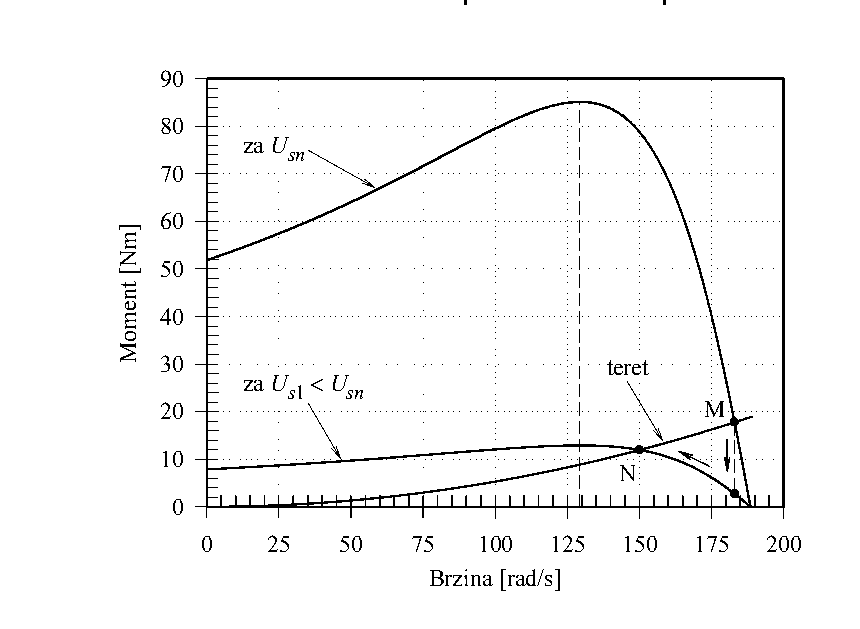

# Zadatak 38 — Regulacija brzine asinhronog motora promenom napona napajanja

## Postavka

Trofazni asinhroni kavezni motor pokreće radnu mašinu čiji je moment opterećenja kvadratno zavisan od brzine obrtanja. Motor trenutno radi u nazivnom režimu. Brzina obrtanja se reguliše promenom napona napajanja. Šta treba uraditi (koliki napon dovesti na motor) da bi se brzina obrtanja podesila na $150\ \mathrm{rad/s}$?

Podaci o motoru: $230\ \mathrm{V}$, $60\ \mathrm{Hz}$, $183\ \mathrm{rad/s}$, $2p = 4$, sprega Y, $R_s = 0{,}227\ \Omega$, $R'_r = 0{,}4\ \Omega$, $X_{\gamma s} = 0{,}512\ \Omega$, $X'_{\gamma r} = 0{,}769\ \Omega$, $X_m = 9{,}86\ \Omega$.

> **Prevod na običan jezik:** Imamo motor koji vrti, na primer, ventilator ili pumpu — teret kod koga potreban moment raste sa kvadratom brzine (dvostruko brže vrtenje traži četiri puta veći moment). Motor sada radi tačno u svom nazivnom (fabrički predviđenom) režimu: napon $230\ \mathrm{V}$, brzina $183\ \mathrm{rad/s}$. Želimo da ga usporimo na $150\ \mathrm{rad/s}$, i to ne menjanjem frekvencije, nego samo **snižavanjem napona** napajanja. Pitanje je: na koju vrednost treba spustiti napon da bi se motor sam "smestio" na tačno $150\ \mathrm{rad/s}$?

## Podaci

| Veličina | Oznaka | Vrednost | Šta ta veličina fizički znači |
|---|---|---|---|
| Nazivni (linijski) napon | $U_{sn}$ | $230\ \mathrm{V}$ | Napon između dva fazna provodnika mreže na koju je motor priključen. |
| Frekvencija napajanja | $f$ | $60\ \mathrm{Hz}$ | Broj perioda naizmeničnog napona u sekundi (američka mreža — zato 60, a ne 50 Hz). |
| Nazivna brzina obrtanja | $\omega_{\mathrm{n}}$ | $183\ \mathrm{rad/s}$ | Ugaona brzina rotora kada motor radi u nazivnom režimu. |
| Broj polova | $2p$ | $4$ (dakle $p = 2$) | Broj magnetnih polova obrtnog polja; određuje sinhronu brzinu. |
| Sprega statora | — | Y (zvezda) | Način vezivanja tri statorska namotaja; kod zvezde je fazni napon $\sqrt{3}$ puta manji od linijskog. |
| Otpornost statorskog namotaja | $R_s$ | $0{,}227\ \Omega$ | Omska otpornost jedne faze statora — pravi gubitke $I^2R$ u bakru statora. |
| Svedena otpornost rotora | $R'_r$ | $0{,}4\ \Omega$ | Otpornost rotorskog kaveza, preračunata ("svedena") na statorsku stranu da bi se stator i rotor mogli crtati u istoj šemi. |
| Rasipna reaktansa statora | $X_{\gamma s}$ | $0{,}512\ \Omega$ | Reaktansa od dela statorskog fluksa koji se "rasipa" — ne prelazi na rotor. |
| Svedena rasipna reaktansa rotora | $X'_{\gamma r}$ | $0{,}769\ \Omega$ | Isto to za rotor, svedeno na statorsku stranu. |
| Reaktansa magnećenja | $X_m$ | $9{,}86\ \Omega$ | Reaktansa grane magnećenja — predstavlja glavni (korisni) fluks koji spreže stator i rotor. |
| Broj faza statora | $q_s$ | $3$ | Motor je trofazni. |
| Tražena brzina | $\omega_1$ | $150\ \mathrm{rad/s}$ | Brzina na koju treba podesiti motor snižavanjem napona. |

## Šta se traži i zašto

Traži se **napon napajanja** $U_s$ (linijska vrednost) pri kome će motor, opterećen kvadratnim momentom, raditi ustaljeno na brzini $\omega_1 = 150\ \mathrm{rad/s}$.

Zašto bi to inženjera zanimalo? Regulacija brzine promenom napona je **najjeftiniji i najjednostavniji** način upravljanja asinhronim motorom (dovoljan je tiristorski regulator napona, bez skupog frekventnog pretvarača). Kod ventilatorskih i pumpnih pogona malih snaga ovo se zaista koristi. Inženjer koji projektuje takav pogon mora znati **koji napon daje koju brzinu** — i to je tačno ovaj zadatak.

Plan rešavanja, običnim jezikom:

1. Izračunamo sinhronu brzinu $\omega_s$ i nazivno klizanje $s_{\mathrm{n}}$ — da znamo gde se motor sada nalazi.
2. Iz formule momenta asinhronog motora izračunamo **nazivni moment** $M_{\mathrm{n}}$ — toliki moment teret traži pri nazivnoj brzini.
3. Pošto moment tereta raste sa kvadratom brzine, preračunamo koliki će moment teret tražiti pri $150\ \mathrm{rad/s}$ — to je $M_{\mathrm{opt1}}$.
4. Izračunamo klizanje $s_1$ koje odgovara brzini $150\ \mathrm{rad/s}$.
5. U formuli momenta sada znamo sve **osim napona**: moment ($M_{\mathrm{opt1}}$), klizanje ($s_1$) i parametre motora. Izvrnemo formulu i izračunamo potreban fazni, pa linijski napon.

## Potrebna teorija — mini-lekcije

### 1. Sinhrona brzina i klizanje

Trofazne struje u statoru stvaraju **obrtno magnetno polje** koje se okreće takozvanom sinhronom ugaonom brzinom:

$$\omega_s = \frac{2\pi f}{p}$$

gde je $f$ frekvencija napajanja, a $p$ broj **pari** polova (pazi: podatak $2p = 4$ znači $p = 2$). Formula potiče iz same konstrukcije mašine: za jedan period napona polje dvopolne mašine ($p=1$) napravi pun krug; sa više pari polova, isti period "potroši" se na manji ugao, pa se polje okreće $p$ puta sporije.

Rotor asinhronog motora **nikad ne stigne** obrtno polje — da ga stigne, polje se ne bi kretalo u odnosu na rotor, ne bi se indukovale struje u rotoru i ne bi bilo momenta. Relativno zaostajanje rotora meri **klizanje**:

$$s = \frac{\omega_s - \omega}{\omega_s}$$

Klizanje je bezdimenzioni broj: $s = 0$ znači da se rotor vrti sinhrono (prazan hod, idealno), $s = 1$ znači da rotor stoji (polazak). Nazivna klizanja tipičnih motora su mala, reda nekoliko procenata.

### 2. Formula momenta asinhronog motora i faktor $\sigma$

Elektromagnetni moment asinhronog motora izvodi se iz ekvivalentne šeme (redna veza $R_s$, $X_{\gamma s}$, pa rotorska grana $R'_r/s$, $X'_{\gamma r}$, uz granu magnećenja $X_m$). Ideja izvođenja u dve rečenice: snaga koja kroz vazdušni zazor pređe sa statora na rotor iznosi $P_{\delta} = q_s \, I'^2_r \, R'_r / s$ (to je snaga "potrošena" na fiktivnoj otpornosti $R'_r/s$ u sve tri faze), a moment je ta snaga podeljena sinhronom brzinom, $M = P_{\delta}/\omega_s$, jer obrtno polje snagu prenosi obrćući se brzinom $\omega_s$. Kada se rotorska struja $I'_r$ izrazi preko napona i parametara šeme, dobija se:

$$M = \frac{q_s}{\omega_s} \cdot U_{sf}^2 \cdot \frac{R'_r / s}{\left(R_s + \sigma \cdot \dfrac{R'_r}{s}\right)^2 + \left(X_{\gamma s} + \sigma \cdot X'_{\gamma r}\right)^2} \tag{38.1}$$

Značenje simbola:
- $q_s = 3$ — broj faza statora;
- $U_{sf}$ — **fazni** napon statora (napon na jednom namotaju);
- $s$ — klizanje pri kome se moment računa;
- $\sigma$ — **koeficijent rasipanja**, korekcioni faktor:

$$\sigma = 1 + \frac{X_{\gamma s}}{X_m}$$

Odakle $\sigma$? Tačna ekvivalentna šema ima granu magnećenja $X_m$ "u sredini", što komplikuje račun struje. Ako se grana magnećenja premesti na same priključke motora, šema postaje prosta redna veza — ali se pri tom premeštanju rotorske veličine moraju pomnožiti faktorom $\sigma$ da bi rezultat ostao (praktično) tačan. Pošto je $X_m$ mnogo veće od $X_{\gamma s}$, $\sigma$ je broj tek malo veći od 1 (ovde $1{,}052$) — mala, ali ne zanemarljiva korekcija.

Intuicija za oblik formule: pri malim klizanjima dominira član $R'_r/s$ (veliki je), pa je $M \approx \dfrac{q_s U_{sf}^2}{\omega_s \sigma^2} \cdot \dfrac{s}{R'_r}$ — moment raste **linearno** sa klizanjem; to je strmi, radni deo karakteristike. Pri velikim klizanjima $R'_r/s$ postaje mali, imenilac ga "preglasa" i moment opada. Između je maksimum — **prevalni moment**.

### 3. Ključna činjenica: moment je srazmeran kvadratu napona

U formuli (38.1) napon se pojavljuje **samo** kao $U_{sf}^2$. Dakle, pri istom klizanju:

$$M \propto U_{sf}^2$$

Snizimo li napon na polovinu, moment (pri istom klizanju) pada na **četvrtinu**. Zato promena napona snažno deformiše momentnu karakteristiku: cela kriva $M(\omega)$ se "spljošti" srazmerno $U^2$, dok se oblik po brzini (položaj nula i prevalne tačke) ne menja — jer klizanje u formuli ne stoji uz napon.

### 4. Kako promena napona menja brzinu — mehanizam

U **stacionarnom (ustaljenom) pogonu** moment koji motor razvija jednak je momentu radne mašine:

$$M = M_{\mathrm{opt}}$$

i tada se rotor obrće konstantnom brzinom (nema viška momenta koji bi ga ubrzavao ili usporavao — to je Njutnov zakon za obrtanje: $J \frac{d\omega}{dt} = M - M_{\mathrm{opt}}$, pa je $\omega = \mathrm{const}$ tačno kad je razlika nula).

Šta se desi kad opterećenom motoru **smanjimo napon**? Po (38.1) moment motora odmah opadne (kvadratno!), a moment tereta u prvom trenutku ostane isti. Nastane razlika $\Delta M = M - M_{\mathrm{opt}} < 0$ koja **usporava** rotor. Usporavanjem raste klizanje, a sa klizanjem (na radnom delu karakteristike ispod prevalne tačke) motorni moment raste — sve dok se ponovo ne izjednači sa momentom tereta. Motor se "smiri" u **novoj ravnotežnoj tački, na nižoj brzini**. Dakle: niži napon $\Rightarrow$ niža brzina. To je čitava fizika ove regulacije.

Sledeća slika prikazuje taj mehanizam grafički. Na njoj su dve momentne karakteristike motora — gornja za nazivni napon $U_{sn}$, donja (spljoštena) za sniženi napon $U_{s1} < U_{sn}$ — i rastuća kvadratna kriva momenta tereta ("teret"). Čitaj je ovako: motor radi tamo gde se kriva tereta **seče** sa krivom motora. Pre snižavanja napona to je tačka **M** (nazivna: $183\ \mathrm{rad/s}$, $17{,}7\ \mathrm{Nm}$); posle snižavanja radna tačka klizne niz krivu tereta u tačku **N** ($150\ \mathrm{rad/s}$, $11{,}9\ \mathrm{Nm}$), presek tereta sa sniženom karakteristikom.

**Slika 38.1 —** Regulacija brzine obrtanja asinhronog motora promenom napona napajanja: pri nazivnom naponu $U_{sn}$ radna tačka je M, pri sniženom naponu $U_{s1} < U_{sn}$ radna tačka prelazi u N, presek karakteristike tereta i snižene karakteristike motora.

### 5. Kvadratna karakteristika opterećenja

Radna mašina u ovom zadatku (tipično: ventilator, centrifugalna pumpa) traži moment koji raste sa kvadratom brzine:

$$M_{\mathrm{opt}} = c \cdot \omega^2$$

gde je $c$ konstanta mašine (jedinica $\mathrm{Nm \cdot s^2}$). Fizičko poreklo: aerodinamički/hidraulički otpor raste približno sa kvadratom brzine strujanja fluida. Lepota kvadratne karakteristike je što konstantu $c$ **ne moramo znati brojčano** — dovoljno je znati moment u jednoj tački (nazivnoj), pa moment u bilo kojoj drugoj tački dobijamo iz odnosa kvadrata brzina.

### 6. Fazni i linijski napon kod sprege Y

Kod sprege u zvezdu (Y) svaki namotaj vidi **fazni** napon, a mreža daje **linijski** (međufazni) napon; veza je:

$$U_{\mathrm{lin}} = \sqrt{3} \cdot U_{\mathrm{faz}}$$

Podatak "230 V" u pločici motora je linijski napon, a formula momenta (38.1) traži **fazni** — dakle $U_{sf} = 230/\sqrt{3}\ \mathrm{V}$. Ovo je najčešće mesto za grešku u celom zadatku.

### 7. Kako se napon praktično snižava i dokle ova regulacija važi

Statorski napon se u praksi snižava **tiristorskim regulatorom napona** (dva antiparalelna tiristora po fazi koji "odsecaju" deo sinusoide). Prednosti: jednostavnost i niska cena. Mane: pri sniženom naponu motor radi sa **velikim klizanjem**, a snaga srazmerna klizanju ($s \cdot P_{\delta}$) pretvara se u toplotu u rotoru — motor se **pregreva**, pa se ovaj način regulacije ne primenjuje na većim motorima. Opseg regulacije je uzak: brzina se može spuštati najviše do brzine koja odgovara **prevalnom klizanju** (vrhu momentne krive) — ispod nje radna tačka na motornoj karakteristici više nije stabilna za dati teret.

## Rešenje, korak po korak

### Korak 1: Sinhrona brzina obrtanja

**Zašto ovaj korak:** Sinhrona brzina je referentna tačka za sve — bez nje ne možemo izračunati nijedno klizanje, a klizanje ulazi u formulu momenta.

Opšta formula (mini-lekcija 1):

$$\omega_s = \frac{2\pi f}{p}$$

Podatak je $2p = 4$, dakle broj pari polova je $p = 2$. Uvrštavamo $f = 60\ \mathrm{Hz}$:

$$\omega_s = \frac{2\pi \cdot 60}{2} = \frac{376{,}99}{2} \approx 188{,}5\ \mathrm{rad/s}$$

**Šta smo dobili:** Obrtno polje se vrti sa $188{,}5\ \mathrm{rad/s}$. Nazivna brzina rotora ($183\ \mathrm{rad/s}$) je tik ispod — što i očekujemo, jer motor u nazivnom režimu radi sa malim klizanjem.

### Korak 2: Nazivno klizanje

**Zašto ovaj korak:** Nazivni moment ćemo računati iz formule (38.1), a ona traži klizanje u nazivnoj radnoj tački.

Opšta formula (mini-lekcija 1), primenjena na nazivnu brzinu:

$$s_{\mathrm{n}} = \frac{\omega_s - \omega_{\mathrm{n}}}{\omega_s}$$

Uvrštavamo $\omega_s = \dfrac{2\pi \cdot 60}{2} = 188{,}5\ \mathrm{rad/s}$ i $\omega_{\mathrm{n}} = 183\ \mathrm{rad/s}$:

$$s_{\mathrm{n}} = \frac{188{,}5 - 183}{188{,}5} = \frac{5{,}5}{188{,}5} = 0{,}0291 = 2{,}91\ \%$$

**Šta smo dobili:** Rotor zaostaje za poljem svega $2{,}91\%$ — tipična, zdrava vrednost nazivnog klizanja (nekoliko procenata), znak da smo na strmom radnom delu karakteristike.

### Korak 3: Koeficijent rasipanja $\sigma$

**Zašto ovaj korak:** Formula momenta (38.1) koju koristimo sadrži korekcioni faktor $\sigma$; izračunajmo ga jednom i koristimo ga svuda dalje.

$$\sigma = 1 + \frac{X_{\gamma s}}{X_m} = 1 + \frac{0{,}512}{9{,}86} = 1 + 0{,}0519 = 1{,}052$$

**Šta smo dobili:** Broj jedva veći od 1 — očekivano, jer je rasipna reaktansa statora ($0{,}512\ \Omega$) mnogo manja od reaktanse magnećenja ($9{,}86\ \Omega$). Korekcija je mala, ali je uredno nosimo kroz ceo račun.

### Korak 4: Fazni napon u nazivnom režimu

**Zašto ovaj korak:** Formula (38.1) traži fazni napon, a podatak $230\ \mathrm{V}$ je linijski; motor je spregnut u zvezdu (mini-lekcija 6).

$$U_{sf,\mathrm{n}} = \frac{U_{sn}}{\sqrt{3}} = \frac{230}{\sqrt{3}} = \frac{230}{1{,}732} \approx 132{,}8\ \mathrm{V}$$

U formuli će nam trebati kvadrat:

$$U_{sf,\mathrm{n}}^2 = \left(\frac{230}{\sqrt{3}}\right)^2 = \frac{230^2}{3} = \frac{52\,900}{3} \approx 17\,633\ \mathrm{V^2}$$

**Šta smo dobili:** Svaki namotaj statora u nazivnom režimu vidi oko $133\ \mathrm{V}$ — $\sqrt{3}$ puta manje od linijskih $230\ \mathrm{V}$, kako kod zvezde i mora biti.

### Korak 5: Nazivni moment $M_{\mathrm{n}}$ (radna tačka M)

**Zašto ovaj korak:** Koordinate nazivne radne tačke M su $(\omega_{\mathrm{n}}, M_{\mathrm{n}})$. Brzinu znamo ($183\ \mathrm{rad/s}$), a $M_{\mathrm{n}}$ nam treba jer je to ujedno moment tereta pri nazivnoj brzini — polazna tačka za kvadratno preračunavanje tereta na novu brzinu.

Formula (38.1) sa nazivnim klizanjem:

$$M_{\mathrm{n}} = \frac{q_s}{\omega_s} \cdot U_{sf,\mathrm{n}}^2 \cdot \frac{R'_r / s_{\mathrm{n}}}{\left(R_s + \sigma \cdot \dfrac{R'_r}{s_{\mathrm{n}}}\right)^2 + \left(X_{\gamma s} + \sigma \cdot X'_{\gamma r}\right)^2}$$

Računajmo imenilac deo po deo, da se ne izgubimo:

$$\frac{R'_r}{s_{\mathrm{n}}} = \frac{0{,}4}{0{,}0291} = 13{,}75\ \Omega$$

$$\sigma \cdot \frac{R'_r}{s_{\mathrm{n}}} = 1{,}052 \cdot 13{,}75 = 14{,}46\ \Omega$$

$$\left(R_s + \sigma \cdot \frac{R'_r}{s_{\mathrm{n}}}\right)^2 = (0{,}227 + 14{,}46)^2 = (14{,}69)^2 = 215{,}7\ \Omega^2$$

$$X_{\gamma s} + \sigma \cdot X'_{\gamma r} = 0{,}512 + 1{,}052 \cdot 0{,}769 = 0{,}512 + 0{,}809 = 1{,}321\ \Omega$$

$$\left(X_{\gamma s} + \sigma \cdot X'_{\gamma r}\right)^2 = (1{,}321)^2 = 1{,}745\ \Omega^2$$

Imenilac je zbir: $215{,}7 + 1{,}745 = 217{,}5\ \Omega^2$. Sada sve zajedno:

$$M_{\mathrm{n}} = \frac{3}{188{,}5} \cdot 17\,633 \cdot \frac{13{,}75}{217{,}5} = 0{,}01592 \cdot 17\,633 \cdot 0{,}06322 \approx 17{,}7\ \mathrm{Nm}$$

**Šta smo dobili:** Nazivni moment motora je $17{,}7\ \mathrm{Nm}$ — toliko teret "vuče" pri $183\ \mathrm{rad/s}$, i tačno tu je tačka M na slici 38.1. Primeti usput da u imeniocu **ubedljivo dominira** otporni član ($215{,}7$ prema $1{,}745$): pri malom klizanju $R'_r/s_{\mathrm{n}}$ je velik i motor je duboko na radnom delu karakteristike.

### Korak 6: Moment tereta pri traženoj brzini (radna tačka N — moment)

**Zašto ovaj korak:** U novoj ravnotežnoj tački motor mora davati tačno onoliki moment koliko teret traži pri $150\ \mathrm{rad/s}$. Teret je kvadratni, pa taj moment dobijamo iz odnosa kvadrata brzina — bez poznavanja konstante $c$.

Iz mini-lekcije 5, moment tereta u nazivnoj tački i u traženoj tački:

$$M_{\mathrm{opt}} = M_{\mathrm{n}} = c \cdot \omega_{\mathrm{n}}^2 \tag{38.2}$$

$$M_{\mathrm{opt1}} = c \cdot \omega_1^2 \tag{38.3}$$

Podelimo jednačinu (38.2) jednačinom (38.3) — nepoznata konstanta $c$ se skrati:

$$\frac{M_{\mathrm{n}}}{M_{\mathrm{opt1}}} = \frac{c \cdot \omega_{\mathrm{n}}^2}{c \cdot \omega_1^2} = \left(\frac{\omega_{\mathrm{n}}}{\omega_1}\right)^2$$

Izvrnemo (pomnožimo obe strane sa $M_{\mathrm{opt1}}$, podelimo sa $(\omega_{\mathrm{n}}/\omega_1)^2$):

$$M_{\mathrm{opt1}} = M_{\mathrm{n}} \cdot \left(\frac{\omega_1}{\omega_{\mathrm{n}}}\right)^2$$

Uvrstimo brojeve:

$$M_{\mathrm{opt1}} = 17{,}7 \cdot \left(\frac{150}{183}\right)^2 = 17{,}7 \cdot (0{,}8197)^2 = 17{,}7 \cdot 0{,}6719 = 11{,}9\ \mathrm{Nm}$$

> **Napomena o originalu:** Zbirka istu veličinu obeležava čas $M_{\mathrm{opt1}}$, čas $M'_{\mathrm{opt}}$ (i u opštem obliku formule piše $\omega'$ umesto $\omega_1$). Radi jasnoće ovde dosledno koristimo jednu oznaku, $M_{\mathrm{opt1}}$ — brojevi su, naravno, identični.

**Šta smo dobili:** Pri $150\ \mathrm{rad/s}$ teret traži samo $11{,}9\ \mathrm{Nm}$ — oko dve trećine nazivnog momenta. To je kompletna vertikalna koordinata tačke N na slici 38.1. Ovo "olakšanje" tereta pri nižoj brzini je upravo razlog što regulacija naponom kod ventilatorskih pogona uopšte funkcioniše.

### Korak 7: Klizanje u novoj radnoj tački N

**Zašto ovaj korak:** Da bismo formulu momenta primenili u tački N, treba nam klizanje koje odgovara brzini $150\ \mathrm{rad/s}$. Sinhrona brzina se **ne menja** (frekvencija je i dalje $60\ \mathrm{Hz}$!), menja se samo brzina rotora.

$$s_1 = \frac{\omega_s - \omega_1}{\omega_s} = \frac{188{,}5 - 150}{188{,}5} = \frac{38{,}5}{188{,}5} = 0{,}204 = 20{,}4\ \%$$

**Šta smo dobili:** Klizanje je skočilo sa $2{,}91\%$ na čak $20{,}4\%$ — motor sada radi "daleko" od sinhronizma. Veliko klizanje znači velike gubitke u rotoru (mini-lekcija 7) — prva naznaka zašto je ova regulacija termički problematična.

### Korak 8: Izvrtanje formule momenta — potreban fazni napon

**Zašto ovaj korak:** U novoj ravnotežnoj tački mora važiti $M_1 = M_{\mathrm{opt1}}$, gde je $M_1$ moment motora po formuli (38.1) sa klizanjem $s_1$. U toj jednačini znamo sve — moment, klizanje, parametre — **osim napona**. Rešimo je po naponu.

Uslov ravnoteže u tački N:

$$M_1 = M_{\mathrm{opt1}} = \frac{q_s}{\omega_s} \cdot U_{sf}^2 \cdot \frac{R'_r / s_1}{\left(R_s + \sigma \cdot \dfrac{R'_r}{s_1}\right)^2 + \left(X_{\gamma s} + \sigma \cdot X'_{\gamma r}\right)^2}$$

Rešavamo po $U_{sf}^2$: pomnožimo obe strane sa $\dfrac{\omega_s}{q_s}$ i sa imeniocem razlomka, pa podelimo sa $R'_r/s_1$:

$$U_{sf}^2 = \frac{M_{\mathrm{opt1}} \cdot \omega_s}{q_s} \cdot \frac{\left(R_s + \sigma \cdot \dfrac{R'_r}{s_1}\right)^2 + \left(X_{\gamma s} + \sigma \cdot X'_{\gamma r}\right)^2}{R'_r / s_1}$$

i na kraju korenujemo:

$$U_{sf} = \sqrt{\frac{M_{\mathrm{opt1}} \cdot \omega_s}{q_s} \cdot \frac{\left(R_s + \sigma \cdot \dfrac{R'_r}{s_1}\right)^2 + \left(X_{\gamma s} + \sigma \cdot X'_{\gamma r}\right)^2}{R'_r / s_1}}$$

Opet računamo deo po deo, sada sa klizanjem $s_1 = 0{,}204$:

$$\frac{R'_r}{s_1} = \frac{0{,}4}{0{,}204} = 1{,}961\ \Omega$$

$$\sigma \cdot \frac{R'_r}{s_1} = 1{,}052 \cdot 1{,}961 = 2{,}063\ \Omega$$

$$\left(R_s + \sigma \cdot \frac{R'_r}{s_1}\right)^2 = (0{,}227 + 2{,}063)^2 = (2{,}290)^2 = 5{,}243\ \Omega^2$$

Reaktivni član **ne zavisi od klizanja**, pa je isti kao u Koraku 5:

$$\left(X_{\gamma s} + \sigma \cdot X'_{\gamma r}\right)^2 = (1{,}321)^2 = 1{,}745\ \Omega^2$$

Imenilac formule momenta u tački N: $5{,}243 + 1{,}745 = 6{,}988\ \Omega^2$. Prvi činilac:

$$\frac{M_{\mathrm{opt1}} \cdot \omega_s}{q_s} = \frac{11{,}9 \cdot 188{,}5}{3} = \frac{2\,243{,}1}{3} = 747{,}7\ \mathrm{W}$$

Sve zajedno pod koren:

$$U_{sf} = \sqrt{747{,}7 \cdot \frac{6{,}988}{1{,}961}} = \sqrt{747{,}7 \cdot 3{,}564} = \sqrt{2\,664} \approx 51{,}6\ \mathrm{V}$$

**Šta smo dobili:** Potreban fazni napon je svega $51{,}6\ \mathrm{V}$ — oko $39\%$ nazivnog faznog napona ($132{,}8\ \mathrm{V}$). Drastično smanjenje napona za umereno smanjenje brzine ($183 \to 150\ \mathrm{rad/s}$, tj. na $82\%$) — posledica toga što moment zavisi od **kvadrata** napona, pa se karakteristika brzo "spušta".

### Korak 9: Linijski napon — konačan odgovor

**Zašto ovaj korak:** Napajanje motora se zadaje i meri linijskim naponom (kao i podatak sa pločice, $230\ \mathrm{V}$), pa fazni rezultat vraćamo na linijski nivo.

$$U_s = \sqrt{3} \cdot U_{sf} = \sqrt{3} \cdot 51{,}6 = 1{,}732 \cdot 51{,}6 \approx 89{,}4\ \mathrm{V}$$

**Šta smo dobili:** Da bi se motor sa kvadratnim teretom ustalio na $150\ \mathrm{rad/s}$, treba mu dovesti linijski napon od oko $89{,}4\ \mathrm{V}$ umesto nazivnih $230\ \mathrm{V}$ — dakle **sniziti napon na približno $39\%$ nazivne vrednosti**. Praktično se to izvodi tiristorskim regulatorom napona (mini-lekcija 7): jeftino i jednostavno, ali uz veliko klizanje ($20{,}4\%$) i pojačano grejanje rotora, zbog čega je metoda ograničena na manje motore i uzak opseg brzina — najviše do prevalnog klizanja.

## Česte greške i zamke

1. **Zaboravljen $\sqrt{3}$ (fazni protiv linijskog napona).** Formula momenta traži fazni napon, a podatak $230\ \mathrm{V}$ i konačan odgovor su linijski. Ko uvrsti $230\ \mathrm{V}$ direktno u (38.1), dobije trostruko veći moment ($\sqrt{3}$ na kvadrat!); ko na kraju ne pomnoži $51{,}6\ \mathrm{V}$ sa $\sqrt{3}$, prijavi pogrešan konačni napon.
2. **Automatski $f = 50\ \mathrm{Hz}$.** Ovaj motor je za američku mrežu: $f = 60\ \mathrm{Hz}$, pa je $\omega_s = 188{,}5\ \mathrm{rad/s}$. Sa navikom "50 Hz" dobija se $\omega_s = 157\ \mathrm{rad/s}$ — manja od nazivne brzine, što bi dalo besmisleno negativno klizanje. Uvek proveri frekvenciju u podacima.
3. **Mešanje $p$ i $2p$.** Podatak $2p = 4$ znači dva **para** polova ($p = 2$). Ko uvrsti $p = 4$, dobije duplo manju sinhronu brzinu i ceo zadatak propada.
4. **Pretpostavka da teret i pri $150\ \mathrm{rad/s}$ traži $M_{\mathrm{n}} = 17{,}7\ \mathrm{Nm}$.** Ne — teret je kvadratni, pa pri nižoj brzini traži samo $11{,}9\ \mathrm{Nm}$. Ko računa sa $17{,}7\ \mathrm{Nm}$, dobiće nepotrebno veći napon (i pogrešan rezultat).
5. **Klizanje računato sa pogrešnim imeniocem ili pogrešnom referencom.** U imeniocu klizanja stoji $\omega_s$, ne $\omega_{\mathrm{n}}$; i pri sniženom naponu sinhrona brzina ostaje $188{,}5\ \mathrm{rad/s}$, jer se frekvencija ne menja — menja se samo napon.
6. **Izostavljen faktor $\sigma$** (ili primenjen samo na otpor, a ne i na reaktansu). Korekcija je mala, ali obe pozicije — $\sigma R'_r/s$ i $\sigma X'_{\gamma r}$ — moraju je nositi, inače se rezultati razilaze sa zbirkom.

## Rezime rezultata

| Veličina | Oznaka | Vrednost |
|---|---|---|
| Sinhrona brzina obrtanja | $\omega_s$ | $188{,}5\ \mathrm{rad/s}$ |
| Nazivno klizanje | $s_{\mathrm{n}}$ | $0{,}0291 = 2{,}91\ \%$ |
| Koeficijent rasipanja | $\sigma$ | $1{,}052$ |
| Nazivni moment (tačka M) | $M_{\mathrm{n}}$ | $17{,}7\ \mathrm{Nm}$ |
| Moment tereta pri $150\ \mathrm{rad/s}$ (tačka N) | $M_{\mathrm{opt1}}$ | $11{,}9\ \mathrm{Nm}$ |
| Klizanje u tački N | $s_1$ | $0{,}204 = 20{,}4\ \%$ |
| Potreban fazni napon | $U_{sf}$ | $51{,}6\ \mathrm{V}$ |
| **Potreban linijski napon** | $U_s$ | $\mathbf{89{,}4\ V}$ |

## Provera smisla

**1. Dimenziona analiza formule momenta.** U (38.1): $U_{sf}^2$ je u $\mathrm{V^2}$, razlomak sa otporima ima dimenziju $\Omega/\Omega^2 = 1/\Omega$, pa je $U_{sf}^2 \cdot \frac{1}{\Omega} = \frac{\mathrm{V^2}}{\Omega} = \mathrm{W}$ (vati — snaga!). Deljenjem sa $\omega_s\ [\mathrm{rad/s}]$ dobijamo $\mathrm{W \cdot s} = \mathrm{Nm}$ — zaista moment. Formula je dimenziono zdrava.

**2. Poklapanje sa slikom 38.1.** Prevalno (maksimalno) klizanje formule (38.1) dobija se traženjem maksimuma po $s$ i iznosi $s_{\mathrm{pr}} = \dfrac{\sigma R'_r}{\sqrt{R_s^2 + (X_{\gamma s} + \sigma X'_{\gamma r})^2}} = \dfrac{1{,}052 \cdot 0{,}4}{\sqrt{0{,}227^2 + 1{,}321^2}} \approx 0{,}314$, što odgovara brzini $\omega_s(1 - 0{,}314) \approx 129\ \mathrm{rad/s}$ i prevalnom momentu od oko $85\ \mathrm{Nm}$ pri nazivnom naponu. Pogledaj sliku 38.1: vrh gornje krive je zaista na $\approx 85\ \mathrm{Nm}$, kod isprekidane vertikale na $\approx 129\ \mathrm{rad/s}$. Naš račun i slika iz zbirke pričaju istu priču. Usput: radno klizanje $s_1 = 0{,}204 < s_{\mathrm{pr}} = 0{,}314$, dakle tačka N je na **stabilnoj** grani snižene karakteristike — regulacija je izvodljiva (tražena brzina $150\ \mathrm{rad/s}$ je iznad prevalne brzine $129\ \mathrm{rad/s}$, u dozvoljenom opsegu iz mini-lekcije 7).

**3. Provera preko zakona $M \propto U^2$.** Koliki bi moment motor razvijao pri klizanju $s_1 = 0{,}204$ da je napon ostao nazivni? Po (38.1): $M = 0{,}01592 \cdot 17\,633 \cdot \dfrac{1{,}961}{6{,}988} \approx 78{,}8\ \mathrm{Nm}$. Nama pri tom klizanju treba samo $11{,}9\ \mathrm{Nm}$, a moment se skalira kvadratom napona: $\left(\dfrac{U_{sf}}{132{,}8}\right)^2 = \dfrac{11{,}9}{78{,}8} = 0{,}151$, odakle $U_{sf} = 132{,}8 \cdot \sqrt{0{,}151} = 132{,}8 \cdot 0{,}3886 \approx 51{,}6\ \mathrm{V}$ — identično Koraku 8, do zaokruživanja. Dve nezavisne putanje, isti rezultat.
