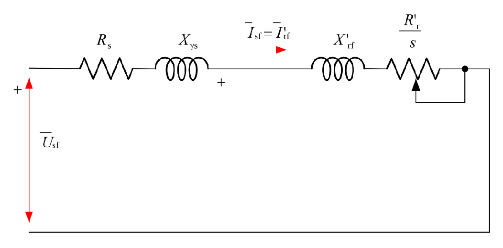
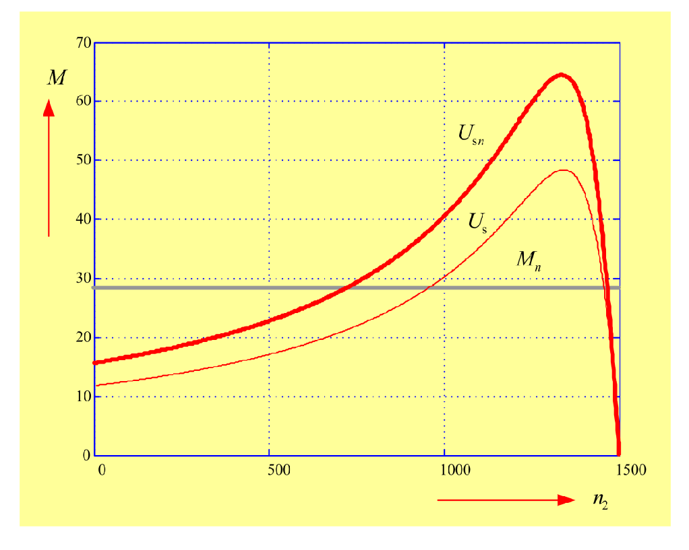

# Zadatak 39 — Može li kavezni asinhroni motor da krene kada napon padne za 15%? (provera polaznog momenta)

## Postavka

Trofazni kavezni asinhroni motor ima sledeće nazivne (natpisne) podatke: snaga $4{,}4\ \mathrm{kW}$, napon $380\ \mathrm{V}$, struja $8{,}9\ \mathrm{A}$, učestanost $50\ \mathrm{Hz}$, brzina obrtanja $1465\ \mathrm{min^{-1}}$, sprega statorskih namotaja je zvezda (Y). Parametri ekvivalentne šeme su: rasipna reaktansa statora $X_{\gamma s} = 3\ \Omega$, svedena rasipna reaktansa rotora $X'_{\gamma r} = 3\ \Omega$ i otpornost statorskog namotaja $R_s = 1\ \Omega$. Gubici u gvožđu i mehanički gubici se mogu zanemariti.

Odrediti da li ovaj motor može startovati pri nominalnom momentu opterećenja ako napon napajanja padne za 15%.

> **Prevod na običan jezik:** Motor stoji u mestu i na njegovoj osovini "visi" teret koji traži pun (nominalni) moment. U mreži je došlo do pada napona, pa motor umesto $380\ \mathrm{V}$ dobija samo 85% toga. Pitanje je prosto: da li je moment koji motor razvija u trenutku polaska (dok se rotor još ne okreće) dovoljno veliki da savlada moment tereta i pokrene osovinu? Da bismo odgovorili, moramo prvo izračunati koliki je nominalni moment tereta, zatim koliki polazni moment motor uopšte može da napravi — prvo pri punom, pa pri sniženom naponu — i na kraju ta dva broja uporediti.

## Podaci

| Veličina | Oznaka | Vrednost | Šta ta veličina fizički znači |
|---|---|---|---|
| Nazivna snaga | $P_{\mathrm{n}}$ | $4{,}4\ \mathrm{kW} = 4400\ \mathrm{W}$ | Mehanička snaga koju motor trajno predaje osovini u nazivnom režimu. |
| Nazivni (linijski) napon | $U_{\mathrm{n}}$ | $380\ \mathrm{V}$ | Efektivna vrednost napona između dva fazna provodnika mreže na koju je motor priključen. |
| Nazivna struja | $I_{\mathrm{n}}$ | $8{,}9\ \mathrm{A}$ | Efektivna vrednost linijske struje koju motor vuče iz mreže u nazivnom režimu. |
| Učestanost mreže | $f$ | $50\ \mathrm{Hz}$ | Broj perioda naizmeničnog napona u sekundi; određuje brzinu obrtnog magnetnog polja. |
| Nazivna brzina obrtanja | $n_{\mathrm{n}}$ | $1465\ \mathrm{min^{-1}}$ | Brzina rotora kada motor radi pod nazivnim opterećenjem. |
| Sprega statora | Y | zvezda | Sva tri namotaja spojena jednim krajem u zajedničku (zvezdinu) tačku; na svakom namotaju je *fazni* napon, $\sqrt{3}$ puta manji od linijskog. |
| Rasipna reaktansa statora | $X_{\gamma s}$ | $3\ \Omega$ | "Otpor" koji fluks rasipanja statora (deo fluksa koji se ne zatvara kroz rotor) pruža naizmeničnoj struji. |
| Svedena rasipna reaktansa rotora | $X'_{\gamma r}$ | $3\ \Omega$ | Isto to za rotor, ali preračunato ("svedeno") na statorsku stranu — vidi mini-lekciju 2. |
| Otpornost statora | $R_s$ | $1\ \Omega$ | Omska otpornost jednog faznog namotaja statora. |
| Gubici u gvožđu i mehanički gubici | — | zanemareni | Pojednostavljenje: sva snaga koja prođe kroz vazdušni zazor troši se samo na rotorski bakar i korisnu mehaničku snagu. |
| Pad napona | — | $15\%$ | Motor pri polasku dobija samo $0{,}85 \cdot U_{\mathrm{n}}$. |

Primetimo šta *nije* dato: svedena otpornost rotora $R'_r$. Nju ćemo morati sami da izračunamo iz nazivnih podataka — to je računski najteži deo zadatka.

## Šta se traži i zašto

Traži se odgovor **da/ne**: može li motor da startuje pod nominalnim teretom pri naponu sniženom za 15%. Da bismo do odgovora došli, usput moramo da odredimo četiri veličine:

1. **Nominalni moment $M_{\mathrm{n}}$** — moment koji teret traži. Inženjera zanima jer je to "letvica" koju polazni moment mora da preskoči: motor kreće samo ako je njegov moment veći od momenta tereta.
2. **Svedena rotorska otpornost $R'_r$** — parametar ekvivalentne šeme bez kojeg ne možemo izračunati nijedan moment iz šeme. Nije data, pa je "izvlačimo" iz uslova da u nazivnoj radnoj tački (poznato klizanje, poznat moment) ekvivalentna šema mora dati baš nominalni moment.
3. **Polazni moment pri punom naponu $M_{\mathrm{pn}}$** — moment koji motor razvija u trenutku uključenja ($n = 0$) kada dobija pun napon.
4. **Polazni moment pri sniženom naponu $M_{\mathrm{p}}$** — ista veličina pri $0{,}85 \cdot U_{\mathrm{n}}$; nju na kraju poredimo sa $M_{\mathrm{n}}$.

**Plan rešavanja u pet koraka, običnim jezikom:**

1. Iz učestanosti i broja pari polova nađemo sinhronu brzinu, pa iz nje i nazivne brzine — nazivno klizanje $s_{\mathrm{n}}$.
2. Iz nazivne snage i nazivne brzine izračunamo nominalni moment $M_{\mathrm{n}}$.
3. Napišemo izraz za moment motora iz ekvivalentne šeme; uvrstimo u njega nazivnu radnu tačku ($s = s_{\mathrm{n}}$, $M = M_{\mathrm{n}}$) i rešimo dobijenu kvadratnu jednačinu po nepoznatoj $R'_r$.
4. Sa poznatim $R'_r$ izračunamo polazni moment (izraz za moment pri $s = 1$) za pun napon, pa ga skaliramo sa $0{,}85^2$ za sniženi napon (moment zavisi od kvadrata napona).
5. Uporedimo polazne momente sa $M_{\mathrm{n}}$ i damo odgovor.

## Potrebna teorija — mini-lekcije

### Mini-lekcija 1: Sinhrona brzina i klizanje

Trofazne struje u statoru prave **obrtno magnetno polje** — magnetno polje čiji se pravac vrti u prostoru konstantnom brzinom, kao da neko fizički okreće magnet. Ta brzina se zove **sinhrona brzina** i iznosi:

$$n_s = \frac{60 \cdot f}{p}\ \ \mathrm{[min^{-1}]},$$

gde je $f$ učestanost mreže, a $p$ **broj pari polova** namotaja (mašina sa 4 magnetna pola ima $p = 2$ para). Formula potiče iz proste činjenice: za jednu periodu napona polje pređe jedan par polova, pa što više pari polova namotaj ima, polje se sporije okreće; množilac 60 samo prevodi obrtaje u sekundi u obrtaje u minutu.

Rotor asinhronog motora se **nikad ne okreće tačno sinhronom brzinom** — da se okreće, provodnici rotora ne bi "sekli" linije polja, u njima se ne bi indukovala struja i ne bi bilo momenta. Rotor zato uvek malo zaostaje, a to zaostajanje merimo **klizanjem**:

$$s = \frac{n_s - n}{n_s}.$$

Klizanje je bezdimenzioni broj: $s = 0$ znači da se rotor okreće sinhrono (nema momenta), $s = 1$ znači da rotor **stoji** — a to je upravo trenutak polaska. U nazivnom režimu klizanje je tipično malo, svega nekoliko procenata.

### Mini-lekcija 2: Ekvivalentna šema asinhronog motora i "svedene" veličine

Asinhroni motor je u suštini transformator čiji se sekundar (rotor) okreće. Zato ga, po fazi, predstavljamo električnom šemom sa otpornostima i reaktansama:

- $R_s$ — otpornost statorskog namotaja;
- $X_{\gamma s}$ — rasipna reaktansa statora (posledica fluksa koji se zatvara oko statorskog namotaja, a ne kroz rotor);
- $X'_{\gamma r}$ i $R'_r$ — rasipna reaktansa i otpornost rotora, ali **svedene** na statorsku stranu.

**"Svedeno"** (oznaka: prim, $'$) znači da su stvarne rotorske vrednosti preračunate preko odnosa broja navojaka statora i rotora, tako da rotorski krug možemo nacrtati direktno u produžetku statorskog, kao da su na istom naponskom nivou — potpuno isto kao kad kod transformatora impedansu sekundara "prebacimo" na primar. Fizika se time ne menja, samo se šema pojednostavljuje.

U punoj šemi postoji i **grana magnećenja** (paralelna grana kroz koju teče struja koja stvara glavni fluks i u kojoj se modeluju gubici u gvožđu). U ovom zadatku su gubici u gvožđu zanemareni, a podaci o grani magnećenja nisu ni dati, pa granu magnećenja **izostavljamo**. Posledica: stator i rotor postaju jedno prosto redno kolo, pa je statorska struja jednaka svedenoj rotorskoj struji, $I_s = I'_r$. To je gruba, ali za procenu momenta sasvim upotrebljiva aproksimacija (struja magnećenja je tipično 25–40% nazivne struje i pretežno ne pravi moment).

### Mini-lekcija 3: Otpornost $R'_r/s$ i bilans snaga

U svedenoj šemi rotorska grana ne sadrži samo $R'_r$, nego otpornost $\dfrac{R'_r}{s}$. Odakle klizanje u imeniocu? Kada se rotor okreće, učestanost rotorskih struja je samo $s \cdot f$; kada se sve veličine matematički prevedu na statorsku učestanost $f$, ispadne da se ceo uticaj obrtanja rotora može predstaviti tako što se rotorska otpornost "naduva" na $R'_r/s$.

Ta ekvivalentna otpornost se može razdvojiti na dva dela:

$$\frac{R'_r}{s} = R'_r + R'_r\,\frac{1-s}{s}.$$

Prvi deo, $R'_r$, je stvarna otpornost provodnika — snaga na njemu su **Džulovi gubici u rotoru** (grejanje kaveza). Drugi deo, $R'_r(1-s)/s$, je "veštačka" otpornost — snaga koja se na njoj "troši" u šemi jeste upravo **mehanička snaga** koju motor predaje osovini. Ukupna snaga koja se razvije na celoj otpornosti $R'_r/s$ (za sve tri faze):

$$P_{\mathrm{ob}} = 3 \cdot I'^{2}_r \cdot \frac{R'_r}{s}$$

zove se **snaga obrtnog polja** (snaga koja kroz vazdušni zazor pređe sa statora na rotor). Pošto smo gubitke u gvožđu i mehaničke gubitke zanemarili, ovo je sva snaga koja stigne do rotora, i deli se u odnosu $R'_r : R'_r(1-s)/s$, tj. deo $s \cdot P_{\mathrm{ob}}$ ode u toplotu rotora, a deo $(1-s) \cdot P_{\mathrm{ob}}$ postane mehanička snaga.

### Mini-lekcija 4: Izraz za elektromagnetni moment

Moment je snaga podeljena ugaonom brzinom, $M = P/\Omega$. Elegantan trik: umesto da mehaničku snagu delimo brzinom rotora, možemo snagu obrtnog polja podeliti **sinhronom mehaničkom ugaonom brzinom** $\Omega_s = \omega_s/p$, gde je $\omega_s = 2\pi f$ električna ugaona učestanost mreže. Oba puta daju isti rezultat:

$$M = \frac{P_{\mathrm{meh}}}{\Omega} = \frac{(1-s)\,P_{\mathrm{ob}}}{(1-s)\,\Omega_s} = \frac{P_{\mathrm{ob}}}{\Omega_s},$$

jer je brzina rotora $\Omega = (1-s)\Omega_s$, pa se faktor $(1-s)$ skrati. Prednost oblika $P_{\mathrm{ob}}/\Omega_s$ je što radi i pri polasku ($s=1$), kada je mehanička snaga nula (rotor stoji!), a moment očigledno nije. Uvrstimo $P_{\mathrm{ob}}$ iz mini-lekcije 3:

$$M = \frac{3 \cdot I'^{2}_r \cdot \dfrac{R'_r}{s}}{\dfrac{\omega_s}{p}} = 3 \cdot p \cdot \frac{R'_r}{s \cdot \omega_s} \cdot I'^{2}_r.$$

Struju $I'_r$ čitamo iz redne šeme (bez grane magnećenja) po Omovom zakonu — napon podeljen modulom impedanse rednog kola:

$$I'_r = \frac{U_f}{\sqrt{\left(R_s + \dfrac{R'_r}{s}\right)^{2} + \left(X_{\gamma s} + X'_{\gamma r}\right)^{2}}},$$

gde je $U_f$ **fazni** napon (šema je crtana po fazi!). Kad ovo uvrstimo u izraz za moment, dobijamo momentnu karakteristiku — moment kao funkciju klizanja:

$$M(s) = \frac{3\,p}{\omega_s} \cdot U_f^{2} \cdot \frac{\dfrac{R'_r}{s}}{\left(R_s + \dfrac{R'_r}{s}\right)^{2} + \left(X_{\gamma s} + X'_{\gamma r}\right)^{2}}.$$

**Polazni moment** je specijalan slučaj $s = 1$ (rotor stoji):

$$M_p = \frac{3\,p}{\omega_s} \cdot U_f^{2} \cdot \frac{R'_r}{\left(R_s + R'_r\right)^{2} + \left(X_{\gamma s} + X'_{\gamma r}\right)^{2}}.$$

### Mini-lekcija 5: Moment zavisi od KVADRATA napona

U izrazu za moment napon figuriše kao $U_f^2$ — jer moment potiče od snage, a snaga je proizvod napona i struje, pri čemu je i struja srazmerna naponu. Posledica je neprijatna: **pad napona od 15% ne smanjuje moment za 15%, nego za faktor $0{,}85^2 = 0{,}7225$, tj. za skoro 28%.** Zato su asinhroni motori osetljivi na "slabu mrežu": relativno mali pad napona može da onemogući polazak ili čak zaustavi opterećen motor. Opšte pravilo skaliranja:

$$M_p = \left(\frac{U_s}{U_{s\mathrm{n}}}\right)^{2} \cdot M_{p\mathrm{n}},$$

gde je $U_s$ stvarni, a $U_{s\mathrm{n}}$ nazivni napon napajanja, dok je $M_{p\mathrm{n}}$ polazni moment pri nazivnom naponu.

### Mini-lekcija 6: Sprega zvezda i fazni napon

Kod sprege zvezda (Y) linijski napon (između dva provodnika) i fazni napon (na jednom namotaju) vezani su odnosom:

$$U_f = \frac{U_{\mathrm{lin}}}{\sqrt{3}}.$$

Koren iz 3 potiče iz geometrije: linijski napon je razlika dva fazna napona pomerena za $120^{\circ}$, a takva razlika fazora ima moduo $\sqrt{3}$ puta veći od pojedinačnog fazora. Ovde: $U_f = 380/\sqrt{3} \approx 220\ \mathrm{V}$. Sve formule iz mini-lekcije 4 zahtevaju **fazni** napon.

### Mini-lekcija 7: Uslov polaska motora

Motor pri uključenju ubrzava samo ako je njegov moment veći od momenta koji teret pruža. Osnovna jednačina mehanike obrtanja glasi $J\,\frac{d\Omega}{dt} = M_{\mathrm{motora}} - M_{\mathrm{tereta}}$ ($J$ je moment inercije). Da bi ubrzanje $d\Omega/dt$ bilo pozitivno u trenutku polaska, mora biti:

$$M_p \ge M_{\mathrm{tereta}}.$$

U ovom zadatku teret traži konstantan nominalni moment $M_{\mathrm{n}}$ nezavisno od brzine, pa je uslov polaska prosto $M_p \ge M_{\mathrm{n}}$. Grafički: kriva momenta motora mora na $n = 0$ (i na celom putu ubrzavanja) biti **iznad** horizontalne linije momenta tereta.

## Rešenje, korak po korak

### Korak 1: Sinhrona brzina i broj pari polova

**Zašto ovaj korak:** Bez sinhrone brzine ne možemo izračunati klizanje, a broj pari polova $p$ nam treba i direktno u formuli za moment.

Broj pari polova nije eksplicitno dat, ali ga otkrivamo iz nazivne brzine: rotor se okreće **malo sporije** od sinhrone brzine, pa je sinhrona brzina prva "okrugla" vrednost odmah iznad $1465\ \mathrm{min^{-1}}$. Kandidati pri $50\ \mathrm{Hz}$ su $3000$ ($p=1$), $1500$ ($p=2$), $1000$ ($p=3$)... Jedina vrednost neposredno iznad 1465 je $1500\ \mathrm{min^{-1}}$, dakle $p = 2$ (četvoropolna mašina). Provera formulom iz mini-lekcije 1:

$$n_s = \frac{60 \cdot f}{p} = \frac{60 \cdot 50}{2} = \frac{3000}{2} = 1500\ \mathrm{min^{-1}}.$$

**Šta smo dobili:** Obrtno polje se vrti brzinom $1500\ \mathrm{min^{-1}}$; rotor u nazivnom režimu zaostaje za njim za $35\ \mathrm{min^{-1}}$ — tipično malo zaostajanje.

### Korak 2: Nominalno klizanje

**Zašto ovaj korak:** Nazivna radna tačka biće naš "kalibracioni" uslov za nalaženje nepoznate rotorske otpornosti, a nju opisujemo klizanjem.

$$s_{\mathrm{n}} = \frac{n_s - n_{\mathrm{n}}}{n_s} = \frac{1500 - 1465}{1500} = \frac{35}{1500} = 0{,}0233 = 2{,}33\ \%.$$

**Šta smo dobili:** Klizanje od svega 2,33% — sasvim uobičajena vrednost za nazivni režim asinhronog motora (obično 1–6%). Broj je mali jer rotor u normalnom radu skoro prati obrtno polje.

### Korak 3: Nominalni moment

**Zašto ovaj korak:** $M_{\mathrm{n}}$ je moment tereta — brojka sa kojom ćemo na kraju porediti polazne momente, ali i podatak potreban za nalaženje $R'_r$ u koraku 5.

Nazivna snaga sa natpisne pločice je mehanička snaga na osovini, a moment je snaga podeljena ugaonom brzinom **rotora** (jer se snaga predaje na osovini koja se okreće brzinom rotora, ne polja):

$$M_{\mathrm{n}} = \frac{P_{\mathrm{n}}}{\omega_{\mathrm{n}}} = \frac{P_{\mathrm{n}}}{\dfrac{2\pi}{60} \cdot n_{\mathrm{n}}} = \frac{60 \cdot P_{\mathrm{n}}}{2\pi \cdot n_{\mathrm{n}}}.$$

Ovde je $\omega_{\mathrm{n}} = \frac{2\pi}{60} n_{\mathrm{n}}$ nazivna ugaona brzina rotora u $\mathrm{rad/s}$ (faktor $2\pi/60$ prevodi obrtaje u minuti u radijane u sekundi: jedan obrtaj je $2\pi$ radijana, jedan minut je 60 sekundi). Uvrstimo brojeve:

$$\omega_{\mathrm{n}} = \frac{2\pi \cdot 1465}{60} = 153{,}4\ \mathrm{rad/s},$$

$$M_{\mathrm{n}} = \frac{60 \cdot 4400}{2\pi \cdot 1465} = \frac{264\,000}{9204{,}9} = 28{,}68\ \mathrm{Nm}.$$

> **Napomena o originalu:** U zbirci u ovoj formuli u imeniocu štamparski stoji broj $1440$, ali je otisnuti rezultat $28{,}68\ \mathrm{Nm}$ — a upravo taj rezultat se dobija sa ispravnom nazivnom brzinom $1465\ \mathrm{min^{-1}}$ iz postavke (sa 1440 bi ispalo $29{,}18\ \mathrm{Nm}$). Dakle, "1440" je omaška u kucanju, a račun zbirke je zapravo sproveden ispravno; mi računamo sa $1465\ \mathrm{min^{-1}}$.

**Šta smo dobili:** Teret na osovini traži $28{,}68\ \mathrm{Nm}$. To je "letvica" — polazni moment motora mora biti bar toliki da bi motor uopšte krenuo.

### Korak 4: Ekvivalentna šema i izraz za polazni moment

**Zašto ovaj korak:** Sve dalje računamo iz ekvivalentne šeme, pa je prvo crtamo i iz nje ispisujemo izraz za moment.

Sledeća slika prikazuje ekvivalentnu šemu po jednoj fazi. Čitaj je sleva nadesno: iz izvora faznog napona $U_{sf}$ struja prolazi kroz otpornost statora $R_s$ i rasipnu reaktansu statora $X_{\gamma s}$, pa (pošto smo granu magnećenja izbacili — mini-lekcija 2) ista ta struja nastavlja kroz svedenu rasipnu reaktansu rotora $X'_{\gamma r}$ i ekvivalentnu rotorsku otpornost $R'_r/s$. Zato na šemi piše $\bar{I}_{sf} = \bar{I}'_{rf}$ — statorska i svedena rotorska struja su ista struja.

**Slika 39.1 —** Ekvivalentna šema asinhronog motora (uz zanemarenje grane magnećenja, u nedostatku podataka).

Prema mini-lekcijama 3 i 4, moment pri proizvoljnom klizanju $s$ je:

$$M(s) = 3 \cdot p \cdot \frac{R'_r}{s \cdot \omega_s} \cdot \left|I'_r(s)\right|^{2} = \frac{3\,p}{\omega_s} \cdot U_f^{2} \cdot \frac{\dfrac{R'_r}{s}}{\left(R_s + \dfrac{R'_r}{s}\right)^{2} + \left(X_{\gamma s} + X'_{\gamma r}\right)^{2}}.$$

Novi simboli: $\omega_s = 2\pi f$ je električna ugaona učestanost mreže ($\omega_s = 2\pi \cdot 50 = 314{,}16\ \mathrm{rad/s}$), $p = 2$ broj pari polova, $U_f$ fazni napon, a $I'_r(s)$ svedena rotorska struja pri klizanju $s$.

Pri polasku rotor stoji, pa je $s = 1$ i $R'_r/s = R'_r$:

$$M_p = 3 \cdot p \cdot \frac{R'_r}{1 \cdot \omega_s} \cdot \left|I'_r(1)\right|^{2} = \frac{3\,p}{\omega_s} \cdot U_f^{2} \cdot \frac{R'_r}{\left(R_s + R'_r\right)^{2} + \left(X_{\gamma s} + X'_{\gamma r}\right)^{2}}.$$

Fazni napon (mini-lekcija 6, sprega Y):

$$U_f = \frac{380}{\sqrt{3}} = 219{,}4 \approx 220\ \mathrm{V}.$$

**Šta smo dobili:** Formulu za polazni moment u koju možemo uvrstiti sve — osim $R'_r$, koje nemamo. Sledeći korak rešava baš taj problem.

### Korak 5: Nalaženje svedene rotorske otpornosti $R'_r$ iz nazivne radne tačke

**Zašto ovaj korak:** $R'_r$ nije dato u postavci, a bez njega formula za $M_p$ ne može da se izračuna. Znamo, međutim, jednu kompletnu radnu tačku: pri klizanju $s_{\mathrm{n}} = 0{,}0233$ motor razvija moment $M_{\mathrm{n}} = 28{,}68\ \mathrm{Nm}$. Uvrstimo tu tačku u opšti izraz za moment — dobićemo jednu jednačinu sa jednom nepoznatom $R'_r$.

Polazna jednačina (opšti izraz momenta u nazivnoj tački):

$$M_{\mathrm{n}} = \frac{3\,p}{\omega_s} \cdot U_f^{2} \cdot \frac{\dfrac{R'_r}{s_{\mathrm{n}}}}{\left(R_s + \dfrac{R'_r}{s_{\mathrm{n}}}\right)^{2} + \left(X_{\gamma s} + X'_{\gamma r}\right)^{2}}.$$

Sad je sredimo po $R'_r$, prelaz po prelaz.

**Prelaz 1 — oslobodimo se razlomka.** Pomnožimo obe strane imeniocem desne strane i podelimo sa $M_{\mathrm{n}}$:

$$\left(R_s + \frac{R'_r}{s_{\mathrm{n}}}\right)^{2} + \left(X_{\gamma s} + X'_{\gamma r}\right)^{2} = \frac{3\,p}{\omega_s} \cdot \frac{U_f^{2}}{M_{\mathrm{n}}} \cdot \frac{R'_r}{s_{\mathrm{n}}},$$

odnosno, kad sve prebacimo na levu stranu:

$$\left(R_s + \frac{R'_r}{s_{\mathrm{n}}}\right)^{2} - \frac{3\,p}{\omega_s} \cdot \frac{U_f^{2}}{M_{\mathrm{n}}} \cdot \frac{R'_r}{s_{\mathrm{n}}} + \left(X_{\gamma s} + X'_{\gamma r}\right)^{2} = 0.$$

**Prelaz 2 — razvijemo kvadrat binoma.** $\left(R_s + \frac{R'_r}{s_{\mathrm{n}}}\right)^{2} = R_s^{2} + 2 R_s \frac{R'_r}{s_{\mathrm{n}}} + \left(\frac{R'_r}{s_{\mathrm{n}}}\right)^{2}$, pa grupisanjem članova uz $\frac{R'_r}{s_{\mathrm{n}}}$:

$$\left(\frac{R'_r}{s_{\mathrm{n}}}\right)^{2} + \frac{R'_r}{s_{\mathrm{n}}} \cdot \left(2 R_s - \frac{3\,p}{\omega_s} \cdot \frac{U_f^{2}}{M_{\mathrm{n}}}\right) + R_s^{2} + \left(X_{\gamma s} + X'_{\gamma r}\right)^{2} = 0.$$

Ovo je kvadratna jednačina po veličini $\frac{R'_r}{s_{\mathrm{n}}}$.

**Prelaz 3 — pomnožimo celu jednačinu sa $s_{\mathrm{n}}^{2}$**, da nepoznata postane samo $R'_r$ (prvi član se množi sa $s_{\mathrm{n}}^2$ i skrati oba $s_{\mathrm{n}}$ iz imenioca, drugi zadrži jedno $s_{\mathrm{n}}$, treći dobije $s_{\mathrm{n}}^2$):

$$R'^{2}_r + R'_r \cdot \left(2 R_s - \frac{3\,p}{\omega_s} \cdot \frac{U_f^{2}}{M_{\mathrm{n}}}\right) \cdot s_{\mathrm{n}} + \left[R_s^{2} + \left(X_{\gamma s} + X'_{\gamma r}\right)^{2}\right] \cdot s_{\mathrm{n}}^{2} = 0.$$

**Prelaz 4 — uvrstimo brojeve.** Prvo izračunajmo pomoćni proizvod u zagradi:

$$\frac{3\,p}{\omega_s} \cdot \frac{U_f^{2}}{M_{\mathrm{n}}} = \frac{3 \cdot 2}{2\pi \cdot 50} \cdot \frac{220^{2}}{28{,}68} = \frac{6}{314{,}16} \cdot \frac{48\,400}{28{,}68} = 0{,}0191 \cdot 1687{,}6 = 32{,}23.$$

Koeficijent uz $R'_r$ (linearni član):

$$\left(2 \cdot 1 - 32{,}23\right) \cdot 0{,}0233 = (-30{,}23) \cdot 0{,}0233 = -0{,}7043.$$

Slobodni član:

$$\left[1^{2} + (3+3)^{2}\right] \cdot 0{,}0233^{2} = \left[1 + 36\right] \cdot 0{,}000543 = 37 \cdot 0{,}000543 = 0{,}0201.$$

Jednačina postaje:

$$R'^{2}_r - 0{,}7043 \cdot R'_r + 0{,}0201 = 0.$$

> **Napomena o originalu:** U zbirci je jednačina otisnuta sa znakom "$+$" ispred $0{,}7043$, ali odmah zatim obrazac za korene ima $+0{,}7043$ u brojiocu — što odgovara jednačini sa koeficijentom $-0{,}7043$ (za $x^2+bx+c=0$ koreni su $x=\frac{-b\pm\sqrt{b^2-4c}}{2}$). Znak minus je i matematički obavezan, jer je $2R_s - 32{,}23 < 0$; sa "$+$" bi oba korena bila negativna, što za otpornost nema smisla. Reč je, dakle, samo o znaku ispalom pri slaganju teksta — koreni u zbirci ($0{,}6745$ i $0{,}0298\ \Omega$) su ispravni i mi ih dobijamo iste.

**Prelaz 5 — rešimo kvadratnu jednačinu.** Za jednačinu oblika $x^{2} + b\,x + c = 0$ koreni su $x_{1/2} = \frac{-b \pm \sqrt{b^{2} - 4c}}{2}$. Ovde je $b = -0{,}7043$ i $c = 0{,}0201$:

$$R'_{r\,1/2} = \frac{0{,}7043 \pm \sqrt{0{,}7043^{2} - 4 \cdot 0{,}0201}}{2} = \frac{0{,}7043 \pm \sqrt{0{,}4960 - 0{,}0804}}{2} = \frac{0{,}7043 \pm \sqrt{0{,}4156}}{2},$$

$$R'_{r\,1/2} = \frac{0{,}7043 \pm 0{,}6447}{2} = \begin{cases} \dfrac{1{,}3490}{2} = 0{,}6745\ \Omega \\[2mm] \dfrac{0{,}0596}{2} = 0{,}0298\ \Omega \end{cases}$$

**Šta smo dobili:** Dva matematički ispravna korena — oba zadovoljavaju jednačinu nazivnog momenta. Fizika će morati da presudi koji je pravi.

### Korak 6: Izbor fizički smislenog korena

**Zašto ovaj korak:** Kvadratna jednačina ne zna fiziku — daje oba preseka parabole sa nulom. Motor, međutim, ima samo jednu stvarnu rotorsku otpornost, pa moramo obrazložiti izbor.

Drugi koren, $R'_r = 0{,}0298\ \Omega$, daje suviše malu vrednost rotorske otpornosti da bi odgovarao ovom motoru. Najjednostavnija provera je preko struje u nazivnoj tački (Omov zakon na rednu šemu, $s = s_{\mathrm{n}}$):

- za $R'_r = 0{,}6745\ \Omega$: $\dfrac{R'_r}{s_{\mathrm{n}}} = \dfrac{0{,}6745}{0{,}0233} = 28{,}95\ \Omega$, pa je $I'_r = \dfrac{220}{\sqrt{(1 + 28{,}95)^2 + 6^2}} = \dfrac{220}{30{,}5} = 7{,}2\ \mathrm{A}$ — blisko natpisnoj struji $8{,}9\ \mathrm{A}$ (razlika je upravo zanemarena struja magnećenja);
- za $R'_r = 0{,}0298\ \Omega$: $\dfrac{R'_r}{s_{\mathrm{n}}} = 1{,}28\ \Omega$, pa je $I'_r = \dfrac{220}{\sqrt{(1 + 1{,}28)^2 + 6^2}} = \dfrac{220}{6{,}42} = 34{,}3\ \mathrm{A}$ — skoro četiri nazivne struje u trajnom režimu, što bi motor spržilo; takva radna tačka ne može biti nazivna.

**Šta smo dobili:** Usvajamo $R'_r = 0{,}6745\ \Omega$. Sada imamo kompletnu ekvivalentnu šemu.

### Korak 7: Polazni moment pri nominalnom naponu

**Zašto ovaj korak:** Pre nego što gledamo sniženi napon, izračunajmo koliko motor uopšte može pri punom naponu — to je referentna vrednost $M_{p\mathrm{n}}$.

U izraz za polazni moment iz koraka 4 uvrstimo $R'_r = 0{,}6745\ \Omega$ i pun fazni napon $U_{f\mathrm{n}} = 220\ \mathrm{V}$:

$$M_{p\mathrm{n}} = \frac{3\,p}{\omega_s} \cdot U_{f\mathrm{n}}^{2} \cdot \frac{R'_r}{\left(R_s + R'_r\right)^{2} + \left(X_{\gamma s} + X'_{\gamma r}\right)^{2}} = \frac{3 \cdot 2}{2\pi \cdot 50} \cdot 220^{2} \cdot \frac{0{,}6745}{\left(1 + 0{,}6745\right)^{2} + \left(3 + 3\right)^{2}}.$$

Računamo deo po deo:

$$\frac{3 \cdot 2}{2\pi \cdot 50} \cdot 220^{2} = 0{,}0191 \cdot 48\,400 = 924{,}4,$$

$$\left(1 + 0{,}6745\right)^{2} + 6^{2} = 1{,}6745^{2} + 36 = 2{,}804 + 36 = 38{,}80,$$

$$M_{p\mathrm{n}} = 924{,}4 \cdot \frac{0{,}6745}{38{,}80} = \frac{623{,}5}{38{,}80} = 16{,}07\ \mathrm{Nm}.$$

**Šta smo dobili:** Polazni moment pri **punom** naponu je svega $16{,}07\ \mathrm{Nm}$ — već sada vidimo da je to manje od potrebnih $28{,}68\ \mathrm{Nm}$! To je tipično za manje kavezne motore: njihov polazni moment je često reda polovine nominalnog, pa nisu predviđeni za direktan start pod punim konstantnim teretom.

### Korak 8: Polazni moment pri naponu sniženom za 15%

**Zašto ovaj korak:** Zadatak pita baš za slučaj $U_s = 0{,}85 \cdot U_{s\mathrm{n}}$. Moment skalira sa kvadratom napona (mini-lekcija 5), pa ne moramo ponavljati ceo račun — dovoljno je pomnožiti $M_{p\mathrm{n}}$ odgovarajućim kvadratom odnosa napona:

$$M_p = \left(\frac{U_s}{U_{s\mathrm{n}}}\right)^{2} \cdot M_{p\mathrm{n}} = 0{,}85^{2} \cdot M_{p\mathrm{n}} = 0{,}7225 \cdot 16{,}07 = 11{,}61\ \mathrm{Nm}.$$

**Šta smo dobili:** Pri sniženom naponu motor na polasku razvija samo $11{,}61\ \mathrm{Nm}$ — pad napona od 15% "pojeo" je skoro 28% polaznog momenta.

### Korak 9: Odgovor na pitanje zadatka

**Zašto ovaj korak:** Sve brojke su tu; ostaje poređenje sa uslovom polaska iz mini-lekcije 7.

$$M_p = 11{,}61\ \mathrm{Nm} \;<\; M_{p\mathrm{n}} = 16{,}07\ \mathrm{Nm} \;<\; M_{\mathrm{n}} = 28{,}68\ \mathrm{Nm}.$$

**Motor NE MOŽE da startuje pri sniženom naponu — ali, što je još upečatljivije, on nominalni teret od $28{,}68\ \mathrm{Nm}$ ne može da pokrene čak ni pri punom, nominalnom naponu**, jer mu je i tada polazni moment ($16{,}07\ \mathrm{Nm}$) manji od momenta tereta.

Ceo zaključak se najlepše vidi na momentnoj karakteristici. Sledeća slika prikazuje moment motora $M$ (vertikalna osa, u $\mathrm{Nm}$) u funkciji brzine rotora $n_2$ (horizontalna osa, od 0 do $1500\ \mathrm{min^{-1}}$). Debela crvena kriva je karakteristika pri punom naponu $U_{s\mathrm{n}}$, tanka crvena pri sniženom naponu $U_s = 0{,}85\,U_{s\mathrm{n}}$, a horizontalna siva linija je konstantan moment tereta $M_{\mathrm{n}} = 28{,}68\ \mathrm{Nm}$. Čitaj je ovako: polazak je krajnja **leva** tačka krivih ($n_2 = 0$); motor može da ubrzava samo tamo gde je njegova kriva **iznad** sive linije tereta. Vidi se da na $n_2 = 0$ obe crvene krive (oko 16 odnosno oko 11,6 Nm) leže **ispod** linije tereta — motor ni u jednom slučaju ne kreće s mesta, iako bi u okolini prevojne tačke (oko $1330\ \mathrm{min^{-1}}$, gde puna kriva dostiže oko $65\ \mathrm{Nm}$) momenta imao i napretek, samo kad bi nekako do te brzine stigao.

**Slika 39.2 —** Momentna karakteristika motora za pun (puna crvena linija) i sniženi napon napajanja (tanka crvena linija), i momentna karakteristika konstantnog opterećenja — uz rešenje zadatka.

**Šta smo dobili:** Konačan odgovor: ne, motor ne može startovati — ni pri sniženom, ni čak pri punom naponu, dokle god teret na polasku traži pun nominalni moment. U praksi bi se ovakav motor puštao u rad neopterećen (pa bi se teret pridodavao tek kad se zaleti), ili bi se birao motor sa većim polaznim momentom.

## Česte greške i zamke

1. **Linijski umesto faznog napona.** Šema je po fazi, pa u formulu za moment ide $U_f = 220\ \mathrm{V}$, ne $380\ \mathrm{V}$. Pošto napon ulazi na kvadrat, greška uvećava sve momente tačno $(380/220)^2 = 3$ puta — dobili biste $M_{p\mathrm{n}} \approx 48\ \mathrm{Nm}$ i pogrešno zaključili da motor kreće bez problema.
2. **Linearno umesto kvadratnog skaliranja sa naponom.** Pad napona od 15% smanjuje moment na $0{,}85^2 = 72{,}25\%$, ne na $85\%$. Ko pomnoži $16{,}07$ sa $0{,}85$ dobija $13{,}66\ \mathrm{Nm}$ umesto $11{,}61\ \mathrm{Nm}$ (ovde zaključak ostaje isti, ali u graničnim zadacima ta greška menja odgovor).
3. **Mešanje dve ugaone brzine.** Nominalni moment se računa sa brzinom **rotora** ($M_{\mathrm{n}} = P_{\mathrm{n}}/\omega_{\mathrm{n}}$, jer se snaga predaje na osovini), a moment iz ekvivalentne šeme sa **sinhronom** brzinom ($M = P_{\mathrm{ob}}/\Omega_s$, jer se deli snaga obrtnog polja). Zamena jedne drugom daje grešku od nekoliko procenata ovde, a ogromnu pri velikim klizanjima.
4. **Broj polova umesto broja pari polova.** Ova mašina je četvoropolna, ali u formulama figuriše $p = 2$ (broj **pari**). Sa $p = 4$ ispalo bi $n_s = 750\ \mathrm{min^{-1}}$ — manje od nazivne brzine, što je očigledno besmisleno (rotor motora ne može biti brži od polja).
5. **Nekritičko uzimanje korena kvadratne jednačine.** Oba korena zadovoljavaju jednačinu momenta, ali samo jedan opisuje stvaran motor. Uvek proveri koren nezavisnim podatkom — ovde natpisnom strujom (koren $0{,}0298\ \Omega$ implicira nazivnu struju od $34\ \mathrm{A}$ umesto $8{,}9\ \mathrm{A}$, dakle otpada).
6. **Zaboravljeno množenje sa $s_{\mathrm{n}}$ odnosno $s_{\mathrm{n}}^2$ pri sređivanju kvadratne jednačine.** Pri prelasku sa nepoznate $R'_r/s_{\mathrm{n}}$ na $R'_r$ linearni član se množi sa $s_{\mathrm{n}}$, a slobodni sa $s_{\mathrm{n}}^{2}$ — ako se oba pomnože istim faktorom, koreni ispadnu potpuno pogrešni.

## Rezime rezultata

| Veličina | Oznaka | Vrednost |
|---|---|---|
| Sinhrona brzina | $n_s$ | $1500\ \mathrm{min^{-1}}$ |
| Nominalno klizanje | $s_{\mathrm{n}}$ | $0{,}0233 = 2{,}33\ \%$ |
| Nominalni moment (moment tereta) | $M_{\mathrm{n}}$ | $28{,}68\ \mathrm{Nm}$ |
| Svedena rotorska otpornost (usvojeni koren) | $R'_r$ | $0{,}6745\ \Omega$ |
| Odbačeni koren kvadratne jednačine | — | $0{,}0298\ \Omega$ |
| Polazni moment pri punom naponu | $M_{p\mathrm{n}}$ | $16{,}07\ \mathrm{Nm}$ |
| Polazni moment pri naponu sniženom za 15% | $M_p$ | $11{,}61\ \mathrm{Nm}$ |
| **Da li motor startuje?** | — | **NE** — ni pri sniženom ($11{,}61 < 28{,}68$), ni pri punom naponu ($16{,}07 < 28{,}68$) |

## Provera smisla

**1. Provera preko nazivne struje.** Sa usvojenim $R'_r = 0{,}6745\ \Omega$ struja u nazivnoj tački iz šeme iznosi $I'_r(s_{\mathrm{n}}) = 7{,}2\ \mathrm{A}$, a natpisna nazivna struja je $8{,}9\ \mathrm{A}$. Razlika od oko $1{,}7\ \mathrm{A}$ je očekivana, jer smo zanemarili granu magnećenja kroz koju u stvarnosti teče struja magnećenja (tipično 25–40% nazivne) — dakle šema je konzistentna sa natpisnom pločicom.

**2. Provera polazne struje.** Polazna struja iz šeme: $I_p = \dfrac{220}{\sqrt{1{,}6745^2 + 6^2}} = \dfrac{220}{6{,}23} = 35{,}3\ \mathrm{A} \approx 4 \cdot I_{\mathrm{n}}$. Kavezni motori pri direktnom uključenju tipično vuku 4–7 nazivnih struja — naš rezultat upada tačno u očekivani opseg.

**3. Provera prema slici 39.2.** Iz izračunatih parametara prevojno (maksimalno) klizanje je $s_m = \dfrac{R'_r}{\sqrt{R_s^2 + (X_{\gamma s}+X'_{\gamma r})^2}} = \dfrac{0{,}6745}{\sqrt{37}} = 0{,}111$, čemu odgovara brzina $n \approx 1500 \cdot (1-0{,}111) \approx 1334\ \mathrm{min^{-1}}$ i maksimalni moment $M_{\mathrm{max}} = \dfrac{3p}{\omega_s} \cdot \dfrac{U_f^2}{2\left(R_s + \sqrt{R_s^2 + 36}\right)} \approx 65\ \mathrm{Nm}$. Upravo to pokazuje debela kriva na slici 39.2 (vrh oko $65\ \mathrm{Nm}$ na oko $1330\ \mathrm{min^{-1}}$), a tanka kriva vrh oko $0{,}7225 \cdot 65 \approx 47\ \mathrm{Nm}$ — naš račun i slika iz zbirke se potpuno slažu.

**4. Dimenziona provera formule za moment.** $\dfrac{3p}{\omega_s} U_f^2 \dfrac{R'_r}{Z^2}$ ima dimenziju $\dfrac{1}{\mathrm{s^{-1}}} \cdot \mathrm{V^2} \cdot \dfrac{\Omega}{\Omega^2} = \dfrac{\mathrm{V^2}}{\Omega} \cdot \mathrm{s} = \mathrm{W \cdot s} = \mathrm{J}$, a džul je isto što i njutn-metar — dimenzija momenta. Formula je dimenziono ispravna.
