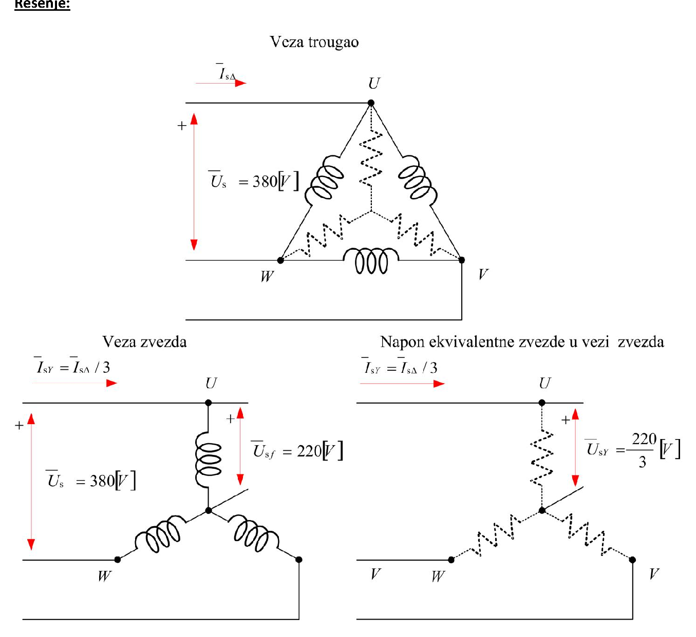
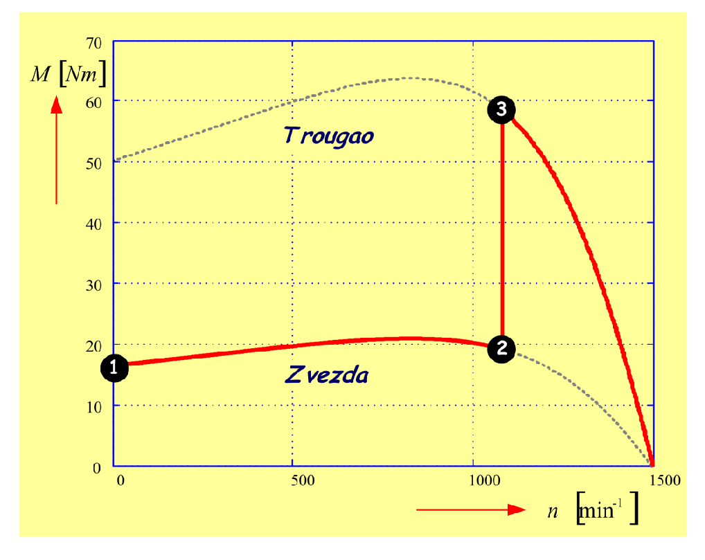

# Zadatak 40 — Puštanje asinhronog motora u rad prebacivanjem sprege zvezda–trougao

## Postavka

Četvoropolni asinhroni motor nazivne snage $3\ \mathrm{kW}$, nazivnog napona $380\ \mathrm{V}$, nazivne struje $6{,}3\ \mathrm{A}$, priključen na mrežu frekvencije $50\ \mathrm{Hz}$, ima sledeće parametre ekvivalentne šeme (po fazi):

$$R_s = 1{,}54\ \Omega; \qquad R'_r = 2{,}55\ \Omega; \qquad L_{\gamma s} = L'_{\gamma r} = 8{,}758\ \mathrm{mH}.$$

Motor se pušta u rad prebacivanjem veze (sprege) statorskih namotaja iz zvezde u trougao. Ako je maksimalno dozvoljena struja $2{,}5 \cdot I_{\mathrm{n}}$, izračunati pri kojoj brzini obrtanja treba prebaciti spregu u trougao.

> **Prevod na običan jezik:** Asinhroni motor u trenutku uključenja na mrežu povuče vrlo veliku struju — višestruko veću od nazivne. Jedan od najstarijih i najjeftinijih trikova da se ta polazna struja obori jeste da se motor **prvo veže u zvezdu** (tada svaki namotaj dobije $\sqrt{3}$ puta manji napon, pa je struja iz mreže **tri puta** manja nego da smo odmah vezali trougao), motor se u zvezdi zaleti, a onda se preklopnikom **prebaci u trougao** — svoju "pravu" spregu za trajni rad. Pitanje zadatka je: **u kom trenutku (tj. pri kojoj brzini)** treba izvršiti to prebacivanje? Kriterijum je zadat preko struje: prebacivanje se vrši u trenutku kada struja motora u sprezi zvezda opadne na maksimalno dozvoljenu vrednost $2{,}5 \cdot I_{\mathrm{n}} = 15{,}75\ \mathrm{A}$. Treba, dakle, naći klizanje pri kome struja u zvezdi iznosi tačno $2{,}5 \cdot I_{\mathrm{n}}$, pa iz klizanja izračunati brzinu obrtanja.

## Podaci

| Veličina | Oznaka | Vrednost | Šta ta veličina fizički znači |
|---|---|---|---|
| Nazivna snaga | $P_{\mathrm{n}}$ | $3\ \mathrm{kW}$ | Mehanička snaga na vratilu koju motor sme trajno da daje. |
| Nazivni (linijski) napon | $U_{sn}$ | $380\ \mathrm{V}$ | Napon između dva fazna provodnika mreže na koju se motor priključuje. |
| Nazivna struja | $I_{sn} = I_{\mathrm{n}}$ | $6{,}3\ \mathrm{A}$ | Linijska (terminalna) struja koju motor vuče iz mreže u nazivnom režimu. |
| Frekvencija mreže | $f_s$ | $50\ \mathrm{Hz}$ | Broj perioda naizmeničnog napona u sekundi. |
| Broj polova | $2p$ | $4$ (dakle $p = 2$) | Broj magnetnih polova obrtnog polja; određuje sinhronu brzinu. |
| Otpornost statorskog namotaja | $R_s$ | $1{,}54\ \Omega$ | Omska otpornost jedne faze (jednog namotaja) statora. |
| Svedena otpornost rotora | $R'_r$ | $2{,}55\ \Omega$ | Otpornost rotorskog namotaja, preračunata ("svedena") na statorsku stranu da bi se stator i rotor mogli crtati u istoj ekvivalentnoj šemi. |
| Rasipna induktivnost statora | $L_{\gamma s}$ | $8{,}758\ \mathrm{mH}$ | Induktivnost od dela statorskog fluksa koji se "rasipa" — ne prelazi na rotor i ne učestvuje u stvaranju momenta. |
| Svedena rasipna induktivnost rotora | $L'_{\gamma r}$ | $8{,}758\ \mathrm{mH}$ | Isto to za rotor, svedeno na statorsku stranu (ovde jednako statorskoj). |
| Maksimalno dozvoljena struja | $I_{\max}$ | $2{,}5 \cdot I_{\mathrm{n}} = 15{,}75\ \mathrm{A}$ | Najveća linijska struja koju pri zaletanju (u sprezi zvezda) želimo da dopustimo — kriterijum za trenutak prebacivanja. |

## Šta se traži i zašto

Traži se **brzina obrtanja $n$ pri kojoj treba prebaciti spregu statora iz zvezde u trougao**, tako da u trenutku prebacivanja struja motora u zvezdi iznosi tačno maksimalno dozvoljenih $2{,}5 \cdot I_{\mathrm{n}}$.

Zašto bi to inženjera zanimalo? Zvezda–trougao ("Y–$\Delta$") upuštač je i danas standardna, vrlo jeftina oprema (tri kontaktora i vremenski ili strujni relej). Da bi upuštač radio kako treba, mora se **podesiti trenutak prebacivanja**: prebaci li se prerano (dok je motor još spor), struja u trouglu skočiće na ogromnu vrednost i ceo smisao upuštača propada; prebaci li se prekasno ili nikad, motor ostaje u zvezdi, gde razvija tri puta manji moment i možda uopšte ne može da dostigne radnu brzinu pod opterećenjem. Ovaj zadatak računa **tačku prebacivanja** iz zadatog strujnog kriterijuma — upravo ono što se podešava na releju upuštača.

Plan rešavanja, običnim jezikom:

1. Iz frekvencije i broja polova izračunamo **sinhronu brzinu** $n_s$ — referentnu brzinu obrtnog polja od koje sve počinje.
2. Iz datih rasipnih induktivnosti izračunamo **rasipne reaktanse** $X_{\gamma s}$ i $X'_{\gamma r}$ — jer se u ekvivalentnoj šemi računa sa reaktansama, a ne induktivnostima.
3. Napišemo izraz za **struju statora u sprezi zvezda** iz ekvivalentne šeme (fazni napon $220\ \mathrm{V}$, redna veza otpornosti i reaktansi) i izjednačimo je sa $2{,}5 \cdot I_{\mathrm{n}}$.
4. Tu jednačinu **rešimo po klizanju** $s$ — jedina nepoznata u njoj je klizanje.
5. Iz klizanja izračunamo **brzinu obrtanja** $n = (1-s) \cdot n_s$ — to je tražena brzina prebacivanja.

## Potrebna teorija — mini-lekcije

### 1. Sprege zvezda i trougao: fazne i linijske veličine

Tri statorska namotaja trofaznog motora mogu se međusobno povezati na dva načina:

- **Trougao ($\Delta$):** kraj prvog namotaja veže se na početak drugog, kraj drugog na početak trećeg, kraj trećeg na početak prvog — namotaji čine zatvoren trougao, a mrežni provodnici se priključuju na temena. Svaki namotaj tada stoji **direktno između dva fazna provodnika**, pa na njemu vlada pun linijski napon: $U_{\mathrm{faz}} = U_{\mathrm{lin}} = 380\ \mathrm{V}$. Struja u samom namotaju (fazna struja) manja je od struje u dovodnom provodniku (linijske struje): $I_{\mathrm{lin}} = \sqrt{3} \cdot I_{\mathrm{faz}}$, jer se u svakom temenu trougla sabiraju struje dva namotaja (vektorski, pod uglom od $60°$, odakle faktor $\sqrt{3}$).
- **Zvezda (Y):** krajevi sva tri namotaja spoje se u jednu zajedničku tačku (zvezdište), a počeci idu na mrežu. Svaki namotaj tada stoji između jednog faznog provodnika i zvezdišta, pa na njemu vlada **fazni napon**, $\sqrt{3}$ puta manji od linijskog: $U_{\mathrm{faz}} = U_{\mathrm{lin}}/\sqrt{3} = 380/\sqrt{3} \approx 220\ \mathrm{V}$. Kroz namotaj i kroz dovodni provodnik teče **ista** struja: $I_{\mathrm{lin}} = I_{\mathrm{faz}}$ (nema grananja — namotaj je "produžetak" provodnika).

Faktor $\sqrt{3}$ potiče iz geometrije trofaznog sistema: tri fazna napona su sinusoide pomerene za $120°$, pa razlika dva fazna napona (a to je linijski napon) ima amplitudu $2\sin(60°) = \sqrt{3}$ puta veću od faznog.

Sledeća slika prikazuje obe sprege istog motora i, dole desno, predstavu sprege zvezda preko ekvivalentne zvezde; detaljno čitanje dato je odmah ispod slike.

**Slika 40.1 —** Motor u sprezi trougao i sprezi zvezda. U trouglu svaki namotaj vidi $380\ \mathrm{V}$; u zvezdi $220\ \mathrm{V}$, a linijska struja je tri puta manja ($\overline{I}_{sY} = \overline{I}_{s\Delta}/3$). Desno: sprega zvezda svedena na napon ekvivalentne zvezde $220/3\ \mathrm{V}$.

> **Kako čitati sliku 40.1:** Tri šeme istog motora; crvene strelice označavaju usvojene smerove struja i napona (znak $+$ uz strelicu napona). **Gore ("Veza trougao"):** mrežni priključci su temena $U$, $V$, $W$; puni kalemovi po stranicama trougla su statorski namotaji — svaki je vezan direktno između dva mrežna provodnika, pa na njemu vlada pun linijski napon $\overline{U}_s = 380\ \mathrm{V}$; linijska struja u dovodu označena je $\overline{I}_{s\Delta}$. Isprekidani cik-cak simboli u zvezdi **unutar** trougla su ekvivalentna zvezda — fiktivne impedanse, tri puta manje od impedanse namotaja, koje bi vezane u zvezdu mrežu opterećivale potpuno isto kao stvarni trougao. **Dole levo ("Veza zvezda"):** isti namotaji (puni kalemovi) sada su spojeni u zvezdište; svaki vidi fazni napon $\overline{U}_{sf} = 220\ \mathrm{V}$ (kotirano uz gornji namotaj), a linijska struja je $\overline{I}_{sY} = \overline{I}_{s\Delta}/3$ — tri puta manja nego u trouglu. **Dole desno ("Napon ekvivalentne zvezde u vezi zvezda"):** ista veza zvezda, ali predstavljena preko ekvivalentne zvezde iz gornje šeme (isprekidani cik-cak simboli): da bi kroz tri puta manju ekvivalentnu impedansu tekla upravo struja $\overline{I}_{s\Delta}/3$, na njoj mora vladati napon od svega $\overline{U}_{sY} = 220/3\ \mathrm{V}$ — slikovit dokaz faktora $3$. **Šta treba da zaključiš:** prelaskom iz trougla u zvezdu namotaj dobija $\sqrt{3}$ puta manji napon, pa fazna struja opadne $\sqrt{3}$ puta, a linijska struja (i moment) ukupno **tri** puta — to je ceo smisao zvezda–trougao upuštanja.

### 2. Zašto se motor upušta prebacivanjem zvezda–trougao

Motor je za trajni rad predviđen u sprezi trougao (namotaj je dimenzionisan za $380\ \mathrm{V}$). Pri direktnom uključenju u trougao polazna struja je vrlo velika — kod ovog motora čak oko $96\ \mathrm{A}$ linijski (izračunaćemo usput u proveri), što je preko $15 \cdot I_{\mathrm{n}}$. Tolika struja izaziva propade napona u mreži i mehaničke i termičke udare u motoru.

Ako se za vreme zaletanja motor veže u **zvezdu**, dešavaju se dve stvari, obe kao posledica toga da isti namotaj sada dobija $\sqrt{3}$ puta manji napon ($220$ umesto $380\ \mathrm{V}$):

1. **Struja namotaja** opadne $\sqrt{3}$ puta (ista impedansa, manji napon). Pošto je u zvezdi linijska struja jednaka faznoj, a u trouglu $\sqrt{3}$ puta veća od fazne, **linijska struja iz mreže** opadne ukupno $\sqrt{3} \cdot \sqrt{3} = 3$ puta.
2. **Moment** opadne takođe **3 puta**, jer je moment asinhronog motora srazmeran kvadratu faznog napona: $(1/\sqrt{3})^2 = 1/3$.

Dakle: zvezda pri polasku = tri puta manja struja, ali i tri puta manji moment. Zato se u zvezdi samo **zaleće** (najbolje neopterećen ili slabo opterećen motor), a čim se dovoljno ubrza — prebacuje se u trougao za normalan rad. Kriterijum "dovoljno ubrzan" u ovom zadatku je strujni: čeka se da struja u zvezdi, koja tokom zaletanja stalno opada, padne na dozvoljenih $2{,}5 \cdot I_{\mathrm{n}}$.

Važno je razumeti i **cenu prebacivanja**: u samom trenutku preklapanja brzina rotora (pa time i klizanje) ne može se skokovito promeniti, a fazni napon skoči $\sqrt{3}$ puta. Zato linijska struja u tom trenutku **skoči približno tri puta** (sa $2{,}5 \cdot I_{\mathrm{n}}$ na oko $7{,}5 \cdot I_{\mathrm{n}}$), pa zatim brzo opada dok se motor dokraja zaleće po karakteristici trougla. Taj kratkotrajni skok je neizbežna osobina metode; smisao kriterijuma $2{,}5 \cdot I_{\mathrm{n}}$ je da se ne prebacuje **prerano** — što bi motor prebacilo u trougao pri još većoj struji i skok učinilo još gorim — nego tek kada struja u zvezdi padne na dozvoljenu granicu.

### 3. Sinhrona brzina i klizanje

Trofazne struje statora stvaraju **obrtno magnetno polje**. Ono se okreće sinhronom brzinom, koja u obrtajima u minuti iznosi:

$$n_s = \frac{60 \cdot f_s}{p}$$

gde je $f_s$ frekvencija mreže, a $p$ broj **pari** polova (pazi: "četvoropolni motor" znači $2p = 4$, dakle $p = 2$). Poreklo formule: kod dvopolne mašine ($p=1$) polje za jedan period napona napravi pun krug, dakle $f_s$ obrtaja u sekundi, tj. $60 f_s$ u minuti; sa $p$ pari polova isti period "potroši" se na $p$ puta manji ugao, pa se polje okreće $p$ puta sporije.

Rotor asinhronog motora u motorskom režimu uvek zaostaje za poljem — kad bi ga stigao, polje se ne bi kretalo u odnosu na rotor, u rotoru se ne bi indukovale struje i momenta ne bi bilo. Zaostajanje meri **klizanje**:

$$s = \frac{n_s - n}{n_s} \qquad \Longleftrightarrow \qquad n = (1 - s) \cdot n_s$$

Klizanje je bezdimenzioni broj: $s = 1$ znači da rotor stoji (trenutak polaska), $s \approx 0$ da se vrti skoro sinhrono (prazan hod). Tokom zaletanja motor prolazi klizanja od $1$ naniže prema malim vrednostima.

### 4. Uprošćena ekvivalentna šema i izraz za struju statora

Jedna faza asinhronog motora može se predstaviti **ekvivalentnom šemom** — električnim kolom koje se prema izvoru ponaša isto kao motor. U uprošćenoj varijanti (kakvu koristi ovaj zadatak) šema je prosta **redna veza**:

- $R_s$ — otpornost statorskog namotaja,
- $X_{\gamma s}$ — rasipna reaktansa statora,
- $X'_{\gamma r}$ — svedena rasipna reaktansa rotora,
- $R'_r / s$ — svedena otpornost rotora **podeljena klizanjem**.

Grana magnećenja (koja predstavlja glavni fluks) ovde je **zanemarena** — njeni parametri u zadatku nisu ni dati. To je opravdano baš za račun polaznih i zaletnih struja: struja magnećenja je reda struje praznog hoda (mala), dok su struje pri velikim klizanjima višestruko veće od nazivne, pa grana magnećenja u zbiru praktično ništa ne menja.

Ključni element šeme je $R'_r/s$. Otkud deljenje klizanjem? Naponi i struje indukovani u rotoru imaju učestanost $s \cdot f_s$; kada se rotorsko kolo preračuna na statorsku učestanost i statorski broj navojaka, ceo efekat rotora (i njegovi gubici u bakru i mehanička snaga koju predaje vratilu) sažme se u fiktivnu otpornost $R'_r/s$: pri polasku ($s=1$) ona je najmanja i struja je najveća; kako motor ubrzava, $s$ opada, $R'_r/s$ raste, i struja **opada** — upravo to opadanje struje tokom zaletanja je fizička osnova celog zadatka.

Struja koju izvor tera kroz ovu rednu vezu je, po Omovom zakonu za naizmeničnu struju (napon podeljen modulom impedanse):

$$I_s = \frac{U_{sf}}{\sqrt{\left(R_s + \dfrac{R'_r}{s}\right)^2 + \left(X_{\gamma s} + X'_{\gamma r}\right)^2}}$$

gde je $U_{sf}$ **fazni** napon (napon na jednom namotaju), a imenilac je modul impedanse redne veze: aktivne otpornosti se saberu ($R_s + R'_r/s$), reaktanse se saberu ($X_{\gamma s} + X'_{\gamma r}$), pa se modul dobija "pitagorejski" — korenom zbira kvadrata — jer napon na otpornosti i napon na reaktansi nisu u fazi, već pomereni za $90°$.

### 5. Reaktansa iz induktivnosti

Ekvivalentna šema računa sa **reaktansama**, a zadatak daje **induktivnosti**. Veza je:

$$X = \omega_s \cdot L = 2\pi f_s \cdot L$$

Reaktansa je "otpor" koji kalem pruža naizmeničnoj struji: srazmerna je i induktivnosti $L$ i ugaonoj učestanosti $\omega_s = 2\pi f_s$, jer se napon samoindukcije ($u = L\, \mathrm{d}i/\mathrm{d}t$) povećava i sa $L$ i sa brzinom promene struje. Jedinica: $\mathrm{rad/s} \cdot \mathrm{H} = \Omega$.

### 6. Momentne karakteristike u zvezdi i trouglu i kretanje radne tačke

Momentna (mehanička) karakteristika $M(n)$ je kriva koja pokazuje koliki moment motor razvija pri svakoj brzini. Pošto je moment srazmeran kvadratu faznog napona, karakteristika u sprezi zvezda je u **svakoj tački tri puta niža** od karakteristike u sprezi trougao (fazni napon $\sqrt{3}$ puta manji, moment $(\sqrt{3})^2 = 3$ puta manji); oblik krive i položaj njenih karakterističnih tačaka po brzini (nula momenta pri $n_s$, prevalna tačka) ostaju isti.

Sledeća slika prikazuje obe karakteristike i put radne tačke pri upuštanju; detaljno čitanje dato je odmah ispod slike.

**Slika 40.3 —** Statička mehanička karakteristika motora u spregama zvezda i trougao i kretanje radne tačke pri prebacivanju sprege: 1 → 2 zaletanje u zvezdi, 2 → 3 skok momenta pri preklopu (ista brzina, tri puta veći moment), od 3 dalje — dovršetak zaletanja u trouglu.

> **Kako čitati sliku 40.3:** Ose: horizontalna je brzina obrtanja $n$ u $\mathrm{min}^{-1}$ (od $0$ do sinhrone $1500\ \mathrm{min}^{-1}$, sa podeocima na $500$ i $1000$), vertikalna je moment $M$ u $\mathrm{Nm}$ (od $0$ do $70$). Donja kriva, označena "Zvezda", je karakteristika u sprezi zvezda: polazni moment oko $17\ \mathrm{Nm}$ pri $n = 0$, blaga prevala oko $21\ \mathrm{Nm}$; gornja kriva, "Trougao", u svakoj je tački tačno tri puta viša (polazni moment oko $50\ \mathrm{Nm}$, prevala oko $63\ \mathrm{Nm}$ na istoj brzini); obe padaju ka nuli kako se $n$ približava $n_s$. **Debela crvena linija je stvarni put radne tačke pri upuštanju**, dok su sivo-isprekidani delovi obeju krivih delovi karakteristika kojima motor pri ovom upuštanju nikada ne prolazi. Put: iz tačke **1** (polazak u zvezdi, $n = 0$) motor se zaleće duž krive zvezde do tačke **2** pri $n \approx 1161{,}5\ \mathrm{min}^{-1}$ — upravo brzina izračunata u ovom zadatku (klizanje $s = 0{,}2256$, struja pala na $2{,}5 \cdot I_{\mathrm{n}} = 15{,}75\ \mathrm{A}$); tu se sprega preklopi, pa radna tačka **vertikalno** skoči u tačku **3** na karakteristici trougla — brzina se u trenutku preklopa ne menja (inercija!), a moment skoči tri puta (sa $\approx 19$ na $\approx 58\ \mathrm{Nm}$); od tačke 3 motor duž krive trougla dovršava zaletanje do radne brzine blizu $1500\ \mathrm{min}^{-1}$. **Šta treba da zaključiš:** vertikala 2 → 3 je "cena" preklopa (istovremeno i struja skoči približno tri puta, na oko $47\ \mathrm{A}$), a smisao kriterijuma $2{,}5 \cdot I_{\mathrm{n}}$ jeste da se ta vertikala postavi dovoljno desno — na brzinu pri kojoj su skokovi podnošljivi.

Potpuno analogna slika važi i za **struju**: struja u zvezdi opada od polazne vrednosti (tačka 1) do $2{,}5 \cdot I_{\mathrm{n}}$ u tački 2, pri preklopu skoči približno tri puta (tačka 3, oko $47\ \mathrm{A}$), pa duž krive trougla brzo opadne ka maloj ustaljenoj vrednosti. U originalnoj zbirci taj strujni dijagram je prikazan kao posebna slika; ovde ga opisujemo rečima jer je tok potpuno isti kao na slici 40.3, samo za struju umesto momenta.

## Rešenje, korak po korak

### Korak 1: Sinhrona brzina

**Zašto ovaj korak:** tražena veličina je brzina obrtanja, a ona se iz klizanja dobija tek preko sinhrone brzine — zato nju računamo odmah, iz frekvencije i broja polova (mini-lekcija 3).

$$n_s = \frac{60 \cdot f_s}{p}$$

Motor je četvoropolni, dakle $2p = 4$, tj. $p = 2$ para polova:

$$n_s = \frac{60 \cdot 50}{2} = \frac{3000}{2} = 1500\ \mathrm{min}^{-1}$$

**Šta smo dobili:** obrtno polje se okreće brzinom $1500\ \mathrm{min}^{-1}$ — to je gornja granica brzine motora i osnova za preračun klizanje ↔ brzina.

### Korak 2: Rasipne reaktanse statora i rotora

**Zašto ovaj korak:** ekvivalentna šema (mini-lekcija 4) traži reaktanse, a zadatak daje induktivnosti — pretvaramo ih formulom $X = \omega_s L$ (mini-lekcija 5).

$$X_{\gamma s} = X'_{\gamma r} = \omega_s \cdot L_{\gamma s} = 2 \pi f_s \cdot L_{\gamma s}$$

Uvrstimo $f_s = 50\ \mathrm{Hz}$ i $L_{\gamma s} = 8{,}758\ \mathrm{mH} = 8{,}758 \cdot 10^{-3}\ \mathrm{H}$:

$$X_{\gamma s} = X'_{\gamma r} = 2 \pi \cdot 50 \cdot 8{,}758 \cdot 10^{-3} = 314{,}16 \cdot 8{,}758 \cdot 10^{-3} = 2{,}7514\ \Omega$$

Odmah izračunajmo i zbir reaktansi, koji nam treba u imeniocu izraza za struju:

$$X_{\gamma s} + X'_{\gamma r} = 2 \cdot 2{,}7514 = 5{,}5028\ \Omega$$

**Šta smo dobili:** ukupna rasipna reaktansa ($5{,}5\ \Omega$) je istog reda veličine kao otpornosti ($R_s + R'_r = 4{,}09\ \Omega$) — obe komponente impedanse su bitne, nijedna se ne sme zanemariti.

### Korak 3: Postavljanje strujnog uslova u sprezi zvezda

**Zašto ovaj korak:** kriterijum zadatka je da u trenutku prebacivanja struja iznosi $2{,}5 \cdot I_{\mathrm{n}}$. Da bismo iz tog uslova izvukli klizanje, moramo struju izraziti preko klizanja — izrazom iz ekvivalentne šeme.

Prvo dve pripremne činjenice:

- U sprezi zvezda svaki namotaj vidi **fazni napon** mreže. Zadatak daje linijski napon $380\ \mathrm{V}$, pa je fazni:

$$U_{sfn} = \frac{U_{sn}}{\sqrt{3}} = \frac{380}{\sqrt{3}} = 219{,}39\ \mathrm{V} \approx 220\ \mathrm{V}$$

(zbirka, kao i praksa, koristi zaokruženu standardnu vrednost $220\ \mathrm{V}$ — to je nazivni fazni napon mreže $380\ \mathrm{V}$);

- dozvoljena struja $2{,}5 \cdot I_{\mathrm{n}}$ je linijska (terminalna) struja, ali **u sprezi zvezda je fazna struja jednaka linijskoj** (mini-lekcija 1), pa smemo direktno izjednačiti struju namotaja iz ekvivalentne šeme sa $2{,}5 \cdot I_{sn}$.

Brojčano, dozvoljena struja iznosi:

$$2{,}5 \cdot I_{sn} = 2{,}5 \cdot 6{,}3 = 15{,}75\ \mathrm{A}$$

Uslov zadatka, sa strujom iz ekvivalentne šeme (mini-lekcija 4), glasi:

$$2{,}5 \cdot I_{sn} = \frac{U_{sfn}}{\sqrt{\left(R_s + \dfrac{R'_r}{s}\right)^2 + \left(X_{\gamma s} + X'_{\gamma r}\right)^2}}$$

U ovoj jednačini poznato je sve — $U_{sfn}$, $I_{sn}$, $R_s$, $R'_r$, $X_{\gamma s} + X'_{\gamma r}$ — **osim klizanja $s$**. To je jednačina sa jednom nepoznatom.

**Šta smo dobili:** matematičku formulaciju pitanja "pri kom klizanju struja u zvezdi padne na dozvoljenu granicu".

### Korak 4: Rešavanje jednačine po $R'_r/s$

**Zašto ovaj korak:** nepoznata $s$ "zarobljena" je duboko u imeniocu, ispod korena i unutar kvadrata. Oslobađamo je postupno, algebarski, korak po korak — prvo ćemo izraziti celu grupu $R'_r/s$, pa iz nje $s$.

Pomnožimo obe strane jednačine korenom iz imenioca i podelimo sa $2{,}5 \cdot I_{sn}$ (koren "prebacimo" levo, struju desno):

$$\sqrt{\left(R_s + \frac{R'_r}{s}\right)^2 + \left(X_{\gamma s} + X'_{\gamma r}\right)^2} = \frac{U_{sfn}}{2{,}5 \cdot I_{sn}}$$

Desna strana je, primetimo, **modul impedanse** koju kolo mora da ima da bi struja bila tačno $15{,}75\ \mathrm{A}$:

$$\frac{U_{sfn}}{2{,}5 \cdot I_{sn}} = \frac{220}{15{,}75} = 13{,}9683\ \Omega$$

Kvadrirajmo obe strane (koren nestaje):

$$\left(R_s + \frac{R'_r}{s}\right)^2 + \left(X_{\gamma s} + X'_{\gamma r}\right)^2 = \left(\frac{U_{sfn}}{2{,}5 \cdot I_{sn}}\right)^2$$

Prebacimo kvadrat zbira reaktansi na desnu stranu (oduzmemo ga od obe strane):

$$\left(R_s + \frac{R'_r}{s}\right)^2 = \left(\frac{U_{sfn}}{2{,}5 \cdot I_{sn}}\right)^2 - \left(X_{\gamma s} + X'_{\gamma r}\right)^2$$

Korenujmo obe strane (leva strana je pozitivna, pa uzimamo pozitivan koren):

$$R_s + \frac{R'_r}{s} = \sqrt{\left(\frac{U_{sfn}}{2{,}5 \cdot I_{sn}}\right)^2 - \left(X_{\gamma s} + X'_{\gamma r}\right)^2}$$

I na kraju oduzmimo $R_s$ od obe strane:

$$\frac{R'_r}{s} = \sqrt{\left(\frac{U_{sfn}}{2{,}5 \cdot I_{sn}}\right)^2 - \left(X_{\gamma s} + X'_{\gamma r}\right)^2} - R_s$$

Uvrstimo brojeve, deo po deo:

$$\left(\frac{220}{15{,}75}\right)^2 = 13{,}9683^2 = 195{,}112\ \Omega^2$$

$$\left(X_{\gamma s} + X'_{\gamma r}\right)^2 = 5{,}5028^2 = 30{,}281\ \Omega^2$$

$$195{,}112 - 30{,}281 = 164{,}831\ \Omega^2$$

$$\sqrt{164{,}831} = 12{,}8387\ \Omega$$

$$\frac{R'_r}{s} = 12{,}8387 - 1{,}54 = 11{,}2987\ \Omega$$

**Šta smo dobili:** da bi struja u zvezdi bila tačno $15{,}75\ \mathrm{A}$, fiktivna rotorska otpornost $R'_r/s$ mora da naraste na $11{,}3\ \Omega$ — dakle na više od četiri vrednosti samog $R'_r$; to već nagoveštava klizanje od oko jedne četvrtine.

### Korak 5: Klizanje pri kome se prebacuje sprega

**Zašto ovaj korak:** iz poznatog količnika $R'_r/s$ i poznatog $R'_r$ klizanje se dobija prostim deljenjem.

Iz $\dfrac{R'_r}{s} = 11{,}2987\ \Omega$ pomnožimo obe strane sa $s$ i podelimo sa $11{,}2987\ \Omega$:

$$s = \frac{R'_r}{\sqrt{\left(\dfrac{U_{sfn}}{2{,}5 \cdot I_{sn}}\right)^2 - \left(X_{\gamma s} + X'_{\gamma r}\right)^2} - R_s} = \frac{2{,}55}{\sqrt{\left(\dfrac{220}{2{,}5 \cdot 6{,}3}\right)^2 - \left(2 \cdot 2{,}7514\right)^2} - 1{,}54}$$

$$s = \frac{2{,}55}{11{,}2987} = 0{,}2257 \approx 0{,}2256$$

(zbirka navodi $s = 0{,}2256$; puna vrednost je $s = 0{,}22569$, razlika je samo u odsecanju decimala).

**Šta smo dobili:** klizanje od oko $22{,}6\ \%$ — motor u trenutku prebacivanja još uvek osetno "kliza", tj. vrti se na oko $77\ \%$ sinhrone brzine. To je tipično za zvezda–trougao upuštanje: prebacuje se pre nego što se motor u zvezdi sasvim zaleti, jer bi čekanje na malu struju trajalo dugo (a pod opterećenjem se u zvezdi mala klizanja često i ne mogu dostići).

### Korak 6: Brzina obrtanja pri kojoj se prebacuje sprega

**Zašto ovaj korak:** ovo je i konačni odgovor — klizanje prevodimo u brzinu obrtanja formulom iz mini-lekcije 3.

$$n = (1 - s) \cdot n_s$$

Uvrstimo $s = 0{,}2256$ (tj. punu vrednost $0{,}22569$) i $n_s = 1500\ \mathrm{min}^{-1}$:

$$n = (1 - 0{,}2256) \cdot 1500 = 0{,}77431 \cdot 1500 = 1161{,}46\ \mathrm{min}^{-1} \approx 1161{,}5\ \mathrm{min}^{-1}$$

**Šta smo dobili:** spregu treba prebaciti iz zvezde u trougao kada se motor zaleti na približno $1161\ \mathrm{min}^{-1}$, dakle na oko $77\ \%$ sinhrone brzine. Na slici 40.3 to je upravo tačka 2 (i vertikala 2 → 3): do te brzine motor se zaleće u zvezdi, tu se preklapa, a ostatak zaletanja (od $\approx 1161$ do radne brzine blizu $1500\ \mathrm{min}^{-1}$) obavlja se u trouglu.

### Korak 7: Šta se dešava u samom trenutku prebacivanja (komentar rezultata)

**Zašto ovaj korak:** rezultat je izračunat, ali za razumevanje metode važno je videti i njegovu drugu stranu — skokove struje i momenta pri preklopu, koje prikazuje slika 40.3 (i strujni dijagram opisan u mini-lekciji 6).

U trenutku preklopa brzina ostaje $1161{,}5\ \mathrm{min}^{-1}$ (rotor zbog inercije ne može skokovito promeniti brzinu), ali fazni napon namotaja skoči sa $220$ na $380\ \mathrm{V}$. Pri istom klizanju:

- **fazna struja** skoči $\sqrt{3}$ puta, a **linijska** $3$ puta: sa $15{,}75\ \mathrm{A}$ na približno $3 \cdot 15{,}75 \approx 47\ \mathrm{A}$ (oko $7{,}5 \cdot I_{\mathrm{n}}$) — kratkotrajno, jer motor u trouglu ima veliki višak momenta i brzo dovrši zaletanje, pa struja brzo opadne;
- **moment** skoči $3$ puta (srazmeran je kvadratu faznog napona) — na slici 40.3 to je vertikala iz tačke 2 u tačku 3.

Upravo zato je kriterijum "prebaci kad struja u zvezdi padne na $2{,}5 \cdot I_{\mathrm{n}}$" razuman kompromis: prebacivanje pri manjoj brzini (većoj struji u zvezdi) dalo bi još veći skok u trouglu, a čekanje na veću brzinu nepotrebno bi produžilo zaletanje sa slabim momentom zvezde.

## Česte greške i zamke

1. **Pogrešan napon u izrazu za struju.** U sprezi zvezda namotaj vidi **fazni** napon $220\ \mathrm{V}$, ne linijski $380\ \mathrm{V}$. Ko uvrsti $380\ \mathrm{V}$, dobija $\sqrt{3}$ puta veću "potrebnu impedansu" i potpuno pogrešno (mnogo manje) klizanje. Zapamti: parametri ekvivalentne šeme su po fazi, pa i napon mora biti fazni.
2. **Pogrešno baratanje faktorom $\sqrt{3}$ kod struja.** U zvezdi je linijska struja **jednaka** faznoj — nikakvo množenje ili deljenje sa $\sqrt{3}$ tu ne sme da se pojavi. (U trouglu bi važilo $I_{\mathrm{lin}} = \sqrt{3} \cdot I_{\mathrm{faz}}$, ali račun radimo za spregu zvezda.)
3. **Algebarska greška pri "vađenju" $R'_r/s$.** Otpornost $R_s$ se oduzima **posle korenovanja**, jer je unutar kvadrata zajedno sa $R'_r/s$: ispravno je $R'_r/s = \sqrt{(U/2{,}5I)^2 - X^2} - R_s$. Pogrešno je pod koren staviti i $-R_s^2$ — kvadrat zbira nije zbir kvadrata.
4. **Broj polova umesto broja pari polova.** "Četvoropolni" znači $2p = 4$, tj. $p = 2$, pa je $n_s = 60 \cdot 50/2 = 1500\ \mathrm{min}^{-1}$. Ko podeli sa $4$, dobija $750\ \mathrm{min}^{-1}$ i sve brzine ispadnu duplo manje.
5. **Zaboravljen faktor $10^{-3}$ kod milihenrija.** $L_{\gamma s} = 8{,}758\ \mathrm{mH} = 8{,}758 \cdot 10^{-3}\ \mathrm{H}$; bez toga reaktansa ispadne $2751\ \Omega$ umesto $2{,}75\ \Omega$ — besmisleno velika (odmah bi trebalo da zasmeta da je impedansa hiljadu puta veća od one koju daje odnos $220\ \mathrm{V}/6{,}3\ \mathrm{A}$).
6. **Prerano zaokruživanje klizanja.** Sa zaokruženim $s = 0{,}2256$ dobija se $n = 1161{,}6\ \mathrm{min}^{-1}$, a sa punom vrednošću $s = 0{,}22569$ tačnije $n = 1161{,}46\ \mathrm{min}^{-1}$ (kako navodi i zbirka). Razlika je sitna, ali je pravilo opšte: međurezultate vuci sa više decimala, zaokruži tek na kraju.

## Rezime rezultata

| Veličina | Oznaka | Vrednost |
|---|---|---|
| Sinhrona brzina | $n_s$ | $1500\ \mathrm{min}^{-1}$ |
| Rasipna reaktansa statora i rotora | $X_{\gamma s} = X'_{\gamma r}$ | $2{,}7514\ \Omega$ |
| Maksimalno dozvoljena struja | $2{,}5 \cdot I_{sn}$ | $15{,}75\ \mathrm{A}$ |
| Klizanje pri prebacivanju sprege | $s$ | $0{,}2256$ |
| **Brzina prebacivanja zvezda → trougao** | $n$ | $\approx 1161{,}5\ \mathrm{min}^{-1}$ ($1161{,}46\ \mathrm{min}^{-1}$) |

## Provera smisla

**1. Vraćanje rezultata u polaznu jednačinu.** Uvrstimo $s = 0{,}2256$ nazad u izraz za struju:

$$R_s + \frac{R'_r}{s} = 1{,}54 + \frac{2{,}55}{0{,}2256} = 1{,}54 + 11{,}3032 = 12{,}8432\ \Omega$$

$$I_s = \frac{220}{\sqrt{12{,}8432^2 + 5{,}5028^2}} = \frac{220}{\sqrt{164{,}948 + 30{,}281}} = \frac{220}{13{,}9724} = 15{,}75\ \mathrm{A} = 2{,}5 \cdot I_{sn} \checkmark$$

Struja se poklapa sa zadatim uslovom — klizanje je izračunato ispravno.

**2. Granične vrednosti i položaj rezultata među njima.** Pri polasku u zvezdi ($s = 1$) struja bi bila $I = 220/\sqrt{(1{,}54+2{,}55)^2 + 5{,}5028^2} = 220/6{,}856 = 32{,}1\ \mathrm{A} \approx 5{,}1 \cdot I_{\mathrm{n}}$, a pri direktnom polasku u trouglu čak $\sqrt{3} \cdot 380/6{,}856 = 96{,}0\ \mathrm{A} \approx 15{,}2 \cdot I_{\mathrm{n}}$ linijski — što lepo pokazuje i zašto se upuštač uopšte koristi (tri puta manja polazna struja u zvezdi). Naš rezultat je konzistentan: struja u zvezdi opada od $32{,}1\ \mathrm{A}$ pri $n=0$ i vrednost $15{,}75\ \mathrm{A}$ dostiže negde između polaska i sinhronizma — izračunatih $1161\ \mathrm{min}^{-1}$ je upravo u tom opsegu $(0, 1500)\ \mathrm{min}^{-1}$, bliže sinhronizmu, kako i treba jer je $15{,}75\ \mathrm{A}$ bliže struji praznog hoda nego polaznoj.

**3. Dimenziona provera ključne formule.** Pod korenom u izrazu za $R'_r/s$ stoji $[\mathrm{V/A}]^2 - [\Omega]^2 = \Omega^2 - \Omega^2$, koren daje $\Omega$, minus $R_s$ opet $\Omega$; klizanje je $\Omega/\Omega$ — bezdimenziono; brzina $(1-s) \cdot n_s$ ima jedinicu $\mathrm{min}^{-1}$. Sve jedinice na svom mestu.

**4. Osetljivost na zaokruživanje napona.** Da smo umesto zaokruženih $220\ \mathrm{V}$ koristili tačnih $380/\sqrt{3} = 219{,}39\ \mathrm{V}$, dobili bismo $s = 0{,}2265$ i $n = 1160{,}2\ \mathrm{min}^{-1}$ — razlika od svega $1{,}3\ \mathrm{min}^{-1}$ (oko $0{,}1\ \%$), dakle zaokruživanje napona ne menja inženjerski zaključak.

**5. Verodostojnost nazivnih podataka.** Prividna snaga u nazivnom režimu je $S = \sqrt{3} \cdot 380 \cdot 6{,}3 = 4146\ \mathrm{VA}$, pa je $P_{\mathrm{n}}/S = 3000/4146 = 0{,}72$ — to je proizvod $\cos\varphi \cdot \eta$, sasvim tipičan za motor od $3\ \mathrm{kW}$ (npr. $\cos\varphi \approx 0{,}84$, $\eta \approx 0{,}86$). Podaci zadatka su, dakle, međusobno saglasni.
