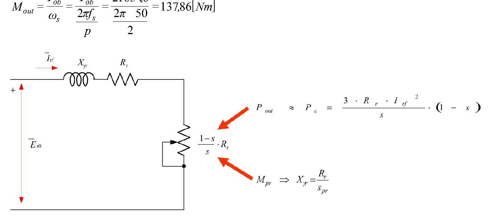

# Zadatak 41 — Izlazna snaga i moment kliznokolutnog motora iz rotorskih veličina

## Postavka

Trofazni kliznokolutni asinhroni motor priključen je na mrežu napona $380\ \mathrm{V}$ i frekvencije $50\ \mathrm{Hz}$. Motor je četvoropolni, koeficijent transformacije mu je $2$, statorski namotaji su spregnuti u trougao, a rotorski namotaji su spregnuti u zvezdu i kratko su spojeni. Induktivni (rasipni) otpor rotora iznosi $1\ \Omega$. Zna se da motor razvija maksimalni moment kada je frekvencija rotorskih veličina $10\ \mathrm{Hz}$. Koliko iznose proizvedena (korisna, izlazna) snaga i moment motora pri klizanju od $5\%$?

> **Prevod na običan jezik:** Imamo asinhroni motor kod koga rotor nije kavezni, nego ima prave namotaje izvedene na klizne kolutove (prstenove) — zato se zove *kliznokolutni*. Ti rotorski namotaji su ovde kratko spojeni, pa se motor ponaša kao običan asinhroni motor. Ne znamo mu otpornost rotora direktno, ali nam je dat jedan zaobilazni podatak: pri kojoj rotorskoj frekvenciji motor daje najveći (prevalni) moment. Iz tog podatka ćemo prvo "izvući" otpornost rotora, zatim ćemo iz napona mreže i koeficijenta transformacije naći koliki se napon indukuje u rotoru, pa ćemo iz rotorskog kola izračunati struju rotora pri klizanju $5\%$. Iz struje rotora slede snaga koju obrtno polje prenosi na rotor, korisna (izlazna) snaga na vratilu i, na kraju, moment.

## Podaci

| Veličina | Oznaka | Vrednost | Šta ta veličina fizički znači |
|---|---|---|---|
| Linijski napon mreže | $U_{sl}$ | $380\ \mathrm{V}$ | Napon između dva fazna provodnika mreže na koju je priključen stator. |
| Frekvencija mreže (statora) | $f_s$ | $50\ \mathrm{Hz}$ | Učestanost napona i struja u statorskim namotajima; određuje brzinu obrtnog polja. |
| Klizanje u radnoj tački | $s$ | $5\% = 0{,}05$ | Relativno zaostajanje rotora za obrtnim poljem (definicija u mini-lekciji 1). |
| Broj polova | $2p = 4$ (tj. $p = 2$ pari polova) | — | Koliko magnetnih polova obrtno polje ima po obimu mašine; određuje sinhronu brzinu. |
| Koeficijent transformacije | $m$ | $2$ | Odnos fazne indukovane elektromotorne sile (EMS) statora i rotora pri ukočenom rotoru — kao odnos transformacije kod transformatora. |
| Sprega statora | trougao ($\Delta$) | — | Svaki fazni namotaj statora vezan je direktno između dva linijska provodnika. |
| Sprega rotora | zvezda (Y), kratko spojen | — | Rotorski namotaji vezani u zvezdu, a krajevi (preko kolutova) kratko spojeni — kroz njih se struja zatvara. |
| Rasipna (induktivna) reaktansa rotora | $X_{\gamma r}$ | $1\ \Omega$ | Otpor koji rasipni magnetni fluks rotorskog namotaja pruža naizmeničnoj struji, izražen pri statorskoj frekvenciji $f_s$ (tj. pri ukočenom rotoru). |
| Rotorska frekvencija pri maksimalnom momentu | $f_{r,\max}$ | $10\ \mathrm{Hz}$ | Učestanost rotorskih struja u trenutku kada motor razvija najveći mogući moment. |

## Šta se traži i zašto

**1) Izlazna (korisna) snaga $P_{out}$.** To je mehanička snaga koju motor predaje na vratilu pogonjenoj radnoj mašini — jedina snaga koja "izlazi napolje" i zbog koje motor uopšte kupujemo. Inženjera zanima da li će motor u datoj radnoj tački (klizanje $5\%$) dati dovoljno snage za pogon.

**2) Izlazni moment $M_{out}$.** To je obrtni moment na vratilu — "sila okretanja". Radna mašina (pumpa, ventilator, dizalica...) zahteva određeni moment; motor mora da ga proizvede da bi se osovina okretala datom brzinom.

**Plan rešavanja, običnim jezikom:**
1. Iz rotorske frekvencije pri maksimalnom momentu ($10\ \mathrm{Hz}$) izračunamo *prevalno klizanje* $s_{pr}$ — klizanje pri kome je moment najveći.
2. Iz uslova maksimalnog momenta "izvučemo" otpornost rotorskog namotaja $R_r$, koja nije direktno data.
3. Iz sprege statora (trougao) i koeficijenta transformacije nađemo faznu EMS rotora pri ukočenom rotoru, $E_{r0}$.
4. Iz ekvivalentnog kola rotora izračunamo struju rotora $I_r$ pri klizanju $s = 0{,}05$.
5. Iz struje rotora dobijemo snagu obrtnog polja $P_{ob}$, iz nje izlaznu snagu $P_{out} = (1-s)\,P_{ob}$, i na kraju moment $M_{out} = P_{out}/\omega$.

## Potrebna teorija — mini-lekcije

### Mini-lekcija 1: Klizanje i rotorska frekvencija

Trofazne struje statora stvaraju **obrtno magnetno polje** koje se okreće *sinhronom brzinom* $n_s$. Rotor se okreće brzinom $n$ koja je kod motora uvek malo manja od $n_s$ — kada bi rotor sustigao polje, polje se u odnosu na njega ne bi menjalo, ne bi bilo indukovanja, ne bi bilo struje ni momenta. **Klizanje** je relativna mera tog zaostajanja:

$$s = \frac{n_s - n}{n_s}$$

- $s$ — klizanje (bezdimenzioni broj; kod motora u normalnom radu tipično $0{,}01$ do $0{,}06$),
- $n_s$ — sinhrona brzina (brzina obrtnog polja),
- $n$ — stvarna brzina rotora.

Polje se u odnosu na *rotor* okreće razlikom brzina $n_s - n = s \cdot n_s$. Pošto je učestanost indukovanih veličina srazmerna relativnoj brzini polja, u rotoru se indukuju napon i struja učestanosti:

$$f_r = s \cdot f_s$$

- $f_r$ — frekvencija rotorskih veličina (napona i struja),
- $f_s$ — frekvencija statorskih veličina (mreže).

**Intuicija:** pri ukočenom rotoru ($n=0$, $s=1$) polje "šiba" pored rotorskih provodnika punom brzinom, pa je $f_r = f_s$; što se rotor više približava sinhronoj brzini, polje ga sve sporije "pretiče", pa $f_r$ pada ka nuli. Ovaj odnos ćemo koristiti *unazad*: iz poznate rotorske frekvencije izračunaćemo klizanje.

### Mini-lekcija 2: Broj polova, sinhrona brzina i ugaone brzine

Obrtno polje mašine sa $p$ *pari* polova napravi jedan pun mehanički obrtaj za $p$ perioda mrežnog napona. Zato je sinhrona brzina:

$$n_s = \frac{60 \cdot f_s}{p}\ \left[\frac{\mathrm{ob}}{\mathrm{min}}\right], \qquad \omega_s = \frac{2\pi f_s}{p}\ \left[\frac{\mathrm{rad}}{\mathrm{s}}\right]$$

- $p$ — broj **pari** polova (pažnja: "četvoropolni motor" znači $2p = 4$, dakle $p = 2$!),
- $\omega_s$ — sinhrona *ugaona* brzina u radijanima u sekundi (mehanička).

Rotor se okreće ugaonom brzinom:

$$\omega = (1-s)\,\omega_s$$

što sledi direktno iz definicije klizanja: $s = (n_s-n)/n_s \Rightarrow n = (1-s)\,n_s$, a ugaona brzina je srazmerna brzini obrtaja ($\omega = 2\pi n/60$).

Za naš motor: $n_s = 60 \cdot 50 / 2 = 1500\ \mathrm{ob/min}$, a pri $s = 0{,}05$ rotor se vrti sa $n = 0{,}95 \cdot 1500 = 1425\ \mathrm{ob/min}$.

### Mini-lekcija 3: Kliznokolutni motor i koeficijent transformacije

Asinhroni motor je u suštini **transformator sa obrtnim sekundarom**: statorski namotaj je "primar", rotorski namotaj "sekundar", a energija se prenosi preko zajedničkog magnetnog polja. Pri **ukočenom rotoru** ($n = 0$) analogija je potpuna — u oba namotaja indukuju se EMS iste frekvencije, a njihov odnos zavisi samo od brojeva navojaka (i navojnih sačinilaca). **Koeficijent transformacije** definiše se kao odnos *faznih* indukovanih elektromotornih sila statora i rotora pri ukočenom rotoru:

$$m = \frac{E_s}{E_{r0}} \quad\Rightarrow\quad E_{r0} = \frac{E_s}{m}$$

- $E_s$ — fazna EMS indukovana u statorskom namotaju,
- $E_{r0}$ — fazna EMS indukovana u rotorskom namotaju **pri ukočenom rotoru** (indeks $0$ podseća: pri $n = 0$, tj. $s = 1$),
- $m$ — koeficijent transformacije (ovde $m = 2$: stator ima "dvostruko jači" namotaj od rotora).

Kada se rotor okreće sa klizanjem $s$, indukovana EMS rotora *opada* srazmerno klizanju (jer polje sporije seče rotorske provodnike): $E_r = s \cdot E_{r0}$. To ćemo iskoristiti u mini-lekciji 5.

### Mini-lekcija 4: Sprega trougao — fazni napon jednak linijskom

Kod sprege **trougao** ($\Delta$) svaki fazni namotaj je vezan *direktno između dva linijska provodnika*. Zato je napon na faznom namotaju jednak linijskom (međufaznom) naponu mreže:

$$U_{sf} = U_{sl}$$

- $U_{sf}$ — fazni napon statora (napon na jednom namotaju),
- $U_{sl}$ — linijski napon mreže.

(Za poređenje: kod sprege *zvezda* bilo bi $U_{sf} = U_{sl}/\sqrt{3}$ — česta zamka!)

Dodatno, kada zanemarimo otpornost i rasipnu reaktansu statora (u ovom zadatku ti podaci i nisu dati), ceo priključeni fazni napon "padne" na indukovanu EMS statora:

$$E_s \approx U_{sf}$$

**Zašto smemo da zanemarimo:** pad napona na statorskoj impedansi je u normalnom radu svega nekoliko procenata napona; kada podataka nema, ovo je standardna inženjerska aproksimacija.

### Mini-lekcija 5: Ekvivalentno kolo rotora i struja rotora

Posmatrajmo jednu fazu kratkospojenog rotorskog namotaja dok se rotor okreće sa klizanjem $s$. U njoj deluju:

- indukovana EMS: $E_r = s \cdot E_{r0}$ (opada sa klizanjem, videti mini-lekciju 3),
- otpornost namotaja: $R_r$ (ne zavisi od frekvencije),
- rasipna reaktansa: pošto je reaktansa srazmerna frekvenciji ($X = 2\pi f L$), a rotorska frekvencija je $f_r = s f_s$, reaktansa pri klizanju $s$ iznosi $s \cdot X_{\gamma r}$, gde je $X_{\gamma r}$ vrednost pri statorskoj frekvenciji (tj. pri ukočenom rotoru) — upravo taj $X_{\gamma r} = 1\ \Omega$ je dat u zadatku.

Struja rotora je (Omov zakon za redno R-X kolo, gde se moduo impedanse računa kao $\sqrt{R^2+X^2}$):

$$I_r = \frac{s\,E_{r0}}{\sqrt{R_r^2 + (s\,X_{\gamma r})^2}}$$

Sada uradimo ključni algebarski trik: podelimo i brojilac i imenilac sa $s$ (za $s > 0$ to ne menja vrednost razlomka). Brojilac postaje $s E_{r0}/s = E_{r0}$. Imenilac delimo tako što $s$ "uvučemo" pod koren kao $s^2$:

$$\frac{\sqrt{R_r^2 + (s X_{\gamma r})^2}}{s} = \sqrt{\frac{R_r^2 + s^2 X_{\gamma r}^2}{s^2}} = \sqrt{\frac{R_r^2}{s^2} + X_{\gamma r}^2} = \sqrt{\left(\frac{R_r}{s}\right)^2 + X_{\gamma r}^2}$$

pa dobijamo:

$$I_r = \frac{E_{r0}}{\sqrt{\left(\dfrac{R_r}{s}\right)^2 + X_{\gamma r}^2}}$$

**Šta smo time dobili:** kolo u kome figuriše *puna* EMS $E_{r0}$ i *stalna* reaktansa $X_{\gamma r}$, a sva zavisnost od klizanja se "preselila" u otpornost $R_r/s$. To je čuveno **ekvivalentno kolo rotora asinhronog motora**.

Sledeća slika prikazuje upravo to kolo, onako kako ga daje zbirka. Čitaj je ovako: levo je naponski izvor $\overline{E}_{r0}$ (fazna EMS rotora pri ukočenom rotoru); kroz kolo teče struja rotora $\overline{I}_{rf}$; redno su vezani rasipna reaktansa $X_{\gamma r}$, otpornost namotaja $R_r$ i *promenljivi* otpornik $\frac{1-s}{s}R_r$ (nacrtan sa klizačem, jer mu vrednost zavisi od klizanja). Zbir dva otpornika je tačno $R_r/s$. Crvene strelice-napomene na slici kazuju dve stvari koje ćemo koristiti u rešenju: da je izlazna snaga približno $P_{out} \approx P_c = \frac{3 R_r I_{rf}^2}{s}(1-s)$ (snaga na promenljivom otporniku, videti mini-lekciju 6) i da se maksimalni (prevalni) moment $M_{pr}$ javlja kada je $X_{\gamma r} = \dfrac{R_r}{s_{pr}}$ (videti mini-lekciju 8).

**Slika 41.1 —** Ekvivalentno kolo rotora asinhronog motora. Ukupna otpornost kola je $R_r/s$, rastavljena na $R_r$ (stvarni gubici u bakru rotora) i $\frac{1-s}{s}R_r$ (fiktivni otpornik koji predstavlja mehaničku snagu predatu vratilu).

*Napomena o oznaci:* ako bismo hteli da u ovom rotorskom kolu uračunamo i uticaj statorskog rasipanja, statorsku rasipnu reaktansu treba "prevesti" (svesti) na rotorsku stranu — tu svedenu vrednost obeležavamo sa $X''_{\gamma s}$ (dva prima označavaju svođenje na rotor). Tada se u imeniocu formule za struju umesto $X_{\gamma r}$ piše zbir $X''_{\gamma s} + X_{\gamma r}$. Zbirka u ovom zadatku pretpostavlja da su te dve reaktanse jednake: $X''_{\gamma s} = X_{\gamma r} = 1\ \Omega$.

### Mini-lekcija 6: Bilans snaga — snaga obrtnog polja, gubici u bakru rotora, izlazna snaga

**Snaga obrtnog polja** $P_{ob}$ (zove se i snaga vazdušnog zazora) je ukupna snaga koju obrtno polje elektromagnetnim putem prenese sa statora na rotor. U ekvivalentnom kolu sa slike 41.1 to je snaga koja se razvija na *celokupnoj* otpornosti $R_r/s$, za sve tri faze:

$$P_{ob} = 3\,I_r^2\,\frac{R_r}{s}$$

Ta snaga se u rotoru deli na dva dela, tačno po podeli otpornika $\dfrac{R_r}{s} = R_r + \dfrac{1-s}{s}R_r$ (proveri sabiranjem: $R_r + \frac{1-s}{s}R_r = R_r\frac{s + 1 - s}{s} = \frac{R_r}{s}$ ✓):

1. **Gubici u bakru rotora** (na stvarnoj otpornosti $R_r$ — greju namotaj):
$$P_{Cur} = 3\,I_r^2\,R_r = s \cdot P_{ob}$$
2. **Mehanička snaga** (na fiktivnom otporniku $\frac{1-s}{s}R_r$ — to je snaga koja se pretvara u mehanički rad na vratilu):
$$P_{meh} = 3\,I_r^2\,\frac{1-s}{s}R_r = (1-s) \cdot P_{ob}$$

**Zapamti kao pravilo:** od snage koja pređe vazdušni zazor, deo $s$ ode u toplotu rotora, a deo $(1-s)$ postane mehanička snaga. Zato je malo klizanje dobro — manji deo snage se "baca" na grejanje.

**Izlazna (korisna) snaga** dobila bi se kada od mehaničke snage oduzmemo još i mehaničke gubitke (trenje u ležajevima, ventilacija). Kako podaci o mehaničkim gubicima u ovom zadatku nisu dati, zbirka ih zanemaruje i izlaznu snagu *procenjuje* na:

$$P_{out} \approx P_{meh} = (1-s)\,P_{ob}$$

### Mini-lekcija 7: Moment iz snage

Osnovna veza mehanike: snaga je moment puta ugaona brzina, $P = M \cdot \omega$. Odatle moment na vratilu:

$$M_{out} = \frac{P_{out}}{\omega} = \frac{P_{out}}{(1-s)\,\omega_s}$$

- $\omega = (1-s)\,\omega_s$ — stvarna ugaona brzina rotora (mini-lekcija 2).

Postoji i drugi, ravnopravan put — preko **elektromagnetnog momenta**. Elektromagnetni moment je moment koji polje razvija na rotoru i on je jednak snazi obrtnog polja podeljenoj *sinhronom* brzinom:

$$M = \frac{P_{ob}}{\omega_s}$$

Da su ta dva puta ista stvar (kada su mehanički gubici zanemareni), vidi se za dva reda algebre — uvrstimo $P_{out} = (1-s)P_{ob}$ i $\omega = (1-s)\omega_s$:

$$M_{out} = \frac{(1-s)\,P_{ob}}{(1-s)\,\omega_s} = \frac{P_{ob}}{\omega_s}$$

Član $(1-s)$ se skrati. **Intuicija:** razlika između $P_{ob}$ i $P_{out}$ (gubici u bakru rotora) tačno odgovara razlici između $\omega_s$ i $\omega$ (klizanju), pa količnik ostaje isti.

### Mini-lekcija 8: Prevalno klizanje i maksimalni moment

Moment asinhronog motora zavisi od klizanja: pri malom $s$ moment raste sa klizanjem, dostiže **maksimalni (prevalni) moment** $M_{pr}$ pri **prevalnom klizanju** $s_{pr}$, pa zatim opada. Zbirka kaže da se $s_{pr}$ dobija iz uslova $dM(s)/ds = 0$ (tačka maksimuma funkcije). Evo tog izvođenja, sprovedeno bez izvoda, elementarnom nejednakošću.

Krenimo od momenta preko snage obrtnog polja (mini-lekcije 6 i 7) i uvrstimo izraz za struju iz mini-lekcije 5 (sa ukupnom reaktansom $X$, gde je $X$ ili samo $X_{\gamma r}$, ili $X''_{\gamma s} + X_{\gamma r}$ ako uračunavamo i statorsko rasipanje; statorsku *otpornost* zanemarujemo):

$$M = \frac{P_{ob}}{\omega_s} = \frac{3}{\omega_s}\,I_r^2\,\frac{R_r}{s} = \frac{3}{\omega_s} \cdot \frac{E_{r0}^2}{\left(\frac{R_r}{s}\right)^2 + X^2} \cdot \frac{R_r}{s}$$

Uvedimo smenu $x = \dfrac{R_r}{s}$ (velika vrednost $x$ = malo klizanje). Moment postaje:

$$M = \frac{3\,E_{r0}^2}{\omega_s} \cdot \frac{x}{x^2 + X^2} = \frac{3\,E_{r0}^2}{\omega_s} \cdot \frac{1}{x + \dfrac{X^2}{x}}$$

(u poslednjem koraku smo brojilac i imenilac podelili sa $x$). Moment je najveći kada je imenilac $x + \frac{X^2}{x}$ najmanji. Za pozitivne brojeve važi nejednakost između aritmetičke i geometrijske sredine: $a + b \ge 2\sqrt{ab}$, sa jednakošću kada je $a = b$. Ovde:

$$x + \frac{X^2}{x} \ \ge\ 2\sqrt{x \cdot \frac{X^2}{x}} = 2X$$

sa jednakošću (tj. minimumom imenioca, tj. maksimumom momenta) tačno kada je $x = \dfrac{X^2}{x}$, odnosno $x = X$. Vraćanjem smene $x = R_r/s$:

$$\frac{R_r}{s_{pr}} = X \quad\Longrightarrow\quad s_{pr} = \frac{R_r}{X}$$

**Rečima:** motor daje najveći moment pri onom klizanju kod koga otpornost $R_r/s$ postane jednaka ukupnoj reaktansi kola. Ovaj uslov je zlata vredan u zadacima: ako znamo $s_{pr}$ i reaktansu, odmah znamo $R_r$ — upravo to ćemo uraditi u Koraku 2.

## Rešenje, korak po korak

### Korak 1: Prevalno klizanje iz rotorske frekvencije

**Zašto ovaj korak:** Jedini podatak o "jačini" rotorskog otpora je posredan — rotorska frekvencija pri maksimalnom momentu. Prvo je prevodimo u klizanje, jer sve formule rade sa klizanjem.

Iz mini-lekcije 1 znamo $f_r = s \cdot f_s$. Maksimalni moment se javlja pri prevalnom klizanju $s_{pr}$, pa je rotorska frekvencija u tom trenutku $f_{r,\max} = s_{pr} \cdot f_s$. Rešimo po $s_{pr}$ (podelimo obe strane sa $f_s$):

$$s_{pr} = \frac{f_{r,\max}}{f_s} = \frac{10\ \mathrm{Hz}}{50\ \mathrm{Hz}} = 0{,}2$$

**Šta smo dobili:** prevalno klizanje od $20\%$ — tipična vrednost za asinhrone motore (obično $0{,}1$–$0{,}3$). Naša radna tačka $s = 0{,}05$ je znatno ispod $s_{pr}$, dakle motor radi u normalnom, stabilnom delu momentne karakteristike.

### Korak 2: Otpornost rotorskog namotaja iz uslova maksimalnog momenta

**Zašto ovaj korak:** Otpornost rotora $R_r$ nije data, a bez nje ne možemo izračunati ni struju ni snagu. Uslov maksimalnog momenta iz mini-lekcije 8 povezuje $s_{pr}$, $R_r$ i reaktansu — a $s_{pr}$ i reaktansu sada znamo.

Uslov sa slike 41.1 (maksimalni moment u rotorskom kolu, u kome je jedina reaktansa rotorska $X_{\gamma r}$):

$$s_{pr} = \frac{R_r}{X_{\gamma r}} \quad\Longrightarrow\quad R_r = s_{pr} \cdot X_{\gamma r} = 0{,}2 \cdot 1\ \Omega = 0{,}2\ \Omega$$

> **Napomena o originalu:** Zbirka je na ovom mestu unutar sebe protivrečna, pa da raščistimo. U tekstu rešenja zbirka piše uslov sa *ukupnom* reaktansom, $s_{pr} = \dfrac{R_r}{X''_{\gamma s} + X_{\gamma r}}$, uz pretpostavku $X''_{\gamma s} = X_{\gamma r} = 1\ \Omega$, i iz njega dobija $R_r = 0{,}2\cdot(1+1) = 0{,}4\ \Omega$. Međutim, u **svim daljim brojevima** zbirka koristi $R_r = 0{,}2\ \Omega$ (u formuli za struju stoji $0{,}2/0{,}05$, u snazi $0{,}2/0{,}05$), što odgovara uslovu sa slike 41.1: $X_{\gamma r} = R_r/s_{pr} \Rightarrow R_r = 0{,}2\ \Omega$. Vrednost $0{,}4\ \Omega$ se posle tog jednog reda nigde ne pojavljuje. Da bi se konačni rezultati poklopili sa zbirkom, i mi nastavljamo sa $R_r = 0{,}2\ \Omega$. Pošteno je reći i sledeće: zbirka pri računanju struje (Korak 4) ipak zadržava ukupnu reaktansu $X''_{\gamma s} + X_{\gamma r} = 2\ \Omega$, iako je $R_r$ određeno kao da statorskog rasipanja nema — pretpostavke, dakle, nisu sprovedene jednoobrazno. Kada bi se sprovele dosledno, dobilo bi se: (varijanta A) $R_r = 0{,}4\ \Omega$ i $X = 2\ \Omega$ u oba koraka $\Rightarrow$ $I_r = 23{,}04\ \mathrm{A}$, $P_{out} \approx 12{,}1\ \mathrm{kW}$, $M_{out} \approx 81{,}1\ \mathrm{Nm}$; (varijanta B) $R_r = 0{,}2\ \Omega$ i $X = 1\ \Omega$ u oba koraka $\Rightarrow$ $I_r = 46{,}08\ \mathrm{A}$, $P_{out} \approx 24{,}2\ \mathrm{kW}$, $M_{out} \approx 162{,}2\ \mathrm{Nm}$. Mi u nastavku verno pratimo brojni tok zbirke ($R_r = 0{,}2\ \Omega$, $X = 2\ \Omega$), da bi se svaki broj poklopio sa originalom.

**Šta smo dobili:** $R_r = 0{,}2\ \Omega$ — mala otpornost, kakva i priliči rotorskom namotaju (debeli provodnici, kratke veze); ona je petina rotorske reaktanse, u skladu sa $s_{pr} = 0{,}2$.

### Korak 3: Fazni napon statora i statorska EMS

**Zašto ovaj korak:** Do rotorske EMS stižemo preko statorske EMS, a statorska EMS zavisi od faznog napona — koji zavisi od sprege.

Statorski namotaji su u sprezi **trougao**, pa je fazni napon jednak linijskom (mini-lekcija 4). Uz zanemarenje pada napona na statorskoj otpornosti i rasipnoj reaktansi (podaci nisu dati), sav priključeni napon indukuje se kao EMS statora:

$$E_s \approx U_{sf} = U_{sl} = 380\ \mathrm{V}$$

**Šta smo dobili:** fazna EMS statora od $380\ \mathrm{V}$. Da je sprega bila zvezda, bilo bi $380/\sqrt{3} \approx 219{,}4\ \mathrm{V}$ — sprega, dakle, bitno menja brojeve, i zato je zadata.

### Korak 4: Rotorska EMS pri ukočenom rotoru

**Zašto ovaj korak:** Struja u rotorskom kolu (slika 41.1) tera se elektromotornom silom $E_{r0}$ — nju dobijamo iz statorske EMS preko koeficijenta transformacije (mini-lekcija 3).

$$E_{r0} = E_s \cdot \frac{1}{m} = 380\ \mathrm{V} \cdot \frac{1}{2} = 190\ \mathrm{V}$$

**Šta smo dobili:** u rotorskom namotaju se pri ukočenom rotoru indukuje $190\ \mathrm{V}$ po fazi — upola manje nego u statoru, jer rotor ima upola "slabiji" namotaj ($m = 2$). Pri radnom klizanju stvarna EMS je samo $s \cdot E_{r0} = 0{,}05 \cdot 190 = 9{,}5\ \mathrm{V}$, ali u ekvivalentnom kolu radimo sa punih $190\ \mathrm{V}$ i otpornošću $R_r/s$ (algebarski trik iz mini-lekcije 5).

### Korak 5: Struja rotora pri klizanju 5%

**Zašto ovaj korak:** Sva snaga i sav moment "žive" u struji rotora — bez nje ne možemo dalje.

Formula iz mini-lekcije 5, u obliku koji koristi zbirka (sa ukupnom reaktansom $X''_{\gamma s} + X_{\gamma r} = 1 + 1 = 2\ \Omega$, tj. uračunatom procenjenom statorskom rasipnom reaktansom svedenom na rotor — videti Napomenu u Koraku 2):

$$I_r = \frac{E_{r0}}{\sqrt{\left(\dfrac{R_r}{s}\right)^2 + \left(X''_{\gamma s} + X_{\gamma r}\right)^2}}$$

Prvo izračunajmo ekvivalentnu otpornost:

$$\frac{R_r}{s} = \frac{0{,}2\ \Omega}{0{,}05} = 4\ \Omega$$

Zatim imenilac, deo po deo: $\left(4\right)^2 = 16$; $\left(1+1\right)^2 = 2^2 = 4$; zbir $16 + 4 = 20$; koren $\sqrt{20} \approx 4{,}472$. Dakle:

$$I_r = \frac{190\ \mathrm{V}}{\sqrt{\left(\dfrac{0{,}2}{0{,}05}\right)^2 + (1+1)^2}\ \Omega} = \frac{190}{\sqrt{16+4}} = \frac{190}{4{,}472} \approx 42{,}48\ \mathrm{A}$$

**Šta smo dobili:** struju rotora od oko $42{,}5\ \mathrm{A}$ po fazi. Primeti da otpornički deo imenioca ($4\ \Omega$) dominira nad reaktivnim ($2\ \Omega$) — to je odlika rada pri malom klizanju i znači da rotorska struja ima dobar faktor snage.

### Korak 6: Snaga obrtnog polja

**Zašto ovaj korak:** Snaga obrtnog polja je "ulazna" snaga rotora — iz nje se granaju i gubici i korisna snaga (mini-lekcija 6).

$$P_{ob} = 3 \cdot I_r^2 \cdot \frac{R_r}{s}$$

Uvrstimo brojeve ($I_r = 42{,}48\ \mathrm{A}$, $R_r/s = 4\ \Omega$), korak po korak: $I_r^2 = 42{,}48^2 = 1804{,}55$; puta $3$ daje $5413{,}65$; puta $4$:

$$P_{ob} = 3 \cdot 42{,}48^2 \cdot \frac{0{,}2}{0{,}05} = 3 \cdot 1804{,}55 \cdot 4 \approx 21654{,}6\ \mathrm{W}$$

*(Sitnica oko zaokruživanja: ako se struja ne zaokruži na $42{,}48$ nego zadrži tačna, $I_r^2 = 190^2/20 = 1805$ tačno, pa je $P_{ob} = 21660\ \mathrm{W}$. Zbirka kvadrira zaokruženu struju i dobija $21654{,}6\ \mathrm{W}$ — razlika od $0{,}02\%$ je čisto računske prirode; zadržavamo vrednost zbirke.)*

**Šta smo dobili:** obrtno polje prenosi na rotor oko $21{,}65\ \mathrm{kW}$ — solidna snaga, u redu veličine za motor koji na 380 V vuče četrdesetak ampera po rotorskoj fazi.

### Korak 7: Izlazna (korisna) snaga

**Zašto ovaj korak:** Od snage obrtnog polja treba oduzeti gubitke u bakru rotora i mehaničke gubitke da bi se dobilo ono što stvarno izlazi na vratilo. Mehanički gubici nisu dati, pa ih zanemarujemo (mini-lekcija 6) — zato je ovo *procena* izlazne snage.

$$P_{out} = P_{ob} \cdot (1-s) = 21654{,}6 \cdot (1 - 0{,}05) = 21654{,}6 \cdot 0{,}95 \approx 20571{,}9\ \mathrm{W}$$

**Šta smo dobili:** korisna snaga oko $20{,}6\ \mathrm{kW}$. Razlika do $P_{ob}$ je $s \cdot P_{ob} = 0{,}05 \cdot 21654{,}6 \approx 1082{,}7\ \mathrm{W}$ — to su gubici u bakru rotora, svega $5\%$ prenete snage, tačno koliko iznosi klizanje.

### Korak 8: Izlazni moment

**Zašto ovaj korak:** Ovo je druga tražena veličina. Moment dobijamo iz snage i ugaone brzine (mini-lekcija 7) — na dva ravnopravna načina, koji moraju dati isti broj (dobra samoprovera).

**Prvi način — izlazna snaga kroz stvarnu brzinu obrtanja.** Prvo sinhrona ugaona brzina (mini-lekcija 2, $p = 2$ para polova jer je motor četvoropolni):

$$\omega_s = \frac{2\pi f_s}{p} = \frac{2\pi \cdot 50}{2} = 157{,}08\ \frac{\mathrm{rad}}{\mathrm{s}}$$

Stvarna ugaona brzina rotora:

$$\omega = (1-s)\,\omega_s = 0{,}95 \cdot 157{,}08 = 149{,}23\ \frac{\mathrm{rad}}{\mathrm{s}}$$

Moment:

$$M_{out} = \frac{P_{out}}{\omega} = \frac{P_{out}}{(1-s)\,\omega_s} = \frac{20571{,}9}{(1-0{,}05) \cdot \dfrac{2\pi \cdot 50}{2}} = \frac{20571{,}9}{149{,}23} \approx 137{,}86\ \mathrm{Nm}$$

**Drugi način — snaga obrtnog polja kroz sinhronu brzinu.** Prema mini-lekciji 7, elektromagnetni moment (jednak izlaznom kada su mehanički gubici zanemareni) je:

$$M_{out} = \frac{P_{ob}}{\omega_s} = \frac{P_{ob}}{\dfrac{2\pi f_s}{p}} = \frac{21654{,}6}{\dfrac{2\pi \cdot 50}{2}} = \frac{21654{,}6}{157{,}08} \approx 137{,}86\ \mathrm{Nm}$$

**Šta smo dobili:** oba puta $M_{out} \approx 137{,}86\ \mathrm{Nm}$ — poklapanje potvrđuje algebru iz mini-lekcije 7 (član $(1-s)$ se skrati). Moment od ~138 Nm pri ~20,6 kW i 1425 ob/min je fizički usklađen skup brojeva.

## Česte greške i zamke

1. **Broj polova ≠ broj pari polova.** "Četvoropolni motor" znači $2p = 4$, dakle $p = 2$. Ko uvrsti $p = 4$ dobije $\omega_s = 78{,}54\ \mathrm{rad/s}$ i duplo veći moment ($\approx 275{,}7\ \mathrm{Nm}$) — pogrešno.
2. **Sprega trougao.** Kod trougla je $U_{sf} = U_{sl} = 380\ \mathrm{V}$. Refleksno deljenje sa $\sqrt{3}$ (kao kod zvezde) daje $E_{r0} = 109{,}7\ \mathrm{V}$ i sve rezultate manje za faktor 3 kod snaga — pogrešno.
3. **Nedosledne pretpostavke o reaktansama.** Uslov maksimalnog momenta i formula za struju moraju koristiti *istu* ukupnu reaktansu. Upravo na tome se i sama zbirka "okliznula" (videti Napomenu u Koraku 2): $R_r$ je određeno iz $X = 1\ \Omega$, a struja računata sa $X = 2\ \Omega$. Na ispitu jasno napiši koju pretpostavku koristiš i sprovedi je od početka do kraja.
4. **Množenje umesto deljenja koeficijentom transformacije.** $E_{r0} = E_s/m = 190\ \mathrm{V}$, nikako $E_s \cdot m = 760\ \mathrm{V}$. Rotor ima manje navojaka, pa mu je EMS *manja*.
5. **$R_r$ umesto $R_r/s$ u ekvivalentnom kolu.** U kolu sa punom EMS $E_{r0}$ figuriše otpornost $R_r/s$ (i *nesmanjena* reaktansa $X$). Ko pomeša "sirovo" kolo ($sE_{r0}$, $R_r$, $sX_{\gamma r}$) i transformisano kolo ($E_{r0}$, $R_r/s$, $X_{\gamma r}$) dobija besmislice.
6. **Zamena uloga $s$ i $(1-s)$ u bilansu snaga.** Gubici u bakru rotora su $s \cdot P_{ob}$ (mali deo), mehanička snaga je $(1-s) \cdot P_{ob}$ (veliki deo). Obrnuta podela odmah pada na proveri smisla: motor koji 95% snage pretvara u toplotu ne bi bio motor nego grejalica.
7. **Deljenje pogrešnom brzinom.** $P_{out}$ ide sa stvarnom brzinom $\omega$, a $P_{ob}$ sa sinhronom $\omega_s$. Mešanje ($P_{out}/\omega_s$) daje $130{,}96\ \mathrm{Nm}$ — blizu, ali pogrešno.

## Rezime rezultata

| Veličina | Oznaka | Vrednost |
|---|---|---|
| Prevalno klizanje | $s_{pr}$ | $0{,}2$ |
| Otpornost rotorskog namotaja (po fazi) | $R_r$ | $0{,}2\ \Omega$ |
| Fazna EMS statora | $E_s$ | $380\ \mathrm{V}$ |
| Fazna EMS rotora pri ukočenom rotoru | $E_{r0}$ | $190\ \mathrm{V}$ |
| Struja rotora pri $s = 0{,}05$ | $I_r$ | $42{,}48\ \mathrm{A}$ |
| Snaga obrtnog polja | $P_{ob}$ | $21654{,}6\ \mathrm{W} \approx 21{,}65\ \mathrm{kW}$ |
| **Izlazna (korisna) snaga** | $P_{out}$ | $\approx 20571{,}9\ \mathrm{W} \approx 20{,}6\ \mathrm{kW}$ |
| **Izlazni moment** | $M_{out}$ | $\approx 137{,}86\ \mathrm{Nm}$ |

## Provera smisla

**1) Dimenziona analiza momenta.** $\dfrac{[\mathrm{W}]}{[\mathrm{rad/s}]} = \dfrac{\mathrm{J/s}}{1/\mathrm{s}} = \mathrm{J} = \mathrm{Nm}$ — vat kroz radijan u sekundi zaista daje njutnmetar. ✓

**2) Dva nezavisna puta do momenta.** $P_{out}/\omega = 20571{,}9/149{,}23 = 137{,}86\ \mathrm{Nm}$ i $P_{ob}/\omega_s = 21654{,}6/157{,}08 = 137{,}86\ \mathrm{Nm}$ — identično, kako teorija i zahteva. ✓

**3) Bilans snaga se zatvara.** Gubici u bakru rotora: $P_{Cur} = s \cdot P_{ob} = 0{,}05 \cdot 21654{,}6 = 1082{,}7\ \mathrm{W}$. Provera: $P_{out} + P_{Cur} = 20571{,}9 + 1082{,}7 = 21654{,}6\ \mathrm{W} = P_{ob}$ — nijedan vat se nije izgubio niti stvorio niotkuda. ✓

**4) Gruba provera preko statorske strane.** Struja rotora svedena na stator je približno $I_r/m = 42{,}48/2 = 21{,}24\ \mathrm{A}$ po statorskoj fazi. Faktor snage rotorskog kola: $\cos\varphi = \dfrac{R_r/s}{\sqrt{(R_r/s)^2 + X^2}} = \dfrac{4}{\sqrt{20}} \approx 0{,}894$. Ulazna snaga (uz zanemarene statorske gubitke i struju magnećenja): $P \approx 3 \cdot U_{sf} \cdot I_{sf} \cdot \cos\varphi = 3 \cdot 380 \cdot 21{,}24 \cdot 0{,}894 \approx 21{,}65\ \mathrm{kW}$ — poklapa se sa $P_{ob}$, kao što i mora kada su statorski gubici zanemareni. ✓

**5) Položaj radne tačke.** $s = 0{,}05 < s_{pr} = 0{,}2$ — motor radi u stabilnom delu momentne karakteristike (levo od prevala), gde asinhroni motori i treba da rade; brzina $n = 1425\ \mathrm{ob/min}$ je razumno malo ispod sinhrone $n_s = 1500\ \mathrm{ob/min}$. ✓
