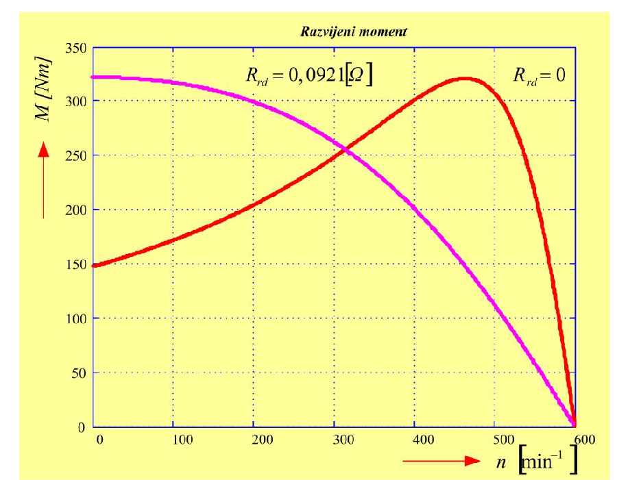
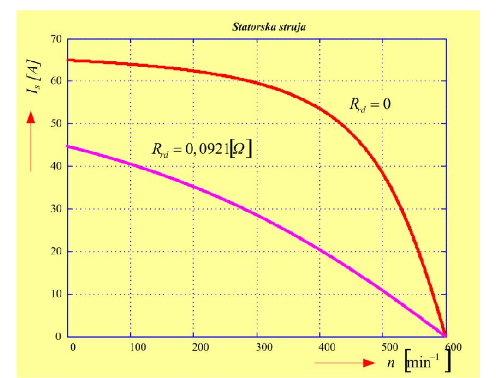
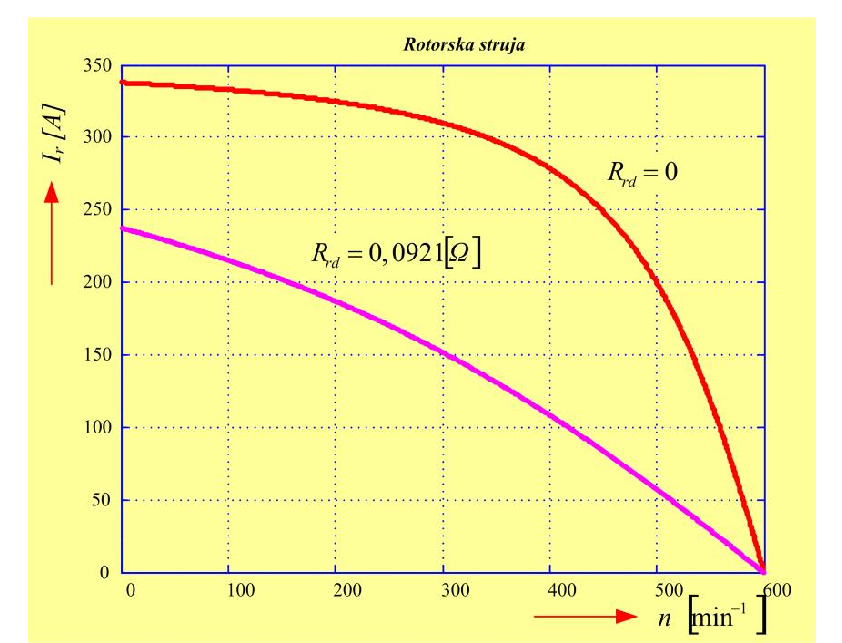
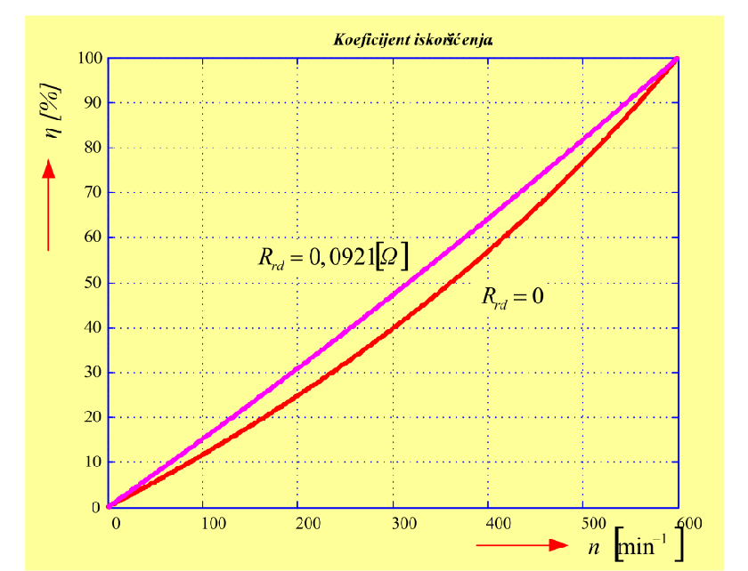

# Zadatak 42 — Puštanje u rad kliznokolutnog asinhronog motora: polazne struje, polazni moment, faktor snage i dodatni rotorski otpor za maksimalni polazni moment

## Postavka

Trofazni kliznokolutni asinhroni motor ima sledeće podatke:

- otpornost faznog namotaja statora $R_s = 0{,}38\ \mathrm{\Omega}$,
- otpornost faznog namotaja rotora $R_r = 0{,}027\ \mathrm{\Omega}$,
- rasipna reaktansa statora $X_{\gamma s} = 1{,}36\ \mathrm{\Omega}$,
- rasipna reaktansa rotora $X_{\gamma r} = 0{,}068\ \mathrm{\Omega}$,
- broj pari polova $p = 5$,
- napon napajanja $220\ \mathrm{V}$, učestanost $50\ \mathrm{Hz}$, sprega statora D (trougao),
- broj faza statora i rotora $q_s = q_r = 3$,
- koeficijent transformacije $m_e = 5{,}2$.

Zanemarujući struju praznog hoda, odrediti:

a) struje statora i rotora, moment i $\cos\varphi$ prilikom puštanja motora u rad sa kratkospojenim rotorom;

b) vrednost dodatnog otpora koji je neophodno priključiti u kolo rotora da bi se dobio maksimalan polazni moment;

c) struje statora i rotora, moment i $\cos\varphi$ pri polasku motora kada je priključen dodatni otpor.

> **Prevod na običan jezik:** Imamo asinhroni motor kod koga je i rotor namotan trofazno, a krajevi rotorskog namotaja su izvedeni na klizne kolutove — pa spolja možemo da dodamo otpornike u rotorsko kolo. Prvo treba da izračunamo šta se dešava kada motor uključimo direktno na mrežu sa kratkospojenim rotorom (kao da je običan kavezni motor): kolika struja poteče kroz stator i kroz rotor, koliki moment motor razvije u prvom trenutku i koliki mu je faktor snage. Zatim treba da nađemo koliki spoljašnji otpornik da ubacimo u rotor pa da polazni moment bude najveći mogući. Na kraju ponavljamo sve proračune iz tačke a), ali sada sa tim dodatnim otpornikom, da vidimo koliko smo dobili na momentu i koliko smo smanjili struju.

## Podaci

| Veličina | Oznaka | Vrednost | Šta ta veličina fizički znači |
|---|---|---|---|
| Otpornost statora | $R_s$ | $0{,}38\ \mathrm{\Omega}$ | Aktivna (omska) otpornost jednog faznog namotaja statora — u njoj nastaju Džulovi gubici statora. |
| Otpornost rotora | $R_r$ | $0{,}027\ \mathrm{\Omega}$ | Aktivna otpornost jednog faznog namotaja rotora, **stvarna** (merena na rotoru, još nesvedena na stator). |
| Rasipna reaktansa statora | $X_{\gamma s}$ | $1{,}36\ \mathrm{\Omega}$ | Reaktansa od fluksa statora koji se "rasipa", tj. ne obuhvata rotor pa ne učestvuje u prenosu energije. |
| Rasipna reaktansa rotora | $X_{\gamma r}$ | $0{,}068\ \mathrm{\Omega}$ | Isto to za rotor — stvarna (nesvedena) vrednost, pri učestanosti mreže. |
| Broj pari polova | $p$ | $5$ | Koliko pari magnetnih polova stvara statorski namotaj; određuje sinhronu brzinu. |
| Napon | $U$ | $220\ \mathrm{V}$ | Linijski napon mreže na koju se motor priključuje. |
| Učestanost | $f$ | $50\ \mathrm{Hz}$ | Učestanost mrežnog napona. |
| Sprega statora | D | trougao | Namotaji statora vezani u trougao — svaki fazni namotaj je direktno na linijskom naponu. |
| Broj faza | $q_s = q_r$ | $3$ | I stator i rotor su trofazni. |
| Koeficijent transformacije | $m_e$ | $5{,}2$ | Odnos efektivnih brojeva navojaka statora i rotora — kao prenosni odnos kod transformatora. |
| Struja praznog hoda | $I_0$ | zanemarena | Struja magnetisanja se ne uzima u obzir — grana magnetisanja u ekvivalentnoj šemi se briše. |

## Šta se traži i zašto

**a) Polazne struje statora i rotora ($I_{\mathrm{ps}}$, $I_{\mathrm{pr}}$), polazni moment ($M_{\mathrm{p}}$) i faktor snage ($\cos\varphi_{\mathrm{k}}$) sa kratkospojenim rotorom.**
U trenutku uključenja rotor stoji, pa je motor električno gledano u stanju *kratkog spoja* — struje su višestruko veće od nazivnih. Inženjer mora da zna kolika je ta struja (da li će izbaciti osigurače i pregrejati namotaje?), koliki je polazni moment (da li će motor uopšte pokrenuti teret?) i koliki je faktor snage (koliko "jalovo" motor opterećuje mrežu pri polasku).

**b) Dodatni rotorski otpor za maksimalni polazni moment ($R'_{rd}$ svedeno, $R_{rd}$ stvarno).**
Glavna prednost kliznokolutnog motora je što mu spolja možemo menjati rotorski otpor. Pravilno izabran dodatni otpor čini da motor krene sa *najvećim momentom koji uopšte može da razvije* — a usput i sa manjom strujom. Treba da izračunamo tačno koliki taj otpornik mora biti.

**c) Iste veličine kao pod a), ali sa priključenim dodatnim otporom.**
Da brojkama pokažemo šta smo dobili: koliko je porastao moment, koliko je pala struja i koliko se popravio faktor snage.

**Plan rešavanja:**
1. Izračunamo sinhronu brzinu $n_s$ i sinhronu ugaonu brzinu $\omega_s$ (trebaju za moment).
2. Svedemo rotorske parametre $R_r$ i $X_{\gamma r}$ na statorsku stranu (kao kod transformatora, množenjem sa $m_e^2$).
3. Iz ekvivalentne šeme za klizanje $s=1$ izračunamo polaznu struju statora, pa preko $m_e$ i struju rotora; iz izraza za moment izračunamo $M_{\mathrm{p}}$; iz odnosa otpora i impedanse kratkog spoja izračunamo $\cos\varphi_{\mathrm{k}}$.
4. Iz uslova da prevalno (najveće) klizanje bude jednako 1 izračunamo potrebni dodatni otpor, prvo sveden na stator, pa vraćen na stvarnu rotorsku vrednost.
5. Ponovimo proračun struja, momenta i faktora snage sa uvećanim rotorskim otporom i uporedimo.

## Potrebna teorija — mini-lekcije

### 1. Sinhrona brzina i klizanje

Trofazni statorski namotaj, napajan trofaznim naponom učestanosti $f$, stvara **obrtno magnetno polje** koje se okreće sinhronom brzinom:

$$n_s = \frac{60 f}{p}\ \left[\mathrm{min^{-1}}\right], \qquad \omega_s = \frac{2\pi}{60}\, n_s\ \left[\mathrm{rad/s}\right]$$

gde je $p$ broj pari polova. Rotor asinhronog motora se u motorskom režimu uvek okreće **sporije** od polja — upravo ta razlika brzina indukuje napone i struje u rotoru, a bez rotorskih struja nema ni momenta. Relativno zaostajanje rotora meri **klizanje**:

$$s = \frac{n_s - n}{n_s}$$

gde je $n$ brzina rotora. Dva granična slučaja koja nam trebaju u ovom zadatku: pri **polasku** rotor stoji, $n = 0$, pa je $s = 1$; pri sinhronoj brzini bilo bi $s = 0$ (i moment bi bio nula).

### 2. Kliznokolutni (klizno-kolutni) motor — čemu služe klizni kolutovi

Kod običnog **kaveznog** motora rotorski provodnici su štapovi kratko spojeni prstenovima — u rotorsko kolo se ne može ući spolja. Kod **kliznokolutnog** motora rotor nosi pravi trofazni namotaj čiji su krajevi izvedeni na tri klizna koluta (prstena) na osovini; preko četkica se na te kolutove spolja može priključiti trofazni otpornik. Kada se otpornik premosti (kratko spoji), motor se ponaša kao kavezni. Kada je otpornik uključen, ukupni otpor po fazi rotora je veći:

$$R'_r = R'_{r0} + R'_{rd}$$

gde je $R'_{r0}$ (svedeni) otpor samog rotorskog namotaja, a $R'_{rd}$ (svedeni) spoljašnji dodatni otpor. Dodatni otpornici se priključuju **tokom puštanja u rad** radi smanjenja polazne struje i/ili povećanja polaznog momenta — to je tačno ono što se u ovom zadatku računa.

### 3. Ekvivalentna šema po fazi i svođenje rotorskih veličina na stator

Asinhroni motor se analizira **po jednoj fazi**, preko ekvivalentne šeme koja liči na šemu transformatora: redna veza $R_s$ i $X_{\gamma s}$ na statorskoj strani, grana magnetisanja u sredini, pa redna veza svedenih rotorskih elemenata $X'_{\gamma r}$ i $R'_r/s$. Da bi se rotorske veličine smele crtati u istoj šemi sa statorskim, moraju se **svesti** na statorsku stranu — isto kao što se sekundar transformatora svodi na primar. Ako je $m_e$ koeficijent transformacije (odnos efektivnih brojeva navojaka statora i rotora), a $q_s$ i $q_r$ brojevi faza, važi:

$$R'_r = \frac{q_s}{q_r}\, m_e^2\, R_r, \qquad X'_{\gamma r} = \frac{q_s}{q_r}\, m_e^2\, X_{\gamma r}$$

Otpornosti i reaktanse se množe **kvadratom** koeficijenta transformacije (jer se napon svodi sa $m_e$, struja sa $1/m_e$, pa impedansa, kao njihov količnik, sa $m_e^2$). Faktor $q_s/q_r$ pokriva slučaj kada stator i rotor nemaju isti broj faza; kod nas je $q_s = q_r = 3$, pa je taj faktor jednak 1. Struje se svode obrnuto: stvarna struja rotora je **veća** od svedene:

$$I_r = \frac{q_s}{q_r}\, m_e\, I'_r$$

Intuicija: rotor ima manje navojaka od statora ($m_e = 5{,}2$ puta manje, efektivno), pa u njemu teče srazmerno veća struja pri nižem naponu — kao sekundar transformatora za velike struje.

U zadatku je rečeno da **zanemarujemo struju praznog hoda**, tj. struju magnetisanja. To znači da granu magnetisanja iz šeme brišemo — ostaje prosto redno kolo: $R_s$, $X_{\gamma s}$, $X'_{\gamma r}$, $R'_r/s$. Posledica: struja statora i svedena struja rotora su **jednake**, $I_s = I'_r$, jer teku kroz isto redno kolo.

### 4. Sprega D — koji napon ide u formule

Ekvivalentna šema je fazna, pa se u nju uvrštava **napon jednog faznog namotaja statora**, $U_{sf}$. Kod sprege D (trougao) svaki fazni namotaj je vezan direktno između dva linijska provodnika, pa je fazni napon namotaja jednak linijskom:

$$U_{sf} = U = 220\ \mathrm{V}$$

(Da je sprega bila Y, bilo bi $U_{sf} = 220/\sqrt{3}\ \mathrm{V}$ — česta zamka!) Sve struje koje ćemo računati su takođe **fazne struje namotaja** (struje kroz sam namotaj, ne kroz linijski provodnik).

### 5. Bilans snage i izraz za moment (teorija koju original izlaže u rešenju)

Snaga koju obrtno polje prenosi preko vazdušnog zazora sa statora na rotor zove se **snaga obrtnog polja** $P_{ob}$. Deo te snage se pretvara u toplotu u rotorskom namotaju (Džulovi gubici rotora $P_{Cur}$), a ostatak u mehaničku snagu. Ključna činjenica teorije asinhronih mašina: gubici u bakru rotora su **tačno srazmerni klizanju**:

$$P_{Cur} = q_s\, I'^{\,2}_r\, R'_r = s \cdot P_{ob}$$

Prvi deo je prosto Džulov zakon primenjen na svedeno rotorsko kolo ($q_s$ faza, kroz svaku struja $I'_r$ kroz otpor $R'_r$; koristi se $q_s$ jer za svedene veličine važi $q_r = q_s$). Drugi deo ($= s\,P_{ob}$) sledi iz toga što rotorske veličine imaju učestanost $s\,f$ — od ukupne snage polja rotoru "elektromagnetski pripadne" deo $s$, i taj deo sav izgori u rotorskom otporu. Odavde je snaga obrtnog polja:

$$P_{ob} = \frac{P_{Cur}}{s} = q_s\, I'^{\,2}_r\, \frac{R'_r}{s} \tag{42.1}$$

Elektromagnetni (obrtni) moment je snaga polja podeljena sinhronom ugaonom brzinom (jer polje "gura" rotor obrćući se brzinom $\omega_s$):

$$M_{ob} = \frac{P_{ob}}{\omega_s} = \frac{P_{Cur}}{s\,\omega_s} = \frac{q_s\, I'^{\,2}_r\, \dfrac{R'_r}{s}}{\omega_s} \tag{42.2}$$

Iz (42.2) se vidi važan zaključak koji original posebno ističe: **motor može razvijati moment samo ako postoje gubici snage u rotorskom namotaju** $P_{Cur}$. Da je rotor idealan provodnik bez otpora i bez struje — momenta ne bi bilo.

Iz redne ekvivalentne šeme (bez grane magnetisanja) svedena struja rotora je napon podeljen modulom ukupne impedanse:

$$I'_r = \frac{U_{sf}}{\sqrt{\left(R_s + \dfrac{R'_r}{s}\right)^2 + \left(X_{\gamma s} + X'_{\gamma r}\right)^2}} \tag{42.3}$$

U imeniocu su: ukupna aktivna otpornost kola $R_s + R'_r/s$ (obrati pažnju — rotorski otpor ulazi podeljen klizanjem, jer tako u šemi predstavljamo i gubitke i mehaničku snagu zajedno) i ukupna rasipna reaktansa $X_{\gamma s} + X'_{\gamma r}$; sabiraju se "pitagorejski" jer su otpor i reaktansa pod pravim uglom u kompleksnoj ravni. Uvrštavanjem (42.3) u (42.2) dobija se izraz za elektromagnetni moment (uz zanemarenje grane magnetisanja):

$$M = \frac{q_s}{\omega_s}\cdot U_{sf}^2 \cdot \frac{R'_r/s}{\left(R_s + \dfrac{R'_r}{s}\right)^2 + \left(X_{\gamma s} + X'_{\gamma r}\right)^2}$$

odnosno, kada se $\omega_s$ ispiše preko brzine u obrtajima u minuti, $\omega_s = \frac{2\pi}{60} n_s$:

$$M = \frac{q_s}{\dfrac{2\pi}{60} n_s}\cdot U_{sf}^2 \cdot \frac{R'_r/s}{\left(R_s + \dfrac{R'_r}{s}\right)^2 + \left(X_{\gamma s} + X'_{\gamma r}\right)^2} \tag{42.4}$$

Ovo je "radna" formula zadatka — iz nje računamo i polazni moment (stavimo $s=1$).

### 6. Polazak motora = kratki spoj: $Z_{\mathrm{k}}$, $R_{\mathrm{k}}$ i $\cos\varphi_{\mathrm{k}}$

Pri polasku je $s = 1$, pa iz šeme nestaje svako "deljenje sa $s$" — kolo postaje obična redna veza $R_s + R'_r$ i $X_{\gamma s} + X'_{\gamma r}$. To stanje se zove **kratki spoj** asinhrone mašine (analogno ogledu kratkog spoja transformatora: sekundar — rotor — je kratko spojen, a "opterećenja" $R'_r\frac{1-s}{s}$ nema jer je $s=1$). Definišu se:

$$Z_{\mathrm{k}} = \sqrt{\left(R_s + R'_r\right)^2 + \left(X_{\gamma s} + X'_{\gamma r}\right)^2} \quad \text{(impedansa kratkog spoja)}, \qquad R_{\mathrm{k}} = R_s + R'_r \quad \text{(otpor kratkog spoja)}$$

Faktor snage je kosinus ugla između napona i struje; u rednom RL kolu on je prosto odnos aktivnog otpora i ukupne impedanse:

$$\cos\varphi_{\mathrm{k}} = \frac{R_{\mathrm{k}}}{Z_{\mathrm{k}}}$$

Pošto su rasipne reaktanse obično mnogo veće od otpora, polazni $\cos\varphi$ je nizak — motor pri polasku vuče pretežno reaktivnu struju.

### 7. Prevalni moment i prevalno klizanje — izvođenje iz $dM/ds = 0$

Pogledajmo formulu (42.4) kao funkciju klizanja $M(s)$. Za malo $s$ (blizu sinhronizma) moment raste približno linearno sa $s$; za $s$ blizu 1 moment opada jer imenilac raste. Negde između postoji **maksimum** — najveći moment koji motor uopšte može da razvije. On se zove **prevalni moment** $M_{\mathrm{pr}}$, a klizanje pri kome nastaje **prevalno klizanje** $s_{\mathrm{pr}}$. Nalazi se iz standardnog uslova ekstremuma:

$$\frac{dM_{ob}}{ds} = 0 \tag{42.5}$$

Izvedimo rezultat do kraja, jer je ključ tačke b). Uvedimo smenu $x = R'_r/s$ (kako $s$ opada od 1 ka 0, $x$ raste) i skraćeno obeležimo $X = X_{\gamma s} + X'_{\gamma r}$. Moment je tada:

$$M = \frac{q_s U_{sf}^2}{\omega_s}\cdot f(x), \qquad f(x) = \frac{x}{(R_s + x)^2 + X^2}$$

Maksimum po $s$ je i maksimum po $x$. Izvod količnika:

$$f'(x) = \frac{\left[(R_s+x)^2 + X^2\right] - x\cdot 2(R_s+x)}{\left[(R_s+x)^2 + X^2\right]^2} = 0$$

Nula razlomka je nula brojioca, pa raspišimo brojilac:

$$R_s^2 + 2R_s x + x^2 + X^2 - 2R_s x - 2x^2 = 0 \;\;\Longrightarrow\;\; R_s^2 + X^2 - x^2 = 0 \;\;\Longrightarrow\;\; x = \sqrt{R_s^2 + X^2}$$

Vratimo smenu $x = R'_r/s_{\mathrm{pr}}$ i rešimo po $s_{\mathrm{pr}}$:

$$s_{\mathrm{pr}} = \pm\frac{R'_r}{\sqrt{R_s^2 + \left(X_{\gamma s} + X'_{\gamma r}\right)^2}} = \pm\frac{R'_{r0} + R'_{rd}}{\sqrt{R_s^2 + \left(X_{\gamma s} + X'_{\gamma r}\right)^2}} \tag{42.6}$$

Predznak $(+)$ vredi za motorski, a $(-)$ za generatorski režim (matematički, ekstremum postoji i za negativna klizanja — to je nadsinhroni, generatorski rad).

Korisno je uvrstiti $x = \sqrt{R_s^2+X^2}$ nazad u $f(x)$ da vidimo koliki je sam maksimum. Uz $X^2 = x^2 - R_s^2$ imenilac postaje $(R_s+x)^2 + x^2 - R_s^2 = 2x^2 + 2R_s x = 2x(x + R_s)$, pa je:

$$M_{\mathrm{pr}} = \frac{q_s U_{sf}^2}{\omega_s}\cdot \frac{1}{2\left(R_s + \sqrt{R_s^2 + X^2}\right)}$$

**Ključno zapažanje:** u izrazu za $M_{\mathrm{pr}}$ rotorski otpor $R'_r$ se **ne pojavljuje**! Dodavanjem otpora u rotor *visina* najvećeg momenta se ne menja — menja se samo *klizanje* (tj. brzina) pri kome se on postiže, jer je $s_{\mathrm{pr}} \propto R'_r$.

### 8. Zašto dodatni rotorski otpor pomaže pri polasku

Sada je strategija tačke b) očigledna iz formule (42.6): pošto $s_{\mathrm{pr}}$ raste linearno sa ukupnim rotorskim otporom, možemo dodati taman toliko otpora da prevalno klizanje "dovučemo" u tačku polaska, $s_{\mathrm{pr}} = 1$. Tada motor **kreće sa prevalnim (najvećim mogućim) momentom**. Istovremeno, veći otpor u kolu znači veću ukupnu impedansu, pa polazna struja **opada**. I faktor snage se popravlja, jer kolo postaje "otporničkije" ($R$ raste, $X$ ostaje isti). Dobijamo, dakle, tri stvari odjednom — zato je kliznokolutni motor istorijski bio standardno rešenje za teške zalete (dizalice, mlinovi, drobilice). Tokom zaleta se dodatni otpor postepeno (stepenasto ili kontinualno) smanjuje, da bi se moment održao velikim uz malu struju, a na kraju se rotor kratko spoji.

## Rešenje, korak po korak

### Korak 1: Sinhrona brzina i sinhrona ugaona brzina

**Zašto ovaj korak:** u formuli za moment (42.4) stoji $\omega_s$, pa prvo moramo da znamo kojom se brzinom obrće polje.

$$n_s = \frac{60 f}{p}$$

gde je $f = 50\ \mathrm{Hz}$ učestanost mreže, a $p = 5$ broj pari polova. Uvrštavanjem:

$$n_s = \frac{60 \cdot 50}{5} = 600\ \mathrm{min^{-1}}$$

Sinhrona ugaona brzina:

$$\omega_s = \frac{2\pi}{60}\, n_s = \frac{2\pi}{60}\cdot 600 = 20\pi = 62{,}83\ \mathrm{rad/s}$$

**Šta smo dobili:** polje se okreće sa svega $600$ obrtaja u minuti — motor je "spor" jer ima čak 5 pari polova (10 polova). To je tipično za motore velikih momenata.

### Korak 2: Svođenje rotorskih parametara na statorsku stranu

**Zašto ovaj korak:** ekvivalentna šema radi samo sa svedenim rotorskim veličinama; zadate $R_r$ i $X_{\gamma r}$ su stvarne rotorske vrednosti, pa ih moramo pomnožiti sa $\frac{q_s}{q_r} m_e^2$ (mini-lekcija 3).

$$R'_r = \frac{q_s}{q_r}\, m_e^2\, R_r = \frac{3}{3}\cdot 5{,}2^2 \cdot 0{,}027$$

Prvo kvadrat koeficijenta transformacije: $5{,}2^2 = 27{,}04$. Zatim:

$$R'_r = 27{,}04 \cdot 0{,}027 = 0{,}73\ \mathrm{\Omega}$$

Isto za rasipnu reaktansu:

$$X'_{\gamma r} = \frac{q_s}{q_r}\, m_e^2\, X_{\gamma r} = \frac{3}{3}\cdot 27{,}04 \cdot 0{,}068 = 1{,}84\ \mathrm{\Omega}$$

**Šta smo dobili:** posle svođenja rotorski otpor ($0{,}73\ \mathrm{\Omega}$) i reaktansa ($1{,}84\ \mathrm{\Omega}$) postali su istog reda veličine kao statorski — što i mora biti kod dobro projektovane mašine; ogromna razlika pre svođenja ($0{,}027$ prema $0{,}38$) bila je samo posledica malog broja navojaka rotora.

### Korak 3 (a): Polazna struja statora

**Zašto ovaj korak:** pri direktnom uključenju sa kratkospojenim rotorom motor je u kratkom spoju ($s=1$) i prvo pitanje je kolika struja poteče. Koristimo izraz (42.3) sa $s = 1$, pa se $R'_r/s$ svodi na $R'_r$; pošto je struja magnetisanja zanemarena, struja statora jednaka je svedenoj struji rotora, $I_{\mathrm{ps}} = I'_r$.

$$I_{\mathrm{ps}} = \frac{U_{sf}}{\sqrt{\left(R_s + R'_r\right)^2 + \left(X_{\gamma s} + X'_{\gamma r}\right)^2}}$$

gde je $U_{sf} = 220\ \mathrm{V}$ fazni napon statorskog namotaja (sprega D — mini-lekcija 4). Uvrstimo brojeve i sredimo imenilac deo po deo:

$$I_{\mathrm{ps}} = \frac{220}{\sqrt{(0{,}38 + 0{,}73)^2 + (1{,}36 + 1{,}84)^2}} = \frac{220}{\sqrt{1{,}11^2 + 3{,}2^2}}$$

Kvadrati: $1{,}11^2 = 1{,}2321$ i $3{,}2^2 = 10{,}24$, zbir $1{,}2321 + 10{,}24 = 11{,}4721$, koren $\sqrt{11{,}4721} = 3{,}387$. Dakle:

$$I_{\mathrm{ps}} = \frac{220}{3{,}387} = 64{,}95\ \mathrm{A} \approx 65\ \mathrm{A}$$

**Šta smo dobili:** polazna struja od $65\ \mathrm{A}$ po faznom namotaju — tipično za asinhrone motore ona je 5 do 8 puta veća od nazivne struje. Ovoliko dugotrajno ne sme da teče (pregrevanje), ali kratkotrajno pri zaletu je normalna pojava.

### Korak 4 (a): Polazna struja rotora

**Zašto ovaj korak:** struja koju smo izračunali je *svedena* rotorska struja; kroz stvarni rotorski namotaj (i kroz klizne kolutove i četkice — bitno za njihovo dimenzionisanje!) teče struja uvećana koeficijentom transformacije (mini-lekcija 3).

$$I_{\mathrm{pr}} = \frac{q_s}{q_r}\, m_e \cdot I_{\mathrm{ps}}$$

Uvrštavanjem (sa nezaokruženom vrednošću $64{,}95\ \mathrm{A}$, da ne gomilamo grešku zaokruživanja):

$$I_{\mathrm{pr}} = \frac{3}{3}\cdot 5{,}2 \cdot 64{,}95 = 337{,}74\ \mathrm{A}$$

**Šta smo dobili:** kroz rotorski namotaj pri polasku teče skoro $338\ \mathrm{A}$ — pet puta više nego kroz statorski, jer rotor ima $5{,}2$ puta manje efektivnih navojaka. Zato su rotorski provodnici kliznokolutnih motora debeli, a kolutovi i četkice masivni.

### Korak 5 (a): Polazni moment

**Zašto ovaj korak:** treba proveriti da li motor uopšte može da pokrene teret. Polazni moment dobijamo iz (42.4) uvrštavanjem $s = 1$:

$$M_{\mathrm{p}} = \frac{q_s}{\dfrac{2\pi}{60}\, n_s}\cdot U_{sf}^2 \cdot \frac{R'_r}{\left(R_s + R'_r\right)^2 + \left(X_{\gamma s} + X'_{\gamma r}\right)^2}$$

Imenilac razlomka sa otporima već znamo iz Koraka 3: $(0{,}38+0{,}73)^2 + (1{,}36+1{,}84)^2 = 11{,}4721$. Prvi činilac: $\frac{q_s}{\omega_s} = \frac{3}{62{,}83} = 0{,}04775$. Napon na kvadrat: $220^2 = 48\,400$. Sada sve zajedno:

$$M_{\mathrm{p}} = \frac{3}{\dfrac{2\pi}{60}\cdot 600}\cdot 220^2 \cdot \frac{0{,}73}{11{,}4721} = 0{,}04775 \cdot 48\,400 \cdot 0{,}06364 = 147{,}05\ \mathrm{Nm}$$

(Međuproizvod: $0{,}04775 \cdot 48\,400 = 2311$; zatim $2311 \cdot 0{,}73 = 1687$; na kraju $1687 / 11{,}4721 = 147{,}05$.)

> **Napomena o originalu:** u zbirci je u brojnom uvrštavanju ove formule numerator razlomka odštampan kao "$220^2 \cdot 0{,}73$", iako je $220^2$ već napisan kao poseban činilac ispred razlomka — činilac $220^2$ je greškom odštampan dva puta. Da je zaista računato sa dva puta $220^2$, rezultat bi bio oko $48\,400$ puta veći. Konačni rezultat u zbirci, $147{,}05\ \mathrm{Nm}$, izračunat je ispravno (sa jednim $220^2$), pa je posredi čisto štamparska greška u međukoraku.

**Šta smo dobili:** polazni moment od $147\ \mathrm{Nm}$. Videćemo u tački c) da je to manje od polovine onoga što ovaj motor može — velika struja pri polasku, dakle, ne znači i veliki moment, jer je pri $s=1$ rotorska struja pretežno reaktivna i "loše iskorišćena" za stvaranje momenta.

### Korak 6 (a): Impedansa, otpor i faktor snage kratkog spoja

**Zašto ovaj korak:** faktor snage pri polasku pokazuje koliko motor opterećuje mrežu reaktivnom strujom; u rednom kolu je to prosto odnos aktivnog otpora i impedanse (mini-lekcija 6).

Impedansa kratkog spoja (koren smo već izračunali u Koraku 3):

$$Z_{\mathrm{k}} = \sqrt{\left(R_s + R'_r\right)^2 + \left(X_{\gamma s} + X'_{\gamma r}\right)^2} = \sqrt{(0{,}38+0{,}73)^2 + (1{,}36+1{,}84)^2} = 3{,}387\ \mathrm{\Omega}$$

Otpor kratkog spoja:

$$R_{\mathrm{k}} = R_s + R'_r = 0{,}38 + 0{,}73 = 1{,}110\ \mathrm{\Omega}$$

Faktor snage pri puštanju u rad:

$$\cos\varphi_{\mathrm{k}} = \frac{R_{\mathrm{k}}}{Z_{\mathrm{k}}} = \frac{1{,}110}{3{,}387} = 0{,}328$$

**Šta smo dobili:** $\cos\varphi = 0{,}328$ je vrlo nizak — pri polasku je struja kola određena pretežno rasipnim reaktansama ($3{,}2\ \mathrm{\Omega}$ prema svega $1{,}11\ \mathrm{\Omega}$ otpora), pa motor iz mreže vuče uglavnom reaktivnu snagu. Ovim je tačka a) završena.

### Korak 7 (b): Uslov za maksimalni polazni moment i svedeni dodatni otpor

**Zašto ovaj korak:** hoćemo da motor krene sa najvećim mogućim momentom. Iz mini-lekcije 7 znamo da se najveći (prevalni) moment javlja pri prevalnom klizanju (42.6) i da dodavanjem rotorskog otpora možemo pomerati $s_{\mathrm{pr}}$ gde hoćemo — a visina $M_{\mathrm{pr}}$ se pri tome ne menja. Polazak je pri $s = 1$, pa zahtevamo:

$$s_{\mathrm{pr}} = \frac{R'_{r0} + R'_{rd}}{\sqrt{R_s^2 + \left(X_{\gamma s} + X'_{\gamma r}\right)^2}} = 1$$

Ovde je $R'_{r0} = 0{,}73\ \mathrm{\Omega}$ svedeni otpor samog rotorskog namotaja (izračunat u Koraku 2), a $R'_{rd}$ traženi svedeni dodatni otpor. Pomnožimo obe strane imeniocem:

$$R'_{r0} + R'_{rd} = \sqrt{R_s^2 + \left(X_{\gamma s} + X'_{\gamma r}\right)^2}$$

pa prebacimo $R'_{r0}$ na desnu stranu:

$$R'_{rd} = \sqrt{R_s^2 + \left(X_{\gamma s} + X'_{\gamma r}\right)^2} - R'_{r0}$$

Uvrstimo brojeve; pod korenom: $0{,}38^2 = 0{,}1444$ i $(1{,}36+1{,}84)^2 = 3{,}2^2 = 10{,}24$, zbir $10{,}3844$, koren $\sqrt{10{,}3844} = 3{,}222$:

$$R'_{rd} = \sqrt{0{,}38^2 + (1{,}36 + 1{,}84)^2} - 0{,}73 = 3{,}222 - 0{,}73 = 2{,}492\ \mathrm{\Omega}$$

**Šta smo dobili:** svedeni dodatni otpor mora biti $2{,}492\ \mathrm{\Omega}$ — više nego trostruko veći od sopstvenog otpora rotorskog namotaja. To je očekivano: prirodno prevalno klizanje je malo (rotorski otpor je mali), pa treba mnogo dodatnog otpora da se maksimum momenta "dovuče" čak do $s = 1$.

### Korak 8 (b): Stvarna vrednost dodatnog otpora (svođenje na rotorsku stranu)

**Zašto ovaj korak:** otpornik koji ćemo fizički vezati na klizne kolutove nalazi se u **stvarnom** rotorskom kolu — vrednost iz Koraka 7 je svedena na stator, pa je moramo vratiti na rotorsku stranu. Svođenje sa statora na rotor je obrnuto od Koraka 2: deli se sa $m_e^2$ (i množi sa $q_r/q_s$):

$$R_{rd} = \frac{q_r}{q_s}\cdot\frac{1}{m_e^2}\, R'_{rd} = \frac{3}{3}\cdot\frac{1}{5{,}2^2}\cdot 2{,}492 = \frac{2{,}492}{27{,}04} = 0{,}0921\ \mathrm{\Omega}$$

**Šta smo dobili:** fizički otpornik od svega $0{,}0921\ \mathrm{\Omega}$ po fazi rotora. Tako mala vrednost nije čudna — rotorska strana je "niskonaponska, visokostrujna" (setimo se: $338\ \mathrm{A}$!), pa i mali omovi tamo znače veliku disipaciju. Otpornik mora biti dimenzionisan za stotine ampera.

### Korak 9 (c): Polazni moment sa priključenim dodatnim otporom

**Zašto ovaj korak:** proveravamo da li smo zaista dobili maksimalan polazni moment. Ukupni svedeni rotorski otpor je sada $R'_r = R'_{r0} + R'_{rd} = 0{,}73 + 2{,}492\ \mathrm{\Omega}$, i njega uvrštavamo u istu formulu za polazni moment iz Koraka 5 (original ovde dodatni otpor piše kraće $R'_d \equiv R'_{rd}$):

$$M_{\mathrm{p}} = M_{\mathrm{pr}} = \frac{q_s}{\dfrac{2\pi}{60}\, n_s}\cdot U_{sf}^2 \cdot \frac{R'_r + R'_d}{\left(R_s + R'_r + R'_d\right)^2 + \left(X_{\gamma s} + X'_{\gamma r}\right)^2}$$

Sredimo imenilac: $0{,}38 + 0{,}73 + 2{,}492 = 3{,}602$, pa $3{,}602^2 = 12{,}974$; reaktivni deo je i dalje $3{,}2^2 = 10{,}24$; zbir $12{,}974 + 10{,}24 = 23{,}214$. Brojilac razlomka: $0{,}73 + 2{,}492 = 3{,}222$. Prvi činioci su isti kao u Koraku 5 ($0{,}04775 \cdot 48\,400 = 2311$):

$$M_{\mathrm{p}} = M_{\mathrm{pr}} = \frac{3}{\dfrac{2\pi}{60}\cdot 600}\cdot 220^2 \cdot \frac{0{,}73 + 2{,}492}{(0{,}38 + 0{,}73 + 2{,}492)^2 + (1{,}36+1{,}84)^2} = \frac{2311 \cdot 3{,}222}{23{,}214} = 320{,}74\ \mathrm{Nm}$$

**Šta smo dobili:** polazni moment je skočio sa $147$ na $320{,}74\ \mathrm{Nm}$ — i to je istovremeno **prevalni moment**, najveći koji ova mašina uopšte može da razvije. Više od ovoga se nikakvim otporom ne može dobiti.

Sledeća slika prikazuje momentne karakteristike $M(n)$ — zavisnost razvijenog momenta od brzine obrtanja — za oba slučaja iz zadatka: bez dodatnog otpora u rotoru i sa njim.

**Slika 42.1 —** Karakteristike momenta asinhronog motora sa i bez dodatnog otpora u kolu rotora $R_{rd}$: bez otpora (crveno) polazni moment je $147\ \mathrm{Nm}$, a sa otporom $R_{rd}=0{,}0921\ \mathrm{\Omega}$ (ružičasto) polazni moment je jednak prevalnom, $320{,}74\ \mathrm{Nm}$.

> **Kako čitati sliku 42.1:** Na horizontalnoj osi je brzina obrtanja rotora $n$ u $\mathrm{min^{-1}}$, od $0$ (polazak, $s=1$) do sinhrone brzine $n_s = 600\ \mathrm{min^{-1}}$ ($s=0$); na vertikalnoj osi je razvijeni moment $M$ u $\mathrm{Nm}$, skala do $350\ \mathrm{Nm}$ (naslov na slici: „Razvijeni moment"). Crvena kriva (oznaka $R_{rd}=0$) je prirodna karakteristika sa kratkospojenim rotorom: pri $n=0$ kreće od polaznog momenta $147\ \mathrm{Nm}$ (Korak 5), raste do vrha $M_{\mathrm{pr}} = 320{,}74\ \mathrm{Nm}$ na oko $460\ \mathrm{min^{-1}}$ (prevalno klizanje $s_{\mathrm{pr}} = 0{,}227$, v. Proveru smisla 2), pa strmo pada na nulu tačno u $n = n_s = 600\ \mathrm{min^{-1}}$ (pri $s=0$ momenta nema). Ružičasta kriva (oznaka $R_{rd} = 0{,}0921\ \mathrm{\Omega}$) je karakteristika sa dodatnim otporom: vrh joj je pomeren tačno u $n = 0$, pa počinje od $M_{\mathrm{p}} = M_{\mathrm{pr}} = 320{,}74\ \mathrm{Nm}$ i monotono opada ka nuli u sinhronizmu. Obe krive dostižu **istu** maksimalnu visinu (oko $321\ \mathrm{Nm}$ — prevalni moment ne zavisi od rotorskog otpora!), a seku se približno na $300\ \mathrm{min^{-1}}$ (pri oko $250\ \mathrm{Nm}$): u drugoj polovini zaleta prirodna karakteristika daje veći moment. Šta treba da zaključiš: dodatni rotorski otpor ne menja visinu prevalnog momenta, već samo „prevlači" njegov položaj po brzini — ovde tačno u tačku polaska, pa motor kreće najvećim momentom koji uopšte može da razvije.

### Korak 10 (c): Polazna struja statora sa dodatnim otporom

**Zašto ovaj korak:** dodatni otpor je povećao ukupnu impedansu kola, pa očekujemo manju polaznu struju — izračunajmo koliko manju. Ista formula kao u Koraku 3, samo sa uvećanim otporom:

$$I_{\mathrm{ps}} = \frac{U_{sf}}{\sqrt{\left(R_s + R'_r + R'_d\right)^2 + \left(X_{\gamma s} + X'_{\gamma r}\right)^2}}$$

Potkorena veličina je već sređena u Koraku 9: iznosi $23{,}214$, pa je koren $\sqrt{23{,}214} = 4{,}818$:

$$I_{\mathrm{ps}} = \frac{220}{\sqrt{(0{,}38 + 0{,}73 + 2{,}492)^2 + (1{,}36 + 1{,}84)^2}} = \frac{220}{4{,}818} = 45{,}7\ \mathrm{A}$$

**Šta smo dobili:** struja je pala sa $65$ na $45{,}7\ \mathrm{A}$ — smanjena je $65/45{,}7 \approx 1{,}4$ puta, dok je moment istovremeno povećan $320{,}74/147{,}05 \approx 2{,}2$ puta. To je suština kliznokolutnog motora: *manja struja, a veći moment* — kombinacija koju direktan polazak kaveznog motora ne može da pruži.

Sledeća slika prikazuje zavisnost efektivne vrednosti statorske struje od brzine obrtanja za oba slučaja — bez dodatnog otpora i sa njim.

**Slika 42.2 —** Zavisnost efektivne vrednosti struje motora (statora) od brzine obrtanja za razne dodatne spoljašnje otpore po fazi rotora: $R_{rd}=0$ (crveno) i $R_{rd}=0{,}0921\ \mathrm{\Omega}$ (ružičasto).

> **Kako čitati sliku 42.2:** Na horizontalnoj osi je brzina $n$ u $\mathrm{min^{-1}}$ ($0$–$600$), na vertikalnoj efektivna vrednost statorske struje $I_s$ u $\mathrm{A}$, skala do $70\ \mathrm{A}$ (naslov na slici: „Statorska struja"). Crvena kriva ($R_{rd}=0$) počinje pri $n=0$ od polazne struje $65\ \mathrm{A}$ (Korak 3), dugo ostaje visoka (na $300\ \mathrm{min^{-1}}$ još uvek oko $60\ \mathrm{A}$) i tek blizu sinhrone brzine naglo pada. Ružičasta kriva ($R_{rd}=0{,}0921\ \mathrm{\Omega}$) počinje od $45{,}7\ \mathrm{A}$ (Korak 10) i opada gotovo ravnomerno; **svuda je ispod** crvene — dodatni otpor smanjuje struju tokom čitavog zaleta, ne samo u startu. Obe krive završavaju u nuli pri $n = 600\ \mathrm{min^{-1}}$, jer je struja magnetisanja u ovom modelu zanemarena (realan motor bi i pri $s=0$ vukao malu struju praznog hoda). Šta treba da zaključiš: sa dodatnim rotorskim otporom motor u svakoj tački zaleta vuče oko $1{,}4$ puta manju struju, a pritom (Slika 42.1) razvija veći moment — obe koristi istovremeno.

U praksi se tokom zaleta dodatni otpor smanjuje u stepenima (preklopnikom) ili kontinualno, tako da se sve vreme održava dovoljan moment uz što manju struju; na kraju zaleta rotor se kratko spoji i motor radi na prirodnoj karakteristici.

### Korak 11 (c): Polazna struja rotora sa dodatnim otporom

**Zašto ovaj korak:** kao u Koraku 4, stvarna rotorska struja (koja teče kroz namotaj rotora, kolutove i sam dodatni otpornik) dobija se množenjem statorske koeficijentom transformacije:

$$I_{\mathrm{pr}} = \frac{q_s}{q_r}\, m_e \cdot I_{\mathrm{ps}} = \frac{3}{3}\cdot 5{,}2 \cdot 45{,}7 = 237{,}6\ \mathrm{A}$$

**Šta smo dobili:** rotorska polazna struja je pala sa $337{,}7$ na $237{,}6\ \mathrm{A}$ — isti odnos smanjenja od $1{,}4$ puta kao kod statora (logično, jer su vezane fiksnim koeficijentom $m_e$).

Sledeća slika prikazuje isti tip krivih kao Slika 42.2, ali za **rotorsku** struju — bez dodatnog otpora i sa dodatnim otporom izračunatim za maksimalni polazni moment.

**Slika 42.3 —** Zavisnost efektivne vrednosti struje rotora od brzine obrtanja za različite dodatne spoljašnje otpore po fazi rotora.

> **Kako čitati sliku 42.3:** Ose su iste kao na Slici 42.2 (brzina $n$ u $\mathrm{min^{-1}}$, $0$–$600$), samo je na vertikalnoj osi sada **stvarna rotorska** struja $I_r$ u $\mathrm{A}$, skala do $350\ \mathrm{A}$ (naslov na slici: „Rotorska struja") — pet puta veća od statorske skale, jer je $I_r = m_e I_s = 5{,}2\, I_s$. Crvena kriva ($R_{rd}=0$) počinje pri $n=0$ od polazne rotorske struje $337{,}7\ \mathrm{A}$ (Korak 4), ružičasta ($R_{rd}=0{,}0921\ \mathrm{\Omega}$) od $237{,}6\ \mathrm{A}$ (Korak 11); obe opadaju ka nuli u sinhronizmu i potpuno su istog oblika kao statorske krive, pošto su sa njima vezane konstantnim množiocem $m_e = 5{,}2$. Šta treba da zaključiš: kroz rotorski namotaj, klizne kolutove, četkice i sam dodatni otpornik teku stotine ampera — zato se ta oprema dimenzioniše masivno, a dodatni otpor je dragocen i ovde jer polaznu rotorsku struju obara za oko $100\ \mathrm{A}$.

### Korak 12 (c): Faktor snage pri polasku sa dodatnim otporom; uticaj na stepen iskorišćenja

**Zašto ovaj korak:** postavka pod c) traži i $\cos\varphi$. Kolo je i dalje redno RL kolo, samo sa uvećanim aktivnim otporom, pa važi ista logika kao u Koraku 6 — odnos ukupnog otpora i ukupne impedanse:

$$\cos\varphi_{\mathrm{p}} = \frac{R_s + R'_r + R'_d}{\sqrt{\left(R_s + R'_r + R'_d\right)^2 + \left(X_{\gamma s} + X'_{\gamma r}\right)^2}} = \frac{3{,}602}{4{,}818} = 0{,}75$$

> **Napomena o originalu:** zbirka za tačku c) faktor snage ne izračunava brojno, već ga prikazuje samo grafički, krivom zavisnosti $\cos\varphi$ od brzine obrtanja (na kojoj kriva sa dodatnim otporom pri $n=0$ počinje upravo od $\approx 0{,}75$, a kriva bez otpora od $\approx 0{,}33$ — u savršenoj saglasnosti sa našim računom). U originalu je pri tom ta poslednja slika omaškom numerisana kao "Slika 42.4" (isti broj kao slika stepena iskorišćenja), a u tekstu se poziva kao "slika 42.5". Ovde smo vrednost izračunali eksplicitno, a od grafika prenosimo četiri koja nose numeraciju 42.1–42.4.

**Šta smo dobili:** faktor snage pri polasku skočio je sa $0{,}328$ na $0{,}75$ — dodavanjem otpora kolo je postalo pretežno "otporničko" umesto pretežno "reaktivno", pa motor pri zaletu uzima znatno manje reaktivne snage iz mreže.

Dodatni otpor popravlja i **stepen iskorišćenja tokom zaleta**. Sledeća slika prikazuje zavisnost stepena iskorišćenja $\eta$ od brzine obrtanja za oba slučaja.

**Slika 42.4 —** Zavisnost stepena iskorišćenja od brzine obrtanja za različite dodatne spoljašnje otpore po fazi rotora: sa uključenim otporom (ružičasto) iskorišćenje je tokom zaleta bolje nego bez njega (crveno).

> **Kako čitati sliku 42.4:** Na horizontalnoj osi je brzina $n$ u $\mathrm{min^{-1}}$ ($0$–$600$), na vertikalnoj stepen iskorišćenja $\eta$ u procentima ($0$–$100\ \%$; naslov na slici: „Koeficijent iskorišćenja"). Obe krive rastu od $\eta = 0$ pri $n=0$ (rotor stoji, mehaničkog rada nema — sva primljena snaga odlazi u gubitke) do $100\ \%$ pri sinhronoj brzini: u ovom idealizovanom modelu jedini gubici su Džulovi gubici u namotajima, a njih pri $s=0$ nema jer nema ni struje. Ružičasta kriva ($R_{rd}=0{,}0921\ \mathrm{\Omega}$) je gotovo prava linija i tokom čitavog zaleta leži **iznad** crvene ($R_{rd}=0$), koja se ugiba nadole; razlika je najveća oko sredine zaleta (na $300\ \mathrm{min^{-1}}$ približno $50\ \%$ prema $40\ \%$), a nestaje na krajevima. Razlog: sa dodatnim otporom struje statora i rotora su manje, pa su manji i gubici $\sim I^2 R$ u samim namotajima mašine; gubici u spoljašnjem otporniku ne računaju se u gubitke mašine, jer je otpornik van nje (i lakše se hladi). Šta treba da zaključiš: dodatni rotorski otpor čini zalet i „čistijim" — mašina se manje greje iznutra, jer se deo neizbežne toplote rotorskog kola premesti u spoljašnji otpornik.

## Česte greške i zamke

1. **Svođenje bez kvadrata:** pri svođenju otpora i reaktansi mora se množiti sa $m_e^2$ ($=27{,}04$), a pri svođenju struja samo sa $m_e$ ($=5{,}2$). Ko pomnoži otpor samo sa $m_e$, dobije $R'_r = 0{,}14\ \mathrm{\Omega}$ umesto $0{,}73\ \mathrm{\Omega}$ i sve dalje je pogrešno.

2. **Pogrešan smer svođenja u Koraku 8:** dodatni otpor smo *izračunali sveden na stator*, a fizički otpornik ide *u rotor* — dakle deli se sa $m_e^2$: $R_{rd} = 2{,}492/27{,}04 = 0{,}0921\ \mathrm{\Omega}$. Ko pomnoži umesto da podeli, dobije besmislenih $67\ \mathrm{\Omega}$.

3. **Linijski umesto fazni napon:** sprega je D, pa je fazni napon namotaja jednak linijskom, $U_{sf} = 220\ \mathrm{V}$. Da je sprega bila Y, moralo bi $U_{sf} = 220/\sqrt{3} = 127\ \mathrm{V}$ — i moment bi ispao tri puta manji. Uvek prvo proveri spregu!

4. **Očekivanje da dodatni otpor povećava i prevalni moment:** ne povećava! $M_{\mathrm{pr}}$ ne zavisi od rotorskog otpora (mini-lekcija 7) — otpor samo pomera klizanje pri kome se maksimum javlja. Obe krive na Slici 42.1 imaju isti vrh. Dodavanjem otpora *preko* izračunate vrednosti $R_{rd} = 0{,}0921\ \mathrm{\Omega}$ polazni moment bi ponovo počeo da **opada** (maksimum bi "prešao" u oblast $s > 1$).

5. **Broj polova umesto broja pari polova:** $p = 5$ je broj *pari* polova, pa je $n_s = 60\cdot 50/5 = 600\ \mathrm{min^{-1}}$. Ko protumači $p$ kao broj polova, dobiće $n_s = 1200\ \mathrm{min^{-1}}$ i dvostruko manji moment.

6. **Zaboravljeno $s=1$:** pri polasku se u svim izrazima $R'_r/s$ zamenjuje prosto sa $R'_r$. Mešanje opšteg izraza (sa $s$) i polaznog stanja vodi u haos — najsigurnije je prvo napisati opšti izraz, pa eksplicitno uvrstiti $s=1$.

## Rezime rezultata

| Veličina | Oznaka | Bez dodatnog otpora (a) | Sa dodatnim otporom (c) |
|---|---|---|---|
| Polazna struja statora | $I_{\mathrm{ps}}$ | $65\ \mathrm{A}$ ($64{,}95\ \mathrm{A}$) | $45{,}7\ \mathrm{A}$ |
| Polazna struja rotora | $I_{\mathrm{pr}}$ | $337{,}74\ \mathrm{A}$ | $237{,}6\ \mathrm{A}$ |
| Polazni moment | $M_{\mathrm{p}}$ | $147{,}05\ \mathrm{Nm}$ | $320{,}74\ \mathrm{Nm}$ ($=M_{\mathrm{pr}}$) |
| Faktor snage pri polasku | $\cos\varphi$ | $0{,}328$ | $0{,}75$ |

| Veličina (tačka b) | Oznaka | Vrednost |
|---|---|---|
| Dodatni otpor, sveden na stator | $R'_{rd}$ | $2{,}492\ \mathrm{\Omega}$ |
| Dodatni otpor, stvarna vrednost po fazi rotora | $R_{rd}$ | $0{,}0921\ \mathrm{\Omega}$ |

Efekat dodatnog otpora: polazna struja smanjena $\approx 1{,}4$ puta, polazni moment povećan $\approx 2{,}2$ puta, faktor snage popravljen sa $0{,}33$ na $0{,}75$.

## Provera smisla

**1. Prevalni moment ne zavisi od rotorskog otpora — nezavisna formula.** U mini-lekciji 7 izveli smo izraz za prevalni moment u kome $R'_r$ uopšte ne figuriše:

$$M_{\mathrm{pr}} = \frac{q_s\, U_{sf}^2}{\omega_s}\cdot\frac{1}{2\left(R_s + \sqrt{R_s^2 + (X_{\gamma s}+X'_{\gamma r})^2}\right)} = \frac{3\cdot 48\,400}{62{,}83}\cdot\frac{1}{2\,(0{,}38 + 3{,}222)} = \frac{2311}{7{,}205} = 320{,}7\ \mathrm{Nm}$$

Ovo se poklapa sa rezultatom Koraka 9 ($320{,}74\ \mathrm{Nm}$), dobijenim potpuno drugim putem (uvrštavanjem konkretnog otpora u opštu formulu momenta) — jaka potvrda da je tačka b) ispravno rešena: dodati otpor je zaista pretvorio polazni moment u prevalni.

**2. Položaj vrha prirodne karakteristike na Slici 42.1.** Prirodno prevalno klizanje (bez dodatnog otpora) po (42.6) iznosi $s_{\mathrm{pr}} = 0{,}73/3{,}222 = 0{,}227$, čemu odgovara brzina $n = n_s(1 - s_{\mathrm{pr}}) = 600\cdot(1-0{,}227) \approx 464\ \mathrm{min^{-1}}$ — i zaista, vrh crvene krive na Slici 42.1 nalazi se oko $460\ \mathrm{min^{-1}}$. Grafik i račun se slažu.

**3. Dimenziona provera momenta.** U formuli (42.4): $[\mathrm{V^2}]/[\mathrm{\Omega}] = [\mathrm{W}]$ (jer je $U^2/Z$ snaga), a $[\mathrm{W}]/[\mathrm{rad/s}] = [\mathrm{W\,s}] = [\mathrm{Nm}]$ — jedinice se slažu.

**4. Unakrsna provera momenta preko bilansa snage.** Po (42.2) mora važiti $M = q_s I'^{\,2}_r (R'_r/s)/\omega_s$. Za tačku a): $3 \cdot 64{,}95^2 \cdot 0{,}73 / 62{,}83 = 147{,}0\ \mathrm{Nm}$ — tačno vrednost iz Koraka 5. Za tačku c): $3 \cdot 45{,}66^2 \cdot 3{,}222/62{,}83 = 320{,}7\ \mathrm{Nm}$ — tačno vrednost iz Koraka 9. Struje i momenti su, dakle, međusobno konzistentni preko bilansa snage obrtnog polja.
