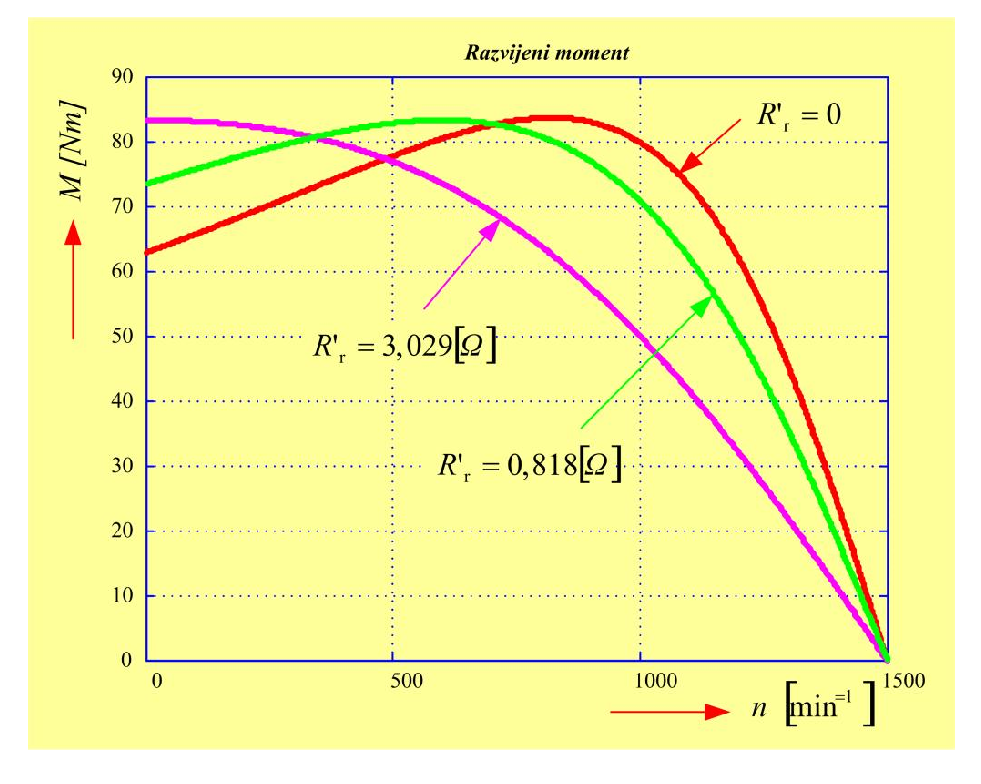
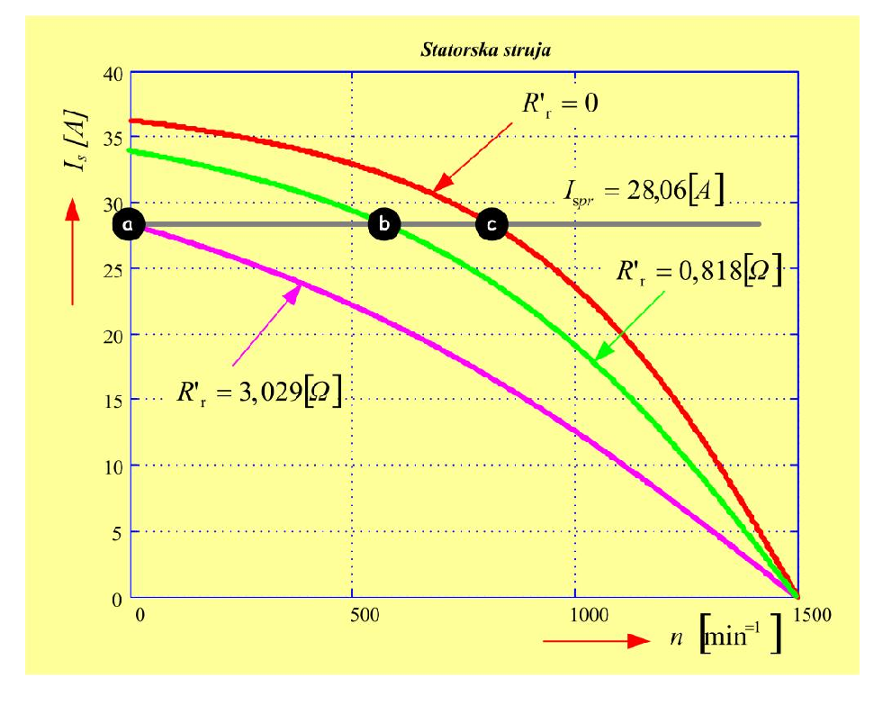

# Zadatak 43 — Dodatni rotorski otpori kliznokolutnog motora: najveći polazni moment, najveći moment pri zadatoj brzini i prevalni moment

## Postavka

Trofazni asinhroni motor sa namotanim rotorom (kliznokolutni motor) ima sledeće podatke: linijski napon $380\ \mathrm{V}$; sprega statora zvezda (Y); nazivna brzina obrtanja $1400\ \mathrm{min^{-1}}$; učestanost $50\ \mathrm{Hz}$; induktivnost rasipanja statora i induktivnost rasipanja rotora (svedena na stator) iznose po $8{,}8\ \mathrm{mH}$; induktivnost magnećenja teži beskonačnosti ($L_m \to \infty$); otpornost statorskog namotaja je zanemarljiva ($R_s \approx 0\ \Omega$); otpornost rotorskog namotaja svedena na stator iznosi $R'_r = 2{,}5\ \Omega$. Motor se pušta u rad pomoću rotorskog otpornika (dodatnog otpora vezanog na klizne kolutove rotora). Koeficijent transformacije ovog kliznokolutnog motora iznosi $m = 4$.

Odrediti:

**a)** vrednost otpora koji treba uključiti u rotorsko kolo da bi se ostvario polazak sa najvećim mogućim polaznim momentom;

**b)** vrednost otpora za koji se dobija najveći moment pri brzini od $600\ \mathrm{min^{-1}}$;

**c)** vrednost najveće brzine pri kojoj se može postići najveći mogući moment motora;

**d)** vrednost statorske struje u slučajevima a), b) i c), kao i vrednost najvećeg momenta motora.

> **Prevod na običan jezik:** Imamo asinhroni motor kod koga rotorski namotaj nije kratko spojen iznutra, već su njegovi krajevi izvedeni napolje preko kliznih kolutova (prstenova) i četkica. To znači da spolja, u rotorsko kolo, možemo da dodamo otpornik po želji. Dodavanjem otpora u rotor ne menjamo najveću vrednost momenta koju motor može da razvije (tzv. prevalni moment), ali menjamo brzinu (tj. klizanje) pri kojoj se taj najveći moment javlja. Zadatak nas pita: (a) koliki otpornik da dodamo da se maksimalni moment javi baš u trenutku polaska (brzina nula) — to daje najjači mogući start; (b) koliki otpornik da dodamo da se maksimalni moment javi baš na $600\ \mathrm{min^{-1}}$; (c) do koje najveće brzine uopšte možemo da "doguramo" tačku maksimalnog momenta (odgovor: do one brzine gde bi dodatni otpor morao biti nula — dalje ne možemo jer otpor ne može biti negativan); (d) kolika je statorska struja u sve tri situacije (ispostaviće se: ista!) i koliki je taj maksimalni moment.

## Podaci

| Veličina | Oznaka | Vrednost | Šta ta veličina fizički znači |
|---|---|---|---|
| Linijski napon napajanja | $U_s$ | $380\ \mathrm{V}$ | Efektivna vrednost napona između dva fazna provodnika mreže na koju je motor priključen. |
| Sprega statora | — | Y (zvezda) | Način vezivanja tri fazna namotaja statora; kod zvezde je fazni napon $\sqrt{3}$ puta manji od linijskog. |
| Nazivna brzina obrtanja | $n_{\mathrm{n}}$ | $1400\ \mathrm{min^{-1}}$ | Brzina vratila pri nazivnom (punom) opterećenju; iz nje zaključujemo sinhronu brzinu i broj pari polova. |
| Učestanost mreže | $f_s$ | $50\ \mathrm{Hz}$ | Učestanost napona napajanja; određuje brzinu obrtnog magnetnog polja. |
| Induktivnost rasipanja statora | $L_{\gamma s}$ | $8{,}8\ \mathrm{mH}$ | Deo induktivnosti statorskog namotaja čiji fluks NE prolazi kroz rotor (rasipa se); pravi "unutrašnju prepreku" struji. |
| Induktivnost rasipanja rotora (svedena na stator) | $L'_{\gamma r}$ | $8{,}8\ \mathrm{mH}$ | Isto to za rotorski namotaj, preračunato (svedeno) na statorsku stranu radi jedinstvene šeme. |
| Induktivnost magnećenja | $L_m$ | $\to \infty$ | Induktivnost grane koja predstavlja glavni (korisni) fluks; beskonačna vrednost znači da je struja magnećenja zanemarena — idealizacija. |
| Otpornost statora | $R_s$ | $\approx 0\ \Omega$ | Omska otpornost statorskog namotaja; zanemarena — idealizacija koja pojednostavljuje račun. |
| Otpornost rotora svedena na stator | $R'_r$ | $2{,}5\ \Omega$ | Omska otpornost samog rotorskog namotaja, preračunata na statorsku stranu. |
| Koeficijent transformacije | $m$ | $4$ | Odnos preko koga se rotorske veličine svode na stator: otpor se svodi množenjem sa $m^2$. Njime ćemo "vratiti" izračunate svedene otpore na stvarne omske vrednosti otpornika u rotoru. |

## Šta se traži i zašto

**a) Dodatni rotorski otpor za najveći polazni moment ($R_{da}$).** Kliznokolutni motori se u praksi puštaju u rad sa otpornikom u rotoru upravo zato što se tako dobija veliki polazni moment uz smanjenu polaznu struju — idealno za teške zalete (dizalice, mlinovi, drobilice). Inženjera zanima tačna vrednost otpornika koja momentnu karakteristiku "pomera" tako da se njen maksimum nađe baš pri brzini nula. Plan: (1) izračunamo prevalno klizanje kao funkciju ukupnog rotorskog otpora, (2) zahtevamo da ono bude jednako 1 (polazak), (3) rešimo po dodatnom otporu, (4) svedeni otpor preračunamo u stvarni pomoću koeficijenta transformacije.

**b) Dodatni rotorski otpor za najveći moment pri $600\ \mathrm{min^{-1}}$ ($R_{db}$).** Tokom zaleta se otpornik postepeno smanjuje da bi maksimum momenta "pratio" rastuću brzinu. Ovde tražimo vrednost otpornika za koju maksimum pada baš na $600\ \mathrm{min^{-1}}$. Plan: isti kao pod a), samo je ciljno klizanje ono koje odgovara brzini $600\ \mathrm{min^{-1}}$.

**c) Najveća brzina pri kojoj je moguć maksimalni moment ($n_{pr}$).** Otpornik možemo samo smanjivati do nule — negativan otpor ne postoji. Kada je dodatni otpor nula, motor radi na svojoj *prirodnoj karakteristici* i maksimum momenta je na sasvim određenoj brzini; iznad nje maksimalni moment više nije dostižan. Plan: izračunamo prevalno klizanje prirodne karakteristike (samo sa $R'_r$), pa iz njega brzinu.

**d) Statorske struje u slučajevima a), b), c) i vrednost najvećeg momenta ($I_s$, $M_{pr}$).** Struja govori koliko motor opterećuje mrežu, a maksimalni moment koliko "vuče". Pokazaće se lepa i praktično važna osobina: u svakoj od tri situacije motor radi tačno u svojoj prevalnoj tački, a u prevalnoj tački su struja i moment UVEK isti, bez obzira na dodatni otpor. Plan: (1) pokažemo da je u prevalnoj tački ukupni omski deo impedanse jednak induktivnom, (2) iz toga izračunamo struju jednim računom za sva tri slučaja, (3) maksimalni moment izračunamo iz opšte formule za prevalni moment.

## Potrebna teorija — mini-lekcije

### 1. Kliznokolutni (klizno-prstenasti) asinhroni motor i čemu služi rotorski otpornik

Kod običnog (kaveznog) asinhronog motora rotorski provodnici su trajno kratko spojeni — u rotorsko kolo ne možemo ništa da dodamo. Kod motora *sa namotanim rotorom* rotor nosi pravi trofazni namotaj čiji su krajevi izvedeni na tri klizna koluta (prstena) na vratilu; preko četkica se na te prstenove spolja vezuje trofazni otpornik. Time po volji povećavamo ukupan otpor rotorskog kola: umesto samo $R_r$ imamo $R_r + R_d$, gde je $R_d$ dodatni otpor. Videćemo u lekciji 4 da to pomera položaj maksimuma momentne karakteristike, a da sam maksimum ostaje isti — to je ceo "trik" ovog zadatka.

### 2. Sinhrona brzina, broj pari polova i klizanje

Trofazne struje statora stvaraju obrtno magnetno polje koje se obrće *sinhronom brzinom*:

$$n_s = \frac{60 \cdot f_s}{p}\ \left[\mathrm{min^{-1}}\right],$$

gde je $f_s$ učestanost mreže, a $p$ broj *pari* polova namotaja. Formula potiče iz same konstrukcije namotaja: za jedan period napona polje pređe jedan par polova, pa što više pari polova — polje se sporije obrće. Za $f_s = 50\ \mathrm{Hz}$ moguće sinhrone brzine su $3000, 1500, 1000, 750, \ldots\ \mathrm{min^{-1}}$ (za $p = 1, 2, 3, 4, \ldots$).

Asinhroni motor u motorskom režimu radi *malo sporije* od sinhrone brzine (zato se i zove asinhroni). Nazivna brzina je uvek malo ispod sinhrone: pošto je ovde $n_{\mathrm{n}} = 1400\ \mathrm{min^{-1}}$, jedina sinhrona brzina neposredno iznad nje je $1500\ \mathrm{min^{-1}}$, dakle $p = 2$.

*Klizanje* $s$ meri koliko rotor zaostaje za poljem, izraženo relativno:

$$s = \frac{n_s - n}{n_s}.$$

Pri polasku je $n = 0$, pa je $s = 1$; pri sinhronoj brzini je $s = 0$. Klizanje je "prirodna promenljiva" asinhronog motora — sve karakteristike se najlakše pišu preko njega.

Ugaona (kružna) učestanost napajanja je $\omega_s = 2\pi f_s$, a *mehanička* sinhrona ugaona brzina vratila je $\Omega_s = \omega_s / p$ (polje u električnim radijanima "trči" $p$ puta brže nego vratilo u mehaničkim).

### 3. Uprošćena ekvivalentna šema: šta nam daju idealizacije $R_s \approx 0$ i $L_m \to \infty$

Po fazi, asinhroni motor se predstavlja ekvivalentnom šemom: na ulazu fazni napon $U_{sf}$, zatim redno otpornost statora $R_s$ i rasipna reaktansa statora $X_{\gamma s} = \omega_s L_{\gamma s}$, pa paralelno grana magnećenja ($L_m$), pa redno rasipna reaktansa rotora $X'_{\gamma r} = \omega_s L'_{\gamma r}$ i element $R'_r / s$ koji objedinjuje otpor rotora i mehaničku snagu (sve rotorske veličine svedene na stator — vidi lekciju 6).

Ovaj zadatak koristi dve idealizacije koje šemu drastično pojednostavljuju:

- $R_s \approx 0$: nema pada napona na otporu statora — ceo napon "gura" struju kroz reaktanse i rotorski otpor.
- $L_m \to \infty$: grana magnećenja ima beskonačnu impedansu, pa kroz nju ne teče struja. Posledica: **statorska struja je jednaka svedenoj rotorskoj struji**, $I_s = I'_r$.

Ostaje čisto redno kolo: napon $U_{sf}$ na rednoj vezi ukupne rasipne reaktanse $X_\gamma = \omega_s (L_{\gamma s} + L'_{\gamma r})$ i otpora $ (R'_r + R'_d)/s$ (uračunali smo i eventualni dodatni otpor $R'_d$). Struja je tada, po Omovom zakonu za naizmenično kolo (moduo impedanse je koren zbira kvadrata omskog i induktivnog dela):

$$I_s = I'_r = \frac{U_{sf}}{\sqrt{\left(\dfrac{R'_r + R'_d}{s}\right)^2 + \omega_s^2 \left(L_{\gamma s} + L'_{\gamma r}\right)^2}}.$$

### 4. Momentna karakteristika, prevalni moment i prevalno klizanje

Snaga koja kroz vazdušni zazor pređe sa statora na rotor (tzv. obrtna snaga) po svakoj od tri faze iznosi $(R'_{uk}/s) \cdot I'^2_r$, gde je $R'_{uk} = R'_r + R'_d$ ukupan rotorski otpor. Elektromagnetni moment je ta snaga podeljena mehaničkom sinhronom brzinom:

$$M = \frac{3 \cdot \dfrac{R'_{uk}}{s} \cdot I'^2_r}{\Omega_s}, \qquad \Omega_s = \frac{\omega_s}{p}.$$

Uvrstimo li izraz za struju iz lekcije 3, dobijamo moment kao funkciju klizanja:

$$M(s) = \frac{3p}{\omega_s} \cdot \frac{\dfrac{R'_{uk}}{s} \cdot U_{sf}^2}{\left(\dfrac{R'_{uk}}{s}\right)^2 + X_\gamma^2}, \qquad X_\gamma = \omega_s\left(L_{\gamma s} + L'_{\gamma r}\right).$$

**Gde je maksimum?** Uvedimo smenu $x = R'_{uk}/s$ (to je "efektivni rotorski otpor" pri datom klizanju). Moment je tada srazmeran razlomku

$$\frac{x}{x^2 + X_\gamma^2} = \frac{1}{x + \dfrac{X_\gamma^2}{x}}.$$

Razlomak je najveći kada mu je imenilac $x + X_\gamma^2/x$ najmanji. Zbir pozitivnog broja i njegove "recipročne slike" najmanji je kada su oba sabirka jednaka (poznata osobina: $x + a^2/x \geq 2a$, sa jednakošću za $x = a$). Dakle, maksimum momenta nastupa kada je

$$x = X_\gamma \quad\Longleftrightarrow\quad \frac{R'_{uk}}{s} = \omega_s\left(L_{\gamma s} + L'_{\gamma r}\right).$$

Klizanje pri kome se to dešava zove se **prevalno klizanje**:

$$\boxed{\,s_{pr} = \frac{R'_{uk}}{\omega_s\left(L_{\gamma s} + L'_{\gamma r}\right)} = \frac{R'_r + R'_d}{\omega_s\left(L_{\gamma s} + L'_{\gamma r}\right)}\,}$$

a sam maksimum se zove **prevalni moment** $M_{pr}$ ("prevalni" jer se pri njemu karakteristika "prevaljuje": za veća klizanja moment počinje da opada, motor gubi stabilnost i "prevrne se" — zaglavi). Uvrštavanjem $x = X_\gamma$ u $M(s)$:

$$M_{pr} = \frac{3p}{\omega_s} \cdot \frac{X_\gamma \cdot U_{sf}^2}{2X_\gamma^2} = \frac{3p \, U_{sf}^2}{2\,\omega_s X_\gamma} \;\;\Longrightarrow\;\; \boxed{\,M_{pr} = 3p\left(\frac{U_{sf}}{\omega_s}\right)^2 \cdot \frac{1}{2\left(L_{\gamma s} + L'_{\gamma r}\right)}\,}$$

(u poslednjem koraku smo zamenili $X_\gamma = \omega_s(L_{\gamma s}+L'_{\gamma r})$ i skratili: $\dfrac{3p\,U_{sf}^2}{2\,\omega_s \cdot \omega_s (L_{\gamma s}+L'_{\gamma r})} = 3p\left(\dfrac{U_{sf}}{\omega_s}\right)^2 \dfrac{1}{2(L_{\gamma s}+L'_{\gamma r})}$).

### 5. Ključna osobina: dodatni otpor pomera $s_{pr}$, ali NE menja $M_{pr}$

Pogledaj pažljivo dve uokvirene formule iz lekcije 4:

- U izrazu za $s_{pr}$ figuriše ukupni rotorski otpor $R'_r + R'_d$ — **prevalno klizanje raste srazmerno dodatom otporu**. Dodavanjem otpora "vučemo" tačku maksimuma ka većim klizanjima, tj. ka manjim brzinama.
- U izrazu za $M_{pr}$ rotorski otpor se **uopšte ne pojavljuje** — skratio se u izvođenju! Prevalni moment zavisi samo od napona, učestanosti i rasipnih induktivnosti.

Intuicija: veći rotorski otpor znači da se ista granična ravnoteža "omski deo = induktivni deo" (uslov maksimuma) dostiže tek pri većem klizanju; ali kada se dostigne, kolo "izgleda" potpuno isto (isti $x = X_\gamma$), pa su i struja i moment isti. Zato kliznokolutni motor može da razvije svoj pun, prevalni moment već pri polasku — samo treba pogoditi otpor. Upravo to radimo u ovom zadatku.

### 6. Svođenje rotorskih veličina na stator — koeficijent transformacije

Stator i rotor su magnetno spregnuti kao primar i sekundar transformatora, ali sa različitim brojevima navojaka (i navojnim saborom). Da bismo ih crtali u JEDNOJ šemi, rotorske veličine "preračunavamo" (svodimo) na statorsku stranu. Ako je $m$ koeficijent transformacije (odnos efektivnih brojeva navojaka statora i rotora), onda se otpornosti i induktivnosti svode množenjem sa $m^2$:

$$R' = m^2 \cdot R \quad\Longleftrightarrow\quad R = \frac{R'}{m^2}.$$

Zašto baš $m^2$? Napon se preslikava sa faktorom $m$, struja sa faktorom $1/m$, pa se impedansa (napon kroz struju) preslikava sa faktorom $m^2$ — potpuno isto kao kod transformatora. U zadatku sve račune vodimo u svedenim veličinama (sa primom: $R'_r$, $R'_d$), a na kraju stvarnu omsku vrednost otpornika koji fizički vezujemo na klizne kolutove dobijamo deljenjem sa $m^2 = 4^2 = 16$.

### 7. Struja u prevalnoj tački — ista za svaki dodatni otpor

U prevalnoj tački važi uslov maksimuma $\dfrac{R'_r + R'_d}{s_{pr}} = X_\gamma$ (lekcija 4): omski deo impedanse jednak je induktivnom. Impedansa je tada

$$Z_{pr} = \sqrt{X_\gamma^2 + X_\gamma^2} = X_\gamma\sqrt{2},$$

pa je struja u prevalnoj tački

$$I_{s,pr} = \frac{U_{sf}}{X_\gamma \sqrt{2}} = \frac{U_{sf}}{\omega_s\left(L_{\gamma s} + L'_{\gamma r}\right)\sqrt{2}}.$$

Kao ni $M_{pr}$, ni ova struja **ne zavisi od rotorskog otpora** — svaki put kada motor radi baš u svojoj prevalnoj tački (ma gde ona bila "namestena" dodatnim otporom), struja je ista. To će nam u delu d) omogućiti da tri prividno različita slučaja rešimo jednim jedinim računom.

## Rešenje, korak po korak

### Korak 1: Sinhrona brzina, broj pari polova i ugaona učestanost

**Zašto ovaj korak:** sve formule za klizanje i moment traže sinhronu brzinu $n_s$, broj pari polova $p$ i ugaonu učestanost $\omega_s$ — njih iz podataka izvlačimo odmah, pre svega ostalog.

Nazivna brzina je $1400\ \mathrm{min^{-1}}$. Motorska brzina je uvek malo ispod sinhrone (lekcija 2), a moguće sinhrone brzine na $50\ \mathrm{Hz}$ su $3000, 1500, 1000, \ldots\ \mathrm{min^{-1}}$. Jedina neposredno iznad $1400$ je:

$$n_s = 1500\ \mathrm{min^{-1}} \quad\Longrightarrow\quad p = \frac{60 f_s}{n_s} = \frac{60 \cdot 50}{1500} = 2.$$

Ugaona učestanost napajanja:

$$\omega_s = 2\pi f_s = 2\pi \cdot 50 = 314{,}16\ \mathrm{rad/s}.$$

**Šta smo dobili:** motor je četvoropolni ($p = 2$ para polova), polje se obrće $1500\ \mathrm{min^{-1}}$. Sve je spremno za rad sa klizanjima.

### Korak 2: Ukupna rasipna reaktansa

**Zašto ovaj korak:** izraz $\omega_s (L_{\gamma s} + L'_{\gamma r})$ se pojavljuje u svakoj narednoj formuli (prevalno klizanje, struja, moment), pa ga izračunavamo jednom i koristimo svuda.

$$X_\gamma = \omega_s \left(L_{\gamma s} + L'_{\gamma r}\right) = 2\pi \cdot 50 \cdot \left(0{,}0088 + 0{,}0088\right)$$

Prvo zbir induktivnosti: $0{,}0088 + 0{,}0088 = 0{,}0176\ \mathrm{H}$. Zatim:

$$X_\gamma = 314{,}16 \cdot 0{,}0176 = 5{,}53\ \Omega.$$

**Šta smo dobili:** ukupna "induktivna prepreka" struji iznosi $5{,}53\ \Omega$ — primetimo da je veća od rotorskog otpora $R'_r = 2{,}5\ \Omega$, što će odmah u sledećem koraku značiti da dodatni otpor za polazak mora biti pozitivan (ima "prostora" da se otpor dodaje).

### Korak 3 (deo a): Dodatni otpor za najveći polazni moment

**Zašto ovaj korak:** najveći moment koji motor uopšte može da razvije je prevalni moment, $M_{max} = M_{pr}$ (lekcija 4). "Polazak sa najvećim mogućim momentom" zato znači: namestiti dodatni otpor tako da se prevalna tačka nađe baš pri polasku, tj. da prevalno klizanje bude jednako polaznom klizanju $s_{pol} = 1$.

Postavljamo uslov (formula za $s_{pr}$ iz lekcije 4, sa dodatnim otporom $R'_{da}$):

$$s_{pr} = \frac{R'_r + R'_{da}}{\omega_s\left(L_{\gamma s} + L'_{\gamma r}\right)} = s_{pol} = 1.$$

Rešavamo po $R'_{da}$: pomnožimo obe strane imeniocem,

$$R'_r + R'_{da} = \omega_s\left(L_{\gamma s} + L'_{\gamma r}\right),$$

pa prebacimo $R'_r$ na desnu stranu:

$$R'_{da} = \omega_s\left(L_{\gamma s} + L'_{\gamma r}\right) - R'_r.$$

Uvrštavanje brojeva (izraz $\omega_s(L_{\gamma s}+L'_{\gamma r}) = 5{,}53\ \Omega$ već imamo iz Koraka 2):

$$R'_{da} = 2\pi \cdot 50 \cdot \left(0{,}0088 + 0{,}0088\right) - 2{,}5 = 5{,}53 - 2{,}5 = 3{,}03\ \Omega.$$

Ovo je vrednost *svedena na stator*. Stvarni otpornik koji se fizički vezuje na klizne kolutove dobijamo svođenjem nazad na rotorsku stranu — delimo sa $m^2$ (lekcija 6):

$$R_{da} = \frac{1}{m^2} \cdot R'_{da} = \frac{1}{4^2} \cdot 3{,}03 = \frac{3{,}03}{16} = 0{,}19\ \Omega.$$

**Šta smo dobili:** u rotor treba dodati otpornik od svega $0{,}19\ \Omega$ (po fazi) i motor će krenuti sa punim prevalnim momentom. Mala omska vrednost je očekivana — rotorski namotaji rade sa malim naponima i velikim strujama, pa su i njihovi otpori mali; koeficijent transformacije $m^2 = 16$ "smanji" svedenu vrednost šesnaest puta.

### Korak 4 (deo b): Dodatni otpor za najveći moment pri $600\ \mathrm{min^{-1}}$

**Zašto ovaj korak:** sada maksimum momenta ne želimo pri polasku, nego pri brzini $n_b = 600\ \mathrm{min^{-1}}$. Logika je identična Koraku 3, samo ciljno klizanje više nije 1, već klizanje koje odgovara toj brzini — dodatni otpor zato mora biti manji.

Prvo klizanje pri $600\ \mathrm{min^{-1}}$ (definicija klizanja, lekcija 2):

$$s_b = \frac{n_s - n_b}{n_s} = \frac{1500 - 600}{1500} = \frac{900}{1500} = \frac{3}{5} = 0{,}6.$$

Sada uslov: prevalno klizanje (sa novim dodatnim otporom $R'_{db}$) mora biti jednako $s_b$:

$$s_{pr} = \frac{R'_r + R'_{db}}{\omega_s\left(L_{\gamma s} + L'_{\gamma r}\right)} = s_b = 0{,}6.$$

Rešavamo po $R'_{db}$: množimo obe strane imeniocem,

$$R'_r + R'_{db} = s_b \cdot \omega_s\left(L_{\gamma s} + L'_{\gamma r}\right),$$

pa prebacujemo $R'_r$:

$$R'_{db} = s_b \cdot \omega_s\left(L_{\gamma s} + L'_{\gamma r}\right) - R'_r.$$

Uvrštavanje brojeva:

$$R'_{db} = 0{,}6 \cdot 2\pi \cdot 50 \cdot \left(0{,}0088 + 0{,}0088\right) - 2{,}5 = 0{,}6 \cdot 5{,}53 - 2{,}5 = 3{,}32 - 2{,}5 = 0{,}82\ \Omega.$$

Svođenje na stvarnu rotorsku vrednost (deljenje sa $m^2 = 16$):

$$R_{db} = \frac{1}{m^2} \cdot R'_{db} = \frac{1}{4^2} \cdot 0{,}82 = \frac{0{,}82}{16} = 0{,}05\ \Omega.$$

**Šta smo dobili:** za maksimum momenta na $600\ \mathrm{min^{-1}}$ dovoljan je otpornik od $0{,}05\ \Omega$ — znatno manji nego za polazak ($0{,}19\ \Omega$). To je tačno ono što se u praksi radi tokom zaleta: otpornik se stepenasto (ili kontinualno) smanjuje kako brzina raste, da bi "brdo" momentne karakteristike pratilo motor.

### Korak 5 (deo c): Najveća brzina pri kojoj je prevalni moment još dostižan

**Zašto ovaj korak:** iz Koraka 3 i 4 vidimo pravilo — što veću brzinu želimo za maksimum momenta, to manji dodatni otpor treba. Smanjivati možemo samo do $R'_d = 0$ (otpor ne može biti negativan!). Sa $R'_d = 0$ motor radi na *prirodnoj karakteristici* i njegov maksimum momenta je na tačno određenoj brzini — to je tražena najveća brzina.

Prevalno klizanje prirodne karakteristike (formula iz lekcije 4 sa $R'_d = 0$, tj. samo sa otporom rotorskog namotaja $R'_r$):

$$s_{pr} = \frac{R'_r}{\omega_s\left(L_{\gamma s} + L'_{\gamma r}\right)} = \frac{2{,}5}{2\pi \cdot 50 \cdot \left(0{,}0088 + 0{,}0088\right)} = \frac{2{,}5}{5{,}53} = 0{,}452.$$

Iz definicije klizanja $s = (n_s - n)/n_s$ izrazimo brzinu: pomnožimo obe strane sa $n_s$ ($s \cdot n_s = n_s - n$), pa prebacimo ($n = n_s - s\,n_s$), tj. $n = (1-s)\,n_s$. Za $s = s_{pr}$:

$$n_{pr} = \left(1 - s_{pr}\right) \cdot n_s = \left(1 - 0{,}452\right) \cdot 1500 = 0{,}548 \cdot 1500 = 822\ \mathrm{min^{-1}}.$$

**Šta smo dobili:** najveća brzina pri kojoj motor još može da razvije svoj maksimalni (prevalni) moment iznosi $822\ \mathrm{min^{-1}}$. Za veće brzine to više nije moguće: tamo bi prevalno klizanje moralo biti još manje, a za to bi ukupni rotorski otpor morao biti manji od samog otpora namotaja $R'_r$ — dodatni otpor bi morao biti negativan, što fizički ne postoji. Pri ovoj brzini je dodatni otpor tačno nula, tj. motor je na svojoj prirodnoj karakteristici.

### Korak 6 (deo d, struje): Statorska struja u slučajevima a), b) i c)

**Zašto ovaj korak:** u sva tri slučaja motor posmatramo baš u prevalnoj tački (maksimum momenta pri $n=0$, pri $600\ \mathrm{min^{-1}}$, odnosno pri $822\ \mathrm{min^{-1}}$). Po lekciji 7, u prevalnoj tački su ukupni omski i induktivni deo impedanse jednaki, pa je struja u sva tri slučaja ista — računamo je jednom.

Opšti izraz za struju (redno kolo iz lekcije 3, indeks $i = a, b, c$ označava slučaj):

$$I_{si} = I_{sfi} = \frac{U_{sf}}{\sqrt{\left(\dfrac{R'_r + R'_{di}}{s_i}\right)^2 + \omega_s^2\left(L_{\gamma s} + L'_{\gamma r}\right)^2}}.$$

U svakom od tri slučaja smo dodatni otpor izabrali baš tako da je $s_i$ prevalno klizanje, pa važi uslov maksimuma (lekcija 4):

$$\frac{R'_r + R'_{di}}{s_i} = \omega_s\left(L_{\gamma s} + L'_{\gamma r}\right).$$

(Provera brojevima za sva tri slučaja — svaki razlomak zaista daje istih $5{,}53\ \Omega$: a) $\frac{2{,}5 + 3{,}03}{1} = 5{,}53$; b) $\frac{2{,}5 + 0{,}82}{0{,}6} = \frac{3{,}32}{0{,}6} = 5{,}53$; c) $\frac{2{,}5 + 0}{0{,}452} = 5{,}53$.)

Uvrštavanjem uslova u izraz za struju, pod korenom ostaju dva jednaka sabirka:

$$I_{si} = \frac{U_{sf}}{\sqrt{\omega_s^2\left(L_{\gamma s}+L'_{\gamma r}\right)^2 + \omega_s^2\left(L_{\gamma s}+L'_{\gamma r}\right)^2}} = \frac{U_{sf}}{\omega_s\left(L_{\gamma s} + L'_{\gamma r}\right)\cdot\sqrt{2}}.$$

Fazni napon (sprega Y, pa je fazni napon linijski podeljen sa $\sqrt{3}$):

$$U_{sf} = \frac{U_s}{\sqrt{3}} = \frac{380}{\sqrt{3}} = 219{,}4\ \mathrm{V}.$$

Uvrštavanje brojeva:

$$I_{si} = \frac{380/\sqrt{3}}{2\pi \cdot 50 \cdot \left(0{,}0088 + 0{,}0088\right) \cdot \sqrt{2}} = \frac{219{,}4}{5{,}53 \cdot 1{,}414} = \frac{219{,}4}{7{,}82} = 28{,}06\ \mathrm{A}, \qquad i = a, b, c.$$

**Šta smo dobili:** u sva tri slučaja statorska struja iznosi istih $28{,}06\ \mathrm{A}$. To je i fizički logično: prevalna tačka je uvek "isto stanje kola" (omski deo = induktivni deo), samo se pri različitim otporima to stanje dešava na različitim brzinama. Prevalna struja je, kao i prevalni moment, nezavisna od rotorskog otpora.

### Korak 7 (deo d, moment): Vrednost najvećeg (prevalnog) momenta

**Zašto ovaj korak:** ostalo je da izračunamo koliki je taj maksimalni moment koji smo u slučajevima a), b), c) "nameštali" na razne brzine. Koristimo formulu za prevalni moment izvedenu u lekciji 4 — podsetimo, ona ne sadrži rotorski otpor, pa je vrednost ista za sva tri slučaja.

Polazni oblik (moment = obrtna snaga podeljena mehaničkom sinhronom brzinom; struja je ona iz Koraka 6, jer pri $s = s_{pr}$ važi $I'_r = I_s = 28{,}06\ \mathrm{A}$):

$$M_{pr} = \frac{3 \cdot \dfrac{R'_r}{s_{pr}} \cdot I'^2_r\!\left(s = s_{pr}\right)}{\Omega_s} = 3p\left(\frac{U_{sf}}{\omega_s}\right)^2 \cdot \frac{1}{2\left(L_{\gamma s} + L'_{\gamma r}\right)}$$

(prelaz između ova dva oblika je detaljno izveden u lekciji 4: uvrsti se $R'_r/s_{pr} = \omega_s(L_{\gamma s}+L'_{\gamma r})$, $I'_r = U_{sf}/\big(\omega_s(L_{\gamma s}+L'_{\gamma r})\sqrt{2}\big)$ i $\Omega_s = \omega_s/p$, pa se reaktanse skrate).

Uvrštavanje brojeva ($p = 2$, $U_{sf} = 380/\sqrt{3}$, $\omega_s = 2\pi\cdot 50$):

$$M_{pr} = 3 \cdot 2 \cdot \left(\frac{380/\sqrt{3}}{2\pi \cdot 50}\right)^2 \cdot \frac{1}{2 \cdot \left(0{,}0088 + 0{,}0088\right)}.$$

Računamo deo po deo: $\dfrac{380/\sqrt{3}}{2\pi\cdot 50} = \dfrac{219{,}4}{314{,}16} = 0{,}698\ \mathrm{V\,s}$ (to je fluks-veličina "napon kroz učestanost"); kvadrat: $0{,}698^2 = 0{,}4877$; imenilac: $2 \cdot 0{,}0176 = 0{,}0352\ \mathrm{H}$, pa $1/0{,}0352 = 28{,}41$. Konačno:

$$M_{pr} = 6 \cdot 0{,}4877 \cdot 28{,}41 = 83{,}13\ \mathrm{Nm}.$$

Za kontrolu, i prvi oblik daje isto: $M_{pr} = \dfrac{3 \cdot 5{,}53 \cdot 28{,}06^2}{314{,}16/2} = \dfrac{3 \cdot 5{,}53 \cdot 787{,}4}{157{,}08} = 83{,}13\ \mathrm{Nm}$.

**Šta smo dobili:** najveći moment motora iznosi $83{,}13\ \mathrm{Nm}$ — i tolika je "visina brda" momentne karakteristike za SVAKI od tri dodatna otpora; menja se samo brzina na kojoj brdo stoji.

### Korak 8: Grafički pregled — momentne i strujne karakteristike

**Zašto ovaj korak:** sve zaključke zadatka najlakše je "videti" na dijagramima momenta i struje u funkciji brzine, za tri vrednosti dodatnog otpora iz zadatka.

Sledeća slika prikazuje mehaničku (momentnu) karakteristiku $M(n)$ za tri slučaja: prirodna karakteristika bez dodatnog otpora (crvena, oznaka $0\ \Omega$), sa dodatnim otporom $0{,}818\ \Omega$ iz dela b) (zelena) i sa $3{,}029\ \Omega$ iz dela a) (ljubičasta) — sve vrednosti su svedene na stator. Čitaj je ovako: sve tri krive imaju ISTU maksimalnu visinu (osamdesetak $\mathrm{Nm}$ — naših $83{,}13\ \mathrm{Nm}$), ali se vrh nalazi na različitim brzinama: kod ljubičaste na $n = 0$ (najveći polazni moment, slučaj a), kod zelene na $600\ \mathrm{min^{-1}}$ (slučaj b), kod crvene na $822\ \mathrm{min^{-1}}$ (slučaj c — dalje udesno vrh ne može). Sve tri krive se završavaju u nuli momenta pri sinhronoj brzini $1500\ \mathrm{min^{-1}}$, jer pri $s=0$ nema indukovanja u rotoru pa nema ni momenta.

**Slika 43.1 —** Mehanička karakteristika motora za razne vrednosti otpora u kolu rotora.

Druga slika prikazuje statorsku struju $I_s(n)$ za ista tri slučaja i istim bojama. Čitaj je ovako: struja je najveća u polasku i monotono opada ka nuli pri sinhronoj brzini; veći dodatni otpor daje manju struju pri svakoj brzini (zato se rotorski otpornik koristi i za ograničenje polazne struje). Horizontalna siva linija je nivo prevalne struje $I_{s,pr} = 28{,}06\ \mathrm{A}$: tačke a, b i c na njoj označavaju gde svaka od krivih seče taj nivo — tačno na "svojoj" prevalnoj brzini ($0$, $600$ i $822\ \mathrm{min^{-1}}$). To je grafička potvrda Koraka 6: struja pri prevalnom klizanju ne zavisi od dodatnog otpora.

**Slika 43.2 —** Struja motora u zavisnosti od klizanja za razne vrednosti dodatnog otpora u kolu rotora. Struja pri prevalnim klizanjima za razne vrednosti dodatnog rotorskog otpornika ne menja vrednost.

> **Napomena o originalu:** na slikama u zbirci krive su obeležene sa "$R'_r = 0$", "$R'_r = 0{,}818\ \Omega$" i "$R'_r = 3{,}029\ \Omega$". Iz konteksta je jasno da te oznake predstavljaju vrednosti DODATNOG rotorskog otpora svedenog na stator ($R'_d$), a ne otpora samog rotorskog namotaja — on je stalan i iznosi $R'_r = 2{,}5\ \Omega$. Vrednosti $3{,}029\ \Omega$ i $0{,}818\ \Omega$ su naši rezultati $R'_{da}$ i $R'_{db}$ ispisani sa tri decimale (u tekstu rešenja zaokruženi na $3{,}03$ i $0{,}82\ \Omega$).

## Česte greške i zamke

1. **Zaboravljeno svođenje sa statora na rotor (deljenje sa $m^2$).** Uslov za prevalno klizanje daje otpor SVEDEN na stator ($R'_{da} = 3{,}03\ \Omega$). Otpornik koji se stvarno vezuje na klizne kolutove je $m^2 = 16$ puta manji ($0{,}19\ \Omega$). Studenti često predaju svedenu vrednost kao konačan odgovor — ili, još gore, pomnože sa $m^2$ umesto da podele. Zapamti smer: sa statorske (primarne) strane na rotorsku (sekundarnu) stranu otpor se DELI sa $m^2$.

2. **Deljenje sa $m$ umesto sa $m^2$.** Naponi se preslikavaju sa $m$, ali impedanse (pa i otpori) sa $m^2$ — kao kod transformatora. $3{,}03/4 = 0{,}76\ \Omega$ je pogrešno; tačno je $3{,}03/16 = 0{,}19\ \Omega$.

3. **Mešanje linijskog i faznog napona.** Motor je spregnut u zvezdu, pa u sve formule po fazi ide $U_{sf} = 380/\sqrt{3} = 219{,}4\ \mathrm{V}$, a ne $380\ \mathrm{V}$. Greška u naponu se u momentu kvadrira: sa $380\ \mathrm{V}$ dobio bi se tri puta veći $M_{pr}$ ($\approx 249\ \mathrm{Nm}$) — očigledno pogrešno.

4. **Mešanje električne i mehaničke sinhrone brzine u formuli za moment.** Moment je obrtna snaga podeljena MEHANIČKOM sinhronom brzinom $\Omega_s = \omega_s/p = 157{,}08\ \mathrm{rad/s}$, a ne električnom $\omega_s = 314{,}16\ \mathrm{rad/s}$. Ako se zaboravi $p$, dobija se dvostruko manji moment ($41{,}6\ \mathrm{Nm}$ umesto $83{,}13\ \mathrm{Nm}$).

5. **Očekivanje da dodatni otpor menja vrednost maksimalnog momenta.** Ne menja je! Dodatni otpor pomera samo POLOŽAJ maksimuma (prevalno klizanje raste srazmerno ukupnom rotorskom otporu), dok visina maksimuma zavisi samo od napona, učestanosti i rasipnih induktivnosti. Ko to ne zna, u delu d) računa tri različita momenta — nepotrebno i pogrešno.

6. **Pokušaj da se maksimum momenta "namesti" iznad $822\ \mathrm{min^{-1}}$.** Formalno bi iz uslova $s_{pr} < 0{,}452$ ispao negativan dodatni otpor — fizički nemoguće. Granica je baš prirodna karakteristika ($R_d = 0$).

## Rezime rezultata

| Tražena veličina | Oznaka | Vrednost |
|---|---|---|
| a) Dodatni rotorski otpor za najveći polazni moment, sveden na stator | $R'_{da}$ | $3{,}03\ \Omega$ |
| a) Dodatni rotorski otpor za najveći polazni moment, stvarna vrednost | $R_{da}$ | $0{,}19\ \Omega$ |
| b) Klizanje pri $600\ \mathrm{min^{-1}}$ | $s_b$ | $0{,}6$ |
| b) Dodatni rotorski otpor za najveći moment pri $600\ \mathrm{min^{-1}}$, sveden na stator | $R'_{db}$ | $0{,}82\ \Omega$ |
| b) Dodatni rotorski otpor za najveći moment pri $600\ \mathrm{min^{-1}}$, stvarna vrednost | $R_{db}$ | $0{,}05\ \Omega$ |
| c) Prevalno klizanje prirodne karakteristike | $s_{pr}$ | $0{,}452$ |
| c) Najveća brzina sa najvećim (prevalnim) momentom | $n_{pr}$ | $822\ \mathrm{min^{-1}}$ |
| d) Statorska struja u slučajevima a), b) i c) | $I_{sa} = I_{sb} = I_{sc}$ | $28{,}06\ \mathrm{A}$ |
| d) Najveći (prevalni) moment motora | $M_{pr}$ | $83{,}13\ \mathrm{Nm}$ |

## Provera smisla

**1. Dimenziona provera dodatnog otpora.** $\omega_s (L_{\gamma s} + L'_{\gamma r})$ ima dimenziju $\mathrm{\frac{rad}{s} \cdot H} = \mathrm{\frac{1}{s} \cdot \frac{V\,s}{A}} = \mathrm{\frac{V}{A}} = \Omega$ — od reaktanse zaista oduzimamo ome, pa je $R'_{da} = 5{,}53 - 2{,}5 = 3{,}03\ \Omega$ dimenziono ispravno.

**2. Granični slučaj — deo b) mora ležati između a) i c).** Brzina $600\ \mathrm{min^{-1}}$ je između $0$ (slučaj a) i $822\ \mathrm{min^{-1}}$ (slučaj c), pa dodatni otpor mora biti između $0$ i $3{,}03\ \Omega$: dobili smo $0{,}82\ \Omega$ — jeste. Štaviše, zavisnost je linearna: iz $R'_d = s\,\omega_s(L_{\gamma s}+L'_{\gamma r}) - R'_r$ za $s_b = 0{,}6$ sledi $0{,}6 \cdot 5{,}53 - 2{,}5 = 0{,}82\ \Omega$ — tačno na "pravoj" između krajnjih slučajeva.

**3. Nezavisna provera momenta preko struje.** Prevalni moment mora izaći isti iz oba oblika formule: iz obrtne snage $M_{pr} = 3 \cdot 5{,}53 \cdot 28{,}06^2 / 157{,}08 = 83{,}1\ \mathrm{Nm}$ i iz izvedenog oblika $3p(U_{sf}/\omega_s)^2/(2(L_{\gamma s}+L'_{\gamma r})) = 83{,}13\ \mathrm{Nm}$ — poklapa se, što potvrđuje i struju iz Koraka 6 i moment iz Koraka 7.

**4. Poređenje sa slikama.** Na Slici 43.1 sve tri krive dostižu vrh na oko $83\ \mathrm{Nm}$ (naša vrednost $83{,}13\ \mathrm{Nm}$), sa vrhovima redom na $0$, $\approx 600$ i $\approx 822\ \mathrm{min^{-1}}$; na Slici 43.2 sve tri strujne krive seku nivo $28{,}06\ \mathrm{A}$ baš na tim brzinama. Račun i grafici pričaju istu priču.
