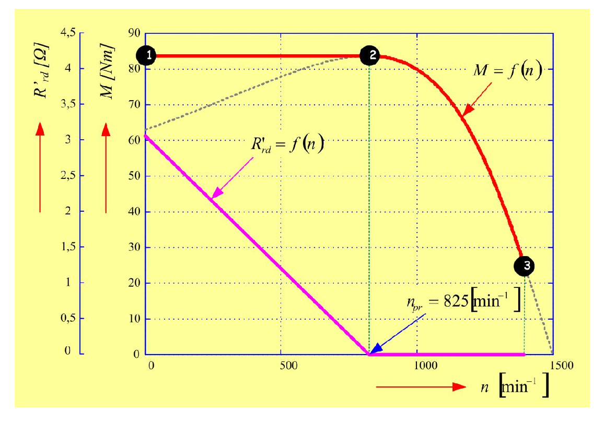
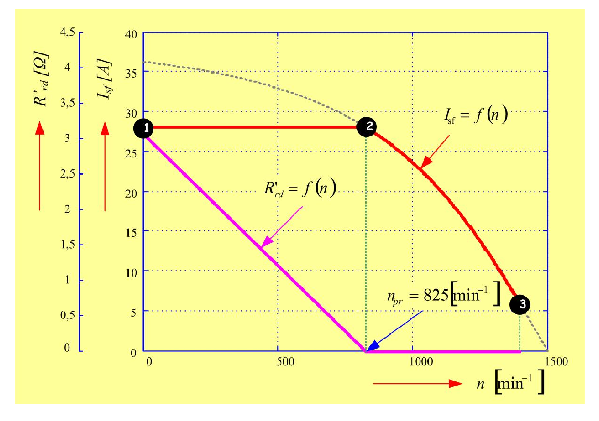

# Zadatak 44 — Zalet kliznokolutnog motora uz stalni maksimalni (prevalni) moment: zakon promene dodatnog rotorskog otpora i struje statora

## Postavka

Trofazni asinhroni motor **sa namotanim rotorom** (kliznokolutni motor) ima sledeće podatke: fazni napon $220\ \mathrm{V}$; nazivna brzina obrtanja $1400\ \mathrm{min^{-1}}$; induktivnosti rasipanja $L_{\gamma s} = L'_{\gamma r} = 8{,}8\ \mathrm{mH}$; zajednička (magnetizaciona) induktivnost $L_m \to \infty$; otpornost statora $R_s \approx 0\ \Omega$; otpornost rotora svedena na stator $R'_r = 2{,}5\ \Omega$; nazivna učestanost $f_s = 50\ \mathrm{Hz}$. Motor se pušta u rad pomoću rotorskog otpornika koji se može **kontinualno** menjati.

Odrediti:

a) zavisnost vrednosti dodatnog otpora od brzine, tako da se u toku polaska održava stalni i maksimalni moment;

b) izvesti zavisnost struje statora od brzine ako se polazak ostvaruje prema a);

c) nacrtati dijagrame promene dodatnog otpora i struje statora u funkciji brzine, do brzine stacionarnog stanja, kod opisanog načina polaska.

> **Prevod na običan jezik:** Imamo asinhroni motor kod koga rotorski namotaj nije kratko spojen unutar mašine, nego je izveden na klizne kolutove (prstenove), pa spolja možemo da mu dodamo otpornik u rotorsko kolo. Taj otpornik možemo da menjamo glatko (kontinualno), kao potenciometar. Ideja zaleta je: podesiti otpornik u svakom trenutku baš toliko da motor **stalno razvija svoj najveći mogući moment** — tada se motor zaleće najbrže što fizika dozvoljava. Treba da nađemo: (a) koliki otpornik treba da bude pri svakoj brzini (formulu $R'_{rd}(n)$), (b) kolika je pri tome struja koju motor vuče iz mreže (pokazaće se da je — konstantna!), i (c) da sve to nacrtamo u funkciji brzine, od polaska ($n=0$) do ustaljenog rada ($n_n = 1400\ \mathrm{min^{-1}}$).

## Podaci

| Veličina | Oznaka | Vrednost | Šta ta veličina fizički znači |
|---|---|---|---|
| Fazni napon statora | $U_{sf}$ | $220\ \mathrm{V}$ | Efektivna vrednost napona na jednom faznom namotaju statora. |
| Nazivna brzina obrtanja | $n_n$ | $1400\ \mathrm{min^{-1}}$ | Brzina vratila pri nazivnom (punom) opterećenju; iz nje ćemo prepoznati sinhronu brzinu i broj pari polova. |
| Induktivnost rasipanja statora | $L_{\gamma s}$ | $8{,}8\ \mathrm{mH}$ | Deo fluksa statorskog namotaja koji se "rasipa" — ne obuhvata rotor pa ne učestvuje u prenosu energije; ponaša se kao redna induktivnost. |
| Induktivnost rasipanja rotora (svedena na stator) | $L'_{\gamma r}$ | $8{,}8\ \mathrm{mH}$ | Isto to, ali za rotorski namotaj; "prim" znači da je preračunata (svedena) na statorsku stranu. |
| Zajednička (magnetizaciona) induktivnost | $L_m$ | $\to \infty$ | Induktivnost grane magnećenja. $L_m\to\infty$ znači: struja magnećenja je zanemarljiva, sva statorska struja "prolazi" ka rotoru. |
| Otpornost statora | $R_s$ | $\approx 0\ \Omega$ | Omska otpornost statorskog namotaja — ovde je zanemarujemo (nema pada napona ni gubitaka u statoru). |
| Otpornost rotora svedena na stator | $R'_r$ | $2{,}5\ \Omega$ | Sopstvena omska otpornost rotorskog namotaja, preračunata na statorsku stranu. |
| Nazivna učestanost | $f_s$ | $50\ \mathrm{Hz}$ | Učestanost napona napajanja statora. |
| Dodatni rotorski otpor | $R'_{rd}$ | kontinualno promenljiv | Spoljašnji otpornik u rotorskom kolu (preko kliznih kolutova), svedeno na stator — ovo je "ručica" kojom upravljamo zaletom. |

## Šta se traži i zašto

**a) Zakon promene dodatnog otpora $R'_{rd}(n)$.** Dodatni rotorski otpor pomera tačku maksimalnog momenta po brzini (videćemo u teoriji: maksimalni moment se **ne menja**, ali se klizanje pri kome nastupa **menja srazmerno ukupnom rotorskom otporu**). Ako hoćemo da motor u *svakom* trenutku zaleta radi baš u svom maksimumu momenta, otpornik mora da se smanjuje po tačno određenom zakonu dok brzina raste. Inženjera to zanima jer je to recept za projektovanje upusnog otpornika (starter/reostat) koji daje **najbrži mogući zalet** — maksimalno ubrzanje pri svakoj brzini.

**b) Struja statora $I_{sf}(n)$ tokom takvog zaleta.** Struja pri polasku određuje zagrevanje motora i otpornika, izbor kablova, osigurača i zaštite. Pokazaće se elegantan rezultat: dok god "jašemo" po vrhu momentne karakteristike, struja je **konstantna** — motor sve vreme vuče istu struju, i to znatno manju od struje direktnog polaska.

**c) Dijagrami $R'_{rd}(n)$ i $I_{sf}(n)$.** Grafički prikaz celog zaleta, uključujući i završni deo: kad otpornik padne na nulu, motor "izlazi" na svoju prirodnu karakteristiku i po njoj stiže do stacionarne (nazivne) brzine.

**Plan rešavanja:**
1. Iz nazivne brzine prepoznamo sinhronu brzinu $n_s = 1500\ \mathrm{min^{-1}}$ i broj pari polova $p=2$.
2. Izračunamo prevalni (maksimalni) moment $M_{pr}$ i prevalno klizanje $s_{pr}$ prirodne karakteristike, pa nazivno klizanje $s_n$ i nazivni moment $M_n$ (Klosov obrazac) — to je "lična karta" motora.
3. Postavimo uslov zaleta: klizanje pri svakoj brzini mora biti jednako prevalnom klizanju (koje zavisi od ukupnog rotorskog otpora) — iz tog uslova sledi $R'_{rd}(n)$.
4. Uvrstimo taj uslov u izraz za struju — dobijemo $I_{sf} = \mathrm{konst}$.
5. Nađemo brzinu $n_{pr}$ pri kojoj otpornik padne na nulu (izlazak na prirodnu karakteristiku) i opišemo šta se dešava od $n_{pr}$ do stacionarnog stanja; nacrtamo dijagrame.

## Potrebna teorija — mini-lekcije

### 1) Kliznokolutni (asinhroni motor sa namotanim rotorom) i dodatni rotorski otpor

Kod običnog (kaveznog) asinhronog motora rotorski provodnici su trajno kratko spojeni — u rotorsko kolo ne možemo ništa da dodamo. Kod **kliznokolutnog** motora rotor nosi pravi trofazni namotaj čiji su krajevi izvedeni na tri **klizna koluta** (prstena) na vratilu; preko četkica se na njih spolja priključuju otpornici. Time dobijamo mogućnost da po volji menjamo **ukupan otpor rotorskog kola**: sopstveni $R'_r$ plus dodatni $R'_{rd}$. To je istorijski najvažniji način "mekog" i snažnog pokretanja velikih pogona (dizalice, mlinovi, drobilice). Sve rotorske veličine pišemo "svedene na stator" (oznaka prim): preračunate preko prenosnog odnosa namotaja tako da se stator i rotor mogu spojiti u jednu ekvivalentnu šemu.

### 2) Sinhrona brzina, klizanje, broj pari polova

Trofazni namotaj statora napajan učestanošću $f_s$ pravi obrtno magnetno polje koje se obrće **sinhronom brzinom**:

$$n_s = \frac{60 \cdot f_s}{p}\ \ [\mathrm{min^{-1}}],$$

gde je $p$ broj **pari** polova namotaja. Rotor asinhronog motora uvek malo "kasni" za poljem; to kašnjenje meri **klizanje**:

$$s = \frac{n_s - n}{n_s}\ \ [\,],$$

bezdimenzioni broj: $s=1$ u polasku ($n=0$), $s=0$ pri sinhronoj brzini. Kako prepoznati $p$? Nazivna brzina je uvek *malo ispod* neke sinhrone brzine. Za $f_s = 50\ \mathrm{Hz}$ moguće sinhrone brzine su $3000, 1500, 1000, 750,\ldots\ \mathrm{min^{-1}}$ ($p = 1, 2, 3, 4,\ldots$). Pošto je $n_n = 1400\ \mathrm{min^{-1}}$, prva sinhrona brzina iznad je $1500\ \mathrm{min^{-1}}$, dakle $p = 2$ (četvoropolna mašina). Ugaona (električna) učestanost napajanja je $\omega_s = 2\pi f_s$, a **mehanička** sinhrona ugaona brzina je $\Omega_s = \omega_s / p$ — pazi, razlikuju se za faktor $p$!

### 3) Uprošćena ekvivalentna šema ($R_s \approx 0$, $L_m \to \infty$) i struja

Standardna ekvivalentna šema asinhronog motora po fazi ima: redno $R_s$ i rasipnu reaktansu statora $X_{\gamma s} = \omega_s L_{\gamma s}$, zatim paralelnu granu magnećenja ($L_m$), pa redno rotorsku rasipnu reaktansu $X'_{\gamma r} = \omega_s L'_{\gamma r}$ i otpor $R'_r/s$. (Deljenje sa $s$ je standardan trik kojim se obrtni rotor "zamrzne" u statičko kolo: $R'_r/s = R'_r + R'_r(1-s)/s$, gde prvi deo predstavlja gubitke u bakru rotora, a drugi mehaničku snagu.)

Ovaj zadatak dozvoljava dva uprošćenja koja šemu svode na **prosto redno kolo**:
- $R_s \approx 0$: nema pada napona na statorskom otporu;
- $L_m \to \infty$: grana magnećenja ne vuče struju (beskonačna reaktansa = prekid), pa je **struja statora jednaka svedenoj struji rotora**: $I_{sf} = I'_r$.

Ostaje: napon $U_{sf}$ na rednoj vezi $\left(R'_r/s\right)$ i ukupne rasipne reaktanse $X_\gamma = \omega_s (L_{\gamma s} + L'_{\gamma r})$. Po Omovom zakonu za naizmenično kolo (moduo impedanse = koren zbira kvadrata otpornosti i reaktanse):

$$I_{sf}(s) = \frac{U_{sf}}{\sqrt{\left(\dfrac{R'_r}{s}\right)^2 + \omega_s^2\,(L_{\gamma s} + L'_{\gamma r})^2}}.$$

Ako je u rotor uključen i dodatni otpor $R'_{rd}$, svuda umesto $R'_r$ stoji $R'_r + R'_{rd}$.

### 4) Moment iz snage obrtnog polja

Snaga koja kroz vazdušni zazor pređe sa statora na rotor (snaga obrtnog polja) troši se na fiktivnom otporu $R'_r/s$ (za sve tri faze):

$$P_{ob} = 3\, I'^2_r \cdot \frac{R'_r}{s}.$$

Elektromagnetni moment je ta snaga podeljena mehaničkom sinhronom brzinom $\Omega_s = \omega_s/p$:

$$M = \frac{P_{ob}}{\Omega_s} = \frac{3p}{\omega_s}\, I'^2_r\, \frac{R'_r}{s}.$$

Uvrstimo li struju iz mini-lekcije 3, dobijamo momentnu karakteristiku $M(s)$:

$$M(s) = \frac{3p}{\omega_s}\cdot U_{sf}^2 \cdot \frac{R'_r/s}{\left(\dfrac{R'_r}{s}\right)^2 + \omega_s^2 (L_{\gamma s}+L'_{\gamma r})^2}.$$

### 5) Prevalni moment i prevalno klizanje — ključna činjenica zadatka

Gde je maksimum funkcije $M(s)$? Uvedimo skraćenice $x = R'_r/s$ (promenljiva — menja se sa klizanjem) i $X_\gamma = \omega_s(L_{\gamma s}+L'_{\gamma r})$ (konstanta). Onda je

$$M = \frac{3p\,U_{sf}^2}{\omega_s} \cdot \frac{x}{x^2 + X_\gamma^2} = \frac{3p\,U_{sf}^2}{\omega_s} \cdot \frac{1}{x + \dfrac{X_\gamma^2}{x}}.$$

(U drugom koraku smo brojilac i imenilac podelili sa $x$.) Moment je najveći kada je imenilac $x + X_\gamma^2/x$ najmanji. Po nejednakosti između aritmetičke i geometrijske sredine, $a + b \ge 2\sqrt{ab}$, pa je $x + X_\gamma^2/x \ge 2\sqrt{X_\gamma^2} = 2X_\gamma$, sa jednakošću tačno kada su sabirci jednaki, tj. kada je $x = X_\gamma$. Dakle:

**Uslov maksimuma:** $\dfrac{R'_r}{s} = \omega_s (L_{\gamma s}+L'_{\gamma r})$, odakle je **prevalno klizanje**

$$s_{pr} = \frac{R'_r}{\omega_s (L_{\gamma s}+L'_{\gamma r})},$$

a **prevalni (maksimalni) moment**, kad se $x = X_\gamma$ vrati u izraz za $M$:

$$M_{pr} = \frac{3p\,U_{sf}^2}{\omega_s \cdot 2X_\gamma} = \frac{3p}{2}\cdot\left(\frac{U_{sf}}{\omega_s}\right)^2 \cdot \frac{1}{L_{\gamma s}+L'_{\gamma r}}.$$

Sada **najvažnije zapažanje za ceo zadatak** — pogledaj šta u ovim formulama zavisi od rotorskog otpora:
- $M_{pr}$ **ne zavisi** od rotorskog otpora (u formuli ga nema!);
- $s_{pr}$ je **direktno srazmerno** rotorskom otporu.

Dodavanjem otpora u rotor, dakle, **ne menjamo visinu** vrha momentne karakteristike, nego samo **pomeramo mesto** (brzinu/klizanje) na kome se vrh nalazi. Sa ukupnim otporom $R'_r + R'_{rd}$ prevalno klizanje postaje

$$s_{pr}(R'_{rd}) = \frac{R'_r + R'_{rd}}{\omega_s (L_{\gamma s}+L'_{\gamma r})}.$$

Birajući $R'_{rd}$ možemo vrh karakteristike da "namestimo" na bilo koju brzinu — pa i tačno na onu brzinu na kojoj se motor trenutno nalazi. To je srce ovog zadatka. Usput, primeti i fizičku interpretaciju: $U_{sf}/\omega_s$ je mera fluksa u mašini, pa formula kaže da je maksimalni moment srazmeran kvadratu fluksa, a obrnuto srazmeran ukupnom rasipanju.

### 6) Klosov obrazac

Podelimo li $M(s)$ sa $M_{pr}$ (obe formule iz prethodne lekcije) i iskoristimo $x/X_\gamma = s_{pr}/s$ (jer je $x = R'_r/s$ i $X_\gamma = R'_r/s_{pr}$), posle skraćivanja svih konstanti ostaje **Klosov obrazac**:

$$\frac{M}{M_{pr}} = \frac{2}{\dfrac{s}{s_{pr}} + \dfrac{s_{pr}}{s}}.$$

On daje ceo oblik momentne karakteristike iz samo dva podatka ($M_{pr}$ i $s_{pr}$) — zato je omiljen u praksi, jer su to tipični kataloški podaci. U opštem slučaju (kada je $R_s \neq 0$) on je aproksimacija; u našem zadatku, pošto smo uzeli $R_s = 0$, on je **tačan** (upravo smo ga izveli bez ikakvog dodatnog zanemarivanja).

### 7) Ideja zaleta sa stalnim prevalnim momentom ("jahanje po vrhu")

Jednačina mehanike pogona glasi $J\,\frac{d\Omega}{dt} = M - M_t$ ($J$ — moment inercije, $M_t$ — moment tereta): ubrzanje je najveće kada je razvijeni moment $M$ najveći. Najveći moment koji motor uopšte može da dâ jeste $M_{pr}$. Strategija maksimalnog ubrzanja je zato: u **svakom** trenutku zaleta podesiti dodatni otpor tako da se vrh momentne karakteristike nalazi baš na trenutnoj brzini motora. Matematički, klizanje koje motor trenutno ima mora biti jednako prevalnom klizanju (koje smo otporom "namestili"):

$$s(n) = s_{pr}(n) \quad\Longleftrightarrow\quad \frac{n_s - n}{n_s} = \frac{R'_r + R'_{rd}}{\omega_s (L_{\gamma s}+L'_{\gamma r})}.$$

Kako brzina raste, levo klizanje opada, pa i desna strana mora da opada — otpornik se kontinualno smanjuje. Kada otpornik padne na nulu, "namestili" smo poslednje što možemo: motor je na svojoj **prirodnoj karakteristici** (karakteristici bez dodatnog otpora) i dalje se zaleće po njoj, kao običan motor, do radne tačke u kojoj se njegov moment izjednači sa momentom tereta.

## Rešenje, korak po korak

### Korak 1: Sinhrona brzina, broj pari polova i ugaona učestanost

**Zašto ovaj korak:** Svi dalji izrazi sadrže $n_s$, $p$ i $\omega_s$, a zadatak ih ne daje direktno — moramo ih prepoznati iz nazivne brzine i učestanosti (mini-lekcija 2).

Nazivna brzina $n_n = 1400\ \mathrm{min^{-1}}$ leži malo ispod sinhrone brzine $1500\ \mathrm{min^{-1}}$, koja za $f_s = 50\ \mathrm{Hz}$ odgovara $p = 2$:

$$n_s = \frac{60 \cdot f_s}{p} = \frac{60 \cdot 50}{2} = 1500\ \mathrm{min^{-1}}.$$

Ugaona učestanost napajanja:

$$\omega_s = 2\pi f_s = 2 \cdot \pi \cdot 50 = 314{,}16\ \mathrm{rad/s}.$$

Odmah izračunajmo i ukupnu rasipnu reaktansu, jer se pojavljuje u svakoj sledećoj formuli:

$$X_\gamma = \omega_s\,(L_{\gamma s}+L'_{\gamma r}) = 314{,}16 \cdot (0{,}0088 + 0{,}0088) = 314{,}16 \cdot 0{,}0176 = 5{,}53\ \Omega.$$

**Šta smo dobili:** Mašina je četvoropolna ($p=2$), polje se obrće sa $1500\ \mathrm{min^{-1}}$, a ukupna rasipna reaktansa od oko $5{,}5\ \Omega$ biće jedina "kočnica" struji pri velikim klizanjima (jer je $R_s = 0$).

> **Napomena o originalu:** Zbirka na pojedinim mestima računa sa $\pi \approx 3{,}14$, pa joj je $\omega_s (L_{\gamma s}+L'_{\gamma r}) = 5{,}526\ \Omega$ umesto tačnijih $5{,}529\ \Omega$. Zbog toga se poneka cifra na trećem-četvrtom mestu razlikuje (npr. $M_{pr}$: $83{,}67$ prema $83{,}59\ \mathrm{Nm}$; $R'_{rd\,max}$: $3{,}026$ prema $3{,}029\ \Omega$). Razlike su reda $0{,}1\%$ i potiču isključivo od zaokruživanja broja $\pi$; u nastavku navodimo vrednosti kako ih zbirka štampa.

### Korak 2: Prevalni (maksimalni) moment $M_{pr}$

**Zašto ovaj korak:** Ceo zalet treba da se odvija baš sa ovim momentom — to je "visina vrha" na kojoj ćemo držati motor. Koristimo formulu iz mini-lekcije 5, koja važi jer je $R_s \approx 0$.

$$M_{pr} = \frac{3\,p}{2}\cdot\left(\frac{U_{sf}}{\omega_s}\right)^2 \cdot \frac{1}{L_{\gamma s}+L'_{\gamma r}}.$$

Uvrstimo brojeve, deo po deo:

$$\frac{U_{sf}}{\omega_s} = \frac{220}{2 \cdot \pi \cdot 50} = \frac{220}{314{,}16} = 0{,}700\ \mathrm{Wb}, \qquad \left(0{,}700\right)^2 = 0{,}490,$$

$$M_{pr} = \frac{3 \cdot 2}{2} \cdot \left(\frac{220}{2 \cdot \pi \cdot 50}\right)^2 \cdot \frac{1}{2 \cdot 0{,}0088} = 3 \cdot 0{,}490 \cdot \frac{1}{0{,}0176} = 83{,}67\ \mathrm{Nm}.$$

**Šta smo dobili:** Najveći moment koji ovaj motor može da razvije je oko $83{,}7\ \mathrm{Nm}$ — i, po mini-lekciji 5, ta vrednost je ista bez obzira koliki otpornik ubacimo u rotor. Zapazi usput da je $U_{sf}/\omega_s = 0{,}7\ \mathrm{Wb}$ upravo fluks mašine.

### Korak 3: Prevalno klizanje $s_{pr}$ prirodne karakteristike

**Zašto ovaj korak:** $s_{pr}$ prirodne karakteristike (bez dodatnog otpora) određuje brzinu na kojoj će se zalet "sa vrha" završiti — do nje važe naši zakoni $R'_{rd}(n)$ i $I_{sf}(n)$, posle nje motor ide po prirodnoj karakteristici.

$$s_{pr} = \frac{R'_r}{\omega_s\,(L_{\gamma s}+L'_{\gamma r})} = \frac{2{,}5}{2 \cdot \pi \cdot 50 \cdot 2 \cdot 0{,}0088} = \frac{2{,}5}{5{,}53} = 0{,}45\ [\,].$$

**Šta smo dobili:** Vrh prirodne momentne karakteristike je na klizanju $0{,}45$, tj. na brzini $n = n_s(1-s_{pr})$, što ćemo u Koraku 8 izračunati kao $825\ \mathrm{min^{-1}}$. To je neuobičajeno veliko prevalno klizanje (tipični motori imaju $0{,}1$–$0{,}2$) — posledica relativno velikog rotorskog otpora ove mašine.

### Korak 4: Nazivno klizanje $s_n$

**Zašto ovaj korak:** Nazivno klizanje opisuje stacionarnu (krajnju) radnu tačku zaleta i treba nam za nazivni moment u sledećem koraku.

$$s_n = \frac{n_s - n_n}{n_s} = \frac{1500 - 1400}{1500} = \frac{100}{1500} = \frac{1}{15} = 0{,}067\ [\,].$$

**Šta smo dobili:** U nazivnom radu rotor kasni za poljem svega $6{,}7\%$ — tipična, mala vrednost za ustaljeni rad.

### Korak 5: Nazivni moment $M_n$ (Klosov obrazac)

**Zašto ovaj korak:** Nazivni moment pokazuje koliko je prevalni moment "iznad" normalnog opterećenja — tj. kolika je rezerva momenta kojom raspolažemo pri zaletu. Koristimo Klosov obrazac (mini-lekcija 6), koji je ovde tačan jer je $R_s = 0$: uvrstimo $s = s_n$.

$$M_n = \frac{2\,M_{pr}}{\dfrac{s_n}{s_{pr}} + \dfrac{s_{pr}}{s_n}}.$$

Izračunajmo imenilac, sabirak po sabirak:

$$\frac{s_n}{s_{pr}} = \frac{0{,}067}{0{,}45} = 0{,}149, \qquad \frac{s_{pr}}{s_n} = \frac{0{,}45}{0{,}067} = 6{,}72, \qquad 0{,}149 + 6{,}72 = 6{,}87,$$

pa je:

$$M_n = \frac{2 \cdot 83{,}67}{6{,}87} = \frac{167{,}34}{6{,}87} = 24{,}37\ \mathrm{Nm} \approx 24{,}4\ \mathrm{Nm}.$$

**Šta smo dobili:** Nazivni moment je oko $24{,}4\ \mathrm{Nm}$, dakle prevalni moment je $83{,}67/24{,}4 \approx 3{,}4$ puta veći od nazivnog — tokom opisanog zaleta motor će ubrzavati momentom skoro tri i po puta većim od svog normalnog radnog momenta.

> **Napomena o originalu:** Zbirka na ovom mestu štampa $M_n = 24{,}47\ \mathrm{Nm}$. Međutim, sa vrednostima koje sama uvrštava ($2 \cdot 83{,}67 / (0{,}067/0{,}45 + 0{,}45/0{,}067)$) dobija se $24{,}37\ \mathrm{Nm}$ — u zbirci je očigledno sitna računska/štamparska omaška (zamenjene cifre 3 i 4). Sa svim veličinama računatim bez zaokruživanja dobilo bi se $24{,}13\ \mathrm{Nm}$; red veličine i svi zaključci ostaju isti.

### Korak 6 (tačka a): Zakon promene dodatnog otpora $R'_{rd}(n)$

**Zašto ovaj korak:** Ovo je srž zadatka. Postavljamo uslov "jahanja po vrhu" (mini-lekcija 7): pri svakoj brzini $n$, trenutno klizanje motora mora biti jednako prevalnom klizanju karakteristike koju smo otpornikom podesili — samo tada motor razvija $M_{pr}$, tj. zaleće se maksimalnim ubrzanjem.

Uslov glasi:

$$s(n) = s_{pr}(n) \quad\Longrightarrow\quad \frac{n_s - n}{n_s} = \frac{R'_r + R'_{rd}}{\omega_s\,(L_{\gamma s}+L'_{\gamma r})}.$$

Leva strana je klizanje koje motor stvarno ima pri brzini $n$; desna strana je prevalno klizanje sa ukupnim rotorskim otporom $R'_r + R'_{rd}$ (mini-lekcija 5). Rešimo po $R'_{rd}$: pomnožimo obe strane sa $\omega_s (L_{\gamma s}+L'_{\gamma r})$, pa prebacimo $R'_r$ na levu stranu:

$$\frac{n_s - n}{n_s}\cdot \omega_s\,(L_{\gamma s}+L'_{\gamma r}) = R'_r + R'_{rd}$$

$$\boxed{\;R'_{rd}(n) = \frac{n_s - n}{n_s}\cdot \omega_s\,(L_{\gamma s}+L'_{\gamma r}) - R'_r = \left(1 - \frac{n}{n_s}\right)\cdot \omega_s\,(L_{\gamma s}+L'_{\gamma r}) - R'_r\;}$$

(u poslednjem prelazu smo samo razlomak $\frac{n_s - n}{n_s}$ rastavili na $\frac{n_s}{n_s} - \frac{n}{n_s} = 1 - \frac{n}{n_s}$). Dobili smo **linearno opadajuću** funkciju brzine — pravu liniju.

**Najveća vrednost** dodatnog otpora je na samom početku zaleta, $n = 0$ (tada je $1 - n/n_s = 1$):

$$R'_{rd\,max} = \omega_s\,(L_{\gamma s}+L'_{\gamma r}) - R'_r = 2 \cdot \pi \cdot 50 \cdot (0{,}0088 + 0{,}0088) - 2{,}5 = 5{,}526 - 2{,}5 = 3{,}026\ \Omega.$$

Konačan brojčani zakon (uvrstimo $n_s = 1500\ \mathrm{min^{-1}}$ i $\omega_s (L_{\gamma s}+L'_{\gamma r}) = 5{,}526\ \Omega$):

$$\boxed{\;R'_{rd}(n) = \left[\left(1 - \frac{n}{1500}\right)\cdot 5{,}526 - 2{,}5\right]\ \Omega\;}$$

**Šta smo dobili:** Otpornik kreće od $3{,}026\ \Omega$ pri $n=0$ i linearno se smanjuje sa brzinom. Formula važi samo dok je $R'_{rd} \ge 0$ — negativan otpor je fizički besmislen; brzinu na kojoj otpor padne na nulu naći ćemo u Koraku 8, i tu se ovaj zakon završava.

### Korak 7 (tačka b): Struja statora tokom zaleta — konstanta!

**Zašto ovaj korak:** Treba izvesti $I_{sf}(n)$ za zalet po zakonu iz Koraka 6, jer struja određuje termičko naprezanje motora, otpornika i opreme.

Struja u uprošćenoj šemi (mini-lekcija 3), sa ukupnim rotorskim otporom $R'_r + R'_{rd}$ i klizanjem $s(n)$:

$$I_{sf}(n) = \frac{U_{sf}}{\sqrt{\left(\dfrac{R'_r + R'_{rd}}{s(n)}\right)^2 + \omega_s^2\,(L_{\gamma s}+L'_{\gamma r})^2}}.$$

Sada iskoristimo uslov zaleta iz Koraka 6. Iz

$$s(n) = s_{pr}(n) = \frac{R'_r + R'_{rd}}{\omega_s\,(L_{\gamma s}+L'_{\gamma r})}$$

pomnožimo obe strane sa $\omega_s (L_{\gamma s}+L'_{\gamma r})$ i podelimo sa $s(n)$, pa sledi:

$$\frac{R'_r + R'_{rd}}{s(n)} = \omega_s\,(L_{\gamma s}+L'_{\gamma r}).$$

Rečima: tokom celog ovakvog zaleta ukupna rotorska otpornost podeljena klizanjem stalno je jednaka rasipnoj reaktansi — "otporski" i "reaktivni" deo impedanse su jednaki. Uvrstimo to u izraz za struju (oba sabirka pod korenom postaju isti):

$$I_{sf}(n) = \frac{U_{sf}}{\sqrt{\omega_s^2 (L_{\gamma s}+L'_{\gamma r})^2 + \omega_s^2 (L_{\gamma s}+L'_{\gamma r})^2}} = \frac{U_{sf}}{\sqrt{2 \cdot \omega_s^2 (L_{\gamma s}+L'_{\gamma r})^2}} = \frac{U_{sf}}{\sqrt{2}\cdot \omega_s\,(L_{\gamma s}+L'_{\gamma r})}.$$

Brojčano:

$$I_{sf} = \frac{220}{\sqrt{2} \cdot 2 \cdot \pi \cdot 50 \cdot (2 \cdot 0{,}0088)} = \frac{220}{1{,}414 \cdot 5{,}53} = \frac{220}{7{,}82} = 28{,}134\ \mathrm{A} = \mathrm{konst}.$$

**Šta smo dobili:** Struja tokom celog zaleta "po vrhu" **ne zavisi od brzine** — konstantnih $28{,}1\ \mathrm{A}$. To je logično: u svakom trenutku motor radi u "istoj" radnoj tački svoje (pomerene) karakteristike — istom relativnom položaju prema vrhu — pa su i impedansa (po modulu) i struja iste. Primeti i da su otporski i reaktivni deo impedanse jednaki, pa je fazni stav struje stalno $45°$, tj. $\cos\varphi = 1/\sqrt{2} \approx 0{,}71$ tokom celog zaleta.

### Korak 8 (tačka c): Dokle važe izvedeni zakoni — izlazak na prirodnu karakteristiku

**Zašto ovaj korak:** Zakoni iz Koraka 6 i 7 važe samo dok imamo šta da smanjujemo — dok je $R'_{rd} > 0$. Treba naći brzinu na kojoj otpornik padne na nulu; od nje pa nadalje motor je na prirodnoj karakteristici.

$R'_{rd} = 0$ znači da je trenutno klizanje jednako prevalnom klizanju **prirodne** karakteristike, $s = s_{pr} = 0{,}45$, čemu odgovara brzina (iz definicije klizanja $s = 1 - n/n_s$, tj. $n = n_s(1-s)$):

$$n_{pr} = n_s\,(1 - s_{pr}) = 1500 \cdot (1 - 0{,}45) = 1500 \cdot 0{,}55 = 825\ \mathrm{min^{-1}}.$$

Za $n > n_{pr}$ je $R'_{rd} = 0$, pa struja sledi **prirodnu karakteristiku**:

$$I_{sf}(n) = \frac{U_{sf}}{\sqrt{\left(\dfrac{R'_r}{s}\right)^2 + \omega_s^2 (L_{\gamma s}+L'_{\gamma r})^2}}, \qquad s(n) = \frac{n_s - n}{n_s},$$

i sada, pošto $s$ opada a $R'_r/s$ raste, struja **opada** sa brzinom. Zalet se završava u stacionarnom stanju $n_n = 1400\ \mathrm{min^{-1}}$; proverimo koliku struju tamo dobijamo. Klizanje je $s_n = 0{,}067$ (Korak 4), pa:

$$\frac{R'_r}{s_n} = \frac{2{,}5}{0{,}067} = 37{,}5\ \Omega,$$

$$I_{sf}(n_n) = \frac{220}{\sqrt{37{,}5^2 + 5{,}53^2}} = \frac{220}{\sqrt{1406{,}25 + 30{,}6}} = \frac{220}{\sqrt{1436{,}8}} = \frac{220}{37{,}9} = 5{,}8\ \mathrm{A} = I_n.$$

**Šta smo dobili:** Do $825\ \mathrm{min^{-1}}$ (dakle na $55\%$ sinhrone brzine) motor ubrzava stalnim maksimalnim momentom i stalnom strujom; tu otpornik nestaje i motor po prirodnoj karakteristici stiže do $1400\ \mathrm{min^{-1}}$, gde vuče nazivnih $5{,}8\ \mathrm{A}$. Struja zaleta ($28{,}1\ \mathrm{A}$) je oko $4{,}85$ puta veća od nazivne — sasvim tipičan odnos.

### Korak 9 (tačka c): Dijagrami $R'_{rd}(n)$, $M(n)$ i $I_{sf}(n)$

**Zašto ovaj korak:** Zadatak izričito traži grafički prikaz; dijagrami ujedno najlepše pokazuju celu logiku zaleta.

Prva slika prikazuje dodatni otpor i **moment** u funkciji brzine.

**Slika 44.1 —** Zavisnost dodatnog otpora od brzine motora tako da se postiže maksimalno ubrzanje i izgled statičke mehaničke karakteristike motora za taj slučaj.

> **Kako čitati sliku 44.1:** Dijagram sa dve leve ose i zajedničkom horizontalnom osom. Horizontalna osa: brzina $n$ u $\mathrm{min^{-1}}$, od $0$ do $1500$ (sinhrona brzina). Spoljašnja leva osa: dodatni otpor $R'_{rd}$ u $\mathrm{\Omega}$ (od $0$ do $4{,}5$); unutrašnja leva osa: moment $M$ u $\mathrm{Nm}$ (od $0$ do $90$). Tri linije, po boji: **ružičasta prava** (obeležena $R'_{rd} = f(n)$, čita se na spoljašnjoj osi) kreće od $R'_{rd\,max} = 3{,}026\ \mathrm{\Omega}$ pri $n = 0$ i linearno pada do nule tačno kod $n_{pr} = 825\ \mathrm{min^{-1}}$ (na tu tačku pokazuje plava strelica sa natpisom $n_{pr} = 825\ \mathrm{min^{-1}}$), a dalje leži na nuli — to je zakon iz Koraka 6. **Debela crvena kriva** (obeležena $M = f(n)$, unutrašnja osa) je moment tokom zaleta: horizontalna na $M_{pr} = 83{,}67\ \mathrm{Nm}$ od tačke **1** ($n = 0$, polazak) do tačke **2** ($825\ \mathrm{min^{-1}}$, izlazak na prirodnu karakteristiku), pa opada do tačke **3** (stacionarno stanje: $n_n = 1400\ \mathrm{min^{-1}}$, $M_n \approx 24{,}4\ \mathrm{Nm}$). **Siva isprekidana kriva** je cela prirodna momentna karakteristika (bez otpornika): počinje od $\approx 63\ \mathrm{Nm}$ pri $n = 0$ (toliko bi dao direktni polazak; tačnije $62{,}8\ \mathrm{Nm}$, Provera smisla 3), raste do svog prevala od $83{,}67\ \mathrm{Nm}$ upravo kod $825\ \mathrm{min^{-1}}$ i pada ka nuli u $1500\ \mathrm{min^{-1}}$; od tačke 2 do tačke 3 crvena kriva leži tačno preko nje. Zelene tačkaste vertikale označavaju $825$ i $1400\ \mathrm{min^{-1}}$. Šta treba da zaključiš: dok se ružičasta prava spušta ka nuli, motor „jaše" po vrhu svih pomerenih karakteristika (ravni deo crvene krive na $83{,}67\ \mathrm{Nm}$); kad otpornik nestane, ostatak zaleta ide po prirodnoj karakteristici.

Druga slika ima istu ružičastu pravu $R'_{rd}(n)$, ali unutrašnja leva osa sada prikazuje **struju statora** $I_{sf}$.

**Slika 44.2 —** Zavisnost dodatnog otpora od brzine motora tako da se postiže maksimalno ubrzanje i vrednost struje motora za taj slučaj.

> **Kako čitati sliku 44.2:** Iste ose i ista ružičasta prava kao na slici 44.1 — horizontalna osa je brzina $n$ u $\mathrm{min^{-1}}$ (od $0$ do $1500$), spoljašnja leva osa je $R'_{rd}$ u $\mathrm{\Omega}$, a **ružičasta prava** $R'_{rd} = f(n)$ pada linearno od $3{,}026\ \mathrm{\Omega}$ pri $n = 0$ do nule kod $825\ \mathrm{min^{-1}}$ (plava strelica: $n_{pr} = 825\ \mathrm{min^{-1}}$). Razlika je u unutrašnjoj levoj osi: ona sada prikazuje struju statora $I_{sf}$ u $\mathrm{A}$ (od $0$ do $40$). **Debela crvena linija** (obeležena $I_{sf} = f(n)$) je struja tokom zaleta: konstantnih $28{,}134\ \mathrm{A}$ (vodoravan deo — rezultat Koraka 7) od tačke **1** ($n = 0$) do tačke **2** ($825\ \mathrm{min^{-1}}$), a zatim opada po prirodnoj karakteristici do tačke **3** — nazivnih $5{,}8\ \mathrm{A}$ pri $1400\ \mathrm{min^{-1}}$ (Korak 8). **Siva isprekidana kriva** je struja po prirodnoj karakteristici (bez otpornika): pri $n = 0$ iznosi oko $36\ \mathrm{A}$ (tačnije $36{,}3\ \mathrm{A}$, Provera smisla 3) i monotono opada sa brzinom; kod $825\ \mathrm{min^{-1}}$ seče crvenu horizontalu i odatle do tačke 3 crvena linija leži preko nje, a siva se nastavlja ka nuli u $1500\ \mathrm{min^{-1}}$. Zelene tačkaste vertikale su na $825$ i $1400\ \mathrm{min^{-1}}$. Šta treba da zaključiš: otpornik u rotoru istovremeno *smanjuje* polaznu struju ($28{,}1$ umesto $36{,}3\ \mathrm{A}$) i *povećava* polazni moment ($83{,}67$ umesto $62{,}8\ \mathrm{Nm}$, slika 44.1) — u tome je dvostruka korist kliznokolutnog motora.

**Šta smo dobili:** Kompletnu sliku zaleta u tri faze: (1→2) konstantan maksimalni moment i konstantna struja uz linearno smanjivanje otpornika; u tački 2 otpornik je na nuli; (2→3) prirodna karakteristika — moment i struja opadaju do stacionarnih (nazivnih) vrednosti u tački 3.

## Česte greške i zamke

1. **Uzeti $n_n = 1400\ \mathrm{min^{-1}}$ kao sinhronu brzinu.** Nazivna brzina je brzina pod opterećenjem i uvek je *ispod* sinhrone. Sinhrona brzina mora biti jedna od standardnih vrednosti ($3000/p$ za $50\ \mathrm{Hz}$) — ovde $1500\ \mathrm{min^{-1}}$, $p = 2$. Ko uvrsti $1400$ u $s$ ili u $\omega_s$, dobija besmislice od prvog koraka.

2. **Pomešati električnu $\omega_s$ i mehaničku $\Omega_s = \omega_s/p$ ugaonu brzinu.** U formuli za moment figuriše $3p/\omega_s$ upravo zato što se snaga obrtnog polja deli *mehaničkom* sinhronom brzinom. Zaboravljeno $p$ = moment manji dvostruko (ovde bi ispalo $41{,}8$ umesto $83{,}67\ \mathrm{Nm}$).

3. **Zaboraviti da se od ukupnog potrebnog otpora oduzme sopstveni $R'_r$.** Uslov zaleta određuje *ukupan* rotorski otpor $R'_r + R'_{rd}$; dodatni otpornik je ta vrednost **minus** $2{,}5\ \Omega$. Ko zaboravi oduzimanje, dobija $R'_{rd\,max} = 5{,}53\ \Omega$ umesto $3{,}026\ \Omega$.

4. **Primeniti zakon $R'_{rd}(n)$ i $I_{sf} = \mathrm{konst}$ i posle $n_{pr} = 825\ \mathrm{min^{-1}}$.** Formula za $R'_{rd}$ tada daje negativan otpor — fizički nemoguće. Od $n_{pr}$ nadalje važi prirodna karakteristika: $R'_{rd} = 0$, a struja opada po formuli iz Koraka 8.

5. **Pobrkati mH i Ω, ili uzeti samo jednu rasipnu induktivnost.** U svim formulama figuriše **zbir** $L_{\gamma s} + L'_{\gamma r} = 0{,}0176\ \mathrm{H}$ (pa reaktansa $\omega_s \cdot 0{,}0176 = 5{,}53\ \Omega$). Ko uzme samo $8{,}8\ \mathrm{mH}$, dobija dvostruko veći moment i struju.

6. **Misliti da dodatni otpor smanjuje maksimalni moment.** Ne smanjuje ga — $M_{pr}$ ne zavisi od rotorskog otpora (mini-lekcija 5); otpor samo pomera klizanje pri kome se maksimum javlja. Upravo na toj činjenici počiva ceo ovaj način zaleta.

## Rezime rezultata

| Veličina | Oznaka | Vrednost |
|---|---|---|
| Prevalni (maksimalni) moment | $M_{pr}$ | $83{,}67\ \mathrm{Nm}$ |
| Prevalno klizanje (prirodna karakteristika) | $s_{pr}$ | $0{,}45$ |
| Nazivno klizanje | $s_n$ | $0{,}067$ |
| Nazivni moment (Klos) | $M_n$ | $24{,}4\ \mathrm{Nm}$ (u zbirci odštampano $24{,}47$; ispravno $24{,}37$) |
| a) Zakon dodatnog otpora ($0 \le n \le 825\ \mathrm{min^{-1}}$) | $R'_{rd}(n)$ | $\left[\left(1 - \dfrac{n}{1500}\right)\cdot 5{,}526 - 2{,}5\right]\ \Omega$ |
| Maksimalni dodatni otpor (pri $n = 0$) | $R'_{rd\,max}$ | $3{,}026\ \Omega$ |
| b) Struja statora tokom zaleta ($0 \le n \le 825\ \mathrm{min^{-1}}$) | $I_{sf}$ | $28{,}134\ \mathrm{A} = \mathrm{konst.}$ |
| Brzina izlaska na prirodnu karakteristiku | $n_{pr}$ | $825\ \mathrm{min^{-1}}$ |
| Stacionarno stanje | $n_n$, $I_n$ | $1400\ \mathrm{min^{-1}}$, $5{,}8\ \mathrm{A}$ |
| c) Dijagrami | — | Slike 44.1 i 44.2 |

## Provera smisla

**1) Neprekidnost zakona otpora na kraju zaleta.** Uvrstimo $n = n_{pr} = 825\ \mathrm{min^{-1}}$ u dobijeni zakon: $R'_{rd} = (1 - 825/1500)\cdot 5{,}526 - 2{,}5 = 0{,}45 \cdot 5{,}526 - 2{,}5 = 2{,}49 - 2{,}5 \approx 0$. Otpornik glatko stiže na nulu tačno u trenutku izlaska na prirodnu karakteristiku — nema skoka, sve se "šije" kontinualno. ✓

**2) Dimenziona provera.** $\omega_s (L_{\gamma s}+L'_{\gamma r})$: $[\mathrm{rad/s}] \cdot [\mathrm{H}] = [\mathrm{s^{-1}}]\cdot[\Omega\,\mathrm{s}] = [\Omega]$ — reaktansa u omima, sme da se sabira/oduzima sa otporima, kako i radimo u zakonu za $R'_{rd}$. Struja: $[\mathrm{V}]/[\Omega] = [\mathrm{A}]$. Moment: $[\mathrm{W}]/[\mathrm{rad/s}] = [\mathrm{Nm}]$. ✓

**3) Poređenje sa direktnim polaskom (granični slučaj $R'_{rd}=0$ u $n=0$).** Bez otpornika, u polasku ($s=1$) bi bilo $I = 220/\sqrt{2{,}5^2 + 5{,}53^2} = 220/6{,}07 = 36{,}3\ \mathrm{A}$ i $M = 62{,}8\ \mathrm{Nm}$ — upravo početne vrednosti sivih isprekidanih krivih na slikama 44.1 i 44.2. Sa otpornikom: struja *manja* ($28{,}1\ \mathrm{A}$), moment *veći* ($83{,}67\ \mathrm{Nm}$). Rezultat ima smisla i pokazuje zašto se kliznokolutni motori uopšte prave. ✓

**4) Odnosi prema nazivnim vrednostima.** Struja zaleta prema nazivnoj: $28{,}134/5{,}8 \approx 4{,}85$ — u tipičnom opsegu polaznih struja asinhronih mašina (4–7 puta nazivna). Preopteretivost $M_{pr}/M_n \approx 3{,}4$ — na gornjoj ivici uobičajenog (1,8–3,5), očekivano za mašinu sa ovako velikim $s_{pr}$. ✓
