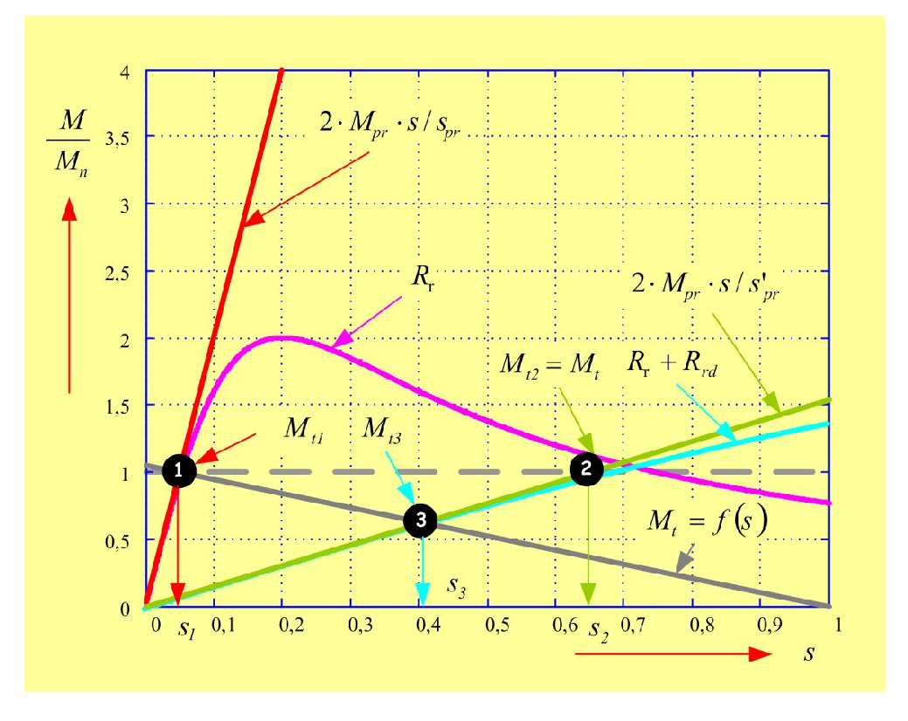

# Zadatak 45 — Klizanje kliznokolutnog motora posle uključenja dodatnog rotorskog otpora, pri teretu $M_t = 0{,}1 \cdot n$

## Postavka

Trofazni **dvopolni kliznokolutni** asinhroni motor ima otpor po fazi rotora $0{,}5\ \mathrm{\Omega}$. Motor se napaja iz mreže frekvencije $50\ \mathrm{Hz}$ i sa klizanjem od $5\ \%$ pokreće teret čija je momentna karakteristika

$$M_t = 0{,}1 \cdot n,$$

gde je $M_t$ moment tereta u $\mathrm{Nm}$, a $n$ brzina obrtanja u $\mathrm{ob/min}$. Koliko će biti klizanje motora ako se u rotorsko kolo uključi dodatni otpor od $6\ \mathrm{\Omega}$ po fazi?

> **Prevod na običan jezik:** Imamo asinhroni motor kod koga rotorski namotaj nije kratko spojen unutar mašine, već su mu krajevi izvedeni napolje preko kliznih prstenova (kolutova) — pa spolja možemo da dodamo otpornike u rotorsko kolo. Motor trenutno vrti teret i pritom "kasni" za obrtnim poljem 5 % (toliko mu je klizanje). Teret nije običan: njegov moment **raste sa brzinom** (duplo brža vrtnja → duplo veći potrebni moment). Sada u rotor ubacimo dodatni otpor od 6 Ω po fazi — to je klasičan način da se kliznokolutnom motoru **smanji brzina**. Pitanje: na kom novom klizanju (tj. na kojoj novoj brzini) će se motor "smiriti" i nastaviti da radi? Caka zadatka: dato nam je jako malo podataka, pa ne možemo da koristimo pune formule za moment — moraćemo da radni deo momentne karakteristike **linearizujemo** (zamenimo pravom linijom).

## Podaci

| Veličina | Oznaka | Vrednost | Šta ta veličina fizički znači |
|---|---|---|---|
| Broj faza statora | $q$ | $3$ | Motor je trofazni — napaja se iz trofazne mreže. |
| Broj pari polova | $p$ | $1$ | Motor je **dvopolni**: 2 magnetna pola = **1 par** polova. Od $p$ zavisi sinhrona brzina. |
| Otpor po fazi rotora | $R_r$ | $0{,}5\ \mathrm{\Omega}$ | Omski otpor jedne faze rotorskog namotaja — on određuje nagib radnog dela momentne karakteristike. |
| Frekvencija mreže | $f_s$ | $50\ \mathrm{Hz}$ | Frekvencija napona kojim se napaja stator; od nje (i od $p$) zavisi brzina obrtnog polja. |
| Početno klizanje | $s_1$ | $5\ \% = 0{,}05$ | Koliko rotor relativno zaostaje za obrtnim poljem u početnoj radnoj tački (pre dodavanja otpora). |
| Momentna karakteristika tereta | $M_t$ | $0{,}1 \cdot n\ \mathrm{Nm}$ ($n$ u $\mathrm{ob/min}$) | Moment koji teret "traži" od motora — raste linearno sa brzinom obrtanja. |
| Dodatni rotorski otpor po fazi | $R_{rd}$ | $6\ \mathrm{\Omega}$ | Spoljašnji otpornik koji se preko kliznih prstenova vezuje **na red** sa rotorskim namotajem, u svakoj fazi. |

**Traži se:** novo klizanje $s_3$ sa kojim motor radi posle uključenja dodatnog otpora (a iz njega ćemo dobiti i novu brzinu $n_3$).

## Šta se traži i zašto

**Novo klizanje $s_3$ (i nova brzina $n_3$).** Klizanje je "lična karta" radne tačke asinhronog motora: kad znamo klizanje, znamo brzinu, a preko karakteristike i moment. Dodavanje otpora u rotor kliznokolutnog motora je jedan od najstarijih načina **regulacije brzine**: veći rotorski otpor → "mekša" karakteristika → motor se pri istom teretu vrti sporije. Inženjera ovo direktno zanima: ako biram otpornik od 6 Ω, na koju brzinu će mi motor pasti? Hoće li to biti 5 % sporije ili 40 % sporije? Ovaj zadatak upravo to izračunava.

**Plan rešavanja** (običnim jezikom, u koracima):

1. Izračunamo sinhronu brzinu $n_s$ i početnu radnu tačku: brzinu $n_1$ i moment $M_1$ koji motor daje pre dodavanja otpora.
2. Pošto nemamo parametre ekvivalentne šeme ni kataloške podatke, radni deo momentne karakteristike **linearizujemo**: uzimamo da je moment proporcionalan klizanju ($M \sim s$).
3. Prvo rešimo lakši, pomoćni problem: koliko bi bilo klizanje $s_2$ da je teret **konstantan** (isti moment kao u tački 1)? Odgovor daje odnos prevalnih klizanja, koji se svodi na odnos rotorskih otpora.
4. Zatim uvažimo da teret **nije** konstantan, već $M_t = 0{,}1 \cdot n$: nova ravnoteža se uspostavlja u tački 3, na istoj (novoj) karakteristici motora kao tačka 2. Iz uslova ravnoteže dobijamo jednačinu po $s_3$ i rešimo je.
5. Iz $s_3$ izračunamo novu brzinu $n_3$.

Celu ovu logiku najlakše je razumeti sa slike. Slika 45.1 prikazuje sve momentne karakteristike iz zadatka u jednom dijagramu: na horizontalnoj osi je klizanje $s$ (pazi: $s = 0$ znači sinhronu brzinu, a $s = 1$ znači da rotor stoji — dakle **brzina raste ulevo**), a na vertikalnoj moment normalizovan na nazivni ($M/M_n$). Čitaj je ovako:

- **ružičasta (magenta) kriva**, označena sa $R_r$ — prirodna momentna karakteristika motora (bez dodatnog otpora); ima maksimum (tzv. prevalni moment $M_{pr}$) na klizanju oko $0{,}2$ (tzv. prevalno klizanje $s_{pr}$ — obe veličine detaljno objašnjava mini-lekcija 4);
- **crvena strma prava**, označena sa $2 \cdot M_{pr} \cdot s / s_{pr}$ — linearizacija radnog dela prirodne karakteristike (prava kroz koordinatni početak);
- **svetloplava (cijan) kriva**, označena sa $R_r + R_{rd}$ — karakteristika motora sa uključenim dodatnim otporom: isti maksimum po visini, ali jako "razvučena" udesno;
- **zelena prava**, označena sa $2 \cdot M_{pr} \cdot s / s'_{pr}$ — linearizacija radnog dela te nove karakteristike;
- **siva isprekidana horizontala** ($M_{t2} = M_t$) — zamišljeni konstantni teret iz pomoćnog problema (korak 3 plana);
- **siva puna opadajuća prava** ($M_t = f(s)$) — stvarni teret $M_t = 0{,}1 \cdot n$: pošto brzina opada kada klizanje raste, ovaj moment **opada** sa klizanjem;
- **tačka 1** — početna radna tačka (presek prirodne karakteristike i tereta, na $s_1 = 0{,}05$); **tačka 2** — pomoćna radna tačka (presek nove karakteristike i konstantnog tereta, na $s_2$); **tačka 3** — konačna radna tačka koju tražimo (presek nove karakteristike i stvarnog tereta, na $s_3$).

**Slika 45.1 —** Momentne karakteristike asinhronog motora: prirodna (ružičasta kriva, $R_r$) i sa uključenim dodatnim rotorskim otpornikom (svetloplava kriva, $R_r + R_{rd}$), njihove linearizacije (crvena i zelena prava kroz koordinatni početak), zamišljeni konstantni teret (siva isprekidana horizontala) i stvarni teret $M_t = 0{,}1 \cdot n$ (siva puna opadajuća prava). Radna tačka 1 je početno stanje ($s_1$), tačka 2 pomoćno stanje sa konstantnim teretom ($s_2$), a tačka 3 traženo konačno stanje ($s_3$).

> **Napomena o originalu:** U zbirci potpis slike kaže "tamno plava: prirodna, svetlo plava: sa uključenim dodatnim rotorskim otpornikom, tereta (roza)", ali na samoj slici je prirodna karakteristika nacrtana **ružičastom (magenta)** bojom, karakteristika sa dodatnim otporom **svetloplavom (cijan)**, a obe karakteristike tereta **sivom**. Ovde su boje opisane onako kako zaista izgledaju na slici, da se ne zbuniš.

## Potrebna teorija — mini-lekcije

### 1. Sinhrona brzina i klizanje

Trofazni statorski namotaj, napajan naizmeničnim naponima frekvencije $f_s$, stvara **obrtno magnetno polje** koje se vrti sinhronom brzinom:

$$n_s = \frac{60 \cdot f_s}{p} \quad [\mathrm{ob/min}],$$

gde je $f_s$ frekvencija napajanja u $\mathrm{Hz}$, a $p$ **broj pari polova**. Formula potiče iz jednostavnog brojanja: polje napravi jedan pun električni ciklus za $1/f_s$ sekundi, a mašini sa $p$ pari polova treba $p$ električnih ciklusa za jedan pun mehanički obrtaj; množenje sa 60 prevodi obrtaje u sekundi u obrtaje u minuti. **Pažnja na terminologiju:** "dvopolni" motor ima 2 pola, tj. $p = 1$ par polova — ne $p = 2$!

Rotor asinhronog motora nikad se (u motorskom režimu) ne vrti tačno sinhronom brzinom — uvek malo zaostaje, jer se struje u rotoru (a time i moment) indukuju samo ako postoji relativno kretanje rotora u odnosu na polje. To zaostajanje merimo **klizanjem**:

$$s = \frac{n_s - n}{n_s} \quad \Longleftrightarrow \quad n = (1 - s) \cdot n_s.$$

Klizanje je bezdimenzioni broj: $s = 0$ znači da se rotor vrti sinhrono (nema momenta), $s = 1$ da rotor stoji. Tipične radne vrednosti za motor bez dodatnog otpora su svega nekoliko procenata.

### 2. Kliznokolutni motor — zašto uopšte možemo da "dodamo otpor u rotor"

Kod običnog (kaveznog) asinhronog motora rotorski provodnici su trajno kratko spojeni i njima ne možemo pristupiti. Kod **kliznokolutnog** (motora sa namotanim rotorom) rotorski namotaj je pravi trofazni namotaj čiji su krajevi izvedeni na tri **klizna prstena (koluta)** na osovini; preko četkica koje klize po prstenovima spolja se, na red sa svakom fazom rotora, može vezati dodatni otpornik $R_{rd}$. Time se ukupan otpor rotorskog kola menja sa $R_r$ na $R_r + R_{rd}$ — a to, kao što ćemo videti u lekciji 4, direktno menja oblik momentne karakteristike. Ovo se u praksi koristi za ublažavanje polaska (manja polazna struja, veći polazni moment) i za regulaciju brzine.

### 3. Momentna karakteristika — tri nivoa opisa (i zašto ovde moramo na najgrublji)

**Momentna karakteristika** motora je zavisnost elektromagnetnog momenta $M$ od klizanja $s$ (ili, ekvivalentno, od brzine). Postoje tri "nivoa preciznosti" kojima je opisujemo, a koji nivo smemo da koristimo zavisi od toga koje podatke imamo:

**(a) Puna formula iz ekvivalentne šeme.** Ekvivalentna šema je električno kolo kojim, slično kao kod transformatora, po jednoj fazi modelujemo ceo motor (otpori i rasipne reaktanse statora i rotora, grana magnećenja). Ako znamo sve njene parametre, moment je:

$$M = \frac{q}{\omega_s} \cdot U_{sf}^2 \cdot \frac{R'_r / s}{\left( R_s + \dfrac{R'_r}{s} \right)^2 + \left( X_{\gamma s} + X'_{\gamma r} \right)^2}$$

Ovde je $q$ broj faza statora, $\omega_s$ sinhrona ugaona brzina obrtnog polja u $\mathrm{rad/s}$, $U_{sf}$ efektivna vrednost faznog napona statora, $R_s$ otpor faze statora, $R'_r$ otpor faze rotora **sveden na stator** (prim označava svođenje — preračunavanje rotorskih veličina na statorsku stranu, kao kod transformatora), a $X_{\gamma s}$ i $X'_{\gamma r}$ rasipne reaktanse statora i (svedenog) rotora. Formula sledi iz ekvivalentne šeme: izračuna se rotorska struja, pa snaga na "otporniku" $R'_r/s$ (snaga obrtnog polja), i podeli sinhronom ugaonom brzinom. **U ovom zadatku je neupotrebljiva** — ne znamo ni napon, ni $R_s$, ni reaktanse.

**(b) Klosov obrazac.** Ako znamo prevalni moment $M_{pr}$ i prevalno klizanje $s_{pr}$ (šta su, vidi lekciju 4 — to su česti kataloški podaci, ili se daju odnosi poput $M_{pr}/M_n$), karakteristika se dobro aproksimira Klosovim izrazom:

$$\frac{M}{M_{pr}} = \frac{2}{\dfrac{s}{s_{pr}} + \dfrac{s_{pr}}{s}}$$

Ovaj obrazac se dobija iz pune formule (a) kada se zanemari statorski otpor $R_s$, pa se moment izrazi preko svog maksimuma. **Ni on ovde nije upotrebljiv** — nemamo ni $M_{pr}$ ni $s_{pr}$.

**(c) Linearizacija radnog dela — ono što ćemo koristiti.** **Radni deo** karakteristike je oblast malih klizanja, $s \ll s_{pr}$ — tu motor normalno radi. Pogledajmo šta Klosov obrazac kaže za malo $s$: razlomak $s/s_{pr}$ je tada mali, a razlomak $s_{pr}/s$ veliki, pa u imeniocu dominira ovaj drugi:

$$\frac{M}{M_{pr}} = \frac{2}{\underbrace{\dfrac{s}{s_{pr}}}_{\text{malo}} + \underbrace{\dfrac{s_{pr}}{s}}_{\text{veliko}}} \approx \frac{2}{\dfrac{s_{pr}}{s}} = \frac{2 \cdot s}{s_{pr}} \quad \Longrightarrow \quad M \approx \frac{2 M_{pr}}{s_{pr}} \cdot s.$$

Dakle, na radnom delu je **moment praktično proporcionalan klizanju** — karakteristika je prava kroz koordinatni početak (crvena i zelena prava na slici 45.1). Za bilo koje dve radne tačke $(s_1, M_1)$ i $(s_2, M_2)$ **na istoj** karakteristici tada važi:

$$\frac{M_1}{s_1} = \frac{M_2}{s_2} \tag{45.1}$$

jer je količnik $M/s$ duž jedne takve prave konstantan (jednak njenom nagibu $2M_{pr}/s_{pr}$). Ovo je najgrublja, ali u nedostatku drugih podataka sasvim upotrebljiva aproksimacija — i **jedina** koja nam u ovom zadatku stoji na raspolaganju. Intuicija: kao kod opruge — dvostruko veće "istezanje" (klizanje) daje dvostruko veću "silu" (moment), dokle god smo u linearnoj oblasti.

### 4. Prevalni moment i prevalno klizanje — šta im radi dodatni rotorski otpor

**Prevalni moment** $M_{pr}$ je najveći moment koji motor uopšte može da razvije (vrh krive na slici 45.1), a **prevalno klizanje** $s_{pr}$ je klizanje pri kome se taj vrh dostiže. Iz analize pune formule za moment (traženjem maksimuma po $s$, uz zanemarenje statorskog otpora $R_s$) dobijaju se dva ključna rezultata:

$$s_{pr} = \frac{R'_r}{X_k}, \qquad M_{pr} = \frac{q \cdot U_{sf}^2}{2 \cdot \omega_s \cdot X_k},$$

gde je $X_k = X_{\gamma s} + X'_{\gamma r}$ ukupna rasipna reaktansa. Pročitajmo šta ovo znači:

- $M_{pr}$ **ne zavisi od rotorskog otpora** — u njegovom izrazu $R'_r$ uopšte ne figuriše! Dodavanjem otpornika u rotor visina "brda" na karakteristici se ne menja (uporedi vrhove ružičaste i svetloplave krive na slici 45.1 — na istoj su visini, s tim što svetloplava svoj vrh dostiže van prikazanog opsega).
- $s_{pr}$ je **direktno proporcionalno ukupnom rotorskom otporu** — dodavanjem otpora vrh se pomera ka većim klizanjima, karakteristika se "razvlači" udesno.

Za naš motor, pre i posle dodavanja otpora:

$$s_{pr1} = \frac{R_{r1}}{X_k} = \frac{R_r}{X_k}, \qquad s_{pr2} = \frac{R_{r2}}{X_k} = \frac{R_r + R_{rd}}{X_k}. \tag{45.3}$$

Sitna, ali važna finesa: u izrazu za $s_{pr}$ formalno stoji **svedeni** otpor $R'_r$, a mi ćemo uvrštavati stvarne, rotorske vrednosti u omima. To je dozvoljeno jer ćemo koristiti samo **odnos** dva prevalna klizanja — svođenje množi i $R_r$ i $R_r + R_{rd}$ istim konstantnim faktorom (kvadratom prenosnog odnosa), a $X_k$ se skraćuje, pa se sve konstante u količniku pokrate:

$$\frac{s_{pr2}}{s_{pr1}} = \frac{R_r + R_{rd}}{R_r}.$$

### 5. Karakteristika tereta i ravnotežna radna tačka

Motor ne radi "sam za sebe" — na osovini mu visi teret koji ima svoju momentnu karakteristiku $M_t(n)$: koliki moment teret pruža (traži) pri kojoj brzini. **Ustaljena radna tačka** je ona brzina pri kojoj je moment motora tačno jednak momentu tereta:

$$M_{\mathrm{motora}} = M_t.$$

Grafički: radna tačka je **presek** karakteristike motora i karakteristike tereta (tačke 1, 2 i 3 na slici 45.1). Zašto baš presek? Ako bi motor davao više nego što teret traži, višak momenta bi ubrzavao rotor; ako bi davao manje, rotor bi usporavao — sistem se sam "skljoka" u presečnu tačku i tu ostaje.

Naš teret ima karakteristiku $M_t = 0{,}1 \cdot n$ ($n$ u $\mathrm{ob/min}$, $M_t$ u $\mathrm{Nm}$): moment raste linearno sa brzinom (tipično, na primer, za neke vrste trenja/ventilacije u pojednostavljenim modelima). Pošto je $n = (1-s) \cdot n_s$, u funkciji klizanja teret glasi:

$$M_t = 0{,}1 \cdot (1 - s) \cdot n_s$$

— dakle **opada** linearno kada klizanje raste (siva puna prava na slici 45.1: najveća je pri $s = 0$, a nula pri $s = 1$, jer tada rotor stoji pa je $n = 0$). Ovo je ključno za zadatak: kad motor uspori, teret traži **manji** moment nego pre, pa se nova ravnoteža ne uspostavlja na istom momentu kao stara.

## Rešenje, korak po korak

### Korak 1: Sinhrona brzina i početna radna tačka

**Zašto ovaj korak:** Sve u zadatku vrti se oko brzina i klizanja, a njihova "referentna tačka" je sinhrona brzina. Usput ćemo odmah izračunati i početnu brzinu i moment, da imamo konkretnu sliku početnog stanja (tačka 1 na slici 45.1).

Sinhrona brzina (lekcija 1), za $f_s = 50\ \mathrm{Hz}$ i $p = 1$ (dvopolni motor = 1 par polova):

$$n_s = \frac{60 \cdot f_s}{p} = \frac{60 \cdot 50}{1} = 3000\ \mathrm{ob/min}.$$

Početna brzina rotora, pri klizanju $s_1 = 0{,}05$:

$$n_1 = (1 - s_1) \cdot n_s = (1 - 0{,}05) \cdot 3000 = 0{,}95 \cdot 3000 = 2850\ \mathrm{ob/min}.$$

Pošto je tačka 1 ustaljena radna tačka, motor u njoj razvija moment jednak momentu tereta (lekcija 5):

$$M_1 = M_t(n_1) = 0{,}1 \cdot n_1 = 0{,}1 \cdot 2850 = 285\ \mathrm{Nm}.$$

**Šta smo dobili:** Motor se pre intervencije vrti sa $2850\ \mathrm{ob/min}$ (sasvim blizu sinhrone brzine, kako i priliči malom klizanju od 5 %) i daje $285\ \mathrm{Nm}$. Ove brojeve original ne ispisuje eksplicitno, ali će nam pomoći za proveru na kraju.

### Korak 2: Pomoćni problem — klizanje $s_2$ kada bi teret bio konstantan

**Zašto ovaj korak:** Direktno tražiti $s_3$ je nezgodno jer se istovremeno menjaju i karakteristika motora i moment tereta. Zato problem cepamo na dva lakša: prvo zamislimo da teret **ostaje konstantan**, $M_2 = M_1$ (siva isprekidana horizontala na slici 45.1), i nađemo presek te horizontale sa novom karakteristikom motora — to je tačka 2 sa klizanjem $s_2$. Tek u sledećem koraku "pustimo" teret da se menja.

Radni deo obe karakteristike (i prirodne i one sa dodatnim otporom) linearizujemo (lekcija 3, izraz za nagib prave):

$$\frac{M_1}{s_1} = \frac{2 M_{pr1}}{s_{pr1}} \qquad \text{(tačka 1 na prirodnoj karakteristici)},$$

$$\frac{M_2}{s_2} = \frac{2 M_{pr2}}{s_{pr2}} \qquad \text{(tačka 2 na karakteristici sa } R_{rd}\text{)}.$$

(U zbirci su ove relacije zapisane bez činioca 2, kao $M_1/s_1 = M_{pr1}/s_{pr1}$ — za dalji račun je svejedno, jer se svaka konstanta u sledećem deljenju pokrati.)

Sada iskoristimo dve činjenice iz lekcije 4: dodavanje rotorskog otpora **ne menja prevalni moment**, $M_{pr1} = M_{pr2} = M_{pr}$, a po pretpostavci ovog koraka je i $M_2 = M_1$. Podelimo prvu jednačinu drugom, član po član:

$$\frac{M_1 / s_1}{M_1 / s_2} = \frac{2 M_{pr} / s_{pr1}}{2 M_{pr} / s_{pr2}}.$$

Na levoj strani se $M_1$ skraćuje i ostaje $s_2/s_1$; na desnoj se skraćuju $2$ i $M_{pr}$ i ostaje $s_{pr2}/s_{pr1}$:

$$\frac{s_2}{s_1} = \frac{s_{pr2}}{s_{pr1}} \tag{45.2}$$

Rečima: **pri istom momentu, klizanje se povećava u istoj razmeri u kojoj se povećalo prevalno klizanje.** Sada uvrstimo izraze (45.3) za prevalna klizanja preko otpora (lekcija 4); $X_k$ se skraćuje:

$$\frac{s_2}{s_1} = \frac{\dfrac{R_r + R_{rd}}{X_k}}{\dfrac{R_r}{X_k}} = \frac{R_r + R_{rd}}{R_r}$$

pa je:

$$s_2 = s_1 \cdot \frac{R_r + R_{rd}}{R_r} = 0{,}05 \cdot \frac{0{,}5 + 6}{0{,}5} = 0{,}05 \cdot \frac{6{,}5}{0{,}5} = 0{,}05 \cdot 13 = 0{,}65.$$

**Šta smo dobili:** Da je teret konstantan, klizanje bi skočilo sa 5 % na čak 65 % — ukupan rotorski otpor je porastao 13 puta ($6{,}5/0{,}5 = 13$), pa se toliko puta uvećalo i klizanje. Motor bi se vrteo na svega 35 % sinhrone brzine. Ali ovo još **nije** konačan odgovor, jer naš teret nije konstantan.

### Korak 3: Stvarni teret zavisi od brzine — jednačina za traženo klizanje $s_3$

**Zašto ovaj korak:** Stvarni teret je $M_t = 0{,}1 \cdot n$: kada motor uspori, teret traži manji moment. Zato konačna ravnoteža nije u tački 2, nego u tački 3 — preseku nove karakteristike motora i sive opadajuće prave tereta na slici 45.1. Tačka 3 leži levo od tačke 2 (manje klizanje), jer manji potrebni moment znači manje klizanje.

Tačke 2 i 3 leže na **istoj** karakteristici motora (onoj sa uključenim $R_{rd}$ — zelena/svetloplava linija na slici 45.1), pa za njih važi linearizacija (45.1):

$$\frac{M_3}{s_3} = \frac{M_2}{s_2} \quad \Longrightarrow \quad s_3 = s_2 \cdot \frac{M_3}{M_2} = s_2 \cdot \frac{M_3}{M_1},$$

gde smo u poslednjem koraku iskoristili $M_2 = M_1$ (tačka 2 je konstruisana baš tako, na istom momentu kao tačka 1).

Sada izrazimo momente $M_1$ i $M_3$ preko klizanja. U svakoj ustaljenoj radnoj tački motor razvija moment jednak momentu tereta (lekcija 5), a teret zavisi od brzine, tj. od klizanja:

$$M_1 = 0{,}1 \cdot n_1 = 0{,}1 \cdot (1 - s_1) \cdot n_s,$$

$$M_3 = 0{,}1 \cdot n_3 = 0{,}1 \cdot (1 - s_3) \cdot n_s.$$

Uvrstimo ovo u izraz za $s_3$; činilac $0{,}1$ i sinhrona brzina $n_s$ pojavljuju se i gore i dole, pa se skraćuju:

$$s_3 = s_2 \cdot \frac{0{,}1 \cdot (1 - s_3) \cdot n_s}{0{,}1 \cdot (1 - s_1) \cdot n_s} = s_2 \cdot \frac{1 - s_3}{1 - s_1}.$$

Nepoznata $s_3$ pojavljuje se na obe strane — imamo jednačinu koju treba rešiti po $s_3$. Rešavamo je korak po korak. Pomnožimo obe strane sa $(1 - s_1)$:

$$s_3 \cdot (1 - s_1) = s_2 \cdot (1 - s_3).$$

Razvijemo obe strane:

$$s_3 - s_3 \cdot s_1 = s_2 - s_2 \cdot s_3.$$

Prebacimo član $-s_2 \cdot s_3$ na levu stranu (menja znak) i izvučemo $s_3$ kao zajednički činilac:

$$s_3 - s_3 \cdot s_1 + s_2 \cdot s_3 = s_2 \quad \Longrightarrow \quad s_3 \cdot (1 - s_1 + s_2) = s_2,$$

pa je:

$$s_3 = \frac{s_2}{1 - s_1 + s_2} = \frac{0{,}65}{1 - 0{,}05 + 0{,}65} = \frac{0{,}65}{1{,}6} = 0{,}40625 \approx 0{,}4062 = 40{,}62\ \%.$$

**Šta smo dobili:** Traženo klizanje. Ono je znatno veće od početnih 5 % — dodatni otpor je motor ozbiljno usporio — ali i primetno manje od pomoćne vrednosti $s_2 = 0{,}65$, upravo zato što teret pri manjoj brzini traži manji moment, pa se ravnoteža uspostavlja "ranije". Ovo je i konačan odgovor na pitanje zadatka.

### Korak 4: Nova brzina rotora

**Zašto ovaj korak:** Klizanje je odgovor "jezikom mašine", ali inženjera na kraju zanima broj obrtaja. Original ovaj korak takođe računa, pa i mi.

$$n_3 = (1 - s_3) \cdot n_s = (1 - s_3) \cdot \frac{60 \cdot f_s}{p} = (1 - 0{,}4062) \cdot \frac{60 \cdot 50}{1} = 0{,}59375 \cdot 3000 = 1781{,}2\ \mathrm{ob/min}.$$

(Račun je sproveden sa neskraćenom vrednošću $s_3 = 0{,}40625$, odakle $1 - s_3 = 0{,}59375$ i $n_3 = 1781{,}25 \approx 1781{,}2\ \mathrm{ob/min}$; sa zaokruženim $0{,}4062$ dobija se praktično isto, $1781{,}4\ \mathrm{ob/min}$.)

**Šta smo dobili:** Motor je usporio sa $2850$ na oko $1781\ \mathrm{ob/min}$ — izgubio je oko 37,5 % brzine. Toliko "košta" otpornik od 6 Ω u rotoru pri ovom teretu. (Usput, ovakva regulacija brzine je energetski rasipna: sav "višak" klizanja pretvara se u toplotu na dodatnim otpornicima — zato se danas radije koriste frekventni pretvarači.)

## Česte greške i zamke

1. **Stati na $s_2 = 0{,}65$ i proglasiti ga konačnim odgovorom.** Ovo je najveća zamka zadatka: $s_2$ važi samo za zamišljeni **konstantan** teret. Naš teret zavisi od brzine ($M_t = 0{,}1 \cdot n$), pa je pravi odgovor $s_3 = 0{,}4062$. Uvek proveri kakva je karakteristika tereta pre nego što zaključiš gde je nova radna tačka.
2. **"Dvopolni" pročitati kao $p = 2$.** U formuli $n_s = 60 f_s / p$ figuriše broj **pari** polova. Dvopolni motor ima jedan par polova, $p = 1$, pa je $n_s = 3000\ \mathrm{ob/min}$ — a ne $1500\ \mathrm{ob/min}$. (Za konačno $s_3$ ova greška se ovde ne bi ni videla, jer se $n_s$ skratilo — ali brzina $n_3$ bila bi duplo pogrešna!)
3. **Uzeti odnos otpora $R_{rd}/R_r = 12$ umesto $(R_r + R_{rd})/R_r = 13$.** Dodatni otpor se vezuje **na red** sa postojećim rotorskim namotajem, pa je novi ukupni otpor $R_r + R_{rd} = 6{,}5\ \mathrm{\Omega}$; prevalno klizanje raste srazmerno **ukupnom** otporu.
4. **Pogrešne jedinice u $M_t = 0{,}1 \cdot n$.** Ova empirijska formula važi za $n$ u $\mathrm{ob/min}$ (tada $M_t$ izlazi u $\mathrm{Nm}$). Uvrštavanje brzine u $\mathrm{rad/s}$ ili $\mathrm{ob/s}$ daje besmislen moment.
5. **Misliti da dodatni otpor smanjuje prevalni moment.** Ne smanjuje ga (uz zanemarenje statorskog otpora): $M_{pr}$ ne zavisi od rotorskog otpora — menja se samo prevalno klizanje $s_{pr}$, tj. karakteristika se "razvlači" po osi klizanja. Da nije tako, ne bismo smeli da skratimo $M_{pr}$ u koraku 2.

## Rezime rezultata

| Veličina | Oznaka | Vrednost |
|---|---|---|
| Sinhrona brzina (međurezultat) | $n_s$ | $3000\ \mathrm{ob/min}$ |
| Početna brzina i moment (međurezultat) | $n_1$, $M_1$ | $2850\ \mathrm{ob/min}$, $285\ \mathrm{Nm}$ |
| Klizanje uz zamišljeni konstantan teret (međurezultat) | $s_2$ | $0{,}65$ |
| **Traženo klizanje sa dodatnim otporom i teretom $M_t = 0{,}1 \cdot n$** | $s_3$ | $0{,}4062 = 40{,}62\ \%$ |
| Nova brzina rotora | $n_3$ | $1781{,}2\ \mathrm{ob/min}$ |

## Provera smisla

**1. Provera preseka: tačke 2 i 3 zaista leže na istoj pravoj kroz koordinatni početak.** Nova momentna karakteristika (linearizovana) je prava $M = k \cdot s$; za nju količnik $M/s$ mora biti isti u svakoj tački. Moment u tački 3 je $M_3 = 0{,}1 \cdot n_3 = 0{,}1 \cdot 1781{,}25 = 178{,}125\ \mathrm{Nm}$, pa proverimo:

$$\frac{M_2}{s_2} = \frac{285}{0{,}65} = 438{,}5\ \mathrm{Nm}, \qquad \frac{M_3}{s_3} = \frac{178{,}125}{0{,}40625} = 438{,}5\ \mathrm{Nm}. \checkmark$$

Poklapanje je egzaktno — rešenje je interno konzistentno.

**2. Fizički smer promena.** Veći rotorski otpor → "mekša" karakteristika → pri opterećenju veće klizanje i manja brzina: $s$ je porastao sa $0{,}05$ na $0{,}406$, brzina pala sa $2850$ na $1781\ \mathrm{ob/min}$. ✓ Takođe, pošto teret opada sa brzinom, konačno klizanje mora biti **manje** od procene sa konstantnim teretom: $0{,}4062 < 0{,}65$. ✓ Na slici 45.1 tačka 3 zaista leži levo i ispod tačke 2. ✓

**3. Opseg vrednosti.** $0 < s_3 < 1$, dakle motor i dalje radi u motorskom režimu (vrti se u smeru polja, sporije od njega), i to je fizički smislena ustaljena tačka. ✓

**4. Da li smo smeli da linearizujemo i na tako velikom klizanju kao $s_2 = 0{,}65$?** Za prirodnu karakteristiku ne bismo smeli (sa slike 45.1 njeno prevalno klizanje je oko $0{,}2$, a linearizacija važi za $s \ll s_{pr}$). Ali tačke 2 i 3 leže na karakteristici sa dodatnim otporom, čije je prevalno klizanje 13 puta veće: $s_{pr2} = 13 \cdot s_{pr1} \approx 13 \cdot 0{,}2 = 2{,}6 \gg 1$. Njena prevalna tačka je daleko izvan celog opsega $0 \le s \le 1$, pa je ta karakteristika u celom opsegu praktično linearna (uporedi svetloplavu krivu i zelenu pravu na slici 45.1 — gotovo se poklapaju). Linearizacija je, dakle, ovde sasvim opravdana. ✓
