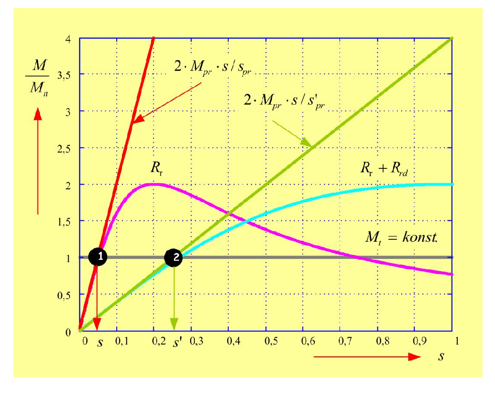
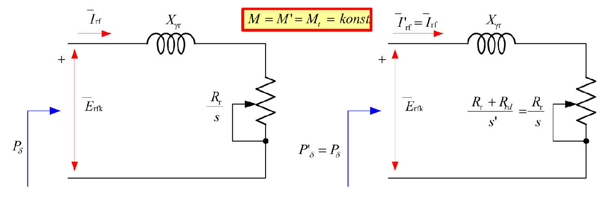

# Zadatak 46 — Regulacija brzine kliznokolutnog asinhronog motora dodatnim rotorskim otporom

## Postavka

Trofazni **šestopolni** asinhroni motor napaja se iz mreže frekvencije $50\ \mathrm{Hz}$. Pri nazivnoj rotorskoj struji motor ima otpor po fazi rotora $R_r = 0{,}2\ \mathrm{\Omega}$, nazivno klizanje $s = 5\ \%$ i gubitke u bakru rotora $P_{\mathrm{Cur}} = 6\ \mathrm{kW}$. Radi regulacije (smanjenja) brzine obrtanja, u rotorsko kolo se doda otpor $R_{rd} = 0{,}8\ \mathrm{\Omega}$ po fazi, pri čemu je moment tereta konstantan, $M_t = \mathrm{konst.}$

Odrediti:

1. brzinu obrtanja **pre** i **posle** regulacije,
2. primljenu snagu rotora (snagu obrtnog polja) **pre** i **posle** regulacije,
3. proizvedenu (mehaničku) snagu **pre** i **posle** regulacije.

> **Prevod na običan jezik:** Imamo asinhroni motor posebne konstrukcije — *kliznokolutni* — kod koga krajevi rotorskog namotaja nisu kratko spojeni unutar mašine, nego su izvedeni napolje preko kliznih prstenova i četkica. To znači da spolja možemo da dodamo otpornik u rotorsko kolo. Motor u početku radi normalno: vrti se malo sporije od sinhrone brzine (klizanje 5 %), a u rotorskim namotajima se greje 6 kW. Onda dodamo spoljašnji otpornik od 0,8 Ω po fazi, dok teret i dalje traži isti moment. Pitanje je: koliko će motor usporiti, da li se menja snaga koju rotor prima kroz vazdušni zazor, i koliko mehaničke snage motor daje na vratilu pre i posle tog zahvata.

## Podaci

| Veličina | Oznaka | Vrednost | Šta ta veličina fizički znači |
|---|---|---|---|
| Frekvencija napajanja | $f_s$ | $50\ \mathrm{Hz}$ | Frekvencija mrežnog napona na statoru; određuje brzinu obrtnog magnetskog polja. |
| Broj polova | $2p = 6$, tj. $p = 3$ | — | Motor je šestopolni: namotaj statora stvara polje sa 3 para magnetskih polova ($p$ je broj *pari* polova). |
| Otpor po fazi rotora | $R_r$ | $0{,}2\ \mathrm{\Omega}$ | Sopstveni (unutrašnji) omski otpor jedne faze rotorskog namotaja. |
| Nazivno klizanje | $s$ | $5\ \% = 0{,}05$ | Relativno zaostajanje rotora za obrtnim poljem u nazivnom radu (definicija u mini-lekciji 1). |
| Gubici u bakru rotora | $P_{\mathrm{Cur}}$ | $6\ \mathrm{kW}$ | Snaga koja se pretvara u toplotu u rotorskim provodnicima (Džulovi gubici) u režimu pre regulacije. |
| Dodatni rotorski otpor | $R_{rd}$ | $0{,}8\ \mathrm{\Omega}$ | Spoljašnji otpornik koji se preko kliznih prstenova dodaje u svaku fazu rotora radi regulacije brzine. |
| Moment tereta | $M_t$ | $\mathrm{konst.}$ | Radna mašina traži isti moment bez obzira na brzinu (npr. dizalica koja drži isti teret). |

## Šta se traži i zašto

**1. Brzine obrtanja $n_r$ (pre) i $n'_r$ (posle).** Brzina obrtanja je osnovna "izlazna" veličina svakog pogona — inženjer dodaje rotorski otpor upravo da bi *namerno* promenio brzinu, pa mora unapred znati na koju će se brzinu motor skrasiti. Plan: iz frekvencije i broja polova nađemo sinhronu brzinu $n_s$, pa iz klizanja brzinu rotora; za režim posle regulacije prvo moramo da izračunamo *novo* klizanje $s'$.

**2. Snaga obrtnog polja $P_\delta$ i $P'_\delta$.** To je snaga koju stator elektromagnetski predaje rotoru kroz vazdušni zazor — "ulaz" u rotor. Zanima nas jer se iz nje granaju i korisna mehanička snaga i gubici u rotoru; ona je i mera opterećenja mašine ($P_\delta$ je direktno srazmerna momentu). Plan: pre regulacije je dobijamo iz poznatih gubitaka u bakru rotora i klizanja; posle regulacije ćemo pokazati (preko ekvivalentnog kola) da ostaje **ista**.

**3. Mehanička snaga $P_c$ i $P'_c$.** To je snaga koju motor stvarno pretvara u mehanički rad na vratilu — ono zbog čega motor uopšte postoji. Poredeći je pre i posle regulacije vidimo *cenu* ovog načina regulacije brzine: koliko snage odlazi u grejanje otpornika. Plan: mehanička snaga je snaga obrtnog polja umanjena za gubitke u bakru rotora, tj. $P_c = (1-s)\,P_\delta$.

Plan rešavanja u celini:

1. Sinhrona brzina $n_s$ iz $f_s$ i $p$.
2. Brzina pre regulacije $n_r$ iz klizanja $s$.
3. Snaga obrtnog polja pre regulacije $P_\delta$ iz $P_{\mathrm{Cur}}$ i $s$.
4. Mehanička snaga pre regulacije $P_c = P_\delta - P_{\mathrm{Cur}}$.
5. Novo klizanje $s'$ iz uslova $M = M' = M_t$ (linearizovani Klosov obrazac), pa nova brzina $n'_r$.
6. Pokazati $P'_\delta = P_\delta$ (ekvivalentno kolo rotora), pa $P'_c = (1-s')\,P'_\delta$.

## Potrebna teorija — mini-lekcije

### Mini-lekcija 1: Sinhrona brzina i klizanje

Trofazni namotaj statora, napajan trofaznim naponima frekvencije $f_s$, stvara **obrtno magnetsko polje**. To polje se okreće takozvanom *sinhronom brzinom*:

$$n_s = \frac{60 \cdot f_s}{p}\ \ \left[\mathrm{min^{-1}}\right]$$

gde je $p$ broj **pari** polova. Poreklo formule: polje napravi jedan pun električni ciklus za jednu periodu napona; kod mašine sa $p$ pari polova jedan električni ciklus odgovara $1/p$ mehaničkog obrtaja, pa se polje mehanički okrene $f_s/p$ puta u sekundi, odnosno $60 f_s/p$ puta u minuti. Intuicija: više polova = "gušće" naslagani magnetski polovi po obimu = polje mora da "prehoda" više polova za jedan pun krug, pa se mehanički okreće sporije.

Rotor asinhronog motora **nikad ne stigne** obrtno polje: da se okreće tačno sinhrono, provodnici rotora ne bi sekli linije polja, ne bi se indukovala struja i ne bi bilo momenta. Zato rotor uvek malo zaostaje, a to zaostajanje merimo **klizanjem**:

$$s = \frac{n_s - n_r}{n_s} \quad\Longrightarrow\quad n_r = (1-s)\cdot n_s$$

Klizanje je bezdimenzioni broj: $s = 0$ znači sinhrono obrtanje (idealan prazan hod), $s = 1$ znači zakočen rotor. Nazivna klizanja motora su tipično mala, nekoliko procenata.

### Mini-lekcija 2: Kliznokolutni motor i dodatni rotorski otpor

Kod običnog (kaveznog) asinhronog motora rotorski provodnici su trajno kratko spojeni — u rotorsko kolo se ne može ništa dodati. Kod **kliznokolutnog** motora rotor nosi pravi trofazni namotaj čiji su krajevi izvedeni na tri **klizna prstena** na vratilu; preko četkica koje klize po prstenovima rotorsko kolo je dostupno spolja. U normalnom radu prstenovi su kratko spojeni, ali možemo između njih vezati i spoljašnji trofazni otpornik $R_{rd}$ po fazi — tada je ukupan otpor rotorskog kola $R_r + R_{rd}$.

Zašto bi to neko radio? Dodatni otpor menja oblik momentne karakteristike (videćemo u mini-lekciji 4) i time pomera radnu tačku motora ka **manjoj brzini** pri istom momentu — jednostavan, robustan način regulacije brzine, istorijski vrlo raširen (dizalice, kranovi). Cena: dodatna snaga se troši (greje) u otporniku, pa je ovaj postupak energetski rasipan — upravo to će ovaj zadatak brojčano pokazati.

### Mini-lekcija 3: Bilans snage rotora — snaga obrtnog polja, gubici, mehanička snaga

**Snaga obrtnog polja** $P_\delta$ (indeks $\delta$ potiče od oznake za vazdušni zazor) je aktivna snaga koju obrtno polje elektromagnetski prenese sa statora na rotor kroz vazdušni zazor. Kada u rotor uđe, ta snaga se deli na tačno dva dela:

- **gubitke u bakru rotora** $P_{\mathrm{Cur}}$ (toplota u ukupnom otporu rotorskog kola) i
- **proizvedenu mehaničku snagu** $P_c$ (snaga elektromagnetske konverzije, koja obrće vratilo).

Ključni rezultat teorije asinhrone mašine je da se ta podela vrši **u razmeri klizanja**:

$$P_{\mathrm{Cur}} = s \cdot P_\delta, \qquad P_c = (1-s)\cdot P_\delta, \qquad P_\delta = P_{\mathrm{Cur}} + P_c$$

Poreklo: moment $M$ koji polje prenosi na rotor isti je za polje i za rotor, ali se polje okreće ugaonom brzinom $\omega_s$, a rotor brzinom $\omega_r = (1-s)\,\omega_s$. Snaga polja je $P_\delta = M\,\omega_s$, a mehanička snaga $P_c = M\,\omega_r = M\,(1-s)\,\omega_s = (1-s)\,P_\delta$; razlika, $s\,P_\delta$, nema kuda nego u toplotu rotorskog kola. Intuicija: klizanje je "procenat snage zazora koji se baca u grejanje rotora" — zato motori sa velikim klizanjem loše "gazduju" energijom.

Iz prve relacije odmah sledi i obrnuto: ako znamo gubitke i klizanje, znamo snagu obrtnog polja:

$$P_\delta = \frac{P_{\mathrm{Cur}}}{s}$$

Napomena o oznakama: $P_\delta$ se u literaturi zove i *primljena snaga rotora* — to je jedna te ista veličina, snaga koja "uđe" u rotor kroz zazor.

### Mini-lekcija 4: Klosov obrazac i prava kao aproksimacija radnog dela karakteristike

**Momentna (mehanička) karakteristika** asinhronog motora je zavisnost momenta $M$ od klizanja $s$. Ona ima maksimum — **prevalni moment** $M_{pr}$ — koji se dostiže pri **prevalnom klizanju** $s_{pr}$. Iz izraza za moment (uz zanemarenje otpora statora) izvodi se kompaktan **Klosov obrazac**, koji celu karakteristiku izražava samo preko te dve prevalne veličine:

$$\frac{M}{M_{pr}} = \frac{2}{\dfrac{s}{s_{pr}} + \dfrac{s_{pr}}{s}}$$

Za rotorsko kolo pri tome važi (opet uz zanemaren statorski otpor):

$$s_{pr} \approx \frac{R_r}{X_{\gamma r}}, \qquad M_{pr} \ne f(R_r)$$

gde je $X_{\gamma r}$ rasipna reaktansa rotora. Dve činjenice odavde su srce ovog zadatka:

1. **Prevalno klizanje je srazmerno ukupnom otporu rotorskog kola.** Dodamo li otpor $R_{rd}$, novo prevalno klizanje je $s'_{pr} \approx (R_r + R_{rd})/X_{\gamma r}$ — vrh karakteristike se *pomera ka većim klizanjima* (manjim brzinama).
2. **Prevalni moment ne zavisi od rotorskog otpora.** Visina vrha ostaje ista; karakteristika se samo "razvlači" po osi klizanja.

**Radni deo karakteristike** je oblast malih klizanja (levo od prevala), gde motor normalno radi. Za $s \ll s_{pr}$ u imeniocu Klosovog obrasca član $s/s_{pr}$ postaje zanemarljiv prema članu $s_{pr}/s$ (mali broj prema velikom), pa u graničnom slučaju $s \to 0$ ostaje:

$$\frac{M}{M_{pr}} \approx \lim_{s \to 0} \left( \frac{2}{\dfrac{s}{s_{pr}} + \dfrac{s_{pr}}{s}} \right) = \frac{2}{\dfrac{s_{pr}}{s}} = \frac{2\,s}{s_{pr}} = \frac{2\,s}{\dfrac{R_r}{X_{\gamma r}}} \qquad \text{(bez dodatnog otpora)}$$

Dakle, na radnom delu **moment je praktično linearna funkcija klizanja** — karakteristika je tu prava kroz koordinatni početak, nagiba $2 M_{pr}/s_{pr}$. Ista logika sa dodatim otporom (klizanje sada označavamo $s'$, prevalno klizanje $s'_{pr}$):

$$\frac{M'}{M_{pr}} \approx \lim_{s' \to 0} \left( \frac{2}{\dfrac{s'}{s_{pr}'} + \dfrac{s'_{pr}}{s'}} \right) = \frac{2\,s'}{s'_{pr}} = \frac{2\,s'}{\dfrac{R_r + R_{rd}}{X_{\gamma r}}} \qquad \text{(sa dodatnim otporom)}$$

Primetimo: u obe formule figuriše **isti** $M_{pr}$ (činjenica 2 iznad) i **ista** reaktansa $X_{\gamma r}$ — jedina razlika je otpor u imeniocu.

Sve rečeno najlakše se vidi na slici koja sledi. Na njoj su nacrtane obe pune momentne karakteristike — ljubičasta za sopstveni otpor $R_r$ i svetloplava za povećani otpor $R_r + R_{rd}$ — zajedno sa njihovim linearnim aproksimacijama (crvena i zelena prava). Horizontalna siva linija je konstantni moment tereta $M_t$; tačka **1** je radna tačka pre regulacije (klizanje $s$), a tačka **2** posle regulacije (klizanje $s'$). Čitaj je ovako: obe krive imaju **isti vrh** (isti $M_{pr}$, ovde $2 M_n$), ali plava vrh dostiže na većem klizanju; presek sive linije tereta sa strmom crvenom pravom daje malo klizanje, a sa položenijom zelenom pravom veće klizanje — motor je usporio.

**Slika 46.1 —** Mehanička karakteristika motora bez i sa dodatnim otporom i aproksimacija radnog dela karakteristike za male vrednosti klizanja. Na apscisi je klizanje $s$, na ordinati relativni moment $M/M_n$. Ljubičasta kriva: karakteristika sa otporom $R_r$; svetloplava: sa otporom $R_r + R_{rd}$. Crvena prava $2 M_{pr}\, s/s_{pr}$ i zelena prava $2 M_{pr}\, s/s'_{pr}$ su linearne aproksimacije radnih delova. Tačke 1 i 2 su preseci sa pravom konstantnog momenta tereta $M_t$ — stacionarne radne tačke pre i posle dodavanja otpora.

### Mini-lekcija 5: Pravilo $R_r/s = \mathrm{konst.}$ i ekvivalentno kolo rotora

Sad izvedimo centralnu relaciju zadatka. U obe radne tačke motor mora da razvija isti moment jednak momentu tereta (u suprotnom bi ubrzavao ili usporavao — stacionarno stanje zahteva ravnotežu momenata):

$$M = M' = M_t = \mathrm{konst.}$$

Podelimo li dve linearizovane jednačine momenta iz mini-lekcije 4 (leve strane su jednake jer je $M = M'$, pa moraju biti jednake i desne):

$$\frac{2\,s}{\dfrac{R_r}{X_{\gamma r}}} = \frac{2\,s'}{\dfrac{R_r + R_{rd}}{X_{\gamma r}}}$$

Dvojke i $X_{\gamma r}$ se skrate (iste su na obe strane), pa ostaje:

$$\frac{s}{R_r} = \frac{s'}{R_r + R_{rd}} \quad\Longleftrightarrow\quad \boxed{\frac{R_r}{s} = \frac{R_r + R_{rd}}{s'}}$$

Rečima: **pri konstantnom momentu, količnik ukupnog rotorskog otpora i klizanja ostaje nepromenjen.** Povećamo li otpor 5 puta, klizanje se poveća tačno 5 puta.

Ovo pravilo ima dublju posledicu, koja se najlepše vidi na ekvivalentnom kolu rotora. Podsetnik: jedna faza rotorskog kola asinhrone mašine može se (posle svođenja na konstantnu učestanost) predstaviti kolom u kome na indukovanu elektromotornu silu $\overline{E}_{\mathrm{rfk}}$ (indeks: **r**otorska **f**azna EMS pri zakočenom — "**k**očenom" — rotoru; ona ne zavisi od klizanja) vezujemo redno rasipnu reaktansu $X_{\gamma r}$ i **fiktivni otpor** $R_r/s$ — deljenje otpora klizanjem je matematički trik kojim se u isto kolo "upakuju" i stvarni gubici i mehanička konverzija. Rotorska struja je tada:

$$I_{\mathrm{rf}} = \frac{E_{\mathrm{rfk}}}{\sqrt{\left(\dfrac{R_r}{s}\right)^2 + X_{\gamma r}^2}}$$

Sledeća slika prikazuje to kolo u oba režima, jedno pored drugog — levo bez dodatnog otpora (fiktivni otpor $R_r/s$), desno sa dodatnim otporom (fiktivni otpor $(R_r + R_{rd})/s'$). Čitaj je ovako: uporedi otpornike u dva kola i iskoristi upravo izvedeno pravilo.

**Slika 46.2 —** Ekvivalentno kolo rotora kliznokolutne mašine bez i sa dodatnim otporom — slučaj konstantnog momenta opterećenja. U oba kola ista elektromotorna sila $\overline{E}_{\mathrm{rfk}}$ napaja rednu vezu rasipne reaktanse $X_{\gamma r}$ i fiktivnog otpora; pošto je $(R_r + R_{rd})/s' = R_r/s$, kola su identična, pa je $\overline{I}'_{\mathrm{rf}} = \overline{I}_{\mathrm{rf}}$ i $P'_\delta = P_\delta$.

Zaključak sa slike: pošto pravilo kaže $(R_r + R_{rd})/s' = R_r/s$, **desno kolo je element po element identično levom** — ista elektromotorna sila, ista reaktansa, isti fiktivni otpor. Identična kola daju identične struje:

$$I'_{\mathrm{rf}} = I_{\mathrm{rf}}$$

a snaga obrtnog polja je upravo snaga koja se razvija na fiktivnom otporu ($P_\delta = 3\, (R_r/s)\, I_{\mathrm{rf}}^2$ za tri faze), pa je i ona nepromenjena:

$$P'_\delta = P_\delta$$

Fizički smisao: pri istom momentu tereta polje kroz zazor "gura" istu snagu ($P_\delta = M\,\omega_s$, a i $M$ i $\omega_s$ su nepromenjeni). Menja se samo *raspodela* te snage unutar rotora: veće klizanje znači veći deo u toplotu ($s'\,P_\delta$), manji deo u mehaniku ($(1-s')\,P_\delta$).

## Rešenje, korak po korak

### Korak 1: Sinhrona brzina obrtanja

**Zašto ovaj korak:** Sve brzine u zadatku (i pre i posle regulacije) računaju se iz klizanja u odnosu na sinhronu brzinu — bez nje ne možemo dalje.

Opšti oblik (mini-lekcija 1):

$$n_s = \frac{60 \cdot f_s}{p}$$

Simboli: $n_s$ — sinhrona brzina obrtnog polja $[\mathrm{min^{-1}}]$; $f_s$ — frekvencija napajanja statora; $p$ — broj pari polova. Motor je šestopolni, dakle ima $2p = 6$ polova, tj. $p = 3$ para polova.

$$n_s = \frac{60 \cdot 50}{3} = \frac{3000}{3} = 1000\ \mathrm{min^{-1}}$$

**Šta smo dobili:** Obrtno polje se vrti 1000 obrtaja u minuti. To je očekivana "tablična" vrednost za šestopolni motor na 50 Hz (dvopolni: 3000, četvoropolni: 1500, šestopolni: 1000 min⁻¹).

### Korak 2: Brzina obrtanja pre regulacije

**Zašto ovaj korak:** Prva tražena veličina — brzina rotora u polaznom (nazivnom) režimu, pre dodavanja otpora.

Opšti oblik (definicija klizanja, mini-lekcija 1):

$$n_r = (1-s)\cdot n_s$$

Simboli: $n_r$ — brzina obrtanja rotora; $s = 0{,}05$ — zadato nazivno klizanje.

$$n_r = (1 - 0{,}05)\cdot 1000 = 0{,}95 \cdot 1000 = 950\ \mathrm{min^{-1}}$$

**Šta smo dobili:** Rotor zaostaje za poljem svega 50 min⁻¹ (5 %), što je tipično malo nazivno klizanje zdravog asinhronog motora.

### Korak 3: Snaga obrtnog polja pre regulacije

**Zašto ovaj korak:** Druga tražena veličina. Snagu obrtnog polja ne znamo direktno, ali znamo gubitke u bakru rotora, a oni su (mini-lekcija 3) tačno $s$-ti deo snage obrtnog polja — pa jednačinu samo "okrenemo".

Opšti oblik: iz $P_{\mathrm{Cur}} = s \cdot P_\delta$ sledi, deljenjem obe strane sa $s$:

$$P_\delta = \frac{P_{\mathrm{Cur}}}{s}$$

Simboli: $P_\delta$ — snaga obrtnog polja (primljena snaga rotora); $P_{\mathrm{Cur}} = 6000\ \mathrm{W}$ — zadati gubici u bakru rotora.

$$P_\delta = \frac{6000}{0{,}05} = 120\,000\ \mathrm{W} = 120\ \mathrm{kW}$$

**Šta smo dobili:** Kroz vazdušni zazor u rotor ulazi 120 kW. Broj je 20 puta veći od gubitaka — logično, jer je klizanje $1/20$ ($5\ \%$), a gubici su baš taj dvadeseti deo snage zazora.

### Korak 4: Mehanička snaga pre regulacije

**Zašto ovaj korak:** Treća tražena veličina za režim pre regulacije. Mehanička snaga je ono što od snage obrtnog polja *preostane* kad se odbije toplota u rotorskim provodnicima (mini-lekcija 3).

Opšti oblik:

$$P_c = P_\delta - P_{\mathrm{Cur}}$$

Simboli: $P_c$ — proizvedena mehanička snaga (snaga elektromagnetske konverzije).

$$P_c = 120\,000 - 6000 = 114\,000\ \mathrm{W} = 114\ \mathrm{kW}$$

Kontrola istim bilansom u drugom obliku: $P_c = (1-s)\,P_\delta = 0{,}95 \cdot 120\,000 = 114\,000\ \mathrm{W}$ — poklapa se.

**Šta smo dobili:** Motor mehanički proizvodi 114 kW, tj. 95 % snage zazora; samo 5 % (jednako klizanju) greje rotor. Ovako i treba da izgleda motor u dobrom, ekonomičnom radnom režimu.

### Korak 5: Klizanje posle dodavanja otpora

**Zašto ovaj korak:** Da bismo našli novu brzinu, prvo moramo novo klizanje $s'$. Njega daje uslov konstantnog momenta primenjen na linearizovanu momentnu karakteristiku (mini-lekcije 4 i 5): pri $M = M'$ važi pravilo konstantnog količnika otpora i klizanja.

Opšti oblik (izveden u mini-lekciji 5 deljenjem dve jednačine momenta):

$$\frac{R_r}{s} = \frac{R_r + R_{rd}}{s'}$$

Rešimo po $s'$: pomnožimo obe strane sa $s'$, pa obe strane sa $s/R_r$:

$$s' = \frac{R_r + R_{rd}}{R_r}\cdot s$$

Simboli: $s'$ — klizanje posle regulacije; $R_{rd} = 0{,}8\ \mathrm{\Omega}$ — dodatni otpor po fazi.

$$s' = \frac{0{,}2 + 0{,}8}{0{,}2}\cdot 0{,}05 = \frac{1{,}0}{0{,}2}\cdot 0{,}05 = 5 \cdot 0{,}05 = 0{,}25$$

**Šta smo dobili:** Ukupan rotorski otpor je porastao 5 puta ($0{,}2 \to 1{,}0\ \mathrm{\Omega}$), pa je i klizanje poraslo tačno 5 puta ($0{,}05 \to 0{,}25$, tj. sa 5 % na 25 %). Klizanje je bezdimenziono, zato uz rezultat nema jedinice. Na slici 46.1 to je pomeranje radne tačke iz 1 u 2 po horizontalnoj pravoj $M_t$.

### Korak 6: Brzina obrtanja posle regulacije

**Zašto ovaj korak:** Sa novim klizanjem $s'$ nova brzina sledi iz iste veze brzine i klizanja kao u Koraku 2; sinhrona brzina se pri tome ne menja (frekvencija i broj polova su ostali isti).

$$n'_r = (1-s')\cdot n_s$$

$$n'_r = (1 - 0{,}25)\cdot 1000 = 0{,}75 \cdot 1000 = 750\ \mathrm{min^{-1}}$$

**Šta smo dobili:** Motor je usporio sa $950$ na $750\ \mathrm{min^{-1}}$ — regulacija brzine je uspela, brzina je smanjena za oko 21 %. Ovo je stacionarna brzina: u tački 2 na slici 46.1 moment motora ponovo je jednak momentu tereta.

### Korak 7: Snaga obrtnog polja posle regulacije

**Zašto ovaj korak:** Traži se primljena snaga rotora u novom režimu. Umesto novog računa, koristimo zaključak iz mini-lekcije 5 (slika 46.2): pošto važi $(R_r + R_{rd})/s' = R_r/s$, ekvivalentno kolo rotora je posle regulacije *identično* onom pre regulacije.

Provera brojevima da su fiktivni otpori zaista jednaki:

$$\frac{R_r}{s} = \frac{0{,}2}{0{,}05} = 4\ \mathrm{\Omega}, \qquad \frac{R_r + R_{rd}}{s'} = \frac{0{,}2 + 0{,}8}{0{,}25} = \frac{1{,}0}{0{,}25} = 4\ \mathrm{\Omega} \quad\checkmark$$

Identična kola $\Rightarrow$ ista rotorska struja ($I'_{\mathrm{rf}} = I_{\mathrm{rf}}$) pri istom opterećenju $\Rightarrow$ ista snaga na fiktivnom otporu, a to je upravo snaga obrtnog polja:

$$P'_\delta = P_\delta = 120\,000\ \mathrm{W} = 120\ \mathrm{kW} = \mathrm{konst.}$$

**Šta smo dobili:** Rotor i posle regulacije prima istih 120 kW kroz zazor. To je u skladu i sa $P_\delta = M\,\omega_s$: ni moment ($M_t = \mathrm{konst.}$) ni sinhrona ugaona brzina se nisu promenili, pa nema od čega da se promeni ni $P_\delta$.

### Korak 8: Mehanička snaga posle regulacije

**Zašto ovaj korak:** Poslednja tražena veličina. Snaga zazora je ista, ali se sada deli pri većem klizanju — mehanički deo je $(1-s')$-ti deo (mini-lekcija 3).

Opšti oblik:

$$P'_c = P'_\delta \cdot (1-s')$$

$$P'_c = 120\,000 \cdot (1 - 0{,}25) = 120\,000 \cdot 0{,}75 = 90\,000\ \mathrm{W} = 90\ \mathrm{kW}$$

**Šta smo dobili:** Mehanička snaga je pala sa 114 kW na 90 kW, iako rotor prima istu snagu. Razlika od $120 - 90 = 30\ \mathrm{kW}$ su novi, petostruko veći gubici u ukupnom otporu rotorskog kola: $P'_{\mathrm{Cur}} = s'\,P'_\delta = 0{,}25 \cdot 120\,000 = 30\,000\ \mathrm{W}$. Drugim rečima, snaga obrtnog polja se u novom režimu drugačije raspoređuje: na račun povećanih Džulovih gubitaka u rotorskom kolu smanjuje se proizvedena mehanička snaga, što se ispoljava kao povećanje klizanja, tj. smanjenje brzine pri istom momentu opterećenja. Zanimljiv detalj: pošto je struja rotora ista, na sopstvenom otporu $R_r$ i dalje se greje istih $30\,000 \cdot 0{,}2/1{,}0 = 6\ \mathrm{kW}$ (kao pre regulacije) — svih dodatnih $24\ \mathrm{kW}$ odlazi na spoljašnji otpornik $R_{rd}$, koji je van mašine i lakše se hladi.

## Česte greške i zamke

1. **Broj polova umesto broja pari polova.** "Šestopolni" znači $2p = 6$, dakle $p = 3$. Ko u formulu $n_s = 60 f_s / p$ uvrsti $p = 6$, dobija $n_s = 500\ \mathrm{min^{-1}}$ i ceo zadatak mu je duplo pogrešan. Zapamti kontrolu: šestopolni motor na 50 Hz *mora* da ima $n_s = 1000\ \mathrm{min^{-1}}$.
2. **Pretpostavka da se posle regulacije menja $P_\delta$.** Intuitivno se čini da "veći otpor = manja snaga u rotor", ali pri $M_t = \mathrm{konst.}$ važi $P_\delta = M\,\omega_s = \mathrm{konst.}$ — snaga zazora zavisi od momenta i *sinhrone* brzine, a ne od brzine rotora. Menja se samo raspodela: više u toplotu, manje u mehaniku.
3. **Računanje novih gubitaka po staroj formuli otpora.** Neko pokuša $P'_{\mathrm{Cur}} = 6\ \mathrm{kW} \cdot (R_r + R_{rd})/R_r = 30\ \mathrm{kW}$ "napamet" — ovde slučajno ispadne tačno (jer je struja ista), ali sigurniji i opštiji put je preko bilansa: $P'_{\mathrm{Cur}} = s'\,P'_\delta$. Uvek prvo bilans snage, pa tek onda otpori i struje.
4. **Mešanje $P_c$ i korisne snage na vratilu.** $P_c$ je *proizvedena* (elektromagnetski konvertovana) mehanička snaga; korisna snaga na vratilu je još manja za mehaničke gubitke (trenje, ventilacija). Ovaj zadatak te gubitke ne razmatra, pa se traži baš $P_c$ — ne oduzimaj ništa dodatno.
5. **Primena linearizacije van radnog dela.** Formula $M \approx 2 M_{pr}\, s/s_{pr}$ važi samo za $s \ll s_{pr}$ (radni deo karakteristike). Ovde je opravdana jer su obe radne tačke na strmim, približno pravim delovima krivih (vidi sliku 46.1); za velika klizanja (npr. polazak, $s = 1$) morala bi se koristiti puna Klosova formula.

## Rezime rezultata

| Veličina | Oznaka | Pre regulacije | Posle regulacije |
|---|---|---|---|
| Sinhrona brzina | $n_s$ | $1000\ \mathrm{min^{-1}}$ | $1000\ \mathrm{min^{-1}}$ (nepromenjena) |
| Klizanje | $s$, $s'$ | $0{,}05$ | $0{,}25$ |
| Brzina obrtanja rotora | $n_r$, $n'_r$ | $950\ \mathrm{min^{-1}}$ | $750\ \mathrm{min^{-1}}$ |
| Snaga obrtnog polja (primljena snaga rotora) | $P_\delta$, $P'_\delta$ | $120\ \mathrm{kW}$ | $120\ \mathrm{kW}$ (nepromenjena) |
| Proizvedena mehanička snaga | $P_c$, $P'_c$ | $114\ \mathrm{kW}$ | $90\ \mathrm{kW}$ |
| Gubici u bakru rotorskog kola | $P_{\mathrm{Cur}}$, $P'_{\mathrm{Cur}}$ | $6\ \mathrm{kW}$ | $30\ \mathrm{kW}$ |

## Provera smisla

**1. Bilans snage u oba režima.** Pre regulacije: $P_c + P_{\mathrm{Cur}} = 114 + 6 = 120\ \mathrm{kW} = P_\delta$ ✓. Posle regulacije: $P'_c + P'_{\mathrm{Cur}} = 90 + 30 = 120\ \mathrm{kW} = P'_\delta$ ✓. Snaga zazora se u oba slučaja tačno raspodeljuje na mehaniku i toplotu, u razmerama $(1-s):s$, tj. $95:5$ i $75:25$.

**2. Srazmera brzine i mehaničke snage.** Pri konstantnom momentu mora važiti $P_c = M_t\,\omega_r \propto n_r$, pa odnos mehaničkih snaga mora biti jednak odnosu brzina: $P'_c/P_c = 90/114 \approx 0{,}789$ i $n'_r/n_r = 750/950 \approx 0{,}789$ — poklapa se ✓. Mehanička snaga je "prokliznula" tačno onoliko koliko i brzina.

**3. Granični slučaj / dimenziona kontrola.** Ako bismo stavili $R_{rd} = 0$, formula za novo klizanje daje $s' = (R_r + 0)/R_r \cdot s = s$ — ništa se ne menja, kao što i mora biti. Dimenzije u $s' = \big[(R_r + R_{rd})/R_r\big]\, s$: količnik dva otpora je bezdimenzion, pa je i $s'$ bezdimenziono kao i $s$ ✓. A vrednost $s' = 0{,}25$ je i dalje ispod tipičnih prevalnih klizanja karakteristike sa dodatim otporom (na slici 46.1 svetloplava kriva vrh dostiže tek oko $s \approx 1$), pa radna tačka 2 zaista leži na radnom, približno linearnom delu — linearizacija je bila opravdana.
