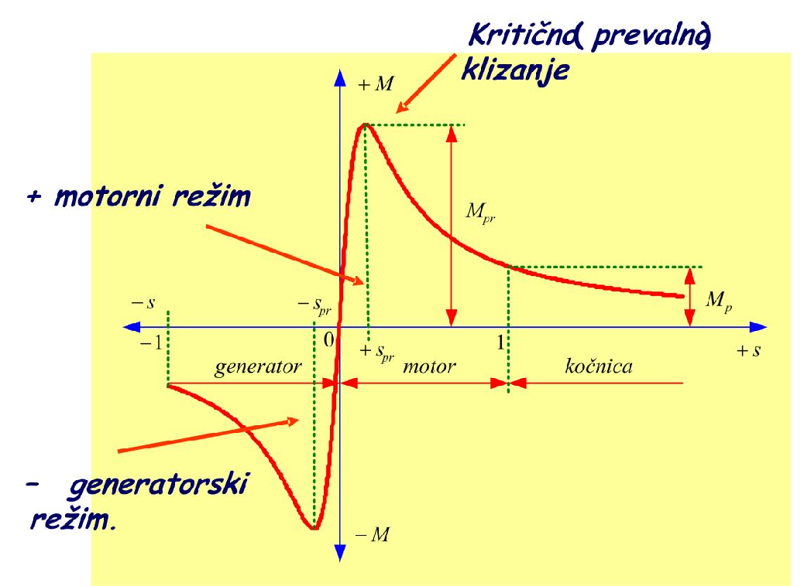
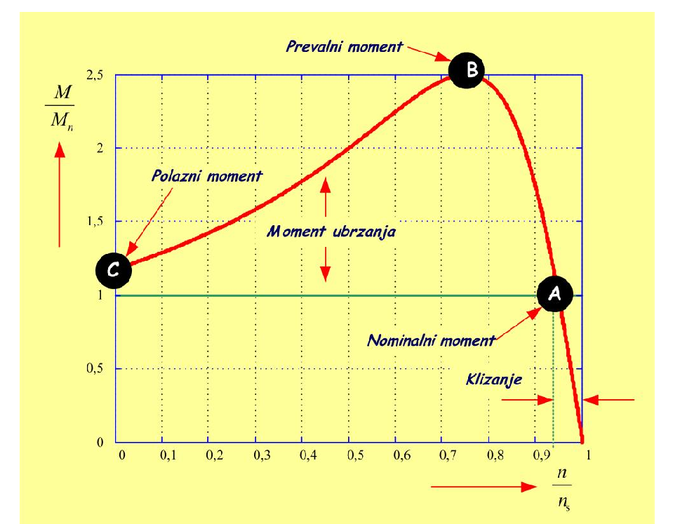
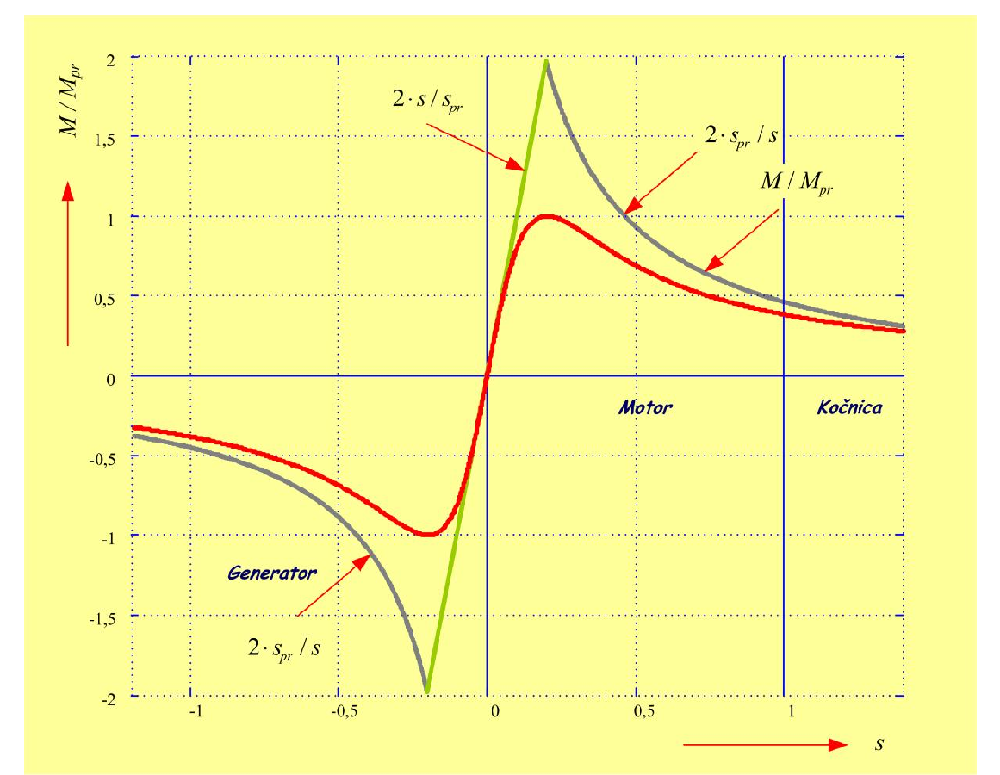

# Zadatak 47 — Brzina obrtanja motora iz kataloških podataka (Klosov obrazac)

## Postavka

Četvoropolni asinhroni motor, napajan iz mreže učestanosti $50\ \mathrm{Hz}$, u polasku razvija
polazni moment veći za $25\ \%$ od nominalnog momenta, koji iznosi $30\ \mathrm{Nm}$. Nominalna
preopteretivost motora iznosi $2{,}5$. Motor pokreće radnu mašinu čiji je moment nezavisan od
brzine i jednak $24\ \mathrm{Nm}$. Odrediti brzinu obrtanja motora.

> **Prevod na običan jezik:** O motoru ne znamo skoro ništa "iznutra" — nemamo ni otpornosti
> ni reaktanse njegove ekvivalentne šeme, ni rezultate ogleda praznog hoda i kratkog spoja.
> Znamo samo ono što piše u katalogu proizvođača: koliki mu je nominalni moment
> ($30\ \mathrm{Nm}$), koliko je polazni moment veći od nominalnog ($25\ \%$, dakle iznosi
> $37{,}5\ \mathrm{Nm}$) i koliko je najveći (prevalni) moment veći od nominalnog ($2{,}5$ puta,
> dakle $75\ \mathrm{Nm}$). Motor vuče teret koji mu se stalno opire istim momentom od
> $24\ \mathrm{Nm}$, bez obzira na brzinu. Pitanje glasi: kojom će se brzinom (u obrtajima u
> minuti) motor na kraju ustaliti? Rešavaćemo pomoću **Klosovog obrasca** — formule koja opisuje
> momentnu karakteristiku motora koristeći samo odnose momenata i klizanja, bez poznavanja
> ijedne otpornosti ili reaktanse.

## Podaci

| Veličina | Oznaka | Vrednost | Šta ta veličina fizički znači |
|---|---|---|---|
| Broj polova | $2p$ | $4$ (tj. $p = 2$ para polova) | Koliko magnetnih polova stvara namotaj statora; od broja polova zavisi sinhrona brzina obrtnog polja. |
| Učestanost mreže | $f$ | $50\ \mathrm{Hz}$ | Učestanost napona kojim se motor napaja; zajedno sa brojem polova određuje brzinu obrtnog polja. |
| Nominalni moment | $M_{\mathrm{n}}$ | $30\ \mathrm{Nm}$ | Moment koji motor sme trajno da razvija pri nazivnim uslovima, a da se ne pregreje. |
| Relativni polazni moment | $M_{\mathrm{pol}}/M_{\mathrm{n}}$ | $1{,}25$ | Polazni moment (moment pri pokretanju, dok rotor još stoji) je za $25\ \%$ veći od nominalnog: $M_{\mathrm{pol}} = 1{,}25 \cdot 30 = 37{,}5\ \mathrm{Nm}$. |
| Nominalna preopteretivost | $\nu = M_{\mathrm{pr}}/M_{\mathrm{n}}$ | $2{,}5$ | Odnos najvećeg (prevalnog) momenta koji motor uopšte može da razvije i nominalnog momenta: $M_{\mathrm{pr}} = 2{,}5 \cdot 30 = 75\ \mathrm{Nm}$. |
| Moment radne mašine | $M_{\mathrm{opt}}$ | $24\ \mathrm{Nm}$, konstantan | Moment kojim se teret opire obrtanju — ovde isti pri svakoj brzini (npr. dizalica koja podiže stalan teret). |

**Traži se:** brzina obrtanja $n$ u ustaljenom (stacionarnom) stanju, u $\mathrm{min^{-1}}$.

## Šta se traži i zašto

**Brzina obrtanja $n$** je broj obrtaja rotora u minuti kada se motor "smiri" — kada se, posle
polaska i zaleta, ustali u ravnoteži sa teretom. Inženjera ta brzina zanima iz sasvim praktičnih
razloga: od nje zavisi npr. protok pumpe, brzina trake, brzina dizanja tereta — a i da li motor
radi blizu nominalne tačke ili je preopterećen.

Ovaj zadatak je poseban po tome što **nemamo parametre ekvivalentne šeme** (otpornosti i
reaktanse), pa ne možemo da koristimo "pun" izraz za moment kao u zadacima gde su ti parametri
poznati. Ali imamo kataloške odnose momenata — i upravo za takve situacije služi Klosov obrazac.

Plan rešavanja u četiri poteza:

1. Iz broja polova i učestanosti mreže izračunamo **sinhronu brzinu** $n_{\mathrm{s}}$ — brzinu
   obrtnog polja, koja je "plafon" brzine motora.
2. Iz kataloških odnosa izračunamo stvarne momente u njutn-metrima: $M_{\mathrm{pol}}$ i
   $M_{\mathrm{pr}}$.
3. Napišemo Klosov obrazac za trenutak **polaska** (tada je klizanje tačno $1$) — u njemu je
   jedina nepoznata **prevalno klizanje** $s_{\mathrm{pr}}$, pa ga izračunamo iz kvadratne
   jednačine.
4. Napišemo Klosov obrazac za **ustaljeno stanje** (motor tada razvija tačno moment tereta,
   $24\ \mathrm{Nm}$) — sada je jedina nepoznata klizanje $s$ radne tačke; iz njega odmah sledi
   brzina $n = (1-s)\cdot n_{\mathrm{s}}$.

## Potrebna teorija — mini-lekcije

Originalno rešenje u zbirci sadrži čitavo izvođenje Klosovog obrasca. To izvođenje je ovde
razloženo na mini-lekcije: prvo osnovni pojmovi, zatim odakle uopšte dolazi momentna
karakteristika, pa prevalno klizanje i prevalni moment, i na kraju sam Klosov obrazac sa svojim
korisnim izvedenim oblicima.

### Mini-lekcija 1: Sinhrona brzina i klizanje

Trofazni namotaj statora, priključen na mrežu učestanosti $f$, stvara **obrtno magnetno polje**
koje se okreće **sinhronom brzinom**:

$$n_{\mathrm{s}} = \frac{60 \cdot f}{p}\ \ [\mathrm{min^{-1}}]$$

gde je $p$ broj **pari** polova (motor sa 4 pola ima $p = 2$ para), a činilac $60$ pretvara
obrtaje u sekundi u obrtaje u minuti. Rotor asinhronog motora se u motorskom režimu uvek okreće
**sporije** od polja — upravo to zaostajanje indukuje struje u rotoru i stvara moment. Zaostajanje
merimo **klizanjem**:

$$s = \frac{n_{\mathrm{s}} - n}{n_{\mathrm{s}}} \quad\Longleftrightarrow\quad n = (1-s)\cdot n_{\mathrm{s}}$$

Dve ključne vrednosti klizanja koje ćemo stalno koristiti:

- **Polazak:** rotor još stoji, $n = 0$, pa je $s = 1$.
- **Sinhronizam:** rotor bi sustigao polje, $n = n_{\mathrm{s}}$, pa je $s = 0$ (motor tu ne
  razvija moment, jer nema relativnog kretanja polja u odnosu na rotor).

Motorski režim rada je, dakle, opseg $0 < s < 1$. Klizanje $s < 0$ znači da se rotor okreće brže
od polja (generatorski režim), a $s > 1$ da se rotor okreće suprotno od polja (kočioni režim).

### Mini-lekcija 2: Ustaljeno stanje — motor razvija tačno moment tereta

Obrtanje rotora opisuje Njutnov zakon za rotaciju:

$$J \cdot \frac{d\Omega}{dt} = M - M_{\mathrm{opt}}$$

gde je $J$ moment inercije obrtnih masa, $\Omega$ ugaona brzina rotora, $M$ moment koji razvija
motor, a $M_{\mathrm{opt}}$ moment kojim se opire radna mašina. Dok je $M > M_{\mathrm{opt}}$,
razlika (moment ubrzanja) ubrzava rotor; brzina raste sve dok se momenti ne izjednače. U
**ustaljenom (stacionarnom) stanju** brzina se više ne menja ($d\Omega/dt = 0$), pa mora biti:

$$M = M_{\mathrm{opt}}$$

Za naš zadatak to znači: kada se motor ustali, on razvija tačno $24\ \mathrm{Nm}$ — ni nominalnih
$30\ \mathrm{Nm}$, ni bilo šta drugo. Ovo je mali, ali presudan uvid: klizanje radne tačke tražimo
iz uslova $M = 24\ \mathrm{Nm}$.

### Mini-lekcija 3: Momentna karakteristika $M(s)$ iz uprošćene ekvivalentne šeme

Asinhroni motor se u ustaljenom stanju modeluje ekvivalentnom električnom šemom (redna veza
statorske impedanse i svedene rotorske impedanse, sa poprečnom granom magnećenja). Ako se
**zanemari struja praznog hoda** (poprečna grana magnećenja), dobija se uprošćena šema iz koje
sledi poznati izraz za moment u funkciji klizanja:

$$M = \frac{\dfrac{30}{\pi} \cdot q_s \cdot U_{sf}^2 \cdot \dfrac{R'_r}{s}}{n_{\mathrm{s}} \cdot \left[\left(R_s + \dfrac{R'_r}{s}\right)^2 + \left(X_{\gamma s} + X'_{\gamma r}\right)^2\right]}$$

Značenje svakog simbola:

- $q_s$ — broj faza statora (za trofazni motor $q_s = 3$);
- $U_{sf}$ — efektivna vrednost **faznog** napona statora;
- $R_s$ — otpornost statorskog namotaja (po fazi);
- $R'_r$ — otpornost rotorskog namotaja **svedena na stator** (crtica "prim" označava da je
  rotorska veličina preračunata preko odnosa broja navojaka, tako da može da stoji u istom kolu
  sa statorskim veličinama);
- $X_{\gamma s}$ — rasipna reaktansa statora (indeks $\gamma$ označava rasipanje);
- $X'_{\gamma r}$ — rasipna reaktansa rotora svedena na stator;
- $n_{\mathrm{s}}$ — sinhrona brzina u $\mathrm{min^{-1}}$.

Odakle činilac $\frac{30}{\pi}$? Moment je snaga podeljena ugaonom brzinom, a sinhrona ugaona
brzina u $\mathrm{rad/s}$ iznosi $\Omega_{\mathrm{s}} = \frac{2\pi \cdot n_{\mathrm{s}}}{60} = \frac{\pi \cdot n_{\mathrm{s}}}{30}$,
pa je $\frac{1}{\Omega_{\mathrm{s}}} = \frac{30}{\pi \cdot n_{\mathrm{s}}}$ — otuda $\frac{30}{\pi}$
u brojiocu i $n_{\mathrm{s}}$ u imeniocu.

Za dalje izvođenje zgodno je izraz preurediti tako da klizanje $s$ ostane samo u imeniocu.
Kvadrat u imeniocu proširimo sa $s$ (jer je $R_s + \frac{R'_r}{s} = \frac{s \cdot R_s + R'_r}{s}$),
a zatim ceo razlomak pomnožimo sa $\frac{s}{s}$, čime iz brojioca nestane $\frac{1}{s}$:

$$M = \frac{\dfrac{30}{\pi} \cdot q_s \cdot U_{sf}^2 \cdot R'_r}{n_{\mathrm{s}} \cdot \left[\dfrac{\left(s \cdot R_s + R'_r\right)^2}{s} + s \cdot \left(X_{\gamma s} + X'_{\gamma r}\right)^2\right]} = \frac{u}{v}$$

Moment je sada napisan u obliku razlomka $\frac{u}{v}$ u kome **brojilac $u$ uopšte ne zavisi
od klizanja**, a sva zavisnost od $s$ je u **imeniocu $v$**. To će nam u sledećoj lekciji
drastično skratiti traženje maksimuma. (Pažnja: latinična slova $u$ i $v$ ovde su samo skraćenice
za brojilac i imenilac — ne mešati $v$ sa grčkim slovom $\nu$ koje ćemo kasnije koristiti za
preopteretivost.)

### Mini-lekcija 4: Prevalno klizanje — klizanje pri kome je moment najveći

Momentna karakteristika $M(s)$ nije monotona: moment prvo raste sa klizanjem, dostiže maksimum,
pa opada. Taj maksimum se zove **prevalni (kritični) moment** $M_{\mathrm{pr}}$, a klizanje pri
kome se javlja **prevalno (kritično) klizanje** $s_{\mathrm{pr}}$. Nalazimo ga standardno —
izjednačavanjem prvog izvoda funkcije $M(s)$ sa nulom. Za izvod količnika važi pravilo:

$$\frac{dM}{ds} = \frac{u' \cdot v - v' \cdot u}{v^2} = 0 \quad\Longrightarrow\quad u' \cdot v - v' \cdot u = 0$$

(crtica ovde označava izvod po $s$). Izračunajmo sve četiri veličine:

$$\begin{aligned}
u &= \frac{30}{\pi} \cdot q_s \cdot U_{sf}^2 \cdot R'_r \\
u' &= 0 \quad (\text{jer } u \text{ ne zavisi od } s)\\
v &= n_{\mathrm{s}} \cdot \left[\frac{\left(s \cdot R_s + R'_r\right)^2}{s} + s \cdot \left(X_{\gamma s} + X'_{\gamma r}\right)^2\right] \\
v' &= n_{\mathrm{s}} \cdot \left[\frac{2 \cdot \left(s \cdot R_s + R'_r\right) \cdot R_s \cdot s - \left(s \cdot R_s + R'_r\right)^2}{s^2} + \left(X_{\gamma s} + X'_{\gamma r}\right)^2\right]
\end{aligned}$$

(Prvi sabirak u $v'$ je opet izvod količnika: brojilac $(sR_s+R'_r)^2$ ima izvod
$2(sR_s+R'_r)\cdot R_s$, imenilac je $s$, pa po istom pravilu dobijamo napisani razlomak sa $s^2$
dole.) Pošto je $u' = 0$, a $u \neq 0$, uslov maksimuma se svodi na:

$$u \neq 0, \qquad v' = 0$$

Izjednačimo dakle uglastu zagradu u $v'$ sa nulom i pomnožimo je sa $s^2$ da nestanu razlomci:

$$2 \cdot \left(s \cdot R_s + R'_r\right) \cdot R_s \cdot s - \left(s \cdot R_s + R'_r\right)^2 + s^2 \cdot \left(X_{\gamma s} + X'_{\gamma r}\right)^2 = 0$$

Razvijmo kvadrat i proizvod (koristimo $(a+b)^2 = a^2 + 2ab + b^2$ sa $a = s R_s$, $b = R'_r$):

$$2 \cdot s^2 \cdot R_s^2 + 2 \cdot s \cdot R_s \cdot R'_r - s^2 \cdot R_s^2 - 2 \cdot s \cdot R_s \cdot R'_r - {R'_r}^2 + s^2 \cdot \left(X_{\gamma s} + X'_{\gamma r}\right)^2 = 0$$

Sabirci $2 s R_s R'_r$ i $-2 s R_s R'_r$ se potiru, a od $2 s^2 R_s^2 - s^2 R_s^2$ ostaje
$s^2 R_s^2$, pa se sve sažima u:

$$s^2 \cdot \left[R_s^2 + \left(X_{\gamma s} + X'_{\gamma r}\right)^2\right] = {R'_r}^2$$

Korenovanjem dobijamo **prevalno klizanje**:

$$s_{\mathrm{pr}} = \pm \frac{R'_r}{\sqrt{R_s^2 + \left(X_{\gamma s} + X'_{\gamma r}\right)^2}}$$

Dva znaka nisu greška: znak $+$ daje prevalno klizanje u **motorskom** režimu, a znak $-$ u
**generatorskom** režimu (karakteristika ima maksimum i za pozitivna i za negativna klizanja).

Sledeća slika prikazuje celu momentnu karakteristiku $M(s)$, sa oba prevala.

**Slika 47.1 —** Moment asinhrone mašine u funkciji klizanja (momentna karakteristika) sa
naznačenim prevalnim momentom i prevalnim klizanjem.

> **Kako čitati sliku 47.1:** Grafik je principski (na osama nema brojčane razmere, samo karakteristične vrednosti). Horizontalna plava osa je klizanje $s$ (bezdimenziono), raste udesno: obeležene su vrednosti $-1$, $-s_{\mathrm{pr}}$, $0$, $+s_{\mathrm{pr}}$ i $1$; zapamti da brzina rotora duž ove ose *opada* udesno, jer je $n = (1-s)\,n_{\mathrm{s}}$. Vertikalna osa je moment $M$ ($+M$ gore, $-M$ dole). Debela **crvena kriva** je momentna karakteristika $M(s)$. Zelene tačkaste linije obeležavaju karakteristične tačke: pri $s = +s_{\mathrm{pr}}$ (za naš motor $0{,}268$) kriva ima maksimum, a crvena dvosmerna strelica do njega označava prevalni moment $M_{\mathrm{pr}}$ (kod nas $75\ \mathrm{Nm}$); pri $s = 1$ (polazak) manja dvosmerna strelica označava polazni moment $M_p$ (kod nas $37{,}5\ \mathrm{Nm}$); pri $s = -s_{\mathrm{pr}}$ je simetrični negativni preval. Crvene horizontalne strelice ispod ose dele područja rada, ispisana kurzivom: **generator** ($s < 0$, moment negativan — na to pokazuje i plavi natpis „− generatorski režim"), **motor** ($0 < s < 1$, moment pozitivan — plavi natpis „+ motorni režim") i **kočnica** ($s > 1$). Plavi natpis „Kritično (prevalno) klizanje" pokazuje strelicom upravo na vrh krive. Karakteristične nule: $M = 0$ u $s = 0$ (sinhronizam — nema relativnog kretanja polja i rotora), a za velika $|s|$ kriva opada ka nuli kao hiperbola. Šta treba da zaključiš: maksimum momenta nije ni na polasku ni na sinhronizmu, nego između njih, pri $s_{\mathrm{pr}}$ — upravo tu činjenicu Klosov obrazac pretvara u računsku alatku ovog zadatka.

**Korisna uprošćenja** (iznosi ih i original). Kod mašina većih snaga otpornost statorskog
namotaja je znatno manja od zbira rasipnih reaktansi:

$$R_s \ll X_{\gamma s} + X'_{\gamma r}$$

pa se prevalno klizanje uprošćava u:

$$s_{\mathrm{pr}} \approx \pm \frac{R'_r}{X_{\gamma s} + X'_{\gamma r}}$$

Ako bi se, još grublje, zanemarila i rasipna reaktansa statora ($X_{\gamma s} \approx 0$), tj.
cela statorska impedansa, mašina bi se predstavila samo rotorskim kolom i važilo bi
$s_{\mathrm{pr}} \approx \frac{R'_r}{X'_{\gamma r}} = \frac{R_r}{X_{\gamma r}}$ (poslednja
jednakost kaže da se odnos ne menja svođenjem na stator, jer se $R_r$ i $X_{\gamma r}$ svode
istim količnikom). **Ta poslednja pretpostavka, međutim, nije realna**: u stvarnosti su rasuti
fluksevi statora i rotora približno jednaki, pa je $X_{\gamma s} \approx X'_{\gamma r}$ — nijedna
od te dve reaktanse se ne sme izbaciti, jer su istog reda veličine.

### Mini-lekcija 5: Prevalni moment

Vrednost prevalnog momenta dobijamo tako što prevalno klizanje uvrstimo u izraz za $M(s)$.
Zgodno je prvo primetiti da iz izraza za $s_{\mathrm{pr}}$ direktno sledi:

$$\frac{R'_r}{s_{\mathrm{pr}}} = \pm\sqrt{R_s^2 + \left(X_{\gamma s} + X'_{\gamma r}\right)^2}$$

Uvrštavanjem ovoga umesto $\frac{R'_r}{s}$ u polazni izraz za moment (onaj iz mini-lekcije 3, u
prvobitnom obliku):

$$M_{\mathrm{pr}} = \frac{\dfrac{30}{\pi} \cdot q_s \cdot U_{sf}^2 \cdot \left[\pm\sqrt{R_s^2 + \left(X_{\gamma s} + X'_{\gamma r}\right)^2}\right]}{n_{\mathrm{s}} \cdot \left[\left(R_s \pm \sqrt{R_s^2 + \left(X_{\gamma s} + X'_{\gamma r}\right)^2}\right)^2 + \left(X_{\gamma s} + X'_{\gamma r}\right)^2\right]}$$

Kada se kvadrat u imeniocu razvije i izraz skrati (razvijanjem se u imeniocu javi tačno
dvostruki proizvod $2 R_s \sqrt{\dots}$ plus dvostruka potkorena veličina, što se sve može
izvući kao zajednički činilac $2\sqrt{\dots}$ i skratiti sa korenom iz brojioca), dobija se
prevalni moment:

$$M_{\mathrm{pr}} = \pm \frac{\dfrac{30}{\pi} \cdot q_s \cdot U_{sf}^2}{2 \cdot n_{\mathrm{s}} \cdot \left[R_s \pm \sqrt{R_s^2 + \left(X_{\gamma s} + X'_{\gamma r}\right)^2}\right]}$$

Znak $+$ važi za motorski, a znak $-$ za generatorski režim rada. Dva važna zapažanja:

1. **Prevalni moment ne zavisi od otpornosti rotorskog kola** $R'_r$ (nje u izrazu uopšte nema).
   Ako, recimo, u rotorsko kolo kliznokolutne mašine dodamo spoljašnji otpornik, maksimum
   momenta ostaje isti — samo se pomera ka većem klizanju (jer $s_{\mathrm{pr}}$ zavisi od
   $R'_r$). Prevalno klizanje i prevalni moment su, dakle, dve nezavisne "ručke" karakteristike.
2. Ako se i ovde zanemari otpornost statora ($R_s \ll X_{\gamma s} + X'_{\gamma r}$), dobija se
   približan izraz:

$$M_{\mathrm{pr}} \approx \pm \frac{\dfrac{30}{\pi} \cdot q_s \cdot U_{sf}^2}{2 \cdot n_{\mathrm{s}} \cdot \left(X_{\gamma s} + X'_{\gamma r}\right)}$$

### Mini-lekcija 6: Kataloški podaci — relativni momenti

Proizvođač u katalogu ne navodi otpornosti i reaktanse, ali navodi **odnose karakterističnih
momenata**:

- **Relativni polazni moment** $\dfrac{M_{\mathrm{pol}}}{M_{\mathrm{n}}}$ — odnos polaznog
  momenta (pri nominalnom naponu napajanja) i nominalnog momenta. Kod asinhronih mašina se
  najčešće kreće u opsegu $0{,}7$ – $2{,}5$.
- **Relativni prevalni moment** ili **nominalna preopteretivost**
  $\nu = \dfrac{M_{\mathrm{pr}}}{M_{\mathrm{n}}}$ — odnos prevalnog momenta (pri nominalnom
  naponu) i nominalnog momenta. Obično se kreće u opsegu $2$ – $3$.

Sledeća slika prikazuje momentnu karakteristiku sa označenim karakterističnim radnim tačkama —
ovog puta nacrtanu na "kataloški" način.

**Slika 47.2 —** Relativni momenti asinhrone mašine.

> **Kako čitati sliku 47.2:** Ista karakteristika kao na slici 47.1, ali nacrtana „kataloški". Horizontalna osa je **relativna brzina** $n/n_{\mathrm{s}}$ (bezdimenziona, od $0$ do $1$; podeoci na $0{,}1$) — pazi, sada brzina raste udesno, obrnuto nego na slici 47.1. Vertikalna osa je **relativni moment** $M/M_{\mathrm{n}}$ (od $0$ do $2{,}5$); plava tačkasta mreža služi za očitavanje. Debela **crvena kriva** je momentna karakteristika motora, a na njoj su tri crne tačke sa plavim natpisima: **C** (skroz levo, $n = 0$, $M/M_{\mathrm{n}} = 1{,}25$) — „Polazni moment"; **B** (vrh krive, oko $n/n_{\mathrm{s}} \approx 0{,}75$, $M/M_{\mathrm{n}} = 2{,}5$) — „Prevalni moment"; **A** (na strmoj opadajućoj grani, $M/M_{\mathrm{n}} = 1$ pri $n/n_{\mathrm{s}} \approx 0{,}93$) — „Nominalni moment", tj. nominalna radna tačka. Mali razmak od tačke A do desnog kraja ose ($n/n_{\mathrm{s}} = 1$), obeležen crvenim strelicama i natpisom „Klizanje", jeste nominalno klizanje. **Zelena horizontalna linija** na visini $M/M_{\mathrm{n}} = 1$ je linija opterećenja nominalnim momentom; crvena dvosmerna strelica „Moment ubrzanja" pokazuje vertikalno rastojanje između crvene krive i te linije — višak momenta koji tokom zaleta ubrzava rotor. Zgodna podudarnost: kriva ima polazni moment $1{,}25\,M_{\mathrm{n}}$ i prevalni $2{,}5\,M_{\mathrm{n}}$ — praktično baš motor iz našeg zadatka ($37{,}5$ i $75\ \mathrm{Nm}$ uz $M_{\mathrm{n}} = 30\ \mathrm{Nm}$); naša radna tačka, međutim, nije A, nego leži nešto niže i desno od nje: $M/M_{\mathrm{n}} = 24/30 = 0{,}8$ pri $n/n_{\mathrm{s}} = 0{,}956$. Šta treba da zaključiš: katalog ti preko tačaka C i B daje upravo dva odnosa momenata ($1{,}25$ i $2{,}5$) — tačno ono što Klosovom obrascu treba da rekonstruiše celu krivu bez ijedne otpornosti i reaktanse.

### Mini-lekcija 7: Klosov obrazac

Sada dolazi ključna ideja. Podelimo izraz za moment $M$ pri proizvoljnom klizanju $s$
(mini-lekcija 3) izrazom za prevalni moment $M_{\mathrm{pr}}$ (mini-lekcija 5, motorski znak).
U tom količniku se **skrate svi činioci koji sadrže napon, broj faza i sinhronu brzinu**
($\frac{30}{\pi} q_s U_{sf}^2$ i $n_{\mathrm{s}}$), a preostale otpornosti i reaktanse se, posle
kraćeg sređivanja, mogu izraziti isključivo preko dve bezdimenzione veličine: prevalnog klizanja
$s_{\mathrm{pr}}$ i pomoćnog broja $\beta$. Rezultat je **potpuni Klosov obrazac**:

$$\frac{M}{M_{\mathrm{pr}}} = \frac{2 \cdot (1 + \beta)}{\dfrac{s}{s_{\mathrm{pr}}} + \dfrac{s_{\mathrm{pr}}}{s} + 2 \cdot \beta}$$

gde su:

$$\beta = \frac{R_s}{\sqrt{R_s^2 + \left(X_{\gamma s} + X'_{\gamma r}\right)^2}} = \frac{R_s}{R'_r} \cdot s_{\mathrm{pr}} \approx s_{\mathrm{pr}}, \qquad s_{\mathrm{pr}} = \frac{R'_r}{\sqrt{R_s^2 + \left(X_{\gamma s} + X'_{\gamma r}\right)^2}}$$

(Srednja jednakost za $\beta$ sledi prostim proširivanjem: $\beta$ i $s_{\mathrm{pr}}$ imaju isti
imenilac, pa je $\beta = \frac{R_s}{R'_r} \cdot s_{\mathrm{pr}}$; približna jednakost
$\beta \approx s_{\mathrm{pr}}$ važi ako se uvaži da je otpornost statorskog namotaja približno
jednaka otpornosti rotora, $R_s \approx R'_r$.)

Ovo je upravo ono što smo tražili: **cela momentna karakteristika izražena bez ijednog
parametra ekvivalentne šeme** — samo preko odnosa momenata i odnosa klizanja.

Ako se otpornost statora zanemari ($R_s \ll X_{\gamma s} + X'_{\gamma r}$, pa $\beta \approx 0$) —
što u stvarnosti dobro važi za kliznokolutne mašine i za kavezne mašine bez izraženog efekta
potiskivanja struje u rotoru — dobija se **uprošćeni Klosov obrazac**, koji ćemo koristiti u
zadatku:

$$\frac{M}{M_{\mathrm{pr}}} = \frac{2}{\dfrac{s}{s_{\mathrm{pr}}} + \dfrac{s_{\mathrm{pr}}}{s}}, \qquad s_{\mathrm{pr}} = \frac{R'_r}{X_{\gamma s} + X'_{\gamma r}}$$

**Odakle taj oblik — kratka provera za radoznale.** Uvedimo kraću oznaku
$X = X_{\gamma s} + X'_{\gamma r}$ i stavimo $R_s = 0$. Izraz za moment iz mini-lekcije 3 i
izraz za prevalni moment iz mini-lekcije 5 (koji je za $R_s = 0$ tačan, ne samo približan)
tada glase:

$$M = \frac{\dfrac{30}{\pi} \cdot q_s \cdot U_{sf}^2 \cdot \dfrac{R'_r}{s}}{n_{\mathrm{s}} \cdot \left[\left(\dfrac{R'_r}{s}\right)^2 + X^2\right]}, \qquad M_{\mathrm{pr}} = \frac{\dfrac{30}{\pi} \cdot q_s \cdot U_{sf}^2}{2 \cdot n_{\mathrm{s}} \cdot X}$$

Njihov količnik (sve zajedničko — napon, broj faza, sinhrona brzina — skrati se) iznosi:

$$\frac{M}{M_{\mathrm{pr}}} = \frac{2 X \cdot \dfrac{R'_r}{s}}{\left(\dfrac{R'_r}{s}\right)^2 + X^2}$$

pa deljenjem brojioca i imenioca sa $X \cdot \frac{R'_r}{s}$ dobijamo

$$\frac{M}{M_{\mathrm{pr}}} = \frac{2}{\dfrac{R'_r}{s \cdot X} + \dfrac{s \cdot X}{R'_r}} = \frac{2}{\dfrac{s_{\mathrm{pr}}}{s} + \dfrac{s}{s_{\mathrm{pr}}}}$$

jer je $\frac{R'_r}{X} = s_{\mathrm{pr}}$. Dakle, uprošćeni Klosov obrazac je zaista samo
prepakovan izraz za moment.

### Mini-lekcija 8: Izvedeni (inverzni) oblici Klosovog obrasca

Klosov obrazac povezuje tri veličine: odnos $\frac{M_{\mathrm{pr}}}{M}$, klizanje $s$ i prevalno
klizanje $s_{\mathrm{pr}}$ — pa se iz bilo koje dve može izračunati treća. Krenimo od uprošćenog
obrasca i uvedimo oznaku za **preopteretivost u posmatranoj tački**:

$$\nu = \frac{M_{\mathrm{pr}}}{M}$$

(Odnos prevalnog momenta i momenta pri klizanju $s$ na istoj momentnoj karakteristici; kada je
$M = M_{\mathrm{n}}$, to je nominalna preopteretivost iz kataloga.) Klosov obrazac tada glasi
$\frac{s}{s_{\mathrm{pr}}} + \frac{s_{\mathrm{pr}}}{s} = 2\nu$; množenjem sa
$s \cdot s_{\mathrm{pr}}$ dobija se kvadratna jednačina

$$s^2 - 2 \nu \, s_{\mathrm{pr}} \cdot s + s_{\mathrm{pr}}^2 = 0$$

čija rešenja po $s$ (odnosno, simetrično, po $s_{\mathrm{pr}}$) daju dva korisna obrasca iz
zbirke:

- ako znamo $s_{\mathrm{pr}}$ i odnos momenata, klizanje radne tačke (na stabilnoj grani,
  $s < s_{\mathrm{pr}}$ — zato znak minus) je:

$$s = s_{\mathrm{pr}} \cdot \left(\frac{M_{\mathrm{pr}}}{M} - \sqrt{\left(\frac{M_{\mathrm{pr}}}{M}\right)^2 - 1}\right)$$

- i obrnuto, ako znamo klizanje $s$ neke radne tačke i odnos momenata u njoj, prevalno klizanje
  (koje je veće od $s$ — zato znak plus) je:

$$s_{\mathrm{pr}} = s \cdot \left(\frac{M_{\mathrm{pr}}}{M} + \sqrt{\left(\frac{M_{\mathrm{pr}}}{M}\right)^2 - 1}\right)$$

**Oprez:** znak ispred korena bira fizika, ne formula. Kvadratna jednačina uvek daje dva korena
čiji je proizvod $s_{\mathrm{pr}}^2$ (dakle, koreni su "ogledalski" oko $s_{\mathrm{pr}}$ — jedan
manji, jedan veći). Gornja dva obrasca podrazumevaju da je radna tačka na stabilnoj grani
karakteristike ($s < s_{\mathrm{pr}}$). Ako to nije slučaj — kao pri polasku, gde je $s = 1$
obično *veće* od $s_{\mathrm{pr}}$ — mora se rešiti kvadratna jednačina i koren odabrati
razmišljanjem. Tako ćemo i uraditi u zadatku.

### Mini-lekcija 9: Aproksimacije za mala i velika klizanja

Uprošćeni Klosov obrazac ima još dva korisna granična oblika.

**Dovoljno mala klizanja** ($s \ll s_{\mathrm{pr}}$): u imeniocu tada dominira veliki sabirak
$\frac{s_{\mathrm{pr}}}{s}$, pa mali sabirak $\frac{s}{s_{\mathrm{pr}}}$ možemo izostaviti:

$$\frac{M}{M_{\mathrm{pr}}} = \frac{2}{\dfrac{s}{s_{\mathrm{pr}}} + \dfrac{s_{\mathrm{pr}}}{s}} \;\Longrightarrow\; \left(\frac{M}{M_{\mathrm{pr}}}\right)_{s \to 0} = \frac{2 \cdot s}{s_{\mathrm{pr}}}$$

Moment je tada **linearna funkcija klizanja** — prava kroz koordinatni početak. To je radni deo
karakteristike (opterećenja od praznog hoda do nominalnog) i ova gruba linearna aproksimacija se
često koristi kada nema preciznijih podataka o mašini.

**Dovoljno velika klizanja** ($s \gg s_{\mathrm{pr}}$): sada dominira $\frac{s}{s_{\mathrm{pr}}}$,
pa je:

$$\left(\frac{M}{M_{\mathrm{pr}}}\right)_{s \gg s_{\mathrm{pr}}} = \frac{2 \cdot s_{\mathrm{pr}}}{s}$$

— hiperbola, koja dobro aproksimira deo krive oko polaznog klizanja $s = 1$ i u području
kočionog režima.

Obe aproksimacije prikazuje sledeća slika.

**Slika 47.3 —** Uprošćena Klosova aproksimacija momentne karakteristike za dovoljno mala i
dovoljno velika klizanja.

> **Kako čitati sliku 47.3:** Horizontalna osa je klizanje $s$ (od oko $-1{,}2$ levo do oko $+1{,}4$ desno; podeoci na $0{,}5$), vertikalna je relativni moment $M/M_{\mathrm{pr}}$ (od $-2$ do $+2$; vrednost $1$ znači „tačno prevalni moment"). Vertikalne plave linije stoje na $s = 0$ i $s = 1$, a plavi kurzivni natpisi obeležavaju područja: *Generator* (levo, $s < 0$), *Motor* ($0 < s < 1$) i *Kočnica* ($s > 1$). Tri linije, po boji: **crvena kriva** (obeležena $M/M_{\mathrm{pr}}$) je tačan uprošćeni Klosov obrazac $\frac{M}{M_{\mathrm{pr}}} = \frac{2}{s/s_{\mathrm{pr}} + s_{\mathrm{pr}}/s}$ — dostiže $+1$ u $s = s_{\mathrm{pr}}$ (na ovom crtežu uzeto je $s_{\mathrm{pr}} \approx 0{,}2$; kod našeg motora bilo bi $0{,}268$) i $-1$ u $s = -s_{\mathrm{pr}}$, a kroz $s = 0$ prolazi kroz nulu; **zelena prava** (obeležena $2\cdot s/s_{\mathrm{pr}}$) je linearna aproksimacija za mala klizanja — prolazi kroz koordinatni početak i prianja uz crvenu krivu za $|s| \ll s_{\mathrm{pr}}$ (radni deo karakteristike); **siva hiperbola** (obeležena $2\cdot s_{\mathrm{pr}}/s$, i gore desno i dole levo) je aproksimacija za velika klizanja — prianja uz crvenu krivu za $|s| \gg s_{\mathrm{pr}}$, dakle oko polaska ($s = 1$), u kočionom području i u dubokom generatorskom području. Karakteristično je mesto gde se linije približavaju jedna drugoj oko prevala: tamo nijedna aproksimacija ne važi — u $s = s_{\mathrm{pr}}$ i zelena i siva daju vrednost $2$, a tačna je $1$ (greška od čak $100\ \%$). Šta treba da zaključiš: linearnu aproksimaciju smeš koristiti samo za $s \ll s_{\mathrm{pr}}$ (kao u Proveri smisla, gde je $s = 0{,}044 \ll 0{,}268$), hiperboličnu samo za $s \gg s_{\mathrm{pr}}$; u okolini prevala mora tačan Klosov obrazac.

## Rešenje, korak po korak

### Korak 1: Sinhrona brzina

**Zašto ovaj korak:** brzinu ćemo na kraju računati iz klizanja preko
$n = (1-s)\, n_{\mathrm{s}}$, pa nam sinhrona brzina treba kao osnovica; ona je jedini podatak
koji ne piše direktno u tekstu zadatka, ali sledi iz broja polova i učestanosti.

$$n_{\mathrm{s}} = \frac{60 \cdot f}{p} = \frac{60 \cdot 50}{2} = 1500\ \mathrm{min^{-1}}$$

Motor je četvoropolan, dakle ima $p = 2$ **para** polova — u imenilac ide $2$, a ne $4$.

**Šta smo dobili:** obrtno polje se okreće sa $1500$ obrtaja u minuti; rotor će se u motorskom
režimu okretati nešto sporije od toga.

### Korak 2: Momenti u njutn-metrima

**Zašto ovaj korak:** kataloški podaci su dati kao odnosi; pretvorimo ih u konkretne momente da
bismo kasnije lakše pratili račun (mada ćemo videti da se u Klosovom obrascu koriste samo
odnosi).

Polazni moment je za $25\ \%$ veći od nominalnog:

$$M_{\mathrm{pol}} = 1{,}25 \cdot M_{\mathrm{n}} = 1{,}25 \cdot 30 = 37{,}5\ \mathrm{Nm}$$

Prevalni moment sledi iz nominalne preopteretivosti:

$$M_{\mathrm{pr}} = \nu \cdot M_{\mathrm{n}} = 2{,}5 \cdot 30 = 75\ \mathrm{Nm}$$

Moment radne mašine je zadat: $M_{\mathrm{opt}} = 24\ \mathrm{Nm}$, nezavisan od brzine.

**Šta smo dobili:** redosled momenata je logičan —
$M_{\mathrm{opt}} < M_{\mathrm{n}} < M_{\mathrm{pol}} < M_{\mathrm{pr}}$. Posebno,
$M_{\mathrm{pol}} = 37{,}5\ \mathrm{Nm} > 24\ \mathrm{Nm} = M_{\mathrm{opt}}$, pa će motor uspeti
da pokrene teret iz mesta i da se zaleti (da je polazni moment bio manji od momenta tereta,
motor uopšte ne bi krenuo).

### Korak 3: Prevalno klizanje iz polaznog uslova

**Zašto ovaj korak:** uprošćeni Klosov obrazac povezuje $M$, $s$ i $s_{\mathrm{pr}}$; da bismo ga
kasnije primenili na radnu tačku, prvo moramo da saznamo $s_{\mathrm{pr}}$ našeg motora. Znamo
jednu kompletnu tačku karakteristike — polazak: tamo je klizanje tačno $s_{\mathrm{pol}} = 1$
(rotor stoji), a moment tačno $M_{\mathrm{pol}}$. To je dovoljno da iz Klosovog obrasca "izvučemo"
$s_{\mathrm{pr}}$.

Napišimo uprošćeni Klosov obrazac za polaznu tačku ($s = s_{\mathrm{pol}} = 1$):

$$\frac{M_{\mathrm{pol}}}{M_{\mathrm{pr}}} = \frac{2}{\dfrac{s_{\mathrm{pol}}}{s_{\mathrm{pr}}} + \dfrac{s_{\mathrm{pr}}}{s_{\mathrm{pol}}}} = \frac{2}{\dfrac{1}{s_{\mathrm{pr}}} + s_{\mathrm{pr}}}$$

Sredimo po $s_{\mathrm{pr}}$. Obrnimo obe strane jednakosti (uzmimo recipročne vrednosti), pa
sve pomnožimo sa $2$ — tako zbir iz imenioca ostane sam na levoj strani:

$$\frac{1}{s_{\mathrm{pr}}} + s_{\mathrm{pr}} = \frac{2 \cdot M_{\mathrm{pr}}}{M_{\mathrm{pol}}} \quad\Big/ \cdot s_{\mathrm{pr}}$$

Množenjem sa $s_{\mathrm{pr}}$ (da nestane razlomak) i prebacivanjem svega na jednu stranu:

$$s_{\mathrm{pr}}^2 - \frac{2 \cdot M_{\mathrm{pr}}}{M_{\mathrm{pol}}} \cdot s_{\mathrm{pr}} + 1 = 0$$

Izračunajmo koeficijent uz $s_{\mathrm{pr}}$ — i primetimo kako se nominalni moment skraćuje
(zato konkretna vrednost $30\ \mathrm{Nm}$ ovde nije ni bila potrebna):

$$\frac{2 \cdot M_{\mathrm{pr}}}{M_{\mathrm{pol}}} = \frac{2 \cdot 2{,}5 \cdot M_{\mathrm{n}}}{1{,}25 \cdot M_{\mathrm{n}}} = \frac{5}{1{,}25} = 4$$

Kvadratna jednačina i njeno rešenje (obrazac $s_{1,2} = \frac{-b \pm \sqrt{b^2 - 4ac}}{2a}$ sa
$a = 1$, $b = -4$, $c = 1$):

$$s_{\mathrm{pr}}^2 - 4 \cdot s_{\mathrm{pr}} + 1 = 0$$

$$s_{\mathrm{pr}} = \frac{4 \pm \sqrt{4^2 - 4 \cdot 1}}{2} = \frac{4 \pm \sqrt{12}}{2} = \frac{4 \pm 3{,}464}{2} = \begin{cases} 3{,}732 \\ 0{,}268 \end{cases}$$

Prvo rešenje nema smisla: prevalno klizanje motora mora ležati u motorskom opsegu
$0 < s_{\mathrm{pr}} < 1$ (maksimum momenta se javlja između polaska i sinhronizma, što se lepo
vidi i na slikama 47.1 i 47.2), a realni motori imaju $s_{\mathrm{pr}}$ tipično $0{,}1$ – $0{,}3$.
Vrednost $3{,}732$ je samo matematički "ogledalski" koren ($3{,}732 = 1/0{,}268$ — koreni su
recipročni jer je njihov proizvod jednak $c/a = 1$). Dakle:

$$s_{\mathrm{pr}} = 0{,}268$$

**Šta smo dobili:** naš motor razvija najveći moment ($75\ \mathrm{Nm}$) kada mu klizanje iznosi
$0{,}268$, tj. pri brzini $(1 - 0{,}268) \cdot 1500 \approx 1098\ \mathrm{min^{-1}}$. Vrednost
$0{,}268$ je u tipičnom opsegu — dobar znak.

### Korak 4: Klizanje u stacionarnoj radnoj tački

**Zašto ovaj korak:** motor se posle zaleta ustali u tački u kojoj razvija tačno moment tereta
(mini-lekcija 2): $M = M_{\mathrm{opt}} = 24\ \mathrm{Nm}$. Sada u Klosovom obrascu znamo
$s_{\mathrm{pr}}$ i odnos momenata, a nepoznato je klizanje $s$ te tačke.

Uprošćeni Klosov obrazac za stacionarnu tačku:

$$\frac{M_{\mathrm{opt}}}{M_{\mathrm{pr}}} = \frac{2}{\dfrac{s}{s_{\mathrm{pr}}} + \dfrac{s_{\mathrm{pr}}}{s}}$$

Sredimo po $s$ istim postupkom kao u koraku 3 — prvo izrazimo zbir u imeniocu:

$$\frac{s}{s_{\mathrm{pr}}} + \frac{s_{\mathrm{pr}}}{s} = \frac{2 \cdot M_{\mathrm{pr}}}{M_{\mathrm{opt}}} \quad\Big/ \cdot \left(s \cdot s_{\mathrm{pr}}\right)$$

Množenjem obe strane sa $s \cdot s_{\mathrm{pr}}$ (da odemo na zajednički imenilac) i
prebacivanjem na jednu stranu dobijamo kvadratnu jednačinu po $s$:

$$s^2 - \frac{2 \cdot M_{\mathrm{pr}}}{M_{\mathrm{opt}}} \cdot s_{\mathrm{pr}} \cdot s + s_{\mathrm{pr}}^2 = 0$$

Izračunajmo koeficijente. Odnos momenata (opet preko odnosa iz kataloga:
$\frac{M_{\mathrm{pr}}}{M_{\mathrm{opt}}} = \frac{2{,}5 \cdot M_{\mathrm{n}}}{M_{\mathrm{opt}}} = \frac{2{,}5}{24/30}$):

$$\frac{2 \cdot M_{\mathrm{pr}}}{M_{\mathrm{opt}}} = \frac{2 \cdot 2{,}5}{24/30} = \frac{5}{0{,}8} = 6{,}25$$

pa je koeficijent uz $s$: $6{,}25 \cdot 0{,}268 = 1{,}675$, a slobodan član:
$s_{\mathrm{pr}}^2 = 0{,}268^2 = 0{,}071824$. Jednačina glasi:

$$s^2 - 1{,}675 \cdot s + 0{,}071824 = 0$$

Rešavamo je obrascem za kvadratnu jednačinu ($a = 1$, $b = -1{,}675$, $c = 0{,}071824$);
diskriminanta: $1{,}675^2 - 4 \cdot 0{,}071824 = 2{,}805625 - 0{,}287296 = 2{,}518329$, a njen
koren $\sqrt{2{,}518329} = 1{,}587$:

$$s = \frac{1{,}675 \pm \sqrt{1{,}675^2 - 4 \cdot 0{,}071824}}{2} = \frac{1{,}675 \pm 1{,}587}{2} = \begin{cases} 1{,}631 \\ 0{,}044 \end{cases}$$

Prvo rešenje opet nema smisla: klizanje $1{,}631 > 1$ značilo bi da se rotor okreće **unazad**
(kočioni režim, $n = (1 - 1{,}631) \cdot 1500 < 0$), što se motoru koji se iz mirovanja zaleće
pod teretom ne može desiti. Fizički smislena je tačka na stabilnoj grani karakteristike,
$s < s_{\mathrm{pr}}$ (tamo pri porastu opterećenja klizanje poraste i motor sam poveća moment —
ravnoteža se održava). Dakle:

$$s = 0{,}044$$

**Šta smo dobili:** klizanje radne tačke je svega $4{,}4\ \%$ — motor radi u linearnom, radnom
delu karakteristike, kao i svaki zdrav asinhroni motor pri opterećenju manjem od nominalnog.

### Korak 5: Brzina obrtanja

**Zašto ovaj korak:** klizanje pretvaramo u traženu brzinu — to je veza iz mini-lekcije 1.

$$n = (1 - s) \cdot n_{\mathrm{s}} = (1 - 0{,}044) \cdot 1500 = 0{,}956 \cdot 1500 = 1434\ \mathrm{min^{-1}}$$

**Šta smo dobili:** motor se ustali na $1434\ \mathrm{min^{-1}}$ — za $66\ \mathrm{min^{-1}}$
(tj. $4{,}4\ \%$) ispod sinhrone brzine. To je tipična slika za asinhroni motor: blizu sinhrone
brzine, ali nikad na njoj.

## Česte greške i zamke

1. **Broj polova umesto broja pari polova.** "Četvoropolni" znači $2p = 4$, dakle $p = 2$ para
   polova i $n_{\mathrm{s}} = 60 \cdot 50 / 2 = 1500\ \mathrm{min^{-1}}$. Ko u obrazac uvrsti
   $p = 4$, dobije $750\ \mathrm{min^{-1}}$ i ceo zadatak mu "otpliva".
2. **"Veći za 25 %" pročitano kao "iznosi 25 % od".** Polazni moment je
   $1{,}25 \cdot 30 = 37{,}5\ \mathrm{Nm}$, a ne $0{,}25 \cdot 30 = 7{,}5\ \mathrm{Nm}$. Sa
   pogrešnim čitanjem motor "ne bi ni krenuo" (jer bi $7{,}5 < 24$), što je odmah znak da nešto
   ne valja.
3. **U stacionarnoj tački uvršten pogrešan moment.** Motor u ustaljenom stanju razvija moment
   **tereta** ($24\ \mathrm{Nm}$), a ne nominalni moment ($30\ \mathrm{Nm}$). Nominalni moment
   ovde služi samo za preračunavanje kataloških odnosa.
4. **Slepo korišćen inverzni obrazac sa pogrešnim znakom.** Obrazac
   $s_{\mathrm{pr}} = s \cdot (\nu + \sqrt{\nu^2 - 1})$ važi kada je poznata tačka na stabilnoj
   grani ($s < s_{\mathrm{pr}}$). U polasku je obrnuto ($s = 1 > s_{\mathrm{pr}}$), pa bi taj
   obrazac dao besmisleni koren $1 \cdot (2 + \sqrt{3}) = 3{,}732$. Sigurnije je rešiti kvadratnu
   jednačinu i koren odabrati po fizici — tačno kako smo uradili u koracima 3 i 4.
5. **Zadržan pogrešan koren kvadratne jednačine.** Obe kvadratne jednačine u zadatku daju po dva
   pozitivna korena; uvek se pitaj šta koren fizički znači ($s_{\mathrm{pr}}$ mora biti između
   $0$ i $1$; radna tačka motora pod polaznim zaletom mora biti na stabilnoj grani,
   $s < s_{\mathrm{pr}}$).
6. **Upotreba potpunog Klosovog obrasca bez podatka o $\beta$.** Iz kataloških odnosa ne možemo
   znati $\beta$ (trebalo bi $R_s$) — zato se ovakvi zadaci rešavaju uprošćenim obrascem
   ($\beta \approx 0$), uz svest da je to aproksimacija.

## Rezime rezultata

| Veličina | Oznaka | Vrednost |
|---|---|---|
| Sinhrona brzina | $n_{\mathrm{s}}$ | $1500\ \mathrm{min^{-1}}$ |
| Polazni moment | $M_{\mathrm{pol}}$ | $37{,}5\ \mathrm{Nm}$ |
| Prevalni moment | $M_{\mathrm{pr}}$ | $75\ \mathrm{Nm}$ |
| Prevalno klizanje | $s_{\mathrm{pr}}$ | $0{,}268$ |
| Klizanje u stacionarnoj tački | $s$ | $0{,}044$ |
| **Brzina obrtanja motora** | $n$ | $\mathbf{1434}\ \mathrm{min^{-1}}$ |

## Provera smisla

**1) Vraćanje rezultata u Klosov obrazac.** Ako je račun dobar, klizanje $0{,}044$ mora vratiti
odnos momenata $\frac{M_{\mathrm{opt}}}{M_{\mathrm{pr}}} = \frac{24}{75} = 0{,}32$:

$$\frac{2}{\dfrac{0{,}044}{0{,}268} + \dfrac{0{,}268}{0{,}044}} = \frac{2}{0{,}164 + 6{,}091} = \frac{2}{6{,}255} = 0{,}320 \;\checkmark$$

**2) Nezavisna procena linearnom aproksimacijom.** Klizanje $0{,}044$ je znatno manje od
$s_{\mathrm{pr}} = 0{,}268$, pa sme da se koristi aproksimacija za mala klizanja iz mini-lekcije
9, $\frac{M}{M_{\mathrm{pr}}} \approx \frac{2s}{s_{\mathrm{pr}}}$, odakle je:

$$s \approx \frac{s_{\mathrm{pr}}}{2} \cdot \frac{M_{\mathrm{opt}}}{M_{\mathrm{pr}}} = \frac{0{,}268}{2} \cdot \frac{24}{75} = 0{,}0429 \;\Longrightarrow\; n \approx (1 - 0{,}0429) \cdot 1500 \approx 1436\ \mathrm{min^{-1}}$$

Sasvim blizu tačnih $1434\ \mathrm{min^{-1}}$ — potvrda i rezultata i toga da radna tačka zaista
leži u linearnom delu karakteristike.

**3) Poređenje sa očekivanjima.** Klosov obrazac barata isključivo bezdimenzionim odnosima
(momenat kroz momenat, klizanje kroz klizanje), pa je dimenziona ispravnost automatska; jedina
dimenziona formula, $n = (1-s)\,n_{\mathrm{s}}$, daje $\mathrm{min^{-1}}$ kako i treba. Dalje,
teret ($24\ \mathrm{Nm}$) je manji od nominalnog momenta ($30\ \mathrm{Nm}$), pa motor mora da
radi sa klizanjem manjim od nominalnog, tj. brzinom **iznad** nominalne, a ispod sinhrone.
Rezultat $1434\ \mathrm{min^{-1}}$ leži tačno tamo gde treba: ispod $1500\ \mathrm{min^{-1}}$, a
iznad tipičnih nominalnih brzina četvoropolnih motora (oko $1420$ – $1440\ \mathrm{min^{-1}}$).
