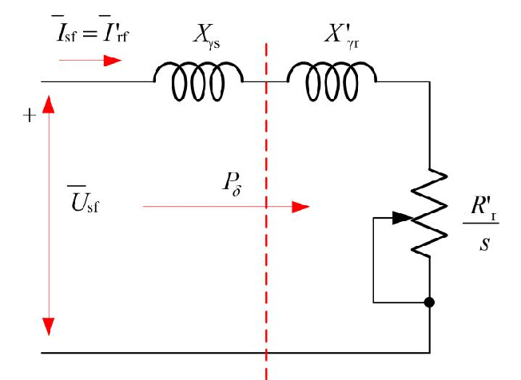
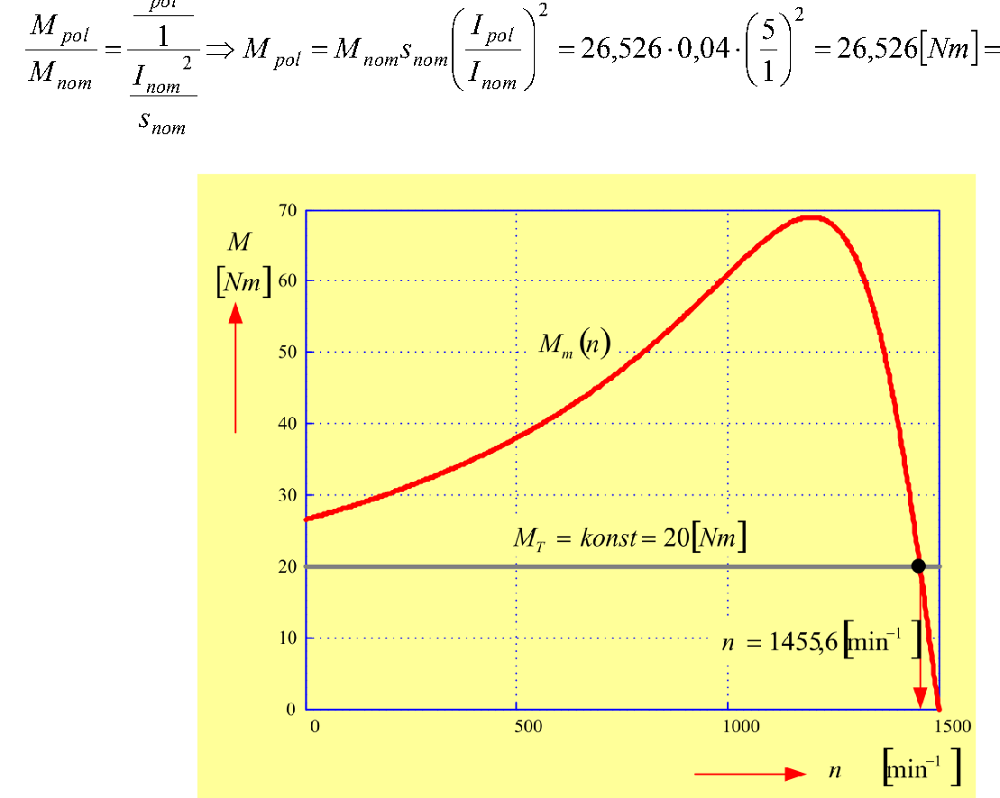
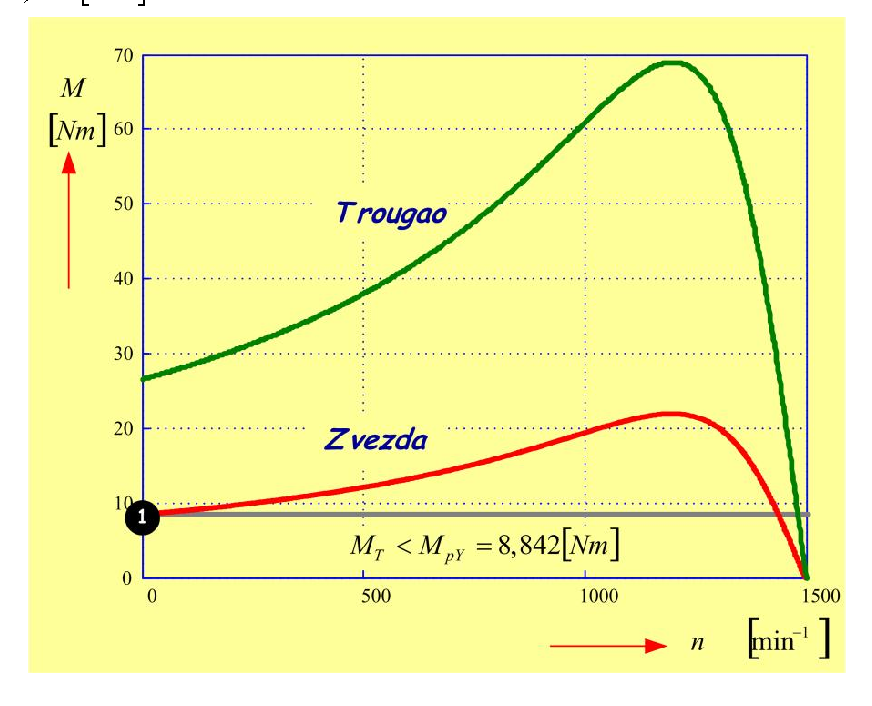

# Zadatak 48 — Brzina motora pri konstantnom momentu tereta (Klosov obrazac) i polazak upuštačem zvezda–trougao

## Postavka

Trofazni **kavezni** asinhroni motor nazivnih podataka: $4\ \mathrm{kW}$, $380\ \mathrm{V}$, $50\ \mathrm{Hz}$, $1440\ \mathrm{min^{-1}}$, sprega $\Delta$ (trougao), ima polaznu struju $5 \cdot I_{\mathrm{n}}$. Motor je upotrebljen za pogon radne mašine sa **konstantnim momentom, nezavisnim od brzine obrtanja**.

a) Odrediti do koje brzine obrtanja će se motor ubrzati ako je otporni moment radne mašine $20\ \mathrm{Nm}$. Smatrati da su otpor statora i struja magnećenja zanemarljivi.

b) Ako bi se ovaj motor puštao u rad automatskim upuštačem zvezda–trougao, koliki maksimalni otporni moment radne mašine u tom slučaju može da savlada pri polasku?

> **Prevod na običan jezik:** Imamo najobičniji industrijski asinhroni motor — *kavezni* znači da mu rotor nema pravi namotaj, nego kratko spojene bakarne ili aluminijumske šipke koje liče na kavez za veverice. Motor vuče radnu mašinu (npr. transportnu traku ili dizalicu) koja se "opire" uvek istim momentom od $20\ \mathrm{Nm}$, ma kojom brzinom se vrtela. Pod (a) pitamo: kad motor pustimo da ubrzava, na kojoj brzini će se "skrasiti"? Motor se ustali tamo gde je moment koji on proizvodi tačno jednak momentu kojim se teret opire — pa moramo da znamo celu krivu momenta motora u zavisnosti od brzine. Nju ćemo opisati čuvenim **Klosovim obrascem**, a sve njegove sastojke (kritični moment i kritično klizanje) izvući ćemo samo iz natpisne pločice motora i podatka da je polazna struja pet puta veća od nazivne. Pod (b) pitamo: ako motor puštamo u rad *upuštačem zvezda–trougao* (uređaj koji pri polasku privremeno preveže namotaje iz sprege trougao u spregu zvezda da bi smanjio udarnu struju), koliko najviše sme da iznosi moment tereta pa da motor uopšte krene iz mesta?

## Podaci

| Veličina | Oznaka | Vrednost | Šta ta veličina fizički znači |
|---|---|---|---|
| Nazivna snaga | $P_{\mathrm{nom}}$ | $4\ \mathrm{kW}$ | Korisna mehanička snaga na vratilu koju motor trajno daje u nazivnom radu. |
| Nazivni napon | $U_{\mathrm{n}}$ | $380\ \mathrm{V}$ | Linijski (međufazni) napon mreže na koju se motor priključuje. |
| Frekvencija | $f_s$ | $50\ \mathrm{Hz}$ | Frekvencija mrežnog napona; određuje brzinu obrtnog polja. |
| Nazivna brzina | $n_{\mathrm{nom}}$ | $1440\ \mathrm{min^{-1}}$ | Brzina vratila pri nazivnom opterećenju. |
| Sprega statora | $\Delta$ | — | Namotaji statora vezani u trougao: svaka faza namotaja dobija pun linijski napon, $U_f = 380\ \mathrm{V}$. |
| Polazna struja | $I_{\mathrm{pol}}$ | $5 \cdot I_{\mathrm{n}}$ | Struja koju motor vuče u trenutku polaska (zakočen rotor) — pet puta veća od nazivne. |
| Otporni moment tereta (deo a) | $M_T$ | $20\ \mathrm{Nm}$ | Moment kojim se radna mašina opire obrtanju — konstantan, ne zavisi od brzine. |
| Zanemarenja | $R_s \approx 0$, $I_{\mu} \approx 0$ | — | Otpor statorskog namotaja i struja magnećenja se ne uzimaju u obzir (pojednostavljuje model, vidi mini-lekciju 2). |

## Šta se traži i zašto

**a) Brzina obrtanja $n_T$ pri teretu $M_T = 20\ \mathrm{Nm}$.** Motor i teret se "dogovore" o brzini u tački gde je moment motora jednak momentu tereta — to je *stacionarna radna tačka*. Inženjera ta brzina zanima jer od nje zavisi učinak pogona (protok trake, brzina dizanja...) i jer mora proveriti da je radna tačka stabilna. Plan:

1. Iz nazivne brzine i frekvencije odredimo sinhronu brzinu, broj pari polova i nazivno klizanje.
2. Iz nazivne snage i brzine odredimo nazivni moment $M_{\mathrm{nom}}$.
3. Iz odnosa struja ($I_{\mathrm{pol}} = 5 I_{\mathrm{nom}}$) odredimo **polazni moment** $M_{\mathrm{pol}}$.
4. Klosov obrazac napišemo za dve poznate tačke (polazak i nazivnu tačku) i iz njih izračunamo **kritično klizanje** $s_{\mathrm{kr}}$ i **kritični moment** $M_{\mathrm{kr}}$ — time je cela momentna kriva poznata.
5. Klosov obrazac primenimo treći put, sada sa $M = M_T = 20\ \mathrm{Nm}$, i rešimo po klizanju $s_T$, pa iz njega izračunamo brzinu $n_T$.

**b) Najveći moment tereta koji motor savlađuje pri polasku sa upuštačem zvezda–trougao.** Upuštač pri polasku smanjuje napon na namotajima, a s njim i moment motora. Ako je teret veći od tako smanjenog polaznog momenta, motor *uopšte neće krenuti* — zato inženjer pre ugradnje upuštača mora proveriti da li će motor sa svojim teretom uspeti da se pokrene. Plan: moment je srazmeran kvadratu faznog napona; u sprezi zvezda fazni napon je $\sqrt{3}$ puta manji, pa je polazni moment **tri puta manji** — to je tražena granica.

## Potrebna teorija — mini-lekcije

### Mini-lekcija 1: Sinhrona brzina, klizanje i broj pari polova

Trofazni namotaj statora, napajan trofaznim naponima frekvencije $f_s$, stvara **obrtno magnetsko polje** koje se okreće *sinhronom brzinom*:

$$n_s = \frac{60 \cdot f_s}{p}\ \left[\mathrm{min^{-1}}\right]$$

gde je $p$ broj **pari** magnetskih polova namotaja. Poreklo formule: polje napravi jedan pun električni ciklus za jednu periodu napona, a kod mašine sa $p$ pari polova jedan električni ciklus odgovara $1/p$ mehaničkog obrtaja — polje se dakle okrene $f_s/p$ puta u sekundi, tj. $60 f_s/p$ puta u minuti. Za $f_s = 50\ \mathrm{Hz}$ moguće sinhrone brzine su $3000, 1500, 1000, 750, \ldots\ \mathrm{min^{-1}}$ (za $p = 1, 2, 3, 4, \ldots$).

Rotor asinhronog motora u motornom režimu uvek zaostaje za poljem (kada bi ga stigao, provodnici rotora ne bi sekli linije polja, ne bi bilo indukovane struje ni momenta). Zaostajanje merimo **klizanjem**:

$$s = \frac{n_s - n}{n_s} \quad\Longrightarrow\quad n = (1 - s) \cdot n_s$$

Klizanje je bezdimenzioni broj: $s = 0$ je sinhrono obrtanje (idealan prazan hod), $s = 1$ je zakočen rotor (trenutak polaska). Nazivna klizanja su tipično svega nekoliko procenata.

Uz klizanje ćemo koristiti i ugaone brzine. Razlikuj dve srodne veličine:

- $\Omega_s = \dfrac{2 \pi n_s}{60}$ — **mehanička** sinhrona ugaona brzina (radijani *obrtanja vratila* u sekundi);
- $\omega_s = 2 \pi f_s$ — **električna** ugaona učestanost napona.

Veza između njih je $\Omega_s = \omega_s / p$: polje se mehanički okreće $p$ puta sporije od "električnog" obrtanja fazora.

### Mini-lekcija 2: Uprošćena ekvivalentna šema i izraz za moment

Asinhroni motor se za analizu po fazi predstavlja ekvivalentnom električnom šemom. U njoj se rotorske veličine "svode" na statorsku stranu (preračunavaju preko prenosnog odnosa namotaja) i obeležavaju **primom**: $R'_r$ je svedeni otpor rotora, $X'_{\gamma r}$ svedena rasipna reaktansa rotora, $I'_r$ svedena rotorska struja. Indeks $\gamma$ označava *rasipne* (leakage) reaktanse — one potiču od dela magnetskog fluksa koji se "rasipa" oko namotaja umesto da prolazi kroz vazdušni zazor.

Zadatak izričito kaže da zanemarimo otpor statora $R_s$ i struju magnećenja $I_\mu$. To znači da iz pune šeme izbacujemo redni otpornik $R_s$ i celu poprečnu granu magnećenja — ostaje **jedno jedino redno kolo**: izvor faznog napona $U_f$, rasipna reaktansa statora $X_{\gamma s}$, svedena rasipna reaktansa rotora $X'_{\gamma r}$ i ekvivalentna otpornost rotorskog kola $R'_r / s$. Pošto je kolo redno, statorska i svedena rotorska struja su **jedna te ista struja**: $\overline{I}_{sf} = \overline{I}{}'_{rf}$ — ta činjenica će nam kasnije biti ključna.

Sledeća slika prikazuje upravo tu uprošćenu šemu. Čitaj je ovako: sleva je fazni napon $U_f$ (na slici $\overline{U}_{sf}$), kroz kolo teče jedna struja ($\overline{I}_{sf} = \overline{I}{}'_{rf}$), redno su dve rasipne reaktanse, a skroz desno je promenljiva otpornost $R'_r / s$ (strelica preko otpornika podseća da se menja sa klizanjem). Isprekidana crvena linija označava vazdušni zazor: sva aktivna snaga koja pređe tu liniju je **snaga obrtnog polja** $P_\delta$ (strelica).

**Slika 48.1 —** Ekvivalentna šema sa zanemarenim otporom statora $R_s$ (i zanemarenom granom magnećenja). Kolo je čisto redno, pa je $\overline{I}_{sf} = \overline{I}{}'_{rf}$; sva aktivna snaga se razvija na otpornosti $R'_r / s$ i jednaka je snazi obrtnog polja $P_\delta$.

**Zašto baš $R'_r / s$?** Stvarni otpor rotorskog namotaja je $R'_r$ i na njemu se razvijaju Džulovi gubici u rotoru. Kada se rotorsko kolo (u kome teku struje klizne frekvencije $s f_s$) matematički prevede u statorsko kolo frekvencije $f_s$, otpor se uveća na $R'_r / s$. Dodatak $R'_r (1-s)/s$ nije "pravi" otpornik — snaga na njemu predstavlja **mehaničku snagu** koju motor proizvodi. Zbir gubitaka i mehaničke snage, tj. ukupna snaga na $R'_r / s$, upravo je sva snaga koja kroz zazor uđe u rotor — snaga obrtnog polja:

$$P_\delta = 3 \cdot \frac{R'_r}{s} \cdot I'^{\,2}_r$$

(trojka je zbog tri faze). Elektromagnetski moment koji obrtno polje prenosi na rotor dobija se deljenjem snage polja mehaničkom brzinom polja:

$$M_m = \frac{P_\delta}{\Omega_s} = \frac{3 \dfrac{R'_r}{s} I'^{\,2}_r}{\Omega_s} = \frac{3 p}{\omega_s} \cdot \frac{R'_r}{s} \cdot I'^{\,2}_r$$

U poslednjem koraku iskorišćeno je $\Omega_s = \omega_s / p$ iz mini-lekcije 1. Još treba struja: iz rednog kola sa slike 48.1, po Omovom zakonu, efektivna vrednost struje je napon podeljen modulom ukupne impedanse,

$$I'_r(s) = \frac{U_f}{\sqrt{\left(\dfrac{R'_r}{s}\right)^{2} + \left(X_{\gamma s} + X'_{\gamma r}\right)^{2}}}$$

pa uvrštavanjem kvadrata struje u izraz za moment dobijamo **moment u funkciji klizanja**:

$$M_m(s) = \frac{3p}{\omega_s} \, U_f^{\,2} \, \frac{\dfrac{R'_r}{s}}{\left(\dfrac{R'_r}{s}\right)^{2} + \left(X_{\gamma s} + X'_{\gamma r}\right)^{2}}$$

Intuicija: pri malom klizanju ($s \to 0$) dominira ogromni $R'_r/s$ u imeniocu, pa moment raste približno linearno sa $s$; pri velikom klizanju ($s \to 1$) dominiraju reaktanse, pa moment opada kao $1/s$... negde između je maksimum. Njega tražimo u sledećoj lekciji.

### Mini-lekcija 3: Kritično klizanje i kritični moment

**Kritični** (u literaturi i *prevalni*) **moment** $M_{\mathrm{kr}}$ je najveći moment koji motor uopšte može da razvije; klizanje pri kome se dostiže zove se **kritično klizanje** $s_{\mathrm{kr}}$. Nalazimo ih kao ekstrem funkcije $M_m(s)$. Trik koji račun bitno skraćuje: umesto da diferenciramo razlomak sa $s$ i u brojiocu i u imeniocu, diferenciramo **recipročnu funkciju** $1/M_m(s)$ — pošto je $M_m > 0$ u motornom režimu, maksimum momenta je na istom mestu gde je minimum recipročne vrednosti. Recipročna funkcija je zgodna jer se svede na zbir dva jednostavna sabirka:

$$\frac{1}{M_m(s)} = \frac{\omega_s}{3 p \, U_f^{\,2}} \cdot \frac{\left(\dfrac{R'_r}{s}\right)^{2} + \left(X_{\gamma s} + X'_{\gamma r}\right)^{2}}{\dfrac{R'_r}{s}}$$

Podelimo brojilac član po član sa $R'_r/s$: prvi član daje $\left(\frac{R'_r}{s}\right)^2 \big/ \frac{R'_r}{s} = \frac{R'_r}{s}$, a drugi $\left(X_{\gamma s}+X'_{\gamma r}\right)^2 \big/ \frac{R'_r}{s} = \frac{s\left(X_{\gamma s}+X'_{\gamma r}\right)^2}{R'_r}$. Ako sve konstante spakujemo u $K = \dfrac{\omega_s}{3 p \, U_f^{\,2} R'_r}$, dobijamo:

$$\frac{1}{M_m(s)} = K \left[ \frac{R'^{\,2}_r}{s} + s \left(X_{\gamma s} + X'_{\gamma r}\right)^{2} \right]$$

Sada je izvod po $s$ trivijalan (izvod od $1/s$ je $-1/s^2$, izvod od $s$ je $1$):

$$\frac{d}{ds}\frac{1}{M_m(s)} = K \left[ -\frac{R'^{\,2}_r}{s^{2}} + \left(X_{\gamma s} + X'_{\gamma r}\right)^{2} \right] = 0$$

Izraz u zagradi je nula kada je $s^{2} = \dfrac{R'^{\,2}_r}{\left(X_{\gamma s} + X'_{\gamma r}\right)^{2}}$, odakle:

$$s_{\mathrm{kr}} = \pm \frac{R'_r}{X_{\gamma s} + X'_{\gamma r}}$$

Znak $+$ važi za motorni režim, znak $-$ za generatorski (nadsinhrono obrtanje); nas zanima motorni. Zapamti fizički smisao: kritično klizanje je **odnos rotorskog otpora i ukupne rasipne reaktanse**.

**Kritični moment** dobijamo uvrštavanjem $s = s_{\mathrm{kr}}$ u $M_m(s)$. Ključno zapažanje: iz gornje formule je $\dfrac{R'_r}{s_{\mathrm{kr}}} = X_{\gamma s} + X'_{\gamma r}$, pa su oba sabirka u imeniocu jednaka i imenilac postaje $2\left(\dfrac{R'_r}{s_{\mathrm{kr}}}\right)^{2}$:

$$M_{\mathrm{kr}} = \frac{3p}{\omega_s} U_f^{\,2} \frac{\dfrac{R'_r}{s_{\mathrm{kr}}}}{\left(\dfrac{R'_r}{s_{\mathrm{kr}}}\right)^{2} + \left(X_{\gamma s} + X'_{\gamma r}\right)^{2}} = \frac{3p}{\omega_s} U_f^{\,2} \frac{\dfrac{R'_r}{s_{\mathrm{kr}}}}{2 \left(\dfrac{R'_r}{s_{\mathrm{kr}}}\right)^{2}} = \frac{3p}{\omega_s} U_f^{\,2} \frac{1}{2 \dfrac{R'_r}{s_{\mathrm{kr}}}}$$

Primeti da $R'_r$ i $s_{\mathrm{kr}}$ ulaze samo kao količnik $R'_r / s_{\mathrm{kr}} = X_{\gamma s} + X'_{\gamma r}$ — **kritični moment ne zavisi od rotorskog otpora**, samo od napona, frekvencije i rasipnih reaktansi. Ako reaktanse izrazimo preko rasipnih induktivnosti, $X_{\gamma s} + X'_{\gamma r} = \omega_s \left(L_{\gamma s} + L'_{\gamma r}\right)$ i $\omega_s = 2 \pi f_s$, dobijamo oblik koji original posebno ističe:

$$M_{\mathrm{kr}} = \frac{3p}{2 \omega_s^{2} \left(L_{\gamma s} + L'_{\gamma r}\right)} U_f^{\,2} = \frac{3p}{8 \pi^{2}} \left(\frac{U_f}{f_s}\right)^{2} \frac{1}{L_{\gamma s} + L'_{\gamma r}}$$

(u međukoraku je $2 \omega_s^2 = 2 (2\pi f_s)^2 = 8 \pi^2 f_s^2$). Ovaj oblik je važan jer pokazuje da kritični moment zavisi od **odnosa** $U_f / f_s$: ako se napon i frekvencija menjaju tako da je $U_f / f_s = \mathrm{konst.}$, kritični moment ostaje isti — to je temelj tzv. skalarne (U/f) regulacije brzine.

### Mini-lekcija 4: Uprošćeni Klosov obrazac

Podelimo sada opšti izraz za moment kritičnim momentom — dobićemo formulu u kojoj nema nijednog parametra mašine ($R'_r$, reaktanse, napon), nego samo klizanja i momenti:

$$\frac{M_m(s)}{M_{\mathrm{kr}}} = \frac{\dfrac{\dfrac{R'_r}{s}}{\left(\dfrac{R'_r}{s}\right)^{2} + \left(X_{\gamma s} + X'_{\gamma r}\right)^{2}}}{\dfrac{1}{2 \dfrac{R'_r}{s_{\mathrm{kr}}}}} = \frac{2 \, \dfrac{R'_r}{s} \cdot \dfrac{R'_r}{s_{\mathrm{kr}}}}{\left(\dfrac{R'_r}{s}\right)^{2} + \left(X_{\gamma s} + X'_{\gamma r}\right)^{2}}$$

U imeniocu zamenimo $X_{\gamma s} + X'_{\gamma r} = \dfrac{R'_r}{s_{\mathrm{kr}}}$ (mini-lekcija 3):

$$\frac{M_m(s)}{M_{\mathrm{kr}}} = \frac{2 \, \dfrac{R'^{\,2}_r}{s \, s_{\mathrm{kr}}}}{\left(\dfrac{R'_r}{s}\right)^{2} + \left(\dfrac{R'_r}{s_{\mathrm{kr}}}\right)^{2}}$$

pa i brojilac i imenilac podelimo sa $\dfrac{R'^{\,2}_r}{s \, s_{\mathrm{kr}}}$. Brojilac postaje $2$. Prvi član imenioca: $\dfrac{R'^{\,2}_r}{s^{2}} \cdot \dfrac{s \, s_{\mathrm{kr}}}{R'^{\,2}_r} = \dfrac{s_{\mathrm{kr}}}{s}$; drugi član: $\dfrac{R'^{\,2}_r}{s_{\mathrm{kr}}^{2}} \cdot \dfrac{s \, s_{\mathrm{kr}}}{R'^{\,2}_r} = \dfrac{s}{s_{\mathrm{kr}}}$. Time dobijamo **uprošćeni Klosov obrazac**:

$$\boxed{\ \frac{M_m(s)}{M_{\mathrm{kr}}} = \frac{2}{\dfrac{s}{s_{\mathrm{kr}}} + \dfrac{s_{\mathrm{kr}}}{s}}\ }$$

("uprošćeni" zato što je izveden uz zanemaren otpor statora; puni Klosov obrazac ima dodatne članove sa $R_s$). Njegova ogromna praktična vrednost: **cela statička karakteristika momenta opisana je sa samo dva broja**, $M_{\mathrm{kr}}$ i $s_{\mathrm{kr}}$ — ne moramo znati nijedan parametar ekvivalentne šeme. Ako znamo moment u dve radne tačke, iz dve jednačine možemo izračunati $M_{\mathrm{kr}}$ i $s_{\mathrm{kr}}$, i onda predvideti moment u *bilo kojoj* trećoj tački. Upravo to radimo u ovom zadatku.

Još dve činjenice koje ćemo koristiti:

- **Stabilna i nestabilna grana.** Za $s < s_{\mathrm{kr}}$ (radni deo, blizu sinhrone brzine) moment raste sa klizanjem — ako teret malo poraste, motor malo uspori, njegov moment poraste i ravnoteža se ponovo uhvati: radna tačka je **stabilna**. Za $s > s_{\mathrm{kr}}$ je obrnuto — usporavanje smanjuje moment i motor se "survava" ka zastoju: tačka je **nestabilna**. Stacionarni rad je zato uvek na grani $s < s_{\mathrm{kr}}$.
- **Uslov polaska.** U trenutku polaska je $s = 1$. Motor će krenuti iz mesta samo ako je njegov polazni moment veći od momenta tereta: $M_{\mathrm{pol}} > M_T$.

### Mini-lekcija 5: Polazni moment iz odnosa struja

Kataloški podatak o motoru najčešće ne sadrži polazni moment, ali sadrži odnos polazne i nazivne struje (ovde $I_{\mathrm{pol}} / I_{\mathrm{nom}} = 5$). Iz njega polazni moment možemo *izračunati*. Pođimo od izraza za moment preko struje iz mini-lekcije 2, $M_m = \dfrac{3p}{\omega_s} \dfrac{R'_r}{s} I'^{\,2}_r$, i napišimo ga za dve tačke. Pri tome koristimo činjenicu (slika 48.1) da su statorska i svedena rotorska struja jednake — pa u formulu smemo da uvrstimo *merljivu statorsku* struju:

$$M_{\mathrm{pol}} = \frac{3p}{\omega_s} \cdot \frac{R'_r}{1} \cdot I_{\mathrm{pol}}^{\,2} \quad (\text{polazak: } s = 1), \qquad M_{\mathrm{nom}} = \frac{3p}{\omega_s} \cdot \frac{R'_r}{s_{\mathrm{nom}}} \cdot I_{\mathrm{nom}}^{\,2} \quad (\text{nazivna tačka: } s = s_{\mathrm{nom}})$$

Deljenjem prve jednačine drugom sve nepoznate konstante ($p$, $\omega_s$, $R'_r$) se skrate:

$$\frac{M_{\mathrm{pol}}}{M_{\mathrm{nom}}} = \frac{I_{\mathrm{pol}}^{\,2}}{\dfrac{I_{\mathrm{nom}}^{\,2}}{s_{\mathrm{nom}}}} = s_{\mathrm{nom}} \left(\frac{I_{\mathrm{pol}}}{I_{\mathrm{nom}}}\right)^{2} \quad\Longrightarrow\quad M_{\mathrm{pol}} = M_{\mathrm{nom}} \, s_{\mathrm{nom}} \left(\frac{I_{\mathrm{pol}}}{I_{\mathrm{nom}}}\right)^{2}$$

Intuicija zašto polazni moment **nije** $5^2 = 25$ puta veći od nazivnog iako je struja 5 puta veća: moment nije srazmeran samo kvadratu struje, nego i faktoru $R'_r / s$, a on je pri polasku ($s=1$) čak $1/s_{\mathrm{nom}} = 25$ puta *manji* nego u nazivnoj tački. Velika polazna struja je pretežno *reaktivna* i "jalova" za stvaranje momenta.

### Mini-lekcija 6: Upuštač zvezda–trougao

Direktan polazak asinhronog motora povlači iz mreže udarnu struju od tipično 5–8 nazivnih — to izaziva propade napona i muči mrežu i sklopke. **Upuštač zvezda–trougao** je klasično, jeftino rešenje: motor čiji je namotaj za dati mrežni napon predviđen za spregu **trougao** pri polasku se privremeno preveže u spregu **zvezda**, pa kad ubrza — automatski se (kontaktorima, uz vremenski relej) vrati u trougao.

Šta se time postiže? U sprezi trougao svaka faza namotaja dobija pun linijski napon, $U_{f\Delta} = U_{\mathrm{n}} = 380\ \mathrm{V}$. U sprezi zvezda fazni napon je $\sqrt{3}$ puta manji od linijskog:

$$U_{fY} = \frac{U_{\mathrm{n}}}{\sqrt{3}} = \frac{380}{\sqrt{3}} \approx 220\ \mathrm{V}$$

Iz izraza za moment (mini-lekcija 2) vidi se da je moment srazmeran **kvadratu faznog napona** ($M \sim U_f^{\,2}$ — napon se u formuli javlja samo kao $U_f^2$). Zato prebacivanje u zvezdu smanjuje moment (u svakoj tački karakteristike, pa i polazni) u odnosu:

$$\frac{M_Y}{M_\Delta} = \left(\frac{U_{fY}}{U_{f\Delta}}\right)^{2} = \left(\frac{1}{\sqrt{3}}\right)^{2} = \frac{1}{3}$$

Isti faktor $3$ važi i za linijsku polaznu struju (fazna struja padne $\sqrt{3}$ puta zbog manjeg napona, a u zvezdi je linijska struja jednaka faznoj umesto $\sqrt{3}$ puta većoj) — u tome i jeste svrha upuštača. Ali cena je jasna: **tri puta manji polazni moment**, pa ovakav polazak uspeva samo sa dovoljno "lakim" teretom. Koliko lakim — računamo pod (b).

## Rešenje, korak po korak

### Korak 1: Sinhrona brzina, broj pari polova i nazivno klizanje

**Zašto ovaj korak:** Sve dalje formule koriste sinhronu brzinu i klizanje, a njih iz podataka tek treba iščitati.

Nazivna brzina $1440\ \mathrm{min^{-1}}$ je tik ispod jedne od mogućih sinhronih brzina za $50\ \mathrm{Hz}$ (mini-lekcija 1): jedina koja ima smisla je $n_s = 1500\ \mathrm{min^{-1}}$ (rotor u motornom režimu zaostaje samo nekoliko procenata za poljem; $3000$ bi dalo klizanje od $52\ \%$, što je besmisleno). Iz $n_s = 60 f_s / p$:

$$p = \frac{60 \cdot f_s}{n_s} = \frac{60 \cdot 50}{1500} = 2$$

Motor je dakle četvoropolni ($p = 2$ para polova). Nazivno klizanje:

$$s_{\mathrm{nom}} = \frac{n_s - n_{\mathrm{nom}}}{n_s} = \frac{1500 - 1440}{1500} = \frac{60}{1500} = 0{,}04$$

**Šta smo dobili:** Klizanje od $4\ \%$ — tipična vrednost za mali motor; podaci su međusobno saglasni.

### Korak 2: Nazivni moment

**Zašto ovaj korak:** Nazivni moment je prva od dve "poznate tačke" na momentnoj krivi koje će nam dati Klosove parametre.

Moment je snaga podeljena ugaonom brzinom. Nazivna snaga sa natpisne pločice je korisna mehanička snaga na vratilu, a vratilo se okreće nazivnom brzinom, pa je nazivna mehanička ugaona brzina $\Omega_{\mathrm{nom}} = \dfrac{2 \pi \, n_{\mathrm{nom}}}{60}$ (pretvaranje obrtaja u minuti u radijane u sekundi). Dakle:

$$M_{\mathrm{nom}} = \frac{P_{\mathrm{nom}}}{\Omega_{\mathrm{nom}}} = \frac{60 \, P_{\mathrm{nom}}}{2 \pi \, n_{\mathrm{nom}}} = \frac{30}{\pi} \cdot \frac{P_{\mathrm{nom}}}{n_{\mathrm{nom}}} = \frac{30}{\pi} \cdot \frac{4000}{1440} = 26{,}526\ \mathrm{Nm}$$

**Šta smo dobili:** Nazivni moment od oko $26{,}5\ \mathrm{Nm}$. Odmah vidimo da je zadati teret $M_T = 20\ \mathrm{Nm}$ *manji* od nazivnog momenta — motor će raditi rasterećen, pa očekujemo brzinu **veću** od nazivne (klizanje manje od $0{,}04$).

### Korak 3: Polazni moment

**Zašto ovaj korak:** Polazak ($s = 1$) je druga poznata tačka na krivi; moment u njoj dobijamo iz zadatog odnosa struja.

Primenjujemo formulu iz mini-lekcije 5:

$$M_{\mathrm{pol}} = M_{\mathrm{nom}} \, s_{\mathrm{nom}} \left(\frac{I_{\mathrm{pol}}}{I_{\mathrm{nom}}}\right)^{2} = 26{,}526 \cdot 0{,}04 \cdot \left(\frac{5}{1}\right)^{2} = 26{,}526 \cdot 0{,}04 \cdot 25 = 26{,}526\ \mathrm{Nm}$$

Pošto je $0{,}04 \cdot 25 = 1$, ispada tačno:

$$M_{\mathrm{pol}} = M_{\mathrm{nom}} = 26{,}526\ \mathrm{Nm}$$

**Šta smo dobili:** Kod ovog motora se brojevi poklope tako da je polazni moment jednak nazivnom — zgodna slučajnost ($s_{\mathrm{nom}} \cdot (I_{\mathrm{pol}}/I_{\mathrm{nom}})^2 = 1$) koja će nam u sledećem koraku dodatno pojednostaviti algebru. I fizički je rezultat razuman: kavezni motori tipično imaju polazni moment reda veličine nazivnog.

### Korak 4: Kritično klizanje iz dve poznate tačke

**Zašto ovaj korak:** Da bismo Klosovim obrascem mogli da nađemo bilo koju tačku krive, treba nam $s_{\mathrm{kr}}$ (a potom i $M_{\mathrm{kr}}$). Napišimo zato Klosov obrazac za obe poznate tačke.

Za nazivnu tačku ($s = s_{\mathrm{nom}}$) i za polazak ($s = 1$):

$$M_{\mathrm{nom}} = \frac{2 M_{\mathrm{kr}}}{\dfrac{s_{\mathrm{nom}}}{s_{\mathrm{kr}}} + \dfrac{s_{\mathrm{kr}}}{s_{\mathrm{nom}}}} \qquad \wedge \qquad M_{\mathrm{pol}} = \frac{2 M_{\mathrm{kr}}}{\dfrac{1}{s_{\mathrm{kr}}} + \dfrac{s_{\mathrm{kr}}}{1}}$$

Podelimo prvu jednačinu drugom — $2 M_{\mathrm{kr}}$ se skrati, a dvojni razlomak se sredi tako što imenilac prve jednačine ode u imenilac, a imenilac druge u brojilac:

$$\frac{M_{\mathrm{nom}}}{M_{\mathrm{pol}}} = \frac{\dfrac{1}{s_{\mathrm{kr}}} + s_{\mathrm{kr}}}{\dfrac{s_{\mathrm{nom}}}{s_{\mathrm{kr}}} + \dfrac{s_{\mathrm{kr}}}{s_{\mathrm{nom}}}}$$

Iz Koraka 3 znamo da je $M_{\mathrm{nom}} / M_{\mathrm{pol}} = 1$, pa su imenilac i brojilac jednaki:

$$\frac{1}{s_{\mathrm{kr}}} + s_{\mathrm{kr}} = \frac{s_{\mathrm{nom}}}{s_{\mathrm{kr}}} + \frac{s_{\mathrm{kr}}}{s_{\mathrm{nom}}}$$

Pomnožimo obe strane sa $s_{\mathrm{kr}} \, s_{\mathrm{nom}}$ da se oslobodimo razlomaka (levo: $\frac{1}{s_{\mathrm{kr}}} \cdot s_{\mathrm{kr}} s_{\mathrm{nom}} = s_{\mathrm{nom}}$ i $s_{\mathrm{kr}} \cdot s_{\mathrm{kr}} s_{\mathrm{nom}} = s_{\mathrm{kr}}^{2} s_{\mathrm{nom}}$; desno analogno):

$$s_{\mathrm{nom}} + s_{\mathrm{kr}}^{2} \, s_{\mathrm{nom}} = s_{\mathrm{nom}}^{2} + s_{\mathrm{kr}}^{2}$$

Prebacimo sve na levu stranu i grupišimo članove sa $s_{\mathrm{kr}}^2$ i članove bez njega:

$$s_{\mathrm{kr}}^{2} \, s_{\mathrm{nom}} - s_{\mathrm{kr}}^{2} + s_{\mathrm{nom}} - s_{\mathrm{nom}}^{2} = 0 \quad\Longrightarrow\quad -\, s_{\mathrm{kr}}^{2} \left(1 - s_{\mathrm{nom}}\right) + s_{\mathrm{nom}} \left(1 - s_{\mathrm{nom}}\right) = 0$$

odnosno, posle množenja sa $-1$:

$$s_{\mathrm{kr}}^{2} \left(1 - s_{\mathrm{nom}}\right) - s_{\mathrm{nom}} \left(1 - s_{\mathrm{nom}}\right) = 0 \quad\Longrightarrow\quad \left(1 - s_{\mathrm{nom}}\right)\left(s_{\mathrm{kr}}^{2} - s_{\mathrm{nom}}\right) = 0$$

Pošto je $s_{\mathrm{nom}} = 0{,}04 \ne 1$, prvi činilac nije nula, pa mora biti $s_{\mathrm{kr}}^{2} = s_{\mathrm{nom}}$:

$$s_{\mathrm{kr}} = \pm \sqrt{s_{\mathrm{nom}}} = \pm \sqrt{0{,}04} = \pm 0{,}2$$

Negativno klizanje odgovara generatorskom (nadsinhronom) režimu; za naš motorni režim uzimamo:

$$s_{\mathrm{kr}} = 0{,}2$$

**Šta smo dobili:** Kritično klizanje $20\ \%$ — motor razvija najveći moment pri brzini $n_{\mathrm{kr}} = (1 - 0{,}2) \cdot 1500 = 1200\ \mathrm{min^{-1}}$. Lepo pravilo koje je ovde isplivalo: kad je $M_{\mathrm{pol}} = M_{\mathrm{nom}}$, kritično klizanje je geometrijska sredina klizanja te dve tačke, $s_{\mathrm{kr}} = \sqrt{s_{\mathrm{nom}} \cdot 1}$.

### Korak 5: Kritični moment

**Zašto ovaj korak:** Drugi Klosov parametar; sa njim je momentna kriva potpuno određena.

Iskoristimo Klosov obrazac u tački polaska (jednostavniji je jer je $s = 1$) i rešimo ga po $M_{\mathrm{kr}}$ — pomnožimo obe strane imeniocem i podelimo sa 2:

$$M_{\mathrm{pol}} = \frac{2 M_{\mathrm{kr}}}{\dfrac{1}{s_{\mathrm{kr}}} + s_{\mathrm{kr}}} \quad\Longrightarrow\quad M_{\mathrm{kr}} = \frac{M_{\mathrm{pol}}}{2} \left(\frac{1}{s_{\mathrm{kr}}} + s_{\mathrm{kr}}\right)$$

Uvrstimo brojeve:

$$M_{\mathrm{kr}} = \frac{26{,}526}{2} \cdot \left(\frac{1}{0{,}2} + 0{,}2\right) = 13{,}263 \cdot \left(5 + 0{,}2\right) = 13{,}263 \cdot 5{,}2 = 68{,}968\ \mathrm{Nm}$$

**Šta smo dobili:** Kritični moment je $M_{\mathrm{kr}} / M_{\mathrm{nom}} = 68{,}968 / 26{,}526 = 2{,}6$ puta veći od nazivnog — sasvim tipično za asinhrone motore (uobičajeno $1{,}8$ do $3$). Motor dakle ima pristojnu rezervu momenta iznad nazivne tačke.

### Korak 6: Klizanje i brzina radne tačke sa teretom od 20 Nm (odgovor pod a)

**Zašto ovaj korak:** Sada kada znamo $M_{\mathrm{kr}}$ i $s_{\mathrm{kr}}$, primenimo Klosov obrazac treći put — ovoga puta je *moment* poznat ($M = M_T$), a *klizanje* $s_T$ je nepoznata.

$$M_T = \frac{2 M_{\mathrm{kr}}}{\dfrac{s_T}{s_{\mathrm{kr}}} + \dfrac{s_{\mathrm{kr}}}{s_T}}$$

Pomnožimo obe strane imeniocem i podelimo sa $M_T$:

$$\frac{s_T}{s_{\mathrm{kr}}} + \frac{s_{\mathrm{kr}}}{s_T} - \frac{2 M_{\mathrm{kr}}}{M_T} = 0$$

Ovo još nije "školska" kvadratna jednačina jer je $s_T$ i u imeniocu. Pomnožimo zato celu jednačinu sa $s_{\mathrm{kr}} \, s_T$ (prvi član: $\frac{s_T}{s_{\mathrm{kr}}} \cdot s_{\mathrm{kr}} s_T = s_T^2$; drugi: $\frac{s_{\mathrm{kr}}}{s_T} \cdot s_{\mathrm{kr}} s_T = s_{\mathrm{kr}}^2$; treći: $\frac{2M_{\mathrm{kr}}}{M_T} \cdot s_{\mathrm{kr}} s_T$):

$$s_T^{2} - \frac{2 M_{\mathrm{kr}}}{M_T} \, s_{\mathrm{kr}} \, s_T + s_{\mathrm{kr}}^{2} = 0$$

Ovo je kvadratna jednačina po $s_T$ oblika $s_T^2 + b\,s_T + c = 0$ sa $b = -\dfrac{2 M_{\mathrm{kr}}}{M_T} s_{\mathrm{kr}}$ i $c = s_{\mathrm{kr}}^2$. Rešenja po obrascu $s_T = \dfrac{-b \pm \sqrt{b^{2} - 4c}}{2}$:

$$s_T = \frac{\dfrac{2 M_{\mathrm{kr}}}{M_T} s_{\mathrm{kr}} \pm \sqrt{\dfrac{4 M_{\mathrm{kr}}^{2}}{M_T^{2}} s_{\mathrm{kr}}^{2} - 4 s_{\mathrm{kr}}^{2}}}{2} = s_{\mathrm{kr}} \left( \frac{M_{\mathrm{kr}}}{M_T} \pm \sqrt{\left(\frac{M_{\mathrm{kr}}}{M_T}\right)^{2} - 1} \right)$$

(u drugom koraku je iz korena izvučeno $\sqrt{4 s_{\mathrm{kr}}^2} = 2 s_{\mathrm{kr}}$, pa se dvojka skratila sa imeniocem). Uvrstimo brojeve; odnos momenata je $\dfrac{M_{\mathrm{kr}}}{M_T} = \dfrac{68{,}968}{20} = 3{,}4484$:

$$s_T = 0{,}2 \cdot \left( 3{,}4484 \pm \sqrt{3{,}4484^{2} - 1} \right) = 0{,}2 \cdot \left( 3{,}4484 \pm \sqrt{11{,}891 - 1} \right) = 0{,}2 \cdot \left( 3{,}4484 \pm 3{,}3002 \right)$$

Dva matematička rešenja su:

$$s_{T1} = 0{,}2 \cdot 0{,}1482 = 0{,}0296 \qquad \vee \qquad s_{T2} = 0{,}2 \cdot 6{,}7486 \approx 1{,}349$$

Koje je pravo? Kriva momenta seče horizontalu $M_T = 20\ \mathrm{Nm}$ u dve tačke — po jednoj sa svake strane vrha. Rešenje $s_{T2} = 1{,}349 > 1$ leži duboko na nestabilnoj grani (klizanje veće od 1 čak znači da bi se rotor vrteo *unazad* — protivstrujno kočenje) i motor se u njemu ne može ustaliti. Fizički tok događaja: motor kreće iz $s = 1$ sa $M_{\mathrm{pol}} = 26{,}5\ \mathrm{Nm} > 20\ \mathrm{Nm}$, višak momenta ga ubrzava, klizanje opada preko $s_{\mathrm{kr}} = 0{,}2$ (gde moment dostiže vrh od $69\ \mathrm{Nm}$) i motor nastavlja da ubrzava sve dok moment ne padne na $20\ \mathrm{Nm}$ — a to se dešava tek na stabilnoj grani, pri:

$$s_T = 0{,}0296$$

Tražena brzina obrtanja:

$$n_T = n_s \left(1 - s_T\right) = 1500 \cdot \left(1 - 0{,}0296\right) = 1500 \cdot 0{,}9704 = 1455{,}6\ \mathrm{min^{-1}}$$

Ceo ovaj tok najbolje se vidi na sledećoj slici: na njoj je nacrtana kompletna momentna kriva $M_m(n)$ našeg motora po Klosovom obrascu, ali u funkciji **brzine** (apscisa ide od $0$ do $n_s = 1500\ \mathrm{min^{-1}}$; veza je $n = (1-s) n_s$, pa polazak $s=1$ odgovara levom kraju $n=0$, a sinhronizam desnom kraju). Čitaj je ovako: crvena kriva kreće od $M_{\mathrm{pol}} \approx 26{,}5\ \mathrm{Nm}$ pri $n = 0$, penje se do vrha $M_{\mathrm{kr}} \approx 69\ \mathrm{Nm}$ na $n_{\mathrm{kr}} = 1200\ \mathrm{min^{-1}}$ (tj. $s_{\mathrm{kr}} = 0{,}2$), pa strmo pada ka nuli u $1500\ \mathrm{min^{-1}}$. Siva horizontala je konstantni moment tereta $M_T = 20\ \mathrm{Nm}$; crna tačka na strmoj (stabilnoj) grani je radna tačka, a strelica pokazuje očitanu brzinu $n = 1455{,}6\ \mathrm{min^{-1}}$.

**Slika 48.2 —** Statička karakteristika momenta asinhrone mašine (na osnovu uprošćenog Klosovog obrasca). Presek krive momenta motora $M_m(n)$ i horizontale tereta $M_T = 20\ \mathrm{Nm}$ na stabilnoj grani daje radnu tačku $n_T = 1455{,}6\ \mathrm{min^{-1}}$.

**Šta smo dobili:** Motor se ustali na $1455{,}6\ \mathrm{min^{-1}}$ — nešto iznad nazivne brzine ($1440\ \mathrm{min^{-1}}$), tačno kako smo predvideli u Koraku 2: teret ($20\ \mathrm{Nm}$) je manji od nazivnog ($26{,}5\ \mathrm{Nm}$), pa je motor rasterećen i klizi manje ($2{,}96\ \%$ umesto $4\ \%$).

### Korak 7: Polazni moment u sprezi zvezda i najveći teret koji se savlađuje (odgovor pod b)

**Zašto ovaj korak:** Upuštač zvezda–trougao pri polasku drži motor u sprezi zvezda, čime je fazni napon (pa i moment) smanjen — treba izračunati koliki polazni moment motoru tada preostaje.

Prema mini-lekciji 6, moment je srazmeran kvadratu faznog napona, pa je odnos polaznih momenata u zvezdi i trouglu:

$$\frac{M_{\mathrm{pol}Y}}{M_{\mathrm{pol}\Delta}} = \frac{U_{fY}^{\,2}}{U_{f\Delta}^{\,2}} = \left(\frac{U_{fY}}{U_{f\Delta}}\right)^{2}$$

U trouglu je fazni napon $U_{f\Delta} = 380\ \mathrm{V}$, a u zvezdi $U_{fY} = 380 / \sqrt{3} \approx 220\ \mathrm{V}$, pa je:

$$M_{\mathrm{pol}Y} = M_{\mathrm{pol}\Delta} \left(\frac{U_{fY}}{U_{f\Delta}}\right)^{2} = 26{,}526 \cdot \left(\frac{220}{380}\right)^{2} = 26{,}526 \cdot \left(\frac{1}{\sqrt{3}}\right)^{2} = \frac{26{,}526}{3} = 8{,}842\ \mathrm{Nm}$$

($M_{\mathrm{pol}\Delta} = 26{,}526\ \mathrm{Nm}$ je polazni moment iz Koraka 3 — on važi za normalnu spregu trougao). Da bi motor uopšte krenuo iz mesta, njegov polazni moment mora biti veći od momenta tereta (mini-lekcija 4), pa sa upuštačem motor može da savlada samo teret:

$$M_T < M_{\mathrm{pol}Y} = 8{,}842\ \mathrm{Nm}$$

> **Napomena o originalu:** Zbirka u ovom redu piše fazni napon zvezde kao $220\ \mathrm{V}$ — to je uobičajeno zaokruženje tačne vrednosti $380/\sqrt{3} \approx 219{,}4\ \mathrm{V}$. Konačan broj $8{,}842\ \mathrm{Nm}$ u zbirci je izračunat tačnim odnosom $(1/\sqrt{3})^2 = 1/3$, tj. kao $26{,}526/3$, pa je ispravan. (U istom redu zbirka jednom otkuca i „$26{,}525$" umesto $26{,}526$ — očigledna štamparska greška bez uticaja na rezultat.)

Pošto je teret iz dela (a) $M_T = 20\ \mathrm{Nm} > 8{,}842\ \mathrm{Nm}$, ovaj konkretan teret motor sa upuštačem zvezda–trougao **ne bi mogao** ni da pokrene — upuštač bi ovde bio pogrešan izbor.

Sledeća slika prikazuje obe momentne karakteristike — za spregu trougao i za spregu zvezda — pri istom mrežnom (linijskom) naponu na priključnim stezaljkama. Čitaj je ovako: zelena kriva („Trougao") je karakteristika iz slike 48.2 (polazni moment $26{,}5\ \mathrm{Nm}$, vrh $69\ \mathrm{Nm}$); crvena kriva („Zvezda") je ista kriva spljoštena tačno **tri puta** po visini (polazni moment $8{,}842\ \mathrm{Nm}$, vrh $\approx 23\ \mathrm{Nm}$) — oblik i položaj vrha po brzini se ne menjaju, jer $s_{\mathrm{kr}}$ ne zavisi od napona. Siva horizontala na visini $8{,}842\ \mathrm{Nm}$ i tačka 1 na levom kraju crvene krive (polazak, $n = 0$) označavaju granični teret: svaki teret ispod te linije zvezda-polazak savlađuje, svaki iznad — ne.

**Slika 48.3 —** Karakteristike momenta datog asinhronog motora u sprezi trougao i zvezda za isti dovedeni napon (između priključnih stezaljki motora). U zvezdi je cela kriva tri puta niža; tačka 1 je polazna tačka u sprezi zvezda, a horizontala $M_T < M_{\mathrm{pol}Y} = 8{,}842\ \mathrm{Nm}$ granični moment tereta koji se pri takvom polasku još može savladati.

**Šta smo dobili:** Sa upuštačem zvezda–trougao motor pri polasku raspolaže sa svega $8{,}842\ \mathrm{Nm}$ — trećinom svog normalnog polaznog momenta. Zato se ovaj način puštanja koristi samo za pogone koji polaze rasterećeni ili sa malim teretom (ventilatori, pumpe koje kreću na zatvoren ventil, mašine sa praznim hodom pri polasku).

## Česte greške i zamke

1. **Deljenje momenta sa $\sqrt{3}$ umesto sa $3$.** Fazni *napon* u zvezdi je $\sqrt{3}$ puta manji, ali *moment* zavisi od kvadrata napona — dakle pada $(\sqrt{3})^2 = 3$ puta. Ko pomeša ta dva odnosa, dobije $15{,}3\ \mathrm{Nm}$ umesto $8{,}842\ \mathrm{Nm}$.
2. **Uzimanje pogrešnog korena kvadratne jednačine.** Jednačina u Koraku 6 uvek daje dva rešenja — po jedno sa svake strane kritičnog klizanja. Stacionarna radna tačka je ona sa $s < s_{\mathrm{kr}}$ (stabilna grana); rešenje $s_{T2} = 1{,}349$ bi formalno dalo negativnu brzinu $n = 1500 \cdot (1 - 1{,}349) = -523{,}5\ \mathrm{min^{-1}}$, što očigledno nije tačka u koju motor ubrzava.
3. **„Struja je 5 puta veća, pa je i moment $25$ puta veći."** Nije: moment zavisi i od $R'_r / s$, koji je pri polasku $25$ puta manji nego u nazivnoj tački. Ispravna formula je $M_{\mathrm{pol}} = M_{\mathrm{nom}} \, s_{\mathrm{nom}} (I_{\mathrm{pol}} / I_{\mathrm{nom}})^2$ — ovde slučajno ispadne baš $M_{\mathrm{pol}} = M_{\mathrm{nom}}$.
4. **Pogrešna sinhrona brzina.** Za $50\ \mathrm{Hz}$ i $n_{\mathrm{nom}} = 1440\ \mathrm{min^{-1}}$ sinhrona brzina je $1500\ \mathrm{min^{-1}}$ (klizanje $4\ \%$), nikako $3000$. Ko uzme $3000$, dobija besmisleno klizanje od $52\ \%$ i sve dalje mu je pogrešno.
5. **Mešanje $\omega_s$ i $\Omega_s$.** U formuli $M = \frac{3p}{\omega_s} U_f^2 \ldots$ figuriše *električna* ugaona učestanost $\omega_s = 2\pi f_s = 314{,}16\ \mathrm{s^{-1}}$; mehanička sinhrona brzina je $\Omega_s = \omega_s / p = 157{,}08\ \mathrm{s^{-1}}$. Zaboravljen faktor $p$ udvostručuje (ili prepolovljuje) sve momente.
6. **Zaboravljanje da je nazivni moment definisan nazivnom, a ne sinhronom brzinom:** $M_{\mathrm{nom}} = P_{\mathrm{nom}} / \Omega_{\mathrm{nom}}$, sa $n_{\mathrm{nom}} = 1440$, a ne $1500\ \mathrm{min^{-1}}$.

## Rezime rezultata

| Veličina | Oznaka | Vrednost |
|---|---|---|
| Nazivno klizanje | $s_{\mathrm{nom}}$ | $0{,}04$ |
| Nazivni moment | $M_{\mathrm{nom}}$ | $26{,}526\ \mathrm{Nm}$ |
| Polazni moment (sprega $\Delta$) | $M_{\mathrm{pol}}$ | $26{,}526\ \mathrm{Nm}$ ($= M_{\mathrm{nom}}$) |
| Kritično klizanje | $s_{\mathrm{kr}}$ | $0{,}2$ |
| Kritični moment | $M_{\mathrm{kr}}$ | $68{,}968\ \mathrm{Nm}$ |
| a) Klizanje radne tačke | $s_T$ | $0{,}0296$ |
| **a) Brzina obrtanja sa teretom $20\ \mathrm{Nm}$** | $n_T$ | $1455{,}6\ \mathrm{min^{-1}}$ |
| b) Polazni moment u sprezi zvezda | $M_{\mathrm{pol}Y}$ | $8{,}842\ \mathrm{Nm}$ |
| **b) Najveći teret koji se savlađuje pri Y-polasku** | $M_T$ | $M_T < 8{,}842\ \mathrm{Nm}$ |

## Provera smisla

**1. Vraćanje rezultata u Klosov obrazac.** Ako je $s_T = 0{,}0296$ zaista rešenje, Klosov obrazac mora vratiti $20\ \mathrm{Nm}$:

$$M = \frac{2 \cdot 68{,}968}{\dfrac{0{,}0296}{0{,}2} + \dfrac{0{,}2}{0{,}0296}} = \frac{137{,}936}{0{,}148 + 6{,}757} = \frac{137{,}936}{6{,}905} = 19{,}98 \approx 20\ \mathrm{Nm} \checkmark$$

(sitno odstupanje potiče isključivo od zaokruživanja $s_T$ na četiri decimale).

**2. Položaj radne tačke.** Teret $20\ \mathrm{Nm}$ je manji od nazivnog momenta $26{,}526\ \mathrm{Nm}$, pa brzina mora ležati **između nazivne i sinhrone**: zaista, $1440 < 1455{,}6 < 1500\ \mathrm{min^{-1}}$. $\checkmark$

**3. Preopteretivost.** Odnos $M_{\mathrm{kr}} / M_{\mathrm{nom}} = 2{,}6$ upada u tipičan opseg za kavezne motore ($1{,}8$–$3$), a vrh krive na slici 48.2 stoji tačno na $n_{\mathrm{kr}} = (1 - s_{\mathrm{kr}}) \, n_s = 0{,}8 \cdot 1500 = 1200\ \mathrm{min^{-1}}$ — u skladu sa izračunatim $s_{\mathrm{kr}} = 0{,}2$. $\checkmark$

**4. Kontrola dela (b).** Tri puta veći od dobijenog: $3 \cdot 8{,}842 = 26{,}526\ \mathrm{Nm}$ — tačno polazni moment u trouglu, kako i mora biti jer je faktor smanjenja tačno $3$. Takođe, vrh crvene (zvezda) krive na slici 48.3 je $68{,}968 / 3 = 22{,}99 \approx 23\ \mathrm{Nm}$, što se poklapa sa nacrtanim. $\checkmark$
