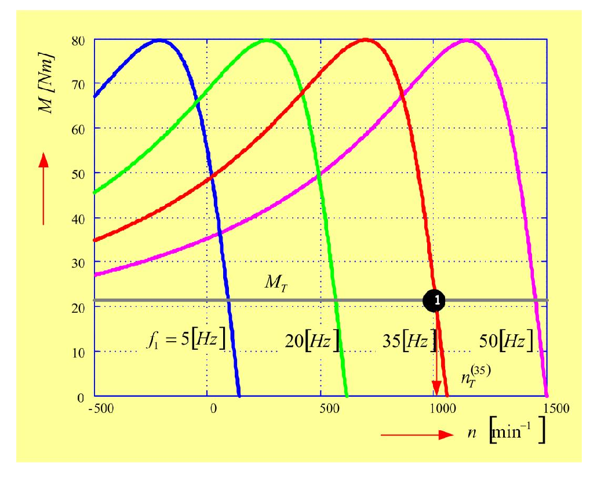

# Zadatak 49 — Brzina dizaličnog pogona pri U/f regulaciji na 35 Hz (Klosova jednačina)

## Postavka

Trofazni asinhroni motor sa kaveznim rotorom ima podatke: $4\ \mathrm{kW}$, $380\ \mathrm{V}$, $50\ \mathrm{Hz}$, $9\ \mathrm{A}$, $1440\ \mathrm{o/min}$, $\nu = M_{\mathrm{pr}}/M_{\mathrm{n}} = 3$. Motor pokreće dizalicu čiji je moment konstantan i jednak $80\ \%$ nazivnog momenta motora. Podešavanje brzine obrtanja vrši se promenom učestanosti uz uslov $U/f = \mathrm{konst}$. Koristeći Klosovu jednačinu odrediti brzinu obrtanja ako je učestanost napona napajanja $35\ \mathrm{Hz}$.

> **Prevod na običan jezik:** Imamo običan trofazni asinhroni motor (rotor mu je „kavezni" — umesto namotaja sa četkicama ima kratkospojene provodne šipke, kao veveričji kavez). Sa natpisne pločice znamo njegovu snagu, napon, struju, učestanost, brzinu i podatak da mu je maksimalni (prevalni) moment 3 puta veći od nazivnog. Motor vuče dizalicu — a dizalica je „tvrdoglav" teret: traži uvek isti moment (80 % nazivnog momenta motora), bez obzira na brzinu. Brzinu motora ne menjamo nikakvim mehaničkim prenosom, nego frekventnim pretvaračem: smanjimo učestanost napona napajanja sa 50 Hz na 35 Hz, ali pri tome srazmerno smanjimo i napon, tako da odnos napona i učestanosti ostane isti ($U/f = \mathrm{konst}$). Pitanje glasi: kojom će se tačno brzinom motor tada obrtati? Nije dovoljno reći „srazmerno sporije" — motor uvek malo „kasni" za obrtnim poljem (to kašnjenje zove se klizanje), a koliko tačno kasni izračunaćemo iz Klosove jednačine.

## Podaci

| Veličina | Oznaka | Vrednost | Šta ta veličina fizički znači |
|---|---|---|---|
| Nazivna snaga | $P_{\mathrm{n}}$ | $4\ \mathrm{kW}$ | Mehanička snaga na vratilu koju motor sme trajno da daje. |
| Nazivni napon | $U_{\mathrm{n}}$ | $380\ \mathrm{V}$ | Linijski napon mreže za koji je motor projektovan (u ovom zadatku se u računu ne koristi). |
| Nazivna učestanost | $f_{\mathrm{sn}}$ | $50\ \mathrm{Hz}$ | Učestanost napona napajanja za koju važe svi nazivni podaci. |
| Nazivna struja | $I_{\mathrm{n}}$ | $9\ \mathrm{A}$ | Struja statora pri nazivnom opterećenju (u ovom zadatku se u računu ne koristi). |
| Nazivna brzina | $n_{\mathrm{n}}$ | $1440\ \mathrm{o/min}$ | Brzina obrtanja rotora pri nazivnom opterećenju i 50 Hz. |
| Nazivna preopteretivost | $\nu_{\mathrm{n}} = M_{\mathrm{pr}}/M_{\mathrm{n}}$ | $3$ | Koliko je puta maksimalni (prevalni) moment motora veći od nazivnog momenta. |
| Moment tereta (dizalice) | $M_{\mathrm{opt}}$ | $0{,}8 \cdot M_{\mathrm{n}}$ | Moment koji dizalica stalno traži od motora — konstantan, ne zavisi od brzine. |
| Nova učestanost napajanja | $f_{\mathrm{s1}}$ | $35\ \mathrm{Hz}$ | Učestanost na koju frekventni pretvarač spušta napajanje (uz $U/f = \mathrm{konst}$). |

Podaci $U_{\mathrm{n}} = 380\ \mathrm{V}$ i $I_{\mathrm{n}} = 9\ \mathrm{A}$ dati su radi potpunosti natpisne pločice — u samom računu nam neće trebati. To je česta situacija u zadacima: deo podataka je „višak" i treba umeti prepoznati šta je zaista potrebno.

## Šta se traži i zašto

**Traži se: brzina obrtanja rotora $n_1$ pri učestanosti napajanja od 35 Hz** (usput ćemo, kao i original, uporediti i apsolutna klizanja pri 50 Hz i 35 Hz).

Zašto bi to inženjera zanimalo? Frekventna (U/f) regulacija je danas *standardni* način upravljanja brzinom asinhronih motora — od dizalica i pumpi do ventilatora. Kada projektujete pogon dizalice, morate znati kojom će se tačno brzinom teret dizati pri zadatoj učestanosti: od toga zavisi produktivnost dizalice, ali i provera da motor u novoj radnoj tački nije preopterećen. Naivna procena „35 Hz je 70 % od 50 Hz, pa je brzina 70 % od nazivne" nije tačna, jer se pri promeni učestanosti menja i klizanje radne tačke — a upravo klizanje računamo Klosovom jednačinom.

Plan rešavanja, običnim jezikom:

1. Iz snage i brzine izračunamo nazivni moment motora $M_{\mathrm{n}}$, pa moment tereta $M_{\mathrm{opt}} = 0{,}8 \cdot M_{\mathrm{n}}$ i prevalni moment $M_{\mathrm{pr}} = 3 \cdot M_{\mathrm{n}}$.
2. Iz nazivne brzine prepoznamo broj pari polova i sinhronu brzinu, pa izračunamo nazivno klizanje $s_{\mathrm{n}}$.
3. Iz Klosove jednačine (u „obrnutom" smeru) nađemo nazivno *prevalno* klizanje $s_{\mathrm{prn}}$ pri 50 Hz.
4. Prevalno klizanje se menja obrnuto srazmerno učestanosti — preračunamo ga za 35 Hz.
5. U Klosovu jednačinu sada uvrstimo *stvarni* moment tereta (80 % nazivnog) i iz nje izračunamo klizanje $s_1$ radne tačke pri 35 Hz.
6. Iz klizanja i sinhrone brzine pri 35 Hz dobijemo traženu brzinu $n_1$; na kraju uporedimo apsolutna klizanja pri 50 Hz i 35 Hz.

## Potrebna teorija — mini-lekcije

### Mini-lekcija 1: Sinhrona brzina, klizanje i broj pari polova

Trofazni namotaj statora, napajan trofaznim naponom učestanosti $f_{\mathrm{s}}$, stvara **obrtno magnetno polje**. To polje se obrće takozvanom **sinhronom brzinom**:

$$n_{\mathrm{s}} = \frac{60 \cdot f_{\mathrm{s}}}{p}\ \ [\mathrm{o/min}]$$

gde je $p$ **broj pari polova** namotaja (koliko puta se raspored sever–jug polova ponavlja po obimu mašine), a faktor 60 samo pretvara obrtaje u sekundi u obrtaje u minuti. Poreklo formule: polje napravi jedan pun obrtaj za $p$ perioda napona (kod višepolne mašine jedan električni ciklus „pomeri" polje samo za jedan par polova), pa je brzina polja $f_{\mathrm{s}}/p$ obrtaja u sekundi.

Rotor asinhronog motora **nikada ne stigne** obrtno polje: da bi se u rotorskim provodnicima uopšte indukovale struje (a bez njih nema momenta), rotor mora da „kasni" za poljem. To relativno kašnjenje zove se **klizanje**:

$$s = \frac{n_{\mathrm{s}} - n}{n_{\mathrm{s}}}$$

gde je $n$ brzina rotora. Klizanje je bezdimenzioni broj: $s = 0$ znači da se rotor obrće sinhronom brzinom (prazan hod, idealno), $s = 1$ znači da rotor stoji (polazak). Kod normalno opterećenih motora klizanje je malo, tipično 2–6 %. Razlika $\Delta n = n_{\mathrm{s}} - n = s \cdot n_{\mathrm{s}}$ zove se **apsolutno klizanje** (u obrtajima u minuti) — trebaće nam na kraju zadatka.

**Kako iz natpisne pločice pročitati $p$?** Nazivna brzina je uvek *malo ispod* neke sinhrone brzine. Pri 50 Hz moguće sinhrone brzine su: $p=1 \Rightarrow 3000$, $p=2 \Rightarrow 1500$, $p=3 \Rightarrow 1000\ \mathrm{o/min}$… Naš motor ima $n_{\mathrm{n}} = 1440\ \mathrm{o/min}$, što je tik ispod 1500, pa je $p = 2$ i $n_{\mathrm{s}} = 1500\ \mathrm{o/min}$.

### Mini-lekcija 2: Momentna karakteristika, prevalni moment i preopteretivost

**Statička momentna karakteristika** $M(s)$ pokazuje koliki moment motor razvija pri svakom klizanju (tj. pri svakoj brzini). Ona ima karakterističan „brežuljak": od praznog hoda ($s=0$, $M=0$) moment najpre raste sa klizanjem, dostiže maksimum, pa opada ka polaznoj vrednosti ($s=1$).

- Maksimalni moment zove se **prevalni moment** $M_{\mathrm{pr}}$ (kaže se i „preturni"): ako teret zatraži više od $M_{\mathrm{pr}}$, motor se „prevali" — naglo se zaustavi jer ne može da isprati teret.
- Klizanje pri kome se maksimum dostiže zove se **prevalno klizanje** $s_{\mathrm{pr}}$.
- Deo karakteristike sa $s < s_{\mathrm{pr}}$ je **stabilna (radna) grana**: tu motor normalno radi, jer svako usporenje (porast $s$) povećava moment i vraća mašinu u ravnotežu. Deo sa $s > s_{\mathrm{pr}}$ je nestabilan za konstantan teret.
- **Preopteretivost** $\nu = M_{\mathrm{pr}}/M$ kaže koliko je puta prevalni moment veći od momenta koji motor trenutno razvija. Kada se poredi baš sa nazivnim momentom, dobija se **nazivna preopteretivost** $\nu_{\mathrm{n}} = M_{\mathrm{pr}}/M_{\mathrm{n}}$ — podatak sa natpisne pločice (ovde $\nu_{\mathrm{n}} = 3$). Pazite: u računu sa Klosovom jednačinom figuriše preopteretivost u odnosu na *stvarni* moment radne tačke, koja može biti različita od nazivne — to će u ovom zadatku biti ključni detalj.

U stacionarnom (ustaljenom) pogonu motor se ne ubrzava niti usporava, pa mora biti $M = M_{\mathrm{opt}}$: moment motora jednak je momentu opterećenja. Radna tačka je presek momentne karakteristike motora i karakteristike tereta.

### Mini-lekcija 3: Odakle momentna karakteristika — formula momenta bez statorskog otpora

Iz ekvivalentne šeme asinhronog motora (kolo po fazi, slično transformatoru, u kome se rotor predstavlja svedenim otporom $R'_{\mathrm{r}}/s$), **ako zanemarimo statorski omski otpor** $R_{\mathrm{s}}$, dobija se izraz za obrtni moment:

$$M = \frac{q_{\mathrm{s}}}{\omega_{\mathrm{s}}} \cdot U_{\mathrm{sf}}^2 \cdot \frac{R'_{\mathrm{r}}/s}{\left(\dfrac{R'_{\mathrm{r}}}{s}\right)^{2} + X_{\mathrm{k}}^{2}} \tag{49.8}$$

Značenje svakog simbola:

- $q_{\mathrm{s}}$ — broj faza statora (kod nas $q_{\mathrm{s}} = 3$);
- $\omega_{\mathrm{s}} = \dfrac{2\pi f_{\mathrm{s}}}{p}$ — sinhrona **mehanička** ugaona brzina u $\mathrm{rad/s}$ (ista sinhrona brzina iz mini-lekcije 1, samo u radijanima u sekundi);
- $U_{\mathrm{sf}}$ — fazni napon statora;
- $R'_{\mathrm{r}}$ — rotorski otpor sveden na stator (prim označava svođenje);
- $X_{\mathrm{k}} = X_{\gamma \mathrm{s}} + X'_{\gamma \mathrm{r}}$ — **reaktansa kratkog spoja**, zbir rasipne reaktanse statora i svedene rasipne reaktanse rotora.

Intuicija iza formule: moment je srazmeran snazi koja se preko vazdušnog zazora prenosi na rotor, a ta snaga se troši na „otporniku" $R'_{\mathrm{r}}/s$; struja kroz njega ograničena je impedansom $\sqrt{(R'_{\mathrm{r}}/s)^2 + X_{\mathrm{k}}^2}$ — otuda ovakav oblik razlomka.

**Gde je maksimum?** Izraz (49.8) je najveći kada je imenilac, u odnosu na brojilac, najmanji — pokazuje se (izvodom po $R'_{\mathrm{r}}/s$, ili prepoznavanjem da je zbir $x + a^2/x$ minimalan za $x=a$) da se to dešava kada je $R'_{\mathrm{r}}/s = X_{\mathrm{k}}$. Odatle **prevalno klizanje**:

$$s_{\mathrm{pr}} = \pm\frac{R'_{\mathrm{r}}}{X_{\mathrm{k}}} = \pm\frac{R'_{\mathrm{r}}}{X_{\gamma \mathrm{s}} + X'_{\gamma \mathrm{r}}} = \pm\frac{R'_{\mathrm{r}}}{2\pi f_{\mathrm{s}} \left(L_{\gamma \mathrm{s}} + L'_{\gamma \mathrm{r}}\right)} \tag{49.9}$$

gde su $L_{\gamma \mathrm{s}}$ i $L'_{\gamma \mathrm{r}}$ rasipne induktivnosti ($X = 2\pi f_{\mathrm{s}} L$); znak $+$ važi za motorski, znak $-$ za generatorski režim. **Ključno zapažanje za ovaj zadatak:** otpor $R'_{\mathrm{r}}$ i induktivnosti ne zavise od učestanosti, pa se prevalno klizanje menja **obrnuto srazmerno učestanosti** $f_{\mathrm{s}}$ — spustimo li učestanost, prevalno klizanje poraste u istoj razmeri.

**Koliki je maksimum?** Uvrstimo $s = s_{\mathrm{pr}}$, tj. $R'_{\mathrm{r}}/s_{\mathrm{pr}} = X_{\mathrm{k}}$, u (49.8). Imenilac postaje $X_{\mathrm{k}}^2 + X_{\mathrm{k}}^2 = 2X_{\mathrm{k}}^2$, pa je:

$$M_{\mathrm{pr}} = \frac{q_{\mathrm{s}}}{\dfrac{2\pi f_{\mathrm{s}}}{p}} \cdot U_{\mathrm{sf}}^2 \cdot \frac{X_{\mathrm{k}}}{2X_{\mathrm{k}}^{2}} = \frac{q_{\mathrm{s}}}{\dfrac{4\pi f_{\mathrm{s}}}{p}} \cdot U_{\mathrm{sf}}^2 \cdot \frac{1}{X_{\mathrm{k}}}$$

a kada još uvrstimo $X_{\mathrm{k}} = 2\pi f_{\mathrm{s}}(L_{\gamma \mathrm{s}} + L'_{\gamma \mathrm{r}})$:

$$M_{\mathrm{pr}} = \frac{p \cdot q_{\mathrm{s}}}{8\pi^{2}} \left(\frac{U_{\mathrm{sf}}}{f_{\mathrm{s}}}\right)^{2} \cdot \frac{1}{L_{\gamma \mathrm{s}} + L'_{\gamma \mathrm{r}}} \tag{49.10}$$

Iz (49.10) se vidi nešto izvanredno korisno: prevalni moment zavisi od napona i učestanosti **samo kroz njihov količnik** $U_{\mathrm{sf}}/f_{\mathrm{s}}$. Dakle, dok god pri promeni učestanosti držimo $U/f = \mathrm{konst}$, **prevalni moment ostaje konstantan** — motor na svakoj učestanosti može da „izgura" isti maksimalni moment. (U stvarnosti, gde $R_{\mathrm{s}}$ nije nula, $M_{\mathrm{pr}}$ se pri smanjenju učestanosti ipak malo smanjuje — na niskim učestanostima pad napona na $R_{\mathrm{s}}$ postaje relativno sve značajniji.)

### Mini-lekcija 4: Klosova jednačina i njena kvadratna forma

Kad izraz (49.8) podelimo izrazom za $M_{\mathrm{pr}}$ (u obliku pre uvrštavanja $X_{\mathrm{k}}$: $M_{\mathrm{pr}} = \frac{q_{\mathrm{s}}}{\omega_{\mathrm{s}}} U_{\mathrm{sf}}^2 \cdot \frac{1}{2X_{\mathrm{k}}}$), svi parametri mašine se pokrate osim kombinacija koje daju $s_{\mathrm{pr}}$:

$$\frac{M}{M_{\mathrm{pr}}} = \frac{2 X_{\mathrm{k}} \cdot \dfrac{R'_{\mathrm{r}}}{s}}{\left(\dfrac{R'_{\mathrm{r}}}{s}\right)^{2} + X_{\mathrm{k}}^{2}}$$

Podelimo i brojilac i imenilac sa $X_{\mathrm{k}} \cdot \dfrac{R'_{\mathrm{r}}}{s}$ i iskoristimo $s_{\mathrm{pr}} = R'_{\mathrm{r}}/X_{\mathrm{k}}$ (pa je $\frac{R'_{\mathrm{r}}/s}{X_{\mathrm{k}}} = \frac{s_{\mathrm{pr}}}{s}$ i $\frac{X_{\mathrm{k}}}{R'_{\mathrm{r}}/s} = \frac{s}{s_{\mathrm{pr}}}$). Dobija se **Klosova jednačina**:

$$\frac{M}{M_{\mathrm{pr}}} = \frac{2}{\dfrac{s}{s_{\mathrm{pr}}} + \dfrac{s_{\mathrm{pr}}}{s}} \tag{49.2}$$

Ovo je izuzetno praktičan rezultat: cela statička momentna karakteristika zavisi **samo od dva podatka** — prevalnog momenta $M_{\mathrm{pr}}$ i prevalnog klizanja $s_{\mathrm{pr}}$. Ne moramo znati nijedan otpor ni reaktansu mašine! Zato Klosova jednačina i jeste omiljeni alat za brze pogonske proračune, baš kao u ovom zadatku.

**Kvadratna forma.** U zadacima obično znamo moment (jer u stacionarnom stanju $M = M_{\mathrm{opt}}$) i tražimo klizanje, ili obrnuto. Sredimo zato (49.2): pomnožimo obe strane imeniocem desne strane i podelimo sa $M/M_{\mathrm{pr}}$:

$$\frac{s}{s_{\mathrm{pr}}} + \frac{s_{\mathrm{pr}}}{s} = \frac{2 M_{\mathrm{pr}}}{M}$$

pa obe strane pomnožimo sa $s \cdot s_{\mathrm{pr}}$ (time nestaju razlomci):

$$s^{2} + s_{\mathrm{pr}}^{2} = 2 \cdot \frac{M_{\mathrm{pr}}}{M} \cdot s \cdot s_{\mathrm{pr}}$$

i prebacimo sve na levu stranu:

$$s^{2} - 2 \cdot \frac{M_{\mathrm{pr}}}{M} \cdot s \cdot s_{\mathrm{pr}} + s_{\mathrm{pr}}^{2} = 0 \tag{49.3}$$

Odnos $M_{\mathrm{pr}}/M$ je upravo preopteretivost $\nu$ (u odnosu na trenutni moment $M$), pa kvadratna jednačina glasi:

$$s^{2} - 2\nu \cdot s \cdot s_{\mathrm{pr}} + s_{\mathrm{pr}}^{2} = 0 \tag{49.4}$$

Ova jednačina je simetrična po $s$ i $s_{\mathrm{pr}}$, pa je možemo rešiti u oba smera standardnom formulom za kvadratnu jednačinu $x = \frac{-b \pm \sqrt{b^2 - 4ac}}{2a}$.

**Smer 1 — znamo $s$, tražimo $s_{\mathrm{pr}}$** (jednačina po nepoznatoj $s_{\mathrm{pr}}$, sa $a = 1$, $b = -2\nu s$, $c = s^2$):

$$s_{\mathrm{pr}1,2} = \frac{2\nu s \pm \sqrt{4\nu^{2}s^{2} - 4s^{2}}}{2} = s \cdot \left(\nu \pm \sqrt{\nu^{2} - 1}\,\right) \tag{49.5}$$

**Smer 2 — znamo $s_{\mathrm{pr}}$, tražimo $s$** (potpuno ista algebra, samo su uloge zamenjene):

$$s_{1,2} = s_{\mathrm{pr}} \cdot \left(\nu \pm \sqrt{\nu^{2} - 1}\,\right) \tag{49.6}$$

U oba smera formula daje **dva korena, a samo je jedan fizički pravi** — kvadratna jednačina „ne zna" na kojoj smo grani karakteristike, pa nudi obe presečne tačke:

- u (49.5) uzimamo znak $+$: prevalno klizanje mora biti *veće* od klizanja radne tačke na stabilnoj grani ($s_{\mathrm{pr}} > s$); koren sa $-$ dao bi $s_{\mathrm{pr}} < s$, što bi značilo da motor radi na nestabilnoj grani;
- u (49.6) uzimamo znak $-$: stabilna radna tačka ima $s < s_{\mathrm{pr}}$; koren sa $+$ daje presek momenta tereta sa nestabilnom granom (a ovde čak i $s > 1$, što uopšte nije motorski režim).

Zgodna kontrola: pošto je slobodni član jednačine (49.4) jednak $s_{\mathrm{pr}}^2$, proizvod dva korena po Vijetovim formulama mora biti $s_{1} \cdot s_{2} = s_{\mathrm{pr}}^{2}$ — to ćemo iskoristiti u proveri na kraju.

### Mini-lekcija 5: U/f upravljanje (skalarno upravljanje) i zašto baš U/f = konst

Zašto se uz promenu učestanosti menja i napon? Ključ je u **glavnom (zajedničkom) magnetnom fluksu** $\Phi_{\mathrm{g}}$ mašine. Indukovani napon statorskog namotaja srazmeran je proizvodu učestanosti i fluksa ($E_{\mathrm{s}} \sim f_{\mathrm{s}} \cdot \Phi_{\mathrm{g}}$ — ista veza kao kod transformatora), a kako je pri malom $R_{\mathrm{s}}$ napon približno jednak indukovanom naponu ($U_{\mathrm{s}} \approx E_{\mathrm{s}}$), sledi:

$$\Phi_{\mathrm{g}} \sim \frac{U_{\mathrm{s}}}{f_{\mathrm{s}}}$$

Odatle direktno slede posledice koje original opisuje:

- **Povećamo li učestanost uz konstantan napon**, glavni fluks opada, a s njim (po jednačini (49.10), gde $M_{\mathrm{pr}}$ zavisi od $(U/f)^2$) opadaju i polazni i prevalni moment. Efekat je isti kao da smo pri nazivnoj učestanosti *snizili* napon ispod nazivnog — motor tada može biti preopterećen (teret mu se opasno približi smanjenom $M_{\mathrm{pr}}$).
- **Smanjimo li učestanost uz konstantan napon**, glavni fluks raste, a s njim rastu prevalni i polazni moment. Efekat je isti kao pri *povišenom* naponu — magnetno kolo ulazi u zasićenje, struja magnećenja naglo raste (struja praznog hoda može premašiti čak i nazivnu struju!).
- U oba slučaja posledica je **pregrevanje motora** — zato se učestanost nikad ne menja „sama".

Regulacija brzine promenom učestanosti naziva se **U/f-upravljanje** ili **skalarno upravljanje** (podešavaju se samo efektivne vrednosti — „skalari" — napona i učestanosti, ne i njihovi trenutni vremenski oblici). Postoje **dve oblasti rada**.

**1. Bazna oblast** ($n \in [0, n_{\mathrm{n}}]$, tj. $f_{\mathrm{s}} < f_{\mathrm{sn}}$): sa smanjenjem učestanosti srazmerno se smanjuje i napon, tako da važi

$$U_{\mathrm{s}}/f_{\mathrm{s}} = \mathrm{konst}, \qquad f_{\mathrm{s}} < f_{\mathrm{sn}} \tag{49.7a}$$

Tada je fluks u vazdušnom zazoru stalno jednak nominalnom ($\Phi_{\mathrm{g}} = \Phi_{\mathrm{n}} = \mathrm{konst}$), nema zasićenja ni dodatnih toplotnih gubitaka, a po (49.10) je i $M_{\mathrm{pr}} = \mathrm{konst}$.

**2. Oblast slabljenja polja** ($n > n_{\mathrm{n}}$, tj. $f_{\mathrm{s}} > f_{\mathrm{sn}}$): napon *ne smemo* dalje povećavati iznad nazivnog (izolacija namotaja!), pa se drži

$$U_{\mathrm{s}} = U_{\mathrm{sn}}, \qquad f_{\mathrm{s}} > f_{\mathrm{sn}} \tag{49.7b}$$

a fluks (i prevalni moment) tada neminovno opadaju sa porastom učestanosti — polje „slabi".

U našem zadatku je $f_{\mathrm{s1}} = 35\ \mathrm{Hz} < 50\ \mathrm{Hz}$, dakle **radimo u baznoj oblasti**: prevalni moment ostaje jednak nazivnom prevalnom momentu ($M_{\mathrm{pr}} = M_{\mathrm{prn}} = \mathrm{konst}$), a prevalno klizanje raste po (49.9) obrnuto srazmerno učestanosti.

Sledeća slika (slika 49.1) prikazuje familiju statičkih karakteristika momenta $M(n)$ jednog te istog motora za četiri učestanosti (5, 20, 35 i 50 Hz) pri $U/f = \mathrm{konst}$ — na njoj se vidi i radna tačka čiju brzinu u ovom zadatku računamo.

**Slika 49.1 —** Familija statičkih karakteristika momenta motora za različite frekvencije (5, 20, 35 i 50 Hz) pri $U/f = \mathrm{konst}$: prevalni moment je isti za sve učestanosti, krive se pomeraju po osi brzine; presek sive linije tereta $M_{\mathrm{T}}$ sa krivom za 35 Hz (tačka 1) je radna tačka čiju brzinu $n_{\mathrm{T}}^{(35)}$ tražimo.

> **Kako čitati sliku 49.1:** Na horizontalnoj osi je brzina obrtanja rotora $n$ u $\mathrm{min^{-1}}$, od $-500$ do $1500$ (deo levo od nule odgovara rotoru koji se obrće *suprotno* od polja); na vertikalnoj osi je moment $M$ u $\mathrm{Nm}$, od 0 do 80 (mreža na svakih $10\ \mathrm{Nm}$). Četiri obojene krive su karakteristike istog motora za četiri učestanosti napajanja, redom sleva nadesno: **plava** za $f_1 = 5\ \mathrm{Hz}$, **zelena** za $20\ \mathrm{Hz}$, **crvena** za $35\ \mathrm{Hz}$ i **ružičasta** za $50\ \mathrm{Hz}$. Svaka kriva seče osu $M = 0$ tačno pri svojoj sinhronoj brzini $n_{\mathrm{s}} = 60 f_{\mathrm{s}}/p$ (za $p = 2$: $150$, $600$, $1050$ i $1500\ \mathrm{min^{-1}}$), a vrh (prevalni moment) svima je na istoj visini, oko $80\ \mathrm{Nm}$ — to je naših $M_{\mathrm{pr}} = 79{,}5\ \mathrm{Nm}$, konstantan jer je $U/f = \mathrm{konst}$ (jednačina (49.10)). Menja se samo *položaj* vrha po brzini: kod ružičaste je na $\approx 1150\ \mathrm{min^{-1}}$ (prevalno klizanje $s_{\mathrm{prn}} = 0{,}233$ iz Koraka 4), kod crvene na $\approx 700\ \mathrm{min^{-1}}$ ($s_{\mathrm{pr1}} = 0{,}333$ iz Koraka 5) — kriva za nižu učestanost je, relativno, "šira". Horizontalna siva prava je konstantan moment tereta $M_{\mathrm{T}} \approx 21\ \mathrm{Nm}$ (naša dizalica, $21{,}2\ \mathrm{Nm}$) — ista visina na svakoj brzini, jer dizalica ne mari za brzinu. Radna tačka pogona je presek linije tereta sa **strmom, stabilnom (opadajućom) granom** krive za datu učestanost: crni kružić "**1**" na crvenoj krivoj (35 Hz), iz koga crvena strelica nadole pokazuje na oznaku $n_{\mathrm{T}}^{(35)}$ na osi brzine — to je tražena brzina, tik iznad $1000\ \mathrm{min^{-1}}$ (tačno $1002{,}75\ \mathrm{min^{-1}}$ iz Koraka 8). Šta treba da zaključiš: pri $U/f = \mathrm{konst}$ karakteristika se pomera po osi brzine sa nepromenjenim prevalnim momentom, pa radna tačka (presek sa $M_{\mathrm{T}}$) klizi gotovo tačno srazmerno učestanosti — na svakoj učestanosti rotor zaostaje za poljem za približno isto apsolutno klizanje ($\approx 47\ \mathrm{min^{-1}}$, Korak 9).

## Rešenje, korak po korak

### Korak 1: Nazivni moment motora i moment tereta

**Zašto ovaj korak:** Klosova jednačina radi sa momentima, a mi sa pločice znamo snagu i brzinu — prvo ih pretvaramo u nazivni moment, iz koga onda slede i moment tereta i prevalni moment.

Mehanička snaga je proizvod momenta i ugaone brzine, $P = M \cdot \omega$, pa je nazivni moment:

$$M_{\mathrm{n}} = \frac{P_{\mathrm{n}}}{\omega_{\mathrm{n}}} = \frac{P_{\mathrm{n}}}{\dfrac{2\pi}{60} \cdot n_{\mathrm{n}}}$$

gde je $\omega_{\mathrm{n}}$ nazivna ugaona brzina rotora u $\mathrm{rad/s}$, a $\frac{2\pi}{60}$ faktor pretvaranja iz $\mathrm{o/min}$ u $\mathrm{rad/s}$ (jedan obrtaj je $2\pi$ radijana, jedan minut je 60 sekundi). Uvrstimo brojeve:

$$\omega_{\mathrm{n}} = \frac{2\pi}{60} \cdot 1440 = 150{,}8\ \mathrm{rad/s}$$

$$M_{\mathrm{n}} = \frac{4000}{150{,}8} = 26{,}5\ \mathrm{Nm}$$

Karakteristika momenta dizalice u zadatku je konstantna:

$$M_{\mathrm{opt}} = 0{,}8 \cdot M_{\mathrm{n}} = 0{,}8 \cdot 26{,}5 = 21{,}2\ \mathrm{Nm} = \mathrm{konst} \tag{49.1}$$

**Šta smo dobili:** motor od 4 kW nazivno daje $26{,}5\ \mathrm{Nm}$ — red veličine tipičan za male industrijske motore; dizalica od njega stalno traži $21{,}2\ \mathrm{Nm}$, bez obzira na brzinu i učestanost.

### Korak 2: Prevalni moment motora

**Zašto ovaj korak:** prevalni moment je jedan od dva podatka koje Klosova jednačina zahteva; dobijamo ga direktno iz nazivne preopteretivosti.

$$M_{\mathrm{pr}} = \nu_{\mathrm{n}} \cdot M_{\mathrm{n}} = 3 \cdot 26{,}5 = 79{,}5\ \mathrm{Nm}$$

**Šta smo dobili:** maksimalni moment koji motor uopšte može da razvije je $79{,}5\ \mathrm{Nm}$. Pošto radimo u baznoj oblasti U/f upravljanja, po mini-lekciji 5 ovaj prevalni moment **ostaje isti i na 35 Hz** ($M_{\mathrm{pr}} = M_{\mathrm{prn}} = \mathrm{konst}$) — na slici 49.1 svi vrhovi su na istoj visini.

### Korak 3: Sinhrona brzina, broj pari polova i nazivno klizanje

**Zašto ovaj korak:** klizanje se računa u odnosu na sinhronu brzinu, a nju određuje broj pari polova — koji na pločici ne piše, ali se jednoznačno prepoznaje iz nazivne brzine (mini-lekcija 1).

Pri $f_{\mathrm{sn}} = 50\ \mathrm{Hz}$ sinhrona brzina može biti $3000$, $1500$, $1000, \ldots\ \mathrm{o/min}$ (za $p = 1, 2, 3, \ldots$). Nazivna brzina $1440\ \mathrm{o/min}$ je tik ispod $1500\ \mathrm{o/min}$, pa je:

$$p = 2, \qquad n_{\mathrm{s}} = \frac{60 \cdot f_{\mathrm{sn}}}{p} = \frac{60 \cdot 50}{2} = 1500\ \mathrm{o/min}$$

Nazivno klizanje je onda:

$$s_{\mathrm{n}} = \frac{n_{\mathrm{s}} - n_{\mathrm{n}}}{n_{\mathrm{s}}} = \frac{1500 - 1440}{1500} = 0{,}04 = 4\ \%$$

> **Napomena o originalu:** u zbirci je u ovoj formuli u imeniocu odštampano $n_{\mathrm{n}}$, ali je numerički (ispravno) uvršteno $1500 = n_{\mathrm{s}}$. Definicija klizanja uvek ima sinhronu brzinu u imeniocu, pa rezultat $0{,}04$ ostaje isti.

**Šta smo dobili:** motor nazivno „kasni" za poljem 4 % — sasvim tipična vrednost za motor ove snage, što potvrđuje da smo dobro prepoznali $p = 2$.

### Korak 4: Nazivno prevalno klizanje (pri 50 Hz)

**Zašto ovaj korak:** drugi podatak koji Klosova jednačina traži je prevalno klizanje. Njega nemamo na pločici, ali ga možemo izračunati „obrnutim" smerom Klosove jednačine — jer u nazivnoj radnoj tački znamo i klizanje ($s_{\mathrm{n}}$) i preopteretivost ($\nu_{\mathrm{n}} = M_{\mathrm{pr}}/M_{\mathrm{n}} = 3$).

Po jednačini (49.5), sa $s = s_{\mathrm{n}}$ i $\nu = \nu_{\mathrm{n}} = 3$:

$$s_{\mathrm{prn}} = s_{\mathrm{n}} \cdot \left(\nu_{\mathrm{n}} + \sqrt{\nu_{\mathrm{n}}^{2} - 1}\,\right) = 0{,}04 \cdot \left(3 + \sqrt{3^{2} - 1}\,\right)$$

Izračunajmo koren posebno: $3^2 - 1 = 8$, $\sqrt{8} = 2{,}828$, pa je:

$$s_{\mathrm{prn}} = 0{,}04 \cdot (3 + 2{,}828) = 0{,}04 \cdot 5{,}828 = 0{,}233 = 23{,}3\ \%$$

Uzeli smo znak $+$ jer prevalno klizanje mora biti veće od nazivnog ($s_{\mathrm{pr}} > s_{\mathrm{n}}$ — nazivna tačka leži na stabilnoj grani); koren sa znakom $-$ dao bi $0{,}04 \cdot 0{,}172 = 0{,}0069 < s_{\mathrm{n}}$, što je fizički nemoguće.

**Šta smo dobili:** vrh momentne karakteristike pri 50 Hz nalazi se na klizanju od 23,3 %, tj. na brzini oko $(1 - 0{,}233) \cdot 1500 \approx 1150\ \mathrm{o/min}$ — pogledajte krivu za 50 Hz na slici 49.1, njen vrh je zaista oko te brzine.

### Korak 5: Prevalno klizanje pri 35 Hz

**Zašto ovaj korak:** spuštanjem učestanosti karakteristika se pomera, a sa njom i prevalno klizanje — po jednačini (49.9) ono je obrnuto srazmerno učestanosti, pa ga za 35 Hz prosto preračunamo.

Iz (49.9) sledi $s_{\mathrm{pr}} \cdot f_{\mathrm{s}} = \mathrm{konst}$ (jer su $R'_{\mathrm{r}}$, $L_{\gamma \mathrm{s}}$ i $L'_{\gamma \mathrm{r}}$ konstante mašine), pa je:

$$s_{\mathrm{pr1}} = \frac{f_{\mathrm{sn}}}{f_{\mathrm{s1}}} \cdot s_{\mathrm{prn}} = \frac{50}{35} \cdot 0{,}233 = 1{,}429 \cdot 0{,}233 = 0{,}333$$

**Šta smo dobili:** na 35 Hz vrh karakteristike je na klizanju od 33,3 % — kriva je, relativno gledano, „šira" nego na 50 Hz. Uočite: prevalni **moment** se nije promenio (Korak 2), ali prevalno **klizanje** jeste — zato ne smemo na 35 Hz koristiti $s_{\mathrm{prn}} = 0{,}233$.

### Korak 6: Preopteretivost u odnosu na stvarni teret

**Zašto ovaj korak:** u Klosovoj kvadratnoj jednačini (49.4) figuriše $\nu = M_{\mathrm{pr}}/M$, gde je $M$ moment koji motor *stvarno razvija* u radnoj tački. U stacionarnom pogonu $M = M_{\mathrm{opt}} = 0{,}8 \cdot M_{\mathrm{n}}$ — a to **nije** nazivni moment, pa ni preopteretivost nije nazivnih $\nu_{\mathrm{n}} = 3$.

$$\nu = \frac{M_{\mathrm{prn}}}{0{,}8 \cdot M_{\mathrm{n}}} = \frac{\nu_{\mathrm{n}} \cdot M_{\mathrm{n}}}{0{,}8 \cdot M_{\mathrm{n}}} = \frac{\nu_{\mathrm{n}}}{0{,}8} = \frac{3}{0{,}8} = 3{,}75$$

(Nazivni moment $M_{\mathrm{n}}$ se u razlomku skratio — zato rezultat ne zavisi od toga koliko je tačno $M_{\mathrm{n}}$.)

**Šta smo dobili:** u odnosu na teret dizalice motor ima rezervu momenta od 3,75 puta — veću od nazivne, logično, jer je teret lakši od nazivnog opterećenja ($80\ \%$ nazivnog momenta).

### Korak 7: Klizanje radne tačke pri 35 Hz iz Klosove jednačine

**Zašto ovaj korak:** sada znamo sve što Klosova jednačina traži — prevalno klizanje pri 35 Hz ($s_{\mathrm{pr1}} = 0{,}333$) i preopteretivost ($\nu = 3{,}75$) — pa iz njenog „smera 2", jednačine (49.6), računamo klizanje radne tačke.

$$s_{1,2} = s_{\mathrm{pr1}} \cdot \left(\nu \pm \sqrt{\nu^{2} - 1}\,\right) = 0{,}333 \cdot \left(3{,}75 \pm \sqrt{3{,}75^{2} - 1}\,\right)$$

Koren posebno: $3{,}75^2 = 14{,}0625$, pa je $3{,}75^2 - 1 = 13{,}0625$ i $\sqrt{13{,}0625} = 3{,}6142$. Dva korena su:

$$s_{11} = 0{,}333 \cdot (3{,}75 + 3{,}6142) = 0{,}333 \cdot 7{,}3642 = 2{,}45$$

$$s_{12} = 0{,}333 \cdot (3{,}75 - 3{,}6142) = 0{,}333 \cdot 0{,}1358 = 0{,}045$$

Pravi je koren $s_1 = s_{12} = 0{,}045$: stabilna radna tačka mora imati klizanje **manje** od prevalnog ($0{,}045 < 0{,}333$ ✓). Koren $s_{11} = 2{,}45$ je čak veći od 1 — klizanje veće od 1 značilo bi da se rotor obrće *suprotno* od obrtnog polja (režim protivstrujnog kočenja), a naša dizalica se uredno obrće u smeru polja, samo malo sporije od njega.

$$s_1 = 0{,}045$$

**Šta smo dobili:** i na 35 Hz motor „kasni" za poljem svega 4,5 % — malo, uporedivo sa nazivnim klizanjem, što je znak zdrave radne tačke daleko od prevala.

### Korak 8: Sinhrona brzina i brzina obrtanja pri 35 Hz

**Zašto ovaj korak:** klizanje pretvaramo u traženu brzinu — prvo sračunamo brzinu obrtnog polja pri 35 Hz, pa od nje „oduzmemo" klizanje.

Brzina obrtnog polja pri $f_{\mathrm{s1}} = 35\ \mathrm{Hz}$ (formula iz mini-lekcije 1, sa $p = 2$ iz Koraka 3):

$$n_{\mathrm{s1}} = \frac{60 \cdot f_{\mathrm{s1}}}{p} = \frac{60 \cdot 35}{2} = 1050\ \mathrm{o/min}$$

Iz definicije klizanja $s_1 = (n_{\mathrm{s1}} - n_1)/n_{\mathrm{s1}}$ izrazimo brzinu rotora: pomnožimo obe strane sa $n_{\mathrm{s1}}$ ($s_1 n_{\mathrm{s1}} = n_{\mathrm{s1}} - n_1$), pa prebacimo ($n_1 = n_{\mathrm{s1}} - s_1 n_{\mathrm{s1}}$):

$$n_1 = (1 - s_1) \cdot n_{\mathrm{s1}} = (1 - 0{,}045) \cdot 1050 = 0{,}955 \cdot 1050 = 1002{,}75\ \mathrm{o/min}$$

**Šta smo dobili: traženu brzinu — motor se pri 35 Hz obrće sa $n_1 = 1002{,}75\ \mathrm{o/min}$.** To je upravo tačka „1" na slici 49.1 (presek linije tereta sa krivom za 35 Hz, tik iznad $1000\ \mathrm{min^{-1}}$). Brzina je smanjena sa oko 1450 na oko 1000 o/min — ostvarena je značajna promena brzine uz malu promenu klizanja, što ovaj metod regulacije čini ekonomičnim (malo klizanje = mali rotorski gubici, jer je njihov udeo u snazi zazora upravo $s$). Zato je frekventna regulacija danas dominantan metod upravljanja brzinom asinhronih motora.

### Korak 9 (dopuna iz originala): Poređenje apsolutnih klizanja pri 50 Hz i 35 Hz

**Zašto ovaj korak:** original ovde ističe još jedno lepo svojstvo U/f regulacije — **apsolutno klizanje** $\Delta n = n_{\mathrm{s}} - n$ (razlika sinhrone i rotorske brzine, u o/min) pri istom momentu tereta ostaje praktično isto na svim učestanostima. Umesto da to samo tvrdimo, pokažimo i zašto: po (49.6) je $s = s_{\mathrm{pr}}\left(\nu - \sqrt{\nu^2 - 1}\right)$, pa je

$$\Delta n = s \cdot n_{\mathrm{s}} = s_{\mathrm{pr}} \left(\nu - \sqrt{\nu^{2} - 1}\,\right) \cdot \frac{60 f_{\mathrm{s}}}{p}$$

a kako je $s_{\mathrm{pr}} \cdot f_{\mathrm{s}} = \mathrm{konst}$ (Korak 5) i $\nu = \mathrm{konst}$ (jer su i $M_{\mathrm{pr}}$ i teret konstantni), ceo izraz **ne zavisi od učestanosti**. Proverimo brojevima.

Klizanje pri datom teretu ($\nu = 3{,}75$) i **nazivnoj** učestanosti $f_{\mathrm{sn}} = 50\ \mathrm{Hz}$, opet po (49.6), sada sa $s_{\mathrm{prn}} = 0{,}233$:

$$s_{1,2\mathrm{n}} = 0{,}233 \cdot \left(3{,}75 \pm \sqrt{3{,}75^{2} - 1}\,\right) = 0{,}233 \cdot (3{,}75 \pm 3{,}6142)$$

Pravi (manji) koren: $s_{1\mathrm{n}} = 0{,}233 \cdot 0{,}1358 = 0{,}0316 = 3{,}16\ \%$. Apsolutno klizanje pri 50 Hz:

$$\Delta n_{1\mathrm{n}} = s_{1\mathrm{n}} \cdot n_{\mathrm{s}} = s_{1\mathrm{n}} \cdot \frac{60 f_{\mathrm{sn}}}{p} = 0{,}0316 \cdot \frac{60 \cdot 50}{2} = 47{,}46\ \mathrm{o/min}$$

(Original ovde u množenju zadržava nezaokruženu vrednost $s_{1\mathrm{n}} = 0{,}03164$, pa je $0{,}03164 \cdot 1500 = 47{,}46$; sa zaokruženim $0{,}0316$ dobilo bi se $47{,}4$ — razlika je samo u zaokruživanju.)

Apsolutno klizanje pri istom teretu i učestanosti $f_{\mathrm{s1}} = 35\ \mathrm{Hz}$ (iz Koraka 8):

$$\Delta n_{1} = n_{\mathrm{s1}} - n_{1} = 1050 - 1002{,}75 = 47{,}25\ \mathrm{o/min}$$

**Šta smo dobili:** $47{,}46 \approx 47{,}25\ \mathrm{o/min}$ — apsolutno klizanje je praktično isto (sitna razlika potiče isključivo od usputnih zaokruživanja $s_{\mathrm{pr}}$ i $s$). Praktična posledica: kod U/f regulacije rotor na svakoj učestanosti „zaostaje" za poljem za isti broj obrtaja u minuti, pa se brzina pogona vrlo predvidivo pomera zajedno sa učestanošću.

## Česte greške i zamke

1. **Uvrštavanje nazivne preopteretivosti $\nu_{\mathrm{n}} = 3$ umesto stvarne $\nu = 3{,}75$ u jednačinu (49.6).** U Klosovoj kvadratnoj jednačini $\nu$ je odnos prevalnog momenta i momenta koji motor *stvarno* razvija (ovde momenta tereta, $0{,}8 \cdot M_{\mathrm{n}}$), a ne pločičin odnos prema nazivnom momentu. Sa $\nu = 3$ dobili biste pogrešno (preveliko) klizanje.
2. **Korišćenje nazivnog prevalnog klizanja $s_{\mathrm{prn}} = 0{,}233$ i na 35 Hz.** Prevalno klizanje raste obrnuto srazmerno učestanosti (jednačina (49.9)); ko to preskoči, dobija $s = 0{,}233 \cdot 0{,}1358 = 0{,}0316$ i brzinu $(1 - 0{,}0316) \cdot 1050 \approx 1017\ \mathrm{o/min}$ umesto $1002{,}75\ \mathrm{o/min}$. (Konstantan pri $U/f = \mathrm{konst}$ ostaje prevalni **moment**, ne i prevalno **klizanje**!)
3. **Izbor pogrešnog korena kvadratne jednačine.** Formule (49.5) i (49.6) uvek daju dva rešenja; fizički kriterijum je: radna tačka na stabilnoj grani ima $s < s_{\mathrm{pr}}$ (u (49.6) znak $-$), a prevalno klizanje je veće od radnog (u (49.5) znak $+$). Koren $s_{11} = 2{,}45$ deluje očigledno pogrešno, ali u zadacima sa drugim brojevima pogrešan koren ume da izgleda sasvim „razumno" — uvek proverite uslov $s < s_{\mathrm{pr}}$.
4. **Brkanje broja pari polova i broja polova.** Iz $n_{\mathrm{n}} = 1440\ \mathrm{o/min}$ sledi $p = 2$ *para* polova (četvoropolna mašina). Ko u $n_{\mathrm{s}} = 60f/p$ uvrsti broj polova 4, dobija $n_{\mathrm{s}} = 750\ \mathrm{o/min}$ — besmislicu ispod nazivne brzine.
5. **Klizanje deljeno pogrešnom brzinom.** U definiciji $s = (n_{\mathrm{s}} - n)/n_{\mathrm{s}}$ u imeniocu stoji *sinhrona* brzina, ne rotorska (u originalu je tu čak i štamparska greška — vidi napomenu u Koraku 3).

## Rezime rezultata

| Veličina | Oznaka | Vrednost |
|---|---|---|
| Nazivni moment motora | $M_{\mathrm{n}}$ | $26{,}5\ \mathrm{Nm}$ |
| Moment tereta (dizalice) | $M_{\mathrm{opt}} = 0{,}8 \cdot M_{\mathrm{n}}$ | $21{,}2\ \mathrm{Nm}$ |
| Prevalni moment | $M_{\mathrm{pr}}$ | $79{,}5\ \mathrm{Nm}$ |
| Nazivno klizanje | $s_{\mathrm{n}}$ | $0{,}04 = 4\ \%$ |
| Nazivno prevalno klizanje (50 Hz) | $s_{\mathrm{prn}}$ | $0{,}233 = 23{,}3\ \%$ |
| Prevalno klizanje pri 35 Hz | $s_{\mathrm{pr1}}$ | $0{,}333$ |
| Preopteretivost prema teretu | $\nu$ | $3{,}75$ |
| Klizanje radne tačke pri 35 Hz | $s_{1}$ | $0{,}045$ |
| Sinhrona brzina pri 35 Hz | $n_{\mathrm{s1}}$ | $1050\ \mathrm{o/min}$ |
| **Brzina obrtanja pri 35 Hz (traženo)** | $n_{1}$ | $\mathbf{1002{,}75\ \mathrm{o/min}}$ |
| Klizanje pri teretu i 50 Hz | $s_{1\mathrm{n}}$ | $0{,}0316 = 3{,}16\ \%$ |
| Apsolutno klizanje pri 50 Hz | $\Delta n_{1\mathrm{n}}$ | $47{,}46\ \mathrm{o/min}$ |
| Apsolutno klizanje pri 35 Hz | $\Delta n_{1}$ | $47{,}25\ \mathrm{o/min}$ |

## Provera smisla

**1. Vraćanje rezultata u Klosovu jednačinu.** Ako je $s_1 = 0{,}045$ zaista klizanje radne tačke, onda Klosova jednačina (49.2) sa $s_{\mathrm{pr1}} = 0{,}333$ i $M_{\mathrm{pr}} = 79{,}5\ \mathrm{Nm}$ mora vratiti moment tereta:

$$M = \frac{2 \cdot M_{\mathrm{pr}}}{\dfrac{s_1}{s_{\mathrm{pr1}}} + \dfrac{s_{\mathrm{pr1}}}{s_1}} = \frac{2 \cdot 79{,}5}{\dfrac{0{,}045}{0{,}333} + \dfrac{0{,}333}{0{,}045}} = \frac{159}{0{,}135 + 7{,}400} = \frac{159}{7{,}535} = 21{,}1\ \mathrm{Nm}$$

što je (do zaokruživanja) upravo $M_{\mathrm{opt}} = 21{,}2\ \mathrm{Nm}$. ✓

**2. Vijetova kontrola korena.** Proizvod dva korena jednačine (49.4) mora biti $s_{\mathrm{pr}}^2$: zaista, $s_{11} \cdot s_{12} = 2{,}45 \cdot 0{,}045 = 0{,}110$, a $s_{\mathrm{pr1}}^2 = 0{,}333^2 = 0{,}111$. ✓ (razlika je od zaokruživanja).

**3. Dimenzije i redovi veličine.** $M_{\mathrm{n}} = P/\omega$: $\mathrm{W}/(\mathrm{rad/s}) = \mathrm{Nm}$ ✓. Brzina $n_1 = 1002{,}75\ \mathrm{o/min}$ je, kako i mora biti, *ispod* sinhrone brzine $1050\ \mathrm{o/min}$, i to za apsolutno klizanje ($\approx 47\ \mathrm{o/min}$) gotovo jednako onome pri 50 Hz — tačno kako predviđa analiza iz Koraka 9. Klizanje radne tačke (4,5 %) je istog reda veličine kao nazivno (4 %), što je i očekivano za teret blizak nazivnom. ✓
