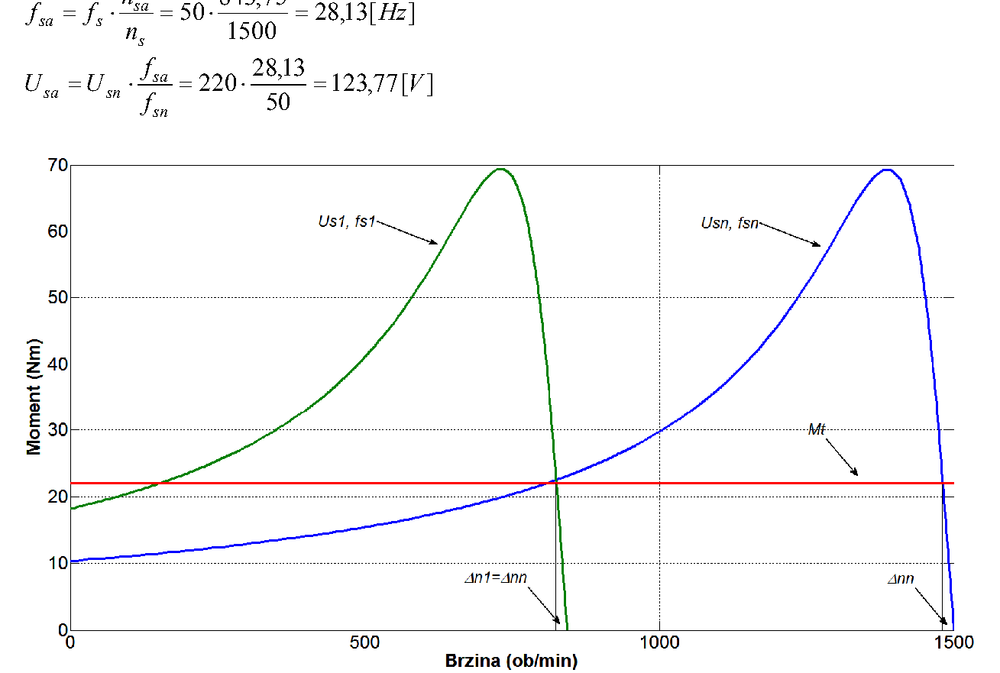
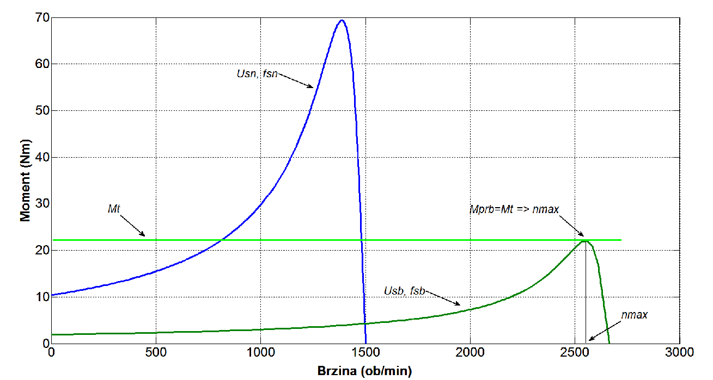

# Zadatak 51 — Asinhroni motor sa U/f upravljanjem: kojom učestanošću i naponom postići zadatu brzinu, i koja je najveća moguća brzina

## Postavka

Trofazni asinhroni motor sa kratkospojenim (kaveznim) rotorom pokreće radnu mašinu čiji je
otporni moment jednak $M_t = 22\ \mathrm{Nm}$ i ima **potencijalnu prirodu** (tj. konstantan je,
ne zavisi od brzine obrtanja).

**a)** Odrediti napon i frekvenciju napajanja motora pri kojima će brzina obrtanja motora biti
$n = 750\ \mathrm{min^{-1}}$, uz uslov da se promena frekvencije vrši po zakonu
$U/f = \mathrm{const.} \;(= U_n/f_n)$.

**b)** Kolika se maksimalna brzina obrtanja motora može postići podešavanjem frekvencije, uz
uslov da na motor nije dozvoljeno dovesti napon veći od nazivnog?

**Podaci o motoru:** $220\ \mathrm{V}$, $50\ \mathrm{Hz}$, $1390\ \mathrm{min^{-1}}$, sprega $\Delta$,
induktivnost rasipanja statora $12{,}2\ \mathrm{mH}$, svedena induktivnost rasipanja rotora
$9\ \mathrm{mH}$, svedena otpornost rotora $2{,}56\ \mathrm{\Omega}$.
**Napomena:** zanemariti otpornost statorskog namotaja.

> **Prevod na običan jezik:** Imamo asinhroni motor koji vuče teret (npr. dizalicu) kojem je
> uvek potreban isti moment od $22\ \mathrm{Nm}$, ma kojom brzinom se okretao. Motor napajamo iz
> pretvarača učestanosti (frekventnog regulatora) koji može da menja i napon i učestanost.
> Pod (a) nas pitaju: ako želimo da se motor vrti tačno $750\ \mathrm{min^{-1}}$, koju učestanost
> i koji napon pretvarač treba da podesi, ako se drži pravila "napon i učestanost menjaj u istoj
> srazmeri" ($U/f$ konstantno)? Pod (b): ako smemo da dižemo učestanost i iznad $50\ \mathrm{Hz}$,
> ali napon ne sme preko $220\ \mathrm{V}$, dokle motor uopšte može da "izgura" ovaj teret —
> koja je najveća brzina koju možemo dostići?

## Podaci

| Veličina | Oznaka | Vrednost | Šta ta veličina fizički znači |
|---|---|---|---|
| Nazivni napon | $U_n$ | $220\ \mathrm{V}$ | Linijski napon mreže za koji je motor projektovan; zbog sprege $\Delta$ ovo je ujedno i napon na jednom faznom namotaju. |
| Nazivna učestanost | $f_n = f_s$ | $50\ \mathrm{Hz}$ | Učestanost napona napajanja za koju važe nazivni podaci. |
| Nazivna brzina | $n_n$ | $1390\ \mathrm{min^{-1}}$ | Brzina obrtanja rotora pri nazivnom opterećenju; iz nje otkrivamo broj pari polova. |
| Sprega statora | $\Delta$ | — | Namotaji statora vezani u trougao: svaki fazni namotaj je priključen direktno na linijski napon. |
| Induktivnost rasipanja statora | $L_{\gamma s}$ | $12{,}2\ \mathrm{mH}$ | Mera onog dela fluksa statora koji se "rasipa" (ne obuhvata rotor) — pravi induktivni pad napona, ne prenosi snagu na rotor. |
| Svedena induktivnost rasipanja rotora | $L'_{\gamma r}$ | $9\ \mathrm{mH}$ | Isto to za rotor, preračunato ("svedeno") na statorsku stranu da bismo mogli da radimo u jednoj ekvivalentnoj šemi. |
| Svedena otpornost rotora | $R'_r$ | $2{,}56\ \mathrm{\Omega}$ | Omska otpornost rotorskog namotaja (kaveza), takođe svedena na stator; u njoj se troši snaga klizanja i ona određuje nagib momentne karakteristike. |
| Otpornost statora | $R_s$ | $\approx 0$ | Po napomeni zadatka se zanemaruje — to znatno pojednostavljuje sve formule. |
| Otporni moment radne mašine | $M_t$ | $22\ \mathrm{Nm}$ | Moment koji teret stalno "traži" od motora; potencijalne je prirode, tj. isti je pri svakoj brzini. |

## Šta se traži i zašto

**a) Učestanost $f_{sa}$ i napon $U_{sa}$ za brzinu $750\ \mathrm{min^{-1}}$.**
Ovo je osnovni zadatak svakog frekventno regulisanog pogona: korisnik zada željenu brzinu, a
pretvarač mora da "prevede" tu brzinu u konkretan par (učestanost, napon). Inženjera to zanima
jer upravo te dve vrednosti pretvarač fizički generiše. Plan:

1. Iz nazivne brzine otkrijemo broj pari polova i sinhronu brzinu $n_s$ pri $50\ \mathrm{Hz}$.
2. Izračunamo prevalni (maksimalni) moment $M_{\mathrm{pr}}$ — najveći moment koji motor uopšte
   može da razvije — i prevalno klizanje $s_{\mathrm{pr}}$ pri kojem se taj maksimum dostiže
   (šta su tačno te veličine — mini-lekcija 3), sve pri nazivnom napajanju.
3. Klosovim obrascem (univerzalna veza momenta i klizanja, važi za svaki asinhroni motor —
   mini-lekcija 4) nađemo klizanje $s_t$ pri kojem motor razvija baš $22\ \mathrm{Nm}$, a iz
   njega **apsolutni pad brzine** $n_k$ (za koliko $\mathrm{min^{-1}}$ rotor zaostaje za obrtnim poljem).
4. Ključni uvid: pri $U/f=\mathrm{const.}$ taj pad brzine $n_k$ je **isti na svim učestanostima**
   ispod nazivne. Zato je tražena sinhrona brzina prosto $n_{sa} = 750 + n_k$.
5. Iz $n_{sa}$ proporcijom dobijemo $f_{sa}$, a iz $U/f=\mathrm{const.}$ dobijemo $U_{sa}$.

**b) Maksimalna dostižna brzina $n_b$.**
Iznad nazivne učestanosti napon više ne sme da raste, pa motor "slabi" — njegov maksimalni
moment opada. U jednom trenutku maksimalni moment padne na nivo momenta tereta i dalje ubrzanje
je nemoguće. Inženjera ovo zanima jer definiše gornju granicu radnog opsega pogona za dati teret. Plan:

1. Izvedemo kako prevalni moment opada sa učestanošću kada je $U=U_n=\mathrm{const.}$
   (pokazaće se: kvadratno, $M_{\mathrm{pr}} \propto 1/f^2$).
2. Granična učestanost $f_{sb}$ je ona pri kojoj prevalni moment padne tačno na $M_t$.
3. Iz $f_{sb}$ dobijemo sinhronu brzinu $n_{sb}$, zatim prevalno klizanje $s_{\mathrm{prb}}$ na toj
   učestanosti i odgovarajući pad brzine $n_{\mathrm{kprb}}$.
4. Maksimalna brzina je $n_b = n_{sb} - n_{\mathrm{kprb}}$ — jer motor tada radi baš u temenu
   (prevoju) svoje momentne karakteristike.

## Potrebna teorija — mini-lekcije

### 1. Sinhrona brzina, klizanje i kako iz nazivne brzine "pročitati" broj polova

Trofazni namotaj statora, napajan trofaznim naponom učestanosti $f_s$, stvara **obrtno magnetno
polje** koje se okreće sinhronom brzinom:

$$n_s = \frac{60 \cdot f_s}{p}\ \ [\mathrm{min^{-1}}],$$

gde je $p$ broj **pari** polova namotaja. Formula potiče otuda što polje za jednu periodu napona
pređe jedan par polova, tj. $1/p$ punog kruga — pa za $f_s$ perioda u sekundi napravi $f_s/p$
obrtaja u sekundi, odnosno $60 f_s/p$ u minuti. Rotor asinhronog motora se uvek obrće **nešto
sporije** od polja (inače ne bi bilo relativnog kretanja, pa ni indukovanih struja u rotoru, pa ni
momenta). Relativno zaostajanje merimo **klizanjem**:

$$s = \frac{n_s - n}{n_s},$$

gde je $n$ stvarna brzina rotora. Klizanju odgovara **apsolutni pad brzine** (u ovoj zbirci
označen $n_k$):

$$n_k = n_s - n = s \cdot n_s .$$

Kako otkriti $p$ kad nije zadato? Nazivna brzina motora je uvek malo ispod neke od standardnih
sinhronih brzina ($3000, 1500, 1000, 750, \ldots \mathrm{min^{-1}}$ pri $50\ \mathrm{Hz}$). Ovde je
$n_n = 1390\ \mathrm{min^{-1}}$, što je tik ispod $1500\ \mathrm{min^{-1}}$ — dakle $n_s = 1500\ \mathrm{min^{-1}}$
i $p = 60 \cdot 50 / 1500 = 2$ (četvoropolna mašina).

### 2. Sprega Δ: koji napon "vidi" jedan namotaj

Kod sprege **trougao** ($\Delta$) svaki fazni namotaj je vezan direktno između dva linijska
provodnika, pa je napon na jednom namotaju jednak linijskom naponu:

$$U_{sf} = U_{\mathrm{lin}} = 220\ \mathrm{V}.$$

(Da je sprega zvezda, bilo bi $U_{sf} = U_{\mathrm{lin}}/\sqrt{3}$ — česta tačka zabune!) U svim
formulama za moment figuriše upravo **fazni** napon $U_{sf}$, jer se formule izvode po jednoj fazi
ekvivalentne šeme, a rezultat množi sa 3 (tri faze).

### 3. Momentna karakteristika, prevalni moment i prevalno klizanje (uz $R_s \approx 0$)

Iz ekvivalentne šeme asinhronog motora po fazi (napon $U_{sf}$, rasipne reaktanse statora
$X_{\gamma s}$ i rotora $X'_{\gamma r}$, svedeni rotorski otpor $R'_r/s$ koji zavisi od klizanja)
izvodi se mehanički moment u funkciji klizanja. Uz zanemaren otpor statora ($R_s \approx 0$)
izvođenje ide u tri poteza:

1. **Rotorska struja** je napon podeljen modulom ukupne impedanse jedne faze (redna veza
   otpornika $R'_r/s$ i ukupne rasipne reaktanse):
   $$I'_r = \frac{U_{sf}}{\sqrt{\left(\dfrac{R'_r}{s}\right)^{\!2} + \left(X_{\gamma s} + X'_{\gamma r}\right)^{2}}}.$$
2. **Obrtna snaga** — sva snaga koja kroz vazdušni zazor pređe sa statora na rotor — jeste snaga
   koja se razvija na fiktivnom otporniku $R'_r/s$, i to u sve tri faze:
   $P_{\mathrm{ob}} = 3\,I'^2_r \cdot \dfrac{R'_r}{s}$.
3. **Moment** je količnik obrtne snage i sinhrone ugaone brzine: $M = P_{\mathrm{ob}}/\Omega_s$.

Kad ta tri poteza sklopimo (kvadrat struje iz 1. uvrstimo u 2, pa rezultat u 3.), dobijamo opšti
izraz momentne karakteristike:

$$M(s) = \frac{3}{\Omega_s} \cdot \frac{U_{sf}^2 \cdot \dfrac{R'_r}{s}}{\left(\dfrac{R'_r}{s}\right)^{\!2} + \left(X_{\gamma s} + X'_{\gamma r}\right)^{2}},$$

gde je $\Omega_s$ sinhrona **ugaona** brzina u mehaničkim radijanima po sekundi:

$$\Omega_s = \frac{2\pi \cdot n_s}{60} = \frac{\pi}{30} \cdot n_s ,$$

a reaktanse se iz induktivnosti dobijaju kao $X = \omega_s L = 2\pi f_s L$.

Karakteristika $M(s)$ ima maksimum — **prevalni moment** $M_{\mathrm{pr}}$ — koji se dostiže pri
**prevalnom klizanju** $s_{\mathrm{pr}}$. Gde je taj maksimum? Označimo, radi kraćeg pisanja,
$x = R'_r/s$ i $X = X_{\gamma s}+X'_{\gamma r}$. Razlomak u $M(s)$ je tada $x/(x^2+X^2)$; podelimo
li mu brojilac i imenilac sa $x$, postaje $1\big/(x + X^2/x)$ — najveći je kad je imenilac
$x + X^2/x$ najmanji. A zbir dva pozitivna broja čiji je proizvod stalan
($x \cdot X^2/x = X^2$) najmanji je kad su ta dva broja jednaka: $x = X$. (Isti rezultat daje i
izvod izjednačen sa nulom.) Maksimum je, dakle, tamo gde je $R'_r/s$ jednako ukupnoj rasipnoj
reaktansi; uvrštavanjem $x = X$ razlomak postaje $X/(2X^2) = 1/(2X)$, pa su koordinate temena:

$$M_{\mathrm{pr}} = \frac{3 \cdot U_{sf}^2}{2\,\Omega_s\,(X_{\gamma s} + X'_{\gamma r})},
\qquad s_{\mathrm{pr}} = \frac{R'_r}{X_{\gamma s} + X'_{\gamma r}}.$$

Primetimo: maksimalna vrednost momenta, zanimljivo, **uopšte ne zavisi od $R'_r$**, već samo od
napona, brzine polja i rasipnih reaktansi.

**Intuicija:** prevalni moment je "plafon" motora — najveći moment koji motor može da razvije pri
datom naponu i učestanosti. Ako teret zatraži više, motor "prevali" preko temena karakteristike i
zaustavi se (otud i ime).

### 4. Klosov obrazac i njegovo "obrtanje" (kako iz momenta dobiti klizanje)

Podelimo izraz za $M(s)$ iz mini-lekcije 3 izrazom za $M_{\mathrm{pr}}$, uz istu smenu
$x = R'_r/s$, $X = X_{\gamma s}+X'_{\gamma r}$:

$$\frac{M}{M_{\mathrm{pr}}} = \frac{\dfrac{3}{\Omega_s}\, U_{sf}^2 \cdot \dfrac{x}{x^2+X^2}}{\dfrac{3\, U_{sf}^2}{2\,\Omega_s\, X}}
= \frac{2X\,x}{x^2+X^2} = \frac{2}{\dfrac{x}{X} + \dfrac{X}{x}} = \frac{2}{\dfrac{s_{\mathrm{pr}}}{s} + \dfrac{s}{s_{\mathrm{pr}}}}.$$

Pogledajmo šta se desilo, prelaz po prelaz: činioci $3$, $U_{sf}^2$ i $\Omega_s$ skratili su se
odmah (prvi prelaz); u trećem prelazu brojilac i imenilac podeljeni su proizvodom $x\,X$; a u
poslednjem je iskorišćeno da je $X = R'_r/s_{\mathrm{pr}}$ (definicija prevalnog klizanja iz
mini-lekcije 3), pa je $x/X = \dfrac{R'_r/s}{R'_r/s_{\mathrm{pr}}} = \dfrac{s_{\mathrm{pr}}}{s}$ —
skratio se, dakle, i $R'_r$. Svi zajednički činioci su nestali i ostala je elegantna,
normalizovana veza poznata kao **Klosov obrazac**:

$$\frac{M}{M_{\mathrm{pr}}} = \frac{2}{\dfrac{s}{s_{\mathrm{pr}}} + \dfrac{s_{\mathrm{pr}}}{s}}.$$

On kaže: oblik momentne karakteristike je univerzalan — dovoljno je znati gde joj je teme
$(s_{\mathrm{pr}}, M_{\mathrm{pr}})$, i cela kriva je određena. U zadatku je poznat moment
(motor u ustaljenom stanju razvija tačno $M_t$), a traži se klizanje — dakle obrazac moramo
"obrnuti". To vodi na kvadratnu jednačinu po $s$, koja ima dva rešenja: jedno na **stabilnom**
delu karakteristike ($s < s_{\mathrm{pr}}$, radni deo — tu motor normalno radi) i jedno na
**nestabilnom** ($s > s_{\mathrm{pr}}$). Fizički je smisleno samo stabilno rešenje: na stabilnom
delu, ako se motor malo uspori, njegov moment poraste i vrati ga nazad — ravnoteža se sama
održava; na nestabilnom delu je obrnuto i motor bi se "survao" u zaustavljanje. Celo izvođenje
sprovodimo u Koraku 5.

### 5. Potencijalni otporni moment

Otporni moment "potencijalne prirode" je moment koji potiče od sile teže (potencijalne energije):
tipičan primer je dizalica koja podiže teret. Takav moment je **konstantan** — ne zavisi od brzine
(teret je jednako težak i kad se diže sporo i kad se diže brzo), pa čak deluje i u mestu. Za nas je
ključno: **na svakoj učestanosti napajanja motor u ustaljenom stanju mora da razvije istih**
$22\ \mathrm{Nm}$. (Suprotan primer bio bi ventilator, čiji moment raste sa kvadratom brzine.)

### 6. U/f = const. upravljanje (skalarno upravljanje) — zašto baš taj zakon i šta iz njega sledi

Magnetni fluks u gvožđu motora približno je srazmeran količniku napona i učestanosti. Naime,
indukovana elektromotorna sila po fazi je $E \approx 4{,}44 \cdot f_s \cdot N \cdot \Phi$ (posledica
Faradejevog zakona za prostoperiodične veličine; $N$ je broj navojaka), a pošto je pri $R_s \approx 0$
napon praktično jednak toj EMS, sledi:

$$\Phi \approx \frac{U_{sf}}{4{,}44 \cdot f_s \cdot N} \;\propto\; \frac{U_{sf}}{f_s}.$$

Ako bismo smanjili samo učestanost, a napon ostavili, fluks bi porastao iznad projektovanog —
gvožđe ulazi u zasićenje, struja magnećenja divlja, motor se pregreva. Ako bismo smanjili samo
napon, fluks bi opao i motor bi izgubio moment. Zato pretvarač drži $U/f = U_n/f_n = \mathrm{const.}$
— time je **fluks stalno na nazivnoj vrednosti**, motor je "jednako namagnećen" na svakoj brzini.

Dve ključne posledice tog zakona (uz $R_s \approx 0$), koje original koristi bez detaljnog
izvođenja, a mi ćemo ih ovde izvesti jer nose ceo zadatak:

**(i) Prevalni moment je isti na svim učestanostima ispod nazivne.** Uvrstimo u formulu za
$M_{\mathrm{pr}}$ da je $\Omega_s = 2\pi f_s/p$ i $X_{\gamma s}+X'_{\gamma r} = 2\pi f_s (L_{\gamma s}+L'_{\gamma r})$:

$$M_{\mathrm{pr}} = \frac{3\,U_{sf}^2}{2 \cdot \dfrac{2\pi f_s}{p} \cdot 2\pi f_s (L_{\gamma s}+L'_{\gamma r})}
= \frac{3\,p}{8\pi^2 (L_{\gamma s}+L'_{\gamma r})} \cdot \left(\frac{U_{sf}}{f_s}\right)^{\!2}.$$

Dakle $M_{\mathrm{pr}}$ zavisi od napajanja **samo** kroz količnik $U_{sf}/f_s$ — a on je po zakonu
upravljanja konstantan. Momentna karakteristika se, dakle, pri smanjenju učestanosti samo
**translira ulevo** po brzinskoj osi, ne menjajući ni visinu temena ni nagib radnog dela.

**(ii) Apsolutni pad brzine $n_k$ za dati teret je isti na svim učestanostima ispod nazivne.**
Prevalno klizanje je $s_{\mathrm{pr}} = R'_r / \big(2\pi f_s (L_{\gamma s}+L'_{\gamma r})\big)$, pa pad
brzine u prevalnoj tački iznosi:

$$n_{\mathrm{kpr}} = s_{\mathrm{pr}} \cdot n_s
= \frac{R'_r}{2\pi f_s (L_{\gamma s}+L'_{\gamma r})} \cdot \frac{60 f_s}{p}
= \frac{60\,R'_r}{2\pi\,p\,(L_{\gamma s}+L'_{\gamma r})},$$

— učestanost $f_s$ se **skratila**! Dalje, iz obrnutog Klosovog obrasca (Korak 5) klizanje pri
momentu $M_t$ je $s_t = s_{\mathrm{pr}}\,(\gamma - \sqrt{\gamma^2-1})$, gde je
$\gamma = M_{\mathrm{pr}}/M_t$. Pošto su i $M_{\mathrm{pr}}$ (tačka (i)) i $M_t$ (konstantan teret)
nezavisni od učestanosti, $\gamma$ je konstantno, pa je:

$$n_k = s_t \cdot n_s = \left(\gamma - \sqrt{\gamma^2-1}\right) \cdot \underbrace{s_{\mathrm{pr}} \cdot n_s}_{= n_{\mathrm{kpr}} = \mathrm{const.}} = \mathrm{const.}$$

Ovo je "čarobni ključ" zadatka pod (a): dovoljno je da pad brzine izračunamo **jednom**, pri
nazivnom napajanju, i on važi za svaku učestanost ispod nazivne.

### 7. Rad iznad nazivne učestanosti — slabljenje polja

Iznad $f_n$ napon ne sme dalje da raste (izolacija namotaja i pretvarač su ograničeni na $U_n$), pa
se drži $U = U_n = \mathrm{const.}$, dok $f_s$ raste. Količnik $U/f$ tada **opada**, fluks slabi —
otuda naziv **režim slabljenja polja**. Iz iste formule iz mini-lekcije 6(i) sledi, sa
$U_{sf} = U_n$ fiksnim:

$$M_{\mathrm{pr}}(f_s) = \frac{3\,p\,U_n^2}{8\pi^2 (L_{\gamma s}+L'_{\gamma r})} \cdot \frac{1}{f_s^2}
= M_{\mathrm{pr,n}} \cdot \left(\frac{f_n}{f_s}\right)^{\!2},$$

gde je $M_{\mathrm{pr,n}}$ prevalni moment pri nazivnom napajanju. Dakle, **prevalni moment opada
sa kvadratom učestanosti**. Brzina raste, ali "plafon" momenta pada — i granica je dostignuta kada
plafon padne na nivo tereta: $M_{\mathrm{pr}}(f_{sb}) = M_t$. Preko te učestanosti motor prosto više
ne može da nosi teret. To je ideja rešenja pod (b).

## Rešenje, korak po korak

### Korak 1: Određivanje sinhrone brzine i broja pari polova

**Zašto ovaj korak:** sve formule za moment sadrže sinhronu brzinu $n_s$, a ona nije direktno
zadata — mora se rekonstruisati iz nazivne brzine.

Nazivna brzina $n_n = 1390\ \mathrm{min^{-1}}$ je tik ispod standardne sinhrone brzine
$1500\ \mathrm{min^{-1}}$ (mašina uvek radi sa malim klizanjem, tipično nekoliko procenata), pa je:

$$n_s = 1500\ \mathrm{min^{-1}}, \qquad p = \frac{60 \cdot f_s}{n_s} = \frac{60 \cdot 50}{1500} = 2.$$

**Šta smo dobili:** četvoropolnu mašinu ($p=2$ para polova) čije obrtno polje pri $50\ \mathrm{Hz}$
pravi $1500$ obrtaja u minuti; nazivno klizanje je $(1500-1390)/1500 \approx 7{,}3\,\%$ — razumna
vrednost za manji motor.

### Korak 2: Ukupna rasipna reaktansa pri nazivnoj učestanosti

**Zašto ovaj korak:** i prevalni moment i prevalno klizanje zavise od zbira rasipnih reaktansi
statora i rotora, pa taj zbir računamo prvi.

Reaktansa je proizvod ugaone učestanosti $\omega_s = 2\pi f_s$ i induktivnosti:

$$X_{\gamma s} + X'_{\gamma r} = \omega_s \left(L_{\gamma s} + L'_{\gamma r}\right) = 2\pi f_s \left(L_{\gamma s} + L'_{\gamma r}\right).$$

Uvrštavamo brojeve, pazeći da milihenrije pretvorimo u henrije ($12{,}2\ \mathrm{mH} = 12{,}2 \cdot 10^{-3}\ \mathrm{H}$):

$$X_{\gamma s} + X'_{\gamma r} = 2\pi \cdot 50 \cdot (12{,}2 + 9) \cdot 10^{-3}
= 314{,}16 \cdot 21{,}2 \cdot 10^{-3} = 6{,}66\ \mathrm{\Omega}.$$

**Šta smo dobili:** ukupnu "prepreku" od $6{,}66\ \mathrm{\Omega}$ koju rasipni fluksevi
predstavljaju struji — ona će ograničavati maksimalni moment motora.

### Korak 3: Prevalni moment pri nazivnom napajanju

**Zašto ovaj korak:** prevalni moment nam treba dvostruko — u Klosovom obrascu (za deo a) i kao
"plafon" koji opada iznad nazivne učestanosti (za deo b).

Opšti oblik (mini-lekcija 3), sa sinhronom ugaonom brzinom napisanom kao $\frac{\pi}{30} n_s$:

$$M_{\mathrm{pr}} = 3 \cdot \frac{U_{sf}^2}{\dfrac{\pi}{30} \cdot n_s} \cdot \frac{1}{2\left(X_{\gamma s} + X'_{\gamma r}\right)}.$$

Pošto je sprega $\Delta$, fazni napon je jednak linijskom: $U_{sf} = 220\ \mathrm{V}$
(mini-lekcija 2). Prvo izračunajmo sinhronu ugaonu brzinu:

$$\Omega_s = \frac{\pi}{30} \cdot n_s = \frac{\pi}{30} \cdot 1500 = 157{,}08\ \mathrm{\frac{rad}{s}},$$

pa zatim, korak po korak:

$$M_{\mathrm{pr}} = 3 \cdot \frac{220^2}{157{,}08} \cdot \frac{1}{2 \cdot 6{,}66}
= \frac{3 \cdot 48400}{157{,}08 \cdot 13{,}32} = \frac{145200}{2092{,}3} = 69{,}4\ \mathrm{Nm}.$$

**Šta smo dobili:** motor može da razvije najviše oko $69\ \mathrm{Nm}$ — otprilike tri puta više
od momenta tereta ($22\ \mathrm{Nm}$). Ta "rezerva" od oko tri puta je tipična za asinhrone motore
i upravo će ona (kroz koeficijent $\gamma$) odrediti dokle možemo dizati učestanost pod (b).

### Korak 4: Prevalno klizanje pri nazivnom napajanju

**Zašto ovaj korak:** prevalno klizanje je druga koordinata temena karakteristike; bez njega
Klosov obrazac ne možemo primeniti.

$$s_{\mathrm{pr}} = \frac{R'_r}{X_{\gamma s} + X'_{\gamma r}} = \frac{2{,}56}{6{,}66} = 0{,}384.$$

**Šta smo dobili:** teme karakteristike je na klizanju od $38{,}4\,\%$, tj. pri brzini
$n_s(1-s_{\mathrm{pr}}) = 1500 \cdot 0{,}616 \approx 924\ \mathrm{min^{-1}}$. To je neuobičajeno
veliko prevalno klizanje (posledica relativno velikog rotorskog otpora ovog motora) — ali
matematici ne smeta, a videćemo da se svi brojevi lepo uklope.

### Korak 5: Klosov obrazac → klizanje u ustaljenom stanju pri momentu $M_t$

**Zašto ovaj korak:** u ustaljenom (stacionarnom) stanju motor razvija tačno onoliki moment
koliko teret traži, $M = M_t = 22\ \mathrm{Nm}$. Klosov obrazac vezuje moment i klizanje — ali u
"pogrešnom smeru" (daje $M$ iz $s$), pa ga moramo algebarski obrnuti da iz poznatog momenta
dobijemo klizanje $s_t$.

Polazimo od Klosovog obrasca (mini-lekcija 4), napisanog za radnu tačku $(s_t, M_t)$:

$$\frac{M_t}{M_{\mathrm{pr}}} = \frac{2}{\dfrac{s_t}{s_{\mathrm{pr}}} + \dfrac{s_{\mathrm{pr}}}{s_t}}.$$

**Prelaz 1 — oslobađanje razlomka:** pomnožimo obe strane sa
$\left(\frac{s_t}{s_{\mathrm{pr}}} + \frac{s_{\mathrm{pr}}}{s_t}\right)$ i podelimo sa $M_t/M_{\mathrm{pr}}$:

$$\frac{s_t}{s_{\mathrm{pr}}} + \frac{s_{\mathrm{pr}}}{s_t} - \frac{2 M_{\mathrm{pr}}}{M_t} = 0.$$

**Prelaz 2 — svođenje na kvadratnu jednačinu:** pomnožimo celu jednačinu sa
$s_t \cdot s_{\mathrm{pr}}$ (dozvoljeno, jer je $s_t \neq 0$):

$$s_t^2 + s_{\mathrm{pr}}^2 - \frac{2 M_{\mathrm{pr}}}{M_t} \cdot s_{\mathrm{pr}} \cdot s_t = 0
\quad\Longrightarrow\quad
s_t^2 - \frac{2 M_{\mathrm{pr}}}{M_t} \cdot s_{\mathrm{pr}} \cdot s_t + s_{\mathrm{pr}}^2 = 0.$$

**Prelaz 3 — rešavanje kvadratne jednačine.** Uvedimo, radi kraćeg pisanja, odnos prevalnog
momenta i momenta opterećenja:

$$\gamma = \frac{M_{\mathrm{pr}}}{M_t},$$

pa jednačina glasi $s_t^2 - 2\gamma s_{\mathrm{pr}} s_t + s_{\mathrm{pr}}^2 = 0$. Standardna formula
za kvadratnu jednačinu daje:

$$s_t = \frac{2\gamma s_{\mathrm{pr}} \pm \sqrt{4\gamma^2 s_{\mathrm{pr}}^2 - 4 s_{\mathrm{pr}}^2}}{2}
= \gamma s_{\mathrm{pr}} \pm s_{\mathrm{pr}}\sqrt{\gamma^2 - 1}
= s_{\mathrm{pr}} \left(\gamma \pm \sqrt{\gamma^2 - 1}\right).$$

Od dva rešenja fizički je ispravno ono sa znakom "$-$": ono daje $s_t < s_{\mathrm{pr}}$, tj. tačku
na **stabilnom** (radnom) delu karakteristike, gde motor zaista može trajno da radi
(mini-lekcija 4). Rešenje sa "$+$" odgovara nestabilnoj tački u kojoj se ravnoteža ne održava.

Sada brojevi. Prvo $\gamma$:

$$\gamma = \frac{M_{\mathrm{pr}}}{M_t} = \frac{69{,}4}{22} \approx 3{,}154.$$

Zatim klizanje, računajući potkorenu veličinu posebno
($\gamma^2 - 1 = 3{,}154^2 - 1 = 9{,}948 - 1 = 8{,}948$, $\sqrt{8{,}948} = 2{,}991$):

$$s_t = s_{\mathrm{pr}}\left(\gamma - \sqrt{\gamma^2 - 1}\right)
= 0{,}384 \cdot \left(3{,}154 - 2{,}991\right) = 0{,}384 \cdot 0{,}163 = 0{,}0625.$$

**Šta smo dobili:** pri teretu od $22\ \mathrm{Nm}$ motor u ustaljenom stanju klizi svega
$6{,}25\,\%$ — daleko ispod prevalnog klizanja od $38{,}4\,\%$, dakle duboko na stabilnom delu
karakteristike, što i očekujemo za teret znatno manji od prevalnog momenta.

### Korak 6: Apsolutni pad brzine $n_k$

**Zašto ovaj korak:** kao što smo izveli u mini-lekciji 6(ii), upravo ovaj broj — za koliko
$\mathrm{min^{-1}}$ rotor zaostaje za poljem — ostaje **isti** na svim učestanostima ispod nazivne,
pa je on most između nazivnog režima i tražene radne tačke na $750\ \mathrm{min^{-1}}$.

$$n_k = n_s - n = s_t \cdot n_s = 0{,}0625 \cdot 1500 = 93{,}75\ \mathrm{min^{-1}}.$$

**Šta smo dobili:** ma koju učestanost ispod $50\ \mathrm{Hz}$ pretvarač zadao (uz
$U/f=\mathrm{const.}$), rotor će se pod teretom od $22\ \mathrm{Nm}$ obrtati tačno
$93{,}75\ \mathrm{min^{-1}}$ sporije od obrtnog polja.

### Korak 7 (kraj dela a): Sinhrona brzina, učestanost i napon za brzinu 750 min⁻¹

**Zašto ovaj korak:** znamo koliko rotor zaostaje za poljem, pa polje moramo "namestiti" da se
vrti baš toliko brže od željene brzine rotora; iz brzine polja slede učestanost (proporcijom) i
napon (iz zakona $U/f=\mathrm{const.}$).

**Sinhrona brzina** mora biti veća od željene brzine rotora za pad $n_k$:

$$n_{sa} = n + n_k = 750 + 93{,}75 = 843{,}75\ \mathrm{min^{-1}}.$$

**Učestanost:** sinhrona brzina je srazmerna učestanosti ($n_s = 60 f_s / p$, a $p$ se ne menja), pa
iz proporcije $n_{sa}/n_s = f_{sa}/f_s$ sledi:

$$f_{sa} = f_s \cdot \frac{n_{sa}}{n_s} = 50 \cdot \frac{843{,}75}{1500} = 50 \cdot 0{,}5625 = 28{,}13\ \mathrm{Hz}.$$

**Napon:** iz zakona upravljanja $U_{sa}/f_{sa} = U_{sn}/f_{sn}$, tj.:

$$U_{sa} = U_{sn} \cdot \frac{f_{sa}}{f_{sn}} = 220 \cdot \frac{28{,}13}{50} = 220 \cdot 0{,}5626 = 123{,}77\ \mathrm{V}.$$

(Napomena o zaokruživanju: polazeći od $n_{sa} = 843{,}75\ \mathrm{min^{-1}}$ bez daljih
zaokruživanja dobilo bi se $f_{sa} = 28{,}125\ \mathrm{Hz}$ i $U_{sa} = 123{,}75\ \mathrm{V}$;
zbirka učestanost zaokružuje na $28{,}13\ \mathrm{Hz}$, pa naponom "povuče" $123{,}77\ \mathrm{V}$.
Potpuno nezaokružen račun, bez zaokruživanja i u $s_t$, dao bi $f_{sa} = 28{,}127\ \mathrm{Hz}$ i
$U_{sa} = 123{,}76\ \mathrm{V}$ — sve razlike su zanemarljive i potiču isključivo od zaokruživanja
međurezultata.)

**Šta smo dobili:** pretvarač treba da zada približno $28\ \mathrm{Hz}$ i $124\ \mathrm{V}$ — oba
na oko $56\,\%$ nazivnih vrednosti, što je logično jer i tražena sinhrona brzina
($843{,}75\ \mathrm{min^{-1}}$) iznosi $56{,}25\,\%$ nazivne ($1500\ \mathrm{min^{-1}}$).

Sledeća slika prikazuje momentne karakteristike $M(n)$ motora za obe učestanosti: desna (plava)
kriva je za nazivno napajanje ($U_{sn}, f_{sn}$), a leva (zelena) za upravo izračunato napajanje
($U_{s1}, f_{s1}$) = ($123{,}77\ \mathrm{V}$, $28{,}13\ \mathrm{Hz}$). Horizontalna crvena linija je
konstantni moment tereta $M_t = 22\ \mathrm{Nm}$. Čitaj je ovako: radna tačka je presek krive
motora sa linijom tereta na **opadajućem (stabilnom) delu** krive; obe krive imaju **isto teme**
($69{,}4\ \mathrm{Nm}$) i **isti nagib** radnog dela — niža učestanost samo pomera krivu ulevo.
Zato je horizontalno rastojanje radne tačke od "nule" krive (sinhrone brzine) na obe krive isto:
$\Delta n_1 = \Delta n_n = n_k = 93{,}75\ \mathrm{min^{-1}}$ — upravo tvrdnja iz mini-lekcije 6(ii).
Presek zelene krive sa linijom tereta jeste tražena radna tačka na $750\ \mathrm{min^{-1}}$.

> **Napomena uz sliku:** slika je preuzeta iz zbirke i **kvalitativna** je (principska, nije u
> razmeri) — krive su na njoj nacrtane sa znatno manjim prevalnim klizanjem od izračunatog. Po
> našem računu teme plave krive je na $\approx 924\ \mathrm{min^{-1}}$ (Korak 4:
> $s_{\mathrm{pr}} = 0{,}384$), teme zelene čak na $\approx 267\ \mathrm{min^{-1}}$, a padovi
> brzine iznose $93{,}75\ \mathrm{min^{-1}}$ — dok su na slici temena nacrtana mnogo bliže
> sinhronim brzinama (plavo na $\approx 1390$, zeleno na $\approx 730\ \mathrm{min^{-1}}$), a
> rastojanja $\Delta n$ deluju kao svega desetak $\mathrm{min^{-1}}$. Slika verno ilustruje
> **princip** — jednaka temena, jednak nagib radnog dela, čista translacija krive ulevo — ali sa
> nje ne treba očitavati brojne vrednosti; brojevi važe iz računa.

**Slika 51.1 —** Momentne karakteristike motora za frekvencije napajanja $f_{sn}$ i $f_{s1}$ uz
uslov $U/f = \mathrm{const.}$ Obe krive imaju jednak prevalni moment i jednak nagib radnog dela,
pa je pad brzine pod istim teretom jednak: $\Delta n_1 = \Delta n_n$.

### Korak 8 (početak dela b): Do koje učestanosti motor još može da nosi teret?

**Zašto ovaj korak:** iznad nazivne učestanosti napon je "zaključan" na $U_n$, pa prevalni moment
opada kvadratno sa učestanošću (mini-lekcija 7). Motor može da ubrzava sve dok mu je prevalni
moment veći od momenta tereta; granica je učestanost $f_{sb}$ pri kojoj se oni izjednače:
$M_{\mathrm{pr}}(f_{sb}) = M_t$.

Zakon opadanja iz mini-lekcije 7, primenjen na traženu učestanost (u njega umesto promenljive
učestanosti uvrstimo $f_{sb}$), glasi $M_{\mathrm{pr}}(f_{sb}) = M_{\mathrm{pr,n}} \cdot (f_n/f_{sb})^2$.
Vežimo odmah oznake, da ne bude zabune: $M_{\mathrm{pr,n}} = M_{\mathrm{pr}} = 69{,}4\ \mathrm{Nm}$
i $f_n = f_s = 50\ \mathrm{Hz}$ su **nazivne vrednosti** iz Koraka 3 i tabele Podataka — ovde
igraju ulogu konstanti, a jedina nepoznata je $f_{sb}$. Uslov granice glasi:

$$M_{\mathrm{pr,n}} \cdot \left(\frac{f_n}{f_{sb}}\right)^{\!2} = M_t
\quad\Longrightarrow\quad
\left(\frac{f_{sb}}{f_n}\right)^{\!2} = \frac{M_{\mathrm{pr,n}}}{M_t} = \gamma = 3{,}154.$$

Korenovanjem obe strane (obe su pozitivne, pa je korenovanje jednoznačno):

$$\frac{f_{sb}}{f_n} = \sqrt{3{,}154} = 1{,}776
\quad\Longrightarrow\quad
f_{sb} = \sqrt{3{,}154} \cdot f_n = 1{,}776 \cdot 50 = 88{,}8\ \mathrm{Hz}.$$

**Šta smo dobili:** učestanost sme da poraste najviše na oko $1{,}78$ puta nazivne — i to nije
slučajan broj: to je tačno $\sqrt{\gamma}$, koren "rezerve momenta". Što motor ima veću rezervu
prevalnog momenta nad teretom, to dublje može u slabljenje polja.

> **Napomena o originalu:** u tekstualnoj (OCR) verziji zbirke na ovom mestu izgleda kao da piše
> $f_{sb} = 3{,}154 \cdot f_s$, ali je to artefakt izvlačenja teksta — u originalnom PDF-u jasno
> stoji $f_{sb} = \sqrt{3{,}154} \cdot f_s = 88{,}8\ \mathrm{Hz}$, što je i matematički ispravno.

### Korak 9: Sinhrona brzina pri graničnoj učestanosti

**Zašto ovaj korak:** brzina polja raste srazmerno učestanosti; treba nam kao polazna tačka od
koje ćemo oduzeti klizanje da dobijemo stvarnu brzinu rotora.

$$n_{sb} = n_s \cdot \frac{f_{sb}}{f_s} = 1500 \cdot \frac{88{,}7975}{50} = 2663{,}92\ \mathrm{min^{-1}}.$$

(U jednačini smo namerno upotrebili nezaokruženu vrednost $f_{sb} = \sqrt{3{,}154} \cdot 50 =
88{,}7975\ \mathrm{Hz}$, jer tako radi i zbirka — otuda $2663{,}92$; sa zaokruženih
$88{,}8\ \mathrm{Hz}$ dobilo bi se "glatkih" $2664$. Razlika je čisto stvar zaokruživanja.)

**Šta smo dobili:** obrtno polje na $88{,}8\ \mathrm{Hz}$ juri skoro $2664\ \mathrm{min^{-1}}$ —
ali rotor tu brzinu neće dostići, jer na granici radi sa velikim klizanjem, kako sledi.

### Korak 10: Prevalno klizanje pri graničnoj učestanosti

**Zašto ovaj korak:** na graničnoj učestanosti motor radi tačno u temenu karakteristike (prevalni
moment je jednak momentu tereta), pa je njegovo klizanje baš **prevalno** klizanje — ali ono na
$88{,}8\ \mathrm{Hz}$ nije isto kao na $50\ \mathrm{Hz}$, jer reaktansa raste sa učestanošću.

$$s_{\mathrm{prb}} = \frac{R'_r}{2\pi f_{sb} \left(L_{\gamma s} + L'_{\gamma r}\right)}
= \frac{2{,}56}{2\pi \cdot 88{,}8 \cdot (12{,}2+9)\cdot 10^{-3}}
= \frac{2{,}56}{557{,}96 \cdot 0{,}0212} = \frac{2{,}56}{11{,}83} = 0{,}2164.$$

**Šta smo dobili:** prevalno klizanje je opalo sa $0{,}384$ na $0{,}2164$ — logično, jer je
$s_{\mathrm{pr}} \propto 1/f_s$: veća učestanost → veća reaktansa u imeniocu → manje prevalno
klizanje.

### Korak 11: Pad brzine u prevalnoj tački pri graničnoj učestanosti

**Zašto ovaj korak:** da bismo od brzine polja došli do brzine rotora, treba nam apsolutni pad
brzine u radnoj tački — a radna tačka je sada prevalna tačka.

$$n_{\mathrm{kprb}} = s_{\mathrm{prb}} \cdot n_{sb} = 0{,}2164 \cdot 2663{,}92 = 576{,}54\ \mathrm{min^{-1}}.$$

(Sa ovde prikazanim, zaokruženim činiocima kalkulator daje $576{,}47 \approx 576{,}5$; zbirkinih
$576{,}54$ potiče od računa sa nezaokruženim $s_{\mathrm{prb}} = 0{,}21643$ i
$n_{sb} = 2663{,}93$ — sve razlike su isključivo od zaokruživanja međurezultata.)

Lepa kontrola (koju navodi i original): pošto je $s_{\mathrm{pr}} \propto 1/f_s$, a $n_s \propto f_s$,
proizvod $s_{\mathrm{pr}} \cdot n_s$ ne zavisi od učestanosti (mini-lekcija 6(ii)) — pa isti broj
možemo dobiti i iz nazivnih vrednosti:

$$n_{\mathrm{kprb}} = s_{\mathrm{pr}} \cdot n_s = 0{,}384 \cdot 1500 \approx 576\ \mathrm{min^{-1}}. \checkmark$$

(Sitna razlika $576{,}54$ prema $576$ potiče isključivo od zaokruživanja međurezultata.)

**Šta smo dobili:** na samoj granici motor zaostaje za poljem čak $\approx 577\ \mathrm{min^{-1}}$ —
mnogo više nego u delu (a), jer sada ne radi duboko na stabilnom delu krive, nego tačno u njenom
temenu.

### Korak 12 (kraj dela b): Maksimalna brzina obrtanja

**Zašto ovaj korak:** stvarna brzina rotora je brzina polja umanjena za pad brzine — i to je
konačan odgovor pod (b).

$$n_b = n_{sb} - n_{\mathrm{kprb}} = 2663{,}92 - 576{,}54 = 2087{,}38\ \mathrm{min^{-1}}.$$

**Šta smo dobili:** sa ovim teretom motor može najviše na $\approx 2087\ \mathrm{min^{-1}}$ — oko
$1{,}5$ puta više od nazivne brzine. Važno je razumeti da je to **teorijska granica na samoj ivici
stabilnosti**: motor tada radi tačno u prevalnoj tački, pa bi i najmanji porast momenta tereta
(ili dalji porast učestanosti) izazvao "prevaljivanje" i zaustavljanje motora. U praksi bi se
ostavila sigurnosna rezerva.

Sledeća slika prikazuje situaciju iz dela (b): plava kriva je karakteristika za nazivno napajanje
($U_{sn}, f_{sn}$), a **tamnozelena** za granično napajanje ($U_{sb} = U_{sn} = 220\ \mathrm{V}$,
$f_{sb} = 88{,}8\ \mathrm{Hz}$). Pazi na boje: za razliku od slike 51.1 (gde je teret bio crvena
linija), ovde je horizontalna **svetlozelena** linija teret $M_t = 22\ \mathrm{Nm}$ — ne pomešaj
je sa tamnozelenom karakteristikom. Čitaj sliku ovako: za razliku od slike 51.1, zelena kriva
sada **nije** samo pomerena udesno — njeno teme je **spljošteno** (prevalni moment je pao sa
$69{,}4\ \mathrm{Nm}$ tačno na $22\ \mathrm{Nm}$, jer je $U/f$ opao). Teme tamnozelene krive
taman **dodiruje** liniju tereta — to je tačka $M_{\mathrm{prb}} = M_t$, označena na slici, i
njena apscisa je maksimalna brzina $n_{\max} = n_b$; desno od temena kriva pada ka nuli na
sinhronoj brzini $n_{sb}$.

> **Napomena uz sliku:** i ova slika iz zbirke je **principska** (nije u razmeri): teme zelene
> krive i oznaka $n_{\max}$ nacrtani su na $\approx 2550\ \mathrm{min^{-1}}$, tik uz $n_{sb}$ —
> kao da je prevalno klizanje svega $\approx 0{,}04$. Prema izračunatom
> $s_{\mathrm{prb}} = 0{,}2164$ teme se stvarno nalazi na $n_b \approx 2087\ \mathrm{min^{-1}}$,
> čitavih $\approx 577\ \mathrm{min^{-1}}$ levo od $n_{sb} \approx 2664\ \mathrm{min^{-1}}$. Sa
> slike, dakle, čitaj samo ideju da teme **dodiruje** liniju tereta i da je ta tačka dodira
> maksimalna brzina; brojne vrednosti uzimaj iz računa.

**Slika 51.2 —** Momentne karakteristike motora za frekvencije napajanja $f_{sn}$ i $f_{sb} > f_{sn}$.
Uslov za maksimalnu ostvarivu brzinu obrtanja pogona za dato opterećenje: teme karakteristike na
$f_{sb}$ tačno dodiruje liniju momenta tereta ($M_{\mathrm{prb}} = M_t$), što određuje $n_{\max}$.

## Česte greške i zamke

1. **Deljenje napona sa $\sqrt{3}$ "po navici".** Motor je u sprezi $\Delta$, pa je fazni napon
   jednak linijskom: $U_{sf} = 220\ \mathrm{V}$. Ko refleksno napiše $220/\sqrt{3} = 127\ \mathrm{V}$
   (što važi samo za spregu Y), dobiće trostruko manji prevalni moment
   ($M_{\mathrm{pr}} \propto U^2$) i ceo zadatak mu se raspada.
2. **Računanje učestanosti bez klizanja:** $f_{sa} = 50 \cdot 750/1500 = 25\ \mathrm{Hz}$ je
   **pogrešno**, jer bi tada $750\ \mathrm{min^{-1}}$ bila brzina *polja*, a rotor bi se pod teretom
   vrteo sporije ($750 - 93{,}75 = 656{,}25\ \mathrm{min^{-1}}$). Učestanost se određuje iz **sinhrone**
   brzine $n_{sa} = 750 + n_k$, ne iz brzine rotora.
3. **Uzimanje pogrešnog korena kvadratne jednačine.** Rešenje
   $s_t = s_{\mathrm{pr}}(\gamma + \sqrt{\gamma^2-1}) = 0{,}384 \cdot 6{,}145 = 2{,}36$ je matematički
   validno, ali fizički besmisleno kao radna tačka (nestabilan deo karakteristike, čak $s_t > 1$).
   Uvek se uzima rešenje **manje od** $s_{\mathrm{pr}}$ (znak "$-$").
4. **Mešanje brzina i ugaonih brzina.** U formuli za $M_{\mathrm{pr}}$ mora stajati sinhrona
   ugaona brzina $\Omega_s = \frac{\pi}{30} n_s$ u $\mathrm{rad/s}$, ne $n_s$ u $\mathrm{min^{-1}}$.
   Ko zaboravi faktor $\pi/30 \approx 0{,}105$, dobija moment desetak puta veći od realnog.
5. **Pretpostavka da maksimalna brzina odgovara sinhronoj brzini na $f_{sb}$.** Motor na granici
   radi u prevalnoj tački sa velikim klizanjem ($s_{\mathrm{prb}} = 0{,}2164$), pa je
   $n_b = 2087$, a ne $2664\ \mathrm{min^{-1}}$ — razlika od skoro $580\ \mathrm{min^{-1}}$!
6. **Korišćenje $n_n = 1390\ \mathrm{min^{-1}}$ umesto $n_s = 1500\ \mathrm{min^{-1}}$** u formulama
   za $M_{\mathrm{pr}}$ i za proporcije učestanosti — sinhrona brzina se odnosi na obrtno polje, a
   nazivna na rotor pod nazivnim opterećenjem; to nisu iste veličine.
7. **Zaboravljena konverzija $\mathrm{mH} \to \mathrm{H}$** ($\times 10^{-3}$) u računu reaktanse —
   greška od tri reda veličine koja se odmah vidi po besmislenim rezultatima.

## Rezime rezultata

| Veličina | Oznaka | Vrednost |
|---|---|---|
| Ukupna rasipna reaktansa (na $50\ \mathrm{Hz}$) | $X_{\gamma s} + X'_{\gamma r}$ | $6{,}66\ \mathrm{\Omega}$ |
| Prevalni moment (nazivno napajanje) | $M_{\mathrm{pr}}$ | $69{,}4\ \mathrm{Nm}$ |
| Prevalno klizanje (nazivno napajanje) | $s_{\mathrm{pr}}$ | $0{,}384$ |
| Odnos prevalnog momenta i momenta tereta | $\gamma$ | $3{,}154$ |
| Klizanje u ustaljenom stanju pri $M_t$ | $s_t$ | $0{,}0625$ |
| Apsolutni pad brzine pri $M_t$ (za sve $f \le f_n$) | $n_k$ | $93{,}75\ \mathrm{min^{-1}}$ |
| **a)** Sinhrona brzina za $n = 750\ \mathrm{min^{-1}}$ | $n_{sa}$ | $843{,}75\ \mathrm{min^{-1}}$ |
| **a)** Tražena učestanost | $f_{sa}$ | $28{,}13\ \mathrm{Hz}$ |
| **a)** Traženi napon | $U_{sa}$ | $123{,}77\ \mathrm{V}$ |
| **b)** Granična učestanost | $f_{sb}$ | $88{,}8\ \mathrm{Hz}$ |
| **b)** Sinhrona brzina na $f_{sb}$ | $n_{sb}$ | $2663{,}92\ \mathrm{min^{-1}}$ |
| **b)** Prevalno klizanje na $f_{sb}$ | $s_{\mathrm{prb}}$ | $0{,}2164$ |
| **b)** Pad brzine u prevalnoj tački na $f_{sb}$ | $n_{\mathrm{kprb}}$ | $576{,}54\ \mathrm{min^{-1}}$ |
| **b)** Maksimalna brzina obrtanja | $n_b$ | $2087{,}38\ \mathrm{min^{-1}}$ |

## Provera smisla

**1. Da li je zakon $U/f$ zaista ispoštovan?** Proverimo količnik za rezultat pod (a):

$$\frac{U_{sa}}{f_{sa}} = \frac{123{,}77}{28{,}13} = 4{,}40\ \mathrm{\frac{V}{Hz}}
\qquad \text{prema} \qquad
\frac{U_n}{f_n} = \frac{220}{50} = 4{,}40\ \mathrm{\frac{V}{Hz}}. \checkmark$$

Količnici su identični — fluks u motoru na $28{,}13\ \mathrm{Hz}$ je isti kao pri nazivnom
napajanju, što je i bio cilj upravljanja.

**2. Poređenje sa nazivnom radnom tačkom.** Nazivni pad brzine motora je
$n_s - n_n = 1500 - 1390 = 110\ \mathrm{min^{-1}}$. Naš teret izaziva pad od svega
$93{,}75\ \mathrm{min^{-1}} < 110\ \mathrm{min^{-1}}$ — dakle teret od $22\ \mathrm{Nm}$ je nešto
lakši od nazivnog opterećenja motora. Provera Klosovim obrascem, prelaz po prelaz: pri nazivnom
klizanju $s_n = 110/1500 = 0{,}0733$ odnosi klizanja iznose

$$\frac{s_n}{s_{\mathrm{pr}}} = \frac{0{,}0733}{0{,}384} = 0{,}191, \qquad
\frac{s_{\mathrm{pr}}}{s_n} = \frac{0{,}384}{0{,}0733} = 5{,}239, \qquad
0{,}191 + 5{,}239 = 5{,}430,$$

pa motor pri nazivnom klizanju razvija

$$M = \frac{2 M_{\mathrm{pr}}}{5{,}430} = \frac{2 \cdot 69{,}4}{5{,}430} \approx 25{,}6\ \mathrm{Nm} > 22\ \mathrm{Nm}$$

(sa potpuno nezaokruženim ulazima izlazi $25{,}5\ \mathrm{Nm}$ — razlika je od zaokruživanja) —
sve je međusobno saglasno.

**3. Granični slučaj u delu (b).** Da je teret jednak prevalnom momentu
($M_t = 69{,}4\ \mathrm{Nm}$, tj. $\gamma = 1$), formula bi dala $f_{sb} = \sqrt{1} \cdot 50 = 50\ \mathrm{Hz}$
— iznad nazivne učestanosti ne bi se moglo ni malo, što je tačno: već na $50\ \mathrm{Hz}$ motor bi
bio na samoj granici. Obrnuto, lakši teret (veće $\gamma$) daje veće $f_{sb}$ — formula se ponaša
razumno u graničnim slučajevima.

**4. Dimenziona provera formule za $M_{\mathrm{pr}}$:**
$\frac{\mathrm{V^2}}{\mathrm{(rad/s)} \cdot \mathrm{\Omega}} = \frac{\mathrm{V} \cdot \mathrm{A}}{\mathrm{1/s}} = \mathrm{W \cdot s} = \mathrm{J} = \mathrm{Nm}$ —
količnik kvadrata napona, ugaone brzine i otpora zaista daje njutn-metre. ✓

**5. Nezavisna kontrola invarijante $s_{\mathrm{pr}} \cdot n_s$.** Pad brzine u prevalnoj tački
izračunat na dva potpuno nezavisna načina — preko veličina na $88{,}8\ \mathrm{Hz}$
($0{,}2164 \cdot 2663{,}92 = 576{,}5$) i preko nazivnih veličina ($0{,}384 \cdot 1500 = 576$) — daje
isti broj do na zaokruživanje, tačno kako predviđa teorijska invarijanta iz mini-lekcije 6(ii).
